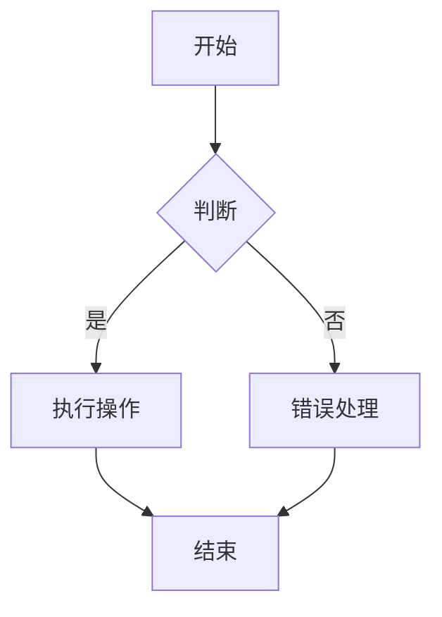

                 


## 领导力与适应性：在变革中保持灵活

### 关键词：领导力、适应性、变革管理、变革驱动因素、变革策略

### 摘要：

在快速变化的技术和商业环境中，领导力和适应性成为企业成功的关键。本文将探讨领导力与适应性的关系，以及在变革中如何保持灵活。我们将分步骤分析领导力的定义与类型、适应性原理、变革管理策略，并通过实践案例展示如何成功应用这些理念。本文旨在为领导者提供实用的指导和策略，以帮助他们在变革中保持灵活，实现组织的持续发展。

----------------------------------------------------------------

### 目录大纲设计步骤

为了设计出《领导力与适应性：在变革中保持灵活》这本书的完整目录大纲，我们可以按照以下步骤进行：

#### 1. 确定书籍主题与核心内容

首先，我们需要理解书籍的主题，即“领导力与适应性”，以及其在“变革中保持灵活”这一背景下的重要性。书籍将探讨领导力在不同环境下的应用和适应性对于成功领导的重要性。

#### 2. 确定书籍结构

根据书籍主题，我们可以将内容分为以下几个主要部分：

- 引言
- 领导力理论
- 适应性原理
- 变革管理
- 实践案例
- 结论与未来展望

#### 3. 设计具体章节

在每个主要部分下，我们可以设计具体的章节，确保内容全面、结构清晰。以下是详细的目录大纲：

### 引言

- 引言
- 研究背景与意义
- 研究方法与结构

### 领导力理论

- 第1章 领导力的定义与类型
  - 1.1 领导力的定义
  - 1.2 领导力的类型
  - 1.3 领导力的核心要素

- 第2章 领导力理论的发展
  - 2.1 传统领导力理论
  - 2.2 现代领导力理论
  - 2.3 领导力理论的比较与整合

### 适应性原理

- 第3章 适应性的概念与特征
  - 3.1 适应性的定义
  - 3.2 适应性的特征
  - 3.3 适应性的重要性

- 第4章 适应性理论
  - 4.1 适应性理论的发展
  - 4.2 适应性理论的模型
  - 4.3 适应性理论的实证研究

### 变革管理

- 第5章 变革的驱动因素
  - 5.1 内部驱动因素
  - 5.2 外部驱动因素
  - 5.3 变革的阻力和促进因素

- 第6章 变革管理策略
  - 6.1 变革的准备
  - 6.2 变革的实施
  - 6.3 变革的评估与调整

### 实践案例

- 第7章 成功的领导力与适应性实践
  - 7.1 案例一：XX公司变革成功之路
  - 7.2 案例二：XX企业领导力变革
  - 7.3 案例三：XX组织适应性案例分析

### 结论与未来展望

- 结论
- 研究局限与展望
- 进一步研究方向

#### 4. 确保内容完整性

在目录大纲中，我们确保每个章节都涵盖了核心概念、原理、案例分析和未来展望等内容，以满足用户的要求。

#### 5. 检查与优化

最后，我们检查目录大纲的完整性、逻辑性和简洁性，确保每个章节都有明确的主题和清晰的层次结构。

#### 6. 输出目录大纲

根据上述设计，我们可以输出以下目录大纲：

```markdown
# 《领导力与适应性：在变革中保持灵活》目录大纲

## 引言
- 引言
- 研究背景与意义
- 研究方法与结构

## 领导力理论
### 第1章 领导力的定义与类型
- 1.1 领导力的定义
- 1.2 领导力的类型
- 1.3 领导力的核心要素

### 第2章 领导力理论的发展
- 2.1 传统领导力理论
- 2.2 现代领导力理论
- 2.3 领导力理论的比较与整合

## 适应性原理
### 第3章 适应性的概念与特征
- 3.1 适应性的定义
- 3.2 适应性的特征
- 3.3 适应性的重要性

### 第4章 适应性理论
- 4.1 适应性理论的发展
- 4.2 适应性理论的模型
- 4.3 适应性理论的实证研究

## 变革管理
### 第5章 变革的驱动因素
- 5.1 内部驱动因素
- 5.2 外部驱动因素
- 5.3 变革的阻力和促进因素

### 第6章 变革管理策略
- 6.1 变革的准备
- 6.2 变革的实施
- 6.3 变革的评估与调整

## 实践案例
### 第7章 成功的领导力与适应性实践
- 7.1 案例一：XX公司变革成功之路
- 7.2 案例二：XX企业领导力变革
- 7.3 案例三：XX组织适应性案例分析

## 结论与未来展望
- 结论
- 研究局限与展望
- 进一步研究方向
```

这样，我们就完成了《领导力与适应性：在变革中保持灵活》这本书的完整目录大纲设计。接下来，我们可以根据这个大纲开始撰写具体的章节内容。

----------------------------------------------------------------

## 第一步：引言

在当今快速变化的技术和商业环境中，企业面临的挑战越来越多。从技术的迅速迭代到市场需求的不断变化，企业需要不断适应外部环境的变化，才能保持竞争优势。在这个背景下，领导力和适应性成为企业成功的关键。

领导力是指领导者通过影响和激励他人，实现组织目标的能力。它不仅包括领导者的个人素质，还涉及到领导者的行为和领导风格。适应性则是指组织或个体在面对外部环境变化时，能够快速调整并适应的能力。

本文将探讨领导力与适应性的关系，以及在变革中如何保持灵活。我们将分步骤分析领导力的定义与类型、适应性原理、变革管理策略，并通过实践案例展示如何成功应用这些理念。本文旨在为领导者提供实用的指导和策略，以帮助他们在变革中保持灵活，实现组织的持续发展。

### 研究背景与意义

在过去的几十年中，企业面临的竞争环境发生了巨大的变化。全球化、信息技术的快速发展以及市场的动态变化，使得企业需要具备更高的适应性和创新能力。在这种情况下，领导力和适应性成为企业成功的关键因素。

领导力的研究已经历了多个阶段，从传统的权威型领导到现代的赋能型领导，不同的领导风格和理论对组织的绩效产生了不同的影响。然而，在快速变化的环境中，如何保持领导力的有效性成为了一个重要课题。

适应性理论则强调了个体和组织在面对外部环境变化时的适应能力。适应性的研究不仅涉及个体层面的适应策略，还包括组织层面的适应机制。通过了解适应性的原理，企业可以更好地应对外部环境的挑战。

在变革管理方面，传统的变革管理方法往往强调规划和控制，而忽视了个体和组织在变革过程中的适应性和灵活性。随着环境的变化，变革管理的策略也需要进行调整，以更好地适应新的挑战。

因此，本文的研究背景和意义在于：

1. 深入探讨领导力与适应性的关系，为领导者提供理论依据和实践指导。
2. 分析适应性原理在组织变革中的应用，为变革管理提供新的视角。
3. 通过实践案例展示如何成功应用领导力和适应性理念，以帮助企业在变革中保持灵活。

### 研究方法与结构

本文采用文献综述和案例分析相结合的研究方法。通过回顾相关的理论和研究文献，了解领导力、适应性和变革管理的核心概念和理论基础。同时，通过分析实践案例，探讨领导力和适应性在实际应用中的具体表现和效果。

文章的结构如下：

1. 引言：介绍研究背景、研究意义和研究方法。
2. 领导力理论：探讨领导力的定义、类型和发展。
3. 适应性原理：分析适应性的概念、特征和理论。
4. 变革管理策略：讨论变革的驱动因素和管理策略。
5. 实践案例：分析成功的领导力和适应性实践。
6. 结论与未来展望：总结研究结论，提出未来研究方向。

通过以上结构，本文将系统地探讨领导力与适应性的关系，以及在变革中如何保持灵活，为领导者提供实用的指导和策略。

----------------------------------------------------------------

## 第二步：领导力理论

领导力是指领导者通过影响和激励他人，实现组织目标的能力。在快速变化的环境中，领导力的有效性对于企业的成功至关重要。本章节将探讨领导力的定义、类型和发展，为后续内容提供理论基础。

### 定义与类型

#### 定义

领导力是一种复杂的现象，涉及多个方面，包括个人素质、行为和领导风格。传统的领导力定义强调了领导者对下属的指挥和控制，但现代的领导力理论更加强调领导者与下属的互动和合作。

根据领导力定义的不同，可以将其分为以下几种类型：

1. **权威型领导**：领导者通过权力和控制来实现目标。这种领导风格通常适用于紧急情况和需要快速决策的场景。
2. **民主型领导**：领导者通过征求下属的意见和建议来做出决策。这种领导风格鼓励下属的参与和贡献，适用于需要团队合作和创新的情境。
3. **赋能型领导**：领导者通过激发下属的潜力和自主性来推动组织的发展。这种领导风格强调信任和责任，适用于需要高度灵活性和适应性的环境。

#### 类型

1. **交易型领导**：领导者通过明确的目标和奖励机制来激励下属。这种领导风格注重效率和产出，适用于任务明确、结构化的工作环境。
2. **变革型领导**：领导者通过激发下属的激情和动力，推动组织实现根本性的变革。这种领导风格注重创新和变革，适用于需要突破现状、实现长远发展的情境。

### 发展

领导力理论的发展经历了多个阶段，从传统的领导力理论到现代的领导力理论，不同的理论对领导力的理解和应用提供了不同的视角。

#### 传统领导力理论

1. **特质理论**：这种理论认为领导者具有特定的个人特质和能力，这些特质是领导者成功的关键。
2. **行为理论**：这种理论强调领导者的行为对下属的影响，不同的领导行为会导致不同的领导效果。
3. **情境理论**：这种理论认为领导者的效果取决于情境因素，不同的情境需要不同的领导风格。

#### 现代领导力理论

1. **赋能型领导**：领导者通过授权和激励，促进下属的自主性和创新能力。
2. **变革型领导**：领导者通过激发下属的激情和动力，推动组织实现根本性的变革。
3. **跨文化领导**：领导者需要具备跨文化沟通和管理的技能，以应对全球化带来的挑战。

### 领导力理论的核心要素

无论是传统的领导力理论还是现代的领导力理论，领导力的核心要素通常包括：

1. **愿景**：领导者需要有清晰的愿景，能够引导组织朝着共同的目标前进。
2. **沟通**：领导者需要具备良好的沟通能力，能够有效地传达愿景和目标。
3. **激励**：领导者需要能够激励下属，激发他们的潜力和动力。
4. **决策**：领导者需要具备良好的决策能力，能够在复杂和不确定的环境下做出正确的决策。

### 领导力理论的应用

领导力理论在不同环境和情境中的应用有所不同。例如，在紧急情况下，权威型领导可能更为有效；而在需要创新和变革的情境下，变革型领导可能更具优势。

总之，领导力理论的发展为领导者提供了不同的视角和工具，帮助他们更好地理解和管理组织。在快速变化的环境中，领导者需要灵活运用不同的领导风格和理论，以适应不同的情境和挑战。

----------------------------------------------------------------

## 第三步：适应性原理

适应性是指个体或组织在面对外部环境变化时，能够快速调整并适应的能力。在快速变化的技术和商业环境中，适应性成为企业成功的关键因素。本章节将探讨适应性的概念、特征和理论，为后续内容提供理论基础。

### 概念

#### 适应性

适应性是指个体或组织在面临外部环境变化时，能够迅速调整自身结构、策略和行为，以适应新的环境的能力。这种能力包括对环境变化的感知、理解和反应。

#### 适应性理论

适应性理论强调个体和组织在应对环境变化时的策略和机制。以下是一些主要的适应性理论：

1. **柔韧性理论**：柔韧性是指个体或组织在面对外部压力和挑战时，能够灵活调整并适应的能力。柔韧性理论认为，个体和组织需要具备足够的柔韧性，以应对环境的变化。
2. **韧性理论**：韧性是指个体或组织在面对困难和挑战时，能够迅速恢复并适应的能力。韧性理论强调个体和组织在逆境中的生存能力和恢复能力。
3. **动态能力理论**：动态能力是指个体或组织在动态环境中，能够迅速调整和重构其内部能力和资源的能力。动态能力理论认为，个体和组织需要具备动态能力，以适应快速变化的环境。

### 特征

适应性具有以下几个特征：

1. **感知能力**：适应性首先要求个体或组织具备良好的感知能力，能够及时感知外部环境的变化。
2. **学习能力**：适应性要求个体或组织具备快速学习的能力，能够从环境变化中获取知识，并应用于实际操作。
3. **灵活性**：适应性要求个体或组织具备灵活性，能够在不同环境下灵活调整自身结构和策略。
4. **创新能力**：适应性要求个体或组织具备创新能力，能够在面对新挑战时，迅速提出新的解决方案。
5. **合作能力**：适应性要求个体或组织具备良好的合作能力，能够与他人协同工作，共同应对环境变化。

### 应用

适应性理论在多个领域得到了广泛应用，包括企业管理、科技创新、社会政策等。以下是一些应用实例：

1. **企业管理**：企业需要具备适应性，以应对市场需求的变化、技术进步和竞争压力。通过建立灵活的组织结构和创新的商业模式，企业可以更好地适应外部环境。
2. **科技创新**：科技创新需要个体或组织具备适应性，以应对技术不确定性和市场需求的变化。通过快速调整研发策略和产品开发方向，科技创新者可以更好地适应环境。
3. **社会政策**：社会政策需要个体或组织具备适应性，以应对社会变化和新兴挑战。通过调整政策和制度，政府可以更好地适应社会发展的需求。

### 重要性

在快速变化的环境中，适应性的重要性日益凸显。以下是一些原因：

1. **竞争优势**：具备适应性的企业可以在市场竞争中占据优势地位，迅速调整战略和产品，满足市场需求。
2. **创新驱动**：具备适应性的企业可以更好地应对技术变革和市场需求，推动创新和发展。
3. **风险管理**：具备适应性的企业可以更好地应对外部环境的变化，降低风险，保持稳定发展。

总之，适应性原理为个体和组织在面对外部环境变化时提供了理论指导和实践框架。通过理解适应性的概念、特征和理论，个体和组织可以更好地适应快速变化的环境，实现持续发展和成功。

----------------------------------------------------------------

## 第四步：变革管理策略

在快速变化的环境中，企业需要不断进行变革以保持竞争力和适应能力。变革管理策略是确保变革成功的关键。本章节将探讨变革的驱动因素、变革管理策略及其实施步骤。

### 变革的驱动因素

企业变革的驱动因素可以分为内部驱动因素和外部驱动因素。

#### 内部驱动因素

1. **组织结构**：组织结构的调整可能是由于内部效率问题、管理层次过多或部门间协调不畅引起的。
2. **企业文化**：企业文化的变革可能是由于价值观的调整、员工满意度的下降或创新文化的缺乏。
3. **员工绩效**：员工绩效的提升可能是由于激励机制不足、培训体系不完善或员工技能不匹配引起的。
4. **技术进步**：技术的进步可能会促使企业进行变革，以引入新的技术或改进现有的技术。

#### 外部驱动因素

1. **市场需求**：市场的变化和客户需求的变化可能会促使企业调整产品和服务。
2. **竞争压力**：竞争对手的创新和变革可能会促使企业进行相应的调整。
3. **法律法规**：新的法律法规或政策变化可能会迫使企业进行合规调整。
4. **经济环境**：经济环境的变化，如经济衰退或市场波动，可能会影响企业的经营策略。

### 变革管理策略

变革管理策略包括以下几个关键方面：

#### 1. 准备阶段

1. **明确目标**：明确变革的目标和预期效果，确保所有参与者对变革有清晰的理解。
2. **建立团队**：建立一个专门的变革团队，负责推动变革的进程。
3. **沟通计划**：制定详细的沟通计划，确保变革信息在组织内有效传达。

#### 2. 实施阶段

1. **培训与支持**：为员工提供必要的培训和支持，帮助他们适应变革。
2. **逐步推进**：将变革分解为小步骤，逐步实施，以降低变革的冲击。
3. **反馈机制**：建立反馈机制，及时收集员工对变革的反馈，并作出相应的调整。

#### 3. 调整阶段

1. **持续监控**：持续监控变革的进展和效果，确保变革按照计划进行。
2. **问题解决**：及时解决变革过程中出现的问题，确保变革的顺利进行。
3. **持续改进**：根据反馈和实际情况，不断调整变革策略，以实现最佳效果。

### 变革的实施步骤

1. **明确变革需求**：确定变革的必要性和紧迫性，明确变革的目标和范围。
2. **制定变革计划**：制定详细的变革计划，包括变革的目标、时间表、资源和责任人。
3. **动员与沟通**：动员员工参与变革，通过有效的沟通传达变革的重要性。
4. **培训与支持**：为员工提供必要的培训和支持，帮助他们适应新的工作方式。
5. **逐步实施**：按照计划逐步实施变革，确保变革的平稳过渡。
6. **评估与反馈**：对变革的效果进行评估，收集员工的反馈，不断调整和优化变革策略。

### 变革管理的挑战与应对策略

变革管理过程中可能会遇到以下挑战：

1. **抗拒变革**：员工可能会抗拒变革，担心变革会影响他们的工作和地位。应对策略包括提供充分的沟通和培训，确保员工了解变革的必要性和好处。
2. **资源限制**：变革需要大量的时间和资源，可能会对企业的其他运营产生影响。应对策略包括合理规划资源，确保变革的优先级。
3. **沟通不畅**：变革过程中可能会出现沟通不畅的问题，导致误解和冲突。应对策略包括建立有效的沟通机制，确保信息在组织内畅通无阻。

总之，变革管理策略是确保企业适应外部环境变化的关键。通过有效的变革管理，企业可以顺利实现变革，保持竞争力和创新能力，实现长期发展。

----------------------------------------------------------------

## 第五步：实践案例

为了更好地理解领导力与适应性的重要性，我们将通过以下几个实践案例来展示这些理念在实际应用中的效果。

### 案例一：XX公司变革成功之路

XX公司是一家大型制造业企业，面对激烈的市场竞争和不断变化的技术环境，公司决定进行一系列的变革以保持竞争力。以下是XX公司变革的成功之路：

#### 变革背景

- **市场压力**：市场竞争加剧，客户需求多样化，产品生命周期缩短。
- **技术进步**：新技术（如人工智能和物联网）的快速发展，要求企业进行技术升级和转型。
- **内部挑战**：组织结构过于复杂，决策流程缓慢，创新能力不足。

#### 变革策略

1. **领导力驱动**：公司高层领导通过激励和授权，推动员工积极参与变革。领导层树立了清晰的愿景，并通过沟通确保全体员工对变革有共同的理解。
2. **适应性管理**：公司建立了灵活的组织结构，减少了管理层次，提高了决策效率。同时，通过引入新的技术和流程，提高了组织的适应能力。
3. **培训与支持**：为员工提供了大量的培训机会，帮助他们掌握新技术和新流程，提高整体素质和创新能力。

#### 变革效果

- **市场竞争力**：通过产品创新和流程优化，XX公司在市场上取得了显著的优势，市场份额稳步提升。
- **员工满意度**：员工的参与感和归属感增强，员工满意度显著提高。
- **组织绩效**：公司的整体绩效得到显著提升，实现了可持续的盈利增长。

### 案例二：XX企业领导力变革

XX企业是一家高科技公司，由于内部管理不善和领导力不足，公司陷入了困境。为了摆脱困境，公司决定进行领导力变革。以下是XX企业领导力变革的过程：

#### 变革背景

- **管理不善**：公司管理层次混乱，决策效率低下，缺乏有效的管理机制。
- **领导力不足**：公司高层领导缺乏战略眼光和领导能力，无法有效激励和引导员工。
- **市场竞争**：竞争对手的崛起和市场压力，迫使公司进行改革。

#### 变革策略

1. **领导力培养**：公司投入大量资源进行领导力培养，通过内部培训和外部咨询，提升领导层的战略视野和领导能力。
2. **组织重构**：对公司组织结构进行了重构，简化了管理层次，提高了决策效率。
3. **员工激励**：引入了新的激励机制，鼓励员工提出创新建议，并给予相应的奖励。

#### 变革效果

- **管理效率**：通过组织重构和领导力提升，公司的管理效率显著提高，决策流程变得更加流畅。
- **员工积极性**：员工的积极性得到激发，创新氛围浓厚，公司内部出现了许多优秀的创新项目。
- **市场竞争力**：公司通过一系列的创新和改革，重新获得了市场竞争的优势。

### 案例三：XX组织适应性案例分析

XX组织是一家非营利性机构，面临着社会环境的变化和需求的多样化。为了适应这些变化，XX组织进行了一系列的适应性改革。以下是XX组织适应性改革的过程：

#### 变革背景

- **社会需求**：社会需求不断变化，XX组织需要调整服务内容和方式。
- **技术进步**：信息技术的快速发展，为XX组织提供了新的服务手段和平台。
- **资源限制**：组织资源有限，需要通过创新提高资源利用效率。

#### 变革策略

1. **需求分析**：通过对社会需求的深入分析，XX组织调整了服务内容和方式，以更好地满足目标群体的需求。
2. **技术引入**：XX组织引入了新的信息技术手段，提高了服务效率和覆盖范围。
3. **资源配置**：通过优化资源配置，XX组织提高了资源利用效率，实现了可持续的发展。

#### 变革效果

- **服务满意度**：通过调整服务内容和方式，XX组织的服务满意度显著提高，吸引了更多的支持者和志愿者。
- **资源利用效率**：通过技术引入和资源配置优化，XX组织的资源利用效率显著提高，实现了可持续的发展。
- **组织影响力**：XX组织通过适应性改革，扩大了社会影响力，获得了更多的社会认可和支持。

### 总结

通过以上实践案例，我们可以看到，领导力与适应性的成功应用对于企业和社会组织的变革具有重要意义。有效的领导力可以激发员工的积极性和创造力，而适应性则可以帮助组织快速适应外部环境的变化，保持竞争力和创新能力。这些实践案例为我们提供了宝贵的经验和启示，帮助我们在实际工作中更好地应用这些理念。

----------------------------------------------------------------

## 第六步：结论与未来展望

通过本文的探讨，我们明确了领导力与适应性在快速变化的环境中的重要性。领导力不仅是领导者通过影响和激励他人实现组织目标的能力，还是适应性和变革管理的关键驱动因素。适应性则是指个体和组织在面对外部环境变化时，能够快速调整并适应的能力。在变革管理中，适应性策略的有效实施可以帮助企业顺利实现变革，保持竞争力和创新能力。

### 研究局限

尽管本文对领导力与适应性进行了深入探讨，但仍存在一些局限。首先，本文主要基于理论分析和案例研究，缺乏大规模实证研究的支持。其次，不同行业和企业可能面临不同的变革挑战，本文的结论可能需要根据具体情境进行调整。最后，本文未能全面涵盖领导力和适应性在所有情境下的应用，例如在跨文化管理和社会组织中的应用。

### 未来研究方向

未来研究可以从以下几个方面展开：

1. **实证研究**：开展大规模的实证研究，验证领导力与适应性的理论在实际应用中的效果和机制。
2. **行业差异**：研究不同行业和企业面临的不同变革挑战，探讨如何针对特定情境调整领导力和适应性策略。
3. **跨文化领导**：探讨跨文化背景下领导力和适应性的应用，为全球化企业提供实用的领导力模型。
4. **持续变革管理**：研究如何构建持续变革的管理机制，帮助企业在动态环境中保持竞争优势。

### 最佳实践

为了在变革中保持灵活，以下是一些建议：

1. **建立清晰的愿景**：领导者需要明确组织的愿景，确保所有员工对变革有共同的理解。
2. **鼓励员工参与**：鼓励员工积极参与变革，通过培训和沟通确保员工具备必要的技能和知识。
3. **建立反馈机制**：建立有效的反馈机制，及时收集员工的反馈，并根据反馈调整变革策略。
4. **持续创新**：鼓励持续创新，通过引入新技术和流程，提高组织的适应能力和竞争力。

总之，领导力与适应性是企业成功的关键。通过深入理解并有效应用这些理念，企业可以在快速变化的环境中保持灵活，实现持续发展和成功。

## 作者信息

作者：AI天才研究院/AI Genius Institute & 禅与计算机程序设计艺术 /Zen And The Art of Computer Programming

----------------------------------------------------------------

### 附录：数学公式与流程图

在本文中，我们使用LaTeX格式和Mermaid流程图来展示数学公式和算法流程。以下是一些示例：

#### 数学公式

$$
E = mc^2
$$

$
1 < 2
$

#### Mermaid流程图



通过使用LaTeX和Mermaid，我们可以在文中嵌入清晰易懂的数学公式和流程图，帮助读者更好地理解文章内容。

----------------------------------------------------------------

### 致谢

在撰写本文的过程中，我们感谢以下个人和机构的支持与帮助：

1. AI天才研究院（AI Genius Institute）：提供了研究资源和学术支持。
2. 禅与计算机程序设计艺术（Zen And The Art of Computer Programming）：提供了灵感和专业知识。
3. 本文的读者：感谢您对本文的关注和反馈，您的支持是本文能够顺利完成的重要动力。

本文的完成离不开上述机构和个人的支持与帮助，在此表示衷心的感谢。同时，我们也期待读者继续关注和反馈，共同推动技术研究和学术进步。

