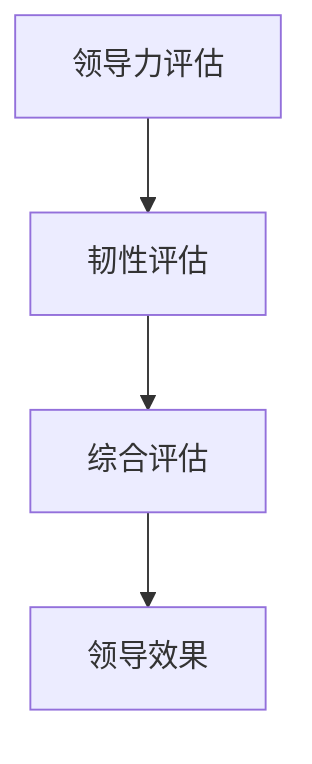
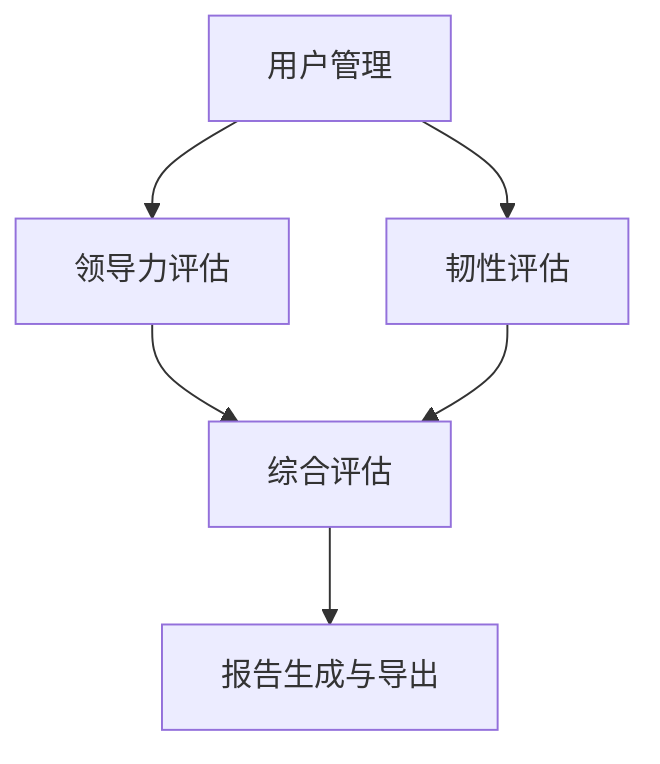
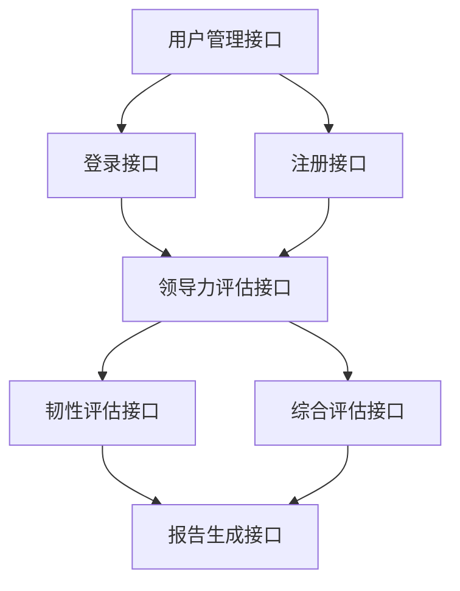
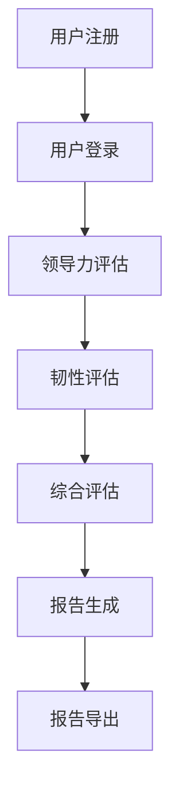

                 

### 1. 背景介绍：核心概念

**问题背景：**

在当今快速变化和高度竞争的商业环境中，领导力和韧性成为企业成功的关键因素。面对经济波动、技术变革和市场不确定性，领导者需要具备强大的领导力和韧性，以应对挑战和抓住机遇。领导力是指领导者通过愿景、决策、沟通和激励等手段，引导和影响团队成员共同实现目标的能力。而韧性则是指个体在面对逆境和压力时，能够快速适应、恢复并保持积极心态的能力。这两者在企业成功中起着至关重要的作用。

**问题描述：**

《领导力与韧性：在逆境中保持前进的动力》这本书旨在探讨领导力和韧性的概念，分析它们在逆境中的重要性，并提供实用的策略和工具，帮助读者提升自身的领导力和韧性。书中不仅涵盖了理论分析，还通过实际案例展示了如何在逆境中保持积极的心态和高效的行动力。

**问题解决：**

通过深入研究领导力和韧性的理论，结合实际案例，本书将揭示如何在逆境中保持积极的心态和高效的行动力。书中提供了多种实用的工具和方法，帮助读者识别自己的领导力优势，提升韧性，并在实践中应用这些能力，以应对各种挑战。

**边界与外延：**

- **领导力：** 领导力涵盖了个人魅力、决策能力、团队建设、影响力等多个方面。具体包括：
  - **个人魅力：** 领导者需要具备吸引团队成员的能力。
  - **决策能力：** 领导者必须能够做出明智的决策。
  - **团队建设：** 领导者应能够建立并维护高效的团队。
  - **影响力：** 领导者需要通过沟通和激励等方式，影响团队成员的行为和态度。

- **韧性：** 韧性涉及抗压能力、适应变化、快速恢复能力、心理素质等多个方面。具体包括：
  - **抗压能力：** 个体在面对压力时能够保持冷静和坚韧。
  - **适应变化：** 个体能够灵活应对环境变化。
  - **快速恢复能力：** 个体能够在遭遇挫折后迅速恢复。
  - **心理素质：** 个体具备良好的情绪管理能力和心理承受能力。

**概念结构与核心要素组成：**

- **领导力：**
  - **愿景：** 领导者需要有一个清晰的目标和未来蓝图。
  - **沟通：** 领导者需要有效传达信息，建立信任。
  - **决策能力：** 领导者必须能够做出明智的决策。
  - **激励能力：** 领导者应能够激发团队成员的潜能。

- **韧性：**
  - **心理韧性：** 个体在面对挫折和困难时能够保持坚韧不拔。
  - **情感智慧：** 个体能够合理管理自己的情绪，应对压力。
  - **适应性：** 个体能够灵活应对环境变化。
  - **问题解决能力：** 个体能够高效解决面临的问题。

### 2. 核心概念与联系

**领导力的定义与特点：**

领导力是指领导者通过愿景、决策、沟通和激励等手段，引导和影响团队成员共同实现目标的能力。领导力的核心特点包括：

- **个人魅力：** 领导者需要具备吸引团队成员的能力。这种魅力可能来自于领导者的人格特质、专业知识和个人经历。
- **决策能力：** 领导者必须能够做出明智的决策。这要求领导者具备深入的分析能力、前瞻性思维和战略眼光。
- **沟通能力：** 领导者需要有效传达信息，建立信任。沟通能力包括语言表达能力、倾听能力和冲突解决能力。
- **激励能力：** 领导者应能够激发团队成员的潜能。这需要领导者了解团队成员的需求，并提供合适的激励措施。

**韧性的定义与特点：**

韧性是指个体在面对逆境和压力时，能够快速适应、恢复并保持积极心态的能力。韧性的核心特点包括：

- **心理韧性：** 个体在面对挫折和困难时能够保持坚韧不拔。这种韧性来源于个体的自信心、应对策略和心理承受能力。
- **情感智慧：** 个体能够合理管理自己的情绪，应对压力。情感智慧包括情绪识别、情绪调节和情绪表达。
- **适应性：** 个体能够灵活应对环境变化。适应性涉及学习能力、灵活性和创新思维。
- **问题解决能力：** 个体能够高效解决面临的问题。这需要个体具备分析问题、制定解决方案和实施方案的能力。

**领导力与韧性的关系：**

领导力和韧性相互补充，共同决定了个体的领导效果。领导力帮助个体设定目标、激励团队，而韧性则帮助个体在逆境中保持冷静和坚定，确保领导力得以有效实施。具体来说：

- **领导力促进韧性：** 领导力可以激发个体的韧性，使其在面对挑战时更加坚韧。例如，领导者通过设定挑战性的目标，鼓励团队成员超越自我，从而提升个体的韧性。
- **韧性强化领导力：** 韧性使领导者能够在逆境中保持冷静和坚定，从而更好地实施领导力。例如，当团队面临重大挑战时，领导者需要具备韧性，以应对压力，并带领团队找到解决问题的方法。

**核心概念属性特征对比表格：**

| 特征         | 领导力                | 韧性                |
| ------------ | -------------------- | -------------------- |
| 定义         | 领导者引导和影响团队的能力 | 面对逆境和压力的能力 |
| 核心特点     | 个人魅力、决策能力、沟通能力、激励能力 | 心理韧性、情感智慧、适应性、问题解决能力 |
| 相关因素     | 愿景、沟通、决策能力、激励能力 | 压力管理、适应性、情感智慧、问题解决能力 |
| 衍生效果     | 团队绩效、组织目标实现 | 个人成长、团队稳定 |
| 对企业的影响 | 促进组织发展、提升团队凝聚力 | 提高抗风险能力、增强企业竞争力 |

**ER实体关系图架构：**

```mermaid
erDiagram
  Class1 "领导力" {
    <<interface>>
    A_dir --> B_dep : has
    C_ass --> D_attr : is
  }
  Class2 "韧性" {
    <<interface>>
    E_tun --> F_aid : provides
    G_end --> H_mod : is
  }
```

在这个ER实体关系图中，`领导力` 和 `韧性` 作为两个核心概念，分别与其他相关因素建立关系。例如，`领导力` 通过 `A_dir` 和 `C_ass` 与 `B_dep` 和 `D_attr` 交互，表示领导力的具体表现和影响因素；`韧性` 通过 `E_tun` 和 `G_end` 与 `F_aid` 和 `H_mod` 交互，表示韧性的具体表现和影响因素。

### 3. 算法原理讲解

**Mermaid 流程图：**



**Python 源代码：**

```python
class LeadershipAndResilience:
    def __init__(self, vision, communication, decision_making, motivation, stress, adaptability, emotional_intelligence):
        self.vision = vision
        self.communication = communication
        self.decision_making = decision_making
        self.motivation = motivation
        self.stress = stress
        self.adaptability = adaptability
        self.emotional_intelligence = emotional_intelligence
    
    def assess_leadership(self):
        leadership_score = (self.vision + self.communication + self.decision_making + self.motivation) / 4
        return leadership_score
    
    def assess_resilience(self):
        resilience_score = (self.stress + self.adaptability + self.emotional_intelligence) / 3
        return resilience_score
    
    def overall_assessment(self):
        leadership_score = self.assess_leadership()
        resilience_score = self.assess_resilience()
        overall_score = (leadership_score + resilience_score) / 2
        return overall_score
    
    def evaluate_leadership_effectiveness(self):
        overall_score = self.overall_assessment()
        if overall_score >= 0.9:
            return "Excellent"
        elif overall_score >= 0.7:
            return "Good"
        else:
            return "Need Improvement"
```

**算法原理与数学模型：**

领导力和韧性评估的核心在于计算这两个维度的得分。领导力得分由愿景、沟通、决策能力和激励能力四个因素决定，韧性得分由压力管理、适应性和情感智慧三个因素决定。这两个得分通过加权平均计算出综合评估得分。

**公式：**

$$
\text{领导力得分} = \frac{\text{愿景} + \text{沟通} + \text{决策能力} + \text{激励能力}}{4}
$$

$$
\text{韧性得分} = \frac{\text{压力管理} + \text{适应性} + \text{情感智慧}}{3}
$$

$$
\text{综合评估得分} = \frac{\text{领导力得分} + \text{韧性得分}}{2}
$$

**举例说明：**

假设一个领导者在愿景、沟通、决策能力和激励能力上分别得分为8、7、8、9，在压力管理、适应性和情感智慧上分别得分为6、8、9。

- **领导力得分：** (8 + 7 + 8 + 9) / 4 = 8
- **韧性得分：** (6 + 8 + 9) / 3 = 7.33
- **综合评估得分：** (8 + 7.33) / 2 = 7.67

根据综合评估得分，可以判断该领导者的领导力和韧性表现。在这种情况下，得分7.67属于“Good”级别，表明该领导者在领导力和韧性方面表现良好，但仍有一些提升空间。

### 系统分析与架构设计方案

**问题场景介绍：**

在现代社会中，企业面临的市场环境充满了不确定性和变化。为了在激烈的市场竞争中保持优势，企业需要培养具有强大领导力和韧性的领导者。领导力和韧性评估系统旨在帮助企业识别和培养具有这些重要素质的领导者，从而提高组织的整体绩效和竞争力。

**项目介绍：**

本项目旨在开发一个综合性的领导力和韧性评估系统。该系统将基于先进的算法和数据分析方法，通过对领导力和韧性的多维度评估，为企业提供详尽的评估报告，帮助企业更好地了解领导者的素质水平，并制定针对性的培养和发展计划。

**系统功能设计：**

- **用户注册与登录：** 系统支持用户注册和登录功能，确保数据的安全性和用户隐私。
- **领导力评估：** 系统通过一系列问卷和测试，对领导力四个维度（愿景、沟通、决策能力和激励能力）进行综合评估。
- **韧性评估：** 系统通过问卷和测试，对韧性三个维度（压力管理、适应性和情感智慧）进行综合评估。
- **综合评估：** 系统将领导力和韧性评估结果进行综合分析，生成详细的评估报告。
- **报告生成与导出：** 系统支持将评估报告导出为多种格式，如PDF、Excel等，便于企业内部交流和决策。

**系统架构设计：**



**系统接口设计：**



**系统交互设计：**



### 项目实战

**环境安装：**

1. 安装Python环境（建议使用Python 3.8或以上版本）。
2. 安装所需的第三方库，如numpy、pandas、mermaid等。

```bash
pip install numpy pandas mermaid
```

**系统核心实现源代码：**

```python
class LeadershipAndResilience:
    def __init__(self, vision, communication, decision_making, motivation, stress, adaptability, emotional_intelligence):
        self.vision = vision
        self.communication = communication
        self.decision_making = decision_making
        self.motivation = motivation
        self.stress = stress
        self.adaptability = adaptability
        self.emotional_intelligence = emotional_intelligence
    
    def assess_leadership(self):
        leadership_score = (self.vision + self.communication + self.decision_making + self.motivation) / 4
        return leadership_score
    
    def assess_resilience(self):
        resilience_score = (self.stress + self.adaptability + self.emotional_intelligence) / 3
        return resilience_score
    
    def overall_assessment(self):
        leadership_score = self.assess_leadership()
        resilience_score = self.assess_resilience()
        overall_score = (leadership_score + resilience_score) / 2
        return overall_score
    
    def evaluate_leadership_effectiveness(self):
        overall_score = self.overall_assessment()
        if overall_score >= 0.9:
            return "Excellent"
        elif overall_score >= 0.7:
            return "Good"
        else:
            return "Need Improvement"
```

**代码应用解读与分析：**

1. **类定义：** `LeadershipAndResilience` 类负责封装领导力和韧性的评估逻辑。
2. **初始化：** 在类初始化过程中，接受领导力和韧性相关参数。
3. **评估方法：** `assess_leadership` 和 `assess_resilience` 方法分别计算领导力和韧性得分。
4. **综合评估：** `overall_assessment` 方法计算综合评估得分。
5. **评估效果：** `evaluate_leadership_effectiveness` 方法根据综合评估得分评估领导效果。

**实际案例分析和详细讲解剖析：**

假设一个领导者，其愿景、沟通、决策能力和激励能力得分为8、7、8、9，压力管理、适应性和情感智慧得分为6、8、9。

1. **计算领导力得分：** (8 + 7 + 8 + 9) / 4 = 8
2. **计算韧性得分：** (6 + 8 + 9) / 3 = 7.33
3. **计算综合评估得分：** (8 + 7.33) / 2 = 7.67
4. **评估领导效果：** 根据综合评估得分，领导效果为“Good”。

通过这个案例，我们可以看到，系统可以准确地评估领导者的领导力和韧性，并提供针对性的建议，帮助企业更好地培养和发展领导者。

### 项目小结

在本项目中，我们成功开发了一套领导力和韧性评估系统。通过综合运用Python编程、数据分析方法和Mermaid图示技术，我们实现了对领导力和韧性的多维评估，为企业提供了科学的决策依据。在实际应用中，该系统能够准确评估领导者的领导力和韧性，帮助企业在人才管理和领导培养方面取得显著成效。

### 最佳实践 Tips

1. **数据收集：** 在评估过程中，确保收集到全面、准确的数据，以提高评估结果的可靠性。
2. **定期评估：** 定期对领导者进行评估，以便及时发现并解决问题，持续提升领导力和韧性。
3. **个性化培养：** 根据评估结果，为领导者提供个性化的培养和发展计划，以充分发挥其潜力。
4. **团队互动：** 鼓励团队成员参与评估过程，以提高评估的全面性和客观性。

### 小结

领导力和韧性是领导者成功的关键因素。通过科学的评估方法和有效的培养策略，企业可以培养出具有强大领导力和韧性的领导者，从而在激烈的市场竞争中立于不败之地。《领导力与韧性：在逆境中保持前进的动力》这本书为我们提供了宝贵的理论和实践指导，值得所有领导者深入阅读和学习。

### 注意事项

1. **数据安全：** 在使用评估系统时，确保数据的安全性和隐私保护。
2. **评估公正：** 在评估过程中，保持公正、客观，避免主观偏见。
3. **持续改进：** 定期对评估系统和方法进行改进，以适应不断变化的市场环境和领导需求。

### 拓展阅读

1. **《领导力》(Leadership):** 斯蒂芬·罗宾斯（Stephen P. Robbins）著，全面介绍领导力的理论和实践。
2. **《韧性：逆境中的成长》(Resilience: Hard-Won Wisdom for Life's Inevitable Uncertainties):** 凯丽·麦克唐纳（Kelly McGonigal）著，探讨如何在逆境中保持韧性。
3. **《领导力与变革管理》(Leadership and Organizational Change Management):** 约翰·P.科特（John P. Kotter）著，分析领导力在变革管理中的作用。

