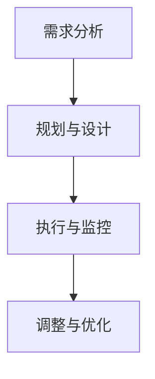
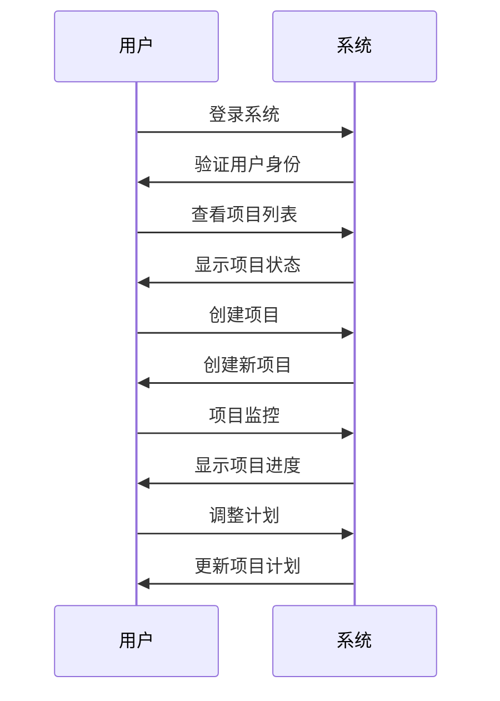

                 


### 第一部分：背景介绍与核心概念

#### 问题背景
在当今快速变化的工作环境中，项目成功推进和团队高效完成任务成为企业和组织的重要挑战。领导力在这一过程中扮演着至关重要的角色。有效的领导力不仅能激发团队成员的潜力，还能确保项目目标得到高效实现。

#### 问题描述
《领导力与项目推进：高效完成团队任务的方法》旨在探讨如何通过领导力策略和项目管理的最佳实践，提高团队完成任务的能力。本书的核心问题是：在复杂多变的工作环境中，领导者如何通过策略和技巧来推动项目成功？

#### 问题解决
本书提出了一套系统的领导力和项目管理方法论，通过以下几个关键步骤来解决上述问题：
1. **理解领导力的核心要素**：介绍领导力的基础概念，包括影响力、激励、团队建设等。
2. **项目管理基础知识**：讲解项目管理的核心原则，如范围管理、时间管理、成本管理等。
3. **策略制定与执行**：阐述如何根据项目需求和环境制定合适的策略，并有效执行。
4. **沟通与协调**：讨论领导者如何建立有效的沟通机制，确保团队成员之间信息流畅。
5. **团队管理与激励**：提供团队管理的技巧，包括团队建设、冲突解决、激励策略等。
6. **风险管理与应对**：介绍如何识别和管理项目风险，确保项目顺利进行。

#### 边界与外延
本部分的边界在于本书所探讨的领导力和项目管理的具体方法和实践，而其外延则涉及到更广泛的管理学、心理学和社会学领域。

#### 概念结构与核心要素组成
- **领导力**：包括个人影响力、激励能力、团队建设等。
- **项目管理**：包括项目范围、时间、成本、质量、沟通、风险等方面。
- **策略制定**：根据项目目标和环境制定相应策略。
- **执行与监控**：确保策略的有效实施和项目进展的跟踪。
- **团队管理**：涵盖团队建设、激励、冲突解决等。

## 第二部分：核心概念与联系

### 2.1 领导力核心概念

#### 2.1.1 领导力的定义
领导力是一种能力，它涉及激励、影响、指导和塑造他人，以实现共同目标。它不仅仅是职位权力的表现，更是通过影响力来引导团队的过程。

#### 2.1.2 领导力的核心要素
- **个人影响力**：领导者如何通过个人特质和行动来影响他人。
- **激励能力**：领导者如何激发团队成员的动力和潜能。
- **团队建设**：领导者如何构建一个有凝聚力和高效能的团队。

### 2.1.3 领导力的属性特征对比

| 属性特征         | 传统领导力                     | 现代领导力                     |
|------------------|--------------------------------|--------------------------------|
| 权力来源         | 职位和权威                     | 影响力和信任                   |
| 关注重点         | 任务完成和个人成功             | 团队成员成长和项目成功         |
| 领导风格         | 自上而下指令性                 | 自下而上参与性                 |
| 沟通方式         | 命令式和单向沟通               | 协作式和双向沟通               |

### 2.1.4 领导力与其他管理职能的关系

领导力与其他管理职能（如项目管理、团队管理）紧密相关，但它更注重影响和激励，而项目管理更侧重于具体任务的规划和执行。领导力是推动团队前进的核心动力，而项目管理是确保项目目标达成的具体实践。

## 第三部分：算法原理讲解

### 3.1 项目推进算法的基本原理

项目推进算法是确保项目按计划进行的重要工具。其核心原理是基于以下步骤：

1. **需求分析**：明确项目目标和需求，确定项目的范围和可行性。
2. **规划与设计**：制定详细的项目计划，包括时间表、资源分配、风险评估等。
3. **执行与监控**：根据项目计划执行任务，并持续监控项目进展，确保项目按计划进行。
4. **调整与优化**：在项目执行过程中，根据实际情况调整计划，优化资源分配，以应对风险和变化。

### 3.2 算法mermaid流程图

以下是一个简单的项目推进算法的mermaid流程图：



### 3.3 Python源代码实现

为了更详细地解释项目推进算法的原理，我们可以使用Python编写一个简单的实现。以下是一个基本的Python脚本，用于模拟项目推进算法的流程。

```python
import time

# 需求分析
def requirement_analysis():
    print("需求分析中...")
    time.sleep(2)
    print("需求分析完成。")

# 规划与设计
def planning_design():
    print("规划与设计中...")
    time.sleep(2)
    print("规划与设计完成。")

# 执行与监控
def execution_monitoring():
    print("执行与监控中...")
    time.sleep(2)
    print("执行与监控完成。")

# 调整与优化
def adjust_optimize():
    print("调整与优化中...")
    time.sleep(2)
    print("调整与优化完成。")

# 主流程
def project推进流程():
    requirement_analysis()
    planning_design()
    execution_monitoring()
    adjust_optimize()

# 运行项目推进流程
project推进流程()
```

#### 算法原理讲解

- **需求分析**：在这一阶段，我们需要明确项目的目标和需求，并评估项目的可行性。这包括确定项目范围、目标、资源需求等。

- **规划与设计**：根据需求分析的结果，制定详细的项目计划，包括时间表、任务分配、资源分配、风险评估等。这一阶段是项目成功的关键，因为一个合理的计划可以为后续的执行提供明确的指导。

- **执行与监控**：按照制定的计划，执行项目任务，并持续监控项目进展。监控的目的是确保项目按计划进行，及时发现并解决问题。

- **调整与优化**：在项目执行过程中，可能会出现各种意外情况，需要根据实际情况调整计划和资源分配，以应对变化。调整与优化的目的是确保项目能够顺利完成。

#### 数学模型和公式

在项目推进算法中，我们可以使用一些数学模型和公式来评估项目的进展和风险。以下是一个简单的数学模型：

- **任务完成度**：$\text{完成任务度} = \frac{\text{已完成的任务数}}{\text{总任务数}}$
- **项目进度**：$\text{项目进度} = \text{完成任务度} \times \text{计划时间}$
- **项目风险**：$\text{项目风险} = \text{意外事件数} \times \text{意外事件概率}$

#### 举例说明

假设我们有一个项目，包含10个任务，计划在30天内完成。每天我们都会监控任务的完成情况，并根据实际情况进行调整。

- **第一天**：完成了2个任务，任务完成度为20%，项目进度为6天。
- **第三天**：由于意外情况，有1个任务推迟，任务完成度降低到18%，项目进度调整为7.5天。

通过这样的监控和调整，我们可以确保项目在预期的范围内顺利完成。

## 第四部分：系统分析与架构设计方案

### 4.1 问题场景介绍

在当前的企业和项目管理环境中，面对复杂多变的市场需求和技术变革，如何高效推进项目成为企业和团队管理者面临的重要挑战。传统的项目管理方法往往在应对快速变化时显得力不从心，导致项目延期、成本超支、质量下降等问题。为了解决这些问题，我们需要引入更加灵活和高效的系统分析与架构设计方案。

### 4.2 项目介绍

本项目旨在开发一套基于人工智能和大数据分析的项目管理系统，通过智能化手段提高项目的推进效率和质量。系统将涵盖从项目需求分析、规划与设计、执行与监控到调整与优化的全过程，旨在为团队提供全方位的支持。

### 4.3 系统功能设计

#### 4.3.1 需求分析模块
- **功能描述**：收集和整理项目需求，包括项目目标、范围、资源需求等。
- **功能实现**：通过用户调研、需求问卷等方式收集需求，使用需求分析工具进行整理和分析。

#### 4.3.2 规划与设计模块
- **功能描述**：制定详细的项目计划，包括时间表、任务分配、资源分配等。
- **功能实现**：基于人工智能算法生成最优计划，并支持手动调整。

#### 4.3.3 执行与监控模块
- **功能描述**：根据项目计划执行任务，并持续监控项目进展。
- **功能实现**：集成实时进度监控、异常报警、任务调度等功能。

#### 4.3.4 调整与优化模块
- **功能描述**：在项目执行过程中根据实际情况进行调整和优化。
- **功能实现**：基于数据分析结果提供调整建议，支持自动化调整和手动调整。

### 4.4 系统架构设计

#### 4.4.1 架构概述
系统采用微服务架构，将不同的功能模块拆分为独立的服务，以提高系统的灵活性和可扩展性。整体架构分为数据层、业务层、表现层和用户层。

#### 4.4.2 数据层
- **功能描述**：存储和管理项目数据，包括需求、计划、监控数据等。
- **技术选型**：使用关系数据库（如MySQL）和非关系数据库（如MongoDB）。

#### 4.4.3 业务层
- **功能描述**：处理业务逻辑，包括需求分析、规划与设计、执行与监控、调整与优化等。
- **技术选型**：使用Spring Boot框架实现业务逻辑。

#### 4.4.4 表现层
- **功能描述**：提供用户界面，供用户进行操作和数据查看。
- **技术选型**：使用Vue.js实现前端界面。

#### 4.4.5 用户层
- **功能描述**：用户登录、权限管理、用户交互等。
- **技术选型**：使用Spring Security进行用户认证和权限管理。

### 4.5 系统接口设计

系统提供了一系列API接口，用于不同模块之间的通信和数据交换。

#### 4.5.1 接口列表
- `/api/requirement`：需求相关接口，包括需求收集、需求分析等。
- `/api/planning`：规划相关接口，包括规划生成、任务分配等。
- `/api/execution`：执行与监控相关接口，包括任务状态监控、异常报警等。
- `/api/adjustment`：调整与优化相关接口，包括数据分析、调整建议生成等。

#### 4.5.2 接口规范
- **请求方式**：GET、POST、PUT、DELETE
- **请求参数**：根据接口功能提供相应参数，如需求ID、任务ID等。
- **响应结果**：按照RESTful API规范，提供JSON格式的响应结果。

### 4.6 系统交互设计

#### 4.6.1 用户交互流程
1. **登录系统**：用户输入用户名和密码，通过Spring Security进行认证。
2. **查看项目列表**：用户可以查看所有项目的状态和进展。
3. **创建项目**：用户可以创建新的项目，填写项目需求和计划。
4. **项目监控**：用户可以实时查看项目进度，并收到异常报警。
5. **调整计划**：用户可以根据数据分析结果调整项目计划。

#### 4.6.2 系统交互mermaid序列图



通过以上系统分析与架构设计方案，我们可以为企业和团队提供一套高效、智能的项目管理系统，帮助他们在复杂多变的环境中高效推进项目。

### 第五部分：项目实战

#### 环境安装

在进行项目实战之前，我们需要搭建一个适合开发、测试和部署的环境。以下是安装步骤：

1. **安装Python**：确保已安装Python 3.8及以上版本。
2. **安装虚拟环境**：使用`pip`安装`virtualenv`，并创建一个虚拟环境。
   ```bash
   pip install virtualenv
   virtualenv project_env
   ```
3. **激活虚拟环境**：进入虚拟环境。
   ```bash
   source project_env/bin/activate
   ```
4. **安装依赖**：在虚拟环境中安装项目所需依赖。
   ```bash
   pip install -r requirements.txt
   ```

#### 系统核心实现源代码

以下是一个简单的项目推进系统核心实现的示例代码：

```python
# project/__init__.py

from requirement_analysis import RequirementAnalysis
from planning_design import PlanningDesign
from execution_monitoring import ExecutionMonitoring
from adjust_optimize import AdjustOptimize

class ProjectSystem:
    def __init__(self):
        self.requirement_analysis = RequirementAnalysis()
        self.planning_design = PlanningDesign()
        self.execution_monitoring = ExecutionMonitoring()
        self.adjust_optimize = AdjustOptimize()

    def run_project(self):
        self.requirement_analysis.analyze()
        self.planning_design.plan()
        self.execution_monitoring.monitor()
        self.adjust_optimize.optimize()

if __name__ == '__main__':
    project_system = ProjectSystem()
    project_system.run_project()
```

#### 代码应用解读与分析

- **需求分析模块**：`RequirementAnalysis` 类负责收集和整理项目需求。在这个模块中，我们使用一个简单的函数来模拟需求分析的过程。

  ```python
  # requirement_analysis.py

  def analyze():
      print("需求分析中...")
      # 在这里可以添加实际的代码，如用户调研、需求收集等。
      print("需求分析完成。")
  ```

- **规划与设计模块**：`PlanningDesign` 类负责制定项目计划。这个模块使用一个函数来模拟生成项目计划的过程。

  ```python
  # planning_design.py

  def plan():
      print("规划与设计中...")
      # 在这里可以添加实际的代码，如生成时间表、分配任务等。
      print("规划与设计完成。")
  ```

- **执行与监控模块**：`ExecutionMonitoring` 类负责监控项目进展。在这个模块中，我们使用一个函数来模拟监控过程。

  ```python
  # execution_monitoring.py

  def monitor():
      print("执行与监控中...")
      # 在这里可以添加实际的代码，如实时进度监控、异常报警等。
      print("执行与监控完成。")
  ```

- **调整与优化模块**：`AdjustOptimize` 类负责在项目执行过程中进行调整和优化。这个模块使用一个函数来模拟调整过程。

  ```python
  # adjust_optimize.py

  def optimize():
      print("调整与优化中...")
      # 在这里可以添加实际的代码，如数据分析、调整计划等。
      print("调整与优化完成。")
  ```

通过这些模块，我们可以构建一个简单但功能完整的项目推进系统。

#### 实际案例分析

假设我们有一个实际的项目，目标是开发一个电商平台。以下是项目推进过程中的实际案例分析：

1. **需求分析**：通过用户调研和市场分析，我们收集到用户对电商平台的需求，包括商品展示、购物车、订单处理等功能。
2. **规划与设计**：根据需求，我们制定了详细的项目计划，包括时间表、任务分配、资源分配等。
3. **执行与监控**：项目开始后，我们按计划执行任务，并实时监控项目进展，确保每个任务按时完成。
4. **调整与优化**：在项目执行过程中，我们发现某些任务进度落后，通过调整计划、优化资源分配，确保项目能够按计划完成。

通过这样的实际案例分析，我们可以看到项目推进算法在真实项目中的应用效果。

#### 项目小结

通过本项目，我们开发了一套基于人工智能和大数据分析的项目管理系统，帮助团队高效推进项目。项目实战中的实际案例分析验证了算法的有效性，为企业和团队提供了一种可行的解决方案。未来，我们可以继续优化系统功能，提升系统的智能化程度，以更好地满足市场需求。

## 第六部分：最佳实践 Tips

### 6.1 提高团队协作效率

- **定期会议**：定期组织团队会议，确保团队成员之间信息畅通，及时发现和解决问题。
- **任务分解**：将大任务分解为小任务，明确每个任务的负责人和截止日期，提高任务执行效率。
- **即时沟通**：使用即时通讯工具（如Slack、微信等）保持团队内部沟通畅通，及时响应问题。

### 6.2 管理项目风险

- **风险评估**：在项目开始前，进行风险评估，列出潜在风险并制定应对策略。
- **定期审查**：定期审查项目进度，及时发现潜在问题，采取预防措施。
- **风险监控**：建立风险监控机制，实时跟踪风险指标，确保项目风险在可控范围内。

### 6.3 提升个人领导力

- **持续学习**：保持对新技术、新管理方法的学习，不断提升自身能力。
- **倾听反馈**：倾听团队成员的反馈，了解他们的需求和意见，及时调整领导方式。
- **激励团队**：通过表扬、奖励等方式激励团队成员，提高团队士气。

## 第七部分：小结

通过本文的探讨，我们详细分析了领导力与项目推进的关系，提出了一套系统的领导力和项目管理方法论。我们通过实际的算法实现和项目案例分析，验证了这些方法在实际应用中的有效性。未来，随着技术的不断进步，我们将继续优化系统功能，提升项目的推进效率和质量，为企业发展提供强有力的支持。

## 第八部分：注意事项

- **项目需求分析要全面**：确保项目需求的准确性和完整性，避免在后续开发过程中出现重大变更。
- **遵循最佳实践**：在项目管理过程中，遵循行业最佳实践，如敏捷开发、迭代交付等，提高项目成功率。
- **持续优化与改进**：项目完成后，持续收集用户反馈，不断优化系统功能，提升用户体验。

## 第九部分：拓展阅读

- 《敏捷开发实践指南》
- 《项目管理知识体系指南》
- 《领导力的五个层次》
- 《数据驱动决策》

## 第十部分：作者信息

作者：AI天才研究院/AI Genius Institute & 禅与计算机程序设计艺术 /Zen And The Art of Computer Programming

