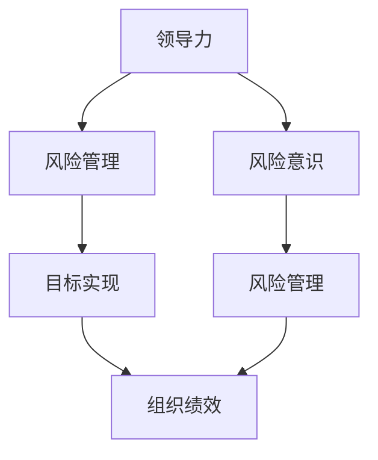

                 

# 领导力与风险管理：在不确定性中前行

关键词：领导力、风险管理、不确定性、组织文化、团队发展

摘要：在当今快速变化和不确定性的商业环境中，领导力和风险管理成为了企业成功的关键因素。本文旨在探讨领导力和风险管理在组织中的核心概念、相互关系以及综合应用。通过深入分析领导力理论、风险管理原理和策略，以及两者在不确定性环境中的挑战与整合，文章为读者提供了全面的理论和实践指导，帮助组织在不确定性的浪潮中稳健前行。

----------------------------------------------------------------

## 第一部分：引言

### 第1章：领导力与风险管理背景

### 1.1 问题背景

#### 1.1.1 领导力的重要性

领导力是推动组织向前发展的核心力量。有效的领导力不仅能够激发员工的潜力，提高团队协作效率，还能够为组织创造价值，推动创新和变革。在全球化的背景下，领导力对于应对不确定性和复杂环境尤为重要。

#### 1.1.2 风险管理的必要性

随着市场竞争的加剧和技术的快速变革，企业面临的风险种类和复杂度不断增加。风险管理是确保企业稳健发展的必要手段。通过识别、评估和应对风险，企业能够降低潜在损失，保障业务的连续性。

#### 1.1.3 不确定性时代的挑战

不确定性已成为现代企业运营的常态。从全球经济波动到技术颠覆，不确定性给企业带来了巨大的挑战。如何在这种环境中保持稳定和成长，成为企业领导者亟待解决的问题。

### 1.2 问题描述

#### 1.2.1 领导力问题的体现

领导力不足可能导致组织愿景不清晰、战略执行力弱、员工士气低落等问题。这些问题的根源在于领导者的能力不足或领导方式不当。

#### 1.2.2 风险管理问题的体现

风险管理缺陷可能导致企业面临巨大损失，影响业务的连续性和稳定性。这可能是由于风险识别不足、风险评估不准确或风险应对不力导致的。

#### 1.2.3 领导力与风险管理的相互关系

领导力和风险管理密切相关。有效的领导力能够推动风险管理工作的开展，而风险管理则为领导力提供了稳定的基础。两者在组织中的综合应用，有助于提升组织的整体绩效和竞争力。

### 1.3 问题解决

#### 1.3.1 领导力提升的策略

领导者需要通过自我提升、学习新知识和技能来增强领导力。同时，建立有效的领导体系，如培养接班人、设立明确的战略目标和沟通机制，也是提升领导力的关键。

#### 1.3.2 风险管理的方法

企业应建立全面的风险管理框架，包括风险识别、评估、应对和监控。通过定期的风险评估和应急演练，企业能够更好地应对潜在风险。

#### 1.3.3 领导力与风险管理的综合应用

领导力和风险管理应相互融合，形成一套完整的体系。领导者需要具备风险管理意识，将风险管理纳入日常运营中；同时，风险管理应支持领导力的实现，确保战略目标的达成。

### 1.4 边界与外延

#### 1.4.1 领导力与风险管理的适用范围

领导力和风险管理适用于各类组织，从企业到政府机构，从非营利组织到教育机构。不同组织的特点和需求不同，但领导力和风险管理的基本原则是通用的。

#### 1.4.2 不同领域领导力与风险管理的特点

领导力和风险管理在不同领域有不同的表现形式和侧重点。例如，在高科技行业，创新和快速应对变化是领导力和风险管理的核心；而在金融行业，合规和稳健经营是重中之重。

#### 1.4.3 领导力与风险管理的未来发展

随着技术的不断进步和全球化的深入，领导力和风险管理将面临新的挑战和机遇。领导者需要不断适应变化，提升自身能力，而风险管理也将更加复杂和多样化。

### 1.5 概念结构与核心要素组成

#### 1.5.1 领导力概念的结构

领导力包括个人特质、行为、情境和关系等多个方面。有效的领导力需要领导者在这几个方面取得平衡。

#### 1.5.2 风险管理核心要素的构成

风险管理包括风险识别、评估、应对和监控等环节。每个环节都有其特定的方法和工具，共同构成了完整的风险管理体系。

#### 1.5.3 领导力与风险管理的关系图

图1：领导力与风险管理的关系图

#### 1.6 本章小结

本文介绍了领导力与风险管理在不确定性时代的重要性，分析了其背景、问题描述、问题解决策略以及边界与外延。通过本文的探讨，读者可以更好地理解领导力和风险管理在组织中的核心作用，为未来的学习和实践打下基础。

----------------------------------------------------------------

## 第二部分：领导力核心概念与联系

### 第2章：领导力理论概述

### 2.1 领导力定义与特征

#### 2.1.1 领导力的定义

领导力是一种能力，指的是个体或集体引导和影响他人以实现共同目标的过程。领导力不仅仅是一种技术或技能，更是一种艺术和科学。

#### 2.1.2 领导力的特征

领导力具有以下特征：

- **影响力**：领导者能够通过言语和行为影响他人的态度和行为。
- **愿景**：领导者需要有远大的愿景，能够描绘出组织的未来，激励团队成员为实现这一愿景而努力。
- **决策能力**：领导者需要在复杂和不确定的环境中做出明智的决策。
- **沟通能力**：领导者需要具备良好的沟通能力，能够有效地传达信息和建立信任。
- **团队建设**：领导者需要能够建立和维护一个高效的团队，激发团队成员的潜力。

#### 2.1.3 领导力与管理的区别

领导力与管理密切相关，但又有所不同。管理侧重于组织的日常运营和效率，而领导力则更关注组织的变革和未来发展。

- **目标**：管理侧重于实现当前的目标和任务，而领导力则关注长远的目标和愿景。
- **方法**：管理采用控制、规划和执行的方法，而领导力则通过激励、指导和影响来推动变革。
- **角色**：管理者是组织的运营者，领导者是组织的愿景者和变革者。

### 2.2 主要领导力理论

#### 2.2.1 特质理论

特质理论认为，领导者具备某些固有的特质，如自信、决断力、智慧等。特质理论强调了领导者个人的特点和天赋。

#### 2.2.2 行为理论

行为理论关注领导者如何行动和表现，而不是他们具备的特质。行为理论提出了不同的领导行为模式，如指令型领导、支持型领导和参与型领导。

#### 2.2.3 转换理论

转换理论认为，领导者的作用是推动组织从当前状态转向期望状态。转换型领导者通过激发团队成员的潜力、建立信任和提供支持来推动变革。

#### 2.2.4 参与模型理论

参与模型理论认为，领导者应该通过参与和合作来引导团队成员。这种理论强调了民主和参与的重要性，认为领导者应该让团队成员参与决策过程。

#### 2.2.5 情境理论

情境理论认为，领导行为应该根据具体情境进行调整。不同的情境需要不同的领导风格，领导者应该根据具体情况灵活运用不同的领导方法。

### 2.3 领导力与组织文化

#### 2.3.1 组织文化的定义

组织文化是组织内部共同价值观、信仰和行为规范的总和。它影响着员工的态度和行为，对组织的成功至关重要。

#### 2.3.2 领导力对组织文化的影响

领导力对组织文化有深远的影响。领导者通过自己的行为和决策塑造组织文化，如建立积极的氛围、推动变革和创新等。

#### 2.3.3 组织文化与领导力的互动

组织文化和领导力相互影响。领导力可以塑造组织文化，而组织文化又反作用于领导力。有效的领导力需要与组织文化相匹配，以实现最佳效果。

### 2.4 领导力与团队发展

#### 2.4.1 团队发展的阶段

团队发展经历形成、风暴、规范、执行和 adjourning 阶段。每个阶段都有其特定的挑战和需求，领导力在这个过程中起到关键作用。

#### 2.4.2 领导力在团队发展中的作用

领导力在团队发展的每个阶段都发挥作用。领导者需要根据团队的发展阶段，提供适当的指导和支持，帮助团队克服挑战，实现目标。

#### 2.4.3 领导力对团队效能的影响

有效的领导力可以显著提升团队的效能。领导者通过激发团队成员的潜力、建立信任和提供资源，促进团队合作，提高团队绩效。

### 2.5 领导力与员工激励

#### 2.5.1 员工激励的概念

员工激励是指通过奖励和激励手段，激发员工的积极性和创造力，提高员工的工作效率和满意度。

#### 2.5.2 领导力在员工激励中的应用

领导力在员工激励中发挥重要作用。领导者可以通过认可、激励和提供发展机会，激发员工的潜力，提高员工的工作动力。

#### 2.5.3 常见的员工激励方法

常见的员工激励方法包括：

- **奖励和表彰**：通过给予奖励和表彰，认可员工的贡献和成就。
- **职业发展机会**：提供培训和职业发展机会，帮助员工提升技能和职业素养。
- **工作环境改善**：改善工作环境，提高员工的工作舒适度和满意度。
- **灵活工作制度**：提供灵活的工作时间和工作地点，满足员工的个性化需求。

### 2.6 本章小结

本文介绍了领导力的定义、特征和主要理论，分析了领导力与组织文化、团队发展和员工激励的关系。通过本文的探讨，读者可以更好地理解领导力的本质和作用，为提升领导力提供理论支持。

----------------------------------------------------------------

### 第3章：风险管理概述

#### 3.1 风险管理的定义与目标

#### 3.1.1 风险管理的定义

风险管理是一个系统的过程，旨在识别、评估、应对和监控组织面临的潜在风险，以保障组织的稳定运营和可持续发展。风险管理不仅包括对风险的识别和评估，还包括制定和实施风险应对策略。

#### 3.1.2 风险管理的目标

风险管理的目标主要包括：

- **降低损失**：通过识别和评估风险，采取有效的风险应对措施，降低组织可能遭受的损失。
- **保障业务连续性**：确保组织在面临突发事件时能够迅速恢复运营，减少业务中断的时间和影响。
- **提高决策效率**：通过风险信息的收集和分析，帮助决策者更准确地评估风险，提高决策的科学性和有效性。
- **增强组织韧性**：通过持续的风险管理和改进，增强组织应对不确定性和外部冲击的能力。

#### 3.1.3 风险管理的重要性

风险管理在组织运营中具有至关重要的地位。首先，它有助于识别和评估潜在风险，避免因未预见的风险而导致的损失。其次，风险管理有助于组织制定科学的决策，降低决策风险。最后，风险管理能够增强组织的韧性和适应能力，使其在面临外部冲击时能够迅速恢复。

#### 3.2 风险管理框架

#### 3.2.1 风险管理流程

风险管理流程通常包括以下步骤：

1. **风险识别**：通过访谈、问卷调查、文献调研等方法，识别组织面临的潜在风险。
2. **风险评估**：对识别出的风险进行定性或定量评估，确定风险的可能性和影响。
3. **风险应对**：根据风险评估结果，制定风险应对策略，如风险规避、风险降低、风险转移和风险保留。
4. **风险监控**：通过定期检查和监控，确保风险应对措施的有效性和及时性。
5. **风险报告**：向决策者和管理层报告风险管理的进展和成果，为决策提供依据。

#### 3.2.2 风险管理的基本原则

风险管理的基本原则包括：

- **全面性**：全面识别和评估组织面临的各类风险，确保风险管理的全面性和有效性。
- **持续性**：风险管理是一个持续的过程，需要定期评估和更新，以适应组织内外部环境的变化。
- **适应性**：风险管理应具备灵活性，能够根据实际情况调整风险应对策略。
- **参与性**：风险管理需要组织内部各层级和各部门的参与，形成全员参与的风险管理文化。

#### 3.2.3 风险管理的工具与方法

风险管理过程中常用的工具和方法包括：

- **风险识别工具**：如风险清单、头脑风暴、专家访谈等。
- **风险评估工具**：如风险矩阵、风险评分表、蒙特卡洛模拟等。
- **风险应对工具**：如风险规避、风险降低、风险转移和风险保留策略。
- **风险监控工具**：如风险报告、风险指标、实时监控等。

#### 3.3 风险识别与评估

#### 3.3.1 风险识别的方法

风险识别是风险管理的第一步，关键在于全面、准确地识别出组织面临的潜在风险。常用的风险识别方法包括：

- **头脑风暴**：通过集体讨论，激发创意，识别潜在风险。
- **访谈**：通过与相关人员访谈，获取风险信息。
- **问卷调查**：通过问卷调查，收集组织内部员工对风险的看法和意见。
- **文献调研**：通过查阅相关文献，了解行业风险和研究动态。

#### 3.3.2 风险评估的工具

风险评估是风险管理的核心环节，关键在于准确评估风险的可能性和影响。常用的风险评估工具包括：

- **风险矩阵**：通过风险矩阵，将风险的可能性和影响进行量化，评估风险等级。
- **风险评分表**：通过制定风险评分表，对风险的可能性和影响进行打分，评估风险等级。
- **蒙特卡洛模拟**：通过蒙特卡洛模拟，评估风险的概率分布和预期损失。

#### 3.3.3 风险评估的步骤

风险评估通常包括以下步骤：

1. **确定评估目标**：明确风险评估的目标和范围。
2. **收集风险信息**：通过访谈、问卷调查、文献调研等方法，收集风险信息。
3. **分析风险数据**：对收集到的风险信息进行分析和归纳，确定风险的类型和特征。
4. **评估风险等级**：根据风险的可能性和影响，评估风险等级。
5. **制定风险应对策略**：根据评估结果，制定相应的风险应对策略。

#### 3.4 风险应对策略

#### 3.4.1 风险规避

风险规避是指通过避免风险发生或转移风险，降低组织可能遭受的损失。常用的风险规避方法包括：

- **业务流程重构**：通过重新设计业务流程，避免风险发生。
- **合作伙伴选择**：通过选择信誉良好、稳定的合作伙伴，降低风险。
- **地域分散**：通过在不同地区设立分支机构，降低地区风险。

#### 3.4.2 风险降低

风险降低是指通过采取措施，减少风险的可能性和影响。常用的风险降低方法包括：

- **预防措施**：通过采取预防措施，降低风险发生的可能性，如安装安全系统、培训员工等。
- **应急准备**：制定应急预案，提高组织应对突发事件的能力。
- **保险**：通过购买保险，转移风险。

#### 3.4.3 风险转移

风险转移是指将风险转移给第三方，降低组织可能遭受的损失。常用的风险转移方法包括：

- **外包**：将部分业务外包给专业的服务提供商，降低运营风险。
- **保险**：通过购买保险，将风险转移给保险公司。
- **合同条款**：在合同中约定风险责任和赔偿条款，降低风险。

#### 3.4.4 风险保留

风险保留是指组织自愿承担风险，不采取任何风险规避或转移措施。常用的风险保留方法包括：

- **风险自留**：组织自行承担风险，不采取任何措施。
- **风险预留**：为特定风险预留一部分资金，用于风险发生时的赔偿。

#### 3.5 风险监控与报告

#### 3.5.1 风险监控的方法

风险监控是确保风险应对措施有效性的关键环节。常用的风险监控方法包括：

- **风险报告**：定期向决策者和管理层报告风险管理的进展和成果。
- **风险指标**：设定关键风险指标（KRI），监控风险的变化情况。
- **实时监控**：通过实时监控系统，及时发现和处理风险。

#### 3.5.2 风险报告的格式

风险报告通常包括以下内容：

- **标题**：简要描述报告的主要内容。
- **摘要**：总结报告的关键内容。
- **风险概述**：介绍组织面临的潜在风险。
- **风险评估结果**：展示风险评估的结果和风险等级。
- **风险应对措施**：列出已采取的风险应对措施。
- **风险监控情况**：报告风险监控的进展和成果。
- **改进建议**：针对风险管理中存在的问题，提出改进建议。

#### 3.5.3 风险报告的频率

风险报告的频率取决于组织的风险类型和风险程度。通常情况下，风险报告的频率包括：

- **定期报告**：每月、每季度或每年进行一次风险报告。
- **临时报告**：在风险事件发生后，立即进行风险报告。

### 3.6 本章小结

本文介绍了风险管理的定义、目标、流程和工具方法，分析了风险识别与评估、风险应对策略以及风险监控与报告。通过本文的探讨，读者可以全面了解风险管理的理论和实践，为组织的风险管理提供指导。

----------------------------------------------------------------

### 第4章：不确定性环境下的领导力挑战

#### 4.1 不确定性的类型与影响

在当今快速变化和全球化的商业环境中，不确定性已经成为企业运营的常态。不确定性可以按以下几种类型进行分类：

1. **外部不确定性**：由外部环境变化引起的不确定性，如政策变化、市场竞争加剧、自然灾害等。外部不确定性对企业运营具有直接的影响，可能导致业务中断、市场份额下降等。

2. **内部不确定性**：由企业内部因素引起的不确定性，如技术创新、内部管理问题、员工流动等。内部不确定性可能影响企业的长期发展和战略执行。

3. **系统性不确定性**：由整个行业或市场的结构性变化引起的不确定性，如技术革命、行业竞争格局变化等。系统性不确定性对整个行业和企业的未来产生深远影响。

不确定性对企业的运营和决策产生了深远的影响。首先，不确定性增加了决策的难度和风险，使企业在制定战略和决策时面临更多的不确定性。其次，不确定性可能导致资源分配不合理，影响企业的效率和竞争力。最后，不确定性还可能影响员工的心理和士气，导致工作效率下降。

#### 4.2 领导力在不确定性环境中的关键要素

在不确定性环境中，领导力成为组织成功的关键要素。以下是在不确定性环境中领导力的关键要素：

1. **明确目标与愿景**

在不确定性环境中，领导者需要明确组织的目标和愿景，为团队成员提供明确的方向。通过设定清晰的目标和愿景，领导者能够引导团队克服不确定性的挑战，保持一致的行动。

2. **建立信任与沟通**

在不确定性环境中，建立信任和沟通至关重要。领导者需要与团队成员保持开放和诚实的沟通，传递信心和正面信息，增强团队的凝聚力和协作能力。同时，领导者应鼓励团队成员之间的沟通和合作，促进信息的共享和反馈。

3. **快速决策与适应**

在不确定性环境中，领导者需要具备快速决策和适应变化的能力。领导者应具备敏捷的思维和行动力，能够迅速应对突发事件，做出明智的决策。同时，领导者应鼓励团队成员灵活应对变化，培养团队的适应能力。

4. **激励与支持团队**

在不确定性环境中，领导者需要激励和支持团队成员，帮助他们克服困难和挑战。领导者可以通过提供资源、培训和发展机会，激发团队成员的潜力和创造力。同时，领导者应关注团队成员的心理健康和福利，提供必要的支持和关怀。

#### 4.3 风险管理在不确定性环境中的策略

在不确定性环境中，风险管理成为组织确保稳健运营的重要手段。以下是在不确定性环境中风险管理的策略：

1. **增强风险意识**

领导者需要提高组织内部的风险意识，使全体员工认识到风险管理的重要性。通过培训和教育，提高员工对风险的识别和应对能力，形成全员参与的风险管理文化。

2. **完善风险应对计划**

领导者应制定完善的应对计划，确保在不确定性环境中能够迅速应对潜在风险。应对计划应包括风险识别、风险评估、风险应对策略和应急响应等措施。同时，领导者应定期更新和演练应对计划，确保其有效性和适用性。

3. **提高组织韧性**

组织韧性是应对不确定性和外部冲击的关键能力。领导者应通过优化组织结构、提高员工素质、加强协作和创新能力，提高组织的整体韧性。此外，领导者还应建立应急预案，确保在突发事件发生时能够迅速恢复运营。

4. **持续优化风险管理**

在不确定性环境中，风险管理是一个持续的过程。领导者应持续评估和优化风险管理策略，根据实际情况调整风险应对措施。通过定期的风险评估和改进，提高组织应对不确定性的能力。

#### 4.4 领导力与风险管理在不确定性环境中的整合

在不确定性环境中，领导力与风险管理的整合至关重要。以下是在不确定性环境中领导力与风险管理的整合方法和工具：

1. **整合的必要性**

领导力与风险管理的整合有助于提高组织的整体绩效和竞争力。通过整合领导力和风险管理，领导者可以更好地应对不确定性，确保组织在动荡环境中保持稳定和持续发展。

2. **整合的方法与工具**

- **领导力风险管理框架**：建立领导力风险管理框架，明确领导力与风险管理的目标、流程和工具。
- **风险管理领导力培训**：对领导者进行风险管理培训，提高其风险管理意识和能力。
- **风险意识培养**：通过培训和宣传，提高全体员工的风险意识，形成风险管理文化。
- **风险管理领导力评估**：建立风险管理领导力评估机制，评估领导者在风险管理方面的表现和成效。

3. **整合的实践案例分析**

- **案例一**：某企业在面临市场变化和竞争压力时，通过领导力与风险管理的整合，制定了新的战略方向和应对计划，成功应对了市场变化，保持了市场份额。
- **案例二**：某公司在遭遇自然灾害时，通过领导力与风险管理的整合，迅速启动应急预案，保障了业务的连续性，降低了损失。

#### 4.5 本章小结

在不确定性环境中，领导力和风险管理成为组织成功的关键要素。领导者需要具备快速决策和适应变化的能力，同时提高组织对不确定性的应对能力。通过整合领导力和风险管理，组织可以在不确定性中保持稳健运营，实现持续发展。

----------------------------------------------------------------

### 总结

本文探讨了领导力与风险管理在不确定性环境中的重要性、核心概念、相互关系以及综合应用。首先，我们分析了领导力与风险管理在不确定性时代的背景和挑战，明确了两者在组织中的关键作用。接着，我们详细介绍了领导力的定义、特征和主要理论，以及领导力与组织文化、团队发展和员工激励的关系。随后，我们阐述了风险管理的定义、目标、流程和工具方法，分析了风险识别与评估、风险应对策略以及风险监控与报告。最后，我们探讨了在不确定性环境中领导力和风险管理的整合方法和实践案例分析。

通过本文的探讨，读者可以全面了解领导力与风险管理在组织中的核心作用和综合应用，为在不确定性环境中实现组织的目标和可持续发展提供理论和实践指导。

### 拓展阅读

- **《领导力的五大障碍》**：作者Patrick Lencioni，深入探讨了组织面临的五大领导力障碍，并提供了解决方案。
- **《风险管理：理论与实践》**：作者John J.涎，全面介绍了风险管理的理论和实践方法，适用于各类组织。
- **《不确定性：预测与决策》**：作者Nassim Nicholas Taleb，通过深入分析不确定性，提供了预测和决策的实用策略。

### 注意事项

- 领导力和风险管理是一个持续的过程，需要组织内部各层级和各部门的共同努力。
- 领导者和风险管理人员应具备持续学习和自我提升的能力，以应对不断变化的环境。
- 组织应建立有效的沟通和协作机制，确保领导力和风险管理信息的传递和落实。

### 最佳实践 tips

- 定期组织领导力和风险管理培训，提高员工的能力和意识。
- 建立跨部门的协作机制，促进领导力和风险管理的信息共享和资源整合。
- 通过案例分析和模拟演练，提高组织应对不确定性和突发事件的能力。

### 作者信息

作者：AI天才研究院/AI Genius Institute & 禅与计算机程序设计艺术 /Zen And The Art of Computer Programming

----------------------------------------------------------------

## 附录：相关术语表

### 领导力

- **领导力**：指个体或集体引导和影响他人以实现共同目标的过程。
- **领导者**：具备领导力的人，能够通过影响力、愿景、决策能力等特质，推动团队和组织向前发展。

### 风险管理

- **风险管理**：识别、评估、应对和监控组织面临的潜在风险，以保障组织的稳定运营和可持续发展。
- **风险识别**：识别组织面临的潜在风险。
- **风险评估**：评估风险的可能性和影响。
- **风险应对**：制定和实施风险应对策略。
- **风险监控**：确保风险应对措施的有效性和及时性。

### 不确定性

- **不确定性**：指未来可能发生的事件或情况的不确定性，可能对组织产生积极或消极的影响。
- **外部不确定性**：由外部环境变化引起的不确定性。
- **内部不确定性**：由企业内部因素引起的不确定性。
- **系统性不确定性**：由整个行业或市场的结构性变化引起的不确定性。

### 组织文化

- **组织文化**：指组织内部共同价值观、信仰和行为规范的总和。
- **领导力文化**：指领导者通过行为和决策塑造的组织文化。
- **风险管理文化**：指组织内部对风险管理重要性和意识的认识。

### 员工激励

- **员工激励**：指通过奖励和激励手段，激发员工的积极性和创造力。
- **奖励**：指通过物质或精神奖励，认可员工的贡献和成就。
- **职业发展机会**：指提供培训和职业发展机会，帮助员工提升技能和职业素养。

### 风险应对策略

- **风险规避**：通过避免风险发生或转移风险，降低组织可能遭受的损失。
- **风险降低**：通过采取措施，减少风险的可能性和影响。
- **风险转移**：将风险转移给第三方，降低组织可能遭受的损失。
- **风险保留**：组织自愿承担风险，不采取任何风险规避或转移措施。

### 风险监控

- **风险监控**：通过定期检查和监控，确保风险应对措施的有效性和及时性。
- **风险报告**：向决策者和管理层报告风险管理的进展和成果。
- **关键风险指标（KRI）**：用于监控和评估风险指标。

## 参考文献

- Lencioni, P. (2002). The Five Dysfunctions of a Team: A Leadership Fable. Jossey-Bass.
-涎，J. J. (2016). Risk Management: A New Direction. John Wiley & Sons.
- Taleb, N. N. (2007). The Black Swan: The Impact of the Highly Improbable. Random House.
- Kotter, J. P. (1996). Leading Change. Harvard Business Review Press.
- Siggelkow, N. (2007). A Plea for Robustness. Administrative Science Quarterly, 52(1), 3-21.

