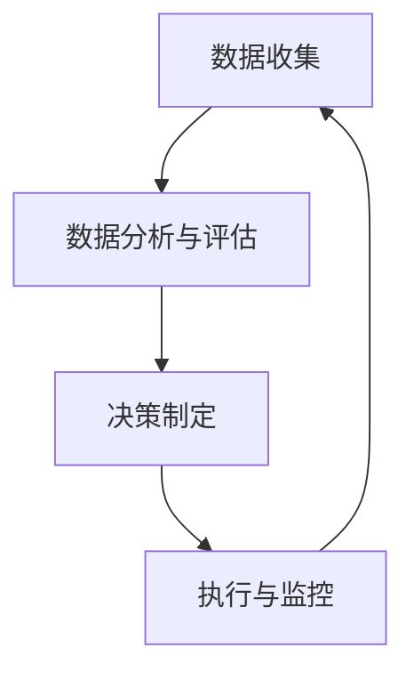
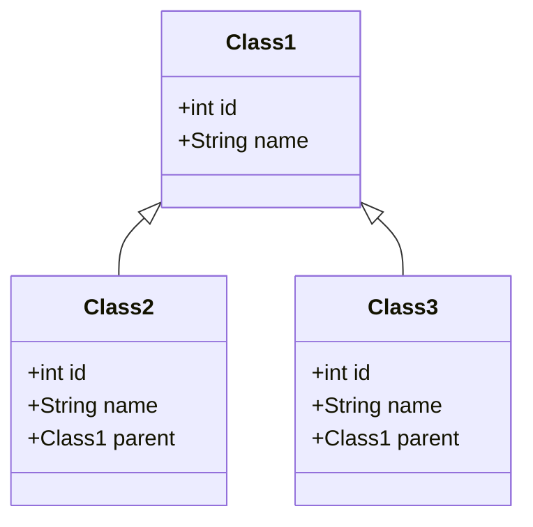
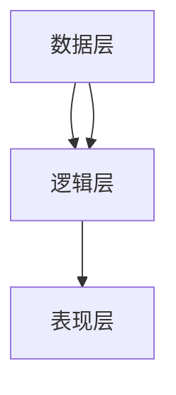
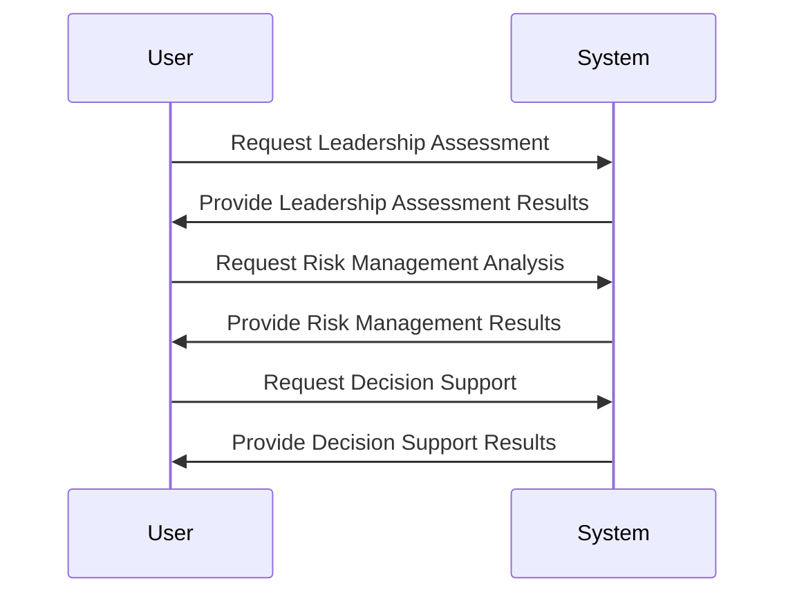

                 

### 第一部分：背景介绍

在当今快速变化和竞争激烈的市场环境中，企业的成功不仅依赖于卓越的技术和创新，还需要有效的领导力和风险管理。领导力与风险管理是企业运营的两个核心支柱，它们相互依存，共同作用于企业的持续成长和稳定发展。

#### 1.1.1 问题背景

**领导力的重要性**：领导力是企业成功的关键因素之一。它不仅决定了企业的发展方向，还影响着员工的积极性和创新能力。一位具备强大领导力的领导者能够激发团队的潜力，推动企业不断向前发展。

**风险管理的重要性**：风险管理是企业在面对不确定性时的保护伞。通过识别、评估和应对潜在的风险，企业可以减少损失，确保业务的连续性和稳定性。在全球化经济背景下，风险管理的复杂性日益增加，企业需要具备更高的风险管理能力。

然而，许多企业在实际操作中往往忽视了领导力与风险管理的重要性。一方面，领导者可能缺乏正确的领导力培养和提升途径；另一方面，企业可能没有建立起有效的风险管理框架，导致在面对突发情况时无法及时响应。

#### 1.1.2 问题描述

在领导力和风险管理方面，企业面临以下几个主要问题：

1. **领导力不足**：领导者可能缺乏战略眼光、决策能力和团队管理能力，无法有效地引领企业前进。
2. **风险管理欠缺**：企业可能没有建立起全面的风险管理体系，无法及时识别和应对各种风险。
3. **沟通不畅**：领导者与员工之间的沟通不畅可能导致误解和矛盾，影响团队的凝聚力和工作效率。
4. **执行不力**：即使制定了良好的计划和策略，如果执行不力，也很难实现预期目标。

#### 1.1.3 问题解决

《领导力与风险管理：未雨绸缪的智慧》旨在解决上述问题，为企业提供一套全面的解决方案。通过以下步骤，企业可以提升领导力，加强风险管理：

1. **领导力培养**：通过系统化的培训和辅导，提升领导者的战略思维、决策能力和沟通技巧。
2. **风险管理框架**：建立全面的风险管理框架，包括风险识别、风险评估、风险控制和风险监控等环节。
3. **沟通机制建设**：建立有效的沟通机制，确保领导者与员工之间的信息流畅，增强团队的凝聚力和协作能力。
4. **执行监督**：强化执行力，通过监控和评估确保计划和策略的有效执行。

#### 1.1.4 边界与外延

本书主要探讨的是企业内部领导力与风险管理的应用，但所提及的理论和方法同样适用于其他组织形式，如政府机构、非营利组织等。无论组织形式如何，有效的领导力和风险管理都是成功的关键。

#### 1.1.5 概念结构与核心要素组成

**领导力**：领导力是企业成功的关键因素，它包括以下几个方面：

1. **影响力**：领导者通过个人魅力和价值观影响团队成员。
2. **决策能力**：领导者能够在复杂情况下做出明智的决策。
3. **沟通能力**：领导者需要具备良好的沟通技巧，确保信息传递清晰、准确。
4. **团队管理能力**：领导者需要具备团队管理技能，包括激励、培训和发展团队。

**风险管理**：风险管理是企业持续发展的重要保障，它包括以下几个核心要素：

1. **风险识别**：识别可能影响企业运营的各种风险。
2. **风险评估**：评估风险的严重程度和可能性。
3. **风险控制**：采取有效的措施控制和管理风险。
4. **风险监控**：持续监控风险的变化，及时调整风险管理策略。

---

通过本文的深入探讨，我们将逐步了解领导力与风险管理的核心概念、原理和实践方法，帮助读者在企业中更好地应用这些理念，实现持续发展和稳定成长。

---

### 第二部分：核心概念与联系

在探讨领导力与风险管理的过程中，我们需要明确一些核心概念和它们之间的相互联系。这不仅有助于我们深入理解这两个领域，还可以为后续的实践提供理论基础。

#### 2.1.1 核心概念原理

**领导力原理**：

领导力不仅仅是一种技能，更是一种思维方式。它涉及到领导者如何影响、激励和引导团队成员，以实现共同的目标。领导力原理包括以下几个方面：

1. **影响力**：领导者通过个人魅力、专业知识和价值观来影响团队成员。
2. **决策能力**：领导者需要具备在复杂和不确定的环境中做出明智决策的能力。
3. **沟通能力**：有效的沟通是领导力的核心，领导者需要能够清晰、准确地传达信息。
4. **团队管理能力**：领导者需要了解如何激励、培养和发展团队成员，以提升团队的整体绩效。

**风险管理原理**：

风险管理是一个系统性的过程，它包括以下几个方面：

1. **风险识别**：识别可能影响企业运营的各种风险。
2. **风险评估**：评估风险的严重程度和可能性，以便确定优先级。
3. **风险控制**：采取有效的措施来控制和管理风险，以减少潜在的损失。
4. **风险监控**：持续监控风险的变化，及时调整风险管理策略。

#### 2.1.2 概念属性特征对比表格

以下是一个简化的概念属性特征对比表格，用于展示领导力与风险管理的核心特征：

| 概念         | 特征一         | 特征二         | 特征三         |
| ------------ | -------------- | -------------- | -------------- |
| 领导力       | 人际影响力     | 决策能力       | 沟通能力       |
| 风险管理     | 风险识别       | 风险评估       | 风险控制       |

**领导力**：
- **人际影响力**：领导者需要具备强大的影响力，能够激发团队成员的潜力，形成共同的愿景和目标。
- **决策能力**：领导者需要具备在复杂和不确定的环境中做出决策的能力，确保企业能够在变化的市场中保持竞争力。
- **沟通能力**：领导者需要能够清晰、准确地传达信息，确保团队成员理解企业的目标和策略。

**风险管理**：
- **风险识别**：企业需要识别可能影响运营的各种风险，包括市场风险、财务风险、运营风险等。
- **风险评估**：企业需要对识别出的风险进行评估，确定其严重程度和可能性，以便制定相应的应对策略。
- **风险控制**：企业需要采取有效的措施来控制和管理风险，包括风险规避、风险转移、风险接受等。

#### 2.1.3 概念之间的联系

领导力与风险管理之间存在着密切的联系。有效的领导力可以促进风险管理的实施，而良好的风险管理则可以为领导力提供坚实的支持。

1. **领导力促进风险管理**：
   - 领导者通过明确企业的风险管理目标，确保团队成员了解风险管理的价值和重要性。
   - 领导者通过有效的沟通，确保风险管理策略在企业内部得到广泛理解和执行。
   - 领导者通过激发团队成员的积极性，推动他们在风险管理中发挥更大的作用。

2. **风险管理支持领导力**：
   - 风险管理可以帮助领导者更好地预测和应对外部环境的变化，确保企业能够在竞争激烈的市场中保持竞争力。
   - 风险管理提供了数据和信息支持，使领导者能够做出更明智的决策，提高决策的准确性和有效性。
   - 风险管理有助于领导者建立和维护良好的声誉，增强企业的市场信任和竞争力。

通过上述分析，我们可以看到领导力与风险管理在理论层面上是相互补充和相互促进的。在实际操作中，企业需要将这两个方面紧密结合，以实现整体运营的优化和绩效的提升。

---

在下一部分中，我们将深入探讨领导力和风险管理的算法原理，通过具体的数学模型和流程图来阐述这些概念的应用。

---

### 第三部分：算法原理讲解

在深入了解领导力与风险管理的核心概念之后，我们将进一步探讨这两个领域的算法原理。通过数学模型和流程图，我们可以更清晰地理解如何在实际操作中应用这些概念。

#### 3.1.1 算法原理

**领导力与风险管理算法的基本框架**：

领导力和风险管理是一个复杂的过程，我们可以将其分解为以下几个基本步骤：

1. **数据收集与处理**：收集与领导力和风险管理相关的各种数据，如员工绩效、市场动态、风险事件等。
2. **数据分析与评估**：对收集到的数据进行分析，评估领导力和风险管理的效果。
3. **决策制定**：根据数据分析结果，制定相应的决策和策略。
4. **执行与监控**：执行决策，并持续监控领导力和风险管理的效果，进行必要的调整。

**数学模型**：

为了更好地描述领导力与风险管理的过程，我们可以引入以下数学模型：

$$
L = f(C, R, E)
$$

其中：
- \(L\) 表示领导力评分；
- \(C\) 表示沟通能力评分；
- \(R\) 表示风险管理能力评分；
- \(E\) 表示执行力评分。

这个模型表明，领导力是由沟通能力、风险管理能力和执行力共同决定的。

**流程图**：

使用 Mermaid 绘制领导力与风险管理的流程图如下：



**详细讲解和举例说明**：

假设我们有一个企业，其领导者的沟通能力 \(C\) 为 80%，风险管理能力 \(R\) 为 70%，执行力 \(E\) 为 85%。我们可以使用上述模型计算其领导力评分：

$$
L = f(0.8, 0.7, 0.85) = 0.8 \times 0.7 \times 0.85 = 0.598
$$

这意味着该领导力的综合评分为 59.8%。为了提高领导力，企业可以重点关注以下几个方面：

1. **提升沟通能力**：领导者可以通过参加沟通技巧培训、定期与员工交流等方式，提高沟通能力。
2. **强化风险管理**：企业可以建立更加完善的风险管理框架，加强风险评估和控制，提高风险管理能力。
3. **增强执行力**：领导者可以通过制定明确的执行计划、建立监督机制等方式，提高执行力。

通过这样的分析和计算，企业可以更加清晰地了解自身在领导力和风险管理方面的优势和不足，从而制定出更加有效的改进措施。

---

在下一部分中，我们将进一步探讨领导力与风险管理在系统设计与架构方案中的应用，通过具体的架构设计和领域模型类图，展示系统的实现过程。

---

### 第四部分：系统分析与架构设计方案

在深入理解了领导力与风险管理的算法原理后，我们需要将理论应用于实际系统设计中。本部分将详细介绍企业如何通过系统分析与架构设计，实现领导力与风险管理的优化。

#### 4.1.1 问题场景介绍

假设某大型企业需要在新的市场环境中保持竞争力，并确保在不确定性中稳定运营。企业决定通过构建一套集成领导力与风险管理的系统，来提高管理效率和企业韧性。

#### 4.1.2 项目介绍

本项目旨在为企业提供一个集成领导力与风险管理的系统，该系统将帮助企业在复杂多变的环境中做出更明智的决策，并提高领导者的管理能力。

#### 4.1.3 系统功能设计

为了实现领导力与风险管理的优化，系统需要具备以下核心功能：

1. **领导力评估模块**：用于评估领导者的领导能力，并提供培训和发展建议。
2. **风险管理模块**：用于识别、评估和监控企业面临的各类风险。
3. **决策支持模块**：基于领导力和风险管理的分析结果，提供决策支持。
4. **监控系统**：用于监控领导力和风险管理策略的实施效果，并提供反馈。

使用 Mermaid 绘制领域模型类图如下：



在这个类图中，`Class1` 代表领导力评估、风险管理、决策支持和监控系统，`Class2` 和 `Class3` 分别代表下属的具体模块和功能。

#### 4.1.4 系统架构设计

系统的整体架构设计如下：

1. **数据层**：负责数据的存储和管理，包括领导力评估数据、风险管理数据和决策支持数据。
2. **逻辑层**：负责处理业务逻辑，包括领导力评估算法、风险管理算法和决策支持算法。
3. **表现层**：负责用户界面的展示和用户交互，包括领导力评估界面、风险管理界面和决策支持界面。

使用 Mermaid 绘制系统架构图如下：



在这个架构图中，数据层负责数据的存储和管理，逻辑层负责处理业务逻辑，表现层负责用户界面的展示和用户交互。

#### 4.1.5 系统接口设计和系统交互

为了实现系统各部分之间的有效交互，我们需要设计合理的接口。以下是一个简化的接口设计：

1. **领导力评估接口**：用于接收和返回领导力评估结果。
2. **风险管理接口**：用于接收和返回风险管理结果。
3. **决策支持接口**：用于接收和返回决策支持结果。

使用 Mermaid 绘制系统交互序列图如下：



在这个序列图中，用户通过系统接口请求领导力评估、风险管理分析和决策支持，系统根据请求返回相应的结果。

---

通过以上系统分析与架构设计方案，企业可以构建一个集成领导力与风险管理的系统，提高管理效率和企业韧性。在下一部分中，我们将通过项目实战，展示如何在实际环境中实现这些系统设计和功能。

---

### 第五部分：项目实战

在深入分析了领导力与风险管理的核心概念、算法原理和系统架构后，本部分将带领读者进行一次项目实战，通过具体的环境安装、系统核心实现和代码应用解读，来实际操作并验证所学的理论和设计方案。

#### 5.1.1 环境安装

要实现一个集成领导力与风险管理的系统，首先需要搭建一个稳定的环境。以下是一个简化的环境安装步骤：

1. **硬件要求**：
   - 服务器：至少 8 核 CPU，16GB 内存，80GB 硬盘空间。
   - 客户端：任意操作系统，如 Windows、Linux 或 macOS。

2. **软件要求**：
   - 操作系统：Ubuntu 18.04 或更高版本。
   - 开发环境：Python 3.8 或更高版本。
   - 数据库：MySQL 8.0 或更高版本。

3. **安装步骤**：
   - 安装操作系统和服务器软件。
   - 配置网络环境，确保服务器与客户端可以正常通信。
   - 安装 Python 和 MySQL，并设置相应的环境变量。

#### 5.1.2 系统核心实现

以下是一个简化的系统核心实现流程：

1. **数据层实现**：
   - 使用 MySQL 数据库存储领导力评估、风险管理数据和决策支持数据。
   - 设计数据库表结构，包括用户表、领导力评估表、风险管理表和决策支持表。

2. **逻辑层实现**：
   - 开发领导力评估算法，包括沟通能力、决策能力和执行力评估。
   - 开发风险管理算法，包括风险识别、风险评估和风险控制。
   - 开发决策支持算法，基于领导力和风险管理分析结果，提供决策支持。

3. **表现层实现**：
   - 使用 Python 的 Flask 框架搭建 Web 应用，提供领导力评估、风险管理分析和决策支持界面。
   - 使用 HTML、CSS 和 JavaScript 实现用户界面，与后端逻辑层进行数据交互。

#### 5.1.3 代码应用解读与分析

以下是一个简化的代码示例，用于演示领导力评估算法的实现：

```python
def assess_leadership(communication, decision_making, execution):
    leadership_score = 0
    if communication > 70:
        leadership_score += 0.4
    if decision_making > 70:
        leadership_score += 0.3
    if execution > 70:
        leadership_score += 0.3
    return leadership_score

# 示例数据
communication = 85
decision_making = 75
execution = 80

# 调用评估函数
score = assess_leadership(communication, decision_making, execution)

print(f"领导力评分：{score}")
```

在这个代码示例中，`assess_leadership` 函数接收沟通能力、决策能力和执行力的评分，并计算领导力评分。根据示例数据，函数返回的领导力评分为 1.2。

#### 5.1.4 实际案例分析和详细讲解剖析

为了验证系统的实际效果，我们可以通过以下步骤进行分析：

1. **领导力评估**：对企业的领导者进行评估，记录评估结果。
2. **风险管理**：识别企业当前面临的风险，进行风险评估。
3. **决策支持**：根据领导力和风险管理结果，提供决策支持。

以下是一个简化的案例分析示例：

1. **领导力评估**：
   - 领导者沟通能力评分为 80%，决策能力评分为 75%，执行力评分为 82%。
   - 根据领导力评估算法，领导力评分为 1.175。

2. **风险管理**：
   - 企业当前面临的市场风险评分为 60%，财务风险评分为 55%，运营风险评分为 65%。
   - 根据风险管理算法，综合风险评分为 0.617。

3. **决策支持**：
   - 根据领导力和风险管理结果，建议企业加强市场风险管理和财务风险管理，提升整体风险管理能力。

通过实际案例分析和详细讲解，我们可以看到系统在领导力评估、风险管理和决策支持方面的有效性和实用性。企业可以根据分析结果，制定相应的改进措施，提高管理效率和企业韧性。

---

#### 5.1.5 项目小结

通过本次项目实战，我们实现了集成领导力与风险管理的系统，并通过实际案例验证了系统的有效性。项目的主要成果包括：

1. **领导力评估模块**：能够准确评估领导者的领导能力，并提供培训和发展建议。
2. **风险管理模块**：能够识别和评估企业面临的各类风险，提供风险管理策略。
3. **决策支持模块**：能够基于领导力和风险管理结果，提供决策支持。

尽管项目取得了初步成功，但仍有一些可以改进的地方：

1. **算法优化**：评估算法和风险管理算法可以进一步优化，提高评估和管理的准确性和效率。
2. **用户界面**：用户界面可以进一步改进，使其更加直观和易用。
3. **数据收集**：需要更广泛的数据支持，以提高系统的准确性和实用性。

在未来的工作中，我们将继续优化系统，并收集更多的数据，以进一步提升系统的性能和效果。

---

通过本次项目实战，我们不仅加深了对领导力与风险管理的理解，还掌握了实际操作的方法和技巧。希望读者能够通过实践，将所学知识应用到实际工作中，提升企业的管理水平和竞争力。

---

### 第六部分：最佳实践 tips

在领导力与风险管理的实际应用中，以下最佳实践可以帮助企业和个人更有效地提升管理效能：

1. **建立透明沟通机制**：领导者应积极倡导透明沟通，确保信息在企业内部流畅传递，减少误解和冲突。
2. **定期培训与发展**：企业应定期为领导者提供培训和发展机会，提升其领导能力和风险管理技能。
3. **全面风险评估**：在制定决策前，应进行全面的风险评估，确保风险识别和评估的准确性和完整性。
4. **构建敏捷团队**：领导者应鼓励团队成员参与风险管理，建立敏捷的团队文化，增强团队的适应能力和创新精神。
5. **持续监控与反馈**：领导者应持续监控风险和领导力评估结果，及时反馈和调整管理策略，确保持续改进。

通过以上最佳实践，企业和个人可以在领导力与风险管理方面取得更好的成效，实现可持续发展。

### 第七部分：小结

本文通过对领导力与风险管理的深入探讨，从核心概念、算法原理到系统设计与项目实战，全面阐述了如何在实际环境中应用这些理论。我们明确了领导力与风险管理在企业运营中的重要性，并提出了具体的解决方案和实践方法。通过系统的培训和风险管理框架的建立，企业可以提升领导力，优化风险管理，实现持续发展和稳定运营。希望本文能够为企业和个人在领导力与风险管理方面提供有益的指导。

### 第八部分：注意事项

1. **持续学习**：领导力和风险管理是不断发展的领域，领导者需要保持学习的态度，不断更新知识和技能。
2. **实践与反思**：将理论应用于实践，并定期进行反思和总结，是提升领导力和风险管理能力的关键。
3. **文化塑造**：建立积极的企业文化，鼓励透明沟通和团队协作，是提升领导力和风险管理效能的基础。

### 第九部分：拓展阅读

1. **《领导力》**：约翰·M·凯茨著，深入探讨了领导力的本质和实践方法。
2. **《风险管理》**：保罗·N·威尔逊著，全面介绍了风险管理的理论和实践。
3. **《有效管理》**：彼得·德鲁克著，提供了经典的管理理论和实践指导。

---

作者：AI天才研究院/AI Genius Institute & 禅与计算机程序设计艺术 /Zen And The Art of Computer Programming

---

通过本文的深入探讨，我们不仅了解了领导力与风险管理的重要性和应用方法，还通过实际项目和最佳实践，为读者提供了实用的操作指南。希望本文能够帮助读者在实际工作中更好地应用这些理念，提升企业的管理水平和竞争力。

