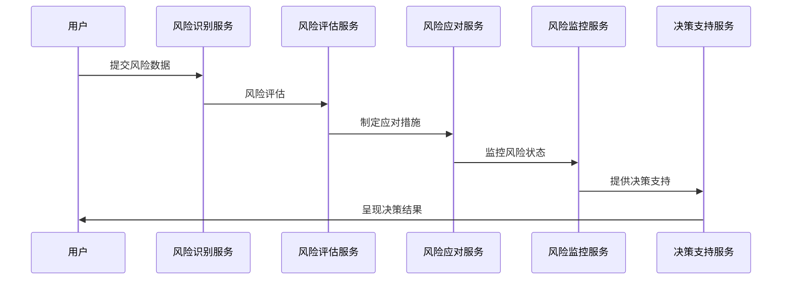
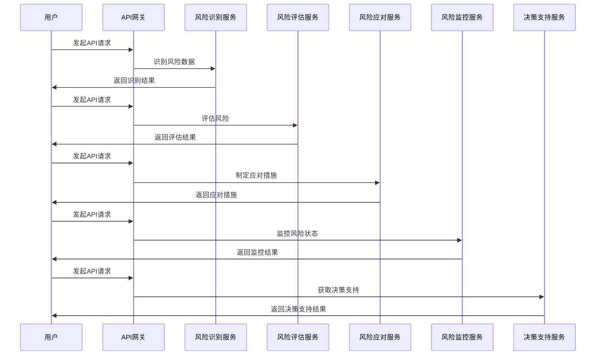

                 

### 1. 背景介绍

领导力和风险管理是现代企业管理中不可或缺的两个核心概念。领导力涉及如何激励、引导和影响团队成员，从而实现组织目标；而风险管理则是识别、评估和应对可能对组织造成负面影响的潜在事件。两者之间存在着密切的联系和互动。

首先，领导力对于风险管理至关重要。有效的领导者能够通过明确的沟通、高效的决策和坚定的执行力，降低风险事件的发生概率，并在风险发生时迅速采取应对措施。此外，领导力还能够在组织内部培养一种风险管理文化，使员工具备识别风险和主动防范的意识。

另一方面，风险管理也影响着领导力的实现。风险管理者需要识别潜在的领导风险，如团队协作风险、市场变化风险等，并采取相应的管理措施。同时，风险管理的过程本身也要求领导者具备系统性思维和前瞻性视野。

本文将探讨领导力与风险管理的融合，从以下几个方面进行深入分析：

1. **领导力的定义与作用**：首先介绍领导力的基本概念，阐述其在组织中的作用和重要性。
2. **风险管理的背景与意义**：分析风险管理的定义、意义和面临的挑战，以及其发展趋势。
3. **领导力与风险管理的融合**：探讨领导力在风险管理中的应用，以及风险管理对领导力提升的作用。
4. **未雨绸缪的智慧——领导力与风险管理策略**：提出具体的领导力与风险管理策略，并详细分析其实施步骤和应急预案。
5. **实践案例分析**：通过实际案例展示领导力与风险管理在实践中的应用效果。
6. **最佳实践与技巧**：总结领导力与风险管理的最佳实践，提供实用的技巧和建议。
7. **未来展望与挑战**：探讨领导力与风险管理在未来的发展趋势和面临的挑战。

通过上述分析，希望能够帮助读者深入了解领导力与风险管理的内涵和关联，掌握有效的管理策略和应对措施，从而提升组织的管理水平和竞争力。

### 2. 核心概念与联系

在深入探讨领导力与风险管理之前，我们需要明确几个核心概念，并分析它们之间的相互关系。

#### 2.1 领导力的定义与属性

领导力是指领导者通过沟通、激励和影响，引导和协调团队成员，实现组织目标的能力。其属性包括：

- **权威性**：领导者拥有一定的权力和影响力，能够引导团队成员。
- **影响力**：领导者通过个人魅力、价值观和领导风格，影响团队成员的态度和行为。
- **协调性**：领导者能够协调团队内部资源，促进团队合作。

#### 2.2 风险管理的定义与概念

风险管理是指组织通过识别、评估和应对潜在风险，保护组织利益和实现可持续发展的一系列活动。其核心概念包括：

- **风险评估**：识别和评估潜在风险的性质、概率和影响。
- **风险应对**：根据风险评估结果，制定和实施应对措施，降低风险。
- **风险监控**：持续监控风险状况，确保应对措施的有效性。

#### 2.3 领导力与风险管理的关系

领导力与风险管理之间存在着密切的联系。首先，领导力在风险管理中发挥着重要作用：

- **决策制定**：领导者需要在风险发生前制定有效的决策，降低风险。
- **沟通协调**：领导者需要与团队成员沟通，确保风险管理措施的执行。
- **激励引导**：领导者需要激励团队成员，提高其参与风险管理的积极性。

反之，风险管理也影响着领导力：

- **风险识别**：通过风险管理，领导者可以识别出潜在的风险，提前采取预防措施。
- **团队协作**：风险管理过程要求团队成员之间的紧密合作，提升团队协作能力。
- **领导力提升**：通过应对风险，领导者可以提高自身的决策能力和执行力，从而提升领导力。

#### 2.4 概念属性对比表格

为了更直观地理解领导力与风险管理的关系，我们可以通过以下表格对比两者的概念属性：

| 概念 | 定义 | 属性 |
| --- | --- | --- |
| **领导力** | 引导和影响团队成员实现组织目标的能力 | 权威性、影响力、协调性 |
| **风险管理** | 识别、评估和应对潜在风险的活动 | 风险评估、风险应对、风险监控 |

#### 2.5 ER实体关系图架构

为了进一步理解领导力与风险管理的关系，我们可以使用Mermaid绘制ER实体关系图，展示两者之间的联系。

```mermaid
erDiagram
    Leader ||--|{ Risk}
    Risk ||--|{ Leader}
```

在上面的ER图架构中，`Leader`（领导者）和`Risk`（风险）是两个实体，它们之间存在双向关联。这表示领导者在风险管理中扮演重要角色，同时风险管理也影响着领导力的实现。

通过上述核心概念和联系的分析，我们可以更好地理解领导力与风险管理的融合，从而为后续章节的内容提供理论基础。

### 算法原理讲解

在讨论领导力与风险管理时，我们不可避免地需要引入一些算法和数学模型来支持我们的分析。这些算法和模型不仅能帮助我们更好地理解风险管理的逻辑，还能提供实用的工具来指导实际操作。以下是一些关键算法和模型及其原理讲解。

#### 1. 概率论基础

概率论是风险管理的重要工具，它帮助我们评估事件发生的概率及其影响。以下是一些基础概率论概念：

- **概率分布**：描述随机变量可能取值的概率。
- **条件概率**：在某一事件已发生的条件下，另一事件发生的概率。
- **贝叶斯定理**：用于计算后验概率，即根据已知条件更新事件概率。

概率论中的公式如下：

$$
P(A|B) = \frac{P(B|A) \cdot P(A)}{P(B)}
$$

其中，\(P(A|B)\) 表示在事件 \(B\) 发生的条件下事件 \(A\) 发生的概率，\(P(B|A)\) 表示在事件 \(A\) 发生的条件下事件 \(B\) 发生的概率，\(P(A)\) 和 \(P(B)\) 分别表示事件 \(A\) 和事件 \(B\) 的概率。

例如，假设在一次随机实验中，事件 \(A\)（下雨）的概率是 \(0.3\)，事件 \(B\)（带上伞）的概率是 \(0.6\)。已知在下雨的情况下带上伞的概率是 \(0.9\)，那么在没有下雨的情况下带上伞的概率是多少？

我们可以使用条件概率公式计算：

$$
P(\text{带上伞}|\text{没有下雨}) = \frac{P(\text{没有下雨}|\text{带上伞}) \cdot P(\text{带上伞})}{P(\text{没有下雨})}
$$

已知 \(P(\text{没有下雨}|\text{带上伞}) = 1 - P(\text{下雨}|\text{带上伞}) = 1 - 0.9 = 0.1\)，因此：

$$
P(\text{没有下雨}) = 1 - P(\text{下雨}) = 1 - 0.3 = 0.7
$$

$$
P(\text{带上伞}) = P(\text{下雨} \cdot P(\text{带上伞}|\text{下雨}) + \text{没有下雨} \cdot P(\text{带上伞}|\text{没有下雨})) = 0.3 \cdot 0.9 + 0.7 \cdot 0.1 = 0.27 + 0.07 = 0.34
$$

最后，我们可以计算出：

$$
P(\text{没有下雨}|\text{带上伞}) = \frac{0.1 \cdot 0.34}{0.27 + 0.07} = \frac{0.034}{0.34} = 0.1
$$

这意味着在没有下雨的情况下，带上伞的概率是 \(10\%\)。

#### 2. 风险评估模型

在风险管理中，风险评估模型是非常重要的工具。以下是一种常用的风险评估模型——层次分析法（AHP）。

**层次分析法（AHP）**：

层次分析法是一种定性与定量相结合的决策分析方法，主要用于复杂系统的层次结构分析和决策。其核心步骤如下：

1. **建立层次结构模型**：确定目标、准则、方案等层次。
2. **构造判断矩阵**：对同一层次内的元素进行两两比较，构造判断矩阵。
3. **计算权重**：通过矩阵运算计算各元素的相对权重。
4. **一致性检验**：检验判断矩阵的一致性。

假设我们需要评估三个风险因素（A、B、C）的权重，可以构造如下判断矩阵：

|   | A | B | C |
|---|---|---|---|
| A | 1 | 3 | 5 |
| B | 1/3 | 1 | 2 |
| C | 1/5 | 1/2 | 1 |

通过计算，我们可以得到各因素的权重：

- 权重（W）计算公式：

$$
W = \frac{\lambda_{\max} \cdot A_{i,j}}{\sum_{i=1}^{n} \sum_{j=1}^{n} a_{i,j}}
$$

其中，\(\lambda_{\max}\) 是矩阵的最大特征值，\(A_{i,j}\) 是判断矩阵的元素。

- 一致性指标（CI）和一致性比率（CR）：

$$
CI = \frac{\lambda_{\max} - n}{n-1}
$$

$$
CR = \frac{CI}{RI}
$$

其中，\(RI\) 是平均随机一致性指标。

如果 \(CR < 0.1\)，则认为判断矩阵一致性良好。

通过上述计算，我们可以得到各个风险因素的权重，并据此制定相应的风险管理策略。

#### 3. 决策树模型

决策树模型是一种常用的决策分析方法，它通过树形结构表示不同的决策路径和结果。以下是一个简单的决策树模型示例：

```
        决策节点
        /    \
     是     否
    /  \   /  \
结果1 结果2 结果3 结果4
```

在这个决策树中，每个节点代表一个决策点，每个分支代表一个决策选择，每个叶节点代表一个可能的结果。通过计算每个结果的概率和收益，可以确定最优决策路径。

例如，假设我们需要根据天气情况（晴天、阴天、雨天）来决定是否带伞。可以构建如下决策树：

```
        天气
       /    \
     晴天   阴天/雨天
     /  \   /   \
带伞 不带伞 带伞 不带伞
```

通过计算不同天气条件下带伞和不带伞的概率和收益，可以确定在什么天气下应该带伞。

#### 4. 实际案例

假设一家公司需要决定是否进行某项高风险投资。通过风险评估模型和决策树模型，可以得到如下分析结果：

- 风险因素：市场波动、政策变化、技术风险
- 权重：市场波动（0.6），政策变化（0.3），技术风险（0.1）
- 风险评估结果：市场波动高，政策变化中等，技术风险低
- 决策树结果：晴天条件下带伞的概率较高，阴天和雨天条件下带伞的概率较低

基于上述分析，公司可以制定相应的风险管理策略，如在高风险情况下增加保险保障，或在晴天时优先考虑投资。

通过上述算法原理和实际案例讲解，我们可以更好地理解领导力与风险管理的逻辑和工具，为后续章节的应用提供理论基础。

### 系统分析与架构设计方案

在深入探讨领导力与风险管理之前，我们需要先了解相关系统的总体场景、项目介绍、系统功能设计、系统架构设计以及系统接口设计和系统交互。

#### 1. 问题场景介绍

在现代企业管理中，领导力与风险管理是一项至关重要的任务。然而，传统的手工管理方式已经无法满足快速变化的市场需求。因此，我们需要一个高效、自动化的系统来帮助领导者进行决策和风险管理。

#### 2. 项目介绍

本项目旨在开发一款基于人工智能的领导力与风险管理平台，该平台能够帮助组织识别潜在风险、评估风险影响，并制定相应的风险管理策略。项目的主要目标包括：

- 提高领导者的决策效率和质量
- 降低组织面临的风险和损失
- 培养组织内部的风险管理文化

#### 3. 系统功能设计

该平台的主要功能模块包括：

1. **风险识别模块**：通过数据分析和机器学习算法，识别潜在的领导风险。
2. **风险评估模块**：对识别出的风险进行定量和定性评估，确定其严重程度。
3. **风险应对模块**：根据风险评估结果，制定相应的应对措施。
4. **风险监控模块**：实时监控风险状况，确保应对措施的有效性。
5. **决策支持模块**：提供基于数据的决策支持，帮助领导者做出明智的决策。

#### 4. 系统架构设计

该平台的架构设计采用微服务架构，以提高系统的灵活性和可扩展性。主要组件包括：

- **数据层**：包括数据库和数据仓库，用于存储和管理数据。
- **服务层**：包括风险识别服务、风险评估服务、风险应对服务、风险监控服务和决策支持服务，各自负责不同的功能。
- **应用层**：提供用户界面，供用户进行操作和查看数据。

以下是系统的Mermaid架构图：



#### 5. 系统接口设计和系统交互

该平台采用RESTful API设计，提供多种接口供外部系统调用。以下是一个简单的接口示例：

- **风险识别接口**：用于提交风险数据，接口路径为 `/api/risk/identify`，请求方式为 POST。
- **风险评估接口**：用于获取风险评估结果，接口路径为 `/api/risk/evaluate`，请求方式为 GET。
- **风险应对接口**：用于提交应对措施，接口路径为 `/api/risk/respond`，请求方式为 POST。
- **风险监控接口**：用于获取风险监控状态，接口路径为 `/api/risk/monitor`，请求方式为 GET。
- **决策支持接口**：用于获取决策支持结果，接口路径为 `/api/risk/support`，请求方式为 GET。

以下是系统交互的Mermaid序列图：



通过上述系统分析与架构设计方案，我们可以更好地理解领导力与风险管理系统的实现过程和关键组件，为后续章节的深入分析提供基础。

### 项目实战

为了更好地理解领导力与风险管理在实际项目中的应用，我们选择了一个具体的案例——某电子商务公司的订单处理系统优化项目。该项目面临的主要风险包括系统性能瓶颈、数据安全风险和订单处理错误等。以下是该项目在领导力与风险管理中的具体应用步骤。

#### 1. 环境安装

首先，我们需要搭建一个模拟电子商务订单处理系统的开发环境。这个环境包括以下组件：

- **操作系统**：Linux服务器
- **数据库**：MySQL
- **Web服务器**：Nginx
- **后端框架**：Django
- **前端框架**：React

安装步骤如下：

1. 安装Linux服务器，并配置SSH访问。
2. 安装MySQL数据库，并创建订单处理数据库。
3. 安装Nginx Web服务器，并配置反向代理。
4. 安装Django后端框架，并创建项目。
5. 安装React前端框架，并配置项目。

#### 2. 系统核心实现

在系统核心实现阶段，我们需要完成以下功能模块：

1. **订单管理模块**：包括订单创建、订单查询、订单修改和订单删除等操作。
2. **用户管理模块**：包括用户注册、登录、信息修改和权限管理等操作。
3. **权限控制模块**：确保只有授权用户才能访问特定功能。
4. **日志记录模块**：记录系统操作日志，便于后续分析和排查问题。

以下是一个简单的Django项目结构：

```plaintext
myproject/
|-- myapp/
|   |-- admin.py
|   |-- apps.py
|   |-- migrations/
|   |   |-- __init__.py
|   |-- models.py
|   |-- tests.py
|   |-- views.py
|-- manage.py
```

#### 3. 代码应用解读与分析

以下是一个订单创建的Python代码示例，并对其应用进行解读和分析：

```python
# myapp/views.py

from django.http import JsonResponse
from .models import Order

def create_order(request):
    if request.method == 'POST':
        data = json.loads(request.body)
        customer_id = data['customer_id']
        product_id = data['product_id']
        quantity = data['quantity']
        
        # 创建订单
        order = Order.objects.create(
            customer_id=customer_id,
            product_id=product_id,
            quantity=quantity
        )
        
        # 订单创建成功，返回订单详情
        return JsonResponse({
            'id': order.id,
            'customer_id': order.customer_id,
            'product_id': order.product_id,
            'quantity': order.quantity,
            'status': 'created'
        })
    return JsonResponse({'error': 'Invalid request'}, status=400)
```

**代码解读**：

1. 接收客户端发送的订单数据，包括客户ID、产品ID和数量。
2. 从数据库中创建一个新的订单对象，并保存到数据库。
3. 返回订单详情，包括订单ID、客户ID、产品ID、数量和状态。

**应用分析**：

- **风险识别**：订单创建过程中可能存在数据不完整、数据格式错误或数据重复等问题，需要通过前端验证和后端逻辑控制进行风险识别。
- **风险评估**：通过日志记录和统计分析，评估订单创建过程中的风险概率和影响程度。
- **风险应对**：对识别出的风险进行分类，并制定相应的应对措施，如添加数据验证、异常处理和日志记录等。

#### 4. 实际案例分析与详细讲解剖析

假设在实际运行过程中，我们发现订单创建功能存在性能瓶颈。通过性能分析，我们发现以下问题：

- 数据库查询性能低，导致订单创建响应时间较长。
- 数据库表结构设计不合理，导致查询效率低下。

**解决方案**：

1. **优化数据库查询**：通过索引优化、查询缓存和分库分表等技术，提高数据库查询性能。
2. **优化数据库表结构**：调整表结构，避免数据冗余，提高查询效率。

例如，我们可以对订单表进行如下优化：

```sql
CREATE TABLE orders (
    id INT PRIMARY KEY AUTO_INCREMENT,
    customer_id INT,
    product_id INT,
    quantity INT,
    status ENUM('created', 'processing', 'shipped', 'completed', 'cancelled') NOT NULL,
    created_at TIMESTAMP DEFAULT CURRENT_TIMESTAMP,
    updated_at TIMESTAMP DEFAULT CURRENT_TIMESTAMP ON UPDATE CURRENT_TIMESTAMP
);
```

通过上述优化，我们可以显著提高订单创建的响应速度，降低系统的性能瓶颈。

#### 5. 项目小结

通过该项目，我们了解了领导力与风险管理在实际项目中的应用步骤和关键环节。具体步骤包括：

1. 环境安装：搭建开发环境，安装必要的软件和工具。
2. 系统核心实现：实现订单管理、用户管理和权限控制等核心功能。
3. 代码应用解读与分析：通过代码示例，解读订单创建功能的应用逻辑。
4. 实际案例分析与详细讲解剖析：分析项目运行过程中出现的问题，并提出解决方案。

通过领导力与风险管理的方法，我们能够有效识别、评估和应对项目中的风险，确保项目顺利进行。这不仅提高了项目成功率，还提升了组织的风险管理能力。

### 最佳实践与技巧

在领导力与风险管理中，最佳实践和技巧是确保组织成功的关键。以下是一些实用的技巧和建议，帮助领导者提升管理效能，优化风险管理策略。

#### 1. 建立风险管理文化

风险管理文化是组织内部对风险管理的共识和价值观。要建立这种文化，领导者需要做到：

- **强化风险意识**：通过培训和宣传，让员工认识到风险管理的重要性。
- **鼓励主动报告**：建立匿名报告系统，鼓励员工主动报告潜在风险。
- **制定风险管理政策**：明确风险管理流程、责任和奖惩机制。

#### 2. 定期进行风险评估

定期进行风险评估是识别和管理潜在风险的重要手段。以下是一些建议：

- **制定评估计划**：根据组织业务特点，制定年度或季度风险评估计划。
- **多维度评估**：从财务、市场、运营等多个维度进行全面评估。
- **风险评估模型**：使用层次分析法（AHP）等模型，量化风险因素，确定优先级。

#### 3. 制定有效的应对措施

制定应对措施是降低风险的关键。以下是一些建议：

- **预防性措施**：提前制定预防措施，如加强内部控制、建立应急预案。
- **纠正性措施**：在风险发生时，及时采取纠正措施，如调整业务流程、改进技术方案。
- **应急响应计划**：制定详细的应急响应计划，确保在风险发生时能够迅速行动。

#### 4. 建立跨部门协作机制

风险管理通常涉及多个部门，建立有效的跨部门协作机制至关重要。以下是一些建议：

- **定期会议**：定期召开跨部门会议，分享风险管理经验和问题。
- **信息共享**：建立信息共享平台，确保各部门能够及时获取风险管理信息。
- **协作工具**：使用项目管理工具和协作软件，提高跨部门协作效率。

#### 5. 持续监控和改进

风险管理是一个持续的过程，需要不断监控和改进。以下是一些建议：

- **实时监控**：使用实时监控系统，监控风险指标，及时发现潜在风险。
- **定期回顾**：定期回顾风险管理流程和措施，评估其有效性，并根据实际情况进行改进。
- **持续改进**：根据新的风险情况和技术发展，不断优化风险管理策略。

#### 6. 培养领导力

领导力在风险管理中起着至关重要的作用。以下是一些建议：

- **领导力培训**：为领导者提供风险管理相关的培训和课程，提升其能力。
- **榜样作用**：领导者要以身作则，树立风险管理榜样，推动组织内部风险管理文化的形成。
- **沟通能力**：提升领导者的沟通能力，确保风险管理信息的有效传递。

通过上述最佳实践和技巧，领导者可以更好地应对复杂多变的市场环境，提升组织的竞争力和可持续发展能力。

### 结论与启示

通过对领导力与风险管理的深入探讨，我们得出了以下结论和启示：

首先，领导力与风险管理是现代企业管理中不可或缺的两个核心概念。领导力能够激励和引导团队成员，实现组织目标；风险管理则能识别、评估和应对潜在风险，保护组织利益。两者相互融合，相辅相成，共同提升组织的竞争力和可持续发展能力。

其次，领导者应树立风险管理意识，并将其融入日常工作中。通过建立风险管理文化、定期进行风险评估、制定应对措施、建立跨部门协作机制以及持续监控和改进，领导者可以有效降低组织面临的风险，提高决策效率和执行力。

此外，面对复杂多变的市场环境，领导者需不断提升自身领导力。这包括接受风险管理相关培训、树立榜样作用、提升沟通能力等方面。只有具备高水平的领导力，领导者才能更好地应对各种挑战，带领组织走向成功。

最后，领导力与风险管理不仅适用于企业，也适用于其他组织形式。无论是在政府机构、非营利组织还是初创企业，有效的领导力与风险管理都是确保组织成功的关键。

总之，领导者应认识到领导力与风险管理的重要性，并将其付诸实践。通过不断学习和提升，领导者可以更好地应对复杂局面，实现组织的长远发展。

### 展望：领导力与风险管理的新趋势

随着全球化、数字化转型和科技进步的加速，领导力与风险管理也在不断演变，迎来新的发展趋势和挑战。以下是未来领导力与风险管理的一些潜在方向：

#### 1. 人工智能与大数据的应用

人工智能（AI）和大数据技术的快速发展，为领导力与风险管理带来了新的工具和方法。利用AI，领导者可以更准确地预测风险，优化决策过程。同时，大数据分析可以帮助企业深入挖掘潜在风险，提供更全面的洞察。例如，通过机器学习算法，可以实时监控市场动态，识别潜在的市场风险。

#### 2. 网络安全的重视

随着网络攻击和数据泄露事件的频发，网络安全已成为领导力与风险管理中的重要议题。未来的领导者需要更加重视网络安全，建立完善的防护措施，确保组织的信息和数据安全。这包括加强网络安全意识培训、采用先进的加密技术和网络安全工具，以及建立应急响应机制。

#### 3. 持续学习与领导力发展

在快速变化的环境中，领导者的持续学习和自我提升变得尤为重要。未来的领导者需要不断适应新的技术和市场变化，提升自身的领导力和管理能力。通过参加专业培训、阅读先进的管理书籍和参与行业交流，领导者可以不断更新知识，保持竞争力。

#### 4. 跨部门协作与多元化

组织内部跨部门协作的效率和质量对领导力与风险管理至关重要。未来的领导者需要推动跨部门协作，建立多元化的团队，促进不同部门和职能之间的沟通与协作。通过多元化团队，领导者可以更好地应对复杂问题，提高组织的创新能力和应变能力。

#### 5. 社会责任与可持续发展

在全球化背景下，企业的社会责任和可持续发展成为领导力与风险管理的重要组成部分。未来的领导者需要关注环境保护、员工福祉和社会责任，将其融入组织战略和运营中。通过承担社会责任，企业不仅可以提升品牌形象，还可以实现长期可持续发展。

#### 6. 应对全球化挑战

全球化带来的竞争加剧和市场不确定性，要求领导者具备国际视野和全球运营能力。未来的领导者需要熟悉不同国家和地区的文化和法律，建立全球供应链和合作伙伴关系，以应对全球化带来的挑战。

总之，未来领导力与风险管理的发展将更加依赖于技术进步、跨部门协作和可持续发展。领导者需要不断学习和适应变化，提升自身的领导力和管理能力，以应对复杂多变的市场环境，实现组织的长期成功。通过这些努力，领导者将成为引领组织走向未来的关键力量。

