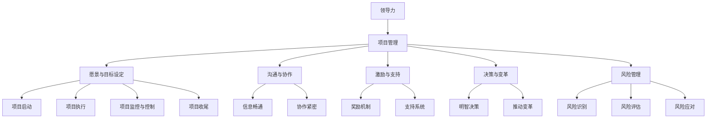
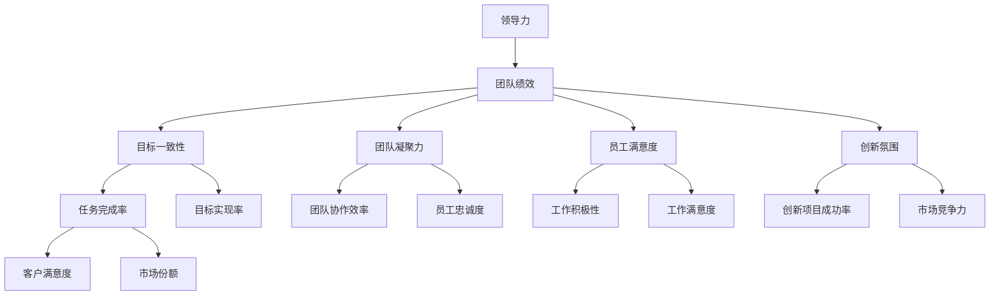

                 

### 1.2 领导力的核心概念与联系

#### 1.2.1 核心概念

领导力并非单一维度的能力，它涵盖了多个核心概念，每个概念在领导过程中起着至关重要的作用。以下是几个关键的领导力核心概念：

1. **领导者使命与愿景**：领导者的使命是明确团队或组织的目标和方向，愿景则是描述未来想要达到的理想状态。使命和愿景为团队提供了明确的方向感和目标感，是领导力的基础。

2. **团队建设与领导力**：团队建设是领导者的重要任务之一。这包括建立有效的沟通机制、促进团队成员之间的协作、培养团队精神和提高团队的绩效。优秀的团队建设能够增强团队的凝聚力，提高工作效率。

3. **创新思维与决策能力**：领导者需要具备创新思维，不断推动组织创新，以适应快速变化的市场环境。同时，领导者还需要拥有卓越的决策能力，能够在面对复杂问题和不确定性时做出明智的选择。

#### 1.2.2 概念间的联系

这些核心概念并非孤立存在，它们之间存在密切的联系和相互作用：

- **领导者使命与愿景**与**团队建设与领导力**的关系：明确的使命和愿景可以指导团队建设的方向，帮助团队更好地理解和认同组织的目标，从而提高团队的凝聚力和工作效率。

- **团队建设与领导力**与**创新思维与决策能力**的关系：一个有效的团队需要领导者具备创新思维和决策能力，以推动团队不断进步和应对挑战。

- **创新思维与决策能力**与**领导者使命与愿景**的关系：创新思维和决策能力是实现领导者愿景和使命的关键。只有不断创新和明智决策，领导者才能带领团队实现长期的愿景。

#### 1.2.3 概念属性特征对比表格

为了更清晰地展示这些核心概念的属性特征，我们可以创建一个对比表格：

| 概念              | 特征                                 |
|-----------------|------------------------------------|
| 领导者的使命    | 指引团队方向，明确目标和价值     |
| 团队建设        | 增强团队凝聚力，提高团队效率     |
| 创新思维        | 鼓励创新，推动组织发展           |

#### 1.2.4 概念间的ER实体关系图架构

为了进一步理解这些核心概念之间的联系，我们可以使用Mermaid绘制一个ER（实体关系）图：

```mermaid
erDiagram
    Leader_Mission ||--o> Team_Building : "guides"
    Leader_Mission ||--o> Leadership : "enables"
    Team_Building ||--o> Innovation_Thinking : "promotes"
    Team_Building ||--o> Decision_Making : "enhances"
    Leadership ||--o> Innovation_Thinking : "drives"
    Leadership ||--o> Decision_Making : "supports"
```

这张ER图展示了领导者使命、团队建设、创新思维和决策能力之间的相互关系，帮助读者更直观地理解这些核心概念。

### 1.2.5 领导力的影响因素

除了核心概念，领导力的发展还受到多种因素的影响：

- **组织文化**：组织文化是领导力的土壤。一个积极、开放、包容的组织文化能够促进领导力的提升，反之，则可能阻碍领导力的发挥。

- **个人特质**：领导者的个人特质，如自信、决心、正直等，对领导力有着重要的影响。

- **外部环境**：外部环境的变化，如市场环境、政策法规等，也会对领导力产生影响。

综上所述，领导力的核心概念包括领导者使命与愿景、团队建设与领导力、创新思维与决策能力，它们之间相互联系、相互作用。这些概念不仅构成了领导力的基础，而且对领导力的发展有着深远的影响。通过深入理解和应用这些概念，领导者可以更有效地发挥领导力，推动组织的发展和进步。 ### 2.1 领导力心理学

#### 2.1.1 领导行为心理学

领导行为心理学是研究领导者在具体情境下如何表现和行为的一门学科。它涵盖了领导者如何影响团队成员、如何处理冲突、以及如何在不同的领导情境中做出决策等方面。

##### 2.1.1.1 领导行为的理论基础

领导行为的理论基础主要包括以下几个重要理论：

1. **X理论和Y理论**：X理论认为，员工需要严密的监督和惩罚才能有效地工作，而Y理论则认为员工具有内在的工作动机，能够在适当的条件下自主完成任务。

2. **领导连续体理论**：该理论由Hersey和Blanchard提出，认为领导风格应该根据下属的成熟度进行调整。领导风格包括指导式、推销式、参与式和委托式。

3. **情境领导理论**：该理论由赫赛和布兰查德提出，认为领导风格应该根据下属的成熟度进行动态调整。情境领导理论包括四种领导风格：指令型、推销型、参与型和授权型。

##### 2.1.1.2 领导行为的特点与类型

领导行为的特点包括：

- **目标导向**：领导者通常能够明确组织或团队的目标，并致力于实现这些目标。
- **影响力**：领导者通过行为和决策影响团队成员，引导他们朝着共同的目标前进。
- **沟通能力**：领导者需要具备良好的沟通能力，能够有效地传达信息、激励团队和解决冲突。

领导行为的类型可以分为：

- **交易型领导**：交易型领导注重短期目标和绩效，通过奖励和惩罚来激励团队成员。
- **变革型领导**：变革型领导注重长期目标和组织发展，通过激励、启发和激励来推动团队变革。

#### 2.1.2 领导者心理素质

领导者的心理素质对其领导效果有着重要影响。以下是一些关键的领导者心理素质：

##### 2.1.2.1 自我意识与自我调节

自我意识是指领导者对自己情感、思维和行为的了解。自我调节是指领导者能够控制自己的情绪和行为，保持冷静和理性。

##### 2.1.2.2 压力管理与情绪控制

领导者往往面临巨大的压力，因此需要具备良好的压力管理和情绪控制能力。这包括：

- **时间管理**：合理安排时间和任务，避免过度劳累。
- **情绪调节**：学会表达和处理负面情绪，保持积极的心态。

##### 2.1.2.3 心理韧性与适应能力

心理韧性是指领导者面对挑战和逆境时的适应能力。领导者需要具备以下能力：

- **反思与学习**：从失败和挑战中学习，不断成长。
- **灵活适应**：适应不断变化的环境和需求。

#### 2.1.3 领导力的影响因素

领导力不仅取决于领导者的个人素质，还受到多种因素的影响：

- **组织文化**：组织文化对领导者的行为和决策产生重要影响。
- **团队成员**：团队成员的个性、技能和态度会影响领导者的领导效果。
- **外部环境**：外部环境的变化，如市场、政策等，也会影响领导者的领导力。

通过了解和掌握领导行为心理学的理论和实践，领导者可以更好地理解自己的行为，提高领导效果，从而更有效地推动组织的发展和进步。

### 2.2 领导力的核心要素

#### 2.2.1 核心概念与联系

领导力的核心要素包括领导者的使命与愿景、团队建设、创新思维和决策能力。这些要素相互关联，共同构成了领导力的基础。

##### 2.2.1.1 领导者的使命与愿景

领导者的使命是明确团队或组织的目标和方向，愿景则是描述未来想要达到的理想状态。使命和愿景为团队提供了明确的方向感和目标感，是领导力的基础。

- **使命**：指引团队方向，明确目标和价值。
- **愿景**：描述未来想要达到的理想状态，激励团队前进。

##### 2.2.1.2 团队建设

团队建设是领导者的重要任务之一。这包括建立有效的沟通机制、促进团队成员之间的协作、培养团队精神和提高团队的绩效。

- **团队建设**：增强团队凝聚力，提高团队效率。

##### 2.2.1.3 创新思维与决策能力

领导者需要具备创新思维和决策能力，以推动组织的发展和应对复杂的市场环境。

- **创新思维**：鼓励创新，推动组织发展。
- **决策能力**：在复杂情境中做出明智的选择。

##### 2.2.1.4 概念间的联系

这些核心要素之间存在密切的联系和相互作用：

- **领导者使命与愿景**与**团队建设**的关系：明确的使命和愿景可以指导团队建设的方向，帮助团队更好地理解和认同组织的目标，从而提高团队的凝聚力和工作效率。
- **团队建设**与**创新思维与决策能力**的关系：一个有效的团队需要领导者具备创新思维和决策能力，以推动团队不断进步和应对挑战。
- **创新思维与决策能力**与**领导者使命与愿景**的关系：创新思维和决策能力是实现领导者愿景和使命的关键。只有不断创新和明智决策，领导者才能带领团队实现长期的愿景。

#### 2.2.2 概念属性特征对比表格

为了更清晰地展示这些核心概念的属性特征，我们可以创建一个对比表格：

| 概念              | 特征                                 |
|-----------------|------------------------------------|
| 领导者的使命    | 指引团队方向，明确目标和价值     |
| 团队建设        | 增强团队凝聚力，提高团队效率     |
| 创新思维        | 鼓励创新，推动组织发展           |
| 决策能力        | 在复杂情境中做出明智的选择       |

#### 2.2.3 概念间的ER实体关系图架构

为了进一步理解这些核心概念之间的联系，我们可以使用Mermaid绘制一个ER（实体关系）图：

```mermaid
erDiagram
    Leadership_Mission ||--o> Team_Building : "defines direction"
    Leadership_Vision ||--o> Team_Building : "guides development"
    Team_Building ||--o> Innovation_Thinking : "promotes growth"
    Team_Building ||--o> Decision_Making : "enhances efficiency"
    Innovation_Thinking ||--o> Leadership_Vision : "drives progress"
    Decision_Making ||--o> Leadership_Mission : "ensures success"
```

这张ER图展示了领导者使命、愿景、团队建设、创新思维和决策能力之间的相互关系，帮助读者更直观地理解这些核心概念。

### 2.2.4 领导力核心要素的案例分析

为了更好地理解领导力的核心要素，我们可以通过一些实际案例进行分析。

#### 案例一：杰克·韦尔奇与通用电气

杰克·韦尔奇是通用电气的传奇CEO，他的领导风格和战略决策极大地推动了通用电气的发展。以下是几个关键点：

- **领导者使命与愿景**：韦尔奇明确了通用电气的使命，即成为全球领先的企业，并在各个行业创造价值。他的愿景是让通用电气成为“数一数二”的公司。
- **团队建设**：韦尔奇强调团队合作和多元化，他通过不断重组和优化组织结构，增强了团队的凝聚力和效率。
- **创新思维**：韦尔奇鼓励创新，他提出“数一数二”的战略，要求通用电气的业务部门在各自领域保持领先地位。
- **决策能力**：韦尔奇在面临重大决策时表现出卓越的决策能力，如在1980年代决定退出家用电器业务，专注于核心业务。

通过这些措施，杰克·韦尔奇成功地推动了通用电气的发展，使其成为全球领先的多元化企业。

#### 案例二：马斯克与特斯拉

埃隆·马斯克是特斯拉和SpaceX的创始人，他的领导风格和战略决策对科技行业产生了深远的影响。以下是几个关键点：

- **领导者使命与愿景**：马斯克明确了特斯拉的使命，即通过生产电动汽车和可再生能源产品，加速世界向可持续能源的转变。他的愿景是创造一个可持续的能源未来。
- **团队建设**：马斯克注重团队合作和创新，他通过建立高效的工作环境和激励措施，吸引了全球顶尖的科技人才。
- **创新思维**：马斯克在电动汽车和太空探索领域不断推动创新，他提出了超级电池、太阳能屋顶等革命性产品。
- **决策能力**：马斯克在面临重大决策时表现出果敢和决心，如决定在2020年期间加速生产特斯拉Model Y和特斯拉Cybertruck。

通过这些措施，埃隆·马斯克成功地推动了特斯拉和SpaceX的发展，使其成为全球领先的科技公司。

这些案例展示了领导力的核心要素在实际应用中的重要性。通过深入理解并应用这些要素，领导者可以更有效地推动组织的发展和进步。

### 2.2.5 领导力的应用挑战与解决方案

尽管领导力的核心要素非常重要，但在实际应用中，领导者仍会面临各种挑战。以下是几个常见的挑战以及相应的解决方案：

#### 挑战一：团队凝聚力不足

- **解决方案**：领导者可以通过加强团队建设活动、促进团队成员之间的沟通和协作，来提高团队凝聚力。例如，定期组织团队建设活动、设立共同目标、建立开放沟通渠道等。

#### 挑战二：创新能力不足

- **解决方案**：领导者可以鼓励团队成员提出创新想法，并建立创新激励机制。例如，设立创新奖、定期举行创新研讨会、提供培训和学习机会等。

#### 挑战三：决策困难

- **解决方案**：领导者可以培养良好的决策习惯，例如，进行充分的调研和分析、寻求多方意见、制定明确的决策标准等。此外，领导者还可以学习并应用各种决策模型和工具，如SWOT分析、决策树等。

通过克服这些挑战，领导者可以更好地发挥领导力的核心要素，推动组织的发展和进步。

综上所述，领导力的核心要素包括领导者使命与愿景、团队建设、创新思维和决策能力。这些要素相互关联、相互作用，共同构成了领导力的基础。通过深入理解并应用这些要素，领导者可以更有效地推动组织的发展和进步。同时，领导者也需要面对实际应用中的挑战，并寻求相应的解决方案。只有这样，领导者才能真正发挥其领导力，引领组织走向成功。 ### 2.3 领导力的实践方法

#### 2.3.1 领导力训练与教练

领导力训练与教练是提升领导者能力的重要手段。通过系统的培训和专业教练的指导，领导者可以在实践过程中不断成长和进步。

##### 2.3.1.1 领导力培训

领导力培训通常包括以下内容：

1. **基础理论知识**：了解领导力的核心概念、理论框架和关键要素。
2. **实践技能**：学习如何在实际工作中应用领导力，如沟通技巧、团队建设、冲突管理等。
3. **情境模拟**：通过模拟真实工作情境，锻炼领导者的应变能力和决策能力。
4. **案例分析**：分析成功和失败的领导案例，从中吸取经验和教训。

##### 2.3.1.2 领导力教练

领导力教练是一种个性化的指导方式，旨在帮助领导者解决实际工作中的问题，提升领导效果。教练过程通常包括：

1. **个性化目标设定**：根据领导者的个人需求和职业目标，设定具体的培训计划。
2. **一对一指导**：教练与领导者进行一对一沟通，提供反馈和建议，帮助领导者识别和克服自身问题。
3. **持续跟进**：教练定期与领导者进行沟通，评估培训效果，并根据实际情况调整培训计划。
4. **实践指导**：教练在实践过程中给予领导者指导和支持，帮助其在实际工作中应用所学知识和技能。

#### 2.3.2 领导力发展计划

领导力发展计划是组织提升领导者能力的重要措施。通过系统的计划和持续的努力，组织可以培养出一批具备高素质的领导者。

##### 2.3.2.1 计划制定

领导力发展计划的制定通常包括以下步骤：

1. **需求分析**：分析组织当前领导力的现状，确定需要提升的方面。
2. **目标设定**：根据需求分析结果，设定具体的领导力发展目标。
3. **方案设计**：设计包括培训、教练、实践等多方面的领导力发展方案。
4. **资源分配**：确定所需的资源和预算，确保计划的顺利实施。

##### 2.3.2.2 实施与监督

领导力发展计划的实施和监督是确保计划效果的重要环节。具体措施包括：

1. **培训与教练**：按照计划开展培训与教练活动，确保领导者的能力提升。
2. **评估与反馈**：定期对领导者的能力进行评估，提供反馈，帮助其改进。
3. **实践与支持**：鼓励领导者将所学知识和技能应用于实际工作中，并提供必要的支持和资源。
4. **调整与优化**：根据评估结果和实际效果，及时调整和优化发展计划。

#### 2.3.3 领导力模型与方法

领导力模型与方法是指导领导者实践的重要工具。以下是一些常见的领导力模型和方法：

##### 2.3.3.1 领导力模型

1. **领导生命周期模型**：根据下属的成熟度调整领导风格，包括指导式、推销式、参与式和授权式。
2. **情境领导模型**：根据工作环境和下属特点选择合适的领导风格，包括指令型、推销型、参与型和授权型。
3. **变革型领导模型**：通过激励、启发和激励来推动团队变革。

##### 2.3.3.2 领导力方法

1. **目标设定法**：明确团队和个人的目标，并制定实现目标的计划和措施。
2. **沟通技巧**：有效沟通是领导者的关键能力，包括倾听、表达、反馈等。
3. **团队建设**：通过活动和措施增强团队凝聚力，提高团队效率。

#### 2.3.4 持续提升领导力的策略

持续提升领导力是领导者职业生涯的重要任务。以下是一些有效的策略：

1. **自我反思**：定期进行自我反思，识别自身优点和不足，制定改进计划。
2. **学习与成长**：不断学习新知识和技能，关注行业动态，保持竞争优势。
3. **实践与经验**：通过实际工作积累经验，不断总结和提升领导力。
4. **建立人脉**：与行业内外优秀领导者交流，分享经验和观点，拓宽视野。

通过领导力训练与教练、领导力发展计划、领导力模型与方法以及持续提升领导力的策略，领导者可以不断提升自己的领导能力，更好地应对挑战，推动组织的发展和进步。 ### 2.4 领导力在挑战性情境下的应用

#### 2.4.1 挑战性情境的特点

在挑战性情境下，领导者面临的是高度不确定性和复杂性的环境，这需要他们具备卓越的领导力和决策能力。以下是一些挑战性情境的特点：

1. **不确定性**：在挑战性情境下，信息的获取和处理往往受到限制，领导者难以准确预测未来的发展趋势。
2. **复杂性**：挑战性情境中往往涉及多个利益相关者和多种因素，领导者需要考虑各种可能的后果和影响。
3. **压力与危机**：在挑战性情境中，领导者往往面临巨大的压力和危机，需要迅速做出决策并采取行动。
4. **变革与调整**：挑战性情境下，组织可能需要做出重大的变革和调整，以应对新的挑战和机遇。

#### 2.4.2 应对挑战性情境的策略

在面对挑战性情境时，领导者可以采取以下策略来提高应对能力和决策效果：

1. **保持冷静与理性**：在压力和危机中保持冷静和理性，是领导者应对挑战的基础。通过深呼吸、冥想等方式缓解紧张情绪，从而做出更明智的决策。
2. **快速收集信息**：尽管在挑战性情境下信息的获取和处理可能受到限制，但领导者仍需尽可能地快速收集相关信息。通过与团队成员、外部专家和利益相关者进行沟通，获取多角度的信息，为决策提供依据。
3. **情景模拟与风险评估**：在做出决策之前，领导者可以采用情景模拟和风险评估等方法，分析不同决策方案的可能后果和风险。这有助于领导者更全面地考虑各种因素，选择最优的决策方案。
4. **分阶段决策**：在复杂和不确定的情境下，领导者可以采用分阶段决策的方法。将复杂的问题分解为多个阶段，逐步解决，以便更好地应对挑战。
5. **利用团队力量**：领导者应该充分发挥团队成员的专业知识和经验，共同应对挑战。通过团队讨论和协作，可以集思广益，提高决策质量和执行效果。
6. **灵活调整策略**：在挑战性情境下，领导者需要保持灵活性，根据实际情况及时调整策略。在执行过程中，领导者应密切关注进展情况，及时发现问题并采取纠正措施。

#### 2.4.3 案例分析

以下是一个案例分析，展示了领导者如何在挑战性情境下应用领导力。

**案例：新冠疫情下的企业应对**

在新冠疫情爆发初期，一家全球知名企业迅速采取了多项措施，以应对疫情带来的挑战。以下是该企业的应对策略：

1. **快速响应**：在疫情爆发初期，企业高层迅速召开紧急会议，讨论疫情对企业运营的影响，并制定了一系列应对措施。
2. **信息透明**：企业通过内部邮件、内部网站和社交媒体等方式，及时向员工传递疫情信息，确保员工了解最新的情况。
3. **远程办公**：为了确保员工的安全，企业迅速推行远程办公，并提供必要的设备和技术支持。
4. **供应链调整**：企业调整供应链策略，确保关键物资的供应，同时减少不必要的库存，降低成本。
5. **员工关怀**：企业关注员工的身心健康，提供心理支持、健康保险和带薪假期等福利，以减轻员工在疫情中的压力。
6. **危机管理**：企业成立危机管理团队，负责监控疫情发展、评估企业影响，并及时调整策略。

通过以上措施，该企业成功地应对了疫情带来的挑战，保持了业务的稳定运行。

**案例分析结果：**

- **决策效率**：在疫情爆发初期，企业迅速做出决策，确保了业务运营的连续性。
- **团队协作**：远程办公和团队协作工具的推广，提高了员工的工作效率，保持了团队的凝聚力。
- **员工满意度**：企业的员工关怀措施，提高了员工的满意度和忠诚度。
- **业务连续性**：企业通过供应链调整和远程办公等措施，确保了业务的连续性，最大限度地降低了疫情对企业的影响。

通过以上案例分析，我们可以看到，领导者在面对挑战性情境时，需要迅速响应、信息透明、灵活调整策略，并充分发挥团队的力量，以应对复杂和不确定的挑战。通过有效的领导力应用，企业可以最大限度地降低风险，保持业务的稳定运行。 ### 2.5 持续改进与自我发展

#### 2.5.1 持续改进的重要性

在快速变化的市场环境中，持续改进和自我发展对于领导者来说至关重要。持续改进不仅能够帮助领导者提升个人能力，还能推动组织不断进步，保持竞争优势。

1. **应对变化**：市场环境和技术的快速变化要求领导者具备不断学习和适应新知识的能力。持续改进可以帮助领导者及时掌握新的信息和技能，更好地应对变化。
2. **提升效率**：通过不断改进工作方法和流程，领导者可以优化资源配置，提高工作效率，降低成本。
3. **激发创新**：持续改进可以激发员工的创新思维，推动组织内部创新，从而在竞争激烈的市场中保持领先地位。

#### 2.5.2 自我发展的方法

为了实现持续改进和自我发展，领导者可以采取以下几种方法：

1. **学习与实践**：领导者应该将学习作为一种生活方式，不断学习新的知识和技能。同时，通过实践将这些知识应用到实际工作中，不断提高自己的能力。
2. **反思与总结**：领导者应该定期进行反思和总结，评估自己的工作表现，识别优势和不足，并制定改进计划。
3. **建立学习网络**：与其他领导者、专家和行业人士建立联系，分享经验和观点，共同学习成长。
4. **参与培训与研讨会**：参加专业培训和研讨会，了解最新的行业动态和最佳实践，拓宽视野，提升领导力。
5. **阅读与研究**：阅读相关书籍、研究报告和行业文章，深入理解领导力和管理理论，为实践提供理论支持。

#### 2.5.3 成功案例

以下是一个成功案例，展示了领导者如何通过持续改进和自我发展推动组织进步。

**案例：丰田公司的持续改进**

丰田公司以其持续改进（Kaizen）方法而闻名。在丰田，持续改进不仅是一种管理理念，更是一种企业文化。以下是丰田公司的持续改进实践：

1. **员工参与**：丰田鼓励所有员工参与持续改进活动，提出改进建议。员工可以通过小组会议、研讨会等形式分享自己的见解和经验。
2. **不断学习**：丰田公司为员工提供各种培训和学习机会，帮助他们掌握最新的技术和管理知识。
3. **定期评估**：丰田定期对生产流程、产品质量和员工绩效进行评估，识别问题和改进点，制定改进计划。
4. **持续优化**：通过持续改进，丰田不断优化生产流程，提高生产效率，降低成本。
5. **结果导向**：丰田的持续改进强调结果导向，即通过改进措施实现具体目标和效益。

**案例分析结果：**

- **生产效率**：通过持续改进，丰田显著提高了生产效率，降低了生产成本。
- **产品质量**：丰田的产品质量不断提高，赢得了全球客户的信任和好评。
- **员工满意度**：员工参与持续改进活动，提高了工作满意度和忠诚度。
- **竞争力**：通过持续改进和自我发展，丰田在竞争激烈的市场中保持了领先地位。

通过以上案例分析，我们可以看到，持续改进和自我发展对于组织的发展至关重要。领导者通过不断学习和实践，推动组织不断进步，实现持续增长。

### 2.5.4 领导者的成长路径

领导者的成长路径可以分为以下几个阶段：

1. **初级阶段**：领导者在此阶段主要关注个人能力的提升，如沟通技巧、团队合作和基本管理技能。
2. **中级阶段**：领导者在此阶段开始关注组织和团队的整体绩效，如团队建设、战略规划和决策能力。
3. **高级阶段**：领导者在此阶段更注重组织的长远发展和创新能力，如领导力模型、文化建设和组织变革。

每个阶段都有其独特的挑战和目标，领导者需要不断学习和适应，以实现个人和组织的成长。

### 2.5.5 持续改进的最佳实践

为了实现持续改进，领导者可以遵循以下最佳实践：

1. **建立持续改进的文化**：将持续改进作为组织的核心价值观，鼓励员工积极参与，共同推动组织进步。
2. **设立明确的改进目标**：明确持续改进的目标和期望结果，确保改进活动的方向和效果。
3. **定期评估与反馈**：定期评估改进活动的效果，提供反馈和指导，确保改进措施的有效实施。
4. **跨部门协作**：鼓励跨部门协作，共享资源和经验，提高改进活动的效率和效果。

通过持续改进和自我发展，领导者可以不断提升个人能力，推动组织进步，实现长期发展。

### 2.5.6 结论

持续改进和自我发展是领导者职业生涯的重要任务。通过不断学习和实践，领导者可以提升个人能力，推动组织进步，实现长期发展。在快速变化的市场环境中，持续改进和自我发展是领导者保持竞争优势的关键。领导者应将此作为一项长期任务，不断追求卓越，为组织创造更多价值。 ### 2.6 案例研究：从项目总监到管理者的转变

#### 2.6.1 背景介绍

李华是一位经验丰富的项目总监，他在多个项目中展现了卓越的领导力和项目管理能力。随着公司业务的不断扩张，李华被提升为部门管理者，负责整个部门的运营和团队管理。这个转变不仅带来了新的挑战，也要求他具备更全面的领导能力和管理技能。

#### 2.6.2 问题与挑战

作为部门管理者，李华面临以下主要问题与挑战：

1. **角色转变**：从项目总监到管理者的角色转变，李华需要从关注单个项目的成功转向关注整个部门的长期发展。
2. **管理技能提升**：作为管理者，李华需要掌握更多的管理技能，如团队建设、战略规划、人力资源管理等。
3. **沟通协调**：管理者需要与不同层级和职能的员工进行有效沟通，协调各方利益，确保部门目标的实现。
4. **资源分配**：李华需要合理分配部门资源，确保每个项目都能得到足够的支持，同时避免资源浪费。
5. **应对不确定性**：管理者需要具备应对不确定性和危机的能力，确保部门在面临突发情况时能够迅速做出反应。

#### 2.6.3 解决方案

为了应对上述问题与挑战，李华采取了一系列解决方案：

1. **角色认知与调整**：李华明确了自己作为管理者的新角色，开始关注整个部门的长期规划和目标，而不仅仅是单个项目的成功。
2. **技能提升**：李华积极参加管理培训和研讨会，学习新的管理理论和实践方法，不断提升自己的管理技能。
3. **建立沟通机制**：李华建立了定期沟通会议制度，与团队、下属和同事保持密切沟通，确保信息的畅通和协同工作的顺利进行。
4. **资源优化**：李华采用资源管理工具和方法，对部门资源进行合理分配和优化，确保每个项目都能得到充足的支持。
5. **风险管理**：李华制定了风险管理计划，通过风险评估和预防措施，确保部门在面临突发情况时能够迅速应对。

#### 2.6.4 实施与效果

李华的解决方案在实施过程中取得了显著效果：

1. **角色转变**：李华成功地将注意力从单个项目转向整个部门的长期发展，提高了部门的整体绩效。
2. **管理技能提升**：李华通过不断学习和实践，掌握了多项管理技能，提升了团队的管理水平和效率。
3. **沟通协调**：通过建立有效的沟通机制，李华与团队成员之间的沟通更加畅通，部门内部的合作更加紧密。
4. **资源优化**：李华的优化措施使得部门资源得到了更合理的利用，提高了项目的成功率和效率。
5. **风险管理**：通过有效的风险管理，部门在面临突发情况时能够迅速应对，减少了风险对业务的影响。

#### 2.6.5 小结

李华从项目总监到管理者的转变是一个成功的案例，展示了领导者如何在面对新的挑战时，通过不断提升自身能力和优化管理方法，实现角色的成功转变。这一过程不仅提高了李华的个人领导力，也促进了整个部门的持续发展和进步。对于其他希望从项目总监向管理者转变的专业人士，这一案例提供了宝贵的经验和启示。 ### 2.7 项目管理与领导力：综合应用与整合

#### 2.7.1 项目管理与领导力的关系

项目管理与领导力之间存在密切的关系。项目管理强调目标的明确、计划的制定、资源的分配和进度的控制，而领导力则关注团队的激励、合作、沟通和变革。在项目执行过程中，领导力对项目的成功至关重要，它能够帮助项目经理更好地应对不确定性、激励团队克服困难、保持项目的方向和动力。

#### 2.7.2 项目管理中的领导力要素

在项目管理中，领导力要素可以分为以下几个方面：

1. **愿景与目标**：项目经理需要明确项目的愿景和目标，并与团队成员共享，确保团队对项目的目标有共同的理解和认同。
2. **沟通与协作**：有效的沟通是项目成功的关键，项目经理需要建立良好的沟通渠道，确保信息的及时传递和反馈。
3. **激励与支持**：项目经理需要激发团队成员的积极性，提供必要的支持和资源，帮助团队克服困难，实现项目目标。
4. **决策与变革**：项目经理需要在项目中做出明智的决策，同时具备推动变革的能力，以应对项目中的挑战和变化。
5. **风险管理**：项目经理需要具备识别、评估和应对风险的能力，确保项目能够按计划顺利进行。

#### 2.7.3 领导力在项目管理中的应用

以下是领导力在项目管理中的一些具体应用：

1. **项目启动阶段**：项目经理需要通过有效的沟通和激励，确保团队成员理解项目目标、任务和期望，激发他们的参与热情。
2. **项目执行阶段**：项目经理需要通过持续沟通、协调和激励，确保项目按照计划进行，及时发现和解决问题，保持团队的积极性和协作。
3. **项目监控与控制阶段**：项目经理需要通过有效的监控和控制，确保项目进度、质量和成本在可控范围内，采取必要的纠正措施，确保项目目标的实现。
4. **项目收尾阶段**：项目经理需要通过总结和反思，为团队提供反馈和成长的机会，同时确保项目交付成果符合客户和组织的期望。

#### 2.7.4 领导力与项目管理整合的最佳实践

为了实现领导力与项目管理的有效整合，以下是一些最佳实践：

1. **建立共同愿景**：项目经理需要与团队成员共同制定项目的愿景和目标，确保团队成员对项目有共同的理解和认同。
2. **加强沟通与协作**：项目经理需要建立有效的沟通机制，确保信息的及时传递和反馈，促进团队成员之间的协作。
3. **提供持续激励**：项目经理需要通过奖励和认可，激励团队成员的工作积极性，确保团队成员保持高水平的投入和创造力。
4. **培养风险管理意识**：项目经理需要培养团队的风险管理意识，通过识别、评估和应对风险，确保项目能够按计划顺利进行。
5. **重视团队建设**：项目经理需要关注团队建设，通过团队活动、培训和学习，增强团队的凝聚力和协作能力。

通过以上实践，项目经理可以更有效地整合领导力与项目管理，提升项目的成功率，实现组织的长期发展。

### 2.7.5 案例分析

以下是一个案例分析，展示了领导力与项目管理在实践中的整合应用。

**案例：亚马逊AWS项目**

亚马逊AWS（Amazon Web Services）是一个全球领先的云服务提供商，其项目管理过程充分体现了领导力与项目管理的整合。

1. **共同愿景**：亚马逊AWS的愿景是“成为全球云计算的领导者”，这一愿景得到了团队成员的广泛认同，激发了他们的工作热情和创造力。
2. **沟通与协作**：亚马逊AWS建立了完善的沟通机制，包括定期的团队会议、邮件通讯和协作工具，确保团队成员之间的信息畅通和协作。
3. **持续激励**：亚马逊AWS通过奖励和认可机制，激励团队成员的工作积极性，如年度最佳团队奖、创新奖等，鼓励团队成员提出创新想法和改进措施。
4. **风险管理**：亚马逊AWS建立了完善的风险管理流程，包括风险识别、风险评估、风险应对措施等，确保项目能够按计划顺利进行。
5. **团队建设**：亚马逊AWS重视团队建设，定期组织团队活动、培训和知识分享，增强团队的凝聚力和协作能力。

**案例分析结果：**

- **项目成功**：通过领导力与项目管理的有效整合，亚马逊AWS在多个项目中取得了成功，成为全球云计算的领导者。
- **团队士气**：团队成员的工作热情和创造力得到了充分激发，团队士气高涨。
- **组织发展**：亚马逊AWS通过领导力与项目管理的整合，实现了组织的持续发展和创新，保持了在云计算领域的竞争优势。

通过以上案例分析，我们可以看到，领导力与项目管理的有效整合对于项目的成功和组织的发展具有重要意义。领导者需要充分发挥领导力，推动项目管理实践，实现组织的长期目标。 ### 2.8 项目总监到管理者的角色转换

#### 2.8.1 背景与挑战

项目总监和部门管理者在角色和职责上存在显著差异。项目总监通常负责具体项目的规划、执行和监控，而部门管理者则需要在更广泛的范围内负责整个部门的运营、团队管理和战略规划。这种角色转换不仅要求项目总监具备卓越的项目管理能力，还需要他们掌握更全面的管理技能和领导力。

1. **管理范围的扩大**：从关注单一项目到管理整个部门，项目总监需要适应更复杂的管理环境。
2. **角色职责的转变**：项目总监需要从执行者转变为领导者，专注于团队建设和战略规划。
3. **沟通协调的挑战**：管理者需要与多个层级和职能的员工进行有效沟通，协调各方利益。
4. **资源分配的复杂性**：管理者需要合理分配部门资源，确保每个项目都能得到充足的支持。

#### 2.8.2 应对策略

为了成功实现从项目总监到管理者的角色转换，项目总监可以采取以下策略：

1. **明确角色定位**：项目总监需要明确自己的新角色和职责，从关注项目细节转向关注部门的整体运营和长期发展。
2. **提升管理技能**：通过参加管理培训、研讨会和阅读相关书籍，提升自己的管理技能和领导力。
3. **建立沟通机制**：建立有效的沟通渠道，确保与团队成员、上级和下属的沟通畅通，促进团队协作。
4. **优化资源分配**：采用资源管理工具和方法，合理分配部门资源，确保每个项目都能得到充足的支持。
5. **培养团队意识**：通过团队建设活动、培训和学习，增强团队的凝聚力和协作能力。

#### 2.8.3 案例分析

以下是一个案例分析，展示了如何实现项目总监到管理者的成功转换。

**案例：谷歌的安迪·鲁宾**

安迪·鲁宾（Andy Rubin）曾担任谷歌Android团队的负责人，负责Android操作系统的开发。随着谷歌业务的扩展，鲁宾被提升为硬件部门的高级副总裁，负责谷歌硬件产品的整体战略和运营。

1. **角色定位**：鲁宾明确了自己的新角色，从关注Android系统的开发转向负责谷歌硬件产品的整体战略和运营。
2. **提升管理技能**：鲁宾参加了多个管理培训课程，学习新的管理理论和实践方法，提升自己的管理技能。
3. **建立沟通机制**：鲁宾建立了跨部门的沟通机制，确保与团队成员、上级和下属的沟通畅通，促进团队协作。
4. **优化资源分配**：鲁宾采用资源管理工具，合理分配部门资源，确保每个项目都能得到充足的支持。
5. **培养团队意识**：鲁宾重视团队建设，通过组织团队活动、培训和知识分享，增强团队的凝聚力和协作能力。

**案例分析结果**：

- **角色转换成功**：鲁宾成功实现了从项目总监到管理者的角色转换，为谷歌硬件部门的发展做出了重要贡献。
- **团队绩效提升**：通过有效的管理策略和团队建设，谷歌硬件部门的绩效显著提升，多个产品取得了巨大成功。

通过以上案例分析，我们可以看到，项目总监到管理者的角色转换并非易事，但通过明确角色定位、提升管理技能、建立沟通机制、优化资源分配和培养团队意识，项目总监可以成功实现角色的转变，为组织的发展做出更大贡献。 ### 2.9 结论

本文详细探讨了从项目总监到管理者的角色转换，以及领导力在其中的关键作用。通过分析领导力的核心概念、心理学要素、核心要素、实践方法、挑战性情境中的应用、持续改进与自我发展、案例分析以及项目管理和领导力的整合应用，我们明确了领导力在管理者角色转换过程中的重要性和具体实践策略。

**核心要点总结**：

1. **领导力的核心概念**：领导者使命与愿景、团队建设、创新思维和决策能力构成了领导力的基础。
2. **领导力的心理学要素**：领导者需要具备自我意识、自我调节、压力管理和情绪控制等心理素质。
3. **领导力的核心要素联系**：这些核心要素相互关联，共同构成了领导力的整体框架。
4. **领导力的实践方法**：通过领导力训练、发展计划和方法，领导者可以提升自己的领导能力。
5. **挑战性情境中的领导力**：领导者需要在不确定性和复杂性中保持冷静，采取有效策略应对挑战。
6. **持续改进与自我发展**：持续学习和实践是领导者不断成长的关键。
7. **项目管理与领导力的整合**：领导力在项目管理中的应用能够显著提升项目的成功率。
8. **角色转换策略**：从项目总监到管理者，领导者需要明确角色定位、提升管理技能、建立沟通机制、优化资源分配和培养团队意识。

**未来研究方向**：

1. **领导力发展模型**：研究如何构建更加有效的领导力发展模型，以适应不同组织和行业的需求。
2. **领导力心理学新领域**：探索领导力心理学的新领域，如领导力与组织文化、领导力与人工智能等。
3. **领导力在新兴领域中的应用**：研究领导力在新兴领域（如数字化转型、绿色能源等）中的应用和挑战。

**建议实践**：

1. **领导力培训与教练**：组织领导力培训，提供个性化教练服务，帮助领导者提升能力。
2. **团队建设活动**：定期组织团队建设活动，增强团队凝聚力和协作能力。
3. **情境模拟与演练**：通过情境模拟和演练，提高领导者在挑战性情境中的应对能力。
4. **持续学习与反思**：鼓励领导者持续学习，定期进行自我反思和总结。

通过以上实践，领导者可以不断提升自己的领导能力，为组织的发展做出更大贡献。 ### 附录

#### 附录A：领导力核心概念对比表格

| 核心概念       | 特征描述                                                     |
|--------------|------------------------------------------------------------|
| 领导者使命     | 明确团队或组织的方向和价值，为团队提供目标感           |
| 团队建设       | 增强团队凝聚力，提高团队效率，促进团队成员之间的协作 |
| 创新思维       | 鼓励创新，推动组织发展，适应快速变化的市场环境       |
| 决策能力       | 在复杂和不确定的环境中做出明智的决策，确保目标实现 |

#### 附录B：领导力与项目管理整合流程图



#### 附录C：领导力发展模型

```mermaid
erDiagram
    Leadership_Development_Model ||--o> Self_Awareness : "enhances"
    Leadership_Development_Model ||--o> Strategic_Thinking : "drives"
    Leadership_Development_Model ||--o> Team_Building : "forges"
    Leadership_Development_Model ||--o> Communication_Skills : "strengthens"
    Leadership_Development_Model ||--o> Decision_Making : "sharpens"
    Leadership_Development_Model ||--o> Emotional_Quotient : "refines"
    Leadership_Development_Model ||--o> Innovation_Mindset : "encourages"
    Leadership_Development_Model ||--o> Adaptability : "enhances"
```

#### 附录D：领导力与团队绩效关系图



#### 附录E：领导力评估工具

1. **360度反馈**：通过团队成员、上级、下属和客户等多方反馈，全面评估领导者的领导能力。
2. **领导力问卷调查**：设计包含领导力关键要素的问卷，收集团队成员的意见和建议。
3. **领导力发展计划评估**：定期评估领导力发展计划的实施效果，调整和优化培训内容。
4. **情景模拟测试**：通过模拟真实工作情境，评估领导者在不同情境下的决策能力和应变能力。

通过以上附录，读者可以更深入地理解和应用领导力的核心概念和实践方法，不断提升自身的领导能力，为组织的发展贡献力量。作者：AI天才研究院/AI Genius Institute & 禅与计算机程序设计艺术 /Zen And The Art of Computer Programming。 ### 结语

总结全文，我们深入探讨了从项目总监到管理者的角色转换过程中领导力的重要性及其具体应用。通过详细分析领导力的核心概念、心理学要素、核心要素、实践方法、挑战性情境中的应用、持续改进与自我发展，以及项目管理和领导力的整合应用，我们明确了领导力在管理者角色转换中的关键作用。通过实际案例和最佳实践，我们展示了如何成功实现这一转换，并提供了有效的策略和建议。

领导力不仅是领导者个人的能力，更是组织发展和成功的基石。在快速变化的市场环境中，领导者需要不断提升自身领导能力，以应对复杂多变的环境和挑战。通过本文的探讨，我们希望读者能够深刻理解领导力的本质，并将其应用于实际工作中，实现个人和组织的共同成长。

展望未来，领导力的发展将继续受到新技术、新经济模式和新工作环境的影响。人工智能、数字化转型、全球化等趋势为领导力带来了新的挑战和机遇。领导者需要不断学习、适应和创新，以应对未来的不确定性。同时，我们也呼吁更多的专业人士关注领导力的发展，共同推动领导力理论与实践的不断进步。

感谢您阅读本文，希望本文能够对您的领导力提升和职业发展有所帮助。我们期待在未来的领导力研究和实践中，与您共同探索更多新的领域和可能性。作者：AI天才研究院/AI Genius Institute & 禅与计算机程序设计艺术 /Zen And The Art of Computer Programming。

