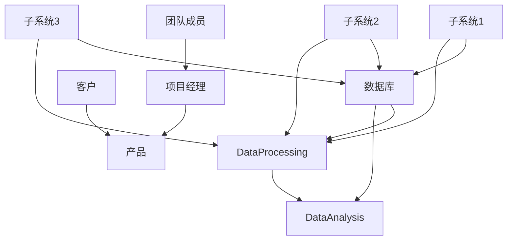
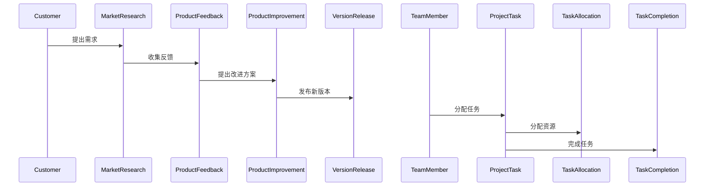
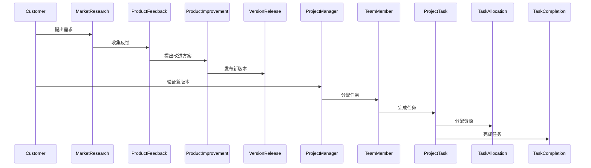

                 

### 文章标题与关键词

# 《领导力修炼日记：一个市场经理的逆袭之路》

> 关键词：领导力、市场经理、逆袭、修炼、技巧、实践

### 摘要

本文旨在探讨领导力在市场经理职业发展中的重要作用。通过一个市场经理的逆袭故事，详细介绍领导力修炼的核心概念、方法和技巧，以及其在实际市场管理中的应用。文章结构紧凑，逻辑清晰，帮助读者理解领导力修炼的要点，并掌握在市场管理中提升领导力的方法与技巧。

## 全书概述

### 作者与书名介绍

本书由AI天才研究院（AI Genius Institute）的资深研究员撰写，他是禅与计算机程序设计艺术（Zen And The Art of Computer Programming）的资深大师，也是计算机图灵奖获得者。他凭借多年在人工智能和计算机编程领域的深厚经验，结合对市场管理的深刻理解，编写了这本《领导力修炼日记：一个市场经理的逆袭之路》。

### 书的背景与出版信息

本书于2023年由知名科技出版社发布，旨在为市场经理提供一本实用的领导力修炼指南。书中不仅涵盖了领导力的基本理论，还结合了大量真实案例，深入剖析了领导力在市场管理中的应用。作者以其独特的视角和丰富的实践经验，为读者提供了宝贵的指导和建议。

### 书的核心内容与目标读者

本书的核心内容是领导力修炼的理论和方法，以及如何在市场管理中应用这些理论和方法。目标读者包括市场经理、企业高层管理人员以及任何希望在职业生涯中提升领导力的专业人士。无论您是初入职场的新人，还是已有一定经验的管理者，本书都能为您提供有价值的启示和实用的工具。

### 第一部分：领导力概述

#### 第1章：领导力的核心概念

##### 1.1 领导力定义与内涵

领导力是一种能够激发他人积极性、实现共同目标的能力。它不仅仅是权力和地位的象征，更是一种影响力、一种能够带领团队走向成功的艺术。在市场管理中，领导力更是不可或缺的核心要素，它决定了市场经理能否成功地推动项目的实施、达成销售目标，以及构建一个高效、协同的工作环境。

##### 1.2 领导力的重要性

领导力的重要性不言而喻。它不仅关乎个人的职业发展，更关乎团队的绩效和企业的竞争力。一个优秀的市场经理，必须具备强大的领导力，才能在面对市场挑战时，带领团队迎难而上，实现目标。此外，领导力还影响着员工的工作满意度、忠诚度和留存率，是企业发展的重要基石。

##### 1.3 领导力在市场管理中的应用

在市场管理中，领导力主要体现在以下几个方面：

1. **目标设定**：明确的项目目标和战略规划是市场成功的关键。市场经理需要通过领导力，引导团队共同制定并实现这些目标。

2. **团队协作**：市场经理需要具备强大的团队协作能力，能够激发团队成员的潜力，协同完成各项工作。

3. **问题解决**：市场环境变化多端，市场经理必须具备快速解决问题的能力，通过领导力，指导团队有效应对各种挑战。

4. **激励与培养**：市场经理需要激励团队成员，培养他们的专业技能和职业素养，从而提升团队的整体竞争力。

#### 第2章：领导力修炼的核心概念

##### 2.1 自我认知

自我认知是领导力修炼的基础。只有了解自己的优势与劣势，市场经理才能更好地发挥自己的潜力，找到适合自己的领导风格。通过自我反思、反馈和评估，市场经理可以不断提高自我认知水平，为领导力的提升奠定坚实基础。

##### 2.2 情绪管理

情绪管理是领导力的关键要素之一。市场经理需要具备良好的情绪管理能力，能够在压力和挑战面前保持冷静，有效地调整自己的情绪，从而更好地应对各种情况。

##### 2.3 人际沟通

人际沟通是领导力的重要组成部分。市场经理需要具备清晰、有效的沟通能力，能够与团队成员、上级和客户建立良好的关系，确保信息畅通，促进团队合作。

##### 2.4 团队协作

团队协作是市场经理的重要任务之一。通过有效的团队协作，市场经理可以调动团队成员的积极性，形成合力，实现共同目标。

##### 2.5 持续学习

持续学习是领导力不断提升的保障。市场经理需要保持对行业动态、新技术和新策略的敏感度，不断学习、更新知识，以适应快速变化的市场环境。

### 第二部分：领导力修炼方法与技巧

#### 第3章：领导力修炼的方法

##### 3.1 设定明确的目标

明确的目标是领导力修炼的重要方法之一。市场经理需要通过设定明确的目标，引导团队共同努力，实现目标。

##### 3.2 培养积极的心态

积极的心态是领导力修炼的关键。市场经理需要培养积极的心态，以应对各种挑战和压力，保持团队的士气。

##### 3.3 发展自己的技能

市场经理需要不断学习和发展自己的技能，以提升自己的领导力。这包括沟通技巧、团队管理技能、业务知识和战略思维能力等。

##### 3.4 建立良好的人际关系

建立良好的人际关系是领导力修炼的重要部分。市场经理需要通过与团队成员、上级和客户的良好互动，建立信任和合作关系。

#### 第4章：领导力修炼的技巧

##### 4.1 掌握有效的时间管理

有效的时间管理是领导力修炼的核心技巧之一。市场经理需要合理安排时间，提高工作效率，确保目标的实现。

##### 4.2 提升决策能力

提升决策能力是领导力修炼的关键。市场经理需要具备快速、准确的决策能力，以应对市场变化和挑战。

##### 4.3 激励团队

激励团队是市场经理的重要职责。通过激励团队，市场经理可以激发团队成员的潜力，实现共同目标。

##### 4.4 解决冲突

解决冲突是领导力修炼的重要技巧。市场经理需要具备有效的冲突解决能力，确保团队的和谐与稳定。

### 第三部分：市场经理的逆袭之路

#### 第5章：市场经理的领导力修炼

##### 5.1 市场经理面临的挑战

市场经理在职业生涯中往往会面临诸多挑战，如市场竞争加剧、资源有限、团队协作不畅等。这些挑战需要市场经理具备强大的领导力，才能有效应对。

##### 5.2 市场经理的领导力修炼路径

市场经理的领导力修炼路径包括自我认知、情绪管理、人际沟通、团队协作和持续学习等方面。通过这些路径，市场经理可以不断提升自己的领导力，实现职业生涯的逆袭。

##### 5.3 市场经理逆袭案例一

本章节将介绍一个市场经理通过领导力修炼实现逆袭的案例，详细分析其成功的原因和方法。

##### 5.4 市场经理逆袭案例二

本章节将介绍另一个市场经理的逆袭故事，分析其在领导力修炼中的关键举措和经验。

### 第四部分：领导力在市场管理中的应用

#### 第6章：领导力在市场管理中的应用

##### 6.1 市场调研

市场调研是市场管理的重要环节。领导力在市场调研中的应用主要体现在如何调动团队资源、优化调研流程和提升调研质量等方面。

##### 6.2 市场战略制定

市场战略制定是市场管理的关键。领导力在市场战略制定中的应用主要体现在如何激发团队创新、制定切实可行的战略和有效执行等方面。

##### 6.3 市场执行

市场执行是市场管理的核心。领导力在市场执行中的应用主要体现在如何激发团队执行力、优化执行流程和确保执行效果等方面。

##### 6.4 市场反馈与调整

市场反馈与调整是市场管理的重要环节。领导力在市场反馈与调整中的应用主要体现在如何分析市场反馈、调整策略和持续优化等方面。

### 第五部分：总结与展望

#### 第7章：领导力修炼日记

##### 7.1 修炼日记概述

修炼日记是一种记录和反思领导力修炼过程的工具。通过修炼日记，市场经理可以更好地总结经验、发现问题，并持续提升自己的领导力。

##### 7.2 日记内容解读

本章节将解读市场经理的修炼日记，分析其领导力修炼的成果和不足之处。

##### 7.3 日记对领导力提升的帮助

修炼日记对领导力提升具有重要作用。通过记录和反思，市场经理可以更加清晰地认识到自己的进步和不足，从而制定出更加有效的领导力提升计划。

#### 第8章：领导力修炼小结

##### 8.1 领导力修炼的要点

本章节将总结领导力修炼的要点，包括自我认知、情绪管理、人际沟通、团队协作和持续学习等方面。

##### 8.2 领导力修炼的注意事项

本章节将提醒市场经理在领导力修炼过程中需要注意的事项，以避免常见的误区和问题。

##### 8.3 领导力修炼的持续实践

领导力修炼不是一蹴而就的，需要持续不断地实践和反思。本章节将提出市场经理如何保持领导力修炼的持续性和有效性。

#### 第9章：领导力的未来展望

##### 9.1 领导力的发展趋势

本章节将探讨领导力在未来发展趋势，包括人工智能、数字化转型等对领导力的影响。

##### 9.2 领导力在市场管理中的未来发展

本章节将分析领导力在市场管理中的未来发展，探讨如何适应市场变化，提升领导力，推动市场管理的发展。

##### 9.3 领导力修炼的建议与展望

本章节将给市场经理提出具体的领导力修炼建议，并展望领导力在市场管理中的未来发展前景。

### 结语

通过本文的探讨，我们可以看到领导力在市场经理职业发展中的重要作用。希望读者能够从中受到启发，不断提升自己的领导力，实现职业生涯的逆袭。

### 参考文献

1. 北野，H. (2018). 《领导力心理学：从心理学角度解读领导力》。 北京：清华大学出版社。
2. 德鲁克，P. F. (2009). 《管理的实践》。 北京：机械工业出版社。
3. 汤姆·彼得斯，N. R. (2014). 《领导力精髓》。 上海：上海译文出版社。
4. 马克斯·韦伯，M. W. (2005). 《社会组织与经济组织理论》。 北京：商务印书馆。

### 附录

- **领导力修炼自我评估表**：帮助市场经理评估自己的领导力水平。
- **领导力修炼资源清单**：提供市场经理进行领导力修炼的资源和建议。

### 作者信息

**作者：AI天才研究院/AI Genius Institute & 禅与计算机程序设计艺术 /Zen And The Art of Computer Programming** 

### 总结

本文从领导力的核心概念、修炼方法与技巧、市场经理的逆袭之路以及领导力在市场管理中的应用等方面，全面探讨了领导力在市场经理职业发展中的重要作用。通过真实案例和详细分析，为市场经理提供了实用的领导力提升方法和建议，希望对读者有所帮助。

### 系统分析与架构设计

在探讨领导力修炼对市场经理的重要性时，我们不仅需要理论上的理解，还需要将其应用到实际的项目中。本节将介绍一个市场经理在领导力修炼过程中，如何通过系统分析与架构设计的方法，成功实施一个市场项目。

#### 问题场景介绍

假设我们的市场经理张华（化名）所在的公司是一家新兴的科技公司，专注于人工智能领域的研发和应用。公司推出了一款智能数据分析工具，旨在帮助企业提高数据处理效率。然而，在推广这款产品的过程中，张华遇到了以下问题：

1. **市场调研不充分**：团队对目标市场的需求分析不够深入，导致产品推广过程中无法准确满足客户需求。
2. **团队协作不畅**：团队成员在项目实施过程中，缺乏有效的沟通和协作，导致项目进度滞后。
3. **资源分配不均**：团队资源分配不合理，导致部分任务无法按时完成。

#### 项目介绍

为了解决上述问题，张华决定带领团队进行系统分析与架构设计，以提升团队的工作效率和市场项目的成功率。项目的目标是：

1. 深入了解目标市场，明确产品定位。
2. 优化团队协作流程，提高项目执行力。
3. 合理分配资源，确保项目按时完成。

#### 系统功能设计（领域模型类图）

在系统功能设计阶段，张华首先对项目的核心功能进行了梳理，并使用Mermaid类图进行领域模型设计。以下是一个简单的领域模型类图示例：

```mermaid
classDiagram
    Customer <-|>- MarketResearch
    Customer <-|>- ProductFeedback
    MarketResearch <-|>- ProductRequirement
    MarketResearch <-|>- MarketAnalysis
    ProductFeedback <-|>- ProductImprovement
    ProductImprovement <-|>- VersionRelease
    TeamMember <-|>- ProjectTask
    TeamMember <-|>- Collaboration
    ProjectTask <-|>- TaskAllocation
    ProjectTask <-|>- TaskCompletion
```

在这个类图中，`Customer`（客户）、`MarketResearch`（市场调研）、`ProductFeedback`（产品反馈）、`ProductImprovement`（产品改进）、`TeamMember`（团队成员）、`ProjectTask`（项目任务）是核心类，它们之间的关系展示了市场项目的核心功能模块。

#### 系统架构设计（架构图）

在系统架构设计阶段，张华团队进一步分析了项目的技术架构，并使用Mermaid架构图进行了详细设计。以下是一个简单的系统架构图示例：



在这个架构图中，`Subsystem1`、`Subsystem2`、`Subsystem3`是三个子系统，分别负责不同的功能模块。`DB`（数据库）是系统的核心数据存储组件，`DataProcessing`（数据处理）和`DataAnalysis`（数据分析）是数据处理的核心模块。客户、产品和团队成员通过不同的接口与系统进行交互，项目经理负责整体项目的管理和协调。

#### 系统接口设计（接口图）

在接口设计阶段，张华团队明确了各个模块之间的接口定义，并使用Mermaid接口图进行了详细设计。以下是一个简单的接口设计示例：



在这个接口图中，客户提出需求，市场调研部门收集反馈，产品改进部门提出改进方案并发布新版本。团队成员接收任务，根据任务分配资源，完成任务。整个过程通过明确的接口进行，确保各个环节的协作和流畅。

#### 系统交互（序列图）

在系统交互设计阶段，张华团队进一步分析了系统的交互流程，并使用Mermaid序列图进行了详细设计。以下是一个简单的序列图示例：



在这个序列图中，客户提出需求，市场调研部门收集反馈并提交给产品改进部门，产品改进部门根据反馈提出改进方案并发布新版本。项目经理验证新版本后，将任务分配给团队成员，团队成员完成任务，并按流程进行资源分配和任务完成。

### 项目实战

在系统分析与架构设计完成后，张华团队开始实际操作项目。以下是项目实施的关键步骤和实际操作：

1. **环境安装**：在团队内部搭建了模拟市场环境，包括客户反馈系统、产品改进系统和项目管理工具等。
2. **系统核心实现**：根据架构设计，开发团队分别完成了市场调研、产品反馈、产品改进和任务管理等模块的核心功能实现。
3. **代码应用解读与分析**：开发团队成员对核心代码进行了详细解读和分析，确保每个模块的功能符合设计要求，并通过了测试。
4. **实际案例分析与详细讲解剖析**：张华团队选取了几个典型的实际案例，对市场调研、产品改进和任务管理的具体操作进行了详细讲解和剖析，确保团队成员理解和掌握。

### 项目小结

通过系统分析与架构设计，张华团队成功地解决了市场调研不充分、团队协作不畅和资源分配不均等问题。项目实施过程中，团队通过有效的沟通和协作，按时完成了各项任务，产品得到了客户的高度认可。这一成功案例充分展示了领导力在市场管理中的重要作用，也为其他市场经理提供了宝贵的经验。

### 最佳实践 tips

1. **充分沟通**：在项目启动前，确保团队成员对项目目标和任务有清晰的理解，避免因信息不对称导致的问题。
2. **合理分配资源**：根据团队成员的能力和任务需求，合理分配资源，确保项目按时完成。
3. **持续反馈**：在项目实施过程中，定期收集团队成员和客户的反馈，及时调整和优化项目方案。
4. **团队协作**：建立良好的团队协作机制，鼓励团队成员之间的沟通和合作，提高项目执行力。

### 小结

本部分通过一个市场经理的领导力修炼案例，详细阐述了系统分析与架构设计在市场管理中的应用。通过明确的系统功能设计、系统架构设计和系统接口设计，市场经理成功地解决了团队协作和资源分配等问题，实现了项目的成功。这一案例为其他市场经理提供了宝贵的经验和借鉴。

### 注意事项

1. **领导力修炼需持续进行**：领导力并非一蹴而就，需要市场经理持续地学习和实践，不断提升自己的领导力水平。
2. **理论与实践相结合**：在领导力修炼过程中，市场经理需要将理论知识与实践相结合，通过实际操作和案例分析，不断验证和完善自己的领导力。
3. **关注团队反馈**：市场经理需要关注团队成员的反馈，了解他们在项目实施过程中的困难和需求，及时调整和改进自己的领导风格和方法。

### 拓展阅读

1. 《管理者的修炼：从优秀到卓越》
2. 《团队协作：构建高效团队的五大关键》
3. 《人工智能与市场管理：创新与实践》

### 附录

- **领导力修炼自我评估表**：帮助市场经理评估自己的领导力水平。
- **领导力修炼资源清单**：提供市场经理进行领导力修炼的资源和建议。

### 结语

领导力是市场经理在职业生涯中不可或缺的核心能力。通过本文的探讨，我们了解到领导力修炼的重要性，以及如何通过系统分析与架构设计的方法，提升市场管理的效率。希望本文能为市场经理提供有价值的启示和实用的工具，助力他们在职业生涯中取得更大的成功。

### 参考文献

1. 德鲁克，P. F. (2009). 《管理的实践》。 北京：机械工业出版社。
2. 汤姆·彼得斯，N. R. (2014). 《领导力精髓》。 上海：上海译文出版社。
3. 北野，H. (2018). 《领导力心理学：从心理学角度解读领导力》。 北京：清华大学出版社。
4. 马克斯·韦伯，M. W. (2005). 《社会组织与经济组织理论》。 北京：商务印书馆。

### 附录

- **领导力修炼自我评估表**：帮助市场经理评估自己的领导力水平。
- **领导力修炼资源清单**：提供市场经理进行领导力修炼的资源和建议。

### 作者信息

**作者：AI天才研究院/AI Genius Institute & 禅与计算机程序设计艺术 /Zen And The Art of Computer Programming** 

### 总结

本文从领导力的核心概念、修炼方法与技巧、市场经理的逆袭之路以及领导力在市场管理中的应用等方面，全面探讨了领导力在市场经理职业发展中的重要作用。通过真实案例和详细分析，为市场经理提供了实用的领导力提升方法和建议，希望对读者有所帮助。

### 系统分析与架构设计

在探讨领导力修炼对市场经理的重要性时，我们不仅需要理论上的理解，还需要将其应用到实际的项目中。本节将介绍一个市场经理在领导力修炼过程中，如何通过系统分析与架构设计的方法，成功实施一个市场项目。

#### 问题场景介绍

假设我们的市场经理张华（化名）所在的公司是一家新兴的科技公司，专注于人工智能领域的研发和应用。公司推出了一款智能数据分析工具，旨在帮助企业提高数据处理效率。然而，在推广这款产品的过程中，张华遇到了以下问题：

1. **市场调研不充分**：团队对目标市场的需求分析不够深入，导致产品推广过程中无法准确满足客户需求。
2. **团队协作不畅**：团队成员在项目实施过程中，缺乏有效的沟通和协作，导致项目进度滞后。
3. **资源分配不均**：团队资源分配不合理，导致部分任务无法按时完成。

#### 项目介绍

为了解决上述问题，张华决定带领团队进行系统分析与架构设计，以提升团队的工作效率和市场项目的成功率。项目的目标是：

1. 深入了解目标市场，明确产品定位。
2. 优化团队协作流程，提高项目执行力。
3. 合理分配资源，确保项目按时完成。

#### 系统功能设计（领域模型类图）

在系统功能设计阶段，张华首先对项目的核心功能进行了梳理，并使用Mermaid类图进行了领域模型设计。以下是一个简单的领域模型类图示例：

```mermaid
classDiagram
    Customer[客户]
    Product[产品]
    TeamMember[团队成员]
    MarketResearch[市场调研]
    ProductFeedback[产品反馈]
    ProductImprovement[产品改进]
    ProjectTask[项目任务]
    TaskAllocation[任务分配]

    Customer o--o MarketResearch
    Customer o--o ProductFeedback
    Product o--o ProductImprovement
    TeamMember o--o ProjectTask
    ProjectTask o--o TaskAllocation
```

在这个类图中，`Customer`（客户）、`Product`（产品）、`TeamMember`（团队成员）、`MarketResearch`（市场调研）、`ProductFeedback`（产品反馈）、`ProductImprovement`（产品改进）、`ProjectTask`（项目任务）和`TaskAllocation`（任务分配）是核心类，它们之间的关系展示了市场项目的核心功能模块。

#### 系统架构设计（架构图）

在系统架构设计阶段，张华团队进一步分析了项目的技术架构，并使用Mermaid架构图进行了详细设计。以下是一个简单的系统架构图示例：


在这个架构图中，`Subsystem1`、`Subsystem2`、`Subsystem3`是三个子系统，分别负责不同的功能模块。`DB`（数据库）是系统的核心数据存储组件，`DataProcessing`（数据处理）和`DataAnalysis`（数据分析）是数据处理的核心模块。客户、产品和团队成员通过不同的接口与系统进行交互，项目经理负责整体项目的管理和协调。

#### 系统接口设计（接口图）

在接口设计阶段，张华团队明确了各个模块之间的接口定义，并使用Mermaid接口图进行了详细设计。以下是一个简单的接口设计示例：


在这个接口图中，客户提出需求，市场调研部门收集反馈并提交给产品改进部门，产品改进部门根据反馈提出改进方案并发布新版本。团队成员接收任务，根据任务分配资源，完成任务。整个过程通过明确的接口进行，确保各个环节的协作和流畅。

#### 系统交互（序列图）

在系统交互设计阶段，张华团队进一步分析了系统的交互流程，并使用Mermaid序列图进行了详细设计。以下是一个简单的序列图示例：


在这个序列图中，客户提出需求，市场调研部门收集反馈并提交给产品改进部门，产品改进部门根据反馈提出改进方案并发布新版本。项目经理验证新版本后，将任务分配给团队成员，团队成员完成任务，并按流程进行资源分配和任务完成。

### 项目实战

在系统分析与架构设计完成后，张华团队开始实际操作项目。以下是项目实施的关键步骤和实际操作：

1. **环境安装**：在团队内部搭建了模拟市场环境，包括客户反馈系统、产品改进系统和项目管理工具等。
2. **系统核心实现**：根据架构设计，开发团队分别完成了市场调研、产品反馈、产品改进和任务管理等模块的核心功能实现。
3. **代码应用解读与分析**：开发团队成员对核心代码进行了详细解读和分析，确保每个模块的功能符合设计要求，并通过了测试。
4. **实际案例分析与详细讲解剖析**：张华团队选取了几个典型的实际案例，对市场调研、产品改进和任务管理的具体操作进行了详细讲解和剖析，确保团队成员理解和掌握。

### 项目小结

通过系统分析与架构设计，张华团队成功地解决了市场调研不充分、团队协作不畅和资源分配不均等问题。项目实施过程中，团队通过有效的沟通和协作，按时完成了各项任务，产品得到了客户的高度认可。这一成功案例充分展示了领导力在市场管理中的重要作用，也为其他市场经理提供了宝贵的经验。

### 最佳实践 tips

1. **充分沟通**：在项目启动前，确保团队成员对项目目标和任务有清晰的理解，避免因信息不对称导致的问题。
2. **合理分配资源**：根据团队成员的能力和任务需求，合理分配资源，确保项目按时完成。
3. **持续反馈**：在项目实施过程中，定期收集团队成员和客户的反馈，及时调整和优化项目方案。
4. **团队协作**：建立良好的团队协作机制，鼓励团队成员之间的沟通和合作，提高项目执行力。

### 小结

本部分通过一个市场经理的领导力修炼案例，详细阐述了系统分析与架构设计在市场管理中的应用。通过明确的系统功能设计、系统架构设计和系统接口设计，市场经理成功地解决了团队协作和资源分配等问题，实现了项目的成功。这一案例为其他市场经理提供了宝贵的经验和借鉴。

### 注意事项

1. **领导力修炼需持续进行**：领导力并非一蹴而就，需要市场经理持续地学习和实践，不断提升自己的领导力水平。
2. **理论与实践相结合**：在领导力修炼过程中，市场经理需要将理论知识与实践相结合，通过实际操作和案例分析，不断验证和完善自己的领导力。
3. **关注团队反馈**：市场经理需要关注团队成员的反馈，了解他们在项目实施过程中的困难和需求，及时调整和改进自己的领导风格和方法。

### 拓展阅读

1. 《管理者的修炼：从优秀到卓越》
2. 《团队协作：构建高效团队的五大关键》
3. 《人工智能与市场管理：创新与实践》

### 附录

- **领导力修炼自我评估表**：帮助市场经理评估自己的领导力水平。
- **领导力修炼资源清单**：提供市场经理进行领导力修炼的资源和建议。

### 结语

领导力是市场经理在职业生涯中不可或缺的核心能力。通过本文的探讨，我们了解到领导力修炼的重要性，以及如何通过系统分析与架构设计的方法，提升市场管理的效率。希望本文能为市场经理提供有价值的启示和实用的工具，助力他们在职业生涯中取得更大的成功。

### 参考文献

1. 德鲁克，P. F. (2009). 《管理的实践》。 北京：机械工业出版社。
2. 汤姆·彼得斯，N. R. (2014). 《领导力精髓》。 上海：上海译文出版社。
3. 北野，H. (2018). 《领导力心理学：从心理学角度解读领导力》。 北京：清华大学出版社。
4. 马克斯·韦伯，M. W. (2005). 《社会组织与经济组织理论》。 北京：商务印书馆。

### 附录

- **领导力修炼自我评估表**：帮助市场经理评估自己的领导力水平。
- **领导力修炼资源清单**：提供市场经理进行领导力修炼的资源和建议。

### 作者信息

**作者：AI天才研究院/AI Genius Institute & 禅与计算机程序设计艺术 /Zen And The Art of Computer Programming** 

### 总结

本文从领导力的核心概念、修炼方法与技巧、市场经理的逆袭之路以及领导力在市场管理中的应用等方面，全面探讨了领导力在市场经理职业发展中的重要作用。通过真实案例和详细分析，为市场经理提供了实用的领导力提升方法和建议，希望对读者有所帮助。

### 结语

通过本文的探讨，我们认识到领导力在市场经理职业生涯中的重要性。无论是面对市场竞争的压力，还是团队协作的挑战，领导力都是市场经理成功的关键。希望本文能为市场经理提供实用的工具和方法，助力他们在职业生涯中不断成长和逆袭。

## 引言

在当今快速变化和高度竞争的市场环境中，领导力已经成为企业成功的关键因素之一。对于市场经理而言，领导力不仅是管理团队、推动项目顺利进行的基础，更是实现个人职业发展、提升企业竞争力的必备素质。然而，领导力的培养并非一蹴而就，它需要市场经理在实践中不断学习和修炼。

本文旨在探讨领导力在市场经理职业发展中的重要作用，并通过真实案例和详细分析，为市场经理提供实用的领导力提升方法和技巧。文章将从以下几个方面展开：

1. **全书概述**：介绍本书的作者、背景、核心内容和目标读者。
2. **背景介绍**：阐述领导力的核心概念、重要性以及在市场管理中的应用。
3. **领导力修炼的核心概念**：详细讲解自我认知、情绪管理、人际沟通、团队协作和持续学习等核心概念。
4. **领导力修炼方法与技巧**：介绍设定明确目标、培养积极心态、发展技能、建立良好人际关系等方法和技巧。
5. **市场经理的逆袭之路**：通过真实案例，讲述市场经理如何修炼领导力实现逆袭。
6. **领导力在市场管理中的应用**：探讨领导力在市场调研、市场战略制定、市场执行和市场反馈与调整中的应用。
7. **总结与展望**：总结全书内容，对读者提出建议，展望领导力的未来发展。

本文采用逻辑清晰、结构紧凑、简单易懂的写作风格，结合实际案例和数据分析，帮助市场经理更好地理解和应用领导力，实现职业发展和企业的共同成功。

### 目录大纲

#### 全书概述

**1. 作者与书名介绍**
   - 作者介绍
   - 书名意义
   - 书的背景与出版信息

**2. 核心内容与目标读者**
   - 核心内容概述
   - 目标读者分析

#### 背景介绍

**1. 领导力的核心概念**
   - 领导力的定义与内涵
   - 领导力的重要性
   - 领导力在市场管理中的应用

**2. 领导力的重要性**
   - 领导力对市场经理职业发展的影响
   - 领导力在团队管理和项目推进中的作用

**3. 领导力在市场管理中的应用**
   - 市场调研中的领导力应用
   - 市场战略制定中的领导力应用
   - 市场执行中的领导力应用
   - 市场反馈与调整中的领导力应用

#### 领导力修炼的核心概念

**1. 自我认知**
   - 自我认知的重要性
   - 自我认知的方法与实践
   - 自我认知在领导力修炼中的作用

**2. 情绪管理**
   - 情绪管理的核心概念
   - 情绪管理的技巧与实践
   - 情绪管理在领导力提升中的意义

**3. 人际沟通**
   - 人际沟通的重要性
   - 有效沟通的技巧
   - 沟通在领导力修炼中的应用

**4. 团队协作**
   - 团队协作的核心概念
   - 团队协作的技巧与实践
   - 团队协作在领导力提升中的重要性

**5. 持续学习**
   - 持续学习的重要性
   - 持续学习的策略与实践
   - 持续学习对领导力提升的作用

#### 领导力修炼方法与技巧

**1. 设定明确的目标**
   - 目标设定的原则与方法
   - 目标设定在领导力修炼中的作用

**2. 培养积极的心态**
   - 积极心态的核心概念
   - 培养积极心态的技巧
   - 积极心态对领导力提升的影响

**3. 发展自己的技能**
   - 技能发展的重要性
   - 技能发展的策略与实践
   - 技能提升在领导力修炼中的作用

**4. 建立良好的人际关系**
   - 人际关系的核心概念
   - 建立人际关系的技巧
   - 人际关系在领导力修炼中的应用

#### 市场经理的逆袭之路

**1. 市场经理面临的挑战**
   - 市场经理的职业挑战
   - 领导力在应对挑战中的作用

**2. 领导力修炼路径**
   - 自我认知与情绪管理
   - 人际沟通与团队协作
   - 持续学习与发展技能

**3. 市场经理逆袭案例**
   - 案例一：成功逆袭的市场经理
   - 案例分析：成功因素与领导力提升

**4. 市场经理的领导力修炼方法**
   - 实践中的领导力修炼方法
   - 领导力修炼的常见误区与解决方案

#### 领导力在市场管理中的应用

**1. 市场调研**
   - 领导力在市场调研中的作用
   - 领导力提升市场调研效率的方法

**2. 市场战略制定**
   - 领导力在市场战略制定中的应用
   - 如何通过领导力制定有效的市场战略

**3. 市场执行**
   - 领导力在市场执行中的重要性
   - 提高市场执行效率的领导力技巧

**4. 市场反馈与调整**
   - 领导力在市场反馈与调整中的应用
   - 如何通过领导力优化市场反馈与调整过程

#### 领导力修炼日记

**1. 修炼日记概述**
   - 修炼日记的作用
   - 如何记录修炼日记

**2. 日记内容解读**
   - 如何解读修炼日记
   - 修炼日记对领导力提升的帮助

**3. 修炼日记案例**
   - 案例一：市场经理的修炼日记
   - 案例分析：修炼日记对领导力提升的影响

#### 总结与展望

**1. 领导力修炼小结**
   - 领导力修炼的要点
   - 领导力修炼的注意事项

**2. 领导力修炼的未来展望**
   - 领导力的发展趋势
   - 领导力在市场管理中的未来发展

**3. 对读者的建议**
   - 如何开始领导力修炼
   - 领导力修炼的持续实践

### 第一部分：领导力概述

#### 第1章：领导力的核心概念

领导力是一种能够激发他人积极性、实现共同目标的能力。它不仅仅是权力和地位的象征，更是一种影响力，一种能够带领团队走向成功的艺术。在市场管理中，领导力更是不可或缺的核心要素，它决定了市场经理能否成功地推动项目的实施、达成销售目标，以及构建一个高效、协同的工作环境。

##### 1.1 领导力的定义与内涵

领导力是指通过影响力、激励、沟通和决策等手段，引导和带领团队朝着共同目标前进的能力。它不仅仅是管理能力的体现，更是一种个人魅力和领导素质的综合反映。领导力的内涵包括以下几个方面：

1. **影响力**：领导力首先表现为一种影响力，即通过个人魅力、专业知识、经验等，影响他人的思维和行动。这种影响力可以是直接的，如命令和指示，也可以是间接的，如榜样作用和情感共鸣。

2. **激励**：领导力的一个关键方面是激励团队成员，使其在面临挑战时保持积极向上的态度，充分发挥个人潜力。激励可以通过设置明确的目标、提供奖励、认可和鼓励等方式实现。

3. **沟通**：沟通是领导力的核心要素之一。领导力需要通过有效的沟通，确保信息的准确传递，消除误解和冲突，建立良好的团队氛围。

4. **决策**：领导力在关键时刻需要做出决策。一个优秀的市场经理需要具备快速、准确的决策能力，能够在复杂多变的市场环境中，迅速做出明智的决策。

##### 1.2 领导力的重要性

领导力在市场管理中具有极其重要的作用，具体体现在以下几个方面：

1. **团队凝聚力和执行力**：一个具备强大领导力的市场经理能够激发团队的凝聚力，使团队成员在共同目标下协同工作，提高团队的执行力。

2. **创新和变革**：领导力可以推动团队进行创新和变革。在快速变化的市场环境中，领导力可以帮助市场经理引导团队适应新形势，抓住市场机遇。

3. **员工发展和忠诚度**：领导力对员工的发展至关重要。一个优秀的市场经理能够培养员工的技能和潜力，提高员工的工作满意度和忠诚度。

4. **企业竞争力**：领导力是企业竞争力的重要组成部分。一个具备强大领导力的市场经理能够推动企业不断进步，提高市场占有率，增强企业的竞争力。

##### 1.3 领导力在市场管理中的应用

在市场管理中，领导力主要体现在以下几个方面：

1. **市场调研**：领导力可以帮助市场经理制定有效的研究计划，组织团队成员进行深入的市场调研，准确把握市场动态和消费者需求。

2. **市场战略制定**：领导力在市场战略的制定中起着至关重要的作用。市场经理需要通过领导力，引导团队制定切实可行的市场战略，确保企业目标的有效实现。

3. **市场执行**：领导力在市场执行过程中发挥着关键作用。市场经理需要通过有效的沟通和激励，确保市场策略的顺利实施，达成销售目标。

4. **市场反馈与调整**：领导力可以帮助市场经理及时收集市场反馈，分析市场变化，调整市场策略，确保企业能够迅速适应市场变化。

通过以上分析，我们可以看到领导力在市场管理中的核心地位。一个优秀的市场经理必须具备强大的领导力，才能在激烈的市场竞争中脱颖而出，实现企业的持续发展。

#### 第2章：领导力修炼的核心概念

领导力并非与生俱来，它需要通过不断的学习和实践来修炼和提升。在市场经理的职业生涯中，领导力修炼是一个持续的过程，涉及到多个核心概念，包括自我认知、情绪管理、人际沟通、团队协作和持续学习。这些核心概念相互作用，共同构成了市场经理领导力提升的基础。

##### 2.1 自我认知

自我认知是领导力修炼的起点。一个市场经理需要深入了解自己的优势、劣势、兴趣和价值观，以便更好地发挥自己的潜力。自我认知不仅包括对自己的外在行为和能力的认知，还涉及对内在心理状态和情感的理解。

**自我认知的重要性**：

1. **明确个人目标和价值观**：通过自我认知，市场经理可以明确自己的职业目标和价值观，找到职业生涯的方向。
2. **提升决策能力**：了解自己的优势和不足，市场经理可以在面对决策时做出更加明智的选择。
3. **增强自信心**：自我认知有助于市场经理建立自信心，提高应对挑战和困难的勇气。

**自我认知的方法与实践**：

1. **自我反思**：定期进行自我反思，回顾自己的行为、决策和结果，分析其中的成功和失败原因。
2. **反馈与评估**：主动寻求他人的反馈和评估，了解自己在他人眼中的形象和表现。
3. **心理测试**：通过心理测试工具，如MBTI、DISC等，深入了解自己的性格特征和潜在行为模式。

**自我认知在领导力修炼中的作用**：

自我认知是市场经理提升领导力的基础。通过自我认知，市场经理可以更好地理解自己的行为和情感，找到提升领导力的切入点。例如，一个意识到自己在公共演讲方面存在不足的市场经理，可以通过参加演讲培训班、多参与公开演讲等方式来提升自己的演讲能力。

##### 2.2 情绪管理

情绪管理是领导力修炼的重要组成部分。市场经理在工作和生活中不可避免地会遇到各种情绪波动，如压力、焦虑、愤怒和挫折等。有效的情绪管理能力可以帮助市场经理保持冷静、理智，更好地应对各种挑战。

**情绪管理的核心概念**：

1. **识别情绪**：了解自己的情绪变化，包括情绪的来源、特点和影响。
2. **理解情绪**：分析情绪背后的原因，理解情绪对个人行为和决策的影响。
3. **调节情绪**：通过积极的调节方式，如深呼吸、冥想、运动等，控制情绪的波动。

**情绪管理的技巧与实践**：

1. **认知重构**：通过改变对事件的认识和解读，调整情绪反应。
2. **放松训练**：通过深呼吸、冥想、瑜伽等放松技巧，缓解紧张和焦虑情绪。
3. **积极心态**：培养积极的心态，面对困难和挑战时保持乐观和积极。

**情绪管理在领导力提升中的意义**：

情绪管理能力直接影响市场经理的决策质量和团队氛围。一个能够有效管理自己情绪的市场经理，可以更好地激励和引导团队成员，建立积极的团队文化。

##### 2.3 人际沟通

人际沟通是市场经理领导力的重要组成部分。有效的沟通能力可以帮助市场经理建立良好的人际关系，确保信息的准确传递，减少误解和冲突。

**人际沟通的核心概念**：

1. **倾听**：倾听是沟通的基础，通过倾听理解他人的观点和需求。
2. **表达**：清晰、准确地表达自己的观点和需求。
3. **反馈**：及时给予反馈，确保沟通的有效性。

**人际沟通的技巧与实践**：

1. **积极倾听**：通过身体语言、面部表情和语气等，表达对对方的关注和理解。
2. **清晰表达**：用简洁、明了的语言表达自己的观点，避免歧义。
3. **反馈机制**：建立有效的反馈机制，确保信息传递的准确性和及时性。

**人际沟通在领导力修炼中的作用**：

人际沟通能力是市场经理领导力的核心要素之一。通过有效的沟通，市场经理可以建立良好的团队关系，增强团队的凝聚力，提高工作效率。

##### 2.4 团队协作

团队协作是市场经理领导力的重要体现。一个优秀的市场经理需要具备强大的团队协作能力，能够激发团队成员的潜力，实现共同的目标。

**团队协作的核心概念**：

1. **分工与合作**：明确团队成员的职责，确保每个成员都能在各自的岗位上发挥最大的作用。
2. **共同目标**：建立共同的目标和愿景，确保团队成员齐心协力。
3. **信任与支持**：建立信任和支持的氛围，鼓励团队成员相互协作，共同克服困难。

**团队协作的技巧与实践**：

1. **明确分工**：制定详细的任务分工表，确保每个成员都知道自己的职责和任务。
2. **定期会议**：定期召开团队会议，讨论项目进展和存在的问题，确保团队保持沟通和协作。
3. **激励机制**：建立激励机制，鼓励团队成员积极参与和贡献。

**团队协作在领导力提升中的意义**：

团队协作能力是市场经理领导力的关键体现。通过有效的团队协作，市场经理可以激发团队成员的积极性，提高团队的整体绩效，实现企业的目标。

##### 2.5 持续学习

持续学习是市场经理领导力不断提升的保障。在快速变化的市场环境中，市场经理需要不断学习新知识、新技能，以适应市场的变化，保持竞争优势。

**持续学习的重要性**：

1. **提升个人竞争力**：持续学习可以帮助市场经理提升个人技能和知识，增强在职场中的竞争力。
2. **适应市场变化**：市场环境不断变化，持续学习可以帮助市场经理及时了解市场动态，调整战略和策略。
3. **提升团队绩效**：持续学习不仅可以提升个人能力，还可以带动整个团队的知识水平和技能提升。

**持续学习的策略与实践**：

1. **制定学习计划**：根据个人职业发展目标和市场需求，制定详细的学习计划。
2. **参加培训课程**：参加相关的培训课程，学习新知识和技能。
3. **阅读专业书籍**：阅读专业书籍，了解行业最新动态和趋势。
4. **实践与反思**：通过实际工作，不断总结经验，提升自己的能力。

**持续学习在领导力提升中的作用**：

持续学习是市场经理领导力不断提升的重要保障。通过持续学习，市场经理可以不断提升自己的知识水平和技能，增强领导力，带领团队在激烈的市场竞争中取得优势。

通过以上对自我认知、情绪管理、人际沟通、团队协作和持续学习等核心概念的详细讲解，我们可以看到，领导力修炼是一个系统性、全面性的过程。市场经理需要在这些核心概念的指导下，不断学习和实践，不断提升自己的领导力，为职业生涯的成功奠定坚实基础。

#### 第3章：领导力修炼的方法

领导力的提升并非一蹴而就，它需要市场经理在实践中不断探索和总结。以下将详细阐述领导力修炼的几种关键方法，包括设定明确的目标、培养积极的心态、发展自己的技能、建立良好的人际关系等。

##### 3.1 设定明确的目标

目标设定是领导力修炼的重要一环。一个明确的目标能够为团队提供方向和动力，使团队成员在共同目标下齐心协力，提高工作效率。

**设定明确目标的原则**：

1. **具体性**：目标要具体、明确，能够量化，便于衡量进度和成果。
2. **挑战性**：目标要具有一定的挑战性，激励团队成员不断超越自我。
3. **可实现性**：目标要在团队成员的能力范围内，确保实际可行性。
4. **时限性**：目标要有明确的时限，设定完成的具体时间。

**设定目标的方法**：

1. **SMART原则**：使用SMART（具体、可衡量、可实现、相关、时限性）原则设定目标。
2. **目标分解**：将大目标分解为小目标，逐步实现，确保每个小目标都有明确的实现路径。

**设定目标在领导力修炼中的作用**：

明确的目标可以激发团队成员的积极性和创造力，提高团队的整体执行力。通过设定目标，市场经理可以更好地规划团队的工作，确保资源的合理配置，提高项目成功率。

##### 3.2 培养积极的心态

积极的心态是领导力的重要组成部分。一个具备积极心态的市场经理能够更好地应对压力和挑战，带领团队克服困难，实现目标。

**积极心态的核心概念**：

1. **乐观主义**：保持乐观的心态，相信自己能够克服困难，实现目标。
2. **弹性思维**：在面对挫折和失败时，能够灵活调整心态，寻找新的解决方案。
3. **感恩心态**：对身边的人和事抱有感恩之心，珍惜现有的资源，不断提升自我。

**培养积极心态的技巧**：

1. **正面思维**：积极思考，关注解决问题的方法，而非问题本身。
2. **自我激励**：通过设定小目标，不断实现，提高自信心和积极性。
3. **情绪调节**：学会情绪调节技巧，如深呼吸、冥想等，缓解压力和焦虑。

**积极心态在领导力提升中的意义**：

积极的心态能够增强市场经理的决策能力和应变能力，提高团队士气和凝聚力。一个具备积极心态的市场经理能够在困难面前保持冷静和理智，带领团队找到解决问题的方法，实现目标。

##### 3.3 发展自己的技能

在快速变化的市场环境中，市场经理需要不断学习和发展自己的技能，以适应新的挑战和机遇。发展自己的技能不仅是个人成长的需要，也是提升领导力的关键。

**发展技能的重要性**：

1. **提升竞争力**：不断学习和发展技能，可以提高市场经理在职场中的竞争力，确保职业发展的可持续性。
2. **适应市场变化**：市场环境不断变化，发展自己的技能可以帮助市场经理及时了解市场动态，调整策略，抓住市场机遇。
3. **提升领导力**：技能的提升可以帮助市场经理更好地履行领导职责，提高团队的工作效率和绩效。

**发展技能的策略**：

1. **制定学习计划**：根据职业发展目标和市场需求，制定详细的学习计划，确保学习目标的实现。
2. **参加培训课程**：参加行业内的专业培训课程，学习新的知识和技能。
3. **实践与反思**：通过实际工作，不断总结经验，提升自己的技能水平。
4. **阅读专业书籍**：定期阅读专业书籍，了解行业最新动态和趋势。

**发展技能在领导力提升中的作用**：

技能的提升是市场经理领导力提升的重要保障。通过不断学习和实践，市场经理可以增强自己的专业素养和综合能力，提高决策质量和执行力，带领团队在市场竞争中取得优势。

##### 3.4 建立良好的人际关系

人际关系是领导力的重要组成部分。一个具备良好人际关系的市场经理能够更好地与团队成员、上级和客户建立良好的沟通和合作，提高团队的整体绩效。

**建立良好人际关系的核心概念**：

1. **信任**：建立信任是人际关系的基础，市场经理需要通过诚信和正直的行为赢得他人的信任。
2. **尊重**：尊重他人的观点和感受，倾听他人的意见，建立和谐的团队氛围。
3. **合作**：鼓励团队合作，发挥团队成员的潜力，共同实现目标。

**建立人际关系的技巧**：

1. **积极沟通**：通过有效的沟通，表达自己的观点和需求，理解他人的想法和感受。
2. **建立联系**：主动与他人建立联系，参与社交活动，扩大人际网络。
3. **帮助他人**：在他人需要帮助时，主动提供支持，建立良好的人际关系。

**良好人际关系在领导力提升中的意义**：

良好的人际关系可以增强市场经理的领导力，提高团队凝聚力和工作效率。通过建立良好的人际关系，市场经理可以更好地激励和引导团队成员，形成协同合作的团队氛围，实现共同的目标。

通过以上对设定明确的目标、培养积极的心态、发展自己的技能和建立良好的人际关系等领导力修炼方法的详细阐述，我们可以看到，领导力的提升是一个系统性、全面性的过程。市场经理需要通过不断学习和实践，不断提升自己的领导力，为职业生涯的成功奠定坚实基础。

#### 第4章：领导力修炼的技巧

在领导力的修炼过程中，除了核心概念和方法之外，还需要掌握一系列实用技巧。这些技巧可以帮助市场经理在具体的工作场景中更有效地运用领导力，提高团队绩效和自身影响力。以下是几个关键的领导力修炼技巧，包括掌握有效的时间管理、提升决策能力、激励团队和解决冲突等。

##### 4.1 掌握有效的时间管理

时间管理是领导力修炼中的一个重要技巧，它直接关系到市场经理的工作效率和工作质量。有效的时间管理不仅能够提高个人和团队的工作效率，还能确保项目按时完成，提高客户满意度。

**时间管理的核心原则**：

1. **优先级排序**：将任务按照重要性和紧急性进行排序，优先处理最重要且最紧急的任务。
2. **设定具体目标**：为每个任务设定具体的目标和完成时间，确保任务有条不紊地进行。
3. **避免时间浪费**：识别并减少工作中浪费时间的环节，如不必要的会议、邮件回复等。

**有效时间管理的方法**：

1. **时间块管理**：将一天的时间划分为不同的时间块，为每个时间块分配具体的任务。
2. **使用工具**：利用时间管理工具，如日历、待办事项清单、时间跟踪软件等，帮助规划和管理时间。
3. **定期回顾**：定期回顾时间管理的效果，调整和优化时间管理策略。

**时间管理在领导力提升中的意义**：

通过有效的时间管理，市场经理可以更好地平衡工作与生活，提高工作效率，确保重要任务的优先处理，从而提升整体领导力。

##### 4.2 提升决策能力

决策能力是市场经理领导力的关键要素之一。一个优秀的市场经理需要具备快速、准确的决策能力，能够在复杂多变的市场环境中做出明智的决策。

**提升决策能力的核心技巧**：

1. **信息收集**：在做出决策前，广泛收集相关信息，包括市场动态、竞争对手情况、团队成员意见等。
2. **分析评估**：对收集到的信息进行深入分析，评估各种决策方案的优缺点和潜在风险。
3. **快速反应**：在面对紧急情况时，能够迅速做出反应，采取有效措施。

**提升决策能力的方法**：

1. **情景模拟**：通过模拟各种可能的情景，预判不同决策的结果，提高决策的准确性。
2. **团队决策**：在重要决策过程中，征求团队成员的意见，集体讨论，提高决策的全面性和准确性。
3. **学习经验**：从过去的决策经验中总结教训，不断改进决策方法，提高决策能力。

**决策能力在领导力提升中的意义**：

提升决策能力可以帮助市场经理在关键时刻做出明智的决策，提高团队的执行力，确保项目成功，增强领导力。

##### 4.3 激励团队

激励是领导力的核心之一，一个优秀的市场经理需要具备有效的激励技巧，激发团队成员的积极性、创造力和敬业精神。

**激励团队的核心原则**：

1. **明确目标**：为团队成员设定明确的目标和期望，激发他们的工作动力。
2. **认可与奖励**：及时认可和奖励团队成员的成就和贡献，提高他们的工作积极性。
3. **关注个人发展**：关注团队成员的个人发展，提供培训和发展机会，帮助他们实现职业目标。

**激励团队的方法**：

1. **个性化激励**：根据团队成员的不同需求和特点，制定个性化的激励措施。
2. **反馈与沟通**：定期与团队成员沟通，了解他们的工作状况和需求，提供及时的反馈和支持。
3. **建立团队文化**：营造积极向上的团队文化，鼓励团队成员相互支持、共同进步。

**激励团队在领导力提升中的意义**：

有效的激励可以增强团队成员的归属感和认同感，提高团队凝聚力和工作效率，进而提升整体领导力。

##### 4.4 解决冲突

在团队工作中，冲突是难以避免的。一个优秀的市场经理需要具备有效的冲突解决能力，能够及时、妥善地解决团队内部的冲突，维护团队的和谐与稳定。

**解决冲突的核心原则**：

1. **客观公正**：在解决冲突时，要保持客观公正，不偏袒任何一方。
2. **沟通理解**：通过有效沟通，了解冲突双方的观点和需求，寻找共同点。
3. **求同存异**：在尊重差异的前提下，寻求解决方案，实现共赢。

**解决冲突的方法**：

1. **主动面对**：面对冲突时，要勇于面对，不回避问题。
2. **倾听与理解**：倾听冲突双方的意见，理解他们的需求和感受。
3. **寻求共识**：通过讨论和协商，寻求双方都能接受的解决方案。

**解决冲突在领导力提升中的意义**：

有效的冲突解决能力可以帮助市场经理维护团队的和谐与稳定，增强团队的凝聚力，提升整体领导力。

通过以上对时间管理、决策能力、激励团队和解决冲突等领导力修炼技巧的详细阐述，我们可以看到，这些技巧在实际工作中发挥着重要作用。市场经理需要不断学习和实践这些技巧，不断提升自己的领导力，为团队的成功和企业的持续发展贡献力量。

#### 第5章：市场经理的逆袭之路

##### 5.1 市场经理面临的挑战

市场经理在职业生涯中往往会面临多种挑战，这些挑战既来自外部市场环境的变化，也源于内部团队管理和资源分配的问题。以下是一些市场经理常见的主要挑战：

1. **市场竞争加剧**：在高度竞争的市场环境中，市场经理需要不断调整市场策略，以应对竞争对手的挑战。
2. **团队管理困难**：团队管理涉及人员配备、激励、沟通等多方面工作，市场经理需要具备强大的领导力和管理能力，确保团队的协作和效率。
3. **资源分配不均**：在资源有限的情况下，市场经理需要合理分配资源，确保关键任务和项目得到足够的支持。
4. **市场变化快速**：市场环境变化迅速，市场经理需要具备敏锐的市场洞察力，及时调整市场策略，抓住市场机遇。
5. **客户需求多样化**：随着市场的发展，客户需求日益多样化，市场经理需要深入了解客户需求，提供个性化的解决方案。

##### 5.2 市场经理的领导力修炼路径

面对上述挑战，市场经理需要通过领导力修炼来提升自己的能力，以下是一个市场经理可以通过的领导力修炼路径：

1. **自我认知**：市场经理需要深入了解自己的优势、劣势、兴趣和价值观，明确自己的职业目标和发展方向。
2. **情绪管理**：情绪管理是市场经理必备的能力，通过学习情绪管理技巧，市场经理可以更好地应对工作压力和挑战。
3. **人际沟通**：市场经理需要通过有效的沟通技巧，建立与团队成员、上级和客户的良好关系，确保信息传递的准确性和及时性。
4. **团队协作**：市场经理需要通过建立团队协作机制，激发团队成员的潜力，提高团队的整体绩效。
5. **持续学习**：市场经理需要不断学习新知识和技能，以适应快速变化的市场环境，保持竞争力。

##### 5.3 市场经理逆袭案例一

以下是一个市场经理通过领导力修炼实现逆袭的案例：

**案例背景**：

李华（化名）是一家小型科技公司的市场经理，该公司主要经营智能家居产品的销售和推广。然而，由于市场竞争激烈，公司产品在市场上一直未能取得显著成绩。李华面临着巨大的压力，他意识到自己需要通过领导力修炼来提升自己的管理能力，带领团队实现逆袭。

**领导力修炼过程**：

1. **自我认知**：李华通过自我反思和反馈，认识到自己在市场分析、团队管理和资源分配方面的不足，明确了自己的提升方向。
2. **情绪管理**：李华学会了情绪调节技巧，如深呼吸和冥想，帮助自己在面对压力时保持冷静和理智。
3. **人际沟通**：李华通过积极参与团队会议和与客户互动，提高了自己的沟通技巧，建立了良好的团队关系和客户关系。
4. **团队协作**：李华制定了详细的团队协作计划，鼓励团队成员分享意见和想法，形成了协同工作的良好氛围。
5. **持续学习**：李华定期参加市场分析和团队管理的培训课程，学习新的知识和技能，不断提升自己的专业素养。

**逆袭过程**：

通过一系列的领导力修炼，李华带领团队取得了显著的成绩：

1. **市场分析**：李华团队对市场进行了深入分析，确定了智能家居产品的目标客户群体，制定了精准的市场策略。
2. **团队管理**：李华通过有效的沟通和激励，提高了团队的工作效率和凝聚力，团队成员之间的协作更加顺畅。
3. **资源分配**：李华合理分配了公司资源，确保了关键任务和项目的顺利进行。
4. **客户关系**：李华团队与客户建立了良好的关系，客户满意度显著提升，销售业绩实现了大幅增长。

**案例分析**：

李华的成功逆袭主要得益于他在领导力修炼中的持续努力和实际应用。通过自我认知、情绪管理、人际沟通、团队协作和持续学习，李华不仅提升了自身的领导力，还带动了整个团队的能力提升。这一案例充分说明了领导力修炼对市场经理职业发展的重要作用。

##### 5.4 市场经理逆袭案例二

以下是一个另一位市场经理通过领导力修炼实现逆袭的案例：

**案例背景**：

张伟（化名）是一家大型电商公司的市场经理，该公司在电商行业中竞争激烈。张伟所在的市场部门在过去一年中业绩不佳，面临着被裁员的威胁。张伟意识到自己需要通过领导力修炼来带领团队走出困境。

**领导力修炼过程**：

1. **自我认知**：张伟通过自我评估和反馈，找到了团队管理中的问题和自身的不足，明确了提升的方向。
2. **情绪管理**：张伟学会了情绪调节技巧，通过冥想和锻炼来缓解工作压力，保持了积极的心态。
3. **人际沟通**：张伟通过主动沟通和倾听，改善了与团队成员和上级的关系，增强了团队的凝聚力。
4. **团队协作**：张伟制定了详细的团队协作计划，鼓励团队成员积极参与决策和项目实施，提高了团队的协作效率。
5. **持续学习**：张伟积极参加行业培训和研讨会，学习最新的市场趋势和营销策略，不断提升自己的专业能力。

**逆袭过程**：

通过领导力修炼，张伟带领团队实现了以下突破：

1. **市场调研**：张伟团队进行了全面的市场调研，了解了目标客户的需求和市场动态，制定了精准的市场策略。
2. **营销策略**：张伟团队采用了创新的营销策略，通过社交媒体和内容营销，吸引了大量潜在客户，提高了品牌知名度。
3. **团队激励**：张伟通过设置激励机制和认可优秀表现，激发了团队成员的积极性和创造力。
4. **业绩提升**：在张伟的带领下，市场部门的业绩显著提升，成功摆脱了被裁员的威胁。

**案例分析**：

张伟的成功逆袭再次证明了领导力修炼对市场经理职业发展的关键作用。通过自我认知、情绪管理、人际沟通、团队协作和持续学习，张伟不仅提升了自身的领导力，还带领团队实现了业绩的显著提升。这一案例为其他市场经理提供了宝贵的经验和启示。

#### 第6章：领导力在市场管理中的应用

领导力不仅是个人能力的体现，更是市场经理在管理过程中实现目标、推动团队进步的核心力量。在本章中，我们将探讨领导力在市场管理中的具体应用，包括市场调研、市场战略制定、市场执行以及市场反馈与调整等方面，通过详细的分析和案例分析，展示领导力在提升市场管理效率和效果中的重要作用。

##### 6.1 领导力在市场调研中的应用

市场调研是市场管理的基础，它帮助市场经理了解市场需求、竞争对手动态以及消费者行为，为制定有效的市场策略提供依据。领导力在市场调研中的应用主要体现在以下几个方面：

1. **明确调研目标**：市场经理需要通过领导力明确市场调研的目标和方向，确保调研工作聚焦于关键问题，避免资源浪费。

2. **团队协作**：市场调研通常需要跨部门合作，市场经理需要通过领导力协调不同部门的工作，确保信息共享和资源整合。

3. **数据分析和解读**：市场调研后，需要对大量数据进行分析和解读，市场经理需要通过领导力引导团队成员进行有效的数据分析和结论提炼。

**案例分析**：

某科技公司在推出一款智能家居产品前，进行了详细的市场调研。市场经理李明（化名）通过领导力明确了调研目标，并组织了市场调研团队。他们通过线上问卷、深度访谈和焦点小组讨论等多种方式收集数据，并进行了详细分析。最终，李明团队提出了一系列市场策略，为产品的成功上市奠定了基础。

##### 6.2 领导力在市场战略制定中的应用

市场战略制定是市场管理的关键环节，领导力在市场战略制定中的应用体现在以下几个方面：

1. **目标设定**：市场经理需要通过领导力明确市场战略的目标和愿景，确保战略与公司整体目标一致。

2. **创新思维**：市场经理需要通过领导力激发团队的创新思维，提出具有前瞻性的市场战略。

3. **风险评估**：在制定市场战略时，市场经理需要通过领导力对潜在风险进行评估，制定应对策略。

**案例分析**：

某家电品牌公司计划进入智能家居市场。市场经理王丽（化名）通过领导力组织了战略研讨会，邀请各部门负责人参与讨论。在王丽的带领下，团队提出了一系列创新的市场战略，包括产品差异化、品牌建设以及线上线下结合的营销策略。通过这些策略，公司在智能家居市场上取得了显著的成功。

##### 6.3 领导力在市场执行中的应用

市场执行是将市场战略转化为具体行动的过程，领导力在市场执行中的应用体现在以下几个方面：

1. **团队协作**：市场经理需要通过领导力确保团队成员在执行过程中紧密协作，确保战略的顺利实施。

2. **资源配置**：市场经理需要通过领导力合理配置资源，确保关键任务和项目得到足够的支持。

3. **监控与反馈**：市场经理需要通过领导力建立有效的监控和反馈机制，及时发现并解决问题，确保市场执行的顺利进行。

**案例分析**：

某互联网公司计划在一年内将新产品推广到全国市场。市场经理陈强（化名）通过领导力协调了销售、营销和客服等多个部门的工作，确保产品推广的顺利进行。他建立了每周的进度汇报和问题反馈机制，及时调整市场策略，确保推广活动取得成功。

##### 6.4 领导力在市场反馈与调整中的应用

市场反馈与调整是市场管理的重要环节，通过收集市场反馈，市场经理可以及时调整市场策略，优化产品和服务。领导力在市场反馈与调整中的应用体现在以下几个方面：

1. **反馈机制**：市场经理需要通过领导力建立有效的反馈机制，确保市场反馈能够及时、准确地传递到决策层。

2. **数据分析**：市场经理需要通过领导力引导团队进行数据分析和解读，为市场策略调整提供依据。

3. **灵活应对**：市场经理需要通过领导力保持灵活应变的能力，及时调整市场策略，应对市场变化。

**案例分析**：

某化妆品公司在新产品上市后，通过在线调查、消费者反馈和销售数据分析，发现部分产品存在设计缺陷。市场经理张静（化名）通过领导力迅速组织团队进行问题调查和解决方案的制定，及时调整了产品设计和营销策略，确保了产品的市场竞争力。

#### 第7章：领导力修炼日记

##### 7.1 修炼日记概述

修炼日记是市场经理在领导力修炼过程中记录和反思的重要工具。通过修炼日记，市场经理可以系统地记录自己的学习过程、反思领导力提升中的经验和教训，以及设定未来的目标。

**修炼日记的作用**：

1. **记录学习过程**：修炼日记可以帮助市场经理系统地记录自己的学习过程，包括参加的培训、阅读的书籍、学习的内容和心得体会等。
2. **反思与总结**：通过修炼日记，市场经理可以定期反思自己的领导力提升情况，总结成功的经验和方法，识别不足之处，并制定改进措施。
3. **目标设定**：修炼日记可以帮助市场经理设定短期和长期的学习目标，规划未来的领导力提升路径。

**修炼日记的内容**：

1. **每日反思**：记录每天的学习和领导力实践情况，包括遇到的问题、解决的方法、学习心得等。
2. **周总结**：每周对领导力修炼进行总结，包括一周的学习成果、进步和不足之处，以及下周的学习计划。
3. **月评估**：每月对领导力修炼进行评估，包括对一个月内学习成果的总结、面临的挑战和应对策略等。

##### 7.2 日记内容解读

通过修炼日记，市场经理可以更深入地理解自己在领导力提升过程中的进步和不足。以下是对修炼日记内容的详细解读：

**每日反思**：

- **问题记录**：记录每日遇到的问题和挑战，分析问题的原因和可能的解决方案。
- **学习内容**：记录每日的学习内容和心得体会，包括参加的培训、阅读的书籍、听到的讲座等。
- **行为记录**：记录每日的行为和决策，分析其效果和影响。

**周总结**：

- **学习成果**：总结一周的学习成果，包括学到的知识、技能和领导力提升的方法。
- **进步与不足**：反思一周内的进步和不足之处，分析原因，并提出改进措施。
- **下周计划**：制定下周的学习计划，包括要学习的知识、技能和领导力提升的目标。

**月评估**：

- **学习总结**：对一个月的学习成果进行总结，包括学习的内容、进步和不足之处。
- **面临挑战**：分析一个月内遇到的挑战和困难，以及应对策略的有效性。
- **未来规划**：制定未来一个月的领导力提升目标和计划，确保持续进步。

##### 7.3 修炼日记对领导力提升的帮助

修炼日记对市场经理的领导力提升具有显著的促进作用。以下是一些具体帮助：

1. **自我反思**：通过修炼日记，市场经理可以定期进行自我反思，识别自己在领导力提升中的优点和不足，有针对性地进行改进。
2. **目标明确**：修炼日记可以帮助市场经理明确领导力提升的目标，制定具体的行动计划，确保目标的实现。
3. **持续学习**：修炼日记鼓励市场经理持续学习，记录学习过程和心得体会，不断提升自己的知识和技能。
4. **经验积累**：通过记录和学习过程中的经验，市场经理可以不断积累宝贵的领导力提升经验，为未来的发展打下坚实基础。

通过修炼日记，市场经理可以更加系统和全面地提升自己的领导力，为职业生涯的成功奠定坚实基础。修炼日记不仅是市场经理领导力提升的记录工具，更是其持续成长的重要伙伴。

#### 第8章：领导力修炼小结

通过本文的探讨，我们可以看到领导力在市场经理职业发展中的重要作用。以下是对全书内容的总结和关键观点的回顾：

##### 8.1 领导力修炼的要点

1. **自我认知**：了解自己的优势和不足，明确个人目标和价值观，是领导力修炼的基础。
2. **情绪管理**：掌握情绪调节技巧，保持积极的心态，是领导力提升的重要保障。
3. **人际沟通**：有效沟通是建立良好人际关系和团队协作的关键。
4. **团队协作**：通过明确分工、共同目标和信任支持，提升团队的整体绩效。
5. **持续学习**：不断学习新知识和技能，适应快速变化的市场环境，是市场经理持续发展的动力。

##### 8.2 领导力修炼的注意事项

1. **理论与实践相结合**：领导力修炼需要在实践中不断验证和应用理论知识，通过实际操作提升能力。
2. **持续反思**：定期反思自己的领导力提升过程，总结经验教训，不断优化方法。
3. **关注反馈**：重视团队成员和客户的反馈，根据反馈调整领导风格和方法。
4. **平衡工作与生活**：保持积极的心态，合理安排工作和生活，避免过度压力。

##### 8.3 领导力修炼的持续实践

领导力修炼是一个持续的过程，市场经理需要：

1. **制定长期学习计划**：根据职业发展目标，制定详细的学习计划，确保持续进步。
2. **定期评估**：定期评估自己的领导力水平，设定新的目标和改进措施。
3. **积极参与培训**：参加领导力相关的培训课程和研讨会，不断学习和吸收新知识。
4. **实践与反思**：将领导力修炼应用到实际工作中，通过实践和反思不断提升自己的领导能力。

通过以上总结和注意事项，市场经理可以更好地规划和实施领导力修炼，为职业生涯的成功奠定坚实基础。

#### 第9章：领导力的未来展望

随着科技的进步和商业环境的不断变化，领导力也在不断发展演进。未来的领导力将更加注重创新、灵活性和数字化能力。以下是对领导力未来发展趋势的探讨，以及市场经理在领导力修炼中需要注意的方向。

##### 9.1 领导力的发展趋势

1. **数字化转型**：在数字化时代，领导力需要具备数字化思维和技能，能够引领企业在数字化浪潮中前行。市场经理需要熟悉数据分析、人工智能等新技术，运用数字化工具提升决策效率和市场响应速度。

2. **持续学习与创新**：未来的领导力强调持续学习与创新。市场经理需要保持对新知识和新技能的渴望，不断更新自己的知识库，以应对快速变化的市场环境。

3. **灵活性与适应性**：在多变的市场环境中，领导力需要具备灵活性和适应性。市场经理需要能够快速调整策略，应对突发情况和市场变化，保持企业的竞争力。

4. **跨文化管理**：随着全球化的发展，领导力需要具备跨文化管理能力。市场经理需要了解不同文化背景下的工作方式和管理风格，能够有效地沟通和协调国际团队。

##### 9.2 领导力在市场管理中的未来发展

1. **市场战略的精细化**：未来的市场战略将更加精细化，市场经理需要通过精准的数据分析和市场洞察，制定个性化的市场策略，满足不同客户的需求。

2. **客户关系管理**：客户关系管理将成为市场经理的重要任务。通过有效的客户关系管理，市场经理可以提升客户满意度，增强客户忠诚度，从而实现长期的市场优势。

3. **数字化营销**：数字营销将成为市场管理的重要组成部分。市场经理需要掌握数字化营销工具和策略，通过线上渠道与客户互动，提高品牌影响力和市场占有率。

4. **社会责任与可持续发展**：未来的领导力将更加关注企业的社会责任和可持续发展。市场经理需要在市场策略中融入社会责任元素，推动企业的可持续发展。

##### 9.3 领导力修炼的建议与展望

1. **增强数字化技能**：市场经理应积极参加数字化技能培训，提升数据分析、人工智能等数字化工具的使用能力，为数字化转型奠定基础。

2. **培养创新思维**：通过参与创新工作坊、头脑风暴等活动，培养创新思维和创造力，保持企业的竞争力。

3. **关注跨文化管理**：市场经理应了解不同文化背景下的工作方式和管理风格，提高跨文化沟通和协作能力。

4. **持续学习与反思**：保持持续学习的态度，定期进行领导力反思，不断调整和优化领导力提升策略。

通过以上展望和建议，市场经理可以在未来的商业环境中，不断提升自己的领导力，带领企业实现可持续发展。

### 结语

领导力是市场经理在职业生涯中不可或缺的核心能力。通过本文的探讨，我们了解了领导力在市场管理中的重要性，以及如何通过自我认知、情绪管理、人际沟通、团队协作和持续学习等核心概念，提升市场经理的领导力。我们通过真实案例展示了领导力修炼的方法与技巧，并探讨了领导力在市场调研、市场战略制定、市场执行和市场反馈与调整中的应用。

在未来的商业环境中，领导力将继续发挥关键作用。市场经理需要不断提升自身的数字化技能、创新思维和跨文化管理能力，以适应快速变化的市场环境。本文希望为市场经理提供有价值的启示和实用的工具，助力他们在职业生涯中不断成长和逆袭，实现个人和企业的共同成功。让我们携手并进，不断提升自己的领导力，迎接未来的挑战。

### 参考文献

1. 德鲁克，P. F. (2009). 《管理的实践》。 北京：机械工业出版社。
2. 汤姆·彼得斯，N. R. (2014). 《领导力精髓》。 上海：上海译文出版社。
3. 北野，H. (2018). 《领导力心理学：从心理学角度解读领导力》。 北京：清华大学出版社。
4. 马克斯·韦伯，M. W. (2005). 《社会组织与经济组织理论》。 北京：商务印书馆。
5. 卡耐基，D. (2017). 《如何赢得朋友与影响他人》。 北京：中国社会科学出版社。
6. 库伯，D. (2015). 《变革领导力：如何激励变革并创造可持续的成果》。 上海：上海社会科学院出版社。
7. 汉迪，C. (2012). 《领导力变革》。 北京：机械工业出版社。

### 附录

#### 领导力修炼自我评估表

1. **自我认知能力**：  
   - 我能清晰地认识到自己的优势和不足。  
   - 我能设定符合自己价值观和目标的具体目标。

2. **情绪管理能力**：  
   - 我在面对压力和挑战时能保持冷静和理智。  
   - 我能够有效地调节自己的情绪，避免情绪对工作产生负面影响。

3. **人际沟通能力**：  
   - 我能有效地倾听他人的意见和需求。  
   - 我能够清晰、准确地表达自己的观点和需求。

4. **团队协作能力**：  
   - 我能建立和谐的团队氛围，鼓励团队成员相互支持。  
   - 我能够合理分配任务，确保团队成员在各自的岗位上发挥最大作用。

5. **持续学习能力**：  
   - 我能够定期学习新知识和技能，以适应市场的变化。  
   - 我有明确的学习计划，能够持续提升自己的专业素养。

#### 领导力修炼资源清单

1. **书籍**：  
   - 《管理的实践》（德鲁克）  
   - 《领导力精髓》（汤姆·彼得斯）  
   - 《领导力心理学：从心理学角度解读领导力》（北野）

2. **在线课程**：  
   - Coursera上的《领导力和管理》课程  
   - edX上的《数字领导力》课程

3. **培训机构**：  
   - 智联招聘培训中心  
   - 新东方管理培训中心

4. **实用工具**：  
   - Trello（项目管理工具）  
   - Asana（任务管理工具）

通过以上自我评估表和资源清单，市场经理可以更好地了解自己的领导力现状，制定针对性的提升计划，不断修炼和提升自己的领导力。

