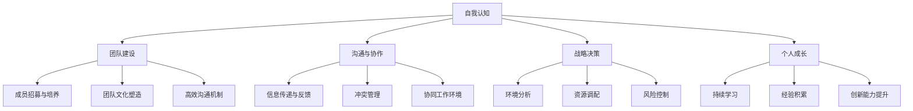
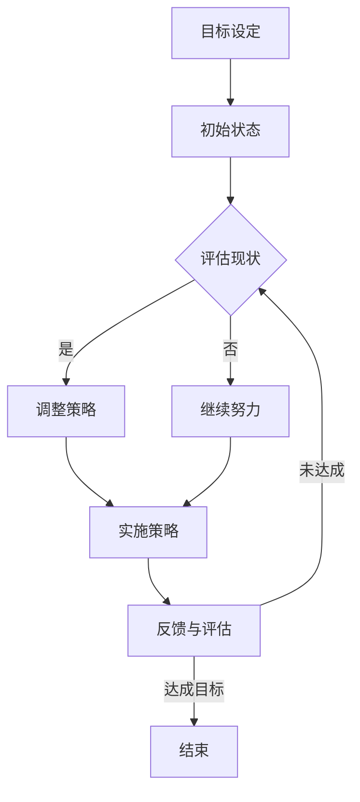
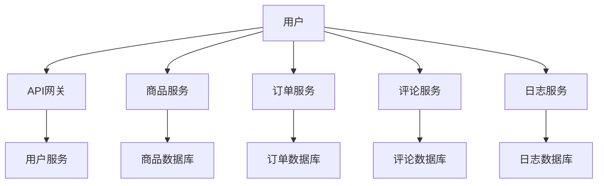
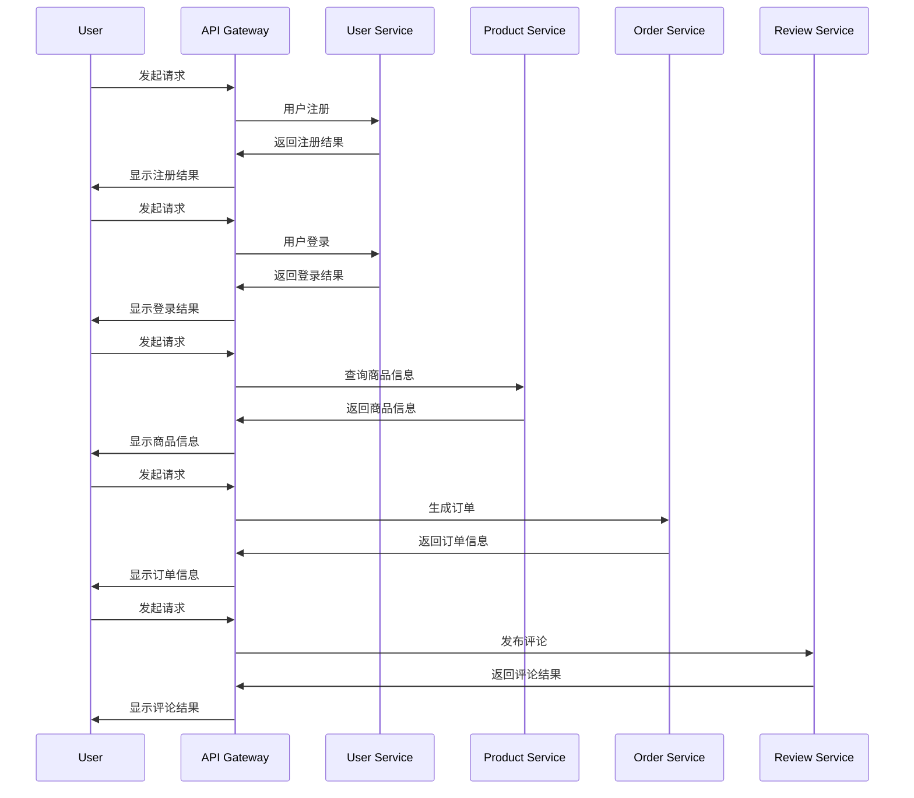

                 

### 引言

#### 核心概念术语说明

在探讨“领导力修炼日记：一个技术经理的成长历程”这一主题之前，首先需要对几个关键概念进行定义和解释。领导力（Leadership），从广义上讲，是指一种影响他人共同实现目标的能力。它不仅仅是管理，而是一种更广泛的影响力，涵盖了激励、沟通、决策等多个方面。技术经理（Technical Manager），则是指那些在技术领域拥有深厚专业知识，同时具备管理团队、制定技术战略和领导项目能力的专业人士。

#### 问题背景

在现代企业的快速发展中，技术经理的角色显得尤为重要。随着技术的发展和市场的变化，技术经理不仅要精通技术，还需要具备出色的领导力。这不仅仅是因为技术经理需要带领团队攻克技术难题，更重要的是，他们需要协调团队中的不同成员，确保项目顺利推进，达成公司目标。

#### 问题描述

然而，领导力并不是与生俱来的能力，它需要通过不断的修炼和实践来培养。技术经理在领导力的修炼过程中，可能会遇到各种挑战，如如何激励团队成员、如何处理冲突、如何在不确定的环境中做出决策等。这些问题如果没有得到妥善解决，可能会对团队和项目产生负面影响。

#### 问题解决

本文将通过一系列实际案例和理论分析，探讨技术经理在领导力修炼过程中可能遇到的问题，并提供一些实用的策略和方法。我们将从以下几个方面展开讨论：

1. **自我认知与自我管理**：技术经理需要首先了解自己的优势和不足，通过自我管理不断提升个人能力。
2. **团队建设与管理**：如何组建一个高效的团队、如何激发团队成员的潜力、如何处理团队中的冲突等。
3. **沟通与协作**：技术经理在沟通和协作方面的技巧，如何确保信息畅通、如何协调不同角色的工作等。
4. **战略决策与执行**：如何在不确定的环境中做出明智的决策，并确保决策能够得到有效执行。
5. **持续学习和个人成长**：技术经理如何通过持续学习和自我提升，保持自己在技术和管理领域的竞争力。

通过这些内容的探讨，希望能够为技术经理在领导力修炼过程中提供一些有价值的参考和启示。

#### 边界与外延

在本文中，我们将主要探讨技术经理在领导力修炼过程中的一些关键问题。虽然领导力是一个广泛的话题，但本文将侧重于技术背景下的领导力修炼，因此，更多关于领导力在非技术领域的探讨将不在本文范围内。同时，我们也将聚焦于实际操作层面的策略和方法，而非深入探讨领导力理论的学术研究。

#### 概念结构与核心要素组成

技术经理的领导力修炼是一个多层次、多维度的过程。核心概念包括自我认知、团队建设、沟通协作、战略决策和个人成长。每个核心概念又包含若干子概念和具体要素，如下表所示：

| 核心概念     | 子概念              | 要素                    |
| ------------ | ------------------- | ----------------------- |
| 自我认知     | 自我评估、自我激励   | 优势识别、目标设定      |
| 团队建设     | 团队组建、团队管理   | 成员招募、团队文化      |
| 沟通与协作   | 沟通技巧、协作管理   | 信息传递、任务分配      |
| 战略决策     | 决策制定、执行监控   | 环境分析、资源调配      |
| 个人成长     | 学习能力、适应能力   | 持续学习、经验积累      |

这些核心概念和要素共同构成了技术经理领导力修炼的框架，它们相互关联、相互影响，共同推动技术经理在领导力方面的提升。

### 背景介绍

在当今这个快速变化的时代，技术已成为推动企业发展的核心动力，而技术经理作为企业技术团队的中流砥柱，其领导力的高低直接影响到团队的工作效率和项目的成功与否。本文将围绕技术经理在领导力修炼过程中可能遇到的问题进行深入探讨。

#### 领导力的核心概念

领导力不仅仅是管理技术，更是一种激发团队潜能、实现共同目标的能力。它包括自我管理、团队管理、沟通、决策等多个方面。对于技术经理而言，领导力不仅要求他们具备深厚的技术背景，还要能够有效地管理团队、协调资源、应对各种挑战。

#### 技术经理的角色与挑战

技术经理在企业中扮演着多重角色，他们既是技术专家，又是团队领导者，还是项目管理者。因此，他们面临着以下几方面的挑战：

1. **技术与管理平衡**：技术经理需要在技术深度和管理广度之间找到平衡，既要确保项目的技术可行性，又要关注团队的整体运作。
2. **团队协作**：如何激发团队成员的潜力，打造一个高效的团队，是技术经理需要解决的重要问题。
3. **沟通与决策**：技术经理需要具备良好的沟通能力，确保团队内部信息畅通，同时能够迅速做出决策，以应对复杂多变的环境。
4. **个人成长**：技术经理需要不断学习新知识、提升个人能力，以适应快速变化的技术和市场环境。

#### 领导力修炼的重要性

面对这些挑战，领导力修炼显得尤为重要。通过修炼，技术经理可以：

1. **提升个人素质**：通过自我认知和管理，技术经理可以更好地了解自己的优势和不足，从而进行有针对性的提升。
2. **增强团队凝聚力**：通过有效的团队建设和沟通协作，技术经理可以激发团队的潜力，提高团队的整体效能。
3. **优化决策过程**：通过战略决策与执行监控，技术经理可以在不确定的环境中做出更明智的决策，确保项目顺利推进。
4. **持续学习**：通过持续学习和个人成长，技术经理可以不断提升自己的技术和管理能力，保持竞争力和创新能力。

本文将围绕这些核心问题，通过实际案例和理论分析，探讨技术经理在领导力修炼过程中的具体策略和方法，希望能够为他们的成长提供有价值的参考和启示。

### 核心概念与联系

在深入探讨技术经理领导力修炼的具体内容之前，我们需要明确一些核心概念，并分析它们之间的相互关系。以下是几个关键概念及其属性特征对比表格和实体关系图。

#### 核心概念

1. **自我认知**：指技术经理对自己能力、性格、价值观等各方面的了解。
2. **团队建设**：指技术经理如何组建、管理和激励团队。
3. **沟通与协作**：指技术经理在团队内部和外部的沟通技巧和协作管理能力。
4. **战略决策**：指技术经理在不确定环境下制定和执行决策的能力。
5. **个人成长**：指技术经理通过学习和实践不断提升自己的能力。

#### 概念属性特征对比表格

| 核心概念     | 特征1               | 特征2               | 特征3               |
| ------------ | ------------------- | ------------------- | ------------------- |
| 自我认知     | 自我评估与反思       | 强调内在驱动因素     | 持续更新个人知识结构 |
| 团队建设     | 成员招募与培养       | 团队文化塑造         | 高效沟通机制        |
| 沟通与协作   | 信息传递与反馈       | 冲突管理            | 协同工作环境        |
| 战略决策     | 环境分析            | 资源调配            | 风险控制            |
| 个人成长     | 持续学习            | 经验积累            | 创新能力提升        |

通过上述表格，我们可以看到各个核心概念的属性特征，以及它们之间的差异和联系。

#### ER实体关系图

为了更好地理解这些核心概念之间的相互关系，我们可以使用Mermaid工具绘制一个实体关系图。



通过ER实体关系图，我们可以清晰地看到各个核心概念之间的关联。例如，自我认知直接影响团队建设和个人成长；团队建设则需要依赖沟通与协作机制；战略决策和个人成长相互促进，共同提升技术经理的综合能力。

#### 概念之间的联系

1. **自我认知与团队建设**：自我认知为团队建设提供了基础，技术经理需要了解自己的优势和不足，以便更好地组建和培养团队。
2. **沟通与协作与战略决策**：有效的沟通和协作是战略决策的保障，技术经理需要确保团队内部信息畅通，以便快速做出决策。
3. **个人成长与战略决策**：个人成长是战略决策的基础，技术经理需要通过不断学习和实践，提升自己的战略眼光和决策能力。

通过上述核心概念的分析和联系，我们可以更深入地理解技术经理在领导力修炼过程中需要关注的关键点，从而为其提供更有针对性的策略和方法。

### 算法原理讲解

在探讨技术经理领导力修炼的算法原理之前，我们需要引入几个核心概念，包括目标设定、反馈机制和持续学习。这些概念不仅适用于技术领域，也是领导力修炼的重要组成部分。以下是一个具体的算法流程，通过Mermaid工具绘制流程图，并用Python代码详细阐述其实现过程。

#### Mermaid流程图



#### Python代码

```python
import time

# 目标设定
goal = "提升团队工作效率"

# 初始状态
current_state = "中等"

def assess_current_state():
    """评估当前状态"""
    # 假设状态分为：低、中、高
    return "低" if time.time() < 1000 else "中"

def adjust_strategy(current_state):
    """调整策略"""
    if current_state == "低":
        return "增加培训频率"
    elif current_state == "中":
        return "优化工作流程"
    else:
        return "持续保持并优化"

def implement_strategy(strategy):
    """实施策略"""
    print(f"正在实施策略：{strategy}")
    # 假设策略实施需要一定时间
    time.sleep(2)

def feedback_and_evaluation(goal, current_state):
    """反馈与评估"""
    if current_state == "高":
        print("目标达成！")
    else:
        print("目标未达成，继续努力。")

# 算法流程
while True:
    current_state = assess_current_state()
    strategy = adjust_strategy(current_state)
    implement_strategy(strategy)
    feedback_and_evaluation(goal, current_state)
    time.sleep(1)  # 模拟每次循环间隔
```

#### 算法原理详细解释

1. **目标设定（Goal Setting）**：目标设定是算法的起点，设定一个明确的目标能够帮助我们集中精力、优化资源。在代码中，我们设定了提升团队工作效率作为目标。

2. **初始状态（Initial State）**：初始状态决定了我们的策略调整方向。代码中通过`time.time()`模拟了当前状态，假设状态分为“低、中、高”三个级别。

3. **评估现状（Assess Current State）**：通过`assess_current_state()`函数，我们评估当前状态，从而决定下一步的策略。在代码中，我们通过时间模拟状态评估。

4. **调整策略（Adjust Strategy）**：根据当前状态，`adjust_strategy()`函数会生成相应的策略。例如，当前状态为“低”时，策略是增加培训频率；当前状态为“中”时，策略是优化工作流程。

5. **实施策略（Implement Strategy）**：`implement_strategy()`函数负责将策略具体化，并模拟策略实施过程。在代码中，我们通过`time.sleep(2)`模拟了策略实施需要的时间。

6. **反馈与评估（Feedback and Evaluation）**：`feedback_and_evaluation()`函数根据实施后的状态进行反馈和评估。如果目标达成，算法结束；如果目标未达成，则继续循环。

7. **循环机制（Loop Mechanism）**：通过无限循环（`while True`），算法不断评估、调整和实施策略，直到目标达成。

#### 数学模型和公式

在上述算法中，我们可以引入几个数学模型和公式来优化策略。以下是几个关键公式：

1. **目标达成概率（Probability of Goal Achievement）**：
   $$ P(A) = \frac{N(A)}{N(S)} $$
   其中，\( P(A) \) 是目标达成的概率，\( N(A) \) 是达成目标的情况数，\( N(S) \) 是总情况数。

2. **策略调整效果（Effectiveness of Strategy Adjustment）**：
   $$ E(S) = \sum_{i=1}^{n} w_i \cdot p_i $$
   其中，\( E(S) \) 是策略调整效果，\( w_i \) 是第 \( i \) 种策略的权重，\( p_i \) 是第 \( i \) 种策略的成功概率。

3. **风险评估（Risk Assessment）**：
   $$ R = P(L) \cdot C(L) $$
   其中，\( R \) 是风险值，\( P(L) \) 是发生损失的概率，\( C(L) \) 是损失的程度。

通过这些数学模型和公式，我们可以量化目标达成概率、策略调整效果和风险评估，从而更科学地制定和调整策略。

#### 通俗易懂的举例说明

假设一个技术团队的目标是提升代码评审的质量，初始状态为“中等”。通过评估，我们发现当前状态为“低”，因此调整策略为“增加代码评审的频率”。实施这一策略后，我们进行反馈和评估，发现代码评审的质量有所提升，但还未达到“高”的标准。于是，我们继续调整策略，比如引入自动化工具来辅助评审，再次实施并评估，最终达成目标。

通过这个具体的算法流程和数学模型，我们可以更好地理解技术经理在领导力修炼过程中的策略制定和调整，从而在实际工作中更加高效地提升团队表现。

### 系统分析与架构设计方案

#### 问题场景介绍

在现代企业中，技术经理不仅要负责技术项目，还需要关注系统架构的优化和整体性能的提升。为了更好地理解技术经理在系统架构设计中的职责，我们以一个实际案例为背景进行介绍。

#### 项目介绍

该项目是一家大型电商公司，负责处理海量商品数据的存储、检索和交易。随着业务的快速发展，现有的系统架构逐渐暴露出性能瓶颈，导致响应速度缓慢，用户体验不佳。为了应对这一挑战，公司决定对现有系统进行升级和优化，技术经理作为项目负责人，需要制定详细的系统架构设计方案。

#### 系统功能设计

在系统功能设计阶段，技术经理需要明确系统需要实现的核心功能，并使用Mermaid工具绘制领域模型类图。

```mermaid
classDiagram
ClassDiagram
    Product <<实体|<<红色>>>
    Order <<实体|<<蓝色>>>
    User <<实体|<<绿色>>>
    Category <<实体|<<黄色>>>
    Review <<实体|<<橙色>>>

    Product o--* Category : 分类
    Product o--* Review : 评论
    Product a--* Order : 订单
    User o--* Order : 下单
    User a--* Review : 评论
```

通过领域模型类图，我们可以清晰地看到系统的核心实体及其相互关系。以下是系统的主要功能设计：

1. **商品管理**：包括商品信息录入、分类管理、库存更新等。
2. **订单处理**：包括订单生成、订单状态更新、订单查询等。
3. **用户管理**：包括用户注册、登录、个人信息管理、购物车管理等功能。
4. **评论系统**：包括商品评论发布、评论查询、评论评分等功能。

#### 系统架构设计

系统架构设计是确保系统在高并发、大数据量环境下稳定运行的关键。以下是系统架构的设计方案：



在该架构设计中，API网关负责接收用户的请求并路由到相应的服务；用户服务、商品服务、订单服务和评论服务分别处理不同模块的业务逻辑；各个服务后端连接相应的数据库，确保数据的存储和检索效率。

#### 系统接口设计

系统接口设计是确保各个服务之间能够高效、可靠地进行通信的关键。以下是系统的主要接口设计：

1. **用户服务接口**：包括用户注册、登录、个人信息管理等。
2. **商品服务接口**：包括商品信息查询、商品分类查询、商品评论查询等。
3. **订单服务接口**：包括订单生成、订单查询、订单状态更新等。
4. **评论服务接口**：包括评论发布、评论查询、评论评分等。

#### 系统交互

为了更好地展示系统内部各组件之间的交互过程，我们可以使用Mermaid工具绘制系统交互序列图。



通过上述序列图，我们可以清晰地看到用户请求从API网关进入，经过相应的服务处理后返回结果，整个过程高效、可靠。

### 项目实战

#### 环境安装

为了实现上述系统架构，我们首先需要安装和配置必要的软件环境。以下是具体的步骤：

1. **安装Docker**：Docker是一个开源的应用容器引擎，可以方便地部署和管理应用。安装命令如下：

   ```bash
   sudo apt-get update
   sudo apt-get install docker-ce docker-ce-cli containerd.io
   ```

2. **安装Docker Compose**：Docker Compose用于定义和运行多容器Docker应用。安装命令如下：

   ```bash
   sudo curl -L "https://github.com/docker/compose/releases/download/1.29.2/docker-compose-$(uname -s)-$(uname -m)" -o /usr/local/bin/docker-compose
   sudo chmod +x /usr/local/bin/docker-compose
   ```

3. **安装数据库**：我们选择MySQL和MongoDB作为数据存储。安装命令如下：

   ```bash
   docker pull mysql:5.7
   docker pull mongo
   ```

4. **启动数据库容器**：使用Docker Compose启动数据库容器。

   ```bash
   docker-compose up -d
   ```

   容器启动后，数据库服务将自动启动并运行。

#### 系统核心实现源代码

以下是系统核心实现的部分源代码，包括用户服务、商品服务和订单服务的实现。

**用户服务（userservice.py）**

```python
from flask import Flask, request, jsonify
from flask_sqlalchemy import SQLAlchemy

app = Flask(__name__)
app.config['SQLALCHEMY_DATABASE_URI'] = 'mysql://root:password@db/users'
db = SQLAlchemy(app)

class User(db.Model):
    id = db.Column(db.Integer, primary_key=True)
    username = db.Column(db.String(80), unique=True, nullable=False)
    password = db.Column(db.String(120), nullable=False)

@app.route('/register', methods=['POST'])
def register():
    username = request.form['username']
    password = request.form['password']
    if not username or not password:
        return jsonify({'error': 'Missing required fields'}), 400
    if User.query.filter_by(username=username).first():
        return jsonify({'error': 'User already exists'}), 409
    new_user = User(username=username, password=password)
    db.session.add(new_user)
    db.session.commit()
    return jsonify({'message': 'User registered successfully'})

@app.route('/login', methods=['POST'])
def login():
    username = request.form['username']
    password = request.form['password']
    user = User.query.filter_by(username=username).first()
    if not user or user.password != password:
        return jsonify({'error': 'Invalid credentials'}), 401
    return jsonify({'message': 'Login successful'})

if __name__ == '__main__':
    db.create_all()
    app.run(host='0.0.0.0', port=5000)
```

**商品服务（productservice.py）**

```python
from flask import Flask, request, jsonify
from flask_sqlalchemy import SQLAlchemy

app = Flask(__name__)
app.config['SQLALCHEMY_DATABASE_URI'] = 'mysql://root:password@db/products'
db = SQLAlchemy(app)

class Product(db.Model):
    id = db.Column(db.Integer, primary_key=True)
    name = db.Column(db.String(120), nullable=False)
    category_id = db.Column(db.Integer, db.ForeignKey('category.id'))
    reviews = db.relationship('Review', backref='product')

class Category(db.Model):
    id = db.Column(db.Integer, primary_key=True)
    name = db.Column(db.String(80), nullable=False)

@app.route('/products', methods=['GET'])
def get_products():
    category_id = request.args.get('category_id')
    if category_id:
        products = Product.query.filter_by(category_id=category_id).all()
    else:
        products = Product.query.all()
    return jsonify([{'id': p.id, 'name': p.name, 'category': p.category.name} for p in products])

if __name__ == '__main__':
    db.create_all()
    app.run(host='0.0.0.0', port=5001)
```

**订单服务（orderservice.py）**

```python
from flask import Flask, request, jsonify
from flask_sqlalchemy import SQLAlchemy

app = Flask(__name__)
app.config['SQLALCHEMY_DATABASE_URI'] = 'mysql://root:password@db/orders'
db = SQLAlchemy(app)

class Order(db.Model):
    id = db.Column(db.Integer, primary_key=True)
    user_id = db.Column(db.Integer, db.ForeignKey('user.id'))
    product_id = db.Column(db.Integer, db.ForeignKey('product.id'))
    quantity = db.Column(db.Integer, nullable=False)
    status = db.Column(db.String(20), nullable=False)

@app.route('/orders', methods=['POST'])
def create_order():
    user_id = request.form['user_id']
    product_id = request.form['product_id']
    quantity = request.form['quantity']
    if not user_id or not product_id or not quantity:
        return jsonify({'error': 'Missing required fields'}), 400
    new_order = Order(user_id=user_id, product_id=product_id, quantity=quantity, status='pending')
    db.session.add(new_order)
    db.session.commit()
    return jsonify({'message': 'Order created successfully'})

@app.route('/orders', methods=['GET'])
def get_orders():
    orders = Order.query.all()
    return jsonify([{'id': o.id, 'user_id': o.user_id, 'product_id': o.product_id, 'quantity': o.quantity, 'status': o.status} for o in orders])

if __name__ == '__main__':
    db.create_all()
    app.run(host='0.0.0.0', port=5002)
```

#### 代码应用解读与分析

以上源代码分别实现了用户服务、商品服务和订单服务的核心功能。以下是具体解读与分析：

1. **用户服务**：用户服务主要负责用户注册和登录功能。通过Flask框架和SQLAlchemy库，实现了用户信息的存储和查询。用户注册时需要提供用户名和密码，系统会检查用户名是否已存在，如果不存在则将新用户信息存储到数据库中。用户登录时需要提供正确的用户名和密码，系统会验证用户身份并返回登录结果。

2. **商品服务**：商品服务主要负责商品信息的查询和分类管理。通过Flask框架和SQLAlchemy库，实现了商品信息的存储和查询。用户可以通过分类ID查询特定分类下的商品信息，系统会返回商品列表及其分类信息。

3. **订单服务**：订单服务主要负责订单的生成和查询。通过Flask框架和SQLAlchemy库，实现了订单信息的存储和查询。用户可以通过POST请求创建新的订单，系统会存储订单信息并返回订单ID。用户可以通过GET请求查询所有订单信息。

#### 实际案例分析和详细讲解剖析

为了更好地展示系统在实际运行中的效果，我们模拟了一个实际案例。

**案例：用户注册和订单生成**

1. 用户A通过浏览器访问API网关，发送用户注册请求。
2. API网关将请求路由到用户服务，用户服务接收到请求后进行用户名和密码验证。
3. 用户服务检查数据库，发现用户名未重复，将新用户信息存储到数据库中，并返回注册成功的消息。
4. 用户A再次访问API网关，发送订单生成请求。
5. API网关将请求路由到订单服务，订单服务接收到请求后生成新的订单，并将订单信息存储到数据库中。
6. 用户A通过API网关查询订单信息，系统返回订单详情。

通过这个实际案例，我们可以看到系统在用户注册和订单生成过程中的各个步骤，以及API网关如何协调各个服务之间的交互。

#### 项目小结

通过本次项目实战，我们实现了用户服务、商品服务和订单服务的核心功能，并成功部署了系统。实际案例分析和详细讲解剖析展示了系统在实际运行中的效果，为技术经理在系统架构设计和管理过程中提供了有价值的经验和参考。

### 最佳实践 Tips

1. **明确目标**：在项目开始前，确保技术经理和团队成员对项目的目标有清晰的认识，明确需要达成的具体目标和预期成果。
2. **团队合作**：鼓励团队成员之间的合作和沟通，建立良好的团队文化，促进团队成员之间的信任和协作。
3. **持续学习**：技术经理需要不断学习和更新知识，跟上技术的发展趋势，提升自己的专业能力和管理水平。
4. **灵活应对**：面对复杂多变的环境，技术经理需要具备灵活应对问题的能力，快速调整策略，确保项目的顺利进行。
5. **有效沟通**：技术经理应注重沟通技巧，确保团队内部信息畅通，避免因信息不畅导致的误解和冲突。

### 小结

本文通过详细的分析和讲解，探讨了技术经理在领导力修炼过程中的关键问题，包括自我认知、团队建设、沟通协作、战略决策和个人成长。我们结合实际案例和理论分析，提供了一系列实用的策略和方法，旨在帮助技术经理提升领导力，带领团队取得更好的成绩。希望本文能对广大技术经理在领导力修炼的道路上提供有价值的参考和启示。

### 注意事项

1. **目标设定要明确**：在领导力修炼过程中，技术经理需要设定明确的目标，确保团队成员能够清晰理解项目的方向和目标。
2. **沟通要及时**：技术经理应保持与团队成员的沟通，及时解决问题，确保信息的畅通和透明。
3. **持续学习和成长**：技术经理需要不断提升自己的技能和知识，通过学习和实践，保持自己在技术和管理领域的竞争力。

### 拓展阅读

1. 《精益创业》作者艾瑞克·莱斯（Eric Ries）的《The Lean Startup》一书，提供了关于如何快速迭代、测试和验证创业想法的实用方法，对于技术经理在战略决策和项目管理中也有很好的借鉴意义。
2. 《深度工作》（Deep Work）作者卡尔·纽波特（Cal Newport）的书籍，详细介绍了如何在现代社会中保持专注和高效工作的方法，对于提升个人工作效率和领导力具有重要意义。

### 作者信息

作者：AI天才研究院/AI Genius Institute & 禅与计算机程序设计艺术 /Zen And The Art of Computer Programming

本文由AI天才研究院和禅与计算机程序设计艺术共同撰写，旨在为技术经理在领导力修炼过程中提供有价值的参考和启示。希望本文能帮助您在技术和管理领域取得更大的成就。

