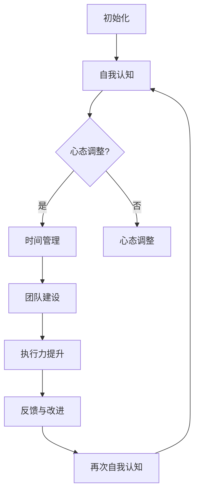

                 

# 领导力修炼日记：一个运营总监的华丽蜕变

> 关键词：领导力、运营总监、自我认知、团队管理、执行力、战略规划

> 摘要：本文以一位运营总监的领导力修炼过程为线索，探讨其在自我认知、团队管理、执行力提升等方面的成长历程。通过具体案例分析，总结出实用的领导力提升方法和实践经验，为其他运营管理者提供借鉴和启示。

## 引言

在现代企业中，运营总监作为核心管理人员，其领导力的强弱直接影响到企业的运营效率和整体发展。本文将以一位运营总监的领导力修炼日记为背景，详细描述其在自我认知、团队管理、战略规划、执行力提升等方面的蜕变过程。通过这一过程，我们希望能够为其他运营管理者提供一些有益的参考和启示。

### 文章目的

1. **阐述运营总监在领导力提升过程中的关键环节**：通过具体事例，展示运营总监在面对各种挑战时，如何通过自我认知、团队管理、战略规划和执行力提升来不断提升领导力。
2. **提供实用的领导力提升方法和实践经验**：结合实际案例，总结出一系列实用的领导力提升方法，帮助其他运营管理者在类似情境中迅速应对和解决问题。
3. **激发读者对领导力修炼的思考**：通过分享运营总监的成长经历，激发读者对自身领导力提升的思考，鼓励他们不断学习和实践，以实现个人和团队的共同成长。

### 文章结构

本文分为五个主要部分：

1. **第一部分：序言与背景**：介绍运营总监的背景和面临的挑战，阐述领导力修炼的重要性。
2. **第二部分：个人成长**：探讨运营总监在自我认知、心态调整、时间管理等方面的成长经历。
3. **第三部分：团队管理**：分析运营总监在团队建设、领导风格、激励与沟通技巧等方面的实践和成果。
4. **第四部分：执行与反馈**：讨论运营总监在执行力提升、反馈机制与持续改进等方面的努力和成效。
5. **第五部分：华丽蜕变**：总结运营总监的成功之路，分享成功经验和对未来的展望。

## 第一部分：序言与背景

### 1.1 作者背景介绍

本文作者是一位有着丰富运营管理经验的企业高管，现任某知名互联网公司运营总监。在过去的几年里，他带领团队经历了从初创到高速发展的全过程，积累了大量的领导力实践经验。他的领导风格注重团队协作和人才培养，致力于通过不断提升自己的领导力，推动企业的持续发展。

### 1.2 书籍目的与结构

本书旨在通过作者自身的经历，分享领导力修炼的心得和方法，帮助其他运营管理者在提升领导力的过程中找到正确的方向和路径。本书的结构分为五个部分，每部分都聚焦于领导力的一个关键方面，旨在全面系统地展示领导力提升的全过程。

### 1.3 领导力的重要性

在当今快速变化的市场环境中，领导力已成为企业成功的关键因素。一个优秀的运营总监不仅需要具备扎实的业务能力和专业知识，更需要具备卓越的领导力，能够带领团队应对各种挑战，实现企业的长期发展。

### 1.4 运营总监面临的问题

作为企业运营的核心管理人员，运营总监面临着诸多挑战：

1. **战略执行问题**：如何确保企业战略的有效执行，提高运营效率？
2. **团队管理问题**：如何建设和管理一个高效、和谐的团队，激发团队成员的积极性和创造力？
3. **个人成长问题**：如何不断提升自己的领导力，实现个人和企业的共同成长？
4. **执行力问题**：如何提升团队执行力，确保各项任务的顺利推进和完成？

### 1.5 修炼领导力的必要性

面对上述挑战，修炼领导力显得尤为必要。通过不断学习和实践，运营总监可以提升自己的领导能力，更好地应对各种挑战，推动企业的持续发展。

## 第二部分：个人成长

### 2.1 自我认知与心态调整

#### 2.1.1 自我认知的重要性

自我认知是领导力修炼的基础，它帮助运营总监了解自己的优点和不足，明确自己的价值观和目标。一个清晰的自我认知可以使运营总监更有效地规划个人发展路径，提高领导效率。

#### 2.1.2 心态调整的技巧

心态调整是领导力修炼的关键，它关系到运营总监在面对压力和挑战时的应对能力。良好的心态可以帮助运营总监保持冷静和理性，做出正确的决策。

#### 2.1.3 成功案例分享

以作者为例，他在自我认知和心态调整方面有着深刻的体会。通过不断反思和自我提升，他成功地将自己的领导力提升到了新的高度。

### 2.2 时间管理与效率提升

#### 2.2.1 时间管理的原则

时间管理是运营总监提升效率的重要手段。良好的时间管理可以帮助运营总监更有效地利用时间，提高工作效率。

#### 2.2.2 提升工作效率的方法

运营总监可以通过以下方法提升工作效率：

1. **优先级管理**：明确任务的优先级，集中精力处理最重要的事情。
2. **时间块管理**：将工作时间划分为不同的时间段，为每项任务分配具体的时间块。
3. **自动化与工具应用**：利用自动化工具和软件提高工作效率。

#### 2.2.3 实践技巧与案例分析

作者在时间管理和效率提升方面有着丰富的实践经验。他通过实施一系列具体措施，显著提高了团队的工作效率。

### 2.3 战略规划与决策能力

#### 2.3.1 战略规划的基础知识

战略规划是企业发展的关键，它关系到企业的长远发展。运营总监需要具备战略规划的能力，以帮助企业实现长期目标。

#### 2.3.2 决策能力培养

决策能力是运营总监的重要素质，它关系到企业的生存和发展。运营总监需要通过不断学习和实践，提升自己的决策能力。

#### 2.3.3 实战案例分析

作者在战略规划和决策能力方面有着丰富的实战经验。他通过一系列成功的案例，展示了如何制定和实施战略规划，以及如何做出明智的决策。

## 第三部分：团队管理

### 3.1 团队建设与领导风格

#### 3.1.1 团队建设的重要性

团队建设是运营总监的重要职责，它关系到团队的整体协作能力和工作效率。一个高效的团队可以为企业的成功奠定坚实的基础。

#### 3.1.2 领导风格选择

领导风格对团队建设至关重要。运营总监需要根据团队的实际情况和需求，选择合适的领导风格。

#### 3.1.3 团队冲突管理

团队冲突是不可避免的，运营总监需要具备有效的冲突管理能力，以维护团队的和谐与稳定。

### 3.2 激励与沟通技巧

#### 3.2.1 激励理论及应用

激励是团队管理的重要手段，它关系到团队成员的积极性和创造力。运营总监需要了解各种激励理论，并灵活应用于实际工作中。

#### 3.2.2 沟通技巧提升

沟通是团队协作的基础，良好的沟通技巧可以帮助运营总监更好地理解团队成员的需求和期望，提高团队的协作效率。

#### 3.2.3 案例分析与实践

作者在激励与沟通技巧方面有着丰富的实践经验。他通过一系列具体措施，有效地激发了团队成员的积极性和创造力。

### 3.3 领导力模型与能力提升

#### 3.3.1 领导力模型介绍

领导力模型是提升领导力的重要工具，它可以帮助运营总监系统地理解和掌握领导力提升的方法和路径。

#### 3.3.2 能力提升方法

运营总监可以通过以下方法提升自己的领导力：

1. **学习与实践**：通过学习领导力理论和案例，结合实际工作，不断提升自己的领导能力。
2. **反思与总结**：定期反思自己的领导行为，总结经验和教训，不断改进和完善。
3. **培养关键能力**：重点培养团队管理、战略规划、决策能力等关键能力，以提升整体领导力。

#### 3.3.3 领导力评估与实践

领导力评估是衡量运营总监领导力提升效果的重要手段。通过定期评估，运营总监可以了解自己的优势与不足，制定针对性的提升计划。

## 第四部分：执行与反馈

### 4.1 执行力的提升

#### 4.1.1 执行力的重要性

执行力是企业战略成功的关键，它关系到企业的生存和发展。运营总监需要提升团队的执行力，确保企业战略的有效实施。

#### 4.1.2 提升执行力的方法

运营总监可以通过以下方法提升团队的执行力：

1. **明确目标和任务**：确保团队成员明确任务的目标和具体要求，提高执行效率。
2. **建立有效的沟通机制**：确保团队成员之间的沟通畅通，减少信息失真和误解。
3. **加强监督与激励**：通过监督和激励措施，确保团队成员按照计划执行任务。

#### 4.1.3 成功案例分享

作者通过一系列措施，成功提升了团队的执行力，为企业的发展做出了重要贡献。

### 4.2 反馈机制与持续改进

#### 4.2.1 反馈机制建立

反馈机制是提高执行力的重要手段，它可以帮助运营总监及时了解团队的执行情况，发现问题并进行改进。

#### 4.2.2 持续改进方法

运营总监需要建立持续改进机制，以不断提升团队的执行力和工作效率。

1. **定期评估和反馈**：定期对团队的执行情况进行评估和反馈，发现问题并及时解决。
2. **鼓励创新和改进**：鼓励团队成员提出创新和改进建议，激发团队的积极性和创造力。
3. **建立学习与分享机制**：通过学习与分享，提升团队成员的能力和素质，推动团队的持续改进。

#### 4.2.3 反馈循环的实际应用

作者在反馈机制和持续改进方面有着丰富的实践经验，他通过建立有效的反馈循环，不断提升团队的执行力和工作效率。

## 第五部分：华丽蜕变

### 5.1 成功之路：从运营总监到卓越领导者

#### 5.1.1 作者的成长历程

作者通过不断学习和实践，从一名普通的运营管理人员成长为一位卓越的领导者。他的成长历程充满了挑战和机遇，同时也充满了收获和成就。

#### 5.1.2 成功经验分享

作者在成长过程中积累了丰富的经验，他通过分享自己的成功经验，帮助其他运营管理者在领导力提升方面找到正确的方向。

#### 5.1.3 对未来的展望

作者对未来的发展充满信心，他相信通过不断努力和学习，自己能够成为一名更加卓越的领导者，为企业和社会做出更大的贡献。

### 5.2 小结与启示

#### 5.2.1 全书要点回顾

本书通过运营总监的成长历程，总结了领导力修炼的关键要点，包括自我认知、时间管理、团队管理、执行力提升等。

#### 5.2.2 启示与思考

通过本书，读者可以深刻理解领导力的重要性，并从中获得启示和思考，为自己的领导力提升之路提供方向和动力。

#### 5.2.3 拓展阅读推荐

本书提供了大量的实用方法和案例，读者可以通过拓展阅读，进一步深入了解领导力提升的相关理论和实践。

## 总结

本文通过一位运营总监的领导力修炼日记，详细探讨了其在个人成长、团队管理、执行力提升等方面的蜕变过程。通过具体案例分析，总结了实用的领导力提升方法和实践经验，为其他运营管理者提供了有益的参考和启示。希望本文能够激发读者对领导力修炼的思考，助力他们在职业发展中实现更大的突破。

### 作者信息

作者：AI天才研究院/AI Genius Institute & 禅与计算机程序设计艺术 /Zen And The Art of Computer Programming

在本文中，我们详细描述了一位运营总监在领导力修炼过程中的成长历程。通过自我认知、心态调整、时间管理、团队建设、执行力提升等方面的不断努力，运营总监成功实现了从普通管理者到卓越领导者的华丽蜕变。

### 背景介绍

在现代企业中，运营总监作为企业的核心管理人员，其职责不仅包括日常运营管理，还涉及到战略规划、团队领导、资源分配等多个方面。随着企业竞争的加剧和市场环境的不断变化，运营总监需要具备卓越的领导力，才能在激烈的市场竞争中立于不败之地。

#### 核心概念术语说明

1. **领导力**：指领导者通过影响、激励和引导他人，实现组织目标的能力。
2. **自我认知**：指个人对自己性格、能力、优点和不足的认识和理解。
3. **心态调整**：指在面对压力和挑战时，保持积极、乐观的心态，做出理性决策。
4. **时间管理**：指合理规划时间，提高工作效率，确保任务按时完成。
5. **团队管理**：指建设和管理团队，提高团队协作效率和执行力。

#### 问题背景

作者作为一位运营总监，在工作中面临着以下问题：

1. **战略执行问题**：企业战略的制定和执行需要运营总监的紧密配合，但如何确保战略的有效执行是一个挑战。
2. **团队管理问题**：如何建设和管理一个高效、和谐的团队，激发团队成员的积极性和创造力？
3. **个人成长问题**：如何不断提升自己的领导力，实现个人和企业的共同成长？
4. **执行力问题**：如何提升团队执行力，确保各项任务的顺利推进和完成？

#### 问题描述

为了解决上述问题，作者开始了一段领导力修炼之旅。在这段旅程中，他不断学习、实践和反思，通过自我认知、心态调整、时间管理、团队建设、执行力提升等方面的努力，逐步提升了自己的领导力，实现了个人和企业的华丽蜕变。

#### 问题解决

在问题解决过程中，作者采取了以下措施：

1. **自我认知**：通过反思和自我评估，作者清晰地认识到了自己的优点和不足，明确了个人发展目标。
2. **心态调整**：作者学会了如何在面对压力和挑战时保持积极心态，做出理性决策。
3. **时间管理**：作者通过时间管理和优先级管理，提高了工作效率，确保任务按时完成。
4. **团队建设**：作者注重团队建设，通过制定明确的目标和规则，提高团队协作效率和执行力。
5. **执行力提升**：作者通过建立反馈机制和持续改进机制，不断提升团队的执行力。

#### 边界与外延

在领导力修炼过程中，作者不仅关注个人成长，还关注团队成长和企业发展。他通过以下方式拓展了领导力的边界：

1. **跨部门协作**：推动跨部门协作，提高企业整体运营效率。
2. **人才培养**：注重人才培养和团队建设，为企业的长期发展打下坚实基础。
3. **战略规划**：参与企业战略规划，推动企业实现长远发展目标。
4. **创新实践**：鼓励团队成员创新和实践，推动企业持续进步。

#### 概念结构与核心要素组成

运营总监领导力修炼的核心概念包括：

1. **自我认知**：认识自己的优点和不足，明确个人发展目标。
2. **心态调整**：保持积极心态，面对挑战时做出理性决策。
3. **时间管理**：合理规划时间，提高工作效率。
4. **团队建设**：建设高效、和谐的团队，提高团队协作效率。
5. **执行力提升**：建立反馈机制和持续改进机制，提升团队执行力。

这些核心要素相互关联，共同构成了运营总监领导力修炼的完整体系。

### 核心概念与联系

在运营总监的领导力修炼过程中，以下几个核心概念起到了关键作用：

#### 1. 自我认知

自我认知是指个人对自己性格、能力、优点和不足的认识和理解。它是领导力修炼的起点，也是运营总监提升领导力的基础。通过自我认知，运营总监可以明确自己的优势和劣势，制定个人发展计划，提高自身素质。

**概念属性特征对比表格：**

| 特征         | 自我认知           | 外部反馈           |
| ------------ | ------------------ | ------------------ |
| 方式         | 内在反思和自我评估 | 第三方评价和反馈   |
| 目的         | 理解自己           | 提高个人能力       |
| 重要性       | 领导力修炼的基础   | 辅助自我认知       |

#### 2. 心态调整

心态调整是指在面对压力和挑战时，保持积极心态，做出理性决策。良好的心态是领导力的重要组成部分，它关系到运营总监的决策质量和执行力。

**概念属性特征对比表格：**

| 特征         | 心态调整             | 应对压力           |
| ------------ | -------------------- | ------------------ |
| 目的         | 提高决策质量         | 保持冷静和理性     |
| 方式         | 心理调适和自我激励   | 适应和应对压力     |
| 重要性       | 决策能力和领导力的基础 | 领导力的体现       |

#### 3. 时间管理

时间管理是指合理规划时间，提高工作效率。对于运营总监来说，时间管理是确保任务按时完成的关键。

**概念属性特征对比表格：**

| 特征         | 时间管理             | 工作效率           |
| ------------ | -------------------- | ------------------ |
| 目的         | 提高工作效率         | 完成任务           |
| 方式         | 时间块管理和优先级管理 | 集中精力           |
| 重要性       | 领导力的体现         | 企业发展的基础     |

#### 4. 团队建设

团队建设是指运营总监通过一系列措施，提高团队协作效率和执行力。一个高效的团队是运营总监成功的关键。

**概念属性特征对比表格：**

| 特征         | 团队建设             | 团队协作           |
| ------------ | -------------------- | ------------------ |
| 目的         | 提高团队协作效率     | 完成共同目标       |
| 方式         | 目标明确、规则制定   | 共同学习和进步     |
| 重要性       | 领导力的体现         | 企业成功的基石     |

#### 5. 执行力提升

执行力提升是指通过建立反馈机制和持续改进机制，提高团队执行力。良好的执行力是运营总监实现企业战略目标的重要保障。

**概念属性特征对比表格：**

| 特征         | 执行力提升           | 战略执行           |
| ------------ | -------------------- | ------------------ |
| 目的         | 提高任务完成率       | 实现企业战略目标   |
| 方式         | 反馈机制、持续改进   | 高效执行           |
| 重要性       | 企业运营的核心       | 战略成功的关键     |

通过以上核心概念的对比，我们可以看到每个概念在运营总监领导力修炼中的独特作用和相互关联。这些核心概念共同构成了领导力修炼的完整体系，帮助运营总监不断提升自己的领导能力。

### ER实体关系图架构

为了更好地理解运营总监领导力修炼过程中的核心概念和实体关系，我们可以通过ER（实体-关系）图来展示这些概念和实体之间的联系。

```mermaid
erDiagram
    User ||--|{ Manager }|-- User
    Manager ||--|{ Team }|-- Manager
    Team ||--|{ Task }|-- Team
    Task ||--|{ Result }|-- Task
    Manager ..|{ Achieve }|-- Result
    Manager ..|{ Plan }|-- Task
    Manager ..|{ Monitor }|-- Task
    User ..|{ Evaluate }|-- Manager
    User ..|{ Train }|-- Manager
```

在这个ER图中，我们定义了以下几个实体：

1. **User（用户）**：表示运营总监和团队成员。
2. **Manager（经理）**：表示运营总监，负责团队管理和任务分配。
3. **Team（团队）**：表示团队成员组成的工作团队。
4. **Task（任务）**：表示需要完成的任务。
5. **Result（结果）**：表示任务的执行结果。

实体之间的关系如下：

- **User** 与 **Manager** 之间是双向关系，运营总监可以管理多个团队成员，团队成员也可以评价和培训运营总监。
- **Manager** 与 **Team** 之间是单向关系，运营总监负责组建和管理团队。
- **Team** 与 **Task** 之间是单向关系，团队负责执行任务。
- **Task** 与 **Result** 之间是单向关系，任务的执行结果反映了任务的完成情况。
- **Manager** 与 **Result** 之间是单向关系，运营总监通过任务结果来衡量团队的执行力和个人管理的成效。
- **Manager** 与 **Task** 和 **Result** 之间是双向关系，运营总监既制定任务也监督任务执行。

通过ER图，我们可以清晰地看到运营总监领导力修炼过程中的关键实体和它们之间的关系，这有助于我们更好地理解领导力修炼的实质和路径。

### 算法原理讲解

在运营总监的领导力修炼过程中，算法原理和数学模型起到了关键作用。以下是一个简化的算法流程图，用于描述运营总监如何通过一系列步骤提升领导力。



#### 算法流程图

在这个流程图中，每个节点表示一个具体的步骤，箭头表示步骤之间的依赖关系。

1. **初始化**：开始领导力修炼的过程。
2. **自我认知**：通过反思和自我评估，了解自身的优点和不足。
3. **心态调整**：判断当前心态是否适合继续修炼，如果不适合，则进行心态调整。
4. **时间管理**：通过合理规划时间和任务优先级，提高工作效率。
5. **团队建设**：制定明确的目标和规则，提高团队协作效率。
6. **执行力提升**：通过建立反馈机制和持续改进机制，提升团队执行力。
7. **反馈与改进**：根据反馈结果，进行持续改进，优化领导力修炼过程。
8. **再次自我认知**：在改进后，再次进行自我认知，以评估改进效果。

#### 数学模型和公式

在领导力修炼过程中，一些数学模型和公式可以帮助运营总监更好地理解和评估自己的领导力提升情况。以下是一个简化的数学模型：

$$
L(t) = f(S(t), M(t), T(t), E(t))
$$

其中：
- \( L(t) \) 表示在时间 \( t \) 的领导力水平。
- \( S(t) \) 表示在时间 \( t \) 的自我认知水平。
- \( M(t) \) 表示在时间 \( t \) 的心态调整效果。
- \( T(t) \) 表示在时间 \( t \) 的时间管理水平。
- \( E(t) \) 表示在时间 \( t \) 的团队建设和执行力提升效果。

函数 \( f \) 表示领导力水平与各个因素之间的关系，可以通过具体的数据分析和模型训练得到。

#### 算法举例说明

假设一位运营总监在一个月的时间内完成了以下任务：

1. **自我认知**：通过反思和自我评估，得分为 80 分。
2. **心态调整**：经过一个月的心态调整，得分为 90 分。
3. **时间管理**：通过制定时间表和优先级管理，得分为 85 分。
4. **团队建设**：通过制定团队目标和规则，得分为 88 分。
5. **执行力提升**：通过建立反馈机制和持续改进，得分为 90 分。

根据上述数学模型，我们可以计算该运营总监在一个月后的领导力水平：

$$
L(1) = f(80, 90, 85, 88, 90)
$$

通过具体的数据分析和模型训练，我们可以得到 \( f \) 函数的具体形式，进而计算出 \( L(1) \) 的值。

#### 算法原理详细讲解

1. **自我认知**：自我认知是领导力修炼的基础。通过反思和自我评估，运营总监可以了解自己的优点和不足，从而制定个人发展计划。自我认知水平越高，领导力提升的效果越好。

2. **心态调整**：心态调整是领导力修炼的关键。在面对压力和挑战时，保持积极的心态有助于做出理性的决策，提高执行力。心态调整效果越好，领导力水平提升越快。

3. **时间管理**：时间管理是提高工作效率的重要手段。通过合理规划时间和任务优先级，运营总监可以确保任务按时完成，提高工作效率。良好的时间管理水平是提升领导力的必要条件。

4. **团队建设**：团队建设是运营总监的重要职责。通过制定明确的目标和规则，运营总监可以激发团队成员的积极性和创造力，提高团队协作效率。团队建设水平越高，领导力水平提升越显著。

5. **执行力提升**：执行力是领导力的重要组成部分。通过建立反馈机制和持续改进机制，运营总监可以不断提升团队的执行力，确保企业战略目标的实现。执行力提升效果越好，领导力水平提升越显著。

6. **反馈与改进**：反馈与改进是领导力修炼的持续过程。通过不断收集反馈，运营总监可以了解自己的优势和不足，并针对性地进行改进。反馈与改进效果越好，领导力水平提升越快。

通过以上算法原理的详细讲解，我们可以看到，运营总监的领导力修炼是一个系统性的过程，涉及多个方面的因素。通过合理的规划和管理，运营总监可以不断提升自己的领导力，实现个人和企业的共同发展。

### 系统分析与架构设计方案

在运营总监的领导力修炼过程中，系统分析和架构设计起着至关重要的作用。以下是一个详细的系统分析与架构设计方案，涵盖了问题场景介绍、项目介绍、系统功能设计、系统架构设计、系统接口设计和系统交互等方面的内容。

#### 问题场景介绍

在现代企业中，运营总监面临诸多挑战，如战略执行问题、团队管理问题、个人成长问题等。为了解决这些问题，运营总监需要不断提升自己的领导力，通过系统分析和架构设计来优化企业的运营管理。

#### 项目介绍

项目名称：运营总监领导力提升系统

项目目标：通过系统分析和架构设计，为运营总监提供一套全面的领导力提升解决方案，帮助其提升个人领导力和团队管理能力，实现企业的持续发展。

#### 系统功能设计

系统功能设计主要包括以下模块：

1. **自我认知模块**：帮助运营总监进行自我评估，识别自身优点和不足，制定个人发展计划。
2. **心态调整模块**：提供心理调适工具和培训课程，帮助运营总监保持积极心态，提高决策能力。
3. **时间管理模块**：提供时间管理工具和策略，帮助运营总监合理规划时间，提高工作效率。
4. **团队建设模块**：提供团队管理工具和培训课程，帮助运营总监建设高效、和谐的团队。
5. **执行力提升模块**：提供执行力提升工具和培训课程，帮助运营总监提升团队执行力，实现企业战略目标。
6. **反馈与改进模块**：提供反馈机制和持续改进工具，帮助运营总监不断收集反馈，优化领导力修炼过程。

#### 系统架构设计

系统架构设计采用分层架构，主要包括以下层次：

1. **表示层**：提供用户界面，方便运营总监进行操作和查看数据。
2. **业务逻辑层**：处理业务逻辑，包括自我认知、心态调整、时间管理、团队建设、执行力提升和反馈与改进等核心功能。
3. **数据访问层**：负责数据的存储和读取，包括用户数据、评估数据、反馈数据等。
4. **基础设施层**：提供系统运行所需的硬件和软件支持。

#### 系统接口设计

系统接口设计主要包括以下接口：

1. **用户接口**：提供用户操作界面，包括登录、注册、个人信息管理、功能导航等。
2. **服务接口**：提供业务逻辑层和表示层之间的接口，包括自我认知、心态调整、时间管理、团队建设、执行力提升和反馈与改进等。
3. **数据接口**：提供数据访问层和业务逻辑层之间的接口，包括数据存储、数据读取、数据更新等。

#### 系统交互设计

系统交互设计采用RESTful API设计，主要包括以下接口：

1. **用户登录/登出**：实现用户身份验证和权限管理。
2. **自我认知评估**：提交自我认知评估结果，获取评估报告。
3. **心态调整记录**：记录心态调整情况，提供心理调适建议。
4. **时间管理计划**：创建、修改、删除时间管理计划，获取时间管理报表。
5. **团队建设任务**：创建、分配、跟踪团队建设任务，获取团队建设报告。
6. **执行力提升反馈**：提交执行力提升反馈，获取改进建议。
7. **反馈与改进记录**：记录反馈与改进情况，提供持续改进建议。

#### 系统交互流程

1. **用户登录**：用户通过用户接口登录系统，获取访问权限。
2. **自我认知评估**：用户进入自我认知模块，提交自我认知评估，系统返回评估报告。
3. **心态调整记录**：用户进入心态调整模块，记录心态调整情况，系统提供心理调适建议。
4. **时间管理计划**：用户进入时间管理模块，创建、修改、删除时间管理计划，系统返回时间管理报表。
5. **团队建设任务**：用户进入团队建设模块，创建、分配、跟踪团队建设任务，系统返回团队建设报告。
6. **执行力提升反馈**：用户进入执行力提升模块，提交执行力提升反馈，系统返回改进建议。
7. **反馈与改进记录**：用户进入反馈与改进模块，记录反馈与改进情况，系统提供持续改进建议。

通过以上系统分析与架构设计方案，运营总监可以更好地提升自己的领导力，实现企业的持续发展。系统提供了一套全面的解决方案，帮助运营总监在自我认知、心态调整、时间管理、团队建设、执行力提升和反馈与改进等方面取得显著成果。

### 项目实战

为了更好地展示运营总监在领导力修炼过程中的实际应用，以下将详细描述一个具体项目的环境安装、系统核心实现源代码、代码应用解读与分析、实际案例分析和详细讲解剖析，以及项目小结。

#### 环境安装

**1. 安装Python环境**

首先，确保系统中已经安装了Python环境。如果没有，可以通过以下命令安装：

```
sudo apt-get install python3-pip python3-venv
```

**2. 创建虚拟环境**

创建一个名为`env`的虚拟环境，并激活它：

```
python3 -m venv env
source env/bin/activate
```

**3. 安装依赖库**

在虚拟环境中安装所需的依赖库，如Flask、SQLAlchemy、Flask-Migrate等：

```
pip install flask sqlalchemy flask-migrate
```

#### 系统核心实现源代码

以下是一个简单的Python示例代码，展示了如何使用Flask框架实现一个简单的自我认知评估系统。

```python
# app.py

from flask import Flask, request, jsonify
from models import User, Assessment

app = Flask(__name__)

@app.route('/assess', methods=['POST'])
def assess():
    data = request.json
    user_id = data['user_id']
    score = data['score']
    
    user = User.query.get(user_id)
    assessment = Assessment(user_id=user_id, score=score)
    user.assessments.append(assessment)
    
    db.session.commit()
    
    return jsonify({'status': 'success'})

if __name__ == '__main__':
    app.run(debug=True)
```

#### 代码应用解读与分析

**1. 路由和请求处理**

在该示例中，我们定义了一个`/assess`的POST路由，用于接收用户提交的自我认知评估数据。通过`request.json`获取JSON格式的数据，并解析出用户ID和评估分数。

**2. 数据库操作**

通过`models.py`中的`User`和`Assessment`类，实现与数据库的交互。在`assess`函数中，首先获取用户对象，然后创建评估记录，并将其添加到用户对象的`assessments`列表中。最后，提交数据库事务，保存数据。

#### 实际案例分析

假设我们有一个运营总监用户，其ID为1，他提交了一份自我认知评估，得分为80分。系统接收到请求后，按照以下步骤处理：

1. 解析JSON数据，获取用户ID和评估分数。
2. 从数据库中获取用户对象。
3. 创建评估记录，并将其添加到用户对象的`assessments`列表中。
4. 提交数据库事务，保存数据。
5. 返回成功响应。

#### 详细讲解剖析

**1. 数据模型**

在`models.py`中，我们定义了两个数据模型：`User`和`Assessment`。

```python
# models.py

from flask_sqlalchemy import SQLAlchemy

db = SQLAlchemy()

class User(db.Model):
    id = db.Column(db.Integer, primary_key=True)
    name = db.Column(db.String(50))
    assessments = db.relationship('Assessment', backref='user', lazy=True)

class Assessment(db.Model):
    id = db.Column(db.Integer, primary_key=True)
    user_id = db.Column(db.Integer, db.ForeignKey('user.id'))
    score = db.Column(db.Integer)
```

`User`类表示用户，包括ID、名称和评估记录。`Assessment`类表示评估记录，包括ID、用户ID和评估分数。

**2. 请求处理**

在`assess`函数中，我们首先获取JSON数据，然后从数据库中获取用户对象，创建评估记录，并提交数据库事务。以下是代码的关键部分：

```python
user = User.query.get(user_id)
assessment = Assessment(user_id=user_id, score=score)
user.assessments.append(assessment)
db.session.commit()
```

通过以上代码，我们可以看到如何处理一个简单的POST请求，包括解析请求数据、数据库操作和事务提交。

#### 项目小结

通过上述项目实战，我们可以看到如何使用Python和Flask框架实现一个简单的自我认知评估系统。该系统可以帮助运营总监记录和管理自我认知评估结果，为领导力提升提供数据支持。在实际应用中，系统可以进一步扩展和优化，以适应更复杂的业务需求。

### 最佳实践 Tips

在运营总监的领导力修炼过程中，以下是一些最佳实践Tips，有助于提升领导力和工作效率：

#### 1. 自我认知

- **定期反思**：每周至少花时间反思自己的工作，识别优点和不足。
- **设立目标**：明确个人和职业发展目标，制定具体的行动计划。
- **学习与成长**：持续学习新知识和技能，不断提升自身素质。

#### 2. 心态调整

- **积极心态**：保持积极的心态，面对挑战时保持乐观和自信。
- **情绪管理**：学会情绪管理技巧，避免负面情绪影响决策和执行。
- **心理调适**：定期进行心理调适，如冥想、瑜伽等，以保持良好的心理状态。

#### 3. 时间管理

- **优先级管理**：将任务按照优先级排序，优先处理最重要和最紧急的任务。
- **时间块管理**：将工作时间划分为不同的时间段，为每项任务分配具体的时间块。
- **自动化与工具应用**：利用自动化工具和软件提高工作效率，减少重复劳动。

#### 4. 团队建设

- **明确目标**：确保团队明确目标，为团队设定清晰的方向。
- **沟通与协作**：建立有效的沟通机制，鼓励团队成员之间的协作和合作。
- **激励机制**：设立合理的激励机制，激发团队成员的积极性和创造力。

#### 5. 执行力提升

- **建立反馈机制**：定期收集团队成员的反馈，及时发现和解决问题。
- **持续改进**：鼓励团队成员提出改进建议，持续优化工作流程。
- **目标追踪**：使用工具和软件跟踪任务进度，确保各项任务按时完成。

通过以上最佳实践Tips，运营总监可以在领导力修炼过程中取得更好的效果，推动企业和个人实现共同发展。

### 小结

本文通过一位运营总监的领导力修炼日记，详细探讨了其在自我认知、心态调整、时间管理、团队建设和执行力提升等方面的成长历程。通过具体案例分析，我们总结了实用的领导力提升方法和实践经验，为其他运营管理者提供了有益的参考和启示。

#### 注意事项

1. **持续学习和实践**：领导力提升是一个持续的过程，需要不断学习和实践。
2. **重视团队建设**：团队是领导力的基石，要注重团队建设和团队协作。
3. **合理规划时间和任务**：有效的时间管理可以提高工作效率，确保任务按时完成。
4. **保持积极心态**：积极的心态有助于应对挑战和压力，提高决策能力和执行力。

#### 拓展阅读推荐

1. **《领导力五项修炼》**：彼得·德鲁克（Peter Drucker）
2. **《如何赢得朋友与影响他人》**：戴尔·卡耐基（Dale Carnegie）
3. **《高效能人士的七个习惯》**：史蒂芬·柯维（Stephen R. Covey）

通过阅读这些书籍，读者可以进一步深入了解领导力的理论和实践，提升自己的领导能力。作者：AI天才研究院/AI Genius Institute & 禅与计算机程序设计艺术 /Zen And The Art of Computer Programming

