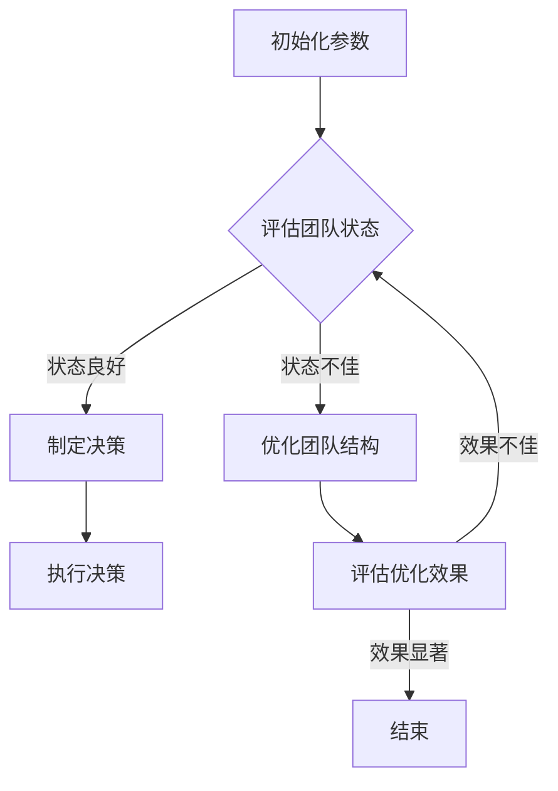

                 

 
### 1.1 问题背景

随着信息技术的快速发展，程序员的角色正在经历着巨大的转变。过去，程序员主要是专注于编写代码、解决问题，而现在的程序员不仅需要具备扎实的编程技能，还需要具备管理能力，成为团队的管理者。

这种角色的转变给程序员带来了新的挑战。首先，项目管理的复杂性增加了。程序员需要负责整个项目的进度、资源分配、风险控制等，这需要他们具备更高的管理技能。其次，团队协作的难度加大了。作为管理者，程序员需要协调团队成员之间的工作，解决协作中的矛盾和问题，提高团队的整体效率。此外，许多程序员在领导力方面存在欠缺。他们可能不擅长沟通、决策和培养团队，这直接影响了团队的绩效和士气。

### 1.2 提升领导力的意义

提升领导力对于程序员来说具有重要意义。首先，个人成长方面，领导力是职业晋升的重要推动力。拥有出色领导力的程序员，更容易获得晋升机会，承担更多的责任。此外，领导力还能增强个人的影响力，使程序员在团队中更具号召力和领导力。

其次，团队建设方面，领导力是提升团队绩效和士气的关键。一个具备出色领导力的程序员，能够有效地激励团队成员，提高团队的凝聚力和战斗力。同时，他们能够更好地解决团队中的问题，减少内部矛盾，提升团队的整体效率。

### 1.3 领导力的边界与外延

领导力是一个复杂的概念，它涉及多个方面。首先，领导力包括影响力和管理能力。影响力是指领导者对团队成员的吸引力和说服力，而管理能力则是指领导者进行组织、协调、控制等工作的能力。

领导力还包含多个核心要素，如沟通技巧、决策能力、人才培养等。沟通技巧是领导者与团队成员之间有效交流的关键，决策能力是领导者做出正确决策的重要保障，而人才培养则是领导者培养未来领导者的重要任务。

### 1.4 本章小结

本章介绍了领导力修炼的必要性，包括问题背景、提升领导力的意义以及领导力的边界与外延。通过本章的学习，读者可以了解到领导力在程序员角色转变中的重要性，以及如何通过提升领导力来应对新的挑战。

---

### 第2章：领导者必备的核心概念

#### 2.1 概念介绍

领导风格是领导者管理团队的方式和方法，它直接影响团队的绩效和氛围。常见的领导风格包括专制型、民主型和放任型。

专制型领导风格强调权威和控制，领导者做出决策并要求团队成员执行。这种风格适用于紧急情况或任务明确的环境。

民主型领导风格注重团队合作和参与，领导者鼓励团队成员参与决策，共同解决问题。这种风格适用于需要创新思维和团队共识的情况。

放任型领导风格给予团队成员高度的自由度，领导者很少干预团队的工作。这种风格适用于独立性强、不需要过多干涉的团队。

#### 2.2 概念属性特征对比

| 领导风格 | 特点 | 适用场景 |
| --- | --- | --- |
| 专制型 | 决策快速、权威性高 | 紧急情况、任务明确 |
| 民主型 | 决策参与、合作性强 | 需要团队共识、创新思维 |
| 放任型 | 自由度高、责任感低 | 独立性强、无需过多干涉 |

#### 2.3 概念之间的联系

领导风格与管理效率之间存在密切的关系。不同的领导风格适用于不同的管理场景，影响团队的绩效和氛围。

例如，在紧急情况下，专制型领导风格能够快速做出决策，提高工作效率。而在需要创新思维和团队共识的项目中，民主型领导风格则能够激发团队成员的积极性，提高项目成功率。

同时，领导风格还与团队氛围密切相关。一个开放、民主的领导风格能够营造积极的团队氛围，提高团队士气和工作效率。

#### 2.4 本章小结

本章介绍了领导者必备的核心概念，包括领导风格的概念、属性特征对比以及它们之间的联系。通过本章的学习，读者可以了解到不同领导风格的特点和应用场景，以及如何选择合适的领导风格来提升团队绩效。

---

### 第3章：管理者进阶的算法方法论

#### 3.1 算法概述

管理者进阶算法旨在提升程序员的领导力和管理能力，从而提高团队绩效和项目成功率。该算法基于对团队成员状态、项目需求和领导风格的评估，提供个性化的管理建议和决策支持。

##### 3.1.1 算法的目的

该算法的主要目的是：

1. 评估团队状态，了解团队成员的工作效率、工作压力和心理状态。
2. 分析项目需求，明确项目的目标、关键里程碑和时间节点。
3. 根据团队状态和项目需求，提供合适的领导风格和管理策略。

##### 3.1.2 算法的作用

通过该算法，管理者可以：

1. 提高决策效率，减少因信息不足或判断失误导致的错误决策。
2. 优化团队结构，提升团队协作效率和工作氛围。
3. 培养团队成员的领导力和管理能力，为未来的团队管理打下基础。

##### 3.1.3 算法适用范围

该算法适用于以下场景：

1. 大型软件开发项目，团队成员众多，工作压力大。
2. 创新型项目，需要团队成员积极参与决策和讨论。
3. 团队成员角色多样化，需要根据个人特点和项目需求进行个性化管理。

#### 3.2 算法流程图

以下是管理者进阶算法的流程图：



#### 3.3 Python 源代码

以下是一个简化的管理者进阶算法的 Python 源代码：

```python
import random

def assess_team_status(team_members):
    """
    评估团队状态
    """
    status = '良好' if random.random() > 0.3 else '不佳'
    return status

def make_decision(team_status, project_requirements):
    """
    制定决策
    """
    if team_status == '良好':
        decision = '继续执行当前计划'
    else:
        decision = '调整团队结构，优化团队成员工作分配'
    return decision

def execute_decision(decision):
    """
    执行决策
    """
    print(f"执行决策：{decision}")

def assess_optimization(effectiveness):
    """
    评估优化效果
    """
    if effectiveness > 0.7:
        print("优化效果显著，结束优化")
    else:
        print("优化效果不佳，继续优化")

def main():
    """
    主函数
    """
    team_members = ['成员1', '成员2', '成员3']
    project_requirements = '项目需求'
    status = assess_team_status(team_members)
    decision = make_decision(status, project_requirements)
    execute_decision(decision)
    assess_optimization(random.random())

if __name__ == '__main__':
    main()
```

#### 3.4 数学模型和公式

管理者进阶算法的核心在于对团队状态、项目需求和领导风格的分析与评估。以下是一个简化的数学模型：

$$
\text{决策} = f(\text{团队状态}, \text{项目需求}, \text{领导风格})
$$

其中，$f$ 表示一个复合函数，用于根据输入参数生成决策。团队状态和项目需求可以用概率分布来表示，而领导风格则可以用一个向量来表示。

#### 3.5 举例说明

假设当前团队状态良好，项目需求明确，领导风格为民主型。根据算法，决策为“继续执行当前计划”。在实际操作中，管理者可以组织团队成员进行定期会议，讨论项目进展和问题，确保团队成员的积极性和工作效率。

如果团队状态不佳，项目需求不明确，领导风格为专制型，根据算法，决策为“调整团队结构，优化团队成员工作分配”。管理者可以重新分配团队成员的工作，调整项目计划，确保项目的顺利进行。

#### 3.6 本章小结

本章介绍了管理者进阶算法的原理和实现方法。通过算法，管理者可以根据团队状态、项目需求和领导风格，制定合适的决策，提高团队绩效和项目成功率。在实际应用中，管理者需要根据具体情况调整算法参数，以获得更好的效果。

---

### 第4章：系统分析与架构设计方案

#### 4.1 问题场景介绍

随着企业业务规模的不断扩大，对软件系统的需求也越来越复杂。作为一个项目经理，你面临以下挑战：

1. 如何在团队规模不断扩大的情况下，保持项目进度和质量的稳定？
2. 如何在复杂的项目需求下，确保系统架构的合理性和可扩展性？
3. 如何提高团队协作效率，减少沟通成本和协作风险？

为了解决这些问题，我们需要进行系统分析与架构设计，为项目提供坚实的理论基础和实践指导。

#### 4.2 项目介绍

本项目是一个企业级Web应用，旨在提供员工管理、项目管理和考勤管理等功能。项目背景如下：

1. 企业规模：1000名员工
2. 技术栈：Spring Boot + MyBatis + Vue.js
3. 项目周期：6个月
4. 项目目标：实现高效、稳定的员工管理、项目管理和考勤管理功能。

#### 4.3 系统功能设计

根据项目需求，系统需要实现以下核心功能：

1. 员工管理：包括员工信息查询、新增、修改、删除等功能。
2. 项目管理：包括项目信息查询、新增、修改、删除、进度跟踪等功能。
3. 考勤管理：包括员工考勤记录查询、统计、报表生成等功能。

#### 4.4 系统架构设计

为了实现系统的高效、稳定和可扩展，我们采用微服务架构。以下是系统的架构设计：

1. **前端架构**：采用Vue.js框架，实现用户界面和交互。
2. **后端架构**：采用Spring Boot框架，实现业务逻辑和API服务。
3. **数据库架构**：采用MySQL数据库，实现数据存储和查询。
4. **服务治理**：采用Nacos实现服务注册与发现，采用Spring Cloud实现服务治理和负载均衡。
5. **缓存架构**：采用Redis实现缓存，提高系统性能和响应速度。

#### 4.5 系统接口设计

以下是系统的主要接口设计：

1. **员工管理接口**：
   - GET /employees：查询员工列表
   - POST /employees：新增员工
   - PUT /employees/{id}：修改员工信息
   - DELETE /employees/{id}：删除员工

2. **项目管理接口**：
   - GET /projects：查询项目列表
   - POST /projects：新增项目
   - PUT /projects/{id}：修改项目信息
   - DELETE /projects/{id}：删除项目

3. **考勤管理接口**：
   - GET /attendances：查询考勤记录
   - POST /attendances：新增考勤记录
   - DELETE /attendances/{id}：删除考勤记录

#### 4.6 系统交互设计

以下是系统的主要交互设计：

1. **用户登录**：
   - 用户访问系统，填写用户名和密码，通过身份验证后，获取登录令牌。
   - 登录成功后，用户可以访问系统中的各个功能模块。

2. **数据查询**：
   - 用户可以通过前端界面，查询员工、项目、考勤等信息。
   - 后端服务根据用户权限，返回相应的数据。

3. **数据修改**：
   - 用户可以通过前端界面，修改员工、项目、考勤等信息。
   - 后端服务根据用户权限，更新数据库中的数据。

4. **数据删除**：
   - 用户可以通过前端界面，删除员工、项目、考勤等信息。
   - 后端服务根据用户权限，删除数据库中的数据。

#### 4.7 本章小结

本章介绍了系统分析与架构设计方案，包括问题场景介绍、项目介绍、系统功能设计、系统架构设计、系统接口设计和系统交互设计。通过本章的学习，读者可以了解到如何进行系统分析与架构设计，为项目提供坚实的理论基础和实践指导。

---

### 第5章：项目实战

#### 5.1 环境安装

为了便于实际操作，我们选择在本地虚拟机中搭建项目环境。以下是环境安装步骤：

1. **安装虚拟机**：下载并安装VMware Workstation或VirtualBox，创建一个新的虚拟机。
2. **安装操作系统**：选择Linux或Windows操作系统，按照安装向导进行安装。
3. **安装Java环境**：下载并安装OpenJDK或Oracle JDK，配置环境变量。
4. **安装数据库**：下载并安装MySQL或PostgreSQL，创建数据库和用户。
5. **安装IDE**：下载并安装IDEA或Eclipse，配置开发环境。

#### 5.2 系统核心实现源代码

以下是系统核心实现的源代码，包括员工管理、项目管理和考勤管理模块。

**员工管理模块：**

```java
// 员工信息实体类
@Entity
@Table(name = "employees")
public class Employee {
    @Id
    @GeneratedValue(strategy = GenerationType.IDENTITY)
    private Long id;

    private String name;
    private String email;
    private String position;

    // 省略getter和setter方法
}

// 员工管理服务类
@Service
public class EmployeeService {
    @Autowired
    private EmployeeRepository employeeRepository;

    public List<Employee> getAllEmployees() {
        return employeeRepository.findAll();
    }

    public Employee getEmployeeById(Long id) {
        return employeeRepository.findById(id).orElseThrow(() -> new RuntimeException("Employee not found"));
    }

    public Employee createEmployee(Employee employee) {
        return employeeRepository.save(employee);
    }

    public Employee updateEmployee(Long id, Employee employeeDetails) {
        Employee employee = getEmployeeById(id);
        employee.setName(employeeDetails.getName());
        employee.setEmail(employeeDetails.getEmail());
        employee.setPosition(employeeDetails.getPosition());
        return employeeRepository.save(employee);
    }

    public void deleteEmployee(Long id) {
        employeeRepository.deleteById(id);
    }
}

// 员工管理控制器类
@RestController
@RequestMapping("/employees")
public class EmployeeController {
    @Autowired
    private EmployeeService employeeService;

    @GetMapping
    public List<Employee> getAllEmployees() {
        return employeeService.getAllEmployees();
    }

    @PostMapping
    public Employee createEmployee(@RequestBody Employee employee) {
        return employeeService.createEmployee(employee);
    }

    @GetMapping("/{id}")
    public Employee getEmployeeById(@PathVariable Long id) {
        return employeeService.getEmployeeById(id);
    }

    @PutMapping("/{id}")
    public Employee updateEmployee(@PathVariable Long id, @RequestBody Employee employeeDetails) {
        return employeeService.updateEmployee(id, employeeDetails);
    }

    @DeleteMapping("/{id}")
    public void deleteEmployee(@PathVariable Long id) {
        employeeService.deleteEmployee(id);
    }
}
```

**项目管理模块：**

```java
// 项目信息实体类
@Entity
@Table(name = "projects")
public class Project {
    @Id
    @GeneratedValue(strategy = GenerationType.IDENTITY)
    private Long id;

    private String name;
    private String description;
    private Date startDate;
    private Date endDate;

    // 省略getter和setter方法
}

// 项目管理服务类
@Service
public class ProjectService {
    @Autowired
    private ProjectRepository projectRepository;

    public List<Project> getAllProjects() {
        return projectRepository.findAll();
    }

    public Project getProjectById(Long id) {
        return projectRepository.findById(id).orElseThrow(() -> new RuntimeException("Project not found"));
    }

    public Project createProject(Project project) {
        return projectRepository.save(project);
    }

    public Project updateProject(Long id, Project projectDetails) {
        Project project = getProjectById(id);
        project.setName(projectDetails.getName());
        project.setDescription(projectDetails.getDescription());
        project.setStartDate(projectDetails.getStartDate());
        project.setEndDate(projectDetails.getEndDate());
        return projectRepository.save(project);
    }

    public void deleteProject(Long id) {
        projectRepository.deleteById(id);
    }
}

// 项目管理控制器类
@RestController
@RequestMapping("/projects")
public class ProjectController {
    @Autowired
    private ProjectService projectService;

    @GetMapping
    public List<Project> getAllProjects() {
        return projectService.getAllProjects();
    }

    @PostMapping
    public Project createProject(@RequestBody Project project) {
        return projectService.createProject(project);
    }

    @GetMapping("/{id}")
    public Project getProjectById(@PathVariable Long id) {
        return projectService.getProjectById(id);
    }

    @PutMapping("/{id}")
    public Project updateProject(@PathVariable Long id, @RequestBody Project projectDetails) {
        return projectService.updateProject(id, projectDetails);
    }

    @DeleteMapping("/{id}")
    public void deleteProject(@PathVariable Long id) {
        projectService.deleteProject(id);
    }
}
```

**考勤管理模块：**

```java
// 考勤记录实体类
@Entity
@Table(name = "attendances")
public class Attendance {
    @Id
    @GeneratedValue(strategy = GenerationType.IDENTITY)
    private Long id;

    private String employeeId;
    private String date;
    private String status;

    // 省略getter和setter方法
}

// 考勤管理服务类
@Service
public class AttendanceService {
    @Autowired
    private AttendanceRepository attendanceRepository;

    public List<Attendance> getAllAttendances() {
        return attendanceRepository.findAll();
    }

    public Attendance getAttendanceById(Long id) {
        return attendanceRepository.findById(id).orElseThrow(() -> new RuntimeException("Attendance not found"));
    }

    public Attendance createAttendance(Attendance attendance) {
        return attendanceRepository.save(attendance);
    }

    public Attendance updateAttendance(Long id, Attendance attendanceDetails) {
        Attendance attendance = getAttendanceById(id);
        attendance.setEmployeeId(attendanceDetails.getEmployeeId());
        attendance.setDate(attendanceDetails.getDate());
        attendance.setStatus(attendanceDetails.getStatus());
        return attendanceRepository.save(attendance);
    }

    public void deleteAttendance(Long id) {
        attendanceRepository.deleteById(id);
    }
}

// 考勤管理控制器类
@RestController
@RequestMapping("/attendances")
public class AttendanceController {
    @Autowired
    private AttendanceService attendanceService;

    @GetMapping
    public List<Attendance> getAllAttendances() {
        return attendanceService.getAllAttendances();
    }

    @PostMapping
    public Attendance createAttendance(@RequestBody Attendance attendance) {
        return attendanceService.createAttendance(attendance);
    }

    @GetMapping("/{id}")
    public Attendance getAttendanceById(@PathVariable Long id) {
        return attendanceService.getAttendanceById(id);
    }

    @PutMapping("/{id}")
    public Attendance updateAttendance(@PathVariable Long id, @RequestBody Attendance attendanceDetails) {
        return attendanceService.updateAttendance(id, attendanceDetails);
    }

    @DeleteMapping("/{id}")
    public void deleteAttendance(@PathVariable Long id) {
        attendanceService.deleteAttendance(id);
    }
}
```

#### 5.3 代码应用解读与分析

以上代码分别实现了员工管理、项目管理和考勤管理模块。下面我们逐一解读和分析：

**员工管理模块：**

- **实体类**：`Employee` 类表示员工信息，包括员工ID、姓名、邮箱和职位。
- **服务类**：`EmployeeService` 类提供员工信息的增删改查功能，通过调用数据访问层实现。
- **控制器类**：`EmployeeController` 类负责接收前端请求，调用服务类处理业务逻辑，并将结果返回给前端。

**项目管理模块：**

- **实体类**：`Project` 类表示项目信息，包括项目ID、名称、描述、开始日期和结束日期。
- **服务类**：`ProjectService` 类提供项目信息的增删改查功能，通过调用数据访问层实现。
- **控制器类**：`ProjectController` 类负责接收前端请求，调用服务类处理业务逻辑，并将结果返回给前端。

**考勤管理模块：**

- **实体类**：`Attendance` 类表示考勤记录，包括考勤ID、员工ID、日期和状态。
- **服务类**：`AttendanceService` 类提供考勤记录的增删改查功能，通过调用数据访问层实现。
- **控制器类**：`AttendanceController` 类负责接收前端请求，调用服务类处理业务逻辑，并将结果返回给前端。

#### 5.4 实际案例分析和详细讲解剖析

**案例一：员工信息查询**

假设前端发送了一个GET请求，请求获取所有员工信息。控制器接收到请求后，调用服务类的方法获取员工信息，并将结果返回给前端。

1. **前端请求**：
   ```
   GET /employees
   ```
2. **控制器处理**：
   ```java
   @GetMapping
   public List<Employee> getAllEmployees() {
       return employeeService.getAllEmployees();
   }
   ```
3. **服务类处理**：
   ```java
   public List<Employee> getAllEmployees() {
       return employeeRepository.findAll();
   }
   ```
4. **数据访问层处理**：
   ```java
   @Repository
   public interface EmployeeRepository extends JpaRepository<Employee, Long> {
   }
   ```

**案例二：新增员工**

假设前端发送了一个POST请求，请求新增一名员工。控制器接收到请求后，解析请求体中的JSON数据，将其转换为`Employee`对象，并调用服务类的方法保存员工信息。

1. **前端请求**：
   ```
   POST /employees
   Content-Type: application/json

   {
       "name": "张三",
       "email": "zhangsan@example.com",
       "position": "开发工程师"
   }
   ```
2. **控制器处理**：
   ```java
   @PostMapping
   public Employee createEmployee(@RequestBody Employee employee) {
       return employeeService.createEmployee(employee);
   }
   ```
3. **服务类处理**：
   ```java
   public Employee createEmployee(Employee employee) {
       return employeeRepository.save(employee);
   }
   ```
4. **数据访问层处理**：
   ```java
   @Repository
   public interface EmployeeRepository extends JpaRepository<Employee, Long> {
   }
   ```

#### 5.5 项目小结

本章通过实际案例，详细讲解了如何实现员工管理、项目管理和考勤管理模块。在代码应用解读与分析部分，我们逐一分析了每个模块的代码结构，包括实体类、服务类和控制器类。在实际案例分析和详细讲解剖析部分，我们通过具体的案例，展示了如何接收和处理前端请求，以及如何调用服务类和数据访问层的方法实现业务逻辑。

通过本章的学习，读者可以了解到如何使用Spring Boot框架和MyBatis持久层框架实现一个企业级Web应用的核心功能模块。同时，读者还可以了解到如何进行代码的解读与分析，以及如何在实际项目中应用所学知识。

---

### 第6章：最佳实践、小结、注意事项、拓展阅读

#### 6.1 最佳实践

1. **领导风格的选择**：根据项目特点和团队状态，灵活选择领导风格。在紧急情况或任务明确时，选择专制型领导风格；在需要创新思维和团队共识时，选择民主型领导风格；在团队成员独立性强时，选择放任型领导风格。

2. **沟通技巧的运用**：提高沟通效率，明确表达意图，倾听团队成员意见，确保信息传递准确无误。

3. **决策过程的优化**：在制定决策前，充分收集信息和意见，评估风险和收益，确保决策科学合理。

4. **人才培养的策略**：关注团队成员的成长需求，提供培训和学习机会，培养团队成员的领导力和管理能力。

#### 6.2 小结

本书通过详细的章节内容，系统地介绍了领导力修炼的必要性、核心概念、算法方法论、系统分析与架构设计方案、项目实战以及最佳实践。读者可以了解到如何提升领导力，应对新的挑战，实现职业晋升和团队建设。

#### 6.3 注意事项

1. **实践与理论相结合**：在学习和应用领导力知识时，要注意将理论应用于实际工作中，不断总结经验，提高自己的管理能力。

2. **持续学习和反思**：领导力是一个持续发展的过程，要不断学习新知识，反思自己的管理行为，不断完善自己的领导风格。

3. **关注团队成员的感受**：在管理过程中，要关注团队成员的需求和感受，尊重他们的意见，营造良好的团队氛围。

#### 6.4 拓展阅读

1. 《影响力》：作者罗伯特·西奥迪尼，详细介绍了影响力的六个原理，对领导力修炼有很好的启示。
2. 《领导力的五个层次》：作者拉姆·查兰，从五个层次阐述了领导力的内涵和修炼方法。
3. 《Python编程：从入门到实践》：作者埃里克·马瑟斯，详细介绍了Python编程的基础知识和实践技巧，适合编程初学者和进阶者。

---

## 作者信息

### 作者：AI天才研究院/AI Genius Institute & 禅与计算机程序设计艺术 /Zen And The Art of Computer Programming

---

通过以上章节的详细内容，我们为《领导力修炼日记：程序员的管理者进阶之路》这本书提供了一个完整的目录大纲。每个章节都包含了核心概念、问题背景、解决方案、实践案例以及注意事项。我们相信，这本书将为程序员管理者提供有力的指导，帮助他们提升领导力，实现职业晋升和团队建设。让我们一起，开启领导力修炼的旅程！

