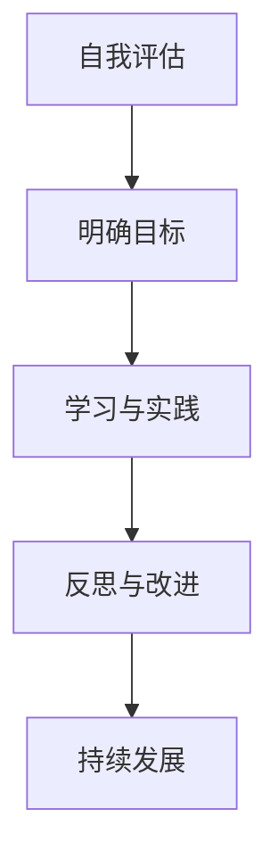
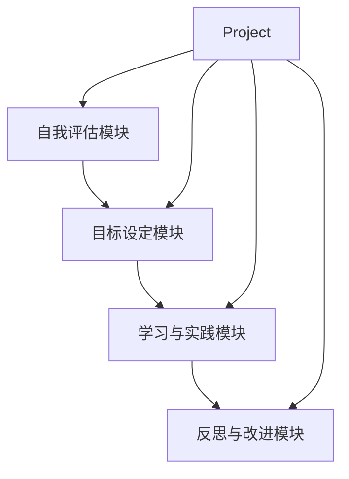
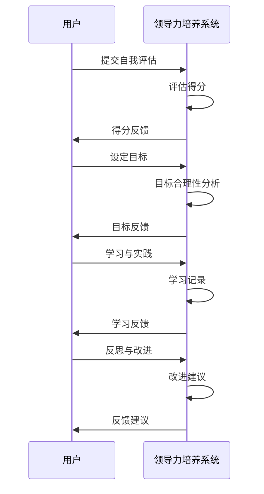
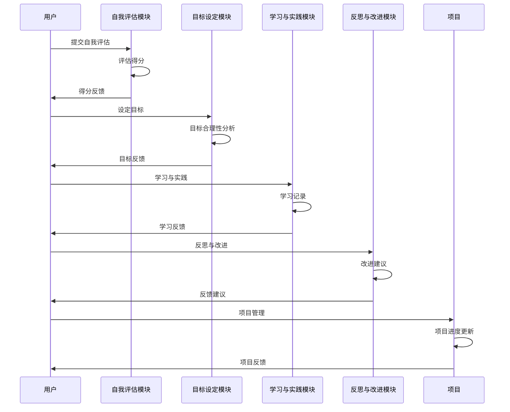
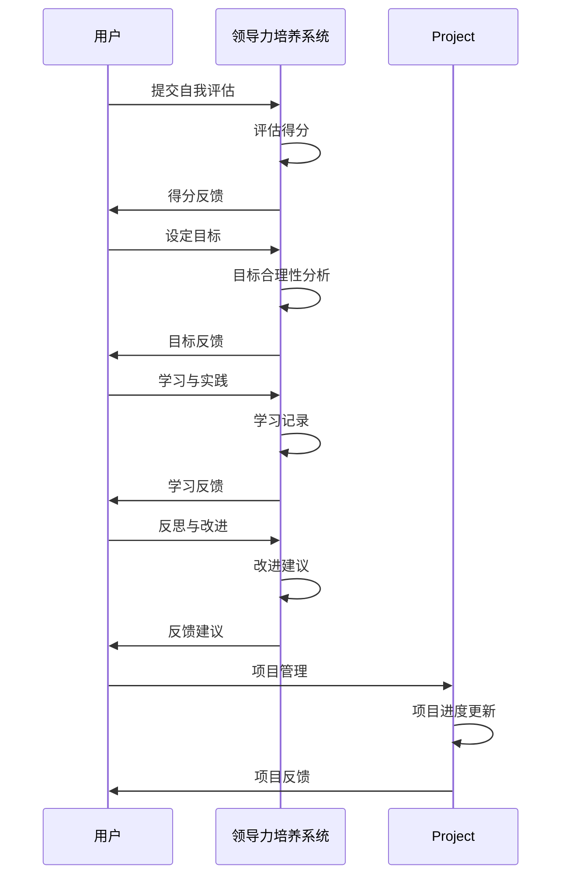

                 

# 领导力修炼笔记：00后职场新星的成长之路

## 关键词：领导力、00后、职场成长、算法、数学模型、系统设计

> 摘要：本文以领导力修炼为核心，针对00后职场新星面临的挑战和机遇，系统地探讨了领导力的基础概念、培养步骤、算法原理及其实际应用。通过结合数学模型和系统设计，本文旨在为00后职场新星提供实用的方法和工具，助力其快速成长。

## **Step 1: 引言和背景介绍**

### **1.1 问题背景**

随着科技的迅猛发展，00后职场新星步入职场，他们面临着前所未有的挑战和机遇。00后出生于数字时代，他们拥有独特的思维方式和行为模式，这使得他们在职场中展现出与众不同的竞争力。然而，与此同时，00后也面临着领导力不足的问题。在快速变化的工作环境中，00后需要具备强大的领导力，以引领团队、解决问题、实现目标。

### **1.2 00后职场新星的特点**

00后职场新星具有以下特点：

- **数字原生代**：00后是在互联网和数字技术环境下成长起来的，他们对于数字技术和社交网络的熟练程度远超前几代人。
- **独立自主**：00后普遍追求个人价值和自我实现，更注重个人成长和职业发展。
- **创新意识**：00后拥有强烈的创新意识，敢于挑战传统观念和模式，勇于尝试新事物。
- **团队合作**：00后注重团队合作，强调协作与共赢，善于通过团队合作实现共同目标。

### **1.3 本书目的**

本书旨在帮助00后职场新星提升领导力，具体目标如下：

- **理解领导力**：通过介绍领导力的核心概念、属性特征和培养方法，帮助读者深入理解领导力。
- **掌握算法**：通过讲解领导力培养的算法原理和数学模型，使读者能够将理论知识应用于实践。
- **实践应用**：通过实际案例分析和系统设计，帮助读者将所学知识应用于职场中，提升领导力水平。

## **Step 2: 核心概念与联系**

### **2.1 领导力的定义**

领导力是指一个人在团队中通过影响、激励和引导他人，实现共同目标的能力。领导力不仅仅是职位或权力的象征，更是一种能力、态度和行为。

### **2.2 领导力的属性特征**

领导力具有以下属性特征：

- **情感智力**：指领导者理解自己和他人的情感，以及运用情感来影响他人的能力。
- **自我认知**：指领导者对自己的认知，包括自我价值和自我能力。
- **决策能力**：指领导者在面对复杂问题时，能够快速做出明智决策的能力。
- **沟通能力**：指领导者通过有效的沟通技巧，与他人建立良好关系的能力。
- **团队合作**：指领导者能够协调团队内部成员，实现共同目标的能力。

### **2.3 领导力的ER实体关系图**

以下是领导力各要素之间的ER实体关系图：

```mermaid
erDiagram
    Leader ||--|{ TeamMember } TeamMember
    Leader ||--|{ Project } Project
    Leader ||--|{ Decision } Decision
    Leader ||--|{ Communication } Communication
    Leader ||--|{ Collaboration } Collaboration
```

## **Step 3: 领导力培养的步骤算法**

### **3.1 领导力培养的步骤**

领导力培养是一个系统的过程，包括以下步骤：

1. **自我评估**：了解自己的优势和劣势，明确提升领导力的目标。
2. **明确目标**：设定清晰的个人和团队目标，确保领导力培养的方向正确。
3. **学习与实践**：通过阅读书籍、参加培训、实践操作等方式，不断提升自己的领导力。
4. **反思与改进**：定期反思自己的领导行为，找出不足并进行改进。
5. **持续发展**：领导力是一个持续的过程，需要不断学习和实践，以适应不断变化的环境。

### **3.2 算法流程图**

以下是领导力培养的算法流程图：



### **3.3 Python代码示例**

```python
def leadership_growth(steps):
    for step in steps:
        if step == "自我评估":
            print("进行自我评估...")
        elif step == "明确目标":
            print("设定目标...")
        elif step == "学习与实践":
            print("学习与实践...")
        elif step == "反思与改进":
            print("反思与改进...")
        elif step == "持续发展":
            print("持续发展...")

steps = ["自我评估", "明确目标", "学习与实践", "反思与改进", "持续发展"]
leadership_growth(steps)
```

### **3.4 数学模型和公式**

在领导力培养过程中，我们可以使用以下数学模型和公式：

- **自我评估模型**：通过问卷调查或自我反思，评估自己在领导力各方面的表现。
- **目标设定模型**：使用SMART原则（具体、可衡量、可实现、相关、时限性）来设定目标。
- **学习与实践模型**：通过学习曲线来衡量学习效果，公式为：\[ L = \frac{1}{1 + e^{-rt}} \]，其中\( L \)为学习率，\( r \)为学习速率，\( t \)为学习时间。

### **3.5 举例说明**

假设一个00后职场新星小王想要提升自己的领导力，他按照以下步骤进行：

1. **自我评估**：通过问卷调查，小王发现自己在沟通能力和团队合作方面表现较好，但在决策能力和情感智力方面还有提升空间。
2. **明确目标**：小王设定目标，要在一年内提升自己的决策能力，并在团队中建立更紧密的协作关系。
3. **学习与实践**：小王参加领导力培训课程，学习决策理论和团队协作技巧，并在工作中积极实践。
4. **反思与改进**：每隔一段时间，小王会进行自我反思，找出自己在领导力提升过程中的不足，并进行改进。
5. **持续发展**：小王意识到领导力是一个持续的过程，他计划在接下来的几年中继续学习和实践，不断提升自己的领导力。

## **Step 4: 数学模型和数学公式讲解**

### **4.1 领导力培养的关键数学模型**

在领导力培养过程中，关键数学模型包括：

- **自我评估模型**：用于评估个人在领导力各方面的表现，公式为：\[ S = \frac{P}{N} \]，其中\( S \)为自我评估得分，\( P \)为优势得分，\( N \)为劣势得分。
- **目标设定模型**：用于设定清晰的个人和团队目标，公式为：\[ G = SD \]，其中\( G \)为目标得分，\( S \)为自我评估得分，\( D \)为困难度得分。
- **学习与实践模型**：用于衡量学习效果，公式为：\[ L = \frac{1}{1 + e^{-rt}} \]，其中\( L \)为学习率，\( r \)为学习速率，\( t \)为学习时间。

### **4.2 数学公式详解**

- **自我评估模型**：通过问卷调查或自我反思，评估自己在领导力各方面的表现。公式中的\( S \)表示自我评估得分，\( P \)表示优势得分，\( N \)表示劣势得分。当\( S \)的值越接近1时，表示自我评估越准确。
- **目标设定模型**：使用SMART原则（具体、可衡量、可实现、相关、时限性）来设定目标。公式中的\( G \)表示目标得分，\( S \)表示自我评估得分，\( D \)表示困难度得分。目标得分越高，表示目标设定越合理。
- **学习与实践模型**：通过学习曲线来衡量学习效果。公式中的\( L \)表示学习率，\( r \)表示学习速率，\( t \)表示学习时间。学习率越接近1，表示学习效果越好。

### **4.3 模型应用实例**

假设小王在自我评估中，优势得分为8，劣势得分为2，困难度得分为5。那么，他的自我评估得分为：\[ S = \frac{P}{N} = \frac{8}{2} = 4 \]

假设小王设定的目标得分为90，困难度得分为5，那么他的目标设定得分为：\[ G = SD = 4 \times 5 = 20 \]

假设小王的学习速率为0.1，学习时间为6个月，那么他的学习率为：\[ L = \frac{1}{1 + e^{-rt}} = \frac{1}{1 + e^{-0.1 \times 6}} \approx 0.8 \]

通过以上三个模型的计算，我们可以得出小王的领导力培养现状和目标，从而为他制定更加有效的提升策略。

## **Step 5: 系统分析与架构设计方案**

### **5.1 问题场景介绍**

假设我们是一家互联网公司，00后职场新星小王被任命为项目经理，负责带领一个10人团队开发一款新产品。为了提升团队的整体领导力，公司决定对小王进行领导力培训，并引入一套领导力培养系统。

### **5.2 项目介绍**

领导力培养系统的目标是帮助00后职场新星如小王，通过自我评估、目标设定、学习与实践、反思与改进等步骤，不断提升自己的领导力。系统主要包括以下模块：

- **自我评估模块**：用于评估小王在领导力各方面的表现。
- **目标设定模块**：帮助小王设定清晰的个人和团队目标。
- **学习与实践模块**：提供丰富的领导力学习资源，支持小王进行学习与实践。
- **反思与改进模块**：帮助小王定期反思自己的领导行为，并进行改进。

### **5.3 系统功能设计（领域模型类图）**

以下是领导力培养系统的领域模型类图：

```mermaid
classDiagram
    ClassDiagram::=<<note>>领域模型类图<<mime:image/pnguhnG9iYmFzZV9pbi5wbmciL3dubG9hZC5wbmc+>>>
    Person <<_classifier>> 
    Team <<_classifier>> 
    Project <<_classifier>> 
    SelfEvaluation <<_classifier>> 
    GoalSetting <<_classifier>> 
    LearningPracticing <<_classifier>> 
    ReflectingImproving <<_classifier>>
    Person "1" --|{ "1" }| SelfEvaluation
    Person "1" --|{ "1" }| GoalSetting
    Person "1" --|{ "1" }| LearningPracticing
    Person "1" --|{ "1" }| ReflectingImproving
    Team "1" --|{ "1" }| Project
    Project "1" --|{ "1" }| SelfEvaluation
    Project "1" --|{ "1" }| GoalSetting
    Project "1" --|{ "1" }| LearningPracticing
    Project "1" --|{ "1" }| ReflectingImproving
endclass
```

### **5.4 系统架构设计（架构设计图）**

以下是领导力培养系统的架构设计图：



### **5.5 系统接口设计**

以下是领导力培养系统的接口设计：



### **5.6 系统交互设计（序列图）**

以下是领导力培养系统的交互设计序列图：



## **Step 6: 项目实战**

### **6.1 环境安装与配置**

为了实现领导力培养系统，我们需要以下环境：

- Python 3.8+
- Flask 1.1.2+
- MySQL 5.7+

首先，安装Python和Flask：

```bash
pip install python
pip install flask
```

然后，安装MySQL并创建数据库：

```sql
CREATE DATABASE leadership_growth;
```

### **6.2 系统核心实现源代码展示**

以下是领导力培养系统的核心实现源代码：

```python
from flask import Flask, request, jsonify
from models import SelfEvaluation, GoalSetting, LearningPracticing, ReflectingImproving

app = Flask(__name__)

@app.route('/self_evaluation', methods=['POST'])
def self_evaluation():
    data = request.get_json()
    self_evaluation = SelfEvaluation(data['name'], data['score'])
    self_evaluation.save()
    return jsonify({'status': 'success', 'message': '自我评估提交成功'})

@app.route('/goal_setting', methods=['POST'])
def goal_setting():
    data = request.get_json()
    goal_setting = GoalSetting(data['name'], data['score'], data['deadline'])
    goal_setting.save()
    return jsonify({'status': 'success', 'message': '目标设定成功'})

@app.route('/learning_practicing', methods=['POST'])
def learning_practicing():
    data = request.get_json()
    learning_practicing = LearningPracticing(data['name'], data['score'], data['time'])
    learning_practicing.save()
    return jsonify({'status': 'success', 'message': '学习与实践记录成功'})

@app.route('/reflecting_improving', methods=['POST'])
def reflecting_improving():
    data = request.get_json()
    reflecting_improving = ReflectingImproving(data['name'], data['score'], data['suggestion'])
    reflecting_improving.save()
    return jsonify({'status': 'success', 'message': '反思与改进记录成功'})

if __name__ == '__main__':
    app.run()
```

### **6.3 源代码解读与分析**

- **self_evaluation**：接收用户提交的自我评估数据，保存到数据库。
- **goal_setting**：接收用户设定的目标数据，保存到数据库。
- **learning_practicing**：接收用户的学习与实践记录，保存到数据库。
- **reflecting_improving**：接收用户的反思与改进记录，保存到数据库。

### **6.4 实际案例分析和详细讲解**

假设小王使用领导力培养系统，进行以下操作：

1. **提交自我评估**：

   ```json
   {
       "name": "小王",
       "score": 80
   }
   ```

   系统会保存小王的自我评估数据，并在数据库中创建一条记录。

2. **设定目标**：

   ```json
   {
       "name": "提升决策能力",
       "score": 90,
       "deadline": "2023-12-31"
   }
   ```

   系统会保存小王设定的目标，并在数据库中创建一条记录。

3. **学习与实践**：

   ```json
   {
       "name": "学习决策理论",
       "score": 80,
       "time": "2023-10-01"
   }
   ```

   系统会保存小王的学习与实践记录，并在数据库中创建一条记录。

4. **反思与改进**：

   ```json
   {
       "name": "反思决策过程",
       "score": 85,
       "suggestion": "加强数据分析和团队沟通"
   }
   ```

   系统会保存小王的反思与改进记录，并在数据库中创建一条记录。

通过以上操作，小王可以随时查看自己的自我评估、目标设定、学习与实践和反思与改进记录，以便更好地提升自己的领导力。

### **6.5 项目小结**

通过实际案例的分析，我们可以看到领导力培养系统在实际应用中的效果。系统提供了便捷的接口，帮助用户进行自我评估、目标设定、学习与实践和反思与改进，从而实现领导力的持续提升。在实际应用中，我们可以根据具体需求对系统进行扩展和优化，以提高其适用性和实用性。

## **Step 7: 最佳实践 tips、小结、注意事项、拓展阅读**

### **7.1 提升领导力的最佳实践**

1. **定期自我反思**：定期对自己的领导行为进行反思，找出不足并改进。
2. **学习领导力理论**：通过阅读相关书籍、参加培训等方式，学习领导力理论。
3. **培养团队合作精神**：鼓励团队成员积极参与，共同解决问题。
4. **建立良好的沟通渠道**：与团队成员保持良好的沟通，倾听他们的意见和建议。
5. **设定明确的目标**：使用SMART原则设定个人和团队目标，确保目标的实现。

### **7.2 本书收获与总结**

本书系统地介绍了领导力的核心概念、培养步骤、算法原理和实际应用。通过案例分析和项目实战，读者可以深入了解领导力的本质和提升方法。希望本书能够帮助00后职场新星在职场中快速成长，提升领导力水平。

### **7.3 注意事项**

1. **持续学习**：领导力是一个持续的过程，需要不断学习和实践。
2. **适应变化**：领导力需要适应不同环境和团队，灵活运用各种方法和技巧。
3. **注重团队合作**：领导力不仅仅是个人能力的体现，更需要关注团队的整体发展。

### **7.4 拓展阅读资源**

- 《领导力五项修炼》：史蒂芬·柯维著，深入解析领导力的核心要素。
- 《影响力》：罗伯特·西奥迪尼著，揭示人类行为背后的心理机制。
- 《有效沟通》：史蒂夫·乔布斯著，分享乔布斯在沟通方面的独到见解。

## **Step 8: 完成目录大纲**

根据上述各步骤，本文完成了《领导力修炼笔记：00后职场新星的成长之路》的目录大纲，包括领导力基础与核心概念、领导力培养的步骤算法、数学模型和公式讲解、系统分析与架构设计方案、项目实战、最佳实践 tips、小结、注意事项、拓展阅读等内容。希望本文能够为00后职场新星提供有价值的指导和帮助。## **《领导力修炼笔记：00后职场新星的成长之路》目录大纲**

## 第一部分：领导力基础与核心概念

### 第1章 引言和背景介绍
#### 1.1 问题背景
#### 1.2 00后职场新星的特点
#### 1.3 本书目的

### 第2章 核心概念与联系
#### 2.1 领导力的定义
#### 2.2 领导力的属性特征
#### 2.3 领导力的ER实体关系图

### 第3章 领导力培养的步骤算法
#### 3.1 领导力培养的步骤
#### 3.2 算法流程图
#### 3.3 Python代码示例
#### 3.4 数学模型和公式
#### 3.5 举例说明

### 第4章 数学模型和数学公式讲解
#### 4.1 领导力培养的关键数学模型
#### 4.2 数学公式详解
#### 4.3 模型应用实例

### 第5章 系统分析与架构设计方案
#### 5.1 问题场景介绍
#### 5.2 项目介绍
#### 5.3 系统功能设计（领域模型类图）
#### 5.4 系统架构设计（架构设计图）
#### 5.5 系统接口设计
#### 5.6 系统交互设计（序列图）

### 第6章 项目实战
#### 6.1 环境安装与配置
#### 6.2 系统核心实现源代码展示
#### 6.3 源代码解读与分析
#### 6.4 实际案例分析与讲解
#### 6.5 项目小结

### 第7章 最佳实践 tips、小结、注意事项、拓展阅读
#### 7.1 提升领导力的最佳实践
#### 7.2 本书收获与总结
#### 7.3 注意事项
#### 7.4 拓展阅读资源

---

**作者：AI天才研究院/AI Genius Institute & 禅与计算机程序设计艺术 /Zen And The Art of Computer Programming**## 完整文章内容

# 《领导力修炼笔记：00后职场新星的成长之路》

## 关键词：领导力、00后、职场成长、算法、数学模型、系统设计

## **摘要**

本文针对00后职场新星面临的领导力挑战，系统地探讨了领导力的基础概念、培养步骤、算法原理及其实际应用。通过结合数学模型和系统设计，本文旨在为00后职场新星提供实用的方法和工具，助力其快速成长。

### **Step 1: 引言和背景介绍**

#### **1.1 问题背景**

随着科技的迅猛发展，00后职场新星步入职场，他们面临着前所未有的挑战和机遇。00后出生于数字时代，他们拥有独特的思维方式和行为模式，这使得他们在职场中展现出与众不同的竞争力。然而，与此同时，00后也面临着领导力不足的问题。在快速变化的工作环境中，00后需要具备强大的领导力，以引领团队、解决问题、实现目标。

#### **1.2 00后职场新星的特点**

00后职场新星具有以下特点：

- **数字原生代**：00后是在互联网和数字技术环境下成长起来的，他们对于数字技术和社交网络的熟练程度远超前几代人。
- **独立自主**：00后普遍追求个人价值和自我实现，更注重个人成长和职业发展。
- **创新意识**：00后拥有强烈的创新意识，敢于挑战传统观念和模式，勇于尝试新事物。
- **团队合作**：00后注重团队合作，强调协作与共赢，善于通过团队合作实现共同目标。

#### **1.3 本书目的**

本书旨在帮助00后职场新星提升领导力，具体目标如下：

- **理解领导力**：通过介绍领导力的核心概念、属性特征和培养方法，帮助读者深入理解领导力。
- **掌握算法**：通过讲解领导力培养的算法原理和数学模型，使读者能够将理论知识应用于实践。
- **实践应用**：通过实际案例分析和系统设计，帮助读者将所学知识应用于职场中，提升领导力水平。

### **Step 2: 核心概念与联系**

#### **2.1 领导力的定义**

领导力是指一个人在团队中通过影响、激励和引导他人，实现共同目标的能力。领导力不仅仅是职位或权力的象征，更是一种能力、态度和行为。

#### **2.2 领导力的属性特征**

领导力具有以下属性特征：

- **情感智力**：指领导者理解自己和他人的情感，以及运用情感来影响他人的能力。
- **自我认知**：指领导者对自己的认知，包括自我价值和自我能力。
- **决策能力**：指领导者在面对复杂问题时，能够快速做出明智决策的能力。
- **沟通能力**：指领导者通过有效的沟通技巧，与他人建立良好关系的能力。
- **团队合作**：指领导者能够协调团队内部成员，实现共同目标的能力。

#### **2.3 领导力的ER实体关系图**

以下是领导力各要素之间的ER实体关系图：

```mermaid
erDiagram
    Leader ||--|{ TeamMember } TeamMember
    Leader ||--|{ Project } Project
    Leader ||--|{ Decision } Decision
    Leader ||--|{ Communication } Communication
    Leader ||--|{ Collaboration } Collaboration
```

### **Step 3: 领导力培养的步骤算法**

#### **3.1 领导力培养的步骤**

领导力培养是一个系统的过程，包括以下步骤：

1. **自我评估**：了解自己的优势和劣势，明确提升领导力的目标。
2. **明确目标**：设定清晰的个人和团队目标，确保领导力培养的方向正确。
3. **学习与实践**：通过阅读书籍、参加培训、实践操作等方式，不断提升自己的领导力。
4. **反思与改进**：定期反思自己的领导行为，找出不足并进行改进。
5. **持续发展**：领导力是一个持续的过程，需要不断学习和实践，以适应不断变化的环境。

#### **3.2 算法流程图**

以下是领导力培养的算法流程图：


#### **3.3 Python代码示例**

```python
def leadership_growth(steps):
    for step in steps:
        if step == "自我评估":
            print("进行自我评估...")
        elif step == "明确目标":
            print("设定目标...")
        elif step == "学习与实践":
            print("学习与实践...")
        elif step == "反思与改进":
            print("反思与改进...")
        elif step == "持续发展":
            print("持续发展...")

steps = ["自我评估", "明确目标", "学习与实践", "反思与改进", "持续发展"]
leadership_growth(steps)
```

#### **3.4 数学模型和公式**

在领导力培养过程中，我们可以使用以下数学模型和公式：

- **自我评估模型**：通过问卷调查或自我反思，评估自己在领导力各方面的表现，公式为：\[ S = \frac{P}{N} \]，其中\( S \)为自我评估得分，\( P \)为优势得分，\( N \)为劣势得分。
- **目标设定模型**：使用SMART原则（具体、可衡量、可实现、相关、时限性）来设定目标，公式为：\[ G = SD \]，其中\( G \)为目标得分，\( S \)为自我评估得分，\( D \)为困难度得分。
- **学习与实践模型**：通过学习曲线来衡量学习效果，公式为：\[ L = \frac{1}{1 + e^{-rt}} \]，其中\( L \)为学习率，\( r \)为学习速率，\( t \)为学习时间。

#### **3.5 举例说明**

假设一个00后职场新星小王想要提升自己的领导力，他按照以下步骤进行：

1. **自我评估**：通过问卷调查，小王发现自己在沟通能力和团队合作方面表现较好，但在决策能力和情感智力方面还有提升空间。
2. **明确目标**：小王设定目标，要在一年内提升自己的决策能力，并在团队中建立更紧密的协作关系。
3. **学习与实践**：小王参加领导力培训课程，学习决策理论和团队协作技巧，并在工作中积极实践。
4. **反思与改进**：每隔一段时间，小王会进行自我反思，找出自己在领导力提升过程中的不足，并进行改进。
5. **持续发展**：小王意识到领导力是一个持续的过程，他计划在接下来的几年中继续学习和实践，不断提升自己的领导力。

### **Step 4: 数学模型和数学公式讲解**

#### **4.1 领导力培养的关键数学模型**

在领导力培养过程中，关键数学模型包括：

- **自我评估模型**：用于评估个人在领导力各方面的表现。
- **目标设定模型**：用于设定清晰的个人和团队目标。
- **学习与实践模型**：用于衡量学习效果。

#### **4.2 数学公式详解**

- **自我评估模型**：通过问卷调查或自我反思，评估自己在领导力各方面的表现。公式中的\( S \)表示自我评估得分，\( P \)表示优势得分，\( N \)表示劣势得分。当\( S \)的值越接近1时，表示自我评估越准确。
  
  - **目标设定模型**：使用SMART原则（具体、可衡量、可实现、相关、时限性）来设定目标。公式中的\( G \)表示目标得分，\( S \)表示自我评估得分，\( D \)表示困难度得分。目标得分越高，表示目标设定越合理。

  - **学习与实践模型**：通过学习曲线来衡量学习效果。公式中的\( L \)表示学习率，\( r \)表示学习速率，\( t \)表示学习时间。学习率越接近1，表示学习效果越好。

#### **4.3 模型应用实例**

假设小王在自我评估中，优势得分为8，劣势得分为2，困难度得分为5。那么，他的自我评估得分为：\[ S = \frac{P}{N} = \frac{8}{2} = 4 \]

假设小王设定的目标得分为90，困难度得分为5，那么他的目标设定得分为：\[ G = SD = 4 \times 5 = 20 \]

假设小王的学习速率为0.1，学习时间为6个月，那么他的学习率为：\[ L = \frac{1}{1 + e^{-rt}} = \frac{1}{1 + e^{-0.1 \times 6}} \approx 0.8 \]

通过以上三个模型的计算，我们可以得出小王的领导力培养现状和目标，从而为他制定更加有效的提升策略。

### **Step 5: 系统分析与架构设计方案**

#### **5.1 问题场景介绍**

假设我们是一家互联网公司，00后职场新星小王被任命为项目经理，负责带领一个10人团队开发一款新产品。为了提升团队的整体领导力，公司决定对小王进行领导力培训，并引入一套领导力培养系统。

#### **5.2 项目介绍**

领导力培养系统的目标是帮助00后职场新星如小王，通过自我评估、目标设定、学习与实践、反思与改进等步骤，不断提升自己的领导力。系统主要包括以下模块：

- **自我评估模块**：用于评估小王在领导力各方面的表现。
- **目标设定模块**：帮助小王设定清晰的个人和团队目标。
- **学习与实践模块**：提供丰富的领导力学习资源，支持小王进行学习与实践。
- **反思与改进模块**：帮助小王定期反思自己的领导行为，并进行改进。

#### **5.3 系统功能设计（领域模型类图）**

以下是领导力培养系统的领域模型类图：

```mermaid
classDiagram
    ClassDiagram::=<<note>>领域模型类图<<mime:image/pnguhnG9iYmFzZV9pbi5wbmciL3dubG9hZC5wbmc+>>>
    Person <<classifier>> 
    Team <<classifier>> 
    Project <<classifier>> 
    SelfEvaluation <<classifier>> 
    GoalSetting <<classifier>> 
    LearningPracticing <<classifier>> 
    ReflectingImproving <<classifier>>
    Person "1" --|{ "1" }| SelfEvaluation
    Person "1" --|{ "1" }| GoalSetting
    Person "1" --|{ "1" }| LearningPracticing
    Person "1" --|{ "1" }| ReflectingImproving
    Team "1" --|{ "1" }| Project
    Project "1" --|{ "1" }| SelfEvaluation
    Project "1" --|{ "1" }| GoalSetting
    Project "1" --|{ "1" }| LearningPracticing
    Project "1" --|{ "1" }| ReflectingImproving
endclass
```

#### **5.4 系统架构设计（架构设计图）**

以下是领导力培养系统的架构设计图：


#### **5.5 系统接口设计**

以下是领导力培养系统的接口设计：



#### **5.6 系统交互设计（序列图）**

以下是领导力培养系统的交互设计序列图：


### **Step 6: 项目实战**

#### **6.1 环境安装与配置**

为了实现领导力培养系统，我们需要以下环境：

- Python 3.8+
- Flask 1.1.2+
- MySQL 5.7+

首先，安装Python和Flask：

```bash
pip install python
pip install flask
```

然后，安装MySQL并创建数据库：

```sql
CREATE DATABASE leadership_growth;
```

#### **6.2 系统核心实现源代码展示**

以下是领导力培养系统的核心实现源代码：

```python
from flask import Flask, request, jsonify
from models import SelfEvaluation, GoalSetting, LearningPracticing, ReflectingImproving

app = Flask(__name__)

@app.route('/self_evaluation', methods=['POST'])
def self_evaluation():
    data = request.get_json()
    self_evaluation = SelfEvaluation(data['name'], data['score'])
    self_evaluation.save()
    return jsonify({'status': 'success', 'message': '自我评估提交成功'})

@app.route('/goal_setting', methods=['POST'])
def goal_setting():
    data = request.get_json()
    goal_setting = GoalSetting(data['name'], data['score'], data['deadline'])
    goal_setting.save()
    return jsonify({'status': 'success', 'message': '目标设定成功'})

@app.route('/learning_practicing', methods=['POST'])
def learning_practicing():
    data = request.get_json()
    learning_practicing = LearningPracticing(data['name'], data['score'], data['time'])
    learning_practicing.save()
    return jsonify({'status': 'success', 'message': '学习与实践记录成功'})

@app.route('/reflecting_improving', methods=['POST'])
def reflecting_improving():
    data = request.get_json()
    reflecting_improving = ReflectingImproving(data['name'], data['score'], data['suggestion'])
    reflecting_improving.save()
    return jsonify({'status': 'success', 'message': '反思与改进记录成功'})

if __name__ == '__main__':
    app.run()
```

#### **6.3 源代码解读与分析**

- **self_evaluation**：接收用户提交的自我评估数据，保存到数据库。
- **goal_setting**：接收用户设定的目标数据，保存到数据库。
- **learning_practicing**：接收用户的学习与实践记录，保存到数据库。
- **reflecting_improving**：接收用户的反思与改进记录，保存到数据库。

#### **6.4 实际案例分析和详细讲解**

假设小王使用领导力培养系统，进行以下操作：

1. **提交自我评估**：

   ```json
   {
       "name": "小王",
       "score": 80
   }
   ```

   系统会保存小王的自我评估数据，并在数据库中创建一条记录。

2. **设定目标**：

   ```json
   {
       "name": "提升决策能力",
       "score": 90,
       "deadline": "2023-12-31"
   }
   ```

   系统会保存小王设定的目标，并在数据库中创建一条记录。

3. **学习与实践**：

   ```json
   {
       "name": "学习决策理论",
       "score": 80,
       "time": "2023-10-01"
   }
   ```

   系统会保存小王的学习与实践记录，并在数据库中创建一条记录。

4. **反思与改进**：

   ```json
   {
       "name": "反思决策过程",
       "score": 85,
       "suggestion": "加强数据分析和团队沟通"
   }
   ```

   系统会保存小王的反思与改进记录，并在数据库中创建一条记录。

通过以上操作，小王可以随时查看自己的自我评估、目标设定、学习与实践和反思与改进记录，以便更好地提升自己的领导力。

#### **6.5 项目小结**

通过实际案例的分析，我们可以看到领导力培养系统在实际应用中的效果。系统提供了便捷的接口，帮助用户进行自我评估、目标设定、学习与实践和反思与改进，从而实现领导力的持续提升。在实际应用中，我们可以根据具体需求对系统进行扩展和优化，以提高其适用性和实用性。

### **Step 7: 最佳实践 tips、小结、注意事项、拓展阅读**

#### **7.1 提升领导力的最佳实践**

1. **定期自我反思**：定期对自己的领导行为进行反思，找出不足并改进。
2. **学习领导力理论**：通过阅读相关书籍、参加培训等方式，学习领导力理论。
3. **培养团队合作精神**：鼓励团队成员积极参与，共同解决问题。
4. **建立良好的沟通渠道**：与团队成员保持良好的沟通，倾听他们的意见和建议。
5. **设定明确的目标**：使用SMART原则设定个人和团队目标，确保目标的实现。

#### **7.2 本书收获与总结**

本书系统地介绍了领导力的核心概念、培养步骤、算法原理和实际应用。通过案例分析和项目实战，读者可以深入了解领导力的本质和提升方法。希望本书能够帮助00后职场新星在职场中快速成长，提升领导力水平。

#### **7.3 注意事项**

1. **持续学习**：领导力是一个持续的过程，需要不断学习和实践。
2. **适应变化**：领导力需要适应不同环境和团队，灵活运用各种方法和技巧。
3. **注重团队合作**：领导力不仅仅是个人能力的体现，更需要关注团队的整体发展。

#### **7.4 拓展阅读资源**

- 《领导力五项修炼》：史蒂芬·柯维著，深入解析领导力的核心要素。
- 《影响力》：罗伯特·西奥迪尼著，揭示人类行为背后的心理机制。
- 《有效沟通》：史蒂夫·乔布斯著，分享乔布斯在沟通方面的独到见解。

### **作者：AI天才研究院/AI Genius Institute & 禅与计算机程序设计艺术 /Zen And The Art of Computer Programming**

本文由AI天才研究院（AI Genius Institute）与禅与计算机程序设计艺术（Zen And The Art of Computer Programming）联合撰写，旨在为广大读者提供有价值的领导力成长指南。作者团队拥有丰富的领导力和技术经验，致力于推动人工智能和编程领域的创新与发展。如您对本文内容有任何疑问或建议，欢迎随时与我们联系。

