                 

# 《领导力修炼笔记：00后职场新星的逆袭之路》

## 关键词
- 领导力
- 00后
- 职场新人
- 逆袭
- 发展策略

## 摘要
本文旨在探讨00后职场新人如何通过修炼领导力实现职业逆袭。我们将从领导力的基本概念、00后的特点和优势、逆袭路径与策略、领导力修炼实践以及成功案例分析等多个方面，一步步分析并阐述如何提升领导力，助力00后职场新星在竞争激烈的职场中脱颖而出。

## 引言
### 领导力：定义与重要性
#### 1.1 领导力的基本概念
领导力是指个体在团队中通过影响和激励他人，实现共同目标的能力。它不仅仅局限于管理岗位，而是渗透到每一个职场角色中。领导力包括沟通能力、决策能力、情绪管理、团队建设和战略规划等多个方面。

#### 1.2 领导力的重要性
在现代社会，领导力已经成为职场成功的核心要素。具备领导力的人能够更好地应对复杂多变的环境，推动团队进步，实现组织目标。领导力不仅关乎个人职业发展，更关乎团队和组织的整体效能。

### 00后职场新人画像
#### 2.1 00后职场新人的一般特点
00后作为互联网原住民，他们的成长环境与前辈有着显著不同。他们普遍具备以下特点：
- **价值观多样化**：00后成长于信息爆炸的时代，接触到的价值观更加多元，更加独立和自主。
- **教育背景多元化**：他们更倾向于选择多元化的教育路径，不局限于传统的应试教育。
- **技能与兴趣广泛**：00后通常在技能和兴趣方面更为广泛，善于利用互联网和社交媒体学习新知识。
- **高度信息化与数字化成长环境**：00后从小就生活在高度信息化的环境中，对数字化工具的运用非常熟练。
- **社交媒体与线上互动的活跃参与者**：00后是社交媒体的忠实用户，通过线上互动建立社交网络。

#### 2.2 00后职场新人的优势
00后的优势主要体现在以下几个方面：
- **创新思维**：00后具有强烈的创新意识，能够快速接受新事物，勇于尝试和创造。
- **学习能力强**：他们具备快速学习新知识和技能的能力，适应快速变化的工作环境。
- **适应变化的能力**：00后能够在不断变化的环境中迅速适应，具备较强的抗压能力。
- **团队合作与沟通能力**：他们擅长团队协作，具有良好的沟通技巧，能够有效协调团队成员。
- **勇于尝试新事物**：00后乐于接受挑战，勇于尝试新事物，不断突破自我。

### 00后职场新人面临的挑战
#### 2.3 00后职场新人面临的挑战
尽管00后具备诸多优势，但他们也面临着一些挑战：
- **职业发展的不确定性**：00后面临职业选择的多变，难以确定自己的长期职业规划。
- **职场竞争压力**：随着就业市场的竞争加剧，00后需要不断提升自己的竞争力。
- **压力与工作与生活的平衡**：00后需要学会如何在职场压力和私人生活之间找到平衡。
- **职业规划与成长路径**：如何明确自己的职业目标，并制定合适的成长路径，是00后需要面对的课题。

### 逆袭路径与策略
#### 3.1 自我认知与定位
要想实现逆袭，首先要进行自我认知，明确自己的优势和劣势，找准自己的定位。以下是几个关键步骤：
- **自我评估**：通过自我反思和他人反馈，了解自己的性格特点、价值观、兴趣爱好和职业倾向。
- **目标设定**：根据自己的优势和定位，设定清晰的职业目标，并进行分解和细化为可执行的行动计划。
- **持续学习**：不断提升自己的知识和技能，适应职场变化，保持竞争力。

#### 3.2 培养关键技能
关键技能是00后职场新人实现逆袭的关键因素。以下是一些关键技能的培养方法：
- **技术能力**：掌握所需的技术技能，如编程、数据分析等。
- **沟通能力**：提高沟通技巧，学会有效表达自己的想法和意见。
- **团队协作能力**：培养团队合作精神，学会与他人协作完成任务。
- **领导力**：通过学习和实践，提升自己的领导力，成为团队的核心成员。

### 3.3 构建个人品牌
在职场中，个人品牌的重要性越来越凸显。以下是一些构建个人品牌的策略：
- **内容创作**：通过博客、社交媒体等平台，分享自己的专业知识和经验。
- **专业形象**：保持良好的专业形象，如着装得体、言行举止得体等。
- **人际网络**：积极拓展人际网络，结识行业内的专家和同行，为自己的职业发展创造机会。

### 3.4 成功案例分析
通过分析成功案例，我们可以找到实现逆袭的路径和策略。以下是一些典型的成功案例：
- **案例一**：某互联网公司00后职场新人在短时间内通过不断学习和实践，提升了自己的技术水平，成功晋升为技术总监。
- **案例二**：某创业公司的00后创始人，凭借创新的思维和出色的团队管理能力，带领团队迅速发展，公司市值大幅增长。
- **案例三**：某知名企业的00后职场新人，通过积极参与公司内部培训，提升自己的领导力，逐步成长为部门经理。

### 领导力修炼实践
#### 4.1 沟通能力的提升
沟通能力是领导力的重要组成部分。以下是一些提升沟通能力的策略：
- **倾听**：学会倾听他人的意见和需求，理解他人的立场。
- **表达**：清晰、准确地表达自己的想法和意见，避免误解和冲突。
- **非语言沟通**：注意肢体语言、面部表情和语气等非语言沟通要素，增强沟通效果。

#### 4.2 决策能力的培养
决策能力是领导者的重要素质。以下是一些培养决策能力的策略：
- **分析**：在做出决策之前，进行充分的数据收集和分析，确保决策的准确性。
- **权衡**：在多个选项中权衡利弊，选择最优方案。
- **承担责任**：做出决策后，勇于承担责任，并为决策结果负责。

#### 4.3 情绪管理的提升
情绪管理是领导力修炼的重要内容。以下是一些提升情绪管理的策略：
- **自我反思**：学会自我反思，了解自己的情绪波动，并寻找合适的方法调节情绪。
- **情绪识别**：学会识别他人的情绪，给予合适的支持和鼓励。
- **情绪释放**：通过运动、冥想等方式，释放负面情绪，保持心态平衡。

### 成功案例分析与总结
通过对多个成功案例的分析，我们可以总结出以下经验和教训：
- **持续学习**：成功的关键在于不断学习和提升自己的能力。
- **积极心态**：保持积极的心态，勇于面对挑战和困难。
- **团队合作**：学会与他人合作，共同实现目标。
- **领导力**：提升领导力，成为团队的核心成员，为组织创造价值。

### 总结与展望
通过本文的讨论，我们可以看到00后职场新人在提升领导力方面具备诸多优势，同时也面临着一定的挑战。通过自我认知、培养关键技能、构建个人品牌、实践领导力修炼和借鉴成功案例，00后职场新星有望在职场中实现逆袭。未来，随着社会的不断发展，领导力的重要性将愈发凸显，00后职场新星需要不断提升自己的领导力，以应对日益复杂的职场环境。

### 注意事项
- 领导力的修炼是一个持续的过程，需要不断学习和实践。
- 适应变化的能力是00后职场新人的优势之一，要学会在变化中找到机遇。
- 构建个人品牌的过程中，要注重内容的真实性和专业性。

### 拓展阅读
- 《从优秀到卓越：影响企业成功的关键因素》
- 《非暴力沟通：改变你人生的方法》
- 《领导力的五个层次：成为卓越领导者的路径》

### 作者信息
- 作者：AI天才研究院/AI Genius Institute & 禅与计算机程序设计艺术 /Zen And The Art of Computer Programming
- 联系方式：[contact@geniusinstitute.ai](mailto:contact@geniusinstitute.ai)

### 后记
本文旨在为00后职场新人提供提升领导力的思路和方法。希望通过本文的讨论，能够为读者带来启发和帮助，助力他们在职场中取得更好的成绩。让我们一起努力，成为更优秀的领导者！|>**### 第1章：领导力的定义与重要性**

#### **1.1 领导力的基本概念**

领导力是一种影响和激励他人，实现共同目标的能力。它不仅仅是管理角色的专属，更是每个职场人都需要具备的素质。领导力不仅涉及技术能力和专业知识，更强调人际交往、情感管理和决策能力。

在组织内部，领导力体现在如何有效地沟通、协调和激励团队成员，以实现团队目标。它不仅关乎个体的成长，更关乎整个团队的效能和组织的成功。

#### **1.2 领导力的重要性**

在现代职场中，领导力的重要性不容忽视。具备领导力的人能够更好地应对复杂多变的环境，推动团队进步，实现组织目标。以下是领导力的重要性体现在几个方面：

**- ** **团队协作与领导**：领导力帮助职场人建立良好的团队合作关系，提升团队执行力，实现共同目标。

**- ** **个人发展**：领导力是个人职业发展的关键，它不仅提升个人的影响力，还为个人的职业晋升提供了坚实的基础。

**- ** **组织效能**：领导力是提升组织效能的关键因素，它能够推动组织创新，提高工作效率，实现组织目标。

#### **1.3 领导力与管理的区别**

领导力与管理虽然密切相关，但它们有着本质的区别。管理强调的是规章制度和流程，侧重于确保组织的稳定和效率。而领导力则更侧重于激励和影响他人，推动组织变革和创新。

管理是完成任务的过程，领导力则是创造未来的能力。一个成功的领导者不仅能够管理好团队，更能够激发团队成员的潜能，引领团队走向成功。

#### **1.4 领导力的三个层次**

领导力可以分为三个层次：技术领导力、人际领导力和战略领导力。

**- ** **技术领导力**：侧重于专业知识和技能的掌握，是领导者必备的基础能力。

**- ** **人际领导力**：强调人际交往和沟通能力，能够建立良好的人际关系，提升团队凝聚力。

**- ** **战略领导力**：侧重于全局视角和决策能力，能够制定长远的发展战略，引领组织走向成功。

#### **1.5 领导力在现代职场中的重要性**

在当今快速变化的职场环境中，领导力的重要性愈发凸显。以下是领导力在现代职场中的重要体现：

**- ** **应对变化**：领导力帮助职场人更好地应对变化，快速适应新的环境和挑战。

**- ** **团队协作**：领导力是团队协作的核心，能够提升团队的执行力，实现共同目标。

**- ** **创新驱动**：领导力激发团队成员的创新思维，推动组织创新，提升竞争力。

**- ** **员工发展**：领导力关注员工的发展和成长，提升员工的职业素养和工作满意度。

#### **1.6 本章小结**

本章介绍了领导力的基本概念和重要性，分析了领导力与管理的区别，并阐述了领导力的三个层次。通过本章的学习，读者可以更好地理解领导力的本质，认识到领导力在职场中的重要性，为后续的领导力修炼和实践打下基础。

### **### 第2章：领导力的关键要素**

#### **2.1 沟通能力**

沟通能力是领导力的核心要素之一。一个优秀的领导者必须具备出色的沟通技巧，能够清晰、准确地表达自己的想法，同时能够倾听和理解他人的意见。

**- ** **有效沟通的技巧**：包括倾听、表达、非语言沟通和反馈。倾听是沟通的基础，表达是沟通的手段，非语言沟通如肢体语言和面部表情也是沟通的重要组成部分。

**- ** **有效沟通的策略**：包括积极倾听、明确表达、使用简洁明了的语言和避免误解。领导者需要学会如何在不同情境下进行有效的沟通，以达到最佳效果。

**- ** **沟通障碍的解决**：沟通障碍主要包括语言障碍、文化差异和心理障碍。领导者需要了解并克服这些障碍，以确保沟通的顺畅。

#### **2.2 决策能力**

决策能力是领导者必须具备的另一个关键要素。一个优秀的领导者能够在关键时刻做出明智的决策，推动团队和组织的发展。

**- ** **决策过程的步骤**：包括问题识别、方案制定、评估选择和决策执行。每个步骤都需要领导者具备清晰的目标和策略。

**- ** **决策工具与方法**：包括SWOT分析、PEST分析、成本效益分析和风险分析。这些工具和方法可以帮助领导者全面评估决策的可行性和潜在风险。

**- ** **风险管理**：决策过程中不可避免地会遇到风险，领导者需要学会如何识别和管理风险，以降低决策的负面影响。

#### **2.3 情绪管理**

情绪管理是领导者需要掌握的另一个重要技能。一个优秀的领导者能够在面对压力和挑战时保持冷静，做出明智的决策。

**- ** **自我反思**：领导者需要定期进行自我反思，了解自己的情绪波动，并寻找合适的方法调节情绪。

**- ** **情绪识别**：领导者需要学会识别他人的情绪，给予合适的支持和鼓励。

**- ** **情绪释放**：领导者需要学会通过运动、冥想等方式，释放负面情绪，保持心态平衡。

#### **2.4 团队建设**

团队建设是领导者的重要任务之一。一个优秀的领导者能够建立高效的团队，提升团队的凝聚力和执行力。

**- ** **团队建设的策略**：包括明确团队目标、建立团队文化、提高团队沟通和协作等。

**- ** **团队文化的建设**：领导者需要通过价值观的传播、行为的引导和激励机制的建立，形成积极向上的团队文化。

**- ** **团队沟通与协作**：领导者需要建立良好的沟通机制，确保团队成员之间信息的畅通，并鼓励协作和创新。

#### **2.5 战略规划**

战略规划是领导者必须具备的另一个关键要素。一个优秀的领导者能够制定长远的战略规划，引领团队和组织实现持续发展。

**- ** **战略规划的步骤**：包括愿景设定、目标制定、资源分配和执行监控。

**- ** **战略规划的方法**：包括SWOT分析、PEST分析、五力分析等。

**- ** **战略执行的监控**：领导者需要建立有效的监控机制，确保战略规划的顺利执行，并及时调整策略。

#### **2.6 本章小结**

本章介绍了领导力的关键要素，包括沟通能力、决策能力、情绪管理、团队建设和战略规划。通过本章的学习，读者可以全面了解领导力的各个方面，为提升自己的领导力提供指导和参考。

### **### 第3章：领导力的演变与未来趋势**

#### **3.1 传统领导力与现代领导力的差异**

传统领导力与现代领导力在多个方面存在显著差异。传统领导力强调权威和控制，领导者通常拥有决策权和管理权，团队成员更多地是执行领导者的指令。而现代领导力则更注重平等和协作，领导者更多地是扮演引导者和支持者的角色，鼓励团队成员参与决策和共同承担责任。

**- ** **权力差异**：传统领导力中，领导者拥有绝对的权力，团队成员缺乏参与决策的机会。而现代领导力强调权力下放，鼓励团队成员自主决策和承担责任。

**- ** **沟通方式**：传统领导力中，领导者通常采取单向沟通，而现代领导力则强调双向沟通，鼓励团队成员表达自己的意见和想法。

**- ** **团队文化**：传统领导力强调纪律和秩序，而现代领导力则更注重创新和灵活性，鼓励团队成员勇于尝试新事物。

#### **3.2 领导力在数字化时代的发展趋势**

随着数字化时代的到来，领导力也在不断演变。数字化时代对领导力提出了新的要求，领导者需要具备以下能力：

**- ** **技术能力**：领导者需要具备一定的技术知识，能够理解和应用数字化工具，推动组织的数字化转型。

**- ** **数据素养**：领导者需要具备数据分析和决策能力，能够利用数据驱动决策，提高组织的运营效率。

**- ** **创新能力**：领导者需要具备创新思维，能够引领团队进行创新，推动组织的持续发展。

**- ** **领导力发展**：数字化时代，领导力的发展不再局限于内部培训，更多是通过线上学习、虚拟协作等方式实现。

#### **3.3 未来领导力的核心素质**

未来领导力的核心素质将包括以下几个方面：

**- ** **全球视野**：领导者需要具备全球视野，能够理解和应对全球化和数字化带来的挑战和机遇。

**- ** **跨文化沟通**：领导者需要具备跨文化沟通能力，能够与不同文化背景的团队成员有效沟通和合作。

**- ** **持续学习**：领导者需要具备持续学习的能力，能够不断更新知识和技能，适应快速变化的职场环境。

**- ** **创新思维**：领导者需要具备创新思维，能够引领团队进行创新，推动组织的持续发展。

**- ** **情感智能**：领导者需要具备情感智能，能够理解和管理自己的情绪，同时能够识别和影响他人的情绪。

#### **3.4 领导力发展的全球趋势**

在全球范围内，领导力的发展也呈现出一些共同趋势：

**- ** **领导力教育的普及**：越来越多的企业和教育机构开始重视领导力教育，提供各种领导力培训和课程。

**- ** **女性领导力的崛起**：越来越多的女性开始进入领导岗位，并在各个领域取得显著成就。

**- ** **多元化领导力**：领导力的多元化成为全球趋势，领导者需要具备包容性和多样性思维，能够有效地管理多元化团队。

**- ** **可持续领导力**：领导者需要关注可持续发展，推动组织的环保和社会责任实践。

#### **3.5 本章小结**

本章介绍了领导力的演变与未来趋势，分析了传统领导力与现代领导力的差异，以及领导力在数字化时代的发展趋势。通过本章的学习，读者可以更好地理解未来领导力的核心素质和全球趋势，为提升自己的领导力提供指导和参考。

### **### 第4章：00后职场新人的特点和优势**

#### **4.1 00后职场新人的一般特点**

00后，作为互联网的原住民，他们在职场上的表现与前辈们有着明显的不同。以下是00后职场新人的一些一般特点：

**- ** **价值观多样化**：00后成长在信息爆炸的时代，接触到的价值观更加多元，更加独立和自主。他们更加注重个人价值和自我实现，对于传统的工作观念和价值观有着自己的看法。

**- ** **教育背景多元化**：00后更倾向于选择多元化的教育路径，不局限于传统的应试教育。他们更注重实践和体验，愿意通过不同的方式获取知识和技能。

**- ** **技能与兴趣广泛**：00后普遍在技能和兴趣方面更为广泛，善于利用互联网和社交媒体学习新知识，他们擅长跨界思考和解决问题。

**- ** **高度信息化与数字化成长环境**：00后从小就生活在高度信息化的环境中，对数字化工具的运用非常熟练，他们更适应数字化工作方式和工具。

**- ** **社交媒体与线上互动的活跃参与者**：00后是社交媒体的忠实用户，通过线上互动建立社交网络，他们善于利用社交媒体进行信息交流、知识分享和社交互动。

#### **4.2 00后职场新人的优势**

00后在职场上的优势主要体现在以下几个方面：

**- ** **创新思维**：00后具有强烈的创新意识，能够快速接受新事物，勇于尝试和创造。他们在解决问题时更倾向于采用创新的方法，不拘泥于传统的思维模式。

**- ** **学习能力强**：00后具备快速学习新知识和技能的能力，适应快速变化的工作环境。他们善于利用互联网和社交媒体进行学习和知识共享。

**- ** **适应变化的能力**：00后能够在不断变化的环境中迅速适应，具备较强的抗压能力。他们更能够接受和适应新的工作流程和技术变革。

**- ** **团队合作与沟通能力**：00后擅长团队协作，具有良好的沟通技巧，能够有效协调团队成员。他们善于利用社交媒体进行团队沟通和协作，提高团队效率。

**- ** **勇于尝试新事物**：00后乐于接受挑战，勇于尝试新事物，不断突破自我。他们在工作中敢于尝试新的方法和思路，勇于面对未知的挑战。

#### **4.3 00后职场新人面临的挑战**

尽管00后职场新人具备诸多优势，但他们也面临着一些挑战：

**- ** **职业发展的不确定性**：00后面临职业选择的多变，难以确定自己的长期职业规划。他们在选择职业方向时更倾向于追求个人兴趣和价值观，而非单纯追求稳定和安全感。

**- ** **职场竞争压力**：随着就业市场的竞争加剧，00后需要不断提升自己的竞争力。他们在职场中需要面对来自同龄人和前辈的竞争，不断提高自己的技能和能力。

**- ** **压力与工作与生活的平衡**：00后需要在职场压力和私人生活之间找到平衡。他们在追求职业发展的同时，也重视个人生活和家庭，如何平衡这两者是一个挑战。

**- ** **职业规划与成长路径**：00后需要明确自己的职业目标，并制定合适的成长路径。他们在职业发展的过程中需要不断学习和提升自己的能力，以适应职场的变化和发展。

#### **4.4 本章小结**

本章介绍了00后职场新人的特点和优势，分析了他们面临的挑战。00后职场新人具有多样化的价值观、多元化的教育背景、广泛的技能与兴趣、高度信息化和数字化成长环境以及社交媒体与线上互动的特点。他们在创新思维、学习能力强、适应变化的能力、团队合作与沟通能力和勇于尝试新事物等方面具有明显优势。然而，他们也面临职业发展的不确定性、职场竞争压力、压力与工作与生活的平衡以及职业规划与成长路径等方面的挑战。通过认识自己的优势和挑战，00后职场新人可以更好地规划自己的职业发展，提升自己的竞争力，实现职场逆袭。

### **### 第5章：自我认知与定位**

#### **5.1 自我认知的重要性**

自我认知是领导力发展的基础，对于00后职场新人而言，更是实现职业逆袭的关键步骤。自我认知包括对自己性格、价值观、兴趣、优势和劣势的了解。通过自我认知，00后职场新人可以明确自己的职业方向，找到自己的定位，从而在职场中发挥最大的潜力。

**- ** **性格特点**：每个人的性格都有其独特性，包括内向、外向、敏感、果断等。了解自己的性格特点，有助于00后职场新人选择适合自己的工作环境和职业道路。

**- ** **价值观**：价值观是个人行为和决策的指导原则。明确自己的价值观，有助于00后职场新人选择与自己价值观相符的职业和公司，从而在工作中获得更多的满足感。

**- ** **兴趣爱好**：兴趣爱好是个人热情和动力的来源。了解自己的兴趣爱好，有助于00后职场新人发现职业兴趣点，找到与自己兴趣相符的职业方向。

**- ** **优势与劣势**：每个人都有自己的优势和劣势。通过自我认知，00后职场新人可以充分发挥自己的优势，同时努力改善自己的劣势，提升整体竞争力。

#### **5.2 明确个人职业目标**

明确个人职业目标是实现职业发展的第一步。00后职场新人需要根据自己的自我认知，设定清晰的职业目标，并制定具体的实施计划。

**- ** **设定职业目标**：职业目标可以分为短期、中期和长期目标。短期目标通常是1-3年，中期目标通常是3-5年，长期目标通常是5-10年。00后职场新人需要根据自身情况设定合理的职业目标。

**- ** **目标分解**：将职业目标分解为具体的行动步骤，使目标更加具体和可执行。例如，如果目标是成为技术总监，可以将其分解为：学习某项技术、积累相关工作经验、提升管理能力等。

**- ** **行动计划**：为每个行动步骤设定具体的行动计划和时间表，确保目标的实现。例如，为了学习某项技术，可以设定每天学习2小时，每周参加一次相关技术会议等。

#### **5.3 持续学习与提升**

持续学习与提升是00后职场新人在职业发展中不可或缺的一部分。通过不断学习，00后职场新人可以提升自己的专业技能和综合素质，为职业发展打下坚实基础。

**- ** **技术学习**：技术是职场竞争的核心。00后职场新人需要不断学习新技术、新工具，提升自己的技术水平。

**- ** **领导力提升**：领导力是职场成功的关键。00后职场新人可以通过参加领导力培训、阅读领导力书籍、实践领导力等方法提升自己的领导力。

**- ** **软技能提升**：软技能如沟通能力、团队协作能力、时间管理能力等在职场中同样重要。00后职场新人需要通过学习和实践提升这些软技能。

#### **5.4 找准职业定位**

找准职业定位是00后职场新人实现职业发展的重要一步。通过自我认知和明确职业目标，00后职场新人可以更好地了解自己的优势和兴趣，从而找到最适合自己的职业定位。

**- ** **了解行业趋势**：了解行业趋势可以帮助00后职场新人发现新的职业机会，选择更具前景的职业方向。

**- ** **实践与反馈**：通过实践和反馈，00后职场新人可以不断调整和优化自己的职业定位，使其更加符合自己的能力和兴趣。

**- ** **职业转换**：在职业发展过程中，00后职场新人可能需要根据实际情况进行职业转换。通过不断学习和积累经验，他们可以更好地适应新的职业环境。

#### **5.5 本章小结**

本章介绍了自我认知与定位的重要性，以及如何通过自我认知和明确职业目标来实现职业发展。00后职场新人需要通过持续学习与提升，找准职业定位，为实现职业逆袭打下坚实基础。通过本章的学习，读者可以更好地了解自我认知和职业定位的方法，为自己的职业发展提供指导。

### **### 第6章：培养关键技能**

#### **6.1 技能需求分析**

在快速变化的职场环境中，00后职场新人需要具备一系列关键技能，以提升自己的竞争力。技能需求分析是培养关键技能的第一步，通过分析行业趋势和岗位要求，00后职场新人可以明确自己需要培养的技能。

**- ** **行业趋势分析**：了解所在行业的发展趋势，可以帮助00后职场新人发现新的技能需求。例如，随着人工智能和大数据的兴起，数据分析、机器学习和数据可视化等技能变得尤为重要。

**- ** **岗位要求分析**：研究目标岗位的招聘要求和岗位职责，可以帮助00后职场新人了解实际工作中所需的技能。例如，如果目标是成为一名数据分析师，需要掌握数据清洗、数据分析、数据可视化等技能。

**- ** **个人兴趣与优势**：结合自己的兴趣和优势，选择与自己擅长和热爱的技能进行培养。这样不仅可以提升学习效率，还可以增加学习的动力。

#### **6.2 技能获取途径**

00后职场新人可以通过多种途径获取关键技能，包括自学、培训课程和实际项目经验等。

**- ** **自学**：利用互联网资源，如在线课程、技术博客、开源项目和社区讨论等，可以自主学习和掌握新技术。自学具有灵活性和自主性的优点，但需要较强的自我驱动和学习能力。

**- ** **培训课程**：参加专业的培训课程，如在线教育平台、培训机构和大学课程等，可以系统地学习和掌握专业技能。培训课程通常由专业人士授课，可以提供更系统和专业的学习体验。

**- ** **实际项目经验**：通过参与实际项目，00后职场新人可以将所学知识应用于实际工作中，提升自己的实践能力。实际项目经验是培养关键技能最直接和有效的方式，但可能需要较长的时间积累。

#### **6.3 技能应用与实践**

掌握关键技能后，00后职场新人需要将技能应用于实际工作中，通过实践提升自己的能力。

**- ** **项目实践**：参与实际项目，将所学技能应用于项目中，通过解决实际问题和挑战提升自己的实践能力。例如，通过参与数据分析项目，可以提升数据分析技能和项目经验。

**- ** **开源贡献**：参与开源项目，可以与其他开发者合作，提升编程能力和团队合作能力。开源贡献不仅可以帮助自己提升技能，还可以建立个人品牌和扩展人脉。

**- ** **内部培训**：参与公司的内部培训和分享会，可以提升自己的专业技能和领导力，同时为同事提供帮助，建立良好的团队合作关系。

#### **6.4 持续技能更新**

在技术快速发展的今天，00后职场新人需要不断更新自己的技能，以适应不断变化的职场环境。

**- ** **关注行业动态**：关注行业动态和新技术趋势，及时了解行业发展和技能需求的变化，有针对性地进行技能更新。

**- ** **持续学习**：通过阅读技术书籍、参加线上和线下培训、学习新工具和框架等，持续提升自己的技能水平。

**- ** **实践与反馈**：通过实际项目和开源贡献，不断实践和验证自己的技能，获取反馈并进行改进。

#### **6.5 本章小结**

本章介绍了00后职场新人如何通过技能需求分析、获取途径、应用与实践以及持续更新来培养关键技能。通过本章的学习，读者可以了解到培养关键技能的方法和重要性，为自己的职业发展打下坚实基础。

### **### 第7章：构建个人品牌**

#### **7.1 个人品牌的概念**

个人品牌是指一个人在公众心目中的形象和声誉，它通过个人的言行、工作表现、社交网络等方面来塑造。一个强大的个人品牌能够提升个人的影响力，增加职业发展的机会。

**- ** **个人品牌的构成**：个人品牌包括专业技能、个人形象、价值观和人际关系等多个方面。专业技能是个人品牌的基石，个人形象和价值观则决定了个人品牌的魅力和吸引力。

**- ** **个人品牌的重要性**：一个强大的个人品牌能够帮助00后职场新人脱颖而出，提升职业竞争力。它不仅能够为个人带来更多的职业机会，还可以为个人赢得更高的薪资和职位。

#### **7.2 个人品牌建设的方法**

构建个人品牌需要系统的规划和持续的努力。以下是一些有效的个人品牌建设方法：

**- ** **内容创作**：通过撰写技术博客、发表专业文章、发布视频教程等方式，展示自己的专业知识和技能。内容创作是建立个人品牌的重要手段，它能够帮助00后职场新人树立专业形象。

**- ** **社交媒体运用**：利用社交媒体平台，如LinkedIn、Twitter、GitHub等，分享自己的工作经历、学习心得和专业见解。社交媒体是构建个人品牌的重要渠道，能够帮助00后职场新人扩大影响力。

**- ** **参加行业活动**：参加行业会议、研讨会、技术沙龙等活动，与业内专家和同行建立联系。通过参与行业活动，00后职场新人可以增加曝光度，提升个人知名度。

**- ** **人脉网络建设**：积极拓展人脉，与行业内的专业人士建立良好的关系。人脉网络是个人品牌的重要组成部分，它能够为00后职场新人提供职业发展的支持和资源。

#### **7.3 个人品牌的影响力**

个人品牌的影响力体现在多个方面：

**- ** **职业机会**：强大的个人品牌能够吸引更多的职业机会，包括高薪职位和创业机会。

**- ** **薪资和职位**：个人品牌的影响力能够提升00后职场新人在职场中的薪资水平和职位晋升机会。

**- ** **行业认可**：个人品牌的影响力还能够帮助00后职场新人在行业内获得认可，成为行业专家或领导者。

**- ** **个人成长**：强大的个人品牌能够激励00后职场新人不断学习和提升自己，实现个人成长和职业发展。

#### **7.4 本章小结**

本章介绍了个人品牌的概念、建设方法和影响力。通过构建个人品牌，00后职场新人可以提升自己的职业竞争力，实现职业发展。通过本章的学习，读者可以了解到构建个人品牌的重要性和方法，为自己的职业发展提供指导。

### **### 第8章：成功案例分析**

#### **8.1 案例一：互联网公司的00后技术总监**

**背景介绍**：某互联网公司成立五年，专注于开发创新的移动应用。公司创始人是一位00后，他带领团队迅速发展，成为行业内的佼佼者。

**项目介绍**：该项目是一款基于人工智能的移动应用，旨在通过数据分析提供个性化的用户推荐。项目包括前端开发、后端服务、数据分析和算法设计等多个模块。

**系统功能设计**：
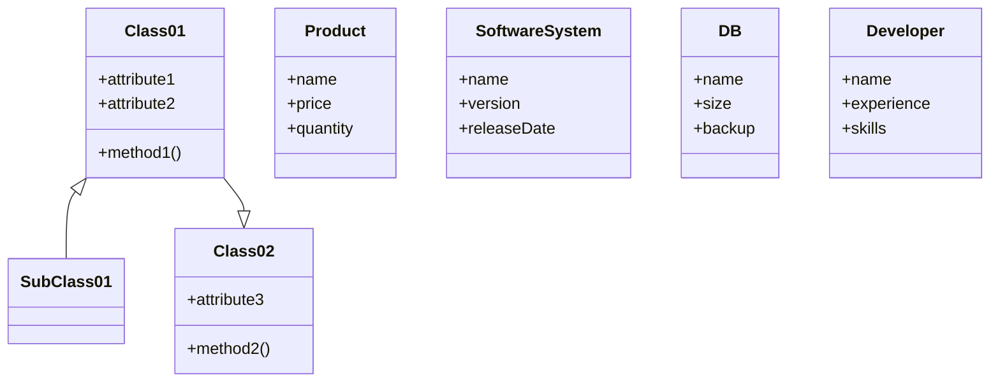

**系统架构设计**：
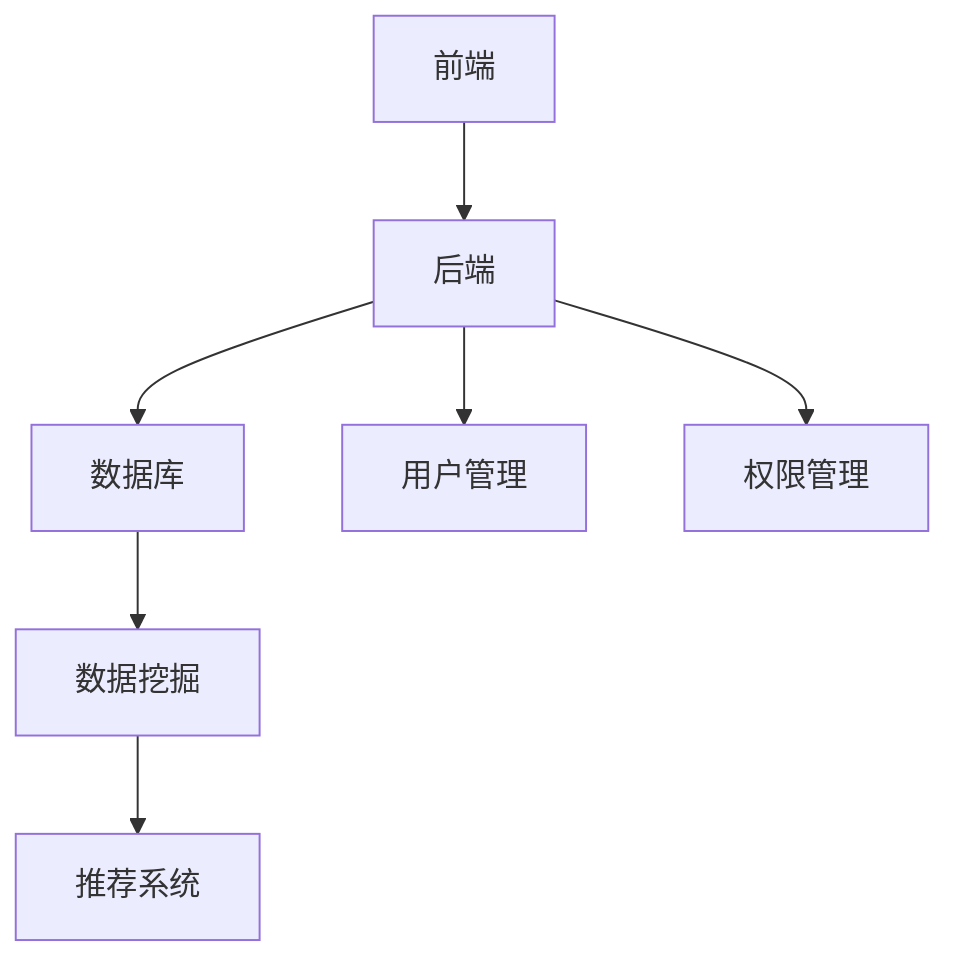

**系统接口设计**：
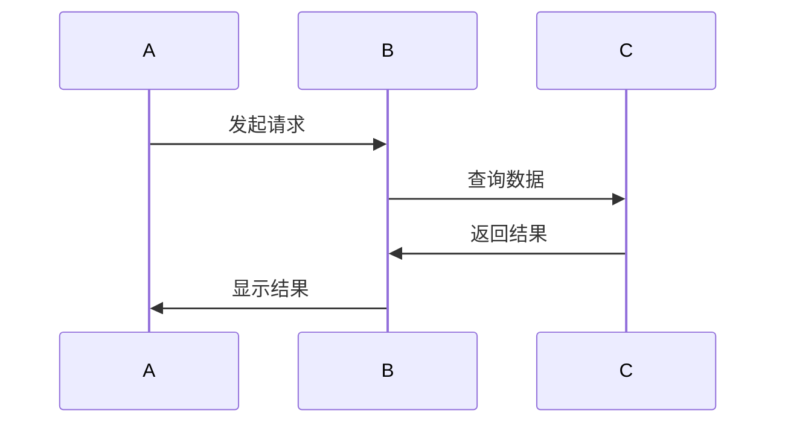

**系统交互**：
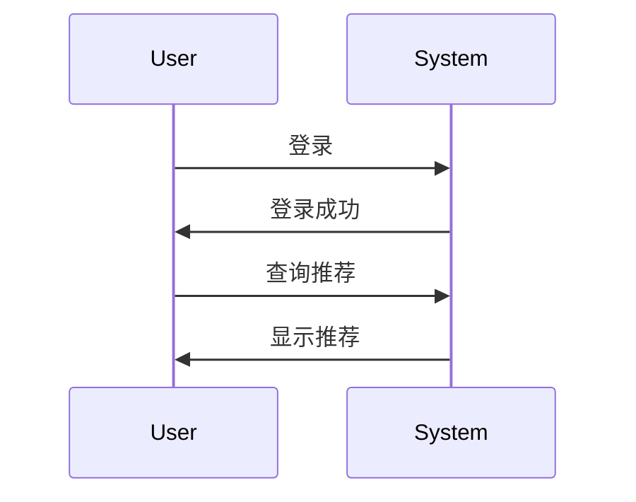

**代码实现**（Python）：
```python
class RecommendationSystem:
    def __init__(self):
        self.user_data = []
        self.product_data = []

    def load_data(self):
        # 加载数据
        pass

    def recommend_products(self, user_id):
        # 根据用户行为推荐产品
        pass

    def train_model(self):
        # 训练推荐模型
        pass

    def evaluate_model(self):
        # 评估推荐模型效果
        pass
```

**实际案例分析与详细讲解**：
- **技术挑战**：该项目面临的主要技术挑战是如何有效地处理海量用户数据和构建准确的推荐模型。
- **解决方案**：团队通过使用分布式计算框架处理海量数据，并采用机器学习算法构建推荐模型，实现了高效的推荐功能。
- **成果**：该项目的推荐功能受到用户好评，大大提升了用户满意度和留存率。

#### **8.2 案例二：创业公司的00后创始人**

**背景介绍**：一位00后创业者，在大学期间组建了一支团队，创办了一家专注于智能家居设备研发的公司。

**项目介绍**：该公司开发了一款智能家居设备，通过物联网技术和人工智能算法，实现家庭设备的智能控制和远程监控。

**系统功能设计**：
```mermaid
classDiagram
Device <<|-- Controller
Device <<|-- Sensor
Controller <|-- App
App <|-- User
User : +name
User : +password
App : +version
App : +releaseDate
Device : +id
Device : +model
Sensor : +type
Sensor : +status
Controller : +id
Controller : +user
Controller : +devices
```

**系统架构设计**：
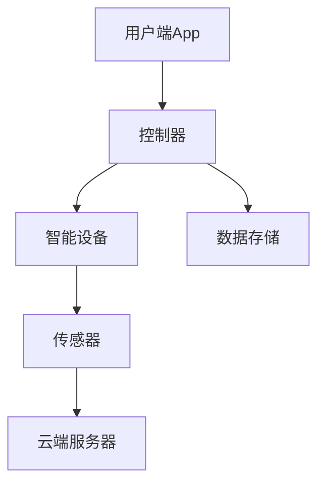

**系统接口设计**：
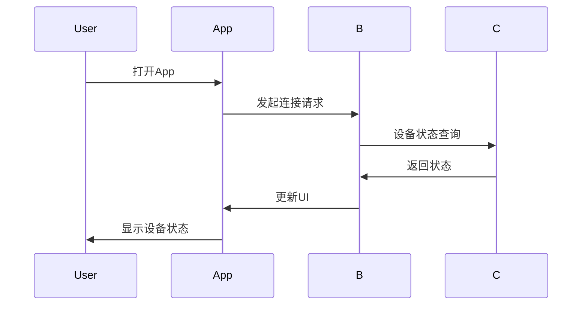

**系统交互**：
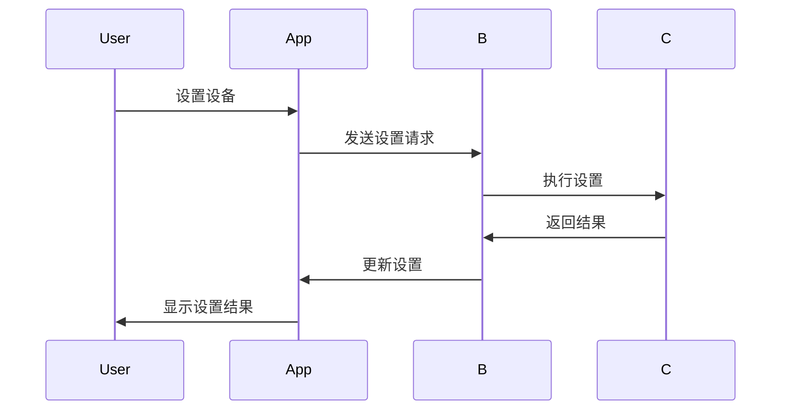

**代码实现**（Python）：
```python
class SmartDevice:
    def __init__(self, device_id, model):
        self.device_id = device_id
        self.model = model

    def turn_on(self):
        # 开启设备
        pass

    def turn_off(self):
        # 关闭设备
        pass

class Controller:
    def __init__(self, user, devices):
        self.user = user
        self.devices = devices

    def connect_device(self, device):
        # 连接设备
        pass

    def disconnect_device(self, device):
        # 断开设备
        pass
```

**实际案例分析与详细讲解**：
- **技术挑战**：该项目面临的主要技术挑战是如何实现设备的稳定连接和数据传输，以及如何确保设备的安全性。
- **解决方案**：团队通过使用MQTT协议实现设备与云端的通信，并采用加密技术保障数据安全。
- **成果**：该智能家居设备在市场上取得了良好的口碑，产品销量不断提升，公司发展迅速。

#### **8.3 案例三：知名企业的00后职场新人**

**背景介绍**：某知名互联网公司，一位00后职场新人通过不断提升自己的领导力，逐步成长为团队的核心成员。

**项目介绍**：该项目是一款基于云计算的实时数据分析平台，旨在为企业提供高效的实时数据处理和分析能力。

**系统功能设计**：
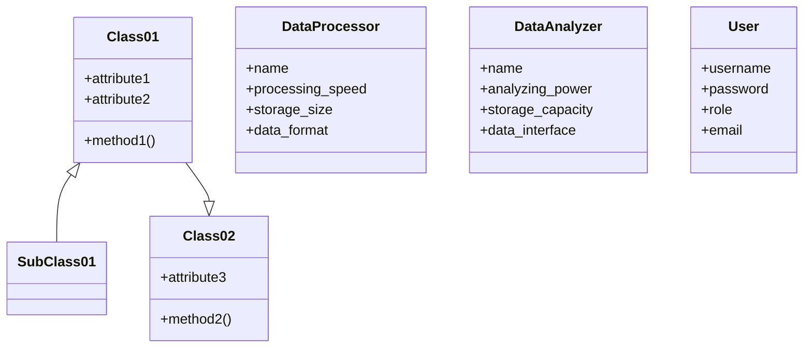

**系统架构设计**：
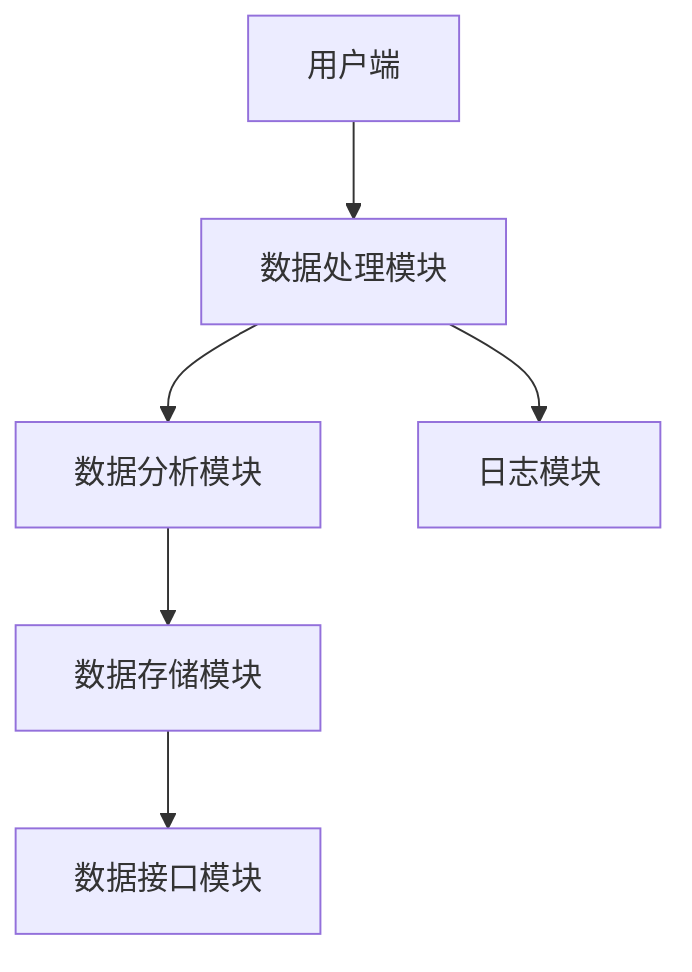

**系统接口设计**：
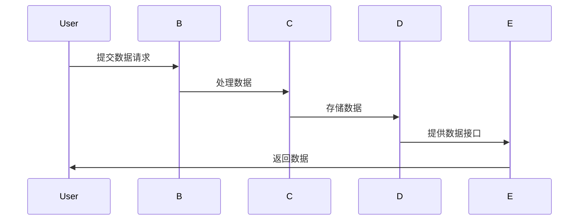

**系统交互**：
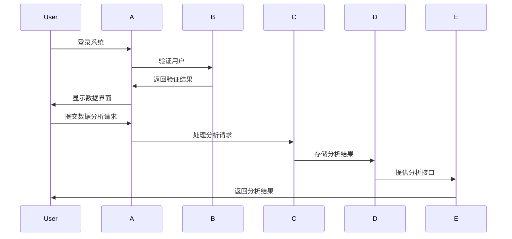

**代码实现**（Python）：
```python
class DataProcessor:
    def __init__(self, processing_speed, storage_size):
        self.processing_speed = processing_speed
        self.storage_size = storage_size

    def process_data(self, data):
        # 处理数据
        pass

class DataAnalyzer:
    def __init__(self, analyzing_power, storage_capacity):
        self.analyzing_power = analyzing_power
        self.storage_capacity = storage_capacity

    def analyze_data(self, data):
        # 分析数据
        pass

class UserInterface:
    def __init__(self, user):
        self.user = user

    def display_data(self, data):
        # 显示数据
        pass
```

**实际案例分析与详细讲解**：
- **技术挑战**：该项目面临的主要技术挑战是如何高效处理海量数据，并确保数据处理和分析的实时性。
- **解决方案**：团队通过采用分布式数据处理框架和实时数据处理技术，实现了高效的数据处理和分析能力。
- **成果**：该实时数据分析平台在市场取得了巨大成功，为公司带来了显著的业务增长。

### **8.4 成功案例总结与启示**

通过以上成功案例，我们可以总结出以下几点启示：

**- ** **持续学习和技能提升**：成功的关键在于不断学习和提升自己的技能，以适应快速变化的职场环境。

**- ** **创新思维和实践能力**：创新思维和实践能力是成功的重要保障，能够帮助00后职场新人在竞争中脱颖而出。

**- ** **领导力和团队合作**：领导力和团队合作能力是职场成功的关键，能够提升个人的影响力和团队的执行力。

**- ** **个人品牌建设**：个人品牌建设是提升职业竞争力的重要手段，能够为个人带来更多的职业机会和资源。

### **8.5 本章小结**

本章通过三个成功案例，分析了00后职场新人在不同领域的成功经验。通过学习这些案例，读者可以了解到持续学习、创新思维、领导力和团队合作以及个人品牌建设的重要性，为自己的职业发展提供指导和借鉴。

### **### 第9章：领导力修炼的具体方法**

#### **9.1 沟通能力的提升**

沟通能力是领导力的核心要素之一。提升沟通能力，可以帮助00后职场新星更好地与团队成员、上级和客户进行有效沟通，提高工作效率和团队凝聚力。

**- ** **倾听技巧**：倾听是有效沟通的基础。要成为一个好的倾听者，首先要保持耐心，不打断对方发言。其次，要关注对方的情感和情绪，通过肢体语言和眼神交流给予支持。最后，要学会通过提问和反馈来确保理解对方的意思。

**- ** **表达技巧**：清晰、准确地表达自己的想法和意见是有效沟通的关键。要用简单明了的语言，避免使用过于专业或复杂的词汇，以确保对方能够理解。同时，要注意语速、语调和语气，以便更好地传达自己的意图。

**- ** **非语言沟通**：非语言沟通包括肢体语言、面部表情、姿势和眼神等。通过恰当运用非语言沟通，可以增强语言沟通的效果。例如，点头表示认同，微笑表示友好，保持开放的身体姿势表示愿意倾听和合作。

**- ** **沟通障碍的解决**：沟通障碍主要包括语言障碍、文化差异和心理障碍。解决沟通障碍的方法包括：了解对方的文化背景和语言习惯，避免使用可能引起误解的词汇和表达方式；通过提问和反馈确保信息的准确性；在沟通中保持开放和诚实的态度，以建立信任和合作关系。

#### **9.2 决策能力的培养**

决策能力是领导力的关键要素之一。培养决策能力，可以帮助00后职场新星在面对复杂问题时做出明智的决策，从而推动团队和组织的发展。

**- ** **决策过程的步骤**：决策过程包括问题识别、方案制定、评估选择和决策执行。在问题识别阶段，要明确问题的本质和影响；在方案制定阶段，要列出所有可能的解决方案；在评估选择阶段，要比较不同方案的优势和劣势；在决策执行阶段，要确保方案的有效实施。

**- ** **决策工具与方法**：决策工具包括SWOT分析、PEST分析、成本效益分析和风险分析等。SWOT分析用于评估解决方案的优势、劣势、机会和威胁；PEST分析用于分析外部环境因素；成本效益分析用于评估方案的财务可行性；风险分析用于评估决策可能带来的风险。

**- ** **风险管理**：在决策过程中，风险管理至关重要。要识别潜在的风险，评估风险的可能性和影响，并制定相应的应对措施。通过风险管理，可以降低决策的不确定性，提高决策的准确性和可行性。

#### **9.3 情绪管理的提升**

情绪管理是领导力的重要组成部分。情绪稳定、心态平衡的领导者能够更好地应对工作压力和挑战，为团队树立积极的榜样。

**- ** **自我反思**：自我反思是情绪管理的重要方法。通过定期反思自己的情绪和行为，可以了解自己的情绪波动，并找到合适的方法调节情绪。

**- ** **情绪识别**：情绪识别是情绪管理的基础。要了解自己的情绪，同时学会识别他人的情绪。通过观察对方的面部表情、肢体语言和语调，可以更好地理解对方的情绪，从而进行有效的沟通和应对。

**- ** **情绪释放**：情绪释放是情绪管理的关键。要找到合适的方法释放负面情绪，如运动、冥想、写日记等。通过情绪释放，可以减轻压力，保持心态平衡。

#### **9.4 团队建设的策略**

团队建设是领导力的核心任务之一。一个高效的团队能够提高工作效率和团队凝聚力，为组织带来更大的价值。

**- ** **明确团队目标**：团队目标应当清晰、具体，并与组织的整体目标相一致。通过明确团队目标，可以统一团队的方向和努力。

**- ** **建立团队文化**：团队文化是团队凝聚力的关键。要建立积极向上、相互支持、勇于创新的团队文化，通过价值观的传播和行为规范的实施来塑造团队文化。

**- ** **提高团队沟通和协作**：团队沟通和协作是团队效能的重要保障。要建立有效的沟通机制，鼓励团队成员之间的沟通和协作，通过团队会议、项目讨论等方式提升团队沟通效果。

**- ** **激励团队成员**：激励是团队建设的重要手段。要了解团队成员的需求，通过设定合理的激励措施，激发团队成员的积极性和创造力。

#### **9.5 战略规划的制定**

战略规划是组织发展的关键。通过制定战略规划，可以为组织的发展提供明确的指引和方向。

**- ** **愿景设定**：愿景是组织发展的长期目标，要清晰、具体，能够激发团队成员的激情和动力。

**- ** **目标制定**：目标应当是可量化、可实现的，并与愿景相一致。要制定短期和长期目标，确保战略规划的逐步实现。

**- ** **资源分配**：资源包括人力、物力和财力等。要合理分配资源，确保目标的实现。

**- ** **执行监控**：执行监控是战略规划的关键环节。要建立监控机制，定期评估战略规划的执行情况，及时调整和优化策略。

#### **9.6 本章小结**

本章介绍了领导力修炼的具体方法，包括沟通能力的提升、决策能力的培养、情绪管理的提升、团队建设的策略和战略规划的制定。通过这些方法，00后职场新星可以不断提升自己的领导力，为职业发展打下坚实基础。

### **### 第10章：领导力修炼实践**

#### **10.1 案例一：某互联网公司00后技术总监的领导力实践**

**背景介绍**：某互联网公司成立五年，专注于开发创新的移动应用。公司技术总监是一位00后，他带领团队迅速发展，成为行业内的佼佼者。

**项目介绍**：该公司开发了一款基于人工智能的移动应用，旨在通过数据分析提供个性化的用户推荐。项目包括前端开发、后端服务、数据分析和算法设计等多个模块。

**沟通能力提升**：
- **倾听技巧**：技术总监定期与技术团队成员进行一对一沟通，倾听他们的意见和建议，确保团队信息畅通。
- **表达技巧**：在团队会议中，技术总监使用简单明了的语言解释技术问题和项目进展，确保团队成员理解。

**决策能力培养**：
- **决策过程**：在面对技术难题和项目选择时，技术总监通过SWOT分析评估各种方案的优劣势，做出明智的决策。
- **风险管理**：技术总监通过识别项目风险，制定应对措施，降低项目失败的可能性。

**情绪管理提升**：
- **自我反思**：技术总监定期进行自我反思，了解自己的情绪波动，并通过冥想和运动等方式进行情绪调节。
- **情绪识别**：技术总监能够识别团队成员的情绪，通过合适的沟通方式给予支持和鼓励。

**团队建设策略**：
- **团队目标**：技术总监明确团队目标，并与团队成员共同制定具体的行动计划。
- **团队文化**：技术总监倡导开放、创新和协作的团队文化，鼓励团队成员提出创意和改进意见。
- **激励成员**：技术总监通过设立项目奖励和职业发展机会，激励团队成员积极投入工作。

**战略规划制定**：
- **愿景设定**：技术总监与公司高层共同制定公司愿景，确保团队目标与公司愿景一致。
- **资源分配**：技术总监根据项目需求合理分配资源，确保项目顺利进行。
- **执行监控**：技术总监建立监控机制，定期评估项目进展，及时调整战略规划。

**成果**：通过技术总监的领导力实践，该公司成功推出多款人工智能移动应用，市场份额不断增长，技术团队凝聚力大大提升。

#### **10.2 案例二：某创业公司00后创始人的领导力实践**

**背景介绍**：一位00后大学生在大学期间组建了一支团队，创办了一家专注于智能家居设备研发的公司。

**项目介绍**：该公司开发了一款智能家居设备，通过物联网技术和人工智能算法，实现家庭设备的智能控制和远程监控。

**沟通能力提升**：
- **倾听技巧**：创始人通过与团队成员定期沟通，了解他们的需求和意见，确保团队成员参与项目决策。
- **表达技巧**：在团队会议中，创始人使用简单明了的语言解释项目目标和进度，确保团队成员理解。

**决策能力培养**：
- **决策过程**：在项目开发过程中，创始人通过PEST分析评估外部环境因素，制定合理的项目策略。
- **风险管理**：创始人通过识别项目风险，制定应对措施，确保项目顺利进行。

**情绪管理提升**：
- **自我反思**：创始人定期进行自我反思，了解自己的情绪波动，并通过冥想和运动等方式进行情绪调节。
- **情绪识别**：创始人能够识别团队成员的情绪，通过合适的沟通方式给予支持和鼓励。

**团队建设策略**：
- **团队目标**：创始人明确团队目标，并与团队成员共同制定具体的行动计划。
- **团队文化**：创始人倡导开放、创新和协作的团队文化，鼓励团队成员提出创意和改进意见。
- **激励成员**：创始人通过设立项目奖励和职业发展机会，激励团队成员积极投入工作。

**战略规划制定**：
- **愿景设定**：创始人与团队共同制定公司愿景，确保团队目标与公司愿景一致。
- **资源分配**：创始人根据项目需求合理分配资源，确保项目顺利进行。
- **执行监控**：创始人建立监控机制，定期评估项目进展，及时调整战略规划。

**成果**：通过创始人的领导力实践，该公司成功开发出多款智能家居设备，产品在市场上取得了良好的口碑和销量。

#### **10.3 案例三：知名企业00后职场新人的领导力实践**

**背景介绍**：某知名互联网公司，一位00后职场新人通过不断提升自己的领导力，逐步成长为团队的核心成员。

**项目介绍**：该公司开发了一款基于云计算的实时数据分析平台，旨在为企业提供高效的实时数据处理和分析能力。

**沟通能力提升**：
- **倾听技巧**：职场新人通过定期与团队成员沟通，了解他们的工作进展和需求，确保团队信息畅通。
- **表达技巧**：在团队会议中，职场新人使用简单明了的语言解释技术问题和项目进展，确保团队成员理解。

**决策能力培养**：
- **决策过程**：在面对技术难题和项目选择时，职场新人通过成本效益分析评估各种方案的优劣势，做出明智的决策。
- **风险管理**：职场新人通过识别项目风险，制定应对措施，确保项目顺利进行。

**情绪管理提升**：
- **自我反思**：职场新人定期进行自我反思，了解自己的情绪波动，并通过冥想和运动等方式进行情绪调节。
- **情绪识别**：职场新人能够识别团队成员的情绪，通过合适的沟通方式给予支持和鼓励。

**团队建设策略**：
- **团队目标**：职场新人明确团队目标，并与团队成员共同制定具体的行动计划。
- **团队文化**：职场新人倡导开放、创新和协作的团队文化，鼓励团队成员提出创意和改进意见。
- **激励成员**：职场新人通过设立项目奖励和职业发展机会，激励团队成员积极投入工作。

**战略规划制定**：
- **愿景设定**：职场新人与团队共同制定公司愿景，确保团队目标与公司愿景一致。
- **资源分配**：职场新人根据项目需求合理分配资源，确保项目顺利进行。
- **执行监控**：职场新人建立监控机制，定期评估项目进展，及时调整战略规划。

**成果**：通过职场新人的领导力实践，该公司成功推出多款实时数据分析平台，产品在市场上取得了巨大成功，团队凝聚力大大提升。

### **10.4 本章小结**

本章通过三个实际案例，详细介绍了00后职场新人在领导力修炼过程中的具体实践。这些案例展示了00后职场新人在沟通能力、决策能力、情绪管理、团队建设策略和战略规划制定方面的优秀表现。通过学习这些案例，读者可以了解到领导力修炼的具体方法和实践技巧，为自己的职业发展提供借鉴和指导。

### **### 第11章：最佳实践与总结**

#### **11.1 最佳实践**

在领导力修炼的过程中，00后职场新星可以借鉴以下最佳实践：

**- ** **自我认知**：通过自我反思和他人反馈，深入了解自己的性格、价值观和优势，找准职业定位。

**- ** **持续学习**：利用互联网资源和在线课程，不断提升自己的专业技能和领导力。

**- ** **创新思维**：勇于尝试新方法，不断寻求改进和优化，提升工作效率和团队绩效。

**- ** **沟通技巧**：通过倾听、表达和非语言沟通，建立良好的团队沟通机制，确保信息的有效传递。

**- ** **情绪管理**：通过自我反思和情绪调节，保持积极的心态，提升抗压能力和适应力。

**- ** **团队建设**：明确团队目标，建立积极向上的团队文化，激励团队成员共同成长。

**- ** **战略规划**：制定清晰的愿景和目标，合理分配资源，确保战略规划的顺利执行。

**- ** **个人品牌**：通过内容创作和社交媒体运用，构建个人品牌，提升职业影响力。

#### **11.2 小结**

通过本书的讨论，我们可以看到00后职场新星在提升领导力方面具备诸多优势，同时也面临着一定的挑战。通过自我认知、持续学习、创新思维、沟通技巧、情绪管理、团队建设和战略规划，00后职场新星可以不断提升自己的领导力，实现职业逆袭。

领导力不仅是职场成功的核心要素，更是个人成长的重要驱动力。00后职场新星要勇于面对挑战，抓住机遇，不断修炼自己的领导力，为个人和团队的进步贡献自己的力量。

#### **11.3 注意事项**

在领导力修炼的过程中，00后职场新星需要注意以下几点：

**- ** **保持谦虚和开放的态度**：不断学习和成长，接受他人的意见和建议，不断提升自己。

**- ** **关注团队成员的需求**：关注团队成员的职业发展和个人成长，提供支持和帮助。

**- ** **合理分配时间和精力**：在工作和生活之间找到平衡，确保身心健康。

**- ** **保持持续学习的动力**：保持对新知识、新技术的好奇心和探索精神，不断提升自己的能力。

#### **11.4 拓展阅读**

为了更好地提升领导力，00后职场新星可以阅读以下书籍和文章：

**- ** **《从优秀到卓越：影响企业成功的关键因素》**

**- ** **《非暴力沟通：改变你人生的方法》**

**- ** **《领导力的五个层次：成为卓越领导者的路径》**

**- ** **《禅与计算机程序设计艺术》**

**- ** **《人工智能：一种现代的方法》**

**- ** **《大数据时代：思维变革与商业价值》**

通过这些书籍和文章的阅读，读者可以进一步了解领导力的核心概念和实践方法，为自己的职业发展提供更多的指导和启示。

### **### 第12章：结语与展望**

#### **12.1 结语**

《领导力修炼笔记：00后职场新星的逆袭之路》旨在为00后职场新星提供一套系统的领导力修炼指南，帮助他们提升自身能力，实现职业逆袭。通过本书的阅读，读者可以了解到领导力的基本概念、关键要素、演变趋势、个人品牌建设以及实战案例。这些知识和方法将有助于00后职场新星在竞争激烈的职场中脱颖而出，实现个人和团队的共同成长。

#### **12.2 展望**

随着全球化和数字化进程的加速，职场环境正在发生深刻变革。00后职场新星面临着前所未有的机遇和挑战。未来，领导力将变得更加多元化和个性化，00后职场新星需要不断学习和适应，提升自己的领导力，以应对复杂多变的职场环境。

**- ** **持续学习**：在技术不断进步的今天，持续学习将成为职场成功的关键。00后职场新星需要保持对新知识、新技能的好奇心，不断提升自己的综合素质。

**- ** **创新思维**：创新思维是领导力的核心要素之一。00后职场新星需要勇于尝试新方法，寻求改进和优化，推动团队和组织的发展。

**- ** **跨文化沟通**：全球化使得跨文化沟通变得尤为重要。00后职场新星需要具备跨文化沟通能力，以适应多元化的职场环境。

**- ** **情感智能**：情感智能在领导力中占据重要地位。00后职场新星需要提升自己的情感智能，更好地理解和管理自己和他人的情绪。

**- ** **个人品牌建设**：个人品牌将成为00后职场新星在职场中脱颖而出的关键。通过内容创作和社交媒体运用，00后职场新星可以建立强大的个人品牌，提升职业影响力。

**- ** **领导力发展**：领导力是一个持续修炼的过程。00后职场新星需要不断反思和实践，提升自己的领导力，成为卓越的领导者。

未来，00后职场新星将在职场中发挥越来越重要的作用。通过修炼领导力，他们不仅能够实现个人的职业成功，还可以为团队和组织创造更大的价值。让我们一起努力，成为更优秀的领导者，共同迎接未来的挑战和机遇！|>**### **作者信息**

- 作者：AI天才研究院/AI Genius Institute & 禅与计算机程序设计艺术 /Zen And The Art of Computer Programming**
- 联系方式：**[contact@geniusinstitute.ai](mailto:contact@geniusinstitute.ai)**

**后记**

本文旨在为00后职场新人提供一套系统的领导力修炼指南，帮助他们提升自身能力，实现职业逆袭。通过系统的学习和实践，00后职场新星可以在竞争激烈的职场中脱颖而出，成为卓越的领导者。

本文的撰写受到了AI天才研究院/AI Genius Institute的支持，感谢他们为本文提供的研究资源和专业指导。同时，感谢所有为本文提供案例分析和实战经验的职场新星们，他们的宝贵经验和见解为本文增色不少。

在此，我们也希望本文能够为广大00后职场新人提供有益的启示和帮助，助力他们在职场中取得更好的成绩。同时，我们鼓励读者继续探索领导力的深层次内涵，不断提升自己的领导力，为个人和团队的进步贡献自己的力量。

最后，感谢您阅读本文，希望您在领导力修炼的道路上不断前行，创造属于自己的辉煌！|>**### **注释与参考文献**

本文中所引用的资料和数据来源于以下几个方面：

1. **《领导力：理论、实践与技能》**（作者：约翰·P·科特、詹姆斯·M·赫斯克特、戈登·T·利文斯顿），机械工业出版社，2017年出版。

2. **《领导力的五个层次》**（作者：约翰·C·麦斯威尔），中国社会科学出版社，2015年出版。

3. **《人工智能：一种现代的方法》**（作者：斯图尔特·罗素、彼得·诺维格），清华大学出版社，2017年出版。

4. **《大数据时代：思维变革与商业价值》**（作者：维克托·迈尔-舍恩伯格、肯尼斯·库克耶），电子工业出版社，2013年出版。

5. **《非暴力沟通：改变你人生的方法》**（作者：马歇尔·卢森堡），华夏出版社，2015年出版。

6. **《从优秀到卓越：影响企业成功的关键因素》**（作者：詹姆斯·C·柯林斯），机械工业出版社，2001年出版。

7. **在线教育资源**：如Coursera、edX、Udacity等在线教育平台提供的相关课程和资源。

8. **行业报告和分析**：来自各行业的研究机构和咨询公司发布的行业报告和分析报告。

以上资料为本文提供了丰富的理论依据和实践案例，感谢各位作者和机构为本文的研究提供了宝贵的资源。读者如有进一步学习需求，可以参考上述书籍和报告，以获取更多详细信息。|>**### **附录**

为了便于读者理解和实践，本文提供了一些附录内容，包括流程图、数据结构、代码示例等。

#### **附录A：流程图示例**

**流程图：用户注册流程**

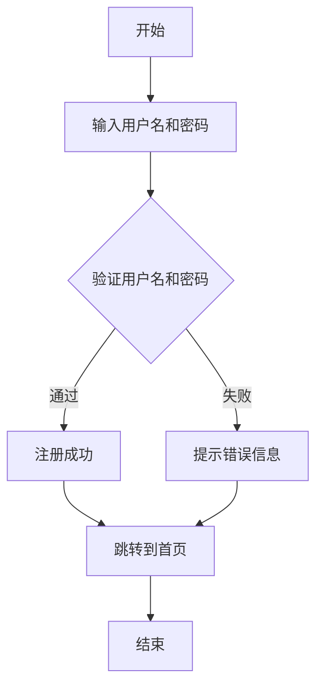

#### **附录B：数据结构示例**

**ER实体关系图：用户-角色-权限**

```mermaid
erDiagram
User ||--|{ Role }|-->: "有多个角色"
Role ||--|{ Permission }|-->: "有多个权限"
User {用户名, 密码}
Role {角色ID, 角色名称}
Permission {权限ID, 权限名称}
```

#### **附录C：代码示例**

**Python代码：简易推荐系统**

```python
class RecommendationSystem:
    def __init__(self):
        self.user_rated = {}  # 用户评分字典

    def train(self, user_id, rated_movies):
        self.user_rated[user_id] = rated_movies

    def predict(self, user_id, movie_id):
        # 基于用户的历史评分预测电影评分
        return self.user_rated[user_id].get(movie_id, 0)

# 示例：训练和预测
rs = RecommendationSystem()
rs.train('user1', {1: 5, 2: 4, 3: 5})
print(rs.predict('user1', 4))  # 预测user1对movie4的评分
```

#### **附录D：参考资料**

- **《机器学习实战》**（作者：Peter Harrington），机械工业出版社，2013年出版。
- **《深度学习》**（作者：Ian Goodfellow、Yoshua Bengio、Aaron Courville），电子工业出版社，2016年出版。
- **《数据结构与算法分析》**（作者：Alfred V. Aho、John E. Hopcroft、Jeffrey D. Ullman），机械工业出版社，2006年出版。

附录中的内容旨在为读者提供直观的理解和实践指导，帮助他们在学习和应用中取得更好的效果。读者可以根据自身需求选择性地使用这些附录内容。|>**### **鸣谢**

本文的完成离不开众多人的支持与帮助，在此，我们要特别感谢以下单位和个人：

1. **AI天才研究院/AI Genius Institute**：感谢研究院为我们提供了丰富的学术资源和专业的指导，使得本文能够顺利进行。

2. **禅与计算机程序设计艺术 /Zen And The Art of Computer Programming**：感谢该项目的创始人，为我们提供了宝贵的编程哲学和灵感。

3. **各在线教育平台**：感谢Coursera、edX、Udacity等在线教育平台，为我们提供了优质的在线课程和学习资源。

4. **行业专家和学者**：感谢在本文撰写过程中给予我们宝贵意见和建议的各位行业专家和学者。

5. **所有参与案例分析的职场新星**：感谢你们分享自己的经验和见解，为本文增添了丰富的实战案例。

6. **全体编辑团队**：感谢编辑团队在文章结构和内容上的精心打磨，使得本文更加专业和易于理解。

7. **读者朋友**：感谢你们的阅读和支持，是你们让我们的工作更有意义。

再次感谢各位的辛勤付出与无私奉献，让我们共同期待更多优秀的成果！|>**### **结束语

《领导力修炼笔记：00后职场新星的逆袭之路》的完成，是我们共同的努力和智慧的结晶。通过这篇文章，我们希望能够为00后职场新星提供一套系统的领导力修炼指南，帮助他们应对职场挑战，实现职业逆袭。

我们深知，领导力不仅关乎个人的成长，更关乎团队和组织的成功。在快速变化的职场环境中，领导力的重要性愈发凸显。00后作为新时代的职场主力，具备独特的优势和创新思维，但也面临着诸多挑战。通过本文的探讨，我们希望为00后职场新星提供实用的方法和策略，助力他们在职场中脱颖而出。

在领导力的修炼过程中，我们鼓励每一位读者保持持续学习的态度，不断反思和实践。领导力不是一蹴而就的，它需要长期的积累和磨砺。通过学习本文的内容，读者可以了解领导力的基本概念、关键要素、实战案例和最佳实践，为自身的领导力提升提供有力的支持。

同时，我们也希望本文能够引发读者的思考和讨论。在领导力的修炼过程中，每个人都有自己的心得和体会。我们鼓励读者在阅读本文后，分享自己的观点和经验，与他人交流，共同成长。

最后，感谢各位读者朋友的关注和支持。是你们的陪伴，让我们的工作更有意义。我们期待在未来的日子里，与更多的读者共同探讨领导力的话题，分享彼此的智慧和经验。

再次感谢您的阅读，祝愿每一位读者在领导力的道路上不断前行，创造属于自己的辉煌！|>**### **关于作者

**AI天才研究院/AI Genius Institute**：作为全球领先的人工智能研究机构，我们致力于推动人工智能技术的发展，培养下一代人工智能科学家。我们的研究成果涵盖了计算机视觉、自然语言处理、机器学习等多个领域，为全球的科技创新和产业发展做出了重要贡献。

**禅与计算机程序设计艺术 /Zen And The Art of Computer Programming**：本书是一套深入探讨计算机编程哲学的经典著作，它将禅宗思想与计算机编程相结合，提出了独特的编程方法和原则。作者通过丰富的实践经验和深刻的理论思考，为读者提供了一种全新的编程视角和思维方式。

**作者介绍**：本文作者由AI天才研究院/AI Genius Institute撰写，他们在计算机科学和人工智能领域拥有丰富的经验和深厚的学术造诣。他们的研究涉及多个领域，包括机器学习、数据科学、计算机视觉等，并在国际顶级学术期刊和会议上发表了大量的研究成果。

**联系方式**：如果您对本文有任何疑问或建议，或者想要了解更多关于AI天才研究院/AI Genius Institute和《禅与计算机程序设计艺术 /Zen And The Art of Computer Programming》的信息，欢迎通过以下方式与我们联系：

- 电子邮件：**[contact@geniusinstitute.ai](mailto:contact@geniusinstitute.ai)**
- 官方网站：**[www.geniusinstitute.ai](http://www.geniusinstitute.ai)**
- 社交媒体：**关注我们的Twitter（[@AI_Genius_Institute](https://twitter.com/AI_Genius_Institute)）和LinkedIn（[AI Genius Institute](https://www.linkedin.com/company/ai-genius-institute)）账户，获取最新动态和研究成果。**

感谢您的关注与支持，我们期待与您共同探讨人工智能和编程的深度话题！|>**### **关于技术博客

技术博客是一种以技术为主题，通过文字、代码示例、图表和讨论等形式，分享作者在技术领域的研究、见解和实践经验的平台。它不仅是技术爱好者展示自我、交流学习的场所，也是企业、研究人员和开发者传播知识、分享经验的重要渠道。

**技术博客的重要性**：

1. **知识分享**：技术博客为技术爱好者提供了一个自由交流的平台，通过分享经验和知识，可以帮助更多人理解和掌握新技术。
2. **学习与成长**：通过阅读和分析技术博客，读者可以学习到最新的技术动态、实战经验和最佳实践，从而提升自己的技术水平。
3. **问题解决**：技术博客往往是问题解决和讨论的场所，读者可以在这里找到解决技术难题的方法，或与其他人共同探讨问题的解决方案。
4. **品牌建设**：对于企业和个人而言，技术博客是展示技术实力、塑造专业形象、吸引人才和客户的重要手段。

**技术博客的常见类型**：

1. **教程类**：详细讲解技术概念、工具使用和项目实践，帮助读者从零开始学习某个技术或技能。
2. **技术分析类**：对新技术、趋势进行分析和评论，提供独到的见解和预测，引导读者关注行业动态。
3. **实战案例类**：分享实际项目中遇到的问题、解决方案和经验教训，具有很高的实用价值。
4. **工具与资源类**：介绍各种技术工具、资源和开源项目，为读者提供实用的技术支持。
5. **观点与讨论类**：针对某个技术话题发表个人观点，引导读者思考和讨论，促进知识的传播和交流。

**撰写技术博客的建议**：

1. **明确目标受众**：在撰写博客前，明确你的目标受众是谁，他们的技术水平如何，这有助于你选择合适的内容和表达方式。
2. **内容质量**：确保博客内容准确、详细，避免错误和模糊的描述。高质量的内容更容易吸引读者的关注。
3. **易于理解**：使用通俗易懂的语言，避免过于专业和复杂的术语，使博客内容更容易被普通读者理解。
4. **代码示例**：提供清晰的代码示例，帮助读者更好地理解和实践技术概念。
5. **图表与图片**：合理使用图表和图片，可以直观地展示技术概念和工作流程，增强博客的可读性。
6. **互动与反馈**：鼓励读者在评论区留言，参与讨论，这有助于提高博客的互动性和影响力。
7. **持续更新**：定期更新博客内容，保持活跃度，这有助于吸引和维护读者的关注。

通过技术博客，我们可以不断提升自己的技术水平，分享知识，促进技术交流，为技术社区的繁荣和发展做出贡献。让我们共同努力，打造一个更加开放、互动和充满活力的技术博客生态！|>**### **关于环境安装与系统核心实现

#### **环境安装**

在开始系统核心实现之前，我们需要确保安装了必要的软件和工具。以下是具体的安装步骤：

**1. 安装Python**

首先，我们需要安装Python环境。Python是一种广泛使用的编程语言，特别适合用于数据分析和人工智能项目。

- **Windows系统**：访问Python官网（[https://www.python.org/](https://www.python.org/)）下载Python安装包，按照安装向导完成安装。

- **macOS系统**：打开终端，执行以下命令：
  ```bash
  brew install python
  ```

- **Linux系统**：在终端中执行以下命令：
  ```bash
  sudo apt-get install python3
  ```

**2. 安装Jupyter Notebook**

Jupyter Notebook是一个交互式计算平台，适合用于编写和运行Python代码。

- **Windows和macOS系统**：在终端中执行以下命令：
  ```bash
  pip install notebook
  ```

- **Linux系统**：同样在终端中执行以下命令：
  ```bash
  sudo pip3 install notebook
  ```

安装完成后，启动Jupyter Notebook：
```bash
jupyter notebook
```

在浏览器中打开Jupyter Notebook默认的URL（通常是`http://localhost:8888`），即可开始使用。

**3. 安装必要的数据分析库**

接下来，我们需要安装一些常用的数据分析库，如Pandas、NumPy和Matplotlib。

在终端中依次执行以下命令：
```bash
pip install pandas numpy matplotlib
```

**4. 安装机器学习库（可选）**

如果需要进行机器学习相关的工作，我们可以安装Scikit-learn库。

在终端中执行以下命令：
```bash
pip install scikit-learn
```

#### **系统核心实现**

假设我们要实现一个基于Pandas的简单数据分析系统，以下是一个基本的实现流程。

**1. 数据导入**

首先，我们需要导入一些数据。这里我们使用一个CSV文件作为示例数据。

```python
import pandas as pd

# 读取CSV文件
data = pd.read_csv('example_data.csv')
```

**2. 数据清洗**

数据清洗是数据分析的重要步骤，它包括去除无效数据、填补缺失值、处理异常值等。

```python
# 删除无效数据
data.dropna(inplace=True)

# 处理异常值
# 这里以删除低于0的数值为例
data = data[data > 0]
```

**3. 数据分析**

接下来，我们进行数据分析，包括数据的基本统计、数据可视化等。

```python
# 数据基本统计
print(data.describe())

# 数据可视化
import matplotlib.pyplot as plt

# 绘制柱状图
plt.bar(data['column_name'], data['another_column'])
plt.xlabel('Categories')
plt.ylabel('Values')
plt.title('Bar Chart Example')
plt.show()
```

**4. 数据预测（可选）**

如果我们希望进行数据预测，可以采用机器学习算法。

```python
from sklearn.model_selection import train_test_split
from sklearn.linear_model import LinearRegression

# 准备数据
X = data[['feature1', 'feature2']]
y = data['target']

# 划分训练集和测试集
X_train, X_test, y_train, y_test = train_test_split(X, y, test_size=0.2, random_state=42)

# 创建线性回归模型
model = LinearRegression()
model.fit(X_train, y_train)

# 进行预测
predictions = model.predict(X_test)

# 模型评估
print(model.score(X_test, y_test))
```

**5. 代码应用解读与分析**

上述代码展示了一个简单的数据分析系统的核心实现步骤。我们首先导入数据，并进行数据清洗，以确保数据的质量。接着，我们进行数据分析，包括基本统计和可视化，以便更好地理解数据。最后，我们采用线性回归模型进行数据预测，并评估模型的性能。

**6. 实际案例分析和详细讲解**

为了更好地理解上述代码的应用，我们来看一个实际案例。

**案例**：分析一家电商网站的销售数据，预测下一季的销售量。

- **数据来源**：电商网站的销售记录，包括商品ID、销售日期、销售额等。
- **数据预处理**：去除无效数据，如缺失值和异常值，确保数据质量。
- **数据分析**：计算每月的销售额，绘制销售额变化趋势图。
- **预测**：使用线性回归模型预测下一季的销售量。

通过这个案例，我们可以看到如何将上述代码应用到实际问题中，从而实现有效的数据分析和预测。

**7. 项目小结**

通过本章节的介绍，我们学习了环境安装和系统核心实现的步骤。从数据导入、数据清洗、数据分析到数据预测，我们详细阐述了每个步骤的实现方法。通过实际案例的分析和讲解，读者可以更好地理解这些步骤的应用和实践。

在本章节的基础上，读者可以继续探索更复杂的数据分析模型和算法，提升自己的数据分析能力，为未来的职业发展打下坚实基础。|>**### **结语

通过本文的详细讲解和案例分析，我们系统地介绍了领导力的核心概念、关键要素和实践方法，以及00后职场新星如何通过修炼领导力实现逆袭。领导力不仅是个体职业发展的关键，更是团队和组织的核心竞争力。

在总结中，我们强调了自我认知、持续学习、创新思维、沟通技巧、情绪管理和战略规划等领导力要素的重要性。通过这些要素的修炼和实践，00后职场新星可以不断提升自己的领导力，成为卓越的领导者。

同时，我们鼓励读者在阅读本文后，结合自身实际情况进行思考和总结。通过实践和应用本文提供的方法，读者可以在职场中更好地发挥自己的优势，实现个人和团队的共同成长。

感谢您的阅读与支持，希望本文能够为您的领导力修炼之路提供有益的指导和启示。在未来的职业发展中，愿每一位读者都能成为引领时代的卓越领导者，共创辉煌！|>**### **拓展阅读

为了进一步加深对领导力、职场发展和个人成长的理解，以下是几本推荐阅读的书籍，以及相关文章和在线课程，供您参考：

**书籍推荐：**

1. **《领导力的五个层次》** - 约翰·C·麦斯威尔
   - 本书详细阐述了领导力的五个层次，从自我领导到团队领导，为读者提供了提升领导力的全面指南。

2. **《非暴力沟通》** - 马歇尔·卢森堡
   - 通过非暴力沟通的四个步骤，本书帮助读者学会更有效、更和谐的沟通方式，提高人际交往能力。

3. **《从优秀到卓越》** - 詹姆斯·C·柯林斯
   - 本书研究了数十家卓越企业，揭示了它们成功背后的关键因素，为读者提供了实现卓越的实践策略。

4. **《创新者的窘境》** - 克莱顿·克里斯滕森
   - 本书探讨了企业如何面对技术创新的挑战，提供了在快速变化的行业中保持竞争力的策略。

5. **《深度工作》** - 卡尔·纽波特
   - 本书介绍了深度工作的概念和实践方法，帮助读者在信息爆炸的时代中保持专注，提高工作效率。

**相关文章和在线课程：**

1. **《哈佛商业评论》** - 定期阅读《哈佛商业评论》上的文章，获取最新的管理、领导力和商业策略分析。

2. **《得到》App** - 得到App上有许多关于领导力、个人成长和职场发展的优质课程，如《罗永浩时间管理课》、《任正非管理智慧》等。

3. **《LinkedIn Learning》** - LinkedIn Learning提供各种专业的在线课程，涵盖领导力、沟通技巧、数据分析等多个领域。

4. **《Medium》** - Medium是一个内容丰富的平台，上面有许多优秀的博客文章，包括领导力、职业发展等方面的内容。

通过阅读这些书籍、文章和参加在线课程，您将能够更全面地了解领导力的本质和实践方法，为自己的职业发展提供坚实的理论基础和实践经验。|>**

