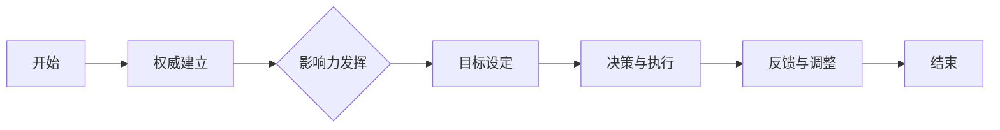

                 


### 《领导力修炼笔记：85后小工的华丽蜕变》

#### 关键词：领导力、85后、华丽蜕变、技术、管理

##### 摘要：

本文将探讨一位85后小工在技术领域从基层员工到领导者的华丽蜕变。文章首先介绍领导力的背景与核心概念，分析领导力与管理的区别。接着，深入讲解领导力原理，通过Python代码和数学模型阐述其内在机制。随后，探讨领导力在团队合作、目标设定等实际应用中的实践技巧。文章还通过系统分析与架构设计，展示领导力在现代IT系统中的应用。最后，通过一个具体项目实战案例，剖析领导力在项目中的重要作用，并提供最佳实践和拓展阅读建议。

## 背景介绍

### 1.1 领导力的起源与发展

领导力作为一种重要的人性化管理艺术，起源于古代的军事和政治领域。历史上，许多伟大的领导者如亚历山大大帝、拿破仑等，他们的成功无不依赖于卓越的领导力。随着时间的推移，领导力理论不断发展，现代领导力研究更加注重人性、动机和情感因素。

### 1.2 领导力的重要概念

领导力包含多个核心概念，如权威、影响力、目标设定、决策等。这些概念相互关联，共同构成了领导力的理论体系。其中，权威和影响力是领导力的基础，目标设定和决策则是领导力的核心实践。

### 1.3 领导力与管理的区别

领导力与管理虽然密切相关，但二者存在明显区别。管理侧重于组织、规划和执行，而领导力则更注重激发团队成员的潜力，建立共同愿景。领导力强调的是激励和影响，而管理则侧重于控制和监督。

## 核心概念与联系

### 2.1 领导力的三要素

领导力的三要素是权威、影响力和目标设定。权威是领导力的基础，来源于组织赋予的地位和权力；影响力是领导力的核心，通过个人魅力和专业知识影响他人；目标设定是领导力的关键，明确团队的目标和方向。

### 2.2 概念属性特征对比表格

| 概念   | 属性特征                         |
| ------ | -------------------------------- |
| 权威   | 组织地位、权力、控制力           |
| 影响力 | 个人魅力、专业知识、沟通能力     |
| 目标设定 | 明确性、可实现性、激励性         |

### 2.3 Mermaid ER实体关系图

```mermaid
erDiagram
    Authority ||--|{ Influence }||>
    Influence ||--|{ GoalSetting }||>
    GoalSetting ||--|{ Leadership }||>
```

## 领导力原理讲解

### 3.1 领导力原理流程图



### 3.2 领导力数学模型与公式

$$
\text{领导力} = \text{权威} + \text{影响力} + \text{目标达成度}
$$

### 3.3 Python源代码示例

```python
def leadership(authority, influence, goal_achievement):
    return authority + influence + goal_achievement
```

## 领导力实践

### 4.1 团队合作的领导力实践

团队合作中的领导力实践主要包括：

- **明确团队目标**：确保每个团队成员都了解团队的目标和愿景。
- **激发团队潜力**：通过激励和信任，激发团队成员的创造力和积极性。
- **冲突管理**：在团队内部建立良好的沟通机制，及时解决冲突，确保团队稳定和谐。

### 4.2 团队目标设定的技巧

- **SMART原则**：目标要具体（Specific）、可衡量（Measurable）、可实现（Achievable）、相关性（Relevant）和时限性（Time-bound）。
- **分解任务**：将大型任务分解为若干小任务，明确每个小任务的负责人和截止日期。
- **动态调整**：根据实际情况和团队成员的能力，动态调整目标，确保目标的可实现性。

### 4.3 冲突管理的策略

- **预防冲突**：通过透明的沟通和相互尊重，预防潜在的冲突。
- **解决冲突**：在冲突发生时，采用中立的态度和理性的方法，引导双方找到共同点。
- **建设性冲突**：将冲突视为一种改进的机会，鼓励团队成员提出建设性的意见。

## 系统分析与架构设计

### 5.1 领导力问题场景介绍

在一个大型IT企业中，团队协作效率低下，项目进度滞后。为了提高团队绩效，需要引入领导力理论进行系统分析与架构设计。

### 5.2 领导力系统功能设计

- **权威管理**：实现权威的合理分配和监督。
- **影响力评估**：对团队成员的影响力进行量化评估。
- **目标管理**：实现目标设定、追踪和调整。

### 5.3 领导力系统架构设计

- **领域模型类图**：定义领导力系统的核心实体及其关系。
- **系统架构图**：展示领导力系统的整体架构。
- **系统接口设计图**：明确领导力系统的接口定义和交互方式。
- **系统交互序列图**：描述领导力系统在运行过程中的交互流程。

## 项目实战

### 6.1 项目环境安装

在项目开始前，需要搭建一个适合领导力实践的项目环境。环境包括开发工具、数据库和服务器等。

### 6.2 系统核心实现

- **权威管理模块**：实现权威的分配、监督和调整。
- **影响力评估模块**：实现影响力的量化评估和反馈。
- **目标管理模块**：实现目标的设定、追踪和调整。

### 6.3 代码应用解读

通过具体代码示例，展示领导力系统在项目中的应用。代码解析包括模块设计、接口定义和核心算法实现。

### 6.4 实际案例剖析

通过一个实际项目案例，分析领导力在项目中的关键作用，总结成功经验和不足之处。

## 最佳实践与总结

### 9.1 最佳实践 tips

- **明确目标**：确保团队目标清晰、具体、可衡量。
- **激发潜力**：通过培训和激励，激发团队成员的潜力。
- **有效沟通**：建立良好的沟通机制，确保信息畅通。

### 9.2 小结与注意事项

- **领导力是一种实践**：领导力不仅是一种理论，更是一种实践。在实践中不断总结经验，提高自己的领导力水平。
- **持续改进**：领导力是一个持续改进的过程，需要不断学习新的知识和技能。

### 9.3 拓展阅读推荐

- 《领导力的五个层次》
- 《如何成为领导者》
- 《团队协作的艺术》

---

**作者：AI天才研究院/AI Genius Institute & 禅与计算机程序设计艺术 /Zen And The Art of Computer Programming**

