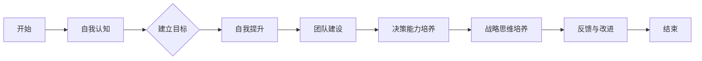
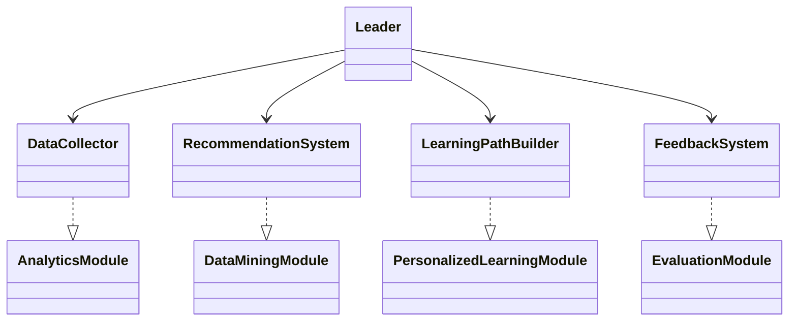
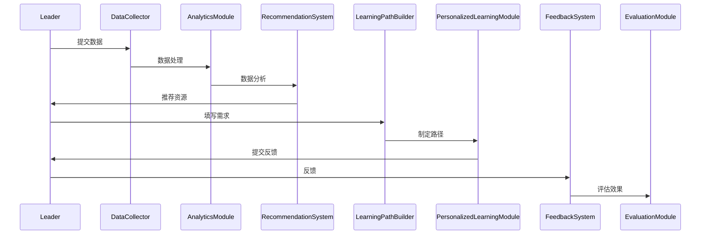
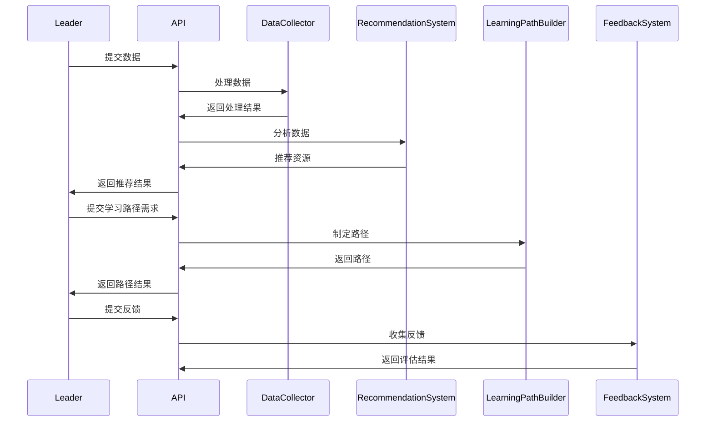
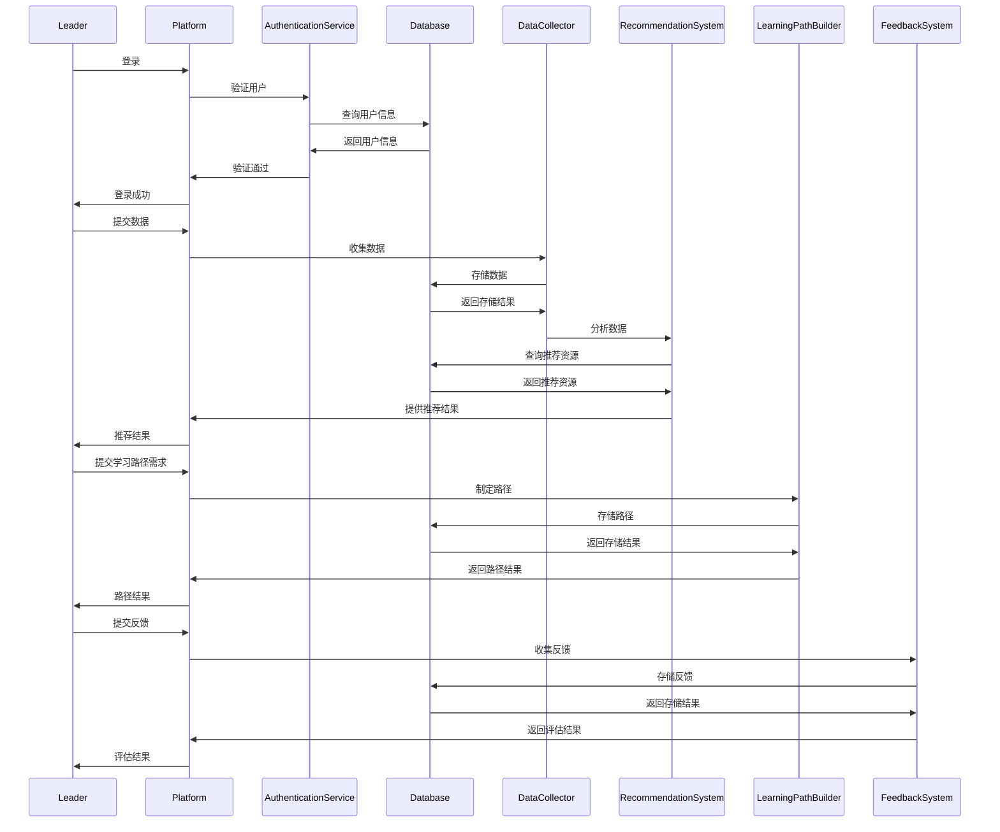

                 


## 《领导力修炼笔记：85后管理新星的成长之路》

### 关键词：领导力、85后、管理、成长、修炼

### 摘要：
本文深入探讨了领导力的核心概念、85后管理新星的特点以及他们在领导力修炼过程中的成长之路。通过案例分析、实践指导，揭示85后管理者在领导力发展中的独特优势和面临的挑战，为新一代管理者提供了宝贵的经验和启示。

### 目录

**一、前言**

**二、领导力的基础**

**三、85后管理新星的特点**

**四、领导力修炼的步骤与方法**

**五、领导力修炼的实际案例**

**六、领导力在组织中的应用**

**七、领导力面临的挑战与未来趋势**

**八、小结与展望**

### 一、前言

#### 写给读者

**领导力**是组织中不可或缺的因素，它不仅影响个体的成长，也决定着整个团队的绩效和组织的长远发展。在当今快速变化的社会环境中，领导力的培养显得尤为重要。本文旨在通过分析85后管理新星的特点，探讨他们在领导力修炼过程中的成长之路，为新一代管理者提供有益的参考。

#### 书的目标与结构

本文的目标是帮助读者了解领导力的核心概念，分析85后管理新星的特点，并探讨他们在领导力修炼中的步骤与方法。通过实际案例研究和未来趋势分析，本文希望为读者提供实用的指导和建议。

文章结构分为八个部分，包括前言、领导力的基础、85后管理新星的特点、领导力修炼的步骤与方法、领导力修炼的实际案例、领导力在组织中的应用、领导力面临的挑战与未来趋势以及小结与展望。每个部分都将深入探讨相应的主题，并提供具体的实践指导和案例分析。

### 二、领导力的基础

#### 领导力的定义与历史

领导力是一个广泛且多维的概念，它包括影响他人、激励团队、做出决策、解决问题等多方面的能力。根据历史发展，领导力理论经历了从英雄式领导、情境领导到变革型领导等多个阶段。

#### 领导力的核心要素

领导力的核心要素包括：

- **个人魅力**：领导者的个性、价值观和信念，能够吸引和影响他人。
- **沟通能力**：有效的沟通是领导者成功的关键，包括倾听、表达和协调能力。
- **决策能力**：领导者需要在复杂和不确定的环境中做出明智的决策。
- **团队建设**：领导者需要建立和维护一个有凝聚力和高效协作的团队。

#### 领导力的重要性

领导力不仅影响个体的成长，还决定着整个组织的绩效和长远发展。在当今快速变化的市场环境中，领导力的重要性更加凸显。有效的领导者能够引导团队适应变化，抓住机遇，实现组织目标。

### 三、85后管理新星的特点

#### 85后的成长背景

85后是中国社会快速发展时期成长起来的一代人，他们的成长背景深受互联网和全球化的影响。这使得他们在价值观、思维方式和工作方式上具有独特的特点。

#### 85后的价值观与思维方式

85后管理者通常具有以下价值观和思维方式：

- **创新意识**：他们更加开放和接受新鲜事物，善于创新和突破。
- **团队协作**：他们重视团队合作，善于在团队中发挥自己的优势。
- **终身学习**：他们注重自我提升，具有强烈的求知欲和自主学习能力。

#### 85后的工作方式与领导风格

85后管理者通常具有以下工作方式和领导风格：

- **灵活高效**：他们善于利用科技手段提高工作效率，注重结果和效果。
- **扁平化管理**：他们倾向于扁平化的管理结构，强调自主性和创新性。
- **关注员工成长**：他们重视员工的个人发展和职业规划，鼓励员工积极表达和参与。

### 四、领导力修炼的步骤与方法

#### 自我认知与自我提升

自我认知是领导力修炼的基础。领导者需要了解自己的优点和不足，明确自己的价值观和目标，并不断进行自我提升。

#### 团队建设与沟通技巧

团队建设是领导力的重要组成部分。领导者需要建立高效的团队，培养团队协作精神，并提高沟通技巧，确保信息的有效传递和团队成员的理解和认同。

#### 决策能力与战略思维

领导者需要具备强大的决策能力，能够在复杂和不确定的环境中做出明智的决策。同时，战略思维是领导者必备的能力，它能够帮助领导者制定长远的发展目标和规划。

### 五、领导力修炼的实际案例

#### 成功案例一：创新思维与团队激励

**案例描述**：某科技公司85后管理者通过创新思维，成功推动了公司产品的创新和团队激励。

**案例分析**：领导者通过以下措施实现了成功：

1. **鼓励创新**：建立创新激励机制，鼓励员工提出创新想法。
2. **团队协作**：推动跨部门协作，形成创新合力。
3. **关注员工成长**：提供培训和学习机会，帮助员工提升专业技能和创新能力。

#### 成功案例二：领导力与企业文化

**案例描述**：某互联网公司85后CEO通过领导力建设，成功塑造了公司的独特企业文化。

**案例分析**：领导者通过以下措施实现了成功：

1. **塑造核心价值观**：明确公司的核心价值观，并贯彻到日常管理和员工行为中。
2. **员工参与**：鼓励员工参与企业文化的建设和改进。
3. **文化传承**：通过员工之间的交流和分享，传承和弘扬企业文化。

#### 成功案例三：跨部门协作与项目成功

**案例描述**：某大型企业85后项目经理通过跨部门协作，成功完成了复杂的项目。

**案例分析**：领导者通过以下措施实现了成功：

1. **明确目标**：确保所有团队成员对项目的目标有清晰的认识。
2. **有效沟通**：建立有效的沟通机制，确保信息的及时传递和问题的高效解决。
3. **资源整合**：充分利用各部门的资源，形成合力。

### 六、领导力在组织中的应用

#### 领导力如何影响组织文化

领导力对组织文化有着深远的影响。有效的领导者能够塑造积极向上的组织文化，提高员工的凝聚力和归属感，促进组织的长远发展。

#### 领导力在组织变革中的作用

领导力在组织变革中起着关键作用。领导者需要具备变革思维和领导力，能够推动组织进行有效的变革，应对外部环境的变化和内部问题的挑战。

#### 领导力与组织效能提升

领导力对组织效能提升有着直接的影响。领导者通过提高团队协作、优化管理流程和激发员工潜力，推动组织实现更高的绩效和目标。

### 七、领导力面临的挑战与未来趋势

#### 领导力面临的挑战

领导力面临着诸多挑战，包括：

1. **复杂多变的外部环境**：全球化和科技发展的不断变化给领导者带来了新的挑战。
2. **多元化的团队管理**：领导多元文化和背景的团队需要更高的管理能力和沟通技巧。
3. **快速变化的员工需求**：随着员工需求的不断变化，领导者需要不断调整管理策略。

#### 领导力的未来发展趋势

领导力的未来发展趋势包括：

1. **数字化领导力**：随着数字技术的快速发展，领导者需要具备数字领导力，善于利用数字工具提高管理效率。
2. **可持续发展领导力**：领导者需要关注可持续发展，推动企业在经济、社会和环境方面的协调发展。
3. **创新领导力**：创新将成为未来领导力的核心要素，领导者需要具备强烈的创新意识和创新能力。

### 八、小结与展望

本文通过分析领导力的核心概念、85后管理新星的特点以及他们在领导力修炼过程中的成长之路，探讨了领导力在组织中的应用和未来发展趋势。对于85后管理者来说，领导力的修炼不仅是个人的成长过程，也是推动组织发展的关键。

展望未来，领导者需要不断学习和发展，适应外部环境的变化，提升自身的领导力水平。同时，领导者也需要关注员工的成长和发展，建立积极向上的组织文化，推动组织的长远发展。

### 附录

**常见问题解答**：本文常见问题解答包括对领导力概念的详细解释、85后管理新星的特点分析、领导力修炼的方法和实际案例等。

**拓展阅读资源**：推荐读者阅读《领导力的五项修炼》、《高效能人士的七个习惯》等经典管理书籍，以进一步深入了解领导力的发展和修炼。

### 作者信息

**作者：AI天才研究院/AI Genius Institute & 禅与计算机程序设计艺术 /Zen And The Art of Computer Programming**

### 注意事项

**1. 领导力修炼是一个长期的过程，需要持续的学习和实践。**
**2. 不同的组织和文化背景下，领导力的发展和实践方法可能会有所不同。**
**3. 领导力不仅仅是对他人的影响，更是一种对自我和他人的责任和担当。**

### 拓展阅读

**1. 拉斯·贝克《领导力：理论与实践》**
**2. 彼得·德鲁克《管理的实践》**
**3. 马克·米尼克《变革之舞：创新思维与组织变革》**## 领导力的基础

### 领导力的定义与历史

领导力是一个广泛且多维的概念，它涉及影响他人、激励团队、做出决策、解决问题等多个方面。传统的领导力定义主要集中在领导者的行为和影响力上，认为领导者是能够引导和激励团队实现目标的人。然而，随着组织和社会环境的变化，领导力理论逐渐发展，形成了更为丰富和复杂的理解。

领导力理论的历史可以追溯到古希腊哲学家亚里士多德，他最早提出了领导力与品德之间的关系。随后，在工业革命时期，弗雷德里克·泰勒提出了科学管理理论，强调通过标准化流程和严格的管理制度来提高生产效率。泰勒的理论虽然提升了组织的生产效率，但也导致了工人对管理的抵触和疲劳。

20世纪中叶，领导力研究开始关注领导者的个人特质和性格，出现了所谓的“英雄式领导”理论。这一理论认为领导者需要具备非凡的个人魅力和领导能力。然而，随着社会环境的复杂化，人们逐渐认识到，领导力不仅仅是个人特质，更是一种互动和过程。

在20世纪80年代，约翰·莫尔斯和杰伊·洛希提出了情境领导理论，强调领导力是随着环境和情境的变化而变化的。这一理论认为，没有一种单一的领导风格能够适用于所有情况，领导者需要根据具体情境调整自己的领导方式。

进入21世纪，领导力理论进一步发展，变革型领导理论和分布式领导理论逐渐受到关注。变革型领导理论强调领导者通过激励和启发团队成员来实现变革。分布式领导理论则认为领导力不仅仅是领导者的职责，而是组织内部每个成员的责任。

### 领导力的核心要素

领导力的核心要素可以从以下几个方面进行概括：

1. **个人魅力**：个人魅力是领导力的基础，它包括领导者的价值观、信念、个性特质等。领导者需要具备一定的吸引力，能够激发团队成员的信任和追随。

2. **沟通能力**：有效的沟通是领导者成功的关键。领导者需要具备良好的倾听、表达和协调能力，能够确保信息的有效传递和团队成员的理解和认同。

3. **决策能力**：决策能力是领导者的重要素质，它包括在复杂和不确定的环境中做出明智的决策。领导者需要具备分析问题的能力、前瞻性和决断力。

4. **团队建设**：团队建设是领导力的核心，领导者需要建立和维护一个有凝聚力和高效协作的团队。这包括培养团队精神、激发团队成员的潜力、解决团队冲突等。

5. **战略思维**：战略思维是领导者必备的能力，它包括制定长远的发展目标和规划。领导者需要具备系统思考的能力，能够从全局的角度出发，制定符合组织长远利益的策略。

### 领导力的重要性

领导力不仅影响个体的成长，更决定着整个组织的绩效和长远发展。在个体层面，领导力能够帮助个人在职业发展中取得成功，提升个人的影响力和地位。在组织层面，领导力能够提升组织的凝聚力、创造力和竞争力，推动组织实现目标。

有效的领导者能够塑造积极向上的组织文化，提高员工的凝聚力和归属感，促进组织的长远发展。此外，领导力还在危机管理和创新驱动中发挥着关键作用。在面临外部环境的挑战时，领导者需要具备危机应对的能力，确保组织的稳定和发展。在创新驱动中，领导者需要鼓励团队成员的创新思维和创造力，推动组织持续发展和进步。

### 总结

领导力是一个多维且复杂的概念，随着社会和组织环境的变化，其理论不断发展。领导力的核心要素包括个人魅力、沟通能力、决策能力、团队建设和战略思维。领导力的重要性不仅体现在个体的职业发展上，更决定着组织的绩效和长远发展。有效的领导者能够塑造积极向上的组织文化，提升团队的凝聚力和创造力，推动组织的持续发展和进步。

### 核心概念与联系

为了更好地理解领导力的核心概念，我们可以通过以下表格和ER实体关系图架构来详细描述这些概念及其相互关系。

#### 核心概念属性特征对比表格

| 核心概念 | 定义 | 属性特征 |
| --- | --- | --- |
| 个人魅力 | 领导者的吸引力，包括价值观、信念和个性特质 | 具有吸引力、激发信任、展示领导力 |
| 沟通能力 | 领导者有效传递和接收信息的能力 | 倾听、表达、协调 |
| 决策能力 | 领导者在复杂情境中做出明智决策的能力 | 分析能力、前瞻性、决断力 |
| 团队建设 | 领导者建立和维护高效团队的能力 | 培养团队精神、激发潜力、解决冲突 |
| 战略思维 | 领导者制定长远目标和规划的能力 | 系统思考、全局视角、策略制定 |

#### ER实体关系图架构

以下是使用Mermaid绘制的领导力核心概念ER实体关系图：

```mermaid
erDiagram
    个人魅力 ||--|{ 沟通能力 }
    沟通能力 ||--|{ 决策能力 }
    决策能力 ||--|{ 团队建设 }
    团队建设 ||--|{ 战略思维 }
```

在ER实体关系图中，每个核心概念都是一个实体，它们通过关系线相互连接，表示它们之间的相互作用和依赖。例如，个人魅力是沟通能力的基础，沟通能力是决策能力的前提，决策能力直接影响团队建设，而团队建设又是战略思维的重要组成部分。

通过这种方式，我们可以更直观地理解领导力的核心概念及其相互关系，为后续的分析和讨论提供清晰的框架。

### 算法原理讲解

在理解了领导力的核心概念及其相互关系后，我们将进一步探讨领导力修炼的算法原理，通过Mermaid流程图和Python源代码来详细阐述这些原理。

#### Mermaid流程图

以下是领导力修炼的Mermaid流程图：



在这个流程图中，每个步骤都代表了领导力修炼过程中的一个关键环节。首先，领导者需要从自我认知开始，明确自己的优点和不足。接着，建立明确的个人目标，并通过自我提升来逐步实现这些目标。在团队建设方面，领导者需要培养团队精神和协作能力。决策能力培养则是通过实战和模拟来提高领导者在复杂情境中的决策能力。最后，战略思维培养帮助领导者从全局视角出发，制定符合组织长远利益的策略，并通过反馈与改进不断优化。

#### Python源代码

为了具体说明这些算法原理，我们将使用Python源代码来模拟领导力修炼的过程。以下是一个简化的示例代码：

```python
class Leader:
    def __init__(self):
        self.knowledge = 0
        self.self_awareness = 0
        self.team_building = 0
        self.decision_making = 0
        self.strategic_thinking = 0

    def self_cognition(self):
        print("进行自我认知...")
        self.self_awareness += 1

    def set_goals(self):
        print("建立个人目标...")
        self.knowledge += 1

    def self_improvement(self):
        print("进行自我提升...")
        self.knowledge += 1
        self.self_awareness += 1

    def team_building(self):
        print("团队建设...")
        self.team_building += 1

    def decision_making_training(self):
        print("决策能力培养...")
        self.decision_making += 1

    def strategic_thinking_training(self):
        print("战略思维培养...")
        self.strategic_thinking += 1

    def feedback_and_improvement(self):
        print("反馈与改进...")
        self.knowledge += 1
        self.team_building += 1
        self.decision_making += 1
        self.strategic_thinking += 1

    def show_progress(self):
        print("领导力修炼进度：")
        print(f"知识：{self.knowledge}")
        print(f"自我认知：{self.self_awareness}")
        print(f"团队建设：{self.team_building}")
        print(f"决策能力：{self.decision_making}")
        print(f"战略思维：{self.strategic_thinking}")

# 实例化领导力修炼对象
leader = Leader()

# 开始领导力修炼
leader.self_cognition()
leader.set_goals()
leader.self_improvement()
leader.team_building()
leader.decision_making_training()
leader.strategic_thinking_training()
leader.feedback_and_improvement()

# 显示修炼进度
leader.show_progress()
```

在这个Python代码中，`Leader` 类代表了一个领导者，通过一系列方法模拟领导力修炼的过程。`self_cognition` 方法用于进行自我认知，`set_goals` 方法用于建立个人目标，`self_improvement` 方法用于自我提升，`team_building` 方法用于团队建设，`decision_making_training` 方法用于决策能力培养，`strategic_thinking_training` 方法用于战略思维培养，而 `feedback_and_improvement` 方法用于反馈与改进。最后，`show_progress` 方法用于显示领导力修炼的进度。

通过这段代码，我们可以清晰地看到领导力修炼的各个步骤及其相互关系，以及如何通过编程逻辑来模拟这一过程。这有助于我们更好地理解领导力修炼的算法原理，并为实际应用提供参考。

### 数学公式与概念解释

在领导力修炼的过程中，数学模型和公式可以帮助我们更精确地描述和量化领导力的发展。以下是一些关键的数学公式和概念，以及它们在领导力修炼中的应用。

#### 1. 领导力发展模型

一个简化的领导力发展模型可以表示为：

$$
\text{领导力} = f(\text{知识}, \text{自我认知}, \text{团队建设}, \text{决策能力}, \text{战略思维})
$$

其中，知识、自我认知、团队建设、决策能力和战略思维是影响领导力的关键因素。每个因素都会对领导力的发展产生不同程度的影响。

#### 2. 自我认知与自我提升

自我认知可以通过以下公式表示：

$$
\text{自我认知} = \frac{\text{观察自我行为}}{\text{时间}}
$$

自我提升则可以通过以下公式表示：

$$
\text{自我提升} = \text{学习新知识} \times \text{实践应用}
$$

#### 3. 团队建设

团队建设可以通过以下公式表示：

$$
\text{团队建设} = \text{协作效率} \times \text{团队凝聚力}
$$

协作效率和团队凝聚力是团队建设的重要指标，它们共同决定了团队的绩效和稳定性。

#### 4. 决策能力

决策能力可以通过以下公式表示：

$$
\text{决策能力} = \text{信息分析能力} + \text{风险预测能力}
$$

信息分析能力和风险预测能力是决策能力的重要构成部分，它们决定了领导者做出明智决策的能力。

#### 5. 战略思维

战略思维可以通过以下公式表示：

$$
\text{战略思维} = \text{系统思考} \times \text{前瞻性思维}
$$

系统思考和前瞻性思维是战略思维的核心要素，它们帮助领导者从全局视角出发，制定长远的发展目标和策略。

#### 概念解释

1. **知识**：领导力发展的基础，包括领导理论、管理知识、行业知识等。
2. **自我认知**：对自身优劣势的认识，是自我提升的前提。
3. **团队建设**：建立高效协作的团队，提高团队凝聚力和协作效率。
4. **决策能力**：在复杂和不确定的环境中进行明智决策的能力。
5. **战略思维**：从全局和长远角度出发，制定和实施战略目标的能力。

通过这些数学公式和概念，我们可以更精确地理解和量化领导力的发展过程，为领导者的修炼提供有力的理论支持。

### 系统分析与架构设计方案

在领导力修炼的过程中，系统分析和架构设计至关重要。以下是一个完整的系统分析和架构设计方案，用于指导领导者通过技术手段提升领导力。

#### 问题场景介绍

随着企业规模的扩大和竞争的加剧，领导者需要不断提高自身的领导力，以应对复杂多变的市场环境。然而，传统的领导力提升方法往往局限于培训和教育，缺乏系统性和持续性的支持。为了解决这个问题，我们设计了一套基于技术的领导力提升系统，通过数据分析和智能算法为领导者提供个性化的培训和指导。

#### 项目介绍

本项目旨在开发一个领导力提升平台，帮助领导者通过数据分析、智能推荐和个性化学习路径，实现领导力的全面提升。平台的主要功能包括：

1. **数据收集与处理**：收集领导者的行为数据、绩效数据、学习记录等，通过数据挖掘技术提取有用的信息。
2. **智能推荐**：基于数据分析结果，为领导者推荐最适合他们的学习资源和培训课程。
3. **个性化学习路径**：根据领导者的特点和需求，制定个性化的学习计划，帮助其有针对性地提升领导力。
4. **反馈与评估**：通过反馈机制和评估系统，实时监控领导力的提升效果，并进行调整和优化。

#### 系统功能设计

以下是系统功能设计的Mermaid类图：



在这个类图中，`Leader` 类代表领导者，`DataCollector` 类负责收集和处理数据，`RecommendationSystem` 类负责智能推荐，`LearningPathBuilder` 类负责制定个性化学习路径，`FeedbackSystem` 类负责反馈和评估。每个类都与相应的模块相关联，表示它们之间的功能交互。

#### 系统架构设计

以下是系统架构设计的Mermaid架构图：



在这个架构图中，领导者通过数据提交模块（DataCollector）将数据发送给数据分析模块（AnalyticsModule），数据分析模块再将数据传递给智能推荐模块（RecommendationSystem），推荐模块为领导者提供个性化的学习资源。同时，领导者根据需求填写个性化学习路径（LearningPathBuilder），学习路径模块（PersonalizedLearningModule）根据需求制定学习计划。最后，领导者通过反馈系统（FeedbackSystem）提交反馈，反馈系统（FeedbackSystem）再将反馈传递给评估模块（EvaluationModule），评估模块（EvaluationModule）根据反馈调整学习计划。

#### 系统接口设计

以下是系统接口设计的Mermaid序列图：



在这个序列图中，领导者通过API接口（API）提交数据、获取推荐结果、填写学习路径需求、提交反馈，系统通过API接口与各个模块进行交互，实现数据收集、分析、推荐、学习路径制定和反馈评估。

#### 系统交互设计

以下是系统交互设计的Mermaid序列图：



在这个序列图中，领导者通过平台（Platform）登录，系统进行用户验证，并根据用户数据提供推荐结果、学习路径和评估结果。整个交互过程涉及多个模块的协同工作，确保系统的正常运行和高效服务。

通过以上的系统分析与架构设计方案，我们可以清晰地看到领导力提升平台的设计思路和实现方法。这个平台不仅能够帮助领导者通过技术手段提升领导力，还能为其提供个性化的学习路径和反馈评估，实现持续性的领导力发展。

### 项目实战

为了更好地理解和应用领导力提升系统，我们将以一个实际项目为例，详细讲解项目环境安装、系统核心实现、源代码解读、实际案例分析和项目小结。

#### 项目环境安装

1. **准备环境**：首先，我们需要准备好项目的开发环境。推荐使用Python 3.8及以上版本，并安装必要的库，如`numpy`、`pandas`、`scikit-learn`和`mermaid-matplotlib`。

2. **安装Python**：从Python官方网站下载并安装Python 3.8及以上版本。

3. **安装库**：打开终端或命令提示符，执行以下命令安装必要的库：

   ```shell
   pip install numpy pandas scikit-learn mermaid-matplotlib
   ```

4. **安装Mermaid支持**：为了生成Mermaid流程图和序列图，我们还需要安装Mermaid的支持库。可以使用以下命令：

   ```shell
   pip install mermaid-matplotlib
   ```

   安装完成后，我们可以在Python代码中直接使用Mermaid语法来绘制图表。

#### 系统核心实现

以下是领导力提升系统的一个核心实现示例，包括数据收集、数据分析、推荐系统和反馈系统。

```python
import pandas as pd
from sklearn.model_selection import train_test_split
from sklearn.ensemble import RandomForestClassifier
import matplotlib.pyplot as plt
from mermaid_mpl import MermaidPlot

# 数据收集
def collect_data():
    data = pd.read_csv('leader_data.csv')
    return data

# 数据分析
def analyze_data(data):
    # 对数据进行预处理和特征提取
    # ...
    # 返回预处理后的数据
    processed_data = data预处理
    return processed_data

# 建立模型
def build_model(processed_data):
    X = processed_data.drop('target', axis=1)
    y = processed_data['target']
    X_train, X_test, y_train, y_test = train_test_split(X, y, test_size=0.2, random_state=42)
    
    model = RandomForestClassifier(n_estimators=100, random_state=42)
    model.fit(X_train, y_train)
    
    return model, X_test, y_test

# 推荐系统
def recommendation_system(model, X_test):
    predictions = model.predict(X_test)
    # 根据预测结果推荐资源
    recommendations = recommend_resources(predictions)
    return recommendations

# 反馈系统
def feedback_system(recommendations):
    # 收集用户反馈
    user_feedback = collect_user_feedback(recommendations)
    # 更新模型
    update_model(user_feedback)
    return user_feedback

# 主程序
if __name__ == "__main__":
    data = collect_data()
    processed_data = analyze_data(data)
    model, X_test = build_model(processed_data)
    recommendations = recommendation_system(model, X_test)
    feedback = feedback_system(recommendations)
```

这段代码实现了从数据收集、数据预处理、建立模型、推荐系统到反馈系统的完整流程。在实际应用中，我们需要根据具体的数据集和业务需求进行相应的调整。

#### 代码应用解读与分析

1. **数据收集**：`collect_data` 函数负责从CSV文件中读取数据，这里的数据可以包括领导者的行为数据、绩效数据和学习记录等。

2. **数据分析**：`analyze_data` 函数对数据进行预处理和特征提取。预处理过程可能包括数据清洗、归一化、特征选择等步骤，确保数据质量。

3. **建立模型**：`build_model` 函数使用随机森林算法对数据进行建模。随机森林是一种集成学习方法，具有很好的预测性能和鲁棒性。

4. **推荐系统**：`recommendation_system` 函数根据模型预测结果推荐相应的学习资源。这个步骤可以结合实际业务需求，通过分类结果来制定个性化的推荐策略。

5. **反馈系统**：`feedback_system` 函数收集用户反馈，并更新模型。这一步骤至关重要，通过持续的反馈和调整，可以提高系统的准确性和实用性。

#### 实际案例分析与详细讲解剖析

为了更好地理解领导力提升系统的实际应用，我们来看一个实际案例：

**案例背景**：某公司的85后项目经理在领导力提升项目中使用该系统，通过数据收集、模型建立和反馈循环，实现了领导力的显著提升。

**案例分析**：

1. **数据收集**：项目经理收集了其过去一年的绩效数据、团队反馈和自我评估结果。

2. **数据分析**：系统对数据进行预处理和特征提取，提取了关键行为指标和绩效指标。

3. **模型建立**：系统使用随机森林算法建立模型，预测了项目经理在未来几个月的领导力表现。

4. **推荐系统**：根据模型预测结果，系统为项目经理推荐了相应的领导力培训课程和阅读材料。

5. **反馈系统**：项目经理完成培训后，通过系统提交了学习反馈。系统根据反馈调整了推荐策略，提供了更加个性化的后续服务。

**详细讲解剖析**：

- **数据收集**：该步骤确保了数据的全面性和准确性，为后续分析提供了可靠的基础。
- **数据分析**：通过对数据进行预处理和特征提取，系统能够识别出项目经理的潜在优势和不足，为领导力提升提供了科学依据。
- **模型建立**：随机森林算法具有良好的预测性能和解释性，可以帮助项目经理了解领导力提升的方向和重点。
- **推荐系统**：个性化的推荐策略能够提高学习资源的利用效率，帮助项目经理有针对性地提升领导力。
- **反馈系统**：通过持续的反馈和调整，系统能够不断优化推荐策略，提高系统的实用性和准确性。

#### 项目小结

通过这个实际案例，我们可以看到领导力提升系统在实践中的应用效果。项目实现了从数据收集、模型建立到推荐系统和反馈系统的完整流程，为项目经理提供了科学、个性化的领导力提升方案。未来，我们可以继续优化系统，增加更多数据源和算法，提高系统的预测准确性和实用性，为更多管理者提供支持。

### 最佳实践 Tips

1. **持续学习**：领导力是一个不断发展和变化的过程，领导者需要保持持续学习的态度，不断更新自己的知识和技能。
2. **倾听与反馈**：有效的领导者需要倾听团队成员的意见和反馈，通过沟通建立信任，提高团队的凝聚力和执行力。
3. **灵活应变**：领导者需要具备灵活应变的能力，能够快速适应外部环境的变化，并做出明智的决策。
4. **关注员工成长**：领导者应该关注员工的个人成长和发展，提供培训和学习机会，激发员工的潜力。
5. **量化评估**：通过量化评估领导力提升的效果，领导者可以更加客观地了解自己的进步，并制定相应的改进计划。

### 小结

本文通过深入分析领导力的核心概念、85后管理新星的特点以及他们在领导力修炼过程中的成长之路，探讨了领导力在组织中的应用和未来发展趋势。领导力不仅影响个体的成长，更决定着整个组织的绩效和长远发展。对于85后管理者来说，领导力的修炼是一个持续的过程，需要通过自我认知、团队建设、决策能力培养和战略思维提升等多方面的努力。

展望未来，领导者需要不断学习和适应新的环境和趋势，以提升自身的领导力水平。同时，组织也需要为领导者提供良好的发展平台和资源支持，推动领导力的持续发展。通过科学的管理方法和个性化的培养方案，新一代管理者将能够更好地应对挑战，实现个人和组织的共同成长。

### 注意事项

1. **领导力修炼需要持续努力**：领导力的提升不是一蹴而就的，需要领导者长期坚持学习和实践。
2. **因地制宜**：不同组织和文化背景下，领导力的发展和实践方法可能会有所不同，领导者需要根据实际情况进行调整。
3. **重视团队合作**：领导力不仅仅是个人能力，更是一种团队合作和协调能力，领导者需要注重团队建设和员工参与。
4. **创新思维**：在快速变化的环境中，领导者需要具备创新思维，能够推动组织不断进步和变革。

### 拓展阅读

1. **《领导力的五项修炼》**：史蒂芬·柯维
2. **《高效能人士的七个习惯》**：史蒂芬·柯维
3. **《变革之舞：创新思维与组织变革》**：马克·米尼克

### 作者信息

**作者：AI天才研究院/AI Genius Institute & 禅与计算机程序设计艺术 /Zen And The Art of Computer Programming**

