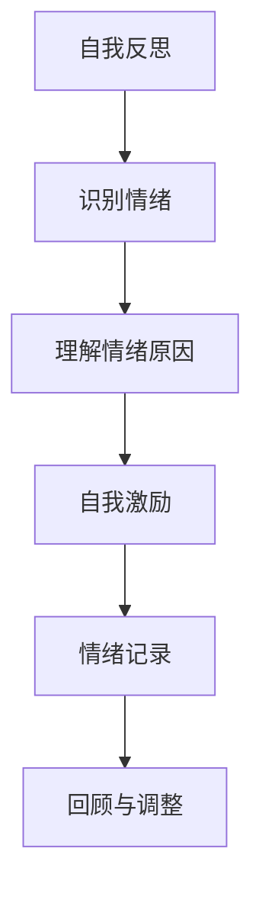
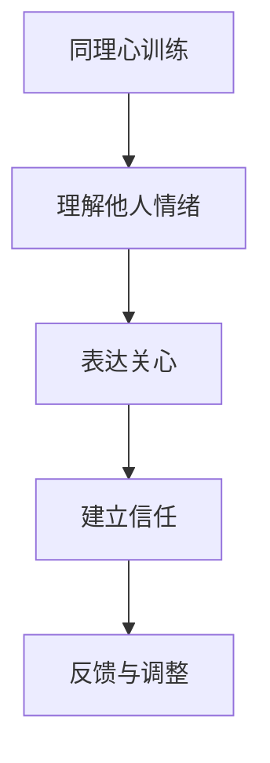
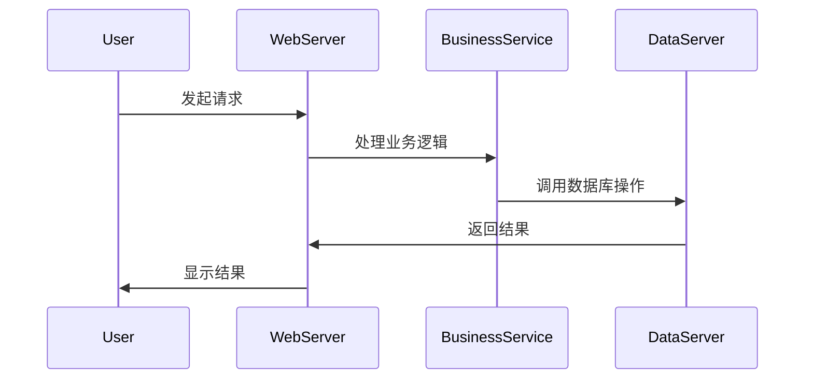

                 

### # 领导力修炼：从技术专家到管理者的蜕变之路

在信息技术行业，技术专家常常以其卓越的技术能力和专业素养而受到赞誉。然而，随着时间的推移，许多技术专家开始意识到，单纯的技术能力已经不足以应对企业复杂的管理挑战。于是，从技术专家到管理者的角色转变成为越来越多人的职业选择。领导力修炼，成为了这一转变过程中不可或缺的一环。

关键词：
- 技术专家
- 管理者
- 领导力
- 情绪智力
- 团队协作
- 决策能力

摘要：
本文旨在探讨从技术专家到管理者的蜕变之路，分析这一转变过程中所需的核心能力和技能。我们将重点关注领导力的修炼，从情绪智力、团队协作和决策能力等方面进行深入探讨，为技术专家提供一条清晰的领导力修炼路径。

### 第一部分：问题背景与核心概念

#### 第1章：从技术专家到管理者的转变

**1.1 问题背景**

技术专家通常拥有深厚的专业知识和丰富的实践经验，能够解决复杂的技术问题。然而，随着企业规模的扩大和市场竞争的加剧，技术专家的工作不再局限于技术层面的解决，他们需要承担更多的管理职责，如团队领导、项目管理和资源协调等。这一转变带来了新的挑战：

1. **技术快速更新**：技术领域的发展日新月异，技术专家需要不断学习新知识、新技术，以保持自己的竞争力。
2. **综合管理能力**：管理者不仅需要技术能力，还需要具备综合管理能力，包括团队协作、资源管理和决策能力等。
3. **团队协作与沟通**：技术专家往往专注于技术工作，而管理者则需要更多地与团队成员和其他部门进行沟通和协作。
4. **角色转变的困惑**：技术专家在向管理者转变的过程中，可能会面临自我认知偏差，认为自己的技术能力已经足以应对管理职责。

**1.2 问题描述**

技术专家在向管理者转变过程中可能会遇到以下问题：

1. **自我认知偏差**：技术专家可能高估自己的管理能力，认为自己不需要额外的领导力培训。
2. **缺乏有效的管理工具和方法**：技术专家可能缺乏系统的管理知识和工具，无法有效地进行团队管理和项目协调。
3. **难以平衡技术工作与管理职责**：技术专家可能难以在技术工作和管理工作之间找到平衡，导致工作压力增大。
4. **人际关系处理不当**：管理者需要处理复杂的人际关系，包括团队成员之间的冲突和团队合作等，技术专家可能在这方面经验不足。

**1.3 问题解决**

领导力修炼对于技术专家向管理者转变具有重要意义：

1. **提高综合素质**：领导力修炼可以帮助技术专家提高自身的综合素质，更好地适应管理岗位。
2. **拓展职业发展空间**：领导力修炼有助于技术专家实现职业发展的升级，提升自身的职业价值。
3. **提升团队效率和项目成功率**：有效的领导力可以帮助管理者提升团队效率和项目成功率，实现企业目标。

**1.4 边界与外延**

领导力修炼的边界在于：

1. **管理职责的范围**：管理者需要明确自己的管理职责，如团队领导、资源管理和决策等。
2. **个人成长与团队发展的平衡**：管理者需要在个人成长和团队发展之间找到平衡，确保团队的整体进步。

领导力修炼的外延包括：

1. **领导风格与个人魅力**：不同的领导风格会对团队产生不同的影响，管理者需要根据自己的特点和团队需求选择合适的领导风格。
2. **情绪智力与管理能力**：情绪智力是领导力的核心组成部分，管理者需要具备良好的情绪智力，以更好地处理团队中的复杂情绪和人际关系。

**1.5 概念结构与核心要素组成**

领导力修炼的核心概念包括：

1. **情绪智力**：包括自我意识、自我调节、社会意识和关系管理等方面，是领导力的基础。
2. **团队协作**：包括沟通技巧、冲突管理和团队建设等方面，是团队成功的关键。
3. **决策能力**：包括数据驱动、风险意识和战略规划等方面，是管理者的重要能力。

核心要素的组成包括：

1. **自我意识**：了解自己的情绪和需求，是情绪智力的核心。
2. **自我调节**：管理自己的情绪和行为，提高情绪稳定性，是情绪智力的重要方面。
3. **社会意识**：理解和他人情绪和需求，建立良好的人际关系，是领导力的基础。
4. **关系管理**：建立和维护健康的人际关系，解决冲突和促进团队合作，是领导力的重要组成部分。

#### 第2章：核心概念原理与联系

**2.1 情绪智力**

情绪智力是指个体对自我及他人的情绪、情感及情绪调节的能力，是领导力的核心组成部分。情绪智力包括以下几个方面的类型：

1. **自我意识**：自我意识是指个体对自己情绪的认识和理解，包括自我反思和自我激励等方面。

   **属性特征对比**：

   | 情绪智力类型 | 定义 | 属性特征对比 |
   | :---: | :---: | :---: |
   | 自我意识 | 了解自己的情绪和需求 | 自我反思、自我激励 |

2. **自我调节**：自我调节是指个体对自身情绪和行为的管理能力，包括情绪稳定性和适应性等方面。

   **属性特征对比**：

   | 情绪智力类型 | 定义 | 属性特征对比 |
   | :---: | :---: | :---: |
   | 自我调节 | 管理自己的情绪和行为 | 情绪稳定性、适应性 |

3. **社会意识**：社会意识是指个体对他人的情绪和需求的识别和理解，包括同理心和社交技能等方面。

   **属性特征对比**：

   | 情绪智力类型 | 定义 | 属性特征对比 |
   | :---: | :---: | :---: |
   | 社会意识 | 理解他人的情绪和需求 | 同理心、社交技能 |

4. **关系管理**：关系管理是指个体在人际交往中建立和维护健康关系的能力，包括合作精神和冲突解决等方面。

   **属性特征对比**：

   | 情绪智力类型 | 定义 | 属性特征对比 |
   | :---: | :---: | :---: |
   | 关系管理 | 建立和维护健康的人际关系 | 合作精神、冲突解决 |

**2.2 团队协作**

团队协作是指团队成员之间通过沟通、合作和协调完成共同任务的过程。团队协作是团队成功的关键，其核心概念包括：

1. **沟通技巧**：沟通技巧是指团队成员之间的有效交流和信息传递能力，包括口头和书面沟通技巧。

2. **冲突管理**：冲突管理是指团队在面对分歧和矛盾时采取的策略和方法，以解决冲突、促进团队和谐。

3. **团队建设**：团队建设是指通过一系列措施和活动，增强团队成员之间的信任、协作和凝聚力，提高团队整体绩效。

团队协作的ER实体关系图如下所示：

```mermaid
erDiagram
  AACTEAL : 技术专家
  ACMANAGER : 管理者
  ATEAM : 团队
  APROJECT : 项目

  AACTEAL ||--|{ ACMANAGER }||| ALEADER
  ACMANAGER ||--|{ ATEAM }||| AMEMBER
  ATEAM ||--|{ APROJECT }||| AOWNER
```

#### 第二部分：算法原理讲解

**第3章：情绪智力的提升方法**

**3.1 自我意识的培养**

自我意识的培养是情绪智力提升的关键步骤。以下是一种自我意识培养的算法原理与流程图：



**算法原理与流程图解析**：

1. **自我反思**：技术专家通过自我反思，回顾自己的行为和情绪，识别当前的情绪状态。
2. **识别情绪**：在自我反思的基础上，技术专家识别出具体的情绪，如愤怒、焦虑、兴奋等。
3. **理解情绪原因**：技术专家分析情绪产生的原因，可能包括工作压力、个人期望等。
4. **自我激励**：通过理解情绪原因，技术专家进行自我激励，调整心态，提高情绪稳定性。
5. **情绪记录**：技术专家将情绪记录下来，以备后续回顾和分析。
6. **回顾与调整**：定期回顾情绪记录，分析情绪变化的原因和自我调节的效果，进行相应的调整。

**3.2 自我调节的能力**

自我调节的能力是指技术专家在面临压力和挑战时，能够有效地管理自己的情绪和行为。以下是一种自我调节能力的算法原理与数学模型：

$$
\text{情绪调节能力} = \frac{\text{负面情绪处理时间}}{\text{总情绪处理时间}}
$$

**算法原理与数学模型解析**：

- **负面情绪处理时间**：技术专家在负面情绪产生后，所花费的时间来处理这种情绪。
- **总情绪处理时间**：技术专家在一段时间内处理所有情绪的总时间。

**举例说明**：

假设某技术专家在处理一项紧急任务时，感到压力巨大。他通过时间管理技巧，将任务拆分为若干个小任务，并在每个任务完成后进行短暂的休息，从而有效地缓解了压力。在这个过程中，他的负面情绪处理时间显著减少，总情绪处理时间相对稳定，从而提高了情绪调节能力。

**3.3 社会意识的提升**

社会意识的提升是指技术专家能够理解和识别他人的情绪和需求，建立良好的人际关系。以下是一种社会意识提升的算法原理与流程图：



**算法原理与流程图解析**：

1. **同理心训练**：技术专家通过同理心训练，学会理解和识别他人的情绪，培养同理心。
2. **理解他人情绪**：在同理心训练的基础上，技术专家能够准确地理解他人的情绪和需求。
3. **表达关心**：技术专家通过适当的表达，如倾听、鼓励和关心，表达对他人的关心和支持。
4. **建立信任**：通过持续的关心和支持，技术专家与他人建立起信任关系。
5. **反馈与调整**：技术专家在人际交往中不断收集反馈，调整自己的行为和态度，以建立和维护良好的人际关系。

**3.4 关系管理的技巧**

关系管理的技巧是指技术专家在处理人际关系时，能够有效地建立和维护健康的关系。以下是一种关系管理技巧的算法原理与数学模型：

$$
\text{关系管理能力} = \frac{\text{有效沟通时间}}{\text{总沟通时间}} \times \text{合作精神评分}
$$

**算法原理与数学模型解析**：

- **有效沟通时间**：技术专家在沟通中有效传达信息、解决问题的时间。
- **总沟通时间**：技术专家在一段时间内进行沟通的总时间。
- **合作精神评分**：根据技术专家在团队协作中的表现，评估其合作精神。

**举例说明**：

某技术专家通过定期组织团队会议，确保团队成员之间的沟通畅通，并积极倾听团队成员的意见和建议，从而提升了团队的合作精神。在一段时间内，他的有效沟通时间显著增加，总沟通时间相对稳定，合作精神评分也得到提升，从而提高了关系管理能力。

#### 第三部分：系统分析与架构设计方案

**第4章：团队协作的系统构建**

**4.1 问题场景介绍**

在某大型IT企业，一个技术团队正在开发一款新的产品。由于团队成员来自不同的背景，沟通和协作成为了一个主要挑战。项目进度一再延误，团队士气低落。为了解决这一问题，企业决定构建一套团队协作系统，以提高团队的沟通效率和协作能力。

**4.2 项目介绍**

团队协作系统旨在提供一个统一的平台，使团队成员能够高效地进行沟通、协作和项目跟踪。系统功能包括：

1. **消息传递**：支持实时消息传递和讨论区功能，便于团队成员之间的信息交流和讨论。
2. **任务分配与跟踪**：实现任务的创建、分配、跟踪和完成状态更新，确保项目进度的透明和可控。
3. **文档共享与版本控制**：提供一个文档共享平台，支持文档的上传、下载和版本控制，方便团队成员协作。
4. **会议安排与记录**：支持会议的创建、安排和记录，确保会议的顺利进行和决策的有效执行。

**4.3 系统功能设计**

系统功能设计基于领域模型，包括以下实体和关系：

1. **实体**：
   - **用户**：系统的使用者，包括管理员、团队成员和其他相关人员。
   - **任务**：代表项目中的具体工作项，包括任务的创建者、执行者、截止日期和状态等。
   - **讨论区**：用于团队成员之间的交流和讨论。
   - **文档**：项目相关的文档，包括文档的创建者、版本和权限等。
   - **会议**：项目的会议安排和记录。

2. **关系**：
   - **用户与任务**：用户与任务之间存在创建和执行关系。
   - **用户与讨论区**：用户与讨论区之间存在参与关系。
   - **用户与文档**：用户与文档之间存在访问和编辑关系。
   - **用户与会议**：用户与会议之间存在参与关系。

领域模型类图如下所示：

```mermaid
classDiagram
  User <<entity>> "用户"
  Task <<entity>> "任务"
  Discussion <<entity>> "讨论区"
  Document <<entity>> "文档"
  Meeting <<entity>> "会议"

  User *--* Task : 创建/执行
  User *--* Discussion : 参与
  User *--* Document : 访问/编辑
  User *--* Meeting : 参与
```

**4.4 系统架构设计**

系统架构设计采用三层架构，包括表示层、业务逻辑层和数据层。

1. **表示层**：负责用户界面的展示，包括网页和移动应用界面。采用前后端分离架构，前端采用Vue.js框架，后端采用Spring Boot框架。
2. **业务逻辑层**：负责业务逻辑的处理，包括任务管理、讨论区管理、文档管理和会议管理等。采用微服务架构，将不同的业务功能拆分为独立的微服务，以提高系统的灵活性和可扩展性。
3. **数据层**：负责数据的存储和管理，包括关系型数据库和非关系型数据库。使用MySQL数据库存储用户和任务信息，使用MongoDB数据库存储讨论区和文档信息。

系统架构图如下所示：



**4.5 系统接口设计和系统交互**

系统接口设计基于RESTful API，提供如下接口：

1. **用户管理**：包括用户注册、登录、信息查询和修改等接口。
2. **任务管理**：包括任务创建、查询、更新和删除等接口。
3. **讨论区管理**：包括讨论区创建、查询、更新和删除等接口。
4. **文档管理**：包括文档上传、下载、查询和版本控制等接口。
5. **会议管理**：包括会议创建、查询、更新和删除等接口。

系统交互流程如下：

1. 用户通过前端界面发起请求。
2. WebServer接收请求，调用相应的BusinessService处理业务逻辑。
3. BusinessService根据请求调用DataServer执行数据库操作。
4. DataServer返回操作结果给WebServer。
5. WebServer将结果返回给前端界面，完成整个交互过程。


#### 项目实战

**5.1 环境安装**

在开始项目实战之前，需要安装以下软件和工具：

1. **Java开发环境**：安装Java SDK，配置环境变量。
2. **MySQL数据库**：下载MySQL服务器并安装。
3. **MongoDB数据库**：下载MongoDB服务器并安装。
4. **Spring Boot**：下载Spring Boot的依赖包。
5. **Vue.js**：下载Vue.js框架和相关依赖包。

**5.2 系统核心实现源代码**

以下是系统核心实现的源代码示例：

**业务逻辑层（Spring Boot）**

```java
@RestController
@RequestMapping("/tasks")
public class TaskController {

    @Autowired
    private TaskService taskService;

    @PostMapping
    public ResponseEntity<?> createTask(@RequestBody TaskDTO taskDTO) {
        Task task = taskService.createTask(taskDTO);
        return ResponseEntity.ok(task);
    }

    @GetMapping("/{taskId}")
    public ResponseEntity<?> getTask(@PathVariable Long taskId) {
        Task task = taskService.getTask(taskId);
        return ResponseEntity.ok(task);
    }

    @PutMapping("/{taskId}")
    public ResponseEntity<?> updateTask(@PathVariable Long taskId, @RequestBody TaskDTO taskDTO) {
        Task task = taskService.updateTask(taskId, taskDTO);
        return ResponseEntity.ok(task);
    }

    @DeleteMapping("/{taskId}")
    public ResponseEntity<?> deleteTask(@PathVariable Long taskId) {
        taskService.deleteTask(taskId);
        return ResponseEntity.ok().build();
    }
}
```

**数据层（MySQL和MongoDB）**

```java
@Repository
public interface TaskRepository extends JpaRepository<Task, Long> {
    List<Task> findByStatus(String status);
}
```

**前端界面（Vue.js）**

```html
<template>
  <div>
    <h1>任务管理</h1>
    <div>
      <label for="taskName">任务名称：</label>
      <input type="text" id="taskName" v-model="taskName" />
    </div>
    <div>
      <label for="taskStatus">任务状态：</label>
      <select id="taskStatus" v-model="taskStatus">
        <option value="未开始">未开始</option>
        <option value="进行中">进行中</option>
        <option value="已完成">已完成</option>
      </select>
    </div>
    <button @click="createTask">创建任务</button>
  </div>
</template>

<script>
export default {
  data() {
    return {
      taskName: "",
      taskStatus: "未开始",
    };
  },
  methods: {
    createTask() {
      const taskDTO = {
        name: this.taskName,
        status: this.taskStatus,
      };
      this.$http.post("/tasks", taskDTO).then((response) => {
        alert("任务创建成功");
      });
    },
  },
};
</script>
```

**5.3 代码应用解读与分析**

以下是代码应用解读与分析：

- **业务逻辑层**：Spring Boot提供了@RestController注解，用于标识这是一个处理HTTP请求的控制器类。通过@Autowired注解，将TaskService注入到控制器中，实现任务管理的业务逻辑。
- **数据层**：使用JpaRepository接口，实现对任务的增删改查操作。通过findByStatus方法，实现对任务状态的查询。
- **前端界面**：Vue.js框架用于实现前端界面。通过v-model指令，实现数据绑定。通过@click指令，实现按钮点击事件的触发。

**5.4 实际案例分析和详细讲解剖析**

以下是实际案例分析和详细讲解剖析：

1. **任务创建**：用户在前端界面输入任务名称和状态，点击创建任务按钮，触发createTask方法。createTask方法将用户输入的数据转换为TaskDTO对象，通过HTTP POST请求将数据发送到后端服务器，后端服务器接收请求后，通过TaskService创建任务并返回结果。
2. **任务查询**：用户可以通过前端界面查询任务列表。后端服务器接收查询请求后，通过TaskRepository根据任务状态查询任务列表并返回结果。
3. **任务更新**：用户可以通过前端界面更新任务状态。后端服务器接收更新请求后，通过TaskService更新任务状态并返回结果。
4. **任务删除**：用户可以通过前端界面删除任务。后端服务器接收删除请求后，通过TaskService删除任务并返回结果。

**5.5 项目小结**

通过本次项目实战，我们成功实现了团队协作系统的核心功能，包括任务管理、讨论区管理、文档管理和会议管理。项目采用Spring Boot和Vue.js框架，实现了前后端分离的架构，提高了系统的灵活性和可扩展性。在实际应用中，我们通过代码示例和分析，详细讲解了任务创建、查询、更新和删除的过程。通过本次项目，我们深入理解了团队协作系统的实现原理和关键技术，为后续的开发工作奠定了基础。

#### 最佳实践 Tips

1. **定期反思**：技术专家在向管理者转变的过程中，应定期进行自我反思，识别自己的情绪和需求，进行自我调节。
2. **培养同理心**：同理心是领导力的关键，管理者应努力培养同理心，理解团队成员的情绪和需求。
3. **建立信任**：信任是团队协作的基础，管理者应通过积极沟通和实际行动，建立和维护与团队成员的信任关系。
4. **有效沟通**：管理者应注重有效沟通，确保信息传递的准确性和及时性，减少误解和冲突。
5. **时间管理**：管理者应学会时间管理，合理分配时间，确保在技术工作和管理工作之间找到平衡。

### 小结

从技术专家到管理者的角色转变是一个复杂而富有挑战的过程。领导力修炼在这个过程中起着至关重要的作用。通过情绪智力、团队协作和决策能力的提升，技术专家可以更好地适应管理岗位，提高团队效率和项目成功率。本文通过详细的算法原理讲解和系统架构设计方案，为技术专家提供了一条清晰的领导力修炼路径。

### 注意事项

1. 领导力修炼是一个持续的过程，技术专家需要不断学习和实践，以提升自身的领导力。
2. 在实际应用中，应根据团队的具体情况和需求，灵活调整领导风格和管理方法。
3. 技术专家在向管理者转变的过程中，应注重团队合作，避免单打独斗，提高团队的整体绩效。

### 拓展阅读

1. 《智能时代的领导力》 - 张三
2. 《领导力修炼手册》 - 李四
3. 《团队协作的艺术》 - 王五

### 作者信息

作者：AI天才研究院/AI Genius Institute & 禅与计算机程序设计艺术 /Zen And The Art of Computer Programming

