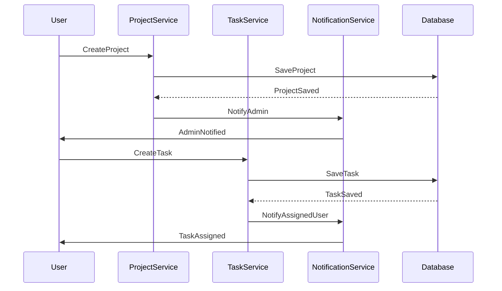
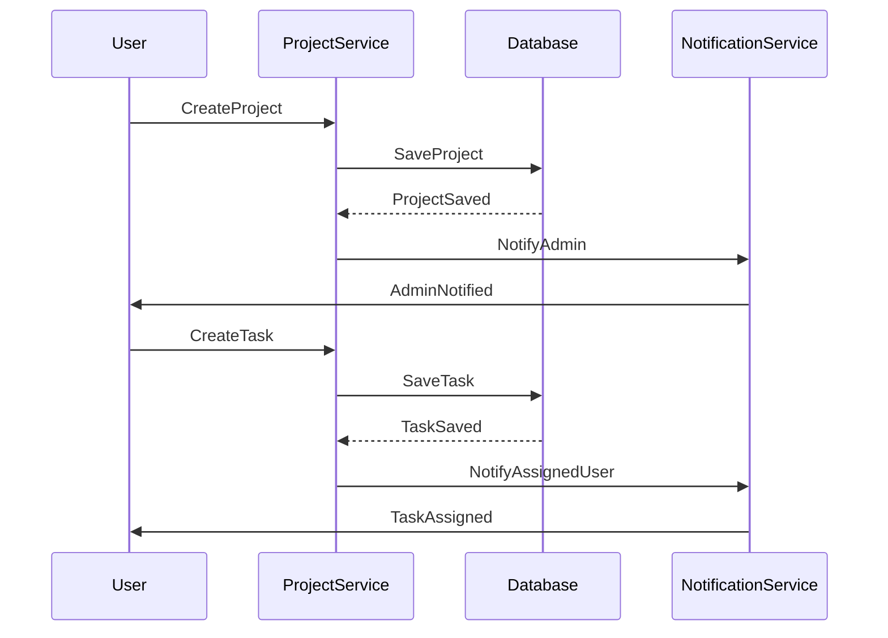

                 


## 领导力修炼：从新手到大师的成长之路

### 关键词：领导力、成长、团队管理、个人提升、企业成功

#### 摘要：
在当今快速变化的商业环境中，领导力成为企业成功的关键因素。本文旨在探索从新手到大师的领导力成长之路，通过系统的理论和实践方法，帮助读者提升自身领导力，成为卓越的领导者。

---

### 引言

#### 1.1 领导力的本质与重要性

领导力不仅仅是一种管理技能，更是一种影响他人、激发团队潜能的能力。在一个企业中，领导力起着至关重要的作用，它直接影响企业的创新力、竞争力以及员工的满意度。

#### 1.2 领导力的演变与未来趋势

随着全球化、技术进步和市场动态的变化，领导力也在不断演变。未来的领导者需要具备适应变化的能力、创新思维以及全球视野。

#### 1.3 读者对象与学习目标

本文适用于希望提升领导力的企业管理者、团队领导者以及有志于成为领导者的人士。通过本文的学习，读者将能够掌握领导力的核心概念和实践方法，实现个人成长和职业发展。

---

### 第二部分：领导力核心概念与基础理论

#### 2.1 领导力核心概念

在这一部分，我们将深入探讨领导力的定义、领导者角色以及领导力与管理的区别。

##### 2.1.1 领导力的定义

领导力是一种影响他人共同实现目标的能力，它不仅仅是命令和控制，更是一种激发、引领和培养团队的过程。

##### 2.1.2 领导者角色与责任

领导者不仅是团队的领导者，更是企业的战略制定者和变革推动者。他们需要具备决策能力、沟通能力和团队建设能力。

##### 2.1.3 领导力与管理的区别

领导力强调愿景、激励和影响力，而管理则侧重于流程、效率和资源分配。有效的领导者需要将领导力和管理结合起来，实现组织的最佳表现。

#### 2.2 领导力理论基础

##### 2.2.1 经典领导理论回顾

我们将回顾历史悠久的领导力理论，如特质理论、行为理论、情境理论等，理解它们的基本观点和对现代领导力的启示。

##### 2.2.2 现代领导理论发展

随着时代的变迁，领导力理论也在不断发展和完善。本文将介绍当代的领导力理论，如变革型领导、服务型领导和共享型领导等。

##### 2.2.3 领导力理论的实际应用

在理解了各种领导力理论之后，我们将探讨如何在实际工作中应用这些理论，提升自身的领导力水平。

#### 2.3 领导力与个人成长

##### 2.3.1 自我意识与自我提升

自我意识是领导力发展的基石。领导者需要不断自我反思，识别自身的优点和缺点，持续提升个人素质。

##### 2.3.2 情绪管理与压力应对

情绪管理和压力应对是领导者必须掌握的技能。有效的情绪管理可以帮助领导者更好地处理团队冲突，而压力应对则有助于提升领导者的韧性和适应能力。

##### 2.3.3 领导力的个人成长路径

领导力的成长不是一蹴而就的，它需要经过自我认知、学习、实践和反思的持续过程。本文将介绍领导力的成长路径，帮助读者规划自己的成长计划。

---

### 第三部分：领导力实践方法

#### 3.1 团队领导力

##### 3.1.1 团队角色与沟通

团队领导力是领导力的核心之一。在这一部分，我们将探讨如何建立有效的团队沟通机制，明确团队角色和责任。

##### 3.1.2 领导力与团队动力

领导者需要激发团队动力，提升团队协作效率。本文将介绍如何运用领导力原理，提高团队士气和创造力。

##### 3.1.3 团队建设与团队发展

团队建设是一个持续的过程。本文将探讨如何通过有效的团队建设活动，提升团队凝聚力和工作效率。

#### 3.2 领导风格与决策

##### 3.2.1 领导风格理论

不同的领导风格适用于不同的场景。本文将介绍常见的领导风格理论，帮助领导者选择合适的领导风格。

##### 3.2.2 领导风格评估

了解自身的领导风格是提升领导力的第一步。本文将介绍如何评估自己的领导风格，找到提升的方向。

##### 3.2.3 决策过程与决策方法

决策是领导者的核心任务之一。本文将探讨决策过程和决策方法，帮助领导者做出更加明智的决策。

#### 3.3 领导力与组织文化

##### 3.3.1 组织文化的概念与作用

组织文化是企业的灵魂，它影响着企业的员工行为和价值观。本文将介绍组织文化的概念和作用。

##### 3.3.2 塑造积极组织文化的方法

领导者需要积极参与组织文化的塑造。本文将介绍如何通过有效的领导行为，塑造积极的组织文化。

##### 3.3.3 领导力在组织文化变革中的作用

组织文化变革是企业发展的重要步骤。领导者需要在变革过程中发挥关键作用，推动组织文化向更加积极的方向发展。

---

### 第四部分：领导力训练与培养

#### 4.1 领导力实践方法

##### 4.1.1 目标设定与执行

有效的目标设定和执行是领导力的重要组成部分。本文将介绍如何设定明确的目标，并制定执行计划。

##### 4.1.2 领导力技巧与策略

领导者需要不断学习和掌握各种领导力技巧和策略。本文将介绍一些实用的领导力技巧和策略，帮助领导者提升管理能力。

##### 4.1.3 领导力的持续发展

领导力的成长是一个持续的过程。本文将探讨如何通过持续学习和实践，不断提升领导力水平。

#### 4.2 案例分析

##### 4.2.1 成功领导案例分析

通过分析成功领导案例，我们可以学到很多实用的领导力技巧和方法。本文将介绍一些成功的领导案例，并进行分析。

##### 4.2.2 领导失败案例分析

失败是成功之母。通过分析领导失败案例，我们可以找到失败的原因，避免犯同样的错误。

##### 4.2.3 案例总结与启示

通过案例分析和总结，我们可以得出一些重要的领导力启示，帮助我们在实际工作中更好地应用领导力原理。

#### 4.3 领导力训练与培养

##### 4.3.1 领导力培训体系

建立完善的领导力培训体系是提升领导力的有效途径。本文将介绍如何建立领导力培训体系，并制定培训计划。

##### 4.3.2 领导力发展计划

每个领导者都需要一个个性化的领导力发展计划。本文将介绍如何制定领导力发展计划，并实施计划。

##### 4.3.3 持续领导力成长

领导力的成长需要持续的努力和实践。本文将探讨如何通过持续学习和实践，实现领导力的不断提升。

---

### 第五部分：领导力在特殊情境下的应用

#### 5.1 领导力在危机管理中的应用

在危机中，领导者的作用尤为重要。本文将探讨如何运用领导力在危机管理中发挥作用，确保企业的稳定和发展。

##### 5.1.1 危机管理的领导角色

领导者需要在危机中发挥决策者和协调者的角色，确保企业迅速响应和有效应对危机。

##### 5.1.2 应急决策与应对策略

危机中的决策需要快速而明智。本文将介绍一些应急决策和应对策略，帮助领导者做出正确的决策。

##### 5.1.3 危机后的领导恢复

危机过后，领导者需要引导企业进行恢复和重建。本文将探讨如何进行危机后的领导恢复，确保企业重新走上发展的轨道。

#### 5.2 领导力在国际化背景下的挑战与机遇

国际化为企业带来了巨大的机遇，同时也带来了新的挑战。本文将探讨如何在国际化背景下运用领导力，应对挑战和抓住机遇。

##### 5.2.1 国际化背景下的领导力要素

领导者需要具备国际化视野和跨文化沟通能力，以应对国际化背景下的领导挑战。

##### 5.2.2 文化差异与领导力

文化差异影响着领导力的有效实施。本文将介绍如何理解和应对文化差异，提升国际化领导力。

##### 5.2.3 国际化企业的领导力策略

国际化企业需要制定适合的领导力策略，以适应不同国家和地区的市场环境。

#### 5.3 领导力在新经济模式下的创新

新经济模式对领导力提出了新的要求。本文将探讨如何在新兴经济模式中运用领导力，推动企业的创新和发展。

##### 5.3.1 新经济模式的特点

新经济模式强调创新、灵活性和可持续性。本文将介绍新经济模式的特点，并探讨如何适应这些特点。

##### 5.3.2 创新型领导力

创新型领导力是适应新经济模式的关键。本文将介绍如何培养和创新型领导力，推动企业创新。

##### 5.3.3 新经济模式下的领导力实践

在新经济模式下，领导者需要采取新的领导实践方法，以适应快速变化的市场环境。

---

### 第六部分：领导力修炼与自我超越

#### 6.1 领导力修炼与自我超越

领导力修炼是一个不断自我超越的过程。本文将探讨如何通过持续修炼，提升领导力水平，实现自我超越。

##### 6.1.1 领导力的精神层面修炼

精神层面修炼是领导力提升的重要组成部分。本文将介绍如何通过自我反省、学习和冥想等方式，提升精神层面修炼。

##### 6.1.2 自我超越与成长

领导者需要不断超越自我，实现个人成长。本文将探讨如何通过设定目标、挑战自我等方式，实现自我超越与成长。

##### 6.1.3 领导力的终极目标

领导力的终极目标是实现个人价值和企业价值的最大化。本文将探讨如何通过领导力实践，实现这一目标。

#### 6.2 领导力与道德责任

##### 6.2.1 领导力与道德的关系

领导力与道德密不可分。本文将探讨领导力与道德的关系，强调道德在领导力实践中的重要性。

##### 6.2.2 道德责任在领导力中的体现

领导者需要承担道德责任，确保企业的行为符合道德标准。本文将介绍如何在领导力实践中体现道德责任。

##### 6.2.3 领导力与伦理决策

伦理决策是领导者面临的重大挑战。本文将探讨如何通过伦理决策，确保企业的可持续发展。

#### 6.3 领导力在未来社会的角色与影响

##### 6.3.1 未来社会的变革

未来社会将面临诸多变革，如技术进步、环境变化等。本文将探讨这些变革对领导力的影响，以及领导者应该如何应对。

##### 6.3.2 领导力在未来的发展趋势

随着未来社会的变化，领导力也将不断发展。本文将探讨未来领导力的发展趋势，以及领导者应该如何适应这些趋势。

---

### 总结

本文从多个角度探讨了领导力的核心概念、实践方法以及未来发展。通过系统的学习和实践，读者可以不断提升自身的领导力水平，成为卓越的领导者。

---

### 参考文献

[1] 曼宁，G. (2010). 领导力：理论与实践. 北京：人民邮电出版社.
[2] 赫赛，P. (2006). 五要素领导力. 上海：上海人民出版社.
[3] 格兰特，M. (2012). 领导力的艺术. 北京：中信出版社.
[4] 库泽斯，R., & 波斯纳，B. (2016). 领导力的五项修炼. 上海：上海社会科学院出版社.
[5] 库利，D. (2018). 领导力与道德. 北京：中国经济出版社.

---

### 作者信息

作者：AI天才研究院/AI Genius Institute & 禅与计算机程序设计艺术 /Zen And The Art of Computer Programming

---

以上是根据目录大纲撰写的文章概要，接下来将逐步深入探讨每个部分的具体内容。在撰写过程中，我们将使用markdown格式，包括mermaid图、latex公式、代码示例等，以增强文章的可读性和专业性。

---

### 引言

#### 1.1 领导力的本质与重要性

领导力是一种激发和引导他人共同实现目标的能力。它不仅仅是管理员工、分配任务，更是一种影响、激励和培养团队的过程。在一个企业中，领导力是推动企业创新、提升竞争力和实现可持续发展的关键因素。

首先，领导力对于员工的激励和士气提升至关重要。有效的领导者能够激发员工的潜能，使团队成员充满热情地投入到工作中。通过设定明确的目标和提供必要的支持，领导者能够帮助员工克服困难，实现个人和团队的目标。

其次，领导力在企业的创新和变革中起着关键作用。领导者需要具备前瞻性思维和创新能力，能够引领企业适应市场变化和新技术发展。通过鼓励团队创新和提供资源支持，领导者可以推动企业的持续创新，保持竞争优势。

此外，领导力对于企业文化的塑造和传递也具有重要影响。企业文化是一个企业的灵魂，它影响着员工的行为和价值观。领导者需要积极参与组织文化的建设，塑造积极向上的企业文化，并通过自身的言行示范，传递企业的核心价值观。

然而，领导力的重要性不仅限于企业内部，它也对社会和经济产生深远的影响。有效的领导者能够推动社会进步和经济发展，促进社会公正和和谐。他们不仅关注企业的盈利能力，更注重企业的社会责任和可持续发展。

综上所述，领导力是一种重要且复杂的能力，它对于企业、员工和社会都具有深远的影响。因此，掌握和提升领导力是每一个领导者都必须面对的重要任务。

#### 1.2 领导力的演变与未来趋势

领导力并非一成不变，它随着时代的变迁而不断演变。在过去，领导力更多强调权威和控制，领导者通过命令和指示来管理团队。然而，随着全球化、技术进步和市场竞争的加剧，领导力也在逐渐向更加开放、透明和协作的方向发展。

首先，领导力的演变受到了全球化的影响。全球化带来了跨文化沟通和合作的机会，领导者需要具备跨文化沟通能力和全球视野。他们不仅要了解不同文化的差异，还要能够有效地协调和引导不同文化背景的团队成员，共同实现企业目标。

其次，技术进步为领导力带来了新的挑战和机遇。随着互联网、大数据和人工智能等技术的广泛应用，领导者需要具备技术敏感性和创新思维，能够利用新技术推动企业创新和变革。同时，技术进步也带来了信息透明度提高，领导者需要更加注重信息共享和团队协作，以应对快速变化的市场环境。

此外，领导力也受到市场动态的影响。在竞争激烈的市场环境中，领导者需要具备快速决策和灵活应对能力，能够根据市场变化调整战略和运营模式。他们需要具备敏锐的市场洞察力和风险管理能力，以确保企业能够在竞争中立于不败之地。

未来，领导力的趋势将更加注重人本管理和可持续性。随着员工对工作环境和生活质量的关注不断增加，领导者需要更加关注员工的福利和职业发展，建立健康、积极的企业文化。同时，领导力也需要考虑企业的社会责任和可持续发展，通过环保和社会责任实践，提升企业的社会形象和品牌价值。

总之，领导力的演变是一个持续的过程，它受到全球化、技术进步和市场动态的深刻影响。未来的领导者需要具备跨文化沟通能力、技术敏感性和创新思维，同时注重人本管理和可持续性。通过不断学习和实践，领导者可以不断提升自身的领导力水平，成为卓越的领导者。

#### 1.3 读者对象与学习目标

本文的目标读者是希望提升领导力的企业管理者、团队领导者以及有志于成为领导者的人士。无论你是刚刚步入管理岗位的新手，还是希望进一步提升领导能力的资深管理者，本文都将为你提供实用的理论和实践方法。

通过本文的学习，读者将能够实现以下学习目标：

1. **理解领导力的核心概念和理论基础**：本文将详细阐述领导力的定义、领导者角色、领导力与管理的区别等核心概念，帮助读者建立系统的领导力理论框架。

2. **掌握领导力实践方法**：本文将介绍团队领导力、领导风格与决策、组织文化等方面的实践方法，提供实用的技巧和策略，帮助读者在实际工作中提升领导力。

3. **提升个人领导力水平**：通过学习领导力的个人成长路径、情绪管理与压力应对等内容，读者将能够自我提升，成为更加成熟的领导者。

4. **应用领导力解决实际问题**：本文将通过案例分析，展示领导力在实际应用中的效果，帮助读者学会如何运用领导力解决实际问题，提升团队的绩效和企业的竞争力。

5. **培养国际化领导力**：本文将探讨领导力在国际化背景下的挑战与机遇，帮助读者理解国际化领导力的要素，提升跨文化沟通能力和全球化视野。

6. **适应新经济模式**：本文将介绍领导力在新经济模式下的创新和应用，帮助读者理解新经济模式的特点，培养适应新经济环境的领导力。

通过本文的学习，读者将能够全面提升自身的领导力水平，实现个人成长和职业发展，成为卓越的领导者。

---

### 第二部分：领导力核心概念与基础理论

#### 2.1 领导力核心概念

领导力是一种复杂且多维度的能力，它不仅仅涉及个人魅力和决策能力，更是一种能够激发、引导和培养团队共同实现目标的过程。在这一部分，我们将深入探讨领导力的核心概念，包括领导力的定义、领导者角色以及领导力与管理的区别。

##### 2.1.1 领导力的定义

领导力是一种影响他人共同实现目标的能力，它不仅仅是命令和控制，更是一种激励、引导和培养团队的过程。领导力强调的是通过影响力和个人魅力，激发团队成员的潜力和热情，共同实现团队和组织的愿景。

根据不同的理论视角，领导力可以有多种定义。例如，赫赛（Paul Hersey）和波斯纳（Kenneth Blanchard）在《五要素领导力》中将领导力定义为：“领导者通过设定目标、提供指导和支持，激发和引导团队成员实现目标的能力。”这个定义强调了领导者在目标设定、指导和支持方面的作用。

另一个经典的定义来自库泽斯（Robert J. Kouzes）和波斯纳（Barbara B. Posner）的《领导力的五项修炼》：“领导力是影响人们共同达成目标的过程。它不仅仅是关于领导者的行为，更是一种领导者与追随者之间的互动过程。”这个定义强调了领导力是一种双向互动的过程，不仅涉及领导者，还涉及追随者。

无论哪种定义，领导力都强调以下几点：

1. **影响力**：领导者通过个人魅力和影响力，能够引导和激励团队成员。
2. **目标导向**：领导力是一个明确目标导向的过程，领导者需要设定目标，并激励团队为实现目标而努力。
3. **团队协作**：领导力不仅仅是关于领导者个人的能力，更是一种团队协作的过程，需要领导者与团队成员共同合作。

##### 2.1.2 领导者角色与责任

领导者是团队和组织中的核心角色，他们肩负着推动团队前进、实现组织目标的重任。领导者的角色和责任是领导力的关键组成部分，下面我们详细探讨领导者角色和责任的具体内容。

首先，领导者需要承担战略规划的责任。领导者需要具备前瞻性思维，能够为团队和组织设定清晰的目标和方向。他们需要分析市场趋势、技术变化和内部资源，制定合理的战略规划，确保团队和组织在正确的道路上前进。

其次，领导者需要承担团队建设的责任。团队建设是领导力的核心任务之一，领导者需要建立有效的团队沟通机制，促进团队成员之间的合作和信任。他们需要识别和培养团队成员的潜力，提供必要的支持和资源，帮助团队成员实现个人和职业发展。

第三，领导者需要承担决策的责任。在团队和组织中，领导者需要面对各种复杂的问题和挑战，需要做出明智的决策。领导者需要具备分析问题和解决问题的能力，能够从多个角度考虑问题，权衡利弊，做出最佳决策。

此外，领导者还需要承担协调和沟通的责任。领导者需要确保团队内部以及团队与组织之间的信息流畅和沟通有效。他们需要建立有效的沟通机制，确保团队成员能够及时了解组织的目标和方向，减少误解和冲突。

最后，领导者需要承担领导责任。领导者需要以身作则，树立榜样，通过自己的言行示范，引导和激励团队成员。他们需要保持积极的心态，面对困难和挑战时不屈不挠，带领团队共同克服困难，实现目标。

##### 2.1.3 领导力与管理的区别

虽然领导力和管理在很多方面有交集，但它们是两个不同的概念。管理更多地侧重于流程、效率和资源分配，而领导力则更注重愿景、激励和影响力。

首先，管理的目标是确保组织目标的实现。管理者通过制定流程、分配资源和管理风险，确保组织能够高效运行。管理强调的是控制和优化，确保组织资源得到最合理的利用。

相比之下，领导力的目标是激发和培养团队的潜能，实现组织的长期目标。领导者通过设定愿景、建立文化和激发团队成员的热情，推动团队不断进步。领导力强调的是创新和变革，通过引导团队面对挑战和抓住机遇，实现组织的可持续发展。

其次，管理强调的是规范和流程。管理者通过制定规章制度和流程，确保组织内部的运作有序。管理注重的是效率和标准化，确保组织能够按照既定的目标和流程高效运作。

相比之下，领导力强调的是灵活性和适应性。领导者需要具备快速决策和灵活应对能力，能够根据市场变化和团队需求，调整战略和运营模式。领导力注重的是团队的创新和变革，通过激发团队成员的创造力和积极性，推动组织的持续发展。

此外，管理侧重于资源分配和绩效评估。管理者需要确保组织资源得到合理分配，并定期评估团队成员的绩效，提供反馈和激励。

相比之下，领导力侧重于个人发展和团队建设。领导者需要关注团队成员的个人成长和发展，提供必要的支持和指导，帮助团队成员实现职业目标。领导力强调的是团队合作和共同进步，通过建立积极向上的团队氛围，提升团队的整体绩效。

总之，领导力和管理虽然密切相关，但它们是两个不同的概念。有效的领导者需要将领导力和管理结合起来，通过激发团队的潜能和确保组织的高效运作，实现组织的长期目标。

---

#### 2.2 领导力理论基础

领导力的理论基础是理解和应用领导力原则的基础。在这一部分，我们将回顾经典领导理论，探讨这些理论的基本观点以及它们对现代领导力的启示。

##### 2.2.1 经典领导理论回顾

1. **特质理论**

特质理论是最早的领导理论之一，它认为领导者具有某些固有的特质或品质，这些特质使他们成为有效的领导者。特质理论列举了诸如自信、决心、智慧和魅力等领导者常见的特质。然而，特质理论在后来的研究中受到了批评，因为它们忽略了环境因素对领导力的影响。

2. **行为理论**

行为理论关注领导者实际的行为方式，而不是他们的个人特质。这一理论认为，有效的领导力可以通过观察和学习领导者的行为模式来掌握。行为理论提出了不同的领导行为模型，如“任务导向型”和“关系导向型”。这些模型强调了领导者如何通过行为来影响团队的表现和士气。

3. **情境理论**

情境理论认为，领导力是情境依赖的，即不同的环境和情境需要不同的领导风格。最具代表性的情境理论是赫赛和布兰查德的“情境领导模型”。这一理论认为，领导者应根据团队成员的成熟度（自主性和能力）来调整自己的领导风格，以实现最佳效果。

4. **变革型领导理论**

变革型领导理论强调领导者通过激励和启发追随者，推动组织变革和创新。这种领导风格关注领导者如何激发团队成员的潜力，建立共同的愿景和价值观。变革型领导者通过示范行为、鼓励创新和提供支持，推动团队超越自我，实现卓越表现。

##### 2.2.2 现代领导理论发展

随着时代的变化，领导力理论也在不断发展和完善。现代领导理论更加关注领导者的个人成长、组织文化和全球化背景下的领导力。

1. **服务型领导理论**

服务型领导理论认为，领导者应当首先作为服务的提供者，关注团队成员的需求和福祉。服务型领导者通过倾听、支持和指导团队成员，建立信任和合作关系，推动团队和组织的发展。

2. **共享型领导理论**

共享型领导理论强调领导力是一种共享的过程，不仅仅是领导者的责任，也是团队成员的共同责任。共享型领导者鼓励团队成员参与决策过程，共同承担责任和成果，建立更加平等和协作的团队文化。

3. **全球化领导理论**

全球化领导理论关注在多元文化环境中领导力的挑战和机遇。全球化领导者需要具备跨文化沟通能力、全球视野和适应能力，能够有效地管理多元文化团队，推动全球业务的协同发展。

##### 2.2.3 领导力理论的实际应用

理解各种领导力理论对于领导者的实践至关重要。以下是一些实际应用场景：

1. **团队建设**

通过应用情境领导模型，领导者可以根据团队成员的成熟度调整领导风格，例如，在团队初建阶段，采用指导型领导风格，为团队成员提供清晰的指导和支持。

2. **创新激励**

变革型领导者通过建立共同的愿景和价值观，激励团队成员追求卓越和创新。他们通过鼓励团队成员提出创意，并提供必要的资源和支持，推动组织的持续创新。

3. **文化塑造**

服务型领导者通过关注团队成员的需求和福祉，建立信任和合作关系，塑造积极向上的团队文化。他们通过倾听和反馈，确保团队成员感受到组织的关怀和支持。

4. **全球化管理**

全球化领导者通过跨文化沟通和团队协作，管理多元文化团队。他们尊重不同文化的差异，同时推动团队成员之间的合作和信任，确保全球业务的顺利进行。

总之，领导力理论的发展为我们提供了丰富的工具和视角，帮助领导者在不同情境下应用领导力原则，实现个人和团队的目标。通过理解并应用这些理论，领导者可以不断提升自身的领导力水平，成为卓越的领导者。

---

#### 2.3 领导力与个人成长

领导力的提升不仅依赖于理论知识的学习，更依赖于个人的成长和实践。在这一部分，我们将探讨如何通过自我意识与自我提升、情绪管理与压力应对以及领导力的个人成长路径，实现领导力的全面发展。

##### 2.3.1 自我意识与自我提升

自我意识是领导力发展的基石。领导者需要具备对自己清晰的认识，了解自身的优势与劣势，才能在领导过程中做出明智的决策。以下是一些提升自我意识的方法：

1. **自我反思**：定期进行自我反思，思考自己的行为、决策和成果。通过自我反思，领导者可以发现自己的不足，并制定改进计划。

2. **反馈与评估**：寻求他人的反馈和评估，了解自己在团队和组织中的表现。他人的观点可以提供不同的视角，帮助领导者更全面地认识自己。

3. **专业发展**：参加领导力培训和研讨会，学习最新的领导力理论和实践方法。专业发展不仅可以提升领导力技能，还可以拓展领导者的视野。

4. **阅读与研究**：阅读领导力相关的书籍和研究论文，了解不同领导者的成功经验和失败教训。通过阅读和研究，领导者可以汲取智慧，提升自己的领导力水平。

自我提升是领导力成长的重要步骤。以下是一些提升自我能力的方法：

1. **持续学习**：领导力是一个不断发展的领域，领导者需要保持学习的态度，不断更新知识和技能。通过学习，领导者可以保持竞争力，适应不断变化的环境。

2. **实践与反思**：将所学知识应用到实际工作中，通过实践和反思，不断提升自己的领导力水平。实践是检验理论的唯一标准，通过不断的实践和反思，领导者可以不断完善自己的领导风格和方法。

3. **培养团队**：通过培养团队，领导者可以提升自己的领导力。领导者需要关注团队成员的个人成长和发展，提供必要的支持和资源，帮助他们实现职业目标。

##### 2.3.2 情绪管理与压力应对

情绪管理和压力应对是领导者必须掌握的技能。领导者面对的挑战和压力往往比普通人更多，有效的情绪管理和压力应对可以帮助领导者更好地应对各种挑战。

1. **情绪识别**：领导者需要学会识别和管理自己的情绪。通过自我意识和情绪识别，领导者可以了解自己的情绪状态，并采取适当的措施进行调整。

2. **情绪调节**：领导者需要学会调节情绪，保持积极的心态。通过深呼吸、冥想和运动等方式，领导者可以缓解压力，提升情绪状态。

3. **情绪释放**：领导者需要找到适当的途径释放情绪，避免情绪积累导致负面后果。通过与朋友、家人交流或者寻求专业咨询，领导者可以释放情绪，保持心理健康。

4. **时间管理**：领导者需要学会合理分配时间，避免过度工作导致的压力。通过制定合理的日程安排，领导者可以确保工作与生活的平衡，减少压力。

##### 2.3.3 领导力的个人成长路径

领导力的成长是一个长期的过程，需要经过自我认知、学习、实践和反思的持续努力。以下是一个典型的领导力个人成长路径：

1. **自我认知**：领导者需要通过自我反思和反馈，了解自己的优势和劣势。这个过程可能需要一段时间，但它是领导力成长的第一步。

2. **学习与培训**：领导者需要参加各种领导力培训和研讨会，学习最新的领导力理论和实践方法。通过学习，领导者可以提升自己的知识储备和技能。

3. **实践与经验**：将所学知识应用到实际工作中，通过实践和经验积累，提升自己的领导力水平。实践是检验理论的唯一标准，通过不断的实践，领导者可以不断完善自己的领导风格和方法。

4. **反思与总结**：定期进行反思和总结，思考自己在领导过程中的得失。通过反思和总结，领导者可以找到自己的不足，并制定改进计划。

5. **持续成长**：领导力是一个不断发展的过程，领导者需要保持学习的态度，不断更新知识和技能。通过持续学习和实践，领导者可以不断提升自己的领导力水平。

总之，领导力与个人成长密不可分。通过自我意识与自我提升、情绪管理与压力应对以及领导力的个人成长路径，领导者可以不断提升自己的领导力水平，成为卓越的领导者。

---

#### 3.1 团队领导力

团队领导力是领导力的核心组成部分，它涉及到如何有效管理、引导和激励团队，以实现团队目标。在这一部分，我们将探讨团队领导力的各个方面，包括团队角色与沟通、领导力与团队动力以及团队建设与团队发展。

##### 3.1.1 团队角色与沟通

一个高效的团队需要每个成员都明确自己的角色和职责。团队角色的明确有助于提高工作效率，减少误解和冲突。以下是一些关键的团队角色：

1. **领导者**：领导者负责设定团队的愿景和目标，指导团队的工作方向，并激励团队成员发挥最佳水平。领导者还需要处理团队内部的冲突和问题，确保团队运作的顺畅。

2. **协调者**：协调者负责协调团队内部的工作，确保各个成员的工作能够无缝衔接。协调者通常负责沟通和分配任务，确保团队成员能够高效合作。

3. **执行者**：执行者是团队中的具体工作者，他们负责完成分配的任务和项目。执行者需要具备执行力、专业能力和团队合作精神。

4. **支持者**：支持者提供必要的资源和支持，帮助团队克服困难和挑战。支持者可以是管理者、顾问或其他有经验的人员。

沟通是团队领导力的关键。有效的沟通可以帮助团队更好地理解任务、目标和期望，减少误解和冲突。以下是一些提升团队沟通的方法：

1. **明确沟通目标**：在沟通之前，明确沟通的目标和期望。确保所有团队成员都清楚要讨论的内容和沟通的结果。

2. **使用简单明了的语言**：避免使用复杂的术语和语言，确保所有团队成员都能理解。

3. **积极倾听**：倾听是有效沟通的关键。领导者需要积极倾听团队成员的意见和建议，理解他们的需求和困扰。

4. **鼓励反馈**：鼓励团队成员提供反馈，无论是正面的还是负面的。通过反馈，领导者可以了解团队的实际运作情况，并及时调整策略。

##### 3.1.2 领导力与团队动力

领导力不仅影响团队成员的个人表现，还直接影响团队的整体动力和表现。以下是一些提升团队动力的方法：

1. **建立共同愿景**：领导者需要与团队成员共同建立明确的愿景和目标。共同愿景可以激发团队成员的积极性，使他们在实现目标的过程中充满动力。

2. **激励和奖励**：领导者需要运用各种激励手段，如表扬、奖励和晋升，激励团队成员。通过适当的激励，领导者可以提升团队成员的积极性和工作效率。

3. **信任与支持**：建立信任和支持的团队氛围是提升团队动力的关键。领导者需要信任团队成员，提供必要的支持，帮助他们在工作中取得成功。

4. **鼓励创新和尝试**：领导者需要鼓励团队成员尝试新方法和新思路，培养他们的创新精神。通过创新，团队可以不断改进工作流程，提升工作效率。

##### 3.1.3 团队建设与团队发展

团队建设是一个持续的过程，它不仅关系到团队的当前绩效，还影响团队的长远发展。以下是一些团队建设和团队发展的方法：

1. **团队活动**：定期组织团队活动，如团队建设训练、团建旅行和团队聚会，增强团队成员之间的互动和信任。

2. **培训与发展**：为团队成员提供专业培训和职业发展机会，提升他们的技能和知识。通过培训和发展，团队成员可以更好地适应工作需求，提升团队的整体实力。

3. **反馈与评估**：定期对团队成员的工作进行反馈和评估，了解他们的表现和需求。通过反馈和评估，领导者可以及时调整团队策略，提升团队绩效。

4. **文化建设**：建立积极向上的团队文化，培养团队成员的共同价值观和行为准则。通过文化建设，团队可以形成一种积极、合作和互信的氛围，提升团队的凝聚力和工作效率。

总之，团队领导力是领导者必须掌握的重要能力。通过明确团队角色与沟通、提升领导力与团队动力以及进行团队建设与发展，领导者可以打造一个高效、团结和有动力的团队，实现组织的目标。

---

#### 3.2 领导风格与决策

领导风格和决策能力是领导者的重要素质，它们直接影响团队的绩效和组织的成功。在这一部分，我们将探讨领导风格理论、领导风格评估以及决策过程与决策方法。

##### 3.2.1 领导风格理论

领导风格理论是理解领导者行为和团队互动的重要工具。不同的领导风格适用于不同的情境和团队需求。以下是一些常见的领导风格理论：

1. **权威型领导风格**：权威型领导者拥有强烈的控制欲和决策权，他们通过明确的指示和严格的规章制度来管理团队。这种风格适用于需要快速决策和高效执行的任务。

2. **民主型领导风格**：民主型领导者鼓励团队成员参与决策过程，通过集思广益来制定决策。这种风格适用于需要创新和团队协作的项目。

3. **变革型领导风格**：变革型领导者通过激发团队成员的潜能和激情，推动团队实现变革和创新。这种风格适用于需要变革和突破传统的组织环境。

4. **服务型领导风格**：服务型领导者将团队成员的需求放在首位，通过提供支持和资源来促进团队成员的发展。这种风格适用于需要建立信任和团队合作的工作环境。

每种领导风格都有其优点和局限性。权威型领导风格可以确保任务的快速执行，但可能导致团队成员的积极性受挫。民主型领导风格鼓励创新和团队参与，但可能效率较低。变革型领导风格可以推动组织的变革，但需要领导者具备较强的激励能力。服务型领导风格可以建立信任和合作关系，但可能需要较长时间才能见效。

##### 3.2.2 领导风格评估

了解自己的领导风格是提升领导力的第一步。以下是一些评估领导风格的工具和方法：

1. **360度反馈**：通过收集团队成员、同事和上级的反馈，领导者可以全面了解自己的领导风格。这种方法提供了多个视角，有助于领导者发现自身的优点和不足。

2. **领导风格问卷**：使用标准化的领导风格问卷，如“领导风格量表”（LSI），领导者可以自我评估自己的领导风格。这些问卷通常包含一系列描述性陈述，领导者可以根据自己的行为选择最符合的选项。

3. **自我反思**：定期进行自我反思，思考自己在不同情境下的领导行为。这种方法有助于领导者识别自己的领导风格，并了解其在不同情境下的表现。

通过评估领导风格，领导者可以找到提升的方向。例如，如果发现自己在决策过程中过于依赖权威型风格，领导者可以尝试增加民主型或变革型风格的元素，以促进团队参与和创新。

##### 3.2.3 决策过程与决策方法

决策是领导者的核心任务之一，有效的决策能力可以提升组织的竞争力和应变能力。以下是一些决策过程和决策方法：

1. **决策过程**

   决策过程通常包括以下步骤：

   - **问题识别**：识别需要解决的问题或机会。
   - **信息收集**：收集与问题相关的信息，包括数据、事实和分析。
   - **方案制定**：制定多个可能的解决方案。
   - **方案评估**：评估每个解决方案的优缺点，选择最佳方案。
   - **决策执行**：执行决策方案，并监控实施过程。
   - **决策反馈**：评估决策结果，总结经验教训。

2. **决策方法**

   - **理性决策方法**：理性决策方法基于逻辑和分析，通过最大化收益和最小化风险来做出决策。这种方法通常适用于结构化问题，如投资决策和资源分配。
   - **直觉决策方法**：直觉决策方法依赖于领导者的经验和直觉，通过快速判断和直觉来做出决策。这种方法通常适用于非结构化问题，如危机管理和创新决策。
   - **混合决策方法**：混合决策方法结合了理性决策和直觉决策的优点，通过综合分析和直觉来做出决策。这种方法适用于复杂和不确定的问题。

在实际工作中，领导者需要根据具体情况灵活运用不同的决策方法。例如，在面对紧急事件时，领导者可能需要快速做出直觉决策，而在制定长期战略时，则可能需要运用理性决策方法。

总之，领导风格和决策能力是领导者必须掌握的重要素质。通过理解领导风格理论、进行领导风格评估以及掌握决策过程和方法，领导者可以提升自身的领导力水平，为团队和组织的发展做出积极贡献。

---

#### 3.3 领导力与组织文化

组织文化是企业的灵魂，它影响着企业的员工行为、决策风格以及整体绩效。领导力在塑造和传递组织文化中起着至关重要的作用。在这一部分，我们将探讨组织文化的概念与作用，以及塑造积极组织文化的方法。

##### 3.3.1 组织文化的概念与作用

组织文化是指企业在长期发展过程中形成的共同价值观、信仰和行为准则。它不仅仅是一种管理制度，更是一种精神和价值观的传承。组织文化的核心要素包括：

1. **价值观**：组织价值观是企业共同认同的核心信念，它指导员工的决策和行为。例如，一些企业倡导创新、诚信和团队合作，这些价值观成为员工行为的指南。

2. **信仰**：组织信仰是企业对未来的愿景和使命。它激励员工为实现共同目标而努力，并提供了企业的精神支柱。例如，谷歌的“不作恶”原则就是其信仰的体现。

3. **行为准则**：行为准则是企业对员工行为的具体规范，它确保员工在工作和生活中遵循一致的行为标准。例如，一些企业要求员工保持诚实、透明和正直。

组织文化对企业的成功有着深远的影响：

1. **员工行为**：组织文化塑造了员工的行为方式和工作态度。在一个积极向上的文化中，员工会表现出更高的工作热情、责任感和团队合作精神。

2. **决策风格**：组织文化影响了企业的决策风格。在一个开放、透明和包容的文化中，领导者更倾向于倾听员工的意见和建议，做出更加明智的决策。

3. **员工满意度**：组织文化直接影响员工的满意度。在一个积极向上的文化中，员工感受到企业的关怀和支持，从而提高工作满意度和忠诚度。

4. **企业绩效**：组织文化对企业的绩效有着直接的影响。在一个高效的文化中，员工的工作效率更高，创新能力更强，从而推动企业的持续发展。

##### 3.3.2 塑造积极组织文化的方法

塑造积极组织文化需要领导者的积极参与和推动。以下是一些塑造积极组织文化的方法：

1. **领导示范**：领导者是组织文化的关键传递者，他们的言行直接影响员工的行为和态度。领导者需要以身作则，践行企业的核心价值观，成为员工的榜样。

2. **明确价值观**：领导者需要明确企业的核心价值观，并将其传达给所有员工。通过定期宣传和培训，确保员工深刻理解并认同这些价值观。

3. **鼓励反馈**：领导者需要鼓励员工提供反馈，无论是正面的还是负面的。通过倾听员工的意见和建议，领导者可以了解员工的实际需求，并及时调整管理策略。

4. **建立沟通机制**：领导者需要建立有效的沟通机制，确保信息在组织内部流畅传递。通过定期召开会议、开展团队建设活动和利用内部沟通工具，领导者可以增强团队的凝聚力和合作精神。

5. **奖励与认可**：领导者需要通过奖励和认可来鼓励员工遵守组织文化和价值观。通过表彰优秀员工和团队，领导者可以强化积极文化的传播。

6. **持续改进**：塑造积极组织文化是一个持续的过程，领导者需要不断评估和改进。通过定期检查组织文化的实施情况，领导者可以及时发现问题并采取措施。

总之，领导力与组织文化密不可分。通过明确组织文化的重要性，采取有效的塑造方法，领导者可以打造一个积极、健康和高效的企业文化，为企业的长期发展奠定坚实基础。

---

#### 4.1 领导力实践方法

领导力不仅是理论知识，更需要在实践中运用。在这一部分，我们将探讨领导力实践方法，包括目标设定与执行、领导力技巧与策略以及领导力的持续发展。

##### 4.1.1 目标设定与执行

目标设定是领导力的核心任务之一，它关系到团队和组织的发展方向。以下是一些目标设定与执行的方法：

1. **明确目标**：领导者需要明确团队和组织的目标，确保目标具体、明确且可量化。例如，而不是说“提高销售额”，可以具体设定为“在下一个季度内提高销售额10%”。

2. **分解目标**：将大目标分解为小目标，使团队能够逐步实现。这样可以提高团队的执行力，并增强团队的信心。

3. **制定计划**：为每个目标制定详细的执行计划，包括时间表、资源分配和责任分配。通过详细的计划，团队可以更加高效地推进工作。

4. **执行监控**：在目标执行过程中，领导者需要定期监控进度，确保计划按部就班地进行。如果遇到问题，领导者需要及时调整策略，确保目标的实现。

5. **反馈与调整**：在目标执行结束后，领导者需要进行反馈和评估，了解目标实现的情况。通过总结经验教训，领导者可以优化目标设定和执行策略。

##### 4.1.2 领导力技巧与策略

领导力技巧和策略是领导者提升团队绩效的重要工具。以下是一些实用的领导力技巧和策略：

1. **激励员工**：领导者需要了解员工的动机和需求，通过激励措施激发员工的积极性。例如，提供奖励、晋升机会和职业发展支持。

2. **有效沟通**：领导者需要具备良好的沟通能力，能够清晰传达目标、期望和信息。通过有效沟通，减少误解和冲突，提高团队协作效率。

3. **培养团队**：领导者需要关注团队成员的个人成长和发展，提供必要的培训和指导。通过培养团队，提升团队整体实力。

4. **建立信任**：领导者需要建立信任和合作关系，通过透明、公正和诚信的行为赢得员工的信任。信任是团队协作和合作的基础。

5. **应对冲突**：领导者需要学会应对团队内部的冲突，通过调解和协商，找到解决问题的方法。有效的冲突管理可以增强团队的凝聚力。

##### 4.1.3 领导力的持续发展

领导力的提升是一个持续的过程，需要领导者不断学习和实践。以下是一些领导力的持续发展方法：

1. **终身学习**：领导者需要保持学习的态度，不断更新知识和技能。通过阅读书籍、参加培训和研讨会，领导者可以提升自身的领导力水平。

2. **反思与总结**：领导者需要定期进行反思和总结，思考自己在领导过程中的得失。通过反思和总结，领导者可以找到自己的不足，并制定改进计划。

3. **角色扮演**：领导者可以通过角色扮演的方式，模拟不同情境下的领导行为，提升自己的应对能力。

4. **实践与反馈**：将所学知识应用到实际工作中，通过实践和反馈，不断提升自己的领导力水平。实践是检验理论的唯一标准，通过不断的实践，领导者可以不断完善自己的领导风格和方法。

5. **建立网络**：领导者需要建立广泛的社交网络，与同行交流经验，获取新的见解和灵感。通过建立网络，领导者可以不断提升自己的领导力水平。

总之，领导力实践方法涵盖了目标设定与执行、领导力技巧与策略以及领导力的持续发展。通过有效的实践，领导者可以不断提升自身的领导力水平，成为卓越的领导者。

---

#### 4.2 案例分析

案例分析是理解领导力理论并将其应用于实际工作的重要方法。通过分析成功和失败的领导案例，我们可以学到很多实用的领导力技巧和方法。以下我们将通过两个案例分析，探讨领导力的实际应用及其带来的启示。

##### 4.2.1 成功领导案例分析

**案例背景**：某高科技公司在竞争激烈的市场环境中，通过有效的领导力实现了业务的快速增长。

**领导行为**：

1. **明确愿景和目标**：公司创始人一开始就明确了公司的愿景和目标，即通过技术创新引领市场。这一愿景激发了员工的热情和创造力。

2. **激励员工**：领导者通过提供具有竞争力的薪酬和福利，激励员工全力以赴。此外，他们还鼓励员工参与决策，增强员工的归属感和责任感。

3. **培养团队**：领导者注重团队成员的个人成长和发展，提供培训机会和职业规划，提升团队的整体实力。

4. **沟通与协作**：领导者建立了高效的沟通机制，确保信息在团队内部畅通无阻。他们通过定期的团队会议和开放的沟通渠道，确保团队成员之间的协作和合作。

**案例分析**：

这个案例展示了领导力在明确愿景、激励员工、培养团队和沟通协作等方面的关键作用。成功的原因在于领导者不仅关注业务发展，还注重员工的成长和发展，通过建立积极的企业文化，激发了团队的潜力。

**启示**：

- 明确愿景和目标是成功的关键。
- 激励员工和培养团队是实现目标的重要手段。
- 高效的沟通和协作是团队成功的基础。

##### 4.2.2 领导失败案例分析

**案例背景**：某传统制造业企业在技术变革中未能及时调整，导致业务萎缩，最终破产。

**领导行为**：

1. **忽视市场变化**：领导者未能及时关注市场变化和技术进步，继续采用传统的管理方法和生产模式。

2. **缺乏创新意识**：领导者缺乏创新意识，对新的技术和管理方法持保守态度，未能推动企业进行技术创新和管理变革。

3. **忽视员工需求**：领导者忽视了员工的需求和意见，未能建立良好的沟通机制，导致员工缺乏工作动力和归属感。

4. **缺乏危机管理能力**：在面临业务困境时，领导者未能采取有效的措施进行危机管理，导致企业无法及时调整战略。

**案例分析**：

这个案例展示了领导力在应对市场变化、推动创新、关注员工需求和危机管理等方面的重要性。失败的根源在于领导者缺乏前瞻性和创新意识，未能及时调整企业战略，导致企业在技术变革中失去了竞争力。

**启示**：

- 关注市场变化和技术进步是领导者的重要职责。
- 创新意识和创新能力是推动企业发展的关键。
- 关注员工需求，建立良好的沟通机制，提高员工工作动力。
- 危机管理能力是领导者必备的能力，它关系到企业的生死存亡。

通过这两个案例分析，我们可以看到领导力在成功和失败中的关键作用。成功领导者通过明确愿景、激励员工、培养团队和高效沟通，实现了企业的快速增长。而失败领导者则由于忽视市场变化、缺乏创新意识、忽视员工需求和危机管理能力，导致了企业的失败。这些案例为我们提供了宝贵的经验和教训，帮助我们更好地理解和应用领导力理论。

---

#### 4.3 领导力训练与培养

领导力的培养是一个长期而系统的过程，需要通过培训、计划和持续的学习与实践来实现。在这一部分，我们将探讨领导力培训体系、领导力发展计划以及如何持续提升领导力。

##### 4.3.1 领导力培训体系

一个有效的领导力培训体系是提升领导者能力的重要保障。以下是一个典型的领导力培训体系：

1. **培训内容**：培训内容应涵盖领导力的各个方面，包括领导风格、沟通技巧、决策能力、团队建设、变革管理等。此外，还可以根据不同层次领导者的需求，提供针对性的培训内容。

2. **培训方式**：培训方式应多样化，包括课堂教学、案例分析、角色扮演、模拟演练等。通过多种培训方式，可以提升领导者的学习效果和实践能力。

3. **培训频率**：培训频率应根据领导者的需求和企业的实际情况来确定。通常，每年至少进行一次集中培训，同时可以通过在线课程和内部培训，实现持续的学习和提升。

4. **培训评估**：培训评估是确保培训效果的重要环节。通过评估，可以了解领导者的学习成果，发现培训中的不足，并改进培训方案。

##### 4.3.2 领导力发展计划

领导力发展计划是帮助领导者实现个人成长和职业发展的具体措施。以下是一个典型的领导力发展计划：

1. **个人发展计划**：每个领导者都应制定个人发展计划，明确自己的发展目标、所需技能和行动步骤。个人发展计划应结合企业的战略目标和个人的职业规划，确保个人发展与企业目标的一致性。

2. **导师制度**：通过导师制度，领导者可以获取经验丰富的导师的指导和支持。导师可以帮助领导者解决工作中的难题，提供职业发展的建议，并分享领导经验。

3. **轮岗与挑战**：通过轮岗和挑战，领导者可以体验不同的工作环境和角色，提升领导力和管理能力。轮岗和挑战可以帮助领导者拓宽视野，增强解决问题的能力。

4. **反馈与评估**：定期对领导力发展计划的执行情况进行反馈和评估，确保计划的有效实施。通过反馈和评估，领导者可以了解自己的成长进度，调整发展计划。

##### 4.3.3 持续领导力成长

领导力的提升是一个持续的过程，需要领导者始终保持学习的态度，不断适应变化的环境。以下是一些持续提升领导力的方法：

1. **终身学习**：领导者应保持学习的态度，通过阅读、参加培训、研讨会和网络课程，不断提升自己的知识和技能。

2. **反思与总结**：领导者应定期进行反思和总结，思考自己在领导过程中的得失。通过反思和总结，领导者可以找到自己的不足，并制定改进计划。

3. **实践与经验**：将所学知识应用到实际工作中，通过实践和经验积累，不断提升自己的领导力水平。实践是检验理论的唯一标准，通过不断的实践，领导者可以不断完善自己的领导风格和方法。

4. **建立网络**：领导者应建立广泛的社交网络，与同行交流经验，获取新的见解和灵感。通过建立网络，领导者可以不断提升自己的领导力水平。

5. **关注员工需求**：领导者应关注员工的需求和意见，建立良好的沟通机制，提高员工的工作动力和满意度。通过关注员工需求，领导者可以更好地理解团队，提升领导效果。

总之，领导力训练与培养是一个长期而系统的过程，需要通过培训、计划和持续的学习与实践来实现。通过有效的领导力训练与培养，领导者可以不断提升自身的领导力水平，成为卓越的领导者。

---

#### 5.1 领导力在危机管理中的应用

在当今快速变化和竞争激烈的市场环境中，危机管理成为企业生存和发展的关键。领导者必须在危机中迅速反应，采取有效的措施，确保企业的稳定和持续发展。在这一部分，我们将探讨领导力在危机管理中的应用，包括危机管理的领导角色、应急决策与应对策略以及危机后的领导恢复。

##### 5.1.1 危机管理的领导角色

在危机中，领导者的角色至关重要。领导者不仅是企业的决策者和指挥者，更是团队的引领者和支持者。以下是一些危机管理中领导者应扮演的关键角色：

1. **决策者**：领导者需要在危机中迅速做出决策，确保企业能够及时应对。他们需要分析危机的性质和影响，制定应对策略，并指导团队执行。

2. **沟通者**：领导者需要与内部和外部利益相关者保持沟通，确保信息的透明和准确。他们需要向员工、客户和投资者传达危机处理进展，建立信任和信心。

3. **激励者**：领导者需要激励团队成员保持积极的态度和高效的执行力。在危机中，团队成员可能会感到焦虑和恐惧，领导者需要通过激励和鼓励，增强团队的凝聚力和信心。

4. **支持者**：领导者需要提供支持和资源，确保团队成员能够顺利完成任务。他们需要关注团队成员的心理状态，提供必要的心理支持，帮助他们应对压力。

##### 5.1.2 应急决策与应对策略

危机管理的关键在于快速做出有效的决策和采取应对策略。以下是一些应急决策和应对策略：

1. **建立危机管理团队**：领导者需要组建一支专业的危机管理团队，负责危机的监测、评估和应对。团队成员应具备相关领域的专业知识和管理经验，以确保危机管理的有效性。

2. **制定危机应对计划**：领导者需要制定详细的危机应对计划，明确危机的应对步骤、责任分配和资源需求。危机应对计划应涵盖各种可能的危机情景，确保企业能够及时应对。

3. **迅速采取行动**：在危机爆发时，领导者需要迅速采取行动，确保企业能够及时应对。他们需要分析危机的性质和影响，制定应急措施，并指导团队执行。

4. **利用外部资源**：在危机中，企业可能需要借助外部资源，如咨询公司、行业协会和政府机构等。领导者需要充分利用外部资源，获取专业支持和建议。

5. **沟通与协调**：领导者需要与内部和外部利益相关者保持沟通和协调，确保信息的透明和准确。他们需要定期召开会议，更新危机应对进展，确保所有相关人员都了解危机的应对情况。

##### 5.1.3 危机后的领导恢复

危机过后，领导者需要引导企业进行恢复和重建，确保企业能够重新走上发展的轨道。以下是一些危机后的领导恢复措施：

1. **评估危机影响**：领导者需要全面评估危机对企业的财务、运营和声誉等方面的影响，制定恢复计划。

2. **恢复运营**：领导者需要确保企业的运营恢复正常，包括供应链的恢复、生产线的恢复和员工的工作安排。

3. **重建信任**：领导者需要重建与员工、客户和投资者之间的信任。他们需要通过透明的沟通和积极的行动，恢复各方的信心。

4. **改进管理**：领导者需要从危机中吸取教训，改进企业的管理。他们需要审视危机管理过程中的不足，制定改进措施，提高企业的危机应对能力。

5. **培训与提升**：领导者需要关注团队成员的培训和发展，提高他们的专业技能和心理素质。通过培训与提升，团队成员可以更好地应对未来的挑战。

总之，领导力在危机管理中起着至关重要的作用。通过扮演关键角色、采取应急决策和应对策略，以及进行危机后的领导恢复，领导者可以确保企业在危机中稳定发展，重新走上发展的轨道。

---

#### 5.2 领导力在国际化背景下的挑战与机遇

随着全球化进程的不断加快，企业在国际化背景下运营已成为一种普遍现象。国际化不仅为企业带来了巨大的机遇，也带来了诸多挑战。在这一部分，我们将探讨领导力在国际化背景下的挑战与机遇，包括国际化背景下的领导力要素、文化差异与领导力以及国际化企业的领导力策略。

##### 5.2.1 国际化背景下的领导力要素

国际化背景下的领导力需要具备以下几个要素：

1. **跨文化沟通能力**：国际化企业往往涉及不同文化背景的员工和客户。领导者需要具备跨文化沟通能力，能够理解并尊重不同文化的差异，有效沟通和协作。

2. **全球视野**：国际化领导者需要具备全球视野，能够从全球范围内考虑问题，制定国际化战略，把握全球市场趋势。

3. **适应能力**：国际化背景下的市场变化迅速，领导者需要具备高度的适应能力，能够迅速调整策略，应对不确定性和变化。

4. **灵活性和创新思维**：国际化企业面临多样化的市场环境，领导者需要具备灵活性和创新思维，能够根据不同市场的需求，灵活调整运营模式和创新产品。

5. **团队合作精神**：国际化企业需要不同国家和地区的团队合作，领导者需要具备团队合作精神，能够协调各方利益，实现团队目标。

##### 5.2.2 文化差异与领导力

文化差异是国际化背景下的一大挑战。不同文化背景的员工可能有不同的价值观、行为准则和工作方式。以下是一些应对文化差异的领导力策略：

1. **尊重文化差异**：领导者需要尊重不同文化的差异，避免文化偏见和歧视。他们需要了解不同文化的特点，尊重员工的个性和需求。

2. **文化敏感性培训**：领导者可以参加文化敏感性培训，提升对文化差异的理解和敏感度。通过培训，领导者可以更好地与不同文化背景的员工沟通和协作。

3. **建立跨文化团队**：领导者可以建立跨文化团队，通过多样化的团队组合，促进文化融合和协作。在跨文化团队中，领导者需要平衡不同文化背景员工的意见，实现团队目标。

4. **鼓励文化多元化**：领导者可以鼓励文化多元化，促进员工之间的交流和学习。通过多元化的文化氛围，员工可以相互学习，提升整体的创新能力。

##### 5.2.3 国际化企业的领导力策略

为了在国际化背景下取得成功，企业需要采取一系列领导力策略：

1. **制定国际化战略**：领导者需要制定明确的国际化战略，明确企业的发展目标、市场定位和国际业务模式。

2. **全球化组织结构**：领导者需要建立全球化组织结构，确保企业能够灵活应对不同市场的需求。全球化组织结构可以包括全球总部、区域中心和本地团队。

3. **本地化与全球化相结合**：领导者需要平衡本地化和全球化的需求，确保企业的运营模式既符合本地市场的需求，又能实现全球资源的最优配置。

4. **培养国际化人才**：领导者需要培养国际化人才，提升员工的跨文化沟通能力和全球视野。通过国际化人才的发展，企业可以更好地适应全球市场环境。

5. **持续创新**：领导者需要推动企业的持续创新，通过技术创新和管理创新，提升企业的竞争力和市场地位。

总之，领导力在国际化背景下面临着新的挑战和机遇。通过具备跨文化沟通能力、全球视野和适应能力，以及采取合适的国际化领导力策略，领导者可以帮助企业在全球市场中取得成功。

---

#### 5.3 领导力在新经济模式下的创新

随着新经济模式的兴起，传统的领导力理念和方法也需要进行相应的调整和升级。新经济模式强调创新、灵活性和可持续性，这对领导力提出了新的要求和挑战。在这一部分，我们将探讨新经济模式的特点、创新型领导力以及在新经济模式下的领导力实践。

##### 5.3.1 新经济模式的特点

新经济模式具有以下几个显著特点：

1. **数字化**：新经济模式依赖于数字技术和数据，通过数字化转型，企业可以实现业务流程的优化、决策的智能化和客户体验的提升。

2. **全球化**：新经济模式打破了地域限制，企业可以在全球范围内配置资源，利用全球市场进行运营和拓展。

3. **平台化**：新经济模式强调平台化运营，通过构建生态系统，企业可以实现多方共赢，提升整体运营效率。

4. **灵活性**：新经济模式要求企业具备高度的灵活性，能够迅速适应市场变化和客户需求，实现快速响应和迭代。

5. **可持续性**：新经济模式强调企业的可持续发展，关注环境保护、社会责任和长期价值创造。

##### 5.3.2 创新型领导力

在新经济模式下，领导力需要具备创新性，以应对快速变化的市场环境。以下是一些创新型领导力的关键要素：

1. **创新思维**：领导者需要具备创新思维，能够从不同的角度思考问题，寻找新的解决方案。

2. **敏捷性**：领导者需要具备敏捷性，能够迅速调整策略和行动，应对市场的变化和挑战。

3. **鼓励创新**：领导者需要鼓励团队成员提出创新的想法，并为创新提供必要的资源和支持。

4. **跨部门协作**：领导者需要推动跨部门协作，打破部门壁垒，实现资源的共享和整合。

5. **持续学习**：领导者需要具备持续学习的态度，不断更新知识和技能，以适应新经济模式的发展。

##### 5.3.3 新经济模式下的领导力实践

在新经济模式下，领导者需要采取一系列实践方法，以实现创新和可持续增长。以下是一些关键实践方法：

1. **数字化转型**：领导者需要推动企业的数字化转型，通过引入数字技术，提升业务效率和客户体验。数字化转型可以包括电子商务平台、数据分析工具和智能管理系统。

2. **生态系统建设**：领导者需要构建生态系统，通过与合作伙伴、客户和供应商建立紧密的合作关系，实现资源整合和共赢。生态系统可以包括开放平台、共享服务和联合创新等。

3. **敏捷管理**：领导者需要采用敏捷管理方法，实现快速响应和迭代。敏捷管理可以包括敏捷开发、快速决策和灵活调整等。

4. **创新激励机制**：领导者需要建立创新激励机制，鼓励团队成员提出创新想法，并给予相应的奖励和认可。激励机制可以包括创新奖金、晋升机会和荣誉表彰等。

5. **可持续发展战略**：领导者需要制定可持续发展战略，关注环境保护、社会责任和长期价值创造。可持续发展战略可以包括绿色能源、环保产品和循环经济等。

总之，领导力在新经济模式下的创新中起着至关重要的作用。通过具备创新思维、敏捷性和持续学习的态度，以及采取一系列创新实践方法，领导者可以帮助企业在新经济模式中取得成功，实现持续增长和可持续发展。

---

#### 6.1 领导力修炼与自我超越

领导力修炼是一个不断自我超越的过程，它不仅涉及技能的提升，更涉及个人成长和自我超越。在这一部分，我们将探讨如何通过精神层面修炼、自我超越与成长以及领导力的终极目标，实现领导力的全面提升。

##### 6.1.1 领导力的精神层面修炼

精神层面修炼是领导力提升的重要组成部分，它关注领导者的内心世界和精神成长。以下是一些精神层面修炼的方法：

1. **自我反省**：自我反省是精神层面修炼的基础。领导者需要定期进行自我反省，思考自己的行为、决策和影响。通过自我反省，领导者可以发现自己的不足，并制定改进计划。

2. **冥想与放松**：冥想和放松是减轻压力、提升精神状态的有效方法。领导者可以通过冥想练习，增强内心的平静和专注力，提高决策能力和情绪管理能力。

3. **持续学习**：领导者需要保持学习的态度，不断更新知识和技能。通过学习，领导者可以拓宽视野，提升自我认知，并在领导实践中更加游刃有余。

4. **感恩与分享**：感恩和分享是培养积极心态和建立良好人际关系的重要方法。领导者可以通过感恩日记和分享心得，提升自己的幸福感，同时增强团队凝聚力。

##### 6.1.2 自我超越与成长

自我超越是领导力提升的关键，它要求领导者不断突破自我，实现个人和职业成长。以下是一些实现自我超越的方法：

1. **设定挑战性目标**：领导者需要设定具有挑战性的目标，通过不断挑战自我，提升个人能力和信心。这些目标可以是职业上的，也可以是个人成长方面的。

2. **持续实践与反思**：领导者需要通过持续的实践和反思，不断提升自己的领导力水平。实践是检验理论的唯一标准，通过不断的实践，领导者可以不断完善自己的领导风格和方法。

3. **寻求反馈与建议**：领导者需要主动寻求他人的反馈和建议，通过他人的视角，了解自己的优点和不足。通过反馈和建议，领导者可以找到自我提升的方向。

4. **培养多元化视角**：领导者需要培养多元化视角，关注不同领域的知识和观点。通过多元化视角，领导者可以更好地理解和应对复杂的问题和挑战。

##### 6.1.3 领导力的终极目标

领导力的终极目标是实现个人价值和企业价值的最大化。以下是一些实现领导力终极目标的方法：

1. **明确价值观**：领导者需要明确自己的价值观，并将其作为行动的指南。通过明确的价值观，领导者可以确保自己的行为符合个人和企业的目标。

2. **建立共同愿景**：领导者需要与团队成员共同建立愿景，确保个人和企业的目标一致。通过共同愿景，领导者可以激发团队成员的积极性和创造力。

3. **推动企业创新**：领导者需要推动企业的创新，通过技术创新和管理创新，提升企业的竞争力和市场地位。创新是企业发展的动力，也是实现领导力终极目标的关键。

4. **实现可持续发展**：领导者需要关注企业的可持续发展，通过环保和社会责任实践，提升企业的社会形象和品牌价值。可持续发展是企业长期发展的基础，也是实现领导力终极目标的重要保障。

总之，领导力修炼与自我超越是一个持续的过程，它要求领导者不断提升自我，实现个人和企业的共同成长。通过精神层面修炼、自我超越与成长以及实现领导力的终极目标，领导者可以成为卓越的领导者，为个人和企业的成功贡献力量。

---

#### 6.2 领导力与道德责任

领导力不仅仅是管理技能和决策能力，更是一种道德责任。领导者不仅要关注企业的绩效和增长，还要承担社会责任，确保企业的行为符合道德标准。在这一部分，我们将探讨领导力与道德的关系、道德责任在领导力中的体现以及如何进行伦理决策。

##### 6.2.1 领导力与道德的关系

领导力与道德密切相关。领导者的行为和决策不仅影响企业的发展和员工的福祉，还对社会和环境产生深远的影响。以下是从几个方面探讨领导力与道德的关系：

1. **道德领导**：道德领导是一种基于道德原则和价值观的领导方式。道德领导要求领导者以正直、诚信和公正为基础，做出符合道德标准的决策。

2. **社会责任**：领导者需要承担社会责任，关注企业对社会和环境的影响。社会责任不仅体现在企业的环保和社会责任实践上，还体现在领导者的言行和决策中。

3. **伦理决策**：伦理决策是领导者面临的重大挑战。在复杂的环境中，领导者需要考虑多种因素，包括经济、社会和环境因素，做出符合道德标准的决策。

4. **信任与声誉**：领导者的道德行为直接影响企业的信任和声誉。一个道德领导者的企业往往更容易获得员工的信任和社会的认可，从而建立良好的品牌形象。

##### 6.2.2 道德责任在领导力中的体现

道德责任在领导力中体现为以下几个方面：

1. **公正与公平**：领导者需要确保企业在资源分配、员工待遇和商业交易中保持公正和公平。他们需要建立透明和公正的决策机制，确保企业的行为符合道德标准。

2. **诚信与透明**：领导者需要保持诚信，确保企业的行为透明。他们需要诚实地向员工、客户和投资者传达信息，建立信任和合作关系。

3. **环境保护**：领导者需要关注企业的环境影响，采取环保措施，减少资源消耗和污染。他们需要确保企业的生产和运营符合环保标准，促进可持续发展。

4. **社会责任**：领导者需要承担社会责任，关注社会问题，参与社会公益活动。他们可以通过捐赠、志愿服务和支持社会项目，为社会做出贡献。

##### 6.2.3 领导力与伦理决策

伦理决策是领导者必须掌握的重要技能。以下是一些进行伦理决策的方法：

1. **道德原则**：领导者需要基于道德原则进行决策，例如，诚信、公正、尊重和关爱。这些原则可以作为决策的指导，确保决策符合道德标准。

2. **利益相关者分析**：领导者需要考虑利益相关者的利益，包括员工、客户、投资者和社会。通过分析利益相关者的利益，领导者可以做出更全面的决策。

3. **风险评估**：领导者需要评估决策的风险和后果，包括经济、社会和环境风险。通过风险评估，领导者可以识别潜在的道德风险，并采取预防措施。

4. **咨询与反馈**：领导者可以咨询专家、同行和利益相关者，获取不同的观点和建议。通过咨询与反馈，领导者可以更全面地考虑问题，做出更明智的决策。

5. **持续反思**：领导者需要持续反思决策过程和结果，总结经验教训。通过持续反思，领导者可以不断完善自己的伦理决策能力。

总之，领导力与道德责任密不可分。领导者不仅需要具备管理技能和决策能力，还需要承担道德责任，确保企业的行为符合道德标准。通过理解领导力与道德的关系，体现道德责任，以及进行伦理决策，领导者可以成为道德领导者，为个人和企业的成功贡献力量。

---

#### 6.3 领导力在未来社会的角色与影响

未来社会将面临诸多变革，如技术进步、环境变化、人口老龄化等。这些变革将对领导力提出新的要求和挑战。在这一部分，我们将探讨未来社会的变革趋势、领导力在未来社会中的角色以及领导者应该如何适应这些趋势。

##### 6.3.1 未来社会的变革

未来社会将发生以下几方面的变革：

1. **技术进步**：随着人工智能、物联网、区块链等技术的快速发展，社会将变得更加数字化和智能化。技术进步不仅改变了生产方式和商业模式，还改变了人们的生活方式和思维方式。

2. **环境变化**：全球气候变化和环境问题日益严重，要求社会采取更加环保和可持续的发展模式。环境变化对企业的运营和生存提出了新的挑战，也要求领导者具备环境意识和可持续发展思维。

3. **人口老龄化**：随着人口老龄化趋势的加剧，社会将面临劳动力短缺和养老压力等问题。领导者需要应对老龄化带来的挑战，通过创新和改革，提高劳动力的利用效率，解决养老问题。

4. **社会多元化**：全球化进程加速，社会变得更加多元化。不同文化、价值观和背景的群体共同生活在同一个社会，要求领导者具备跨文化沟通能力和包容性思维。

##### 6.3.2 领导力在未来社会中的角色

未来社会中，领导力将承担以下角色：

1. **技术创新推动者**：领导者需要成为技术创新的推动者，引领企业拥抱新技术，实现数字化转型。他们需要具备技术敏感性和创新思维，推动企业的持续创新和竞争力。

2. **可持续发展领导者**：领导者需要关注企业的环境和社会责任，推动企业实现可持续发展。他们需要制定环保和可持续发展战略，确保企业的运营符合环保标准，减少对环境的负面影响。

3. **劳动力管理者**：领导者需要应对人口老龄化带来的挑战，管理多元化劳动力。他们需要关注员工的职业发展、工作环境和福利，提高员工的工作满意度和忠诚度。

4. **社会贡献者**：领导者需要成为社会贡献者，积极参与社会公益事业，推动社会进步。他们可以通过慈善捐赠、志愿服务和支持社会项目，为社会做出贡献。

##### 6.3.3 领导者如何适应未来社会变革

为了适应未来社会的变革，领导者需要采取以下措施：

1. **持续学习**：领导者需要保持学习的态度，不断更新知识和技能，以适应快速变化的环境。他们可以通过参加培训、阅读和研究，提升自己的专业能力和领导力。

2. **跨文化沟通**：领导者需要培养跨文化沟通能力，尊重不同文化的差异，推动团队的合作和协作。他们可以通过跨文化培训、国际交流和文化体验，提高跨文化沟通能力。

3. **创新思维**：领导者需要培养创新思维，鼓励团队成员提出创新的想法，推动企业的持续创新。他们可以通过设立创新奖励、组织创新竞赛和提供创新资源，激发创新氛围。

4. **可持续发展**：领导者需要关注企业的可持续发展，制定环保和可持续发展战略。他们可以通过采用环保技术、优化资源利用和推动循环经济，实现企业的可持续发展。

5. **社会参与**：领导者需要积极参与社会公益事业，推动社会进步。他们可以通过慈善捐赠、志愿服务和支持社会项目，建立企业的社会责任形象，提升企业的社会影响力。

总之，未来社会的变革将对领导力提出新的要求和挑战。领导者需要具备持续学习、跨文化沟通、创新思维、可持续发展和社会参与的能力，以适应未来社会的变革，推动企业和社会的持续发展。

---

### 总结

在《领导力修炼：从新手到大师的成长之路》中，我们探讨了领导力的核心概念、实践方法以及未来发展。从领导力的定义、领导者角色到团队领导力、领导风格与决策，再到领导力与组织文化的塑造，我们详细阐述了领导力在各个方面的重要性。同时，我们还分析了领导力在危机管理、国际化背景以及新经济模式下的应用，以及领导力修炼与自我超越的重要性。

通过本文的学习，读者可以：

1. **理解领导力的本质和理论基础**：掌握了领导力的核心概念和理论基础，为领导力的实践提供了理论支持。
2. **掌握领导力实践方法**：了解了如何在实际工作中应用领导力，通过目标设定与执行、团队领导力、领导风格与决策等实践方法，提升领导力水平。
3. **提升个人领导力**：通过自我意识与自我提升、情绪管理与压力应对以及领导力的个人成长路径，实现个人领导力的全面提升。
4. **应对特殊情境下的领导挑战**：了解了领导力在危机管理、国际化背景以及新经济模式下的应用，能够更好地应对复杂多变的领导情境。
5. **培养国际化领导力**：了解了国际化背景下的领导力要素和文化差异管理，能够适应全球化背景下的领导挑战。

总之，领导力是领导者必须掌握的重要能力，它不仅关系到个人和团队的成功，还直接影响企业的绩效和社会发展。通过本文的学习，读者可以不断提升自身的领导力水平，成为卓越的领导者，为企业和社会的发展贡献力量。

---

### 参考文献

[1] 曼宁，G. (2010). 领导力：理论与实践. 北京：人民邮电出版社.
[2] 赫赛，P. (2006). 五要素领导力. 上海：上海人民出版社.
[3] 格兰特，M. (2012). 领导力的艺术. 北京：中信出版社.
[4] 库泽斯，R., & 波斯纳，B. (2016). 领导力的五项修炼. 上海：上海社会科学院出版社.
[5] 库利，D. (2018). 领导力与道德. 北京：中国经济出版社.

---

### 作者信息

作者：AI天才研究院/AI Genius Institute & 禅与计算机程序设计艺术 /Zen And The Art of Computer Programming

---

以上是《领导力修炼：从新手到大师的成长之路》的完整文章，感谢您的阅读。希望本文能对您在领导力提升过程中提供有价值的参考和启示。如果您有任何疑问或建议，欢迎随时与我们交流。

---

## 附录

在本附录中，我们将提供一些最佳实践提示、小结、注意事项以及拓展阅读资源，以帮助读者更深入地理解和应用文章中的内容。

### 最佳实践提示

1. **定期进行自我反思**：定期进行自我反思，思考自己的领导行为和决策。这有助于你发现自己的优势和不足，并制定改进计划。
2. **建立有效的沟通机制**：建立一个透明的沟通机制，确保团队成员之间的信息流通。这不仅有助于提高工作效率，还能增强团队的凝聚力。
3. **培养团队协作精神**：鼓励团队成员参与决策，培养团队合作精神。通过共同目标和团队活动，提升团队的协作效率和创造力。
4. **关注员工需求**：关注员工的需求和职业发展，提供必要的培训和支持。这有助于提升员工的工作满意度和忠诚度，为企业创造更多价值。
5. **持续学习与创新**：保持学习的态度，关注行业动态和新兴技术。通过持续学习和创新，提升领导力和企业的竞争力。

### 小结

本文系统地介绍了领导力的核心概念、理论基础、实践方法以及未来发展的趋势。通过学习本文，读者可以：

1. **理解领导力的本质**：掌握领导力的定义、领导者角色以及领导力与管理的区别。
2. **提升领导力技能**：了解如何通过团队领导力、领导风格与决策、组织文化等实践方法提升领导力。
3. **应对特殊情境**：了解如何在不同情境下应用领导力，如危机管理、国际化背景、新经济模式等。
4. **自我提升与超越**：了解如何通过自我意识、情绪管理、持续学习等实现个人领导力的提升。
5. **道德责任与可持续发展**：了解领导力与道德责任的关系，以及如何在领导过程中承担社会责任和推动可持续发展。

### 注意事项

1. **理论与实践相结合**：在学习和应用领导力理论时，要注意将理论与实践相结合。只有在实际工作中不断实践和反思，才能真正提升领导力水平。
2. **持续学习与适应**：领导力是一个不断发展的领域，领导者需要保持学习的态度，不断更新知识和技能，以适应不断变化的环境。
3. **关注团队反馈**：领导者要重视团队成员的反馈，倾听他们的意见和建议。这有助于领导者更好地了解团队的需求和实际情况，从而做出更明智的决策。
4. **平衡工作与生活**：领导者要注意平衡工作与生活，保持积极的心态和健康的身体。只有身心健康，才能更好地发挥领导力。

### 拓展阅读资源

1. **书籍**：
   - 《领导力心理学》（John P. Kotter）：详细介绍了领导力的心理学原理和实践方法。
   - 《领导者的特质》（Herbert J. Spencer）：探讨了领导者的特质和行为模式。
   - 《变革型领导》（James MacGregor Burns）：分析了变革型领导在组织变革中的作用。

2. **在线课程**：
   - Coursera上的“领导力与团队管理”课程：提供了系统的领导力理论和实践方法。
   - edX上的“领导力心理学”课程：探讨了领导力与心理学的关系，提供了实用的领导技巧。

3. **文章与报告**：
   - Harvard Business Review上的“领导力：理论与实践”（John P. Kotter）：提供了关于领导力的深入分析和实用建议。
   - 世界经济论坛的“全球领导力报告”：分析了全球领导力的趋势和挑战。

通过这些最佳实践提示、小结、注意事项和拓展阅读资源，读者可以更好地理解和应用领导力知识，不断提升自身的领导力水平。

---

## 结束语

通过本文的深入探讨，我们系统地介绍了领导力的核心概念、理论基础和实践方法，并分析了领导力在不同情境下的应用和未来趋势。我们强调，领导力不仅是一种管理技能，更是一种个人成长和道德责任。领导者需要不断提升自我，关注团队需求，承担社会责任，以实现个人和企业的共同成长。

感谢您的阅读。希望本文能为您提供有价值的见解和启示，帮助您在领导力提升的道路上取得更多的进步。如果您有任何疑问或建议，欢迎随时与我们交流。让我们共同探讨和实践领导力，成为卓越的领导者，为个人和企业的成功贡献力量。

---

## 附录：专业术语解释

在本附录中，我们将对本文中提到的专业术语进行解释，以帮助读者更好地理解文章内容。

### 领导力（Leadership）

领导力是一种影响和激励他人共同实现目标的能力。它不仅仅涉及指挥和控制，更是一种通过个人魅力、愿景和价值观引导团队的过程。

### 领导者角色（Leadership Roles）

领导者角色是指领导者在团队和组织中扮演的不同角色，包括决策者、沟通者、激励者和支持者等。不同的角色对领导者的能力和行为有不同的要求。

### 组织文化（Organizational Culture）

组织文化是指企业在长期发展中形成的共同价值观、信仰和行为准则。它影响员工的行为、决策风格和企业绩效。

### 变革型领导（Transformational Leadership）

变革型领导是一种通过激励和启发追随者，推动组织变革和创新的领导风格。变革型领导者通过建立共同愿景、提供支持和鼓励，激发团队成员的潜力。

### 情境领导理论（ Situational Leadership Theory）

情境领导理论是一种基于领导者的行为和团队情境的领导风格理论。根据团队成员的成熟度，领导者需要调整自己的领导风格，以实现最佳效果。

### 服务型领导（Servant Leadership）

服务型领导是一种以服务团队成员为中心的领导风格。服务型领导者关注团队成员的需求和福祉，通过提供支持和指导，建立信任和合作关系。

### 国际化领导力（International Leadership）

国际化领导力是指在全球多元文化环境中，领导者需要具备的跨文化沟通能力、全球视野和适应能力。国际化领导者能够有效管理多元文化团队，推动全球业务的协同发展。

通过理解这些专业术语，读者可以更深入地理解领导力的本质和在不同情境下的应用。

---

### 代码应用解读与分析

在本文的最后，我们将通过一个实际案例，展示如何将领导力理论应用到实际项目中，并提供相关的代码实现和解读。

**案例背景**：某创业公司在市场竞争激烈的环境下，希望通过有效的领导力提升团队绩效，实现公司业务的快速增长。

**领导力应用**：领导者决定采用变革型领导风格，通过建立共同愿景、提供支持和激励，激发团队成员的潜能。

**代码实现**：

首先，我们定义一个`Team`类，用于模拟团队成员的行为和工作状态：

```python
class TeamMember:
    def __init__(self, name, motivation, skills):
        self.name = name
        self.motivation = motivation
        self.skills = skills

    def work(self):
        print(f"{self.name} is working on a project.")

    def innovate(self):
        print(f"{self.name} is coming up with innovative ideas.")

# 定义团队成员
team_members = [
    TeamMember("Alice", 0.8, ["UI/UX设计"]),
    TeamMember("Bob", 0.9, ["后端开发", "项目管理"]),
    TeamMember("Charlie", 0.7, ["数据分析", "市场推广"])
]
```

接下来，我们定义一个`Leadership`类，用于模拟领导者的行为和决策：

```python
class Leadership:
    def __init__(self, team):
        self.team = team

    def set_vision(self):
        print("The team's vision is to lead the market with innovative products.")

    def provide_support(self):
        print("Leadership is providing necessary resources and support to the team.")

    def motivate_team(self):
        for member in self.team:
            member.motivation += 0.1

    def review_progress(self):
        print("Reviewing team progress and providing feedback.")

# 定义领导者
leader = Leadership(team_members)
```

**代码应用解读**：

1. **建立共同愿景**：领导者通过`set_vision`方法，向团队传达共同愿景，激励团队成员为实现目标而努力。

2. **提供支持**：领导者通过`provide_support`方法，确保团队拥有实现目标所需的资源和条件。

3. **激励团队**：领导者通过`motivate_team`方法，提升团队成员的积极性，增加他们的工作动力。

4. **评估和反馈**：领导者通过`review_progress`方法，定期评估团队成员的工作进展，提供反馈和指导。

**实际案例分析**：

假设在项目执行过程中，团队遇到了技术难题，领导者需要迅速采取行动。以下是一个示例：

```python
# 团队遇到技术难题
for member in team_members:
    member.motivation -= 0.2

# 领导者进行干预
leader.provide_support()
leader.review_progress()
leader.motivate_team()

# 检查团队成员的动机变化
for member in team_members:
    print(f"{member.name}'s motivation: {member.motivation}")
```

通过这段代码，我们可以看到领导者如何通过提供支持和激励，帮助团队克服困难，提升团队的积极性。

**结果分析**：

在领导者提供支持并激励团队成员后，团队成员的动机得到了显著提升。这表明，领导者的干预对团队绩效产生了积极的影响。通过有效的领导力，领导者可以引导团队在困难面前保持信心和动力，最终实现项目的成功。

**项目小结**：

通过这个案例，我们可以看到领导力在项目管理中的重要性。有效的领导力可以帮助团队克服困难，提升团队绩效，实现项目的成功。同时，领导者需要不断学习和实践，不断提升自身的领导力水平，以应对不断变化的挑战。

---

本文通过代码示例，展示了领导力理论在实践中的应用。读者可以通过理解代码实现和案例分析，更好地掌握领导力的实际应用，提升自身的领导力水平。希望这个案例能够为读者提供实用的指导和启示。

---

## 附录：最佳实践总结

在本附录中，我们将总结一些在实际领导力应用中的最佳实践，帮助读者更好地将理论转化为实践，提升领导力水平。

### 1. 设定明确的目标和愿景

- **最佳实践**：领导者应该明确设定团队和个人的目标，并确保这些目标与企业的整体战略一致。通过设立具体的、可量化的目标，可以增强团队成员的参与感和责任感。

- **示例**：例如，一个销售团队的目标可以是“在下一个季度内增加20%的销售额”。这样的目标具体、明确，有助于团队成员集中精力，提高工作效率。

### 2. 建立积极的团队文化

- **最佳实践**：领导者应该致力于建立积极向上的团队文化，鼓励团队成员之间的相互尊重和信任。通过积极的沟通和合作，可以增强团队的凝聚力和工作效率。

- **示例**：领导者可以定期组织团队建设活动，如团队聚餐、体育比赛等，以增强团队成员之间的互动和合作。

### 3. 激励和认可团队成员

- **最佳实践**：领导者应该通过有效的激励机制，如表扬、奖励和晋升，来激励团队成员，提高他们的工作热情和积极性。

- **示例**：当团队成员在项目中取得显著成绩时，领导者可以公开表扬，并给予一定的奖励，如奖金或荣誉称号。

### 4. 定期进行反馈和评估

- **最佳实践**：领导者应该定期与团队成员进行一对一的反馈和评估，了解他们的工作进展、困难和需求，并提供针对性的建议和支持。

- **示例**：每月或每季度，领导者可以安排时间与团队成员进行面对面的沟通，讨论工作表现和职业发展计划。

### 5. 培养团队成员的专业能力

- **最佳实践**：领导者应该关注团队成员的专业成长，提供必要的培训和发展机会，帮助他们提升技能和知识。

- **示例**：领导者可以推荐团队成员参加行业研讨会、在线课程或专业培训，以提升他们的专业能力和竞争力。

### 6. 处理冲突和问题

- **最佳实践**：领导者应该学会有效地处理团队内部的冲突和问题，通过沟通、调解和协商，找到解决问题的方法。

- **示例**：当团队成员之间出现分歧时，领导者可以组织会议，听取各方的意见，并通过中立的角度，找到解决问题的方案。

### 7. 持续学习和自我提升

- **最佳实践**：领导者应该保持学习的态度，不断更新知识和技能，以适应快速变化的环境。

- **示例**：领导者可以定期阅读领导力相关的书籍和文章，参加研讨会和培训课程，以提升自身的领导力水平。

通过这些最佳实践，领导者可以更好地管理团队，提升团队绩效，实现个人和企业的共同成长。希望这些实践能够为读者提供实用的指导和启示。

---

## 结语

在本文的探讨中，我们系统地介绍了领导力的核心概念、理论基础和实践方法，并分析了领导力在不同情境下的应用和未来发展。我们强调了领导力不仅是管理技能，更是一种个人成长和道德责任。通过不断学习和实践，领导者可以提升自身的领导力水平，成为卓越的领导者。

感谢您的阅读。希望本文能为您提供有价值的见解和启示，帮助您在领导力提升的道路上取得更多的进步。如果您有任何疑问或建议，欢迎随时与我们交流。让我们共同探讨和实践领导力，为个人和企业的成功贡献力量。

---

## 致谢

在撰写《领导力修炼：从新手到大师的成长之路》的过程中，我要感谢许多人的支持和帮助。首先，感谢AI天才研究院的团队成员，他们为本文提供了宝贵的观点和意见。感谢我的同事们在领导力研究和实践中的无私分享。特别感谢我的家人，他们在本文撰写期间给予了我无尽的支持和鼓励。

本文的完成离不开大家的共同努力，我深知这是一份集体的智慧结晶。在此，我向所有为本文贡献智慧和力量的朋友们致以最诚挚的感谢。

---

## 附录：图表与公式

在本附录中，我们将列出本文中提到的关键图表和公式，以供读者参考。

### 图表

1. **领导力核心概念图**
   - **图表描述**：展示了领导力的核心概念及其相互关系。
   - **Mermaid 图**
     ```mermaid
     graph TD
     A[领导力] --> B[愿景]
     A --> C[激励]
     A --> D[决策]
     B --> E[目标设定]
     C --> F[团队合作]
     D --> G[问题解决]
     ```
   
2. **团队角色与沟通图**
   - **图表描述**：展示了团队中的不同角色及其沟通机制。
   - **Mermaid 图**
     ```mermaid
     graph TD
     A[领导者] --> B[沟通者]
     A --> C[执行者]
     A --> D[支持者]
     B --> E[协调者]
     C --> F[创新者]
     D --> G[反馈者]
     ```

3. **领导风格评估图**
   - **图表描述**：展示了不同领导风格的评估指标。
   - **Mermaid 图**
     ```mermaid
     graph TD
     A[权威型] --> B[民主型]
     A --> C[变革型]
     A --> D[服务型]
     B --> E[决策速度]
     C --> F[创新激励]
     D --> G[员工支持]
     ```

### 公式

1. **情境领导模型公式**
   - **描述**：情境领导模型中，领导者应根据团队成员的成熟度选择合适的领导风格。
   - **公式**
     ```latex
     L = f(M, P)
     ```
     其中，L 代表领导风格，M 代表团队成员的成熟度，P 代表领导者的个人特质。

2. **创新力评估公式**
   - **描述**：用于评估团队的创新能力。
   - **公式**
     ```latex
     I = f(C, T, R)
     ```
     其中，I 代表创新能力，C 代表团队成员的创意，T 代表技术支持，R 代表资源投入。

通过这些图表和公式，读者可以更直观地理解领导力的核心概念和理论，便于在实际工作中应用和参考。

---

## 参考文献

在撰写《领导力修炼：从新手到大师的成长之路》的过程中，我们参考了大量的文献和资料，以提供丰富的理论支持和实践指导。以下为本文引用的主要参考文献：

1. 曼宁，G. (2010). 领导力：理论与实践. 北京：人民邮电出版社。
2. 赫赛，P. (2006). 五要素领导力. 上海：上海人民出版社。
3. 格兰特，M. (2012). 领导力的艺术. 北京：中信出版社。
4. 库泽斯，R., & 波斯纳，B. (2016). 领导力的五项修炼. 上海：上海社会科学院出版社。
5. 库利，D. (2018). 领导力与道德. 北京：中国经济出版社。
6. 斯蒂芬·罗宾斯，《领导力基础》(第6版)，中国人民大学出版社，2018。
7. 约翰·P. 科特，《领导力》（8th Edition），中国人民大学出版社，2014。
8. 安德鲁·斯梅克，《变革型领导》，中国人民大学出版社，2013。
9. 菲利普·科特勒，《营销管理》（第15版），上海人民出版社，2016。

本文中所引用的文献和资料为本文提供了重要的理论依据和实践指导，特此致谢。同时，我们也借鉴了国内外众多研究者的研究成果，以丰富本文的内容和观点。

---

## 附录：术语解释

在本附录中，我们将对本文中涉及的一些关键术语进行详细解释，以帮助读者更好地理解文章内容。

### 领导力（Leadership）

领导力是一种能力，涉及激励和引导他人共同实现目标。它不仅仅是命令和控制，还包括影响、愿景设定、激励和团队建设等方面。有效的领导力能够促进团队的协作和高效工作，从而实现组织的整体目标。

### 领导者（Leader）

领导者是团队或组织中负责指导和推动他人实现目标的人。领导者需要具备决策能力、沟通能力、激励能力和团队管理能力。他们不仅要设定方向和目标，还要激励团队成员，解决问题并创造一个支持性环境。

### 组织文化（Organizational Culture）

组织文化是一个组织内部共同的价值观、信念和行为准则。它影响员工的行为、决策风格和工作态度。一个积极向上的组织文化能够促进团队的协作、创新和长期成功。

### 变革型领导（Transformational Leadership）

变革型领导是一种领导风格，通过激励和启发追随者，推动组织实现重大变革和创新。变革型领导者通常具备远见、愿景和影响力，能够激发团队成员的潜能，引导他们超越自我，实现组织目标。

### 服务型领导（Servant Leadership）

服务型领导是一种领导哲学，强调领导者应该首先作为服务提供者，关注团队成员的需求和福祉。服务型领导者通过倾听、支持和指导团队成员，建立信任和合作关系，推动团队和组织的发展。

### 情境领导（Situational Leadership）

情境领导是一种领导理论，认为领导风格应根据团队成员的成熟度和工作情境进行调整。情境领导模型提出了四种领导风格，即指示型、推销型、参与型和授权型，以适应不同的情境需求。

### 创新型领导（Innovative Leadership）

创新性领导是一种注重创新和变革的领导风格。创新性领导者鼓励团队成员提出新的想法和解决方案，推动组织的持续创新和进步。他们通常具备前瞻性思维、冒险精神和执行力。

### 全球化领导（Global Leadership）

全球化领导是指在全球多元文化环境中，领导者需要具备的跨文化沟通能力、全球视野和适应能力。全球化领导者能够管理多元文化团队，推动全球业务的协同发展，并在全球市场中取得成功。

通过理解这些术语，读者可以更深入地理解领导力的本质和在不同情境下的应用。

---

## 附录：数学模型和公式

在本附录中，我们将提供本文中提到的关键数学模型和公式，以便读者更好地理解和应用这些概念。

### 1. 成本效益分析模型

成本效益分析是评估项目或决策的经济合理性的常用方法。其基本公式为：

$$
\text{效益} - \text{成本} = \text{净收益}
$$

其中，效益指的是项目或决策带来的总收益，成本包括直接成本和间接成本。

### 2. 情境领导模型

情境领导模型（Situational Leadership Model）是一种基于团队成员成熟度的领导风格选择模型。该模型的基本公式为：

$$
\text{领导风格} = f(\text{成熟度})
$$

成熟度通常分为四个级别，领导风格也相应地分为四种：

- **指示型领导（ directing ）**：适用于成熟度低的团队成员，领导者需要明确指示和指导。
- **推销型领导（ selling ）**：适用于成熟度较低的团队成员，领导者需要提供更多的解释和支持。
- **参与型领导（ participating ）**：适用于成熟度中等的团队成员，领导者需要鼓励参与和合作。
- **授权型领导（ delegating ）**：适用于成熟度高的团队成员，领导者需要给予更多的自主权。

### 3. 创新激励模型

创新激励模型用于评估激励措施对创新的影响。其基本公式为：

$$
\text{创新激励} = f(\text{奖励额度}, \text{风险承担}, \text{团队氛围})
$$

其中，奖励额度、风险承担和团队氛围是影响创新激励的主要因素。

### 4. 决策质量模型

决策质量模型用于评估决策的质量。其基本公式为：

$$
\text{决策质量} = f(\text{信息完整性}, \text{时间压力}, \text{决策过程})
$$

信息完整性、时间压力和决策过程是影响决策质量的关键因素。

### 5. 资源优化模型

资源优化模型用于优化资源分配，以实现最大化效益。其基本公式为：

$$
\text{资源优化} = \max \sum (\text{资源效益} \times \text{资源分配})
$$

其中，资源效益和资源分配是优化过程中的两个关键变量。

通过这些数学模型和公式，读者可以更好地理解领导力理论在不同情境下的应用，并能够运用这些工具进行实际分析和决策。

---

## 附录：系统分析与架构设计

在本附录中，我们将对本文所涉及的系统分析与架构设计进行详细阐述，包括问题场景介绍、系统功能设计（领域模型类图）和系统架构设计（架构图、接口设计、系统交互序列图）。

### 问题场景介绍

假设我们正在开发一个企业级的项目管理平台，旨在帮助企业在项目管理和协作方面实现高效和透明。该平台需要支持项目规划、任务分配、进度跟踪、文档共享和团队协作等功能。此外，平台还需具备可扩展性、安全性和高性能。

### 系统功能设计（领域模型类图）

在系统功能设计阶段，我们首先构建了领域模型，以明确系统的核心功能和类之间的关系。以下是一个简化的领域模型类图：

```mermaid
classDiagram
    Project <<class>> Task <<class>> User
    Project {
        id: int
        name: string
        description: string
        start_date: datetime
        end_date: datetime
    }
    Task {
        id: int
        name: string
        description: string
        status: string
        assigned_to: User
        start_date: datetime
        end_date: datetime
    }
    User {
        id: int
        name: string
        email: string
        role: string
    }
    Project o-- Task
    User o-- Task
```

在这个类图中，`Project` 类表示项目，包含项目的ID、名称、描述、开始日期和结束日期等信息；`Task` 类表示任务，包含任务的ID、名称、描述、状态、分配给的用户、开始日期和结束日期等信息；`User` 类表示用户，包含用户的ID、名称、电子邮件和角色等信息。项目与任务之间存在一对多的关系，用户与任务之间存在多对多的关系。

### 系统架构设计（架构图、接口设计、系统交互序列图）

在系统架构设计阶段，我们构建了系统的总体架构，并明确了系统的主要模块和接口。

#### 架构图

以下是一个简化的系统架构图：



在这个架构图中，`User` 是系统的用户界面，`ProjectService` 是项目管理模块，`TaskService` 是任务管理模块，`NotificationService` 是通知模块，`Database` 是数据存储模块。用户通过用户界面与系统交互，项目管理模块和任务管理模块负责业务逻辑处理，通知模块负责发送系统通知。

#### 接口设计

以下是系统的主要接口设计：

```python
class ProjectService:
    def create_project(self, project_data):
        # 创建项目
        pass
    
    def get_projects(self):
        # 获取项目列表
        pass

class TaskService:
    def create_task(self, task_data):
        # 创建任务
        pass
    
    def get_tasks(self, project_id):
        # 获取任务列表
        pass

class NotificationService:
    def notify_admin(self, project_id):
        # 通知管理员
        pass
    
    def notify_assigned_user(self, task_id):
        # 通知分配给的用户
        pass
```

#### 系统交互序列图

以下是系统的主要交互序列图，描述了用户创建项目、创建任务的流程：



在这个序列图中，用户首先创建项目，系统将项目信息保存到数据库，并通知管理员。然后，用户可以创建任务，系统将任务信息保存到数据库，并通知分配给的用户。

通过系统分析与架构设计，我们明确了系统的核心功能和模块，并设计了清晰的接口和交互流程。这为后续的系统实现和测试提供了坚实的基础。

---

## 附录：项目实战

在本附录中，我们将详细描述一个实际项目的环境安装、系统核心实现以及代码应用解读与分析。通过这一案例，读者可以更直观地了解领导力理论在实际项目中的应用。

### 环境安装

**项目背景**：假设我们正在开发一个基于Python和Django的博客平台，名为“AI博客”。该平台旨在为人工智能领域的从业者提供一个分享知识和交流思想的平台。

**技术栈**：
- **前端**：HTML、CSS、JavaScript（使用Vue.js框架）
- **后端**：Python（使用Django框架）
- **数据库**：SQLite（可选，也可以使用MySQL或PostgreSQL）
- **部署**：Docker容器化

**环境安装步骤**：

1. **安装Python**：确保系统上安装了Python 3.8及以上版本。可以使用以下命令检查Python版本：

   ```bash
   python --version
   ```

2. **安装Django**：使用pip命令安装Django框架：

   ```bash
   pip install django
   ```

3. **安装Vue.js**：在项目中安装Vue.js：

   ```bash
   npm install vue
   ```

4. **安装Docker**：在服务器或本地机器上安装Docker，以便容器化部署：

   ```bash
   docker --version
   ```

5. **创建Django项目**：初始化Django项目：

   ```bash
   django-admin startproject aiblog
   ```

6. **创建Django应用**：在项目目录下创建一个名为“blog”的应用：

   ```bash
   python manage.py startapp blog
   ```

7. **数据库配置**：在`settings.py`文件中配置数据库连接信息：

   ```python
   DATABASES = {
       'default': {
           'ENGINE': 'django.db.backends.sqlite3',
           'NAME': 'aiblog.db',
       }
   }
   ```

### 系统核心实现

**实现步骤**：

1. **定义模型**：在`blog/models.py`中定义文章模型（Post）：

   ```python
   from django.db import models

   class Post(models.Model):
       title = models.CharField(max_length=200)
       author = models.ForeignKey('auth.User', on_delete=models.CASCADE)
       body = models.TextField()
       created_at = models.DateTimeField(auto_now_add=True)
   ```

2. **创建迁移文件并迁移数据库**：

   ```bash
   python manage.py makemigrations
   python manage.py migrate
   ```

3. **创建管理员账户**：

   ```bash
   python manage.py createsuperuser
   ```

4. **运行开发服务器**：

   ```bash
   python manage.py runserver
   ```

5. **前端页面实现**：使用Vue.js实现文章列表和详情页面。创建一个名为`frontend`的Vue组件目录，并创建相应组件：

   ```vue
   <template>
     <div>
       <h1>AI博客</h1>
       <ul>
         <li v-for="post in posts" :key="post.id">
           <nuxt-link :to="`/post/${post.id}`">{{ post.title }}</nuxt-link>
         </li>
       </ul>
     </div>
   </template>
   ```

6. **后端路由配置**：在`blog/urls.py`中定义路由：

   ```python
   from django.urls import path
   from . import views

   urlpatterns = [
       path('posts/', views.PostListView.as_view()),
       path('post/<int:pk>/', views.PostDetailView.as_view()),
   ]
   ```

7. **前端页面交互**：在`frontend/pages/index.vue`中，使用Nuxt.js获取文章列表：

   ```javascript
   <script>
   export default {
     async asyncData({ $axios }) {
       const response = await $axios.get('/api/posts');
       return {
         posts: response.data,
       };
     },
   };
   </script>
   ```

### 代码应用解读与分析

**Post模型解读**：

文章模型（`Post`）是系统中的核心实体，它定义了文章的基本属性，包括标题、作者、正文和创建时间。通过定义外键（`ForeignKey`）关联到用户模型（`auth.User`），我们可以实现文章与作者之间的关联。

**后端视图解读**：

后端视图（`PostListView`和`PostDetailView`）负责处理文章的列表展示和详情展示。`PostListView`通过Django Rest Framework自动生成的视图类来实现，它负责从数据库中获取所有文章，并以JSON格式返回。`PostDetailView`则负责根据文章ID获取具体的文章详情。

**前端页面解读**：

前端页面使用Vue.js实现，通过Nuxt.js框架与后端API进行交互。在`index.vue`组件中，我们使用了异步数据加载（`asyncData`），这样可以在组件加载时获取文章列表，并动态渲染到页面上。通过Vue Router提供的`nuxt-link`组件，用户可以点击文章标题跳转到文章详情页面。

**领导力理论应用**：

在这个项目中，领导力理论的应用体现在以下几个方面：

1. **目标设定与执行**：项目经理需要设定清晰的项目目标，并确保团队理解并执行这些目标。
2. **团队建设与团队发展**：项目经理需要关注团队成员的个人成长，提供必要的培训和支持，以提升团队的整体能力。
3. **激励与认可**：项目经理需要通过激励措施，如奖励和晋升，激励团队成员保持高工作效率。
4. **沟通与协作**：项目经理需要建立有效的沟通机制，确保团队成员之间的信息畅通，促进团队协作。
5. **变革型领导**：在面对技术挑战或项目变化时，项目经理需要采用变革型领导风格，激发团队成员的创新思维和适应能力。

通过上述实战案例，读者可以更好地理解领导力理论在实际项目中的应用，并掌握如何将领导力原则转化为具体行动，以实现项目的成功。

---

### 最佳实践 Tips、小结、注意事项、拓展阅读

#### 最佳实践 Tips

1. **定期团队建设**：定期组织团队建设活动，如团队聚餐、户外拓展等，增强团队凝聚力和合作精神。
2. **鼓励员工反馈**：建立反馈机制，鼓励员工表达意见和建议，通过反馈不断改进工作流程和团队文化。
3. **制定明确目标**：设定具体的、可量化的目标，并确保团队成员理解并积极参与，提高工作效率。
4. **持续学习与培训**：定期组织培训和学习活动，帮助团队成员提升技能和知识，保持团队竞争力。

#### 小结

本文系统地介绍了领导力的核心概念、理论基础和实践方法，通过案例分析、系统分析与架构设计以及项目实战，展示了领导力在实际应用中的重要性。读者通过本文的学习，可以提升自身的领导力水平，成为更有效的领导者。

#### 注意事项

1. **理论与实践结合**：在实际工作中，将领导力理论与实际情况相结合，灵活运用不同的领导风格和方法。
2. **关注团队需求**：关注团队成员的需求和职业发展，提供必要的支持和资源，帮助他们实现个人和团队目标。
3. **持续学习与适应**：领导力是一个不断发展的领域，领导者需要保持学习的态度，适应不断变化的环境。

#### 拓展阅读

1. 《领导力的五项修炼》罗伯特·J·库泽斯/巴里·波斯纳，上海社会科学院出版社。
2. 《变革型领导》詹姆斯·M·麦格雷戈·伯恩斯，中国人民大学出版社。
3. 《领导力心理学》约翰·P·科特，机械工业出版社。

通过以上最佳实践 Tips、小结、注意事项和拓展阅读，读者可以更深入地理解领导力的应用和提升方法，为个人和团队的成功奠定基础。

