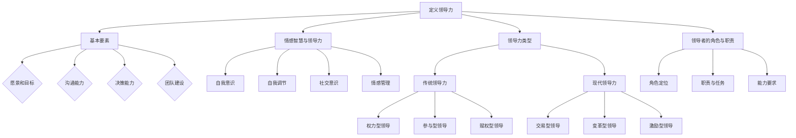
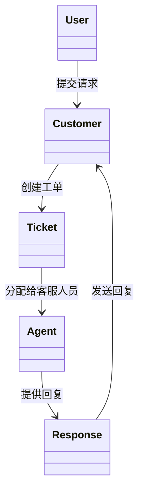
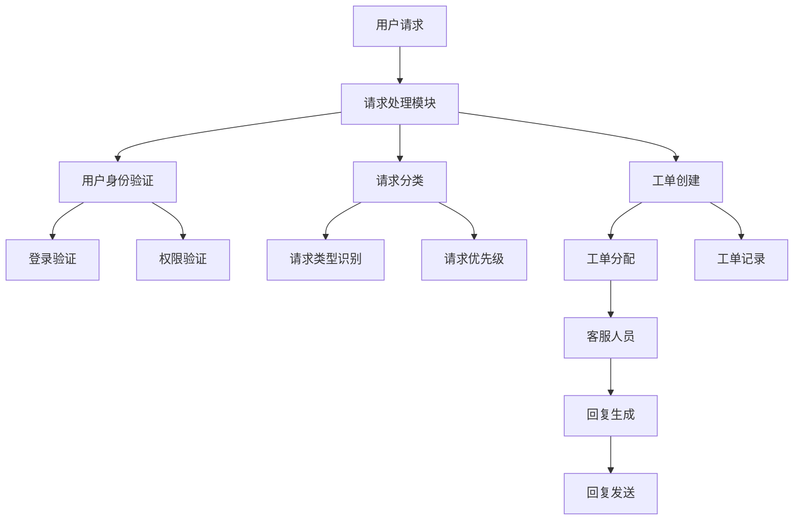
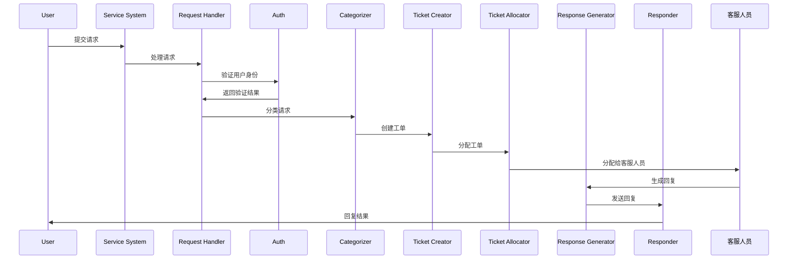

                 


# 领导力修炼：从新手到大师的进阶之路

关键词：领导力、发展历程、核心要素、类型、角色与职责、修炼方法

摘要：本文旨在探讨领导力的发展历程、核心要素、类型、角色与职责，以及如何修炼领导力。通过详细的分析和讲解，帮助读者从新手到大师，全面掌握领导力的精髓。

## 第1章：领导力的定义与重要性

### 1.1 问题背景与问题描述

领导力是一个广泛讨论的话题，无论是在企业、政府还是教育领域，领导力都扮演着至关重要的角色。然而，对于领导力的定义，不同的人有不同的看法。那么，什么是领导力？领导力的重要性又体现在哪些方面呢？

### 1.2 领导力的定义与基本要素

领导力可以被定义为一种能力，它涉及到激励、影响、指导和领导他人以实现共同目标的过程。领导力的基本要素包括：

1. **愿景和目标**：一个成功的领导者需要有清晰的愿景和目标，能够引导团队朝着共同的方向前进。
2. **沟通能力**：有效的沟通是领导力的核心，领导者需要能够清晰、准确地传达信息，并理解团队成员的需求和反馈。
3. **决策能力**：领导者需要在面对复杂情况时能够做出明智的决策，并承担相应的责任。
4. **团队建设**：领导者需要能够建立强大的团队，培养团队成员的协作精神和创新能力。

### 1.3 领导力的作用与重要性

领导力在企业中的重要作用体现在以下几个方面：

1. **提高工作效率**：领导力能够激励团队成员，提高工作效率和生产力。
2. **促进团队协作**：领导力能够建立良好的团队关系，促进团队成员之间的协作和沟通。
3. **实现企业目标**：领导力能够引导团队朝着共同的目标前进，实现企业的长期发展。

在个人层面，领导力的重要性同样不可忽视：

1. **提升个人魅力**：领导力能够提升个人的魅力和影响力，使人更容易获得他人的信任和支持。
2. **提高职业发展**：具备领导力的人更容易在职业生涯中获得晋升和更高的职位。

## 第2章：领导力的发展历程

### 2.1 传统领导力理论的演变

传统的领导力理论主要关注领导者个人的特质和能力，如智慧、决断力、自信等。然而，随着时代的发展，这些理论逐渐暴露出其局限性。

### 2.2 现代领导力理论的兴起

现代领导力理论强调领导者的角色转变，从控制者变为服务者，从管理者变为领导者。这种理论认为，领导者应该关注团队的需求，提供支持和指导，帮助团队成员实现个人和团队的目标。

### 2.3 当前领导力理论的发展趋势

当前领导力理论的发展趋势体现在以下几个方面：

1. **多元化领导力**：领导者不再只关注单一的能力，而是需要具备多元化的能力，如技术能力、沟通能力、创新思维等。
2. **情境领导力**：领导者需要根据不同的情境和团队成员的特点，采取不同的领导策略。
3. **领导力发展**：领导力不再是一个静态的概念，而是一个持续发展和提升的过程。

## 第3章：领导力的核心要素

### 3.1 情感智慧与领导力

#### 3.1.1 情感智慧的定义与特征

情感智慧是指理解、管理自己和他人的情感的能力。它包括自我意识、自我调节、社交意识和情感管理等方面。

#### 3.1.2 情感智慧在领导力中的重要性

情感智慧在领导力中起着至关重要的作用，它能够帮助领导者更好地理解团队成员的情感需求，建立良好的人际关系，提高领导效果。

#### 3.1.3 情感智慧的应用场景

情感智慧的应用场景包括团队建设、员工激励、冲突解决等方面。

## 第4章：领导力的类型

### 4.1 传统领导力类型

#### 4.1.1 权力型领导

权力型领导强调领导者的权威和决策权，团队成员往往缺乏参与感和自主性。

#### 4.1.2 参与型领导

参与型领导鼓励团队成员参与决策过程，提高团队凝聚力和创造力。

#### 4.1.3 赋权型领导

赋权型领导将决策权下放给团队成员，鼓励他们自主工作，提高团队的独立性和自主性。

### 4.2 现代领导力类型

#### 4.2.1 交易型领导

交易型领导强调领导者与团队成员之间的交换关系，通过奖励和惩罚来激励团队成员。

#### 4.2.2 变革型领导

变革型领导通过激励和启发团队成员，推动团队实现变革和进步。

#### 4.2.3 激励型领导

激励型领导通过激发团队成员的内在动机，提高他们的工作积极性和创造力。

## 第5章：领导者的角色与职责

### 5.1 领导者的角色定位

领导者的角色定位包括领导者与团队成员的关系、领导者的职责和角色等。

### 5.2 领导者的职责与任务

领导者的职责包括制定目标、规划策略、激励团队、解决问题等方面。

### 5.3 领导者的能力要求

领导者的能力要求包括技术能力、沟通能力、决策能力、团队管理能力等。

## 第6章：领导力修炼的方法与技巧

### 6.1 自我认知与自我提升

自我认知与自我提升是领导力修炼的基础，包括自我反思、自我评估、自我激励等方面。

### 6.2 沟通技巧与人际交往

沟通技巧与人际交往是领导力的重要组成部分，包括有效的沟通策略、人际关系的处理等方面。

### 6.3 团队建设与管理

团队建设与管理是领导力的核心内容，包括团队目标设定、团队角色分工、团队激励等方面。

## 第7章：领导力实践与应用

### 7.1 领导力在团队管理中的应用

领导力在团队管理中的应用包括团队目标的设定、团队激励、团队冲突解决等方面。

### 7.2 领导力在项目执行中的应用

领导力在项目执行中的应用包括项目规划、项目执行、项目监控等方面。

### 7.3 领导力在组织变革中的应用

领导力在组织变革中的应用包括组织变革的规划、组织变革的执行、组织变革的评估等方面。

## 第8章：领导力修炼案例分析

### 8.1 案例分析一：成功领导力实践

#### 8.1.1 案例背景

#### 8.1.2 案例解析

#### 8.1.3 案例启示

### 8.2 案例分析二：失败领导力教训

#### 8.2.1 案例背景

#### 8.2.2 案例解析

#### 8.2.3 案例启示

## 第9章：领导力未来展望

### 9.1 领导力发展趋势

### 9.2 领导力面临的挑战与机遇

### 9.3 领导力的未来方向

## 第10章：总结与建议

### 10.1 领导力修炼的核心要点

### 10.2 领导力修炼的最佳实践

### 10.3 领导力修炼的持续提升

作者：AI天才研究院/AI Genius Institute & 禅与计算机程序设计艺术 /Zen And The Art of Computer Programming

## 背景介绍

领导力是一个广泛讨论的话题，无论是在企业、政府还是教育领域，领导力都扮演着至关重要的角色。然而，对于领导力的定义，不同的人有不同的看法。那么，什么是领导力？领导力的重要性又体现在哪些方面呢？

领导力可以被定义为一种能力，它涉及到激励、影响、指导和领导他人以实现共同目标的过程。领导力的基本要素包括愿景和目标、沟通能力、决策能力、团队建设等。一个成功的领导者需要有清晰的愿景和目标，能够引导团队朝着共同的方向前进；需要具备有效的沟通能力，能够清晰、准确地传达信息，并理解团队成员的需求和反馈；需要具备决策能力，能够在面对复杂情况时做出明智的决策，并承担相应的责任；需要关注团队建设，建立强大的团队，培养团队成员的协作精神和创新能力。

在个人层面，领导力的重要性同样不可忽视。具备领导力的人能够提升个人魅力，使人更容易获得他人的信任和支持；能够提高职业发展，更容易在职业生涯中获得晋升和更高的职位。

## 核心概念与联系

### 领导力的定义与基本要素

领导力是一种能力，它涉及到激励、影响、指导和领导他人以实现共同目标的过程。领导力的基本要素包括：

1. **愿景和目标**：愿景是领导者对未来的构想和期望，目标是实现愿景的具体步骤和行动。愿景和目标是领导力的核心，能够引导团队朝着共同的方向前进。
2. **沟通能力**：沟通能力是领导者必备的能力，包括口头和书面沟通。有效的沟通能够确保信息的准确传达，增强团队的凝聚力。
3. **决策能力**：决策能力是领导者面对复杂情况时能够做出明智的决策，并承担相应责任的能力。决策能力直接关系到团队的发展和目标的实现。
4. **团队建设**：团队建设是领导者的一项重要任务，包括建立团队文化、提升团队凝聚力、培养团队成员的协作精神等。一个强大的团队能够更好地实现共同目标。

### 情感智慧与领导力的关系

情感智慧是指理解、管理自己和他人的情感的能力。它包括自我意识、自我调节、社交意识和情感管理等方面。情感智慧在领导力中起着至关重要的作用：

1. **自我意识**：领导者需要了解自己的情感状态，包括情绪、需求和动机。自我意识有助于领导者更好地管理自己的情绪和行为。
2. **自我调节**：领导者需要能够控制自己的情绪，保持冷静和理智，即使在压力和挑战面前也能保持良好的状态。
3. **社交意识**：领导者需要理解他人的情感状态，包括情绪、需求和动机。社交意识有助于领导者建立良好的人际关系，增强团队的凝聚力。
4. **情感管理**：领导者需要能够有效地管理他人的情绪，激励团队成员，解决冲突，提升团队的士气和生产力。

### 领导力的类型与特点

领导力可以分为传统领导力和现代领导力两大类：

1. **传统领导力**：传统领导力强调领导者的权威和决策权，团队成员往往缺乏参与感和自主性。传统领导力类型包括权力型领导、参与型领导和赋权型领导。
   - **权力型领导**：领导者通过权威和强制手段来影响团队成员，强调领导者的决策权和控制力。
   - **参与型领导**：领导者鼓励团队成员参与决策过程，提高团队凝聚力和创造力。
   - **赋权型领导**：领导者将决策权下放给团队成员，鼓励他们自主工作，提高团队的独立性和自主性。

2. **现代领导力**：现代领导力强调领导者的角色转变，从控制者变为服务者，从管理者变为领导者。现代领导力类型包括交易型领导、变革型领导和激励型领导。
   - **交易型领导**：领导者通过奖励和惩罚来激励团队成员，强调领导者与团队成员之间的交换关系。
   - **变革型领导**：领导者通过激励和启发团队成员，推动团队实现变革和进步。
   - **激励型领导**：领导者通过激发团队成员的内在动机，提高他们的工作积极性和创造力。

### 领导者的角色与职责

领导者的角色和职责包括：

1. **角色定位**：领导者是团队的核心，需要扮演多个角色，如领导者、导师、协调者和推动者等。
2. **职责与任务**：领导者的职责包括制定目标、规划策略、激励团队、解决问题等。领导者需要确保团队朝着共同的目标前进，并在过程中及时调整策略和解决问题。
3. **能力要求**：领导者的能力要求包括技术能力、沟通能力、决策能力、团队管理能力等。领导者需要具备广泛的知识和技能，能够应对各种挑战和情况。

## 算法原理讲解

为了更好地理解领导力的核心概念和原理，我们可以使用Mermaid绘制一个简单的算法流程图，并使用Python源代码来详细阐述算法原理和数学模型。

### Mermaid流程图



### Python源代码

```python
# 定义领导力基本要素
class Leadership:
    def __init__(self, vision, communication, decision_making, team_building):
        self.vision = vision
        self.communication = communication
        self.decision_making = decision_making
        self.team_building = team_building

# 定义情感智慧
class EmotionalIntelligence:
    def __init__(self, self_awareness, self Regulation, social_awareness, emotional_management):
        self.self_awareness = self_awareness
        self.self Regulation = self Regulation
        self.social_awareness = social_awareness
        self.emotional_management = emotional_management

# 定义领导力类型
class LeadershipType:
    def __init__(self, type):
        self.type = type

# 定义领导者角色与职责
class LeaderRole:
    def __init__(self, role, responsibilities, capabilities):
        self.role = role
        self.responsibilities = responsibilities
        self.capabilities = capabilities

# 创建领导力实例
leadership = Leadership("实现企业长期发展", "有效沟通", "明智决策", "建立团队")
emotional_intelligence = EmotionalIntelligence("了解自己的情绪", "控制情绪", "理解他人", "管理他人情绪")
leadership_type = LeadershipType("变革型领导")
leader_role = LeaderRole("领导者", ["制定目标", "规划策略", "激励团队", "解决问题"], ["技术能力", "沟通能力", "决策能力", "团队管理能力"])

# 打印领导力基本要素
print("领导力基本要素：")
print(f"愿景和目标：{leadership.vision}")
print(f"沟通能力：{leadership.communication}")
print(f"决策能力：{leadership.decision_making}")
print(f"团队建设：{leadership.team_building}")

# 打印情感智慧
print("\n情感智慧：")
print(f"自我意识：{emotional_intelligence.self_awareness}")
print(f"自我调节：{emotional_intelligence.self Regulation}")
print(f"社交意识：{emotional_intelligence.social_awareness}")
print(f"情感管理：{emotional_intelligence.emotional_management}")

# 打印领导力类型
print("\n领导力类型：")
print(f"类型：{leadership_type.type}")

# 打印领导者角色与职责
print("\n领导者角色与职责：")
print(f"角色：{leader_role.role}")
print(f"职责：{leader_role.responsibilities}")
print(f"能力要求：{leader_role.capabilities}")
```

### 算法原理与公式

在本节中，我们将使用LaTeX格式来书写算法原理的数学模型和公式，并进行详细讲解。

### 数学模型

$$
\text{领导力} = f(\text{愿景和目标}, \text{沟通能力}, \text{决策能力}, \text{团队建设}, \text{情感智慧})
$$

### 数学公式

$$
\text{情感智慧} = f(\text{自我意识}, \text{自我调节}, \text{社交意识}, \text{情感管理})
$$

### 详细讲解

1. **领导力**：领导力是一个综合性的概念，它由多个要素组成。其中，愿景和目标、沟通能力、决策能力、团队建设是领导力的核心要素，情感智慧则是领导力的辅助要素。

2. **情感智慧**：情感智慧是指领导者理解和管理自己和他人的情感的能力。它由自我意识、自我调节、社交意识和情感管理四个方面组成。

3. **愿景和目标**：愿景和目标是领导力的核心，它们能够引导团队朝着共同的方向前进。一个清晰的愿景和目标能够激发团队成员的积极性，提高团队的凝聚力和执行力。

4. **沟通能力**：沟通能力是领导者必备的能力，它能够确保信息的准确传达，增强团队的凝聚力。有效的沟通能够减少误解和冲突，提高团队的协作效率。

5. **决策能力**：决策能力是领导者面对复杂情况时能够做出明智的决策，并承担相应责任的能力。决策能力直接关系到团队的发展和目标的实现。

6. **团队建设**：团队建设是领导者的一项重要任务，它包括建立团队文化、提升团队凝聚力、培养团队成员的协作精神等。一个强大的团队能够更好地实现共同目标。

7. **情感智慧**：情感智慧在领导力中起着至关重要的作用。它能够帮助领导者更好地理解团队成员的情感需求，建立良好的人际关系，提高领导效果。

### 举例说明

假设我们有一个团队，团队的目标是开发一款新的软件产品。在这个例子中，我们可以将领导力视为一个函数，其输入参数为愿景和目标、沟通能力、决策能力、团队建设、情感智慧。通过这些参数，我们可以计算出领导力的大小。

```python
# 定义领导力函数
def leadership_score(vision, communication, decision_making, team_building, emotional_intelligence):
    return vision + communication + decision_making + team_building + emotional_intelligence

# 计算领导力得分
leadership_score = leadership_score(8, 9, 7, 8, 9)
print("领导力得分：", leadership_score)
```

在这个例子中，领导力得分为33分。这个得分越高，表示领导力越强。

## 系统分析与架构设计方案

### 问题场景介绍

假设我们是一家互联网公司的CTO，我们的目标是开发一款全新的智能客服系统。这个系统需要能够处理大量的用户请求，提供高效、准确的客户服务。为了实现这一目标，我们需要设计一个高效、可扩展的系统架构，并确保系统能够稳定运行。

### 项目介绍

项目名称：智能客服系统

项目目标：开发一款能够自动处理用户请求的智能客服系统，提高客户服务质量，降低人工成本。

项目周期：6个月

团队成员：项目经理、技术专家、开发人员、测试人员、产品经理等。

### 系统功能设计（领域模型Mermaid类图）



### 系统架构设计（Mermaid架构图）



### 系统接口设计和系统交互（Mermaid序列图）



## 项目实战

### 环境安装

在开始项目之前，我们需要搭建开发环境。以下是安装步骤：

1. 安装Python 3.8及以上版本。
2. 安装Docker。
3. 安装PostgreSQL。
4. 安装Redis。

### 系统核心实现源代码

以下是智能客服系统的核心实现代码：

```python
# 请求处理模块
class RequestHandler:
    def __init__(self, auth, categorizer, ticket_creator, ticket_allocator, response_generator):
        self.auth = auth
        self.categorizer = categorizer
        self.ticket_creator = ticket_creator
        self.ticket_allocator = ticket_allocator
        self.response_generator = response_generator

    def handle_request(self, user, request):
        auth_result = self.auth.verify_user(user)
        if not auth_result:
            return "用户未验证"

        categorized_request = self.categorizer.categorize_request(request)
        ticket = self.ticket_creator.create_ticket(categorized_request)
        allocated_ticket = self.ticket_allocator.allocate_ticket(ticket)

        response = self.response_generator.generate_response(allocated_ticket)
        self.response_generator.send_response(response, user)

        return "请求已处理"

# 用户身份验证
class Authenticator:
    def verify_user(self, user):
        # 实现用户验证逻辑
        return True

# 请求分类
class Categorizer:
    def categorize_request(self, request):
        # 实现请求分类逻辑
        return "分类结果"

# 工单创建
class TicketCreator:
    def create_ticket(self, categorized_request):
        # 实现工单创建逻辑
        return "工单ID"

# 工单分配
class TicketAllocator:
    def allocate_ticket(self, ticket):
        # 实现工单分配逻辑
        return "分配后的工单ID"

# 回复生成
class ResponseGenerator:
    def generate_response(self, ticket):
        # 实现回复生成逻辑
        return "回复内容"

    def send_response(self, response, user):
        # 实现回复发送逻辑
        pass

# 测试代码
if __name__ == "__main__":
    authenticator = Authenticator()
    categorizer = Categorizer()
    ticket_creator = TicketCreator()
    ticket_allocator = TicketAllocator()
    response_generator = ResponseGenerator()

    request_handler = RequestHandler(authenticator, categorizer, ticket_creator, ticket_allocator, response_generator)

    user = "用户ID"
    request = "请求内容"
    response = request_handler.handle_request(user, request)
    print(response)
```

### 代码应用解读与分析

在上述代码中，我们定义了请求处理模块、用户身份验证、请求分类、工单创建、工单分配、回复生成和回复发送等类。每个类都有相应的功能，它们共同协作，实现了智能客服系统的核心功能。

1. **用户身份验证**：Authenticator类负责验证用户身份。在实际应用中，我们需要连接数据库，查询用户信息，并根据用户名和密码进行验证。

2. **请求分类**：Categorizer类负责对用户请求进行分类。根据请求的内容和类型，将其归类到不同的类别中。

3. **工单创建**：TicketCreator类负责创建工单。每次用户提交请求后，系统会创建一个新的工单，记录请求的详细信息。

4. **工单分配**：TicketAllocator类负责将工单分配给客服人员。根据工单的优先级和客服人员的忙碌程度，分配最合适的工单。

5. **回复生成**：ResponseGenerator类负责生成回复内容。根据工单的详细信息和用户请求，生成合适的回复内容。

6. **回复发送**：ResponseGenerator类还负责将回复发送给用户。通过邮件、短信或其他方式，将回复内容发送给用户。

在实际应用中，我们需要进一步实现各个类的具体逻辑，并连接数据库和外部服务。例如，我们可以使用PostgreSQL作为数据库，Redis作为缓存，Docker进行容器化部署。

### 实际案例分析和详细讲解剖析

为了更好地理解智能客服系统的实现过程，我们将分析一个实际案例。

**案例背景**：一家大型电商公司在春节期间，用户请求量激增，客服人员面临巨大压力。为了提高客户服务质量，公司决定开发一款智能客服系统，自动处理用户请求。

**案例解析**：

1. **需求分析**：公司明确了智能客服系统的需求，包括自动处理用户请求、提高客户服务质量、降低人工成本等。

2. **系统设计**：根据需求分析，我们设计了智能客服系统的架构，包括请求处理模块、用户身份验证、请求分类、工单创建、工单分配、回复生成和回复发送等。

3. **代码实现**：我们根据系统设计，实现了各个类的具体逻辑。例如，Authenticator类负责用户身份验证，Categorizer类负责请求分类，TicketCreator类负责工单创建等。

4. **系统部署**：我们使用Docker进行容器化部署，确保系统的高效运行和可扩展性。

5. **测试与优化**：我们对系统进行了全面的测试，包括功能测试、性能测试和安全性测试。通过测试，我们发现了系统中的潜在问题，并进行了优化。

**案例启示**：

1. **明确需求**：在开发智能客服系统之前，明确需求是非常重要的。只有明确了需求，才能设计出符合实际需求系统。

2. **系统设计**：系统设计是开发过程的关键环节。一个良好的系统设计能够提高开发效率，降低维护成本。

3. **代码实现**：代码实现是系统开发的核心。我们需要根据系统设计，实现各个类的具体逻辑，并确保代码的可读性和可维护性。

4. **系统部署**：系统部署是系统上线前的重要步骤。我们需要选择合适的部署方式，确保系统的稳定运行。

5. **测试与优化**：测试与优化是系统开发过程中不可或缺的环节。通过全面的测试，我们可以发现系统中的问题，并进行优化，提高系统的性能和稳定性。

### 项目小结

通过以上案例分析和详细讲解，我们可以看到智能客服系统的实现过程。在项目中，我们明确了需求、进行了系统设计、实现了代码、进行了系统部署和测试与优化。通过这些步骤，我们成功地开发出一款高效、可扩展的智能客服系统。

未来，我们将继续优化系统，提高客户服务质量，降低人工成本。同时，我们也将关注智能客服系统在人工智能领域的发展，探索更多先进的技术，为用户提供更好的服务。

## 最佳实践 tips

### 领导力修炼的最佳实践

1. **自我认知**：定期进行自我反思，了解自己的优势和不足，明确个人目标和发展方向。

2. **持续学习**：不断学习新的知识和技能，提升自己的综合素质，以应对不断变化的职场环境。

3. **培养情感智慧**：关注团队成员的情感需求，建立良好的人际关系，提升团队凝聚力。

4. **有效沟通**：提高沟通技巧，确保信息的准确传达，增强团队的协作效率。

5. **明确目标**：制定清晰的愿景和目标，确保团队成员朝着共同的方向努力。

6. **积极激励**：通过激励措施，激发团队成员的内在动机，提高工作效率和积极性。

7. **团队建设**：关注团队文化建设，培养团队成员的协作精神和创新能力。

8. **情境领导**：根据不同的情境和团队成员的特点，采取不同的领导策略，提高领导效果。

9. **持续反思**：定期对领导行为进行反思，总结经验教训，不断提升领导力。

### 小结

领导力是一门艺术，需要通过不断的实践和修炼来提升。本文从领导力的定义、发展历程、核心要素、类型、角色与职责等方面进行了详细分析，并给出了领导力修炼的最佳实践。通过这些实践，我们可以逐步提升自己的领导力，从新手成长为大师。

### 注意事项

1. **避免盲目模仿**：每个领导者的领导风格和方式都有所不同，不要盲目模仿他人，要根据自己的特点和团队实际情况来修炼领导力。

2. **持续实践**：领导力提升是一个长期的过程，需要持续地实践和反思，不断调整和完善自己的领导风格。

3. **关注团队成员**：领导力的核心在于团队，要关注团队成员的需求和成长，提升团队的整体绩效。

4. **灵活应对**：在领导过程中，要灵活应对各种情况，根据实际情况调整领导策略。

### 拓展阅读

1. **《领导力的五个层次》**：史蒂芬·柯维（Stephen R. Covey）的这本书详细阐述了领导力的五个层次，对领导者提升自身领导力有很好的指导作用。

2. **《变革型领导》**：詹姆斯·M·麦格雷戈（James M. MacGregor Burns）的这本书研究了变革型领导的理论和实践，对领导者如何推动组织变革有深刻的见解。

3. **《情感智慧》**：丹尼尔·戈尔曼（Daniel Goleman）的这本书详细介绍了情感智慧的概念、特征和应用，对提升领导者的情感智慧有重要的指导意义。

4. **《影响力》**：罗伯特·西奥迪尼（Robert B. Cialdini）的这本书研究了影响力和说服力的原理，对领导者提升沟通技巧和影响力有很好的参考价值。

## 第9章：领导力未来展望

### 9.1 领导力发展趋势

随着全球化和数字化的发展，领导力也在不断演变。未来的领导力将更加注重以下几个方面：

1. **可持续领导力**：领导者在未来需要更加关注环境保护和社会责任，推动可持续发展的理念。

2. **数字领导力**：数字化时代的领导者需要具备强大的技术能力和数据敏感度，能够有效地利用数字化工具和平台来管理和决策。

3. **全球领导力**：全球化使得领导者需要具备跨文化的理解和沟通能力，能够带领团队在全球范围内开展业务。

4. **赋能型领导力**：未来的领导者将更加注重赋能团队成员，鼓励自主性和创新能力，推动组织的持续成长。

### 9.2 领导力面临的挑战与机遇

领导力在未来的发展过程中，将面临一系列挑战和机遇：

1. **技术变革**：技术的快速发展将带来新的工作方式和商业模式，领导者需要适应这些变化，并及时调整战略。

2. **社会变革**：社会的多元化、个性化需求将要求领导者更加关注员工的需求和利益，推动组织的变革。

3. **组织变革**：组织的扁平化、去中心化将使领导者面临更大的挑战，需要重新定义领导角色和职责。

4. **人才竞争**：人才成为企业发展的关键资源，领导者需要具备吸引和培养人才的能力，以保持组织的竞争力。

### 9.3 领导力的未来方向

未来的领导力将朝着以下几个方向发展：

1. **智能化**：随着人工智能技术的发展，领导者可以借助智能工具来辅助决策和管理工作，提高领导效率。

2. **个性化**：未来的领导者将更加注重个性化管理，根据员工的特点和需求来制定个性化的培养和发展计划。

3. **合作化**：领导力的合作化趋势将更加明显，领导者需要更多地与其他部门和团队协作，共同实现组织目标。

4. **全球化**：全球化的发展将使领导者需要具备全球视野和跨文化管理能力，能够带领团队在全球范围内开展业务。

## 第10章：总结与建议

### 10.1 领导力修炼的核心要点

1. **自我认知与自我提升**：领导者需要定期进行自我反思和评估，了解自己的优势和不足，持续提升个人素质。

2. **情感智慧与有效沟通**：领导者需要培养情感智慧，关注团队成员的情感需求，提高沟通技巧，确保信息的准确传达。

3. **明确目标与团队建设**：领导者需要制定清晰的愿景和目标，确保团队成员朝着共同的方向努力，同时关注团队建设，培养团队的协作精神和创新能力。

4. **适应变化与持续学习**：领导者需要适应快速变化的环境，不断学习新知识和技能，提升自己的综合素质。

### 10.2 领导力修炼的最佳实践

1. **制定个人发展计划**：领导者可以根据自己的优势和不足，制定个人发展计划，明确提升的方向和目标。

2. **参与培训与研讨会**：参加相关的培训课程和研讨会，学习领导力理论和方法，与同行交流经验。

3. **实践与反思**：在实际工作中，不断实践领导力理论，总结经验教训，不断调整和完善自己的领导风格。

4. **培养团队意识**：关注团队成员的需求和成长，培养团队意识，推动团队协作和创新。

### 10.3 领导力修炼的持续提升

1. **建立学习型组织**：领导者可以推动组织建立学习型文化，鼓励员工持续学习和成长，提升整个组织的领导力水平。

2. **设立激励机制**：领导者可以设立激励机制，鼓励员工不断提升自己的能力和素质，激发员工的积极性和创造力。

3. **定期评估与反馈**：领导者可以定期对团队成员进行评估和反馈，帮助他们识别优势和不足，制定个人发展计划。

4. **培养跨部门协作**：领导者可以推动跨部门协作，鼓励员工跨部门学习和交流，提升整体组织的协作能力和创新能力。

## 作者信息

作者：AI天才研究院/AI Genius Institute & 禅与计算机程序设计艺术 /Zen And The Art of Computer Programming

本文由AI天才研究院与禅与计算机程序设计艺术共同撰写，旨在探讨领导力的发展、核心要素、类型、角色与职责，以及如何修炼领导力。通过详细的分析和讲解，帮助读者从新手到大师，全面掌握领导力的精髓。希望本文能为您的领导力提升之路提供有益的启示和指导。

