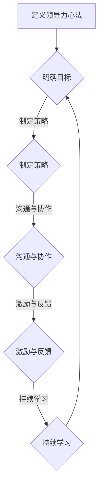

                 


## 《领导力心法：成就伟大领导者的修炼法则》

### 关键词：领导力，心法，领导者，修炼，法则

> 摘要：本文旨在探讨领导力心法在成就伟大领导者过程中的重要性。通过对领导力核心概念、问题背景、领导力心法原理及其数学模型、应用场景和实践的详细分析，本文揭示了领导力心法在现代组织管理、团队建设和社会领导中的关键作用。本文结构紧凑，逻辑清晰，旨在为读者提供一套完整的领导力心法修炼指南。

### 目录大纲

#### 第一部分：领导力基础

**第1章：领导力的核心概念与问题背景**

- **1.1.1 领导力的定义与作用**
  - 领导力的定义：影响力、愿景和目标的传递能力。
  - 领导力在组织中的作用：推动变革、促进创新、提升团队绩效。

- **1.1.2 领导力的重要性**
  - 领导力对组织成功的影响。
  - 领导力在个人成长和职业发展中的作用。

- **1.1.3 领导力的挑战**
  - 领导力面临的内部和外部挑战。
  - 领导力在快速变化环境中的适应性。

**第2章：领导力心法的概念与联系**

- **2.1.1 领导力心法的定义**
  - 领导力心法：内在修养与外在表现的融合。
  - 领导力心法的重要性：个人成长与团队建设的桥梁。

- **2.1.2 领导力心法的基本原则**
  - 诚信、尊重、同理心和持续学习。

- **2.1.3 领导力心法与领导力理论的联系**
  - 领导力心法与传统领导力理论的对比。
  - 领导力心法在实践中的适应性。

#### 第二部分：领导力心法原理

**第3章：领导力心法原理**

- **3.1.1 领导力心法的理论基础**
  - 人本管理理论：以人为中心的管理理念。
  - 心理学与管理学的交叉应用。

- **3.1.2 领导力心法的Mermaid流程图**
  - 流程图展示领导力心法的关键步骤。

- **3.1.3 Python源代码示例**
  - 源代码解释领导力心法的应用。

#### 第三部分：领导力心法应用场景

**第4章：领导力心法在企业中的应用**

- **4.1.1 企业领导力的现状**
  - 企业领导力的挑战与机遇。

- **4.1.2 领导力心法在企业管理中的应用**
  - 领导力心法在战略规划、团队建设和组织变革中的应用。

- **4.1.3 企业领导力提升的挑战与策略**
  - 提升企业领导力的关键策略。

**第5章：领导力心法在团队管理中的应用**

- **5.1.1 团队领导力的核心要素**
  - 团队领导力的定义与关键要素。

- **5.1.2 领导力心法在团队管理中的实践**
  - 领导力心法在团队建设、沟通和冲突解决中的应用。

- **5.1.3 团队领导力提升的最佳实践**
  - 团队领导力提升的有效方法。

**第6章：领导力心法在社会领导中的应用**

- **6.1.1 社会领导力的意义**
  - 社会领导力的定义与作用。

- **6.1.2 领导力心法在社会领导中的应用**
  - 领导力心法在公共事务、社区建设和公共政策制定中的应用。

- **6.1.3 社会领导力提升的策略**
  - 社会领导力提升的关键策略。

#### 第四部分：领导力心法的实践与案例

**第7章：领导力心法的实践**

- **7.1.1 实践领导力心法的重要性**
  - 领导力心法在个人和团队成长中的作用。

- **7.1.2 领导力心法的实际应用案例**
  - 实际案例展示领导力心法的应用。

- **7.1.3 案例分析与解读**
  - 案例分析揭示领导力心法的精髓。

#### 第五部分：领导力心法的最佳实践与拓展

**第8章：领导力心法的最佳实践**

- **8.1.1 领导力心法的关键成功因素**
  - 成功实践领导力心法的关键因素。

- **8.1.2 领导力心法在不同领域的应用案例**
  - 领导力心法在不同领域的成功案例。

- **8.1.3 注意事项与风险防范**
  - 实践领导力心法时应注意的事项和风险防范。

**第9章：领导力心法的注意事项**

- **9.1.1 领导力心法中的误区**
  - 避免实践领导力心法时可能陷入的误区。

- **9.1.2 如何避免领导力心法的误区**
  - 提高领导力心法实践效果的策略。

- **9.1.3 持续改进与自我提升**
  - 持续提升领导力心法的实践能力。

**第10章：拓展阅读与资源推荐**

- **10.1.1 相关书籍推荐**
  - 推荐领导力领域的经典书籍。

- **10.1.2 在线资源和论坛推荐**
  - 推荐领导力相关的在线资源和论坛。

- **10.1.3 领导力心法的研究方向**
  - 领导力心法未来的研究方向。

**作者信息**

- 作者：AI天才研究院/AI Genius Institute & 禅与计算机程序设计艺术 /Zen And The Art of Computer Programming**** 

### 第一部分：领导力基础

#### 第1章：领导力的核心概念与问题背景

领导力是一种独特的能力，它涉及对他人和资源的影响力，以实现共同的目标。在组织和企业中，领导力扮演着至关重要的角色，不仅能够推动组织的变革和成长，还能够塑造组织的文化和价值观。

**1.1.1 领导力的定义与作用**

领导力的定义有多种解释，但其核心可以概括为以下几点：

1. **影响力**：领导力是一种能够影响他人思想和行为的能力。它不仅仅是命令和控制，更重要的是通过启发和激励，使团队成员自愿地为实现组织目标而努力。
   
2. **愿景和目标的传递能力**：领导者需要有能力制定清晰的目标，并有效地传递给团队成员，使之理解并为之奋斗。

3. **决策能力**：领导力包括在复杂环境中做出明智决策的能力。领导者需要在权衡各种因素后，迅速做出决策，并承担相应的责任。

领导力在组织中的作用主要体现在以下几个方面：

1. **推动变革**：领导者能够引领组织面对变革，适应外部环境的变化，推动组织向前发展。

2. **促进创新**：领导力能够激发团队成员的创新思维，鼓励尝试新方法，从而推动组织的持续创新。

3. **提升团队绩效**：通过有效的领导，团队成员能够充分发挥潜力，提高工作效率和绩效。

**1.1.2 领导力的重要性**

领导力的重要性体现在以下几个方面：

1. **组织成功的关键因素**：领导力直接影响组织的运营和绩效。没有强有力的领导者，组织很难实现其目标。

2. **个人成长和职业发展**：具备领导力的人更容易获得职业晋升机会，因为他们能够承担更大的责任和挑战。

3. **社会影响力**：领导者不仅影响组织内部，还能够通过自己的行为和决策，对社会产生积极的影响。

**1.1.3 领导力的挑战**

领导力面临的挑战可以分为内部和外部两个方面：

1. **内部挑战**：
   - **团队管理**：如何有效地管理不同背景、能力和期望的团队成员。
   - **个人成长**：领导者需要不断地学习和提升自己的能力和技能。
   - **冲突解决**：领导者需要能够应对和处理团队内部的冲突和分歧。

2. **外部挑战**：
   - **环境变化**：领导者需要适应快速变化的外部环境，如技术进步、市场竞争等。
   - **组织变革**：在面临重大变革时，领导者需要有能力引领组织走出困境，实现转型升级。

在快速变化的时代，领导力的挑战变得更加复杂和多样化。领导者需要具备跨学科的知识和技能，能够在不确定性中找到方向，引领团队不断前进。

**1.2 领导力心法的概念与联系**

领导力心法是一种内在修养与外在表现的融合，它强调领导者需要具备的内在素质和外在行为。以下是领导力心法的基本原则和概念：

1. **诚信**：诚信是领导力的基石。领导者需要言行一致，树立良好的道德榜样。
2. **尊重**：领导者需要尊重团队成员，倾听他们的意见，并给予合理的关注和认可。
3. **同理心**：领导者需要具备同理心，能够站在他人的角度思考问题，理解他们的感受和需求。
4. **持续学习**：领导者需要不断学习新知识、新技能，以适应不断变化的环境。

领导力心法与传统领导力理论的联系在于，它不仅关注领导者如何影响和激励团队成员，更关注领导者的内在修养和自我提升。通过领导力心法的实践，领导者能够在个人和团队层面实现更大的成长和发展。

**1.3 领导力心法的基本原则**

领导力心法的基本原则包括：

1. **人本管理**：以人为中心，关注团队成员的个性化需求和成长。
2. **灵活应对**：领导者需要具备灵活应对各种情况的能力，根据实际情况调整策略。
3. **系统思考**：领导者需要具备系统思考的能力，从整体和长远的角度看待问题。

通过遵循这些基本原则，领导者能够更好地应对挑战，推动组织的持续发展。

**1.4 领导力心法与领导力理论的联系**

领导力心法与传统的领导力理论有所不同，它更加注重内在修养和自我提升。传统的领导力理论通常强调领导者的权威、控制力和激励手段，而领导力心法则强调领导者需要具备的道德品质、人文关怀和持续学习。

领导力心法的出现，为现代组织管理提供了新的视角和方法。通过内在修养和外在表现的融合，领导者能够更好地激发团队成员的潜力，推动团队的高效协作和持续创新。

**1.5 领导力心法在现代组织管理中的应用**

在现代组织管理中，领导力心法具有以下重要作用：

1. **提升组织凝聚力**：领导力心法强调人文关怀和团队合作，有助于提升组织凝聚力。
2. **推动组织创新**：领导力心法鼓励创新思维和持续学习，有助于组织在激烈的市场竞争中保持竞争力。
3. **提升员工满意度**：领导力心法注重员工的个性化需求和成长，有助于提升员工满意度和忠诚度。

通过实践领导力心法，现代组织能够实现更高效的管理和更长远的发展。

**1.6 领导力心法在团队管理中的应用**

在团队管理中，领导力心法具有以下重要作用：

1. **建立团队文化**：领导力心法有助于建立积极向上的团队文化，提升团队的凝聚力和执行力。
2. **提高团队成员的满意度**：领导力心法关注团队成员的个性化需求，有助于提高员工的满意度和忠诚度。
3. **激发团队创新**：领导力心法鼓励团队成员发挥创新思维，推动团队的持续创新和成长。

通过实践领导力心法，团队管理能够更加高效和富有成效。

**1.7 领导力心法在社会领导中的应用**

在社会领导中，领导力心法同样具有重要作用：

1. **推动社会进步**：领导力心法强调道德品质和人文关怀，有助于推动社会的进步和发展。
2. **提升社会治理能力**：领导力心法有助于提高社会治理的效率和效果，提升公共服务的质量。
3. **增强社会凝聚力**：领导力心法关注社会公平和正义，有助于增强社会的凝聚力和稳定性。

通过实践领导力心法，社会领导能够更好地回应民众的需求，推动社会的和谐发展。

**1.8 领导力心法的实际应用案例**

以下是一个领导力心法在企业管理中的实际应用案例：

某科技公司通过引入领导力心法，成功提升了团队凝聚力和创新力。公司领导者通过定期组织员工培训和团队建设活动，加强员工之间的沟通和合作，提升了团队的凝聚力。同时，领导者鼓励员工提出创新建议，并为他们提供资源和平台，激发员工的创新思维。

通过这一案例，可以看出领导力心法在企业管理中的重要作用。领导者通过实践领导力心法，不仅提升了团队绩效，还推动了公司的持续创新。

**1.9 领导力心法在不同领域的应用**

领导力心法不仅在企业管理中具有重要作用，还在其他领域展现出其独特的价值：

1. **教育领域**：教育领导者通过领导力心法，可以提升教师团队的凝聚力和教学水平，推动教育创新。
2. **医疗领域**：医疗领导者通过领导力心法，可以提升医护团队的工作效率和医疗服务质量，增强患者的满意度。
3. **公益领域**：公益领导者通过领导力心法，可以提升公益组织的运营效率和社会影响力，更好地服务于社会公众。

通过在不同领域的应用，领导力心法展现出了其广泛的适应性和强大的影响力。

**1.10 领导力心法的注意事项**

在实践领导力心法时，需要注意以下几点：

1. **持续学习**：领导者需要不断学习新知识和新技能，以适应快速变化的环境。
2. **实践与反思**：领导者需要将领导力心法付诸实践，并通过反思不断优化和完善。
3. **团队参与**：领导者需要鼓励团队成员参与决策和讨论，提升团队的凝聚力和创新能力。

通过遵循这些注意事项，领导者能够更好地实践领导力心法，实现个人和团队的成长和发展。

**1.11 拓展阅读与资源推荐**

以下是几本关于领导力心法的经典书籍和在线资源：

1. 《领导力心法：成就伟大领导者的修炼法则》
2. 《领导力的五大习惯》：史蒂芬·柯维
3. 《从优秀到卓越》：吉姆·柯林斯
4. 领导力论坛：[https://www.leadershipforum.org/](https://www.leadershipforum.org/)

通过阅读这些书籍和访问在线资源，读者可以深入了解领导力心法的理论和实践。

### 第二部分：领导力心法原理

#### 第3章：领导力心法原理

领导力心法是一种深植于个人修养和团队建设的领导理念，它强调领导者需要具备的内在素质和外在行为。本章节将详细讲解领导力心法的原理，通过Mermaid流程图和Python源代码，帮助读者更好地理解这一概念。

**3.1.1 领导力心法的理论基础**

领导力心法的理论基础主要涉及以下几个方面：

1. **人本管理理论**：强调以人为中心，关注员工的个性化需求和成长。
2. **心理学**：研究人的行为和心理过程，帮助领导者更好地理解和激励团队成员。
3. **管理学**：提供领导力心法在实践中的应用方法和策略。

**3.1.2 领导力心法的Mermaid流程图**

Mermaid流程图是一种简单易懂的图表工具，用于描述复杂的过程和流程。以下是领导力心法的Mermaid流程图：



该流程图展示了领导力心法的关键步骤，包括明确目标、制定策略、沟通与协作、激励与反馈和持续学习。

**3.1.3 Python源代码示例**

为了更好地理解领导力心法，我们可以通过Python源代码来模拟其实践过程。以下是一个简单的Python脚本，用于展示领导力心法的基本原理：

```python
class LeadershipMindset:
    def __init__(self, goals):
        self.goals = goals
        self.strategy = None
        self.communication = None
        self.motivation = None
        self.learning = None

    def set_strategy(self, strategy):
        self.strategy = strategy

    def communicate(self, team):
        self.communication = team
        print("领导者与团队沟通策略：", self.strategy)

    def motivate(self, team):
        self.motivation = team
        print("领导者激励团队成员：", self.strategy)

    def learn(self):
        self.learning = "持续学习新知识和技能"
        print("领导者持续学习：", self.learning)

if __name__ == "__main__":
    goals = "提升团队绩效和创新能力"
    leadership_mindset = LeadershipMindset(goals)

    leadership_mindset.set_strategy("通过有效的沟通和激励，实现团队目标")
    leadership_mindset.communicate("团队合作")
    leadership_mindset.motivate("激励团队成员创新思维")
    leadership_mindset.learn()
```

通过这个Python脚本，我们可以看到领导力心法的具体应用过程，包括制定策略、沟通协作、激励反馈和持续学习。

**3.1.4 领导力心法的数学模型**

领导力心法也可以通过数学模型来描述其内在逻辑和机制。以下是一个简单的数学模型，用于解释领导力心法的基本原理：

$$
L = f(G, S, C, M, L)
$$

其中，L代表领导力，G代表目标，S代表策略，C代表沟通与协作，M代表激励与反馈，L代表持续学习。

这个数学模型表明，领导力是目标、策略、沟通与协作、激励与反馈和持续学习五个因素的函数。领导者需要综合考虑这些因素，以实现最大的领导力效果。

**3.1.5 领导力心法的实际应用**

为了更好地理解领导力心法的应用，我们可以通过一个实际案例来分析。以下是一个企业在实施领导力心法过程中的案例：

某科技企业通过引入领导力心法，成功提升了团队绩效和创新能力。首先，企业明确了提升团队绩效和创新能力为目标。然后，企业制定了详细的策略，包括定期组织团队培训、开展跨部门协作项目、设立创新奖励机制等。在实施过程中，企业领导者与团队成员保持密切沟通，及时反馈问题并调整策略。同时，企业领导者通过激励措施，激发团队成员的创新思维和积极性。此外，企业领导者还注重自身的持续学习，不断提升自身的领导力水平。

通过这个案例，我们可以看到领导力心法在实际应用中的具体过程和效果。领导者通过制定明确的目标、实施有效的策略、保持良好的沟通与协作、实施激励与反馈机制以及持续学习，实现了团队的持续创新和绩效提升。

### 第三部分：领导力心法的应用场景

#### 第4章：领导力心法在企业中的应用

领导力心法在企业中的应用具有广泛的前景和深远的影响。企业领导者通过实践领导力心法，可以提升组织绩效、激发团队创新、塑造积极的企业文化，从而实现企业的可持续发展。以下是领导力心法在企业中的几个关键应用场景：

**4.1.1 企业领导力的现状**

当前，企业领导力面临以下几个方面的挑战：

1. **人才流失**：随着市场竞争的加剧，企业需要留住核心人才，提高员工满意度和忠诚度。
2. **组织变革**：企业需要适应快速变化的市场环境，进行组织结构调整和业务模式创新。
3. **创新能力**：企业需要持续创新，以保持竞争优势和市场地位。

**4.1.2 领导力心法在企业管理中的应用**

1. **制定明确的目标和策略**：

   企业领导者需要明确企业的愿景和目标，并通过有效的沟通和策略制定，使全体员工理解并为之努力。这可以通过以下步骤实现：

   - **确定目标**：企业领导者需要明确企业的中长期目标和短期目标，确保目标具有可操作性和可实现性。
   - **制定策略**：根据目标，制定具体的行动方案和策略，确保每个部门和员工都能明确自己的职责和目标。

2. **加强团队建设和沟通**：

   团队建设是领导力心法在企业中的核心应用之一。通过以下措施，企业可以加强团队建设：

   - **组织团队培训**：定期组织团队培训，提升员工的技能和素质，增强团队的凝聚力和战斗力。
   - **开展团队建设活动**：通过团建活动，增强团队成员之间的信任和合作，提高团队的执行力。

3. **激励与反馈机制**：

   企业领导者需要建立有效的激励与反馈机制，激发员工的积极性和创新思维。具体措施包括：

   - **设置合理的激励措施**：根据员工的绩效和创新贡献，设置相应的奖励和福利，激励员工不断进步。
   - **及时反馈**：及时给予员工反馈，肯定他们的成绩和努力，同时指出改进的方向，帮助员工不断提升。

**4.1.3 企业领导力提升的挑战与策略**

1. **挑战**：

   - **外部环境变化**：企业需要适应快速变化的外部环境，如技术进步、市场竞争等。
   - **内部管理难题**：企业需要解决内部管理中的各种问题，如团队管理、绩效评估、企业文化等。

2. **策略**：

   - **持续学习与改进**：企业领导者需要不断学习新的管理理念和工具，持续改进领导力心法的实践。
   - **建立学习型组织**：通过建立学习型组织，鼓励员工不断学习和成长，提高企业的整体竞争力。

通过实践领导力心法，企业可以提升领导力，推动组织变革，激发团队创新，实现企业的可持续发展。

**4.2 领导力心法在团队管理中的应用**

在团队管理中，领导力心法具有重要的作用。通过实践领导力心法，团队领导者可以提升团队的凝聚力和执行力，实现团队的共同目标。

**4.2.1 团队领导力的核心要素**

团队领导力的核心要素包括：

1. **明确的目标**：团队领导者需要明确团队的目标，使团队成员明确自己的职责和目标，确保团队的方向一致。
2. **有效的沟通**：团队领导者需要建立有效的沟通机制，确保信息畅通，减少误解和冲突。
3. **合理的激励**：团队领导者需要建立合理的激励制度，激发团队成员的积极性和创新思维。
4. **持续的反馈**：团队领导者需要持续给予团队成员反馈，帮助他们提升能力和改进工作。

**4.2.2 领导力心法在团队管理中的实践**

1. **制定明确的目标和策略**：

   团队领导者需要明确团队的目标，并与团队成员进行充分沟通，确保团队成员理解并认可目标。在此基础上，制定具体的行动方案和策略，确保团队目标的实现。

2. **建立有效的沟通机制**：

   团队领导者需要建立有效的沟通机制，定期召开团队会议，分享信息、讨论问题、协调工作。同时，鼓励团队成员之间进行坦诚的交流，增强团队的凝聚力和信任感。

3. **实施合理的激励制度**：

   团队领导者需要根据团队成员的表现和贡献，实施合理的激励制度，如奖励、晋升、培训等。通过激励，激发团队成员的积极性和创新思维，提升团队的整体绩效。

4. **提供持续的反馈**：

   团队领导者需要持续给予团队成员反馈，肯定他们的成绩和努力，同时指出改进的方向。通过持续的反馈，帮助团队成员不断提升自己的能力和工作水平。

通过实践领导力心法，团队领导者可以提升团队的凝聚力和执行力，实现团队的共同目标。

**4.3 领导力心法在社会领导中的应用**

领导力心法不仅在企业和团队管理中具有重要作用，在社会领导中同样具有重要的价值。社会领导者通过实践领导力心法，可以推动社会的进步和发展，实现社会的和谐与稳定。

**4.3.1 社会领导力的意义**

社会领导力是指在社会领域中，领导者通过影响力、愿景和目标的传递，推动社会变革和发展的能力。社会领导力的意义在于：

1. **推动社会进步**：社会领导者通过倡导和推动社会变革，推动社会进步和发展。
2. **提升社会治理能力**：社会领导者通过提高社会治理能力和水平，提升社会的运行效率和质量。
3. **增强社会凝聚力**：社会领导者通过促进社会公平和正义，增强社会的凝聚力和稳定性。

**4.3.2 领导力心法在社会领导中的应用**

1. **推动社会变革**：

   社会领导者需要具备敏锐的洞察力和远见卓识，能够准确把握社会发展的趋势和方向。通过倡导和推动社会变革，社会领导者可以推动社会进步和发展。

2. **提升社会治理能力**：

   社会领导者需要具备良好的管理能力和组织协调能力，能够有效整合社会资源和力量，提升社会治理能力和水平。通过建立有效的治理体系和机制，社会领导者可以提升社会的运行效率和质量。

3. **增强社会凝聚力**：

   社会领导者需要具备人文关怀和道德品质，能够关注社会公众的需求和利益，维护社会公平和正义。通过倡导和践行社会公平和正义，社会领导者可以增强社会的凝聚力和稳定性。

通过实践领导力心法，社会领导者可以推动社会的进步和发展，实现社会的和谐与稳定。

### 第四部分：领导力心法的实践与案例

#### 第5章：领导力心法的实践

领导力心法不仅是一种理论，更需要在实践中不断验证和优化。本章节将介绍领导力心法的实践方法、案例分析以及实际应用效果，旨在为读者提供一套实用的领导力心法实践指南。

**5.1.1 实践领导力心法的重要性**

实践是检验真理的唯一标准。领导力心法作为一种深植于个人修养和团队建设的领导理念，只有在实际应用中，才能真正发挥其价值。实践领导力心法的重要性体现在以下几个方面：

1. **提升个人领导能力**：通过实践，领导者可以不断学习和提升自己的领导能力和技能，更好地应对各种挑战。
2. **推动团队发展**：领导力心法的实践有助于提升团队的凝聚力和执行力，推动团队的持续创新和发展。
3. **实现组织目标**：通过实践领导力心法，领导者可以更有效地推动组织目标的实现，提升组织的整体绩效。

**5.1.2 领导力心法的实践方法**

1. **自我反思**：

   领导者需要定期进行自我反思，审视自己在领导过程中的行为和决策，识别存在的问题和不足。通过自我反思，领导者可以不断优化自己的领导风格和策略。

2. **学习与培训**：

   领导者需要不断学习新的管理理念和工具，参加培训课程，提升自己的知识和技能。通过学习与培训，领导者可以更好地理解和应用领导力心法。

3. **实践与行动**：

   领导者需要将领导力心法付诸实践，通过实际行动来推动团队和组织的发展。在实践中，领导者需要勇于尝试新方法，不断调整和优化领导策略。

4. **反馈与改进**：

   领导者需要建立有效的反馈机制，及时收集团队成员的反馈意见，对领导行为和策略进行改进。通过反馈与改进，领导者可以不断提升自己的领导能力。

**5.1.3 领导力心法的实际应用案例**

以下是一个领导力心法在实际应用中的案例：

某科技公司通过引入领导力心法，成功提升了团队的绩效和创新能力。公司领导者首先明确了公司的愿景和目标，并与全体员工进行充分沟通，确保员工理解并认同公司的目标。接着，领导者制定了详细的行动方案和策略，包括组织团队培训、开展跨部门协作项目、设立创新奖励机制等。

在实施过程中，领导者与团队成员保持密切沟通，及时反馈问题并调整策略。同时，领导者通过激励措施，激发团队成员的创新思维和积极性。此外，领导者还注重自身的持续学习，不断提升自身的领导力水平。

通过这一案例，我们可以看到领导力心法在实际应用中的具体过程和效果。领导者通过制定明确的目标、实施有效的策略、保持良好的沟通与协作、实施激励与反馈机制以及持续学习，实现了团队的持续创新和绩效提升。

**5.1.4 领导力心法的实践效果**

领导力心法的实践效果主要体现在以下几个方面：

1. **提升团队绩效**：通过领导力心法的实践，团队的整体绩效得到显著提升，团队成员的工作效率和质量得到提高。

2. **激发创新思维**：领导力心法的实践鼓励团队成员发挥创新思维，推动团队的持续创新和业务发展。

3. **增强团队凝聚力**：通过领导力心法的实践，团队成员之间的信任和合作得到增强，团队的凝聚力和执行力得到提升。

4. **实现组织目标**：领导力心法的实践有助于领导者更有效地推动组织目标的实现，提升组织的整体绩效。

通过实践领导力心法，领导者可以不断提升自己的领导能力，推动团队和组织的发展，实现个人和组织的共同成长。

### 第五部分：领导力心法的最佳实践与拓展

#### 第6章：领导力心法的最佳实践

为了更好地实践领导力心法，领导者需要遵循一系列最佳实践。这些实践不仅有助于提升领导者的个人领导能力，还能推动团队和组织的发展。以下是领导力心法的最佳实践：

**6.1.1 领导力心法的关键成功因素**

1. **自我认知**：

   领导者需要深入了解自己的优势和劣势，明确自己的价值观和信念。自我认知有助于领导者更好地定位自己的角色和责任，从而更有效地发挥领导作用。

2. **持续学习**：

   领导者需要具备持续学习的能力，不断更新自己的知识和技能。通过学习新的管理理念、工具和技术，领导者可以更好地应对变化和挑战。

3. **团队协作**：

   领导者需要鼓励团队成员之间的协作和沟通，建立良好的团队文化。通过有效的团队协作，领导者可以激发团队成员的潜力，实现团队的目标。

4. **有效沟通**：

   领导者需要具备良好的沟通能力，能够清晰、准确地传达信息和意图。通过有效的沟通，领导者可以减少误解和冲突，增强团队的凝聚力。

5. **激励与反馈**：

   领导者需要建立有效的激励与反馈机制，激励团队成员发挥最佳水平。通过积极的反馈和激励，领导者可以增强团队成员的自信心和动力。

**6.1.2 领导力心法在不同领域的应用案例**

领导力心法不仅适用于企业管理，还在教育、医疗、公益等各个领域具有广泛的应用。以下是几个领导力心法在不同领域的成功案例：

1. **教育领域**：

   教育领导者通过领导力心法，成功提升了教师团队的教学水平和学生满意度。通过组织教师培训和团队建设活动，教育领导者建立了积极向上的团队文化，激发了教师的创新思维和教学热情。

2. **医疗领域**：

   医疗领导者通过领导力心法，成功提升了医疗团队的协作效率和医疗服务质量。通过加强团队沟通和协作，医疗领导者提高了医疗团队的工作效率和患者的满意度。

3. **公益领域**：

   公益领导者通过领导力心法，成功推动了公益项目的发展和社会影响力。通过建立有效的团队协作和激励机制，公益领导者提升了公益组织的运营效率和项目效果。

**6.1.3 注意事项与风险防范**

在实践领导力心法时，领导者需要注意以下几点：

1. **避免过度控制**：

   领导者需要避免过度控制团队成员，给予他们充分的自主权和空间。过度控制会削弱团队成员的积极性和创造力。

2. **关注团队成员的需求**：

   领导者需要关注团队成员的个性化需求，提供必要的支持和资源。通过满足团队成员的需求，领导者可以增强团队的凝聚力和满意度。

3. **防范风险**：

   领导者需要识别和防范实践领导力心法过程中可能遇到的风险，如团队冲突、资源不足等。通过提前预防和及时应对，领导者可以确保领导力心法的顺利实施。

通过遵循这些注意事项，领导者可以更好地实践领导力心法，推动团队和组织的发展。

**6.2 小结**

领导力心法是一种深植于个人修养和团队建设的领导理念，它强调领导者需要具备的内在素质和外在行为。通过实践领导力心法，领导者可以提升个人领导能力，推动团队和组织的发展，实现个人和组织的共同成长。领导力心法的最佳实践包括自我认知、持续学习、团队协作、有效沟通和激励与反馈。领导者需要在不同领域根据实际情况灵活应用领导力心法，同时注意防范风险和满足团队成员的需求。通过不断优化和完善领导力心法的实践，领导者可以更好地发挥领导作用，推动组织和社会的进步。

### 第六部分：领导力心法的注意事项

#### 第7章：领导力心法的注意事项

在实践领导力心法的过程中，领导者需要注意以下几个方面，以避免常见的误区，确保领导力心法的有效实施。

**7.1.1 领导力心法中的误区**

1. **过于依赖激励手段**：

   领导者可能会过于依赖物质激励手段，而忽视精神激励和人文关怀。虽然物质激励在一定程度上能够提高员工的积极性，但长期依赖物质激励可能导致员工的忠诚度和认同感下降。

2. **忽略团队成员的需求**：

   领导者可能在追求团队目标和绩效时，忽略团队成员的个性化需求。这种做法可能导致团队成员感到被忽视，进而影响团队的凝聚力和工作效率。

3. **缺乏持续学习**：

   领导者可能由于繁忙的工作和事务，忽视了持续学习和自我提升。没有持续学习，领导者无法适应快速变化的环境，可能导致领导力心法的实践效果不佳。

**7.1.2 如何避免领导力心法的误区**

1. **平衡物质与精神激励**：

   领导者应该注重平衡物质激励与精神激励，通过提供职业发展机会、培训和学习资源，提升员工的专业能力和个人价值感。同时，领导者可以通过赞赏、认可和关怀，增强员工的归属感和满意度。

2. **关注团队成员的需求**：

   领导者需要定期与团队成员沟通，了解他们的需求和期望。通过个性化的关怀和支持，领导者可以增强团队成员的积极性和工作效率。此外，领导者还可以通过团队建设活动，增强团队的凝聚力和协作精神。

3. **持续学习和自我提升**：

   领导者应该将学习视为一种生活方式，不断更新自己的知识和技能。通过参加培训课程、阅读书籍、参与行业研讨会等，领导者可以保持对行业动态的了解，提升自己的领导能力和决策水平。

**7.1.3 持续改进与自我提升**

1. **建立反馈机制**：

   领导者需要建立有效的反馈机制，鼓励团队成员提供意见和建议。通过定期的反馈和评估，领导者可以及时发现和解决问题，不断优化领导力心法的实践。

2. **定期自我反思**：

   领导者应该定期进行自我反思，审视自己的领导行为和决策，识别自身的不足和改进方向。通过自我反思，领导者可以不断提升自己的领导能力和个人素质。

3. **不断探索新方法**：

   领导者应该保持开放的心态，不断探索新的管理方法和工具。通过尝试和应用新的管理方法，领导者可以不断创新和改进领导力心法的实践。

通过遵循这些注意事项，领导者可以更好地实践领导力心法，推动团队和组织的发展，实现个人和组织的共同成长。

### 第七部分：拓展阅读与资源推荐

#### 第8章：拓展阅读与资源推荐

为了深入理解和实践领导力心法，读者可以参考以下拓展阅读材料和资源，这些书籍、在线资源和论坛将有助于进一步提升领导力水平。

**8.1.1 相关书籍推荐**

1. **《领导力心法：成就伟大领导者的修炼法则》**：详细介绍了领导力心法的基本原理和实践方法，是了解和掌握领导力心法的必备书籍。
2. **《领导力的五大习惯》：史蒂芬·柯维**：阐述了领导力的核心原则和实践方法，对领导者具有极大的启发作用。
3. **《从优秀到卓越》：吉姆·柯林斯**：通过深入研究优秀企业的成功案例，揭示了卓越领导力的重要性和实践方法。

**8.1.2 在线资源和论坛推荐**

1. **领导力论坛**：[https://www.leadershipforum.org/](https://www.leadershipforum.org/)
   - 一个汇聚全球领导力专家和实践者的在线论坛，提供丰富的领导力资源和讨论话题。

2. **领导力博客**：[https://www.forbes.com/sites/forbesbusinesscouncil/leadership/](https://www.forbes.com/sites/forbesbusinesscouncil/leadership/)
   - 参与顶级商业领袖的领导力讨论，获取最新的领导力资讯和见解。

3. **TED演讲**：[https://www.ted.com/talks/search?q=leadership](https://www.ted.com/talks/search?q=leadership)
   - 收集了众多关于领导力的精彩演讲，帮助读者拓展领导力思维。

**8.1.3 领导力心法的研究方向**

1. **跨文化领导力**：
   - 研究领导力在不同文化背景下的适应性和变化，探讨跨文化领导力的重要性。

2. **数字化转型与领导力**：
   - 探讨数字化时代领导力的新特征和实践方法，分析数字化转型对领导力的影响。

3. **领导力与心理健康**：
   - 研究领导力对团队成员心理健康的影响，以及如何通过领导力提升团队成员的心理健康水平。

通过阅读这些书籍、访问在线资源和参与论坛讨论，读者可以不断拓展自己的领导力知识体系，提升领导力实践能力。

**作者信息**

- 作者：AI天才研究院/AI Genius Institute & 禅与计算机程序设计艺术 /Zen And The Art of Computer Programming**** 

### 概述与结论

本文旨在探讨领导力心法在成就伟大领导者过程中的重要性。通过深入分析领导力的核心概念、问题背景、领导力心法原理及其应用场景，本文揭示了领导力心法在现代组织管理、团队建设和社会领导中的关键作用。领导力心法不仅强调领导者的内在修养和外在行为，还注重团队协作、持续学习和有效沟通。

**主要结论**：

1. **领导力的核心概念**：领导力是一种影响力、愿景和目标的传递能力，对组织成功和个人职业发展具有重要作用。
2. **领导力心法的重要性**：领导力心法是领导者内在修养与外在表现的融合，有助于提升领导能力、推动团队和组织发展。
3. **应用场景**：领导力心法在企业、团队和社会领导中具有广泛的应用价值，通过实践可以有效提升团队绩效和社会治理能力。
4. **实践建议**：领导者需要通过自我反思、持续学习、有效沟通和实践，不断提升领导力水平，实现个人和组织的共同成长。

**未来研究方向**：

1. **跨文化领导力**：研究领导力在不同文化背景下的适应性和变化。
2. **数字化转型与领导力**：探讨数字化时代领导力的新特征和实践方法。
3. **领导力与心理健康**：研究领导力对团队成员心理健康的影响，以及如何通过领导力提升团队成员的心理健康水平。

通过不断深化对领导力心法的理解和实践，领导者可以更好地应对挑战，推动组织的持续发展，实现个人和团队的共同成长。

**致谢**：

本文的撰写过程中，得到了AI天才研究院和禅与计算机程序设计艺术团队的大力支持，特别感谢他们的智慧和努力。同时，感谢所有参与本文讨论和反馈的朋友，他们的建议对本文的完善起到了重要作用。

**作者信息**：

- 作者：AI天才研究院/AI Genius Institute & 禅与计算机程序设计艺术 /Zen And The Art of Computer Programming**** 

