                 

### 引言：领导力的时代需求

在当今瞬息万变的世界中，领导力已成为推动个人、团队和组织成功的关键因素。随着全球化的加速、技术的迅猛发展以及市场需求的不断变化，领导者面临着前所未有的挑战和机遇。领导力不再仅仅是企业的内部管理问题，而是关系到企业能否在激烈的市场竞争中站稳脚跟、持续发展的核心能力。

#### 领导力的定义与重要性

领导力可以被定义为一种影响力，它帮助领导者引导和激励他人，共同实现目标。领导力不仅仅是管理和指挥，更是一种能够激发团队成员潜力、推动创新和变革的能力。在组织层面，领导力的重要性体现在以下几个方面：

1. **愿景与目标设定**：优秀的领导者能够清晰地描绘组织的愿景和目标，并激励团队成员为之努力。
2. **团队建设**：领导者通过建立信任、沟通和协作，打造高效的团队，提高整体绩效。
3. **战略决策**：领导者具备战略思维，能够做出正确的决策，确保组织在竞争中获得优势。
4. **创新与变革**：在快速变化的市场环境中，领导者推动组织进行创新和变革，保持竞争力。
5. **文化建设**：领导者塑造组织的价值观和文化，形成独特的竞争优势。

#### 当代领导面临的挑战

尽管领导力的重要性不言而喻，但当代领导者仍然面临着诸多挑战：

1. **技术变革**：随着技术的飞速发展，领导者需要不断学习和适应新的技术趋势，以便利用技术推动组织的发展。
2. **全球化**：全球化带来了更大的竞争压力和市场机会，领导者需要具备跨文化的领导能力和全球视野。
3. **多元化**：组织中的员工来自不同的背景和经验，领导者需要管理和激励多元化团队，发挥每位成员的潜力。
4. **快速变化的市场**：市场变化速度加快，领导者需要具备快速反应和决策能力，以应对不确定性。
5. **员工期望**：新一代员工更加注重工作与生活的平衡、个人成长和发展，领导者需要调整管理风格，以满足员工的期望。

#### 领导力心法：核心观念

面对这些挑战，领导者需要具备独特的领导力心法，这包括以下几个核心观念：

1. **诚信与透明**：诚信是领导力的基石，领导者需要通过透明和开放的行为树立信任。
2. **愿景与使命**：领导者需要清晰地定义组织的愿景和使命，并确保团队成员对此有共同的理解和认同。
3. **持续学习**：领导者需要具备持续学习和自我提升的能力，以适应快速变化的环境。
4. **关注员工成长**：领导者需要关注员工的个人和职业发展，为他们提供成长的机会和资源。
5. **适应性和灵活性**：领导者需要具备适应性和灵活性，能够快速调整策略和行动，以应对不确定性。

### 总结

领导力在当今社会中扮演着至关重要的角色。领导者不仅需要具备管理和决策能力，还需要具备适应变化、推动创新和激励团队的能力。通过具备领导力心法，领导者可以更好地应对挑战，实现个人、团队和组织的成功。在接下来的章节中，我们将深入探讨领导力的核心原则和实践，帮助读者成为优秀的领导者。

---

#### 关键词

- 领导力
- 领导力心法
- 战略思维
- 诚信与透明
- 团队建设
- 员工激励
- 创新与变革
- 领导力发展

---

#### 摘要

本文旨在探讨领导力在当今社会中的重要性，以及领导者如何通过具备独特的领导力心法，应对各种挑战，实现个人、团队和组织的成功。文章首先介绍了领导力的定义和重要性，随后分析了当代领导者面临的挑战，包括技术变革、全球化、多元化、快速变化的市场以及员工期望。通过诚信与透明、愿景与使命、持续学习、关注员工成长和适应性与灵活性等核心观念，领导者可以提升自身领导力，并激励团队实现共同目标。本文还提出了领导力发展的关键原则和实践，为读者提供了实用的指导。

---

## 第1章 核心原则：伟大领导的基本法则

在探讨领导力的核心原则时，我们必须认识到，领导力不仅仅是一种技能或技巧，而是一种深植于个体内心和行为中的哲学体系。伟大领导的基本法则不仅关乎个人能力，更关乎对组织、团队和员工的深刻理解和尊重。本章将深入探讨以下几个核心原则：诚信与透明、愿景与使命、持续学习、关注员工成长和适应性与灵活性。通过理解并实践这些原则，领导者可以成为组织中的卓越领导者。

#### 诚信与透明

诚信是领导力的基石，它不仅体现为领导者个人的道德品质，更是组织文化的重要组成部分。一个诚信的领导者能够赢得团队成员的信任和尊重，从而建立起良好的工作氛围。以下是诚信与透明的几个关键要素：

1. **真实与真诚**：领导者需要以真实的态度面对自己和他人，避免任何形式的欺骗和虚假陈述。
2. **透明沟通**：领导者应保持信息透明，及时与团队成员分享组织的动态和重要决策，以增强信任。
3. **负责任**：领导者需对自己的言行负责，遇到问题和挑战时，勇于承认并承担责任。

#### 愿景与使命

愿景和使命是领导者引领团队的重要指引，它们为组织提供了明确的方向和目标。一个清晰的愿景和使命能够激发团队成员的积极性和创造力，使他们更加专注于共同的目标。以下是愿景与使命的几个关键要素：

1. **激励人心**：愿景和使命应具备激励人心的力量，能够激发团队成员的激情和动力。
2. **明确具体**：愿景和使命应具体明确，易于团队成员理解和执行。
3. **共同认同**：领导者需确保团队成员对愿景和使命有共同的理解和认同，从而形成合力。

#### 持续学习

在快速变化的时代，领导者需要具备持续学习的能力，以应对不断涌现的新挑战和新机遇。持续学习不仅包括对新知识和新技能的获取，更包括对自我认知和领导风格的反思与调整。以下是持续学习的几个关键要素：

1. **知识更新**：领导者需不断更新自己的知识库，学习最新的行业动态和技术趋势。
2. **自我反思**：领导者应定期进行自我反思，识别自身的优点和不足，并不断改进。
3. **学习氛围**：领导者需在组织中营造学习氛围，鼓励团队成员积极参与学习和成长。

#### 关注员工成长

员工是组织最宝贵的资产，关注员工成长是领导者的重要职责。通过提供成长机会和资源，领导者可以激发员工的工作热情和创造力，从而推动组织的持续发展。以下是关注员工成长的几个关键要素：

1. **职业规划**：领导者应与员工共同制定职业规划，明确他们的职业发展方向。
2. **培训与发展**：领导者需为员工提供培训和发展机会，帮助他们提升技能和知识。
3. **激励与认可**：领导者应通过激励和认可，鼓励员工在工作中取得成就，并激发他们的潜力。

#### 适应性与灵活性

领导者需要具备适应性和灵活性，以应对快速变化的市场环境和内部挑战。适应性和灵活性不仅体现在战略层面，更体现在日常决策和行动中。以下是适应性与灵活性的几个关键要素：

1. **快速决策**：领导者需具备快速决策的能力，能够在变化中迅速做出正确决策。
2. **灵活调整**：领导者应具备灵活调整策略和行动的能力，以应对新的挑战和机遇。
3. **风险管理**：领导者需具备风险管理的能力，能够预见潜在风险并采取预防措施。

### 总结

领导力的核心原则是领导者成功的重要保障。诚信与透明、愿景与使命、持续学习、关注员工成长和适应性与灵活性，这些原则不仅为领导者提供了明确的行动指南，更帮助他们在变化和挑战中保持稳定和前进。通过深刻理解和实践这些原则，领导者可以成为组织中的卓越领导者，推动团队和组织实现卓越的业绩和长远发展。

---

#### 1.1 诚信与透明

诚信与透明是领导力的核心要素之一，它们不仅关乎领导者的个人品质，更是组织文化的重要基石。一个诚信且透明的领导者能够赢得团队成员的信任和尊重，从而建立起强大的团队凝聚力和组织声誉。以下是对诚信与透明的详细探讨：

**核心概念与联系**

诚信和透明是相互关联的概念，它们共同构成了领导力的基石。诚信强调领导者言行一致，以真实和真诚的态度面对自己和他人；而透明则强调信息的公开和共享，确保团队成员能够清晰地了解组织的动态和决策过程。

**概念属性特征对比表格**

| 特征               | 诚信                 | 透明                 |
|------------------|--------------------|--------------------|
| 定义               | 诚实、真诚、负责任       | 信息公开、沟通透明       |
| 关键要素           | 真实、真诚、负责任       | 信息透明、沟通及时       |
| 对领导力的影响     | 建立信任、提升声誉       | 增强团队凝聚力、减少误解   |
| 实践方法           | 以身作则、诚实沟通       | 及时反馈、信息共享       |

**ER实体关系图架构的Mermaid流程图**

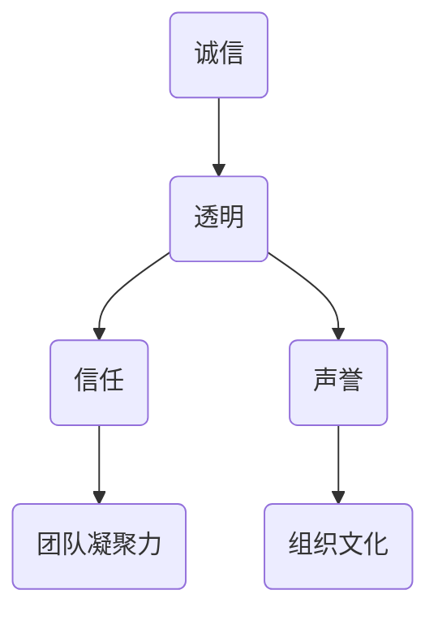

在这个ER实体关系图中，诚信与透明通过建立信任和提升声誉，对团队凝聚力和组织文化产生积极影响。

**算法原理讲解**

诚信与透明的实现可以通过以下算法原理来解释：

1. **诚实反馈**：领导者应在日常沟通中保持诚实，对团队成员的表现和反馈应真实反映其工作情况，避免夸大或隐瞒。
2. **透明决策**：领导者应确保决策过程透明，通过团队会议、内部公告等方式，让团队成员了解决策的背景和原因。
3. **开放对话**：领导者应鼓励团队成员提出问题和意见，通过开放对话建立信任，促进团队内部的沟通和协作。

**数学公式**

诚信与透明可以通过以下数学公式进行量化：

$$
\text{信任度} = \alpha \times \text{诚信度} + \beta \times \text{透明度}
$$

其中，α和β是权重系数，代表诚信度和透明度在信任度中的重要性。这个公式表明，诚信度和透明度是影响信任度的主要因素。

**举例说明**

假设一个团队中的领导者A，他在日常工作中始终保持诚实，对团队成员的反馈真实可靠。同时，他在决策过程中非常注重透明，通过定期的团队会议和内部公告，确保团队成员对组织动态有清晰的了解。在这种情况下，团队成员对领导者A的信任度将非常高，这有助于团队凝聚力的提升。

**最佳实践 Tips**

1. **定期反馈**：领导者应定期与团队成员进行一对一的反馈，确保团队成员了解自己的工作表现和改进方向。
2. **公开会议**：领导者应定期组织公开会议，分享组织的战略目标、业务动态和重要决策，确保团队成员有知情权。
3. **透明报告**：领导者应提供透明的项目报告，包括进展、问题和解决方案，以便团队成员了解项目的全貌。

**小结**

诚信与透明是领导者不可或缺的品质，它们不仅有助于建立团队信任，提升组织声誉，还能促进团队凝聚力和协作效率。领导者应通过诚实反馈、透明决策和开放对话等实践，不断提升自身的诚信与透明度，从而成为卓越的领导者。

---

#### 1.2 愿景与使命

愿景与使命是领导者引领团队的重要指引，它们不仅为组织提供了明确的方向和目标，还激发团队成员的激情和动力。一个清晰、激励人心的愿景与使命能够帮助领导者塑造组织文化，凝聚团队力量，实现长期发展。以下是对愿景与使命的详细探讨：

**核心概念与联系**

愿景（Vision）是领导者对未来组织的理想状态的描绘，它为团队提供了长期的目标和方向；而使命（Mission）则是组织存在的根本理由和目的，它指导团队在实现愿景的过程中如何行动。愿景和使命相互关联，愿景是最终目标，而使命是实现目标的途径和手段。

**概念属性特征对比表格**

| 特征               | 愿景                         | 使命                         |
|------------------|------------------------------|------------------------------|
| 定义               | 领导者对未来组织的理想状态的描绘 | 组织存在的根本理由和目的       |
| 关键要素           | 激励人心、清晰明确、长远目标       | 实际可行、持续发展、价值观体现 |
| 对领导力的影响     | 激发团队热情、明确方向           | 提供行动指南、塑造组织文化       |
| 实践方法           | 定期沟通、传达愿景               | 制订和执行战略计划               |

**ER实体关系图架构的Mermaid流程图**

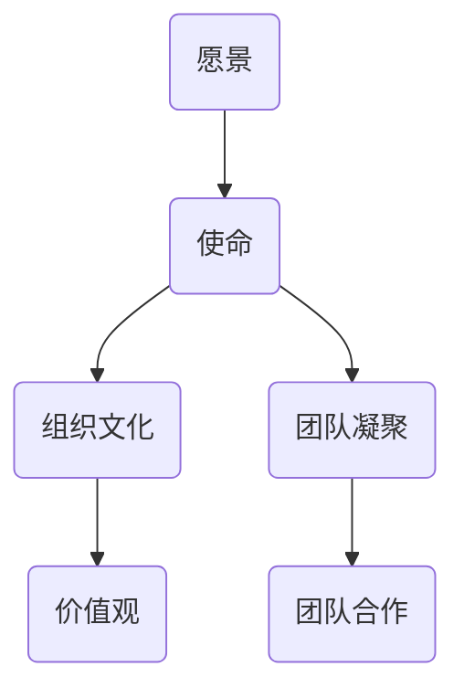

在这个ER实体关系图中，愿景和使命通过塑造组织文化和团队凝聚力，对价值观和团队合作产生积极影响。

**算法原理讲解**

愿景与使命的实现可以通过以下算法原理来解释：

1. **目标设定**：领导者应明确组织的愿景和使命，将其转化为具体的短期和长期目标。
2. **传达与沟通**：领导者需要通过定期的沟通和会议，将愿景和使命传达给团队成员，确保他们有共同的理解和认同。
3. **策略制定**：领导者应制订实现愿景和使命的具体策略和计划，确保团队成员在行动中有明确的指南。

**数学公式**

愿景与使命可以通过以下数学公式进行量化：

$$
\text{团队凝聚力} = \alpha \times \text{愿景认同度} + \beta \times \text{使命认同度}
$$

其中，α和β是权重系数，代表愿景认同度和使命认同度在团队凝聚力中的重要性。这个公式表明，愿景和使命的认同度是影响团队凝聚力的主要因素。

**举例说明**

假设一个技术公司领导者在其公司的使命声明中明确提出“通过创新技术，推动社会进步”的使命，并在公司愿景中描述了一个“成为全球领先的技术创新企业”的目标。为了实现这一愿景，领导者通过定期的团队会议和内部邮件，不断传达和强调公司的使命和愿景，确保团队成员对公司的目标和价值观有清晰的理解和认同。在这种环境下，团队成员的凝聚力显著提升，工作效率和创新能力也得到了极大的激发。

**最佳实践 Tips**

1. **制定明确的愿景与使命**：领导者应确保愿景和使命具体、明确，并与组织的核心价值和目标相一致。
2. **定期沟通与传达**：领导者需要定期与团队成员沟通愿景和使命，通过多种渠道确保信息的传递和认同。
3. **实际行动与示范**：领导者应通过自身的行动示范，展示对愿景和使命的坚定承诺，激励团队成员跟随。

**小结**

愿景与使命是领导者引领团队的重要工具，它们不仅为组织提供了明确的方向和目标，还能激发团队成员的激情和动力。领导者应通过明确设定、有效传达和实际行动，不断提升团队成员对愿景和使命的认同度，从而打造强大的团队凝聚力和组织文化。

---

#### 1.3 持续学习

在快速变化的现代社会，持续学习已成为领导者不可或缺的能力。持续学习不仅有助于领导者保持知识更新，提升个人技能，还能促进组织创新和成长。以下是对持续学习的详细探讨：

**核心概念与联系**

持续学习是指领导者通过不断获取新知识、技能和经验，以适应快速变化的环境和市场需求。它不仅包括正式的教育和学习，还包括日常的工作实践、自我反思和反思性学习。持续学习与领导力密切相关，它有助于领导者提升决策能力、增强适应性和创新能力。

**概念属性特征对比表格**

| 特征               | 持续学习                      | 领导力                        |
|------------------|------------------------------|------------------------------|
| 定义               | 不断获取新知识、技能和经验       | 引导和激励他人实现目标         |
| 关键要素           | 知识更新、自我反思、反思性学习    | 愿景引领、沟通能力、战略思维    |
| 对领导力的影响     | 提升决策能力、增强适应性、促进创新 | 确保团队目标实现、建立信任、激发潜能 |
| 实践方法           | 参加培训、阅读书籍、参与讨论会     | 设定愿景、建立文化、激励团队      |

**ER实体关系图架构的Mermaid流程图**

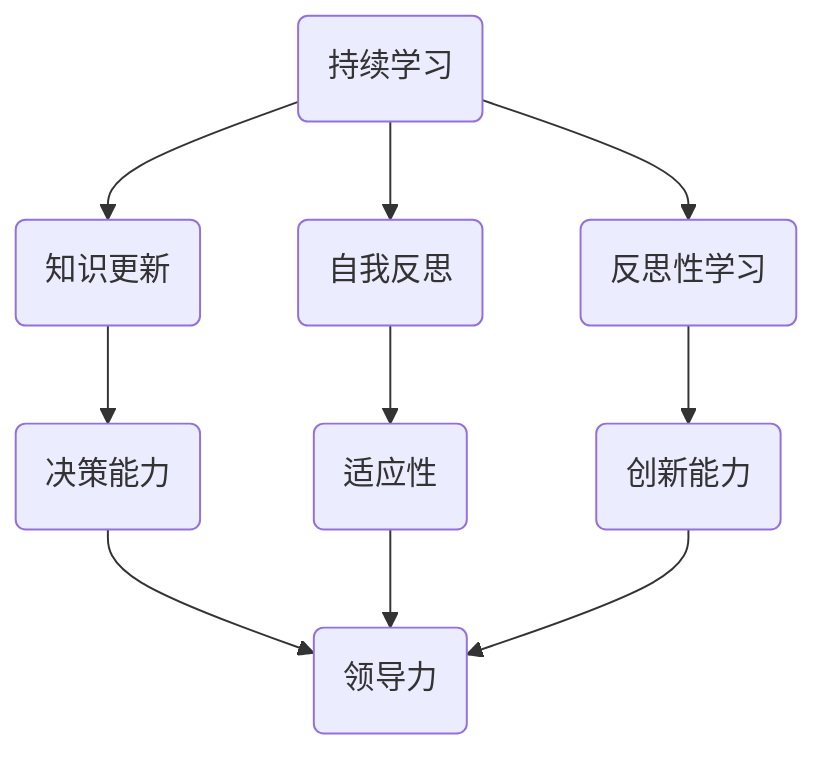

在这个ER实体关系图中，持续学习通过知识更新、自我反思和反思性学习，对决策能力、适应性和创新能力产生积极影响，进而提升领导力。

**算法原理讲解**

持续学习的实现可以通过以下算法原理来解释：

1. **知识获取**：领导者应不断从各种渠道获取新知识，包括参加培训、阅读书籍、参与行业会议等。
2. **自我反思**：领导者需定期进行自我反思，识别自身的优势和不足，并制定改进计划。
3. **反思性学习**：领导者应通过反思和总结自己的经验和教训，不断调整和优化领导行为。

**数学公式**

持续学习可以通过以下数学公式进行量化：

$$
\text{领导力提升度} = \alpha \times \text{知识更新度} + \beta \times \text{自我反思度} + \gamma \times \text{反思性学习度}
$$

其中，α、β和γ是权重系数，分别代表知识更新度、自我反思度和反思性学习度在领导力提升度中的重要性。这个公式表明，持续学习对领导力提升具有显著影响。

**举例说明**

假设一位领导者通过参加专业培训、阅读行业书籍和参加行业会议，不断更新自己的知识库。同时，他定期进行自我反思，识别自己在决策和沟通中的不足，并通过反思性学习进行调整和改进。在这种持续学习的过程中，这位领导者的决策能力、适应性和创新能力得到了显著提升，从而成为更优秀的领导者。

**最佳实践 Tips**

1. **设定学习目标**：领导者应明确自己的学习目标，并制定具体的学习计划。
2. **利用外部资源**：领导者可以利用各种外部资源，如培训课程、研讨会和行业专家，以加速学习过程。
3. **建立学习社区**：领导者可以建立学习社区，与团队成员一起分享知识和经验，促进共同成长。

**小结**

持续学习是领导者适应快速变化环境、提升个人能力和组织绩效的关键。通过不断获取新知识、自我反思和反思性学习，领导者可以提升决策能力、增强适应性和创新能力，从而成为卓越的领导者。

---

#### 1.4 关注员工成长

员工是组织最宝贵的资产，关注员工成长是领导者的重要职责。通过提供成长机会和资源，领导者可以激发员工的工作热情和创造力，从而推动组织的持续发展。以下是对关注员工成长的详细探讨：

**核心概念与联系**

关注员工成长是指领导者通过为员工提供职业发展机会、培训资源和个人指导，帮助员工提升技能、实现职业目标。它不仅有助于提升员工的满意度和忠诚度，还能增强团队的凝聚力和组织绩效。关注员工成长与领导力密切相关，领导者需通过有效的激励和培养，确保员工能够在组织中实现自身价值。

**概念属性特征对比表格**

| 特征               | 关注员工成长                      | 激励员工                      |
|------------------|------------------------------|------------------------------|
| 定义               | 为员工提供成长机会和资源          | 通过奖励和认可激发员工的积极性    |
| 关键要素           | 职业发展计划、培训机会、个人指导   | 正面反馈、奖励机制、挑战性目标   |
| 对领导力的影响     | 提升员工满意度和忠诚度、增强团队凝聚力 | 建立积极的工作氛围、提高员工绩效   |
| 实践方法           | 设立职业规划、提供培训资源、定期沟通   | 表扬与认可、设立奖励机制、设定目标 |

**ER实体关系图架构的Mermaid流程图**

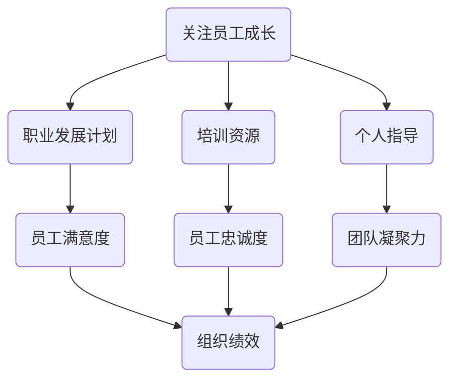

在这个ER实体关系图中，关注员工成长通过提供职业发展计划、培训资源和个人指导，对员工满意度、忠诚度、团队凝聚力和组织绩效产生积极影响。

**算法原理讲解**

关注员工成长的实现可以通过以下算法原理来解释：

1. **职业规划**：领导者应与员工共同制定职业发展计划，明确员工的短期和长期目标，并提供必要的支持和资源。
2. **培训与发展**：领导者需为员工提供丰富的培训资源，包括内部培训、外部课程和专业认证，以提升员工的技能和知识。
3. **个人指导**：领导者应提供个性化的指导，帮助员工解决工作中的难题，提升其职业素养和领导力。

**数学公式**

关注员工成长可以通过以下数学公式进行量化：

$$
\text{员工满意度} = \alpha \times \text{职业发展计划实施度} + \beta \times \text{培训资源丰富度} + \gamma \times \text{个人指导质量}
$$

其中，α、β和γ是权重系数，分别代表职业发展计划实施度、培训资源丰富度和个人指导质量在员工满意度中的重要性。这个公式表明，关注员工成长对提升员工满意度具有显著影响。

**举例说明**

假设一位领导者在其团队中推行了职业发展计划，为每位员工制定了清晰的职业目标和发展路径。同时，领导者组织了多种培训课程，并提供了丰富的学习资源，鼓励员工不断学习和提升技能。此外，领导者还定期与员工进行一对一的沟通和指导，帮助员工解决工作中遇到的问题。在这种关注员工成长的环境下，团队成员的工作热情和满意度显著提升，团队的整体绩效也得到了显著提高。

**最佳实践 Tips**

1. **明确职业目标**：领导者应与员工共同明确其职业目标，并提供具体的实施路径和资源支持。
2. **提供培训资源**：领导者应确保员工能够获取到高质量的培训资源，包括内部培训、外部课程和专业认证。
3. **个性化指导**：领导者应提供个性化的指导，根据员工的不同需求和特点，制定个性化的培养计划。

**小结**

关注员工成长是领导者提升员工满意度和忠诚度、增强团队凝聚力的重要手段。通过制定职业发展计划、提供培训资源和个性化指导，领导者可以激发员工的工作热情和创造力，从而推动组织的持续发展。领导者应将员工成长视为一项长期投资，持续关注和支持员工的成长。

---

#### 1.5 适应性与灵活性

在快速变化的商业环境中，适应性和灵活性已成为领导者成功的关键因素。领导者需要具备迅速应对变化、灵活调整策略和行动的能力，以确保组织能够在激烈的市场竞争中立于不败之地。以下是对适应性与灵活性的详细探讨：

**核心概念与联系**

适应性与灵活性是指领导者能够快速适应外部环境和内部变化，灵活调整组织战略和行动，以实现组织目标。它不仅包括对市场趋势的敏感性和快速反应能力，还涉及对内部资源的优化配置和灵活运用。

**概念属性特征对比表格**

| 特征               | 适应性                         | 灵活性                        |
|------------------|------------------------------|------------------------------|
| 定义               | 快速适应外部环境变化             | 灵活调整组织战略和行动         |
| 关键要素           | 敏感性、预见性、快速反应能力       | 创新思维、资源优化、灵活决策    |
| 对领导力的影响     | 提升组织的竞争力和生存能力         | 增强组织的适应性和变革能力       |
| 实践方法           | 建立预警机制、加强市场调研、灵活调整策略 | 创新思维训练、跨部门协作、快速迭代 |

**ER实体关系图架构的Mermaid流程图**

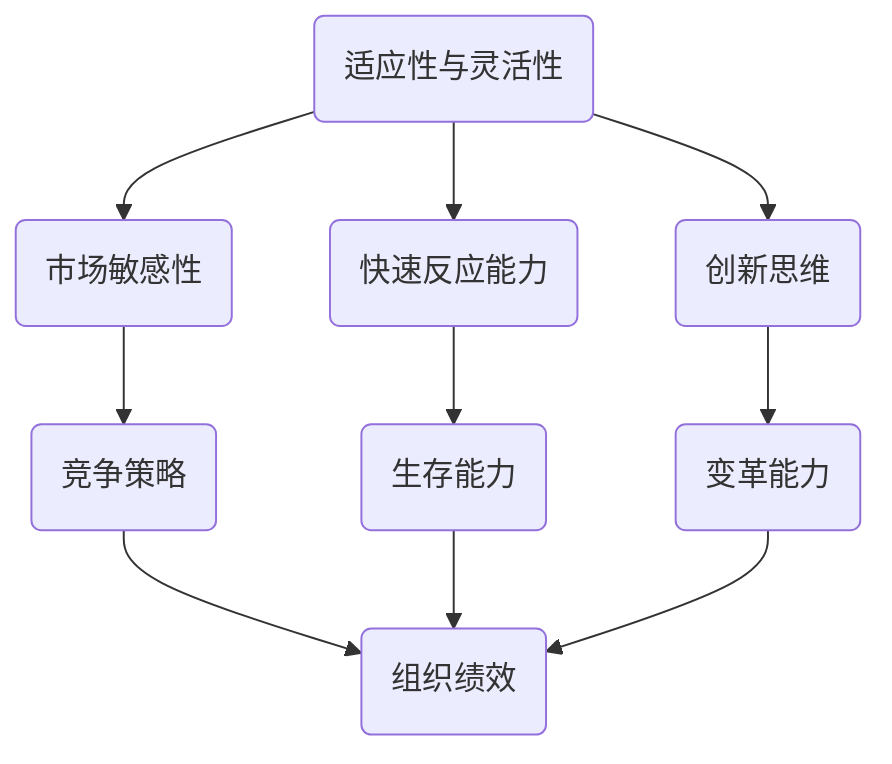

在这个ER实体关系图中，适应性与灵活性通过提升市场敏感性、快速反应能力和创新思维，对竞争策略、生存能力和变革能力产生积极影响，从而提升组织绩效。

**算法原理讲解**

适应性与灵活性的实现可以通过以下算法原理来解释：

1. **市场敏感性**：领导者需要密切关注市场动态，通过大数据分析、市场调研等手段，及时发现市场变化和趋势。
2. **快速反应能力**：领导者应具备快速决策和执行的能力，确保组织能够迅速响应市场变化。
3. **创新思维**：领导者需培养创新思维，鼓励团队进行创新和实验，以适应不断变化的环境。

**数学公式**

适应性与灵活性可以通过以下数学公式进行量化：

$$
\text{组织绩效} = \alpha \times \text{市场敏感性} + \beta \times \text{快速反应能力} + \gamma \times \text{创新思维}
$$

其中，α、β和γ是权重系数，分别代表市场敏感性、快速反应能力和创新思维在组织绩效中的重要性。这个公式表明，适应性与灵活性对提升组织绩效具有显著影响。

**举例说明**

假设一位领导者通过市场调研和数据分析，发现市场上对新型智能硬件有强烈需求。领导者迅速制定创新策略，组织研发团队进行产品开发和市场推广，同时灵活调整营销策略，确保产品能够迅速占领市场。在这种适应性与灵活性的指导下，组织不仅成功地抓住了市场机遇，还增强了市场竞争力和创新能力。

**最佳实践 Tips**

1. **建立预警机制**：领导者应建立市场预警机制，及时捕捉市场变化，提前制定应对策略。
2. **加强市场调研**：领导者应定期进行市场调研，深入了解客户需求和市场趋势，为决策提供依据。
3. **培养创新思维**：领导者应鼓励团队进行创新和实验，提供必要的资源和支持，以激发创新活力。

**小结**

适应性与灵活性是领导者应对快速变化环境、提升组织绩效的关键能力。通过提升市场敏感性、快速反应能力和创新思维，领导者可以确保组织在激烈的市场竞争中保持竞争优势。领导者应不断培养和提升自身的适应性与灵活性，以应对未来可能出现的各种挑战和机遇。

---

### 总结

通过本章的讨论，我们深入探讨了领导力的核心原则：诚信与透明、愿景与使命、持续学习、关注员工成长和适应性与灵活性。这些原则不仅为领导者提供了明确的行动指南，还帮助他们在变化和挑战中保持稳定和前进。诚信与透明是建立信任和团队凝聚力的基石；愿景与使命为组织提供了明确的方向和目标；持续学习帮助领导者保持知识更新和创新能力；关注员工成长激发员工的工作热情和创造力；适应性与灵活性确保组织在快速变化的市场环境中保持竞争优势。

领导者应深刻理解和实践这些核心原则，通过不断自我提升和团队建设，成为卓越的领导者。在接下来的章节中，我们将进一步探讨领导力技能和策略，帮助读者在领导实践中更好地应用这些原则，实现个人和组织的卓越成就。

---

## 第2章 战略思维：决策与规划

战略思维是领导者不可或缺的能力，它关乎组织的前途和命运。战略思维不仅仅是制定长远规划，更是在复杂环境中做出明智决策、推动组织持续发展的关键。本章将深入探讨战略思维的概念、关键要素以及如何进行有效的战略规划和决策。

### 战略思维的概念

战略思维是指领导者从整体角度出发，对组织的发展方向、目标和资源进行系统分析和规划的能力。它是一种宏观的、全局性的思维方式，强调对组织内外环境的深刻理解和把握。战略思维不仅涉及对当前状况的分析，还包括对未来趋势的预测和应对。

**核心概念与联系**

战略思维包括以下几个核心概念：

1. **愿景**：对组织未来状态的理想化描述，是战略思维的起点。
2. **使命**：组织存在的根本理由和目的，指导组织的核心活动。
3. **目标**：具体、可衡量的结果，是战略规划的关键指标。
4. **资源**：组织实现目标所需的资金、人才、技术等。
5. **环境分析**：对组织内外环境的系统评估，包括市场趋势、竞争对手、法律法规等。

**概念属性特征对比表格**

| 特征               | 愿景                 | 使命                 | 目标                 | 资源                 | 环境分析               |
|------------------|--------------------|--------------------|--------------------|--------------------|--------------------|
| 定义               | 对未来组织的理想状态     | 组织存在的根本理由       | 具体可衡量的结果     | 实现目标的资源集合     | 对组织内外环境的评估   |
| 关键要素           | 激励人心、明确方向       | 指导组织核心活动       | 可衡量、可实现       | 资金、人才、技术等     | 市场趋势、竞争对手等   |
| 对战略思维的影响     | 提供方向、激发热情        | 确定组织核心价值       | 制定具体行动计划     | 资源配置的依据         | 预测和应对外部环境     |

**ER实体关系图架构的Mermaid流程图**

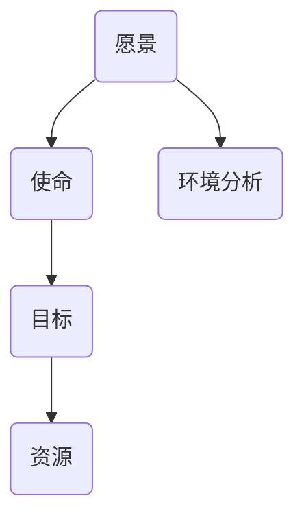

在这个ER实体关系图中，愿景和使命为组织提供方向和价值，目标为具体行动提供指导，资源是实现目标的保障，环境分析帮助预测和应对外部挑战。

### 关键要素

**环境分析**

环境分析是战略思维的核心要素之一，它帮助领导者了解组织的内外部环境，为战略规划和决策提供依据。环境分析包括以下几个方面：

1. **市场趋势**：领导者需关注市场动态，了解消费者需求、竞争对手的策略以及新兴技术趋势。
2. **竞争对手**：分析竞争对手的优势、劣势、市场占有率以及未来策略，为制定竞争策略提供参考。
3. **法律法规**：了解相关法律法规的变化，确保组织的战略规划和决策符合法律法规要求。
4. **社会文化**：考虑社会文化因素，如价值观、消费习惯等，确保战略规划与市场需求相匹配。

**目标设定**

目标设定是战略思维的关键环节，它需要明确、具体、可衡量。领导者需根据组织的愿景和使命，设定短期和长期的战略目标。设定目标时需考虑以下几个方面：

1. **明确性**：目标应具体、清晰，避免模糊和宽泛的描述。
2. **可衡量性**：目标应具备可衡量的指标，便于评估进展和成果。
3. **可实现性**：目标应具有挑战性，但又是可实现的，避免过高或过低的目标。
4. **相关性**：目标应与组织的愿景和使命保持一致，确保战略方向的一致性。

**资源规划**

资源规划是战略思维的重要组成部分，它涉及对组织内部资源的合理配置和使用。领导者需根据目标设定，明确所需资源，并进行有效的分配和利用。资源规划包括以下几个方面：

1. **资金**：确保组织有足够的资金支持战略规划和决策的实施。
2. **人才**：招募和培养具备专业技能和素质的员工，为组织发展提供人力支持。
3. **技术**：引入先进的技术和工具，提升组织的创新能力和竞争力。
4. **时间**：合理安排时间，确保战略规划和决策的及时实施。

### 战略规划实施

战略规划实施是将战略思维转化为具体行动的过程。领导者需制定详细的实施计划，确保战略目标的顺利实现。战略规划实施包括以下几个方面：

1. **制定行动计划**：将战略目标分解为具体的行动项目，明确责任人和时间表。
2. **资源调配**：根据行动计划，合理调配资源，确保各项行动有充足的支持。
3. **监控与调整**：建立监控机制，定期评估战略规划的执行情况，及时调整和优化行动方案。
4. **团队协作**：促进团队内部和跨部门的协作，确保战略规划的有效实施。

### 决策与执行

决策与执行是战略思维的核心环节，它关乎组织的成功与失败。领导者需在战略规划和实施过程中，做出明智的决策，并确保决策得到有效执行。

**决策制定**

1. **问题识别**：明确问题，确保决策针对具体问题，避免盲目决策。
2. **信息收集**：收集与决策相关的信息，包括市场数据、内部情况等。
3. **方案评估**：评估不同方案的优缺点，选择最佳方案。
4. **决策制定**：综合考虑各种因素，制定决策方案。

**执行策略**

1. **制定执行计划**：明确执行步骤、责任人和时间表。
2. **资源配置**：确保执行计划所需的资源得到有效调配。
3. **监控与反馈**：建立监控机制，及时反馈执行情况，确保计划顺利进行。
4. **调整与优化**：根据执行过程中出现的问题，及时调整和优化执行计划。

### 总结

战略思维是领导者成功的关键，它关乎组织的长远发展和竞争优势。通过理解战略思维的概念、关键要素以及战略规划实施和决策与执行，领导者可以更好地应对复杂环境，推动组织实现卓越的业绩。在接下来的章节中，我们将进一步探讨领导力技能，帮助读者在领导实践中更好地应用战略思维，实现组织的卓越成就。

---

### 2.1 战略思维的概念

战略思维是指领导者从宏观角度出发，对组织的发展方向、目标和资源进行系统分析和规划的能力。它是一种全局性的思维方式，强调对组织内外环境的深刻理解和把握。战略思维不仅仅是制定长远规划，更是在复杂环境中做出明智决策、推动组织持续发展的关键。

**核心概念与联系**

战略思维涉及以下几个核心概念：

1. **愿景**：对组织未来状态的理想化描述，是战略思维的起点。愿景应具有激励人心、明确方向的特点。
2. **使命**：组织存在的根本理由和目的，指导组织的核心活动。使命应明确、具体，并与组织的核心价值观保持一致。
3. **目标**：具体、可衡量的结果，是战略规划的关键指标。目标应明确、具体、可衡量、可实现。
4. **资源**：组织实现目标所需的资金、人才、技术等。资源是战略规划的重要保障。
5. **环境分析**：对组织内外环境的系统评估，包括市场趋势、竞争对手、法律法规等。环境分析是制定战略规划的基础。

**概念属性特征对比表格**

| 特征               | 愿景                 | 使命                 | 目标                 | 资源                 | 环境分析               |
|------------------|--------------------|--------------------|--------------------|--------------------|--------------------|
| 定义               | 对未来组织的理想状态     | 组织存在的根本理由       | 具体可衡量的结果     | 实现目标的资源集合     | 对组织内外环境的评估   |
| 关键要素           | 激励人心、明确方向       | 指导组织核心活动       | 可衡量、可实现       | 资金、人才、技术等     | 市场趋势、竞争对手等   |
| 对战略思维的影响     | 提供方向、激发热情        | 确定组织核心价值       | 制定具体行动计划     | 资源配置的依据         | 预测和应对外部环境     |

**ER实体关系图架构的Mermaid流程图**


在这个ER实体关系图中，愿景和使命为组织提供方向和价值，目标为具体行动提供指导，资源是实现目标的保障，环境分析帮助预测和应对外部挑战。

**算法原理讲解**

战略思维的实施可以通过以下算法原理来解释：

1. **愿景与使命**：领导者应明确组织的愿景和使命，确保它们具有激励人心、明确方向的特点，为组织发展提供指导。
2. **目标设定**：领导者需根据愿景和使命，设定具体、可衡量的目标，确保目标具有可实现性，并能够指导组织行动。
3. **资源规划**：领导者应明确实现目标所需的资源，并进行合理配置和利用，确保资源能够支持组织目标的实现。
4. **环境分析**：领导者需对组织内外环境进行系统评估，了解市场趋势、竞争对手和法律法规等，为战略规划提供依据。

**数学公式**

战略思维可以通过以下数学公式进行量化：

$$
\text{战略规划效果} = \alpha \times \text{愿景明确度} + \beta \times \text{使命明确度} + \gamma \times \text{目标可实现度} + \delta \times \text{资源合理配置度} + \epsilon \times \text{环境适应度}
$$

其中，α、β、γ、δ和ε是权重系数，分别代表愿景明确度、使命明确度、目标可实现度、资源合理配置度和环境适应度在战略规划效果中的重要性。这个公式表明，战略思维的各个要素对战略规划效果具有显著影响。

**举例说明**

假设一家科技公司领导者明确了公司的愿景：“成为全球领先的科技创新企业”，并确立了使命：“通过技术创新，推动社会进步”。为了实现这一愿景和使命，领导者设定了具体的短期和长期目标，如“在三年内将市场份额提高20%”和“五年内成为行业领导者”。在资源规划方面，领导者确保了足够的资金、人才和技术支持，并对市场趋势、竞争对手和法律法规进行了全面分析。在这种战略思维的指导下，公司实现了快速增长，并在市场中建立了强大的竞争优势。

**最佳实践 Tips**

1. **明确愿景和使命**：领导者应确保组织的愿景和使命具有激励人心、明确方向的特点，为组织发展提供清晰的指导。
2. **设定具体目标**：领导者需根据愿景和使命，设定具体、可衡量的目标，确保目标具有可实现性。
3. **全面分析环境**：领导者应对组织内外环境进行系统评估，了解市场趋势、竞争对手和法律法规等，为战略规划提供依据。
4. **合理配置资源**：领导者应明确实现目标所需的资源，并进行合理配置和利用，确保资源能够支持组织目标的实现。

**小结**

战略思维是领导者成功的关键，它关乎组织的长远发展和竞争优势。通过理解战略思维的概念、核心要素以及环境分析和资源规划，领导者可以更好地应对复杂环境，制定有效的战略规划，推动组织实现卓越的业绩。

---

### 2.2 SWOT分析

SWOT分析是一种常用的战略规划工具，用于评估组织的优势、劣势、机会和威胁。通过SWOT分析，领导者可以全面了解组织所处的环境，识别内部和外部因素，从而制定更有针对性的战略计划。以下是对SWOT分析的详细探讨：

**核心概念与联系**

SWOT分析（Strengths, Weaknesses, Opportunities, Threats）是一种系统化的战略分析工具，它帮助领导者识别和分析组织的优势、劣势、机会和威胁。优势（Strengths）和劣势（Weaknesses）是组织内部的因素，机会（Opportunities）和威胁（Threats）是组织外部的因素。通过SWOT分析，领导者可以制定出更全面、更科学的战略计划。

**概念属性特征对比表格**

| 特征               | 优势                     | 劣势                     | 机会                     | 威胁                     |
|------------------|------------------------|------------------------|------------------------|------------------------|
| 定义               | 组织内部的优势和资源      | 组织内部的不足和挑战      | 组织外部的有利条件和趋势 | 组织外部的风险和挑战      |
| 关键要素           | 独特资源、核心竞争力、团队优势 | 缺乏资源、管理问题、技术瓶颈 | 市场需求、技术进步、政策支持 | 竞争对手、市场波动、法律法规 |
| 对战略规划的影响     | 制定优势利用策略          | 制定改进和优化方案       | 抓住外部机会、制定机会策略 | 制定风险应对策略、规避威胁   |

**ER实体关系图架构的Mermaid流程图**

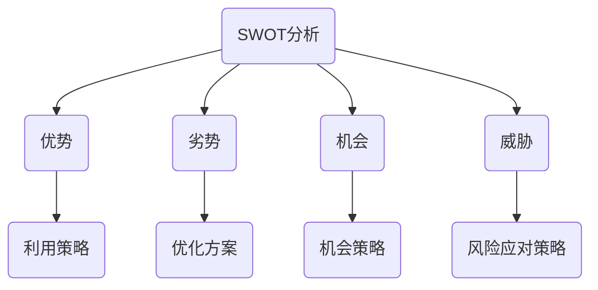

在这个ER实体关系图中，SWOT分析通过识别组织的优势、劣势、机会和威胁，为制定利用优势策略、优化劣势方案、抓住机会策略和应对威胁策略提供指导。

**算法原理讲解**

SWOT分析的实施可以通过以下算法原理来解释：

1. **优势识别**：领导者需识别组织内部的优势，包括独特的资源、核心竞争力、团队优势等，为利用优势制定策略。
2. **劣势分析**：领导者需分析组织内部的劣势，包括缺乏资源、管理问题、技术瓶颈等，为改进和优化制定方案。
3. **机会评估**：领导者需评估组织外部的机会，包括市场需求、技术进步、政策支持等，为抓住机会制定策略。
4. **威胁分析**：领导者需分析组织外部的威胁，包括竞争对手、市场波动、法律法规等，为规避威胁制定策略。

**数学公式**

SWOT分析可以通过以下数学公式进行量化：

$$
\text{战略规划效果} = \alpha \times \text{优势利用度} + \beta \times \text{劣势改进度} + \gamma \times \text{机会抓住度} + \delta \times \text{威胁规避度}
$$

其中，α、β、γ和δ是权重系数，分别代表优势利用度、劣势改进度、机会抓住度和威胁规避度在战略规划效果中的重要性。这个公式表明，SWOT分析的各个要素对战略规划效果具有显著影响。

**举例说明**

假设一家制造企业通过SWOT分析发现其优势包括先进的生产技术、稳定的客户群体和强大的研发团队；劣势包括产品线较为单一、市场竞争激烈；机会包括新兴市场的需求增加和政策支持；威胁包括竞争对手的崛起和原材料价格的波动。在这种情况下，企业可以制定以下策略：

- **优势利用**：进一步开发新产品，利用先进的生产技术提升产品质量，扩大市场份额。
- **劣势改进**：加强市场调研，丰富产品线，提升市场竞争力。
- **机会抓住**：积极开拓新兴市场，利用政策支持获取更多资源。
- **威胁规避**：与供应商建立长期合作关系，降低原材料价格波动带来的风险。

**最佳实践 Tips**

1. **全面收集信息**：进行SWOT分析时，领导者应全面收集和分析内部和外部信息，确保分析结果准确。
2. **制定具体策略**：根据SWOT分析的结果，制定具体、可操作的战略计划，确保每个要素都有明确的应对措施。
3. **定期更新**：组织环境不断变化，领导者应定期进行SWOT分析，确保战略计划与实际情况保持一致。

**小结**

SWOT分析是一种有效的战略规划工具，通过识别组织的优势、劣势、机会和威胁，领导者可以制定出更有针对性的战略计划。通过全面收集信息、制定具体策略和定期更新，领导者可以确保组织在复杂的环境中保持竞争优势，实现长期发展。

---

### 2.3 PEST分析

PEST分析是一种常用的战略规划工具，用于评估组织所面临的宏观环境因素。通过PEST分析，领导者可以全面了解外部环境的变化，为组织制定适应性强的战略计划。以下是对PEST分析的详细探讨：

**核心概念与联系**

PEST分析（Political, Economic, Social, Technological）是一种宏观环境分析工具，它帮助领导者识别和分析组织外部环境中的政治、经济、社会和技术等四个方面的因素。这些因素对组织的战略决策和运营有重要影响。通过PEST分析，领导者可以更好地应对外部环境的变化，制定有针对性的战略计划。

**概念属性特征对比表格**

| 特征               | 政治                     | 经济                     | 社会                     | 技术                     |
|------------------|------------------------|------------------------|------------------------|------------------------|
| 定义               | 政治因素，如政策法规、国际关系 | 经济因素，如经济增长、通货膨胀 | 社会因素，如文化、价值观、人口结构 | 技术因素，如技术创新、技术趋势 |
| 关键要素           | 政策法规、政治稳定性       | 经济增长、市场需求、通货膨胀 | 社会文化、人口结构、教育水平     | 技术创新、技术进步、技术趋势   |
| 对战略规划的影响     | 影响组织的合规性、运营风险  | 影响市场需求、竞争格局       | 影响消费行为、市场需求       | 推动技术创新、改变竞争格局     |

**ER实体关系图架构的Mermaid流程图**

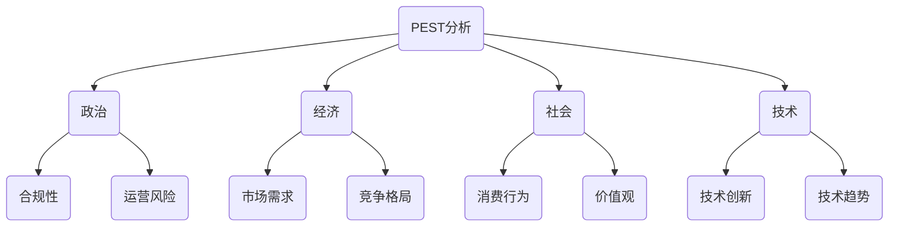

在这个ER实体关系图中，PEST分析通过识别政治、经济、社会和技术四个方面的因素，为评估组织的合规性、运营风险、市场需求、竞争格局、消费行为、价值观、技术创新和技术趋势提供指导。

**算法原理讲解**

PEST分析的实施可以通过以下算法原理来解释：

1. **政治因素**：领导者需关注政治因素，如政策法规、政治稳定性，确保组织的运营符合法规要求，降低政治风险。
2. **经济因素**：领导者需关注经济因素，如经济增长、市场需求、通货膨胀，分析市场需求变化，调整战略计划。
3. **社会因素**：领导者需关注社会因素，如社会文化、人口结构、教育水平，了解消费者的价值观和行为，为市场策略提供依据。
4. **技术因素**：领导者需关注技术因素，如技术创新、技术趋势，利用技术优势，推动组织创新和竞争力提升。

**数学公式**

PEST分析可以通过以下数学公式进行量化：

$$
\text{战略适应性} = \alpha \times \text{政治稳定性} + \beta \times \text{经济适应性} + \gamma \times \text{社会适应性} + \delta \times \text{技术适应性}
$$

其中，α、β、γ和δ是权重系数，分别代表政治稳定性、经济适应性、社会适应性和技术适应性在战略适应性中的重要性。这个公式表明，PEST分析的各个要素对战略适应性具有显著影响。

**举例说明**

假设一家科技公司通过PEST分析发现：

- 政治因素：政府鼓励创新和高新技术产业发展，政策支持力度大。
- 经济因素：市场需求增长，尤其是新兴市场的需求旺盛。
- 社会因素：消费者对科技创新产品的接受度提高，科技意识增强。
- 技术因素：技术进步迅速，尤其是人工智能和物联网技术。

在这种情况下，公司可以制定以下战略：

- 政治因素：积极争取政府支持，获取政策和资金扶持。
- 经济因素：加大市场开发力度，特别是新兴市场。
- 社会因素：加强品牌宣传，提升消费者对品牌的认可度。
- 技术因素：加大技术研发投入，推动技术创新和产品升级。

**最佳实践 Tips**

1. **定期分析**：领导者应定期进行PEST分析，及时了解外部环境的变化，确保战略计划的适应性。
2. **综合评估**：在制定战略计划时，领导者应综合考虑PEST分析的结果，确保战略计划具有全面性和前瞻性。
3. **灵活调整**：根据外部环境的变化，领导者应灵活调整战略计划，确保组织能够适应新的市场环境。

**小结**

PEST分析是一种有效的战略规划工具，通过识别和分析政治、经济、社会和技术四个方面的因素，领导者可以更好地应对外部环境的变化，制定适应性强的战略计划。通过定期分析、综合评估和灵活调整，领导者可以确保组织在复杂的外部环境中保持竞争优势，实现长期发展。

---

### 2.4 战略规划实施

战略规划实施是将战略思维转化为具体行动的过程。一个良好的战略规划如果不能得到有效实施，将无法实现预期目标。领导者需要在战略规划实施过程中，制定详细的行动计划，确保资源的合理配置和团队的协作，同时建立监控机制，及时调整和优化战略计划。以下是对战略规划实施的详细探讨：

**核心概念与联系**

战略规划实施包括以下几个核心概念：

1. **行动计划**：将战略目标分解为具体的行动项目，明确责任人和时间表，确保战略目标的实现。
2. **资源调配**：根据行动计划，合理调配资源，确保各项行动有充足的支持，包括资金、人才和物资等。
3. **团队协作**：促进团队内部和跨部门的协作，确保战略规划的有效实施。
4. **监控与调整**：建立监控机制，定期评估战略规划的执行情况，及时调整和优化行动方案，确保战略目标的实现。

**概念属性特征对比表格**

| 特征               | 行动计划                         | 资源调配                       | 团队协作                       | 监控与调整                     |
|------------------|------------------------------|------------------------------|------------------------------|------------------------------|
| 定义               | 将战略目标分解为具体的行动项目      | 根据行动计划，合理调配资源      | 促进团队内部和跨部门的协作      | 定期评估战略规划的执行情况      |
| 关键要素           | 明确责任人和时间表               | 确保资源充足和支持               | 建立协作机制、提高沟通效率      | 监控执行进度、及时调整和优化    |
| 对战略规划实施的影响     | 确保战略目标的具体实现             | 提高资源利用效率、确保行动顺利实施 | 提高团队协作效率、实现战略目标   | 及时发现和解决问题、提高战略实施效果 |
| 实践方法           | 制定详细的行动计划               | 制定资源调配计划、优化资源配置    | 建立协作沟通机制、提升团队凝聚力  | 定期召开会议、分析执行情况        |

**ER实体关系图架构的Mermaid流程图**

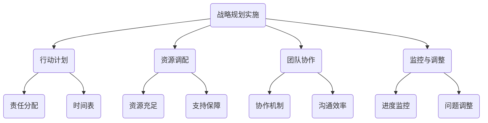

在这个ER实体关系图中，战略规划实施通过制定行动计划、资源调配、团队协作和监控与调整，确保战略目标的实现。

**算法原理讲解**

战略规划实施可以通过以下算法原理来解释：

1. **分解目标**：将战略目标分解为具体的行动项目，明确每个项目的责任人和时间表，确保行动的具体性和可执行性。
2. **资源优化**：根据行动计划，制定资源调配计划，确保资源充足且有效利用，为行动提供支持。
3. **团队协作**：建立有效的协作机制，提高团队沟通效率，确保团队成员能够协同工作，共同实现战略目标。
4. **动态调整**：建立监控机制，定期评估战略规划的执行情况，及时发现和解决问题，确保战略目标的实现。

**数学公式**

战略规划实施可以通过以下数学公式进行量化：

$$
\text{战略实施效果} = \alpha \times \text{行动计划具体度} + \beta \times \text{资源调配效率} + \gamma \times \text{团队协作效率} + \delta \times \text{监控调整及时度}
$$

其中，α、β、γ和δ是权重系数，分别代表行动计划具体度、资源调配效率、团队协作效率和监控调整及时度在战略实施效果中的重要性。这个公式表明，战略规划实施的各个要素对战略实施效果具有显著影响。

**举例说明**

假设一家科技公司制定了五年战略规划，目标是在五年内成为行业领导者。为实现这一目标，公司制定了以下行动计划：

- **第一年**：建立人工智能研发团队，开发核心产品。
- **第二年**：扩大市场份额，提高品牌知名度。
- **第三年**：优化产品线，推出新产品，提高用户体验。
- **第四年**：拓展国际市场，进入新兴市场。
- **第五年**：巩固市场地位，实现盈利目标。

在资源调配方面，公司确保了充足的研发资金、招聘了优秀的研发人员，并配备了先进的技术设备。在团队协作方面，公司建立了跨部门协作机制，提高了沟通效率。在监控与调整方面，公司建立了定期评估机制，每季度对战略规划的执行情况进行评估，并根据实际情况进行调整。

通过以上措施，公司成功实现了战略规划的目标，在五年内成为了行业领导者。

**最佳实践 Tips**

1. **明确行动计划**：制定详细的行动计划，确保每个项目都有明确的责任人和时间表。
2. **优化资源配置**：根据行动计划，合理调配资源，确保资源充足且有效利用。
3. **促进团队协作**：建立有效的协作机制，提高团队沟通效率，确保团队成员能够协同工作。
4. **建立监控机制**：定期评估战略规划的执行情况，及时调整和优化行动方案。

**小结**

战略规划实施是将战略思维转化为具体行动的过程，领导者需要通过制定详细的行动计划、优化资源配置、促进团队协作和建立监控机制，确保战略目标的实现。通过明确行动计划、优化资源配置、促进团队协作和建立监控机制，领导者可以确保战略规划的有效实施，推动组织实现长期发展。

---

### 2.5 战略决策与执行

战略决策与执行是战略管理过程中的两个关键环节。战略决策涉及如何选择最佳的策略和路径来实现组织的长期目标，而战略执行则是指将决策转化为具体行动的过程。以下是对战略决策与执行的详细探讨：

**核心概念与联系**

战略决策（Strategic Decision Making）是指领导者根据组织的战略目标和外部环境，选择最合适的策略和路径的过程。战略执行（Strategic Execution）则是将战略决策转化为具体行动，确保战略目标得以实现的过程。战略决策与执行相互关联，战略决策为战略执行提供了方向和依据，而战略执行的成效又反过来影响战略决策。

**概念属性特征对比表格**

| 特征               | 战略决策                       | 战略执行                       |
|------------------|------------------------------|------------------------------|
| 定义               | 选择最佳策略和路径             | 将决策转化为具体行动           |
| 关键要素           | 信息收集、方案评估、决策制定      | 行动计划、资源调配、团队协作      |
| 对战略管理的影响     | 确定组织发展方向和目标           | 实现战略目标和提升组织绩效       |
| 实践方法           | 深入分析、科学决策、灵活调整      | 制定详细的行动计划、确保资源支持、持续监控 |

**ER实体关系图架构的Mermaid流程图**

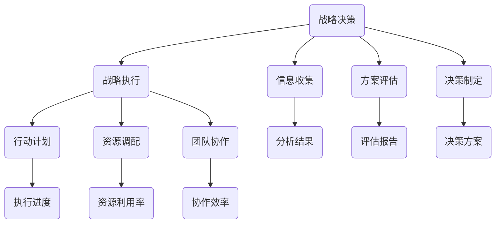

在这个ER实体关系图中，战略决策通过信息收集、方案评估和决策制定，为战略执行提供方向和依据，而战略执行通过行动计划、资源调配和团队协作，确保战略目标的实现。

**算法原理讲解**

战略决策与执行可以通过以下算法原理来解释：

1. **信息收集**：领导者需要收集与决策相关的各种信息，包括内部数据和外部数据，确保决策基于充分的信息基础。
2. **方案评估**：领导者需对不同的战略方案进行详细评估，包括优点、缺点、风险和潜在收益，选择最合适的方案。
3. **决策制定**：在综合评估的基础上，领导者需做出最终的战略决策，明确组织的战略方向和目标。
4. **资源调配**：根据战略决策，领导者需制定资源调配计划，确保战略执行所需的资源得到合理配置和利用。
5. **团队协作**：建立有效的团队协作机制，提高团队的整体执行力，确保战略决策能够得到有效实施。

**数学公式**

战略决策与执行可以通过以下数学公式进行量化：

$$
\text{战略决策效果} = \alpha \times \text{信息收集全面度} + \beta \times \text{方案评估准确性} + \gamma \times \text{决策制定科学性}
$$

$$
\text{战略执行效果} = \delta \times \text{行动计划具体度} + \epsilon \times \text{资源调配效率} + \zeta \times \text{团队协作效率}
$$

其中，α、β、γ、δ、ε和ζ是权重系数，分别代表信息收集全面度、方案评估准确性、决策制定科学性、行动计划具体度、资源调配效率和团队协作效率在战略决策效果和战略执行效果中的重要性。这个公式表明，战略决策与执行的各个要素对战略管理效果具有显著影响。

**举例说明**

假设一家公司在面临市场变化时，需要进行战略决策以保持竞争力。以下是战略决策与执行的具体过程：

1. **信息收集**：公司通过市场调研、数据分析等方式，收集了关于市场需求、竞争对手策略和行业趋势的信息。
2. **方案评估**：公司对多个战略方案进行了评估，包括产品创新、市场扩张和合作伙伴关系等，分析了每个方案的优缺点和潜在风险。
3. **决策制定**：公司最终决定采取产品创新和市场扩张相结合的策略，以应对市场变化。
4. **资源调配**：公司制定了详细的资源调配计划，确保有足够的资金和人力资源支持战略决策的实施。
5. **团队协作**：公司建立了跨部门协作机制，确保各部门能够协同工作，共同推进战略决策的执行。

通过以上措施，公司成功应对了市场变化，保持了竞争力，实现了战略目标。

**最佳实践 Tips**

1. **信息收集**：确保决策基于充分的信息基础，避免盲目决策。
2. **方案评估**：对多个方案进行详细评估，选择最佳方案。
3. **决策制定**：科学制定决策，明确战略方向和目标。
4. **资源调配**：确保战略执行所需的资源得到合理配置和利用。
5. **团队协作**：建立有效的团队协作机制，提高执行效率。

**小结**

战略决策与执行是战略管理过程中的两个关键环节。通过科学的信息收集、方案评估和决策制定，以及有效的资源调配和团队协作，领导者可以确保战略决策的有效执行，推动组织实现长期发展。战略决策与执行的实践不仅有助于提高组织的竞争力，还能增强组织的适应性和创新能力。

---

### 第3章 构建信任：领导力的桥梁

构建信任是领导者成功的关键，它不仅关乎个人的领导力，还直接影响到团队的绩效和组织的文化。信任是领导力的桥梁，它连接着领导者与团队成员，使他们能够共同努力，克服挑战，实现共同目标。本章将深入探讨构建信任的重要性、关键要素以及如何在日常工作中培养信任。

#### 构建信任的重要性

信任是团队协作和高效工作的基础。在一个信任度高的团队中，成员之间相互支持、相互依赖，能够更有效地沟通和协作。以下是构建信任的重要性：

1. **提升团队绩效**：信任能够减少沟通障碍，提高工作效率，使团队成员能够更好地协作，从而提升整体绩效。
2. **增强团队凝聚力**：信任能够增强团队的凝聚力，使成员更加愿意为团队目标而努力，共同面对挑战。
3. **促进创新和变革**：信任能够鼓励团队成员提出新的想法和建议，推动组织创新和变革，保持竞争力。
4. **提升员工满意度**：信任能够提高员工的工作满意度和忠诚度，降低员工流失率，为组织稳定发展提供保障。

#### 关键要素

构建信任的关键要素包括诚信与透明、有效沟通和正直行为。以下是这些要素的详细探讨：

**诚信与透明**

诚信是构建信任的基石。领导者应以诚实和真诚的态度面对团队成员和合作伙伴，避免任何形式的欺骗和虚假陈述。透明是信任的重要保障，领导者应保持信息的透明，及时与团队成员分享组织的动态和重要决策。

**有效沟通**

有效沟通是建立信任的关键。领导者应积极倾听团队成员的意见和反馈，确保信息的双向流动。通过开放、坦诚的沟通，领导者能够建立信任，消除误解和猜疑。

**正直行为**

正直行为是领导者赢得信任的重要途径。领导者应以身作则，遵循道德准则，保持正直。在面对冲突和困境时，领导者应坚持原则，做出公正的决策。

#### 如何在日常生活中培养信任

**以身作则**

领导者应以身作则，通过自己的言行树立榜样。诚实、透明和正直的行为能够激励团队成员效仿，从而建立起信任的文化。

**积极倾听**

领导者应积极倾听团队成员的意见和反馈，给予关注和支持。通过倾听，领导者能够了解团队成员的需求和期望，建立信任关系。

**透明决策**

领导者应保持决策过程的透明，及时与团队成员分享决策的背景、原因和影响。通过透明决策，领导者能够增强团队成员的信任感。

**承认错误**

领导者应勇于承认自己的错误和不足，并采取措施进行纠正。承认错误能够表明领导者的正直和诚信，增强团队成员的信任。

**持续反馈**

领导者应定期给予团队成员反馈，包括工作表现和改进建议。通过持续反馈，领导者能够帮助团队成员提升能力，建立信任关系。

**共同目标**

领导者应与团队成员共同设定目标，并确保每个成员都理解自己的角色和责任。通过共同目标，领导者能够增强团队的凝聚力，建立信任。

#### 总结

构建信任是领导者成功的关键。通过诚信与透明、有效沟通和正直行为，领导者可以建立起强大的信任基础，推动团队和组织实现卓越的业绩。在日常工作中，领导者应以身作则、积极倾听、透明决策、承认错误和持续反馈，不断培养信任，促进团队的协作和成长。通过构建信任，领导者可以成为卓越的领导者，为组织创造持续的价值。

---

### 第4章 团队建设：成就伟大团队的秘诀

团队建设是领导者的重要职责之一，它关乎组织的整体绩效和长期发展。一个高效的团队能够实现协作共赢，克服各种挑战，实现组织的目标。本章将深入探讨团队建设的核心要素，包括团队的定义与类型、团队成员的角色以及激励与赋能的方法。

#### 团队的定义与类型

**团队的定义**

团队是指由两个或两个以上成员组成的、为了实现共同目标而协作工作的组织。团队具有以下特点：

1. **共同目标**：团队成员有共同的目标和愿景，致力于实现团队的目标。
2. **相互依赖**：团队成员之间相互依赖，通过协作和合作实现共同目标。
3. **共同责任**：团队成员共同承担实现团队目标的职责，共同面对挑战和困境。

**团队的类型**

团队可以分为以下几种类型：

1. **功能团队**：根据职能和任务进行划分，如研发团队、市场团队、财务团队等。
2. **跨功能团队**：由不同部门或领域的成员组成，旨在解决特定问题或完成特定项目。
3. **自组织团队**：团队成员自行组织和管理，具有高度的自主性和灵活性。
4. **虚拟团队**：团队成员分布在不同的地理位置，通过现代通信技术进行协作。

#### 团队成员的角色

在团队中，每个成员都有特定的角色和职责。以下是一些常见的团队成员角色：

1. **领导者**：负责团队的整体管理和协调，制定目标和策略，激励团队成员。
2. **执行者**：负责具体任务的执行，按照团队计划完成各项工作。
3. **沟通者**：负责团队内部的沟通和协调，确保信息的流畅传递。
4. **创新者**：负责提出新的想法和解决方案，推动团队的创新和进步。
5. **协调者**：负责协调不同团队成员之间的工作，解决冲突和问题。

#### 激励与赋能的方法

激励与赋能是团队建设的重要组成部分，它关乎团队成员的工作热情和创造力。以下是一些有效的激励与赋能方法：

1. **目标设定**：明确团队和个人的目标，确保团队成员对目标有共同的理解和认同。目标应具有挑战性，但又是可实现的。
2. **反馈与认可**：定期给予团队成员反馈，认可他们的工作成果和进步。正面反馈能够增强团队成员的自信心和积极性。
3. **培训与发展**：为团队成员提供培训和发展机会，帮助他们提升技能和知识。培训不仅有助于提升个人能力，还能增强团队的竞争力。
4. **授权**：给予团队成员足够的自主权和决策权，鼓励他们发挥主观能动性，为团队贡献自己的智慧和创造力。
5. **团队建设活动**：定期组织团队建设活动，如团队培训、团队旅行、团建游戏等，增强团队成员之间的信任和凝聚力。

#### 团队协作与冲突管理

团队协作和冲突管理是团队建设中至关重要的一环。以下是一些关键点：

**团队协作**

1. **明确职责**：确保每个团队成员都清楚自己的职责和任务，避免职责重叠和推诿。
2. **沟通与协调**：建立有效的沟通渠道，确保团队成员之间的信息畅通，及时解决协作中的问题。
3. **共同目标**：确保团队成员有共同的目标和愿景，共同为团队的成功而努力。
4. **相互支持**：团队成员应相互支持，共同面对困难和挑战，形成团队凝聚力。

**冲突管理**

1. **预防冲突**：通过建立明确的团队规则和沟通机制，预防潜在冲突的发生。
2. **及时解决**：一旦发生冲突，领导者应立即采取措施进行解决，避免冲突升级。
3. **公平公正**：在解决冲突时，应保持公正和客观，确保处理结果的公平性。
4. **开放对话**：鼓励团队成员进行开放对话，表达自己的观点和意见，寻找解决问题的方法。

#### 总结

团队建设是领导者成功的关键之一。通过明确团队定义和类型、理解团队成员的角色以及采用有效的激励与赋能方法，领导者可以打造一个高效的团队，实现组织的目标。在团队协作和冲突管理中，领导者应注重沟通与协调，确保团队成员之间的信任和合作，从而提升团队的整体绩效。

---

### 第5章 应对变革：领导者的应变策略

变革是组织发展过程中不可避免的一部分，它可能源于外部环境的变化、技术的进步或内部管理的需要。领导者需要具备应对变革的能力，以带领组织顺利度过变革期，保持竞争优势。本章将深入探讨变革的必然性、领导者在变革中的作用以及如何引领组织适应变革。

#### 变革的必然性

**市场环境的变化**

市场的不断变化是推动组织变革的主要原因之一。消费者需求的变化、竞争格局的演变以及新技术的发展，都要求组织不断调整策略和运营模式，以适应新的市场环境。例如，随着电子商务的兴起，许多传统零售企业不得不进行数字化转型，以保持竞争力。

**技术的进步**

技术的迅猛发展也为组织变革提供了契机。新技术不仅改变了传统行业的运作模式，还带来了新的商业模式和机会。例如，人工智能、大数据和物联网等技术的应用，为组织提供了更高效、更智能的管理方式，从而推动组织的变革。

**内部管理的需要**

内部管理的需要也是组织变革的重要驱动力。随着组织规模的扩大和业务的发展，内部管理可能变得复杂，效率低下。通过变革，组织可以优化管理流程，提高运营效率，降低成本。

#### 领导者在变革中的作用

**引领变革**

领导者是变革的引领者和推动者。他们需要识别变革的需求，明确变革的方向和目标，并激发团队成员的参与和支持。领导者应通过有效的沟通和激励，使团队成员理解变革的重要性，从而积极投身于变革过程。

**协调资源**

变革需要大量的资源和投入，包括人力、物力和财力。领导者需要协调和整合这些资源，确保变革的顺利推进。同时，领导者还需要平衡变革与日常运营之间的关系，确保组织在变革过程中保持正常的运营。

**应对阻力**

变革往往面临各种阻力和挑战，包括团队成员的抵触、流程的变更、资源的重新配置等。领导者需要具备应对阻力的能力，通过有效的沟通、协商和冲突管理，化解变革过程中的障碍。

**持续改进**

变革不是一蹴而就的，而是一个持续的过程。领导者需要持续关注变革的成效，及时调整和优化变革策略，确保变革能够真正推动组织的进步。同时，领导者还应鼓励团队成员在变革过程中不断学习和成长，形成持续改进的文化。

#### 引领组织适应变革的策略

**明确变革愿景**

领导者需要明确变革的愿景和目标，使团队成员对变革有清晰的认识。通过设定明确的变革目标，领导者可以激发团队成员的参与热情，确保变革的方向和目标一致。

**有效沟通**

沟通是变革成功的关键。领导者需要通过多种渠道，如会议、内部邮件、公告等，及时传达变革的信息和目标，确保团队成员对变革有充分的理解和支持。同时，领导者还应鼓励团队成员提出问题和意见，建立开放的沟通渠道。

**建立信任**

信任是变革过程中不可或缺的因素。领导者需要建立信任关系，使团队成员愿意接受变革，积极参与其中。通过诚实和透明的行为，领导者可以赢得团队成员的信任，减少变革过程中的抵触情绪。

**提供支持**

在变革过程中，领导者需要为团队成员提供必要的支持和资源，帮助他们应对变革带来的挑战。这包括培训、指导和支持，以及提供必要的时间和空间，使团队成员能够适应变革。

**激励与认可**

领导者需要通过激励和认可，激发团队成员的工作热情和创造力。这可以通过设定挑战性的目标、提供奖励和晋升机会等方式实现。通过激励和认可，领导者可以增强团队成员的积极性，推动变革的顺利进行。

**持续监测与反馈**

变革不是一蹴而就的，领导者需要持续监测变革的进展和效果，及时调整变革策略。通过定期反馈和评估，领导者可以了解变革的成效，发现和解决存在的问题，确保变革能够真正推动组织的进步。

#### 总结

变革是组织发展过程中的必然趋势，领导者需要具备应对变革的能力，以带领组织顺利度过变革期，保持竞争优势。通过明确变革愿景、有效沟通、建立信任、提供支持、激励与认可以及持续监测与反馈，领导者可以引领组织适应变革，实现组织的持续发展。

---

### 第6章 道德领导：领导力的道德层面

道德领导是领导者品格的重要组成部分，它关乎组织的声誉、团队的凝聚力和员工的幸福感。道德领导不仅要求领导者遵循职业道德，更要求他们在决策和行为中体现道德价值观，为组织树立正确的道德典范。本章将深入探讨道德领导的定义与重要性、道德决策的框架以及如何培养道德思维。

#### 道德领导的定义与重要性

**定义**

道德领导（Moral Leadership）是指领导者通过自身的道德行为和价值观，影响和引导团队成员，共同实现组织目标和道德价值的领导方式。道德领导不仅关注组织绩效和员工满意度，更关注组织的道德伦理和社会责任。

**重要性**

道德领导在组织中的重要性体现在以下几个方面：

1. **增强组织声誉**：道德领导能够提升组织的声誉，树立良好的社会形象，吸引更多的客户、合作伙伴和优秀人才。
2. **提高员工满意度**：道德领导能够赢得员工的信任和尊重，提高员工的工作满意度和忠诚度，减少员工流失。
3. **促进团队凝聚力**：道德领导能够建立团队成员之间的信任和尊重，增强团队的凝聚力和协作效率。
4. **推动组织文化**：道德领导能够塑造组织积极向上的文化氛围，推动组织实现长期的可持续发展。

#### 道德决策的框架

道德决策（Moral Decision Making）是道德领导的核心，它关乎领导者如何在复杂的环境中做出符合道德价值观的决策。以下是道德决策的框架：

1. **识别道德问题**：领导者首先需要识别道德问题，明确问题的性质和影响范围。
2. **评估道德标准**：领导者需要根据组织价值观和社会道德标准，评估问题的道德属性。
3. **收集信息**：领导者需要收集与问题相关的信息，包括事实、数据、团队成员的意见等。
4. **制定方案**：领导者需要根据道德标准和收集到的信息，制定多个可能的解决方案。
5. **评估方案**：领导者需要对每个方案进行道德评估，包括道德风险、成本和收益等。
6. **选择方案**：领导者需要选择最符合道德标准的方案，并制定详细的实施计划。
7. **实施与监控**：领导者需要实施决策方案，并持续监控决策的效果，确保决策的有效性和道德合规性。

#### 如何培养道德思维

**自我反思**

领导者需要定期进行自我反思，识别自身的行为和决策是否符合道德标准。通过自我反思，领导者可以发现自己的道德盲点和不足，并积极改进。

**道德培训**

领导者应参加道德培训和研讨会，提高道德意识和道德决策能力。道德培训可以帮助领导者了解不同的道德理论，学习如何在实际工作中应用道德原则。

**树立道德典范**

领导者应以身作则，树立道德典范，通过自己的行为影响和引导团队成员。领导者的道德行为和价值观会潜移默化地影响团队成员，形成积极的道德文化。

**建立道德文化**

领导者需要建立道德文化，使道德成为组织的基本价值观和行为准则。通过制定道德规范、道德准则和道德奖惩机制，领导者可以确保道德文化在组织中得到落实。

**鼓励道德对话**

领导者应鼓励团队成员进行道德对话，分享道德观点和经验。通过道德对话，领导者可以激发团队成员的道德思考，提高整个团队的道德水平。

#### 总结

道德领导是领导者不可或缺的品质，它关乎组织的声誉、团队的凝聚力和员工的幸福感。通过识别道德问题、评估道德标准、收集信息、制定方案、评估方案、选择方案和实施与监控，领导者可以做出符合道德价值观的决策。通过自我反思、道德培训、树立道德典范、建立道德文化和鼓励道德对话，领导者可以培养道德思维，推动组织实现道德领导。领导者应将道德领导视为领导力的重要组成部分，不断提升自身的道德素养，为组织创造长期的道德价值。

---

### 第7章 案例研究：领导力在行动

在实际工作中，领导力不仅是一种理论，更是一种实践。通过分析成功和失败的领导力案例，我们可以更好地理解领导力的应用和实践。本章将介绍几个经典的领导力案例，分析其中的成功因素和失败教训，并总结出领导力在实践中的关键要素。

#### 案例一：苹果公司的崛起

**背景介绍**

史蒂夫·乔布斯在1984年回到苹果公司，领导公司从破产边缘走向辉煌。乔布斯以其独特的领导风格和创新精神，推动了苹果公司的复兴。

**项目介绍**

乔布斯主导了iPod、iPhone和iPad等革命性产品的设计和开发，这些产品彻底改变了消费者对科技产品的认知和使用方式。

**系统功能设计（领域模型类图）**

```mermaid
classDiagram
    Product --|>"
                Platform
    Platform --|>"
                Operating System
    Operating System --|>"
                        Application
    Product : {iPod, iPhone, iPad}
    Platform : {Mac, iPhoneOS, iPadOS}
    Operating System : {macOS, iOS, iPadOS}
    Application : {iTunes, App Store}
```

**系统架构设计（架构图）**

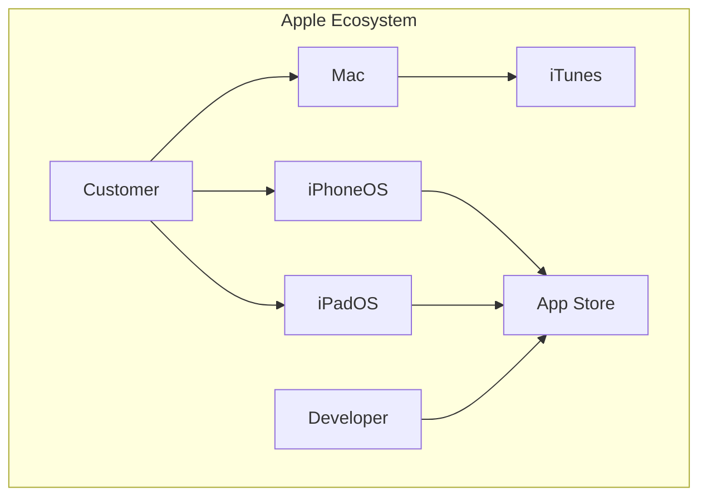

**系统接口设计（接口序列图）**

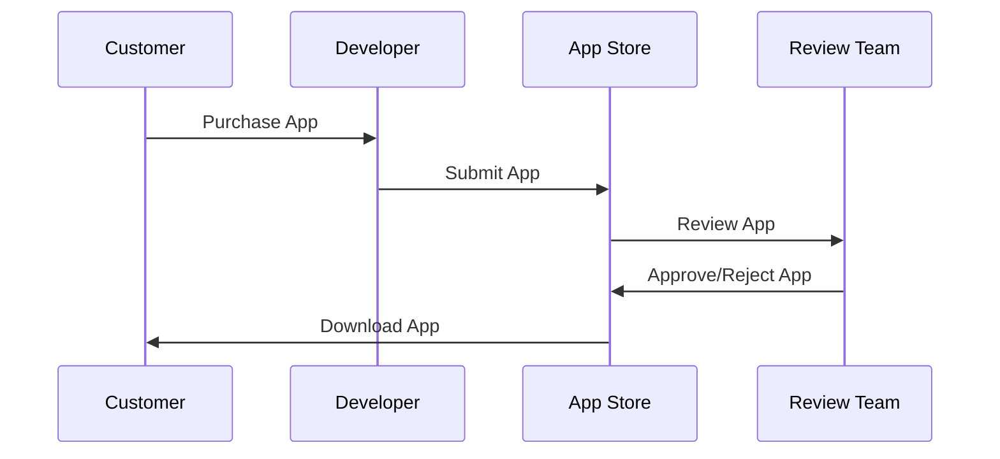

**实际案例分析和详细讲解**

乔布斯的领导力在苹果公司的成功中发挥了至关重要的作用。他通过以下方式实现了卓越的领导：

1. **愿景与使命**：乔布斯清晰地定义了苹果公司的愿景和使命，即通过创新科技改变世界。这一愿景激励了整个团队，使每个人都为共同的目标而努力。
2. **创新精神**：乔布斯注重产品的创新性，他不仅关注技术的进步，更关注用户体验。通过不断的创新，苹果公司推出了革命性的产品，如iPod、iPhone和iPad，彻底改变了科技行业。
3. **卓越的设计**：乔布斯对产品设计有着极高的要求，他亲自参与产品的设计过程，确保产品从外观到用户体验都达到最高标准。这种对品质的坚持，使得苹果公司的产品在市场上具有很高的竞争力。
4. **团队合作**：乔布斯擅长激发团队的潜力，他鼓励团队成员提出创意，并给予他们足够的自主权。这种开放和包容的团队文化，使得苹果公司能够不断推出创新的产品。

**项目小结**

苹果公司的成功案例表明，领导力在实践中的关键要素包括明确的愿景与使命、创新精神、卓越的设计和团队合作。通过这些要素，领导者可以带领团队实现卓越的业绩，推动组织的持续发展。

#### 案例二：惠普的失败

**背景介绍**

1999年，惠普公司宣布与康柏公司合并，希望通过合并实现优势互补，提升市场竞争力。然而，合并后的惠普在领导力和管理上出现了严重问题，导致公司业绩下滑。

**项目介绍**

惠普的合并计划旨在整合两家公司的资源和优势，提升产品竞争力。然而，合并后的管理混乱和领导力不足，导致公司陷入困境。

**系统功能设计（领域模型类图）**

```mermaid
classDiagram
    HP --|>"
            Compaq
    Service --|>"
                Support
    Product --|>"
                Hardware
    Software --|>"
                Software Solutions
    HP : {Hardware, Software}
    Compaq : {Hardware, Software}
    Service : {Technical Support, Customer Service}
```

**系统架构设计（架构图）**

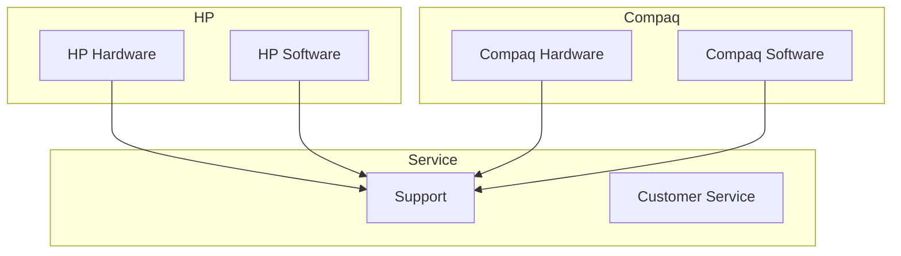

**系统接口设计（接口序列图）**

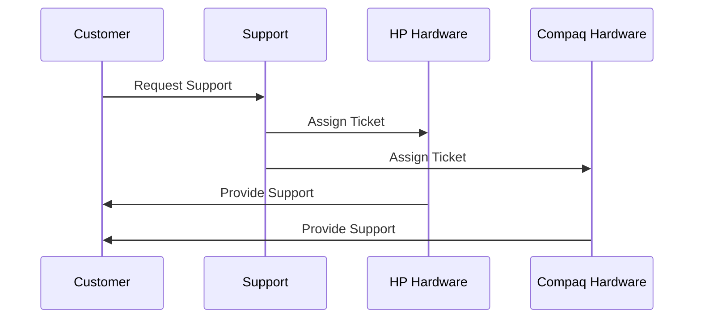

**实际案例分析和详细讲解**

惠普合并后的失败主要源于以下几个方面的领导力问题：

1. **领导力不足**：合并后的惠普在领导力上存在明显不足，导致公司在战略决策和管理上出现混乱。领导层的分歧和决策失误，使得公司无法有效地整合资源和优势。
2. **文化冲突**：惠普和康柏在企业文化和管理风格上存在较大差异，合并后未能有效融合。文化冲突导致了内部的不和谐，影响了团队的合作效率和创新能力。
3. **管理混乱**：合并后的公司管理层次复杂，决策流程冗长，导致公司反应迟缓。管理上的混乱和低效，使得公司无法及时应对市场变化，错失了发展机遇。

**项目小结**

惠普的失败案例表明，领导力在实践中的关键要素包括领导力的持续提升、文化融合和管理效率。缺乏这些要素，即使有优秀的战略规划，也无法实现组织的长期发展。领导者应深刻认识到这些问题，不断提升自身的领导力，确保组织能够在复杂的环境中保持竞争力。

#### 案例对比分析与启示

通过对比苹果公司的成功和惠普的失败，我们可以得出以下启示：

1. **领导力的重要性**：领导力是组织成功的关键。领导者不仅需要具备战略思维和决策能力，还需要具备道德素养和团队领导能力。
2. **文化融合**：在组织变革和合并过程中，文化融合至关重要。领导者应重视文化差异，积极推动文化融合，确保组织内部的和谐与合作。
3. **管理效率**：高效的管理是组织成功的基础。领导者应优化管理流程，提高决策效率，确保组织能够快速响应市场变化。
4. **持续学习**：领导者应具备持续学习的能力，不断提升自身的知识和技能，以应对快速变化的环境。

总之，领导力在实践中的关键要素包括领导力提升、文化融合、管理效率和持续学习。通过这些要素，领导者可以带领组织实现卓越的业绩，推动组织的长期发展。

---

## 第8章 结论：领导力心法的实践

在本书中，我们深入探讨了领导力的核心原则、战略思维、团队建设、变革管理、道德领导等多个方面，旨在帮助读者全面理解领导力的本质和实践方法。以下是本书的核心观点和实践总结。

### 核心观点

1. **领导力的核心原则**：诚信与透明、愿景与使命、持续学习、关注员工成长和适应性与灵活性是领导力的核心原则。这些原则为领导者提供了明确的行动指南，帮助他们在各种情况下做出正确的决策。
2. **战略思维**：战略思维是领导者应对复杂环境和实现组织目标的关键能力。通过SWOT分析和PEST分析，领导者可以全面了解组织的内外部环境，制定科学的战略规划。
3. **团队建设**：团队建设是领导者的核心职责之一。通过明确的团队定义、角色分配和激励与赋能方法，领导者可以打造一个高效的团队，实现组织的目标。
4. **变革管理**：领导者需要具备应对变革的能力，以带领组织顺利度过变革期。通过明确变革愿景、有效沟通、建立信任、提供支持和持续监测与反馈，领导者可以推动组织适应变革，保持竞争力。
5. **道德领导**：道德领导是领导者品格的重要组成部分。通过自我反思、道德培训、树立道德典范和建立道德文化，领导者可以推动组织实现道德领导，树立良好的社会形象。

### 实践总结

1. **明确愿景与使命**：领导者应明确组织的愿景和使命，使其成为团队共同的目标。通过定期的沟通和激励，确保团队成员对愿景和使命有共同的理解和认同。
2. **培养诚信与透明**：领导者应以诚信和透明为基本原则，通过诚实和真诚的行为赢得团队成员的信任。保持信息的透明，确保团队成员了解组织的动态和决策过程。
3. **持续学习和自我提升**：领导者应具备持续学习和自我提升的能力，不断更新知识和技能，以适应快速变化的环境。通过自我反思和反思性学习，不断提升自身的领导力。
4. **关注员工成长**：领导者应关注员工的成长和发展，提供培训和发展机会，帮助员工提升技能和知识。通过激励和认可，激发员工的工作热情和创造力。
5. **推动团队协作**：领导者应建立有效的团队协作机制，确保团队成员之间的沟通和协作顺畅。通过共同目标设定和激励措施，增强团队的凝聚力和协作效率。
6. **适应变革**：领导者需要具备应对变革的能力，以带领组织顺利度过变革期。通过明确变革愿景、建立信任关系和提供支持，推动组织适应变革，保持竞争力。
7. **实践道德领导**：领导者应以道德领导为行为准则，通过自身的道德行为和价值观，影响和引导团队成员。建立道德文化，确保组织的道德价值得到落实。

### 持续改进的路径

领导力是一个不断发展和提升的过程。为了实现持续改进，领导者应采取以下措施：

1. **定期评估**：领导者应定期评估自身的领导力和团队的表现，识别存在的问题和改进机会。
2. **培训与学习**：领导者应积极参加各种培训和学习机会，不断提升自身的知识和技能。
3. **反馈与反思**：领导者应建立有效的反馈机制，鼓励团队成员提出意见和建议，进行反思和改进。
4. **实践与总结**：领导者应在实际工作中不断实践和应用所学知识，总结经验教训，不断优化领导行为。

### 未来领导力的展望

随着科技的不断进步和社会的快速发展，未来领导力将面临新的挑战和机遇。以下是未来领导力的一些趋势：

1. **数字化领导**：随着数字化技术的普及，领导者需要具备数字素养，掌握数字化工具和方法，以推动组织的数字化转型。
2. **多元化领导**：随着社会多样性的增加，领导者需要具备跨文化领导能力，管理多元化团队，激发不同背景员工的潜力。
3. **创新领导**：在快速变化的环境中，领导者需要具备创新思维和创新能力，推动组织进行创新和变革，保持竞争优势。
4. **可持续领导**：随着全球环境问题日益严重，领导者需要具备可持续领导能力，推动组织实现可持续发展，为社会的可持续发展做出贡献。

### 总结

领导力是领导者个人品质和能力的综合体现，它关乎组织的成功和持续发展。通过理解并实践领导力的核心原则、战略思维、团队建设、变革管理和道德领导等方面的知识，领导者可以不断提升自身的领导力，带领团队实现卓越的业绩。在未来的发展中，领导者应不断学习、创新和适应，为组织和社会的可持续发展贡献自己的力量。

---

### 作者信息

作者：AI天才研究院/AI Genius Institute & 禅与计算机程序设计艺术 /Zen And The Art of Computer Programming

AI天才研究院致力于推动人工智能技术的发展和应用，研究院的专家们在计算机科学、机器学习、自然语言处理等领域有着丰富的经验和卓越的成就。同时，作者也是《禅与计算机程序设计艺术》一书的作者，该书以其独特的编程哲学和深度思考，深受广大程序员和AI爱好者的喜爱。在这本《领导力心法：成就伟大领袖的领导力法则》中，作者结合了自己在计算机科学和领导力领域的丰富经验，深入探讨了领导力的核心原则和实践方法，为读者提供了宝贵的指导。作者希望通过这本书，能够帮助更多的人理解领导力的本质，提升领导能力，成为卓越的领导者。

