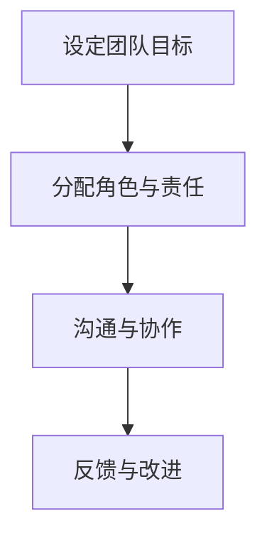
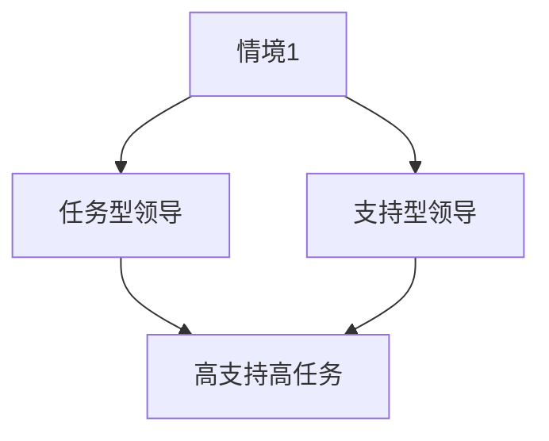

                 

# 领导力心法：成就伟大领袖的领导力秘籍

## 关键词

领导力、领导风格、领导力理论、团队管理、领导力提升、自我管理

## 摘要

本文旨在深入探讨领导力的核心概念、实践应用及提升方法，以帮助读者理解并掌握领导力的精髓。我们将通过系统化的分析，从定义领导力、理解领导力核心概念、应用领导力、提升领导力以及探讨领导力的心理层面等多个角度，详细阐述领导力的各个维度。通过本文，读者将能够更好地理解领导力的本质，掌握提升领导力的策略和方法，从而在个人和职业生涯中取得更大的成就。

### 引言与背景介绍

#### 定义领导力的概念

领导力是一种通过影响他人来实现目标的能力，它不仅仅是指导和管理，更是一种激励、引领和塑造团队文化的过程。在管理学中，领导力被视为一种能够推动组织变革、提高团队绩效和实现组织目标的关键能力。

#### 领导力在现代社会和企业中的重要性

在现代社会，领导力的重要性日益凸显。企业竞争日益激烈，市场变化迅速，创新成为企业发展的关键驱动力。而领导力正是推动创新、引领变革的核心力量。优秀领导者能够激发团队的潜能，创造积极的工作氛围，提升团队的整体绩效。

在企业管理中，领导力不仅是企业成功的关键因素，也是企业可持续发展的重要保障。一个成功的领导者能够带领企业应对各种挑战，实现战略目标，为企业创造长期价值。

#### 本书的目的、结构以及预期读者

本书旨在为读者提供全面、系统的领导力知识体系，帮助读者深入理解领导力的本质，掌握提升领导力的方法和技巧。本书分为五个主要部分，分别介绍领导力的核心概念、领导力的实践应用、领导力的提升策略、领导力的心理层面以及领导力的未来发展趋势。

预期读者包括企业管理者、团队成员、人力资源管理从业者以及对领导力感兴趣的读者。通过阅读本书，读者将能够提升自身的领导力，成为更优秀的领导者。

#### 目录结构概述

1. 引言与背景介绍
2. 领导力核心概念与联系
3. 领导力的实践应用
4. 领导力提升的策略与方法
5. 领导力的心理层面

#### 预期读者与学习目标

预期读者通过阅读本书，将能够：

- 理解领导力的基本概念和重要性
- 掌握不同领导风格的特点和应用
- 学习领导力理论框架及其在实践中的应用
- 了解领导力在不同场景下的实践应用
- 学会提升领导力的策略和方法
- 提高自我管理和情绪智力
- 成为更具有影响力的领导者

### 第1章：领导力的概念与重要性

#### 1.1 领导力的定义与内涵

领导力是一种通过影响他人来实现目标的能力。它不仅仅是指挥和管理，更是一种激励、引领和塑造团队文化的过程。领导力不仅仅存在于企业和管理层，也存在于个人和各个层面。

领导力的定义多种多样，但可以归纳为以下几点核心要素：

1. **影响力**：领导力是通过影响力来引导他人行动的能力。这种影响力可以是正式的，如职位赋予的权力，也可以是非正式的，如个人的魅力和价值观。
   
2. **目标导向**：领导力强调目标的实现，领导者需要明确目标，并带领团队朝着目标前进。

3. **人际关系**：领导力涉及建立和维护良好的人际关系，领导者需要理解并关心团队成员的需求和感受。

4. **变革推动**：领导者是变革的推动者，他们能够引领团队适应变化，迎接挑战。

#### 1.1.1 领导力的起源与演变

领导力的概念自古就有，但其定义和内涵在不同历史时期和社会背景下有所变化。

- **古代**：在古代，领导力主要与权力和统治相关，领导者被视为君王或领袖，拥有绝对的权威。

- **工业革命**：随着工业革命的到来，领导力开始更多地与管理和组织相关。领导者的角色从纯粹的权力掌控者转变为管理者和协调者。

- **现代**：在现代社会，领导力被赋予了更多的内涵，不仅仅关注绩效和效率，更强调人际关系、团队协作和可持续性。

#### 1.1.2 领导力的主要特征

领导力具有以下主要特征：

1. **激励性**：领导者能够激励团队成员，激发他们的潜能，使团队充满活力。

2. **愿景性**：领导者需要具备清晰的愿景，能够为团队指引方向，激发团队的共同目标。

3. **适应性**：领导者需要具备适应变化的能力，能够灵活应对外部环境和内部团队的变化。

4. **沟通性**：领导者需要具备良好的沟通能力，能够有效地传达信息，建立信任和合作关系。

5. **决策性**：领导者需要具备决策能力，能够在复杂环境中做出明智的决策。

#### 1.1.3 领导力与管理的区别

领导力与管理虽然密切相关，但它们有着本质的区别：

1. **目标**：管理更侧重于实现既定的目标和流程，而领导力则更侧重于创造和实现新的目标。

2. **方法**：管理通常采用控制、监督和规范的方式，而领导力则更强调激励、引领和塑造。

3. **对象**：管理的对象主要是资源和流程，而领导力的对象主要是人。

4. **结果**：管理的目标是效率和绩效，而领导力的目标是创新和可持续发展。

#### 1.2 领导力在现代社会中的意义

在现代社会，领导力具有极其重要的意义，主要体现在以下几个方面：

1. **企业成功的决定因素**：在竞争激烈的市场环境中，企业需要具备强大的核心竞争力。领导力是企业成功的关键因素，它能够推动创新、提高绩效，为企业创造长期价值。

2. **团队建设的作用**：领导力在团队建设中起着至关重要的作用。一个优秀的领导者能够建立高效团队，激发团队成员的潜能，实现团队目标。

3. **个人成长的影响**：领导力不仅对企业有重要影响，也对个人成长产生深远影响。通过领导力的发展，个人能够提升自我管理、人际交往和决策能力，实现个人职业发展和人生目标。

#### 1.3 本书结构与目标读者

本书分为五个主要部分，分别介绍领导力的核心概念、领导力的实践应用、领导力的提升策略、领导力的心理层面以及领导力的未来发展趋势。

- **核心概念与联系**：详细介绍领导力的核心概念，包括领导风格、领导力理论等，并展示概念之间的联系。

- **领导力的实践应用**：讨论领导力在不同场景下的具体应用，如团队管理、项目管理、变革管理等。

- **领导力提升的策略与方法**：介绍提升领导力的实用策略和方法，包括自我提升、团队培训和领导力发展计划。

- **领导力的心理层面**：深入探讨领导力的心理层面，包括自我管理、情绪智力等。

- **领导力的未来发展趋势**：分析领导力在未来可能面临的变化和挑战，以及应对策略。

目标读者包括企业管理者、团队成员、人力资源管理从业者以及对领导力感兴趣的读者。通过阅读本书，读者将能够全面提升自己的领导力，成为更优秀的领导者。

### 第2章：领导力核心概念与联系

在深入探讨领导力的核心概念之前，我们需要对领导力的一些基础概念进行明确的定义和理解。这些核心概念不仅构成了领导力的理论框架，也是我们在实践中应用领导力的基础。在本章中，我们将详细介绍以下核心概念：领导风格的类型、领导力的理论框架以及领导力与组织文化的联系。

#### 2.1 领导风格的类型

领导风格是领导者管理团队的方式和态度，不同的领导风格会对团队绩效和员工满意度产生不同的影响。根据不同的分类标准，领导风格可以分为多种类型：

1. **权威型领导风格（Autocratic Leadership）**
   - **特点**：领导者做出所有决策，对团队成员的控制力较强。
   - **适用场景**：在紧急情况下或者需要迅速决策时，权威型领导风格可以快速采取行动。
   - **效果**：可能会提高决策速度，但可能导致员工缺乏参与感和创造性。

2. **民主型领导风格（Democratic Leadership）**
   - **特点**：领导者鼓励团队成员参与决策过程，共同讨论和制定决策。
   - **适用场景**：在需要团队协作和创新时，民主型领导风格可以激发团队成员的积极性和创造力。
   - **效果**：可以提高员工的参与度和满意度，但决策过程可能较为耗时。

3. **参与型领导风格（Laissez-Faire Leadership）**
   - **特点**：领导者赋予团队成员较大的自由度，让他们自主决定工作方式和目标。
   - **适用场景**：在团队成员具备较高自主性和能力时，参与型领导风格可以激发员工的主动性和创新能力。
   - **效果**：可以提高员工的自主性和创新性，但可能导致团队缺乏统一的目标和方向。

4. **变革型领导风格（Transformational Leadership）**
   - **特点**：领导者通过激励和引导，推动团队实现重大的变革和进步。
   - **适用场景**：在需要变革和创新时，变革型领导风格可以激发团队的变革动力，实现组织的转型。
   - **效果**：可以激发团队的潜能，推动组织实现长期的战略目标。

5. **交易型领导风格（Transaction Leadership）**
   - **特点**：领导者通过明确的目标和奖励机制，激励团队成员实现组织目标。
   - **适用场景**：在需要确保团队绩效和目标达成时，交易型领导风格可以有效地激励团队成员。
   - **效果**：可以提高团队的绩效和目标达成率，但可能导致员工缺乏内在动机。

#### 2.2 领导力的理论框架

领导力的理论框架是理解和应用领导力的基础。以下是几种主要的领导力理论：

1. **权变理论（Contingency Theory）**
   - **概念**：权变理论认为，没有一种通用的领导风格适用于所有情况。领导风格的选择应根据具体情况和环境因素来调整。
   - **适用性**：该理论强调领导者应根据团队的特点、任务的要求和环境的变化来灵活调整领导风格。
   - **效果**：可以提升领导者的应变能力和团队适应性。

2. **超级领导者理论（Super Leader Theory）**
   - **概念**：超级领导者理论认为，某些领导者具有独特的个性特征和领导能力，他们能够在任何情况下取得卓越的领导效果。
   - **适用性**：该理论强调领导者需要具备卓越的领导素质和自我意识。
   - **效果**：可以激发领导者追求卓越，提升团队绩效和组织文化。

3. **领导力的三维模型（Three-Dimensional Model of Leadership）**
   - **概念**：领导力的三维模型将领导力分为三个维度：任务维度、关系维度和自我维度。
     - **任务维度**：领导者关注任务目标，确保团队任务的完成。
     - **关系维度**：领导者关注人际关系，建立和谐的团队氛围。
     - **自我维度**：领导者关注自我成长，提升自我领导能力。
   - **适用性**：该模型提供了一个全面的领导力框架，帮助领导者平衡任务、关系和自我三个方面。
   - **效果**：可以提高领导者的整体领导能力和团队绩效。

4. **情境领导理论（Situational Leadership Theory）**
   - **概念**：情境领导理论认为，领导者的有效行为取决于下属的成熟度。领导者应根据下属的成熟度调整领导风格。
   - **适用性**：该理论强调领导者需要根据下属的不同情况调整领导方式。
   - **效果**：可以提高领导者的适应性，提升团队绩效。

#### 2.3 领导力与组织文化的联系

领导力与组织文化之间存在着紧密的联系。优秀的领导力可以塑造和推动组织文化的发展，而组织文化也会对领导力产生深远的影响。

1. **组织文化的类型**
   - **创新型文化**：鼓励创新和尝试，容忍失败，注重长远发展。
   - **官僚型文化**：强调规范和流程，重视秩序和稳定。
   - **学习型文化**：注重知识共享和持续学习，鼓励团队合作和自我提升。

2. **领导力如何塑造组织文化**
   - **通过价值观传递**：领导者通过自身的言行传递组织的核心价值观，影响员工的价值观和行为。
   - **通过制度设计**：领导者通过制定和实施各项制度，塑造组织的行为规范和文化特征。
   - **通过团队建设**：领导者通过团队建设和团队活动，增强团队凝聚力和文化认同。

3. **领导力与组织文化的互动**
   - **领导力影响组织文化**：领导者的领导风格和行为对组织文化有直接影响，可以塑造和改变组织文化。
   - **组织文化影响领导力**：组织文化对领导者的行为和决策产生影响，领导者在不同的组织文化中需要调整自己的领导风格。

#### ER实体关系图架构

为了更好地理解领导力与组织文化之间的联系，我们可以使用实体关系图（ER Diagram）来展示领导力、组织文化及其相互关系。

```mermaid
erDiagram
  Leader ||--|{ Organization : leads }
  Leader ||--|{ Culture : shapes }
  Organization ||--|{ Leader : managed_by }
  Organization ||--|{ Culture : culture_of }
  Culture ||--|{ Leader : influenced_by }
  Culture ||--|{ Organization : influences }
```

在这个ER实体关系图中，`Leader`表示领导者，`Organization`表示组织，`Culture`表示组织文化。实线表示实体之间的直接关系，虚线表示间接影响。通过这个模型，我们可以清晰地看到领导力与组织文化之间的相互影响和作用。

#### 总结

通过本章的讨论，我们深入了解了领导力的核心概念，包括领导风格的类型、领导力的理论框架以及领导力与组织文化的联系。这些概念构成了领导力的基础理论框架，为我们在实际应用中理解和应用领导力提供了重要的参考。

在接下来的章节中，我们将进一步探讨领导力的实践应用，包括领导力在团队管理、项目管理和变革管理中的应用。同时，我们也将介绍提升领导力的策略和方法，帮助读者在实际工作中更好地运用领导力，提升个人和团队的综合能力。

### 第3章：领导力在团队管理中的应用

#### 3.1 团队建设的步骤

团队建设是领导力的重要组成部分，一个高效的团队是实现组织目标的关键。以下是团队建设的主要步骤：

1. **团队目标设定**
   - **明确目标**：领导者需要明确团队的目标，并将其传达给每个团队成员。目标应具体、可衡量、可实现。
   - **共识达成**：确保团队成员对目标有共同的理解和认同，通过讨论和沟通解决任何分歧。

2. **团队成员的角色与责任**
   - **角色分配**：根据团队成员的能力和特长，合理分配角色和责任，确保每个成员都有明确的任务和职责。
   - **责任明确**：明确每个成员的职责范围，避免职责重叠和空白，确保团队成员之间有清晰的协作和配合。

3. **团队沟通与协作**
   - **建立沟通渠道**：建立有效的沟通渠道，确保团队成员能够顺畅地交流信息，及时解决问题。
   - **促进协作**：鼓励团队成员之间的合作和协作，建立共同的目标和利益，促进团队的协同工作。

4. **团队反馈与改进**
   - **定期反馈**：定期收集团队成员的反馈，了解他们的工作状况、需求和意见，及时调整团队目标和策略。
   - **持续改进**：根据反馈和实际情况，持续改进团队的工作方式和流程，提高团队的整体绩效。

#### 3.2 领导力在项目管理中的应用

项目管理是领导力在具体工作中的重要应用，一个成功的项目需要领导者的有效管理和协调。以下是领导力在项目管理中的具体应用：

1. **项目规划与监控**
   - **项目规划**：领导者需要制定详细的项目计划，包括项目目标、时间表、资源分配和风险评估等，确保项目按计划进行。
   - **项目监控**：领导者需要持续监控项目的进度和资源使用情况，及时发现和解决潜在问题，确保项目目标的实现。

2. **风险管理**
   - **识别风险**：领导者需要识别项目可能面临的各种风险，包括技术风险、市场风险和人力资源风险等。
   - **风险应对**：针对识别出的风险，领导者需要制定相应的应对策略，降低风险对项目的影响。

3. **资源分配与优化**
   - **资源规划**：领导者需要合理规划项目所需的资源，包括人力、资金和技术等，确保资源的有效利用。
   - **资源优化**：领导者需要不断优化资源分配和使用，提高资源利用效率，降低项目成本。

4. **项目团队领导策略**
   - **激励与激励**：领导者需要激发项目团队成员的积极性和创造力，通过激励措施提高团队的士气和绩效。
   - **沟通与协调**：领导者需要保持与团队成员的密切沟通，协调团队内部和外部资源，确保项目顺利进行。

#### 3.3 领导力在变革管理中的应用

在快速变化的市场环境中，变革管理是企业生存和发展的重要手段。领导力在变革管理中起着关键作用，以下是领导力在变革管理中的应用：

1. **变革的必要性**
   - **市场环境变化**：随着市场环境的不断变化，企业需要不断调整战略和业务模式，以适应新的市场环境。
   - **技术创新**：技术创新和数字化转型的浪潮要求企业不断改进产品和服务，提升竞争力。

2. **变革管理的过程**
   - **评估与规划**：领导者需要对变革的必要性和可行性进行评估，制定详细的变革计划和实施策略。
   - **沟通与动员**：领导者需要与团队成员沟通变革的必要性和目标，动员团队成员积极参与变革。
   - **实施与监控**：领导者需要确保变革计划的顺利实施，持续监控变革过程，及时调整策略。

3. **变革中的领导力挑战**
   - **心理压力**：变革会带来不确定性和心理压力，领导者需要关注团队成员的心理状态，提供必要的心理支持和鼓励。
   - **协调与平衡**：变革过程中，领导者需要平衡不同利益相关者的需求，确保变革的顺利推进。

4. **成功变革的领导策略**
   - **明确愿景**：领导者需要明确变革的愿景和目标，为团队成员提供清晰的方向和动力。
   - **建立信任**：领导者需要建立与团队成员的信任关系，增强团队的凝聚力和合作意愿。
   - **激励与创新**：领导者需要激励团队成员积极参与变革，鼓励创新思维和实践。

通过以上步骤和策略，领导者可以有效地管理团队、项目和企业变革，推动企业实现持续发展和创新。

### 第4章：提升领导力的策略与方法

领导力并非与生俱来，而是可以通过学习和实践不断提升的。在这一章中，我们将探讨提升领导力的几种关键策略与方法，包括自我提升的途径、团队培训与领导力发展计划，以及领导力模型与实践案例。

#### 4.1 自我提升的途径

自我提升是领导力发展的重要一环，以下是一些实用的自我提升途径：

1. **自我反思与反馈**
   - **自我反思**：定期对自己的行为、决策和成果进行反思，了解自己的优点和不足，明确提升方向。
   - **反馈获取**：主动寻求来自上级、同事和下属的反馈，倾听他们的意见和建议，以便更全面地了解自己的表现。

2. **时间管理与目标设定**
   - **时间管理**：合理安排时间，优先处理重要和紧急的任务，避免拖延和浪费时间。
   - **目标设定**：设定明确、具体和可衡量的目标，制定实现目标的计划和步骤，持续跟踪和调整。

3. **情商与人际交往能力提升**
   - **情商提升**：了解自己的情绪，学会情绪调节和管理，提高自我意识和情绪管理能力。
   - **人际交往**：提升沟通技巧，学会倾听、表达和同理心，建立良好的人际关系。

#### 4.2 团队培训与领导力发展计划

团队培训与领导力发展计划是提升领导力的重要手段，以下是一些关键步骤：

1. **领导力培训的内容**
   - **理论基础**：教授领导力相关的理论框架，如情境领导理论、变革型领导理论等。
   - **实践技能**：培训领导力的实际应用技能，如沟通技巧、团队建设、决策能力等。
   - **案例分析**：通过分析真实的领导力案例，学习成功和失败的经验，提高实际应用能力。

2. **领导力发展计划的制定与实施**
   - **需求分析**：根据团队和个人的需求，制定针对性的领导力发展计划。
   - **计划实施**：通过培训、研讨会、角色扮演等形式，实施领导力发展计划，确保计划的有效执行。

3. **培训效果评估**
   - **评估方法**：通过调查问卷、访谈、工作表现评估等方式，评估培训效果。
   - **持续改进**：根据评估结果，对领导力发展计划进行调整和改进，确保培训效果最大化。

#### 4.3 领导力模型与实践案例

领导力模型为领导者提供了一种系统化的框架，帮助他们在实际工作中应用领导力。以下是一个典型的领导力模型及其实践案例：

1. **领导力模型的介绍**
   - **领导力三角形**：领导力三角形模型将领导力分为三个核心维度：自我领导、团队领导和组织领导。
     - **自我领导**：领导者需要具备自我管理、自我激励和自我发展能力。
     - **团队领导**：领导者需要具备团队建设、沟通协调和激励团队的能力。
     - **组织领导**：领导者需要具备战略规划、资源管理和变革推动能力。

2. **领导力实践案例解析**
   - **案例背景**：某公司的销售团队在市场竞争中表现不佳，团队士气低落，销售业绩下降。
   - **领导策略**：
     - **自我领导**：领导者通过自我反思和反馈，认识到团队问题源于自身领导力的不足，决心改进。
     - **团队领导**：领导者通过团队建设活动，增强团队成员的凝聚力和信任感，提升团队士气。
     - **组织领导**：领导者调整销售策略，优化资源分配，制定明确的目标和计划，推动团队变革。

3. **领导力策略**
   - **激励与反馈**：领导者通过激励措施，如奖励和认可，激发团队成员的积极性，同时通过定期反馈，帮助团队成员提升自我。
   - **沟通与协作**：领导者加强与团队成员的沟通，确保信息的透明和及时，促进团队协作和共同进步。
   - **变革与适应**：领导者推动团队适应市场变化，优化销售策略，提升团队竞争力。

通过以上领导力策略，该销售团队在几个月内实现了业绩的显著提升，团队士气也大幅提高。

#### 总结

提升领导力是一个持续的过程，需要自我反思、学习和实践。通过自我提升的途径、团队培训与领导力发展计划以及领导力模型的应用，领导者可以不断提升自身的领导能力，成为更优秀的领导者。在接下来的章节中，我们将深入探讨领导力的心理层面，帮助读者从心理角度理解和提升领导力。

### 第5章：领导力的心理层面

领导力不仅仅是一种技术和技能，更是一种心理层面的能力。领导者需要具备良好的自我管理、情绪智力和心理韧性，这些因素对于他们在复杂和高压的环境中取得成功至关重要。本章将深入探讨领导力的心理层面，包括自我管理的重要性、情绪智力在领导力中的作用以及如何培养和提高心理韧性。

#### 5.1 自我管理的重要性

自我管理是领导力的核心要素之一，它包括自我意识、自我激励、自我调节和压力管理等方面。领导者需要首先管理好自己，才能有效地管理他人。

1. **自我意识与自我认同**

自我意识是指领导者对自己内心世界的认知和理解，包括自我价值、自我期望和自我动机等。一个有自我意识的领导者能够清楚地了解自己的优点和不足，从而更好地发展自己。

自我认同是指领导者对自己的认可和接受，包括对自己的能力和价值感到自豪和自信。自我认同能够增强领导者的内心力量，使他们更加坚定和有决心去实现目标。

2. **自我激励与目标设定**

自我激励是指领导者通过内在动力来驱动自己的行为，实现目标。自我激励能够帮助领导者克服困难和挑战，保持积极的态度和行动。

目标设定是自我激励的重要部分。领导者需要设定清晰、具体和可衡量的目标，并制定实现目标的计划和步骤。目标设定能够为领导者提供方向和动力，使他们能够更有针对性地进行自我管理和提升。

3. **自我调节与压力管理**

自我调节是指领导者能够控制自己的情绪和行为，保持冷静和理智。自我调节能够帮助领导者应对压力和挑战，避免情绪失控和冲动行为。

压力管理是自我调节的重要方面。领导者需要学会识别和管理压力源，采取积极的应对策略，如时间管理、放松技巧和积极思考等，以减轻压力的影响。

#### 5.2 情绪智力在领导力中的作用

情绪智力是指领导者对自身情绪和他人物理、情绪状态的理解、评估和运用能力。情绪智力在领导力中起着至关重要的作用，以下是其几个关键方面：

1. **情绪识别**

情绪识别是指领导者能够准确地识别和理解自己和他人的情绪状态。这需要领导者具备敏锐的观察力和感知能力，能够通过语言、行为和情绪表达来解读他人的情绪。

2. **情绪表达**

情绪表达是指领导者能够适当地表达自己的情绪，包括积极和消极的情绪。适当的情绪表达能够增强沟通效果，建立信任和尊重的关系。

3. **情绪调节**

情绪调节是指领导者能够有效地管理和调节自己的情绪，保持情绪稳定。情绪调节需要领导者具备自我意识和自我控制能力，能够在压力和挑战面前保持冷静和理智。

4. **同理心**

同理心是指领导者能够理解和感受他人的情绪和需求，站在他人的角度思考问题。同理心能够增强领导者与团队成员之间的信任和合作，促进团队的凝聚力和协作。

#### 5.3 心理韧性的培养与提高

心理韧性是指个体在面对压力、挑战和逆境时能够快速恢复和适应的能力。领导者需要具备较高的心理韧性，以应对工作中的各种挑战和困难。

1. **心理韧性的定义与重要性**

心理韧性是指个体在面对逆境和挑战时，能够保持积极心态、快速恢复和适应的能力。心理韧性对于领导者的成功至关重要，因为领导者往往需要应对复杂和高压的环境，具备较高的心理韧性能够帮助他们更好地应对挑战。

2. **心理韧性的培养策略**

   - **积极心态培养**：领导者需要培养积极的心态，看到逆境中的机会和潜在的价值，从而更好地应对挑战。
   - **自我效能感提升**：领导者需要提升自我效能感，相信自己的能力和价值，从而在面对困难时更加坚定和自信。
   - **情绪管理能力提升**：领导者需要学会有效地管理自己的情绪，保持情绪稳定，避免情绪波动对工作和决策的影响。
   - **积极应对策略**：领导者需要学会采取积极的应对策略，如寻求支持、制定应对计划和灵活调整策略等，以更好地应对压力和挑战。

3. **提高心理韧性的方法**

   - **反思与自我觉察**：领导者需要定期反思自己的行为和情绪，提高自我觉察，了解自己的心理状态和反应模式。
   - **建立支持系统**：领导者需要建立良好的社会支持系统，包括家人、朋友和同事等，在需要时寻求支持和帮助。
   - **培养良好习惯**：领导者需要培养良好的生活习惯，如规律作息、健康饮食和适量运动等，以保持身心健康。
   - **持续学习与成长**：领导者需要持续学习和成长，提升自己的知识和技能，增强应对复杂环境和挑战的能力。

#### 总结

领导力的心理层面是领导者成功的重要因素，自我管理、情绪智力和心理韧性构成了领导力的心理基础。领导者需要不断提升自我管理能力，培养情绪智力，提高心理韧性，以更好地应对工作和生活中的各种挑战。通过本章的探讨，读者可以更好地理解领导力的心理层面，并将其应用于实际工作中，成为更优秀的领导者。

### 结论

通过本文的深入探讨，我们从多个角度全面分析了领导力的概念、应用和提升方法，揭示了领导力在现代社会和企业中的重要性。我们首先介绍了领导力的定义与内涵，探讨了领导力在现代社会和企业中的意义，随后详细阐述了领导力的核心概念、实践应用和提升策略。同时，我们还深入探讨了领导力的心理层面，包括自我管理、情绪智力和心理韧性。

领导力不仅仅是一种技能，更是一种心理和能力。一个成功的领导者需要具备良好的自我管理、情绪智力和心理韧性，能够在复杂和高压的环境中保持冷静和理智，带领团队实现目标。

在未来的领导力发展中，领导者需要不断提升自我，适应快速变化的市场环境，积极应对各种挑战。同时，领导者也需要关注团队成员的需求和成长，建立和谐的组织文化，激发团队的潜能和创造力。

最后，我们希望读者能够通过本文的阅读，对领导力有更深刻的理解和认识，并在实际工作中运用所学，成为更优秀的领导者。让我们一起努力，成就伟大的领导力！

### 最佳实践 Tips

1. **持续学习与反思**：领导力是一个不断发展和提升的过程，领导者需要保持持续学习的态度，通过阅读、培训和实践不断提升自己的能力和素质。同时，定期进行自我反思，了解自己的优点和不足，有针对性地进行改进。

2. **关注团队成员的需求**：领导者需要关注团队成员的需求和成长，建立良好的沟通和反馈机制，了解团队成员的想法和困扰，提供支持和帮助。通过关注团队成员的需求，领导者可以更好地激发团队的潜能和创造力。

3. **培养积极心态**：领导者需要培养积极的心态，面对挑战和困难时保持乐观和坚定。积极心态能够增强领导者的信心和决心，使领导者更加从容地应对各种情况。

4. **实践情境领导理论**：情境领导理论强调领导者应根据不同情境和团队成员的成熟度调整领导风格。在实际工作中，领导者可以灵活运用情境领导理论，根据实际情况选择合适的领导风格，提高团队绩效和员工满意度。

5. **建立信任关系**：领导者需要与团队成员建立信任关系，增强团队的凝聚力和合作意愿。通过真诚、透明和开放的方式与团队成员沟通，领导者可以赢得团队的信任和支持。

### 小结

通过本文的探讨，我们系统地介绍了领导力的核心概念、实践应用和提升方法，并深入分析了领导力的心理层面。我们希望读者能够将这些知识应用到实际工作中，不断提升自己的领导力，成为更优秀的领导者。

### 注意事项

1. **领导力发展的持续性**：领导力是一个持续发展的过程，领导者需要持续学习和实践，不断提升自己的能力和素质。

2. **领导风格的选择**：不同的领导风格适用于不同的情境和团队，领导者需要根据实际情况选择合适的领导风格。

3. **情绪智力的培养**：情绪智力在领导力中起着关键作用，领导者需要培养情绪识别、表达和调节的能力，以更好地应对工作和生活中的各种挑战。

4. **团队建设的重要性**：团队建设是领导力的重要组成部分，领导者需要关注团队建设，建立和谐的组织文化，激发团队的潜能和创造力。

### 拓展阅读

1. **《领导力的五个层次》**：[史蒂芬·柯维（Stephen R. Covey）] - 探讨领导力的五个层次，从自我领导到团队领导，帮助领导者全面提升领导力。

2. **《变革之舞：领导力和组织变革的实践智慧》**：[约翰·P·科特（John P. Kotter）] - 分析组织变革的过程和挑战，提供实用的变革管理策略。

3. **《情商：为什么情商比智商更重要》**：[丹尼尔·戈尔曼（Daniel Goleman）] - 详细介绍情商的定义、构成和提升方法，探讨情商在领导力中的作用。

4. **《领导力的心理学》**：[理查德·萨波斯（Richard S. Saab）] - 分析领导力中的心理学原理，探讨领导者如何通过心理策略提升领导力和团队绩效。

### 作者信息

作者：AI天才研究院/AI Genius Institute & 禅与计算机程序设计艺术 /Zen And The Art of Computer Programming

### 文章末尾

本文由AI天才研究院和禅与计算机程序设计艺术联合撰写，旨在为读者提供全面、系统的领导力知识体系。通过本文，读者可以深入理解领导力的本质，掌握提升领导力的方法和技巧。我们希望本文能够帮助读者在个人和职业生涯中取得更大的成就，成为更优秀的领导者。

### 附录

本文中包含的图表和流程图已按照markdown格式进行排版，以下为部分图表的示例：

#### 团队建设步骤



#### 领导力与组织文化联系

```mermaid
erDiagram
  Leader ||--|{ Organization : leads }
  Leader ||--|{ Culture : shapes }
  Organization ||--|{ Leader : managed_by }
  Organization ||--|{ Culture : culture_of }
  Culture ||--|{ Leader : influenced_by }
  Culture ||--|{ Organization : influences }
```

#### 情境领导理论



通过这些图表和流程图，读者可以更直观地理解文章中的概念和观点。同时，我们也建议读者在实际应用中尝试绘制类似的图表，以加深对领导力理论的理解。

