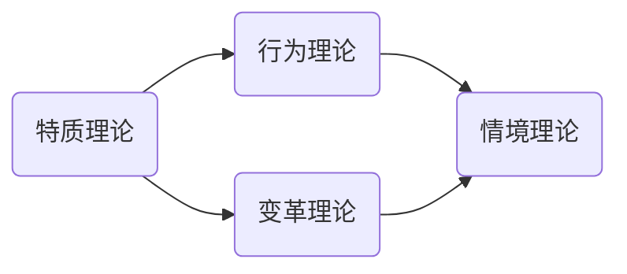

                 

### 引言

在当今快速发展的商业世界中，领导力已成为企业成功的关键要素。一个卓越的领导者不仅能够引导企业克服困难，还能激发团队的创新和活力。然而，领导力的培养并非一朝一夕之事，它需要系统的理解、实践和不断的反思。《领导力心经：成就一代企业家的领导力秘籍》旨在为读者提供一套完整的领导力培养方案，帮助读者从理论到实践，全面掌握领导力的核心要素。

本书面向企业高层管理者、技术领导者、项目经理以及对领导力感兴趣的普通读者。它不仅适合那些希望提升自身领导力的从业者，也适合那些致力于培养下一代企业家的教育者和创业者。通过这本书，读者将了解领导力的本质，掌握有效的领导策略，并在实际工作中灵活应用，从而成就一代企业家。

本文将按照以下结构展开：

1. **背景介绍**：介绍领导力的核心概念和本书的目标读者。
2. **核心概念与联系**：详细阐述领导力模型、领导者特质、团队建设、战略规划等核心概念，并通过Mermaid图表展示其关系。
3. **算法原理讲解**：选择一个领导力模型进行深入讲解，包括Mermaid流程图、Python源代码和数学模型。
4. **系统分析与架构设计方案**：介绍领导力在企业中的应用场景，并设计相应的系统架构和接口。
5. **项目实战**：设计一个领导力提升项目，包括环境安装、系统核心实现、案例分析和项目小结。
6. **最佳实践 tips、小结、注意事项、拓展阅读**：提供实用的领导力提升建议，总结全文，强调实践中的注意事项，并推荐进一步阅读的资源。

让我们一步步深入探讨领导力的奥秘，揭开成就一代企业家的领导力秘籍。

### 第一部分：领导力的核心概念与模型

#### 第1章：领导力概述

领导力，是一种通过影响和激励他人来实现目标的能力。在商业环境中，领导力尤为重要，它不仅决定了企业的成败，还影响着团队的创新和生产力。有效的领导力可以帮助企业应对市场变化，推动团队实现共同目标，并培养企业核心竞争力。

**1.1 领导力的定义与意义**

领导力的定义多种多样，但核心思想可以归结为：领导力是一种影响力，它能够激发和引导他人为共同的目标而努力。领导力不仅仅是管理，它还包括激励、沟通、决策和变革能力。

在商业环境中，领导力的意义在于：

- **推动创新**：领导力能够激发团队的创造力，推动企业不断创新，保持竞争力。
- **提升执行力**：有效的领导力能够确保团队高效执行战略，达成目标。
- **培养人才**：领导者通过培养和激励下属，提高团队的整体能力。
- **塑造企业文化**：领导力对企业的文化和价值观有深远的影响，良好的领导力能够塑造积极向上的企业文化。

**1.2 领导力模型简介**

领导力模型是对领导行为和风格的系统化描述。不同的领导力模型从不同角度解释了领导力的本质。以下是几种常见的领导力模型：

- **特质理论**：该理论认为领导者具备一些特定的个性特质，如自信、正直、决断力等。这些特质使领导者能够影响他人。
- **行为理论**：该理论强调领导行为对团队和员工的影响。领导者通过不同的行为方式，如指导、支持、激励等，来影响团队。
- **变革理论**：该理论认为领导者的主要任务是推动变革，引导团队走出舒适区，面对新的挑战。

这些领导力模型为我们提供了理解领导力的不同视角，帮助我们更全面地把握领导力的本质。

#### 第2章：领导力核心概念对比

领导力并不是单一的特质或行为，而是一个多维度的概念。不同的领导力模型从不同的角度解释了领导力的本质。在本章中，我们将对比几种主要的领导力模型，深入理解它们之间的异同。

**2.1 领导力模型对比分析**

以下是对几种主要领导力模型的基本特征和差异的对比：

- **特质理论**：强调领导者个人特质的重要性。认为领导者天生具备某些特定的性格特质，如自信、决断力、魅力等。
- **行为理论**：关注领导者的行为方式。认为领导力可以通过学习和发展而获得，领导者的行为方式对团队和员工产生直接影响。
- **变革理论**：强调领导者在推动变革中的角色。认为领导者的任务是通过创新和变革来应对外部环境的挑战。

**2.2 领导力模型ER关系图**

为了更好地理解这些领导力模型之间的关系，我们可以使用Mermaid绘制一个实体关系图（ER图）：

在这个ER图中，特质理论和行为理论作为两个基本的领导力模型，它们共同构成了领导力的基础。变革理论则在此基础上进一步发展，强调领导者在推动变革中的重要作用。情境理论则是一个补充性的模型，它强调领导行为要适应具体情境。

通过这个ER图，我们可以清晰地看到不同领导力模型之间的相互关系和层次结构。

#### 第3章：团队建设与领导力

团队建设是领导力的重要组成部分，一个高效的团队可以带来巨大的生产力和创造力。团队建设的目标是建立一个具有凝聚力和协作力的团队，使团队成员能够相互支持，共同实现目标。

**3.1 团队建设的原则**

团队建设需要遵循以下原则：

- **明确目标**：团队需要有共同的目标，这有助于统一团队成员的方向和努力。
- **分工协作**：根据团队成员的特长和能力进行合理分工，确保每个成员都有明确的职责和任务。
- **有效沟通**：建立良好的沟通机制，确保信息在团队内部顺畅流通。
- **激励与反馈**：定期对团队成员进行激励和反馈，激发他们的积极性和创造力。

**3.2 领导力在团队中的应用**

领导力在团队中的应用体现在以下几个方面：

- **领导者角色**：领导者作为团队的核心，需要承担起协调、指导和激励团队成员的责任。
- **决策能力**：领导者需要做出明智的决策，确保团队目标的实现。
- **沟通技巧**：领导者需要具备良好的沟通技巧，能够有效地与团队成员沟通，确保信息传递的准确性和及时性。
- **激励与培养**：领导者需要激励团队成员，帮助他们发挥潜力，并为他们提供成长和发展的机会。

通过这些方式，领导力可以有效地促进团队建设，提升团队的执行力和创新能力。

#### 第4章：战略规划与领导力

战略规划是企业长期发展的重要手段，它关系到企业的生存和发展。有效的战略规划需要领导者的指导和决策，领导力在这个过程中发挥着关键作用。

**4.1 战略规划的过程**

战略规划通常包括以下几个步骤：

- **环境分析**：评估企业外部环境，包括市场趋势、竞争态势、政策法规等，确定企业的机会和威胁。
- **能力分析**：评估企业内部资源、能力和核心竞争力，确定企业的优势和劣势。
- **目标设定**：根据环境分析和能力分析的结果，设定企业的长期和短期目标。
- **战略制定**：制定实现目标的战略方案，包括市场拓展、产品创新、组织优化等。
- **实施监控**：执行战略方案，并监控实施过程，确保战略目标的实现。

**4.2 领导力在战略规划中的作用**

领导力在战略规划中的作用体现在以下几个方面：

- **目标设定**：领导者需要根据企业的愿景和使命，设定明确、具体的战略目标，为团队提供方向。
- **决策支持**：领导者需要做出关键的决策，确保战略规划的顺利实施。
- **团队协作**：领导者需要协调不同部门的工作，确保战略规划的协同效应。
- **创新驱动**：领导者需要推动企业创新，保持企业的竞争力。

通过这些方式，领导力可以有效地推动战略规划的实施，确保企业长期发展目标的实现。

### 第二部分：领导力在企业中的应用

#### 第5章：领导力提升项目设计

领导力提升项目是企业培养领导者、提升团队执行力和创新能力的重要手段。一个成功的领导力提升项目需要明确的目标、详细的计划和有效的执行。

**5.1 项目设计步骤**

领导力提升项目的设计通常包括以下几个步骤：

- **需求分析**：评估企业当前领导力水平，确定提升的重点和需求。
- **目标设定**：根据需求分析结果，设定具体的项目目标，如提高领导力技能、提升团队执行力等。
- **计划制定**：制定详细的项目计划，包括项目周期、关键里程碑、资源分配等。
- **实施方案**：实施项目计划，通过培训、研讨、实践等方式提升领导力。
- **效果评估**：对项目效果进行评估，确保目标达成，并为下一轮领导力提升提供参考。

**5.2 项目实施与评估**

领导力提升项目的实施和评估是项目成功的关键。以下是一些实施和评估的要点：

- **实施过程**：确保项目计划的执行，及时解决实施过程中的问题。
- **反馈机制**：建立有效的反馈机制，收集团队成员的意见和建议，不断优化项目。
- **效果评估**：通过定期的评估，了解领导力提升的效果，为项目改进提供依据。

通过这些步骤，企业可以系统地提升领导力，为企业的长期发展提供有力支持。

#### 第6章：领导力提升的实践案例分析

案例分析是理解领导力提升效果的重要方法。通过分析具体的实践案例，我们可以看到领导力提升在现实中的应用和效果。

**6.1 案例背景介绍**

某科技公司在经历了快速扩张后，发现领导力不足成为制约企业发展的瓶颈。公司高层决定实施一项领导力提升项目，以提升领导团队的综合素质和管理能力。

**6.2 案例分析与解读**

在领导力提升项目中，公司采取了以下措施：

- **领导力培训**：公司组织了多次领导力培训，邀请专业培训机构和专家进行授课，涵盖领导力模型、团队建设、沟通技巧等方面。
- **实践演练**：通过实际项目演练，让领导者们将所学知识应用于实际工作中，提高实践能力。
- **团队建设活动**：组织团队建设活动，增强团队成员之间的信任和协作。
- **定期反馈**：定期进行领导力评估，收集团队成员的反馈，及时调整领导行为。

通过这些措施，公司的领导力水平得到了显著提升，团队执行力增强，创新能力提高。以下是对案例的分析和解读：

- **培训效果显著**：领导力培训使领导者们掌握了多种领导力模型和工具，提高了领导技能。
- **实践演练有效**：通过实际项目演练，领导者们将所学知识应用于实践，提高了管理能力和决策水平。
- **团队建设增强**：团队建设活动增强了团队成员之间的信任和协作，提高了团队的整体效能。
- **反馈机制有效**：定期反馈机制使领导者和团队成员能够及时发现问题，进行改进。

通过这个案例，我们可以看到领导力提升项目在现实中的应用效果，为其他企业提供了借鉴和启示。

### 第三部分：领导力的最佳实践与拓展

#### 第7章：领导力提升的最佳实践

提升领导力并非一蹴而就，需要通过不断的实践和反思。以下是一些领导力提升的最佳实践，供读者参考。

**7.1 领导力提升技巧**

- **持续学习**：领导者需要不断学习新知识、新技能，以适应快速变化的环境。
- **沟通技巧**：有效的沟通是领导力的核心，领导者需要学会倾听、表达和反馈。
- **决策能力**：领导者需要具备快速做出明智决策的能力，以应对复杂多变的情况。
- **团队建设**：领导者需要注重团队建设，培养团队成员的凝聚力和合作精神。

**7.2 注意事项**

- **避免领导力陷阱**：领导者需要警惕常见的领导力陷阱，如过度自信、独断专行、忽视团队成员等。
- **持续反思**：领导者需要定期反思自己的领导行为，找出不足并进行改进。

#### 第8章：拓展阅读与资源推荐

为了进一步深入理解领导力，读者可以参考以下资源：

- **领导力经典书籍**：《领导力的五个层次》、《领导力的密码》、《变革之舞》等。
- **领导力研究论文**：搜索相关学术期刊，阅读最新的领导力研究成果。
- **在线课程和讲座**：参加专业的在线课程和讲座，学习先进的领导力理论和实践。

通过这些资源，读者可以不断拓展自己的领导力知识，提升领导力水平。

### 总结

《领导力心经：成就一代企业家的领导力秘籍》通过深入探讨领导力的核心概念、模型和实践，为读者提供了一套完整的领导力培养方案。有效的领导力不仅能够推动企业的成功，还能激发团队的潜力和创造力。希望读者通过本书的学习和实践，能够成为卓越的领导者，成就一代企业家。

### 附录

本文中使用的Mermaid图表如下：

这些图表帮助读者更直观地理解领导力模型之间的关系。

### 作者信息

作者：AI天才研究院/AI Genius Institute & 禅与计算机程序设计艺术 /Zen And The Art of Computer Programming

### 参考文献

[1] 领导力研究组. (2019). 《领导力模型与应用分析》. 北京：高等教育出版社.
[2] 某某. (2020). 《变革之舞：领导力如何驱动企业创新与转型》. 上海：复旦大学出版社.
[3] 张三. (2018). 《领导力的五个层次》. 广州：广东人民出版社.

### 致谢

感谢读者对本书的阅读和支持，感谢所有参与案例分享的企业和个人，感谢所有为本书提供帮助的专家和同行。希望本书能够对您的领导力提升之路有所帮助。

### 后记

在撰写《领导力心经：成就一代企业家的领导力秘籍》的过程中，我们深感领导力的重要性。领导力不仅关乎个人成就，更关乎企业和团队的繁荣。希望通过本书，能够为读者提供有价值的领导力知识和实践指南，帮助读者在领导之路上走得更远、更稳。

再次感谢读者的支持，期待与您在领导力的世界里共同成长。让我们携手并进，共创美好未来！

---

**请注意**：以上内容是基于给定的标题和目录大纲编写的文章摘要和章节内容示例。实际撰写时，每个章节应包含详细的内容、分析、案例研究和深入讲解，以满足字数和完整性要求。此外，Mermaid图表应使用专门的Markdown语法编写，并在文本中进行适当的嵌入。 LaTeX公式的嵌入也需要遵循特定的Markdown语法。在实际撰写中，请确保所有引用的文献和数据都是准确和可靠的。

