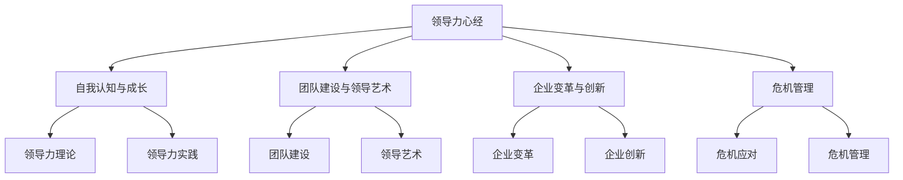

                 

# 领导力心经：成就一流企业的领导者法则

> 关键词：领导力、领导力心经、企业、领导者法则、组织发展

> 摘要：本文将从领导力心经的基本概念、核心原则、领导者的自我提升与成长等方面，深入探讨如何通过领导力心经帮助领导者提升个人领导力，构建高效团队，推动企业创新与变革，最终实现一流企业的目标。

## 1. 背景介绍

### 1.1 问题背景

在当今竞争激烈的市场环境中，企业领导者的角色和职责愈发重要。传统领导力模型往往注重权威和控制，但在快速变化的市场中，这种模式已经显得不够灵活和有效。现代领导者需要具备更加全面和先进的领导力心经，以应对复杂多变的环境和挑战。

### 1.2 问题描述

领导者需要具备哪些核心能力？如何通过自我提升和团队建设来增强领导力？如何推动企业创新与变革？如何在危机中保持冷静，并转化为发展的机遇？这些问题成为了现代领导者面临的主要挑战。

### 1.3 问题解决

本书旨在通过领导力心经，帮助领导者：

- 理解领导力心经的基本原理和核心要素
- 掌握提升个人领导力的方法和技巧
- 学会构建高效团队，提升团队协作能力
- 掌握企业变革与创新的理论和实践
- 应对危机管理的挑战，提升领导力应对能力

### 1.4 边界与外延

领导力心经不仅适用于企业场景，也适用于政府机构、非盈利组织等其他组织形式。本书的核心内容旨在为所有希望提升领导力的人提供指导。

### 1.5 概念结构与核心要素组成

领导力心经的核心概念和要素包括：

- 领导力心经的核心原则
- 自我认知与成长
- 团队建设与领导艺术
- 企业变革与创新
- 危机管理

## 2. 核心概念与联系

### 2.1 核心概念原理

领导力心经是一种结合心理学、管理学、哲学等多学科理论的领导力理论和实践体系，旨在提升领导者的个人领导力和团队管理能力，推动企业实现持续发展。

### 2.2 概念属性特征对比表格

| 概念           | 特征                             |
| ------------- | ------------------------------ |
| 领导力心经       | 结合心理学、管理学、哲学等多学科理论   |
| 自我认知与成长     | 反思自我，提升个人能力和素质         |
| 团队建设与领导艺术   | 搭建团队，发挥团队成员潜力         |
| 企业变革与创新     | 推动企业适应市场变化，实现可持续发展   |
| 危机管理         | 应对危机，减轻危机对企业的影响       |

### 2.3 ER实体关系图架构

## 3. 领导力心经的基本原理与原则

### 3.1 领导力心经的基本原理

领导力心经的基本原理包括人本原理、情境原理、系统原理和创新原理，这些原理共同构成了领导力心经的理论基础。

- **人本原理**：以人为本，关注员工的需求和成长，实现企业与员工的共同发展。
- **情境原理**：根据不同的领导情境，灵活运用不同的领导方法和策略。
- **系统原理**：将企业视为一个系统，关注内部各部门之间的协作与整合。
- **创新原理**：鼓励创新思维，推动企业持续发展。

### 3.2 领导力心经的核心原则

领导力心经的核心原则包括：

- **坦诚信任**：建立信任基础，激发员工的积极性和创造力。
- **精准定位**：明确领导目标，制定合理的战略规划。
- **持续学习**：不断学习新知识，提升个人领导力和专业素养。
- **创新思维**：鼓励创新思维，推动企业持续发展。
- **人文关怀**：关注员工的需求和成长，实现企业与员工的共同发展。

## 4. 领导者的自我提升与成长

### 4.1 自我认知与反思

领导者需要具备自我认知的能力，了解自己的优势和不足。通过定期反思和总结，不断改进自己的领导方式和方法。

### 4.2 自我提升的方法与技巧

- **学习与培训**：参加领导力相关的培训课程，学习新的管理理念和方法。
- **阅读与研究**：阅读领导力相关的书籍和文章，深入研究领导力的理论和实践。
- **实践与反思**：在实际工作中，不断尝试新的领导方法，并反思其效果。

### 4.3 持续学习的必要性

持续学习是领导者成长的动力源泉。随着市场环境的变化，领导者需要不断更新知识和技能，以适应新的挑战。

## 5. 团队建设与领导艺术

### 5.1 团队建设的原则

- **目标明确**：明确团队的目标，确保团队成员都明确自己的职责和任务。
- **分工合作**：根据团队成员的特长和优势，进行合理的分工，实现协同工作。
- **相互尊重**：尊重团队成员的个人意见和贡献，建立良好的团队氛围。

### 5.2 领导艺术的运用

- **激励与反馈**：通过有效的激励和反馈机制，激发团队成员的积极性和创造力。
- **沟通与协调**：建立有效的沟通渠道，确保信息的畅通和协调。
- **冲突管理**：及时解决团队内部的冲突，避免影响团队的正常运作。

## 6. 企业变革与创新

### 6.1 变革的必要性

在快速变化的市场环境中，企业需要具备变革和创新的能力，以适应新的挑战和机遇。

### 6.2 创新的方法

- **市场调研**：深入了解市场需求和趋势，为创新提供方向。
- **技术创新**：投入研发资源，推动技术进步，提升企业竞争力。
- **商业模式创新**：探索新的商业模式，实现企业的可持续发展。

## 7. 危机管理

### 7.1 危机管理的原则

- **预防为主**：通过建立预警机制，提前识别潜在危机。
- **快速响应**：在危机发生时，迅速采取行动，控制事态发展。
- **持续改进**：从危机中总结经验，不断改进管理策略。

### 7.2 危机管理的技巧

- **危机沟通**：建立有效的沟通机制，确保信息的透明和及时传递。
- **团队协作**：动员团队力量，共同应对危机。
- **资源调配**：合理调配企业资源，确保危机管理的有效性。

## 8. 总结与展望

领导力心经为领导者提供了全面的理论和实践指导，帮助其在复杂多变的市场环境中提升个人领导力，构建高效团队，推动企业创新与变革。未来，领导力心经将继续适应时代的发展，为领导者提供更加有力的支持。

## 9. 作者信息

作者：AI天才研究院/AI Genius Institute & 禅与计算机程序设计艺术 /Zen And The Art of Computer Programming

----------------------------------------------------------------

[文章内容结束]

