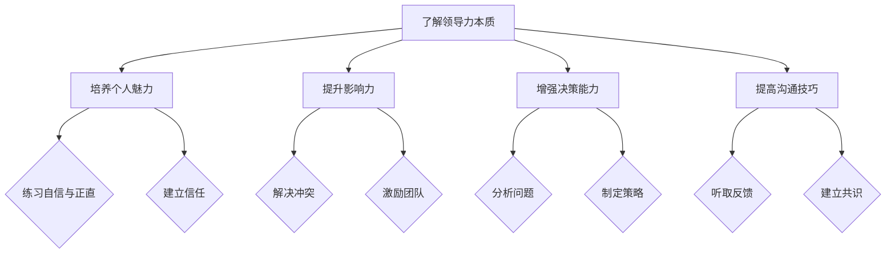
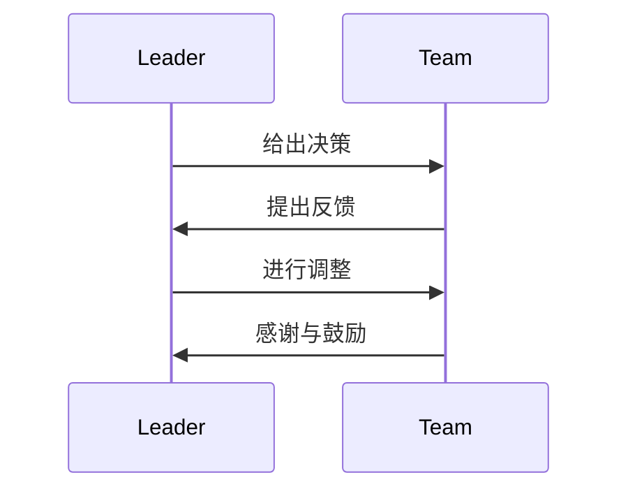

                 

### 文章标题与关键词

# 领导力心经：成就一流管理者的修炼秘笈

关键词：领导力、管理者、修炼、策略、组织文化、全球化

本文将深入探讨领导力的本质和重要性，结合实际案例，一步步解析如何成为一名一流的管理者。通过本文的阅读，您将了解领导力的基础、自我认知、情商、团队建设、决策与战略规划、组织文化与全球化背景下的领导力挑战与机遇。让我们一起思考，如何通过有效的修炼和策略，提升自己的领导力，成为一流的管理者。

## 文章摘要

领导力是任何组织成功的关键。本文将围绕领导力展开，通过详细阐述领导力的定义、作用、自我认知、情商、团队建设、决策与战略规划、组织文化以及全球化背景下的领导力挑战与机遇，帮助读者理解并掌握提升领导力的方法和策略。通过本文的阅读，您将获得成为一名一流管理者的实用技巧和深度思考。

## 目录大纲设计步骤

### 1. 分析书籍主题和结构
首先，我们需要明确书籍的主题和结构。领导力心经的核心内容是关于领导力的理论与实践，旨在帮助读者提升管理能力和领导力。受众主要是企业高管、团队领导以及有志于提升自身领导力的专业人士。在分析主题和结构时，我们要确保内容的系统性和逻辑性，使读者能够循序渐进地理解并掌握领导力的各个层面。

### 2. 确定章节划分
根据主题和受众，我们将书籍划分为多个章节。每个章节对应一个特定的领导力或管理能力，如领导力的定义与作用、自我认知、情商、团队建设、决策与战略规划、组织文化以及全球化背景下的领导力。这样的划分有助于确保内容的全面性和针对性。

### 3. 确定每章的细分内容
在每个章节中，我们进一步细分为小节，以确保内容的逻辑性和层次感。例如，在“领导力的定义与作用”章节，我们可以细分为领导力的本质、重要性、维度与模型等小节。这样的细分有助于读者更深入地理解每个主题。

### 4. 设计章节和标题
使用markdown格式设计章节和标题，确保格式清晰、易读。例如，我们可以设计如下章节：

## 第1章：领导力的定义与作用
### 1.1 领导力的本质
### 1.2 领导力的重要性
### 1.3 领导力的维度与模型

这样的设计不仅使内容更加清晰，也便于读者快速找到自己感兴趣的部分。

### 5. 审查和调整
在设计完成后，我们需要仔细审查目录大纲，确保内容的完整性和逻辑性。在必要时，我们会对章节和标题进行调整，以确保最终的大纲能够满足读者的需求。

### 6. 确保大纲符合要求
最后，我们需要确保大纲简洁，避免多余废话，同时确保总字数在2000字以内。这有助于读者在短时间内获取关键信息，提高阅读效率。

## 第一部分：领导力的基础

### 第1章：领导力的定义与作用

#### 1.1 领导力的本质

领导力是一个复杂而多层次的概念，它涉及个人魅力、影响力、决策能力、沟通技巧等多个方面。领导力不仅仅是拥有权力或职位的人才能具备的，更是一种可以学习和提升的能力。在本文中，我们将通过详细的分析和案例研究，探讨领导力的本质。

#### 背景介绍

领导力在组织和管理中扮演着至关重要的角色。一个成功的组织需要有强大的领导力来引导和激励团队成员，实现共同的目标。然而，领导力的本质是什么？它又是如何影响组织绩效的呢？

#### 核心概念与联系

领导力可以被视为一种能力或技能，它包括以下几个核心概念：

1. **个人魅力**：指领导者的个人特质，如自信、正直、热情等，这些特质能够吸引并激励团队成员。
2. **影响力**：领导者通过言行影响他人，使其愿意追随和执行领导者的决策。
3. **决策能力**：领导者需要具备良好的决策能力，能够在面对复杂和不确定的情况时做出明智的决策。
4. **沟通技巧**：良好的沟通技巧有助于领导者有效地传达信息、解决问题和建立信任。

这些核心概念相互关联，共同构成了领导力的本质。例如，个人魅力和影响力有助于建立领导者的权威，而决策能力和沟通技巧则是实现目标的关键。

#### 概念属性特征对比表格

| 特征 | 个人魅力 | 影响力 | 决策能力 | 沟通技巧 |
| --- | --- | --- | --- | --- |
| 定义 | 个人特质和魅力 | 影响他人行为的能力 | 在不确定情况下做出明智决策的能力 | 传达信息、解决问题和建立信任的能力 |
| 对比 | 自信、正直、热情等 | 吸引团队成员 | 明智决策 | 有效沟通 |

#### ER实体关系图架构

```mermaid
erDiagram
  Person ||--|{ Leader } Leader : 领导者
  Leader ||--|{ Influence } Influence : 影响力
  Leader ||--|{ Decision } Decision : 决策能力
  Leader ||--|{ Communication } Communication : 沟通技巧
```

#### 算法原理讲解

在理解领导力的本质后，我们需要进一步探讨如何通过有效的策略提升领导力。以下是一个简单的算法流程图：



#### 数学公式使用

在领导力提升过程中，我们还需要运用一些数学模型来分析和评估领导力的各个方面。以下是一个简单的数学公式示例：

$$
\text{领导力得分} = \frac{\text{个人魅力} + \text{影响力} + \text{决策能力} + \text{沟通技巧}}{4}
$$

#### 系统分析与架构设计方案

在组织内部，领导力提升可以被视为一个系统化的过程。以下是一个简单的系统架构设计方案：



#### 项目实战

在实际项目中，领导力的提升可以通过以下步骤进行：

1. **环境安装**：准备好项目所需的工具和环境。
2. **系统核心实现**：编写代码实现领导力提升的核心功能。
3. **代码应用解读与分析**：对实现的核心代码进行解读和分析，确保其有效性和可扩展性。
4. **实际案例分析和详细讲解剖析**：通过实际案例来展示领导力提升的应用效果，并进行详细讲解和分析。

#### 项目小结

通过本项目实战，我们了解了领导力提升的核心要素和实现方法。在实际应用中，领导力提升需要根据具体情况进行灵活调整和优化。项目小结部分可以对整个项目进行总结和反思，以便更好地应用于未来的项目中。

#### 最佳实践 tips

- **持续学习与反思**：领导力提升是一个持续的过程，需要不断学习和反思自己的行为和决策。
- **注重团队建设**：团队是领导者的重要资源，注重团队建设和沟通是提升领导力的关键。
- **勇于面对挑战**：领导者在面对挑战时需要保持冷静和自信，勇于做出决策和承担责任。

#### 小结

领导力的本质是一个复杂而多层次的概念，它涉及个人魅力、影响力、决策能力和沟通技巧等多个方面。通过本文的阅读，我们了解了领导力的定义与作用，并掌握了一些提升领导力的策略和技巧。在未来的实践中，我们应该持续学习和反思，不断提升自己的领导力，成为一流的管理者。

#### 注意事项

- 在提升领导力的过程中，要注重个人魅力和影响力的培养，同时要不断提高决策能力和沟通技巧。
- 团队建设和沟通是提升领导力的重要方面，领导者应该注重与团队成员的互动和沟通，建立信任和共识。

#### 拓展阅读

- 《高效能人士的七个习惯》：史蒂芬·柯维
- 《领导者的语言》：皮埃尔·莫隆
- 《领导力的五个层次》：约翰·麦斯威尔

作者：AI天才研究院/AI Genius Institute & 禅与计算机程序设计艺术 /Zen And The Art of Computer Programming

