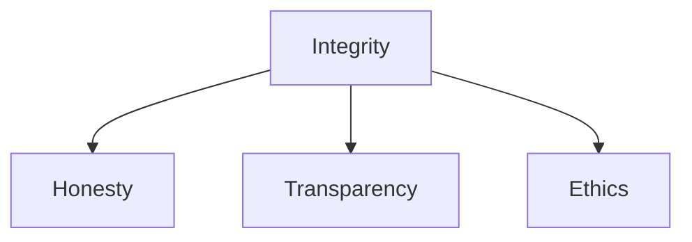
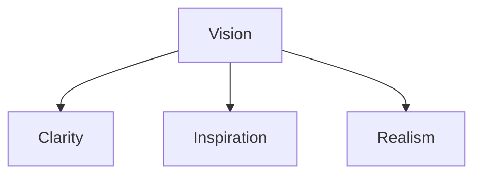
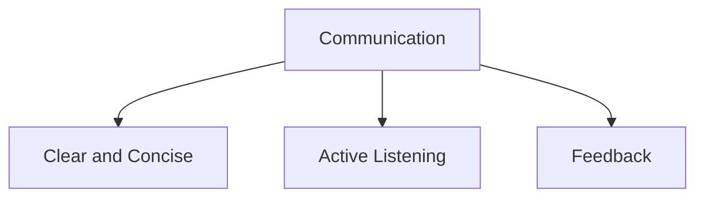
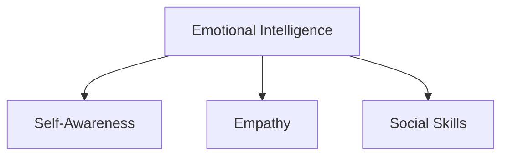
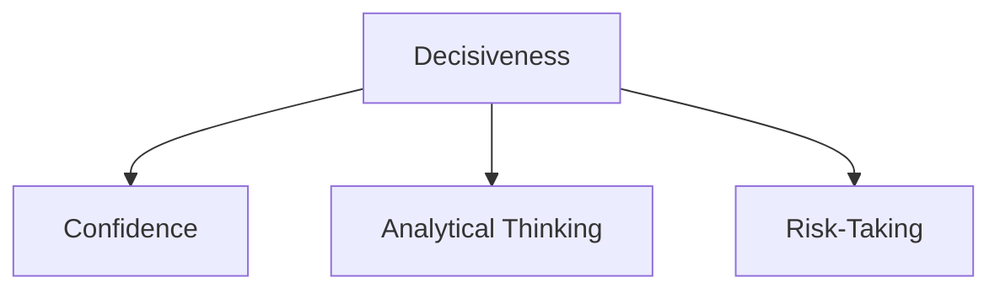

                 

### Introduction to the Book

**Title**: Leadership Heart Chakra: The Leadership Principles for Achieving Great Leadership

**Keywords**: Leadership, Heart Chakra, Leadership Principles, Organizational Success, Leadership Development

**Abstract**:

In today's fast-paced and ever-changing business environment, effective leadership is more critical than ever. "Leadership Heart Chakra: The Leadership Principles for Achieving Great Leadership" is a comprehensive guide that delves deep into the essence of leadership, providing practical insights and actionable strategies to help aspiring and experienced leaders alike. This book aims to equip readers with the essential tools and knowledge required to cultivate a strong leadership presence and drive their organizations towards success.

The concept of "Heart Chakra" in the title represents the core of leadership, symbolizing the emotional intelligence, compassion, and holistic approach that great leaders embody. The book is divided into several chapters, each focusing on a distinct aspect of leadership. From understanding the importance of leadership and its core principles to developing practical skills and navigating crises, this book covers all facets of effective leadership.

The target audience for this book includes:

1. **Aspiring Leaders**: Individuals who are interested in developing their leadership skills and stepping into leadership roles.
2. **Experienced Leaders**: Leaders who want to refine their leadership approach, enhance their impact, and drive better organizational outcomes.
3. **Managers and Supervisors**: Individuals in managerial positions who aspire to transition into leadership roles and elevate their teams.
4. **Entrepreneurs and Business Owners**: Entrepreneurs and business owners who want to build a strong organizational culture and lead their teams effectively.
5. **HR Professionals and Trainers**: Professionals involved in leadership development and training who want to enhance their knowledge and provide valuable insights to their clients or organizations.

By the end of this book, readers will gain a deeper understanding of the fundamental principles of leadership, learn practical strategies for developing their leadership skills, and be equipped to navigate the challenges and complexities of leadership in today's dynamic business landscape.

### The Importance and Essence of Leadership

In any organization, leadership plays a pivotal role in shaping its direction, culture, and success. Effective leadership fosters a positive and productive work environment, drives innovation, and ensures that the organization remains adaptive and resilient in the face of challenges. The essence of leadership can be understood through several key factors, including its importance, core principles, and various leadership styles.

#### Importance of Leadership

Leadership is crucial for several reasons:

1. **Guiding and Motivating**: Leaders provide guidance and motivation to their teams, helping them to set goals, overcome obstacles, and achieve success. By inspiring and empowering their followers, leaders create a sense of purpose and direction.
2. **Organizational Culture**: Leaders set the tone for the organizational culture. Their behaviors and values influence the way employees interact with each other and approach their work, shaping the overall culture of the organization.
3. **Strategy and Decision-Making**: Effective leaders are responsible for setting the strategic direction of the organization and making informed decisions that align with the organization's goals and objectives.
4. **Employee Development**: Leaders play a crucial role in the development of their employees. By providing feedback, coaching, and mentoring, they help their team members to grow and develop their skills and abilities.
5. **Performance and Success**: Leadership is directly linked to organizational performance and success. Great leaders can drive their teams to achieve exceptional results and create a competitive advantage for their organization.

#### Core Principles of Leadership

The core principles of leadership can be summarized as follows:

1. **Integrity**: Integrity is the foundation of leadership. Leaders must act with honesty, transparency, and ethical behavior. By demonstrating integrity, leaders gain the trust and respect of their followers.
2. **Vision**: A great leader possesses a clear vision for the future. This vision serves as a guiding light, inspiring and motivating their team to work towards a common goal.
3. **Communication**: Effective communication is essential for leadership. Leaders must be able to clearly articulate their vision, goals, and expectations, and also actively listen to their followers to understand their needs and concerns.
4. **Emotional Intelligence**: Emotional intelligence is the ability to understand, use, and manage emotions in positive ways. Great leaders possess high emotional intelligence, allowing them to empathize with their followers and build strong relationships.
5. **Decisiveness**: Leaders must be decisive, making tough decisions in a timely manner. By making informed and confident decisions, leaders demonstrate their ability to lead and guide their organization through challenges.

#### Leadership Styles

There are several leadership styles, each with its own strengths and weaknesses:

1. **Autocratic Leadership**: In autocratic leadership, the leader makes decisions without consulting their followers. This style can be effective in situations that require quick and decisive action, but it can also lead to low morale and decreased job satisfaction among followers.
2. **Democratic Leadership**: In democratic leadership, the leader involves their followers in the decision-making process. This style fosters a sense of ownership and involvement among followers, but it can also lead to decision-making delays.
3. **Laissez-Faire Leadership**: In laissez-faire leadership, the leader delegates authority and decision-making to their followers. This style can foster creativity and innovation among followers, but it can also result in lack of direction and coordination.
4. **Transformational Leadership**: In transformational leadership, the leader inspires and motivates their followers to achieve their full potential. This style can drive significant organizational change and innovation, but it requires a high level of trust and support from followers.
5. **Servant Leadership**: In servant leadership, the leader prioritizes the needs of their followers and acts as a servant to their team. This style fosters a collaborative and supportive work environment, but it can also require a significant time investment from the leader.

In conclusion, effective leadership is a complex and multifaceted role that requires a combination of skills, knowledge, and qualities. By understanding the importance of leadership and its core principles, and by mastering different leadership styles, leaders can drive their organizations towards success in today's dynamic business landscape.

#### Core Leadership Principles

Effective leadership is built upon a foundation of core principles that guide leaders in their decision-making, behavior, and interactions with their teams. These principles are not only essential for leading successful projects and organizations but also for fostering a positive and productive work environment. In this chapter, we will delve into five key core leadership principles: integrity, vision, communication, emotional intelligence, and decisiveness. We will also use Mermaid diagrams to illustrate the ER entity relationships and concept attributes associated with these principles.

##### Integrity

**Definition**: Integrity refers to the adherence to strong moral and ethical principles. Leaders with integrity act with honesty, transparency, and ethical behavior, even when faced with difficult choices or pressure.

**Concept Attributes**:

1. **Honesty**: Leaders with integrity are truthful in their words and actions, building trust and credibility with their followers.
2. **Transparency**: Integrity also involves being transparent about decisions, policies, and processes, which helps to build trust and fosters a culture of openness within the organization.
3. **Ethics**: Leaders with integrity act ethically, even when it may be challenging or inconvenient, setting a positive example for their followers.

**ER Entity Relationship**:

**Example**:

A prime example of integrity in leadership is the former President of Finland, Sauli Niinistö. During his presidency, Niinistö maintained a high level of transparency and honesty in his actions, which earned him the respect and trust of the Finnish people.

##### Vision

**Definition**: Vision is the ability to see the future and to articulate a clear picture of what success looks like for the organization or project.

**Concept Attributes**:

1. **Clarity**: A vision must be clear and concise, allowing everyone to understand the direction and goals of the organization.
2. **Inspiration**: A strong vision inspires and motivates followers to work towards common objectives, creating a sense of purpose and direction.
3. **Realism**: While a vision should be ambitious, it must also be realistic, taking into account the resources and constraints of the organization.

**ER Entity Relationship**:

**Example**:

Apple's late CEO, Steve Jobs, was a master of vision. His ability to articulate a clear and inspiring vision for the company helped to drive innovation and propelled Apple to become one of the most successful companies in the world.

##### Communication

**Definition**: Communication is the exchange of information, ideas, and emotions between leaders and their followers.

**Concept Attributes**:

1. **Clear and Concise**: Effective communication is clear and concise, using simple language and avoiding jargon or technical terms that may confuse followers.
2. **Active Listening**: Active listening involves fully paying attention to what others are saying and understanding their perspectives, which helps to build trust and rapport.
3. **Feedback**: Leaders must provide constructive feedback to their followers, helping them to improve and grow.

**ER Entity Relationship**:

**Example**:

Warren Buffett, the CEO of Berkshire Hathaway, is known for his exceptional communication skills. His annual shareholder letters provide clear, concise, and insightful information about the company's performance and future plans.

##### Emotional Intelligence

**Definition**: Emotional intelligence is the ability to understand, use, and manage emotions in positive ways to facilitate effective communication and leadership.

**Concept Attributes**:

1. **Self-Awareness**: Emotional intelligence involves being aware of one's own emotions and their impact on behavior and decision-making.
2. **Empathy**: Empathy is the ability to understand and share the feelings of others, which helps leaders to build strong relationships and connect with their followers.
3. **Social Skills**: Emotional intelligence also includes social skills, such as conflict resolution and teamwork, which are essential for effective leadership.

**ER Entity Relationship**:

**Example**:

Bill Gates, co-founder of Microsoft, is known for his high emotional intelligence. His ability to empathize with his followers and understand their needs has helped him to build strong relationships and drive the success of the company.

##### Decisiveness

**Definition**: Decisiveness is the ability to make well-informed and timely decisions, even in the face of uncertainty or pressure.

**Concept Attributes**:

1. **Confidence**: Leaders who are decisive exhibit confidence in their decisions, which helps to build trust and credibility with their followers.
2. **Analytical Thinking**: Decisive leaders possess strong analytical skills, enabling them to evaluate information and make informed decisions.
3. **Risk-Taking**: Leaders must be willing to take calculated risks, which is essential for innovation and growth.

**ER Entity Relationship**:

**Example**:

Jack Welch, former CEO of General Electric, was known for his decisiveness. His ability to make bold decisions and take calculated risks helped to propel GE to the top of the industrial world.

In conclusion, these core leadership principles—integrity, vision, communication, emotional intelligence, and decisiveness—are essential for effective leadership. By embodying these principles, leaders can inspire and motivate their followers, drive organizational success, and build a positive and productive work environment.

### Leadership in Different Organizational Contexts

Leadership is not a one-size-fits-all approach; it must adapt to the unique needs and challenges of different organizational contexts. In this chapter, we will explore how leadership principles can be applied in various settings, including startups, mature companies, and remote teams. By understanding the specific dynamics of each context, leaders can tailor their strategies and techniques to maximize their effectiveness.

#### Leadership in Startups

In the dynamic and high-stakes environment of a startup, leadership takes on a unique set of challenges and opportunities. Startups often operate with limited resources, tight timelines, and a high degree of uncertainty. Here are some key aspects of leadership in a startup context:

1. **Adaptability and Flexibility**: Startups must be agile and responsive to changing market conditions and customer needs. Leaders in startups must be adaptable, willing to pivot strategies and plans as necessary to stay ahead of the competition.
   
2. **Vision and Innovation**: Startups thrive on innovation and a clear vision for the future. Leaders must be able to inspire and motivate their teams to push boundaries and create groundbreaking products or services.

3. **Resource Optimization**: With limited resources, leaders in startups must prioritize and allocate resources effectively. This often involves making tough decisions and focusing on the most critical tasks to drive growth and success.

4. **Risk-Taking**: Startups inherently involve a higher degree of risk-taking. Leaders must be comfortable with uncertainty and be willing to make bold decisions that can lead to significant rewards.

**Example**: Steve Jobs, co-founder of Apple, was a visionary leader who transformed Apple into one of the most successful startups of all time. His ability to innovate, his focus on product quality, and his relentless pursuit of perfection were key to Apple's early success.

#### Leadership in Mature Companies

Leadership in mature companies, particularly large corporations, presents a different set of challenges and opportunities. Mature companies often have well-established processes, a diverse workforce, and a more stable financial position. Here are some key aspects of leadership in mature companies:

1. **Sustaining Growth**: Mature companies must focus on sustaining growth and maintaining market share. Leaders must navigate complex organizational structures and align the company's strategy with market trends and customer needs.

2. **Change Management**: In mature companies, change can be more challenging due to entrenched processes and a larger workforce. Leaders must be skilled in change management to drive transformational initiatives and ensure smooth transitions.

3. **Employee Engagement**: Maintaining high levels of employee engagement is crucial in mature companies. Leaders must foster a positive work culture, provide opportunities for development, and recognize and reward employee contributions.

4. **Strategic Decision-Making**: Leaders in mature companies must make strategic decisions that balance short-term profitability with long-term growth and sustainability.

**Example**: Jeff Bezos, CEO of Amazon, has successfully led Amazon through rapid growth and transformation. His focus on customer-centricity, continuous innovation, and long-term strategic thinking has driven Amazon's success and established it as a global leader in e-commerce and cloud computing.

#### Leadership in Remote Teams

The rise of remote work has brought new challenges and opportunities for leadership. Leading remote teams requires a different approach to communication, collaboration, and management. Here are some key aspects of leadership in remote teams:

1. **Communication**: Effective communication is critical in remote teams. Leaders must ensure that information flows freely and that all team members feel heard and engaged.

2. **Trust and Accountability**: Building trust and ensuring accountability can be more challenging in remote teams. Leaders must find ways to foster trust and hold team members accountable for their responsibilities.

3. **Team Collaboration**: Leaders must facilitate collaboration among remote team members, using tools and platforms to facilitate virtual teamwork and ensure that goals are met.

4. **Work-Life Balance**: Remote work can blur the lines between work and personal life. Leaders must support their team members in maintaining a healthy work-life balance to prevent burnout and ensure productivity.

**Example**: Satya Nadella, CEO of Microsoft, has successfully led Microsoft's transition to a more remote-friendly work environment. His focus on digital transformation and leveraging technology to enhance collaboration and communication has enabled Microsoft to thrive in the remote work era.

In conclusion, leadership principles can be applied effectively in various organizational contexts, but leaders must adapt their strategies to the unique challenges and opportunities of each setting. Whether in a startup, a mature company, or a remote team, great leaders are those who can inspire, motivate, and guide their teams towards success.

### Developing Leadership Skills

Developing effective leadership skills is a lifelong journey that requires a combination of self-awareness, self-management, social skills, and relationship management. These skills are essential for leaders to navigate the complexities of modern organizations and inspire their teams to achieve their full potential. In this chapter, we will delve into each of these critical components and provide practical strategies to help you develop and enhance your leadership skills.

#### Self-Awareness

Self-awareness is the foundation of effective leadership. It involves understanding your own emotions, strengths, weaknesses, and how you impact others. Here are some strategies to improve self-awareness:

1. **Mindfulness Practices**: Practicing mindfulness can help you become more aware of your thoughts, emotions, and behaviors. Techniques such as meditation, deep breathing, and journaling can enhance your self-awareness.

2. **Feedback and Reflection**: Seek regular feedback from colleagues, mentors, and trusted friends. Reflect on their insights and use them to gain a deeper understanding of your leadership style and areas for improvement.

3. **Self-Assessment Tools**: Use self-assessment tools such as personality tests (e.g., Myers-Briggs, DiSC) and leadership assessments (e.g., the Leadership Development Profile) to identify your strengths and weaknesses.

**Example**:

A leader who regularly practices mindfulness and seeks feedback discovers that they tend to become overly stressed in high-pressure situations. By acknowledging this, they develop strategies to manage stress more effectively, such as taking short breaks and practicing deep breathing exercises.

#### Self-Management

Self-management involves controlling your emotions, managing stress, and staying focused on your goals. Here are some strategies to enhance self-management:

1. **Goal Setting**: Set clear, achievable goals for yourself and break them down into actionable steps. Regularly review your progress and adjust your strategies as needed.

2. **Time Management**: Prioritize tasks based on their importance and urgency. Use tools like the Eisenhower Matrix to help you manage your time effectively.

3. **Emotional Regulation**: Develop techniques to manage your emotions, such as recognizing when you're feeling overwhelmed, taking a step back, and refocusing on the task at hand.

**Example**:

A leader who struggles with time management implements a daily routine that includes prioritizing tasks using the Eisenhower Matrix. By focusing on high-priority tasks first, they find that they are more productive and less stressed.

#### Social Skills

Social skills are crucial for building relationships, fostering collaboration, and leading effectively. Here are some strategies to improve your social skills:

1. **Active Listening**: Truly listen to others when they speak, asking questions to clarify your understanding and show that you value their input.

2. **Conflict Resolution**: Learn to address conflicts constructively, focusing on finding solutions rather than assigning blame. Practice empathy and active listening to understand all perspectives.

3. **Networking**: Build a strong professional network by attending industry events, joining relevant organizations, and connecting with colleagues and mentors.

**Example**:

A leader who wants to improve their social skills attends industry conferences and engages in networking events. By actively seeking out new connections and engaging in meaningful conversations, they expand their network and gain valuable insights.

#### Relationship Management

Effective relationship management involves building strong, positive relationships with team members, colleagues, and stakeholders. Here are some strategies to enhance relationship management:

1. **Empathy**: Develop empathy by putting yourself in others' shoes and understanding their perspectives, challenges, and motivations.

2. **Trust Building**: Build trust by consistently acting with integrity, being reliable, and following through on commitments.

3. **Communication**: Maintain open and transparent communication with all stakeholders, fostering a culture of trust and collaboration.

**Example**:

A leader who wants to strengthen relationships with their team implements regular one-on-one meetings to check in on progress, discuss challenges, and provide feedback. By actively listening and showing empathy, they build trust and create a supportive work environment.

#### Integrating Skills for Leadership Success

Developing leadership skills is an iterative process that requires continuous learning and self-improvement. By integrating self-awareness, self-management, social skills, and relationship management, leaders can create a strong foundation for success. Here's how to integrate these skills:

1. **Self-Assessment**: Regularly assess your leadership skills to identify areas for improvement. Use self-assessment tools and feedback to track your progress.

2. **Continuous Learning**: Engage in ongoing learning opportunities, such as workshops, courses, and books, to expand your knowledge and skills.

3. **Practice and Feedback**: Practice your skills in real-world scenarios and seek feedback from peers, mentors, and coaches to refine your approach.

4. **Adaptability**: Be open to learning and adapting your strategies as you gain new insights and experiences.

In conclusion, developing effective leadership skills is essential for success in today's dynamic business environment. By focusing on self-awareness, self-management, social skills, and relationship management, leaders can inspire and motivate their teams, drive organizational success, and create a positive and productive work culture.

### Leadership in Crisis and Change

In the dynamic landscape of modern business, leaders are often faced with crises and periods of significant change. These challenges can disrupt operations, erode trust, and create uncertainty among employees. However, effective leadership during times of crisis and change is crucial for maintaining stability, minimizing negative impacts, and driving the organization towards recovery and growth. In this chapter, we will explore strategies for navigating crises and managing change, with insights from real-world case studies and scenarios.

#### Navigating Crises

A crisis can strike an organization in various forms, such as financial distress, natural disasters, cybersecurity breaches, or public scandals. During a crisis, leaders must take immediate action to stabilize the situation, mitigate damage, and communicate effectively with all stakeholders. Here are key strategies for navigating crises:

1. **Immediate Response**: In the initial phase of a crisis, leaders must act swiftly to understand the situation, assess the damage, and develop a plan of action. This may involve activating crisis management teams, communicating with key stakeholders, and implementing contingency plans.

2. **Effective Communication**: Open and transparent communication is critical during a crisis. Leaders should communicate regularly with employees, customers, suppliers, and the public, providing updates on the situation and steps being taken to address the crisis. This helps to maintain trust and manage expectations.

3. **Crisis Management Teams**: Establish a crisis management team consisting of key leaders and stakeholders to coordinate response efforts, make decisions, and ensure that all departments are aligned.

4. **Leadership by Example**: During a crisis, leaders must demonstrate resilience, composure, and decisiveness. Their actions and behaviors set the tone for the organization and can influence the collective response and morale of employees.

**Case Study**: The COVID-19 Pandemic

The COVID-19 pandemic presented an unprecedented crisis for organizations worldwide. Companies had to quickly adapt to remote work, supply chain disruptions, and declining revenues. One example of effective crisis leadership during this time is Shopify, an e-commerce platform.

- **Immediate Response**: Shopify acted swiftly, providing free or discounted access to its services to help small businesses adapt to the surge in online shopping. They also launched the Shopify Pay Later program to support cash-strapped customers.

- **Effective Communication**: Shopify maintained open lines of communication with its customers, providing regular updates on platform functionality and support initiatives. They also established a dedicated help center to assist businesses facing challenges.

- **Leadership by Example**: Shopify's leadership team, including CEO Tobi Lütke, demonstrated resilience and adaptability. They communicated frequently with employees, ensuring that they were informed and supported during the crisis.

#### Managing Change

Change is a constant in the business world, and effective leadership in managing change is essential for driving growth and innovation. Here are strategies for managing change effectively:

1. **Vision and Communication**: Leaders must articulate a clear vision for the future and communicate the rationale for change to all stakeholders. This helps to build support and alignment around the change initiative.

2. **Engagement and Participation**: Involving employees in the change process can increase acceptance and commitment. Leaders should encourage feedback, seek input from various stakeholders, and involve them in planning and implementation.

3. **Training and Support**: Provide adequate training and support to help employees adapt to new processes, technologies, or organizational structures. This can include workshops, one-on-one coaching, and access to learning resources.

4. **Cultural Alignment**: Change can challenge the existing organizational culture. Leaders must foster a culture of openness, collaboration, and continuous improvement to support successful change implementation.

**Case Study**: Starbucks' Evolution

Starbucks has consistently demonstrated effective leadership in managing change. From introducing new products to rebranding and adopting sustainability initiatives, Starbucks has navigated various changes with success.

- **Vision and Communication**: Starbucks has been effective in communicating its vision for the future, emphasizing values such as sustainability and inclusivity. They have clearly communicated the rationale behind each change to their customers and employees.

- **Engagement and Participation**: Starbucks has involved employees in the change process, encouraging them to provide feedback and suggestions. They have also implemented programs to support employee development and well-being.

- **Training and Support**: Starbucks has provided extensive training to employees on new products and processes, ensuring a smooth transition during changes. They have also offered resources to help employees adapt to new technologies and roles.

- **Cultural Alignment**: Starbucks has aligned its organizational culture with its values, fostering a sense of community and purpose among employees. This cultural alignment has been a key factor in successfully managing change.

#### Crisis and Change Scenarios

Here are two scenarios to illustrate effective leadership in crisis and change:

**Scenario 1: A Cybersecurity Breach**

A company experiences a significant cybersecurity breach, resulting in the theft of sensitive customer data. The following steps can be taken to address the crisis:

1. **Immediate Response**: Activate the crisis management team to assess the situation, contain the breach, and mitigate damage. Notify affected customers promptly and provide guidance on protecting their information.

2. **Effective Communication**: Communicate regularly with customers, employees, and stakeholders, providing updates on the situation and steps being taken to address the breach. Maintain transparency and apologize for any inconvenience caused.

3. **Leadership by Example**: The CEO and other leaders should demonstrate accountability and a commitment to resolving the issue. They should also communicate the steps being taken to improve cybersecurity measures.

**Scenario 2: A Major Product Launch**

A company is preparing to launch a new product that is critical to its success. Here are steps to ensure a successful launch:

1. **Vision and Communication**: Clearly articulate the vision for the product and communicate the value it brings to customers. Engage stakeholders and ensure alignment around the launch objectives.

2. **Engagement and Participation**: Involve cross-functional teams in the planning and implementation of the launch. Encourage feedback and input from various perspectives to ensure a well-rounded approach.

3. **Training and Support**: Provide comprehensive training for sales, marketing, and customer service teams to ensure they are fully prepared to support the launch. Offer ongoing support and resources to address any challenges that arise.

4. **Cultural Alignment**: Align the organizational culture with the product's vision and values. Foster a culture of innovation and collaboration to support the success of the launch.

In conclusion, effective leadership during crises and change is critical for maintaining stability, minimizing negative impacts, and driving organizational success. By taking immediate action, communicating effectively, and fostering a supportive culture, leaders can navigate challenges and emerge stronger. Real-world examples and scenarios demonstrate the importance of adaptability, vision, and strong leadership in overcoming crises and managing change.

### Leadership and Emotional Intelligence

Emotional intelligence (EI) is a critical component of effective leadership. It encompasses the ability to understand, use, and manage emotions in oneself and in relationships with others. Research has shown that leaders with high emotional intelligence are more effective in fostering positive team dynamics, building strong relationships, and driving organizational success. In this chapter, we will explore the role of emotional intelligence in leadership, its impact on team dynamics, and strategies for enhancing EI in leaders.

#### The Role of Emotional Intelligence in Leadership

Emotional intelligence includes four key domains: self-awareness, self-management, social skills, and empathy. Each of these domains plays a crucial role in leadership:

1. **Self-Awareness**: Self-awareness involves recognizing and understanding one's own emotions, strengths, weaknesses, and how they impact behavior. Leaders who are self-aware are better equipped to make informed decisions, manage their emotions effectively, and lead by example.

2. **Self-Management**: Self-management involves regulating one's emotions and behaviors to adapt to changing situations and maintain a positive outlook. Leaders who are good at self-management are more resilient, less likely to be overwhelmed by stress, and better able to maintain their focus and productivity.

3. **Social Skills**: Social skills involve effectively interacting with others, building relationships, and communicating effectively. Leaders with strong social skills are able to build trust, resolve conflicts, and inspire their teams.

4. **Empathy**: Empathy involves understanding and sharing the feelings of others. Leaders who are empathetic are able to connect with their team members, understand their needs and concerns, and build strong, positive relationships.

#### The Impact of Emotional Intelligence on Team Dynamics

Emotional intelligence has a significant impact on team dynamics and overall organizational success. Here are some ways in which EI influences team performance:

1. **Trust and Collaboration**: Leaders with high emotional intelligence are more likely to build trust and foster collaboration among team members. By demonstrating empathy and understanding, they create an environment where team members feel valued and supported.

2. **Conflict Resolution**: Emotional intelligence helps leaders to effectively manage and resolve conflicts within the team. By understanding the underlying emotions and needs of the individuals involved, they can address the root causes of the conflict and find mutually beneficial solutions.

3. **Motivation and Engagement**: Leaders who are emotionally intelligent are better at motivating and engaging their teams. They understand the individual needs and motivations of their team members, and use this knowledge to create a positive and inspiring work environment.

4. **Resilience and Adaptability**: Teams led by emotionally intelligent leaders are more resilient and adaptable to change. These leaders are able to navigate challenges and setbacks with grace, providing their teams with the support and guidance needed to bounce back and continue performing.

#### Strategies for Enhancing Emotional Intelligence in Leaders

To enhance emotional intelligence, leaders can adopt various strategies that focus on self-awareness, self-management, social skills, and empathy. Here are some practical tips:

1. **Mindfulness Practices**: Engage in mindfulness practices such as meditation, deep breathing, and journaling to improve self-awareness and manage stress. These practices help leaders to be present in the moment and develop a better understanding of their emotions.

2. **Self-Reflection**: Set aside time for self-reflection to analyze your emotions, behaviors, and their impact on others. Regular self-reflection can help you identify areas for improvement and develop a growth mindset.

3. **Seek Feedback**: Actively seek feedback from peers, mentors, and team members to gain insights into your emotional intelligence strengths and areas for improvement. Be open to receiving feedback and use it as a learning opportunity.

4. **Empathy Training**: Engage in empathy-building activities, such as role-playing scenarios or participating in empathy training workshops. These activities can help you develop a deeper understanding of others' emotions and perspectives.

5. **Active Listening**: Practice active listening by genuinely paying attention to others, asking open-ended questions, and reflecting back what you've heard. This helps to build trust and shows that you value their input.

6. **Conflict Resolution Training**: Attend workshops or courses on conflict resolution to learn effective strategies for managing and resolving conflicts. These skills are essential for maintaining positive team dynamics and fostering a collaborative environment.

7. **Continuous Learning**: Embrace a mindset of continuous learning and growth. Read books, attend seminars, and engage in online courses to expand your knowledge of emotional intelligence and leadership.

#### Case Study: The Impact of Emotional Intelligence on Team Performance

Consider the example of a technology company that implemented a program to enhance emotional intelligence among its leaders. The company conducted EI training sessions, encouraged self-reflection, and provided resources for continuous learning. As a result, the leaders developed stronger relationships with their teams, improved conflict resolution skills, and became more effective in motivating and engaging their employees.

The impact on team dynamics was significant. Trust and collaboration increased, leading to improved communication and a more positive work environment. Conflict among team members decreased, and overall team performance improved. The company saw increased innovation, higher employee engagement, and better customer satisfaction, all of which contributed to its success.

In conclusion, emotional intelligence is a crucial aspect of effective leadership. By developing their emotional intelligence, leaders can build stronger relationships, enhance team dynamics, and drive organizational success. The strategies outlined in this chapter can help leaders enhance their EI and create a positive and productive work environment.

### Personal Leadership Development Plan

Creating a personal leadership development plan is a strategic process that enables leaders to articulate their goals, identify areas for improvement, and implement actionable steps to enhance their leadership skills. This chapter provides a step-by-step guide to help you develop your own leadership development plan, ensuring that you are equipped to lead effectively and inspire your team.

#### Step 1: Self-Assessment

The first step in creating a personal leadership development plan is to conduct a thorough self-assessment. This involves identifying your strengths, weaknesses, skills, and areas for improvement. Here are some strategies to help you with this process:

1. **Reflect on Your Experiences**: Think about past leadership roles and experiences, including what worked well and what didn't. Consider situations where you felt confident and effective as a leader, as well as times when you faced challenges or felt less competent.

2. **Seek Feedback**: Ask for feedback from colleagues, mentors, and direct reports. They can provide valuable insights into your leadership style, strengths, and areas for improvement. Be open to receiving constructive criticism and use it as an opportunity for growth.

3. **Use Self-Assessment Tools**: Utilize self-assessment tools such as the Leadership Development Profile or the Emotional Intelligence Inventory to gain a deeper understanding of your leadership strengths and weaknesses. These tools can provide structured insights and benchmarks for comparison.

4. **Write a Self-Reflection Journal**: Keep a journal to document your thoughts, observations, and experiences as a leader. This can help you identify patterns and areas for improvement over time.

#### Step 2: Set Goals

Once you have a clear understanding of your current leadership capabilities, the next step is to set specific, measurable, achievable, relevant, and time-bound (SMART) goals for your leadership development. Here's how to do it:

1. **Identify Your Priorities**: Based on your self-assessment, identify the areas where you want to focus your development efforts. Prioritize these areas based on their importance to your role and career aspirations.

2. **Set SMART Goals**: For each priority area, create one or more SMART goals. For example, instead of setting a vague goal like "improve communication skills," set a specific goal like "participate in a communication skills workshop within the next three months."

3. **Write a Vision Statement**: Create a vision statement that outlines your long-term leadership aspirations. This statement should be inspiring and motivational, serving as a guiding light for your development journey.

#### Step 3: Develop an Action Plan

With your goals in place, the next step is to develop a detailed action plan to help you achieve them. Here's how to create an effective action plan:

1. **Identify Resources**: Determine the resources you'll need to achieve your goals, such as training programs, coaching, books, or workshops. Identify any barriers that may hinder your progress and explore ways to overcome them.

2. **Create Milestones**: Break your goals down into smaller, manageable milestones. These milestones will serve as checkpoints along your development journey and help you track your progress.

3. **Assign Timeframes**: Assign specific timeframes to each milestone and action item. This will help you stay accountable and maintain momentum in your development efforts.

4. **Develop a Learning Schedule**: Create a schedule for your learning activities, including reading, attending workshops, and seeking feedback. Consistency is key to making progress over time.

5. **Monitor and Adjust**: Regularly review your progress against your milestones and adjust your action plan as needed. Be flexible and open to adapting your plan based on new insights or changing circumstances.

#### Step 4: Implement and Reflect

Once you have your leadership development plan in place, it's time to put it into action and continuously reflect on your progress. Here are some final steps:

1. **Implement Your Plan**: Start taking the actions outlined in your plan. Be proactive in pursuing your goals and actively seek out opportunities to apply your new skills and knowledge.

2. **Seek Feedback**: Continuously seek feedback from colleagues, mentors, and direct reports to assess your progress and identify areas for improvement. Use this feedback to refine your approach and make adjustments to your plan as needed.

3. **Reflect and Adjust**: Regularly reflect on your development journey, evaluating what's working and what's not. Use this reflection to adjust your goals, milestones, and action plan to ensure continuous improvement.

4. **Celebrate Achievements**: Acknowledge and celebrate your achievements along the way. This will help to maintain motivation and encourage you to continue pursuing your leadership development goals.

By following these steps, you can create a personalized leadership development plan that will guide you in enhancing your leadership skills and driving your career forward. Remember, effective leadership is a lifelong journey, and committing to continuous development is key to becoming a great leader.

### Conclusion

In "Leadership Heart Chakra: The Leadership Principles for Achieving Great Leadership," we have explored the essential components of effective leadership, from core principles such as integrity, vision, communication, emotional intelligence, and decisiveness, to practical strategies for developing leadership skills and navigating crises. By understanding and applying these principles, leaders can inspire and motivate their teams, drive organizational success, and create a positive and productive work environment.

Key takeaways from this book include the importance of self-awareness, self-management, and social skills in leadership, as well as the impact of emotional intelligence on team dynamics and organizational performance. We have also examined how leadership principles can be adapted to different organizational contexts, such as startups, mature companies, and remote teams, to maximize effectiveness.

As you continue on your leadership journey, remember to focus on continuous learning and self-improvement. Stay open to new insights and be willing to adapt your strategies based on feedback and changing circumstances. Leadership is an ongoing process, and by committing to growth and development, you can become a more effective and inspiring leader.

**Final Thoughts:**

Leadership is not just about commanding or directing; it's about creating a vision, fostering collaboration, and empowering others to achieve their full potential. By embodying the principles discussed in this book, you can make a meaningful impact on your organization and the world at large.

**Call to Action:**

Take the time to reflect on your leadership style and the areas where you can improve. Develop a personal leadership development plan and commit to taking actionable steps towards becoming a more effective leader. Engage with your team, seek feedback, and continue to learn and grow.

As you embark on your journey, remember that leadership is a privilege and a responsibility. With dedication, empathy, and a strong vision, you can inspire and mobilize your team to achieve great things.

### About the Author

**Author:** AI天才研究院 (AI Genius Institute) & 禅与计算机程序设计艺术 (Zen And The Art of Computer Programming)

**Bio:** 作为人工智能领域的先驱，AI天才研究院致力于推动人工智能技术的发展和应用，以解决现实世界中的复杂问题。该研究院汇集了世界顶尖的AI专家、研究人员和工程师，致力于突破性技术的研发和创新。

同时，作者还著有《禅与计算机程序设计艺术》一书，深入探讨了人工智能和计算机科学中的哲学和智慧，为读者提供了独特的视角和深刻的洞见。他凭借深厚的专业知识、丰富的实践经验和敏锐的洞察力，在AI和领导力领域享有盛誉。

