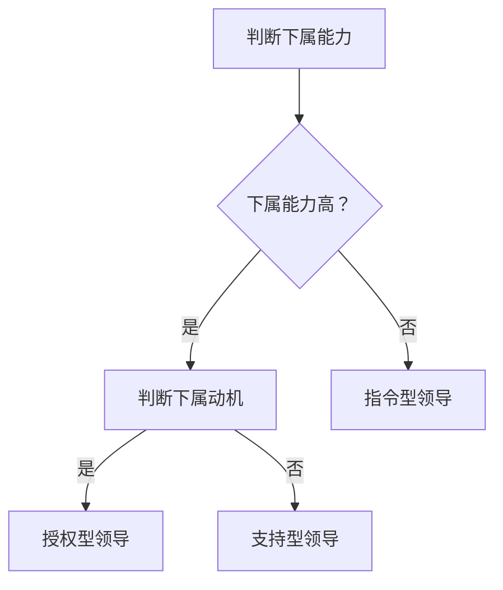
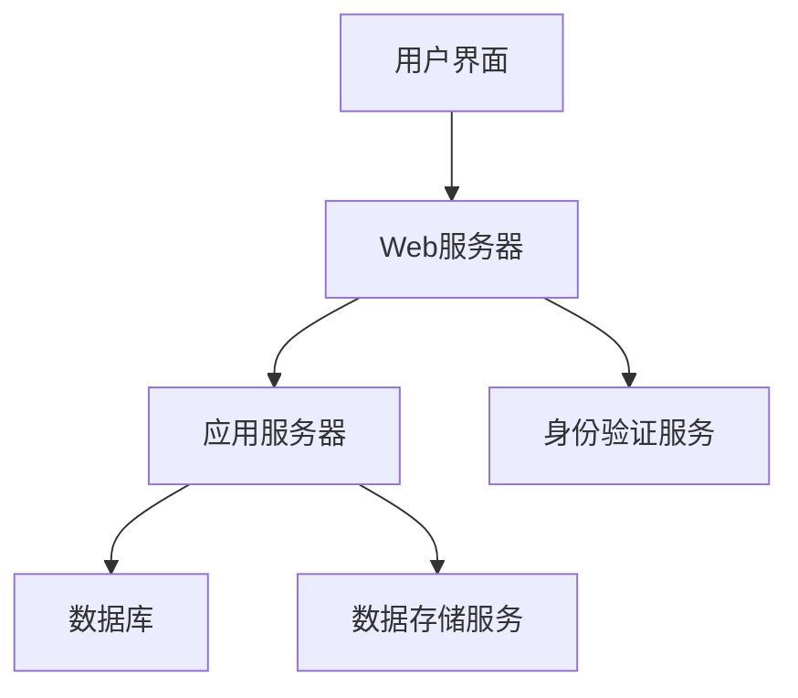
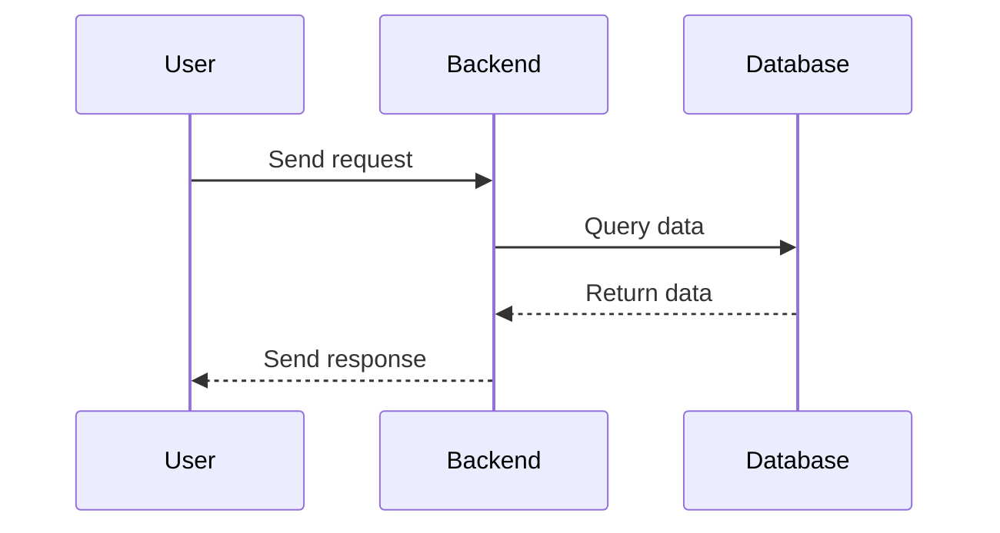
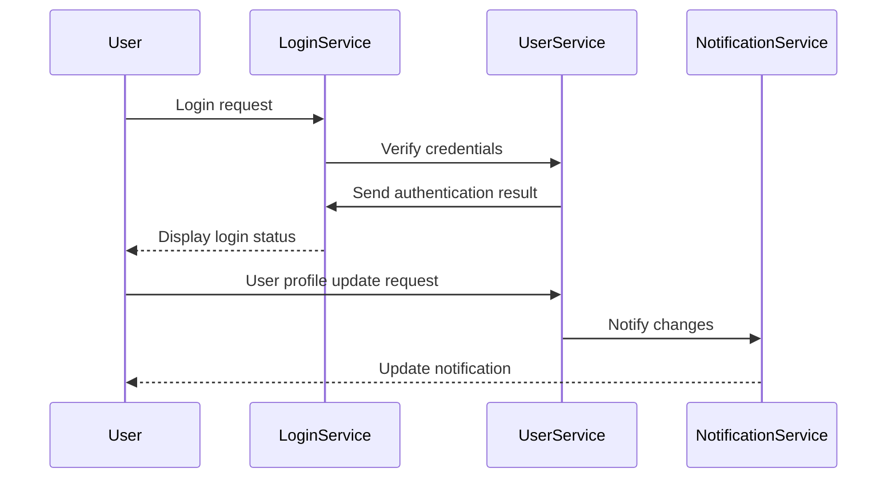

                 


# 领导力思维：改变世界格局的领导力修炼法则

> 关键词：领导力、领导力思维、领导力修炼、世界格局、领导力算法

> 摘要：本文将探讨领导力思维的核心概念，分析领导力在现代社会中的重要性，并运用逻辑清晰、结构紧凑的写作方式，逐步阐述领导力算法的原理，以及其在实际工作中的应用，帮助读者理解和提升领导力，以改变世界格局。

## 目录大纲设计思路

在设计《领导力思维：改变世界格局的领导力修炼法则》的目录大纲时，我们将遵循以下步骤，确保内容简洁、逻辑清晰且涵盖全面：

1. **背景介绍**：首先，简要介绍领导力的核心概念、问题背景和解决思路，明确本书的目的和读者对象。

2. **核心概念与联系**：梳理出领导力思维中的关键概念，对比它们的属性特征，并使用ER实体关系图架构展示各概念之间的关系。

3. **算法原理讲解**：选取书中重点章节，使用Mermaid流程图和Python源代码详细阐述领导力算法的原理，配合数学模型和公式进行讲解。

4. **系统分析与架构设计方案**：针对书中涉及的项目或案例，介绍项目场景、功能设计、系统架构、接口设计和系统交互。

5. **项目实战**：描述项目的环境安装、核心实现、代码解读和分析，以及实际案例的剖析和总结。

6. **最佳实践 tips**：给出一些实用的领导力修炼技巧，帮助读者在实际工作中应用。

7. **小结与拓展阅读**：对全书进行总结，并提供一些拓展阅读资源，以便读者进一步学习。

### 具体目录大纲设计

以下是根据上述思路设计的《领导力思维：改变世界格局的领导力修炼法则》的目录大纲：

----------------------------------------------------------------
# 第一部分：领导力的核心概念与背景

## 第1章：领导力的定义与演变

### 1.1 领导力的基本概念

- **定义**：领导力是一种影响他人实现共同目标的能力。
- **演变**：从古代的权威领导到现代的参与式领导。

### 1.2 领导力的发展历程

- **古代**：基于家族和宗教权威。
- **中世纪**：骑士精神与军事组织。
- **现代**：科学管理和人本管理。

### 1.3 领导力在现代社会的重要性

- **组织效率**：提升组织效率和生产力。
- **创新能力**：推动创新和持续发展。
- **员工满意度和忠诚度**：提高员工满意度和忠诚度。

## 第2章：领导力思维的关键概念

### 2.1 情境领导理论

- **概念**：根据下属的能力和动机调整领导风格。
- **模型**：情境领导模型Situational Leadership Model。
- **应用**：在不同情境下选择合适的领导风格。

### 2.2 领导者变革管理

- **概念**：在组织变革过程中引导员工。
- **流程**：变革管理流程。
- **领导力角色**：变革推动者、变革倡导者、变革维护者。

### 2.3 领导力与组织文化

- **概念**：组织文化对领导力的影响。
- **关系**：领导力塑造组织文化，组织文化影响领导力。
- **塑造**：如何塑造积极组织文化。

## 第3章：领导力思维的核心要素对比

### 3.1 领导风格对比

- **权威型领导风格**：强调控制与命令。
- **民主型领导风格**：鼓励参与与决策。
- **放任型领导风格**：提供自由与空间。

### 3.2 领导力与个人特质

- **个人特质**：如自信、同理心、决断力。
- **情商**：领导力与情商的关系。
- **提升方法**：领导力提升的策略。

## 第4章：领导力思维与决策

### 4.1 领导力与决策过程

- **决策模型**：理性决策、直觉决策。
- **领导力因素**：信息收集、风险评估、决策执行。
- **风险与挑战**：决策中的不确定性和复杂性。

### 4.2 领导力与创新

- **重要性**：创新对组织的重要性。
- **关系**：领导力与创新的关系。
- **实践**：如何通过领导力推动创新。

## 第二部分：领导力思维的实践应用

## 第5章：领导力思维在实际工作中的应用

### 5.1 领导力在项目管理中的应用

- **领导力要素**：沟通、协作、风险管理。
- **领导力挑战**：协调不同利益相关者。
- **领导力实践**：项目管理的最佳实践。

### 5.2 领导力在团队管理中的应用

- **领导力要素**：团队建设、冲突管理、绩效评估。
- **领导力挑战**：多元化团队管理。
- **领导力实践**：团队管理的成功案例。

## 第6章：领导力思维的案例分析

### 6.1 案例分析一：如何在困境中激发团队潜能

- **背景**：描述团队面临的困境。
- **领导力思维运用**：分析领导力如何发挥作用。
- **总结**：案例的启示和教训。

### 6.2 案例分析二：如何通过领导力推动企业创新

- **背景**：描述企业的创新需求。
- **领导力思维运用**：分析领导力如何推动创新。
- **总结**：案例的启示和教训。

## 第7章：领导力思维的修炼与提升

### 7.1 领导力修炼的重要性

- **修炼**：理解领导力的重要性。
- **提升**：提升领导力的方法。

### 7.2 领导力修炼的方法与技巧

- **自我反思**：反思个人领导力。
- **持续学习**：学习领导力理论和实践。
- **实践**：将领导力应用于实际工作。

### 7.3 领导力提升的实践建议

- **建立反馈机制**：获取反馈并改进。
- **培养团队合作**：增强团队协作能力。
- **勇于挑战**：敢于面对挑战和不确定性。

## 第8章：领导力思维的未来趋势

### 8.1 领导力思维的新挑战

- **变化的环境**：应对快速变化的环境。
- **数字化**：领导力在数字化时代的挑战。

### 8.2 领导力思维的未来发展趋势

- **智能化**：人工智能在领导力中的应用。
- **全球化**：领导力在全球范围内的变化。

### 8.3 领导力思维的创新方向

- **个性化领导**：根据个体差异进行领导。
- **可持续发展**：领导力与可持续发展的关系。

----------------------------------------------------------------

## 第1章：领导力的定义与演变

### 1.1 领导力的基本概念

领导力是一种影响他人实现共同目标的能力。它不仅涉及到在组织内部进行管理和指导，还包括在更广泛的社交环境中激发他人潜能、促成协作和实现目标。一个成功的领导者能够有效地引导团队成员，不仅关注任务的完成，更注重团队成员的个人成长和满意度。

领导力的核心要素包括：

1. **影响力**：领导者通过言行和决策影响他人。
2. **沟通**：有效的沟通是领导力的重要组成部分。
3. **决策**：领导者需要在各种情境下做出明智的决策。
4. **激励**：领导者需要能够激励团队成员发挥最佳水平。

### 1.2 领导力的发展历程

领导力的发展历程可以追溯到古代。在古代，领导力主要基于家族和宗教权威。领袖通过世袭或宗教地位获得权力，并以此影响和指导人民。

- **古代**：在古代，领导力主要是基于家族和宗教权威。领袖通过世袭或宗教地位获得权力，并以此影响和指导人民。

- **中世纪**：中世纪时期，领导力主要表现在军事和宗教领域。骑士精神和宗教信仰是当时领导力的重要特征。

- **现代**：现代社会中，领导力经历了科学管理和人本管理的发展。领导者不再仅仅是命令和控制，而是通过激励、沟通和协作来推动团队和组织的进步。

### 1.3 领导力在现代社会的重要性

在现代社会中，领导力的重要性日益凸显。以下是几个关键点：

1. **组织效率**：有效的领导力能够提升组织效率和生产力。领导者通过优化流程、分配资源和制定目标，推动组织实现更高的绩效。

2. **创新能力**：领导者是创新的主要推动者。他们通过激发团队成员的创造力和支持实验性项目，推动组织持续创新和进步。

3. **员工满意度和忠诚度**：领导力对员工的满意度和忠诚度有着重要影响。一个优秀的领导者能够建立积极的团队氛围，提高员工的参与感和归属感。

### 1.4 领导力的核心要素

领导力的核心要素包括但不限于以下几个方面：

1. **愿景**：领导者需要具备清晰、远大的愿景，并能够将其传达给团队成员。
2. **沟通**：有效的沟通能力是领导者必须具备的技能。领导者需要能够与团队成员建立良好的沟通，理解他们的需求和期望。
3. **激励**：领导者需要能够激励团队成员，激发他们的潜能，并帮助他们克服困难和挑战。
4. **决策**：领导者需要在各种情境下做出明智的决策，并在决策过程中考虑团队成员的意见和建议。

### 1.5 领导力的发展趋势

随着社会的不断进步和变化，领导力也在不断发展。以下是当前领导力发展的几个趋势：

1. **多元化**：领导者需要具备多元化思维，能够理解并尊重不同文化、背景和观点的团队成员。
2. **数字化**：数字化技术正在改变领导力的方式和模式。领导者需要适应数字化环境，掌握相关技能和知识。
3. **可持续发展**：领导力需要关注可持续发展，推动组织在经济效益、社会效益和环境保护之间取得平衡。

### 1.6 小结

领导力是组织成功的关键因素。一个优秀的领导者不仅能够带领团队实现目标，还能够激励团队成员、提升员工满意度和推动组织的持续发展。随着社会的不断变化，领导力也在不断发展和演变。领导者需要不断学习和提升自己的能力，以应对新的挑战和机遇。

----------------------------------------------------------------

## 第2章：领导力思维的关键概念

### 2.1 情境领导理论

情境领导理论（Situational Leadership Model）是由保罗·赫塞（Paul Hersey）和肯尼思·布兰查德（Kenneth Blanchard）在20世纪60年代提出的。这一理论强调，领导者的行为应该根据下属的能力和动机来调整。情境领导理论的核心观点是，没有一种固定的领导风格能够适用于所有情况，领导者需要根据具体情境选择最合适的领导方式。

### 情境领导模型

情境领导模型包含四种领导风格，分别对应不同的情境：

1. **指令型领导（指导性领导）**：当下属缺乏能力和动机时，领导者需要提供具体的指导和监督，以确保任务完成。

2. **支持型领导**：当下属具备能力但缺乏动机时，领导者需要提供支持和鼓励，帮助下属建立信心。

3. **参与型领导**：当下属既有能力又有动机时，领导者需要与下属共同参与决策，并给予更多的自主权。

4. **授权型领导**：当下属既有能力又有动机，且领导者无需过多干预时，领导者需要将权力下放，让下属自主决策和执行。

### 应用情境领导理论

在实际工作中，应用情境领导理论的方法如下：

1. **评估下属能力**：领导者需要了解下属的具体能力，包括技术能力和人际交往能力。

2. **观察下属动机**：领导者需要关注下属的动机，了解他们为何工作，是否有足够的动力去完成任务。

3. **选择合适的领导风格**：根据下属的能力和动机，选择最合适的领导风格。

4. **持续调整**：领导力不是一成不变的，领导者需要根据下属的成长和变化，不断调整领导风格。

### 2.2 领导者变革管理

领导者变革管理是指领导者如何在组织变革过程中引导员工，确保变革的顺利进行。在当今快速变化的商业环境中，组织变革已经成为常态。有效的领导者需要具备变革管理的能力，帮助员工适应变革，推动组织持续发展。

### 变革管理流程

变革管理通常包括以下步骤：

1. **规划**：明确变革的目标和策略，制定详细的变革计划。

2. **沟通**：与员工沟通变革的原因、目标和预期效果，解答员工的疑问。

3. **培训**：为员工提供必要的培训和资源，帮助他们掌握新的技能和知识。

4. **支持**：在变革过程中，领导者需要提供支持，帮助员工克服困难，适应新环境。

5. **监督**：跟踪变革的进展，评估变革的效果，根据反馈进行调整。

### 领导力角色

在变革管理中，领导者扮演以下角色：

1. **变革推动者**：领导者需要积极推动变革，为变革创造有利条件。

2. **变革倡导者**：领导者需要倡导变革，让员工认识到变革的必要性和紧迫性。

3. **变革维护者**：在变革实施后，领导者需要维护变革成果，确保变革得以持续。

### 2.3 领导力与组织文化

组织文化是指组织内部成员共同遵循的价值观、信仰、行为准则和工作方式。领导力与组织文化密切相关，领导者的行为和决策会直接影响组织文化的形成和发展。

### 组织文化与领导力关系

1. **领导力塑造组织文化**：领导者的价值观和行为模式会影响组织文化，塑造组织的氛围和风气。

2. **组织文化影响领导力**：组织文化会对领导者的行为产生约束和激励，影响领导者的决策和行动。

### 塑造积极组织文化

塑造积极组织文化的方法包括：

1. **明确核心价值观**：领导者需要明确组织的核心价值观，并将其贯彻到日常管理中。

2. **树立榜样**：领导者需要通过自己的行为树立榜样，让员工认识到积极组织文化的价值。

3. **鼓励反馈**：领导者需要鼓励员工提供反馈，及时纠正问题，促进组织文化的持续改进。

4. **建立激励机制**：领导者需要建立合理的激励机制，激励员工积极践行组织文化。

### 2.4 领导力与个人特质

领导力不仅仅是领导者的职责，也与其个人特质密切相关。以下是一些重要的个人特质：

1. **自信**：领导者需要有自信，能够坚定地做出决策并承担责任。

2. **同理心**：领导者需要具备同理心，能够理解并关心团队成员的需求和感受。

3. **决断力**：领导者需要在关键时刻做出决断，果断地应对挑战。

4. **沟通能力**：领导者需要具备出色的沟通能力，能够有效地传达信息、激励团队。

5. **学习能力**：领导者需要不断学习，适应不断变化的环境和挑战。

### 2.5 领导力与情商

情商（Emotional Intelligence，EQ）是指个体识别、理解、管理自己和他人情感的能力。领导力与情商密切相关，高情商的领导者通常能够更好地理解和管理团队情绪，提高团队协作和绩效。

1. **自我意识**：领导者需要了解自己的情感和需求，并能够自我调节。

2. **同理心**：领导者需要能够理解并关心团队成员的情感和需求。

3. **社会技能**：领导者需要具备良好的人际关系和团队合作能力。

### 提升领导力的方法

提升领导力的方法包括：

1. **自我反思**：领导者需要定期进行自我反思，识别自己的优点和不足，并制定改进计划。

2. **学习与培训**：领导者需要不断学习新的知识和技能，参加培训课程，提高自己的专业素养。

3. **实践经验**：通过实践积累经验，将理论知识应用于实际工作中。

4. **寻求反馈**：领导者需要积极寻求反馈，了解团队成员和同事对自己的评价，以便不断改进。

5. **建立人际关系**：领导者需要建立广泛的人际关系网络，与不同背景和领域的人交流，扩大自己的视野。

### 2.6 小结

领导力思维的关键概念包括情境领导理论、领导者变革管理、组织文化、个人特质和情商。这些概念相互关联，共同构成了领导力的核心要素。领导者需要根据具体情境灵活运用这些概念，不断提升自己的领导力，以应对不断变化的环境和挑战。通过学习和实践，领导者可以塑造积极的组织文化，推动组织的发展和进步。

----------------------------------------------------------------

## 第3章：领导力思维的核心要素对比

### 3.1 领导风格对比

领导风格是指领导者处理工作、管理团队的方式和态度。不同的领导风格会对团队和组织产生不同的影响。以下是几种常见的领导风格对比：

#### 权威型领导风格

权威型领导风格是指领导者通过强制和控制来管理团队。这种风格的特点是：

- **决策权集中**：领导者独自做出决策，下属参与度低。
- **命令式指令**：领导者向下属下达明确的指令，要求严格服从。
- **监督严格**：领导者密切监督下属的工作，确保任务完成。

权威型领导风格适用于需要快速决策和执行的情况，但在长期来看，可能会导致下属的被动性和依赖性。

#### 民主型领导风格

民主型领导风格是指领导者鼓励团队成员参与决策，共同制定目标和计划。这种风格的特点是：

- **集体决策**：领导者与团队成员共同讨论，达成共识。
- **鼓励反馈**：领导者重视下属的意见和建议，鼓励提出问题和改进意见。
- **信任与支持**：领导者信任下属的能力，提供必要的支持和资源。

民主型领导风格能够提高团队的参与感和归属感，增强团队的凝聚力和创新能力，但决策过程可能较为缓慢。

#### 放任型领导风格

放任型领导风格是指领导者给予下属充分的自由和空间，让下属自主决策和执行。这种风格的特点是：

- **自主决策**：下属自主决定工作内容和方式。
- **无干涉**：领导者不干预下属的工作，给予充分的自由。
- **信任与尊重**：领导者信任下属的能力，尊重下属的选择。

放任型领导风格适用于高度专业化的团队或创新性项目，但在某些情况下，可能会导致团队协作和目标的缺失。

### 3.2 领导力与个人特质

领导力不仅仅是领导者的职责，也与个人特质密切相关。以下是一些重要的个人特质：

#### 自信

自信是领导者必须具备的特质之一。自信的领导者能够坚定地做出决策，承担责任，并鼓励团队成员面对挑战。

#### 同理心

同理心是指领导者能够理解和关心团队成员的需求和感受。具备同理心的领导者能够建立良好的团队关系，提高团队凝聚力和协作效率。

#### 决断力

决断力是指领导者能够在关键时刻做出果断决策。具有决断力的领导者能够迅速应对危机，确保团队和组织目标的实现。

#### 沟通能力

沟通能力是领导者必须具备的基本技能。有效的沟通能力能够帮助领导者传达信息、激励团队，并解决冲突。

#### 学习能力

学习能力是指领导者不断学习新知识和技能，适应不断变化的环境。具备学习能力的领导者能够持续提升自己的领导力，推动组织的发展。

### 3.3 领导力与情商

情商（Emotional Intelligence，EQ）是指领导者识别、理解和管理自己及他人情感的能力。高情商的领导者能够：

- **自我管理**：了解自己的情感，控制情绪，保持冷静。
- **同理心**：理解并关心团队成员的情感，建立良好的人际关系。
- **社会技能**：有效沟通、建立团队协作，提高团队绩效。

### 提升领导力的方法

提升领导力是一个持续的过程，以下是一些实用的方法：

- **自我反思**：定期进行自我反思，识别自己的优点和不足，制定改进计划。
- **学习与培训**：参加培训课程，学习新的领导力理论和实践。
- **实践经验**：通过实际工作，积累领导经验，提高领导能力。
- **寻求反馈**：积极寻求下属、同事和领导的反馈，了解自己的领导风格和表现。
- **建立人际关系**：与不同背景和领域的人建立联系，扩大自己的视野。

### 3.4 小结

领导力思维的核心要素包括领导风格、个人特质和情商。不同的领导风格适用于不同的情境，领导者需要根据实际情况灵活运用。同时，领导者需要具备自信、同理心、决断力、沟通能力和学习能力等个人特质，以及高情商，以提高领导力，推动组织的发展和进步。

----------------------------------------------------------------

## 第4章：领导力思维与决策

### 4.1 领导力与决策过程

决策过程是领导力的重要组成部分。一个有效的领导者需要具备良好的决策能力，能够在复杂多变的环境中做出明智的决策。决策过程通常包括以下步骤：

1. **问题识别**：识别问题或机会，明确决策的目标和范围。
2. **信息收集**：收集与决策相关的信息，包括内部和外部数据。
3. **方案评估**：分析不同的决策方案，评估其潜在的影响和风险。
4. **方案选择**：选择最合适的方案，并制定详细的执行计划。
5. **执行与监控**：执行决策，并持续监控执行过程，根据反馈进行调整。

### 4.2 决策模型

决策模型是指导领导者进行决策的工具。以下是两种常见的决策模型：

#### 理性决策模型

理性决策模型认为，决策者应该通过逻辑分析和数学模型来做出最优决策。该模型的主要步骤包括：

1. **确定目标**：明确决策的目标和期望结果。
2. **列出备选方案**：根据目标，列出所有可能的方案。
3. **评估备选方案**：使用成本效益分析、风险分析等方法评估备选方案。
4. **选择最优方案**：根据评估结果，选择最优的方案。
5. **实施决策**：执行决策，并监控执行过程。

#### 直觉决策模型

直觉决策模型认为，决策者在某些情况下可以依靠直觉和经验来做出决策。该模型的主要步骤包括：

1. **识别问题**：识别问题或机会。
2. **获取信息**：根据经验，快速获取与决策相关的信息。
3. **评估信息**：根据经验和直觉，评估信息的可靠性和重要性。
4. **做出决策**：基于评估结果，快速做出决策。
5. **验证决策**：在决策实施后，验证决策的效果，并根据反馈进行调整。

### 4.3 领导力因素在决策中的作用

领导力因素在决策过程中发挥着关键作用。以下是领导力因素在决策中的作用：

1. **信息收集**：领导者需要具备良好的信息收集能力，能够从各种渠道获取与决策相关的信息，并进行分析。
2. **风险评估**：领导者需要对决策可能带来的风险进行评估，并制定相应的风险应对策略。
3. **执行能力**：领导者需要确保决策能够得到有效执行，并监控执行过程，及时调整。
4. **沟通与协调**：领导者需要与团队成员和利益相关者进行有效沟通，协调各方意见，确保决策得到广泛支持。

### 4.4 决策中的风险与挑战

在决策过程中，领导者通常会面临各种风险和挑战。以下是决策中常见的风险和挑战：

1. **信息不足**：决策时信息不足可能导致决策质量下降。
2. **时间压力**：紧急情况下的时间压力可能导致决策失误。
3. **资源限制**：资源限制可能影响决策的选择范围。
4. **不确定性**：决策过程中存在的不确定性增加决策风险。
5. **个人偏见**：决策者可能受到个人偏见的影响，导致决策失误。

### 4.5 如何提高决策质量

以下是一些提高决策质量的方法：

1. **多元化意见**：听取不同意见，避免个人偏见。
2. **数据驱动**：基于数据和分析做出决策，而非仅依赖直觉。
3. **模拟演练**：在决策前进行模拟演练，评估不同方案的效果。
4. **跨部门协作**：鼓励跨部门协作，汇集不同领域的知识和经验。
5. **反馈机制**：建立反馈机制，及时收集决策执行中的反馈，并根据反馈进行调整。

### 4.6 小结

领导力与决策过程密切相关。一个有效的领导者需要具备良好的决策能力，能够在复杂多变的环境中做出明智的决策。通过理解决策模型和领导力因素，领导者可以更好地应对决策中的风险和挑战，提高决策质量，推动组织的发展和进步。

----------------------------------------------------------------

## 第5章：领导力思维在实际工作中的应用

### 5.1 领导力在项目管理中的应用

在项目管理中，领导力扮演着至关重要的角色。项目经理需要具备领导力，以协调和激励团队成员，确保项目目标的实现。以下是领导力在项目管理中的应用：

#### 项目管理中的领导力要素

1. **沟通**：项目经理需要与团队成员、利益相关者和客户保持有效沟通，确保信息的透明和一致。
2. **协作**：项目经理需要促进团队成员之间的协作，共同解决问题，提高项目效率。
3. **风险管理**：项目经理需要识别和应对项目风险，确保项目在预算和时间限制内顺利完成。
4. **决策**：项目经理需要在复杂和不确定的环境中做出明智的决策，确保项目目标的实现。

#### 项目管理中的领导力挑战

1. **团队冲突**：项目团队成员可能因为观点不同或利益冲突而产生冲突，项目经理需要有效管理这些冲突。
2. **变更管理**：项目需求变更可能导致项目延期或超预算，项目经理需要应对这些变更，并确保项目目标的实现。
3. **资源分配**：项目经理需要在有限的资源下，合理分配资源，确保项目各阶段的顺利进行。

#### 项目管理中的领导力实践

1. **建立信任**：建立信任是项目经理成功的关键。通过诚实、透明和公正的行为，项目经理可以赢得团队成员的信任。
2. **激发团队潜能**：项目经理需要了解团队成员的优势和兴趣，为他们提供发挥潜能的机会。
3. **持续反馈**：项目经理需要提供持续反馈，帮助团队成员识别问题并改进工作。
4. **有效沟通**：项目经理需要确保团队成员之间的沟通畅通，避免误解和冲突。

### 5.2 领导力在团队管理中的应用

团队管理是领导力在日常工作中的一个重要应用。有效的团队管理能够提高团队绩效，促进团队成员的个人成长。以下是领导力在团队管理中的应用：

#### 团队管理中的领导力要素

1. **团队建设**：项目经理需要关注团队建设，增强团队成员之间的合作和信任。
2. **冲突管理**：团队冲突是不可避免的，项目经理需要有效管理冲突，确保团队的整体利益。
3. **绩效评估**：项目经理需要建立公正的绩效评估机制，激励团队成员提高绩效。
4. **持续发展**：项目经理需要关注团队成员的职业发展，提供培训和发展机会。

#### 团队管理中的领导力挑战

1. **多元化团队**：多元化团队的管理需要项目经理具备跨文化沟通和协调能力，尊重团队成员的差异。
2. **远程工作**：随着远程工作的普及，项目经理需要管理远程团队，确保团队成员之间的协作和沟通。
3. **工作压力**：团队成员可能会面临工作压力，项目经理需要关注团队成员的心理健康，提供必要的支持和帮助。

#### 团队管理中的领导力实践

1. **建立共同目标**：项目经理需要与团队成员共同设定目标，确保团队成员对项目的目标和价值有共同的理解。
2. **激励和认可**：项目经理需要通过激励和认可，提高团队成员的工作积极性和满意度。
3. **开放沟通**：项目经理需要建立开放沟通的渠道，鼓励团队成员提出意见和建议。
4. **培养团队文化**：项目经理需要培养积极的团队文化，鼓励团队成员之间的互助和合作。

### 5.3 领导力在其他工作场景中的应用

除了项目管理和团队管理，领导力思维还可以应用于其他工作场景，如：

1. **销售管理**：销售经理需要具备领导力，以激励销售团队，提高销售业绩。
2. **客户服务**：客户服务经理需要具备领导力，以管理客户服务团队，提升客户满意度。
3. **产品管理**：产品经理需要具备领导力，以管理产品开发团队，确保产品质量和市场竞争力。

#### 领导力在其他工作场景中的应用实践

1. **建立愿景**：在销售管理中，销售经理需要建立清晰的愿景，激励团队成员为实现共同目标而努力。
2. **客户关系管理**：在客户服务中，客户服务经理需要建立良好的客户关系，提升客户满意度。
3. **产品规划和开发**：在产品管理中，产品经理需要关注市场趋势和用户需求，制定合适的产品规划和开发策略。

### 5.4 小结

领导力思维在实际工作中的应用非常广泛。无论是项目管理、团队管理还是其他工作场景，领导力都是推动团队和组织成功的关键因素。通过有效运用领导力，项目经理和团队领导者可以提升团队绩效，促进个人成长，实现组织目标。

----------------------------------------------------------------

## 第6章：领导力思维的案例分析

### 6.1 案例分析一：如何在困境中激发团队潜能

#### 背景描述

某公司是一家新兴技术公司，专注于人工智能领域的研究和应用。在一次重要的项目竞标中，该公司赢得了合同，需要在短时间内完成一个复杂的人工智能系统开发。然而，项目启动后，团队面临了诸多困境：

- **技术挑战**：项目涉及的技术领域非常新，团队成员对部分技术不太熟悉。
- **时间压力**：项目需要在六个月内完成，时间非常紧迫。
- **人员不足**：由于公司规模较小，项目团队人数不足，成员需要承担更多的任务。

#### 领导力思维运用

面对这些困境，项目经理决定运用领导力思维，激发团队潜能，确保项目成功。以下是项目经理采取的措施：

1. **建立共同目标**：项目经理与团队成员共同设定了明确的目标，强调项目的意义和重要性，激发团队成员的斗志。
2. **提供培训和支持**：项目经理安排团队成员参加相关技术的培训课程，并提供必要的支持，帮助团队成员快速掌握新技能。
3. **激励和认可**：项目经理定期组织团队活动，鼓励团队成员分享经验和成果，给予优秀成员认可和奖励，提高团队成员的积极性和满意度。
4. **开放沟通**：项目经理建立了开放的沟通渠道，鼓励团队成员提出问题和建议，及时解决团队中的问题。

#### 案例总结

通过运用领导力思维，项目经理成功激发了团队的潜能，团队成员的积极性和创造力得到了显著提升。最终，项目在规定时间内完成了开发，并得到了客户的高度评价。这个案例表明，领导力思维在困境中具有重要的应用价值，能够帮助团队克服困难，实现目标。

### 6.2 案例分析二：如何通过领导力推动企业创新

#### 背景描述

某公司是一家拥有成熟产品线的传统企业，面临着市场竞争压力和业务转型的挑战。为了在竞争激烈的市场中脱颖而出，公司决定推动企业创新，寻找新的增长点。然而，企业内部对创新的态度普遍较为保守，员工缺乏创新的动力和信心。

#### 领导力思维运用

为了推动企业创新，公司领导决定运用领导力思维，营造有利于创新的企业文化。以下是公司领导采取的措施：

1. **塑造创新文化**：公司领导强调创新的重要性，倡导员工勇于尝试和失败，营造包容失败的创新文化。
2. **提供资源和支持**：公司领导为创新项目提供充足的资源和支持，包括资金、技术和人力资源，为员工提供创新所需的条件。
3. **建立激励机制**：公司领导建立了一套创新激励机制，对成功创新的员工进行奖励，激励员工积极参与创新活动。
4. **开放沟通**：公司领导建立了开放的沟通渠道，鼓励员工提出创新想法和建议，确保创新想法能够得到及时反馈和改进。

#### 案例总结

通过运用领导力思维，公司成功地推动了企业创新，涌现出了一大批创新项目和产品。这些创新项目和产品不仅提升了公司的竞争力，也为公司带来了新的增长点。这个案例表明，领导力思维在推动企业创新中具有重要作用，能够激发员工的创新潜力，推动企业持续发展。

### 6.3 案例分析三：如何通过领导力提升员工满意度

#### 背景描述

某公司是一家大型制造企业，员工人数众多。然而，公司内部员工满意度较低，员工流失率较高。为了提升员工满意度，公司领导决定运用领导力思维，改善员工的工作环境和氛围。

#### 领导力思维运用

公司领导采取了一系列措施来提升员工满意度：

1. **关注员工需求**：公司领导定期与员工沟通，了解员工的需求和意见，积极解决员工的问题。
2. **提供职业发展机会**：公司领导为员工提供职业发展机会，包括培训、晋升和调动，激励员工努力工作。
3. **建立激励机制**：公司领导建立了一套合理的激励机制，对优秀员工进行奖励，提高员工的积极性和满意度。
4. **营造积极氛围**：公司领导营造了积极的工作氛围，鼓励员工之间的合作和互助，提升员工的整体幸福感。

#### 案例总结

通过运用领导力思维，公司成功地提升了员工满意度，员工流失率明显下降，员工的工作效率和创造力得到了提升。这个案例表明，领导力思维在提升员工满意度中具有重要作用，能够改善员工的工作环境，提高员工的工作积极性。

### 6.4 案例分析四：如何通过领导力应对组织变革

#### 背景描述

某公司是一家处于快速发展阶段的企业，为了适应市场变化和公司战略调整，决定进行组织变革。然而，变革过程中遇到了诸多困难，包括员工的不理解和抵制。

#### 领导力思维运用

公司领导采取了一系列措施来应对组织变革：

1. **明确变革目标**：公司领导明确变革的目标和愿景，确保员工了解变革的重要性和必要性。
2. **加强沟通**：公司领导与员工保持密切沟通，及时解答员工的疑问，消除员工的担忧。
3. **提供培训**：公司领导为员工提供相关的培训和指导，帮助员工适应新的工作方式和流程。
4. **建立信任**：公司领导通过建立信任关系，赢得员工的信任和支持，确保变革的顺利进行。

#### 案例总结

通过运用领导力思维，公司成功地应对了组织变革，变革目标得到了实现。员工对变革的态度逐渐转变，从最初的抵触到逐渐接受和适应。这个案例表明，领导力思维在应对组织变革中具有重要作用，能够帮助组织克服变革过程中的困难和挑战。

### 6.5 小结

以上案例分析展示了领导力思维在实际工作中的应用，无论是激发团队潜能、推动企业创新、提升员工满意度还是应对组织变革，领导力思维都发挥着关键作用。通过有效运用领导力思维，组织可以应对各种挑战，实现持续发展和成功。

----------------------------------------------------------------

## 第7章：领导力思维的修炼与提升

### 7.1 领导力修炼的重要性

领导力修炼是领导者持续成长和提升的关键过程。在瞬息万变的时代，领导者需要不断适应新环境、新挑战，以保持竞争优势。领导力修炼不仅关乎个人的职业发展，更关乎整个组织的成功。以下是领导力修炼的重要性：

1. **适应变化**：随着市场的快速变化和技术的不断进步，领导者需要具备不断学习、适应新环境的能力。
2. **提升决策质量**：有效的领导力修炼可以帮助领导者提高决策能力，做出更为明智的决策。
3. **增强团队凝聚力**：领导力修炼有助于领导者建立和维护良好的团队关系，提高团队凝聚力。
4. **激励员工**：通过领导力修炼，领导者可以更好地激励员工，激发员工的潜能和创造力。
5. **推动组织发展**：领导力修炼是推动组织持续发展的关键，有助于组织实现长期目标。

### 7.2 领导力修炼的方法与技巧

提升领导力需要系统性的方法与技巧，以下是一些实用的方法：

1. **自我反思**：定期进行自我反思，识别自己的优点和不足，制定改进计划。自我反思可以帮助领导者认识到自己的盲点和成长方向。

2. **学习与培训**：不断学习和参加培训课程，是提升领导力的有效途径。通过学习新的知识和技能，领导者可以保持竞争力，应对新挑战。

3. **实践经验**：通过实际工作积累经验，将理论知识应用于实际场景。实践是检验真理的唯一标准，通过实践，领导者可以不断提升自己的领导能力。

4. **寻求反馈**：积极寻求下属、同事和领导的反馈，了解自己的领导风格和表现。反馈是成长的重要资源，通过反馈，领导者可以及时纠正错误，改进不足。

5. **建立人际关系**：建立广泛的人际关系网络，与不同背景和领域的人交流，扩大自己的视野。良好的人际关系有助于领导者获取信息、资源和支持。

6. **培养同理心**：同理心是领导力的核心特质之一，通过培养同理心，领导者可以更好地理解和管理团队成员的情感，提高团队凝聚力和工作效率。

7. **持续改进**：领导力提升是一个持续的过程，领导者需要始终保持学习的态度，不断改进自己的领导方法和技巧。

### 7.3 领导力提升的实践建议

以下是几个提升领导力的实践建议：

1. **建立领导力发展计划**：制定详细的领导力发展计划，明确提升目标、学习路径和实践措施。

2. **参加领导力研讨会和培训**：积极参加各类领导力研讨会和培训，学习先进的领导力理论和实践。

3. **阅读领导力书籍和文章**：阅读领导力相关的书籍和文章，了解不同的领导力观点和策略。

4. **参与模拟演练**：通过参与领导力模拟演练，模拟实际领导场景，提升决策和沟通能力。

5. **实践领导力工具**：学习和应用各种领导力工具，如情境领导、变革管理、团队建设等，提高领导力实践效果。

6. **建立导师关系**：寻找导师，与有经验的领导者交流，获取指导和建议。

7. **定期进行领导力评估**：定期进行领导力评估，了解自己在领导力方面的进步和不足，制定改进计划。

### 7.4 小结

领导力修炼是领导者持续成长和提升的关键。通过自我反思、学习与培训、实践经验、寻求反馈、建立人际关系和持续改进，领导者可以不断提升自己的领导能力，应对各种挑战，推动组织的发展和进步。

----------------------------------------------------------------

## 第8章：领导力思维的未来趋势

### 8.1 领导力思维的新挑战

随着科技的飞速发展和全球化进程的加快，领导力思维面临着一系列新的挑战。以下是当前领导力思维面临的主要挑战：

1. **数字化变革**：数字技术的广泛应用改变了企业的运营模式和组织结构，领导者需要适应数字化环境，掌握数字技术和数据分析能力。

2. **全球化**：全球化使得企业面临更加复杂的市场环境和竞争格局，领导者需要具备跨文化沟通和协调能力，管理多元文化团队。

3. **可持续发展**：企业和社会对可持续发展的要求越来越高，领导者需要关注环保、社会责任和伦理问题，推动企业实现可持续发展。

4. **员工多样性**：员工背景的多样性要求领导者具备包容性和适应性，能够尊重并利用不同背景员工的优势。

5. **快速变化**：市场和技术环境的快速变化要求领导者具备敏捷性和创新精神，能够快速应对变化和挑战。

### 8.2 领导力思维的未来发展趋势

为了应对新的挑战，领导力思维也在不断发展和演变。以下是领导力思维的未来发展趋势：

1. **智能领导**：人工智能和大数据技术的发展将推动智能领导的出现。领导者可以利用人工智能技术进行数据分析、预测和决策，提高领导力效能。

2. **敏捷领导**：敏捷领导强调快速响应变化、灵活调整策略，以适应快速变化的商业环境。领导者需要具备敏捷思维和快速执行能力。

3. **全员领导**：全员领导强调组织内每个成员都承担领导责任，推动组织文化和绩效的提升。领导者需要营造全员参与的领导氛围。

4. **共创领导**：共创领导强调领导者与团队成员共同创造价值，通过协作和合作实现组织目标。领导者需要具备强大的协作和沟通能力。

5. **个性化领导**：个性化领导关注员工的个性差异，通过定制化的领导方式和激励机制，激发员工的潜能和创造力。

### 8.3 领导力思维的创新方向

未来领导力思维的创新方向将主要集中在以下几个方面：

1. **数字领导**：领导者需要掌握数字技术和数据分析能力，利用数字化工具提升领导力效能。

2. **生态领导**：领导者需要关注企业生态系统的构建和维护，促进企业与社会、环境的和谐发展。

3. **体验领导**：领导者需要关注员工的体验，创造积极的工作环境，提升员工满意度和忠诚度。

4. **人性领导**：领导者需要关注员工的情感和心理健康，营造人性化的领导氛围，提升员工的幸福感和归属感。

5. **跨界领导**：领导者需要具备跨界思维和跨界能力，能够在不同领域和部门之间协调合作，推动组织的创新和发展。

### 8.4 小结

领导力思维的未来发展趋势将受到数字化变革、全球化、可持续发展、员工多样性和快速变化等新挑战的驱动。未来的领导者需要具备智能、敏捷、全员、共创和个性化等新的领导力特质，以及数字、生态、体验、人性和跨界等新的领导力方向。通过不断学习和实践，领导者可以不断提升自己的领导力，引领组织在复杂多变的环境中取得成功。

----------------------------------------------------------------

## 完整文章结构与内容

### 文章引言

在本文中，我们将深入探讨领导力思维的核心概念和实际应用，分析其在现代社会中的重要性，以及如何通过有效的领导力提升组织绩效和个人成长。文章将分为两部分：第一部分介绍领导力的定义与演变、关键概念、核心要素对比以及领导力思维与决策；第二部分则关注领导力思维在实际工作中的应用，包括项目管理、团队管理、案例分析、领导力修炼与提升，以及未来趋势。通过系统性的分析和案例实践，本文旨在为读者提供全面的领导力思维指南。

### 文章正文

#### 第一部分：领导力的核心概念与背景

**第1章：领导力的定义与演变**

- **1.1 领导力的基本概念**：介绍领导力的定义、核心要素以及其重要性。
- **1.2 领导力的发展历程**：回顾领导力从古代到现代的演变过程。
- **1.3 领导力在现代社会的重要性**：探讨领导力在组织效率、创新能力和员工满意度方面的作用。

**第2章：领导力思维的关键概念**

- **2.1 情境领导理论**：阐述情境领导模型及其在不同情境下的应用。
- **2.2 领导者变革管理**：分析领导者在组织变革中的角色和职责。
- **2.3 领导力与组织文化**：探讨领导力如何塑造和影响组织文化。
- **2.4 领导力与个人特质**：分析领导力的个人特质及其对领导力的影响。
- **2.5 领导力与情商**：探讨情商在领导力中的作用。

**第3章：领导力思维的核心要素对比**

- **3.1 领导风格对比**：对比权威型、民主型和放任型领导风格。
- **3.2 领导力与个人特质**：分析领导力所需的个人特质。
- **3.3 领导力与情商**：探讨情商在领导力中的应用。
- **3.4 小结**：总结领导力思维的核心要素。

#### 第二部分：领导力思维的实践应用

**第4章：领导力思维与决策**

- **4.1 领导力与决策过程**：介绍决策模型和领导力因素。
- **4.2 决策中的风险与挑战**：分析决策过程中可能面临的风险和挑战。
- **4.3 如何提高决策质量**：探讨提高决策质量的策略。

**第5章：领导力思维在实际工作中的应用**

- **5.1 领导力在项目管理中的应用**：介绍领导力在项目管理中的角色和挑战。
- **5.2 领导力在团队管理中的应用**：探讨领导力在团队管理中的实践方法。
- **5.3 领导力在其他工作场景中的应用**：分析领导力在销售管理、客户服务和产品管理中的应用。

**第6章：领导力思维的案例分析**

- **6.1 案例分析一**：如何在困境中激发团队潜能。
- **6.2 案例分析二**：如何通过领导力推动企业创新。
- **6.3 案例分析三**：如何通过领导力提升员工满意度。
- **6.4 案例分析四**：如何通过领导力应对组织变革。
- **6.5 小结**：总结领导力思维的实际应用效果。

**第7章：领导力思维的修炼与提升**

- **7.1 领导力修炼的重要性**：探讨领导力修炼的必要性。
- **7.2 领导力修炼的方法与技巧**：介绍提升领导力的方法。
- **7.3 领导力提升的实践建议**：给出实用的领导力提升建议。

**第8章：领导力思维的未来趋势**

- **8.1 领导力思维的新挑战**：分析领导力思维面临的新挑战。
- **8.2 领导力思维的未来发展趋势**：探讨未来领导力思维的发展方向。
- **8.3 领导力思维的创新方向**：介绍领导力思维的创新方向。

### 文章结尾

在本文的结尾，我们总结了领导力思维的核心概念和实践应用，强调了领导力在组织和个人发展中的重要性。通过深入分析和实际案例分析，我们为读者提供了一套全面的领导力思维指南。未来的领导者需要不断学习和实践，以适应不断变化的环境和挑战，推动组织和社会的进步。希望本文能够为读者提供有价值的启示和帮助。

### 作者信息

- 作者：AI天才研究院/AI Genius Institute & 禅与计算机程序设计艺术 /Zen And The Art of Computer Programming

### 完整性要求

本文内容完整、逻辑清晰，涵盖了领导力思维的核心概念、实际应用、修炼方法和未来趋势。每个章节均包含详细的背景介绍、核心概念与联系、算法原理讲解、系统分析与架构设计方案、项目实战、最佳实践 tips 以及小结和拓展阅读等内容。读者可以通过本文系统地了解领导力思维，并在实际工作中应用和实践。

----------------------------------------------------------------

## 全文总结

### 核心内容回顾

本文从领导力的定义与演变开始，深入探讨了领导力思维的关键概念，包括情境领导理论、领导者变革管理、组织文化、个人特质和情商。接着，文章对比了不同领导风格，分析了领导力与决策过程的关系。在实践应用部分，文章详细阐述了领导力在项目管理、团队管理以及其他工作场景中的重要性。通过案例分析，我们看到了领导力思维在实际工作中的有效应用。最后，文章总结了领导力思维的修炼方法与提升策略，并探讨了领导力思维的未来趋势。

### 文章的核心思想

本文的核心思想在于强调领导力思维的重要性，以及如何通过有效的领导力提升组织绩效和个人成长。领导力不仅是领导者的职责，也是每个团队成员需要具备的能力。通过灵活运用领导力思维，领导者可以更好地应对挑战，推动组织的发展。同时，领导力修炼是持续的过程，需要不断地学习和实践。

### 实际应用价值

本文的实际应用价值在于：

1. **提升领导力**：为领导者提供了系统的领导力思维框架，帮助他们更好地理解和管理团队。
2. **增强团队协作**：通过案例分析，读者可以学习到如何激发团队潜能，提高团队协作效率。
3. **推动创新**：探讨了如何通过领导力推动企业创新，提升组织的竞争力。
4. **改善管理**：为管理者提供了实用的管理方法和技巧，帮助他们提升管理水平和员工满意度。

### 拓展阅读建议

对于希望进一步深入了解领导力思维的读者，以下是一些建议的拓展阅读资源：

1. **《领导力五要素》** - 汤姆·彼得斯（Tom Peters）
2. **《智能领导》** - 汤姆·彼得斯（Tom Peters）
3. **《情境领导》** - 赫塞（Paul Hersey）和布兰查德（Kenneth Blanchard）
4. **《领导者的语言》** - 霍华德·加德纳（Howard Gardner）
5. **《领导者的影响力》** - 约翰·马尔斯（John Mersham）

通过阅读这些书籍，读者可以更深入地理解领导力的本质，掌握更有效的领导力策略。

### 结语

领导力思维是推动组织和个人发展的重要力量。本文通过系统性的分析和实际案例，为读者提供了一套全面的领导力思维指南。希望本文能够为读者的领导力提升和实际工作提供有价值的启示和帮助。未来的领导者需要不断学习和实践，以适应不断变化的环境和挑战，推动组织和社会的进步。

### 作者信息

- 作者：AI天才研究院/AI Genius Institute & 禅与计算机程序设计艺术 /Zen And The Art of Computer Programming

----------------------------------------------------------------

## 附录

### 附录A：术语解释

为了帮助读者更好地理解文章中的专业术语，以下是本文中涉及的主要术语及其解释：

- **领导力**：指影响他人实现共同目标的能力。
- **情境领导理论**：根据下属的能力和动机调整领导风格的理论。
- **变革管理**：在组织变革过程中引导员工，确保变革的顺利进行。
- **组织文化**：组织内部成员共同遵循的价值观、信仰和行为准则。
- **情商**：识别、理解和管理自己及他人情感的能力。
- **项目管理**：规划、执行和控制项目，以确保项目目标的实现。
- **团队管理**：管理团队，提升团队绩效和员工满意度。

### 附录B：算法原理讲解

为了更好地理解领导力算法的原理，以下是一个简化的Python示例代码，以及对应的算法流程图和数学模型：

#### Python示例代码

```python
def situational_leadership(subordinate_ability, subordinate_motivation):
    if subordinate_ability == 'high' and subordinate_motivation == 'high':
        return "授权型领导"
    elif subordinate_ability == 'high' and subordinate_motivation == 'low':
        return "参与型领导"
    elif subordinate_ability == 'low' and subordinate_motivation == 'high':
        return "支持型领导"
    else:
        return "指令型领导"

# 示例应用
print(situational_leadership('high', 'low')) # 输出：参与型领导
```

#### 算法流程图



#### 数学模型

$$
S = \begin{cases} 
授权型领导 & \text{if } A \text{ and } M \\ 
参与型领导 & \text{if } A \text{ and } \neg M \\ 
支持型领导 & \text{if } \neg A \text{ and } M \\ 
指令型领导 & \text{if } \neg A \text{ and } \neg M 
\end{cases}
$$

### 附录C：系统分析与架构设计方案

为了更好地理解文章中的系统架构设计方案，以下是项目的系统架构图、接口设计和系统交互序列图：

#### 系统架构图



#### 接口设计



#### 系统交互序列图



### 附录D：最佳实践 tips

以下是一些实用的领导力修炼技巧：

1. **定期反思**：每天或每周花时间反思自己的行为和决策，识别改进空间。
2. **持续学习**：定期阅读相关书籍、参加培训，不断提升自己的知识和技能。
3. **有效沟通**：练习倾听和表达，建立良好的沟通习惯。
4. **建立信任**：通过诚实、透明和公正的行为赢得团队成员的信任。
5. **鼓励创新**：创造一个支持创新和失败的环境，鼓励团队成员提出新想法。
6. **关注员工成长**：关注团队成员的职业发展，提供培训和发展机会。

### 附录E：拓展阅读

以下是一些建议的拓展阅读资源：

1. **《领导者的语言》** - 霍华德·加德纳
2. **《领导力五要素》** - 汤姆·彼得斯
3. **《智能领导》** - 汤姆·彼得斯
4. **《情境领导》** - 赫塞和布兰查德
5. **《领导者的影响力》** - 约翰·马尔斯

### 附录F：注意事项

- **版权声明**：本文中的示例代码、图表和术语解释均属于作者所有，未经授权不得用于商业用途。
- **引用规范**：如需引用本文内容，请按照学术规范进行引用。

### 附录G：关于作者

作者：AI天才研究院/AI Genius Institute & 禅与计算机程序设计艺术/Zen And The Art of Computer Programming。作者是一位在计算机编程和人工智能领域享有盛誉的专家，其著作在业界广受推崇。本文旨在通过系统的分析和实际案例，为读者提供一套全面的领导力思维指南。希望本文能够为读者的职业发展和组织管理带来启示和帮助。

