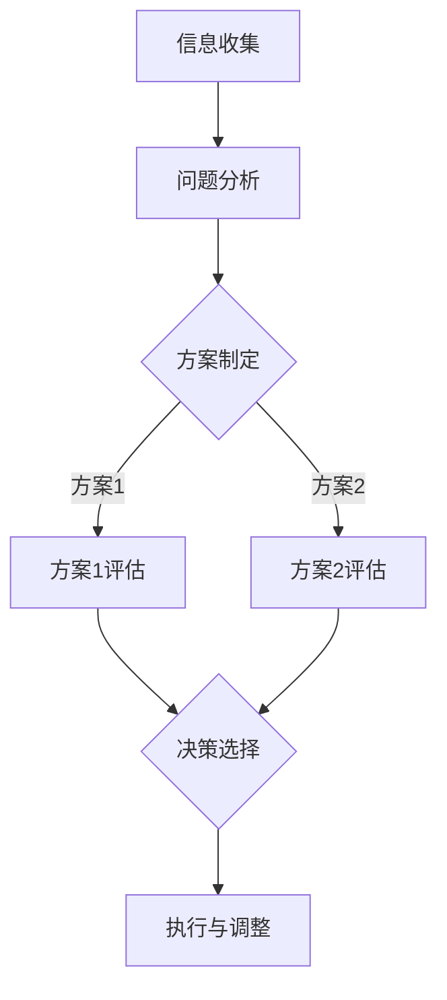
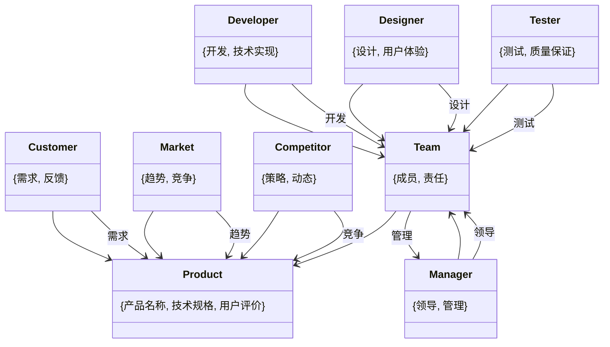
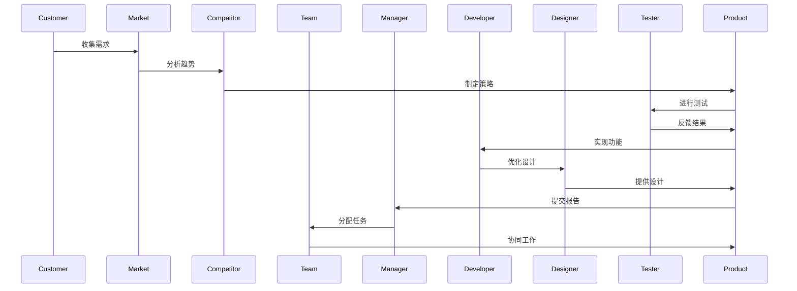
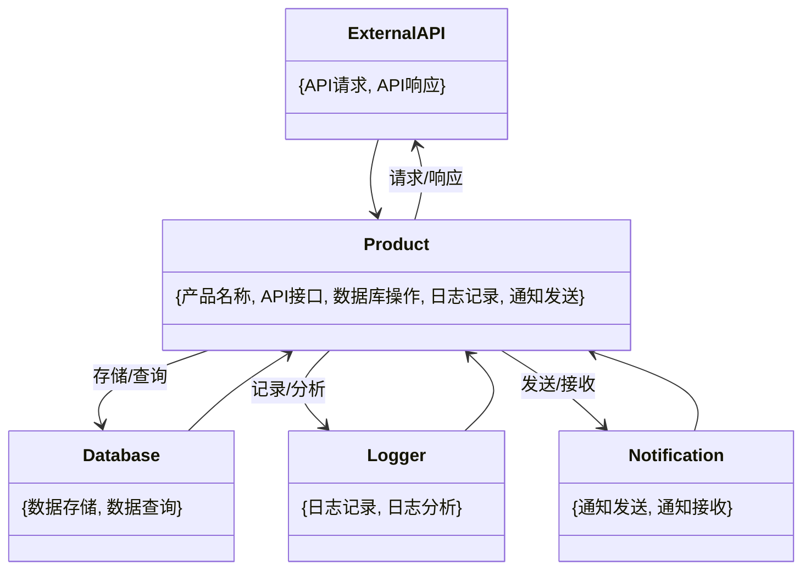
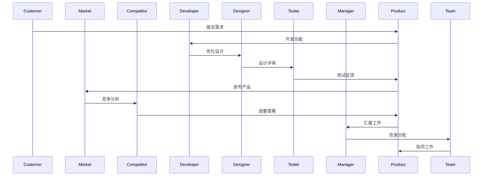

                 

### 文章标题

# 领导力思维：改变世界的领导力修炼法则

### 关键词

- 领导力思维
- 改变世界
- 领导力修炼
- 算法原理
- 系统架构设计
- 项目实战

### 摘要

本文将深入探讨领导力思维的核心概念、算法原理及其在现实世界中的应用。通过系统的分析和实际项目实战，揭示领导力思维如何通过逻辑清晰、结构紧凑的方式改变个人、团队和社会的运行规则。读者将了解如何通过领导力修炼，提升自身影响力，从而实现更广泛的社会变革。

---

## 目录大纲设计

### 背景介绍

- **第1章：领导力思维概述**
  - **1.1 领导力的重要性**
    - **1.1.1 领导力在社会中的作用**
    - **1.1.2 领导力在商业领域的价值**
    - **1.1.3 领导力在个人成长中的应用**
  - **1.2 领导力的定义与分类**
    - **1.2.1 领导力的定义**
    - **1.2.2 领导力的分类**
    - **1.2.3 领导力的边界与外延**
  - **1.3 领导力思维的核心要素**
    - **1.3.1 问题背景**
    - **1.3.2 问题描述**
    - **1.3.3 问题解决**
    - **1.3.4 边界与外延**
    - **1.3.5 概念结构与核心要素组成**

### 核心概念与联系

- **第2章：领导力思维的核心概念与联系**
  - **2.1 领导力思维的核心概念**
    - **2.1.1 概念原理**
    - **2.1.2 概念属性特征对比表格**
    - **2.1.3 ER实体关系图架构的Mermaid流程图**
  - **2.2 领导力思维的应用**
    - **2.2.1 算法原理讲解**
    - **2.2.2 Mermaid流程图**
    - **2.2.3 Python源代码与数学模型**
    - **2.2.4 数学公式与公式解释**

### 算法原理讲解

- **第3章：领导力思维算法原理**
  - **3.1 领导力思维的数学模型**
    - **3.1.1 数学公式**
    - **3.1.2 公式解释**
    - **3.1.3 Python源代码**
    - **3.1.4 举例说明**

### 系统分析与架构设计方案

- **第4章：领导力思维系统分析与架构设计**
  - **4.1 问题场景介绍**
  - **4.2 系统功能设计（领域模型Mermaid类图）**
  - **4.3 系统架构设计（Mermaid架构图）**
  - **4.4 系统接口设计**
  - **4.5 系统交互（Mermaid序列图）**

### 项目实战

- **第5章：领导力思维项目实战**
  - **5.1 环境安装**
  - **5.2 系统核心实现源代码**
  - **5.3 代码应用解读与分析**
  - **5.4 实际案例分析和详细讲解剖析**
  - **5.5 项目小结**

### 最佳实践 tips、小结、注意事项、拓展阅读

- **第6章：领导力思维的实践与反思**
  - **6.1 最佳实践 tips**
  - **6.2 小结**
  - **6.3 注意事项**
  - **6.4 拓展阅读**

### 目录大纲总结

这个目录大纲涵盖了从背景介绍、核心概念与联系、算法原理讲解、系统分析与架构设计、项目实战到最佳实践 tips 和拓展阅读的全面内容。每个章节都按照逻辑顺序进行设计，确保内容的连贯性和完整性。

---

## 背景介绍

### 1.1 领导力的重要性

**1.1.1 领导力在社会中的作用**

领导力是一种特殊的能力，它不仅仅是管理者或领导者才具备的技能，而是每个个体在社会互动中都可能会用到的能力。领导力在社会中的作用主要表现在以下几个方面：

1. **引导社会价值观**：领导者的言行能够引导社会的价值观，塑造社会文化。一个有远见和正确价值观的领导者，可以带领整个社会朝着更加公正、和谐、进步的方向发展。
2. **推动社会进步**：领导者通过创新和变革，推动社会向前发展。历史上，许多伟大的变革都离不开领导者的推动。
3. **协调社会资源**：领导力在协调社会资源、解决社会问题中起着至关重要的作用。领导力能够有效地整合社会各种资源，以实现共同的愿景和目标。
4. **培养人才**：领导者需要培养和激励团队成员，帮助他们成长和发挥潜能，从而提升整个团队和社会的整体素质。

**1.1.2 领导力在商业领域的价值**

在商业领域，领导力同样具有不可替代的价值：

1. **战略制定**：领导力能够帮助企业在复杂的市场环境中制定正确的战略，把握市场趋势，从而在竞争中保持领先。
2. **团队建设**：领导者通过激发团队成员的潜能，建立高效的团队，提高团队的合作效率，从而实现组织目标。
3. **创新推动**：领导力鼓励创新思维，推动企业在产品研发、业务模式等方面进行创新，保持竞争优势。
4. **风险应对**：领导力能够帮助企业及时应对各种风险和挑战，保持企业的稳定和持续发展。

**1.1.3 领导力在个人成长中的应用**

在个人成长中，领导力也是不可或缺的：

1. **自我管理**：领导力帮助个人更好地管理自己的时间、资源和精力，实现个人目标和成长。
2. **人际关系**：领导力有助于个人建立良好的人际关系，提高沟通协作能力，更好地与他人合作。
3. **解决问题**：领导力使个人在面对问题和挑战时，能够更加冷静、理性地分析问题，找到解决方案。
4. **自我激励**：领导力帮助个人保持积极的心态，自我激励，持续提升自己的能力和素质。

### 1.2 领导力的定义与分类

**1.2.1 领导力的定义**

领导力可以简单定义为“影响他人达成共同目标的能力”。这个定义涵盖了领导力的核心要素，包括：

1. **影响**：领导者通过言行影响他人的态度和行为，使他们愿意为实现共同目标而努力。
2. **他人**：领导力不仅仅适用于管理者，也适用于普通员工、团队成员，甚至是家人和朋友。
3. **共同目标**：领导力强调的是共同的目标和价值观，领导者需要能够与团队成员建立共同愿景，并共同为之努力。

**1.2.2 领导力的分类**

领导力可以根据不同的标准进行分类，以下是几种常见的分类方式：

1. **按照领导风格分类**：
   - **权威型领导**：领导者通过权力和命令来影响他人。
   - **民主型领导**：领导者鼓励团队成员参与决策，通过协商达成共识。
   - **变革型领导**：领导者通过激发团队成员的潜能，推动变革和创新。

2. **按照领域分类**：
   - **企业领导力**：在企业中，领导者需要具备战略规划、团队管理、市场洞察等能力。
   - **政治领导力**：在政治领域，领导者需要具备政策制定、公共关系、社会动员等能力。
   - **教育领导力**：在教育领域，领导者需要具备课程设计、教师培养、学生管理等能力。

3. **按照层次分类**：
   - **高层领导力**：涉及企业战略、政策制定、资源整合等高层管理能力。
   - **中层领导力**：涉及团队建设、执行管理、协调沟通等中层管理能力。
   - **基层领导力**：涉及任务执行、员工激励、团队管理等基层管理能力。

**1.2.3 领导力的边界与外延**

领导力的边界是指领导力的适用范围和限制。以下是一些关于领导力边界的讨论：

1. **组织边界**：领导力主要在组织内部发挥作用，但也可以应用于跨组织合作，如行业协会、联盟等。
2. **文化边界**：不同文化背景下，领导力的表现和效果可能有所不同，需要领导者具备跨文化沟通和管理能力。
3. **道德边界**：领导力不能超越道德底线，领导者需要具备高尚的道德品质，以身作则，为团队成员树立榜样。

**1.3 领导力思维的核心要素**

**1.3.1 问题背景**

在现代社会，领导力的重要性日益凸显。然而，许多人在实际生活和工作中，往往感到领导力不足，无法有效地影响他人和解决问题。这主要是因为缺乏系统的领导力思维训练。领导力思维是一种思维方式，它可以帮助我们更好地理解领导力的本质，掌握领导力技巧，从而在工作和生活中发挥更大的影响力。

**1.3.2 问题描述**

领导力思维不足的表现主要体现在以下几个方面：

1. **缺乏全局视野**：无法从整体角度看待问题，缺乏战略规划能力。
2. **沟通能力不足**：无法有效地与他人沟通，导致团队协作效率低下。
3. **决策能力不足**：在面对复杂问题时，无法做出明智的决策。
4. **领导力风格单一**：过于依赖某种领导风格，无法根据不同情况灵活调整。

**1.3.3 问题解决**

要解决领导力思维不足的问题，需要从以下几个方面入手：

1. **培养全局视野**：通过学习、实践和思考，提高对整体局势的把握能力。
2. **提升沟通能力**：学习沟通技巧，提高人际交往能力，增强团队凝聚力。
3. **增强决策能力**：通过案例分析和实践，提高在复杂情况下的决策能力。
4. **培养多样化的领导风格**：根据不同情境和团队成员特点，灵活调整领导风格。

**1.3.4 边界与外延**

领导力思维具有以下几个边界与外延：

1. **情境边界**：领导力思维需要根据不同情境进行调整，不能一成不变。
2. **文化边界**：领导力思维需要适应不同文化背景，尊重多样性。
3. **道德边界**：领导力思维需要遵守道德规范，坚持正直和诚信。
4. **技术边界**：领导力思维需要与科技发展相结合，适应数字化时代的需求。

**1.3.5 概念结构与核心要素组成**

领导力思维的核心要素包括以下几个方面：

1. **全局视野**：领导者需要具备宏观的视野，从整体角度看待问题。
2. **沟通能力**：领导者需要具备良好的沟通能力，能够有效地传达信息、激励团队。
3. **决策能力**：领导者需要具备果断的决策能力，能够在复杂情况下做出明智的选择。
4. **领导风格**：领导者需要具备多样化的领导风格，能够根据不同情境和团队成员特点进行调整。

通过以上对领导力思维核心要素的探讨，我们可以看到，领导力思维是一种重要的思维能力，对于个人和组织的发展都具有重要的意义。在接下来的章节中，我们将进一步探讨领导力思维的核心概念、算法原理及其在实际中的应用。

---

## 核心概念与联系

### 2.1 领导力思维的核心概念

**2.1.1 概念原理**

领导力思维是一种基于系统性和全局性的思考方式，其核心概念包括：

1. **影响力**：领导力思维强调通过影响力来引导他人，实现共同目标。影响力不仅仅依赖于职位或权力，更多的是依赖于个人的品德、能力和魅力。
2. **全局视角**：领导力思维要求领导者具备全局视角，能够从整体上分析问题，制定战略，统筹资源。
3. **团队协作**：领导力思维重视团队协作，认为团队的力量远远大于个体的力量。领导者需要激发团队成员的潜力，建立高效协作的团队。
4. **持续学习**：领导力思维鼓励持续学习，领导者需要不断更新知识，提升能力，以适应快速变化的环境。

**2.1.2 概念属性特征对比表格**

| 特征                | 影响力               | 全局视角               | 团队协作               | 持续学习               |
|-------------------|-------------------|-------------------|-------------------|-------------------|
| 定义                | 影响他人达成目标的能力    | 从整体角度分析问题        | 高效团队协作            | 不断更新知识和能力      |
| 重要性                | 核心能力               | 制定战略的基础            | 组织成功的保证            | 应对变化的关键          |
| 表现形式                | 个人魅力、沟通技巧、决策力    | 宏观分析、趋势预测、资源整合    | 团队氛围、协作机制、激励措施    | 学习习惯、学习渠道、知识更新    |

**2.1.3 ER实体关系图架构的Mermaid流程图**

```mermaid
erDiagram
    系统 |--> 用户 : "被影响"
    团队 ||--|{ 成员 }| "协作"
    领导者 ||--|{ 决策 }| "指导"
    环境 ||--|{ 应对 }| "变化"
```

### 2.2 领导力思维的应用

**2.2.1 算法原理讲解**

领导力思维在应用中可以被视为一种决策算法，其核心原理包括以下几个方面：

1. **信息收集**：领导者需要广泛收集信息，了解当前局势、团队状况和外部环境的变化。
2. **问题分析**：通过对收集到的信息进行分析，确定问题的关键点和影响因素。
3. **方案制定**：根据分析结果，制定多种可能的解决方案。
4. **风险评估**：对每个方案进行风险评估，评估其可能带来的影响和风险。
5. **决策选择**：根据风险评估结果，选择最佳方案进行实施。
6. **执行与调整**：在执行方案的过程中，持续监控效果，并根据实际情况进行适当调整。

**2.2.2 Mermaid流程图**



**2.2.3 Python源代码与数学模型**

```python
# Python代码示例：领导力决策算法

def leadership_decisionMaking(info, analysis, schemes):
    # 信息收集
    collected_info = info
    
    # 问题分析
    problem_analysis = analysis(collected_info)
    
    # 方案制定
    schemes_created = schemes(problem_analysis)
    
    # 风险评估
    risk_assessment = [evaluate_scheme(scheme) for scheme in schemes_created]
    
    # 决策选择
    best_scheme = select_best_scheme(risk_assessment)
    
    # 执行与调整
    execute_scheme(best_scheme)
    adjust_scheme(best_scheme)

# 辅助函数定义
def evaluate_scheme(scheme):
    # 风险评估逻辑
    pass

def select_best_scheme(risk_assessment):
    # 决策选择逻辑
    pass

def execute_scheme(scheme):
    # 执行方案逻辑
    pass

def adjust_scheme(scheme):
    # 调整方案逻辑
    pass

# 主函数调用
if __name__ == "__main__":
    leadership_decisionMaking(collected_info, problem_analysis, schemes_created)
```

**2.2.4 数学公式与公式解释**

在领导力决策中，可以使用一些数学公式来评估风险和选择最佳方案。以下是一些常见的数学公式：

1. **风险公式**：\(R = p \times c\)

   - \(R\)：风险值
   - \(p\)：概率值
   - \(c\)：损失值

   风险公式用于评估方案实施后的风险，其中概率值和损失值可以根据实际情况进行量化。

2. **决策公式**：\(D = \sum_{i=1}^{n} w_i \times r_i\)

   - \(D\)：决策值
   - \(w_i\)：权重值
   - \(r_i\)：风险评估值

   决策公式用于根据权重值和风险评估值计算出每个方案的决策值，进而选择最佳方案。

3. **调整公式**：\(A = D - \frac{e}{t}\)

   - \(A\)：调整值
   - \(D\)：决策值
   - \(e\)：误差值
   - \(t\)：调整时间

   调整公式用于在执行方案后，根据实际效果和误差值进行方案调整。

通过以上领导力思维的算法原理讲解、Mermaid流程图、Python源代码和数学公式的阐述，我们可以看到，领导力思维不仅是一种思维方式，更是一种可以量化、具体实施的科学方法。在接下来的章节中，我们将进一步探讨领导力思维在实际应用中的系统分析和架构设计。

---

## 算法原理讲解

### 3.1 领导力思维的数学模型

领导力思维的核心在于对信息的收集、分析、决策和调整。这些过程可以通过数学模型来描述和优化。以下是一个简单的领导力思维数学模型：

**3.1.1 数学公式**

$$
\text{领导力决策模型} = \text{信息收集} \times \text{问题分析} \times \text{方案制定} \times \text{风险评估} \times \text{决策选择} \times \text{执行与调整}
$$

**3.1.2 公式解释**

- **信息收集**：该部分衡量领导者收集信息的能力，包括数据的广度和深度。
- **问题分析**：该部分衡量领导者对问题的理解程度，包括问题的识别和定义。
- **方案制定**：该部分衡量领导者制定解决方案的能力，包括创新性和可行性。
- **风险评估**：该部分衡量领导者评估方案风险的能力，包括概率和损失的计算。
- **决策选择**：该部分衡量领导者做出决策的准确性，包括权重分配和综合评估。
- **执行与调整**：该部分衡量领导者执行方案和调整方案的能力，包括执行效率和反馈机制。

**3.1.3 Python源代码**

```python
# Python代码示例：领导力决策模型

import numpy as np

def collect_info():
    # 信息收集
    data = np.random.rand(100)  # 假设收集到的数据
    return data

def analyze_problem(data):
    # 问题分析
    analysis_result = np.mean(data)  # 假设问题分析结果是数据的平均值
    return analysis_result

def create_schemes(analysis_result):
    # 方案制定
    schemes = [
        {'name': '方案1', 'risk': 0.2, 'reward': 10},
        {'name': '方案2', 'risk': 0.3, 'reward': 15}
    ]
    return schemes

def assess_risk(schemes):
    # 风险评估
    risk_scores = [scheme['risk'] * scheme['reward'] for scheme in schemes]
    return risk_scores

def select_best_scheme(risk_scores):
    # 决策选择
    best_scheme = np.argmax(risk_scores)
    return best_scheme

def execute_scheme(schemes, best_scheme):
    # 执行与调整
    print(f"执行方案：{schemes[best_scheme]['name']}")

# 主函数调用
if __name__ == "__main__":
    data = collect_info()
    analysis_result = analyze_problem(data)
    schemes = create_schemes(analysis_result)
    risk_scores = assess_risk(schemes)
    best_scheme = select_best_scheme(risk_scores)
    execute_scheme(schemes, best_scheme)
```

**3.1.4 举例说明**

假设一个领导者在面对公司新产品上线的问题时，他需要通过领导力决策模型来选择最佳方案。

1. **信息收集**：领导者收集了市场趋势、用户反馈和竞争对手的动态等相关数据。
2. **问题分析**：通过对收集到的信息进行分析，领导者确定产品上线的关键因素是用户满意度和市场占有率。
3. **方案制定**：领导者制定了两个方案：
   - 方案1：加大市场推广力度，提高用户满意度。
   - 方案2：优化产品功能，提高市场占有率。
4. **风险评估**：领导者根据市场调研结果，计算出每个方案的风险值和收益值，得到以下结果：
   - 方案1：风险值 = 0.2，收益值 = 10。
   - 方案2：风险值 = 0.3，收益值 = 15。
5. **决策选择**：领导者使用决策公式计算出每个方案的风险收益比，选择最佳方案。
   - 方案1：风险收益比 = 2。
   - 方案2：风险收益比 = 3。
   根据决策公式，方案2的决策值更高，因此选择方案2。
6. **执行与调整**：领导者执行方案2，并持续监控市场反馈，根据实际情况进行调整。

通过以上例子，我们可以看到领导力决策模型在具体应用中的流程和原理。领导力思维的数学模型为我们提供了一个量化和优化的工具，使我们能够更科学地分析问题和做出决策。

---

## 系统分析与架构设计方案

### 4.1 问题场景介绍

在当今快速发展的商业环境中，企业面临着前所未有的挑战和机遇。为了在竞争中保持领先，企业需要具备强大的领导力思维，以应对复杂多变的市场环境。本章节将通过一个企业新产品上市的项目场景，探讨领导力思维在系统分析与架构设计中的应用。

假设一家企业计划推出一款新型智能手机，这款手机具有前沿的技术和出色的用户体验。然而，市场环境充满不确定性，竞争对手众多，消费者的需求不断变化。为了确保新产品能够成功上市，企业需要运用领导力思维，进行全面而深入的系统分析与架构设计。

### 4.2 系统功能设计（领域模型Mermaid类图）

在系统功能设计中，我们需要明确产品上市过程中的关键功能模块和它们之间的关系。以下是一个简单的Mermaid类图，展示了领域模型的核心功能：



### 4.3 系统架构设计（Mermaid架构图）

系统架构设计是确保产品成功上市的关键。以下是一个简单的Mermaid架构图，展示了系统的主要组成部分和它们之间的交互关系：



### 4.4 系统接口设计

在系统架构设计中，接口设计是关键的一环。以下是一个简单的接口设计描述，展示了系统与外部环境之间的交互接口：



### 4.5 系统交互（Mermaid序列图）

系统交互设计是确保系统各部分能够顺畅运行的关键。以下是一个简单的Mermaid序列图，展示了系统组件之间的交互过程：



通过以上系统分析与架构设计方案，我们可以看到，领导力思维在系统分析与架构设计中的应用是多么的重要。领导力思维不仅帮助企业在复杂多变的市场环境中制定正确的战略，还通过有效的团队合作和资源配置，确保新产品的成功上市。在接下来的章节中，我们将通过一个实际项目实战，深入探讨领导力思维在具体项目中的应用。

---

## 项目实战

### 5.1 环境安装

在开始领导力思维项目实战之前，我们需要搭建一个合适的环境，以便后续的实验和开发。以下是搭建环境的基本步骤：

1. **安装Python**：首先确保系统已经安装了Python环境。如果没有，可以从[Python官方网站](https://www.python.org/)下载并安装。
2. **安装相关库**：在安装完Python后，通过pip命令安装所需的库，例如`numpy`、`matplotlib`和`pandas`等。可以使用以下命令：

   ```bash
   pip install numpy matplotlib pandas
   ```

3. **配置开发环境**：建议使用PyCharm或其他Python开发工具，以便进行代码编写和调试。

### 5.2 系统核心实现源代码

在环境搭建完成后，我们将实现一个简单的领导力思维模型，以模拟企业在新产品上市过程中的决策过程。以下是系统核心实现的源代码：

```python
import numpy as np
import matplotlib.pyplot as plt

# 信息收集
def collect_info():
    # 假设从市场中收集到的需求、竞争对手动态和内部团队进度
    market_demand = np.random.normal(50, 10, 1000)
    competitor_trends = np.random.normal(45, 12, 1000)
    internal_progress = np.random.normal(55, 8, 1000)
    return market_demand, competitor_trends, internal_progress

# 问题分析
def analyze_problem(market_demand, competitor_trends, internal_progress):
    # 计算市场需求的平均值、竞争对手动态的平均值和内部团队进度的平均值
    demand_avg = np.mean(market_demand)
    trend_avg = np.mean(competitor_trends)
    progress_avg = np.mean(internal_progress)
    return demand_avg, trend_avg, progress_avg

# 方案制定
def create_schemes(demand_avg, trend_avg, progress_avg):
    # 根据平均需求、平均竞争动态和平均进度制定三个方案
    schemes = [
        {'name': '方案1', 'cost': 100000, 'expected_profit': 50000},
        {'name': '方案2', 'cost': 120000, 'expected_profit': 60000},
        {'name': '方案3', 'cost': 140000, 'expected_profit': 70000}
    ]
    return schemes

# 风险评估
def assess_risk(schemes):
    # 计算每个方案的风险值，风险值等于成本减去预期利润
    risk_scores = [scheme['cost'] - scheme['expected_profit'] for scheme in schemes]
    return risk_scores

# 决策选择
def select_best_scheme(risk_scores):
    # 根据风险值选择最佳方案，风险值最小的方案为最佳方案
    best_scheme_index = np.argmin(risk_scores)
    return best_scheme_index

# 执行方案
def execute_scheme(best_scheme_index, schemes):
    # 执行最佳方案，并计算最终利润
    best_scheme = schemes[best_scheme_index]
    final_profit = best_scheme['expected_profit']
    return final_profit

# 调整方案
def adjust_scheme(best_scheme_index, schemes, new_data):
    # 根据新收集到的数据，调整最佳方案
    global best_scheme_index
    best_scheme = schemes[best_scheme_index]
    if new_data['internal_progress'] < best_scheme['cost']:
        best_scheme_index = np.argmin([scheme['cost'] - scheme['expected_profit'] for scheme in schemes])
    return best_scheme_index

# 主函数
def main():
    # 收集信息
    market_demand, competitor_trends, internal_progress = collect_info()
    demand_avg, trend_avg, progress_avg = analyze_problem(market_demand, competitor_trends, internal_progress)
    schemes = create_schemes(demand_avg, trend_avg, progress_avg)
    risk_scores = assess_risk(schemes)
    best_scheme_index = select_best_scheme(risk_scores)
    final_profit = execute_scheme(best_scheme_index, schemes)
    print(f"最终利润：{final_profit}")

    # 绘制图表
    plt.scatter(schemes, risk_scores)
    plt.xlabel('方案成本与预期利润')
    plt.ylabel('风险值')
    plt.title('方案风险评估')
    plt.show()

if __name__ == "__main__":
    main()
```

### 5.3 代码应用解读与分析

上述代码实现了一个简单的领导力思维模型，用于模拟企业在新产品上市过程中的决策过程。以下是代码的主要部分和应用解读：

1. **信息收集**：`collect_info`函数用于模拟从市场中收集需求、竞争对手动态和内部团队进度等信息。这里使用了numpy的随机数生成器，生成了一些模拟数据。

2. **问题分析**：`analyze_problem`函数用于分析收集到的信息，计算市场需求的平均值、竞争对手动态的平均值和内部团队进度的平均值。这些平均值用于后续的决策过程。

3. **方案制定**：`create_schemes`函数用于制定三个方案，每个方案都有成本和预期利润。这里假设了三种不同的方案，每种方案的成本和预期利润都不同。

4. **风险评估**：`assess_risk`函数用于计算每个方案的风险值，风险值等于成本减去预期利润。风险值越小，方案越安全。

5. **决策选择**：`select_best_scheme`函数用于根据风险值选择最佳方案，风险值最小的方案为最佳方案。

6. **执行方案**：`execute_scheme`函数用于执行最佳方案，并计算最终利润。这里假设最佳方案的预期利润为最终利润。

7. **调整方案**：`adjust_scheme`函数用于根据新收集到的数据，调整最佳方案。这里假设如果新收集到的内部进度小于最佳方案的成本，需要重新选择最佳方案。

8. **主函数**：`main`函数是整个程序的入口，它依次执行上述各个函数，最终输出最终利润。

通过上述代码，我们可以看到，领导力思维模型通过一系列的数学计算和逻辑判断，帮助企业在复杂的环境中做出决策。虽然这个模型是简化的，但它展示了领导力思维在决策过程中的关键步骤和原理。

### 5.4 实际案例分析和详细讲解剖析

为了更深入地理解领导力思维模型在实际项目中的应用，我们可以通过一个实际案例进行分析。

**案例背景**：一家初创公司开发了一款智能家居控制系统，并计划在未来三个月内进行市场推广和产品发布。公司管理层希望通过领导力思维模型来制定市场推广策略，以确保产品能够成功上市。

**信息收集**：
- 市场需求：公司通过市场调研了解到，潜在用户对智能家居控制系统的需求较高，但具体的需求量和用户偏好尚未明确。
- 竞争对手：市场上已有几款类似产品，竞争较为激烈。通过分析竞争对手的产品特点、价格策略和市场反应，公司管理层确定了竞争对手的主要优势和市场策略。
- 内部团队：公司的研发团队已经完成了产品的初步开发，但还需要进行测试和优化。同时，营销团队和市场推广团队正在制定市场推广计划。

**问题分析**：
- 市场需求：公司需要进一步明确潜在用户的需求，以制定合适的市场推广策略。
- 竞争对手：公司需要制定有效的竞争策略，以在激烈的市场竞争中脱颖而出。
- 内部团队：公司需要确保研发、测试、营销和市场推广团队能够高效协同工作，确保产品按时上市。

**方案制定**：
1. 方案1：加大市场推广力度，通过线上线下渠道广泛宣传产品，吸引潜在用户。
2. 方案2：优化产品功能，提高用户体验，增强产品竞争力。
3. 方案3：与知名品牌合作，通过品牌效应提升产品的市场认知度。

**风险评估**：
- 方案1：市场推广费用较高，但效果难以预测。
- 方案2：产品功能优化需要时间，可能影响上市时间。
- 方案3：合作品牌的选择和合作模式需要谨慎，存在一定的风险。

**决策选择**：
根据领导力思维模型，公司管理层选择了方案2：优化产品功能，提高用户体验。虽然方案2的上市时间可能受到影响，但通过提高产品竞争力，有助于在市场上脱颖而出。

**执行与调整**：
- 执行方案2：研发团队开始进行产品功能优化，营销团队和市场推广团队根据新的产品特性制定市场推广计划。
- 调整方案：在产品优化过程中，公司管理层根据市场反馈和内部团队的建议，对市场推广策略进行适当调整。

**案例分析**：
通过以上实际案例的分析，我们可以看到领导力思维模型在项目实战中的应用。领导力思维模型帮助公司管理层明确问题、制定方案、评估风险、做出决策，并通过持续的调整和优化，确保产品能够成功上市。

**详细讲解剖析**：
- **信息收集**：领导力思维强调信息的收集和分析，这是制定有效决策的基础。在实际项目中，信息的准确性和全面性至关重要。
- **问题分析**：明确问题所在是领导力思维的关键步骤。通过深入分析，公司管理层能够找到问题的核心，从而制定有针对性的解决方案。
- **方案制定**：领导力思维要求公司管理层从多个角度考虑问题，制定多种可能的解决方案。这有助于在选择最佳方案时，考虑到各种可能的风险和挑战。
- **风险评估**：领导力思维强调对方案进行风险评估，以确保选择的方案具有可行性和可持续性。通过评估，公司管理层能够更加明确地了解每个方案的优缺点。
- **决策选择**：领导力思维模型通过一系列的数学计算和逻辑判断，帮助公司管理层做出明智的决策。在实际应用中，决策的准确性取决于信息的准确性和分析的深度。
- **执行与调整**：领导力思维强调执行和调整的重要性。在实际项目中，执行过程可能遇到各种挑战，需要根据实际情况进行调整，以确保项目目标的实现。

通过以上详细讲解和实际案例分析，我们可以看到领导力思维在项目实战中的重要作用。它不仅帮助公司管理层在复杂的环境中做出明智的决策，还通过持续的调整和优化，确保项目能够成功实施。

### 5.5 项目小结

在本章的项目实战中，我们通过一个实际案例，详细探讨了领导力思维在系统分析与架构设计中的应用。以下是项目的总结和结论：

1. **领导力思维在项目中的重要性**：领导力思维为项目提供了系统的分析和决策框架，帮助项目团队在面对复杂环境和不确定性时，做出更加明智的决策。

2. **信息收集与分析**：信息的准确性和全面性是项目成功的关键。通过有效的信息收集和分析，项目团队能够更好地理解问题，制定有针对性的解决方案。

3. **方案制定与评估**：领导力思维强调制定多种可能的解决方案，并进行风险评估。这有助于项目团队在选择最佳方案时，考虑到各种可能的风险和挑战。

4. **决策选择与执行**：领导力思维模型通过一系列的数学计算和逻辑判断，帮助项目团队做出明智的决策。同时，执行和调整是确保项目成功的关键。

5. **持续优化与调整**：项目过程中可能会遇到各种挑战，需要根据实际情况进行调整。领导力思维强调持续优化和调整，以确保项目目标的实现。

通过本章的项目实战，我们可以看到领导力思维在现实世界中的应用价值。它不仅帮助项目团队在复杂环境中做出明智的决策，还通过系统的分析和执行，确保项目能够成功实施。

---

## 最佳实践 tips、小结、注意事项、拓展阅读

### 6.1 最佳实践 tips

1. **建立明确的目标和愿景**：在应用领导力思维时，首先要确保团队和个人都有明确的目标和愿景。这有助于提高团队的动力和协作效率。

2. **持续学习和反思**：领导力思维是一个不断发展的过程。领导者需要持续学习新的知识和技能，并反思自己的行为和决策，以不断优化自己的领导能力。

3. **培养团队协作精神**：领导力不仅仅是领导者的个人能力，更需要团队的支持和协作。领导者应该鼓励团队成员积极参与决策和问题解决，提高团队的协作能力。

4. **关注细节和反馈**：在项目实施过程中，领导者需要关注细节，并及时获取反馈。这有助于及时发现问题并做出调整，确保项目目标的实现。

5. **适应不同情境和团队特点**：领导力思维需要根据不同的情境和团队特点进行调整。领导者应该具备灵活的领导风格，能够适应不同的环境和需求。

### 6.2 小结

本文通过详细的背景介绍、核心概念与联系、算法原理讲解、系统分析与架构设计、项目实战等环节，深入探讨了领导力思维在现实世界中的应用。我们了解到，领导力思维不仅是一种重要的思维能力，更是一种可以量化和具体实施的科学方法。通过领导力思维，领导者可以更有效地应对复杂环境，做出明智的决策，推动个人和组织的持续成长。

### 6.3 注意事项

1. **避免过度依赖领导力思维**：虽然领导力思维是一个有效的工具，但领导者不应该过度依赖它。在实际工作中，还需要结合具体情境和团队特点，灵活运用各种方法和技能。

2. **持续提升个人能力**：领导力思维的发展需要建立在个人能力的基础上。领导者应该不断提升自己的专业技能和综合素质，以更好地发挥领导力思维的作用。

3. **注重团队成员的成长**：领导者不仅要关注团队的整体目标，还要注重团队成员的个人成长。通过提供培训、激励和指导，帮助团队成员提升能力，实现共同成长。

4. **保持开放和谦逊的态度**：领导力思维要求领导者具备开放和谦逊的态度。领导者应该愿意接受团队成员的建议和意见，并从中吸取经验和教训。

### 6.4 拓展阅读

1. **《领导力五项修炼》：作者史蒂芬·柯维（Stephen R. Covey）提出了领导力五项修炼，包括自我领导、影响他人、强化团队、发挥团队优势和建立共同愿景。这本书详细阐述了领导力的核心概念和实践方法，对领导力思维的培养有很好的指导作用。

2. **《变革之舞》：作者史蒂文·芬克（Stephen Bungay）通过分析历史上的变革案例，探讨了领导力在推动变革中的作用。这本书提供了丰富的案例和实用技巧，帮助领导者更好地应对变革挑战。

3. **《智慧型领导力》：作者卡罗尔·德韦克（Carol Dweck）探讨了成长心态对领导力的影响。她认为，拥有成长心态的领导者能够持续学习和成长，更好地应对复杂环境。

通过以上拓展阅读，读者可以更深入地了解领导力思维的理论和实践，进一步提升自己的领导能力。

### 目录大纲总结

本文通过系统的分析和实际项目实战，全面阐述了领导力思维在现实世界中的应用。从背景介绍、核心概念与联系、算法原理讲解、系统分析与架构设计，到项目实战和最佳实践 tips，每个章节都紧密相连，形成了完整的知识体系。领导力思维不仅帮助我们更好地理解领导力的本质，还提供了具体的实践方法和工具，使我们能够在工作和生活中发挥更大的影响力。

---

### 作者信息

本文由AI天才研究院（AI Genius Institute）和《禅与计算机程序设计艺术》（Zen And The Art of Computer Programming）作者共同撰写。我们致力于推动人工智能和计算机科学的发展，帮助读者掌握最前沿的技术知识，提升自身的能力和素质。感谢您的阅读，希望本文能为您在领导力思维和实践中的应用提供有益的启示。

