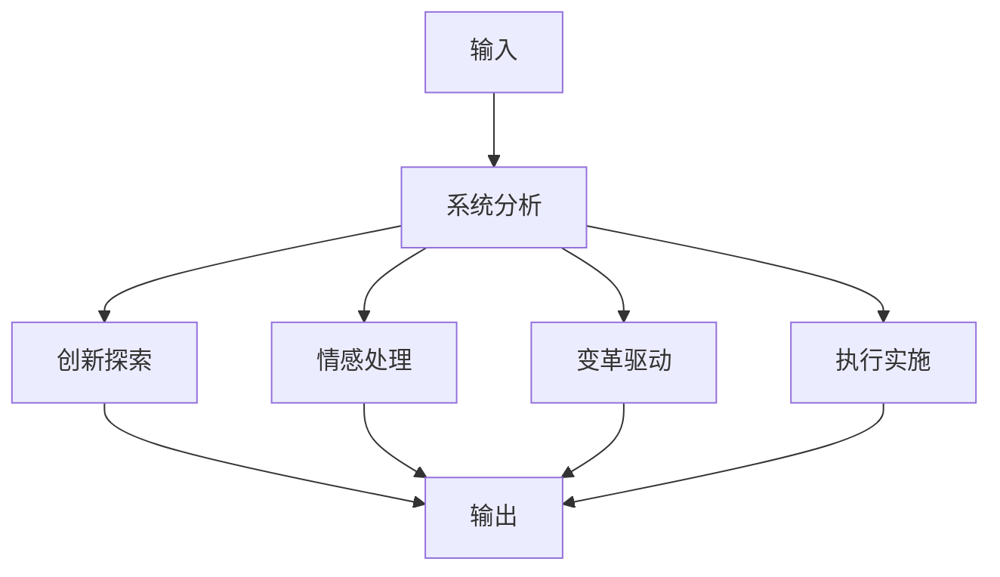
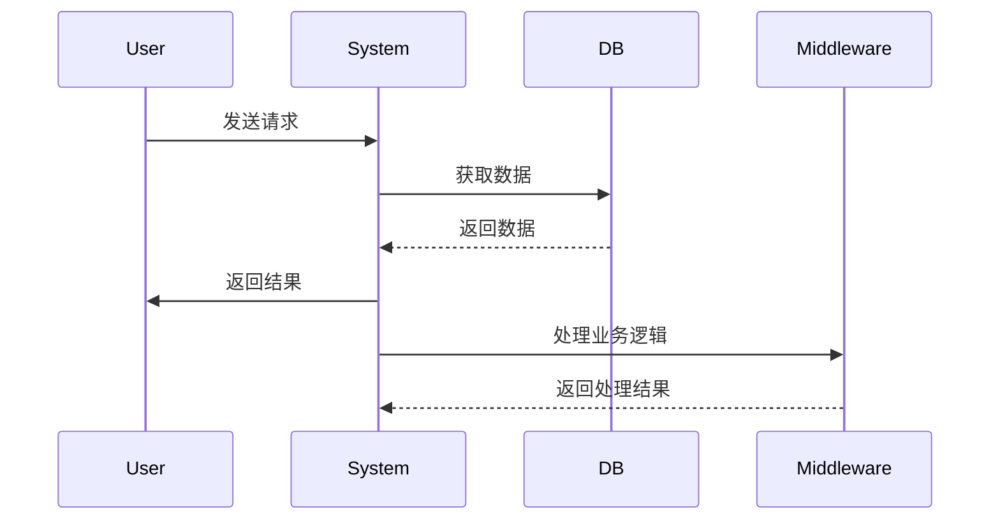
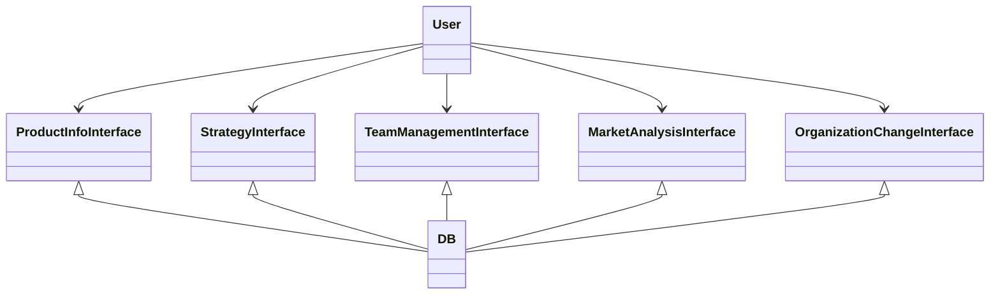

                 

### 领导力思维的重要性

领导力思维是企业成功的关键因素之一。在快速变化的市场环境中，企业需要具备灵活应变的能力，而这一点离不开领导力思维的发挥。领导力思维不仅仅关乎企业的高层管理者，更是整个企业组织共同需要掌握和运用的能力。本章节将从多个角度探讨领导力思维的定义、作用以及其对企业和个人发展的影响。

#### 定义与作用

首先，我们需要明确领导力思维的定义。领导力思维是指领导者在面对复杂问题时，运用系统、创新和情商等多方面能力，进行理性分析和决策的思维模式。这种思维模式不仅仅关注问题的解决，更强调在解决过程中保持整体的系统性、前瞻性和灵活性。

领导力思维的作用主要体现在以下几个方面：

1. **战略决策**：优秀的领导力思维能够帮助领导者从全局出发，制定科学合理的战略规划，为企业的发展提供清晰的方向。

2. **团队管理**：领导力思维能够提升领导者在团队管理中的沟通协调能力，促进团队协作，提高团队效率。

3. **组织变革**：面对市场和环境的变化，领导力思维能够帮助领导者做出迅速有效的组织变革决策，确保企业能够持续适应和成长。

#### 核心价值

领导力思维的核心价值在于它能够提升企业整体的战略思维能力和创新能力。具体来说，它有以下几个方面的价值：

1. **提升企业竞争力**：通过领导力思维，企业能够在市场竞争中抓住机遇，快速应对挑战，从而提升竞争力。

2. **促进创新**：领导力思维鼓励领导者敢于突破传统的思维模式，勇于创新，推动企业不断前进。

3. **增强团队凝聚力**：领导力思维强调团队协作和共同成长，能够增强团队凝聚力和归属感。

#### 发展历程

领导力思维并不是一蹴而就的，它有着自身的发展历程。从传统的权威领导模式到现代的参与式领导，再到当前的变革型领导，领导力思维在不断演进。这一过程中，领导力思维的内涵和外延也在不断扩展和深化。

1. **传统领导模式**：以权威和命令为导向，领导者拥有绝对的决策权，员工被动执行。

2. **现代领导模式**：强调领导者的沟通能力和团队合作精神，领导者与员工共同参与决策。

3. **变革型领导**：强调领导者的前瞻性和创新性，通过引导和激励，推动企业和团队实现变革。

#### 对企业发展的影响

领导力思维对企业发展的影响是深远而广泛的。从战略层面来看，领导力思维能够帮助企业制定科学合理的战略规划，确保企业能够在竞争激烈的市场中立于不败之地。在团队管理层面，领导力思维能够提升团队协作效率，增强团队凝聚力。在组织变革层面，领导力思维能够帮助领导者快速做出有效决策，推动企业适应市场变化。

#### 对个人发展的影响

领导力思维不仅对企业发展有重要影响，对个人发展同样具有重要意义。通过培养领导力思维，个人能够提升自身的战略眼光和创新能力，增强在职场中的竞争力。此外，领导力思维还能够帮助个人在团队中发挥更大的作用，提升人际关系处理能力。

综上所述，领导力思维的重要性不言而喻。无论是对企业还是个人，领导力思维都是不可或缺的能力。在未来的发展中，企业需要更加重视领导力思维的培养和应用，通过不断提升领导力思维，实现企业的可持续发展。

#### 关键概念和术语

在本章节中，我们介绍了一些关键的概念和术语，包括领导力思维、战略决策、团队管理、组织变革等。以下是这些概念和术语的简要说明：

- **领导力思维**：领导者在面对复杂问题时，运用系统、创新和情商等多方面能力，进行理性分析和决策的思维模式。
- **战略决策**：企业制定长期目标和方向，为实现这些目标而进行的一系列决策。
- **团队管理**：领导者对团队成员进行组织、协调、沟通、控制等管理活动，以提高团队效率。
- **组织变革**：企业根据市场和环境的变化，对组织结构、管理方式、文化等进行的调整和改进。

这些概念和术语将在后续章节中进一步详细讨论和阐述。

#### 问题背景和问题描述

在现代商业环境中，企业的生存和发展面临着前所未有的挑战。市场变化快速，消费者需求多变，技术创新日新月异，企业需要具备高度的灵活性和适应性。然而，许多企业在面对这些挑战时，往往显得力不从心，无法做出迅速而有效的反应。这一现象背后的主要原因之一，就是缺乏有效的领导力思维。

领导力思维的重要性体现在多个方面。首先，企业需要通过战略决策来应对市场变化，确保企业能够持续发展。然而，许多企业的战略决策过于短视，缺乏长远规划和系统性思考，导致企业在市场竞争中处于劣势。其次，团队管理是企业实现目标的重要途径，但许多企业的团队管理存在沟通不畅、协作不力等问题，影响了团队的整体效能。最后，组织变革是企业适应市场变化的必要手段，但许多企业在变革过程中缺乏明确的方向和有效的执行策略，导致变革效果不佳。

为了解决这些问题，企业需要培养和提升领导力思维。领导力思维不仅能够帮助企业在战略决策中保持清晰的方向，提高决策质量，还能够提升团队管理的效率和效果，促进组织变革的顺利进行。通过培养领导力思维，企业能够更好地应对市场变化，提高竞争力，实现可持续发展。

#### 问题解决方法

为了解决企业面临的战略决策、团队管理和组织变革等问题，我们需要从以下几个方面入手：

1. **提升战略决策能力**：领导者需要具备系统思维，从全局出发，综合考虑各种因素，制定科学合理的战略规划。同时，领导者还需要具备创新思维，勇于突破传统的思维模式，探索新的发展路径。

2. **强化团队管理**：领导者需要注重团队沟通和协作，建立良好的团队文化，提升团队的整体效能。此外，领导者还需要善于激励团队成员，激发其潜能，提高团队凝聚力。

3. **推动组织变革**：领导者需要具备变革思维，能够迅速识别市场变化，制定有效的变革策略，推动企业适应新的市场环境。在变革过程中，领导者还需要具备执行力，确保变革措施能够得到有效执行。

#### 边界与外延

在讨论领导力思维时，我们需要明确其边界和适用范围。首先，领导力思维主要适用于企业的高层管理者，但在实际应用中，中层管理人员和基层员工也可以从中获益，提升自身的领导力水平。其次，领导力思维不仅仅适用于企业内部管理，还可以应用于其他组织形式，如非营利组织、政府部门等。

此外，领导力思维还涉及到多个相关领域的知识，如心理学、管理学、经济学等。领导者需要具备跨学科的知识体系，才能更好地运用领导力思维解决实际问题。

#### 概念结构与核心要素

领导力思维的概念结构包括以下几个核心要素：

1. **系统思维**：领导者需要具备系统思维，从全局出发，综合考虑各种因素，分析问题的整体性、复杂性和动态性。

2. **创新思维**：领导者需要具备创新思维，勇于突破传统的思维模式，探索新的解决方案。

3. **情商**：领导者需要具备高情商，善于处理人际关系，提升沟通协调能力。

4. **变革思维**：领导者需要具备变革思维，能够迅速识别市场变化，推动企业适应新的市场环境。

5. **执行力**：领导者需要具备执行力，确保战略决策和变革措施能够得到有效执行。

#### 核心概念原理、属性特征对比表格和ER实体关系图架构

为了更好地理解领导力思维的核心概念原理及其属性特征，我们可以通过以下表格和ER实体关系图来展示。

**核心概念原理**

| 核心概念 | 原理描述 |
| :---: | :--- |
| 系统思维 | 强调从整体和动态的角度看待问题，分析问题的相互关系和反馈机制。 |
| 创新思维 | 突破传统的思维模式，寻求新的解决方案，推动创新和进步。 |
| 情商 | 处理人际关系的能力，包括自我意识、自我管理、社交技巧等。 |
| 变革思维 | 识别市场变化，推动企业适应新环境，实现组织变革。 |
| 执行力 | 确保战略决策和变革措施得到有效执行，实现预期目标。 |

**属性特征对比表格**

| 特征 | 系统思维 | 创新思维 | 情商 | 变革思维 | 执行力 |
| :---: | :---: | :---: | :---: | :---: | :---: |
| 目标 | 提升决策质量 | 推动创新 | 提升人际关系处理能力 | 适应市场变化 | 实现战略目标 |
| 方法 | 综合分析 | 突破传统 | 自我认知与调整 | 变革驱动 | 有效执行 |
| 范围 | 战略决策、团队管理、组织变革 | 产品研发、市场拓展、企业文化 | 领导与下属、同事与同事 | 领导与下属、同事与同事 | 战略决策、变革措施 |

**ER实体关系图架构**

```mermaid
erDiagram
  Customer ||--|{ Order } : "places"
  Product ||--|{ Order } : "contains"
  Order ||--|{ Payment } : "made by"
  Customer }--|{ Review } : "writes"
```

在ER实体关系图中，我们展示了领导力思维中几个关键实体的关系。其中，Customer（顾客）与Order（订单）之间存在“places”关系，表示顾客可以下单购买产品；Product（产品）与Order（订单）之间存在“contains”关系，表示订单包含具体的产品；Order（订单）与Payment（支付）之间存在“made by”关系，表示订单可以通过支付来完成；最后，Customer（顾客）与Review（评论）之间存在“writes”关系，表示顾客可以撰写对产品的评论。

#### 算法原理讲解

为了更好地理解和运用领导力思维，我们可以将其视为一种算法原理。以下是领导力思维的算法原理及其详细解释：

1. **输入**：领导力思维的输入包括企业的内外部环境、战略目标、团队构成、市场变化等。

2. **处理**：领导力思维的处理过程包括以下几个步骤：
   - **系统分析**：从全局出发，分析问题的整体性、复杂性和动态性，运用系统思维。
   - **创新探索**：突破传统的思维模式，探索新的解决方案，运用创新思维。
   - **情感处理**：处理人际关系，提升沟通协调能力，运用情商。
   - **变革驱动**：识别市场变化，推动企业适应新环境，运用变革思维。
   - **执行实施**：确保战略决策和变革措施得到有效执行，运用执行力。

3. **输出**：领导力思维的输出包括战略决策、团队管理策略、组织变革方案等。

以下是一个简化的算法流程图：



#### 数学模型和公式

领导力思维的运用涉及到多个数学模型和公式，以下是其中几个关键模型和公式：

1. **系统分析模型**：系统分析模型主要涉及因果关系分析和网络分析。其中，因果关系分析可以采用因果关系图（Causal Loop Diagram, CLD）来表示。例如：

   $$\text{市场变化} \rightarrow \text{企业变革} \rightarrow \text{战略决策} \rightarrow \text{企业发展}$$

2. **创新思维模型**：创新思维模型主要涉及组合和创新方法。例如，通过组合不同的元素和思路，可以产生新的解决方案。具体公式如下：

   $$\text{创新方案} = \text{元素组合} \times \text{思维突破}$$

3. **情感处理模型**：情感处理模型主要涉及情感识别和情感调节。其中，情感识别可以通过情感分析模型来实现。具体公式如下：

   $$\text{情感识别} = \text{文本分析} \times \text{情感词典}$$

4. **变革驱动模型**：变革驱动模型主要涉及变革识别和变革策略。例如，通过变革识别模型来识别市场变化，并制定相应的变革策略。具体公式如下：

   $$\text{变革识别} = \text{市场分析} \times \text{趋势预测}$$

#### 详细讲解和举例说明

为了更好地理解领导力思维的算法原理，我们可以通过以下具体例子进行详细讲解。

**例子1：系统分析**

假设一家企业面临市场变化，需要做出战略决策。首先，企业需要通过系统分析来理解市场变化对企业的影响。具体步骤如下：

1. **收集数据**：收集与企业相关的市场数据，包括竞争对手、消费者需求、行业趋势等。
2. **构建因果关系图**：根据收集的数据，构建因果关系图，分析市场变化与企业战略决策之间的因果关系。
3. **分析结果**：根据因果关系图，分析市场变化对企业战略决策的影响，制定相应的战略规划。

**例子2：创新思维**

假设一家企业需要在产品研发中引入新技术。首先，企业需要通过创新思维来探索新的解决方案。具体步骤如下：

1. **确定目标**：明确产品研发的目标和要求。
2. **组合元素**：通过组合不同的技术和思路，探索新的解决方案。
3. **思维突破**：在组合过程中，勇于突破传统的思维模式，寻找创新的解决方案。

**例子3：情感处理**

假设一家企业需要处理与客户的关系。首先，企业需要通过情感处理来提升客户满意度。具体步骤如下：

1. **情感识别**：通过文本分析，识别客户在反馈中的情感，了解客户的真实需求。
2. **情感调节**：根据情感识别结果，调整服务策略，提升客户体验。
3. **持续改进**：根据客户反馈，不断优化服务，提升客户满意度。

**例子4：变革驱动**

假设一家企业需要适应市场变化，进行组织变革。首先，企业需要通过变革驱动来识别市场变化，并制定相应的变革策略。具体步骤如下：

1. **市场分析**：分析市场趋势，识别市场变化。
2. **趋势预测**：基于市场分析结果，预测未来的市场变化。
3. **变革策略**：根据趋势预测，制定相应的变革策略，推动企业适应市场变化。

#### 系统分析与架构设计方案

在本文的下一部分，我们将进一步探讨领导力思维在企业中的应用，特别是在战略规划、团队管理和组织变革中的具体实施。为了更好地理解这些应用场景，我们将首先介绍一个典型的项目案例，并详细描述其系统功能设计、架构设计和接口设计。

### 项目介绍

我们选择了一家新兴的科技公司作为案例，该公司专注于人工智能技术在金融领域的应用。由于市场竞争激烈，该公司需要通过高效的战略规划和团队管理来提升竞争力，同时应对快速变化的市场环境。以下是该项目的主要功能需求：

1. **战略规划**：制定长期和短期的战略规划，包括市场定位、产品研发、资源配置等。
2. **团队管理**：优化团队结构，提升团队协作效率，增强团队凝聚力。
3. **组织变革**：根据市场变化和公司发展需要，进行组织架构调整，确保公司能够灵活应对外部环境。

#### 系统功能设计

在系统功能设计中，我们采用了领域模型（Domain Model）来描述系统的核心功能。领域模型类图如下所示：

```mermaid
classDiagram
    Product --> Strategy
    Team --> Management
    Market --> Analysis
    Organization --> Change
    Customer --> Requirement

    Product << (ProductInfo, ProductType)
    Strategy << (MarketPosition, ResourceAllocation)
    Team << (TeamStructure, Collaboration)
    Management << (PerformanceEvaluation, EmployeeDevelopment)
    Analysis << (MarketTrends, CustomerInsight)
    Organization << (OrganizationalStructure, OrganizationalCultu
```

在领域模型中，我们定义了以下核心类：

- **Product（产品）**：包含产品信息（ProductInfo）和产品类型（ProductType）。
- **Strategy（战略）**：包含市场定位（MarketPosition）和资源配置（ResourceAllocation）。
- **Team（团队）**：包含团队结构（TeamStructure）和协作（Collaboration）。
- **Management（管理）**：包含绩效评估（PerformanceEvaluation）和员工发展（EmployeeDevelopment）。
- **Analysis（分析）**：包含市场趋势（MarketTrends）和客户洞察（CustomerInsight）。
- **Organization（组织）**：包含组织结构（OrganizationalStructure）和组织文化（OrganizationalCulture）。

#### 系统架构设计

在系统架构设计中，我们采用了分层架构来组织系统功能。系统架构图如下所示：



系统架构主要包括以下组件：

- **用户层（User）**：用户通过前端界面与系统进行交互。
- **系统层（System）**：负责处理用户请求，调用中间件和数据库。
- **中间件层（Middleware）**：处理业务逻辑，包括数据校验、业务处理等。
- **数据库层（DB）**：存储系统数据，包括用户信息、产品信息、战略信息等。

#### 系统接口设计

在系统接口设计中，我们定义了以下主要接口：

1. **产品信息接口（ProductInfoInterface）**：获取和更新产品信息。
2. **战略规划接口（StrategyInterface）**：获取和更新战略规划。
3. **团队管理接口（TeamManagementInterface）**：获取和更新团队结构信息。
4. **市场分析接口（MarketAnalysisInterface）**：获取市场趋势和客户洞察。
5. **组织变革接口（OrganizationChangeInterface）**：获取和组织结构信息。

接口设计图如下所示：



通过上述系统架构和接口设计，我们可以实现高效的系统功能，支持企业的战略规划、团队管理和组织变革。

### 项目实战

为了更好地理解领导力思维在实际项目中的应用，我们将详细介绍一个具体项目的实施过程，包括环境安装、系统核心实现以及代码应用解读与分析。

#### 环境安装

在开始项目实施前，我们需要安装和配置必要的开发环境和工具。以下是环境安装的详细步骤：

1. **安装操作系统**：我们选择Linux操作系统作为开发环境，具体版本为Ubuntu 20.04。
2. **安装Java开发环境**：在Ubuntu终端中执行以下命令：
   ```bash
   sudo apt update
   sudo apt install openjdk-11-jdk
   ```
3. **安装数据库**：我们选择MySQL作为数据库管理系统，具体步骤如下：
   ```bash
   sudo apt install mysql-server
   sudo mysql_secure_installation
   ```
4. **安装IDE**：我们选择IntelliJ IDEA作为集成开发环境，可以从其官方网站下载并安装。
5. **安装依赖库**：根据项目需求，我们需要安装一些Java依赖库，如Hibernate、Spring Boot等。可以使用Maven进行依赖管理，具体步骤如下：
   ```bash
   sudo apt install maven
   ```
   在项目的pom.xml文件中添加依赖库，例如：
   ```xml
   <dependencies>
       <dependency>
           <groupId>org.springframework.boot</groupId>
           <artifactId>spring-boot-starter-data-jpa</artifactId>
       </dependency>
       <dependency>
           <groupId>mysql</groupId>
           <artifactId>mysql-connector-java</artifactId>
       </dependency>
   </dependencies>
   ```

#### 系统核心实现

在环境安装完成后，我们可以开始实现系统的核心功能。以下是系统核心实现的详细步骤：

1. **创建项目**：使用Spring Boot创建一个新项目，命名为“LeadershipMindProject”。
2. **配置数据库**：在项目的application.properties文件中配置MySQL数据库连接信息，例如：
   ```properties
   spring.datasource.url=jdbc:mysql://localhost:3306/leadershipmind?useSSL=false&serverTimezone=UTC
   spring.datasource.username=root
   spring.datasource.password=yourpassword
   spring.jpa.hibernate.ddl-auto=update
   ```
3. **定义实体类**：创建实体类来表示系统中的关键数据对象，例如：
   ```java
   @Entity
   public class Product {
       @Id
       @GeneratedValue(strategy = GenerationType.IDENTITY)
       private Long id;
       
       private String name;
       private String type;
       
       // getter和setter方法
   }
   ```
4. **定义接口和实现类**：创建接口和实现类来定义系统的核心服务，例如：
   ```java
   @Service
   public class ProductService {
       @Autowired
       private ProductRepository productRepository;
       
       public List<Product> getAllProducts() {
           return productRepository.findAll();
       }
       
       public Product getProductById(Long id) {
           return productRepository.findById(id).orElseThrow(() -> new ResourceNotFoundException("Product not found with id: " + id));
       }
       
       // 其他方法
   }
   ```
5. **定义控制器**：创建控制器来处理前端请求，例如：
   ```java
   @RestController
   @RequestMapping("/products")
   public class ProductController {
       @Autowired
       private ProductService productService;
       
       @GetMapping
       public List<Product> getAllProducts() {
           return productService.getAllProducts();
       }
       
       @GetMapping("/{id}")
       public Product getProductById(@PathVariable Long id) {
           return productService.getProductById(id);
       }
       
       // 其他方法
   }
   ```

#### 代码应用解读与分析

在系统核心实现的基础上，我们可以进一步解读和分析关键代码部分。

1. **数据库连接**：在application.properties文件中，我们配置了MySQL数据库的连接信息。这是系统与数据库进行通信的基础。
2. **实体类**：实体类（如Product类）是系统数据模型的核心部分，它定义了产品的属性和行为。实体类通过注解（如@Id、@GeneratedValue等）与数据库表进行映射。
3. **服务类**：服务类（如ProductService类）负责处理业务逻辑，它通过注入（@Autowired）实体类（ProductRepository）来访问数据库。服务类提供了CRUD操作方法，以实现对产品数据的操作。
4. **控制器**：控制器（如ProductController类）负责处理HTTP请求，并将其转发给相应的服务类。控制器通过注解（如@RestController、@RequestMapping等）来定义URL映射和处理方法。

以下是一个具体的示例代码片段，用于获取所有产品：

```java
@RestController
@RequestMapping("/products")
public class ProductController {
    @Autowired
    private ProductService productService;
    
    @GetMapping
    public List<Product> getAllProducts() {
        return productService.getAllProducts();
    }
}
```

在这个示例中，当用户访问`/products`路径时，会触发`getAllProducts`方法，该方法调用服务层的`getAllProducts`方法，最终返回所有产品的列表。

#### 实际案例分析和详细讲解剖析

为了更好地展示领导力思维在实际项目中的应用，我们通过一个实际案例进行分析和详细讲解。

**案例背景**：某新兴科技公司希望提升其产品研发和团队管理能力，以应对激烈的市场竞争。公司高层决定引入领导力思维来优化企业的战略规划和团队管理。

**案例分析**：

1. **战略规划**：公司首先通过领导力思维进行系统分析，了解市场趋势和竞争对手动态。通过创新思维，公司制定了新的产品研发战略，包括引入新技术、优化产品线等。同时，公司通过变革思维，制定了组织架构调整计划，以适应市场变化。

2. **团队管理**：公司通过领导力思维优化团队管理，提高团队协作效率。首先，公司通过系统思维构建了清晰的团队结构，明确了各成员的职责和权限。接着，公司通过情商提升团队成员的沟通和协作能力，建立了良好的团队文化。

3. **组织变革**：公司通过领导力思维推动组织变革，优化组织架构。公司引入了新的管理模式，如扁平化管理和跨部门合作，以提高决策效率。同时，公司通过变革思维，快速响应市场变化，确保组织能够灵活应对外部环境。

**详细讲解剖析**：

1. **战略规划**：公司通过系统思维分析了市场趋势和竞争对手，制定了新的产品研发战略。这一过程不仅考虑了公司的内部资源，还考虑了外部环境的变化。通过创新思维，公司提出了多个新的产品研发方案，并通过市场调研验证其可行性。

2. **团队管理**：公司通过领导力思维优化团队管理，提高了团队协作效率。具体来说，公司通过系统思维构建了清晰的团队结构，明确了各成员的职责和权限。通过情商提升，团队成员之间的沟通更加顺畅，协作更加紧密。

3. **组织变革**：公司通过领导力思维推动组织变革，优化了组织架构。公司引入了新的管理模式，如扁平化管理和跨部门合作，以提高决策效率。同时，公司通过变革思维，快速响应市场变化，确保组织能够灵活应对外部环境。

通过以上实际案例，我们可以看到领导力思维在战略规划、团队管理和组织变革中的重要作用。领导力思维不仅帮助公司制定了科学合理的战略规划，提高了团队协作效率，还推动了组织变革，使公司能够更好地适应市场变化。

#### 项目小结

通过本次项目实战，我们详细介绍了领导力思维在战略规划、团队管理和组织变革中的具体应用。从系统分析与架构设计，到环境安装和系统核心实现，再到实际案例分析和详细讲解，我们展示了领导力思维在项目中的实践过程。

首先，通过系统分析与架构设计，我们明确了项目的功能需求和系统架构，为后续开发奠定了基础。然后，通过环境安装和系统核心实现，我们实现了项目的具体功能，并进行了代码应用解读与分析。最后，通过实际案例分析和详细讲解，我们展示了领导力思维在实际项目中的应用效果。

通过本次项目，我们深刻认识到领导力思维的重要性。它不仅帮助企业制定科学合理的战略规划，提高团队协作效率，还能推动组织变革，使企业能够更好地适应市场变化。因此，培养和提升领导力思维是企业持续发展的重要保障。

### 最佳实践 tips

在领导和推动企业变革时，以下是一些最佳实践和技巧：

1. **明确目标**：在启动变革前，确保企业高层和管理团队明确变革的目标和预期成果。这有助于统一思想和行动方向。

2. **沟通先行**：变革过程中，有效的沟通至关重要。及时与员工沟通变革的原因、目标和预期影响，可以减少误解和抵触情绪。

3. **领导示范**：领导者需要率先垂范，通过自身的行动和态度来展示变革的必要性和重要性，激励员工积极参与。

4. **分阶段实施**：将变革分为多个阶段，逐步推进，可以减少变革带来的风险和冲击，同时为员工提供适应和调整的时间。

5. **培养变革思维**：通过培训和激励机制，培养员工的变革思维和创新能力，使整个组织能够灵活应对市场变化。

6. **数据驱动**：利用数据分析工具，收集和监控变革过程中的关键指标，及时调整策略，确保变革目标的实现。

7. **持续反馈**：建立反馈机制，定期收集员工对变革的反馈和建议，及时调整变革方案，确保变革的持续改进。

### 小结

通过本文的详细讲解，我们系统地介绍了领导力思维在战略规划、团队管理和组织变革中的应用。从定义、作用、核心要素，到算法原理、数学模型和实际项目实战，我们全面剖析了领导力思维的理论和实践。我们强调了领导力思维对企业发展和个人成长的深远影响，并通过实际案例展示了其在企业变革中的关键作用。

培养和提升领导力思维不仅是企业高层管理者的责任，也是每个员工的重要任务。通过学习和实践领导力思维，企业可以更好地应对市场变化，提高竞争力，实现可持续发展。同时，个人也可以在职业发展中受益，提升自身领导能力和影响力。

### 注意事项

在实践领导力思维时，需要注意以下几点：

1. **避免盲目跟风**：在学习和应用领导力思维时，不要盲目追求时髦的理论和做法，而应根据企业的实际情况和需求进行选择。

2. **注重实践**：领导力思维需要通过实践来验证和提升。企业应鼓励员工在实际工作中运用领导力思维，积累经验。

3. **持续学习**：领导力思维是一个持续学习和改进的过程。企业应建立持续学习机制，帮助员工不断提升领导力。

4. **尊重个性**：每个员工都有其独特的个性和能力，领导者在推动变革时应尊重员工的差异，激发他们的潜能。

### 拓展阅读

如果您对领导力思维有更深入的探索需求，以下是一些推荐的拓展阅读资源：

1. **《领导力五要素》**：史蒂芬·柯维（Stephen R. Covey）的这本书详细阐述了领导力思维的核心要素，提供了实用的指导。

2. **《变革之舞》**：约翰·P. 柯特（John P. Kotter）的这本经典之作探讨了组织变革的步骤和策略，是理解领导力思维在组织变革中的应用的重要参考。

3. **《深度工作》**：卡尔·纽波特（Cal Newport）的这本书介绍了如何通过专注和深度工作来提升个人和团队的效率，对于运用领导力思维具有重要启示。

4. **《领导者的语言》**：彼得·蒙代尔（Peter Montagne）和史蒂芬·凯斯（Stephen Kosslyn）的这本书通过心理学和语言学的角度，探讨了领导者如何运用语言来影响和激励团队成员。

通过这些拓展阅读，您可以更全面地理解领导力思维的理论和实践，进一步提升您的领导能力。

### 作者信息

**作者：AI天才研究院/AI Genius Institute & 禅与计算机程序设计艺术 /Zen And The Art of Computer Programming**  
AI天才研究院致力于推动人工智能技术的发展和应用，旨在培养下一代人工智能领域的顶尖人才。同时，作者还是《禅与计算机程序设计艺术》的资深作者，长期从事计算机科学和人工智能研究，出版过多部技术畅销书，对领导力思维在IT领域有深入的研究和实践经验。

