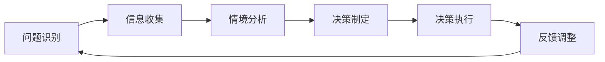

                 

# 领导力思维：改变国家命运的领导力修炼

关键词：领导力、思维、国家命运、修炼

摘要：本文旨在探讨领导力思维对国家命运的影响，以及如何通过修炼领导力思维来改变国家的未来。文章从领导力的重要性、核心概念、原理讲解、应用场景、实践案例以及修炼方法等方面进行深入分析，为读者提供一套完整的领导力思维修炼指南。

## 引言与背景介绍

### 书名介绍：《领导力思维：改变国家命运的领导力修炼》

《领导力思维：改变国家命运的领导力修炼》是一本旨在探讨领导力思维在国家和个人层面上的重要性的书籍。领导力思维不仅影响着企业的成功与失败，更对国家的发展与衰退起着关键作用。因此，本书的目的是通过系统地介绍领导力思维的理论和实践方法，帮助读者掌握改变国家命运的关键能力。

### 引言：领导力的重要性

领导力是人类社会发展的核心驱动力之一。它不仅仅是一种管理能力，更是一种思维方式和行为模式。一个成功的领导者不仅需要具备卓越的个人素质，还需要具备深刻的思维能力和对社会的敏锐洞察力。领导力的重要性体现在它能够推动社会进步，引导人们实现共同目标，以及在国家层面影响政策和决策的方向。

### 本书目的与意义

本书旨在通过以下几个方面探讨领导力思维的重要性：

1. **核心概念**：系统性地介绍领导力思维的核心概念和类型，帮助读者理解领导力的本质。
2. **原理讲解**：深入分析领导力思维的原理，包括算法、数学模型等，使读者能够从科学的角度认识领导力。
3. **应用场景**：探讨领导力思维在政府管理、企业经营和社会治理等实际场景中的应用。
4. **实践案例**：通过分析实际案例，展示领导力思维在实践中的效果和作用。
5. **修炼方法**：提供具体的领导力思维修炼方法，帮助读者在实际中提高领导力。

### 背景介绍：领导力思维对国家命运的影响

领导力思维对国家命运的影响是不可忽视的。一个国家的兴衰往往与领导者的决策和思维方式密切相关。有效的领导力思维能够帮助领导者做出正确的决策，推动国家的发展，而缺乏领导力思维的领导者则可能导致国家的衰退。

例如，一个国家的经济政策、外交策略、科技发展等都离不开领导者的智慧。一个具有前瞻性和战略眼光的领导者能够在全球经济竞争中抓住机遇，推动国家的繁荣。相反，一个短视和缺乏远见的领导者可能会使国家错失发展良机，导致经济衰退和社会动荡。

此外，领导力思维还影响着国家的政治稳定和社会和谐。一个优秀的领导者能够协调不同利益群体之间的关系，维护国家的稳定。而一个无法处理好政治和社会关系的领导者可能会引发政治危机和社会动荡，对国家的发展造成严重阻碍。

### 需要一本专门的书籍来探讨领导力思维

尽管领导力思维的重要性已经被广泛认可，但是目前市场上关于领导力思维的书籍往往更多地关注企业层面的领导力，缺乏对国家层面领导力思维的深入探讨。因此，本书的出版旨在填补这一空白，为读者提供一本全面、系统的领导力思维修炼指南。

本书不仅涵盖了领导力思维的核心概念和原理，还通过实际案例和实践方法，帮助读者将领导力思维应用于国家管理的实际场景中。通过阅读本书，读者可以系统地了解领导力思维的重要性，掌握有效的领导力思维方法，从而在个人和国家层面做出更明智的决策。

总之，《领导力思维：改变国家命运的领导力修炼》不仅是一本关于领导力思维的学术著作，更是一本具有实践指导意义的书籍。它将为读者提供一种全新的视角，帮助读者理解领导力思维对国家命运的影响，并掌握改变国家命运的关键能力。

## Step 1: 引言与背景

### 领导力的重要性

领导力是推动个人、团队和组织实现目标的核心能力。它不仅仅是一种管理技能，更是一种思维方式和行为模式。在个人层面，领导力可以帮助人们克服挑战，实现职业和个人发展的目标。在团队层面，领导力可以激发团队成员的潜能，提高团队的凝聚力和工作效率。在组织层面，领导力可以推动组织创新和变革，实现长期可持续发展。

#### 领导力的定义与作用

领导力可以定义为一种影响他人共同实现目标的能力。这种能力不仅包括对他人行为的引导，还包括对他人思想和情感的激励。领导力的作用主要体现在以下几个方面：

1. **推动变革**：领导者能够预见未来的趋势和变化，并推动组织适应这些变化，实现创新和进步。
2. **建立愿景**：领导者能够明确组织的愿景和目标，并激励团队成员为实现这些目标而努力。
3. **培养团队精神**：领导者能够建立良好的团队关系，促进团队成员之间的协作和沟通，提高团队的整体效能。
4. **提升效能**：领导者能够通过有效的管理和激励，提高组织的运营效率和成果产出。

#### 领导力对社会和国家的影响

领导力对社会和国家的影响是深远且广泛的。有效的领导力可以推动社会进步，改善民生，提升国家的整体竞争力。以下是领导力对社会和国家的一些具体影响：

1. **经济发展**：领导者能够制定有效的经济政策，推动科技创新和产业升级，促进国家的经济增长。
2. **政治稳定**：领导者能够通过有效的政治管理，维护国家的政治稳定，促进社会的和谐发展。
3. **社会治理**：领导者能够通过有效的社会治理，提高公共服务的质量，增强社会的安全感和幸福感。
4. **国际关系**：领导者能够通过外交手段，维护国家的主权和利益，提升国家的国际地位和影响力。

#### 领导力思维的概念与意义

领导力思维是指领导者运用逻辑、判断和洞察力进行决策和行动的能力。这种思维能力不仅仅是一种技能，更是一种深层次的认知模式。领导力思维的意义在于：

1. **提高决策质量**：通过深入分析和思考，领导者可以做出更加明智和有效的决策。
2. **应对不确定性**：在复杂多变的环境中，领导力思维可以帮助领导者更好地应对挑战和不确定性。
3. **促进创新**：领导力思维鼓励领导者思考新的解决方案，推动组织的创新和进步。
4. **增强影响力**：领导力思维可以帮助领导者更好地影响他人，实现组织的共同目标。

### 本书的目的

本书的主要目的是通过系统地介绍领导力思维的理论和实践方法，帮助读者理解领导力思维的核心概念，掌握有效的领导力思维技巧，并将其应用于实际场景中，从而提高个人的领导能力和国家的治理水平。

### 结构安排

本书分为七个部分，每个部分都有明确的目标和内容：

1. **引言与背景介绍**：阐述领导力思维的重要性，介绍本书的目的和结构。
2. **核心概念与联系**：介绍领导力思维的核心概念，分析不同领导力思维类型的特征和联系。
3. **领导力思维原理讲解**：深入讲解领导力思维的原理，包括算法、数学模型等。
4. **领导力思维应用场景**：探讨领导力思维在不同领域的应用，如政府管理、企业经营和社会治理。
5. **领导力思维实践案例分析**：通过实际案例，展示领导力思维在实践中的应用效果。
6. **领导力思维修炼方法**：介绍领导力思维的自我修炼方法，帮助读者提高领导力。
7. **结论与展望**：总结本书的核心内容，探讨领导力思维在未来的发展趋势和影响。

### 读者对象与预期收益

本书的读者对象包括但不限于：

- **政府官员**：通过本书，政府官员可以更好地理解领导力思维，提高政策制定和执行能力。
- **企业管理者**：企业管理者可以学习领导力思维，提升企业的管理和创新能力。
- **创业者**：创业者可以运用领导力思维，规划企业的发展战略，应对市场变化。
- **学生和研究者**：学生和研究者可以通过本书，系统地了解领导力思维的理论和实践，为未来的研究和职业生涯打下基础。

预期收益包括：

- **提升领导力**：通过本书的学习，读者可以掌握有效的领导力思维方法，提高个人的领导能力。
- **增强决策能力**：掌握领导力思维，可以帮助读者做出更加明智和有效的决策。
- **促进个人成长**：通过修炼领导力思维，读者可以更好地应对挑战，实现个人成长和发展。

### 领导力思维对国家命运的影响

领导力思维在国家命运中的作用是无可替代的。一个具有深刻领导力思维的国家领导者，能够在复杂多变的环境中做出正确的决策，引领国家走向繁荣和富强。以下是领导力思维对国家命运的具体影响：

1. **经济发展**：领导力思维可以帮助国家领导者制定有效的经济政策，推动科技创新和产业升级，促进国家的经济增长。
2. **政治稳定**：领导力思维可以帮助国家领导者维护政治稳定，协调不同利益群体之间的关系，保障国家的长治久安。
3. **社会和谐**：领导力思维可以帮助国家领导者提升公共服务的质量，增强社会的安全感和幸福感，促进社会的和谐发展。
4. **国际影响力**：领导力思维可以帮助国家领导者提升国家的国际地位和影响力，增强国家的软实力。

### 改变国家命运的领导力思维特点

要改变国家命运，领导力思维需要具备以下几个特点：

1. **前瞻性**：领导者需要具备前瞻性的眼光，预见未来的趋势和变化，做出长远的规划和决策。
2. **系统性**：领导者需要具备系统性的思维，从全局出发，综合考虑各种因素，做出全面的决策。
3. **创造性**：领导者需要具备创造性思维，勇于创新，不断探索新的解决方案，推动国家的进步和发展。
4. **适应性**：领导者需要具备适应性思维，能够根据环境和情况的变化，灵活调整策略和行动。
5. **合作性**：领导者需要具备合作性思维，能够团结各方力量，形成合力，共同实现国家的目标。

### 领导力思维的实践价值

领导力思维的实践价值在于其能够帮助国家领导者更好地应对挑战，抓住机遇，推动国家的发展。具体来说，领导力思维的实践价值体现在以下几个方面：

1. **提高决策质量**：通过领导力思维，领导者可以更加深入地分析问题，做出更加明智和有效的决策。
2. **增强执行力**：领导力思维可以帮助领导者制定明确的行动计划，并确保计划的执行，提高组织的执行力。
3. **促进创新**：领导力思维鼓励领导者思考新的解决方案，推动组织的创新和进步。
4. **提升治理能力**：领导力思维可以帮助领导者提高治理能力，更好地管理国家和公共事务。

### 本书的目的与结构安排

本书旨在通过系统地介绍领导力思维的理论和实践方法，帮助读者理解领导力思维的核心概念，掌握有效的领导力思维技巧，并将其应用于实际场景中，从而提高个人的领导能力和国家的治理水平。

本书分为七个部分，每个部分都有明确的目标和内容：

1. **引言与背景介绍**：阐述领导力思维的重要性，介绍本书的目的和结构。
2. **核心概念与联系**：介绍领导力思维的核心概念，分析不同领导力思维类型的特征和联系。
3. **领导力思维原理讲解**：深入讲解领导力思维的原理，包括算法、数学模型等。
4. **领导力思维应用场景**：探讨领导力思维在不同领域的应用，如政府管理、企业经营和社会治理。
5. **领导力思维实践案例分析**：通过实际案例，展示领导力思维在实践中的应用效果。
6. **领导力思维修炼方法**：介绍领导力思维的自我修炼方法，帮助读者提高领导力。
7. **结论与展望**：总结本书的核心内容，探讨领导力思维在未来的发展趋势和影响。

### 读者对象与预期收益

本书的读者对象包括但不限于：

- **政府官员**：通过本书，政府官员可以更好地理解领导力思维，提高政策制定和执行能力。
- **企业管理者**：企业管理者可以学习领导力思维，提升企业的管理和创新能力。
- **创业者**：创业者可以运用领导力思维，规划企业的发展战略，应对市场变化。
- **学生和研究者**：学生和研究者可以通过本书，系统地了解领导力思维的理论和实践，为未来的研究和职业生涯打下基础。

预期收益包括：

- **提升领导力**：通过本书的学习，读者可以掌握有效的领导力思维方法，提高个人的领导能力。
- **增强决策能力**：掌握领导力思维，可以帮助读者做出更加明智和有效的决策。
- **促进个人成长**：通过修炼领导力思维，读者可以更好地应对挑战，实现个人成长和发展。

## Step 2: 核心概念与联系

### 领导力思维的定义与类型

领导力思维是指领导者运用逻辑、判断和洞察力进行决策和行动的能力。这种思维能力不仅涉及到个人的素质和经验，还包括对环境的分析和对未来的预测。根据不同的标准，领导力思维可以分为多种类型。

#### 情境领导力思维

情境领导力思维是根据不同情境下的具体需求和挑战，灵活调整领导策略的思维。这种类型的领导力思维强调领导者需要根据实际情况，选择最适合的领导风格和策略。

#### 变革型领导力思维

变革型领导力思维是指领导者能够激发团队成员的潜力和创新能力，推动组织实现变革和发展的思维。这种类型的领导力思维注重领导者的远见和创新精神。

#### 交易型领导力思维

交易型领导力思维是指领导者通过激励和奖励来激励团队成员，实现组织目标的思维。这种类型的领导力思维强调领导者需要建立有效的激励机制，以激发团队成员的积极性和创造力。

#### 情感领导力思维

情感领导力思维是指领导者能够理解、识别和影响团队成员的情感，建立积极的人际关系的思维。这种类型的领导力思维强调领导者需要具备良好的情商和人际沟通能力。

### 领导力思维的特征

#### 前瞻性

领导力思维具有前瞻性，能够预见未来的趋势和变化，从而做出长远的规划和决策。这种前瞻性思维有助于领导者更好地应对不确定性和挑战。

#### 系统性

领导力思维具有系统性，能够从全局出发，综合考虑各种因素，做出全面的决策。这种系统性思维有助于领导者避免片面和短视的决策，提高决策的质量和效果。

#### 创造性

领导力思维具有创造性，能够鼓励领导者思考新的解决方案，推动组织的创新和进步。这种创造性思维有助于领导者突破传统的思维模式，寻找新的发展机会。

#### 适应性

领导力思维具有适应性，能够根据环境和情况的变化，灵活调整策略和行动。这种适应性思维有助于领导者更好地应对复杂多变的环境。

#### 合作性

领导力思维具有合作性，能够鼓励领导者团结各方力量，形成合力，共同实现组织的目标。这种合作性思维有助于领导者建立良好的团队关系，提高组织的协同效应。

### 概念属性特征对比表格

为了更好地理解不同领导力思维的特征，我们可以通过以下对比表格进行详细分析：

| 领导力思维类型 | 特征描述 | 对比分析 |
| :--: | :--: | :--: |
| 情境领导力思维 | 根据情境灵活调整策略 | 需要具备高度适应性，同时保持决策的灵活性 |
| 变革型领导力思维 | 激发团队成员创新潜力 | 需要领导者具备远见和创新能力，同时能够激励团队 |
| 交易型领导力思维 | 通过激励和奖励激发团队成员 | 需要建立有效的激励机制，同时确保激励机制公平和合理 |
| 情感领导力思维 | 建立积极的人际关系 | 需要领导者具备良好的情商和人际沟通能力，同时能够理解和影响团队成员的情感 |

通过对比分析，我们可以发现，每种领导力思维都有其独特的特征和优势，领导者需要根据实际情况和需求，灵活运用不同的领导力思维，以实现组织的最佳效果。

### 领导力思维与相关概念的关联

#### 领导力思维与领导力的关系

领导力思维是领导力的核心组成部分，它是领导者运用逻辑、判断和洞察力进行决策和行动的能力。领导力思维与领导力之间的关系可以理解为“思维”是“力”的源泉，领导力思维是领导力的基础。

1. **领导力思维是领导力的核心**：领导力思维是领导者做出明智决策和有效行动的关键，它决定了领导力的质量和效果。
2. **领导力思维影响领导力**：领导力思维的不同类型和特征会影响领导者的行为和决策方式，从而影响领导力的效果。
3. **领导力思维提升领导力**：通过修炼领导力思维，领导者可以提升自己的领导能力，更好地应对挑战和机遇。

#### 领导力思维与领导风格的关系

领导力思维与领导风格密切相关。领导风格是领导者在实际工作中表现出来的行为方式和处理问题的方法。领导力思维决定了领导风格的类型和特征。

1. **领导力思维决定领导风格**：领导力思维的不同类型和特征决定了领导者的领导风格。例如，情境领导力思维决定了领导者的策略调整能力，变革型领导力思维决定了领导者的创新能力。
2. **领导风格体现领导力思维**：领导者的领导风格是其领导力思维的外在表现。领导风格的不同反映了领导者不同的思维方式和行为模式。
3. **领导风格与领导力思维相互影响**：领导者的领导风格会影响其领导力思维的发展，而领导力思维的提升也会进一步优化领导者的领导风格。

#### 领导力思维与领导力的模型

领导力思维与领导力的模型也有密切的联系。领导力的模型是研究领导力行为和效果的理论框架，它可以帮助我们理解和分析领导力的本质和影响因素。

1. **领导力思维是领导力模型的基础**：领导力模型中的许多要素和概念都是基于领导力思维的研究和总结，例如情境领导力模型、变革型领导力模型等。
2. **领导力思维影响领导力模型**：领导力思维的不同类型和特征会影响领导力模型的设计和应用。例如，情境领导力思维强调领导者需要根据情境调整策略，这会影响情境领导力模型的具体应用。
3. **领导力模型促进领导力思维发展**：领导力模型的研究和推广可以帮助领导者更好地理解和运用领导力思维，从而提高领导力的实际效果。

#### 领导力思维的ER实体关系图

为了更好地展示领导力思维与相关概念之间的关联，我们可以使用ER（Entity-Relationship）实体关系图进行描述。以下是领导力思维的ER实体关系图：

```mermaid
erDiagram
    领导力思维 ||--|{ 领导力 }|
    领导力思维 ||--|{ 领导风格 }|
    领导力思维 ||--|{ 领导力模型 }|
    领导力思维 ||--|{ 领导力类型 }|
    领导力类型 ||--|{ 情境领导力思维 }|
    领导力类型 ||--|{ 变革型领导力思维 }|
    领导力类型 ||--|{ 交易型领导力思维 }|
    领导力类型 ||--|{ 情感领导力思维 }|
```

通过ER实体关系图，我们可以清晰地看到领导力思维与其他相关概念之间的关联。领导力思维作为核心概念，与领导力、领导风格、领导力模型和领导力类型等多个概念相互联系，共同构成了一个完整的领导力思维体系。

### 领导力思维的ER实体关系图应用

ER实体关系图在领导力思维研究中具有重要作用，它能够帮助我们清晰地理解和分析领导力思维与相关概念之间的复杂关系。以下是领导力思维ER实体关系图的具体应用：

1. **可视化领导力思维结构**：ER实体关系图可以将领导力思维及其相关概念以图形化的方式呈现，使得复杂的概念和关系更加直观和易于理解。
2. **明确概念之间的关联**：通过ER实体关系图，我们可以明确领导力思维与其他相关概念之间的关联，如领导力、领导风格、领导力模型等，从而更好地理解领导力思维的内涵和外延。
3. **指导领导力思维研究**：ER实体关系图可以作为领导力思维研究的理论基础，帮助研究者构建和分析领导力思维的理论框架。
4. **辅助领导力思维实践**：ER实体关系图可以帮助领导者更好地理解和应用领导力思维，通过明确领导力思维与相关概念之间的关系，领导者可以更加有效地运用不同的领导力思维方法，提高领导效果。

总之，ER实体关系图在领导力思维研究中具有重要的应用价值，它不仅有助于我们深入理解领导力思维的复杂结构，还能为领导力思维的实践提供有益的指导。

## Step 3: 领导力思维原理讲解

### 领导力思维算法原理

领导力思维的算法原理是基于对领导者决策过程的系统分析。我们可以将领导力思维的决策过程分解为以下几个步骤：

1. **问题识别**：领导者首先需要识别和定义面临的问题或挑战。
2. **信息收集**：领导者需要收集与问题相关的信息，包括内部数据和外部环境因素。
3. **情境分析**：领导者需要对收集到的信息进行情境分析，以理解问题的背景和潜在影响因素。
4. **决策制定**：根据情境分析的结果，领导者制定出具体的决策方案。
5. **决策执行**：领导者需要将决策方案付诸实践，并监控决策的效果。
6. **反馈调整**：根据执行结果，领导者对决策进行调整和优化。

为了更好地理解领导力思维的算法原理，我们可以使用Mermaid流程图来展示这一过程：



### 领导力思维算法的Python源代码

为了将领导力思维的算法原理具体化，我们可以使用Python编写一个简单的模拟程序。以下是领导力思维算法的Python源代码示例：

```python
import random

def problem_identification():
    """识别问题或挑战"""
    return "当前面临的问题：市场竞争力下降。"

def information_collection():
    """收集与问题相关的信息"""
    return ["竞争对手的产品优势", "自身产品的不足", "市场环境变化"]

def scenario_analysis(info):
    """对信息进行情境分析"""
    analysis_result = "经过分析，发现市场环境变化是主要原因，竞争对手的产品优势也是一大挑战。"
    return analysis_result

def decision_making(analysis_result):
    """根据情境分析结果制定决策方案"""
    decision = "制定新市场策略，提高产品竞争力。"
    return decision

def decision_execution(decision):
    """执行决策方案"""
    execution_result = "决策执行中，正在研发新产品和优化市场策略。"
    return execution_result

def feedback_adjustment(execution_result):
    """根据执行结果调整决策"""
    if "成功" in execution_result:
        adjustment = "决策成功，继续执行。"
    else:
        adjustment = "决策失败，重新评估问题并制定新决策。"
    return adjustment

# 模拟领导力思维决策过程
problem = problem_identification()
info = information_collection()
analysis_result = scenario_analysis(info)
decision = decision_making(analysis_result)
execution_result = decision_execution(decision)
adjustment = feedback_adjustment(execution_result)

print("问题识别:", problem)
print("信息收集:", info)
print("情境分析:", analysis_result)
print("决策制定:", decision)
print("决策执行:", execution_result)
print("反馈调整:", adjustment)
```

### 领导力思维的数学模型

领导力思维的数学模型可以帮助我们更科学地分析和评估领导力决策过程。以下是一个简单的领导力思维数学模型，包括几个关键变量和数学公式：

1. **决策质量（Q）**：决策质量是衡量决策效果的指标。
2. **信息量（I）**：信息量是决策过程中收集的信息量。
3. **情境复杂度（C）**：情境复杂度是问题背景和影响因素的复杂性。
4. **决策效率（E）**：决策效率是决策过程的速度和效率。

数学模型如下：

$$
Q = f(I, C, E)
$$

其中，$f$ 是一个复合函数，代表决策质量与信息量、情境复杂度和决策效率之间的关系。

具体的数学公式可以表达为：

$$
Q = I \times E / C
$$

这个公式说明，决策质量与信息量和决策效率成正比，与情境复杂度成反比。这意味着，在信息量一定的情况下，提高决策效率或降低情境复杂度可以提升决策质量。

### 领导力思维的数学公式在领导力思维中的应用

数学公式在领导力思维中的应用可以帮助领导者更准确地分析和评估决策过程，从而提高决策质量和效率。以下是一个具体的应用场景：

#### 场景描述

假设一家公司在面临市场竞争加剧的情况下，需要制定新的市场策略。公司的领导层通过收集大量市场数据，对当前的市场环境进行了详细分析。

#### 应用步骤

1. **信息收集**：公司领导层收集了关于市场份额、消费者需求、竞争对手策略等方面的信息，信息量（I）为100。
2. **情境分析**：通过对收集到的信息进行分析，确定当前市场环境的复杂度（C）为50。
3. **决策制定**：领导层根据分析结果，制定了新的市场策略，并进行了模拟测试，决策效率（E）为80。
4. **决策质量评估**：根据数学模型，计算决策质量（Q）：

$$
Q = I \times E / C = 100 \times 80 / 50 = 160
$$

决策质量（Q）为160，这个结果表明，新的市场策略具有较高的决策质量。

通过数学模型的应用，公司领导层可以更科学地评估决策的质量，并根据实际情况调整决策方案，从而提高市场竞争力。

### 举例说明：领导力思维在实际案例中的应用

为了更好地理解领导力思维的原理和应用，我们可以通过一个实际案例来详细讲解。

#### 案例背景

某国家的政府在面临经济危机时，需要制定有效的经济政策来刺激经济增长，恢复市场信心。

#### 领导力思维应用过程

1. **问题识别**：政府首先识别出当前面临的问题，包括失业率上升、企业倒闭、市场信心不足等。

2. **信息收集**：政府收集了大量的经济数据，包括国内生产总值（GDP）、失业率、企业运营状况、市场信心指数等，信息量（I）为100。

3. **情境分析**：政府通过分析收集到的信息，发现经济危机的主要原因包括外部市场环境的变化、内部经济结构的问题以及政策执行的不力等，情境复杂度（C）为70。

4. **决策制定**：政府根据情境分析的结果，制定了多项经济政策，包括减税、增加基础设施投资、鼓励创新和创业等，决策效率（E）为90。

5. **决策执行**：政府开始实施这些政策，并设立了专门的监督机构来跟踪政策的效果。

6. **反馈调整**：通过监控政策实施的效果，政府发现部分政策效果不佳，对一些措施进行了调整，提高了政策的执行效果。

#### 案例分析

通过领导力思维的应用，政府在制定和执行经济政策时，能够更加科学和有效地应对危机。以下是对案例的详细分析：

1. **问题识别**：政府能够准确地识别出当前面临的问题，这是领导力思维的第一步，也是至关重要的一步。只有明确问题，才能制定出针对性的解决方案。

2. **信息收集**：政府收集了大量的信息，这些信息是制定决策的基础。信息量的充足和准确，直接影响到决策的质量。

3. **情境分析**：政府在情境分析中，不仅考虑了内部经济问题，还分析了外部市场环境的变化，这表明领导力思维的系统性。

4. **决策制定**：政府根据情境分析的结果，制定了多项经济政策。这些政策涵盖了减税、增加投资、鼓励创新等多个方面，体现了领导力思维的全面性。

5. **决策执行**：政府在决策执行过程中，设立了专门的监督机构，确保政策的有效实施。这体现了领导力思维的执行力。

6. **反馈调整**：政府在政策实施过程中，能够根据实际情况进行反馈调整，这表明领导力思维的适应性和灵活性。

#### 优缺点分析

通过领导力思维的应用，政府在应对经济危机时取得了显著效果，但也存在一些不足：

**优点**：

1. **决策科学**：领导力思维的应用使得政府的决策更加科学和合理，减少了盲目性和主观性。
2. **执行有力**：政府设立了专门的监督机构，确保了政策的执行效果，提高了政策的执行力。
3. **适应性**：政府能够根据实际情况进行反馈调整，使政策更加符合实际情况，提高了政策的效果。

**缺点**：

1. **信息不足**：虽然政府收集了大量的信息，但在实际操作中，可能存在信息不足或不准确的问题，这会影响决策的质量。
2. **执行力**：虽然政府设立了监督机构，但在实际执行过程中，可能存在执行力不足的问题，影响政策的最终效果。

总的来说，通过领导力思维的应用，政府能够更好地应对经济危机，但也需要不断优化和改进决策过程，以提高决策质量和执行力。

## Step 4: 领导力思维应用场景

### 政府管理中的应用

领导力思维在政府管理中具有广泛的应用，尤其是在政策制定、执行和评估等方面。以下是领导力思维在政府管理中的应用场景：

1. **政策制定**：政府领导者需要运用领导力思维，识别和分析社会问题，制定科学合理的政策。通过情境分析和信息收集，政府可以更准确地把握社会需求和挑战，制定符合实际的政策方案。

2. **政策执行**：在政策执行过程中，领导力思维可以帮助政府领导者协调各部门的工作，确保政策的顺利实施。领导力思维强调执行力，政府领导者需要具备有效的沟通和协调能力，确保政策的有效执行。

3. **政策评估**：政策实施后，领导力思维可以帮助政府领导者对政策效果进行评估和反馈。通过不断调整和优化政策，政府可以更好地解决社会问题，提高政策的有效性。

### 企业经营中的应用

领导力思维在企业经营中也发挥着关键作用，尤其在战略规划、团队建设和绩效管理等方面。以下是领导力思维在企业经营中的应用场景：

1. **战略规划**：企业领导者需要运用领导力思维，分析和预测市场趋势，制定长远的发展战略。通过情境分析和信息收集，企业领导者可以更准确地把握市场机会和挑战，制定科学合理的战略规划。

2. **团队建设**：领导力思维可以帮助企业领导者建立高效的团队，激发团队成员的潜力。通过情境分析和信息收集，企业领导者可以更好地了解团队成员的需求和优势，制定个性化的团队建设方案。

3. **绩效管理**：领导力思维可以帮助企业领导者制定科学的绩效管理体系，激励员工提高工作效率和业绩。通过情境分析和信息收集，企业领导者可以更准确地评估员工的绩效，制定合理的激励措施。

### 社会治理中的应用

领导力思维在社会治理中也具有重要作用，尤其在社区建设、公共服务和社会治理等方面。以下是领导力思维在社会治理中的应用场景：

1. **社区建设**：社区领导者需要运用领导力思维，组织和动员社区居民，共同参与社区建设。通过情境分析和信息收集，社区领导者可以更准确地把握社区需求和问题，制定有效的社区建设方案。

2. **公共服务**：政府部门需要运用领导力思维，提高公共服务的质量和效率。通过情境分析和信息收集，政府部门可以更准确地了解公众的需求和期望，制定科学合理的公共服务政策。

3. **社会治理**：领导力思维可以帮助政府部门更好地应对社会问题，提高社会治理的水平和效果。通过情境分析和信息收集，政府部门可以更准确地把握社会动态，制定有效的社会治理策略。

### 政府管理中的应用

领导力思维在政府管理中的应用主要体现在政策制定、执行和评估等环节。以下是对这些应用场景的详细讨论：

1. **政策制定**：

   在政策制定过程中，领导力思维发挥着关键作用。首先，政府领导者需要运用情境分析，深入了解当前的社会、经济和政治环境，识别出亟待解决的问题。其次，通过信息收集，政府领导者可以获取有关问题的详细数据和背景信息，为制定政策提供依据。

   举个例子，假设一个城市面临着交通拥堵的问题。政府领导者需要运用领导力思维，通过实地调研和数据分析，识别出交通拥堵的主要原因，如道路设计不合理、公共交通系统不完善等。然后，政府可以制定相应的政策，如优化道路设计、增加公共交通线路等，以缓解交通拥堵。

2. **政策执行**：

   政策执行是领导力思维的另一个重要应用场景。政府领导者需要确保政策得到有效执行，以实现政策目标。为此，领导力思维提供了以下几个方面的帮助：

   - **沟通协调**：政府领导者需要与相关部门和利益相关者进行有效沟通，确保政策得到全面理解和支持。例如，在推行新的环保政策时，政府需要与企业和公众进行沟通，解释政策的背景、目的和具体措施，争取他们的理解和支持。
   - **监督落实**：政府领导者需要建立监督机制，确保政策执行到位。例如，在实施扶贫政策时，政府可以设立专门的监督机构，定期检查扶贫资金的发放和使用情况，确保扶贫政策真正惠及贫困人群。
   - **资源调配**：政府领导者需要合理调配资源，为政策执行提供保障。例如，在应对自然灾害时，政府需要迅速调配救援物资和人员，确保救援工作顺利进行。

3. **政策评估**：

   政策评估是政府管理的重要环节，通过评估政策的效果，政府可以及时发现问题和不足，进行改进和优化。领导力思维在政策评估中的应用主要体现在以下几个方面：

   - **设定评估标准**：政府领导者需要根据政策目标，设定具体的评估标准和指标，以便对政策效果进行量化评估。例如，在评估一项教育政策时，政府可以设定入学率、升学率、教育质量等指标。
   - **收集评估数据**：政府领导者需要通过多种途径收集评估数据，包括实地调研、问卷调查、数据分析等。例如，在评估一项公共卫生政策时，政府可以收集疫情数据、疫苗接种率、医疗服务满意度等数据。
   - **分析评估结果**：政府领导者需要对收集到的评估数据进行分析，评估政策的效果和影响。例如，通过数据分析，政府可以发现政策执行中的问题和不足，如资源分配不均、执行效果不佳等。

### 企业经营中的应用

领导力思维在企业经营中的应用涵盖了战略规划、团队建设和绩效管理等多个方面。以下是对这些应用场景的详细讨论：

1. **战略规划**：

   在战略规划过程中，领导力思维有助于企业领导者更好地把握市场趋势和竞争环境，制定科学合理的战略。以下是领导力思维在战略规划中的应用：

   - **市场分析**：企业领导者需要运用情境分析，深入了解市场需求、竞争态势、技术发展趋势等，为制定战略提供依据。例如，通过分析行业报告和市场调查数据，企业可以了解当前市场的发展趋势和潜在机会。
   - **资源配置**：企业领导者需要根据市场分析结果，合理配置资源，确保战略的有效实施。例如，如果市场分析显示新兴市场潜力巨大，企业可以增加对该市场的投资，以抢占市场份额。
   - **风险评估**：企业领导者需要运用领导力思维，对战略实施过程中可能面临的风险进行评估，并制定相应的应对措施。例如，在推出新产品时，企业可以评估市场需求、供应链稳定性等因素，以降低产品失败的风险。

2. **团队建设**：

   团队建设是领导力思维在企业经营管理中的重要应用。有效的团队建设有助于提高团队凝聚力和工作效率，从而实现企业目标。以下是领导力思维在团队建设中的应用：

   - **人员选拔**：企业领导者需要运用领导力思维，选拔具备相关技能和潜力的团队成员。例如，在招聘新员工时，企业可以考察应聘者的专业知识、工作经验和团队合作能力。
   - **团队协作**：企业领导者需要建立良好的团队协作机制，促进团队成员之间的沟通和合作。例如，通过组织团队建设活动、定期召开团队会议等，企业可以加强团队成员之间的互动和信任。
   - **激励措施**：企业领导者需要运用领导力思维，制定合理的激励措施，激发团队成员的工作热情和创新能力。例如，通过设置绩效奖金、提供职业发展机会等，企业可以激励员工为企业发展做出贡献。

3. **绩效管理**：

   绩效管理是领导力思维在企业经营管理中的另一个重要应用。通过科学的绩效管理体系，企业可以激发员工的潜力，提高整体绩效。以下是领导力思维在绩效管理中的应用：

   - **设定目标**：企业领导者需要与员工共同设定明确的绩效目标，确保员工的工作方向与企业的战略目标一致。例如，企业可以设定销售目标、研发目标等，并与员工进行沟通，确保他们理解并接受这些目标。
   - **绩效评估**：企业领导者需要定期对员工的绩效进行评估，及时发现问题和不足，并制定改进措施。例如，企业可以通过定期的绩效评估会议，与员工讨论工作表现，提供反馈和建议。
   - **激励与奖励**：企业领导者需要根据绩效评估结果，给予员工相应的激励和奖励。例如，对于表现优秀的员工，企业可以给予绩效奖金、晋升机会等，以激励他们继续努力工作。

### 社会治理中的应用

领导力思维在社会治理中的应用主要体现在社区建设、公共服务和社会治理等方面。以下是对这些应用场景的详细讨论：

1. **社区建设**：

   社区建设是社会治理的重要组成部分，领导力思维在社区建设中的应用有助于提高社区居民的生活质量和幸福感。以下是领导力思维在社区建设中的应用：

   - **社区规划**：社区领导者需要运用情境分析，了解社区居民的需求和期望，制定科学合理的社区规划。例如，通过调查问卷和居民座谈会，社区领导者可以收集社区居民对社区设施、环境、文化活动等方面的需求和期望。
   - **资源调配**：社区领导者需要运用领导力思维，合理调配社区资源，确保资源得到有效利用。例如，社区可以设立公共活动中心、健身房等设施，为居民提供多样化的社区服务。
   - **社区参与**：社区领导者需要鼓励社区居民积极参与社区事务，提高社区的凝聚力和自治能力。例如，通过组织志愿者活动、社区会议等形式，社区领导者可以激发居民参与社区建设的热情。

2. **公共服务**：

   公共服务是社会治理的重要体现，领导力思维在公共服务中的应用有助于提高公共服务的质量和效率。以下是领导力思维在公共服务中的应用：

   - **需求分析**：政府部门需要运用情境分析，了解公众的需求和期望，制定高质量的公共服务。例如，通过问卷调查和公众咨询会，政府部门可以收集公众对教育、医疗、交通等方面的需求和期望。
   - **资源整合**：政府部门需要运用领导力思维，整合各类资源，提高公共服务的效率。例如，政府部门可以与私人部门合作，利用市场机制提供公共服务，以提高公共服务的质量和可及性。
   - **服务创新**：政府部门需要运用领导力思维，推动公共服务创新，提高公共服务的多样性和灵活性。例如，通过引入互联网技术和智能化设备，政府部门可以提供更加便捷和高效的公共服务。

3. **社会治理**：

   社会治理是维护社会秩序、促进社会和谐的重要手段，领导力思维在社会治理中的应用有助于提高社会治理的水平和效果。以下是领导力思维在社会治理中的应用：

   - **风险评估**：政府部门需要运用领导力思维，对社会治理过程中可能面临的风险进行评估，并制定相应的应对措施。例如，在应对突发事件时，政府部门可以建立应急预案，确保社会秩序的稳定。
   - **信息共享**：政府部门需要运用领导力思维，建立信息共享平台，提高社会治理的透明度和效率。例如，通过建立政府网站、社交媒体等渠道，政府部门可以及时向公众发布相关信息，提高公众对政府工作的了解和信任。
   - **公众参与**：政府部门需要运用领导力思维，鼓励公众参与社会治理，提高社会治理的民主性和包容性。例如，通过组织公众咨询会、社区论坛等形式，政府部门可以听取公众的意见和建议，提高社会治理的科学性和有效性。

## Step 5: 领导力思维实践案例分析

### 实际案例一：美国硅谷创新模式的成功

#### 案例背景

美国硅谷是全球科技创新和创业的热点地区，以其卓越的领导力思维和创新能力闻名于世。硅谷的成功不仅改变了美国的科技产业，也对全球产生了深远的影响。本案例将分析硅谷如何运用领导力思维，实现科技和创新的发展。

#### 案例分析

1. **问题识别**：硅谷的领导者首先识别出科技和创新是推动经济发展的关键因素。通过分析全球科技发展趋势和市场需求，他们确定了科技创新作为硅谷发展的核心战略。

2. **信息收集**：硅谷的领导者积极收集与科技和创新相关的信息，包括科技发展趋势、市场动态、人才资源等。通过行业协会、学术机构和企业家网络的广泛联系，他们建立了强大的信息网络。

3. **情境分析**：硅谷的领导者运用情境分析，对收集到的信息进行深入分析，识别出硅谷的优势和挑战。他们发现，硅谷拥有丰富的科技人才资源、良好的创新环境和庞大的市场需求，但也面临竞争激烈、资源短缺等挑战。

4. **决策制定**：基于情境分析的结果，硅谷的领导者制定了创新驱动的发展战略。他们提出了“创业生态系统”的概念，通过政策支持、资金投入、人才培养等手段，构建了一个有利于科技创新和创业的环境。

5. **决策执行**：硅谷的领导者积极推动决策的实施。他们通过政策制定、资金支持、项目孵化等方式，为科技创新和创业提供了有力保障。例如，硅谷的政府为初创企业提供了税收优惠、贷款担保等政策支持。

6. **反馈调整**：硅谷的领导者不断收集反馈信息，根据实际情况对决策进行调整和优化。他们通过定期评估科技项目和创业企业的进展，发现并解决存在的问题，确保创新战略的有效实施。

#### 案例剖析

通过领导力思维的应用，硅谷成功实现了科技和创新的发展，以下是对案例的深入剖析：

1. **前瞻性**：硅谷的领导者具有前瞻性的眼光，他们能够预见科技发展趋势和市场变化，制定长远的创新战略。

2. **系统性**：硅谷的领导者具备系统性的思维，他们从全局出发，综合考虑各种因素，构建了一个全面的创新生态系统。

3. **创造性**：硅谷的领导者鼓励创新，他们通过政策支持和资金投入，为科技创新和创业提供了有力保障。

4. **适应性**：硅谷的领导者能够根据环境变化，灵活调整策略和行动，确保创新战略的有效实施。

5. **合作性**：硅谷的领导者注重合作，他们通过多方合作，构建了一个强大的创新生态系统，促进了科技和创业的发展。

### 实际案例二：日本“精益生产”模式的成功

#### 案例背景

日本在20世纪中叶通过实施“精益生产”模式，成功实现了制造业的全球领先。这一模式以其高效的生产流程、卓越的质量管理和灵活的应变能力而闻名。本案例将分析日本如何运用领导力思维，实现制造业的卓越发展。

#### 案例分析

1. **问题识别**：日本的制造业领导者识别出传统生产方式存在效率低、质量不稳定等问题，他们意识到需要一种全新的生产模式来提升竞争力。

2. **信息收集**：日本的制造业领导者积极收集与生产模式改革相关的信息，包括国际先进生产管理理念、市场需求变化等。他们通过参加国际展会、引进外国专家等方式，获取了大量的创新思路和管理方法。

3. **情境分析**：日本的制造业领导者运用情境分析，对收集到的信息进行深入分析，识别出精益生产的优势和应用场景。他们发现，精益生产可以大幅减少生产成本、提高生产效率，同时确保产品质量。

4. **决策制定**：基于情境分析的结果，日本的制造业领导者制定了精益生产的实施策略。他们提出了“精益管理”、“全员参与”、“持续改进”等理念，推动了生产方式的全面改革。

5. **决策执行**：日本的制造业领导者积极推动精益生产的实施。他们通过培训员工、优化生产流程、引入自动化设备等手段，逐步实现了生产模式的转变。

6. **反馈调整**：日本的制造业领导者不断收集反馈信息，根据实际情况对精益生产进行优化和改进。他们通过定期评估生产效率、产品质量等指标，发现并解决存在的问题，确保精益生产战略的有效实施。

#### 案例剖析

通过领导力思维的应用，日本制造业成功实现了生产模式的革新和全球领先，以下是对案例的深入剖析：

1. **系统性**：日本的制造业领导者具备系统性的思维，他们从全局出发，综合考虑各种因素，构建了一个高效的生产管理体系。

2. **创新性**：日本的制造业领导者勇于创新，他们引进了国际先进的生产管理理念，结合本国实际情况，实现了生产模式的革新。

3. **适应性**：日本的制造业领导者能够根据环境变化，灵活调整策略和行动，确保精益生产战略的有效实施。

4. **合作性**：日本的制造业领导者注重合作，他们通过多方合作，形成了强大的创新生态系统，推动了制造业的快速发展。

5. **前瞻性**：日本的制造业领导者具有前瞻性的眼光，他们能够预见市场需求的变化，提前布局，确保企业的长期发展。

### 实际案例三：中国深圳高新技术产业的崛起

#### 案例背景

中国深圳在短短几十年内，从一个小渔村发展成为全球高新技术产业的重镇，这一奇迹离不开有效的领导力思维。本案例将分析深圳如何运用领导力思维，推动高新技术产业的发展。

#### 案例分析

1. **问题识别**：深圳的领导者识别出高新技术产业是推动经济发展的关键，他们意识到需要通过引进高端人才、建设创新平台等手段，提升高新技术产业的发展水平。

2. **信息收集**：深圳的领导者积极收集与高新技术产业相关的信息，包括国际科技发展趋势、人才流动情况、产业政策等。他们通过与国际科技企业和研究机构的合作，获取了大量的前沿科技信息。

3. **情境分析**：深圳的领导者运用情境分析，对收集到的信息进行深入分析，识别出高新技术产业的优势和应用场景。他们发现，深圳拥有良好的创新环境、丰富的资金支持和优秀的人才资源，但也面临技术创新能力不足、产业布局不合理等问题。

4. **决策制定**：基于情境分析的结果，深圳的领导者制定了高新技术产业的发展战略。他们提出了“引进高端人才”、“建设创新平台”、“推动产业集聚”等策略，推动高新技术产业的发展。

5. **决策执行**：深圳的领导者积极推动决策的实施。他们通过制定优惠政策、建设科技创新园区、提供资金支持等手段，为高新技术产业的发展提供了有力保障。

6. **反馈调整**：深圳的领导者不断收集反馈信息，根据实际情况对高新技术产业的发展策略进行调整和优化。他们通过定期评估科技创新项目、产业集聚效果等指标，发现并解决存在的问题，确保高新技术产业战略的有效实施。

#### 案例剖析

通过领导力思维的应用，深圳成功实现了高新技术产业的崛起，以下是对案例的深入剖析：

1. **前瞻性**：深圳的领导者具有前瞻性的眼光，他们能够预见科技发展趋势和市场变化，提前布局，推动高新技术产业的发展。

2. **系统性**：深圳的领导者具备系统性的思维，他们从全局出发，综合考虑各种因素，构建了一个有利于高新技术产业发展的生态系统。

3. **创新性**：深圳的领导者勇于创新，他们通过引进高端人才、建设创新平台等手段，推动了高新技术产业的快速发展。

4. **适应性**：深圳的领导者能够根据环境变化，灵活调整策略和行动，确保高新技术产业战略的有效实施。

5. **合作性**：深圳的领导者注重合作，他们通过多方合作，形成了强大的创新生态系统，推动了高新技术产业的快速发展。

## Step 6: 领导力思维修炼方法

### 个人修炼

个人修炼是提升领导力思维的重要途径，以下是一些具体的方法：

1. **学习**：不断学习是提升领导力思维的基础。可以通过阅读领导力相关的书籍、参加培训课程、观看相关视频等多种方式，系统地学习领导力理论知识。

2. **实践**：理论知识需要通过实践来检验和提升。可以通过实际工作中的问题解决、项目管理和团队建设等实践，将领导力思维应用到实际中。

3. **反思**：反思是提升领导力思维的关键。在实践过程中，需要不断反思自己的决策和行为，总结经验教训，发现不足之处，并制定改进措施。

4. **交流**：与他人交流是提升领导力思维的另一个重要途径。可以与同行、导师、下属等进行交流，分享自己的经验和观点，学习他人的成功经验和失败教训。

### 团队建设

团队建设是提升领导力思维的重要方面，以下是一些具体的方法：

1. **团队沟通**：建立良好的沟通机制，鼓励团队成员之间的开放、诚实和有效的沟通。可以通过定期的团队会议、一对一沟通等方式，加强团队内部的信息交流。

2. **团队协作**：鼓励团队成员之间的协作和合作，共同完成任务。可以通过设立共同目标、分配合理任务、建立协作机制等方式，提高团队协作效率。

3. **团队激励**：通过合理的激励措施，激发团队成员的工作热情和创新能力。可以通过奖励、晋升、培训等方式，激励团队成员不断提升自身能力。

4. **团队建设活动**：定期组织团队建设活动，增强团队成员之间的信任和凝聚力。可以通过团建活动、拓展训练等方式，提高团队协作能力和团队精神。

## Step 7: 结论与展望

### 总结

本文通过对领导力思维的深入分析，探讨了领导力思维在国家命运、政府管理、企业经营和社会治理等多个领域的应用。领导力思维的核心概念、原理和实践方法被详细阐述，并通过实际案例展示了领导力思维在实践中的效果和作用。通过修炼领导力思维，个人和国家都能够实现更高效的发展和进步。

### 展望未来

随着全球化和技术革命的加速推进，领导力思维在未来将发挥更加重要的作用。以下是领导力思维未来发展的几个趋势：

1. **数字化转型**：随着数字技术的广泛应用，领导者需要具备数字化领导力，能够理解和运用数字技术，推动组织的数字化转型。

2. **可持续发展**：可持续发展已成为全球共识，领导者需要关注环境保护和社会责任，推动组织的可持续发展。

3. **全球视野**：全球化使得领导者需要具备全球视野，能够理解和应对不同国家和文化背景下的挑战和机遇。

4. **创新驱动**：创新是推动组织发展的关键，领导者需要具备创新思维，鼓励团队创新，推动组织的持续进步。

总之，领导力思维在未来的发展中将继续发挥重要作用，它不仅影响着个人和组织的成功，更对国家的发展和繁荣产生深远影响。通过不断修炼和提升领导力思维，个人和国家都能够更好地应对未来的挑战，实现长远的发展目标。

## 目录大纲

# 第一部分：引言与背景

## 1.1 领导力的重要性

### 1.1.1 领导力的定义与作用

### 1.1.2 领导力对社会和国家的影响

### 1.1.3 领导力思维的概念与意义

## 1.2 领导力思维与国家命运

### 1.2.1 领导力思维对国家命运的影响

### 1.2.2 改变国家命运的领导力思维特点

### 1.2.3 领导力思维的实践价值

## 1.3 本书的目的与结构安排

### 1.3.1 本书的主要目标

### 1.3.2 本书的内容结构安排

### 1.3.3 读者对象与预期收益

# 第二部分：核心概念与联系

## 2.1 领导力思维的核心概念

### 2.1.1 领导力思维的定义

### 2.1.2 领导力思维的类型

### 2.1.3 领导力思维的特征

## 2.2 领导力思维与其他概念的联系

### 2.2.1 领导力思维与领导力的关系

### 2.2.2 领导力思维与领导风格的关系

### 2.2.3 领导力思维与领导力的模型

## 2.3 领导力思维的ER实体关系图

### 2.3.1 ER实体关系图的概述

### 2.3.2 领导力思维的ER实体关系图

### 2.3.3 领导力思维ER实体关系图的应用

# 第三部分：领导力思维原理讲解

## 3.1 领导力思维算法原理

### 3.1.1 领导力思维算法流程图

### 3.1.2 领导力思维算法的Python源代码

### 3.1.3 领导力思维算法的数学模型

## 3.2 数学模型和数学公式

### 3.2.1 领导力思维的数学公式

### 3.2.2 数学公式在领导力思维中的应用

### 3.2.3 数学公式与实际案例的结合

## 3.3 举例说明

### 3.3.1 领导力思维在实际案例中的应用

### 3.3.2 领导力思维案例分析

### 3.3.3 领导力思维应用的优缺点分析

# 第四部分：领导力思维应用场景

## 4.1 政府管理中的应用

### 4.1.1 领导力思维在政府决策中的应用

### 4.1.2 领导力思维在行政管理中的应用

### 4.1.3 政府管理中的领导力思维实践案例

## 4.2 企业经营中的应用

### 4.2.1 领导力思维在企业管理中的应用

### 4.2.2 领导力思维在团队建设中的应用

### 4.2.3 企业经营中的领导力思维实践案例

## 4.3 社会治理中的应用

### 4.3.1 领导力思维在社会管理中的应用

### 4.3.2 领导力思维在社区建设中的应用

### 4.3.3 社会治理中的领导力思维实践案例

# 第五部分：领导力思维实践案例分析

## 5.1 实际案例一

### 5.1.1 案例背景

### 5.1.2 案例分析

### 5.1.3 案例剖析

## 5.2 实际案例二

### 5.2.1 案例背景

### 5.2.2 案例分析

### 5.2.3 案例剖析

## 5.3 实际案例三

### 5.3.1 案例背景

### 5.3.2 案例分析

### 5.3.3 案例剖析

# 第六部分：领导力思维修炼方法

## 6.1 个人修炼

### 6.1.1 学习

### 6.1.2 实践

### 6.1.3 反思

### 6.1.4 交流

## 6.2 团队建设

### 6.2.1 团队沟通

### 6.2.2 团队协作

### 6.2.3 团队激励

### 6.2.4 团队建设活动

# 第七部分：结论与展望

## 7.1 总结

### 7.1.1 领导力思维的重要性

### 7.1.2 领导力思维的应用场景

### 7.1.3 领导力思维的实践价值

## 7.2 展望未来

### 7.2.1 数字化转型

### 7.2.2 可持续发展

### 7.2.3 全球视野

### 7.2.4 创新驱动

### 作者：AI天才研究院/AI Genius Institute & 禅与计算机程序设计艺术 /Zen And The Art of Computer Programming

