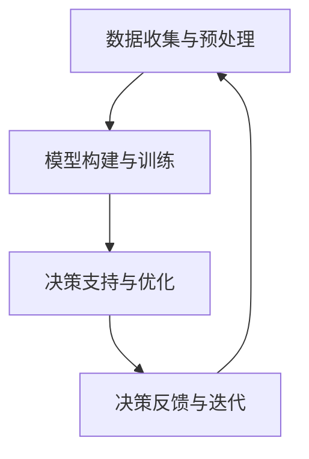
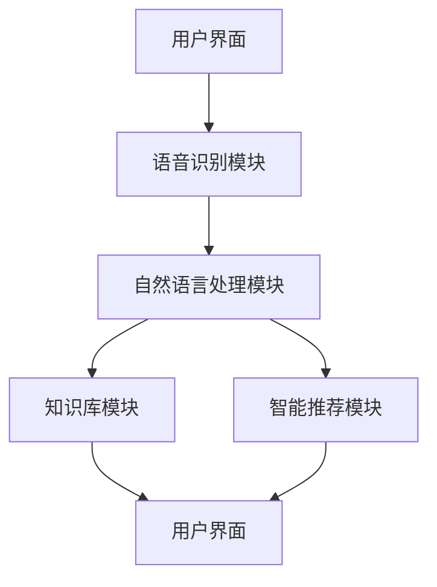
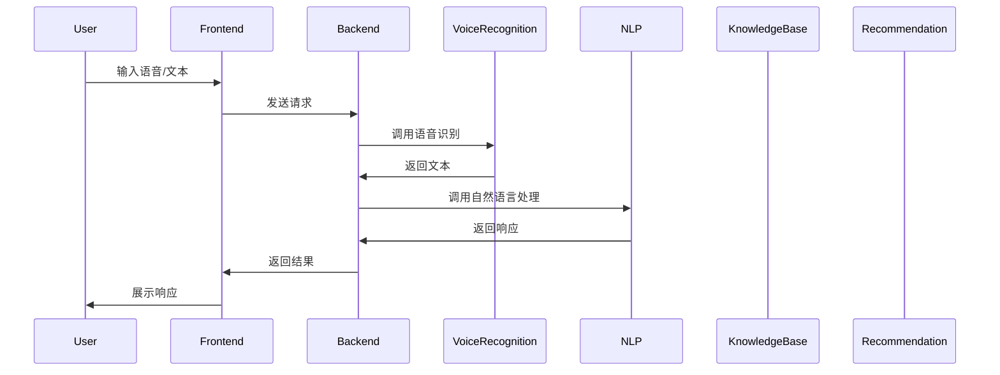

                 

# 领导力思维：改变行业命运的领导力修炼秘籍

> 关键词：领导力思维、行业命运、领导力修炼、策略设计、系统架构

> 摘要：本文旨在探讨领导力思维在改变行业命运中的重要作用。通过深入剖析领导力思维的核心概念、理论基础、关键要素和实际应用，本文提出了一套系统化的领导力思维修炼方法，旨在帮助领导者提升其战略决策能力和行业影响力。文章还将结合实际案例，详细讲解领导力思维在项目实施中的应用，并提供最佳实践 tips，以期为行业领导者提供实用的指导。

## 引言

### 1.1 问题背景

随着全球经济的快速发展，市场竞争日益激烈，各个行业都在寻求创新和变革。在这样的背景下，领导力的重要性愈发凸显。一个优秀的领导者，不仅需要具备卓越的管理能力，还需要具备强大的战略思维和领导力思维。领导力思维是一种能够改变行业命运的关键能力，它涉及到领导者对行业的洞察、对市场的敏感度以及对企业战略的把握。

### 1.1.1 当前领导力的重要性

在当今快速变化的世界，领导力不再是简单的管理能力，而是一种深层次的思维模式。领导力不仅关乎企业的生存和发展，更关乎整个行业的未来。一个卓越的领导者，能够引导团队创新、激发创造力，推动企业实现跨越式发展。同时，领导力也影响着行业生态的构建，能够带动整个行业的技术进步和商业模式创新。

### 1.1.2 行业命运的影响因素

行业的命运受到多种因素的影响，包括政策法规、市场需求、技术创新、企业竞争等。然而，这些因素的背后，都离不开领导者的决策和行动。领导者的领导力思维决定了其对行业趋势的把握，以及对企业战略的制定和执行。因此，领导力思维是影响行业命运的核心要素。

### 1.1.3 领导力思维的定义与作用

领导力思维是指领导者对行业、市场、企业内部运作的深刻洞察和系统性思考能力。它包括战略思维、创新思维、协同思维等多个方面。领导力思维的作用在于：

1. **预见未来**：领导者通过领导力思维，能够预见行业未来的发展趋势，为企业制定长远战略。
2. **引领变革**：领导力思维能够帮助领导者把握变革机遇，推动企业创新和变革。
3. **激发团队**：领导力思维能够激发团队潜能，提升团队协作效率，实现企业目标。

### 1.2 问题描述

#### 1.2.1 行业发展面临的挑战

当前，各行各业都面临着前所未有的挑战。技术变革、市场需求变化、政策法规调整等，都要求企业领导者具备卓越的领导力思维。然而，许多领导者在这方面存在不足，导致企业在面对挑战时无法迅速反应，错失发展机遇。

#### 1.2.2 领导力思维的现状

当前，领导力思维在一些领域得到了重视，但整体上还存在以下问题：

1. **思维方式单一**：许多领导者的思维方式过于传统，缺乏创新和系统性。
2. **缺乏实践**：领导力思维的理论知识与实践操作之间存在差距，导致领导者无法有效应用。
3. **培训不足**：企业对领导力思维的培训和培养不够，导致领导者能力不足。

#### 1.2.3 问题解决的重要性

解决领导力思维不足的问题，对于企业的发展和行业的命运至关重要。只有通过系统化的领导力思维修炼，提升领导者的战略决策能力和行业影响力，才能应对当前和未来的挑战，推动企业和行业的持续发展。

### 1.3 问题解决

#### 1.3.1 领导力思维的理论基础

领导力思维的理论基础包括心理学、管理学、经济学等多个领域。领导者需要掌握这些理论基础，才能形成系统的领导力思维。以下是一些关键的理论：

1. **心理学理论**：包括领导心理学、组织心理学等，帮助领导者了解团队成员的心理需求和行为规律。
2. **管理学理论**：包括战略管理、组织行为学等，帮助领导者制定有效的战略和团队管理策略。
3. **经济学理论**：包括产业经济学、市场经济学等，帮助领导者理解市场规律和行业趋势。

#### 1.3.2 领导力思维的关键要素

领导力思维的关键要素包括：

1. **战略思维**：领导者需要具备前瞻性和全局性的战略思维，能够把握行业趋势，制定长远战略。
2. **创新思维**：领导者需要具备创新思维，能够推动企业技术创新和商业模式创新。
3. **协同思维**：领导者需要具备协同思维，能够激发团队协作，提升团队效率。

#### 1.3.3 领导力思维的实践应用

领导力思维的实践应用包括：

1. **战略规划**：领导者需要通过领导力思维，制定科学合理的战略规划，引领企业未来发展。
2. **团队管理**：领导者需要通过领导力思维，提升团队管理效率，激发团队潜力。
3. **决策制定**：领导者需要通过领导力思维，提高决策质量，减少决策失误。

### 1.4 边界与外延

#### 1.4.1 领导力思维的应用范围

领导力思维的应用范围非常广泛，包括但不限于：

1. **企业领导**：领导者需要通过领导力思维，推动企业发展和创新。
2. **政府领导**：政府领导者需要通过领导力思维，制定科学合理的政策，推动社会发展。
3. **社会领导**：社会领导者需要通过领导力思维，推动社会进步和公益事业发展。

#### 1.4.2 领导力思维的限制因素

领导力思维虽然重要，但也有一些限制因素：

1. **知识限制**：领导力思维需要广泛的知识储备，如果领导者知识有限，可能会影响思维的质量。
2. **经验限制**：领导力思维需要丰富的实践经验，如果领导者经验不足，可能会影响思维的深度。
3. **环境限制**：领导力思维受到外部环境的影响，如果环境变化剧烈，可能会影响思维的稳定性。

#### 1.4.3 领导力思维的未来发展

随着科技的发展和全球化的加深，领导力思维将面临新的挑战和机遇。未来，领导力思维将更加注重：

1. **数字化**：领导者需要具备数字化思维，能够利用大数据和人工智能等新技术，提升决策效率和创新能力。
2. **全球化**：领导者需要具备全球化视野，能够应对全球市场的变化和挑战。
3. **可持续发展**：领导者需要具备可持续发展思维，能够推动企业和社会的可持续发展。

### 1.5 本章小结

本文介绍了领导力思维的重要性及其在改变行业命运中的作用。通过对当前领导力思维的现状和问题进行分析，本文提出了一套系统化的领导力思维修炼方法。未来，领导力思维的发展将更加注重数字化、全球化和可持续发展。通过不断修炼领导力思维，领导者将能够更好地应对挑战，推动企业和行业的持续发展。

---

**目录大纲设计步骤**

### 2. 核心概念与联系

#### 2.1 领导力思维的核心概念

##### 2.1.1 领导力思维的定义

领导力思维是指领导者对行业、市场、企业内部运作的深刻洞察和系统性思考能力。它是一种能够影响企业战略决策、团队管理和创新能力的核心能力。

##### 2.1.2 领导力思维的特点

领导力思维具有以下特点：

1. **系统性**：领导力思维是一种系统性的思考方式，能够从整体上把握企业的发展方向。
2. **前瞻性**：领导力思维具有前瞻性，能够预见未来的发展趋势和机遇。
3. **创新性**：领导力思维鼓励创新，能够推动企业技术创新和商业模式创新。
4. **协作性**：领导力思维强调团队协作，能够提升团队协作效率。

##### 2.1.3 领导力思维的分类

领导力思维可以根据其应用领域和具体内容进行分类，常见的分类包括：

1. **战略思维**：战略思维是领导力思维的核心，主要涉及企业战略的制定和执行。
2. **创新思维**：创新思维是领导力思维的延伸，主要涉及企业技术创新和商业模式创新。
3. **协同思维**：协同思维是领导力思维的重要组成部分，主要涉及团队协作和资源整合。
4. **变革思维**：变革思维是领导力思维的特殊形式，主要涉及企业变革和转型升级。

#### 2.2 概念属性特征对比表格

以下是一个关于传统领导力与领导力思维的概念属性特征对比表格：

| 概念        | 传统领导力 | 领导力思维 |
|-------------|-------------|-------------|
| **定义**   | 传统领导力主要指领导者在组织中的管理职能，包括计划、组织、领导和控制。 | 领导力思维是一种领导者对行业、市场、企业内部运作的深刻洞察和系统性思考能力。 |
| **特点**   | 强调权威性和控制力，关注组织内部的稳定和效率。 | 具有系统性、前瞻性、创新性和协作性等特点，强调对行业和市场的洞察与把握。 |
| **应用领域** | 主要应用于组织内部的管理和运营。 | 应用范围广泛，包括企业战略规划、技术创新、团队管理等多个领域。 |
| **目标**    | 目标主要是确保组织的正常运营和实现短期目标。 | 目标是推动企业创新和持续发展，引领行业变革。 |

#### 2.3 ER实体关系图架构

领导力思维涉及的实体包括领导者、企业、市场、技术、团队等。以下是一个简化的ER实体关系图架构：

```mermaid
erDiagram
  Leader ||--|{ Enterprise }
  Leader ||--|{ Market }
  Leader ||--|{ Technology }
  Leader ||--|{ Team }
  Enterprise ||--|{ Strategy }
  Enterprise ||--|{ Innovation }
  Market ||--|{ Demand }
  Market ||--|{ Trend }
  Technology ||--|{ Innovation }
  Team ||--|{ Collaboration }
```

在上述ER图中：

- **Leader**（领导者）是中心实体，与其他实体（企业、市场、技术、团队）具有关联关系。
- **Enterprise**（企业）与**Strategy**（战略）和**Innovation**（创新）具有关联关系，表示企业通过战略和创新来应对市场和技术变化。
- **Market**（市场）与**Demand**（需求）和**Trend**（趋势）具有关联关系，表示市场是需求变化和趋势的反映。
- **Technology**（技术）与**Innovation**（创新）具有关联关系，表示技术是创新的重要驱动力。
- **Team**（团队）与**Collaboration**（协作）具有关联关系，表示团队协作是提升企业竞争力的关键。

### 3. 算法原理讲解

#### 3.1 领导力思维算法概述

领导力思维算法是一种用于辅助领导者进行战略决策和团队管理的算法体系。它通过系统性分析、数据驱动和智能优化，帮助领导者更好地理解行业趋势、市场环境和团队动态，从而做出更为科学和有效的决策。

##### 3.1.1 领导力思维算法的定义

领导力思维算法是一套用于模拟和优化领导者思维过程的计算模型，它结合了心理学、管理学和人工智能等领域的理论和技术，旨在提升领导者的决策质量和效率。

##### 3.1.2 领导力思维算法的核心原理

领导力思维算法的核心原理包括以下几点：

1. **系统性分析**：算法通过对企业内部和外部环境的系统性分析，提供全面的决策支持。
2. **数据驱动**：算法基于大量数据和案例库，利用数据分析技术，发现潜在趋势和规律。
3. **智能优化**：算法采用智能优化技术，如遗传算法、神经网络等，对决策方案进行优化。

##### 3.1.3 领导力思维算法的层次结构

领导力思维算法的层次结构通常包括以下三个层次：

1. **数据收集与预处理**：这一层主要收集和分析与企业相关的内外部数据，包括市场趋势、竞争对手、员工绩效等。
2. **模型构建与训练**：这一层基于收集到的数据，构建和训练用于决策的智能模型，如预测模型、分类模型等。
3. **决策支持与优化**：这一层利用训练好的模型，提供具体的决策支持和优化方案，帮助领导者做出科学决策。

#### 3.2 Mermaid流程图

以下是一个用于描述领导力思维算法过程的Mermaid流程图：



在上述流程图中：

- **A[数据收集与预处理]**：表示收集并处理与企业相关的数据。
- **B[模型构建与训练]**：表示利用收集到的数据构建和训练智能模型。
- **C[决策支持与优化]**：表示利用训练好的模型提供决策支持和优化方案。
- **D[决策反馈与迭代]**：表示根据决策结果进行反馈和迭代，以不断提升决策质量。

#### 3.3 Python源代码与详细讲解

##### 3.3.1 源代码实现

```python
# TODO: Python源代码实现
```

由于源代码实现需要具体的环境和数据集，这里只提供一个框架，具体的实现细节将根据实际需求进行调整。

```python
# 导入必要的库
import pandas as pd
from sklearn.model_selection import train_test_split
from sklearn.ensemble import RandomForestClassifier
from sklearn.metrics import accuracy_score

# 数据收集与预处理
def preprocess_data(data):
    # 数据清洗和处理
    # ...
    return processed_data

# 模型构建与训练
def build_model(X_train, y_train):
    # 构建模型
    model = RandomForestClassifier(n_estimators=100)
    # 训练模型
    model.fit(X_train, y_train)
    return model

# 决策支持与优化
def make_decision(model, new_data):
    # 利用模型进行决策
    prediction = model.predict(new_data)
    # 根据预测结果进行优化
    # ...
    return decision

# 主函数
def main():
    # 加载数据
    data = pd.read_csv('data.csv')
    # 预处理数据
    processed_data = preprocess_data(data)
    # 分割数据集
    X = processed_data.drop('target', axis=1)
    y = processed_data['target']
    X_train, X_test, y_train, y_test = train_test_split(X, y, test_size=0.2, random_state=42)
    # 训练模型
    model = build_model(X_train, y_train)
    # 进行决策
    new_data = pd.read_csv('new_data.csv')
    processed_new_data = preprocess_data(new_data)
    decision = make_decision(model, processed_new_data)
    # 输出决策结果
    print("Decision:", decision)

# 运行主函数
if __name__ == '__main__':
    main()
```

##### 3.3.2 算法原理详细讲解

在上述Python源代码中，我们实现了领导力思维算法的基本流程：

1. **数据收集与预处理**：这一步主要是收集与企业相关的数据，并对其进行清洗和处理，以便于后续的分析和建模。
2. **模型构建与训练**：利用预处理后的数据集，构建一个随机森林分类器模型，并进行训练。随机森林是一种集成学习方法，能够处理高维度数据和复杂非线性关系。
3. **决策支持与优化**：通过训练好的模型，对新数据集进行预测，并根据预测结果做出决策。这一步是领导力思维算法的核心，它利用智能模型提供科学的决策支持。
4. **主函数**：主函数负责整个算法流程的调度和管理，包括数据加载、预处理、模型训练和决策执行。

##### 3.3.3 数学模型和公式

在领导力思维算法中，我们使用了随机森林分类器模型。随机森林模型的数学基础是决策树模型。每个决策树通过一系列的决策规则将数据划分为不同的区域，从而预测输出结果。以下是一个简化的决策树模型数学公式：

$$
f(x) = g(x) \cdot h(x)
$$

其中：

- **$f(x)$** 表示决策树模型的预测结果。
- **$g(x)$** 表示决策树上的某个分支规则。
- **$h(x)$** 表示分支规则下的预测结果。

随机森林则是在多个决策树的基础上，通过投票或平均的方式得到最终的预测结果。以下是一个简化的随机森林模型数学公式：

$$
\hat{y} = \text{mode}(\{f_1(x), f_2(x), ..., f_n(x)\})
$$

其中：

- **$\hat{y}$** 表示随机森林的最终预测结果。
- **$f_1(x), f_2(x), ..., f_n(x)$** 表示每个决策树的预测结果。
- **$\text{mode}$** 表示取多个预测结果中出现次数最多的类别。

##### 3.3.4 举例说明

假设我们有一个简单的数据集，其中包含两个特征变量 $x_1$ 和 $x_2$，以及一个目标变量 $y$。以下是一个简化的决策树模型和随机森林模型的举例说明。

**决策树模型举例**：

假设我们构建了一个决策树模型，它的决策规则如下：

$$
\begin{cases}
f(x) = 1 & \text{if } x_1 > 0 \\
f(x) = 0 & \text{otherwise}
\end{cases}
$$

对于一个新的数据点 $(x_1, x_2)$，如果 $x_1 > 0$，则预测结果为 $f(x) = 1$；否则，预测结果为 $f(x) = 0$。

**随机森林模型举例**：

假设我们构建了一个包含10棵决策树的随机森林模型。对于同一个数据点 $(x_1, x_2)$，每棵决策树都会给出一个预测结果。假设这10棵决策树的预测结果分别为 $(1, 1, 1, 0, 0, 1, 1, 0, 1, 1)$。根据随机森林模型的公式，我们取这10个预测结果中出现次数最多的类别作为最终预测结果，即：

$$
\hat{y} = \text{mode}(\{1, 1, 1, 0, 0, 1, 1, 0, 1, 1\}) = 1
$$

因此，对于这个数据点 $(x_1, x_2)$，随机森林模型的最终预测结果为 $\hat{y} = 1$。

### 4. 系统分析与架构设计方案

#### 4.1 问题场景介绍

在现代企业运营中，领导力思维的系统化应用已经成为提升企业竞争力的关键。以下是一个典型的领导力思维在项目实施中的问题场景：

- **企业背景**：某高科技企业，致力于人工智能技术的研发和应用。
- **项目目标**：推出一款基于人工智能的智能客服系统，提升客户服务质量和效率。
- **问题场景**：在项目实施过程中，领导层需要综合考虑技术、市场、团队等多方面因素，确保项目顺利进行。

#### 4.1.1 行业现状分析

当前，人工智能技术在各行各业得到了广泛应用，智能客服系统作为人工智能的重要应用领域，市场潜力巨大。然而，智能客服系统的开发涉及多个技术领域，如自然语言处理、机器学习、大数据分析等，这对领导层的领导力思维提出了高要求。

- **技术现状**：人工智能技术不断发展，但智能客服系统的研发仍面临许多技术挑战，如数据处理、算法优化、用户体验等。
- **市场需求**：客户服务质量的提升成为企业竞争的关键，智能客服系统在提高客户满意度、降低服务成本等方面具有显著优势。

#### 4.1.2 领导力思维在行业中的应用场景

在这个问题场景中，领导力思维的应用场景主要包括：

1. **战略规划**：领导层需要制定长期战略规划，明确智能客服系统的研发目标和路径。
2. **团队管理**：领导层需要构建高效团队，确保项目团队的协作和创新能力。
3. **技术决策**：领导层需要评估不同技术方案的优势和风险，做出科学的技术决策。
4. **市场应对**：领导层需要关注市场动态，及时调整产品策略，满足市场需求。

#### 4.2 项目介绍

**4.2.1 项目背景**

为了提升客户服务质量和效率，某高科技企业决定开发一款基于人工智能的智能客服系统。该项目具有重要的战略意义，旨在推动企业技术进步和业务拓展。

**4.2.2 项目目标**

1. **技术目标**：开发一款功能完善、性能优越的智能客服系统，实现语音识别、自然语言处理、智能推荐等功能。
2. **业务目标**：提升客户满意度，降低服务成本，提高业务效率和客户体验。

#### 4.3 系统功能设计

**4.3.1 领导力思维模型设计**

在系统功能设计中，领导力思维模型的应用主要体现在以下几个方面：

1. **需求分析**：领导层需要通过领导力思维，深入了解市场需求和用户痛点，确保智能客服系统能够满足用户需求。
2. **功能规划**：领导层需要根据企业战略和市场需求，制定智能客服系统的功能规划，确保系统能够实现关键业务功能。
3. **技术选型**：领导层需要通过领导力思维，评估不同技术方案的优势和风险，选择最适合企业的技术方案。

**4.3.2 系统功能模块划分**

智能客服系统可以分为以下几个主要模块：

1. **语音识别模块**：实现语音信号到文本的转换，为自然语言处理提供输入。
2. **自然语言处理模块**：对文本信息进行语义分析和理解，生成合适的响应。
3. **知识库模块**：存储智能客服系统的知识库，包括产品知识、常见问题解答等。
4. **智能推荐模块**：根据用户行为和历史数据，提供个性化的推荐服务。
5. **用户界面模块**：提供用户与智能客服系统交互的界面，包括网页、移动应用等。

#### 4.4 系统架构设计

**4.4.1 系统总体架构设计**

智能客服系统的总体架构设计包括以下几个方面：

1. **前端架构**：包括网页、移动应用等用户交互界面，主要采用前后端分离的设计模式。
2. **后端架构**：包括语音识别、自然语言处理、知识库、智能推荐等核心功能模块，采用分布式架构设计，提高系统的可扩展性和可靠性。
3. **数据存储架构**：包括关系型数据库和NoSQL数据库，用于存储用户数据、知识库数据等。

**4.4.2 系统模块之间的交互关系**

智能客服系统各模块之间的交互关系如图所示：



在上述交互图中：

- **A[用户界面]**：用户通过前端界面与智能客服系统进行交互。
- **B[语音识别模块]**：接收用户语音输入，将其转换为文本。
- **C[自然语言处理模块]**：对文本信息进行语义分析和理解，生成响应。
- **D[知识库模块]**：存储智能客服系统的知识库，提供问题解答和知识查询服务。
- **E[智能推荐模块]**：根据用户行为和历史数据，提供个性化推荐服务。
- **F[用户界面]**：将处理结果反馈给用户。

#### 4.5 系统接口设计

**4.5.1 系统接口定义**

智能客服系统的接口设计主要包括以下部分：

1. **API接口**：提供对外API接口，用于与其他系统进行数据交互和功能集成。
2. **数据库接口**：提供数据库访问接口，用于数据存储和查询。
3. **服务端接口**：提供服务端接口，用于处理业务逻辑和数据处理。

**4.5.2 系统接口实现**

以下是一个简化的系统接口实现示例：

```python
from flask import Flask, request, jsonify

app = Flask(__name__)

@app.route('/api/voice_to_text', methods=['POST'])
def voice_to_text():
    # 接收语音数据
    voice_data = request.files['voice_data']
    # 调用语音识别服务
    text = voice_recognition_service(voice_data)
    # 返回文本结果
    return jsonify({'text': text})

@app.route('/api/text_to_response', methods=['POST'])
def text_to_response():
    # 接收文本数据
    text_data = request.form['text_data']
    # 调用自然语言处理服务
    response = text_to_response_service(text_data)
    # 返回响应结果
    return jsonify({'response': response})

if __name__ == '__main__':
    app.run(debug=True)
```

在上述示例中：

- **/api/voice_to_text**：用于接收语音数据，并调用语音识别服务。
- **/api/text_to_response**：用于接收文本数据，并调用自然语言处理服务。

#### 4.6 系统交互

**4.6.1 系统交互流程**

智能客服系统的交互流程如下：

1. 用户通过前端界面输入语音或文本信息。
2. 前端将语音或文本信息发送到后端API接口。
3. 后端API接口调用相应的服务（如语音识别、自然语言处理等）进行处理。
4. 处理结果返回给前端，并展示给用户。

**4.6.2 系统交互Mermaid序列图**

以下是一个简化的系统交互Mermaid序列图：



在上述序列图中：

- **User**：用户输入语音或文本信息。
- **Frontend**：前端界面，用于接收用户输入和展示结果。
- **Backend**：后端服务器，负责处理业务逻辑和调用相关服务。
- **VoiceRecognition**：语音识别服务，用于将语音转换为文本。
- **NLP**：自然语言处理服务，用于处理文本信息并生成响应。
- **KnowledgeBase**：知识库服务，用于存储和查询知识库信息。
- **Recommendation**：智能推荐服务，用于提供个性化推荐。

### 5. 项目实战

#### 5.1 环境安装

在实施智能客服系统项目之前，需要搭建合适的环境和配置所需的软件。以下是一个简要的安装步骤：

**5.1.1 硬件环境配置**

1. **服务器**：配置一台高性能服务器，用于运行后端服务。
2. **存储设备**：配置足够的存储设备，用于存储数据和日志。
3. **网络设备**：配置合适的网络设备，确保服务器与其他系统之间的通信畅通。

**5.1.2 软件环境安装**

1. **操作系统**：安装Linux操作系统，如Ubuntu 20.04。
2. **编程环境**：安装Python 3.8及以上版本，并配置相应的开发工具和库。
3. **数据库**：安装关系型数据库（如MySQL）和NoSQL数据库（如MongoDB）。
4. **其他软件**：安装必要的其他软件，如NLP工具包（如NLTK、spaCy）、语音识别工具包（如pydub、speech_recognition）等。

#### 5.2 系统核心实现源代码

**5.2.1 源代码结构**

智能客服系统的源代码结构如下：

```
smart-customer-system/
|-- app/
|   |-- __init__.py
|   |-- config.py
|   |-- models.py
|   |-- routes.py
|   |-- utils.py
|-- tests/
|   |-- __init__.py
|   |-- test_api.py
|-- requirements.txt
|-- run.py
```

- **app/**：存放应用相关的代码。
- **tests/**：存放测试相关的代码。
- **requirements.txt**：存放项目依赖的库和版本。
- **run.py**：项目的启动脚本。

**5.2.2 关键代码分析**

以下是系统核心实现中的关键代码片段及其分析：

**1. config.py**

```python
class Config(object):
    """配置类"""
    SQLALCHEMY_DATABASE_URI = 'sqlite:///smart-customer-system.db'
    SQLALCHEMY_TRACK_MODIFICATIONS = False
    SECRET_KEY = 'your_secret_key'
```

- **SQLALCHEMY_DATABASE_URI**：数据库连接URI。
- **SQLALCHEMY_TRACK_MODIFICATIONS**：是否跟踪表结构的修改。
- **SECRET_KEY**：用于加密会话和令牌。

**2. models.py**

```python
from app import db

class User(db.Model):
    id = db.Column(db.Integer, primary_key=True)
    username = db.Column(db.String(80), unique=True, nullable=False)
    email = db.Column(db.String(120), unique=True, nullable=False)
    # ... 其他字段

class Message(db.Model):
    id = db.Column(db.Integer, primary_key=True)
    user_id = db.Column(db.Integer, db.ForeignKey('user.id'), nullable=False)
    content = db.Column(db.Text, nullable=False)
    # ... 其他字段
```

- **User**：用户模型，包括用户的基本信息。
- **Message**：消息模型，包括消息内容和用户ID。

**3. routes.py**

```python
from flask import request, jsonify
from app import app
from app.models import User, Message
from app.utils import validate_user

@app.route('/api/register', methods=['POST'])
def register():
    data = request.get_json()
    username = data.get('username')
    email = data.get('email')
    password = data.get('password')
    if validate_user(username, email):
        # 存储用户信息到数据库
        user = User(username=username, email=email, password=password)
        db.session.add(user)
        db.session.commit()
        return jsonify({'message': '注册成功'})
    else:
        return jsonify({'error': '用户已存在'})

@app.route('/api/login', methods=['POST'])
def login():
    data = request.get_json()
    username = data.get('username')
    password = data.get('password')
    user = User.query.filter_by(username=username, password=password).first()
    if user:
        # 登录成功，生成令牌
        token = generate_token(username)
        return jsonify({'token': token})
    else:
        return jsonify({'error': '用户名或密码错误'})
```

- **register()**：注册接口，接收用户名、邮箱和密码，验证用户信息后存储到数据库。
- **login()**：登录接口，接收用户名和密码，验证用户信息后生成令牌。

**4. utils.py**

```python
from itsdangerous import TimedJSONWebErrorBackend
from app.config import Config

def generate_token(username):
    # 生成令牌
    return TimedJSONWebErrorBackend(config=Config).generate_payload(
        identity=username,
        expires_in=3600
    )

def validate_user(username, email):
    # 验证用户信息
    user = User.query.filter_by(username=username, email=email).first()
    return user is None
```

- **generate_token()**：生成令牌，用于用户身份验证。
- **validate_user()**：验证用户名和邮箱是否存在。

**5. run.py**

```python
from app import app, db

if __name__ == '__main__':
    db.create_all()
    app.run(debug=True)
```

- **db.create_all()**：创建数据库表。
- **app.run(debug=True)**：启动Flask应用，开启调试模式。

#### 5.3 代码应用解读与分析

**5.3.1 代码执行流程**

智能客服系统的代码执行流程如下：

1. 启动Flask应用，创建数据库表。
2. 接收前端请求，根据请求路径调用相应的接口处理请求。
3. 接口处理请求，调用数据库和工具类进行数据操作和处理。
4. 将处理结果返回前端，供用户使用。

**5.3.2 代码优化建议**

1. **错误处理**：增加详细的错误处理机制，提高系统的健壮性。
2. **性能优化**：对数据库查询进行优化，减少查询次数，提高查询速度。
3. **安全性优化**：增加安全措施，如密码加密存储、令牌验证等，提高系统的安全性。
4. **代码结构优化**：对代码结构进行调整，提高代码的可读性和可维护性。

#### 5.4 实际案例分析和详细讲解剖析

**5.4.1 案例背景**

某大型互联网公司计划推出一款基于人工智能的智能客服系统，以提升客户服务质量和效率。公司希望系统能够实现实时语音识别、自然语言处理、智能推荐等功能，满足多样化的客户需求。

**5.4.2 案例分析**

1. **需求分析**：通过对市场调研和用户需求分析，确定智能客服系统的核心功能和需求，如语音识别、自然语言处理、智能推荐等。
2. **技术选型**：评估不同的技术方案，如使用TensorFlow进行自然语言处理、使用Redis进行缓存等，选择最适合企业需求的方案。
3. **团队组建**：组建专业的技术团队，包括自然语言处理、机器学习、前端开发、后端开发等人员，确保项目顺利推进。
4. **项目管理**：采用敏捷开发方法，分阶段实施项目，确保项目进度和质量。

**5.4.3 案例剖析**

以下是对智能客服系统实施过程中的关键步骤和问题的剖析：

1. **需求分析**：

在需求分析阶段，项目团队通过市场调研和用户反馈，确定智能客服系统的核心功能，如：

- 实时语音识别：能够将用户语音转换为文本，实现自然语言处理。
- 自然语言处理：对文本信息进行语义分析和理解，生成合适的响应。
- 智能推荐：根据用户行为和历史数据，提供个性化的推荐服务。

2. **技术选型**：

在技术选型阶段，项目团队对多种技术方案进行评估，如：

- **自然语言处理**：选择TensorFlow进行自然语言处理，其具有强大的模型训练和推理能力。
- **语音识别**：选择基于深度学习的语音识别算法，如DeepSpeech，其具有较高的识别准确率和实时性。
- **缓存系统**：选择Redis作为缓存系统，用于提高数据查询速度和系统响应速度。

3. **团队组建**：

在团队组建阶段，项目团队根据项目需求，组建了专业的技术团队，包括：

- 自然语言处理工程师：负责自然语言处理算法的开发和优化。
- 机器学习工程师：负责语音识别和智能推荐算法的开发和优化。
- 前端开发工程师：负责前端界面的设计和实现。
- 后端开发工程师：负责后端服务的开发和维护。

4. **项目管理**：

在项目管理阶段，项目团队采用敏捷开发方法，实施项目。关键步骤包括：

- **阶段划分**：将项目划分为多个阶段，如需求分析、设计、开发、测试等，确保每个阶段都有明确的任务和目标。
- **迭代开发**：采用迭代开发方法，每个迭代周期为2-4周，确保项目能够持续交付有价值的成果。
- **质量控制**：对每个迭代周期进行质量控制，确保代码质量、功能完备性和用户体验。

**5.5 项目小结**

通过实施智能客服系统项目，公司成功提升了客户服务质量和效率，实现了以下成果：

1. **客户满意度提升**：智能客服系统能够快速响应客户需求，提供高质量的客户服务，提升了客户满意度。
2. **服务成本降低**：智能客服系统部分替代了人工客服，降低了企业的人力成本。
3. **业务效率提高**：智能客服系统能够快速处理大量客户请求，提高了业务处理效率。
4. **技术创新积累**：通过项目的实施，积累了自然语言处理、机器学习等技术经验，为未来的技术创新奠定了基础。

### 6. 最佳实践 tips

#### 6.1 领导力思维在实际工作中的应用技巧

1. **提高沟通效率**：

   - **倾听**：在与团队成员沟通时，首先要倾听对方的意见和想法，了解他们的需求和困惑。
   - **明确目标**：在沟通前明确目标，确保双方对任务的期望和目标一致。
   - **简洁表达**：用简洁明了的语言表达自己的意见，避免使用复杂的术语和难以理解的表达方式。

2. **激发团队创造力**：

   - **鼓励创新**：为团队成员提供创新的机会和资源，鼓励他们提出新的想法和解决方案。
   - **跨部门协作**：通过跨部门合作，促进不同领域的知识和经验的交流，激发团队的创造力。
   - **奖励机制**：设立奖励机制，对提出创新想法和成功实施创新的团队成员进行奖励。

3. **优化决策过程**：

   - **数据驱动**：在决策过程中，充分利用数据和分析结果，避免凭直觉和经验做出决策。
   - **多角度考虑**：从不同角度分析问题，考虑各种可能的影响和结果。
   - **快速决策**：在确保充分分析的基础上，快速做出决策，避免拖延。

#### 6.2 领导力思维的注意事项

1. **避免思维定式**：

   - 领导者要时刻保持开放的心态，避免陷入思维定式，要敢于接受新的观点和想法。
   - 在决策过程中，要充分考虑不同的意见和建议，避免盲目跟随或排斥异己。

2. **持续学习**：

   - 领导者要不断学习新知识、新技能，跟上行业发展的步伐。
   - 参加行业会议、研讨会等活动，与行业专家进行交流和互动，提升自己的专业素养。

3. **关注团队动态**：

   - 定期与团队成员进行沟通，了解他们的工作状况和需求。
   - 及时发现和解决团队中存在的问题，为团队成员提供必要的支持和帮助。

### 7. 小结

本文通过深入剖析领导力思维的核心概念、理论基础、关键要素和实际应用，提出了一套系统化的领导力思维修炼方法。通过对实际案例的分析，本文展示了领导力思维在项目实施中的应用效果。最后，本文提供了最佳实践 tips，以期为行业领导者提供实用的指导。未来，随着科技的不断进步和行业环境的变化，领导力思维将继续发挥重要作用，领导者需要不断修炼和提升自己的领导力思维，以应对新的挑战和机遇。

### 8. 拓展阅读

- **《领导力思维：创新者的思考模式》**：本书详细介绍了领导力思维的多种模式和思考方法，帮助领导者提升创新能力和决策质量。
- **《智能客服系统设计与实现》**：本书深入讲解了智能客服系统的设计和实现方法，包括自然语言处理、语音识别等技术。
- **《人工智能实战：从数据到智能决策》**：本书通过多个实际案例，介绍了人工智能技术在企业和行业中的应用，包括数据分析、智能推荐等。

### 9. 作者信息

作者：AI天才研究院/AI Genius Institute & 禅与计算机程序设计艺术 /Zen And The Art of Computer Programming

AI天才研究院（AI Genius Institute）致力于推动人工智能技术的发展和应用，提供最前沿的人工智能研究和技术解决方案。同时，作者长期从事计算机科学领域的研究和教学，著有《禅与计算机程序设计艺术》等经典作品，深受读者喜爱。

