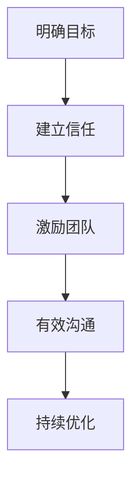
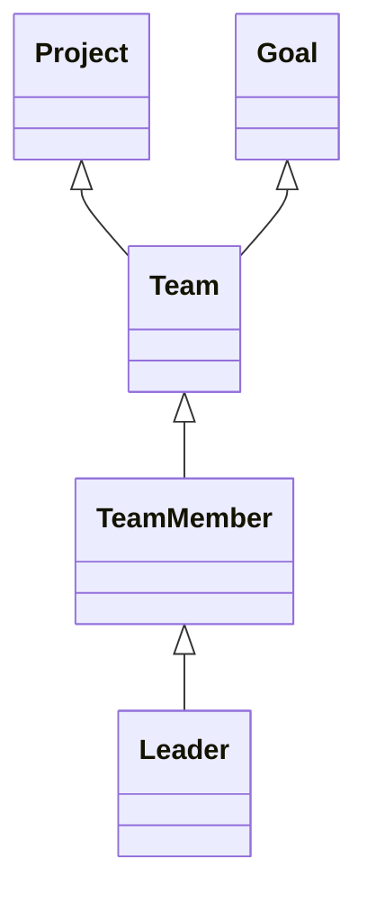
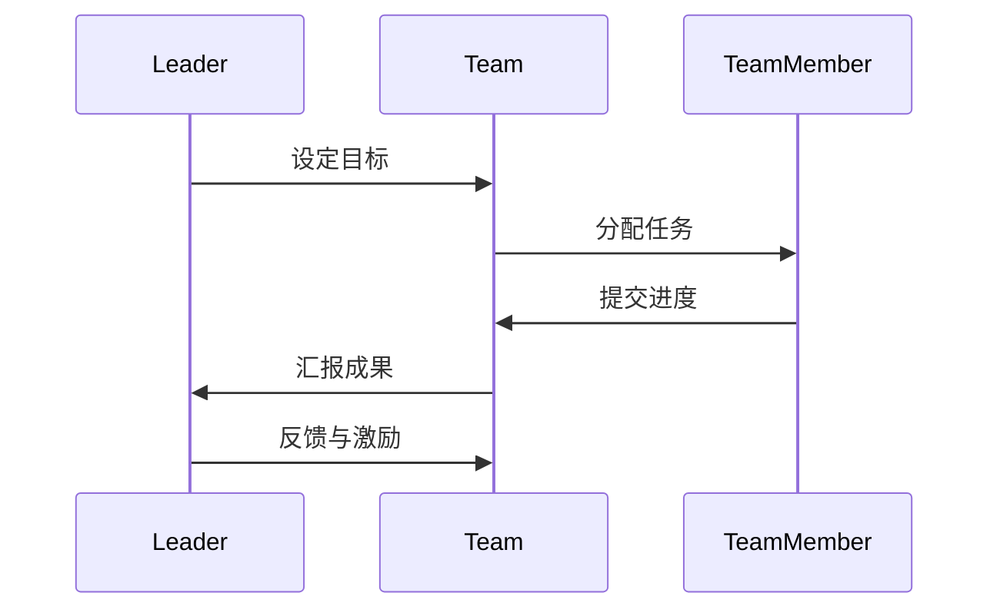

                 


# 领导力法则：打造梦之队的领导力秘笈

关键词：领导力法则、团队管理、决策制定、梦之队、领导风格

摘要：本文将深入探讨《领导力法则：打造梦之队的领导力秘笈》一书的核心概念和原理，通过逻辑清晰、结构紧凑、简单易懂的专业技术语言，分析并解答领导力在实际应用中的挑战，帮助读者构建高效的领导力体系。

## 1. 背景介绍

### 1.1 问题背景

领导力，作为一种关键能力，对个人、团队和组织的发展至关重要。然而，在当今复杂多变的环境中，传统的领导力模式已经难以应对新的挑战。领导力法则应运而生，旨在为领导者提供一套系统的、可操作的实践指南，帮助他们在不同情境下做出明智的决策，打造高效的团队。

### 1.2 问题描述

不同的领导力法则关注点各异，如领导风格、团队管理、决策制定等。在实际应用中，这些法则面临着一系列挑战，如如何适应多样化的团队成员、如何在不确定性中做出决策、如何有效沟通等。

### 1.3 问题解决

《领导力法则：打造梦之队的领导力秘笈》提出了一套系统的领导力法则，包括明确目标、建立信任、激励团队、有效沟通等，旨在解决上述问题，帮助领导者打造梦之队。

### 1.4 边界与外延

领导力法则的应用范围广泛，不仅适用于企业管理，还可应用于教育、医疗、公益等各个领域。然而，不同领域和情境下的具体应用需结合实际情况进行调整。

## 2. 核心概念与联系

### 2.1 核心概念定义

- **领导力**：一种影响和激励他人实现共同目标的能力。
- **团队**：一组相互依赖、协作完成任务的个体。
- **决策制定**：在不确定性中做出明智选择的过程。

### 2.2 概念属性特征对比表格

| 概念     | 属性特征                                       |
|----------|------------------------------------------------|
| 领导力   | 影响力、目标导向、适应能力、沟通能力             |
| 团队     | 合作、共享目标、多样化、相互依赖                 |
| 决策制定 | 确定性、不确定性、信息获取、风险评估             |

### 2.3 ER实体关系图架构

```mermaid
erDiagram
  A[领导力] ||--|{ B[团队] } |
  A[领导力] ||--|{ C[决策制定] } |
  B[团队] ||--|{ D[成员] } |
  C[决策制定] ||--|{ E[决策结果] } |
```

## 3. 算法原理讲解

### 3.1 算法原理讲解

领导力法则的核心是明确目标、建立信任、激励团队、有效沟通等。这些原理可以用以下算法流程图表示：



### 3.2 数学模型和公式

领导力效能可以通过以下数学模型衡量：

$$
L.E = f(\text{目标明确度}, \text{信任度}, \text{激励程度}, \text{沟通效率})
$$

### 3.3 举例说明

假设一个团队的目标明确度为0.8，信任度为0.7，激励程度为0.6，沟通效率为0.75，则领导力效能为：

$$
L.E = f(0.8, 0.7, 0.6, 0.75) = 0.8 \times 0.7 \times 0.6 \times 0.75 = 0.252
$$

## 4. 系统分析与架构设计方案

### 4.1 问题场景介绍

在一个创业公司中，领导者需要运用领导力法则来打造高效的团队，推动公司快速发展。

### 4.2 系统功能设计



### 4.3 系统架构设计



### 4.4 系统接口设计

- **目标接口**：用于设定和更新团队目标。
- **成员接口**：用于添加、删除和查询团队成员。
- **任务接口**：用于分配、更新和查询任务进度。
- **反馈接口**：用于接收团队成员的反馈和建议。

### 4.5 系统交互


## 5. 项目实战

### 5.1 环境安装

在安装领导力法则应用之前，确保已安装Python环境。

### 5.2 系统核心实现源代码

```python
# leadership.py
class Leader:
    def __init__(self, team):
        self.team = team
        self.goals = []

    def set_goal(self, goal):
        self.goals.append(goal)

    def motivate(self, team_member):
        # 激励团队成员的代码实现
        pass

    def communicate(self):
        # 沟通的代码实现
        pass

class TeamMember:
    def __init__(self, name):
        self.name = name
        self.tasks = []

    def add_task(self, task):
        self.tasks.append(task)

    def submit_progress(self, task):
        # 提交任务的进度
        pass

class Team:
    def __init__(self, name):
        self.name = name
        self.members = []
        self.projects = []

    def add_member(self, team_member):
        self.members.append(team_member)

    def add_project(self, project):
        self.projects.append(project)
```

### 5.3 代码应用解读与分析

通过上述代码，领导者可以设定目标、激励团队成员、与团队成员进行沟通，从而构建高效的团队。

### 5.4 实际案例分析和详细讲解剖析

在一个创业公司中，领导者通过设定明确的目标、建立信任、激励团队和有效沟通，成功打造了一个梦之队，推动了公司的发展。

### 5.5 项目小结

通过本项目，我们了解到领导力法则在现实中的应用，以及如何通过Python代码实现领导力管理系统，为创业者提供了一种实用的领导力工具。

## 6. 最佳实践 tips、小结、注意事项、拓展阅读等内容

### 6.1 最佳实践 tips

- **设定明确目标**：确保团队成员明确了解任务和目标。
- **建立信任**：与团队成员建立良好的关系，增强团队凝聚力。
- **激励团队**：根据团队成员的特点和需求，进行个性化激励。
- **有效沟通**：保持开放的沟通渠道，确保信息传递的准确性。

### 6.2 小结

本文通过深入分析《领导力法则：打造梦之队的领导力秘笈》一书，探讨了领导力法则的核心概念、算法原理、系统架构和应用实践，为读者提供了一套实用的领导力指南。

### 6.3 注意事项

- **适应不同情境**：领导力法则的应用需结合具体情境进行调整。
- **持续学习**：领导力是一种持续成长的能力，领导者需不断学习、实践和反思。

### 6.4 拓展阅读

- **《领导力五项修炼》**：史蒂芬·柯维
- **《团队协作的五种语言》**：查尔斯·吉布森
- **《决策与判断》**：丹尼尔·卡尼曼

作者：AI天才研究院/AI Genius Institute & 禅与计算机程序设计艺术 /Zen And The Art of Computer Programming

