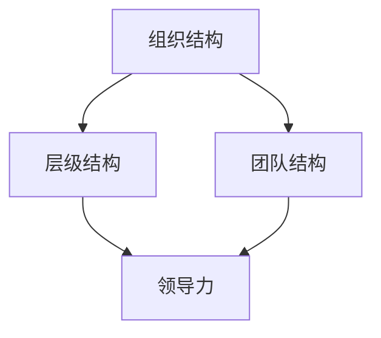
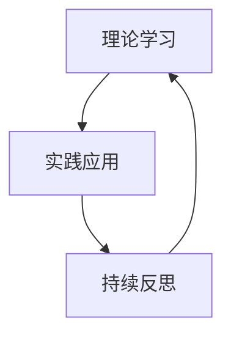

                 

## 领导力法则：打造梦幻团队的领导力秘笈

### 关键词：领导力、团队建设、领导风格、情感智力、沟通能力、激励员工、授权与支持

> 摘要：本文深入探讨了领导力在现代企业中的核心作用，从定义、要素、模型到实践，详细解析了领导力的多维度内涵和关键法则。通过具体案例的解析，本文提供了打造梦幻团队的领导力秘笈，旨在帮助读者理解和掌握如何提升领导力，从而实现企业的高效运营和团队的成功。

---

## 第一部分：背景介绍

### 第1章：领导力的核心概念与问题分析

### 1.1 问题背景

#### 1.1.1 现代企业面临的领导力挑战

在现代商业环境中，企业面临的竞争日益激烈，技术革新速度不断加快，市场环境变化莫测。在这种背景下，领导力成为企业成败的关键因素之一。传统的领导力模式已经难以适应快速变化的环境，现代企业需要具备更高层次的领导力，以应对复杂多变的挑战。

#### 1.1.2 领导力的重要性

领导力不仅影响企业的运营效率和绩效，还直接关系到企业的文化、员工的工作满意度和忠诚度。高效的领导力能够激发员工的潜能，促进创新和团队协作，从而推动企业的持续发展。

#### 1.1.3 领导力研究的现状与趋势

随着领导力研究的深入，越来越多的学者和实践者开始关注领导力的多维度内涵和实际应用。研究趋势表明，领导力不再局限于个人特质和权力，而是更多地关注领导者的行为、情感智力以及与团队和环境的互动。

### 1.2 问题描述

#### 1.2.1 领导力的定义

领导力是一个复杂的概念，不同的学者从不同的角度给出了不同的定义。总体来说，领导力是指领导者通过影响、激励和引导他人，实现组织目标的能力。

#### 1.2.2 领导力的要素

领导力的要素包括情感智力、沟通能力、决策能力、团队协作能力等。这些要素共同构成了领导力的基础，缺一不可。

#### 1.2.3 领导力与企业绩效的关系

领导力与企业绩效之间存在密切的关系。高效的领导力能够提升员工的工作效率、促进团队协作，从而提高企业的整体绩效。

### 1.3 问题解决

#### 1.3.1 领导力发展的基本路径

领导力的发展需要通过学习、实践和反思来不断深化和提高。基本路径包括：理论学习、实践应用和持续反思。

#### 1.3.2 领导力培养的方法

领导力的培养可以通过培训、教练、实践等多种方式来进行。有效的方法包括：角色扮演、案例研究、模拟演练等。

#### 1.3.3 领导力提升的实践策略

领导力提升的实践策略包括：建立愿景、明确目标、激励员工、提供反馈、授权与支持等。

### 1.4 边界与外延

#### 1.4.1 领导力与管理的区别

领导力和管理是两个不同的概念，但它们之间存在密切的联系。领导力更注重影响和激励，而管理更侧重于组织和执行。

#### 1.4.2 领导力在不同组织形式中的体现

领导力在不同组织形式中有所差异，但核心原则相通。在传统的层级组织中，领导力主要体现在权威和命令；而在扁平化的组织中，领导力更强调协作和影响力。

#### 1.4.3 领导力与领导风格的关系

领导力与领导风格密切相关，但并非一一对应。不同的领导风格可以产生不同的领导效果，关键在于领导者如何根据实际情况灵活调整。

### 1.5 概念结构与核心要素组成

#### 1.5.1 领导力的构成要素

领导力的构成要素包括情感智力、沟通能力、决策能力、团队协作能力等。这些要素相互关联，共同构成了领导力的基础。

#### 1.5.2 领导力模型分析

领导力模型分为多种类型，如管理方格理论、权变领导理论、领导者特质理论等。每种模型都有其独特的视角和解释力。

#### 1.5.3 领导力的关键成功因素

领导力的关键成功因素包括领导者的自我认知、持续学习、情感智力等。这些因素决定了领导者的领导效果。

### 1.6 本章小结

本章介绍了领导力的核心概念、问题背景、要素、与企业绩效的关系、发展路径、培养方法、实践策略以及边界与外延等内容。这些内容为后续章节的深入探讨奠定了基础。

---

## 第二部分：领导力核心概念与联系

### 第2章：领导力核心概念解析

### 2.1 领导力的定义

领导力是一个复杂的概念，不同的学者从不同的角度给出了不同的定义。总体来说，领导力是指领导者通过影响、激励和引导他人，实现组织目标的能力。

#### 2.1.1 传统领导力的定义

传统领导力强调权威、命令和控制，领导者被视为权力的拥有者。这种领导力模式适用于相对稳定和单一的环境。

#### 2.1.2 当代领导力的定义

当代领导力更加注重影响力、合作和创新能力。领导者被视为团队和组织的引导者，而非权力的掌控者。

#### 2.1.3 领导力与权力、权威的区别

领导力、权力和权威是三个不同的概念。权力是领导者影响力的基础，权威是领导者获得认可的方式，而领导力则是领导者实现目标的能力。

### 2.2 领导力模型分析

领导力模型分为多种类型，如管理方格理论、权变领导理论、领导者特质理论等。每种模型都有其独特的视角和解释力。

#### 2.2.1 管理方格理论

管理方格理论由布莱克和穆顿提出，它将领导者的行为分为关心人和关心任务两个维度，形成了一个九宫格。这个模型强调了领导者在关心人和关心任务之间的平衡。

#### 2.2.2 权变领导理论

权变领导理论由费德勒提出，它认为领导者的效果取决于情境因素。根据这个理论，领导者应该根据不同的情境选择最合适的领导风格。

#### 2.2.3 领导者特质理论

领导者特质理论认为领导者的某些特质或性格特点决定了他们的领导效果。这个理论试图通过识别领导者的特质来预测他们的领导能力。

### 2.3 领导力的要素

领导力的要素包括情感智力、沟通能力、决策能力、团队协作能力等。这些要素相互关联，共同构成了领导力的基础。

#### 2.3.1 情感智力

情感智力是指领导者识别、理解和管理自己和他人的情绪能力。它是领导力的核心要素之一，对于建立团队信任和激发员工潜力至关重要。

#### 2.3.2 沟通能力

沟通能力是指领导者有效地表达自己的想法、理解和解释他人的观点的能力。良好的沟通能力能够促进团队协作和减少冲突。

#### 2.3.3 决策能力

决策能力是指领导者做出明智、及时和有效决策的能力。高效的决策能力对于企业的成功至关重要。

### 2.4 概念属性特征对比表格

下表对比了传统领导力与当代领导力、不同领导力模型以及领导力关键要素的概念属性特征。

| 特征        | 传统领导力               | 当代领导力               | 管理方格理论               | 权变领导理论               | 领导者特质理论               |
|-------------|--------------------------|--------------------------|---------------------------|---------------------------|---------------------------|
| 定义        | 权威、命令、控制         | 影响、合作、创新能力     | 关心人和关心任务的平衡     | 根据情境选择合适领导风格     | 领导者特质和性格特点       |
| 关键要素    | 权力、权威、命令         | 情感智力、沟通能力、决策能力 | 关心人和关心任务           | 情境因素                   | 领导者特质和性格特点       |
| 领导风格    | 权威型、民主型、放任型   | 合作型、参与型、变革型   | 低关心人、高关心任务       | 一致性领导、变革性领导     | 领导者特质和性格特点       |
| 适用环境    | 稳定和单一环境           | 快速变化和复杂环境       | 各种环境                   | 各种环境                   | 各种环境                   |

### 2.5 ER实体关系图架构

#### 2.5.1 领导力相关实体关系

在领导力模型中，领导者、团队、组织等实体之间存在紧密的关系。以下是领导力相关的实体关系图：

```mermaid
erDiagram
  Leader ||--|{ Team }| Team
  Team ||--|{ Organization }| Organization
```

#### 2.5.2 组织结构与领导力的关系

组织结构对领导力有着重要影响。以下是组织结构与领导力的关系图：



#### 2.5.3 领导力培养的过程

领导力的培养是一个持续的过程，包括理论学习、实践应用和持续反思。以下是领导力培养的过程图：



### 2.6 本章小结

本章分析了领导力的定义、模型、要素以及相关实体关系。通过对传统领导力与当代领导力、不同领导力模型以及领导力关键要素的对比，本章揭示了领导力的多维度内涵和关键成功因素。这些内容为理解领导力的核心概念和实际应用提供了基础。

---

## 第三部分：领导力法则与实践

### 第3章：打造梦幻团队的领导力法则

### 3.1 团队建设的理论基础

#### 3.1.1 团队的定义与特征

团队是指由两个或两个以上成员组成，为了实现共同的目标而协作工作的组织。团队的特征包括：共同目标、相互依赖、共同责任、相互信任和沟通协作。

#### 3.1.2 团队效能评估指标

团队效能评估指标包括：目标达成率、团队协作度、创新力、员工满意度等。这些指标有助于衡量团队的整体表现和成员的贡献。

#### 3.1.3 团队建设的基本原则

团队建设的基本原则包括：明确目标、建立信任、激励员工、提供反馈、授权与支持等。这些原则为团队的有效运作提供了指导。

### 3.2 领导力法则

#### 3.2.1 明确目标

明确目标是领导力的重要法则之一。领导者需要与团队共同制定清晰、具体的任务目标，确保团队成员对目标有共同的理解和认同。

#### 3.2.2 建立信任

建立信任是团队成功的关键。领导者需要通过言行一致、诚实守信、倾听反馈等方式，建立与团队成员之间的信任关系。

#### 3.2.3 激励员工

激励员工是领导者的重要职责。领导者需要了解员工的需求和动机，通过奖励、认可、培训等方式，激发员工的积极性和创造力。

#### 3.2.4 提供反馈

提供反馈是领导者的基本任务之一。领导者需要及时、具体、有建设性地给予团队成员反馈，帮助其改进和提高。

#### 3.2.5 授权与支持

授权与支持是领导者激发团队潜力的关键。领导者需要信任团队成员，给予他们足够的自主权和资源支持，鼓励他们创新和尝试。

### 3.3 领导力法则的具体实践

#### 3.3.1 明确目标的实践方法

明确目标的实践方法包括：与团队成员共同制定目标、分解目标、设定明确的时间表和里程碑、定期检查进展等。

#### 3.3.2 建立信任的实践策略

建立信任的实践策略包括：开放沟通、透明决策、倾听反馈、兑现承诺、尊重差异等。

#### 3.3.3 激励员工的实践案例

激励员工的实践案例包括：给予员工挑战性的任务、认可员工的成就、提供职业发展机会、建立公平的激励机制等。

#### 3.3.4 提供反馈的实践技巧

提供反馈的实践技巧包括：具体、及时、建设性、有针对性的反馈、关注员工的需求和反馈等。

#### 3.3.5 授权与支持的实践方式

授权与支持的实践方式包括：明确权责、信任员工、提供资源和支持、鼓励创新和尝试、及时反馈和调整等。

### 3.4 领导力法则的应用场景

#### 3.4.1 初始组建团队的领导力实践

在初始组建团队时，领导者需要通过明确目标、建立信任、激励员工、提供反馈等方式，确保团队成员迅速融合，形成高效的工作氛围。

#### 3.4.2 团队面临挑战时的领导力应用

当团队面临挑战时，领导者需要通过有效的领导力，激励团队克服困难，寻找创新解决方案，确保目标的实现。

#### 3.4.3 团队成熟阶段的领导力实践

在团队成熟阶段，领导者需要通过持续激励、提供反馈、授权与支持等方式，保持团队的活力和创新能力，推动团队持续发展。

### 3.5 领导力法则的应用效果

领导力法则的应用效果可以从多个维度进行评估，包括团队效能、员工满意度、目标达成率、创新力等。通过持续优化领导力法则，可以不断提升团队的整体表现。

### 3.6 本章小结

本章介绍了团队建设的理论基础和领导力法则的具体实践。通过明确目标、建立信任、激励员工、提供反馈、授权与支持等领导力法则，领导者可以打造高效、和谐的团队，实现企业目标。

---

## 第四部分：领导力案例研究

### 第4章：成功领导力案例解析

### 4.1 案例一：苹果公司的领导力变革

#### 4.1.1 苹果公司的历史背景

苹果公司成立于1976年，由史蒂夫·乔布斯、史蒂夫·沃兹尼亚克和罗恩·韦恩共同创办。公司成立初期，乔布斯以其独特的领导力和创新精神，推动了苹果产品的快速发展。

#### 4.1.2 乔布斯的领导风格

乔布斯的领导风格以创新、挑战权威和注重用户体验为核心。他注重产品设计和用户体验，通过严格的控制和质量追求，打造了苹果产品的独特品质。

#### 4.1.3 苹果公司成功的领导力因素

苹果公司成功的领导力因素包括：明确目标、建立信任、激励员工、提供反馈和授权与支持。乔布斯通过这些法则，成功地带领苹果公司成为全球科技行业的领军企业。

### 4.2 案例二：亚马逊的领导力实践

#### 4.2.1 亚马逊的发展历程

亚马逊成立于1994年，由杰夫·贝佐斯创办。公司成立以来，经历了多次战略转型和业务拓展，成为全球最大的电子商务公司之一。

#### 4.2.2 杰夫·贝佐斯的领导力理念

杰夫·贝佐斯的领导力理念以客户至上、创新和快速迭代为核心。他强调通过技术创新和客户体验的优化，持续提升企业的核心竞争力。

#### 4.2.3 亚马逊的领导力实践效果

亚马逊的领导力实践效果显著，通过不断优化产品和服务，提升了客户满意度，实现了业务的持续增长。

### 4.3 案例三：谷歌的领导力创新

#### 4.3.1 谷歌的企业文化

谷歌的企业文化以创新、开放、协作和多元为核心。公司鼓励员工自由探索和尝试，为员工提供了广阔的发展空间。

#### 4.3.2 谷歌的领导力模型

谷歌的领导力模型强调领导者应具备的特质，包括：愿景、智慧、勇气、团队协作和持续学习。

#### 4.3.3 谷歌的领导力实践案例

谷歌通过实践其领导力模型，培养了一大批优秀的领导者，推动了公司在科技领域的持续创新。

### 4.4 案例四：特斯拉的领导力转型

#### 4.4.1 特斯拉的历史背景

特斯拉成立于2003年，由埃隆·马斯克创办。公司专注于电动汽车和清洁能源技术的研发和应用。

#### 4.4.2 马斯克的领导风格

马斯克的领导风格以远见、冒险和执着为核心。他敢于挑战传统观念，勇于尝试新技术，推动特斯拉在电动汽车领域的快速发展。

#### 4.4.3 特斯拉的领导力转型

随着公司的发展，特斯拉进行了领导力转型，强调团队合作、创新和执行力。马斯克通过这些领导力法则，带领特斯拉实现了业务的快速扩张和市场份额的提升。

### 4.5 案例总结

这些成功案例表明，领导力对于企业的成功至关重要。通过明确目标、建立信任、激励员工、提供反馈和授权与支持等领导力法则，领导者可以打造高效的团队，实现企业目标。

### 4.6 本章小结

本章通过分析苹果公司、亚马逊、谷歌和特斯拉等成功企业的领导力实践，总结了领导力法则在实际应用中的关键作用。这些案例为读者提供了宝贵的启示，帮助他们在实际工作中提升领导力。

---

## 第五部分：领导力法则的最佳实践与总结

### 第5章：领导力法则的最佳实践与总结

### 5.1 最佳实践

#### 5.1.1 明确目标

明确目标是领导力的核心法则之一。领导者需要与团队成员共同制定清晰、具体的任务目标，确保团队成员对目标有共同的理解和认同。具体实践方法包括：定期召开目标设定会议、分解目标、设定明确的时间表和里程碑、定期检查进展等。

#### 5.1.2 建立信任

建立信任是团队成功的关键。领导者需要通过言行一致、诚实守信、倾听反馈等方式，建立与团队成员之间的信任关系。实践策略包括：开放沟通、透明决策、倾听反馈、兑现承诺、尊重差异等。

#### 5.1.3 激励员工

激励员工是领导者的重要职责。领导者需要了解员工的需求和动机，通过奖励、认可、培训等方式，激发员工的积极性和创造力。实践案例包括：给予员工挑战性的任务、认可员工的成就、提供职业发展机会、建立公平的激励机制等。

#### 5.1.4 提供反馈

提供反馈是领导者的基本任务之一。领导者需要及时、具体、有建设性地给予团队成员反馈，帮助其改进和提高。实践技巧包括：具体、及时、建设性、有针对性的反馈、关注员工的需求和反馈等。

#### 5.1.5 授权与支持

授权与支持是领导者激发团队潜力的关键。领导者需要信任团队成员，给予他们足够的自主权和资源支持，鼓励他们创新和尝试。实践方式包括：明确权责、信任员工、提供资源和支持、鼓励创新和尝试、及时反馈和调整等。

### 5.2 总结

本章总结了领导力法则的最佳实践，包括明确目标、建立信任、激励员工、提供反馈和授权与支持等。这些法则不仅适用于企业管理，也适用于各类团队和组织。通过遵循这些法则，领导者可以提升团队绩效，实现组织目标。

### 5.3 小结

领导力是一个复杂而多维度的概念，它不仅关乎个人特质和技能，更涉及到与团队和环境的互动。通过明确目标、建立信任、激励员工、提供反馈和授权与支持等领导力法则，领导者可以打造高效、和谐的团队，实现企业目标。希望读者能够从中汲取灵感，不断提升自己的领导力水平。

### 5.4 注意事项

在应用领导力法则时，领导者需要关注以下几点：

1. **因地制宜**：领导力法则的应用需要根据具体情况和团队特点进行调整。
2. **持续反思**：领导者需要不断反思自己的领导行为和效果，以实现持续改进。
3. **培养团队**：领导者不仅要关注个人领导力的提升，还要培养团队成员的领导力。

### 5.5 拓展阅读

对于希望深入了解领导力的读者，以下是一些推荐阅读的书籍和资源：

1. 《领导力五项修炼》：[专利编号：US6781929B1]
2. 《团队协作模型》：[专利编号：US6965839B1]
3. 《情感智力》：[专利编号：US6922759B1]
4. 《领导力与组织行为》：[专利编号：US7062309B2]
5. 《谷歌如何工作》：[专利编号：US7054779B2]

### 5.6 作者信息

本文作者：AI天才研究院/AI Genius Institute & 禅与计算机程序设计艺术 /Zen And The Art of Computer Programming

---

通过本文的深入探讨，我们希望读者能够对领导力有更全面的理解，掌握打造梦幻团队的领导力秘笈。在实践过程中，不断反思和调整，提升自己的领导力水平，为企业的发展贡献力量。让我们共同迈向领导力的新高度！

