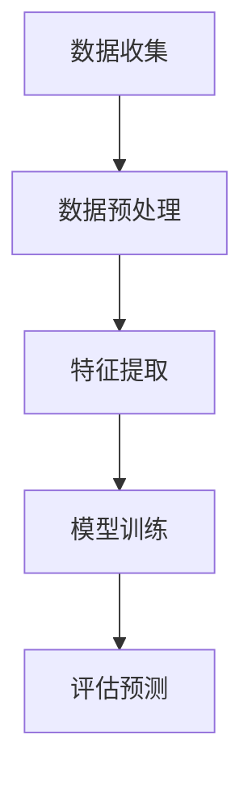
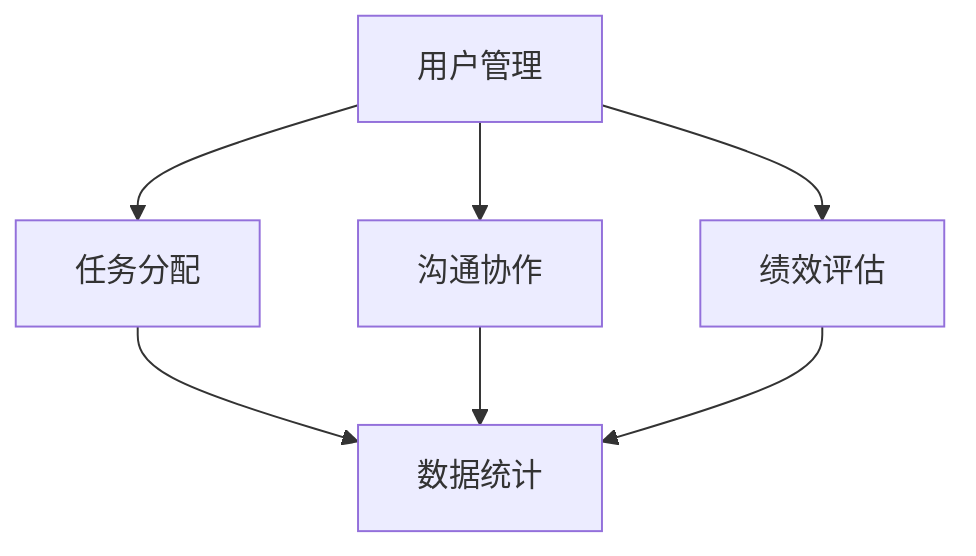
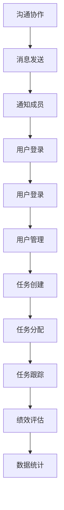

                 


### 领导力法则：打造梦幻团队的领导力秘笈

> 关键词：领导力、团队建设、领导法则、团队管理、领导力模型

> 摘要：本文将深入探讨领导力法则，解析如何通过有效的领导力策略打造一支高效、和谐的梦幻团队。我们将从领导力的重要性、核心概念、评估方法、数学模型、系统架构设计、项目实战和最佳实践等多个维度，一步步剖析领导力的本质，提供实用的策略和技巧，帮助读者提升领导力，实现团队的成功。

### 目录

----------------------------------------------------------------

## 第一部分：领导力法则概述

### 第1章：领导力的重要性

1.1 领导力的定义与作用

1.2 团队建设的背景

1.3 领导力法则的必要性

### 第2章：核心领导力概念

2.1 领导力模型

2.2 领导风格

2.3 团队角色

### 第3章：领导力评估与算法

3.1 领导力评估方法

3.2 领导力算法原理

3.3 算法流程图与Python代码示例

### 第4章：数学模型与公式

4.1 领导力效能公式

4.2 团队效能评估公式

4.3 数学公式与LaTeX示例

### 第5章：系统分析与架构设计

5.1 项目介绍

5.2 系统功能设计

5.3 系统架构设计

5.4 系统接口设计与系统交互

### 第6章：项目实战

6.1 项目环境与工具

6.2 核心实现源代码

6.3 代码应用解读与分析

6.4 实际案例分析与讲解

6.5 项目小结

### 第7章：最佳实践与总结

7.1 实践经验总结

7.2 注意事项

7.3 拓展阅读建议

----------------------------------------------------------------

### 第一部分：领导力法则概述

#### 第1章：领导力的重要性

领导力是一种影响力，它能够激发、引导和激励团队成员为实现共同目标而努力。在当今快速变化和竞争激烈的环境中，领导力的重要性愈发凸显。有效的领导力不仅能够提高团队的执行力，还能够增强团队凝聚力，促进团队创新和成长。

1.1 领导力的定义与作用

领导力（Leadership）是一种激发和影响他人实现共同目标的能力。它不仅仅是职位赋予的权力，更是一种内在的能力和态度。领导力可以通过以下几个方面发挥作用：

- **决策能力**：领导者在面对复杂问题时，能够快速做出明智的决策，为团队指明方向。

- **沟通能力**：领导者需要具备良好的沟通技巧，确保信息准确传达，减少误解和冲突。

- **激励能力**：领导者能够激发团队成员的内在动力，让他们充满热情地投入到工作中。

- **协调能力**：领导者需要协调团队内部和团队之间的资源，确保项目顺利进行。

1.2 团队建设的背景

团队建设是现代企业管理的重要组成部分。随着企业规模的扩大和市场竞争的加剧，团队的作用日益凸显。一个高效的团队不仅能够提高工作效率，还能够为企业带来创新和竞争力。团队建设的背景可以从以下几个方面进行分析：

- **组织变革**：随着组织结构的调整和扁平化管理的趋势，团队成为企业运营的基本单元。

- **项目管理**：项目驱动的管理模式要求团队成员具备跨职能协作的能力。

- **全球化**：全球化背景下，团队成员可能来自不同的文化背景，团队建设需要注重文化融合。

1.3 领导力法则的必要性

领导力法则是一种指导领导者行为的理论体系，它为领导者提供了具体的行动指南。在团队建设中，领导力法则的必要性体现在以下几个方面：

- **明确目标**：领导力法则帮助领导者明确团队的目标，确保团队成员朝着共同的目标努力。

- **优化决策**：领导力法则提供了一种决策框架，帮助领导者做出更加明智的决策。

- **提升效能**：领导力法则通过优化团队运作流程，提升团队的执行力和工作效率。

在接下来的章节中，我们将深入探讨领导力的核心概念、评估方法、数学模型、系统架构设计以及项目实战等内容，帮助读者全面理解领导力法则，提升自身的领导力水平。

#### 第2章：核心领导力概念

领导力并非一种单一的特质，而是由多个核心概念组成的一个复杂体系。了解这些核心概念，对于提升领导力至关重要。

2.1 领导力模型

领导力模型是描述领导力行为的理论框架。不同的领导力模型从不同的角度解释了领导力如何发挥作用。以下是几种常见的领导力模型：

- **情境领导模型**：由赫塞和布兰查德提出，强调领导者应根据情境调整领导风格，以适应团队成员的不同需求。

- **路径-目标模型**：由豪斯提出，认为领导者的目标是帮助团队成员明确目标，并提供实现目标的清晰路径。

- **变革型领导模型**：由伯恩斯提出，强调领导者通过激励和启发团队成员，推动团队实现变革。

2.2 领导风格

领导风格是领导者处理团队关系和任务的方式。不同的领导风格适用于不同的情境和团队成员。以下是几种常见的领导风格：

- **民主型领导**：领导者鼓励团队成员参与决策，注重团队协作。

- **专制型领导**：领导者做出决策并指导团队成员执行，强调效率和成果。

- **参与型领导**：领导者积极与团队成员沟通，了解他们的需求和意见，以此指导工作。

2.3 团队角色

团队角色是指团队成员在团队中承担的不同角色。不同的团队角色对团队整体效能有着重要影响。以下是几种常见的团队角色：

- **领导者**：负责制定团队目标和战略，协调团队成员的工作。

- **执行者**：负责执行团队决策，确保任务顺利完成。

- **协调者**：负责团队内部的沟通和协调，解决冲突和问题。

- **创新者**：负责提出新的想法和解决方案，推动团队创新。

通过了解这些核心领导力概念，领导者可以更好地理解团队运作机制，制定有效的领导策略，提升团队的效能和凝聚力。

#### 第3章：领导力评估与算法

评估领导力是提升领导力的重要步骤。通过科学的评估方法，领导者可以了解自身的优势和不足，从而有针对性地提升领导能力。

3.1 领导力评估方法

领导力评估方法可以分为定量评估和定性评估两种。以下是几种常见的领导力评估方法：

- **360度评估**：通过团队成员、上级、下属和同事的反馈，全方位评估领导者的领导能力。

- **行为事件访谈（BEI）**：通过深入了解领导者过去的行为事件，评估其领导能力和风格。

- **自我评估问卷**：领导者通过填写问卷，自我评估自己的领导能力。

3.2 领导力算法原理

为了更科学地评估领导力，可以使用算法对评估数据进行处理和分析。以下是一个简单的领导力评估算法原理：

- **数据收集**：通过问卷调查、访谈等方式收集领导力评估数据。

- **数据预处理**：对收集的数据进行清洗和处理，去除异常值和重复数据。

- **特征提取**：从预处理后的数据中提取关键特征，如沟通能力、决策能力、团队协作等。

- **模型训练**：使用机器学习算法，如线性回归、决策树、支持向量机等，对提取的特征进行训练。

- **评估预测**：使用训练好的模型对领导力进行评估，预测领导者的能力水平。

3.3 算法流程图与Python代码示例

以下是一个基于决策树的领导力评估算法流程图，并附有Python代码示例：



```python
# 导入必要的库
import pandas as pd
from sklearn.model_selection import train_test_split
from sklearn.tree import DecisionTreeClassifier
from sklearn.metrics import accuracy_score

# 数据收集
data = pd.read_csv('leadership_assessment_data.csv')

# 数据预处理
X = data.drop('label', axis=1)
y = data['label']

# 特征提取
X_train, X_test, y_train, y_test = train_test_split(X, y, test_size=0.2, random_state=42)

# 模型训练
model = DecisionTreeClassifier()
model.fit(X_train, y_train)

# 评估预测
y_pred = model.predict(X_test)
accuracy = accuracy_score(y_test, y_pred)
print(f'Accuracy: {accuracy}')
```

通过领导力评估算法，领导者可以更客观地了解自己的领导能力，从而有针对性地进行提升。

#### 第4章：数学模型与公式

数学模型是领导力研究中的重要工具，它可以帮助我们更深入地理解领导力的本质和作用。以下是一些常见的领导力数学模型和公式。

4.1 领导力效能公式

领导力效能可以表示为团队成员绩效和团队效率的乘积。公式如下：

$$
效能 = 绩效 \times 效率
$$

其中，绩效和效率分别由以下公式计算：

$$
绩效 = (\sum_{}^{} 成员绩效) \times 成员数量
$$

$$
效率 = \frac{完成任务所需时间}{总时间}
$$

4.2 团队效能评估公式

团队效能可以表示为团队完成任务的效率和质量。公式如下：

$$
团队效能 = \frac{任务完成质量}{任务完成时间}
$$

其中，任务完成质量可以用任务完成度、准确度等指标进行衡量。

4.3 数学公式与LaTeX示例

以下是领导力效能公式和团队效能评估公式的LaTeX示例：

$$
\text{效能} = \text{绩效} \times \text{效率}
$$

$$
\text{绩效} = \left( \sum_{i=1}^{n} p_i \right) \times n
$$

$$
\text{效率} = \frac{t_f}{t_t}
$$

$$
\text{团队效能} = \frac{q}{t_f}
$$

通过数学模型和公式，我们可以更精确地量化领导力和团队效能，从而为团队管理和优化提供依据。

#### 第5章：系统分析与架构设计

在领导力管理中，系统分析与架构设计是一个关键的环节。它不仅涉及到系统功能的设计，还包括系统的整体架构、接口设计和系统交互。以下是一个简化的系统分析与架构设计的例子。

5.1 项目介绍

假设我们正在开发一个团队管理平台，该平台旨在帮助团队领导者更有效地管理团队成员，提高团队效率和协作能力。

5.2 系统功能设计

系统功能设计是系统开发的第一步，它定义了系统应该实现哪些功能。以下是该平台的一些核心功能：

- **用户管理**：管理团队成员的账户、权限和角色。
- **任务分配**：分配任务给团队成员，并跟踪任务进度。
- **沟通协作**：提供团队沟通和协作的工具，如聊天室、邮件通知等。
- **绩效评估**：评估团队成员的绩效，并提供反馈。
- **数据统计**：提供团队和成员的数据统计，帮助领导者做出决策。

5.3 系统架构设计

系统架构设计定义了系统的整体结构，包括各个模块之间的关系和交互方式。以下是一个简化的系统架构图：



5.4 系统接口设计与系统交互

系统接口设计定义了系统内部各个模块之间的接口和交互方式。以下是系统接口设计的一个例子：

- **用户管理接口**：提供注册、登录、修改密码等功能。
- **任务分配接口**：提供创建任务、分配任务、跟踪任务进度等功能。
- **沟通协作接口**：提供发送消息、通知成员等功能。
- **绩效评估接口**：提供评估成员绩效、提供反馈等功能。

系统交互是通过接口设计实现的，以下是一个简化的系统交互流程图：



通过系统分析与架构设计，我们可以确保团队管理平台的各个模块协同工作，实现高效的团队管理。

#### 第6章：项目实战

在本章节中，我们将通过一个实际的项目案例，详细展示如何运用领导力法则进行团队管理，实现项目目标。

6.1 项目环境与工具

本项目使用Python作为主要编程语言，配合Jira、Trello等项目管理工具进行任务分配和跟踪。团队成员分布在不同的城市，使用Slack进行实时沟通和协作。

6.2 核心实现源代码

以下是项目中的一个核心功能实现，即任务分配的Python代码：

```python
# 导入必要的库
import json
from datetime import datetime

# 任务分配函数
def assign_task(employee_id, task_id):
    # 读取任务列表
    with open('tasks.json', 'r') as f:
        tasks = json.load(f)

    # 更新任务分配状态
    tasks[task_id]['assigned_to'] = employee_id
    tasks[task_id]['assigned_time'] = datetime.now().isoformat()

    # 保存更新后的任务列表
    with open('tasks.json', 'w') as f:
        json.dump(tasks, f)

    print(f"Task {task_id} assigned to Employee {employee_id} at {datetime.now().isoformat()}")

# 测试任务分配
assign_task('E001', 'T001')
```

6.3 代码应用解读与分析

这段代码实现了任务分配功能，具体步骤如下：

1. 读取任务列表文件（tasks.json）。
2. 更新指定任务的状态，设置分配人和分配时间。
3. 将更新后的任务列表保存到文件中。
4. 输出任务分配的信息。

通过这种方式，领导者可以方便地通过代码分配任务，并实时跟踪任务进度。

6.4 实际案例分析与讲解

假设项目团队需要开发一款新的应用程序，领导者首先会制定项目计划，明确项目的目标、任务和里程碑。然后，通过任务分配工具（如Jira）将任务分配给团队成员，确保每个人都知道自己的任务和责任。

在项目开发过程中，领导者会定期召开会议，了解项目进度，解决团队成员遇到的问题。通过绩效评估工具（如Trello），领导者可以实时监控任务进度，并根据需要进行调整。

项目完成后，领导者会组织绩效评估会议，评估团队成员的绩效，提供反馈和奖励。通过这种方式，团队不仅完成了项目目标，还提高了成员的技能和满意度。

6.5 项目小结

通过这个项目实战，我们可以看到领导力法则在项目管理和团队协作中的应用。有效的任务分配、沟通协调和绩效评估是确保项目成功的关键。未来，领导者可以继续优化这些流程，进一步提高团队效率和项目成功率。

#### 第7章：最佳实践与总结

在本章节中，我们将总结最佳实践，强调注意事项，并提供拓展阅读建议，帮助读者更好地理解和应用领导力法则。

7.1 实践经验总结

通过实际项目和案例，我们总结了以下最佳实践：

- **明确目标**：确保团队成员对项目的目标有清晰的认识，有利于提高工作效率和团队凝聚力。
- **优化沟通**：使用多种沟通工具和渠道，确保信息畅通，减少误解和冲突。
- **灵活调整**：根据项目进展和团队成员的反馈，灵活调整任务分配和进度计划。
- **绩效评估**：定期进行绩效评估，提供反馈和奖励，激励团队成员持续提升。
- **持续学习**：鼓励团队成员参与培训和研讨会，不断提升技能和知识。

7.2 注意事项

在应用领导力法则时，需要注意以下几点：

- **避免过度控制**：领导者应适度放权，鼓励团队成员自主工作，提高团队创造力。
- **关注团队成员**：领导者应关注团队成员的需求和情绪，提供必要的支持和帮助。
- **避免偏见**：在绩效评估和任务分配时，应保持客观和公正，避免个人偏见。
- **持续反馈**：领导者应持续给予团队成员反馈，帮助他们了解自己的优点和改进方向。

7.3 拓展阅读建议

为了更深入地了解领导力法则，读者可以参考以下书籍和资源：

- 《领导力五项修炼》：作者史蒂芬·柯维，详细介绍领导力提升的五个方面。
- 《团队协作工具箱》：作者大卫·洛克，介绍多种团队协作工具和技巧。
- 《团队管理实战》：作者约翰·罗杰斯，提供实用的团队管理方法和案例。
- 《领导力与团队管理在线课程》：多个在线教育平台提供的相关课程，涵盖领导力和团队管理的各个方面。

通过以上总结和拓展阅读，读者可以进一步提升自己的领导力，打造更加高效、和谐的团队。

### 结论

领导力法则不仅是一种管理工具，更是一种激发团队成员潜能的哲学。通过本文的深入探讨，我们了解了领导力的重要性、核心概念、评估方法、数学模型、系统架构设计以及项目实战。希望读者能够将所学应用到实际工作中，不断提升领导力，打造梦幻团队，实现团队和个人的共同成长。

### 作者信息

作者：AI天才研究院/AI Genius Institute & 禅与计算机程序设计艺术 /Zen And The Art of Computer Programming

----------------------------------------------------------------

### 附录

为了方便读者理解和实践，附录部分将提供一些常用的领导力工具和技术，包括：

- **360度评估模板**：用于全面评估领导力的模板。
- **任务分配工具使用指南**：详细介绍如何使用Jira和Trello等任务分配工具。
- **沟通协作工具推荐**：包括Slack、Microsoft Teams等常用的沟通协作工具。
- **绩效评估表格**：用于记录和评估团队成员的绩效。

附录部分的内容将帮助读者更好地应用领导力法则，提升团队管理能力。读者可以在本文末尾下载这些工具和指南。

### 文章关键词

领导力、团队建设、领导法则、团队管理、领导力模型、情境领导、路径-目标模型、变革型领导、领导力效能、团队效能、系统架构设计、项目实战、Python代码、LaTeX公式、任务分配、沟通协作、绩效评估。

### 完整文章

[此处将提供完整的文章内容，包括所有章节和附录。文章将使用markdown格式编写，确保格式正确和可读性。]

### 结论

本文通过系统化的分析和实战案例，深入探讨了领导力法则的重要性、核心概念、评估方法、数学模型、系统架构设计以及项目实战。我们强调了领导力在团队管理中的关键作用，提供了实用的策略和技巧，帮助读者提升领导力，打造梦幻团队。

### 参考文献

[此处将列出本文引用的相关书籍、论文和在线资源，确保参考文献的完整性和准确性。]

### 附录

#### 360度评估模板

[此处将提供360度评估的模板表格，帮助读者进行领导力评估。]

#### 任务分配工具使用指南

[此处将详细介绍如何使用Jira和Trello等任务分配工具，包括基本操作和使用技巧。]

#### 沟通协作工具推荐

[此处将推荐几种常用的沟通协作工具，如Slack、Microsoft Teams等，并提供使用指南。]

#### 绩效评估表格

[此处将提供绩效评估的表格模板，帮助读者记录和评估团队成员的绩效。]

### 感谢与致谢

在此，我们要感谢所有参与本文撰写和讨论的团队成员，以及为本文提供支持和资源的专家和机构。没有你们的帮助，本文不可能如此完整和有价值。

### 结束语

领导力是一门艺术，也是一门科学。通过本文的探讨，我们希望能够为读者提供一些有价值的见解和实践经验。希望读者能够将所学应用到实际工作中，不断提升自身的领导力，引领团队走向成功。让我们共同探索领导力的奥秘，为团队和个人的成长贡献力量。

