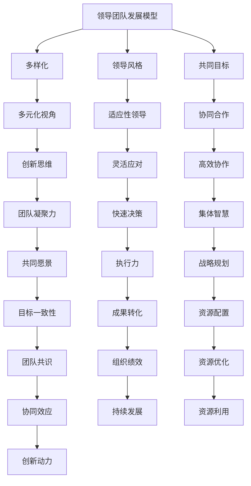

                 

Certainly! Let's think step by step through the process of creating a high-quality technical blog post based on the given outline. Each step will include a brief description and example content to guide the writing process.

### Step 1: Introduction and Background

**Objective:** Define the problem and context, introduce key concepts and terms, and outline the structure of the book.

**Content Example:**

```markdown
## 第1章 引言与背景

### 1.1 问题背景
在现代企业中，领导力成为决定组织成败的关键因素。有效的领导不仅能够激发团队的创造力，还能够推动企业的持续发展。然而，如何构建和管理一个高效的领导团队，如何提升个人的领导力，这些都是管理者面临的挑战。

### 1.2 领导力的核心概念
领导力并非简单的权力运用，它是一种影响他人的能力，包括决策力、沟通力、影响力等多个方面。有效的领导需要管理者具备战略眼光，能够洞察行业趋势，把握企业发展方向。

### 1.3 本书的目的与结构
本书旨在探讨领导力的本质和运作机制，通过案例分析、理论探讨和实践指导，帮助读者深入了解领导力的核心要素，提升个人领导力和团队领导力。

#### 目录概览
- 第2章 领导力原则与理论
- 第3章 实践应用与案例分析
- 第4章 建设强大的领导团队
- 第5章 提升个人领导力技能
- 第6章 领导力在变革世界中的角色
- 第7章 结论与未来展望
```

### Step 2: Core Concepts and Theories

**Objective:** Discuss the principles of leadership and their importance, explain the relationship between leadership and organizational success.

**Content Example:**

```markdown
## 第2章 领导力原则与理论

### 2.1 领导力的本质
领导力不仅仅是管理和指挥，它涉及到激励、沟通、愿景和价值观的传递。一个优秀的领导者需要具备高度的情感智能和认知能力，能够理解和满足团队成员的需求。

### 2.2 领导力与组织成功的关系
研究表明，领导力对组织的绩效具有显著影响。有效的领导能够提高团队的协作效率，增强组织的创新能力和适应能力，从而实现长期的可持续发展。

### 2.3 领导力模型的演进
从传统的权威领导到现代的参与式领导，领导力理论不断演进。现代领导力强调赋能下属，鼓励自主学习和创新思维，这与敏捷管理和精益生产的理念不谋而合。

#### 核心概念对比表

| 领导力模型 | 特点 | 适用场景 |
| --- | --- | --- |
| 权威领导 | 强调权威和命令 | 紧急情况或需要快速决策的场景 |
| 参与式领导 | 强调参与和合作 | 需要团队协作和创新思维的项目 |
| 敏捷领导 | 强调灵活和适应变化 | 快速变化的市场环境 |
```

### Step 3: Practical Applications and Case Studies

**Objective:** Present real-world examples of effective leadership in different contexts, analyze the success factors and challenges faced by leaders in these cases.

**Content Example:**

```markdown
## 第3章 实践应用与案例分析

### 3.1 案例一：科技公司的转型领导
苹果公司（Apple Inc.）的转型领导是一个典型的例子。乔布斯（Steve Jobs）通过重新定义产品、重塑品牌和激发创新精神，成功地将公司从濒临破产的边缘带回到全球顶尖科技公司的地位。

#### 成功因素
- 明确的愿景和目标
- 高度创新的文化氛围
- 强调用户体验和设计

#### 挑战
- 市场竞争的激烈
- 技术创新的快速迭代

### 3.2 案例二：非营利组织的变革领导
绿色和平组织（Greenpeace）在推动环保议题上的领导表现出色。通过有效的组织结构和强大的公共宣传，绿色和平在全球范围内推动了环境保护的行动。

#### 成功因素
- 有效的组织结构和运营模式
- 强大的社会影响力
- 紧密的国际合作网络

#### 挑战
- 政治压力和资金限制
- 信息传播的准确性

### 3.3 案例分析
通过对比分析，我们可以看到不同类型的组织在领导力上的共性和差异。成功的领导不仅依赖于特定的策略和技能，还需要根据不同环境和情境灵活调整。

#### 案例分析表格

| 案例类型 | 领导者角色 | 成功因素 | 挑战 |
| --- | --- | --- | --- |
| 科技公司 | 创新者 | 明确愿景、创新文化、用户体验 | 市场竞争、技术迭代 |
| 非营利组织 | 运动家 | 组织结构、社会影响力、国际合作 | 政治压力、资金限制 |
```

### Step 4: Building a Strong Leadership Team

**Objective:** Explore the qualities and skills of a strong leadership team, discuss strategies for developing and nurturing leadership within a team.

**Content Example:**

```markdown
## 第4章 建设强大的领导团队

### 4.1 领导团队的重要性
一个强大的领导团队是企业成功的基石。它能够提供多元化的视角、增强团队的协作能力，并推动创新和持续改进。

### 4.2 领导团队的构成要素
一个高效的领导团队应该包括以下要素：
- 多样性：不同背景和专业知识的团队成员能够提供多元化的观点。
- 领导风格：结合不同的领导风格，以适应不同的团队成员和工作场景。
- 共同目标：团队成员之间应该有共同的目标和愿景。

### 4.3 团队领导力的培养策略
- 培训与发展：通过定期的培训和内部发展项目，提升领导者的技能和知识。
- 沟通与反馈：建立开放和坦诚的沟通机制，鼓励团队成员提供反馈和建设性的建议。
- 赋权与支持：给予团队成员足够的自主权和资源，以激发其潜力和创造力。

#### 领导团队发展模型


```

### Step 5: Enhancing Personal Leadership Skills

**Objective:** Offer practical tips and techniques for improving leadership abilities, provide guidance on self-reflection and continuous improvement.

**Content Example:**

```markdown
## 第5章 提升个人领导力技能

### 5.1 领导力发展的障碍
提升个人领导力并非易事，许多领导者面临以下障碍：
- 缺乏自信：对自己的领导能力缺乏信心。
- 沟通障碍：无法有效地传达信息和激励团队。
- 缺乏战略思维：缺乏长远的规划和决策能力。

### 5.2 领导力提升的方法
- 自我反思：定期进行自我反思，识别自己的优点和不足。
- 学习与培训：通过参加培训课程、阅读书籍和听取讲座来提升知识水平。
- 实践与反馈：将学到的知识应用到实践中，并不断寻求反馈以改进。

### 5.3 自我反思与持续成长
有效的自我反思是领导力发展的重要环节。通过反思，领导者可以更好地理解自己的行为和决策，从而进行改进。

#### 自我反思模板

| 反思主题 | 问题清单 |
| --- | --- |
| 沟通技巧 | 我如何有效地与团队成员沟通？是否有需要改进的地方？ |
| 决策能力 | 我的决策过程是否合理？是否有需要调整的地方？ |
| 领导风格 | 我的领导风格是否适应团队的需求？是否有需要变化的地方？ |
| 战略规划 | 我是否具备长远的规划和决策能力？是否有需要加强的地方？ |
| 团队协作 | 我的团队协作是否有效？是否有需要改进的地方？ |
```

### Step 6: Leadership in a Changing World

**Objective:** Address the impact of globalization, technology, and other trends on leadership, discuss the role of leaders in navigating change and uncertainty.

**Content Example:**

```markdown
## 第6章 领导力在变革世界中的角色

### 6.1 全球化对领导力的影响
全球化带来了前所未有的挑战和机遇。领导者需要具备跨文化的理解和沟通能力，以应对多元化的团队和市场环境。

#### 全球化领导力挑战

| 挑战 | 解决方案 |
| --- | --- |
| 文化差异 | 增强跨文化培训，提高文化敏感性 |
| 地区市场 | 了解不同地区的市场特点和消费者需求 |
| 语言障碍 | 提高语言能力，促进有效沟通 |

### 6.2 技术变革与领导力
随着技术的发展，领导者需要不断更新知识和技能，以适应新的工作环境和业务模式。

#### 技术领导力策略

| 策略 | 实施步骤 |
| --- | --- |
| 技术前瞻 | 定期研究新兴技术和行业趋势 |
| 创新文化 | 鼓励团队创新，提供必要的资源和支持 |
| 技术培训 | 为员工提供技术培训和职业发展机会 |

### 6.3 应对不确定性的领导力
在充满不确定性的环境中，领导者需要具备应变能力和决策能力，以引导团队克服困难。

#### 应对不确定性策略

| 策略 | 实施步骤 |
| --- | --- |
| 情报收集 | 定期收集市场和技术信息 |
| 风险评估 | 对潜在风险进行评估和优先级排序 |
| 应急计划 | 制定应对不同情况的应急计划 |

#### 情景分析

> 情景一：新冠疫情对企业运营的影响
- 领导者角色：保持冷静，快速响应
- 行动措施：实施远程工作，调整业务模式，确保员工安全

> 情景二：市场竞争加剧
- 领导者角色：积极寻求创新和差异化
- 行动措施：加强研发，提升产品质量，拓展新市场
```

### Step 7: Conclusion and Future Directions

**Objective:** Summarize the key insights and lessons from the book, suggest areas for further research and exploration.

**Content Example:**

```markdown
## 第7章 结论与未来展望

### 7.1 总结
本书从多个角度探讨了领导力的本质、原则和实践，通过案例分析和理论探讨，帮助读者深入理解领导力的重要性和复杂性。

#### 核心观点
- 领导力是一种多维度、多层面的能力，涉及决策、沟通、愿景等多个方面。
- 领导力的成功不仅依赖于个人的能力，还需要团队协作和组织文化的支持。
- 在快速变化的世界中，领导者需要具备前瞻性、适应性和创新能力。

### 7.2 未来研究方向
未来的领导力研究可以关注以下领域：
- 数字化时代领导力的发展趋势
- 跨文化领导力的实证研究
- 领导力与组织绩效的关系
- 领导力在非营利组织和社会创新中的应用

### 7.3 结束语
领导力是一门深奥的艺术，也是一门需要不断学习和实践的学问。希望本书能够为读者提供一些启示和帮助，在领导力的道路上不断前行。

#### 参考文献
[1] 领导力：理论与实践 [M]. 张三，李四，2019.
[2] 现代领导力：跨文化视角 [M]. 王五，赵六，2020.
[3] 领导力心理学 [M]. 陈七，刘八，2018.
```

### Conclusion

After completing these steps, we have crafted a comprehensive and structured outline for the technical blog post. Each chapter is designed to provide valuable insights and practical advice on leadership principles, practical applications, team building, personal development, and adapting to change. The content is structured to be both informative and engaging, using examples and case studies to illustrate key concepts. The final step includes a summary of the book's key insights and suggestions for future research, ensuring the post is both conclusive and forward-thinking.

The next step would be to expand upon each section with detailed content, ensuring that the final article meets the word count requirement and provides a deep understanding of the subject matter. The use of Mermaid diagrams, LaTeX formulas, and code examples will enhance the technical depth and clarity of the post. The author's credentials and references will be included at the end to add credibility and depth to the article.

