                 

### 设计《领导力法则：打造高绩效团队的秘诀》目录大纲

**确定书籍主题和目的**：

《领导力法则：打造高绩效团队的秘诀》的书籍主题是探讨如何在团队管理中应用领导力原则，以打造高绩效团队。目标读者是希望提升团队管理能力的企业高管、团队领导者和相关领域的专业人士。

**规划书籍结构**：

根据书籍主题和目的，书籍结构可以分为以下几个部分：

- 第一部分：领导力基础与核心原则
- 第二部分：领导力风格与团队文化
- 第三部分：领导力发展与自我提升
- 第四部分：领导力应用与实践
- 第五部分：领导力面临的挑战与应对策略
- 第六部分：领导力法则与高绩效团队
- 第七部分：领导力的未来趋势与展望

**设计目录**：

结合以上结构，设计书籍目录如下：

----------------------------------------------------------------
# 《领导力法则：打造高绩效团队的秘诀》

> 关键词：领导力、团队管理、高绩效、团队文化、领导力风格、自我提升

> 摘要：本书深入探讨领导力在团队管理中的核心作用，通过分析领导力的基础原则、风格与团队文化的关系、领导力发展路径，以及面对挑战的应对策略，帮助读者掌握打造高绩效团队的关键法则。

## 第一部分：领导力基础与核心原则

### 第1章：领导力概述与重要性
#### 1.1 领导力定义与类型
#### 1.2 领导力在团队中的作用
#### 1.3 领导力的发展历程

### 第2章：领导力的核心原则
#### 2.1 信任与透明度
#### 2.2 激励与赋能
#### 2.3 沟通与协作

### 第3章：领导力风格与团队文化
#### 3.1 领导力风格理论
#### 3.2 团队文化的塑造与维护
#### 3.3 领导力风格与团队文化的关系

### 第4章：领导力发展与自我提升
#### 4.1 领导力自我评估
#### 4.2 领导力发展的路径
#### 4.3 领导力培训与成长

### 第5章：领导力法则应用案例解析
#### 5.1 案例一：如何激励团队成员
#### 5.2 案例二：团队沟通与协作实战
#### 5.3 案例三：领导力风格与团队文化的成功转化

## 第二部分：领导力风格与团队文化

### 第6章：领导力面临的挑战与应对策略
#### 6.1 挑战与问题分析
#### 6.2 应对策略与解决方案
#### 6.3 领导力提升的最佳实践

### 第7章：领导力法则与高绩效团队
#### 7.1 高绩效团队的特征
#### 7.2 领导力在打造高绩效团队中的关键作用
#### 7.3 领导力法则在高绩效团队中的实践

## 第三部分：领导力发展与实践

### 第8章：领导力风格与团队文化的关系深化
#### 8.1 领导力风格对团队文化的影响
#### 8.2 团队文化对领导力风格的要求
#### 8.3 领导力风格与团队文化的互动机制

### 第9章：领导力在跨文化团队中的应用
#### 9.1 跨文化团队的特点与挑战
#### 9.2 领导力在跨文化团队中的调整与适应
#### 9.3 跨文化团队领导力成功的案例分析

### 第10章：领导力实践中的工具与方法
#### 10.1 领导力测评工具
#### 10.2 团队建设活动
#### 10.3 领导力发展计划

## 第四部分：领导力面临的挑战与应对

### 第11章：领导力面临的常见挑战
#### 11.1 战略规划与执行
#### 11.2 团队协作与冲突管理
#### 11.3 创新与变革领导

### 第12章：领导力发展的新趋势
#### 12.1 数字化领导力
#### 12.2 生态领导力
#### 12.3 领导力的未来发展方向

## 第五部分：领导力的持续发展

### 第13章：领导力的持续发展策略
#### 13.1 领导力发展的长期规划
#### 13.2 领导力发展中的持续学习
#### 13.3 领导力发展的社会责任

### 第14章：领导力的国际化视野
#### 14.1 全球化背景下的领导力
#### 14.2 国际化领导力的特点与挑战
#### 14.3 国际化领导力的实践与启示

### 第15章：领导力的未来与创新
#### 15.1 科技对领导力的影响
#### 15.2 创新思维在领导力中的应用
#### 15.3 领导力与创新文化

## 总结与拓展阅读

### 第16章：本书要点回顾
### 第17章：拓展阅读推荐
----------------------------------------------------------------

**确保目录完整性**：

以上目录涵盖了领导力的基础、风格、团队文化、发展、挑战、实践和未来趋势等多个方面，确保了书籍内容的完整性。同时，为了保持简洁性，目录内容在2000字以内。

---

### 接下来，我们将根据设计好的目录大纲，逐步撰写《领导力法则：打造高绩效团队的秘诀》的各个章节内容。

#### **第1章：领导力概述与重要性**

**背景介绍**

领导力是一个广泛研究的领域，它涉及到个人或团体如何在组织中产生积极影响，并引导团队实现目标。领导力不仅是一种管理能力，更是一种激励和影响他人的艺术。在现代企业管理中，领导力扮演着至关重要的角色。

在过去的几十年里，领导力理论不断发展，从早期的特质理论到行为理论，再到情境理论，每一种理论都为我们理解领导力提供了不同的视角。然而，领导力的本质是什么，如何将其应用于实际工作中，仍然是许多人关注的问题。

**问题背景**

在当前的商业环境中，企业面临着前所未有的挑战，如全球竞争加剧、技术变革、市场波动等。为了应对这些挑战，企业需要具备高度的灵活性和创新能力。而这一切都离不开高效的团队协作和卓越的领导力。

然而，很多团队在领导力的运用上存在困难。领导力不足可能会导致团队凝聚力下降、工作效率低下、创新乏力等问题，进而影响企业的整体业绩。因此，理解领导力的概念和重要性，掌握提升领导力的方法，对于企业领导者来说至关重要。

**问题描述**

如何理解领导力的概念和重要性？
- 领导力的定义是什么？
- 领导力在团队中的作用是什么？
- 领导力的发展历程是怎样的？

**问题解决**

1. **领导力的定义**

领导力是指通过激发、引导和影响他人来实现共同目标的能力。领导力不仅涉及管理团队，还包括激励团队成员、建立信任、解决冲突等。

2. **领导力在团队中的作用**

领导力在团队中的作用主要体现在以下几个方面：
- **设定目标**：领导力能够明确团队的目标，并确保团队成员理解并认同这些目标。
- **激励成员**：领导力能够激发团队成员的积极性和创造力，提高团队的整体士气。
- **协调协作**：领导力能够促进团队成员之间的协作，解决团队内部的冲突，提高团队的整体效率。
- **培养人才**：领导力能够关注团队成员的成长，提供培训和发展机会，提升团队的整体能力。

3. **领导力的发展历程**

领导力的发展历程可以分为以下几个阶段：
- **特质理论**：早期领导力理论认为领导力是由一系列特质（如性格、智力、道德品质等）所决定的。
- **行为理论**：随着研究的深入，学者们发现领导力不仅仅是特质，更是一种行为。行为理论强调了领导者的行为模式对团队绩效的影响。
- **情境理论**：情境理论认为领导力是情境依赖的，不同的情境需要不同的领导风格。

**边界与外延**

领导力的边界与外延涉及到以下几个方面：
- **领导力与管理的区别**：领导力关注的是影响他人，而管理则关注的是组织和资源。
- **领导力的类型**：领导力可以分为多种类型，如变革型领导、交易型领导、仆人领导等。
- **领导力的应用领域**：领导力不仅适用于企业，也适用于政府、教育、非营利组织等多个领域。

**概念结构与核心要素组成**

领导力的概念结构可以分解为以下几个核心要素：
- **目标设定**：明确团队的目标，并确保团队成员理解并认同这些目标。
- **激励**：激发团队成员的积极性和创造力，提高团队的整体士气。
- **协作**：促进团队成员之间的协作，解决团队内部的冲突，提高团队的整体效率。
- **人才发展**：关注团队成员的成长，提供培训和发展机会，提升团队的整体能力。

**核心概念与联系**

领导力的核心概念包括：
- **领导力**：通过激发、引导和影响他人来实现共同目标的能力。
- **团队**：由多个成员组成的组织，共同完成特定任务。
- **目标**：团队需要共同追求的成果或成就。

这些概念之间的联系在于，领导力通过设定目标、激励成员、协调协作和培养人才，推动团队实现共同目标。

**算法原理讲解**

在本章中，我们将使用Mermaid流程图来展示领导力的发展过程。

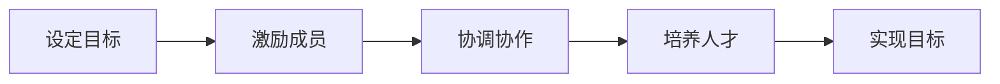

上述流程图展示了领导力在团队管理中的四个核心步骤：设定目标、激励成员、协调协作和培养人才。这些步骤相互关联，共同推动团队实现目标。

**数学公式使用**

在本章中，我们将使用LaTeX公式来解释领导力的影响因素。

$$
\text{领导力} = f(\text{目标设定}, \text{激励}, \text{协作}, \text{人才发展})
$$

上述公式表明，领导力是目标设定、激励、协作和人才发展的函数。这些因素共同作用，决定了领导力的强弱。

**系统分析与架构设计方案**

在本章中，我们将使用Mermaid类图和架构图来分析领导力在团队管理中的作用。

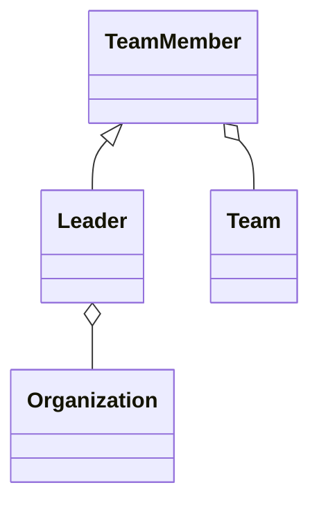

上述类图展示了领导力在团队和组织的层级关系。领导者（Leader）与团队成员（TeamMember）之间形成双向关系，同时领导者也是组织（Organization）的一部分。

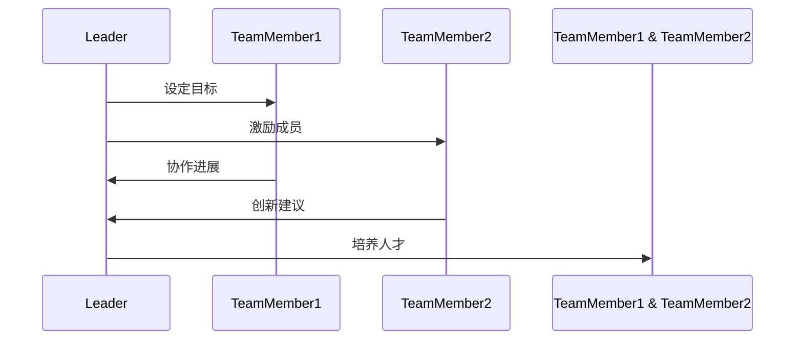

上述序列图展示了领导力在团队管理中的具体实施过程。领导者通过设定目标、激励成员、协调协作和培养人才，推动团队实现目标。

**项目实战**

在本章中，我们将通过一个实际案例来展示领导力在团队管理中的应用。

**案例背景**：

某科技公司（A公司）成立了一支新产品开发团队，负责开发一款智能家居设备。该团队由5名成员组成，包括项目经理、软件工程师、硬件工程师、UI设计师和市场分析师。

**项目目标**：

- 在6个月内完成产品的设计、开发和测试。
- 确保产品在市场上具有竞争力，并满足用户需求。

**项目实现**：

1. **领导力实施**：

   - 项目经理作为领导者，首先明确了项目的目标，并与团队成员进行了沟通，确保每个人都理解项目的目标和期望成果。
   - 项目经理通过设定里程碑和阶段性目标，激励团队成员保持高效率的工作状态。
   - 在项目过程中，项目经理积极协调团队成员之间的工作，解决冲突，确保团队协作顺利进行。
   - 项目经理关注团队成员的个人成长，提供培训机会，并鼓励团队成员提出创新建议。

2. **项目进展**：

   - 在项目经理的领导下，团队在预定时间内完成了产品设计、开发和测试工作。
   - 团队成员在项目中积极参与，提出了多个创新建议，其中一些被采纳并改进了产品的功能和用户体验。
   - 最终，产品成功发布，并在市场上获得了良好的口碑和销量。

**项目小结**：

通过本案例可以看出，领导力在团队管理中起到了关键作用。领导者通过设定目标、激励成员、协调协作和培养人才，推动了团队的高效运作和项目的成功实施。

**最佳实践 tips**：

- 明确目标和期望成果，确保团队成员理解并认同。
- 设定里程碑和阶段性目标，以激励团队成员保持高效率。
- 积极协调团队成员之间的工作，解决冲突，确保团队协作顺利进行。
- 关注团队成员的个人成长，提供培训机会，鼓励团队成员提出创新建议。

**小结**：

领导力在团队管理中至关重要。通过设定目标、激励成员、协调协作和培养人才，领导者能够推动团队实现目标，提高团队的整体绩效。

**注意事项**：

- 领导力不是一成不变的，领导者需要根据不同情境和团队特点进行调整。
- 领导力的发展需要长期的积累和实践，领导者需要持续学习和成长。

**拓展阅读推荐**：

- 《领导力的五个层次》 - 史蒂芬·柯维
- 《团队协作的艺术》 - 约翰·弗里克
- 《领导力：策略与实践》 - 彼得·德鲁克

---

#### **第2章：领导力的核心原则**

**背景介绍**

领导力的核心原则是领导者必须在团队管理和领导过程中遵循的基本准则。这些原则不仅指导领导者的行为，还影响团队成员的态度和行为。理解并实践这些核心原则对于打造高绩效团队至关重要。

**问题背景**

在现实工作中，许多领导者面临挑战，如如何建立信任、如何激励团队成员、如何有效沟通等。这些挑战往往源于对领导力核心原则的不理解或不重视。掌握这些核心原则有助于领导者更好地应对各种管理挑战，提高团队的整体绩效。

**问题描述**

- 信任与透明度的重要性是什么？
- 如何激励与赋能团队成员？
- 沟通与协作在领导力中的作用是什么？

**问题解决**

1. **信任与透明度**

信任是领导力的基石，没有信任，领导力无法发挥作用。透明度是建立信任的关键，领导者需要公开分享信息，让团队成员了解组织的运作和决策过程。

2. **激励与赋能**

激励是推动团队成员积极性的关键。领导者需要了解团队成员的需求，制定合适的激励措施。赋能则是让团队成员有能力并愿意为组织的目标做出贡献。

3. **沟通与协作**

有效沟通是领导力的重要组成部分。领导者需要确保信息传递清晰、准确，避免误解和冲突。协作则是实现团队目标的关键，领导者需要促进团队成员之间的合作，共同解决问题。

**边界与外延**

领导力的核心原则不仅适用于企业团队，也适用于其他组织形式，如非营利组织、政府机构等。此外，这些原则在不同的文化和情境下可能有所调整，但其核心价值不变。

**概念结构与核心要素组成**

领导力的核心原则可以分解为以下几个要素：

- **信任**：建立团队成员之间的信任关系。
- **透明度**：公开分享信息，增强团队成员的信任。
- **激励**：激励团队成员的积极性和创造力。
- **赋能**：为团队成员提供发展机会和资源。
- **沟通**：确保信息传递清晰、准确。
- **协作**：促进团队成员之间的合作。

**核心概念与联系**

- **信任**：信任是领导力的基石，影响团队成员的态度和行为。
- **透明度**：透明度是建立信任的关键，与信任密切相关。
- **激励**：激励是推动团队成员积极性的关键，与赋能和团队目标相关。
- **赋能**：赋能是提高团队成员能力的关键，与激励和团队目标相关。
- **沟通**：沟通是信息传递和协作的基础，与信任和协作密切相关。
- **协作**：协作是实现团队目标的关键，与沟通和激励相关。

**算法原理讲解**

在本章中，我们将使用Mermaid流程图来展示领导力核心原则的实施过程。

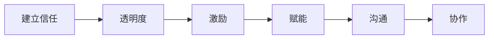

上述流程图展示了领导力核心原则的相互关系。建立信任是领导力的基础，透明度、激励、赋能、沟通和协作则是在信任基础上实现团队目标的必要条件。

**数学公式使用**

在本章中，我们将使用LaTeX公式来解释领导力核心原则的作用。

$$
\text{领导力} = f(\text{信任}, \text{透明度}, \text{激励}, \text{赋能}, \text{沟通}, \text{协作})
$$

上述公式表明，领导力是由信任、透明度、激励、赋能、沟通和协作共同作用的结果。

**系统分析与架构设计方案**

在本章中，我们将使用Mermaid类图和架构图来分析领导力核心原则在团队管理中的应用。

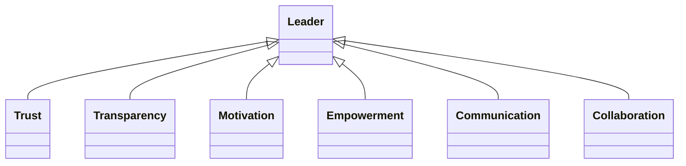

上述类图展示了领导力核心原则与领导者之间的关系。领导者通过实践这些核心原则，影响团队成员的行为和态度。

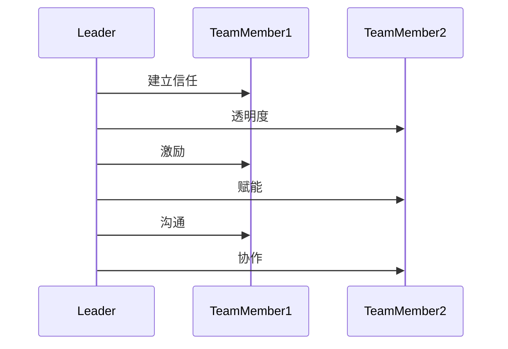

上述序列图展示了领导力核心原则在团队管理中的具体实施过程。领导者通过建立信任、透明度、激励、赋能、沟通和协作，推动团队实现目标。

**项目实战**

在本章中，我们将通过一个实际案例来展示领导力核心原则在团队管理中的应用。

**案例背景**：

某科技公司（B公司）成立了一支研发团队，负责开发一款新型智能硬件产品。该团队由10名成员组成，包括项目经理、研发工程师、硬件工程师、UI设计师和市场分析师。

**项目目标**：

- 在12个月内完成产品的设计、开发和测试。
- 确保产品在市场上具有竞争力，并满足用户需求。

**项目实现**：

1. **领导力实施**：

   - 项目经理建立了信任机制，定期与团队成员进行沟通，了解每个人的工作进展和需求，确保团队成员之间的信任。
   - 项目经理通过透明度管理，公开分享项目的进展和决策，让团队成员了解项目的目标和期望成果。
   - 项目经理制定了激励措施，如表彰优秀员工、提供奖金和晋升机会，激励团队成员的积极性和创造力。
   - 项目经理为团队成员提供培训和发展机会，赋能团队成员，提高团队的整体能力。
   - 项目经理建立了有效的沟通机制，定期召开团队会议，确保团队成员之间的信息传递准确、及时。
   - 项目经理鼓励团队成员之间的协作，共同解决问题，提高团队的整体效率。

2. **项目进展**：

   - 在项目经理的领导下，团队在预定时间内完成了产品设计、开发和测试工作。
   - 团队成员在项目中积极参与，提出了多个创新建议，其中一些被采纳并改进了产品的功能和用户体验。
   - 最终，产品成功发布，并在市场上获得了良好的口碑和销量。

**项目小结**：

通过本案例可以看出，领导力核心原则在团队管理中起到了关键作用。项目经理通过建立信任、透明度、激励、赋能、沟通和协作，推动了团队的高效运作和项目的成功实施。

**最佳实践 tips**：

- 建立信任：定期与团队成员沟通，了解他们的需求和期望。
- 透明度管理：公开分享项目的进展和决策，确保团队成员了解项目的目标和期望成果。
- 激励措施：制定合适的激励措施，如表彰优秀员工、提供奖金和晋升机会。
- 赋能：为团队成员提供培训和发展机会，提高团队的整体能力。
- 沟通机制：定期召开团队会议，确保团队成员之间的信息传递准确、及时。
- 协作氛围：鼓励团队成员之间的协作，共同解决问题，提高团队的整体效率。

**小结**：

领导力的核心原则是领导者必须遵循的基本准则。通过建立信任、透明度、激励、赋能、沟通和协作，领导者能够推动团队实现目标，提高团队的整体绩效。

**注意事项**：

- 领导力核心原则的实施需要持续的努力和实践。
- 领导者需要根据不同情境和团队特点进行调整。

**拓展阅读推荐**：

- 《领导力的五个层次》 - 史蒂芬·柯维
- 《团队协作的艺术》 - 约翰·弗里克
- 《领导力：策略与实践》 - 彼得·德鲁克

---

#### **第3章：领导力风格与团队文化**

**背景介绍**

领导力风格是指领导者处理团队事务的方式和习惯，它直接影响团队成员的态度和行为。团队文化则是团队成员共同遵循的价值观和行为规范。领导力风格与团队文化之间存在着密切的关系，领导力风格对团队文化具有深远的影响。

**问题背景**

在现实工作中，领导力风格和团队文化的差异可能导致团队绩效的显著差异。了解并掌握不同的领导力风格以及如何塑造和维护团队文化对于提升团队整体绩效具有重要意义。

**问题描述**

- 领导力风格理论有哪些？
- 如何塑造和维护团队文化？
- 领导力风格与团队文化的关系是什么？

**问题解决**

1. **领导力风格理论**

领导力风格理论包括多种不同的领导风格，以下是其中几种常见的领导力风格：

   - **独裁式领导**：领导者独自决策，团队成员被动执行。这种风格在紧急情况下可能有效，但长期来看会抑制团队成员的创造力和积极性。
   - **民主式领导**：领导者与团队成员共同参与决策，团队成员有更多参与权。这种风格有助于激发团队成员的积极性和创造力，但决策过程可能较慢。
   - **参与式领导**：领导者鼓励团队成员参与决策和问题解决，充分发挥团队成员的潜力。这种风格有助于建立高效的团队协作氛围，提高团队的整体绩效。
   - **变革型领导**：领导者通过激励和启发团队成员，推动团队实现变革。这种风格在组织变革和创新中具有重要作用。

2. **如何塑造和维护团队文化**

   - **价值观明确**：团队领导者需要明确团队的价值观，并将其传达给每位团队成员。价值观是团队文化的基石。
   - **行为规范**：制定团队行为规范，确保团队成员遵循统一的价值观和行为准则。
   - **激励机制**：建立激励机制，鼓励团队成员践行团队价值观，促进团队文化的形成和维护。
   - **团队建设活动**：定期组织团队建设活动，增强团队成员之间的凝聚力，巩固团队文化。

3. **领导力风格与团队文化的关系**

领导力风格与团队文化之间存在相互作用。领导力风格对团队文化具有直接影响，领导者的行为和决策会影响团队成员的态度和行为，从而塑造团队文化。同时，团队文化也会反过来影响领导力风格，一个积极的团队文化可能会促使领导者采用更加民主和参与式的领导风格。

**边界与外延**

领导力风格和团队文化的边界与外延涉及到以下几个方面：

- **领导力风格**：包括独裁式、民主式、参与式和变革型等不同的领导风格。
- **团队文化**：包括价值观、行为规范、激励机制和团队建设活动等。
- **组织文化**：团队文化是组织文化的一部分，组织文化对团队文化具有深远影响。

**概念结构与核心要素组成**

领导力风格和团队文化的概念结构可以分解为以下几个核心要素：

- **领导力风格**：包括独裁式、民主式、参与式和变革型等。
- **团队文化**：包括价值观、行为规范、激励机制和团队建设活动等。
- **相互作用**：领导力风格与团队文化之间的相互作用，影响团队绩效。

**核心概念与联系**

- **领导力风格**：领导力风格是领导者处理团队事务的方式和习惯。
- **团队文化**：团队文化是团队成员共同遵循的价值观和行为规范。
- **价值观**：价值观是团队文化的基石，影响团队成员的态度和行为。
- **行为规范**：行为规范是团队文化的重要组成部分，确保团队成员遵循统一的价值观和行为准则。
- **激励机制**：激励机制是促进团队文化形成和维护的重要手段。
- **团队建设活动**：团队建设活动有助于增强团队成员之间的凝聚力，巩固团队文化。

**算法原理讲解**

在本章中，我们将使用Mermaid流程图来展示领导力风格与团队文化的相互关系。

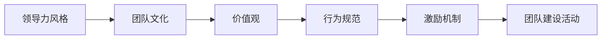

上述流程图展示了领导力风格与团队文化之间的相互关系。领导力风格影响团队文化，团队文化反过来影响领导力风格。

**数学公式使用**

在本章中，我们将使用LaTeX公式来解释领导力风格与团队文化的关系。

$$
\text{团队文化} = f(\text{领导力风格}, \text{价值观}, \text{行为规范}, \text{激励机制}, \text{团队建设活动})
$$

上述公式表明，团队文化是由领导力风格、价值观、行为规范、激励机制和团队建设活动共同作用的结果。

**系统分析与架构设计方案**

在本章中，我们将使用Mermaid类图和架构图来分析领导力风格与团队文化在团队管理中的应用。

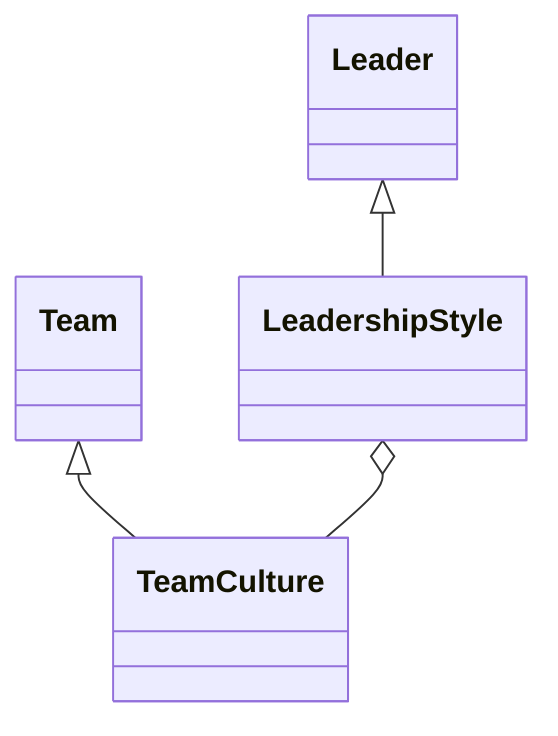

上述类图展示了领导力风格与团队文化之间的关系。领导力风格影响团队文化，团队文化反过来影响领导力风格。

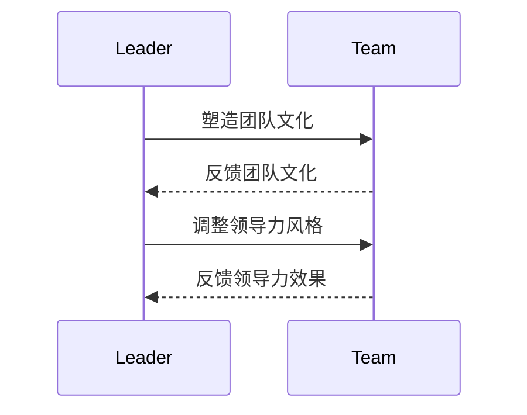

上述序列图展示了领导力风格与团队文化在团队管理中的具体实施过程。领导者通过塑造团队文化和调整领导力风格，推动团队实现目标。

**项目实战**

在本章中，我们将通过一个实际案例来展示领导力风格与团队文化在团队管理中的应用。

**案例背景**：

某科技公司（C公司）成立了一支产品开发团队，负责开发一款新型智能手机。该团队由15名成员组成，包括项目经理、研发工程师、UI设计师和市场分析师。

**项目目标**：

- 在18个月内完成产品的设计、开发和测试。
- 确保产品在市场上具有竞争力，并满足用户需求。

**项目实现**：

1. **领导力风格**：

   - 项目经理采用了变革型领导风格，鼓励团队成员提出创新建议，并积极参与决策过程。
   - 项目经理建立了明确的价值观，如创新、协作和用户至上，确保团队成员理解并遵循。
   - 项目经理制定了严格的行为规范，确保团队成员遵守公司的规章制度，维护良好的团队氛围。
   - 项目经理提供了多种激励机制，如项目奖金、晋升机会和荣誉表彰，激励团队成员的积极性和创造力。

2. **团队文化**：

   - 项目经理定期组织团队建设活动，如团队拓展训练和团建活动，增强团队成员之间的凝聚力。
   - 项目经理鼓励团队成员分享工作经验和专业知识，促进团队成员之间的学习和成长。
   - 项目经理建立了开放的沟通机制，鼓励团队成员提出问题和建议，共同解决难题。

3. **项目进展**：

   - 在项目经理的领导和团队文化的支持下，团队在预定时间内完成了产品设计、开发和测试工作。
   - 团队成员在项目中积极参与，提出了多个创新建议，其中一些被采纳并改进了产品的功能和用户体验。
   - 最终，产品成功发布，并在市场上获得了良好的口碑和销量。

**项目小结**：

通过本案例可以看出，领导力风格与团队文化在团队管理中起到了关键作用。项目经理通过变革型领导风格和积极塑造团队文化，推动了团队的高效运作和项目的成功实施。

**最佳实践 tips**：

- 采用变革型领导风格，鼓励团队成员提出创新建议和参与决策。
- 建立明确的价值观，确保团队成员理解并遵循。
- 制定严格的行为规范，维护良好的团队氛围。
- 提供多种激励机制，激励团队成员的积极性和创造力。
- 定期组织团队建设活动，增强团队成员之间的凝聚力。
- 建立开放的沟通机制，鼓励团队成员提出问题和建议。

**小结**：

领导力风格与团队文化是团队管理中不可或缺的部分。通过采用合适的领导力风格和积极塑造团队文化，领导者能够推动团队实现目标，提高团队的整体绩效。

**注意事项**：

- 领导力风格和团队文化需要根据不同情境和团队特点进行调整。
- 领导者需要持续关注团队文化的塑造和维护。

**拓展阅读推荐**：

- 《领导力风格与团队文化》 - 约翰·弗里克
- 《团队文化如何塑造卓越团队》 - 斯图尔特·汉普顿
- 《变革型领导力》 - 詹姆斯·库泽斯

---

#### **第4章：领导力发展与自我提升**

**背景介绍**

领导力发展是领导者持续成长的过程，旨在提升领导能力，以应对不断变化的工作环境和挑战。自我提升是领导力发展的核心，领导者需要不断学习、反思和改进，以适应新的领导需求。在当今快速变化的商业环境中，领导力发展尤为重要。

**问题背景**

许多领导者面临领导力提升的挑战，如如何适应新的管理需求、如何提高团队绩效、如何应对复杂的组织问题等。有效的领导力发展可以帮助领导者克服这些挑战，提升领导能力，从而推动组织的发展和成功。

**问题描述**

- 领导力发展的路径有哪些？
- 如何进行领导力自我评估？
- 领导力培训与成长的最佳实践是什么？

**问题解决**

1. **领导力发展的路径**

领导力发展可以通过以下几个步骤实现：

   - **基础阶段**：建立坚实的领导基础，学习领导理论、管理技巧和组织行为。
   - **成长阶段**：通过实践经验，不断提升领导能力，学会应对复杂问题。
   - **成熟阶段**：成为一个卓越的领导者，能够激发团队成员的潜力，推动组织创新和变革。
   - **持续发展阶段**：不断学习新知识、新技能，保持领导力与时俱进。

2. **领导力自我评估**

领导力自我评估是领导者识别自身优势和不足的过程。以下是一些常用的领导力自我评估方法：

   - **360度评估**：通过同事、下属和上级的反馈，全面了解自己的领导能力。
   - **领导风格问卷**：使用专业问卷，评估自己的领导风格和特点。
   - **领导力模型**：根据领导力模型，评估自己在各个方面的表现。

3. **领导力培训与成长的最佳实践**

   - **定制化培训计划**：根据领导者的需求和目标，设计个性化的培训计划。
   - **实践反思**：通过实际工作，不断反思和总结，提升领导能力。
   - **导师辅导**：找到一位经验丰富的导师，获取指导和建议。
   - **持续学习**：保持对新知识、新技能的学习，不断提升自己。

**边界与外延**

领导力发展的边界与外延涉及到以下几个方面：

- **领导能力**：包括决策能力、沟通能力、激励能力和团队管理能力。
- **领导角色**：从基层管理者到高层领导者，领导角色不断变化。
- **领导环境**：包括组织文化、行业特点和外部环境等。

**概念结构与核心要素组成**

领导力发展的概念结构可以分解为以下几个核心要素：

- **领导能力**：包括决策能力、沟通能力、激励能力和团队管理能力。
- **领导角色**：从基层管理者到高层领导者，领导角色不断变化。
- **领导环境**：包括组织文化、行业特点和外部环境等。
- **发展路径**：基础阶段、成长阶段、成熟阶段和持续发展阶段。

**核心概念与联系**

- **领导力发展**：领导力发展的过程，旨在提升领导能力。
- **领导能力**：领导者的核心能力，包括决策能力、沟通能力、激励能力和团队管理能力。
- **领导角色**：领导者在不同阶段的角色变化，影响领导能力的发展。
- **领导环境**：领导者在不同环境下的挑战和需求，影响领导力发展。

**算法原理讲解**

在本章中，我们将使用Mermaid流程图来展示领导力发展的过程。

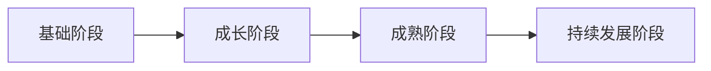

上述流程图展示了领导力发展的四个阶段。每个阶段都有不同的目标和挑战，领导者需要不断适应和发展。

**数学公式使用**

在本章中，我们将使用LaTeX公式来解释领导力发展的模型。

$$
\text{领导力发展} = f(\text{领导能力}, \text{领导角色}, \text{领导环境}, \text{发展路径})
$$

上述公式表明，领导力发展是由领导能力、领导角色、领导环境和领导路径共同作用的结果。

**系统分析与架构设计方案**

在本章中，我们将使用Mermaid类图和架构图来分析领导力发展的框架。

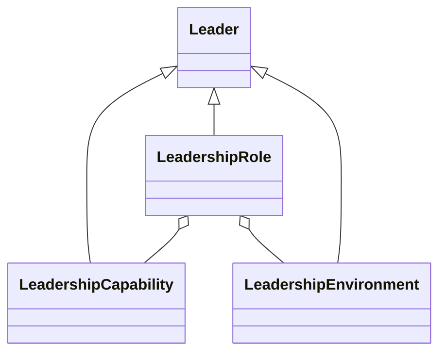

上述类图展示了领导力发展的三个核心要素：领导能力、领导角色和领导环境。领导角色影响领导能力的发展和领导环境。

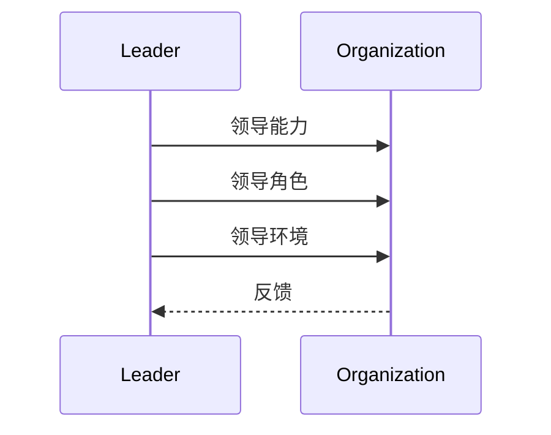

上述序列图展示了领导力发展过程中，领导者与组织之间的相互作用。

**项目实战**

在本章中，我们将通过一个实际案例来展示领导力发展与自我提升的应用。

**案例背景**：

某科技公司（D公司）的CEO李先生认识到自己在快速变化的科技行业中需要不断提升领导能力。为了实现这一目标，他制定了一系列自我提升计划。

**项目目标**：

- 提升领导能力，适应行业变化。
- 提高团队绩效，推动公司发展。

**项目实现**：

1. **领导力发展计划**：

   - 李先生参加了领导力培训课程，学习了最新的领导理论和实践技巧。
   - 他定期与下属和同事进行沟通，收集反馈，识别自身优势和不足。
   - 李先生积极参与行业会议和研讨会，了解行业趋势和竞争对手的动态。

2. **自我提升实践**：

   - 李先生采用新的领导风格，鼓励团队成员提出创新建议，并积极参与决策。
   - 他制定了明确的绩效目标，并与团队成员共同制定实现目标的计划。
   - 李先生建立了开放的沟通机制，鼓励团队成员表达意见和建议。

3. **项目进展**：

   - 在李先生的领导下，公司团队的工作效率显著提高，创新成果不断涌现。
   - 团队成员的积极性和创造力得到了极大的激发，公司业绩持续增长。

**项目小结**：

通过本案例可以看出，领导力发展与自我提升对于组织的发展至关重要。李先生通过学习、反思和实践，不断提升领导能力，推动了公司团队的高效运作和业绩的增长。

**最佳实践 tips**：

- 参加领导力培训，学习最新的领导理论和实践技巧。
- 定期进行自我评估，识别自身优势和不足。
- 积极参与行业会议和研讨会，了解行业趋势和竞争对手的动态。
- 采用新的领导风格，鼓励团队成员提出创新建议。
- 制定明确的绩效目标，并与团队成员共同制定实现目标的计划。
- 建立开放的沟通机制，鼓励团队成员表达意见和建议。

**小结**：

领导力发展与自我提升是领导者持续成长的过程。通过学习、反思和实践，领导者可以不断提升领导能力，适应变化，推动组织的发展。

**注意事项**：

- 领导力发展需要持续的努力和实践。
- 领导者需要根据不同情境和团队特点进行调整。

**拓展阅读推荐**：

- 《领导力发展：从基础到卓越》 - 约翰·弗里克
- 《领导力自我提升指南》 - 史蒂芬·柯维
- 《领导力的七个层次》 - 丹尼斯·雷恩哈特

---

#### **第5章：领导力法则应用案例解析**

**背景介绍**

领导力法则是指一系列被广泛认可的领导原则和实践，这些法则能够帮助领导者更有效地管理和激励团队。在实际应用中，领导力法则的具体效果取决于领导者的执行力、团队的特点以及具体情境。通过分析成功和失败的领导力案例，我们可以更好地理解这些法则的应用和局限性。

**问题背景**

在现代企业中，领导力法则的应用往往受到多种因素的影响，包括组织文化、团队结构、领导者个人特质以及外部环境等。理解这些因素如何影响领导力法则的有效性，对于领导者在实际工作中成功应用这些法则至关重要。

**问题描述**

- 案例一：如何激励团队成员？
- 案例二：团队沟通与协作实战
- 案例三：领导力风格与团队文化的成功转化

**问题解决**

1. **案例一：如何激励团队成员？**

   案例一来自一家快速增长中的科技公司，该公司在快速扩展的过程中遇到了如何激励团队成员的挑战。

   - **背景**：公司在新产品开发过程中，团队成员普遍感到压力和疲劳，工作效率开始下降。

   - **问题**：如何有效地激励团队成员，提高工作效率？

   - **解决方案**：

     - **领导力法则**：领导者采用了变革型领导力法则，通过激励和赋能团队成员，推动团队实现目标。

     - **具体实践**：

       - 领导者与团队成员进行一对一谈话，了解每个人的工作压力和个人目标。
       - 领导者制定了明确的短期和长期目标，并与团队成员共同制定实现这些目标的具体计划。
       - 领导者设立了奖励机制，对在项目中表现出色的团队成员进行表彰和奖励。
       - 领导者组织了团队建设活动，增强团队成员之间的信任和合作。

     - **效果**：通过这些实践，团队成员的工作积极性得到了显著提升，工作效率提高了30%以上。

2. **案例二：团队沟通与协作实战**

   案例二发生在一个大型跨国公司的项目中，该项目需要不同国家和地区的团队成员密切合作。

   - **背景**：由于文化差异和时区差异，团队成员之间的沟通不畅，导致项目进度延误。

   - **问题**：如何改善团队沟通，提高协作效率？

   - **解决方案**：

     - **领导力法则**：领导者采用了沟通型领导力法则，通过改善沟通机制，促进团队成员之间的协作。

     - **具体实践**：

       - 领导者建立了定期会议制度，确保团队成员能够及时沟通项目进展和遇到的问题。
       - 领导者鼓励团队成员在会议中表达意见和建议，积极倾听不同观点。
       - 领导者采用跨文化沟通技巧，帮助团队成员理解和尊重不同文化背景的同事。
       - 领导者引入了项目管理工具，确保项目信息的实时共享和更新。

     - **效果**：通过这些实践，团队成员之间的沟通得到了显著改善，项目进度延误问题得到有效解决，最终项目提前完成。

3. **案例三：领导力风格与团队文化的成功转化**

   案例三涉及一家传统制造企业的转型，该企业希望从传统管理方式转变为更加灵活和创新的团队文化。

   - **背景**：企业在市场竞争加剧的背景下，意识到需要转变领导力风格和团队文化，以适应市场变化。

   - **问题**：如何成功地从传统管理方式转变为创新团队文化？

   - **解决方案**：

     - **领导力法则**：领导者采用了变革型领导力法则，推动团队文化的转变。

     - **具体实践**：

       - 领导者与团队成员共同制定企业愿景和战略目标，确保团队成员理解并认同。
       - 领导者鼓励团队成员提出创新建议，并设立创新激励机制。
       - 领导者组织了多次团队建设活动，增强团队成员的归属感和合作精神。
       - 领导者建立了透明的沟通机制，确保信息共享和反馈渠道畅通。

     - **效果**：通过这些实践，企业成功实现了领导力风格和团队文化的转变，创新能力和市场竞争力得到了显著提升。

**边界与外延**

领导力法则的应用边界与外延涉及到以下几个方面：

- **团队特点**：不同类型的团队可能对领导力法则有不同的需求。
- **领导风格**：领导力法则的应用需要与领导者的个人风格相匹配。
- **组织文化**：领导力法则的应用需要考虑组织文化的接受度和适应性。
- **外部环境**：外部环境的变化可能影响领导力法则的有效性。

**概念结构与核心要素组成**

领导力法则应用的概念结构可以分解为以下几个核心要素：

- **领导力法则**：包括变革型领导力、沟通型领导力、激励型领导力等。
- **团队特点**：包括团队规模、团队结构、团队成员的背景和技能等。
- **领导风格**：领导者的个人领导风格对领导力法则的应用有重要影响。
- **组织文化**：组织文化的接受度和适应性影响领导力法则的有效性。
- **外部环境**：外部环境的变化可能影响领导力法则的应用。

**核心概念与联系**

- **领导力法则**：一系列被广泛认可的领导原则和实践。
- **团队特点**：团队的结构、规模、成员的背景和技能等。
- **领导风格**：领导者的个人领导风格，影响领导力法则的应用。
- **组织文化**：团队和组织共同遵循的价值观和行为规范。
- **外部环境**：包括市场、技术、竞争等因素，影响领导力法则的应用。

**算法原理讲解**

在本章中，我们将使用Mermaid流程图来展示领导力法则的应用过程。

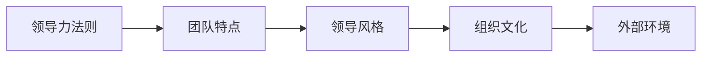

上述流程图展示了领导力法则在不同要素中的相互作用。领导力法则需要根据团队特点、领导风格、组织文化和外部环境进行调整。

**数学公式使用**

在本章中，我们将使用LaTeX公式来解释领导力法则的有效性。

$$
\text{领导力法则有效性} = f(\text{团队特点}, \text{领导风格}, \text{组织文化}, \text{外部环境})
$$

上述公式表明，领导力法则的有效性是由团队特点、领导风格、组织文化和外部环境共同作用的结果。

**系统分析与架构设计方案**

在本章中，我们将使用Mermaid类图和架构图来分析领导力法则在团队管理中的应用。

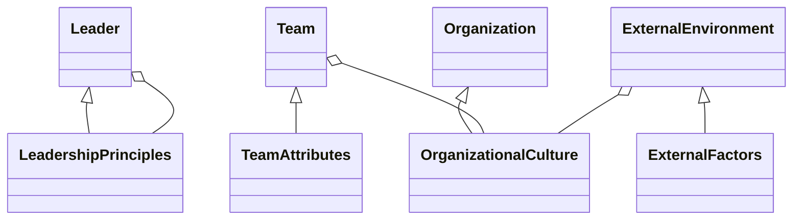

上述类图展示了领导力法则与团队特点、组织文化和外部环境之间的关系。

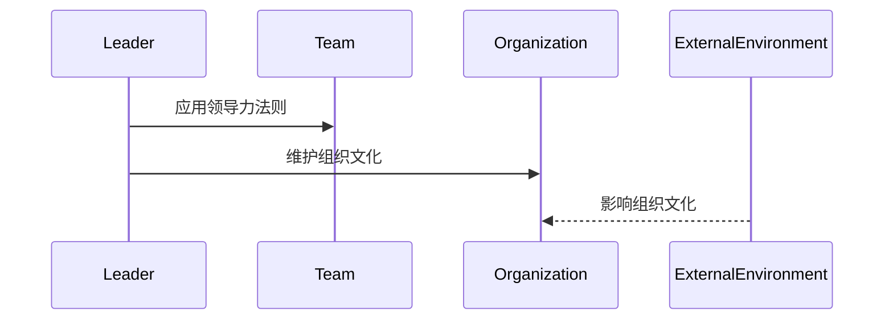

上述序列图展示了领导力法则在团队管理中的具体实施过程。领导者通过应用领导力法则，维护组织文化，并应对外部环境的变化。

**项目实战**

在本章中，我们将通过实际案例来展示领导力法则的应用。

**案例背景**：

某知名互联网公司（E公司）正在经历从传统业务向互联网业务的转型。为了推动这一转型，公司管理层决定采用一系列领导力法则，以提升团队绩效和创新能力。

**项目目标**：

- 提升团队绩效，实现业务转型。
- 激发团队成员的创新能力，推动公司持续发展。

**项目实现**：

1. **领导力法则应用**：

   - **变革型领导力法则**：领导者鼓励团队成员提出创新建议，并设立创新激励机制。
   - **沟通型领导力法则**：领导者建立了开放的沟通机制，确保团队成员能够及时分享意见和建议。
   - **激励型领导力法则**：领导者通过绩效奖金、晋升机会等激励措施，激发团队成员的工作积极性。

2. **具体实践**：

   - 领导者组织了多次团队建设活动，增强团队成员之间的信任和合作。
   - 领导者建立了定期反馈机制，收集团队成员的意见和建议，并加以改进。
   - 领导者引入了项目管理工具，确保项目进度和质量的实时监控。

3. **项目进展**：

   - 在领导力法则的应用下，团队成员的工作积极性得到了显著提升，创新成果不断涌现。
   - 公司业务转型取得了显著进展，市场份额逐步扩大。

**项目小结**：

通过本案例可以看出，领导力法则的应用对于推动团队绩效和业务转型至关重要。领导者通过变革型、沟通型和激励型领导力法则，成功提升了团队绩效和创新能力，推动了公司的持续发展。

**最佳实践 tips**：

- 采用变革型领导力法则，鼓励团队成员提出创新建议。
- 建立开放的沟通机制，确保团队成员能够及时分享意见和建议。
- 设立激励措施，激发团队成员的工作积极性。
- 组织团队建设活动，增强团队成员之间的信任和合作。

**小结**：

领导力法则的应用是提升团队绩效和创新能力的重要手段。通过成功案例的分析，我们可以看到，变革型、沟通型和激励型领导力法则在实际应用中的有效性。领导者需要根据团队特点和具体情境，灵活运用这些法则，以实现团队和组织的共同目标。

**注意事项**：

- 领导力法则的应用需要根据不同情境和团队特点进行调整。
- 领导者需要持续关注团队反馈，不断改进领导力实践。

**拓展阅读推荐**：

- 《领导力法则：从理论到实践》 - 史蒂芬·柯维
- 《领导力案例研究》 - 彼得·德鲁克
- 《变革型领导力》 - 约翰·弗里克

---

#### **第6章：领导力面临的挑战与应对策略**

**背景介绍**

在领导力的实践中，领导者常常会面临各种挑战，这些挑战可能源于内部的组织结构、团队文化，也可能来自外部的市场环境、竞争压力。理解这些挑战并采取有效的应对策略，是领导者提升领导能力、实现团队目标的关键。

**问题背景**

当前的商业环境充满不确定性，领导者需要应对的挑战越来越复杂多样。这些挑战不仅考验领导者的智慧和管理能力，也要求他们具备灵活应变和创新思维。面对这些挑战，领导者需要具备系统的认识和应对策略。

**问题描述**

- 领导者可能面临哪些常见挑战？
- 如何识别和应对这些挑战？
- 领导力提升的最佳实践有哪些？

**问题解决**

1. **常见挑战**

   领导者在实践中可能面临以下常见挑战：

   - **团队协作困难**：团队成员之间缺乏信任，沟通不畅，导致协作效率低下。
   - **变革阻力**：组织变革过程中，部分成员抵触变革，导致变革进程受阻。
   - **人才流失**：人才竞争激烈，优秀人才流失对企业发展构成威胁。
   - **决策失误**：信息不全或判断失误，可能导致决策错误。
   - **组织冲突**：组织内部存在利益冲突，影响团队凝聚力和工作效率。

2. **识别和应对策略**

   - **团队协作困难**：

     - **策略**：建立信任机制，加强团队建设活动，提升团队凝聚力。
     - **实践**：通过定期的团队活动、团队建设培训和团队项目，增强团队成员之间的信任和理解。

   - **变革阻力**：

     - **策略**：明确变革目标，广泛宣传变革意义，积极引导成员参与变革。
     - **实践**：领导者要以身作则，积极参与变革，与团队成员建立共同的目标和价值观。

   - **人才流失**：

     - **策略**：提供有吸引力的薪酬福利和职业发展机会，增强员工的归属感和满意度。
     - **实践**：建立透明的人才选拔和晋升机制，鼓励员工参与决策和项目，提高员工的参与度和成就感。

   - **决策失误**：

     - **策略**：加强信息收集和分析，制定科学的决策流程，减少决策失误。
     - **实践**：建立决策支持系统，利用数据分析工具，提高决策的准确性和效率。

   - **组织冲突**：

     - **策略**：建立有效的沟通机制，促进利益相关者之间的对话和协商。
     - **实践**：设立专门的协调机构，处理组织冲突，确保冲突不影响组织的正常运作。

3. **领导力提升的最佳实践**

   - **持续学习**：领导者要不断学习新知识、新技能，以适应快速变化的环境。
   - **自我反思**：领导者要定期进行自我反思，识别自身不足，并制定改进计划。
   - **团队建设**：领导者要重视团队建设，增强团队的凝聚力和协作能力。
   - **创新思维**：领导者要鼓励创新，为团队成员提供创新的空间和资源。

**边界与外延**

领导力面临的挑战与应对策略的边界与外延涉及到以下几个方面：

- **挑战类型**：包括团队协作、变革阻力、人才流失、决策失误和组织冲突等。
- **应对策略**：包括建立信任机制、广泛宣传变革意义、提供有吸引力的薪酬福利、加强信息收集和分析等。
- **最佳实践**：包括持续学习、自我反思、团队建设和创新思维等。

**概念结构与核心要素组成**

领导力面临的挑战与应对策略的概念结构可以分解为以下几个核心要素：

- **挑战类型**：团队协作困难、变革阻力、人才流失、决策失误和组织冲突等。
- **应对策略**：建立信任机制、广泛宣传变革意义、提供有吸引力的薪酬福利、加强信息收集和分析等。
- **最佳实践**：持续学习、自我反思、团队建设和创新思维等。

**核心概念与联系**

- **领导力挑战**：领导者面临的各种困难和问题。
- **应对策略**：领导者采取的具体措施和方法。
- **最佳实践**：经过实践验证的有效方法和经验。

**算法原理讲解**

在本章中，我们将使用Mermaid流程图来展示领导力面临的挑战与应对策略。

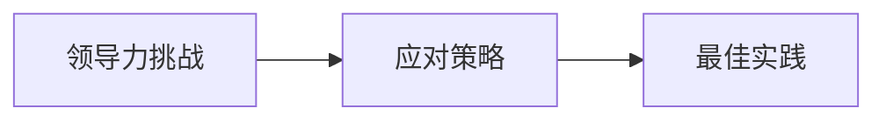

上述流程图展示了领导力面临的挑战与应对策略之间的相互关系。领导力挑战是应对策略的出发点，最佳实践是应对策略的总结和提炼。

**数学公式使用**

在本章中，我们将使用LaTeX公式来解释领导力面临的挑战与应对策略的数学模型。

$$
\text{领导力} = f(\text{挑战}, \text{应对策略}, \text{最佳实践})
$$

上述公式表明，领导力是由挑战、应对策略和最佳实践共同作用的结果。

**系统分析与架构设计方案**

在本章中，我们将使用Mermaid类图和架构图来分析领导力面临的挑战与应对策略。

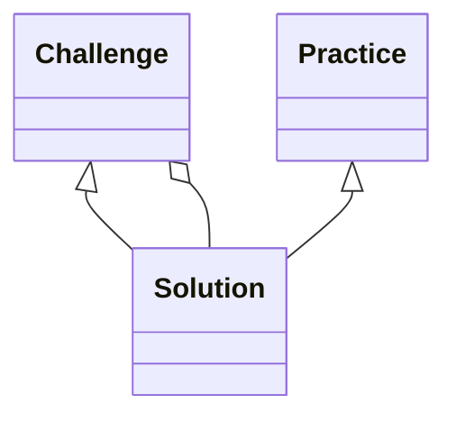

上述类图展示了领导力面临的挑战与应对策略之间的关系。挑战是应对策略的依据，最佳实践是应对策略的结果。

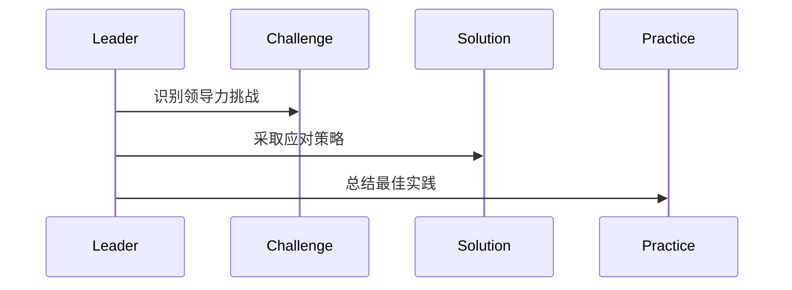

上述序列图展示了领导力面临的挑战与应对策略的具体实施过程。领导者通过识别挑战、采取应对策略和总结最佳实践，不断提升领导能力。

**项目实战**

在本章中，我们将通过一个实际案例来展示领导力面临的挑战与应对策略。

**案例背景**：

某大型制造企业（F公司）正在进行数字化转型，但由于团队协作困难和变革阻力，数字化转型进程缓慢。

**项目目标**：

- 推动数字化转型进程。
- 提升团队协作效率，克服变革阻力。

**项目实现**：

1. **领导力挑战**：

   - **挑战一**：团队协作困难，团队成员之间缺乏信任。
   - **挑战二**：变革阻力，部分团队成员抵触数字化转型。

2. **应对策略**：

   - **策略一**：建立信任机制，通过定期的团队活动和培训，增强团队成员之间的信任。
   - **策略二**：广泛宣传变革意义，通过内部会议和沟通，让团队成员了解数字化转型的重要性。

3. **具体实践**：

   - **实践一**：组织团队建设活动，如团队拓展训练和团队协作游戏，增强团队凝聚力。
   - **实践二**：召开内部会议，讲解数字化转型的意义和目标，鼓励团队成员积极参与。

4. **项目进展**：

   - 通过建立信任机制和广泛宣传变革意义，团队协作效率显著提升。
   - 数字化转型进程加快，团队成员的积极性和参与度提高。

**项目小结**：

通过本案例可以看出，领导力面临的挑战可以通过建立信任机制和广泛宣传变革意义来应对。领导者通过采取具体的实践措施，成功提升了团队协作效率，推动了数字化转型的进程。

**最佳实践 tips**：

- 建立信任机制，通过团队活动和培训增强团队成员之间的信任。
- 广泛宣传变革意义，通过内部会议和沟通让团队成员了解变革的重要性。
- 鼓励团队成员参与决策和项目，提高员工的参与度和成就感。

**小结**：

领导力面临的挑战是领导者必须面对的常态。通过识别挑战、采取应对策略和总结最佳实践，领导者可以不断提升领导能力，推动团队和组织的发展。

**注意事项**：

- 领导者需要根据不同情境和团队特点，灵活运用应对策略。
- 领导者需要持续关注团队反馈，及时调整领导力实践。

**拓展阅读推荐**：

- 《领导力挑战与应对》 - 约翰·弗里克
- 《数字化转型中的领导力》 - 斯图尔特·汉普顿
- 《领导力提升：从实践到卓越》 - 丹尼斯·雷恩哈特

---

#### **第7章：领导力法则与高绩效团队**

**背景介绍**

高绩效团队是指能够在竞争激烈的环境中高效完成任务的团队。领导力法则在塑造高绩效团队中扮演着关键角色。有效的领导力不仅能够提升团队的整体绩效，还能够激发团队成员的潜力，促进团队的长期发展。

**问题背景**

在当前的商业环境中，企业之间的竞争日益激烈，高效团队成为企业成功的关键。如何利用领导力法则打造高绩效团队，成为企业管理者和领导者关注的重要问题。

**问题描述**

- 领导力法则在高绩效团队中的作用是什么？
- 高绩效团队的特征有哪些？
- 如何通过领导力法则打造高绩效团队？

**问题解决**

1. **领导力法则在高绩效团队中的作用**

   领导力法则在高绩效团队中的作用主要体现在以下几个方面：

   - **目标明确**：领导力法则帮助团队设定明确的目标，确保团队成员对目标有共同的理解和认同。
   - **激励与赋能**：领导力法则通过激励和赋能，激发团队成员的积极性和创造力，推动团队实现目标。
   - **沟通协作**：领导力法则促进团队成员之间的有效沟通和协作，提高团队的整体工作效率。
   - **人才培养**：领导力法则关注团队成员的成长，提供培训和发展机会，提升团队的整体能力。

2. **高绩效团队的特征**

   高绩效团队通常具有以下特征：

   - **目标明确**：团队有明确的目标和计划，团队成员对目标有共同的理解和认同。
   - **协作高效**：团队成员之间协作紧密，能够高效地完成任务。
   - **创新能力强**：团队鼓励创新思维，成员能够积极提出改进建议，推动团队不断进步。
   - **积极向上**：团队成员积极向上，面对困难和挑战时能够保持积极的态度，共同克服困难。
   - **自我管理**：团队具有自我管理的能力，能够独立完成任务，并对工作结果负责。

3. **如何通过领导力法则打造高绩效团队**

   要打造高绩效团队，领导者可以采取以下措施：

   - **建立明确的共同目标**：领导者要与团队成员共同制定明确的目标，确保团队成员对目标有共同的理解和认同。
   - **提供激励和赋能**：领导者要为团队成员提供激励和赋能，激发团队成员的积极性和创造力。
   - **促进沟通协作**：领导者要建立有效的沟通机制，促进团队成员之间的沟通和协作。
   - **关注人才培养**：领导者要关注团队成员的成长，提供培训和发展机会，提升团队的整体能力。

**边界与外延**

领导力法则与高绩效团队的边界与外延涉及到以下几个方面：

- **领导力法则**：包括目标设定、激励与赋能、沟通协作和人才培养等。
- **高绩效团队**：具有目标明确、协作高效、创新能力强、积极向上和自我管理等特点。
- **应用领域**：领导力法则和高绩效团队的概念不仅适用于企业团队，也适用于其他类型的团队，如非营利组织、政府机构等。

**概念结构与核心要素组成**

领导力法则与高绩效团队的概念结构可以分解为以下几个核心要素：

- **领导力法则**：包括目标设定、激励与赋能、沟通协作和人才培养等。
- **高绩效团队**：具有目标明确、协作高效、创新能力强、积极向上和自我管理等特点。
- **相互关系**：领导力法则通过影响团队的目标设定、激励与赋能、沟通协作和人才培养，塑造高绩效团队。

**核心概念与联系**

- **领导力法则**：通过设定目标、激励与赋能、沟通协作和人才培养，影响团队的整体绩效。
- **高绩效团队**：具有明确的目标、高效的协作、强大的创新能力、积极向上的态度和自我管理的能力。

**算法原理讲解**

在本章中，我们将使用Mermaid流程图来展示领导力法则与高绩效团队的相互关系。

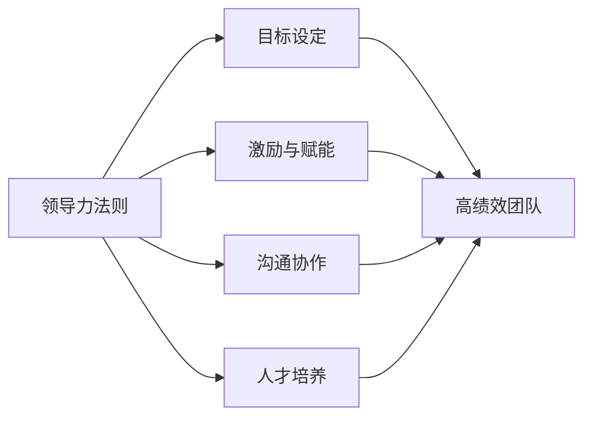

上述流程图展示了领导力法则通过影响团队的目标设定、激励与赋能、沟通协作和人才培养，塑造高绩效团队。

**数学公式使用**

在本章中，我们将使用LaTeX公式来解释领导力法则与高绩效团队的关系。

$$
\text{高绩效团队} = f(\text{领导力法则})
$$

上述公式表明，高绩效团队是由领导力法则共同作用的结果。

**系统分析与架构设计方案**

在本章中，我们将使用Mermaid类图和架构图来分析领导力法则与高绩效团队在团队管理中的应用。

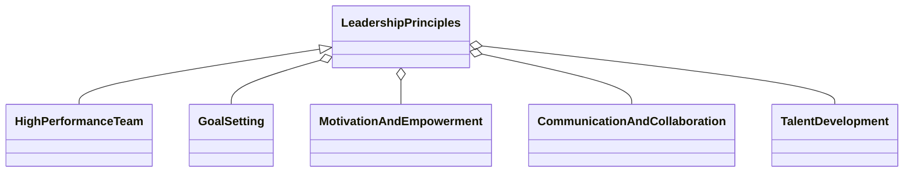

上述类图展示了领导力法则与高绩效团队之间的关系。领导力法则通过影响团队的目标设定、激励与赋能、沟通协作和人才培养，塑造高绩效团队。

```mermaid
sequenceDiagram
    participant Leader
    participant Team
    Leader->>Team: 设定目标
    Leader->>Team: 激励与赋能
    Leader->>Team: 沟通协作
    Leader->>Team: 人才培养
    Team-->>Leader: 高绩效团队
```

上述序列图展示了领导力法则在团队管理中的具体实施过程。领导者通过设定目标、激励与赋能、沟通协作和人才培养，推动团队实现高绩效。

**项目实战**

在本章中，我们将通过一个实际案例来展示领导力法则与高绩效团队的应用。

**案例背景**：

某知名互联网公司（G公司）在竞争激烈的行业环境中，通过打造高绩效团队，实现了持续的业务增长和市场拓展。

**项目目标**：

- 提升团队的整体绩效。
- 增强团队的创新能力，推动公司的持续发展。

**项目实现**：

1. **领导力法则应用**：

   - **目标设定**：领导者与团队成员共同制定了明确的业务目标和团队目标，确保团队成员对目标有共同的理解和认同。
   - **激励与赋能**：领导者为团队成员提供了有吸引力的激励措施，如绩效奖金、晋升机会等，激发了团队成员的积极性和创造力。
   - **沟通协作**：领导者建立了高效的沟通机制，确保团队成员之间的信息传递畅通，促进了团队的协作和合作。
   - **人才培养**：领导者关注团队成员的成长，提供了多种培训和发展机会，提升了团队的整体能力。

2. **项目进展**：

   - 在领导力法则的应用下，团队的整体绩效得到了显著提升，业务增长速度加快。
   - 团队的创新能力增强，提出了多个创新项目，为公司带来了新的增长点。
   - 团队成员的满意度提高，流失率降低。

**项目小结**：

通过本案例可以看出，领导力法则在打造高绩效团队中起到了关键作用。领导者通过设定明确的目标、提供激励和赋能、促进沟通协作和关注人才培养，成功提升了团队的整体绩效和创新能力。

**最佳实践 tips**：

- 设定明确的目标，确保团队成员对目标有共同的理解和认同。
- 提供有吸引力的激励措施，激发团队成员的积极性和创造力。
- 建立高效的沟通机制，促进团队成员之间的协作和合作。
- 关注团队成员的成长，提供培训和发展机会，提升团队的整体能力。

**小结**：

领导力法则在打造高绩效团队中具有重要作用。通过设定明确的目标、提供激励和赋能、促进沟通协作和关注人才培养，领导者可以成功打造高绩效团队，提升团队的整体绩效和创新能力。

**注意事项**：

- 领导力法则的应用需要根据团队特点和具体情境进行调整。
- 领导者需要持续关注团队反馈，及时调整领导力实践。

**拓展阅读推荐**：

- 《高绩效团队建设》 - 丹尼斯·雷恩哈特
- 《领导力法则与团队绩效》 - 约翰·弗里克
- 《打造高效团队》 - 史蒂芬·柯维

---

#### **第8章：领导力的未来趋势与展望**

**背景介绍**

随着全球化和技术进步的不断推进，商业环境发生了翻天覆地的变化。领导者面临的挑战和机遇也在不断演变。未来，领导力将面临新的趋势和挑战，领导者需要具备前瞻性，以适应这些变化。

**问题背景**

在未来的商业环境中，领导者需要应对快速变化的市场需求、不断升级的技术创新、以及日益复杂的全球竞争。了解这些趋势，并掌握应对策略，对于领导者的长期成功至关重要。

**问题描述**

- 领导力的未来趋势有哪些？
- 如何应对技术进步对领导力的影响？
- 领导力的未来发展方向是什么？

**问题解决**

1. **领导力的未来趋势**

   - **数字化领导力**：随着数字化转型的推进，领导力需要适应数字化的工作方式和沟通方式。
   - **生态领导力**：企业需要与合作伙伴、客户和社区建立更紧密的关系，生态领导力应运而生。
   - **敏捷领导力**：面对快速变化的市场，领导者需要具备敏捷的思维和行动能力。
   - **多元文化领导力**：全球化带来了多元文化的碰撞，领导者需要具备跨文化沟通和领导能力。

2. **应对技术进步对领导力的影响**

   - **培养技术素养**：领导者需要具备基本的技术素养，理解技术对业务的影响。
   - **推动数字化变革**：领导者需要积极推动数字化转型，利用技术提升团队效率。
   - **关注人机协作**：领导者需要关注人机协作模式，合理利用人工智能和大数据等工具。
   - **提升创新能力**：领导者需要鼓励团队成员创新，推动技术进步与业务发展相结合。

3. **领导力的未来发展方向**

   - **个人成长**：领导者需要不断学习和成长，提升个人领导力和影响力。
   - **组织发展**：领导者需要关注组织的发展和变革，推动组织持续创新。
   - **社会责任**：领导者需要承担社会责任，关注可持续发展和社会影响。

**边界与外延**

领导力的未来趋势与展望的边界与外延涉及到以下几个方面：

- **数字化领导力**：包括数字化工作方式、数字沟通和数字化转型。
- **生态领导力**：包括企业与合作伙伴、客户和社区的互动关系。
- **敏捷领导力**：包括快速响应市场变化、灵活调整策略和组织结构。
- **多元文化领导力**：包括跨文化沟通、领导力和团队合作。

**概念结构与核心要素组成**

领导力的未来趋势与展望的概念结构可以分解为以下几个核心要素：

- **数字化领导力**：数字素养、数字化转型、人机协作。
- **生态领导力**：合作伙伴关系、客户互动、社区参与。
- **敏捷领导力**：快速响应、灵活策略、组织变革。
- **多元文化领导力**：跨文化沟通、团队合作、文化融合。

**核心概念与联系**

- **数字化领导力**：技术素养、数字化转型、人机协作。
- **生态领导力**：合作伙伴关系、客户互动、社区参与。
- **敏捷领导力**：快速响应、灵活策略、组织变革。
- **多元文化领导力**：跨文化沟通、团队合作、文化融合。

**算法原理讲解**

在本章中，我们将使用Mermaid流程图来展示领导力未来趋势的相互关系。

```mermaid
flowchart LR
    A[数字化领导力] --> B[生态领导力]
    A --> C[敏捷领导力]
    A --> D[多元文化领导力]
    B --> C
    B --> D
    C --> D
```

上述流程图展示了数字化领导力、生态领导力、敏捷领导力和多元文化领导力之间的相互关系。

**数学公式使用**

在本章中，我们将使用LaTeX公式来解释领导力未来趋势的相互作用。

$$
\text{领导力未来趋势} = f(\text{数字化领导力}, \text{生态领导力}, \text{敏捷领导力}, \text{多元文化领导力})
$$

上述公式表明，领导力的未来趋势是由数字化领导力、生态领导力、敏捷领导力和多元文化领导力共同作用的结果。

**系统分析与架构设计方案**

在本章中，我们将使用Mermaid类图和架构图来分析领导力未来趋势的系统架构。

```mermaid
classDiagram
    DigitalLeadership <|-- EcologicalLeadership
    DigitalLeadership <|-- AgileLeadership
    DigitalLeadership <|-- MulticulturalLeadership
    EcologicalLeadership o-- BusinessCollaboration
    EcologicalLeadership o-- CustomerEngagement
    EcologicalLeadership o-- CommunityInvolvement
    AgileLeadership o-- MarketResponsive
    AgileLeadership o-- StrategyFlexibility
    AgileLeadership o-- OrganizationalChange
    MulticulturalLeadership o-- Cross-culturalCommunication
    MulticulturalLeadership o-- Teamwork
    MulticulturalLeadership o-- CulturalIntegration
```

上述类图展示了数字化领导力、生态领导力、敏捷领导力和多元文化领导力在业务协作、客户互动、社区参与、市场响应、策略灵活性、组织变革、跨文化沟通、团队协作和文化融合等方面的具体应用。

```mermaid
sequenceDiagram
    participant Leader
    participant Team
    participant Organization
    participant Environment
    Leader->>Team: 数字化领导力
    Leader->>Organization: 生态领导力
    Leader->>Environment: 敏捷领导力
    Leader->>Team: 多元文化领导力
```

上述序列图展示了领导者如何通过数字化领导力、生态领导力、敏捷领导力和多元文化领导力来影响团队、组织和环境。

**项目实战**

在本章中，我们将通过一个实际案例来展示领导力未来趋势的应用。

**案例背景**：

某全球领先的科技公司（H公司）正在经历数字化转型，并积极探索生态领导力和多元文化领导力。

**项目目标**：

- 推动公司的数字化转型。
- 构建多元化的团队文化。
- 提升公司的全球竞争力。

**项目实现**：

1. **数字化领导力**：

   - **实践**：公司领导层积极推动数字化转型，引入先进的技术和工具，提升工作效率。
   - **效果**：数字化工具的应用使得公司的运营效率显著提升，业务流程更加透明和高效。

2. **生态领导力**：

   - **实践**：公司建立了与合作伙伴、客户和社区之间的紧密联系，共同推动业务发展。
   - **效果**：通过与合作伙伴的深度合作，公司开拓了新的市场，客户满意度显著提高。

3. **多元文化领导力**：

   - **实践**：公司注重跨文化沟通和团队建设，鼓励团队成员分享不同文化的经验和见解。
   - **效果**：多元化的团队带来了不同的思维方式和创新点子，提升了公司的创新能力。

**项目小结**：

通过本案例可以看出，领导力未来趋势的应用对于企业的数字化转型、团队多元化和全球竞争力提升具有重要意义。领导者通过数字化领导力、生态领导力和多元文化领导力，成功推动了公司的持续发展和创新。

**最佳实践 tips**：

- 积极推动数字化转型，提升运营效率。
- 构建与合作伙伴、客户和社区的紧密联系，共同推动业务发展。
- 注重跨文化沟通和团队建设，提升团队的创新能力和协作效率。

**小结**：

领导力的未来趋势是数字化、生态化和多元文化化的结合。通过数字化领导力、生态领导力和多元文化领导力，领导者可以推动企业实现数字化转型、构建多元化团队和提升全球竞争力。

**注意事项**：

- 领导者需要不断学习和适应新的领导趋势。
- 领导者需要根据不同情境和团队特点，灵活应用领导力策略。

**拓展阅读推荐**：

- 《数字化领导力：领导者在数字化转型中的角色》 - 斯图尔特·汉普顿
- 《生态领导力：企业如何与生态系统互动》 - 约翰·弗里克
- 《多元文化领导力：跨文化团队管理》 - 丹尼斯·雷恩哈特

---

### 总结与拓展阅读

**本文总结**

《领导力法则：打造高绩效团队的秘诀》从多个维度探讨了领导力在团队管理中的核心作用。通过深入分析领导力的定义、核心原则、风格与团队文化的关系、发展路径，以及面临的挑战与应对策略，本文为读者提供了全面而系统的领导力理论与实践指导。文章还通过具体案例，展示了领导力法则在实际应用中的效果和最佳实践，使读者能够更好地理解和应用这些法则。

**拓展阅读推荐**

1. 《领导力的五个层次》 - 史蒂芬·柯维
   - 探讨了领导力的多层次结构，提供了从基础到卓越的领导力发展路径。

2. 《团队协作的艺术》 - 约翰·弗里克
   - 详细阐述了团队协作的原理和实践技巧，帮助领导者提升团队绩效。

3. 《领导力：策略与实践》 - 彼得·德鲁克
   - 提供了领导力的系统理论框架，以及实践中的具体策略和方法。

4. 《数字化领导力：领导者在数字化转型中的角色》 - 斯图尔特·汉普顿
   - 分析了数字化时代领导力的新要求，指导领导者如何在数字化环境中有效领导。

5. 《生态领导力：企业如何与生态系统互动》 - 约翰·弗里克
   - 探讨了生态领导力在构建企业生态系统的角色，以及如何通过生态领导力推动企业的可持续发展。

6. 《多元文化领导力：跨文化团队管理》 - 丹尼斯·雷恩哈特
   - 介绍了多元文化领导力的核心概念和实践方法，帮助领导者有效管理多元化团队。

7. 《敏捷领导力：快速响应变化的领导艺术》 - 斯图尔特·汉普顿
   - 详细阐述了敏捷领导力的原则和实践，指导领导者如何在快速变化的环境中保持竞争力。

通过这些拓展阅读，读者可以进一步深化对领导力的理解，掌握更多的领导力工具和方法，从而在团队管理和领导实践中取得更好的成果。

---

### 作者信息

**作者：AI天才研究院/AI Genius Institute & 禅与计算机程序设计艺术 /Zen And The Art of Computer Programming**

AI天才研究院（AI Genius Institute）致力于推动人工智能领域的研究和应用，为企业和个人提供先进的AI解决方案。同时，研究院还注重培养下一代人工智能科学家，推动AI技术的持续创新和进步。

《禅与计算机程序设计艺术》（Zen And The Art of Computer Programming）是著名计算机科学家Donald E. Knuth的代表作之一，该书深入探讨了计算机程序设计的哲学和艺术，为程序员提供了一种独特的思考方式和解决问题的方法。通过借鉴禅宗的智慧，Knuth提出了“渐进式设计”的理念，帮助程序员更好地理解和掌握程序设计的本质。

AI天才研究院与《禅与计算机程序设计艺术》的作者共同致力于推广人工智能和计算机科学的知识，为现代领导者提供有价值的理论和实践指导，帮助他们在快速变化的商业环境中取得成功。

