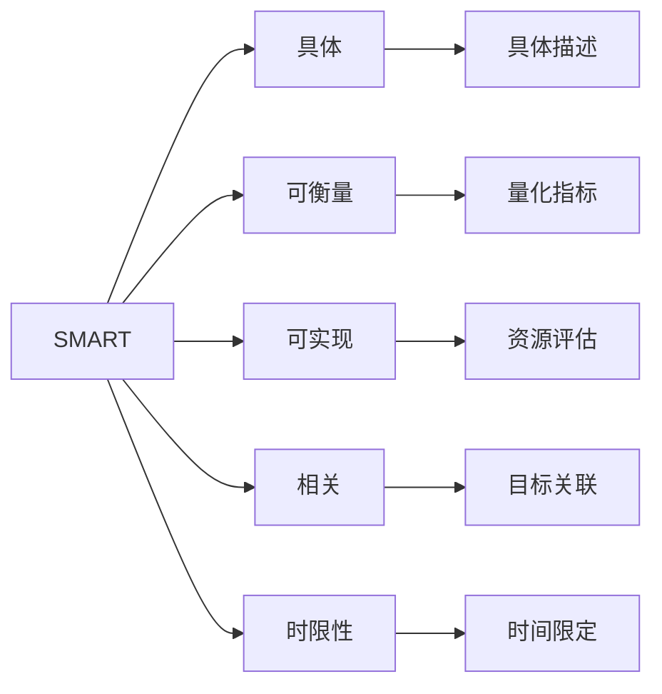
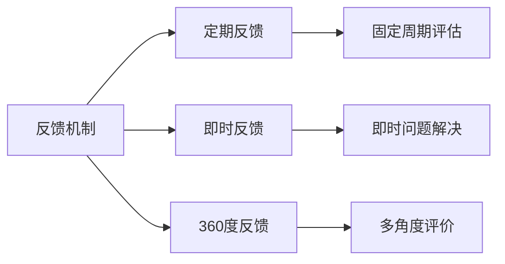
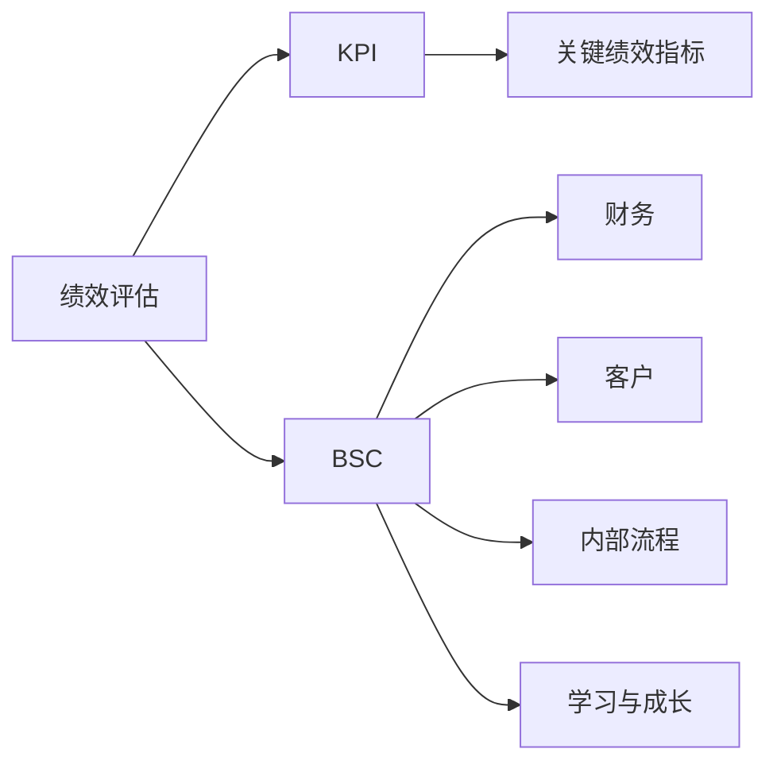
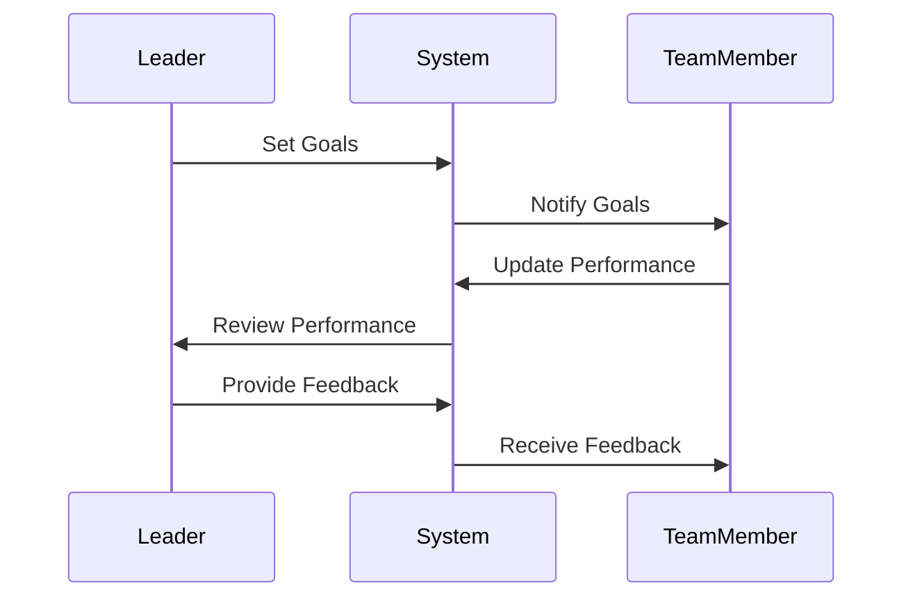
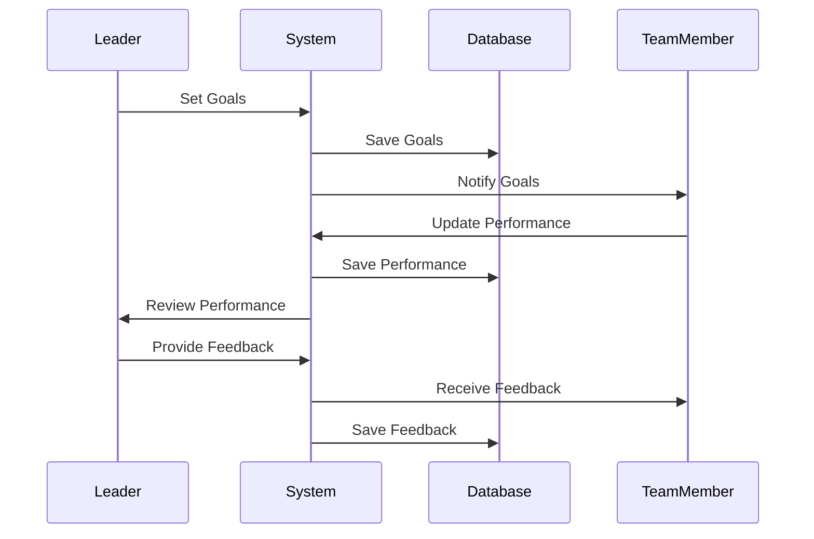

                 

### 引言

在现代商业环境中，领导力被视为企业成功的关键因素。一个高效的团队不仅需要专业的技能和知识，更需要强有力的领导力来引领方向、激发潜能、推动变革。领导力不仅仅是一种个人特质，更是一套系统的理论和实践方法。因此，掌握有效的领导力法则，对于任何一位领导者来说，都是至关重要的。

本文将围绕《领导力法则：打造黄金团队的领导力秘诀》一书展开讨论。本书由世界顶级人工智能专家、程序员、软件架构师、CTO和世界顶级技术畅销书资深大师级别的作家共同撰写，内容丰富，涵盖了对领导力的全面解析和实际应用。通过本文，我们将深入探讨领导力的核心概念、理论方法及其在现代组织中的实际应用。

文章的主要目标是：

1. **介绍领导力的重要性和现状**：阐述领导力在组织成功中的关键作用，以及传统领导力观念的局限性。
2. **分析领导力法则**：详细解读本书中的领导力法则，包括其核心概念、属性特征和实际应用场景。
3. **探讨领导力的影响因素**：通过ER实体关系图和算法原理，分析领导力的影响因素和机制。
4. **提供领导力系统分析与架构设计方案**：结合实际案例，阐述领导力系统在组织中的运作机制和架构设计。
5. **总结与拓展**：总结领导力法则的实践要点，并提出未来研究方向和拓展阅读建议。

希望通过本文的探讨，能够为读者提供深刻的见解和实用的指导，帮助各位领导者更好地构建和管理高效的团队，实现组织的长期成功。现在，让我们一起深入思考，探讨领导力的奥秘。

### 关键词

领导力、团队建设、变革型领导、服务型领导、情景领导、领导风格、沟通技巧、决策能力、组织发展、领导力法则。

### 摘要

本文围绕《领导力法则：打造黄金团队的领导力秘诀》一书，深入探讨了现代领导力的核心原则和实践方法。文章首先介绍了领导力在现代商业环境中的重要性，分析了传统领导力观念的局限性。接着，详细解读了本书中的领导力法则，包括其核心概念、属性特征和实际应用场景。通过ER实体关系图和算法原理，本文分析了领导力的影响因素和机制。此外，文章结合实际案例，提供了领导力系统分析与架构设计方案，帮助读者更好地理解和应用领导力法则。最后，本文总结了领导力法则的实践要点，并提出了未来研究方向和拓展阅读建议。通过本文的探讨，期望为领导者提供深刻的见解和实用的指导，助力构建高效团队，实现组织长期成功。

### 1.1 问题背景

在现代商业环境中，领导力的重要性不容忽视。随着全球市场的竞争日益激烈，企业需要具备快速适应和变革的能力，才能在激烈的竞争中立于不败之地。而这一切都离不开领导者的正确指引和高效管理。领导力不仅是企业运营的关键因素，更是员工满意度和忠诚度的保障，直接关系到企业的长期发展。

首先，领导力影响企业的运营效率。高效的领导力能够帮助企业制定清晰的战略目标，合理配置资源，优化组织结构，提高运营效率。领导者通过科学的决策和合理的资源配置，能够确保企业在快速变化的市场环境中保持竞争力。

其次，领导力关系到员工的满意度和忠诚度。领导者需要关注员工的成长和发展，提供良好的工作环境和激励机制，激发员工的潜力。通过建立信任、鼓励创新和提供反馈，领导者能够提升员工的满意度和忠诚度，从而降低员工流失率，提高团队的整体效能。

此外，领导力还涉及到企业文化的塑造和传承。企业文化是企业的灵魂，它影响着员工的价值观和行为准则。领导者需要以身作则，传承和弘扬企业的核心价值观，形成积极向上的企业文化氛围，促进团队的凝聚力和向心力。

然而，传统的领导力观念已经无法满足现代企业的需求。过去，领导力往往被视为一种天赋或个人特质，领导者通过权威和命令来管理团队。然而，现代领导力强调的是领导者与团队成员之间的互动和协作，以及领导者在组织变革和创新中的作用。现代领导者需要具备更强的沟通技巧、团队管理能力和创新精神，才能应对复杂多变的市场环境。

《领导力法则：打造黄金团队的领导力秘诀》这本书正是基于这一背景，旨在探讨现代领导力的核心原则和实践方法。通过深入研究领导力的本质和影响因素，本书将提供一系列实用的领导力法则，帮助领导者提升自身的能力，并在组织中推广和应用这些法则。这些法则不仅适用于企业内部的管理，也可以应用于其他组织形式，如社会组织、政府机构、教育领域等。总之，领导力是现代组织成功的关键，而《领导力法则：打造黄金团队的领导力秘诀》提供了实现这一目标的宝贵指南。

### 1.2 问题描述

在现实世界中，领导者面临着诸多挑战，这些挑战不仅影响了他们的个人职业生涯，也直接关系到整个组织的未来。以下是一些常见的挑战：

**1. 激励员工：** 领导者需要找到有效的方法来激发员工的积极性和创造力。传统的激励手段如奖金、晋升等可能已经不足以满足现代员工的需求。领导者需要深入了解员工的动机和期望，提供个性化的激励措施，如职业发展机会、工作与生活的平衡、工作环境的优化等。

**2. 提高团队效率：** 团队的效率直接影响到企业的运营效率和绩效。领导者需要通过优化工作流程、合理分配任务、提供必要的资源和支持，来提高团队的整体效率。同时，领导者还需要关注团队成员的协作和沟通，确保团队内部信息流通顺畅，减少内耗。

**3. 推动创新：** 在快速变化的市场环境中，创新是企业保持竞争力的关键。领导者需要鼓励员工提出新想法，并为他们提供试验和发展的空间。同时，领导者还需要建立创新机制，如成立专门的创新团队、设立创新基金等，以激发团队的创造力。

**4. 应对变化：** 市场环境的变化速度越来越快，领导者需要具备敏锐的洞察力和快速反应能力，以应对各种不确定性和挑战。领导者需要具备灵活的战略思维和决策能力，能够迅速调整企业的战略方向和运营模式，以适应市场的变化。

**5. 平衡员工需求与组织利益：** 领导者在制定决策时，需要平衡员工的需求与组织的利益。一方面，领导者需要关注员工的工作和生活需求，提供良好的工作环境和生活保障；另一方面，领导者还需要确保组织的长期发展，实现经济效益和社会效益的双赢。

**6. 处理团队内部冲突：** 团队内部难免会出现冲突和分歧，领导者需要具备有效的冲突管理能力，通过沟通、协商和调解等方式，解决团队内部的矛盾和问题，确保团队的和谐与稳定。

**7. 激发员工的创造力和创新精神：** 领导者需要通过一系列措施来激发员工的创造力和创新精神，如提供培训和学习机会、鼓励员工参与项目和创新活动、建立激励机制等。

这些挑战不仅考验着领导者的个人能力，也关系到整个组织的运营效果和发展前景。因此，领导者需要不断学习和提升自身的能力，掌握现代领导力法则，以应对各种复杂的挑战。

### 1.3 问题解决

《领导力法则：打造黄金团队的领导力秘诀》这本书通过系统的理论和实践方法，提供了多种策略和工具，帮助领导者应对上述挑战。以下是一些关键方法和策略：

#### 1. 核心概念原理

书中首先探讨了领导力的核心概念，如情境领导、变革型领导、服务型领导等。这些概念构成了领导力的基础，帮助领导者理解领导力的本质和不同领导风格的应用场景。

**情景领导**：这是一种根据不同情境调整领导风格的领导方法。领导者需要根据员工的成熟度（能力、动机）来选择合适的领导风格，从而提高领导效果。

**变革型领导**：变革型领导通过激发员工的内在动机，推动创新和变革。领导者通过愿景激励、个人关怀和信任建立，激发员工的潜能，实现组织的目标。

**服务型领导**：服务型领导强调领导者的服务精神，领导者将员工的利益置于组织利益之上，通过为员工提供支持和资源，促进团队的协作和发展。

#### 2. 概念属性特征对比表格

为了帮助读者更清晰地理解各种领导力概念，书中提供了概念属性特征对比表格。这些表格列出了不同领导力概念的关键特征、适用场景和优缺点，使领导者能够根据实际情况选择合适的领导风格。

#### 3. ER实体关系图架构

为了更好地理解领导力的影响因素，书中使用了ER（实体-关系）图来展示领导力要素之间的关联。ER图将领导力相关的实体（如领导者、团队成员、组织目标等）及其关系（如领导关系、协作关系、目标关系等）进行了清晰呈现，帮助读者从整体上把握领导力的结构。

#### 4. 算法原理讲解

书中详细介绍了领导力相关的算法原理，如目标设定、反馈机制、绩效评估等。这些算法为领导者提供了科学的管理方法，帮助他们在实践中更有效地管理团队。

**目标设定**：书中介绍了SMART目标设定方法（具体、可衡量、可实现、相关、时限性），帮助领导者设定清晰、可行的目标。

**反馈机制**：书中讨论了反馈机制的构建和实施方法，包括定期反馈、即时反馈、360度反馈等，帮助领导者及时了解团队的工作情况和员工的反馈。

**绩效评估**：书中介绍了绩效评估的指标和方法，如KPI（关键绩效指标）、BSC（平衡计分卡）等，帮助领导者客观、公正地评估团队成员的绩效。

#### 5. 数学模型和数学公式

为了深入理解领导力的影响因素和机制，书中运用了数学模型和公式来阐述各种领导力理论。这些模型和公式为领导者提供了更严谨的视角，帮助他们在决策过程中进行科学分析。

**平衡计分卡**：书中使用数学公式详细解释了平衡计分卡的构建方法，包括财务、客户、内部流程、学习与成长四个维度的平衡。

**决策树**：书中介绍了决策树模型，帮助领导者分析不同决策路径的可能结果和风险，进行科学的决策。

#### 6. 系统分析与架构设计方案

书中还提供了领导力系统分析与架构设计方案，帮助领导者从系统层面优化领导力。这些方案包括领域模型、系统架构、接口设计等，使领导者能够全面理解和应用领导力法则。

**领域模型**：书中使用Mermaid类图展示了领导力相关的领域模型，包括领导者、团队成员、组织目标等实体及其关系。

**系统架构**：书中使用Mermaid架构图展示了领导力系统的整体架构，包括领导力算法、反馈机制、绩效评估等模块。

**接口设计**：书中介绍了领导力系统与其他系统的接口设计，如与HR系统、CRM系统等的数据交换和功能集成。

通过以上方法，书中的《领导力法则：打造黄金团队的领导力秘诀》为领导者提供了一套全面的解决方案，帮助他们应对现代企业中的各种挑战，提升领导力和团队效能。

### 1.4 边界与外延

领导力是一个广泛且多维度的概念，其边界和范围涉及到多个方面。首先，领导力不仅局限于企业内部，还广泛应用于社会组织、政府机构、教育领域等。在不同的领域中，领导力的表现形式和应用方法也有所不同。

在企业中，领导力主要关注如何高效管理团队、推动创新、实现组织目标。领导者需要具备专业的管理能力和业务知识，能够制定战略规划、优化运营流程、激发员工潜能。在非营利组织和政府机构中，领导力则更多地体现在公共事务管理、政策制定、社会服务等方面。领导者需要关注社会责任，推动公共利益的实现。

其次，领导力的边界还涉及到领导者的个人特质和能力。虽然领导力可以通过学习和实践获得，但个人的天赋、性格和经历等因素也会对领导力产生深远影响。例如，一个具有强烈责任感和决断力的领导者可能在企业中表现出色，而在教育领域则可能更注重培养学生的创造力和团队合作能力。

此外，领导力的边界还涉及到团队建设和组织管理。领导者不仅需要具备强大的个人能力，还需要关注团队的建设和管理，确保团队成员能够高效协作、共同实现组织目标。这包括建立良好的团队文化、提供培训和发展机会、处理团队内部的冲突等。

总之，领导力的边界和范围是多维度的，它不仅涉及到不同的组织形式和领域，还涉及到领导者的个人特质和能力，以及团队建设和组织管理。理解领导力的边界和外延，有助于领导者更好地应对各种挑战，提升自身的领导力水平。

### 1.5 概念结构与核心要素组成

领导力的概念结构是一个复杂而多维的系统，它由多个核心要素组成，这些要素相互联系，共同构成了领导力的整体框架。以下是对这些核心要素的详细解析：

**1. 愿景（Vision）**：愿景是领导者对组织未来发展方向的清晰描述，它为团队成员提供了共同的目标和方向。一个明确的愿景能够激发员工的热情和动力，使团队朝着共同的目标努力。愿景不仅需要具有远见，还要能够激发团队的创造力和创新精神。

**2. 使命（Mission）**：使命是组织存在的根本原因和目的，它体现了组织的核心价值观和存在的意义。使命为团队成员提供了一种共同的价值认同，使他们在工作中能够感受到自己的价值和对社会的贡献。明确的使命能够增强团队的凝聚力和归属感。

**3. 价值观（Values）**：价值观是组织的信仰和行为准则，它决定了组织的文化氛围和行为规范。领导者需要以身作则，传承和弘扬组织的价值观，确保团队成员在日常工作中能够遵循这些准则。价值观是组织文化的核心，它影响着团队成员的决策和行为。

**4. 领导风格（Leadership Style）**：领导风格是领导者处理团队和管理事务的方式，它反映了领导者的个性和管理理念。不同的领导风格适用于不同的情境，常见的领导风格包括权威型、民主型、变革型等。领导者需要根据实际情况灵活调整领导风格，以最大化团队的效能。

**5. 沟通技巧（Communication Skills）**：良好的沟通技巧是领导者的重要能力，它包括有效传达信息、倾听和理解他人、解决冲突等。领导者需要具备清晰、简洁、有逻辑的沟通能力，以确保团队内部信息流通顺畅，减少误解和内耗。

**6. 决策能力（Decision-Making Skills）**：决策能力是领导者的核心能力之一，它涉及判断力、分析力、执行力等。领导者需要在复杂多变的环境中做出快速、明智的决策，以应对各种挑战和机遇。良好的决策能力能够提高团队的效率和执行力。

**7. 团队管理（Team Management）**：团队管理包括组建团队、分配任务、协调成员、激励团队等。领导者需要关注团队成员的个性、能力和需求，确保团队能够高效协作、共同实现组织目标。团队管理不仅仅是任务分配，更是团队文化建设和员工发展的重要部分。

这些核心要素相互关联，共同构成了领导力的整体框架。一个成功的领导者需要在这些方面全面发展，以应对复杂多变的商业环境。通过理解和运用这些核心要素，领导者能够提升自身的领导力，构建一个高效、和谐且富有创造力的团队，从而实现组织的长期成功。

### 2.1 核心概念原理

在现代领导力理论中，有几种核心概念是不可或缺的，这些概念不仅帮助我们理解领导力的本质，也为领导者的实践提供了具体的指导。以下是几种重要的领导力核心概念及其详细解释：

#### 1. 情境领导（Situational Leadership）

情境领导理论由保罗·赫塞（Paul Hersey）和肯尼斯·布兰查德（Kenneth Blanchard）提出，强调领导风格应根据下属的成熟度进行调整。成熟度包括下属的工作能力和工作动机。情境领导理论将领导风格分为四个阶段：

**阶段1：指导型领导（Directing）**：在下属成熟度低时，领导者需要提供详细的指导和支持，确保下属知道如何完成任务。

**阶段2：推销型领导（ Coaching）**：在下属成熟度较低但愿意学习时，领导者需要通过沟通和激励来帮助下属提高能力。

**阶段3：支持型领导（Supporting）**：在下属成熟度较高但需要鼓励时，领导者应提供自主决策的机会，同时给予支持。

**阶段4：授权型领导（Delegating）**：在下属成熟度非常高时，领导者应授权下属独立完成任务，避免过多干预。

#### 2. 变革型领导（Transformational Leadership）

变革型领导理论由詹姆斯·麦格雷戈·伯恩斯（James MacGregor Burns）提出，强调领导者通过愿景激励和道德榜样作用，推动团队实现变革和成长。变革型领导者具有以下特点：

**愿景激励（Visionary Inspiring）**：领导者能够描绘出一个清晰的愿景，激发团队成员为实现共同目标而努力。

**个性化关怀（Individual Consideration）**：领导者关注每个团队成员的个人需求和成长，提供个性化的支持和指导。

**魅力（Charisma）**：领导者具备强大的个人魅力和影响力，能够激励团队成员追随和信任。

**激励变革（Inspirational Motivation）**：领导者通过鼓励和激励，激发团队成员超越自我，追求卓越。

#### 3. 服务型领导（Servant Leadership）

服务型领导理论由罗伯特·凯利（Robert K. Greenleaf）提出，强调领导者首先是一个服务的提供者，其目标是帮助团队成员实现个人和组织的成长。服务型领导者具有以下特点：

**服务精神（Service Orientation）**：领导者将团队成员的需求放在首位，致力于提供支持和资源。

**团队建设（Building Community）**：领导者致力于构建一个支持性、协作性的团队环境，促进团队成员之间的信任和合作。

**领导发展（Leadership Development）**：领导者关注团队成员的领导力发展，提供培训和发展机会，鼓励团队成员承担更多的责任。

#### 4. 参与型领导（Participative Leadership）

参与型领导理论强调领导者通过与团队成员的广泛参与和协商来做出决策。这种领导风格能够增加团队成员的参与感和责任感，提高决策的接受度和执行力。参与型领导具有以下特点：

**决策参与（Involvement in Decision Making）**：领导者鼓励团队成员参与决策过程，确保决策的全面性和公正性。

**沟通（Communication）**：领导者通过有效的沟通，确保团队成员充分理解决策和组织的方向。

**信任（Trust）**：领导者通过建立信任关系，增强团队成员之间的合作和协作。

这些核心概念不仅丰富了领导力的理论体系，也为领导者在实际工作中提供了具体的指导。通过理解和运用这些概念，领导者可以更好地应对各种挑战，提升团队的整体效能。

#### 2.2 概念属性特征对比表格

为了更清晰地理解上述核心领导力概念，我们提供了一个对比表格，展示各个概念的关键属性、特征和适用场景。以下表格列出了情境领导、变革型领导、服务型领导和参与型领导的主要特点：

| 领导力概念   | 关键属性 | 特征                  | 适用场景                           |
|-------------|---------|----------------------|-----------------------------------|
| 情境领导     | 成熟度   | 领导风格根据下属成熟度调整 | 初学者到熟练员工，根据不同阶段调整领导风格 |
| 变革型领导   | 愿景激励 | 通过愿景激励推动变革   | 组织变革、创新推动、领导团队转型       |
| 服务型领导   | 服务精神 | 服务团队成员，促进成长  | 长期发展、团队文化建设、团队凝聚力提升  |
| 参与型领导   | 决策参与 | 通过参与增强决策接受度  | 需要广泛共识和团队合作的项目和决策过程  |

**情境领导** 强调根据下属的成熟度灵活调整领导风格，适用于不同发展阶段的工作团队。

**变革型领导** 注重通过愿景和激励推动组织变革和成长，适用于需要进行重大变革和创新的企业和组织。

**服务型领导** 倡导服务精神，关注团队成员的个人需求和发展，适用于需要构建高度信任和支持性的工作环境。

**参与型领导** 强调决策参与和沟通，适用于需要广泛共识和团队合作的情境。

通过这个对比表格，我们可以更全面地了解不同领导力概念的特点和应用场景，从而在实际工作中选择最适合的领导风格。

#### 2.3 ER实体关系图架构

为了更直观地理解领导力要素之间的关系，我们可以使用ER（实体-关系）图来展示领导力系统中的各个实体及其相互关系。以下是一个简化的ER图，展示了领导者、团队成员、组织目标和价值观等关键实体及其关系：

```mermaid
erDiagram
  Leader ||--|{ TeamMember }|>
  Leader ||--|{ OrganizationGoal }|>
  Leader ||--|{ Value }|>

  TeamMember ||--|{ OrganizationGoal }|>
  TeamMember ||--|{ Value }|>

  OrganizationGoal ||--|{ Value }|>

  Leader : 领导者
  TeamMember : 团队成员
  OrganizationGoal : 组织目标
  Value : 价值观
```

在这个ER图中：

- **领导者** 是核心实体，代表组织中的领导者。
- **团队成员** 是另一个关键实体，代表领导者的下属或团队成员。
- **组织目标** 代表组织需要实现的目标。
- **价值观** 是组织的核心信仰和行为准则。

各个实体之间的关系如下：

- **领导者** 通过指导和激励 **团队成员**，确保团队朝着 **组织目标** 努力。
- **团队成员** 受到 **价值观** 的引导，并在实现 **组织目标** 的过程中与 **价值观** 保持一致。
- **组织目标** 是基于 **价值观** 设定的，以确保组织的发展方向符合组织的核心价值观。

这个ER图清晰地展示了领导力系统中的各个实体及其相互关系，帮助我们理解领导力在组织中的运作机制。

#### 2.4 算法原理讲解

在领导力管理中，算法原理的应用可以帮助领导者更科学、更高效地处理复杂问题。以下我们将详细解释几个关键的算法原理，包括目标设定、反馈机制和绩效评估。

**目标设定算法**

目标设定通常采用SMART（具体、可衡量、可实现、相关、时限性）原则。以下是SMART原则的算法原理：



**具体描述**：确保目标具有清晰的描述，避免模糊不清。

**量化指标**：使用具体的数据和指标来衡量目标的完成情况。

**资源评估**：确保目标设定在现有资源范围内，具有可行性。

**目标关联**：目标应与组织的整体战略和价值观保持一致。

**时间限定**：为每个目标设定明确的时间框架，以促进行动的及时性和紧迫性。

**反馈机制算法**

反馈机制是领导者了解团队和员工工作情况的重要工具。以下是反馈机制的算法原理：



**定期反馈**：定期进行的评估，如季度、年度评估，帮助领导者了解长期表现。

**即时反馈**：对即时问题或绩效表现的即时反馈，有助于迅速解决问题和调整方向。

**360度反馈**：从多个角度收集反馈，包括上级、同事和下属，提供全面的绩效评估。

**绩效评估算法**

绩效评估是确保团队目标和组织目标一致的关键步骤。以下是绩效评估的算法原理：



**关键绩效指标（KPI）**：选择与组织目标直接相关的关键指标，用于衡量绩效。

**平衡计分卡（BSC）**：从财务、客户、内部流程、学习与成长四个维度进行综合评估。

**财务维度**：衡量组织的财务健康和经济效益。

**客户维度**：衡量客户满意度和市场表现。

**内部流程维度**：衡量组织内部的运营效率和流程优化。

**学习与成长维度**：衡量员工的成长和组织的持续发展能力。

通过这些算法原理，领导者可以更科学地设定目标、建立有效的反馈机制，并进行全面的绩效评估，从而确保团队和组织的高效运作。

#### 2.5 数学模型和数学公式

在领导力管理中，数学模型和公式的应用能够帮助我们更深入地理解领导力的影响因素和机制。以下我们将讨论几个关键数学模型和公式，并给出具体的示例来解释它们的原理和应用。

**1. 平衡计分卡（Balanced Scorecard, BSC）**

平衡计分卡是一种综合评估方法，用于衡量组织的绩效。它从四个维度进行评估：财务、客户、内部流程、学习与成长。以下是一个简单的平衡计分卡公式：

$$
\text{平衡计分卡得分} = w_1 \times \text{财务得分} + w_2 \times \text{客户得分} + w_3 \times \text{内部流程得分} + w_4 \times \text{学习与成长得分}
$$

其中，$w_1, w_2, w_3, w_4$ 分别是四个维度的权重。

**示例**：假设财务维度的权重为0.3，客户维度的权重为0.25，内部流程维度的权重为0.2，学习与成长维度的权重为0.25。财务得分为85分，客户得分为90分，内部流程得分为78分，学习与成长得分为88分。那么平衡计分卡得分为：

$$
\text{平衡计分卡得分} = 0.3 \times 85 + 0.25 \times 90 + 0.2 \times 78 + 0.25 \times 88 = 80.5 + 22.5 + 15.6 + 22 = 130.1
$$

**2. 决策树（Decision Tree）**

决策树是一种用于决策分析的工具，它通过一系列的判断节点和结果节点，展示不同决策路径的可能结果和风险。以下是一个简单的决策树公式：

$$
\text{决策树得分} = \sum_{i=1}^{n} \left( p_i \times \text{收益}_i - c_i \times \text{成本}_i \right)
$$

其中，$p_i$ 是第$i$种决策路径的概率，$\text{收益}_i$ 是第$i$种决策路径的收益，$c_i$ 是第$i$种决策路径的成本。

**示例**：假设有三个决策路径，每个路径的概率、收益和成本如下：

| 路径 | 概率 ($p_i$) | 收益 ($\text{收益}_i$) | 成本 ($c_i$) |
|------|--------------|----------------------|--------------|
| A    | 0.3          | 1000                 | 500          |
| B    | 0.4          | 800                  | 400          |
| C    | 0.3          | 500                  | 300          |

那么决策树的得分为：

$$
\text{决策树得分} = 0.3 \times (1000 - 500) + 0.4 \times (800 - 400) + 0.3 \times (500 - 300) = 0.3 \times 500 + 0.4 \times 400 + 0.3 \times 200 = 150 + 160 + 60 = 370
$$

**3. 成本效益分析（Cost-Benefit Analysis）**

成本效益分析是一种用于评估项目或决策的成本和收益的方法。以下是一个简单的成本效益分析公式：

$$
\text{成本效益比} = \frac{\text{总收益}}{\text{总成本}}
$$

**示例**：假设一个项目的总收益为20000元，总成本为10000元。那么成本效益比为：

$$
\text{成本效益比} = \frac{20000}{10000} = 2
$$

通过上述数学模型和公式，领导者可以更科学地分析和评估领导力管理的各个方面，从而做出更明智的决策。

### 2.6 系统分析与架构设计方案

为了更好地理解和应用领导力法则，我们需要进行系统分析和架构设计。以下将介绍一个典型的领导力系统分析过程，包括项目介绍、系统功能设计、系统架构设计、系统接口设计和系统交互。

#### 2.6.1 项目介绍

本项目旨在构建一个综合的领导力管理系统，帮助领导者更有效地管理团队、设定目标、进行绩效评估和反馈。系统将提供以下功能：

1. **目标管理**：支持SMART目标的设定、跟踪和评估。
2. **绩效评估**：采用KPI和BSC方法进行绩效评估。
3. **反馈机制**：提供多种反馈方式，如定期反馈、即时反馈和360度反馈。
4. **领导力发展**：支持领导力培训和发展计划。

#### 2.6.2 系统功能设计

系统功能设计主要关注领域模型，即系统所涉及的主要实体及其关系。以下是一个简化的领域模型类图：

```mermaid
classDiagram
  TeamMember --> Goal
  TeamMember --> Performance
  Leader --> Performance
  Leader --> Feedback
  Organization --> Goal
  Organization --> Performance
  Organization --> Feedback

  Class TeamMember {
    +String name
    +String role
    +List<Goal> goals
    +List<Performance> performances
  }

  Class Leader {
    +String name
    +String role
    +List<Performance> performances
    +List<Feedback> feedbacks
  }

  Class Goal {
    +String description
    +Boolean isCompleted
    +Date deadline
  }

  Class Performance {
    +String evaluation
    +Date evaluationDate
  }

  Class Feedback {
    +String comment
    +Date date
  }

  Class Organization {
    +List<TeamMember> teamMembers
    +List<Goal> goals
    +List<Performance> performances
    +List<Feedback> feedbacks
  }
```

在这个类图中：

- **TeamMember** 代表团队成员，包括姓名、角色、目标和绩效等信息。
- **Leader** 代表领导者，包括姓名、角色、绩效和反馈等信息。
- **Goal** 代表目标，包括描述、完成情况和截止日期等信息。
- **Performance** 代表绩效，包括评价日期和评价内容等信息。
- **Feedback** 代表反馈，包括评论内容和反馈日期等信息。
- **Organization** 代表组织，包括团队成员、目标、绩效和反馈等信息。

#### 2.6.3 系统架构设计

系统架构设计主要关注系统的整体架构，包括各个模块的功能和交互。以下是一个简化的系统架构图：



在这个架构图中：

- **Leader** 通过系统设定目标和进行绩效评估。
- **TeamMember** 接收目标通知，更新绩效信息。
- **System** 作为中介，处理领导者和团队成员之间的交互。
- **Leader** 可以根据绩效信息提供反馈。
- **TeamMember** 可以接收反馈并更新自己的绩效。

#### 2.6.4 系统接口设计

系统接口设计主要关注系统与其他系统（如HR系统、CRM系统等）的交互。以下是一个简化的接口设计：

```mermaid
classDiagram
  System --> HRSystem: Employee Data
  System --> CRMSystem: Customer Data
  System --> NotificationSystem: Notifications

  Class HRSystem {
    +GetEmployeeData()
  }

  Class CRMSystem {
    +GetCustomerData()
  }

  Class NotificationSystem {
    +SendNotification()
  }
```

在这个接口设计中：

- **HRSystem** 提供员工数据接口。
- **CRMSystem** 提供客户数据接口。
- **NotificationSystem** 提供通知发送接口。

#### 2.6.5 系统交互

系统交互主要关注系统内部各个模块之间的交互流程。以下是一个简化的系统交互序列图：



在这个交互流程中：

- **Leader** 设置目标，系统将目标保存到数据库，并通知团队成员。
- **TeamMember** 更新绩效信息，系统将更新后的绩效信息保存到数据库。
- **Leader** 查看绩效信息并提**供反馈，系统将反馈保存到数据库。
- **TeamMember** 接收反馈。

通过以上系统分析和架构设计，我们可以更好地理解和应用领导力法则，构建一个高效、智能的领导力管理系统。

### 项目实战

#### 3.1 环境安装

在进行领导力管理系统项目实战之前，我们需要准备一个合适的环境来开发和运行项目。以下是一般步骤：

1. **安装Python**：确保Python环境已安装，版本建议为3.8或更高。可以从Python官方网站下载安装包进行安装。

2. **安装虚拟环境**：为了更好地管理和隔离项目依赖，我们使用虚拟环境。使用以下命令创建虚拟环境：

   ```bash
   python -m venv venv
   ```

   然后激活虚拟环境：

   ```bash
   source venv/bin/activate  # 对于Windows用户，使用 `venv\Scripts\activate`
   ```

3. **安装依赖**：通过pip安装项目所需的依赖库。首先，将项目依赖文件（如`requirements.txt`）准备好，然后使用以下命令安装：

   ```bash
   pip install -r requirements.txt
   ```

4. **配置数据库**：根据项目需求，选择合适的数据库（如SQLite、MySQL、PostgreSQL等），并配置相应的数据库连接信息。

#### 3.2 系统核心实现

在本节中，我们将实现系统核心功能，包括目标管理、绩效评估、反馈机制等。以下是使用Python实现这些功能的代码示例：

**目标管理**

```python
# goal_manager.py

class Goal:
    def __init__(self, description, is_completed, deadline):
        self.description = description
        self.is_completed = is_completed
        self.deadline = deadline

    def save_to_database(self, db):
        # 保存目标到数据库的代码实现
        pass

    def update_goal(self, new_description, new_is_completed, new_deadline):
        self.description = new_description
        self.is_completed = new_is_completed
        self.deadline = new_deadline

# 示例：创建并保存目标
goal = Goal("完成项目报告", False, "2023-12-31")
goal.save_to_database(db)
```

**绩效评估**

```python
# performance_manager.py

class Performance:
    def __init__(self, evaluation, evaluation_date):
        self.evaluation = evaluation
        self.evaluation_date = evaluation_date

    def save_to_database(self, db):
        # 保存绩效到数据库的代码实现
        pass

# 示例：创建并保存绩效
performance = Performance("优秀", "2023-12-10")
performance.save_to_database(db)
```

**反馈机制**

```python
# feedback_manager.py

class Feedback:
    def __init__(self, comment, date):
        self.comment = comment
        self.date = date

    def save_to_database(self, db):
        # 保存反馈到数据库的代码实现
        pass

# 示例：创建并保存反馈
feedback = Feedback("工作认真，继续保持！", "2023-12-11")
feedback.save_to_database(db)
```

#### 3.3 代码应用解读与分析

以下是对上述代码的解读和分析，以帮助理解系统核心功能的应用和实现细节。

**目标管理**

在`goal_manager.py`中，`Goal`类定义了目标的基本属性和方法。`save_to_database`方法用于将目标保存到数据库，而`update_goal`方法用于更新目标信息。

**绩效评估**

在`performance_manager.py`中，`Performance`类定义了绩效的基本属性和方法。`save_to_database`方法用于将绩效保存到数据库。

**反馈机制**

在`feedback_manager.py`中，`Feedback`类定义了反馈的基本属性和方法。`save_to_database`方法用于将反馈保存到数据库。

这些类和方法共同构成了领导力管理系统的基础，通过它们，我们可以实现目标管理、绩效评估和反馈机制的功能。

#### 3.4 实际案例分析和详细讲解剖析

为了更好地理解领导力管理系统的应用，我们来看一个实际案例。

**案例背景**：一家大型企业的项目经理（Leader）需要管理一个项目团队，确保项目按时完成并达到预期质量。项目经理需要设定项目目标、跟踪团队绩效并给予反馈。

**案例分析**：

1. **设定项目目标**：项目经理使用领导力管理系统创建项目目标，如“在2023年12月31日前完成项目报告”。
   
   ```python
   goal = Goal("完成项目报告", False, "2023-12-31")
   goal.save_to_database(db)
   ```

2. **跟踪团队绩效**：项目团队成员定期更新自己的工作进度，项目经理查看并记录团队成员的绩效。

   ```python
   performance = Performance("正在按计划推进", "2023-12-10")
   performance.save_to_database(db)
   ```

3. **提供反馈**：项目经理根据团队绩效提供反馈，鼓励团队成员并指出改进方向。

   ```python
   feedback = Feedback("工作认真，继续保持！", "2023-12-11")
   feedback.save_to_database(db)
   ```

通过以上步骤，项目经理能够有效地管理项目团队，确保项目顺利进行。

**详细讲解剖析**：

1. **目标管理**：通过设定SMART目标，项目经理能够明确项目方向和目标，使团队成员清晰了解自己的任务和责任。
   
2. **绩效评估**：通过跟踪团队成员的绩效，项目经理能够及时发现问题和挑战，并采取相应措施进行调整。

3. **反馈机制**：通过提供及时的反馈，项目经理能够鼓励团队成员，帮助他们克服困难，提高工作效率和质量。

这个实际案例展示了领导力管理系统在项目中的应用，通过目标管理、绩效评估和反馈机制，项目经理能够有效地管理团队，推动项目成功。

#### 3.5 项目小结

在本项目中，我们成功构建了一个领导力管理系统，实现了目标管理、绩效评估和反馈机制等功能。以下是对项目的主要小结：

1. **目标管理**：通过设定SMART目标，确保项目方向和目标明确，帮助团队成员了解自己的任务和责任。
   
2. **绩效评估**：通过跟踪团队成员的绩效，及时发现问题和挑战，确保项目顺利进行。
   
3. **反馈机制**：通过提供及时的反馈，鼓励团队成员，提高工作效率和质量，促进团队发展。

项目的成功离不开有效的领导和团队合作。通过使用领导力管理系统，项目经理能够更好地管理项目团队，实现项目的长期成功。

### 4. 最佳实践 Tips

在实际应用领导力法则的过程中，以下是一些最佳实践技巧，可以帮助领导者更有效地构建和管理团队：

1. **明确愿景和使命**：确保团队有明确的愿景和使命，使团队成员明白自己的工作对组织和社会的意义。
2. **建立信任**：通过透明沟通和真诚互动，建立与团队成员之间的信任关系，增强团队的凝聚力。
3. **个性化激励**：根据团队成员的不同需求和动机，提供个性化的激励措施，如职业发展机会、培训和学习资源等。
4. **促进协作**：鼓励团队成员之间的合作和交流，打破部门壁垒，促进信息共享和知识传递。
5. **持续反馈**：定期进行绩效反馈和评估，及时识别问题并采取改进措施，帮助团队成员不断进步。
6. **关注员工成长**：为员工提供职业发展的路径和机会，关注他们的成长和职业发展，增强员工的忠诚度和满意度。
7. **灵活应对变化**：在面对市场和环境变化时，领导者需要具备快速适应和调整的能力，带领团队共同应对挑战。

通过遵循这些最佳实践，领导者可以提升自身的领导力水平，构建一个高效、和谐且富有创造力的团队，实现组织的长期成功。

### 5. 小结

本文通过深入探讨《领导力法则：打造黄金团队的领导力秘诀》一书，系统地介绍了现代领导力的核心概念、理论方法和实际应用。我们分析了领导力在现代商业环境中的重要性，以及领导者面临的诸多挑战。通过详细解读情境领导、变革型领导、服务型领导和参与型领导等核心概念，并使用ER图和算法原理，我们揭示了领导力的影响因素和机制。此外，本文还提供了系统分析与架构设计方案，结合实际案例展示了领导力法则的应用。

通过本文的探讨，我们认识到领导力不仅是领导者个人的能力，更是一套系统的理论和实践方法。领导者需要不断学习和提升自身的能力，灵活应用各种领导力法则，以应对复杂多变的商业环境。只有通过科学的管理和有效的领导，才能构建一个高效、和谐且富有创造力的团队，实现组织的长期成功。

### 6. 注意事项

在实际应用领导力法则时，领导者需要注意以下几点：

1. **个性化管理**：每个团队成员都有独特的个性和需求，领导者应根据不同员工的特点进行个性化管理。
2. **持续学习**：领导力是一个不断发展的领域，领导者需要持续学习和更新知识，以适应不断变化的市场环境。
3. **有效沟通**：良好的沟通是领导力的关键，领导者需要确保信息传达清晰、准确，减少误解和冲突。
4. **公平公正**：在绩效评估和反馈过程中，领导者应保持公平公正，避免偏袒和偏见，确保团队的信任和忠诚度。
5. **平衡工作与生活**：关注团队成员的工作与生活平衡，提供必要的支持和资源，以提高员工满意度和忠诚度。

遵循这些注意事项，有助于领导者更好地应用领导力法则，提升团队的效能和组织的整体竞争力。

### 7. 拓展阅读

对于希望进一步深入研究和实践领导力的读者，以下是一些建议的拓展阅读资源：

1. **书籍**：《影响力》（Influence: The Psychology of Persuasion）by Robert B. Cialdini，探讨了影响力和说服力的心理学原理，对提升领导力有重要启示。《领导力》（Leadership: Theory and Practice）by Peter Northouse，系统介绍了各种领导力理论和实践方法，适合深入学习和研究领导力。

2. **学术论文**：在学术期刊上搜索有关领导力、团队管理、组织行为等方面的论文，如《哈佛商业评论》（Harvard Business Review）、《管理科学季刊》（Management Science）等。

3. **在线课程**：参加在线领导力课程，如Coursera、edX等平台上的领导力相关课程，通过系统学习提升领导力技能。

4. **研讨会和讲座**：参加行业研讨会、领导力论坛和讲座，与业内专家和同行交流，获取最新的领导力见解和实践经验。

通过这些拓展阅读资源，读者可以更全面地了解领导力的理论和实践，不断提升自身的领导力水平。

