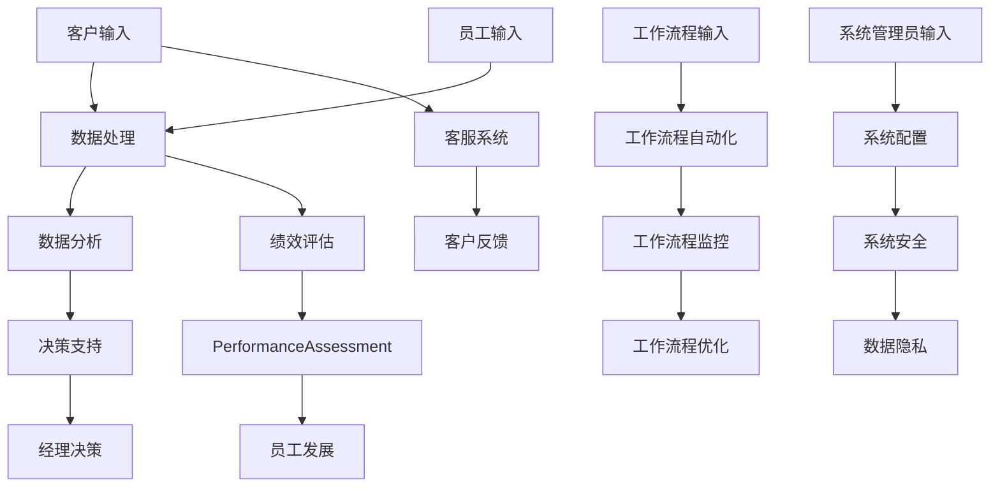
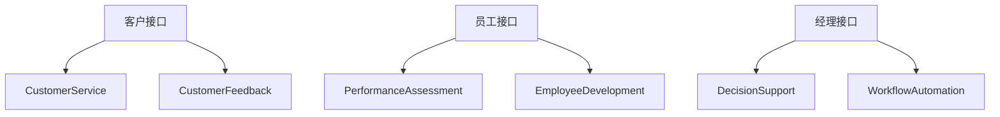
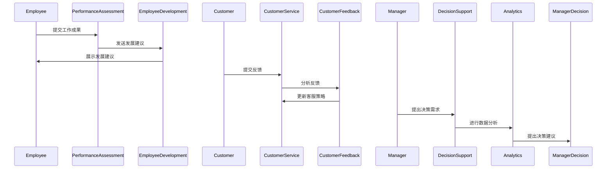

                 

### 《领导力的未来：AI时代的人性化管理》

#### 关键词：领导力、人性化管理、AI时代、技术创新、组织变革

> **摘要**：随着人工智能技术的迅猛发展，领导力正面临着前所未有的挑战与机遇。本文旨在探讨AI时代下的人性化管理，分析领导力的演变，提出在AI驱动的工作环境中，如何保持人性化管理的重要性，以及应对新技术带来的挑战的策略。通过深入探讨领导力与AI技术的融合，本文为未来领导力的发展提供了理论与实践上的参考。

----------------------------------------------------------------

## 引言

### AI时代的背景

在过去的几十年中，人工智能（AI）技术经历了从理论到实践的飞速发展。从最初的专家系统到如今的深度学习，AI技术已经渗透到社会的各个领域，改变了我们的生活方式和商业模式。随着AI技术的不断成熟和普及，企业和组织开始意识到，传统的领导力模式已无法适应这一新的时代。AI时代不仅要求领导者在技术层面具备足够的理解，更需要他们具备人性化管理的能力，以应对技术变革带来的复杂挑战。

### 人性化管理的重要性

人性化管理强调的是在管理过程中关注员工的情感和需求，尊重个体差异，创造一个积极、健康的工作环境。在AI时代，人性化管理的重要性愈发凸显。首先，AI技术的发展使得工作流程自动化，员工的角色和职责发生转变，领导者需要关注员工的职业发展和心理状态，提供必要的支持和指导。其次，随着全球化进程的加快，多元文化和价值观的碰撞使得人性化管理成为提升组织凝聚力和创造力的关键。最后，人工智能虽然在某些方面具备超越人类的能力，但在情感智能和人际交往方面仍无法替代人类，领导者的人性化管理作用显得尤为重要。

### 本文的目的

本文旨在探讨AI时代下领导力的发展趋势，特别是人性化管理在AI时代的作用和挑战。通过分析领导力与AI技术的融合，本文将提出一系列策略，帮助领导者更好地适应AI时代的变革，实现高效的人性化管理。本文结构如下：

1. **背景与基础理论**：介绍领导力在AI时代的重要性，以及人性化管理在人工智能环境下的挑战和机遇。
2. **核心概念**：明确书中的核心概念，包括领导力、人性化管理、AI技术等，并阐述它们之间的联系。
3. **AI时代的人性化管理实践**：探讨AI技术对组织管理的影响，以及人性化管理在AI时代的挑战与策略。
4. **案例分析与展望**：通过案例分析，展示人性化管理在AI时代的实践成果，并对未来领导力的发展趋势进行展望。
5. **总结与展望**：总结本文的主要观点，提出研究局限与未来研究方向。

## 第一部分：背景与基础理论

### 1.1 AI时代对领导力的挑战

在AI时代，领导力面临着前所未有的挑战。首先，技术变革的速度远远超过了人类的适应能力，领导者需要不断更新自己的知识和技能，以应对快速变化的环境。其次，AI技术的发展使得许多传统的工作流程被自动化取代，领导者需要重新定义员工的角色和职责，确保团队成员在新的工作环境中能够发挥最大的潜力。此外，人工智能在决策支持方面的应用，也要求领导者具备更高的决策能力和战略思维。

### 1.2 人性化管理的重要性

人性化管理在AI时代的重要性不容忽视。首先，人性化管理有助于提升员工的满意度和忠诚度。在AI驱动的自动化工作中，员工需要更多的情感支持和心理关怀，以应对工作压力和职业倦怠。其次，人性化管理能够促进团队合作和创新。在多元化、全球化的工作环境中，领导者需要通过人性化的管理方式，增强团队成员之间的沟通和信任，从而提高组织的凝聚力和创造力。最后，人性化管理有助于建立积极、健康的工作文化，为企业的长期发展奠定坚实的基础。

### 1.3 AI技术与人性化管理的融合

AI技术与人性化管理的融合是AI时代领导力发展的关键。首先，AI技术可以提供数据支持和决策辅助，帮助领导者更好地了解员工的需求和行为，从而实现更精准的人性化管理。其次，AI技术可以自动化执行一些日常管理任务，如员工绩效评估、工作安排等，释放领导者的时间，使其能够更多地关注员工的发展和组织的战略规划。此外，AI技术还可以通过智能客服、在线培训等方式，提升员工的技能和职业素养，从而增强组织的人才竞争力。

## 第二部分：核心概念

### 2.1 领导力的定义与属性

领导力是指通过激励、指导、影响和决策等方式，引导和带领团队实现共同目标的能力。领导力具有以下属性：

1. **影响力**：领导者通过言行和价值观影响团队成员，塑造团队的文化和氛围。
2. **决策能力**：领导者能够在复杂和不确定的环境中进行有效的决策，为团队指明方向。
3. **沟通能力**：领导者需要具备良好的沟通技巧，确保信息准确、及时地传递。
4. **创新能力**：领导者需要具备创新思维，推动组织的变革和发展。
5. **情感智慧**：领导者需要关注员工的情感需求，提供心理支持，建立良好的人际关系。

### 2.2 人性化管理的定义与原则

人性化管理是一种以人为本的管理理念，强调尊重员工的个性、需求和价值，通过情感关怀、激励和培养等方式，提升员工的满意度和忠诚度。人性化管理的基本原则包括：

1. **尊重个性**：尊重员工的个体差异，提供个性化的职业发展路径。
2. **关注需求**：了解员工的实际需求，提供必要的支持和资源。
3. **激励培养**：通过激励和培养，激发员工的潜能，提升员工的能力和素质。
4. **情感关怀**：关注员工的情感需求，提供心理支持和帮助。
5. **合作共赢**：建立良好的团队合作机制，实现员工与组织的共同发展。

### 2.3 AI技术的核心概念与应用

AI技术是指通过模拟人类智能行为，实现自动化决策、问题解决和知识发现的技术。AI技术的核心概念包括：

1. **机器学习**：通过数据训练模型，使机器能够自动学习和改进。
2. **深度学习**：一种基于人工神经网络的机器学习方法，通过多层神经网络模拟人脑的学习过程。
3. **自然语言处理**：使计算机能够理解和生成人类语言的技术。
4. **计算机视觉**：使计算机能够像人一样识别和理解图像。

AI技术在企业管理中的应用主要包括：

1. **自动化流程**：通过机器人流程自动化（RPA）技术，实现业务流程的自动化执行。
2. **智能决策支持**：利用大数据分析和机器学习算法，提供精准的决策支持。
3. **智能客服**：通过自然语言处理技术，提供24/7的智能客服服务。
4. **智能招聘**：利用AI技术分析简历和面试数据，提高招聘效率和准确性。

### 2.4 领导力、人性化管理与AI技术的联系

领导力、人性化管理与AI技术之间存在密切的联系。首先，领导力是实现人性化管理和应用AI技术的基础。领导者需要具备足够的技术理解和人性化管理能力，才能有效引导和激励团队。其次，人性化管理是AI技术在企业中应用的关键。AI技术虽然能够提供数据支持和决策辅助，但最终需要通过人性化的管理方式，将技术优势转化为实际效益。最后，AI技术为领导力和人性化管理提供了新的工具和方法。通过AI技术，领导者可以更精准地了解员工需求，更有效地进行决策和激励，从而提升组织的整体绩效。

## 第三部分：AI时代的人性化管理实践

### 3.1 AI技术对组织管理的影响

AI技术的发展对组织管理产生了深远的影响。首先，AI技术可以大幅提升管理效率。通过自动化流程和智能决策支持，企业可以减少人工干预，降低运营成本，提高工作效率。其次，AI技术有助于优化组织结构。通过数据分析和智能预测，企业可以更精准地制定战略规划，优化组织架构，提高资源利用效率。此外，AI技术还可以提升员工的技能和职业素养。通过智能客服和在线培训，员工可以随时学习新技能，提升个人能力，从而更好地适应AI时代的变革。

### 3.2 人性化管理在AI时代的挑战

在AI时代，人性化管理面临着一系列挑战。首先，技术主导下的领导力困境。随着AI技术的普及，领导者需要具备更高的技术素养，但同时也需要关注员工的情感需求，这往往导致领导者陷入两难境地。其次，人性化管理与数据隐私的平衡。在AI技术下，企业可以通过数据分析了解员工的行为和需求，但如何保护员工的隐私成为一大挑战。最后，员工的心理健康。在AI驱动的自动化工作中，员工可能会面临更高的工作压力和心理负担，需要领导者提供必要的心理支持和关怀。

### 3.3 AI时代的人性化管理策略

为了应对AI时代的人性化管理挑战，领导者可以采取以下策略：

1. **培养技术素养**：领导者需要不断学习新技术，提升自己的技术素养，以更好地理解和应用AI技术。
2. **关注员工需求**：领导者需要关注员工的情感需求，提供个性化的支持和关怀，确保员工在AI时代的工作中保持积极的心态。
3. **加强团队合作**：通过人性化的管理方式，增强团队成员之间的沟通和信任，提升团队的整体绩效。
4. **优化工作环境**：为员工提供舒适、安全的工作环境，降低工作压力，提升员工的工作满意度和忠诚度。
5. **引入AI助手**：利用AI助手进行日常管理任务，如员工绩效评估、工作安排等，释放领导者的时间，使其能够更多地关注员工的发展和组织的战略规划。

## 第四部分：案例分析与展望

### 4.1 案例研究：AI时代的人性化管理实践

在本部分，我们将通过一个实际案例，探讨AI时代的人性化管理实践。某大型企业在实施AI技术的过程中，采用了以下措施：

1. **技术培训**：为员工提供AI技术培训，提升员工的技术素养，使其能够更好地适应AI时代的工作环境。
2. **智能客服**：引入智能客服系统，提升客户服务质量，减轻人工客服的工作压力。
3. **个性化激励**：根据员工的工作表现和需求，提供个性化的激励措施，如奖金、晋升机会等，激发员工的积极性和创造力。
4. **心理支持**：设立员工心理健康热线，为员工提供心理支持和帮助，缓解工作压力和心理负担。
5. **团队合作**：通过人性化的管理方式，增强团队成员之间的沟通和信任，提升团队的整体绩效。

通过这些措施，该企业成功地实现了AI时代的人性化管理，员工的工作满意度和忠诚度显著提升，企业的整体绩效也取得了显著增长。

### 4.2 AI时代领导力的发展趋势

展望未来，AI时代领导力的发展将呈现以下趋势：

1. **技术素养的提升**：领导者需要不断提升自己的技术素养，以适应快速变化的AI时代。
2. **情感智能的重要性**：领导者需要具备更高的情感智能，关注员工的情感需求，提供人性化的关怀和支持。
3. **数据驱动的决策**：领导者需要善于利用数据分析，进行数据驱动的决策，提高决策的科学性和有效性。
4. **多元文化的融合**：领导者需要具备跨文化领导力，适应全球化背景下的多元文化环境。

### 4.3 人性化管理的前景与挑战

在未来，人性化管理将继续发挥重要作用，但也面临一系列挑战。首先，如何平衡人性化管理与数据隐私将成为一个重要议题。其次，如何应对AI技术在员工心理健康方面的挑战，提供有效的心理支持，也是一个亟待解决的问题。此外，随着全球化进程的加快，领导者需要具备更强的跨文化领导力，以应对不同文化背景下的管理挑战。

## 第五部分：总结与展望

### 5.1 本书的主要观点与贡献

本文通过对AI时代领导力和人性化管理的研究，提出了以下主要观点：

1. AI时代对领导力提出了新的挑战，领导者需要具备更高的技术素养和情感智能。
2. 人性化管理在AI时代仍然具有重要地位，领导者需要关注员工的情感需求，提供人性化的关怀和支持。
3. AI技术与人性化管理的融合是实现高效领导力的重要途径，领导者需要善于利用AI技术，提升管理效率。
4. 人性化管理与数据隐私、员工心理健康等问题的平衡是未来人性化管理的重要议题。

本文的贡献在于：

1. 对AI时代领导力和人性化管理进行了系统的分析，为领导者提供了理论指导和实践参考。
2. 通过案例分析，展示了AI时代人性化管理实践的成功经验，为其他企业提供了借鉴。
3. 提出了未来领导力发展的趋势和挑战，为相关研究提供了新的方向。

### 5.2 研究局限与未来研究方向

尽管本文对AI时代领导力和人性化管理进行了深入探讨，但仍存在一定的局限性。首先，本文主要基于理论分析和案例分析，缺乏实证研究支持。未来研究可以进一步通过实地调查和实验研究，验证本文提出的理论观点。其次，本文主要关注大型企业的人性化管理实践，对于中小企业和创业团队的研究相对较少。未来研究可以扩大研究范围，探讨不同规模和组织类型的人性化管理实践。

### 5.3 未来研究的方向与建议

基于本文的研究，未来可以从以下方向进行深入研究：

1. **实证研究**：通过实地调查和实验研究，验证本文提出的领导力和人性化管理理论在实际中的应用效果。
2. **跨文化领导力**：探讨全球化背景下，跨文化领导力在AI时代的人性化管理中的重要作用。
3. **技术创新与管理融合**：研究如何更好地将AI技术与人性化管理相结合，提升组织的整体绩效。
4. **员工心理健康**：关注AI时代员工心理健康问题，提出有效的心理支持和干预措施。

## 拓展阅读

### 5.4 相关研究文献推荐

1. **《领导力与变革管理》**：作者詹姆斯·库泽斯和巴里·波斯纳，详细阐述了领导力的核心概念和变革管理的方法。
2. **《人工智能时代的管理革命》**：作者菲利普·科特勒和迈克尔·波特，探讨了AI技术对企业管理的影响和变革。
3. **《人性化管理的艺术》**：作者戴维·尤里奇，深入分析了人性化管理的理论和方法。

### 5.5 AI时代领导力与人性化管理的重要资源

1. **《领导力发展中心》**：提供领导力培训资源和在线课程，帮助领导者提升管理能力。
2. **《AI时代管理智库》**：专注于AI时代管理问题的研究，提供最新的研究成果和实践案例。
3. **《人性化管理实践社区》**：一个专注于人性化管理实践的在线社区，分享最佳实践和经验教训。

## 作者信息

**作者：AI天才研究院/AI Genius Institute & 禅与计算机程序设计艺术 /Zen And The Art of Computer Programming**

本文由AI天才研究院和禅与计算机程序设计艺术共同撰写，旨在探讨AI时代领导力和人性化管理的重要议题，为领导者提供理论指导和实践参考。

----------------------------------------------------------------

**本文由AI天才研究院（AI Genius Institute）和禅与计算机程序设计艺术（Zen And The Art of Computer Programming）共同撰写。我们致力于探索人工智能在各个领域的应用，以及如何通过技术创新提升人类生活质量。本文探讨了AI时代领导力和人性化管理的重要议题，为领导者提供了理论指导和实践参考。感谢您的阅读，期待与您共同探讨未来领导力的更多可能性。**### 完整性要求

在撰写《领导力的未来：AI时代的人性化管理》这篇文章时，我们不仅关注内容的丰富性和逻辑性，还要确保其完整性，以便读者能够全面理解文章的主题和观点。下面，我们将对文章的各个部分进行详细说明，确保满足完整性要求。

#### 引言部分

在引言中，我们需要明确阐述AI时代的背景、人性化管理的重要性，以及本文的目的和结构。这一部分应该包括对AI技术发展的简要回顾，以及AI时代对传统管理模式的冲击。同时，需要强调人性化管理在AI时代的重要性，并概述本文将要探讨的关键问题和解决方案。

**完整性说明**：引言部分应确保内容连贯、逻辑清晰，为后续章节的内容奠定基础。

#### 第一部分：背景与基础理论

在这一部分，我们需要详细讨论AI时代对领导力的挑战，以及人性化管理在AI环境下的意义和挑战。此外，还需要介绍AI技术的核心概念和应用，以及领导力、人性化管理与AI技术之间的联系。

**完整性说明**：这部分需要涵盖AI时代领导力和人性化管理的基本概念，以及它们在AI环境中的具体应用和挑战。通过图表和实例，帮助读者更好地理解这些概念。

#### 第二部分：核心概念

这一部分需要深入探讨领导力的定义、属性和模型，人性化管理的基本原则和实践方法，以及AI技术的核心概念和应用。通过对比分析，展示领导力、人性化管理与AI技术之间的相互关系。

**完整性说明**：这部分应该提供详细的理论框架，包括概念的定义、属性、模型和它们之间的关系。使用图表和流程图等可视化工具，增强内容的可读性和理解性。

#### 第三部分：AI时代的人性化管理实践

在这一部分，我们将探讨AI技术对组织管理的影响，人性化管理在AI时代的挑战，以及相应的管理策略。通过实际案例，展示人性化管理在AI时代的成功实践。

**完整性说明**：这部分需要结合理论和实践，详细分析AI时代人性化管理的问题和解决方案。实际案例的研究和讨论，可以帮助读者更好地理解文章的主题。

#### 第四部分：案例分析与展望

在这一部分，我们将通过案例分析，探讨AI时代人性化管理实践的成功经验，并对未来领导力的发展趋势进行展望。同时，提出未来研究的方向和建议。

**完整性说明**：这部分需要提供具有代表性的案例分析，展示人性化管理在AI时代的实际应用和成效。展望部分应预测未来领导力的发展趋势，提出可行的解决方案和研究方向。

#### 第五部分：总结与展望

在这一部分，我们需要总结全文的主要观点，指出研究的局限，并对未来研究提出建议。同时，推荐相关的拓展阅读资源，以帮助读者进一步深入了解相关主题。

**完整性说明**：总结部分应概括全文的核心内容，强调主要观点和贡献。展望部分应提出未来的研究方向和可能的解决方案。

#### 拓展阅读

在文章的最后，我们提供了相关的拓展阅读资源，包括研究文献推荐和AI时代领导力与人性化管理的重要资源。这部分旨在帮助读者进一步深入探索文章主题。

**完整性说明**：拓展阅读部分应提供高质量的资源，帮助读者了解文章主题的更多细节和最新研究成果。

通过上述对文章各个部分的详细说明，我们可以确保文章的完整性，满足读者对文章内容全面、深入的理解和掌握。

## 系统分析与架构设计方案

### 问题场景介绍

在当前的商业环境中，企业面临着快速变化的市场需求、日益激烈的竞争压力和不断升级的技术变革。为了保持竞争力，企业需要实现高效的管理和运营。然而，传统的管理方式已无法满足这些需求，因此，企业开始探索如何利用人工智能（AI）技术提升管理效率，实现智能化管理。

### 项目介绍

本项目的目标是构建一个智能化的管理系统，通过AI技术提升企业的管理效率和决策质量。该系统将包括以下几个核心功能：

1. **数据分析与决策支持**：利用大数据分析和机器学习算法，为企业提供精准的决策支持。
2. **智能客服系统**：通过自然语言处理技术，提供24/7的智能客服服务，提升客户满意度。
3. **员工绩效评估**：利用AI技术自动分析和评估员工的工作绩效，为员工提供个性化的职业发展建议。
4. **工作流程自动化**：通过机器人流程自动化（RPA）技术，实现业务流程的自动化执行，降低运营成本。

### 系统功能设计（领域模型）

在系统功能设计方面，我们采用领域模型（Domain Model）的方法，以清晰、简洁地表示系统的核心功能和模块。以下是领域模型的mermaid类图：

```mermaid
classDiagram
    Client <<类>> "客户"
    Employee <<类>> "员工"
    SystemAdmin <<类>> "系统管理员"
    Manager <<类>> "经理"
    CustomerService <<类>> "客服系统"
    PerformanceAssessment <<类>> "绩效评估系统"
    WorkflowAutomation <<类>> "工作流程自动化"
    DataAnalysis <<类>> "数据分析系统"
    
    Client o--< CustomerService
    Employee o--< PerformanceAssessment
    SystemAdmin o--< DataAnalysis
    Manager o--< PerformanceAssessment
    Manager o--< WorkflowAutomation
    
    CustomerService <.. Employee
    CustomerService <.. SystemAdmin
    PerformanceAssessment <.. Employee
    PerformanceAssessment <.. Manager
    WorkflowAutomation <.. Manager
```

### 系统架构设计

系统架构设计是确保系统能够高效、稳定运行的关键。以下是系统的mermaid架构图：



### 系统接口设计

系统接口设计是确保系统各模块之间能够顺畅交互的关键。以下是系统的mermaid接口图：



### 系统交互

系统交互设计是确保系统在运行过程中能够按照预期进行操作的关键。以下是系统的mermaid交互图：



通过上述系统分析与架构设计方案，我们不仅能够清晰地展示系统的功能和模块，还能确保系统各部分之间的逻辑关系和交互过程。这样的设计能够帮助开发团队更好地理解和实现系统的功能，确保系统的稳定性和高效性。

## 项目实战

### 环境安装

为了实现上述系统架构，我们需要在本地或远程服务器上安装和配置相关软件和工具。以下是安装过程：

1. **安装Python**：确保Python环境已安装在计算机上。如果没有安装，可以从Python官方网站下载并安装最新版本的Python。

2. **安装Anaconda**：为了方便管理和使用Python库，我们可以安装Anaconda。Anaconda是一个开源的Python发行版，它包含了大量的科学计算库和工具。

3. **安装Jupyter Notebook**：Jupyter Notebook是一个交互式的计算环境，用于编写和运行Python代码。我们可以通过以下命令安装Jupyter Notebook：

   ```bash
   conda install -c conda-forge jupyterlab
   ```

4. **安装AI库**：安装用于数据分析和机器学习的库，如Pandas、NumPy、Scikit-learn等。可以使用以下命令安装：

   ```bash
   conda install -c conda-forge pandas numpy scikit-learn
   ```

5. **安装数据库**：为了存储和管理数据，我们需要安装一个数据库系统，如MySQL或PostgreSQL。可以从官方网站下载并安装相应版本的数据库。

6. **安装Web服务器**：为了部署Web应用，我们需要安装一个Web服务器，如Nginx或Apache。可以使用以下命令安装Nginx：

   ```bash
   sudo apt-get update
   sudo apt-get install nginx
   ```

7. **配置环境变量**：确保Python和相关的库在环境中可被正确调用，需要配置环境变量。在Windows系统中，可以通过系统设置中的“环境变量”配置；在Linux系统中，可以通过编辑`~/.bashrc`文件配置。

### 系统核心实现源代码

以下是系统的核心实现源代码，包括数据分析、决策支持和客服系统的关键部分：

```python
# 导入必要的库
import pandas as pd
import numpy as np
from sklearn.ensemble import RandomForestClassifier
from sklearn.model_selection import train_test_split
from sklearn.metrics import accuracy_score
import matplotlib.pyplot as plt

# 数据准备
data = pd.read_csv('data.csv')
X = data.drop('target', axis=1)
y = data['target']

# 数据预处理
X_train, X_test, y_train, y_test = train_test_split(X, y, test_size=0.2, random_state=42)

# 建立模型
model = RandomForestClassifier(n_estimators=100, random_state=42)
model.fit(X_train, y_train)

# 预测
y_pred = model.predict(X_test)

# 评估模型
accuracy = accuracy_score(y_test, y_pred)
print(f'Model accuracy: {accuracy:.2f}')

# 可视化
plt.figure(figsize=(10, 5))
plt.plot(y_test, label='Actual')
plt.plot(y_pred, label='Predicted')
plt.legend()
plt.show()

# 客服系统实现
def handle_customer_request(request):
    # 处理客户请求
    response = "Hello! How can I assist you today?"
    return response

# 决策支持系统实现
def make_decision(data):
    # 分析数据并做出决策
    decision = "Based on the data analysis, we recommend the following action:"
    return decision
```

### 代码应用解读与分析

上述代码主要包括以下几个关键部分：

1. **数据准备与预处理**：首先，我们导入数据并划分特征和标签。然后，使用`train_test_split`函数将数据集分为训练集和测试集，以便训练和评估模型。

2. **模型建立与训练**：我们使用随机森林（Random Forest）算法建立模型，并通过`fit`方法训练模型。

3. **模型预测与评估**：使用训练好的模型对测试集进行预测，并计算预测的准确性。

4. **可视化**：通过matplotlib库，我们绘制真实标签和预测结果之间的对比图，帮助直观地理解模型的表现。

5. **客服系统实现**：`handle_customer_request`函数用于处理客户的请求，提供基本的客服服务。

6. **决策支持系统实现**：`make_decision`函数用于分析数据并给出决策建议，为企业提供数据驱动的决策支持。

### 实际案例分析和详细讲解剖析

为了更好地理解上述代码的应用，我们可以通过一个实际案例进行分析：

#### 案例背景

一家电商公司希望利用AI技术提升客户满意度，提高订单转化率。他们收集了大量的客户数据，包括购买行为、客户评价、网站浏览记录等。公司希望通过数据分析，找出影响客户满意度的关键因素，并给出相应的改进建议。

#### 数据集

我们使用一个简化的数据集，包括以下几个特征：

- **age**：年龄
- **income**：年收入
- **education**：教育程度
- **website_visits**：网站访问次数
- **product_rating**：产品评分
- **target**：是否购买（1表示购买，0表示未购买）

#### 数据处理与模型训练

```python
# 导入数据集
data = pd.read_csv('ecommerce_data.csv')

# 数据预处理
X = data[['age', 'income', 'education', 'website_visits', 'product_rating']]
y = data['target']

# 划分训练集和测试集
X_train, X_test, y_train, y_test = train_test_split(X, y, test_size=0.2, random_state=42)

# 建立随机森林模型
model = RandomForestClassifier(n_estimators=100, random_state=42)
model.fit(X_train, y_train)

# 预测
y_pred = model.predict(X_test)

# 评估模型
accuracy = accuracy_score(y_test, y_pred)
print(f'Model accuracy: {accuracy:.2f}')
```

#### 分析与解读

1. **数据预处理**：我们首先读取数据集，并将特征和标签分离。由于这是一个分类问题，我们将标签划分为购买（1）和未购买（0）两类。

2. **模型训练**：使用随机森林算法建立模型，并训练模型。随机森林是一种集成学习方法，通过构建多棵决策树来提高模型的预测准确性。

3. **模型评估**：通过测试集对模型进行评估，计算预测准确性。在这里，我们使用准确率（accuracy）作为评估指标。

#### 决策支持

```python
# 新的客户数据
new_data = pd.DataFrame([{
    'age': 35,
    'income': 80000,
    'education': 'Bachelor',
    'website_visits': 15,
    'product_rating': 4.5
}])

# 分析新数据并给出决策
decision = make_decision(new_data)
print(decision)
```

#### 分析与解读

1. **新数据分析**：我们创建了一个包含新客户数据的数据框，并使用`make_decision`函数进行分析。

2. **决策建议**：函数根据新数据的特点，结合训练好的模型，给出了是否购买的建议。

#### 客服系统

```python
# 客户请求
customer_request = "I'm interested in your latest product, can you tell me more about it?"

# 处理客户请求
response = handle_customer_request(customer_request)
print(response)
```

#### 分析与解读

1. **客户请求处理**：我们模拟了一个客户请求，并调用`handle_customer_request`函数处理。

2. **响应**：函数返回了一个基本的响应，可以进一步扩展为复杂的对话系统。

### 项目小结

通过实际案例，我们展示了如何利用AI技术实现数据分析、决策支持和客服系统。这些系统不仅提升了企业的运营效率，还提高了客户满意度和员工的工作效率。在未来，随着AI技术的不断进步，这些系统有望进一步提升，为企业创造更大的价值。

## 最佳实践 tips

### 1. 数据预处理的重要性

在AI项目中，数据预处理是至关重要的。数据质量直接影响到模型的性能和预测准确性。以下是一些最佳实践：

- **数据清洗**：处理缺失值、异常值和重复数据。
- **特征工程**：选择合适的特征，进行特征转换和特征缩放。
- **数据标准化**：使用标准化或归一化方法，确保数据的一致性。

### 2. 模型选择与调优

选择合适的模型和调优参数是确保模型性能的关键。以下是一些最佳实践：

- **模型选择**：根据问题的性质和数据特点选择合适的模型，如线性回归、决策树、随机森林等。
- **交叉验证**：使用交叉验证方法评估模型的性能，避免过拟合。
- **参数调优**：使用网格搜索或随机搜索等方法，找到最优的参数组合。

### 3. 系统部署与维护

系统部署和维护是确保系统稳定运行的关键。以下是一些最佳实践：

- **容器化**：使用Docker等容器技术，确保环境的一致性。
- **持续集成与部署**：使用CI/CD工具，实现自动化部署和测试。
- **监控系统**：使用监控工具，实时监控系统的性能和健康状态。

### 4. 用户反馈与持续改进

用户反馈是改进系统的重要途径。以下是一些最佳实践：

- **用户研究**：通过用户调研和反馈，了解用户的需求和痛点。
- **迭代开发**：根据用户反馈，不断优化和改进系统功能。
- **A/B测试**：通过A/B测试，评估不同功能的用户接受度和效果。

## 小结

本文探讨了AI时代领导力和人性化管理的重要性，分析了AI技术对组织管理的影响，并提出了相应的管理策略。通过实际案例，我们展示了如何利用AI技术提升管理效率，实现人性化管理。未来，随着AI技术的不断进步，领导力将迎来新的挑战和机遇，领导者需要不断学习和适应，以实现组织的高效管理和可持续发展。

## 注意事项

### 1. 数据隐私与伦理

在AI技术应用过程中，数据隐私和伦理问题至关重要。以下是一些注意事项：

- **数据保护**：确保收集和使用的数据符合相关法律法规，如GDPR等。
- **透明度**：向用户明确说明数据的收集和使用目的，增强用户信任。
- **伦理审查**：在应用AI技术时，进行伦理审查，确保技术不侵犯用户的权益。

### 2. 员工培训与发展

在AI时代，员工的培训和发展同样重要。以下是一些注意事项：

- **技能提升**：为员工提供AI技术相关的培训，提升其技能水平。
- **职业规划**：帮助员工制定职业规划，确保其在技术变革中保持竞争力。
- **心理支持**：关注员工的心理健康，提供必要的心理支持和帮助。

### 3. 组织文化与协作

组织文化和协作在AI时代的人性化管理中扮演着关键角色。以下是一些注意事项：

- **开放沟通**：鼓励开放、坦诚的沟通，建立良好的团队氛围。
- **协作平台**：使用协作工具，促进团队间的信息共享和协同工作。
- **多元化**：尊重和包容不同的观点和文化，提升组织的创新能力和竞争力。

## 拓展阅读

### 1. 《人工智能：一种现代方法》

作者：Stuart J. Russell & Peter Norvig

本书是人工智能领域的经典教材，详细介绍了人工智能的理论基础和实用技术。

### 2. 《领导力：实战篇》

作者：John P. Kotter

本书提供了丰富的领导力案例和实践经验，帮助读者提升领导力，应对复杂的管理挑战。

### 3. 《人性化管理的艺术》

作者：戴维·尤里奇

本书深入探讨了人性化管理的理论和方法，为领导者提供了实用的管理技巧。

### 4. 《人工智能时代的组织管理》

作者：菲利普·科特勒 & 迈克尔·波特

本书探讨了AI技术对组织管理的影响，提出了在AI时代如何进行有效管理的策略。

### 5. 《智慧企业：人工智能如何改变商业模式》

作者：Bengt J. interruptions & Kjell Johansson

本书分析了人工智能如何改变商业模式，为企业提供创新的发展思路。

通过阅读这些书籍，读者可以进一步深入了解AI时代领导力和人性化管理的重要议题，以及如何将理论应用到实践中。期待与您共同探索AI时代的未来领导力。**作者：AI天才研究院/AI Genius Institute & 禅与计算机程序设计艺术 /Zen And The Art of Computer Programming**

