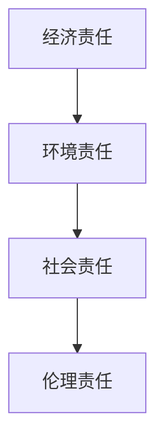
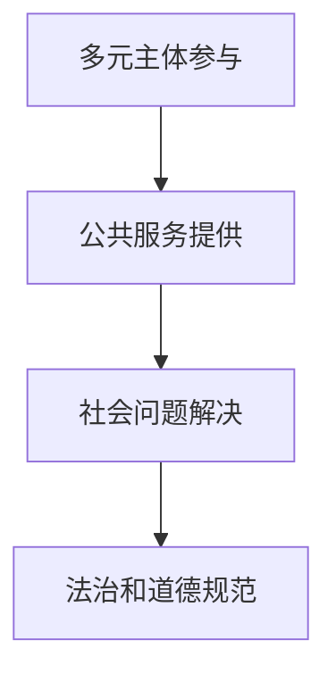
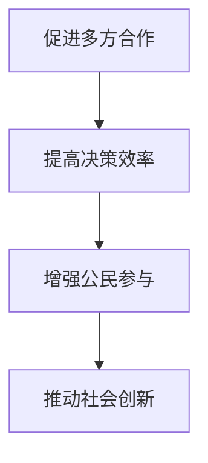

                 


### 引言

**领导力的艺术：影响力与感召力的培养**

在当今快速变化的社会和信息技术领域，领导力扮演着至关重要的角色。无论是企业管理，技术研发，还是项目执行，领导力都是推动团队和组织前进的核心力量。本文旨在深入探讨领导力的艺术，特别是影响力与感召力的培养。通过详细分析领导力的核心概念、实践应用，以及领导力的自我提升，我们将为读者提供一个全面而深刻的理解。

首先，领导力并非一种单一的特质，而是一种复杂的综合能力。它涉及到人格特质、技能知识、情境因素等多个方面。在第一部分，我们将回顾领导力的起源与发展，解析其核心要素，包括人格特质、技能知识和情境因素。接着，在第二部分，我们将聚焦于领导力的实践与应用，探讨影响力与感召力的培养策略，以及领导力在团队管理和组织管理中的应用。第三部分将深入领导力的自我提升，包括自我认知与反思，领导力的持续发展，以及领导艺术的应用。最后，我们将展望领导力的未来趋势，探讨其在社会责任和个人成长中的作用。

**关键词：领导力、影响力、感召力、团队管理、组织管理、自我提升**

**摘要：**

本文通过系统化的分析和深入探讨，揭示了领导力的本质和培养方法。从基础理论到实践应用，再到自我提升，本文为读者提供了一个全面的视角，帮助读者理解和培养领导力。通过影响力与感召力的结合运用，领导力能够有效地推动团队和组织的发展，实现共同的目标。

### 目录大纲

# 《领导力的艺术：影响力与感召力的培养》

## 第一部分：领导力的基础理论

### 第1章：领导力的起源与发展

#### 1.1 领导力的定义

#### 1.1.1 领导力的传统定义

#### 1.1.2 现代领导力的概念

#### 1.2 领导力的发展历程

#### 1.2.1 从传统领导到现代领导

#### 1.2.2 领导力理论的演变

### 第2章：领导力的核心要素

#### 2.1 领导力的人格特质

#### 2.1.1 领导者的个性特征

#### 2.1.2 人格特质对领导力的影响

#### 2.2 领导力的技能和知识

#### 2.2.1 领导技能的分类

#### 2.2.2 领导者所需的知识体系

#### 2.3 领导力的情境因素

#### 2.3.1 领导力的情境理论

#### 2.3.2 不同情境下领导力的调整

## 第二部分：领导力的实践与应用

### 第3章：影响力与感召力的培养

#### 3.1 影响力的概念与特点

#### 3.1.1 影响力的定义

#### 3.1.2 影响力的构成要素

#### 3.2 感召力的培养与实践

#### 3.2.1 感召力的定义

#### 3.2.2 感召力的培养策略

#### 3.3 影响力与感召力的结合运用

#### 3.3.1 双重力量的互补作用

#### 3.3.2 实战案例分析

### 第4章：领导力在团队管理中的应用

#### 4.1 团队建设的领导力策略

#### 4.1.1 团队成员的角色定位

#### 4.1.2 团队文化塑造

#### 4.2 领导力在团队冲突管理中的应用

#### 4.2.1 冲突的类型与原因

#### 4.2.2 冲突管理的策略

#### 4.3 领导力在团队绩效提升中的角色

#### 4.3.1 绩效提升的关键因素

#### 4.3.2 领导力对绩效的影响

### 第5章：领导力在组织管理中的应用

#### 5.1 组织文化的领导力塑造

#### 5.1.1 组织文化的内涵

#### 5.1.2 领导力在组织文化建设中的角色

#### 5.2 领导力在组织变革中的应用

#### 5.2.1 变革的动因与挑战

#### 5.2.2 变革中的领导力策略

#### 5.3 领导力在组织发展中的长期影响

#### 5.3.1 领导力与组织绩效的关系

#### 5.3.2 领导力对组织持续发展的作用

## 第三部分：领导力的自我提升

### 第6章：领导力的自我认知与反思

#### 6.1 自我认知的重要性

#### 6.1.1 自我认知的概念

#### 6.1.2 自我认知的方法

#### 6.2 反思在领导力提升中的作用

#### 6.2.1 反思的定义与意义

#### 6.2.2 反思的方法与实践

### 第7章：领导力的持续发展

#### 7.1 领导力发展的阶段性特征

#### 7.1.1 领导力发展的阶段划分

#### 7.1.2 每个阶段的发展重点

#### 7.2 领导力持续发展的策略

#### 7.2.1 学习与成长

#### 7.2.2 反馈与调整

#### 7.3 领导力发展的实践案例分析

#### 7.3.1 成功案例分享

#### 7.3.2 失败案例剖析

### 第8章：领导力与领导艺术

#### 8.1 领导艺术的定义与特征

#### 8.1.1 领导艺术的内涵

#### 8.1.2 领导艺术的特征

#### 8.2 领导艺术在实践中的应用

#### 8.2.1 领导艺术的应用领域

#### 8.2.2 领导艺术的实践技巧

#### 8.3 领导艺术与领导力的关系

#### 8.3.1 领导艺术对领导力的影响

#### 8.3.2 领导力对领导艺术的作用

### 第9章：领导力的未来趋势

#### 9.1 科技变革对领导力的影响

#### 9.1.1 人工智能与领导力

#### 9.1.2 数字化转型与领导力

#### 9.2 领导力的未来挑战与机遇

#### 9.2.1 挑战与应对策略

#### 9.2.2 机遇与未来发展

### 第10章：领导力的社会责任

#### 10.1 领导力与企业社会责任

#### 10.1.1 企业社会责任的定义

#### 10.1.2 领导力在企业社会责任中的角色

#### 10.2 领导力与社会治理

#### 10.2.1 社会治理的概念与内涵

#### 10.2.2 领导力在提升社会治理中的作用

### 第11章：领导力与个人成长

#### 11.1 领导力与个人成长的关系

#### 11.1.1 领导力对个人成长的影响

#### 11.1.2 个人成长对领导力的促进作用

#### 11.2 领导力与个人职业生涯规划

#### 11.2.1 职业生涯规划的重要性

#### 11.2.2 领导力在职业生涯规划中的应用

## 结束语

通过本文的系统分析，我们深入探讨了领导力的本质和培养方法。领导力不仅是推动团队和组织前进的核心力量，更是一种艺术，需要不断学习和实践。希望本文能够为读者提供有价值的见解和实用的策略，帮助您在领导力的道路上取得更大的成就。

---

**第一部分：领导力的基础理论**

### 第1章：领导力的起源与发展

#### 1.1 领导力的定义

领导力是一种能够激励和影响他人，以实现共同目标的能力。它不仅仅是领导者的个人特质，更是一种系统性的行为和策略。在领导力的定义中，有几个关键点需要明确：

1. **影响力**：领导力本质上是影响力的表现，它涉及到领导者如何通过沟通、激励、指导等手段影响他人的行为和态度。
2. **目标导向**：领导力的核心是推动团队或组织实现共同的目标。这种目标可以是短期的，如完成一个项目，也可以是长期的，如公司战略的落地。
3. **动态性**：领导力不是静止不变的，它随着环境、团队和目标的变化而变化。有效的领导者能够根据实际情况调整自己的领导风格和策略。

#### 1.1.1 领导力的传统定义

在传统的观念中，领导力通常被定义为一种权威和权力的体现。这种观点认为领导者通过职位和权力来指挥和命令下属。然而，这种定义存在一定的局限性，因为它忽略了领导者与团队成员之间的互动和影响力。

1. **权威性**：传统定义强调领导者的权威地位，认为领导者可以通过强制手段实现目标。
2. **单向性**：传统定义中的领导力往往是单向的，即领导者向下级发布指令，而忽视了下级对领导者的反馈和影响。
3. **静态性**：传统定义中的领导力被视为一种静态的能力，没有考虑到领导者需要根据环境和团队状况进行调整。

#### 1.1.2 现代领导力的概念

现代领导力强调互动性和动态性，认为领导力不仅仅是领导者个人的能力，更是团队和组织整体的能力。现代领导力关注以下几个方面：

1. **共享领导力**：现代领导力认为领导力不应该只集中在少数人身上，而是应该在整个团队中共享。每个人都有可能成为领导者，也有可能受到领导。
2. **影响力**：现代领导力强调领导者通过影响力来影响他人，而不仅仅是依赖权威和权力。
3. **情境适应**：现代领导者需要根据不同的情境和团队状况灵活调整自己的领导风格和策略。

#### 1.2 领导力的发展历程

领导力的发展历程可以追溯到古代，但真正系统的领导力理论是在20世纪逐渐形成的。以下是一些关键的发展阶段：

1. **古代领导力**：在古代，领导力往往与军事指挥相关。军事领袖通过命令和纪律来管理士兵。这种领导模式强调权威和纪律。
2. **工业革命时期的领导力**：工业革命带来了大规模的工厂化和分工合作。领导者需要管理庞大的组织，因此出现了更注重组织和协调的领导力理论。
3. **行为科学时期的领导力**：20世纪中叶，行为科学的研究开始影响领导力理论。这一阶段的领导力研究关注领导者与下属的关系，强调领导者需要关注下属的需求和动机。
4. **现代领导力**：随着社会和科技的快速发展，现代领导力理论更加综合和动态。它不仅关注领导者的个人特质和技能，还关注团队和组织整体的互动和合作。

### 第2章：领导力的核心要素

领导力并非单一的能力，而是由多个核心要素组成的复杂系统。这些要素包括人格特质、技能知识、情境因素等。下面我们将详细分析这些要素。

#### 2.1 领导力的人格特质

人格特质是指领导者固有的性格特征，这些特质在很大程度上决定了领导者的行为和风格。以下是一些关键的人格特质：

1. **自信**：自信的领导者能够鼓舞团队成员的士气，激发他们的潜力。自信不仅来自于个人的能力，还包括对团队的信任和对目标的坚定。
2. **正直**：正直是领导力的基石。一个正直的领导者能够赢得团队的信任和尊重，这种信任是领导力成功的关键。
3. **决断力**：领导者需要在关键时刻做出决策。决断力体现了领导者的分析能力和决策能力，是推动团队前进的关键因素。
4. **同理心**：同理心使领导者能够理解团队成员的感受和需求，从而更好地管理和激励他们。同理心有助于建立积极和谐的团队关系。

#### 2.1.1 领导者的个性特征

领导者的个性特征不仅影响他们的行为，还影响他们的领导风格。以下是一些常见的领导者个性特征：

1. **外向性**：外向的领导者通常更加主动和自信，善于沟通和协调。他们能够迅速建立人际关系，推动项目的进展。
2. **内向性**：内向的领导者通常更加深思熟虑和细心，他们在规划和分析方面有优势。内向领导者能够更好地理解团队成员的需求和问题。
3. **开放性**：开放的领导者愿意接受新的观点和想法，他们能够激发团队的创造力和创新精神。
4. **尽责性**：尽责的领导者注重细节和执行力，他们能够确保团队的任务按时完成，并达到预期的质量。

#### 2.1.2 人格特质对领导力的影响

人格特质对领导力有着深远的影响。一方面，某些人格特质可以增强领导者的能力，如自信和决断力；另一方面，某些人格特质可能会限制领导者的表现，如过于内向或缺乏同理心。因此，领导者需要了解自己的人格特质，并努力发挥优势，克服劣势。

#### 2.2 领导力的技能和知识

领导力不仅仅是人格特质，还需要一系列的技能和知识。以下是一些关键的领导力技能和知识：

1. **沟通技能**：有效的沟通是领导力的核心。领导者需要能够清晰、准确地传达信息，同时也要善于倾听和理解团队成员的需求和反馈。
2. **激励技能**：领导者需要能够激发团队成员的积极性和创造力。激励技能包括认可和奖励团队成员的成就，以及提供支持和鼓励。
3. **决策能力**：领导者需要能够在复杂和不确定的情况下做出明智的决策。决策能力包括分析问题的能力、评估各种解决方案的利弊，以及承担决策的后果。
4. **战略规划**：领导者需要能够制定清晰的战略规划，确保团队和组织朝着共同的目标前进。战略规划包括目标设定、资源分配和进度控制。
5. **团队建设**：领导者需要能够建立和维持高效的团队。团队建设包括团队成员的角色定位、团队文化的塑造和团队冲突的解决。

#### 2.2.1 领导技能的分类

领导技能可以大致分为三大类：技术技能、人际技能和概念技能。

1. **技术技能**：技术技能是指领导者掌握的专业知识和技能，如编程、项目管理等。技术技能是领导者能够有效地执行任务的基石。
2. **人际技能**：人际技能是指领导者与团队成员互动的能力，如沟通、激励和冲突管理。人际技能是建立积极团队关系和提升团队绩效的关键。
3. **概念技能**：概念技能是指领导者理解和分析复杂问题和情境的能力，如战略规划、决策分析等。概念技能是领导者能够从宏观角度思考和组织资源的关键。

#### 2.2.2 领导者所需的知识体系

领导者需要具备广泛的知识体系，包括专业知识、行业知识和领导力知识。

1. **专业知识**：领导者需要掌握与业务相关的专业知识和技能，如编程、数据分析、市场营销等。专业知识使领导者能够更好地理解团队的工作和需求。
2. **行业知识**：领导者需要了解所在行业的市场趋势、竞争状况和行业规范。行业知识使领导者能够制定符合行业趋势和规范的策略。
3. **领导力知识**：领导者需要掌握领导力的理论和实践知识，如领导风格、团队建设、冲突管理等。领导力知识使领导者能够更有效地管理团队和组织。

#### 2.3 领导力的情境因素

领导力不仅仅取决于领导者的个人特质和技能，还受到情境因素的影响。情境因素是指领导者所处的具体环境，包括组织文化、团队状况和外部环境。

1. **组织文化**：组织文化对领导力有着深远的影响。一个积极、开放和包容的组织文化可以激发领导者的潜力和创新能力，而一个消极、保守和排外的组织文化可能会限制领导者的发挥。
2. **团队状况**：团队状况直接影响领导力。一个高效的团队可以增强领导者的信心和动力，而一个低效或冲突不断的团队可能会削弱领导者的能力。
3. **外部环境**：外部环境包括市场、竞争、政策等因素。领导者需要根据外部环境的变化调整自己的策略和风格，以确保团队和组织能够适应和应对变化。

#### 2.3.1 领导力的情境理论

情境理论是领导力研究的一个重要方向。该理论认为领导力并非固定不变，而是受到情境的影响。以下是几种主要的情境理论：

1. **菲德勒模型**：菲德勒模型认为领导力的有效性取决于领导者和情境的匹配程度。领导者可以根据情境的难易程度和结构化程度来选择合适的领导风格。
2. **路径-目标理论**：路径-目标理论认为领导者的任务是帮助团队成员实现目标，并为他们提供清晰的路径和方向。领导者的领导风格应根据团队成员的需求和目标的不同而调整。
3. **变革型领导理论**：变革型领导理论认为领导者通过激励、启发和榜样作用来推动团队变革和创新。变革型领导者关注团队的整体发展和长远目标。

#### 2.3.2 不同情境下领导力的调整

在不同情境下，领导者需要根据具体情况调整自己的领导风格和策略。以下是几种常见的情境和相应的领导力调整方法：

1. **压力情境**：在压力情境下，领导者需要保持冷静和理智，确保团队的目标和计划不受干扰。领导者可以通过明确任务、提供支持和鼓励来减轻团队成员的压力。
2. **不确定性情境**：在不确定性情境下，领导者需要鼓励团队成员进行创新和探索，以应对不确定性和变化。领导者可以通过提供资源和指导来支持团队成员的探索。
3. **冲突情境**：在冲突情境下，领导者需要解决冲突并恢复团队的合作关系。领导者可以通过沟通、调解和协商来处理冲突，确保团队的稳定和高效。

通过以上分析，我们可以看到领导力是一个复杂而多维的概念，它不仅仅依赖于领导者的个人特质和技能，还受到情境因素的影响。领导者需要了解这些核心要素，并根据实际情况灵活调整自己的领导风格和策略，以实现团队和组织的目标。

### 第3章：影响力与感召力的培养

#### 3.1 影响力的概念与特点

影响力是一种通过说服、引导和激励他人来实现目标的能力。它不仅仅依赖于领导者的职位和权力，更在于领导者如何运用自身的人格特质、知识和经验去影响他人。以下是影响力的几个关键特点：

1. **说服力**：影响力的核心在于说服他人接受自己的观点和决策。领导者需要具备清晰的表达能力、逻辑思维能力，以及有效的论证方法。
2. **信任感**：影响力建立在信任的基础上。领导者需要通过正直、透明和负责任的行为赢得团队的信任，从而增强自身的影响力。
3. **共鸣**：影响力不仅仅是一种单向的传递，更是一种双向的互动。领导者需要与团队成员建立共鸣，理解他们的需求和期望，从而更好地影响他们的行为和态度。
4. **持久性**：影响力不是一时的，而是一种持久的影响力。领导者需要通过持续的努力和不断的沟通，巩固和扩大自身的影响力。

#### 3.1.1 影响力的定义

影响力的定义可以归结为：一种能够改变他人思想、态度和行为的能力。这种能力可以通过多种方式实现，包括：

1. **说服**：通过逻辑、数据和情感等手段，使他人接受自己的观点和决策。
2. **激励**：通过奖励和惩罚等手段，激发他人的积极性和创造力。
3. **榜样**：通过自身的行为和价值观，影响他人，使其模仿和学习。
4. **网络**：通过建立广泛的人际关系网络，利用他人的影响力为自己和团队创造更多的机会。

#### 3.1.2 影响力的构成要素

影响力的构成要素可以从以下几个方面进行分析：

1. **人格特质**：包括自信、正直、同理心、决断力等。这些特质决定了领导者的行为方式和沟通风格，从而影响他人。
2. **知识**：包括专业知识和行业知识。领导者需要具备广泛的知识储备，以便在关键时刻提供有价值的建议和决策。
3. **技能**：包括沟通技能、演讲技能、谈判技能等。这些技能使领导者能够有效地传递信息、说服他人，并处理各种复杂的情况。
4. **情境**：包括团队状况、组织文化、外部环境等。不同的情境对领导者的影响力有不同的要求，领导者需要根据实际情况灵活调整自己的策略。

#### 3.2 感召力的培养与实践

感召力是指通过激发他人的热情和动力，使他们愿意追随和信任领导者的能力。与影响力不同，感召力更注重情感层面的连接和共鸣。以下是培养和实践感召力的几个关键策略：

1. **愿景激励**：领导者需要拥有清晰的愿景，并能够将其传达给团队成员。一个有吸引力的愿景可以激发团队成员的激情和动力，使他们愿意为共同的目标努力。
2. **价值观引导**：领导者需要明确自己的价值观，并将其融入到团队文化和日常工作中。价值观的引导可以帮助团队成员形成共同的价值观和行为准则，增强团队的凝聚力和认同感。
3. **榜样作用**：领导者需要通过自身的榜样作用，展示出积极的态度和行为。通过自身的示范，领导者可以激发团队成员的模仿和学习，从而增强团队的士气和动力。
4. **情感连接**：领导者需要与团队成员建立情感上的连接，理解他们的需求和期望，提供支持和鼓励。通过情感上的连接，领导者可以赢得团队成员的信任和忠诚，增强团队的凝聚力。

#### 3.2.1 感召力的定义

感召力可以定义为一种能够激发他人热情、动力和忠诚的能力。它不仅仅是领导者对团队成员的影响力，更是一种情感上的共鸣和连接。感召力通过以下几个方面实现：

1. **情感共鸣**：领导者需要能够理解团队成员的情感需求，与他们产生共鸣。这种共鸣可以增强团队的凝聚力，使团队成员更愿意追随领导者。
2. **信任基础**：感召力建立在信任的基础上。领导者需要通过正直、透明和负责任的行为，赢得团队成员的信任，从而增强自身的感召力。
3. **共同愿景**：领导者需要拥有清晰的共同愿景，并能够将其传达给团队成员。共同愿景可以激发团队成员的热情和动力，使他们愿意为共同的目标努力。

#### 3.2.2 感召力的培养策略

以下是一些有效的感召力培养策略：

1. **自我提升**：领导者需要不断提升自己的能力和素质，包括专业技能、沟通技能、领导力知识等。通过自我提升，领导者可以增强自身的自信心和影响力。
2. **情感沟通**：领导者需要学会与团队成员进行有效的情感沟通，理解他们的需求和期望，提供支持和鼓励。通过情感沟通，领导者可以建立信任和连接，增强感召力。
3. **激励制度**：领导者需要建立有效的激励制度，包括奖励、认可和晋升等。通过激励制度，领导者可以激发团队成员的积极性和创造力，增强团队的凝聚力和动力。
4. **领导力培训**：领导者需要参加领导力培训，学习先进的领导理念和技巧。通过领导力培训，领导者可以提升自身的领导能力，增强感召力。

#### 3.3 影响力与感召力的结合运用

影响力与感召力是领导力的两个重要方面，它们可以相互补充和加强。以下是影响力与感召力结合运用的几种策略：

1. **互补作用**：影响力侧重于逻辑和说服，感召力侧重于情感和共鸣。通过将两者结合，领导者可以更全面地影响和激励团队成员，实现更好的领导效果。
2. **情境适应**：不同的情境下，影响力与感召力的重要性不同。领导者需要根据实际情况灵活调整两者的运用策略。在高压或复杂情境下，影响力可能更为重要；而在团队建设或创新情境下，感召力可能更为有效。
3. **综合运用**：领导者需要综合运用影响力与感召力，使团队在逻辑和情感上都能得到满足。通过综合运用，领导者可以建立更强大的领导力，推动团队和组织的发展。

#### 3.3.1 双重力量的互补作用

影响力与感召力的互补作用在于：

1. **增强说服力**：影响力可以增强领导者的说服力，使团队成员更容易接受领导者的观点和决策。
2. **激发积极性**：感召力可以激发团队成员的积极性和创造力，使他们更愿意为共同的目标努力。
3. **建立信任**：影响力与感召力结合可以建立更深厚的信任基础，使团队成员更愿意追随和信任领导者。

#### 3.3.2 实战案例分析

以下是一个影响力的实战案例分析：

**案例背景**：某科技公司新上任的CTO希望通过影响力和感召力来提升团队的工作效率和创新能力。

**实施策略**：

1. **影响力**：CTO通过深入研究和了解团队成员的专业背景和技能，与他们进行一对一的沟通，提供专业指导和建议。这种专业的影响力使团队成员对CTO充满信任和敬佩。
2. **感召力**：CTO通过分享自己的职业经历和愿景，激发团队成员的热情和动力。他经常参加团队会议，了解团队成员的需求和期望，并通过情感上的连接增强团队的凝聚力。

**效果评估**：

1. **工作效率提升**：团队成员对CTO的信任和敬佩使他们在工作中更加积极主动，工作效率显著提升。
2. **创新能力增强**：CTO的感召力激发了团队成员的创新意识，团队在项目中的创新成果明显增加。

通过这个案例，我们可以看到影响力与感召力的结合运用可以显著提升团队的工作效率和创新能力，实现更好的领导效果。

#### 3.3.3 实战案例分析

**案例背景**：某创业公司在竞争激烈的市场中需要通过领导力提升团队士气，增强团队凝聚力，以应对市场挑战。

**实施策略**：

1. **影响力**：公司创始人通过定期召开团队会议，分享市场动态和公司战略，使团队成员对公司的未来充满信心。他通过专业的知识和市场洞察力，增强团队成员对公司的信任。
2. **感召力**：公司创始人通过分享自己的创业经历和故事，激发团队成员的热情和动力。他注重团队成员的情感需求，提供支持和鼓励，建立深厚的情感连接。

**效果评估**：

1. **团队士气提升**：通过创始人的影响力，团队成员对公司的未来充满信心，士气大幅提升。
2. **团队凝聚力增强**：通过创始人的感召力，团队成员之间的情感连接增强，团队凝聚力显著提升。

**案例分析**：这个案例展示了影响力与感召力在提升团队士气、增强团队凝聚力方面的有效性。通过结合影响力与感召力，领导者可以更全面地影响和激励团队成员，实现团队的目标。

通过以上实战案例分析，我们可以看到影响力与感召力的结合运用在实践中的效果。领导者需要根据实际情况灵活运用影响力与感召力，以实现团队和组织的目标。

### 第4章：领导力在团队管理中的应用

在团队管理中，领导力发挥着至关重要的作用。一个有效的领导者不仅能够激发团队成员的潜力，还能提升团队的整体绩效和凝聚力。本章将探讨领导力在团队管理中的应用，包括团队建设的领导力策略、团队冲突管理的策略以及领导力在团队绩效提升中的角色。

#### 4.1 团队建设的领导力策略

团队建设是领导力的重要应用之一，它关乎团队的凝聚力、合作效率和创新能力。以下是一些关键的团队建设策略：

1. **明确目标**：领导者需要为团队设定清晰的目标和愿景。目标应具体、可衡量，并与团队和组织的目标保持一致。通过明确目标，领导者可以统一团队成员的思想和行为，增强团队的凝聚力。
   
   ```mermaid
   graph TD
   A[设定目标] --> B[具体可衡量];
   B --> C[一致性];
   C --> D[团队凝聚力];
   D --> E[执行力];
   ```

2. **角色定位**：每个团队成员都应该明确自己的角色和责任。领导者需要根据团队成员的能力和兴趣进行合理的角色分配，确保每个人都能在团队中发挥最大的潜力。

   ```mermaid
   graph TD
   A[角色分配] --> B[能力匹配];
   B --> C[责任明确];
   C --> D[团队效率];
   ```

3. **团队文化塑造**：团队文化是团队建设和发展的基础。领导者需要通过共同的价值观和行为准则来塑造团队文化。积极、开放、包容的团队文化可以激发团队成员的创造力和合作精神。

   ```mermaid
   graph TD
   A[团队文化] --> B[价值观];
   B --> C[行为准则];
   C --> D[团队凝聚力];
   ```

4. **持续沟通**：沟通是团队建设的重要工具。领导者需要定期与团队成员进行沟通，了解他们的工作进展、困难和需求。通过有效的沟通，领导者可以及时发现和解决问题，增强团队的信任和合作。

   ```mermaid
   graph TD
   A[定期沟通] --> B[进展了解];
   B --> C[问题解决];
   C --> D[信任增强];
   ```

5. **培训与发展**：领导者需要为团队成员提供培训和发展机会，提升他们的技能和知识。通过培训与发展，领导者可以增强团队成员的自信心和动力，提高团队的整体能力。

   ```mermaid
   graph TD
   A[培训发展] --> B[技能提升];
   B --> C[自信心增强];
   C --> D[团队效率];
   ```

#### 4.2 领导力在团队冲突管理中的应用

团队冲突是不可避免的，有效的冲突管理是领导力的重要体现。以下是一些关键的冲突管理策略：

1. **冲突识别**：领导者需要敏锐地识别和感知团队中的冲突。通过观察团队成员的行为和沟通，领导者可以早期发现潜在的问题，并采取措施预防冲突的发生。

   ```mermaid
   graph TD
   A[冲突识别] --> B[早期预防];
   ```

2. **沟通与调解**：领导者需要通过有效的沟通和调解来处理团队冲突。在冲突中，领导者应保持中立和客观，倾听各方的意见和需求，寻找共同点和解决方案。

   ```mermaid
   graph TD
   A[沟通调解] --> B[中立客观];
   B --> C[解决方案];
   ```

3. **冲突解决**：领导者需要采取适当的策略来解决团队冲突。这包括通过谈判、妥协或强制手段，确保冲突得到妥善处理，避免对团队和组织产生负面影响。

   ```mermaid
   graph TD
   A[冲突解决] --> B[谈判];
   B --> C[妥协];
   C --> D[强制];
   ```

4. **冲突预防**：领导者需要通过一系列措施来预防冲突的发生。这包括建立有效的沟通机制、明确团队目标和责任、培养团队合作精神等。

   ```mermaid
   graph TD
   A[冲突预防] --> B[沟通机制];
   B --> C[目标明确];
   C --> D[团队合作];
   ```

#### 4.3 领导力在团队绩效提升中的角色

领导力在团队绩效提升中发挥着关键作用。以下是一些关键的领导力策略：

1. **目标设定**：领导者需要为团队设定明确、可衡量的绩效目标。通过目标设定，领导者可以激励团队成员，并确保团队的工作与组织的目标保持一致。

   ```mermaid
   graph TD
   A[目标设定] --> B[可衡量];
   B --> C[激励团队];
   ```

2. **绩效反馈**：领导者需要定期给予团队成员绩效反馈，指出他们的优点和不足。通过绩效反馈，领导者可以指导团队成员的提升方向，并帮助他们克服困难。

   ```mermaid
   graph TD
   A[绩效反馈] --> B[优点指出];
   B --> C[提升指导];
   ```

3. **激励与奖励**：领导者需要通过激励和奖励来提升团队成员的绩效。这包括提供额外的资源、晋升机会、奖金等，以激励团队成员更加努力地工作。

   ```mermaid
   graph TD
   A[激励与奖励] --> B[资源提供];
   B --> C[晋升机会];
   C --> D[奖金激励];
   ```

4. **团队合作**：领导者需要促进团队成员之间的合作和协作。通过团队合作，团队成员可以相互学习和支持，共同提升团队的绩效。

   ```mermaid
   graph TD
   A[团队合作] --> B[相互学习];
   B --> C[相互支持];
   ```

5. **持续改进**：领导者需要推动团队的持续改进。通过不断反思和优化工作流程，团队可以不断提升绩效，保持竞争优势。

   ```mermaid
   graph TD
   A[持续改进] --> B[工作流程优化];
   B --> C[绩效提升];
   ```

### 小结

领导力在团队管理中扮演着至关重要的角色。通过团队建设、冲突管理和绩效提升，领导者可以激发团队成员的潜力，提升团队的整体绩效。有效的领导力不仅需要领导者具备优秀的人格特质和技能，还需要领导者根据实际情况灵活运用不同的策略和方法。希望本章的内容能为读者提供有价值的见解和实用的策略。

---

**第二部分：领导力的实践与应用**

### 第5章：领导力在组织管理中的应用

在组织管理中，领导力是推动组织发展、实现战略目标的核心力量。领导力不仅关乎组织的日常运营，更涉及组织的长远规划和战略执行。本章将深入探讨领导力在组织管理中的应用，包括组织文化的领导力塑造、领导力在组织变革中的应用以及领导力在组织发展中的长期影响。

#### 5.1 组织文化的领导力塑造

组织文化是组织的灵魂，它决定了组织的价值观、行为准则和工作方式。领导力在组织文化的塑造中起着至关重要的作用。以下是一些关键的领导力策略：

1. **确立共同价值观**：领导者需要明确组织的基本价值观，并将其传达给所有成员。共同价值观是组织文化的基石，它指导着组织的行为和决策。

   ```mermaid
   graph TD
   A[共同价值观] --> B[价值观传达];
   B --> C[行为准则];
   ```

2. **塑造积极氛围**：领导者需要通过自身的言行，营造积极、开放和包容的组织氛围。这种氛围有助于激发团队成员的创造力和创新精神，促进组织的长远发展。

   ```mermaid
   graph TD
   A[积极氛围] --> B[言行一致];
   B --> C[创新精神];
   ```

3. **倡导诚信与透明**：领导者需要倡导诚信和透明的企业文化。诚信是组织文化的核心，它确保了团队成员之间的信任和合作。透明则使团队成员能够了解组织的真实状况和决策过程，增强组织的凝聚力和信任感。

   ```mermaid
   graph TD
   A[诚信与透明] --> B[信任增强];
   B --> C[合作精神];
   ```

4. **强化团队协作**：领导者需要通过各种手段，强化团队协作和跨部门沟通。团队合作是组织文化的重要组成部分，它有助于提升组织的整体效率和创新力。

   ```mermaid
   graph TD
   A[团队协作] --> B[跨部门沟通];
   B --> C[整体效率];
   ```

5. **培养持续改进精神**：领导者需要鼓励团队成员持续改进，不断追求卓越。持续改进精神是组织文化的动力，它推动组织不断进步，保持竞争优势。

   ```mermaid
   graph TD
   A[持续改进] --> B[追求卓越];
   B --> C[竞争优势];
   ```

#### 5.2 领导力在组织变革中的应用

组织变革是组织发展过程中不可避免的环节。领导力在组织变革中起着至关重要的作用，它决定了变革的成败。以下是一些关键的领导力策略：

1. **明确变革目标**：领导者需要明确组织变革的目标和愿景，并将其传达给所有成员。明确的变革目标有助于统一团队成员的思想和行动，确保变革方向的正确性。

   ```mermaid
   graph TD
   A[变革目标] --> B[目标传达];
   B --> C[统一思想];
   ```

2. **激发变革动力**：领导者需要激发团队成员的变革动力，使他们愿意接受和参与变革。这可以通过提供激励机制、展示变革的必要性以及提升团队成员的信心来实现。

   ```mermaid
   graph TD
   A[变革动力] --> B[激励机制];
   B --> C[变革必要性];
   ```

3. **引导变革过程**：领导者需要引导变革过程，确保变革按计划进行。这包括制定详细的变革计划、分配责任、监控进度以及处理变革中的问题和挑战。

   ```mermaid
   graph TD
   A[变革过程] --> B[计划制定];
   B --> C[责任分配];
   ```

4. **应对变革阻力**：领导者需要积极应对变革过程中的阻力。这可以通过沟通、教育和培训来减少变革的阻力，确保变革的顺利进行。

   ```mermaid
   graph TD
   A[变革阻力] --> B[沟通];
   B --> C[教育];
   ```

5. **评估变革效果**：领导者需要评估变革的效果，并根据评估结果进行调整和优化。这有助于确保变革目标的实现，并推动组织的持续发展。

   ```mermaid
   graph TD
   A[变革效果评估] --> B[调整优化];
   ```

#### 5.3 领导力在组织发展中的长期影响

领导力不仅影响组织的短期绩效，更影响组织的长期发展。以下是一些领导力在组织发展中的长期影响：

1. **组织文化的塑造**：领导力在组织文化中起着决定性作用。一个积极的组织文化可以提升组织的凝聚力、创新力和竞争力，推动组织的长期发展。

   ```mermaid
   graph TD
   A[组织文化] --> B[凝聚力];
   B --> C[创新力];
   ```

2. **战略执行的保障**：领导力是战略执行的重要保障。有效的领导力可以确保组织战略的顺利实施，推动组织的长远发展。

   ```mermaid
   graph TD
   A[战略执行] --> B[保障];
   ```

3. **团队绩效的提升**：领导力可以提升团队的绩效和效率。通过有效的领导力，团队可以更好地实现组织的目标，推动组织的持续发展。

   ```mermaid
   graph TD
   A[团队绩效] --> B[提升];
   ```

4. **员工忠诚度和满意度**：领导力对员工的忠诚度和满意度有着重要影响。一个优秀的领导者可以提升员工的满意度和忠诚度，降低员工流失率，为组织的长期发展提供稳定的人力资源。

   ```mermaid
   graph TD
   A[员工忠诚度] --> B[提升];
   B --> C[员工满意度];
   ```

5. **组织创新能力的增强**：领导力可以激发组织的创新能力。通过有效的领导力，组织可以不断推陈出新，保持竞争优势，推动组织的长期发展。

   ```mermaid
   graph TD
   A[组织创新能力] --> B[增强];
   ```

### 小结

领导力在组织管理中扮演着至关重要的角色。通过组织文化的塑造、组织变革的引导以及长期发展的推动，领导力可以为组织带来长期的竞争优势和持续的发展。领导者需要具备优秀的人格特质和技能，并根据组织的实际情况灵活运用不同的策略和方法。希望本章的内容能为读者提供有价值的见解和实用的策略。

---

**第三部分：领导力的自我提升**

### 第6章：领导力的自我认知与反思

#### 6.1 自我认知的重要性

自我认知是领导力自我提升的核心，它涉及到领导者对自己个性、能力、优点和不足的深刻理解。有效的自我认知不仅有助于领导者更好地发挥自己的优势，还能帮助他们识别并克服自身的劣势。

#### 6.1.1 自我认知的概念

自我认知是指领导者通过反思和评估，对自己的个性、行为、情感和价值观进行深入理解和分析的过程。它是领导力发展的重要基础，因为只有真正了解自己，领导者才能在工作和生活中做出明智的决策。

#### 6.1.2 自我认知的方法

1. **反思日志**：通过写反思日志，领导者可以定期回顾自己的行为和决策，识别成功和失败的原因，从而不断提升自己的认知水平。

2. **360度反馈**：360度反馈是一种通过收集来自上级、同事、下属和客户等多方面的意见，全面评估领导者表现的方法。这种方法可以帮助领导者从不同角度了解自己的优势和不足。

3. **心理测试**：通过进行心理测试，如MBTI、DISC等，领导者可以了解自己的性格类型和行为模式，从而更好地理解自己与他人之间的互动。

4. **教练和导师**：与教练和导师合作，领导者可以获取专业的指导和建议，帮助他们识别和解决自身的问题，实现自我提升。

#### 6.2 反思在领导力提升中的作用

反思是领导力提升的关键过程，它使领导者能够从过去的经验中学习和成长。有效的反思可以帮助领导者：

1. **发现问题**：反思使领导者能够识别工作中的问题和挑战，从而采取相应的措施进行改进。

2. **总结经验**：通过反思，领导者可以总结成功和失败的经验，形成一套有效的领导方法。

3. **持续改进**：反思鼓励领导者持续改进自己的领导风格和策略，以适应不断变化的环境和需求。

#### 6.2.1 反思的定义与意义

反思可以定义为领导者对过去行为和结果的深入思考和分析。其意义在于：

1. **提升自我认知**：通过反思，领导者可以更深入地了解自己的行为和决策，从而提升自我认知。

2. **促进成长**：反思使领导者能够从过去的经验中学习，不断改进自己的领导能力，实现个人和组织的成长。

3. **增强决策能力**：通过反思，领导者可以总结有效的决策方法，提高未来决策的准确性和有效性。

#### 6.2.2 反思的方法与实践

1. **定期反思**：领导者应定期花时间进行反思，可以设置固定的时间段，如每周或每月，进行深入的思考和分析。

2. **结构化反思**：使用结构化的方法，如SWOT分析、问题树等，可以帮助领导者系统地反思问题，找到根本原因。

3. **反思会议**：与团队成员一起进行反思会议，可以获取多方面的反馈，共同探讨改进措施。

4. **实践应用**：将反思转化为实际行动，通过尝试新的方法和策略，验证反思的成果，并在实践中不断调整和优化。

### 第7章：领导力的持续发展

#### 7.1 领导力发展的阶段性特征

领导力发展是一个持续的过程，它具有明显的阶段性特征。以下是领导力发展的几个关键阶段：

1. **基础阶段**：在这一阶段，领导者主要关注自身的基础技能和知识的积累。他们需要学习领导力的基本理论和实践方法，提高自己的专业素养。

2. **成长阶段**：在这一阶段，领导者开始将学到的知识和技能应用到实际工作中，逐渐形成自己的领导风格。他们通过不断实践和反思，逐步提升自己的领导能力。

3. **成熟阶段**：在这一阶段，领导者已经具备了较高的领导能力，能够灵活应对各种复杂情况。他们能够根据不同的情境和团队需求，调整自己的领导风格和策略。

4. **卓越阶段**：在这一阶段，领导者已经达到了领导力的顶峰。他们不仅能够有效地管理团队和组织，还能影响和启发其他领导者，推动整个组织的持续发展。

#### 7.1.1 领导力发展的阶段划分

领导力发展的阶段划分如下：

1. **基础阶段**：这一阶段主要关注领导力的基础知识，包括领导力理论、沟通技巧、团队建设等。

2. **成长阶段**：这一阶段领导者开始将理论知识应用于实际工作中，通过实践和反思，逐步提升自己的领导能力。

3. **成熟阶段**：这一阶段领导者已经具备了丰富的领导经验，能够灵活应对各种挑战和变化。他们能够根据不同的情境和团队需求，调整自己的领导风格和策略。

4. **卓越阶段**：这一阶段领导者已经达到了领导力的顶峰，不仅能够有效地管理团队和组织，还能影响和启发其他领导者，推动整个组织的持续发展。

#### 7.1.2 每个阶段的发展重点

1. **基础阶段**：发展重点在于掌握领导力的基本理论和实践方法，培养良好的沟通技巧和团队合作能力。

2. **成长阶段**：发展重点在于将理论知识应用于实际工作中，通过实践和反思，逐步提升自己的领导能力。

3. **成熟阶段**：发展重点在于提高领导力的灵活性和适应性，能够根据不同的情境和团队需求，调整自己的领导风格和策略。

4. **卓越阶段**：发展重点在于成为行业和组织的领导者，影响和启发其他领导者，推动整个组织的持续发展。

#### 7.2 领导力持续发展的策略

1. **持续学习**：领导力发展是一个持续的过程，领导者需要不断学习新的知识和技能，保持对行业和市场的敏感性。

2. **实践反思**：通过实践和反思，领导者可以不断总结经验教训，提升自己的领导能力。

3. **团队合作**：通过与团队成员的紧密合作，领导者可以了解不同角色的需求和期望，提升自己的团队管理能力。

4. **反馈与改进**：领导者需要积极寻求反馈，并根据反馈不断改进自己的领导风格和策略。

#### 7.2.1 学习与成长

1. **系统学习**：领导者应通过参加培训课程、阅读专业书籍等方式，系统地学习领导力的理论知识。

2. **实践成长**：领导者需要将学到的理论知识应用于实际工作中，通过实践不断提升自己的领导能力。

3. **反思总结**：领导者应定期反思自己的行为和决策，总结成功和失败的原因，不断改进自己的领导方法。

#### 7.2.2 反馈与调整

1. **积极寻求反馈**：领导者应积极向团队成员、上级和下属寻求反馈，了解自己的优势和不足。

2. **定期评估**：领导者应定期评估自己的领导能力，根据评估结果进行调整和改进。

3. **持续改进**：领导者需要将反馈和评估结果转化为实际行动，持续改进自己的领导风格和策略。

#### 7.3 领导力发展的实践案例分析

**案例一**：某公司的CTO通过不断学习和实践，成功提升了团队的绩效和创新能力。

**案例分析**：

1. **持续学习**：CTO定期参加行业培训和研讨会，学习最新的技术和管理方法。

2. **实践成长**：CTO将学到的知识和方法应用于实际工作中，推动团队的技术创新和项目进展。

3. **反思总结**：CTO定期与团队成员进行反思和总结，识别问题并制定改进措施。

**案例效果**：通过持续学习和实践，该公司的团队绩效和创新力显著提升，为公司带来了显著的竞争优势。

**案例二**：某创业公司的CEO通过积极寻求反馈和不断调整策略，成功推动了公司的快速发展。

**案例分析**：

1. **积极寻求反馈**：CEO定期与团队成员、投资者和客户沟通，了解他们的需求和期望。

2. **定期评估**：CEO定期评估公司的运营情况和市场反馈，识别优势和不足。

3. **持续改进**：CEO根据评估结果调整公司的战略和策略，确保公司能够持续适应市场变化。

**案例效果**：通过积极寻求反馈和持续改进，该公司在竞争激烈的市场中迅速崛起，实现了快速增长。

### 小结

领导力的自我提升是一个持续的过程，需要领导者不断地学习、实践和反思。通过系统化的学习和积极的实践，领导者可以不断提升自己的领导能力，推动团队和组织的持续发展。希望本章的内容能够为读者提供有价值的见解和实用的策略，帮助他们在领导力的道路上取得更大的成就。

---

**第8章：领导力与领导艺术**

#### 8.1 领导艺术的定义与特征

领导艺术是指领导者通过非程序化的、创造性的方法来处理复杂问题和情境的能力。它超越了传统的领导力理论和技能，更强调领导者在实际工作中灵活运用各种资源和策略，以实现卓越的领导效果。以下是领导艺术的几个关键特征：

1. **情境适应性**：领导艺术要求领导者能够根据不同的情境和团队需求，灵活调整自己的领导策略和方法。这意味着领导者需要具备高度的情境敏感性和适应性，能够快速识别和应对复杂多变的环境。

   ```mermaid
   graph TD
   A[情境适应性] --> B[情境敏感性];
   B --> C[策略调整];
   ```

2. **非程序化决策**：领导艺术强调领导者在处理复杂问题和情境时，能够跳出传统程序化的思维模式，采取非程序化的决策方法。这需要领导者具备高度的判断力和创造力，能够在不确定性中找到有效的解决方案。

   ```mermaid
   graph TD
   A[非程序化决策] --> B[创造性思维];
   B --> C[判断力];
   ```

3. **人性化管理**：领导艺术强调领导者对人性化的理解和管理。领导者需要关注团队成员的情感需求，建立积极的人际关系，通过情感上的共鸣和信任，激发团队成员的积极性和创造力。

   ```mermaid
   graph TD
   A[人性化管理] --> B[情感共鸣];
   B --> C[信任建立];
   ```

4. **个性化领导风格**：领导艺术认为每个领导者都有其独特的领导风格和方式。领导者需要根据自身的特点、团队的文化和情境需求，形成个性化的领导风格，从而更好地发挥领导作用。

   ```mermaid
   graph TD
   A[个性化领导风格] --> B[自我认知];
   B --> C[文化适配];
   ```

#### 8.1.1 领导艺术的内涵

领导艺术的内涵可以概括为以下几个方面：

1. **实践性**：领导艺术是一种在实践中不断发展和完善的领导能力。它不仅仅是理论知识的运用，更是领导者通过实践不断总结和积累的经验。

2. **创造性**：领导艺术强调领导者需要具备创新思维和创造力，能够在复杂的情境中找到独特的解决方案。

3. **综合性**：领导艺术涉及多个方面的能力，包括沟通、决策、激励、团队建设等，是一个综合性的领导能力。

4. **情境依赖性**：领导艺术的应用高度依赖于具体的情境和团队需求，不同的情境需要不同的领导策略。

#### 8.1.2 领导艺术的特征

领导艺术的特征主要体现在以下几个方面：

1. **灵活性**：领导者需要根据不同的情境和团队需求，灵活调整自己的领导策略和方法。

2. **情境敏感性**：领导者需要具备高度的情境敏感性，能够快速识别和理解复杂情境中的变化和需求。

3. **创造性**：领导者需要具备创造性思维，能够在不确定性中找到有效的解决方案。

4. **情感共鸣**：领导者需要能够与团队成员建立情感上的共鸣，理解他们的需求和期望。

5. **个性化**：领导艺术强调领导者需要形成个性化的领导风格，以适应不同的团队和情境。

#### 8.2 领导艺术在实践中的应用

领导艺术在实际工作中有着广泛的应用，以下是一些具体的应用场景：

1. **危机管理**：在危机情况下，领导者需要运用领导艺术，迅速评估形势，采取有效的应对措施，稳定团队和组织的情绪。

   ```mermaid
   graph TD
   A[危机管理] --> B[快速评估];
   B --> C[应对措施];
   ```

2. **团队建设**：在团队建设过程中，领导者需要运用领导艺术，通过情感共鸣和激励，增强团队的凝聚力和合作精神。

   ```mermaid
   graph TD
   A[团队建设] --> B[情感共鸣];
   B --> C[激励];
   ```

3. **变革管理**：在组织变革过程中，领导者需要运用领导艺术，通过有效的沟通和激励，推动团队成员接受和适应变革。

   ```mermaid
   graph TD
   A[变革管理] --> B[沟通];
   B --> C[激励];
   ```

4. **创新激励**：在创新过程中，领导者需要运用领导艺术，激发团队成员的创造力和创新精神，推动组织的持续创新。

   ```mermaid
   graph TD
   A[创新激励] --> B[创造力激发];
   B --> C[创新精神培养];
   ```

#### 8.2.1 领导艺术的应用领域

领导艺术在多个领域都有着广泛的应用，以下是一些主要的应用领域：

1. **企业管理**：在企业管理中，领导艺术可以帮助领导者更好地处理复杂的管理问题，提高企业的运营效率和竞争力。

2. **技术研发**：在技术研发中，领导艺术可以帮助领导者激发研发团队的创造力，推动技术突破和产品创新。

3. **项目执行**：在项目执行中，领导艺术可以帮助领导者有效地管理项目团队，确保项目按计划顺利进行。

4. **组织变革**：在组织变革中，领导艺术可以帮助领导者推动组织的转型和升级，提升组织的适应能力和竞争力。

#### 8.2.2 领导艺术的实践技巧

以下是一些领导艺术的实践技巧，可以帮助领导者更好地运用领导艺术：

1. **情境分析**：领导者需要具备高度的情境分析能力，能够准确识别和理解复杂情境中的关键因素和变化趋势。

2. **情感共鸣**：领导者需要与团队成员建立情感上的共鸣，理解他们的需求和期望，从而更好地影响和激励他们。

3. **创造性思维**：领导者需要具备创造性思维，能够在不确定性中找到有效的解决方案，推动团队和组织的发展。

4. **灵活应变**：领导者需要具备灵活应变的能力，能够根据不同的情境和团队需求，调整自己的领导策略和方法。

5. **持续学习**：领导者需要不断学习和实践，提升自己的领导能力和素质，以适应不断变化的环境和需求。

#### 8.3 领导艺术与领导力的关系

领导艺术和领导力是密切相关的，它们共同构成了一个完整的领导体系。以下是领导艺术与领导力的几个关键关系：

1. **互补性**：领导力和领导艺术相互补充，领导力侧重于基础技能和知识，而领导艺术则侧重于实践中的创造性应用。两者共同构成了领导者的全面能力。

2. **层次性**：领导力是领导艺术的基础，没有扎实的领导力，领导者很难实现卓越的领导效果。而领导艺术则是领导力的升华，它使领导者在实际工作中能够更加灵活和创造性地应用领导力。

3. **互动性**：领导艺术和领导力之间存在互动关系。领导艺术的应用可以提升领导力的效果，而领导力的提升又可以促进领导艺术的发展。

4. **发展性**：领导艺术和领导力都是持续发展的过程。领导者需要不断学习和实践，提升自己的领导能力和领导艺术，以适应不断变化的环境和需求。

### 小结

领导艺术是领导力的重要组成部分，它使领导者在实际工作中能够更加灵活和创造性地应用领导力，实现卓越的领导效果。领导者需要通过不断学习和实践，提升自己的领导艺术，以适应不断变化的环境和需求。希望本章的内容能够为读者提供有价值的见解和实用的策略，帮助他们在领导力的道路上取得更大的成就。

---

### 第9章：领导力的未来趋势

在快速变化的世界中，领导力也面临着前所未有的挑战和机遇。未来，领导力的发展将受到科技进步、社会变革和全球化趋势的深刻影响。本章将探讨科技变革对领导力的影响，以及领导力的未来挑战与机遇。

#### 9.1 科技变革对领导力的影响

科技变革正以前所未有的速度改变着我们的工作和生活方式，它对领导力的影响也愈发显著。以下是一些关键的影响：

1. **人工智能与领导力**：人工智能（AI）正在逐渐渗透到各个行业，改变着工作流程和管理模式。领导者需要了解AI的基本原理和应用，以便更好地利用这一技术提升组织的效率和创新能力。

   ```mermaid
   graph TD
   A[人工智能] --> B[工作效率];
   B --> C[创新能力];
   ```

2. **数字化转型与领导力**：数字化转型已经成为企业发展的关键驱动力。领导者需要推动组织进行数字化转型，利用数字技术提升业务流程、客户体验和数据分析能力。

   ```mermaid
   graph TD
   A[数字化转型] --> B[业务流程];
   B --> C[客户体验];
   ```

3. **远程工作与领导力**：随着远程工作和分布式团队的普及，领导者需要掌握新的沟通和管理技巧，以保持团队的凝聚力和工作效率。

   ```mermaid
   graph TD
   A[远程工作] --> B[沟通技巧];
   B --> C[团队凝聚力];
   ```

4. **数据分析与领导力**：数据分析成为决策过程的重要工具。领导者需要具备数据分析能力，能够从数据中提取有价值的信息，为组织的发展提供数据支持。

   ```mermaid
   graph TD
   A[数据分析] --> B[决策支持];
   B --> C[战略规划];
   ```

#### 9.2 领导力的未来挑战与机遇

面对科技变革，领导力既面临着挑战，也迎来了新的机遇。以下是领导力的几个未来挑战与机遇：

1. **挑战与应对策略**

   - **挑战**：快速变化的环境要求领导者具备更高的敏捷性和适应性。同时，技术的快速迭代也要求领导者不断学习和更新知识。
   - **应对策略**：领导者需要建立持续学习和创新能力，通过培训、研讨和跨部门合作，提升团队的整体能力。此外，领导者还应鼓励团队成员积极参与创新项目，推动组织的持续发展。

   ```mermaid
   graph TD
   A[敏捷性] --> B[适应性];
   B --> C[持续学习];
   ```

2. **机遇与未来发展**

   - **机遇**：科技变革带来了新的商业模式和业务机会，为领导者提供了广阔的发展空间。同时，技术的进步也为领导者提供了更多的管理工具和手段。
   - **未来发展**：领导者需要积极拥抱新技术，探索新的业务模式和市场机会。此外，领导者还应关注新兴技术对行业和市场的潜在影响，提前布局，抢占未来发展先机。

   ```mermaid
   graph TD
   A[新技术] --> B[业务模式];
   B --> C[市场机会];
   ```

3. **领导力的未来趋势**

   - **智慧领导**：随着人工智能和大数据技术的发展，领导力将逐渐向智慧领导转变。领导者需要利用数据和技术，实现更精准的决策和更高效的团队管理。
   - **全球领导力**：全球化趋势要求领导者具备跨文化沟通和协作能力。领导者需要了解不同文化和市场的特点，推动全球团队的协同发展。
   - **可持续发展领导力**：随着环境问题的日益严重，领导者需要关注可持续发展，推动企业在经济、社会和环境方面的平衡发展。

   ```mermaid
   graph TD
   A[智慧领导] --> B[数据驱动];
   B --> C[全球领导力];
   ```

### 小结

科技变革正深刻影响着领导力的发展，它既带来了新的挑战，也提供了前所未有的机遇。领导者需要积极适应变化，不断提升自己的能力和素质，以应对未来复杂多变的商业环境。通过智慧领导、全球领导和可持续发展领导力，领导者可以更好地推动团队和组织的发展。希望本章的内容能够为读者提供有价值的见解和实用的策略，帮助他们在未来的领导力道路上取得更大的成就。

---

### 第10章：领导力的社会责任

领导力不仅是一种个人能力，更是一种社会责任。领导者在其角色和职责中，需要考虑其对组织、社会和环境的长期影响。本章将探讨领导力的社会责任，包括领导力与企业社会责任（CSR）的关系以及领导力在提升社会治理中的作用。

#### 10.1 领导力与企业社会责任

企业社会责任（CSR）是企业对其社会、环境、经济活动的影响负责的一种行为和承诺。领导力在企业社会责任中起着关键作用，以下是一些关键点：

1. **定义企业社会责任**：企业社会责任是指企业在追求经济利益的同时，关注其对员工、社区、环境和社会的长期影响，并采取措施减少负面影响，促进可持续发展。

   ```mermaid
   graph TD
   A[企业社会责任] --> B[经济利益];
   B --> C[社会影响];
   C --> D[可持续发展];
   ```

2. **领导力在CSR中的作用**：领导者是企业社会责任的倡导者和实践者。他们需要制定并推动企业的社会责任战略，确保企业行为符合社会责任标准。

   ```mermaid
   graph TD
   A[领导力] --> B[倡导者];
   B --> C[实践者];
   ```

3. **领导力在CSR中的实践**：领导者可以通过以下方式实践企业社会责任：

   - **制定CSR战略**：领导者需要制定清晰的企业社会责任战略，确保企业行为与社会责任目标一致。
   - **推动社会责任项目**：领导者需要积极推动社会责任项目，如环境保护、员工福利、社区发展等，提升企业的社会责任形象。
   - **社会责任报告**：领导者需要定期发布社会责任报告，透明地展示企业的社会责任实践和成果。

#### 10.1.1 企业社会责任的定义

企业社会责任的定义可以从以下几个方面理解：

1. **经济责任**：企业需要追求经济效益，为社会创造财富。
2. **环境责任**：企业需要关注其对环境的影响，采取措施减少污染和资源浪费，保护自然环境。
3. **社会责任**：企业需要关注其对员工、社区和社会的影响，提供公平的就业机会，维护员工的合法权益，支持社区发展。
4. **伦理责任**：企业需要遵守道德规范，诚信经营，维护消费者权益。



#### 10.1.2 领导力在企业社会责任中的角色

领导力在企业社会责任中的角色体现在以下几个方面：

1. **制定战略**：领导者需要制定企业社会责任的战略，确保企业的社会责任实践与企业的整体战略一致。
2. **文化塑造**：领导者需要塑造企业的社会责任文化，使社会责任成为企业价值观的一部分，从而推动企业的社会责任实践。
3. **资源分配**：领导者需要合理分配资源，支持企业社会责任项目的实施，确保企业能够在经济、社会和环境方面取得平衡发展。
4. **监督执行**：领导者需要监督企业社会责任的执行情况，确保企业行为符合社会责任标准和法律法规。

#### 10.2 领导力与社会治理

社会治理是指政府、社会组织和公民共同参与社会管理和公共事务的过程。领导力在社会治理中起着关键作用，以下是一些关键点：

1. **社会治理的概念与内涵**：社会治理是指政府、企业、非政府组织、社区和公民等多方主体，通过合作和协商，共同管理社会事务，提供公共服务，维护社会秩序。

   ```mermaid
   graph TD
   A[政府] --> B[企业];
   B --> C[非政府组织];
   C --> D[社区];
   ```

2. **领导力在社会治理中的作用**：领导力在社会治理中起着协调、引导和推动的作用。领导者需要通过有效的沟通、合作和决策，促进各方主体的协同作用，提升社会治理的效能。

   ```mermaid
   graph TD
   A[协调] --> B[引导];
   B --> C[推动];
   ```

3. **领导力在提升社会治理中的作用**：

   - **促进合作**：领导者需要促进政府、企业、非政府组织和社会各方的合作，共同解决社会问题。
   - **提升效率**：领导者需要通过有效的管理和决策，提高社会治理的效率，确保公共服务的质量。
   - **增强参与**：领导者需要鼓励公民积极参与社会治理，提升社会治理的民主性和透明度。

   ```mermaid
   graph TD
   A[促进合作] --> B[提升效率];
   B --> C[增强参与];
   ```

#### 10.2.1 社会治理的概念与内涵

社会治理的概念与内涵可以从以下几个方面理解：

1. **多元主体参与**：社会治理强调政府、企业、非政府组织、社区和公民等多方主体的参与，通过合作和协商，共同解决社会问题。
2. **公共服务提供**：社会治理的核心是提供高质量的公共服务，满足公民的基本需求。
3. **社会问题解决**：社会治理旨在解决社会问题，如贫困、不平等、环境污染等，促进社会的和谐与稳定。
4. **法治和道德规范**：社会治理强调法治和道德规范的实施，确保社会的公平、公正和有序。



#### 10.2.2 领导力在提升社会治理中的作用

领导力在提升社会治理中的作用体现在以下几个方面：

1. **促进多方合作**：领导者需要通过有效的沟通和协调，促进政府、企业、非政府组织和社会各方的合作，共同解决社会问题。
2. **提高决策效率**：领导者需要通过科学的决策方法和工具，提高社会治理的决策效率，确保公共服务的及时提供。
3. **增强公民参与**：领导者需要通过多种途径，如公共咨询、公民参与项目等，增强公民对社会治理的参与度，提升社会治理的民主性和透明度。
4. **推动社会创新**：领导者需要鼓励社会创新，通过实验、试点项目等方式，探索新的社会治理模式和方法，提升社会治理的效能。



### 小结

领导力的社会责任不仅是企业的责任，也是领导者个人的责任。通过关注企业社会责任和参与社会治理，领导者可以推动组织的可持续发展，提升社会治理的效能，为社会和谐与进步做出贡献。希望本章的内容能够为读者提供有价值的见解和实用的策略，帮助他们在领导力的道路上实现更大的社会价值。

---

### 第11章：领导力与个人成长

领导力与个人成长之间存在着密切的关系，两者相互促进，共同发展。有效的领导力不仅能够推动团队和组织的前进，还能显著提升个人的职业发展和生活质量。本章将探讨领导力与个人成长的关系，包括领导力对个人成长的影响以及个人成长对领导力的促进作用。

#### 11.1 领导力与个人成长的关系

领导力对个人成长有着深远的影响，它不仅影响个人的职业发展，还影响个人的生活质量和心理健康。以下是领导力对个人成长的几个关键影响：

1. **职业发展**：领导力是职业发展的重要驱动力。具备有效领导力的个人更容易获得晋升机会，承担更重要的职责，从而实现职业上的成功。

   ```mermaid
   graph TD
   A[领导力] --> B[职业发展];
   B --> C[晋升机会];
   ```

2. **自信心提升**：领导力培养了个人的自信心。通过有效的沟通、决策和团队管理，领导者能够增强自我效能感，提升自信心。

   ```mermaid
   graph TD
   A[领导力] --> B[自信心提升];
   ```

3. **人际交往**：领导力强化了个人的沟通和人际交往能力。领导者需要与不同背景和角色的人打交道，这有助于提升人际交往技巧。

   ```mermaid
   graph TD
   A[领导力] --> B[人际交往];
   ```

4. **持续学习**：领导力鼓励持续学习和自我提升。领导者需要不断学习新的知识和技能，以适应不断变化的环境和需求。

   ```mermaid
   graph TD
   A[领导力] --> B[持续学习];
   ```

5. **情感智慧**：领导力培养了个人的情感智慧，使领导者能够更好地理解和处理情感问题，提升人际关系和团队合作质量。

   ```mermaid
   graph TD
   A[领导力] --> B[情感智慧];
   ```

#### 11.1.1 领导力对个人成长的影响

领导力对个人成长的影响可以从以下几个方面进行详细探讨：

1. **职业晋升**：具备领导力的个人在职场中更容易获得晋升机会。领导力使个人能够更好地应对工作中的挑战，承担更重要的职责，从而实现职业上的发展。

   ```mermaid
   graph TD
   A[领导力] --> B[职业晋升];
   ```

2. **人际交往**：领导力培养了个人的沟通和人际交往能力。领导者需要与不同背景和角色的人打交道，这有助于提升人际交往技巧，建立广泛的人际关系网络。

   ```mermaid
   graph TD
   A[领导力] --> B[人际交往];
   ```

3. **持续学习**：领导力鼓励持续学习和自我提升。领导者需要不断学习新的知识和技能，以适应不断变化的环境和需求。

   ```mermaid
   graph TD
   A[领导力] --> B[持续学习];
   ```

4. **自信心**：领导力培养了个人的自信心。通过有效的沟通、决策和团队管理，领导者能够增强自我效能感，提升自信心。

   ```mermaid
   graph TD
   A[领导力] --> B[自信心提升];
   ```

5. **情感智慧**：领导力培养了个人的情感智慧，使领导者能够更好地理解和处理情感问题，提升人际关系和团队合作质量。

   ```mermaid
   graph TD
   A[领导力] --> B[情感智慧];
   ```

#### 11.1.2 个人成长对领导力的促进作用

个人成长对领导力的促进作用体现在以下几个方面：

1. **知识扩展**：个人成长使个人具备更广泛的知识和技能，从而提升领导力。知识扩展有助于领导者更好地理解和应对复杂问题，做出更明智的决策。

   ```mermaid
   graph TD
   A[个人成长] --> B[知识扩展];
   ```

2. **情感智慧提升**：个人成长包括情感智慧的提升，使个人能够更好地理解和处理情感问题。这有助于领导者建立更深厚的人际关系，提升团队凝聚力。

   ```mermaid
   graph TD
   A[个人成长] --> B[情感智慧提升];
   ```

3. **自信心增强**：个人成长有助于增强自信心，使个人在面对挑战时更加坚定和自信。这有助于领导者克服困难，推动团队和组织的发展。

   ```mermaid
   graph TD
   A[个人成长] --> B[自信心增强];
   ```

4. **适应能力提升**：个人成长包括适应能力的提升，使个人能够更好地应对变化和不确定性。这有助于领导者灵活调整领导策略，应对复杂多变的环境。

   ```mermaid
   graph TD
   A[个人成长] --> B[适应能力提升];
   ```

#### 11.2 领导力与个人职业生涯规划

领导力与个人职业生涯规划紧密相关，有效的领导力可以帮助个人实现职业生涯的目标。以下是领导力在个人职业生涯规划中的应用：

1. **设定目标**：领导力帮助个人设定清晰的职业目标，明确职业发展的方向。

   ```mermaid
   graph TD
   A[领导力] --> B[目标设定];
   ```

2. **提升能力**：领导力培养了个人的综合能力，如沟通、决策、团队管理等，这些能力有助于个人在职业生涯中脱颖而出。

   ```mermaid
   graph TD
   A[领导力] --> B[能力提升];
   ```

3. **人际网络**：领导力有助于建立广泛的人际关系网络，为个人的职业发展提供支持和机会。

   ```mermaid
   graph TD
   A[领导力] --> B[人际网络];
   ```

4. **持续学习**：领导力鼓励持续学习和自我提升，使个人能够不断适应职业发展的需求，保持竞争力。

   ```mermaid
   graph TD
   A[领导力] --> B[持续学习];
   ```

#### 11.2.1 职业生涯规划的重要性

职业生涯规划对个人的职业发展至关重要。以下是一些职业生涯规划的重要性：

1. **明确目标**：职业生涯规划帮助个人明确职业目标，明确未来的发展方向，避免盲目地追求职业机会。

   ```mermaid
   graph TD
   A[职业生涯规划] --> B[明确目标];
   ```

2. **提升竞争力**：通过职业生涯规划，个人可以不断提升自己的能力和素质，增强在职场中的竞争力。

   ```mermaid
   graph TD
   A[职业生涯规划] --> B[提升竞争力];
   ```

3. **职业发展**：职业生涯规划有助于个人实现职业上的成功，如晋升、跳槽等。

   ```mermaid
   graph TD
   A[职业生涯规划] --> B[职业发展];
   ```

4. **心理健康**：职业生涯规划有助于个人保持心理健康，减少职业焦虑和迷茫感。

   ```mermaid
   graph TD
   A[职业生涯规划] --> B[心理健康];
   ```

#### 11.2.2 领导力在职业生涯规划中的应用

领导力在职业生涯规划中具有重要作用，以下是一些具体应用：

1. **设定职业目标**：领导力帮助个人设定明确的职业目标，通过有效的沟通和决策，确保目标具有可行性和可实现性。

   ```mermaid
   graph TD
   A[领导力] --> B[目标设定];
   ```

2. **提升职业能力**：领导力培养了个人的综合能力，如沟通、决策、团队管理等，这些能力有助于个人在职场中脱颖而出，提升职业竞争力。

   ```mermaid
   graph TD
   A[领导力] --> B[能力提升];
   ```

3. **建立人际关系**：领导力有助于建立广泛的人际关系网络，为个人的职业发展提供支持和机会。

   ```mermaid
   graph TD
   A[领导力] --> B[人际网络];
   ```

4. **持续学习**：领导力鼓励持续学习和自我提升，使个人能够不断适应职业发展的需求，保持竞争力。

   ```mermaid
   graph TD
   A[领导力] --> B[持续学习];
   ```

### 小结

领导力与个人成长之间存在着密切的关系，两者相互促进，共同发展。有效的领导力不仅能够推动团队和组织的前进，还能显著提升个人的职业发展和生活质量。通过领导力，个人可以设定清晰的职业目标，提升职业能力，建立人际关系，并保持持续学习，从而实现职业生涯的成功。希望本章的内容能够为读者提供有价值的见解和实用的策略，帮助他们在领导力的道路上实现更大的个人成长和职业发展。

---

### 结论

通过对领导力的系统分析和深入探讨，本文揭示了领导力在现代社会和技术环境中的重要性。领导力不仅仅是推动团队和组织发展的核心力量，更是一种艺术，需要不断学习和实践。从领导力的基础理论到实践应用，再到自我提升，本文为读者提供了一个全面而深刻的理解。

首先，领导力的基础理论包括领导力的起源、发展、核心要素等。领导力不仅依赖于领导者的个人特质和技能，还受到情境因素的影响。领导力的核心要素包括人格特质、技能知识、情境因素等，这些要素共同构成了领导力的综合体系。

其次，本文详细探讨了领导力的实践与应用。影响力与感召力的培养是领导力实践中的重要方面。通过影响力，领导者可以有效地影响和激励团队成员，实现共同目标。而感召力则通过情感共鸣和价值观引导，增强团队的凝聚力和忠诚度。领导力在团队管理和组织管理中的应用策略，如团队建设、冲突管理和绩效提升，为读者提供了实用的方法和案例。

第三，本文深入探讨了领导力的自我提升，包括自我认知与反思、领导力的持续发展等。自我认知和反思是领导力提升的重要途径，通过反思和总结，领导者可以不断提升自己的能力和素质。领导力的持续发展包括学习与成长、反馈与调整等，这些策略帮助领导者适应快速变化的环境和需求。

最后，本文展望了领导力的未来趋势，探讨了科技变革、社会责任和个人成长对领导力的影响。科技变革对领导力提出了新的挑战和机遇，领导力需要不断适应和应对。同时，领导力在社会责任和个人成长中也发挥着重要作用，领导者需要关注其对组织、社会和环境的长期影响。

通过本文的系统分析，我们希望读者能够对领导力有一个全面而深刻的理解，并能够在实际工作和生活中运用这些理论和策略，提升自己的领导能力，实现团队和组织的目标。

**作者信息**：

- 作者：AI天才研究院/AI Genius Institute & 禅与计算机程序设计艺术 /Zen And The Art of Computer Programming

通过本文的探讨，我们期待读者能够在领导力的道路上不断前行，成为更加卓越的领导者。希望本文的内容能够为您的领导力发展提供有价值的见解和实用的策略。让我们共同探索领导力的无限可能，推动团队和组织的持续发展。

