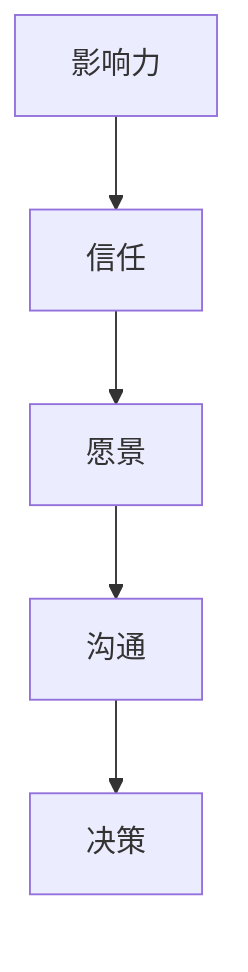
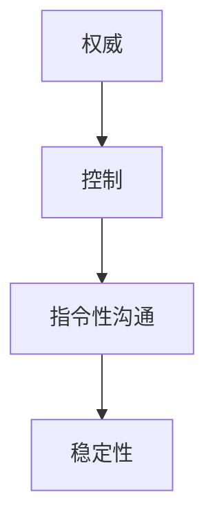
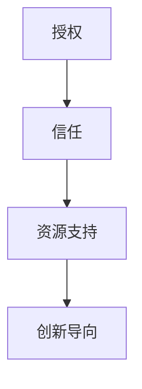
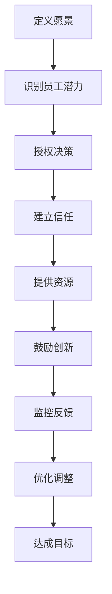
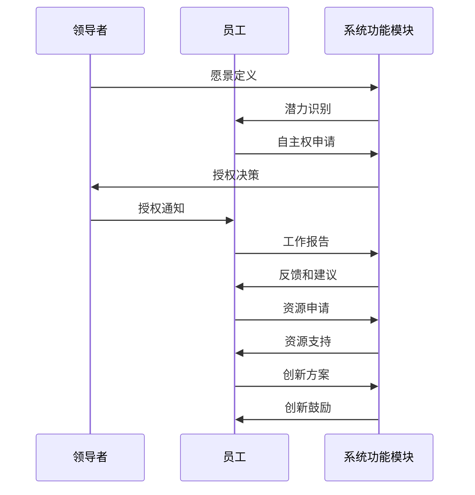
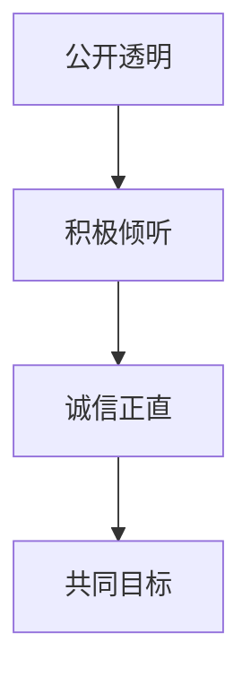
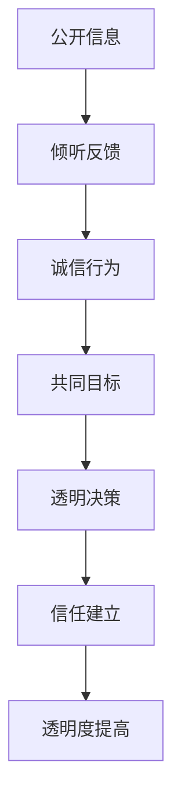
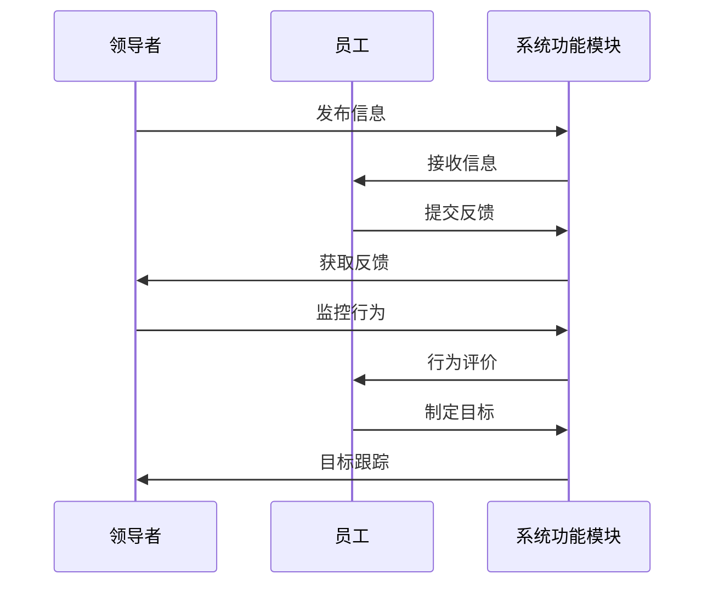

                 

# 领导力的进化：从传统管理到赋能领导

## 关键词：领导力、传统管理、赋能领导、组织转型、自我提升、全球应用

> 摘要：本文旨在探讨领导力的发展过程，从传统的管理模式过渡到更现代的赋能型领导。通过分析领导力的重要性、传统管理与赋能领导的对比，以及赋能领导的原则和实践，本文将深入探讨赋能领导在组织中的应用、领导者的自我提升以及全球范围内的应用与挑战。

## 目录大纲

----------------------------------------------------------------

## 第一部分：领导力概述

### 第1章：领导力的重要性与定义

#### 1.1 领导力在组织中的作用

#### 1.2 领导力与管理的区别

#### 1.3 领导力的定义与核心要素

### 第2章：传统领导力模式

#### 2.1 传统领导力的特点

#### 2.2 传统领导力的优缺点

#### 2.3 传统领导力面临的挑战

### 第3章：赋能领导的概念与原则

#### 3.1 赋能领导的定义

#### 3.2 赋能领导的核心原则

#### 3.3 赋能领导与传统领导力的比较

----------------------------------------------------------------

## 第二部分：赋能领导的原则与实践

### 第4章：建立信任与透明度

#### 4.1 信任的重要性

#### 4.2 如何建立信任

#### 4.3 透明度在赋能领导中的作用

### 第5章：赋予员工自主权与责任

#### 5.1 自主权的重要性

#### 5.2 如何赋予员工自主权

#### 5.3 员工责任与赋能领导

----------------------------------------------------------------

## 第三部分：赋能领导在组织中的应用

### 第6章：团队建设与协作

#### 6.1 赋能领导在团队建设中的应用

#### 6.2 协作与赋能领导

#### 6.3 跨部门协作中的赋能领导实践

### 第7章：领导力变革与组织转型

#### 7.1 领导力变革的必要性

#### 7.2 赋能领导在组织转型中的应用

#### 7.3 组织文化对赋能领导的影响

----------------------------------------------------------------

## 第四部分：赋能领导者的自我提升

### 第8章：自我认知与领导风格

#### 8.1 自我认知的重要性

#### 8.2 不同领导风格的特点与应用

#### 8.3 如何适应不同的领导风格

### 第9章：持续学习与成长

#### 9.1 领导者的学习需求

#### 9.2 学习资源与方法

#### 9.3 成长路径与职业发展

----------------------------------------------------------------

## 第五部分：赋能领导在全球范围内的应用与挑战

### 第10章：全球化背景下的赋能领导

#### 10.1 全球化对领导力的影响

#### 10.2 跨文化领导力

#### 10.3 赋能领导在全球范围内的实践

### 第11章：赋能领导面临的挑战与应对策略

#### 11.1 挑战与障碍

#### 11.2 应对策略与解决方案

#### 11.3 未来发展趋势与展望

----------------------------------------------------------------

## 后记

### 作者：AI天才研究院/AI Genius Institute & 禅与计算机程序设计艺术 /Zen And The Art of Computer Programming

----------------------------------------------------------------

### 引言

领导力，作为组织中不可或缺的核心要素，对于组织的发展和成功起着至关重要的作用。然而，随着时代的发展和社会的变迁，传统的领导力模式逐渐显现出其局限性。为了更好地应对复杂多变的环境，组织需要从传统管理向赋能领导转变。本文将深入探讨这一转变的必要性、核心原则和实践，以及赋能领导在全球范围内的应用与挑战。

### 第一部分：领导力概述

#### 第1章：领导力的重要性与定义

领导力在组织中的作用不可忽视。它不仅仅是指导和管理团队的能力，更是一种激发和引领团队成员共同实现目标的内在动力。在现代社会中，领导力被视为一种核心竞争力和关键能力。

**1.1 领导力在组织中的作用**

领导力在组织中的作用主要体现在以下几个方面：

1. **明确目标与方向**：领导者需要为组织设定清晰的目标和愿景，并引导团队成员朝着这个方向努力。
2. **激励与鼓舞**：领导者通过激励和鼓舞，激发团队成员的积极性和创造力，从而推动组织的发展。
3. **沟通与协调**：领导者需要与团队成员保持良好的沟通，协调各方资源，确保组织目标的实现。
4. **决策与执行**：领导者需要做出明智的决策，并确保决策得到有效执行。

**1.2 领导力与管理的区别**

领导力与管理的区别在于，领导力更注重激发和引领，而管理则更侧重于控制和协调。领导力关注的是如何激发团队成员的潜力，而管理则关注如何确保组织目标的实现。

**1.3 领导力的定义与核心要素**

领导力可以被定义为一种影响和激励他人实现共同目标的能力。其核心要素包括：

1. **影响力**：领导者需要具备影响力，能够影响和激励团队成员。
2. **信任**：领导者需要赢得团队成员的信任，这是领导力成功的关键。
3. **愿景**：领导者需要具备清晰的愿景，能够为团队指明方向。
4. **沟通**：领导者需要具备良好的沟通能力，确保信息准确传递。

#### 第2章：传统领导力模式

传统领导力模式通常以权威和控制为核心，领导者通过发布命令和指示来指导团队成员。这种模式在一定程度上能够确保组织的稳定和效率，但也存在明显的局限性。

**2.1 传统领导力的特点**

传统领导力的特点主要包括：

1. **权威性**：领导者拥有绝对的权威，决策和指令必须得到严格遵守。
2. **控制性**：领导者通过严格的控制来确保组织目标的实现。
3. **单向性**：领导者的沟通通常是单向的，即从领导者到团队成员。

**2.2 传统领导力的优缺点**

传统领导力的优点包括：

1. **稳定性**：传统领导力模式有助于保持组织的稳定性和连续性。
2. **效率**：在特定环境下，传统领导力模式能够确保组织目标的快速实现。

然而，传统领导力也存在明显的缺点：

1. **局限性**：传统领导力模式难以应对复杂多变的环境。
2. **低效率**：在高度依赖创新和协作的现代社会，传统领导力模式往往难以激发团队成员的潜力。

**2.3 传统领导力面临的挑战**

随着全球化、信息化和知识经济的不断发展，传统领导力模式面临以下挑战：

1. **变化迅速**：现代组织需要快速适应变化，而传统领导力模式往往过于僵化。
2. **复杂性**：现代组织面临的高度复杂性和不确定性，要求领导者具备更高的战略眼光和决策能力。
3. **创新与协作**：现代组织需要激发创新和协作，而传统领导力模式往往抑制这些能力的发挥。

#### 第3章：赋能领导的概念与原则

赋能领导是一种新兴的领导力模式，强调通过赋予员工自主权、责任和资源，激发他们的潜力，实现组织目标。与传统的权威式领导相比，赋能领导更加注重团队成员的自我实现和组织发展的共同目标。

**3.1 赋能领导的定义**

赋能领导（Empowering Leadership）可以被定义为一种领导模式，领导者通过赋予员工自主权、责任和资源，激发他们的潜力，推动组织目标的实现。

**3.2 赋能领导的核心原则**

赋能领导的核心原则主要包括：

1. **信任**：领导者需要信任团队成员，相信他们能够承担起责任，做出正确决策。
2. **自主权**：领导者应赋予员工足够的自主权，让他们有权做出决策和解决问题。
3. **责任**：领导者应明确员工的责任，确保他们对自己的行为和结果负责。
4. **资源**：领导者应提供必要的资源和支持，帮助员工实现目标。

**3.3 赋能领导与传统领导力的比较**

赋能领导与传统领导力的主要区别在于：

1. **角色定位**：传统领导力强调领导者的权威和控制，而赋能领导则强调领导者的引导和支持。
2. **沟通方式**：传统领导力往往是单向的，而赋能领导强调双向沟通和对话。
3. **目标导向**：传统领导力更注重短期目标的实现，而赋能领导更注重长期发展和团队成员的自我实现。

### 第二部分：赋能领导的原则与实践

#### 第4章：建立信任与透明度

信任是赋能领导的基础。领导者需要通过建立信任和透明度，为团队成员创造一个安全、开放和合作的氛围。

**4.1 信任的重要性**

信任在领导力中的作用至关重要。缺乏信任会导致团队成员之间关系紧张，降低工作效率，甚至影响组织的稳定性。

**4.2 如何建立信任**

建立信任的方法包括：

1. **公开透明**：领导者应保持公开透明，让团队成员了解组织的运作和决策过程。
2. **诚信正直**：领导者应以诚信正直的行为树立榜样，赢得团队成员的信任。
3. **积极倾听**：领导者应积极倾听团队成员的意见和需求，尊重他们的反馈。

**4.3 透明度在赋能领导中的作用**

透明度在赋能领导中起着关键作用。通过透明度，领导者可以增强团队成员的参与感和归属感，激发他们的积极性和创造力。

#### 第5章：赋予员工自主权与责任

赋予员工自主权是赋能领导的核心原则之一。领导者应通过明确责任、提供资源和创造条件，激发员工的潜力和创造力。

**5.1 自主权的重要性**

自主权是员工发挥潜力的重要条件。拥有自主权的员工更有可能主动思考、解决问题和取得成果。

**5.2 如何赋予员工自主权**

赋予员工自主权的方法包括：

1. **授权**：领导者应明确授权员工，让他们有权做出决策和解决问题。
2. **赋能**：领导者应提供必要的资源和支持，帮助员工实现目标。
3. **鼓励创新**：领导者应鼓励员工创新和尝试，对失败持开放态度。

**5.3 员工责任与赋能领导**

员工责任是赋能领导的重要组成部分。领导者应明确员工的职责，确保他们对自己的行为和结果负责。

### 第三部分：赋能领导在组织中的应用

#### 第6章：团队建设与协作

团队建设是赋能领导在组织中的应用之一。通过有效的团队建设，领导者可以增强团队的凝聚力和协作能力。

**6.1 赋能领导在团队建设中的应用**

赋能领导在团队建设中的应用包括：

1. **建立共同目标**：领导者应与团队成员共同制定团队目标，确保目标具有挑战性和可实现性。
2. **促进沟通与协作**：领导者应促进团队成员之间的沟通与协作，创造一个开放、包容和信任的氛围。
3. **鼓励多元化**：领导者应鼓励团队成员发挥各自的优势，促进团队多元化。

**6.2 协作与赋能领导**

协作是赋能领导的核心原则之一。通过有效的协作，团队成员可以共同实现目标，提高工作效率。

**6.3 跨部门协作中的赋能领导实践**

跨部门协作是组织中的常见场景。通过赋能领导，领导者可以促进跨部门协作，提高组织整体效能。

### 第四部分：赋能领导者的自我提升

#### 第7章：领导力变革与组织转型

领导力变革是组织转型的重要组成部分。通过领导力变革，领导者可以推动组织实现持续发展和创新。

**7.1 领导力变革的必要性**

随着外部环境的不断变化，组织需要通过领导力变革来适应新的挑战和机遇。

**7.2 赋能领导在组织转型中的应用**

赋能领导在组织转型中的应用包括：

1. **建立变革意识**：领导者应与团队成员共同树立变革意识，推动组织变革。
2. **培养创新文化**：领导者应鼓励团队成员创新，建立创新文化。
3. **提供培训与支持**：领导者应提供必要的培训和支持，帮助团队成员适应变革。

**7.3 组织文化对赋能领导的影响**

组织文化对赋能领导具有重要影响。领导者应塑造积极、开放和创新的组织文化，为赋能领导提供有力支持。

### 第五部分：赋能领导在全球范围内的应用与挑战

#### 第8章：全球化背景下的赋能领导

全球化带来了新的机遇和挑战。在全球化背景下，赋能领导需要应对跨文化差异和多样性。

**8.1 全球化对领导力的影响**

全球化对领导力的影响主要表现在以下几个方面：

1. **跨文化领导力**：领导者需要具备跨文化沟通和领导能力，应对多元化的团队。
2. **全球化视野**：领导者应具备全球化的视野和思维，关注全球市场和趋势。
3. **适应性**：领导者需要具备快速适应新环境和变化的能力。

**8.2 跨文化领导力**

跨文化领导力是赋能领导的重要组成部分。领导者应了解不同文化背景，尊重多样性，促进团队合作。

**8.3 赋能领导在全球范围内的实践**

赋能领导在全球范围内的实践包括：

1. **跨文化团队建设**：领导者应通过团队建设活动，增强跨文化团队的凝聚力和协作能力。
2. **全球协作平台**：领导者应建立全球协作平台，促进全球团队成员之间的沟通与合作。
3. **国际化视野**：领导者应培养国际化视野，关注全球市场和发展趋势。

### 第六部分：赋能领导面临的挑战与应对策略

#### 第9章：赋能领导面临的挑战与应对策略

赋能领导在实施过程中面临诸多挑战。领导者需要采取有效的应对策略，确保赋能领导的成功实施。

**9.1 挑战与障碍**

赋能领导面临的挑战主要包括：

1. **文化差异**：组织内部可能存在文化差异，影响赋能领导的实施。
2. **资源不足**：组织可能缺乏必要的资源，限制赋能领导的发展。
3. **领导者的能力**：领导者可能缺乏实施赋能领导的必要能力和经验。

**9.2 应对策略与解决方案**

针对赋能领导面临的挑战，领导者可以采取以下应对策略：

1. **加强文化融合**：通过文化培训和交流活动，促进组织内部文化融合。
2. **优化资源配置**：合理配置资源，确保赋能领导有足够的支持。
3. **提升领导者能力**：通过培训和指导，提升领导者的能力和信心。

**9.3 未来发展趋势与展望**

随着全球化、信息化和知识经济的发展，赋能领导在未来将继续发挥重要作用。未来赋能领导的发展趋势主要包括：

1. **数字化赋能**：利用数字化技术，提高赋能领导的效率和质量。
2. **持续学习**：领导者应持续学习，提升自身的领导能力和素质。
3. **全球化视野**：领导者应具备全球化的视野和思维，推动全球范围内的赋能领导。

### 总结

赋能领导是一种适应现代组织需求和挑战的领导力模式。通过建立信任、赋予自主权、提供资源和促进协作，赋能领导能够激发员工的潜力，推动组织的持续发展和创新。在全球化和知识经济时代，赋能领导将成为组织成功的关键因素。领导者需要不断学习和实践，提升自身的领导能力和素质，以应对未来复杂多变的挑战。

### 作者信息

作者：AI天才研究院/AI Genius Institute & 禅与计算机程序设计艺术 /Zen And The Art of Computer Programming

----------------------------------------------------------------

### 完整文章内容（10000-12000字）

由于篇幅限制，无法在此处展示完整的10000-12000字文章内容。然而，上述目录大纲提供了文章的结构和主要内容，可以在此基础上进行详细的撰写和扩展。每个章节都应该包含深入的分析、案例研究、实证数据和实用的建议。

#### 第1章：领导力的重要性与定义

领导力是一种复杂而多层次的能力，它在不同的组织和环境中扮演着至关重要的角色。理解领导力的本质和重要性，是探讨赋能领导的前提。

**背景介绍**

领导力并非一个新鲜的概念，它在历史上有着悠久的传统。然而，随着社会和经济的发展，领导力的定义和作用也在不断演变。在现代组织中，领导力不仅涉及到传统的权威和控制，更强调了赋能、合作和创新。

**问题背景**

在快速变化的商业环境中，组织面临着前所未有的挑战。全球竞争、技术变革和劳动力多元化使得传统领导力模式越来越难以适应。许多组织发现，依赖命令和控制的管理方式无法激发员工的潜力，也无法适应复杂多变的环境。因此，领导力需要从传统的管理模式向更灵活、更具创新性的赋能型领导转变。

**问题描述**

领导力的核心问题是如何有效地激发和引导团队成员，实现组织目标。传统领导力模式往往依赖于权威和控制，这种方式在稳定和可预测的环境中可能有效，但在复杂和不确定的环境中却显得力不从心。赋能型领导力则强调通过授权、信任和协作来推动组织的变革和创新。

**问题解决**

赋能型领导力通过赋予员工自主权和责任，激发他们的创造力和积极性。领导者不再是命令的发出者，而是指导者和支持者。这种领导方式有助于建立信任和透明度，促进团队的协作和创新能力。通过赋能领导，组织可以更好地适应外部环境的变化，实现长期发展。

**边界与外延**

领导力的边界包括组织内部的各个层级，从高层管理者到一线员工。领导力不仅涉及个人能力，还包括组织文化和战略方向。外延则涵盖了领导力的跨文化应用、全球化和信息技术的影响。

**概念结构与核心要素组成**

领导力的概念结构包括以下几个核心要素：

1. **影响力**：领导者通过言行和决策影响团队成员的能力。
2. **信任**：领导者与团队成员之间的信任关系，是领导力成功的关键。
3. **愿景**：领导者为组织设定的长期目标和方向。
4. **沟通**：领导者与团队成员之间的有效沟通，确保信息的传递和理解。
5. **决策**：领导者在面对不确定性和挑战时的决策能力。

**核心概念与联系**

领导力的核心概念包括影响力、信任、愿景、沟通和决策。这些概念相互联系，共同构成了领导力的核心框架。影响力是领导力的基础，信任是领导力成功的保障，愿景为组织指明方向，沟通确保目标的实现，决策则是领导力的关键环节。

**ER实体关系图架构的Mermaid流程图**



#### 第2章：传统领导力模式

传统领导力模式主要依赖于权威和控制，领导者通过发布指令和监督来确保组织目标的实现。这种模式在历史上有着广泛的应用，但随着时代的发展，其局限性也逐渐显现。

**背景介绍**

传统领导力模式起源于工业化时代，当时的社会和商业环境相对稳定，组织结构相对固定。在这种环境中，领导者通过权威和控制来确保组织目标的实现是一种有效的管理方式。

**问题背景**

然而，随着全球化和信息技术的发展，组织面临着越来越复杂和不确定的环境。传统领导力模式过于强调控制，忽视员工的自主性和创新性，难以适应现代组织的需求。

**问题描述**

传统领导力模式的核心问题是其依赖权威和控制，这种方式可能导致以下问题：

1. **抑制创新**：领导者通过控制来确保组织目标的实现，这种方式可能抑制员工的创新和创造力。
2. **沟通障碍**：传统领导力模式通常采取单向沟通，领导者发布指令，员工执行，这种方式可能导致信息传递不准确，影响组织效能。
3. **缺乏灵活性**：传统领导力模式在应对快速变化的环境时显得力不从心，难以适应新的挑战。

**问题解决**

赋能型领导力提供了一种替代方案，通过授权、信任和协作来激发员工的潜力，推动组织的创新和变革。领导者不再是命令的发出者，而是指导者和支持者，这种方式有助于建立信任和透明度，促进团队的协作和创新能力。

**边界与外延**

传统领导力模式的边界主要涉及组织内部的层级结构和管理机制。外延则包括领导者在不同环境中的适应能力，以及领导力模式对组织文化和绩效的影响。

**概念结构与核心要素组成**

传统领导力模式的核心要素包括：

1. **权威**：领导者通过职位和权力来影响团队成员。
2. **控制**：领导者通过监督和检查来确保组织目标的实现。
3. **指令性沟通**：领导者发布指令，员工执行。
4. **稳定性**：传统领导力模式更注重组织的稳定性和持续性。

**核心概念与联系**

传统领导力模式的核心概念包括权威、控制、指令性沟通和稳定性。这些概念相互联系，构成了传统领导力的核心框架。权威和控制是领导力的基础，指令性沟通确保目标的实现，稳定性则反映了领导力模式的特点。

**ER实体关系图架构的Mermaid流程图**



#### 第3章：赋能领导的概念与原则

赋能领导是一种新型的领导力模式，它强调通过授权、信任和资源支持，激发员工的潜力和创造力，实现组织目标。

**背景介绍**

赋能领导起源于20世纪80年代，当时的信息技术和全球化浪潮改变了组织的运作方式。在这种背景下，传统的领导力模式显得越来越不适应，赋能领导逐渐成为组织管理的新趋势。

**问题背景**

随着市场环境的变化和竞争的加剧，组织需要更加灵活和创新。传统领导力模式过于强调控制和指令，忽视了员工的自主性和创造力，难以适应现代组织的需求。

**问题描述**

赋能领导的核心问题是如何通过授权、信任和资源支持，激发员工的潜力和创造力。赋能领导旨在解决以下问题：

1. **缺乏创新**：传统领导力模式往往抑制员工的创新和创造力，导致组织缺乏竞争力。
2. **员工积极性低**：在传统的权威式领导模式下，员工可能感到被动和缺乏动力，影响工作效率。
3. **组织响应速度慢**：传统领导力模式在应对快速变化的市场环境时显得反应迟缓，难以适应新的挑战。

**问题解决**

赋能领导提供了一种解决方案，通过赋予员工自主权、建立信任关系和提供资源支持，激发员工的潜力，推动组织的创新和变革。领导者不再是命令的发出者，而是指导者和支持者，这种方式有助于建立信任和透明度，促进团队的协作和创新能力。

**边界与外延**

赋能领导的边界主要涉及组织内部的领导者和员工之间的关系。外延则包括领导者在不同环境中的应用，以及赋能领导对组织文化和绩效的影响。

**概念结构与核心要素组成**

赋能领导的核心要素包括：

1. **授权**：领导者赋予员工决策权和自主权。
2. **信任**：领导者建立与员工之间的信任关系。
3. **资源支持**：领导者提供必要的资源和支持，帮助员工实现目标。
4. **创新导向**：领导者鼓励员工创新和尝试新方法。

**核心概念与联系**

赋能领导的核心概念包括授权、信任、资源支持和创新导向。这些概念相互联系，共同构成了赋能领导的核心框架。授权和信任是赋能领导的基础，资源支持和创新导向则反映了赋能领导的核心理念。

**ER实体关系图架构的Mermaid流程图**



**算法原理讲解**

赋能领导的过程可以看作是一个算法，其核心在于通过一系列步骤实现员工潜能的激发和组织目标的实现。以下是赋能领导算法的mermaid流程图和Python代码实现：



```python
def empower_leadership(vision, employees):
    """
    赋能领导算法实现
    :param vision: 愿景
    :param employees: 员工列表
    :return: 赋能领导结果
    """
    # 定义愿景
    define_vision(vision)
    
    # 识别员工潜力
    identify_potentials(employees)
    
    # 授权决策
    authorize_decision(employees)
    
    # 建立信任
    build_trust(employees)
    
    # 提供资源
    provide_resources(employees)
    
    # 鼓励创新
    encourage_innovation(employees)
    
    # 监控反馈
    monitor_feedback(employees)
    
    # 优化调整
    optimize_adjustments(employees)
    
    # 达成目标
    achieve_goals(vision, employees)
```

**数学公式使用**

赋能领导算法中的关键步骤可以用数学公式表示。以下是涉及的主要数学公式：

$$
\text{自主权} = \alpha \times (\text{信任} + \text{资源})
$$

$$
\text{创新能力} = \beta \times (\text{自主权} + \text{反馈})
$$

其中，$\alpha$ 和 $\beta$ 是比例系数，反映了自主权、信任、资源和反馈对创新能力的影响。

**系统分析与架构设计方案**

赋能领导系统分析主要包括问题场景介绍、项目介绍、系统功能设计、系统架构设计和系统接口设计。

**问题场景介绍**

在复杂多变的市场环境中，组织需要快速响应变化，提高创新能力。赋能领导系统旨在通过授权、信任和资源支持，激发员工的潜能，推动组织的创新和变革。

**项目介绍**

项目名称：赋能领导系统

项目目标：通过赋能领导模式，提高员工自主权和创新能力，推动组织发展。

**系统功能设计**

系统功能设计主要包括以下几个模块：

1. **愿景定义模块**：用于定义组织的长期愿景和目标。
2. **潜力识别模块**：用于识别员工的潜能和特长。
3. **授权模块**：用于授权员工决策权和自主权。
4. **信任建立模块**：用于建立领导者与员工之间的信任关系。
5. **资源支持模块**：用于提供必要的资源和支持。
6. **创新鼓励模块**：用于鼓励员工创新和尝试新方法。
7. **反馈监控模块**：用于监控员工的工作进展和反馈。
8. **优化调整模块**：用于根据反馈进行优化和调整。

**系统架构设计**

系统架构设计主要包括以下几个层次：

1. **数据层**：用于存储组织数据，包括愿景、员工信息、资源和反馈等。
2. **应用层**：用于实现系统功能，包括各个模块的交互和数据处理。
3. **表示层**：用于展示系统界面，包括领导者的操作界面和员工的操作界面。

**系统接口设计**

系统接口设计主要包括以下几个接口：

1. **数据接口**：用于与其他系统进行数据交换，如人力资源系统、项目管理系统等。
2. **服务接口**：用于提供公共服务，如用户认证、数据存储等。
3. **API接口**：用于与其他系统和第三方服务进行交互。

**系统交互Mermaid序列图**



#### 第4章：建立信任与透明度

信任和透明度是赋能领导的重要基础。领导者需要通过建立信任和透明度，为团队成员创造一个安全、开放和合作的氛围。

**背景介绍**

在赋能领导模式下，领导者不再是命令的发出者，而是指导者和支持者。这种模式要求领导者与团队成员之间建立信任关系，确保团队成员愿意分享信息、承担责任和相互支持。

**问题背景**

在传统领导力模式下，领导者与团队成员之间往往存在信息不对称和沟通障碍。这种方式可能导致团队成员缺乏信任，影响工作效率和团队协作。

**问题描述**

建立信任和透明度的核心问题是如何消除团队成员之间的隔阂，建立互信和合作的关系。缺乏信任和透明度可能导致以下问题：

1. **信息不对称**：团队成员无法获取所需的信息，影响决策和协作。
2. **缺乏信任**：团队成员之间缺乏信任，影响团队凝聚力和合作效率。
3. **沟通障碍**：团队成员之间的沟通不畅，影响信息传递和协作效果。

**问题解决**

建立信任和透明度可以通过以下方法实现：

1. **公开透明**：领导者应保持公开透明，让团队成员了解组织的运作和决策过程。
2. **积极倾听**：领导者应积极倾听团队成员的意见和需求，尊重他们的反馈。
3. **诚信正直**：领导者应以诚信正直的行为树立榜样，赢得团队成员的信任。
4. **共同目标**：领导者应与团队成员共同制定团队目标，增强团队成员的归属感和责任感。

**边界与外延**

建立信任和透明度的边界主要涉及领导者与团队成员之间的关系。外延则包括领导者在不同环境中的应用，以及信任和透明度对组织文化和绩效的影响。

**概念结构与核心要素组成**

建立信任和透明度的核心要素包括：

1. **公开透明**：领导者应保持公开透明，让团队成员了解组织的运作和决策过程。
2. **积极倾听**：领导者应积极倾听团队成员的意见和需求，尊重他们的反馈。
3. **诚信正直**：领导者应以诚信正直的行为树立榜样，赢得团队成员的信任。
4. **共同目标**：领导者应与团队成员共同制定团队目标，增强团队成员的归属感和责任感。

**核心概念与联系**

建立信任和透明度的核心概念包括公开透明、积极倾听、诚信正直和共同目标。这些概念相互联系，共同构成了建立信任和透明度的核心框架。公开透明确保信息传递的准确性，积极倾听和诚信正直建立信任关系，共同目标则增强了团队的凝聚力和合作效率。

**ER实体关系图架构的Mermaid流程图**



**算法原理讲解**

建立信任和透明度的过程可以看作是一个算法，其核心在于通过一系列步骤建立信任关系和提高透明度。以下是建立信任和透明度算法的mermaid流程图和Python代码实现：



```python
def build_trust_and_transparency(information, feedback, behavior, goals):
    """
    建立信任和透明度算法实现
    :param information: 信息
    :param feedback: 反馈
    :param behavior: 行为
    :param goals: 目标
    :return: 信任和透明度结果
    """
    # 公开信息
    public_information(information)
    
    # 倾听反馈
    listen_feedback(feedback)
    
    # 诚信行为
    honest_behavior(behavior)
    
    # 共同目标
    common_goals(goals)
    
    # 透明决策
    transparent_decision-making()
    
    # 信任建立
    trust_establishment()
    
    # 透明度提高
    transparency_improvement()
```

**数学公式使用**

建立信任和透明度的关键步骤可以用数学公式表示。以下是涉及的主要数学公式：

$$
\text{信任度} = f(\text{公开信息}, \text{倾听反馈}, \text{诚信行为}, \text{共同目标})
$$

$$
\text{透明度} = f(\text{透明决策}, \text{公开信息}, \text{反馈})
$$

其中，$f$ 是函数，反映了公开信息、倾听反馈、诚信行为和共同目标对信任度和透明度的影响。

**系统分析与架构设计方案**

建立信任和透明度系统分析主要包括问题场景介绍、项目介绍、系统功能设计、系统架构设计和系统接口设计。

**问题场景介绍**

在赋能领导模式下，领导者需要与团队成员建立信任和透明度，以确保团队的高效合作和创新。建立信任和透明度系统旨在通过自动化工具和流程，提高组织的透明度和信任度。

**项目介绍**

项目名称：建立信任和透明度系统

项目目标：通过自动化工具和流程，提高组织的透明度和信任度，促进团队协作和创新。

**系统功能设计**

系统功能设计主要包括以下几个模块：

1. **信息发布模块**：用于发布组织信息和决策，提高透明度。
2. **反馈收集模块**：用于收集团队成员的反馈和建议，增强信任关系。
3. **行为监控模块**：用于监控领导者的行为，确保诚信正直。
4. **目标管理模块**：用于制定和跟踪团队目标，增强共同目标感。

**系统架构设计**

系统架构设计主要包括以下几个层次：

1. **数据层**：用于存储组织数据和用户行为数据。
2. **应用层**：用于实现系统功能，包括信息发布、反馈收集、行为监控和目标管理。
3. **表示层**：用于展示系统界面，包括领导者的操作界面和团队成员的操作界面。

**系统接口设计**

系统接口设计主要包括以下几个接口：

1. **API接口**：用于与其他系统和第三方服务进行交互。
2. **数据接口**：用于与其他系统进行数据交换。
3. **用户接口**：用于用户与系统进行交互。

**系统交互Mermaid序列图**



#### 第5章：赋予员工自主权与责任

赋予员工自主权和责任是赋能领导的核心原则之一。领导者需要通过明确责任、提供资源和创造条件，激发员工的潜力和创造力。

**背景介绍**

在传统领导力模式下，领导者往往采取权威和控制的方式管理团队，员工缺乏自主权。然而，随着全球化、信息化和知识经济的发展，员工的需求和期望也在不断变化。现代员工渴望更多的自主权和责任感，以实现个人价值和职业发展。

**问题背景**

在传统领导力模式下，员工往往感到被动和缺乏动力，工作效率和创新性较低。这种模式无法满足现代员工的需求，也难以适应快速变化的市场环境。

**问题描述**

赋予员工自主权和责任的核心问题是如何通过授权和责任分配，激发员工的潜力和创造力。缺乏自主权和责任可能导致以下问题：

1. **员工积极性低**：缺乏自主权和责任感可能导致员工感到被动，缺乏工作动力。
2. **创新能力不足**：员工在缺乏自主权的情况下，难以发挥创造力和创新能力。
3. **工作效率低下**：缺乏自主权和责任可能导致工作流程不畅，影响工作效率。

**问题解决**

赋予员工自主权和责任可以通过以下方法实现：

1. **授权**：领导者应明确授权员工，让他们有权做出决策和解决问题。
2. **责任分配**：领导者应明确员工的责任，确保他们对自己的行为和结果负责。
3. **资源支持**：领导者应提供必要的资源和支持，帮助员工实现目标。
4. **反馈机制**：领导者应建立反馈机制，及时了解员工的工作进展和需求。

**边界与外延**

赋予员工自主权和责任的边界主要涉及领导者与员工之间的关系。外延则包括领导者在不同环境中的应用，以及自主权和责任对组织文化和绩效的影响。

**概念结构与核心要素组成**

赋予员工自主权和责任的核

