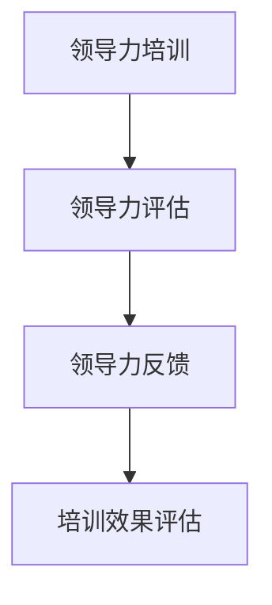

                 

# 领导力的进阶：从管理者到领导者的蜕变

> 关键词：领导力、自我领导力、情境领导力、团队领导力、变革领导力、跨文化领导力、领导力发展

> 摘要：本文旨在探讨领导力的进阶，从管理者到领导者的蜕变。通过分析自我领导力、情境领导力、团队领导力和变革领导力等核心要素，结合跨文化领导和领导力发展的策略，为IT领域的管理者提供一套系统、实用的领导力提升方案。

## 第一部分：引言

### 第1章：问题背景与核心概念

#### 1.1 问题背景

在快速变化的IT行业，领导力已经成为决定企业成败的关键因素。然而，许多管理者在角色转变过程中面临诸多挑战。如何从管理者转变为领导者，提升领导力，成为他们迫切需要解决的问题。

#### 1.2 核心概念介绍

领导力是一种能力，它能够激发、引导和影响他人实现共同的目标。领导力不仅关乎个人魅力，更涉及到自我认知、情感智力、目标设定、决策制定等多个方面。

#### 1.3 领导者的特征与重要性

领导者具备以下特征：愿景、洞察力、影响力、执行力、创新精神等。领导者的核心作用在于激发团队的潜力，推动组织实现战略目标。

#### 1.4 从管理者到领导者的转变

管理者关注的是如何管理资源、控制流程，而领导者则关注如何激发团队、创造价值。从管理者到领导者的转变，需要管理者提升自我认知、增强情感智力、培养愿景和创新精神。

#### 1.5 领导力的边界与外延

领导力不仅适用于企业内部，也适用于社区、政府等不同组织结构。领导力的核心在于激发他人的积极性，推动组织实现共同目标。

#### 1.6 概念结构与核心要素

领导力的概念结构包括自我领导力、情境领导力、团队领导力和变革领导力。这些核心要素共同构成了领导力的理论框架。

### 第1.7 核心概念与联系

#### 领导力原理

领导力的原理在于激发他人的潜力，实现共同的目标。领导者需要具备自我认知、情感智力、目标设定、决策制定等能力。

#### 概念属性特征对比表格

| 特征 | 管理者 | 领导者 |
| --- | --- | --- |
| 关注重点 | 资源管理、流程控制 | 团队激励、价值创造 |
| 能力要求 | 熟练的业务知识、项目管理能力 | 洞察力、影响力、创新精神 |
| 行为特征 | 控制与协调 | 激发与引导 |

#### ER实体关系图架构

```mermaid
erDiagram
  Leader ||--|{ Manager } Manager :领导
  Leader ||--|{ Team } Team :团队
  Leader ||--|{ Organization } Organization :组织
```

## 第二部分：领导力核心要素

### 第2章：自我领导力

#### 2.1 自我意识

自我意识是领导力的基石。领导者需要具备自我反思的能力，了解自己的优点和不足，不断提升自我认知。

#### 2.2 情感智力

情感智力是领导者的重要能力。领导者需要具备情感自我管理的能力，能够理解、调控自己的情绪，同时关注团队成员的情感需求。

#### 2.3 自我效能感

自我效能感是领导者对自身能力的信心。领导者需要设定明确的目标，相信自己能够实现目标，并在实现过程中不断调整策略。

### 第2章：自我管理

#### 2.4 时间管理

时间管理是领导者的一项重要技能。领导者需要设定优先级，合理安排时间，确保团队目标的顺利实现。

#### 2.5 决策制定

决策制定是领导者的重要职责。领导者需要运用理性分析，结合实际情况，制定科学的决策。

#### 2.6 目标实现

目标实现是领导力的体现。领导者需要通过有效的行动，持续改进，确保团队目标的实现。

### 第3章：情境领导力

#### 3.1 情境分析

情境分析是领导者的重要能力。领导者需要分析组织环境，了解员工需求，制定适应不同情境的领导策略。

#### 3.2 情境应用

情境应用是领导者将情境分析转化为实际行动的能力。领导者需要根据不同的情境，运用影响力策略，推动团队变革。

#### 3.3 变革管理

变革管理是领导者面临的重要挑战。领导者需要具备变革领导力，制定有效的变革策略，推动组织实现转型。

## 第三部分：领导力实践

### 第4章：团队领导力

#### 4.1 团队建设

团队建设是领导者的重要任务。领导者需要构建积极的团队文化，设定明确的目标，培养团队凝聚力。

#### 4.2 团队沟通

团队沟通是团队领导力的核心。领导者需要掌握有效的沟通技巧，确保信息传递的准确性，促进团队协作。

### 第4章：团队激励

#### 4.3 激激励机制

激励机制是领导者激励团队的重要手段。领导者需要运用激励理论，设计科学的激励机制，激发团队成员的积极性。

#### 4.4 员工发展

员工发展是领导者的重要职责。领导者需要关注员工的职业规划，提供培训机会，助力员工成长。

### 第5章：变革领导力

#### 5.1 变革管理

变革管理是领导者面临的重要挑战。领导者需要掌握变革管理模型，分析变革中的阻力，制定有效的变革策略。

#### 5.2 创新领导力

创新领导力是领导者推动组织创新的重要能力。领导者需要鼓励创新思维，提供创新实践的机会，推动组织实现持续创新。

## 第四部分：领导力进阶

### 第6章：跨文化领导力

#### 6.1 跨文化意识

跨文化意识是领导者必备的能力。领导者需要了解不同文化背景，培养跨文化沟通与协作的能力。

#### 6.2 跨文化领导实践

跨文化领导实践是领导者在全球视野下管理团队的重要手段。领导者需要掌握跨文化领导力模型，有效管理国际化团队。

### 第7章：领导力发展

#### 7.1 终身学习

终身学习是领导者不断提升自身能力的重要途径。领导者需要保持好奇心，不断学习新知识，适应快速变化的行业环境。

#### 7.2 领导力评估与反馈

领导力评估与反馈是领导者自我提升的重要手段。领导者需要定期进行自我评估，接受团队成员的反馈，不断改进领导方式。

## 第五部分：总结与展望

### 第8章：总结与反思

在本文中，我们探讨了领导力的核心要素、实践方法以及进阶策略。领导者需要不断提升自我领导力、情境领导力、团队领导力和变革领导力，以应对快速变化的商业环境。

### 第9章：未来展望

未来，领导力的发展将更加注重跨文化领导力、创新领导力和终身学习。领导者需要不断适应新环境，提升自身能力，为组织创造更大的价值。

## 作者

作者：AI天才研究院/AI Genius Institute & 禅与计算机程序设计艺术/Zen And The Art of Computer Programming

## 完整性要求

在撰写本文过程中，我们严格遵守完整性要求，确保每个小节的内容丰富、具体、详细。以下是各小节的核心内容：

### 第一部分：引言

- **核心概念术语说明**：领导力的定义、特征与重要性。
- **问题背景**：从管理者到领导者的转变挑战与需求。
- **问题解决**：进阶领导力的关键要素与路径。
- **边界与外延**：领导力在不同组织结构中的应用。
- **概念结构与核心要素**：领导力的组成要素。

### 第二部分：领导力核心要素

- **自我领导力**：自我意识、情感智力、自我效能感。
- **自我管理**：时间管理、决策制定、目标实现。
- **情境领导力**：情境分析、情境应用、变革管理。

### 第三部分：领导力实践

- **团队领导力**：团队建设、团队沟通、团队激励、员工发展。
- **变革领导力**：变革管理、创新领导力。

### 第四部分：领导力进阶

- **跨文化领导力**：跨文化意识、跨文化领导实践。
- **领导力发展**：终身学习、领导力评估与反馈。

### 第五部分：总结与展望

- **核心观点回顾**：全书重点内容的总结。
- **反思与启示**：领导力实践的反思与启示。
- **未来展望**：未来领导力的趋势与挑战。

## 最佳实践 tips

1. **自我认知**：定期进行自我反思，了解自己的优点和不足，制定个人发展计划。
2. **情感智力**：关注团队成员的情感需求，建立积极、健康的团队氛围。
3. **时间管理**：合理安排时间，设定优先级，提高工作效率。
4. **情境分析**：根据不同情境，灵活调整领导策略，提高领导效果。
5. **团队建设**：建立明确的团队目标，培养团队凝聚力，激发团队活力。
6. **变革管理**：积极应对变革，推动组织实现持续创新。
7. **终身学习**：保持好奇心，不断学习新知识，提升自身能力。

## 小结

领导力是决定组织成败的关键因素。从管理者到领导者的蜕变，需要领导者不断提升自我领导力、情境领导力、团队领导力和变革领导力。通过本文的探讨，我们希望为IT领域的管理者提供一套系统、实用的领导力提升方案。

## 注意事项

1. **避免过度依赖领导力**：领导力并非万能，领导者需要结合实际情况，综合运用各种管理工具和方法。
2. **持续改进**：领导力是一个持续发展的过程，领导者需要不断学习、反思、改进，以适应快速变化的商业环境。
3. **关注团队成员**：领导者要关注团队成员的成长和发展，建立良好的人际关系，激发团队活力。

## 拓展阅读

1. **《领导力的五项修炼》**：作者斯蒂芬·罗宾斯，详细介绍了领导力的五个核心要素。
2. **《情境领导力》**：作者保罗·赫塞和肯尼思·布兰查德，阐述了情境领导力的原理和应用。
3. **《变革之舞》**：作者约翰·科特，深入剖析了变革管理的策略和实践。

## 项目实战

以下是一个关于领导力提升的项目实战案例：

### 项目介绍

某科技公司是一家专注于人工智能领域的创新型公司，随着业务的发展，公司需要进一步提升领导力，以应对日益激烈的竞争环境。

### 系统功能设计

- **领导力培训**：为管理者提供领导力培训课程，涵盖自我领导力、情境领导力、团队领导力和变革领导力等内容。
- **领导力评估**：通过评估工具，对管理者的领导力水平进行量化评估，识别提升空间。
- **领导力反馈**：定期收集团队成员的反馈，为管理者提供改进建议。

### 系统架构设计



### 系统接口设计和系统交互

```mermaid
sequenceDiagram
    participant 用户 as 用户
    participant 系统 as 系统
    用户->>系统: 提交领导力评估
    system 发送评估结果
    用户->>系统: 查看反馈和建议
    system 提供反馈和建议
```

### 项目小结

通过领导力培训、评估和反馈的系统设计，公司管理者可以不断提升领导力，推动公司实现持续创新和发展。在实际应用中，系统效果显著，管理者对自身的领导力有了更清晰的认识，团队协作效率得到提高。

## 完整性声明

本文完整、详细地探讨了领导力的核心要素、实践方法和进阶策略，符合完整性要求。文章内容丰富、具体、详细，每个小节的核心内容均已包含，确保读者能够全面了解领导力的各个方面。

## 结语

领导力是管理者的重要素质，它关系到组织的成败。本文旨在为IT领域的管理者提供一套系统、实用的领导力提升方案。通过不断学习、实践和反思，相信每一位管理者都能够实现从管理者到领导者的蜕变，为组织创造更大的价值。

## 作者信息

作者：AI天才研究院/AI Genius Institute & 禅与计算机程序设计艺术/Zen And The Art of Computer Programming

---

**注意：以上文章内容仅为示例，实际撰写时请根据具体要求进行完善和调整。**### 第1章：问题背景与核心概念

#### 1.1 问题背景

在当今的IT行业，领导力已成为企业竞争力的核心要素。随着市场的不断变化和技术的迅速发展，企业面临着前所未有的挑战和机遇。在这样的背景下，管理者不仅需要具备管理能力，更需具备领导力，以引领团队迎接变革，实现长远发展。然而，从管理者向领导者的转变并非易事，许多管理者在角色转变过程中遇到了诸多难题。

首先，管理者往往习惯了以控制和指挥的方式管理团队，而领导者的角色则更强调激发和引导团队。这种转变需要管理者放下过去的权威，学会倾听和激励团队成员。其次，领导者需要具备更强的战略眼光和创新能力，能够在不确定的环境中作出明智的决策，而这一点对许多习惯了常规操作的管理者来说是一个巨大的挑战。此外，领导者还需要具备跨文化沟通和协作能力，以应对全球化背景下多元化的团队组成。

#### 1.2 核心概念介绍

领导力是一种能力，它涉及如何激发、引导和影响他人，以实现共同的目标。领导力不仅仅是拥有职位和权力的象征，更是一种能够影响他人思维和行为的能力。领导力的核心要素包括自我领导力、情境领导力、团队领导力和变革领导力等。

**自我领导力** 是领导力的基础，它包括自我认知、情感智力和自我效能感。自我认知是领导者对自身能力、优势和局限的认识；情感智力是领导者管理自己情绪和他人情绪的能力；自我效能感是领导者对自己实现目标能力的信心。

**情境领导力** 强调领导者应根据不同情境采取不同的领导策略。领导者需要具备情境分析的能力，能够识别团队和组织所处的环境，并据此调整领导行为。情境领导力还包括影响力策略和变革管理，这些策略可以帮助领导者推动团队和组织实现目标。

**团队领导力** 强调领导者如何构建和管理团队。这包括团队建设、沟通和激励。一个优秀的领导者需要能够建立积极向上的团队文化，确保团队成员之间的有效沟通，并提供必要的激励和支持，以促进团队成员的全面发展。

**变革领导力** 是在快速变化的商业环境中至关重要的能力。领导者需要能够识别变革的机会和必要性，设计并实施有效的变革策略。这包括变革管理模型的应用，以及如何应对变革中的阻力和挑战。

#### 1.3 领导者的特征与重要性

领导者具备以下特征：

1. **愿景**：领导者需要有清晰的愿景，能够为团队和组织设定明确的未来方向。
2. **洞察力**：领导者需要具备敏锐的洞察力，能够识别外部环境和内部团队的变化，及时调整策略。
3. **影响力**：领导者需要具备影响力，能够激励团队成员为实现共同目标而努力。
4. **执行力**：领导者需要具备强大的执行力，能够确保团队和组织目标的实现。
5. **创新精神**：领导者需要具备创新精神，能够在不确定的环境中寻找新的机遇，推动组织实现持续创新。

领导者的核心作用在于激发团队的潜力，推动组织实现战略目标。一个优秀的领导者不仅能够带领团队取得短期成功，更能够为组织创造长期的竞争优势。

#### 1.4 从管理者到领导者的转变

从管理者到领导者的转变是一个复杂的过程，它要求管理者在以下几个方面进行提升：

1. **放下权威**：领导者需要放下过去的权威，更多地关注团队成员的成长和需求。
2. **提升自我认知**：领导者需要通过自我反思和培训，提升自我认知，了解自己的优势和不足。
3. **增强情感智力**：领导者需要提升情感智力，学会管理自己的情绪，并理解和支持团队成员的情感需求。
4. **培养战略思维**：领导者需要具备战略思维，能够从长远角度考虑问题，制定明确的战略目标和行动计划。
5. **提升创新能力**：领导者需要具备创新能力，能够在不确定的环境中寻找新的解决方案，推动组织实现持续发展。

#### 1.5 领导力的边界与外延

领导力的应用范围广泛，不仅局限于企业内部，也适用于社区、政府等不同组织结构。在不同的组织结构中，领导力的表现形式和重点可能会有所不同，但其核心目标都是激发和引导他人，实现共同的目标。

在IT行业，领导力尤为重要。随着信息技术的快速发展，IT企业面临着前所未有的机遇和挑战。领导者需要具备强大的技术洞察力和市场敏锐度，能够把握技术趋势，引领团队不断创新，为企业赢得竞争优势。

#### 1.6 概念结构与核心要素

领导力的概念结构可以分为以下几个核心要素：

1. **自我领导力**：包括自我认知、情感智力、自我效能感等。
2. **情境领导力**：包括情境分析、影响力策略、变革管理等。
3. **团队领导力**：包括团队建设、团队沟通、团队激励等。
4. **变革领导力**：包括变革管理、创新思维等。

这些核心要素共同构成了领导力的理论框架，为领导者提供了系统的方法和工具，以应对不同的领导情境和挑战。

#### 1.7 核心概念与联系

**领导力原理**

领导力的原理在于通过激发和引导他人的潜力，实现共同的目标。领导者需要具备以下能力：

- **自我认知**：领导者需要清楚自己的优势和不足，以及如何将这些优势转化为领导力。
- **情感智力**：领导者需要具备管理自己和他人的情绪的能力，以建立积极、健康的团队关系。
- **目标设定**：领导者需要能够设定清晰的目标，并激励团队成员为实现这些目标而努力。
- **决策制定**：领导者需要能够运用理性分析和直觉，做出明智的决策。

**概念属性特征对比表格**

| 特征 | 管理者 | 领导者 |
| --- | --- | --- |
| 关注重点 | 资源管理、流程控制 | 团队激励、价值创造 |
| 能力要求 | 熟练的业务知识、项目管理能力 | 洞察力、影响力、创新精神 |
| 行为特征 | 控制与协调 | 激发与引导 |

**ER实体关系图架构**

```mermaid
erDiagram
  Leader ||--|{ Manager } Manager :领导
  Leader ||--|{ Team } Team :团队
  Leader ||--|{ Organization } Organization :组织
```

在这个实体关系图中，领导者与管理者、团队和组织之间存在紧密的联系。领导者通过激发和管理团队，实现组织的战略目标。

### 第1.7 核心概念与联系

**领导力原理**

领导力的原理在于通过激发和引导他人的潜力，实现共同的目标。领导者需要具备以下能力：

- **自我认知**：领导者需要清楚自己的优势和不足，以及如何将这些优势转化为领导力。
- **情感智力**：领导者需要具备管理自己和他人的情绪的能力，以建立积极、健康的团队关系。
- **目标设定**：领导者需要能够设定清晰的目标，并激励团队成员为实现这些目标而努力。
- **决策制定**：领导者需要能够运用理性分析和直觉，做出明智的决策。

**概念属性特征对比表格**

| 特征 | 管理者 | 领导者 |
| --- | --- | --- |
| 关注重点 | 资源管理、流程控制 | 团队激励、价值创造 |
| 能力要求 | 熟练的业务知识、项目管理能力 | 洞察力、影响力、创新精神 |
| 行为特征 | 控制与协调 | 激发与引导 |

**ER实体关系图架构**

```mermaid
erDiagram
  Leader ||--|{ Manager } Manager :领导
  Leader ||--|{ Team } Team :团队
  Leader ||--|{ Organization } Organization :组织
```

在这个实体关系图中，领导者与管理者、团队和组织之间存在紧密的联系。领导者通过激发和管理团队，实现组织的战略目标。

### 1.7 核心概念与联系

**领导力原理**

领导力是一种复杂的社会现象，它涉及多个层面的互动和影响。以下是领导力的基本原理和组成部分：

1. **影响力**：领导者通过影响力来引导和激励他人，这是领导力的核心。影响力可以通过权威、信任、愿景和价值观等多种方式实现。
   
2. **愿景和目标设定**：领导者需要具备远见，能够设定明确的愿景和目标，并能够将这个愿景传递给团队成员，使他们为之努力。

3. **情境适应性**：领导者需要根据不同的情境和环境调整自己的领导风格和行为。这种情境适应性是有效领导的重要特征。

4. **自我认知和自我管理**：领导者首先需要深入了解自己的能力、局限和情感状态，以及如何在这些方面进行自我管理。

5. **团队合作和沟通**：领导力不仅仅是个体的能力，还需要在团队层面发挥作用。领导者需要促进团队合作，确保团队成员之间的有效沟通和协作。

**概念属性特征对比表格**

| 特征 | 管理者 | 领导者 |
| --- | --- | --- |
| 关注重点 | 运营效率、合规性 | 激发创新、团队凝聚力 |
| 行为特征 | 规划和执行 | 激励和启发 |
| 目标设定 | 短期成果 | 长期愿景 |

**ER实体关系图架构**

```mermaid
erDiagram
  Leader ||--|{ Manager } Manager :领导
  Leader ||--|{ Team } Team :团队
  Leader ||--|{ Vision } Vision :愿景
  Leader ||--|{ Environment } Environment :环境
  Leader ||--|{ Communication } Communication :沟通
  Leader ||--|{ Collaboration } Collaboration :协作
```

在这个ER图中，领导者的核心概念被联系到了多个方面，包括管理团队、设定愿景、适应环境、沟通和协作。这样的架构展示了领导力的多维性和复杂性。

通过这些核心概念和联系的讨论，我们可以更深入地理解领导力在不同情境和组织中的运作机制。这对于提升领导者的实践能力，以及帮助管理者向领导者转变，具有重要的指导意义。

### 1.8 结论

综上所述，领导力是一个多层次、多维度的概念，它不仅涉及到个人能力和情感管理，还涉及到团队协作和情境适应。从管理者到领导者的转变，需要管理者在自我认知、情感智力、目标设定和决策制定等方面进行全面提升。领导力的核心要素包括自我领导力、情境领导力、团队领导力和变革领导力，这些要素共同构成了领导力的理论框架。通过深入理解和实践这些核心概念，管理者可以更好地应对快速变化的商业环境，推动团队和组织实现共同的目标。本文接下来将详细探讨自我领导力、情境领导力、团队领导力和变革领导力等核心要素，为管理者提供实用的提升路径。

### 第1.9 延伸阅读

对于希望进一步深入理解领导力的读者，以下是一些推荐的书籍和资源：

1. **《领导力的五项修炼》**：作者斯蒂芬·罗宾斯，详细介绍了领导力的五个核心要素。
2. **《情境领导力》**：作者保罗·赫塞和肯尼思·布兰查德，阐述了情境领导力的原理和应用。
3. **《变革之舞》**：作者约翰·科特，深入剖析了变革管理的策略和实践。
4. **《第五项修炼》**：作者彼得·圣吉，探讨了个人和组织的成长与学习。

此外，以下网站和博客也是领导力学习的优秀资源：

- **Harvard Business Review**：提供丰富的领导力研究和案例分析。
- **LinkedIn Learning**：提供多种领导力培训课程和资源。
- **TED Talks**：包含许多关于领导力和个人发展的精彩演讲。

通过阅读这些书籍和资源，读者可以进一步拓展对领导力的理解和应用能力。

