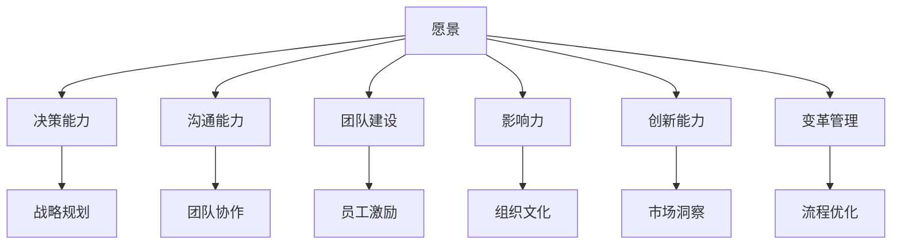

                 

### 第一部分：领导力的基础理论

#### 第1章：领导力的定义与核心要素

##### 1.1 领导力的定义

领导力是一种能力，它不仅仅是职位赋予的权力，更是一种影响力、沟通能力和决策能力。领导力涉及到引导和激励他人实现共同目标的过程。这种能力不仅存在于企业高层管理人员，同样也存在于普通员工和团队领导中。

在组织内部，领导力表现为对团队的有效管理和协调。领导者需要具备以下基本素质：清晰的愿景、良好的决策能力、出色的沟通能力、强大的团队建设能力、广泛的影响力、卓越的创新能力以及有效的变革管理能力。

##### 1.2 领导力的核心要素

1. **愿景**：领导者需要拥有清晰的愿景，能够描绘出组织的未来发展蓝图，并激发团队成员为之奋斗。

2. **决策能力**：领导者必须具备快速决策的能力，同时还要能够收集信息、评估风险并做出合理的决策。

3. **沟通能力**：领导者需要能够有效地传达信息，倾听团队成员的意见和反馈，并建立良好的团队沟通渠道。

4. **团队建设**：领导者要懂得如何激励团队成员，培养团队精神，促进团队成员之间的协作。

5. **影响力**：领导者需要具备影响和引导他人思想和行为的能力，通过情感共鸣、榜样作用和说服力来影响团队成员。

6. **创新能力**：领导者要能够推动创新，鼓励团队成员提出新的想法和方法，并将其转化为实际成果。

7. **变革管理**：领导者需要能够引导组织适应变化，推动文化变革，确保组织能够持续发展。

##### 1.3 领导力的边界与外延

领导力的边界主要在企业内部，涉及到管理、协调、决策等方面。然而，领导力的影响不仅限于企业内部，它还延伸到市场、社会等更广泛的领域。在当今全球化背景下，企业领导者的领导力不仅影响企业自身的发展，还可能对社会产生深远的影响。

##### 1.4 领导力结构图

为了更好地理解领导力的核心要素及其相互关系，我们使用Mermaid流程图展示了领导力的核心要素及其相互关系：



##### 1.5 本章小结

通过本章的学习，我们了解了领导力的定义及其核心要素。这些知识为我们进一步探讨领导力的实践方法和应用奠定了基础。

### 

----------------------------------------------------------------

### 第二部分：领导力的核心能力

#### 第2章：领导力核心能力概述

##### 2.1 领导力的核心能力

领导力的核心能力包括：战略规划、决策能力、沟通能力、团队建设、影响力、创新能力和变革管理。这些能力相互关联，共同构成了领导力的核心框架。

1. **战略规划**：战略规划是领导者制定企业长期发展目标和规划的能力。它包括市场分析、竞争分析、资源整合等关键步骤。

2. **决策能力**：决策能力是领导者能够快速、准确地做出决策的能力。它涉及到信息收集、风险评估和快速反应。

3. **沟通能力**：沟通能力是领导者能够有效地传达信息、倾听团队成员意见和反馈的能力。它包括语言表达能力、倾听能力和非语言沟通。

4. **团队建设**：团队建设是领导者能够建立高效团队、激励团队成员并促进团队协作的能力。

5. **影响力**：影响力是领导者能够影响和引导他人思想和行为的能力。它包括情感共鸣、榜样作用和说服力。

6. **创新能力**：创新能力是领导者能够推动创新、鼓励团队成员提出新想法和方法并实现的能力。

7. **变革管理**：变革管理是领导者能够引导组织适应变化、推动文化变革并确保组织持续发展的能力。

##### 2.2 核心能力对比表格

为了更好地理解这些核心能力的区别和联系，我们制作了一个对比表格：

| 核心能力 | 定义 | 关键点 |
| :----: | :----: | :----: |
| 战略规划 | 确定企业长远发展目标和规划 | 市场分析、竞争分析、资源整合 |
| 决策能力 | 制定并执行有效决策的能力 | 快速反应、信息收集、风险评估 |
| 沟通能力 | 高效传达信息和建立良好关系 | 语言表达能力、倾听能力、非语言沟通 |
| 团队建设 | 建立高效团队并激发团队潜力 | 激励、沟通、团队协作 |
| 影响力 | 影响和引导他人思想和行为的能力 | 情感共鸣、榜样作用、说服力 |
| 创新能力 | 提出新想法、新方法并推动其实现 | 开放心态、知识整合、持续学习 |
| 变革管理 | 引导企业适应变化并实现转型升级 | 变革策略、员工参与、文化变革 |

##### 2.3 本章小结

通过本章的学习，我们了解了领导力的核心能力及其关键点。这些能力是领导力成功的关键要素，对于提升领导力至关重要。

### 

----------------------------------------------------------------

### 第三部分：领导力的实践方法

#### 第3章：领导力实践方法概述

##### 3.1 领导力实践方法

领导力的实践方法包括：明确目标、有效沟通、激励员工、培养团队、决策执行、变革管理和领导力发展。这些方法涵盖了领导力在实践中的各个方面，帮助领导者更好地管理团队、推动企业的发展。

1. **明确目标**：明确目标是领导者制定清晰目标并制定实现计划的能力。它包括目标明确性、可行性和可量化。

2. **有效沟通**：有效沟通是领导者能够高效传达信息、倾听团队成员意见和反馈的能力。它包括语言表达能力、倾听能力和非语言沟通。

3. **激励员工**：激励员工是领导者能够激发员工的积极性和创造力，通过正面激励、公正激励和个性化激励来提高员工的工作动力。

4. **培养团队**：培养团队是领导者能够建立高效团队、激励团队成员并促进团队协作的能力。

5. **决策执行**：决策执行是领导者能够制定并执行有效决策的能力，它包括快速反应、信息收集和风险评估。

6. **变革管理**：变革管理是领导者能够引导组织适应变化、推动文化变革并确保组织持续发展的能力。

7. **领导力发展**：领导力发展是领导者能够提升个人领导力并持续学习，通过自我反思、持续学习和实践改进来不断提高自己的能力。

##### 3.2 实践方法对比表格

为了更好地理解这些实践方法的区别和联系，我们制作了一个对比表格：

| 实践方法 | 定义 | 关键点 |
| :----: | :----: | :----: |
| 明确目标 | 设定明确的目标并制定实现计划 | 目标明确性、可行性、可量化 |
| 有效沟通 | 高效传达信息和建立良好关系 | 语言表达能力、倾听能力、非语言沟通 |
| 激励员工 | 激发员工的积极性和创造力 | 正面激励、公正激励、个性化激励 |
| 培养团队 | 建立高效团队并激发团队潜力 | 激励、沟通、团队协作 |
| 决策执行 | 制定并执行有效决策的能力 | 快速反应、信息收集、风险评估 |
| 变革管理 | 引导企业适应变化并实现转型升级 | 变革策略、员工参与、文化变革 |
| 领导力发展 | 提升个人领导力并持续学习 | 自我反思、持续学习、实践改进 |

##### 3.3 本章小结

通过本章的学习，我们了解了领导力的实践方法及其关键点。这些实践方法对于提升领导力、管理团队和企业发展具有重要意义。

### 

----------------------------------------------------------------

### 总结

在《领导力训练营：119天从新手到专家》这本书中，我们深入探讨了领导力的基础理论、核心能力和实践方法。通过119天的系统训练，读者可以从零开始逐步成长为具备卓越领导力的专业人士。

首先，我们了解了领导力的定义及其核心要素，包括愿景、决策能力、沟通能力、团队建设、影响力、创新能力和变革管理。这些要素构成了领导力的核心框架，为后续的学习和实践奠定了基础。

接着，我们详细阐述了领导力的核心能力，包括战略规划、决策能力、沟通能力、团队建设、影响力、创新能力和变革管理。这些能力相互关联，共同构成了领导力的核心能力体系。

最后，我们介绍了领导力的实践方法，包括明确目标、有效沟通、激励员工、培养团队、决策执行、变革管理和领导力发展。这些方法帮助领导者更好地管理团队、推动企业的发展。

通过119天的系统训练，读者可以逐步掌握这些理论和实践方法，从而提升自己的领导力。无论是企业高层管理人员还是普通员工，都可以从这本书中受益，成为更具影响力的领导者。

让我们共同开启领导力之旅，119天从新手到专家，一起迈向卓越的领导力之路！### 第四部分：领导力的实际应用

#### 第4章：领导力在企业管理中的具体应用

##### 4.1 领导力在企业管理中的重要性

领导力在企业管理中扮演着至关重要的角色。它不仅影响企业的战略决策、团队协作和员工士气，还直接影响企业的创新能力和市场竞争力。有效的领导力能够激发员工的潜力，提升团队绩效，推动企业实现长期目标。

在企业的发展过程中，领导力发挥着以下几个关键作用：

1. **战略决策**：领导力帮助企业制定明确的战略目标，并确保这些目标得到有效执行。

2. **团队协作**：领导力促进团队成员之间的沟通与合作，提高团队的整体绩效。

3. **员工激励**：领导力激发员工的积极性和创造力，提高员工的工作满意度和忠诚度。

4. **创新能力**：领导力鼓励团队成员提出新的想法和方法，推动企业不断创新。

5. **文化塑造**：领导力塑造企业文化和价值观，增强员工的归属感和认同感。

##### 4.2 领导力在项目管理中的实际应用

在项目管理中，领导力发挥着至关重要的作用。有效的领导力可以帮助项目经理更好地管理项目团队，确保项目按时、按质量完成。

以下是领导力在项目管理中的具体应用：

1. **明确目标**：项目经理需要明确项目目标，并将其传达给团队成员。通过明确的目标，团队成员可以更好地理解项目的重要性和自己的职责。

2. **沟通协调**：项目经理需要具备出色的沟通能力，确保团队成员之间的信息畅通。通过定期的会议、汇报和沟通，项目经理可以及时发现和解决问题。

3. **团队建设**：项目经理需要建立高效的团队，激发团队成员的潜力。通过激励、培养和鼓励，项目经理可以提升团队的凝聚力和战斗力。

4. **风险管理**：项目经理需要具备良好的决策能力，能够有效评估和管理项目风险。通过制定应急预案和风险应对策略，项目经理可以降低项目失败的风险。

5. **变革管理**：在项目实施过程中，可能会遇到各种变化和挑战。项目经理需要具备变革管理的能力，能够引导团队适应变化，确保项目顺利推进。

##### 4.3 领导力在员工管理中的实际应用

在员工管理中，领导力同样发挥着重要作用。有效的领导力可以帮助企业更好地管理员工，提升员工的工作绩效和满意度。

以下是领导力在员工管理中的具体应用：

1. **激励员工**：领导力通过激励员工，提高员工的工作积极性和创造力。有效的激励措施包括正面激励、公正激励和个性化激励。

2. **培养员工**：领导力通过培养员工，提升员工的技能和知识水平。通过培训、指导和反馈，领导者可以帮助员工不断提升自己的能力。

3. **沟通反馈**：领导力通过沟通反馈，建立良好的员工关系。领导者需要倾听员工的意见和建议，及时给予反馈和指导。

4. **员工发展**：领导力关注员工的职业发展，为员工提供成长机会和晋升通道。通过制定个人发展计划，领导者可以帮助员工实现职业目标。

5. **文化塑造**：领导力塑造企业文化，增强员工的归属感和认同感。通过树立良好的企业价值观和行为规范，领导者可以营造积极向上的工作氛围。

##### 4.4 本章小结

通过本章的学习，我们了解了领导力在企业管理中的具体应用。领导力不仅影响企业的战略决策、团队协作和员工管理，还直接影响企业的创新能力和市场竞争力。有效的领导力可以帮助企业实现长期目标，提升企业的核心竞争力。

### 

----------------------------------------------------------------

### 第五部分：领导力的风格与变革管理

#### 第5章：领导力的风格与变革管理

##### 5.1 领导力的风格

领导力风格是指领导者处理和管理团队的方式。不同的领导风格对团队的影响和效果有所不同。以下是几种常见的领导力风格：

1. **权威型领导风格**：权威型领导者通常采取集中决策的方式，他们对团队成员的控制力较强，决策速度快。这种风格适用于紧急情况或需要迅速行动的场合。

2. **民主型领导风格**：民主型领导者鼓励团队成员参与决策过程，尊重团队成员的意见和反馈。这种风格有助于增强团队的凝聚力和创造力。

3. **参与型领导风格**：参与型领导者鼓励团队成员积极参与决策和问题解决，重视团队合作和集体智慧。这种风格适用于需要创新和团队协作的项目。

4. **教练型领导风格**：教练型领导者注重培养团队成员的技能和潜力，帮助他们实现个人和职业发展。这种风格适用于需要长期发展和人才培养的场合。

5. **服务型领导风格**：服务型领导者将团队成员的需求和利益放在首位，致力于提供支持和资源，帮助团队成员实现目标。这种风格有助于建立积极向上的团队文化。

##### 5.2 变革管理的策略

变革管理是领导力的重要组成部分，它涉及到如何在组织内部推动变革，确保变革成功实施。以下是几种常见的变革管理策略：

1. **沟通策略**：变革管理的关键在于沟通。领导者需要通过多种渠道传达变革的目标、原因和影响，确保团队成员对变革有清晰的理解。

2. **参与策略**：让团队成员参与变革的过程，可以提高他们的参与度和接受度。通过征求团队成员的意见和建议，领导者可以更好地了解他们的需求和顾虑。

3. **培训策略**：为团队成员提供必要的培训和资源，帮助他们适应变革。通过培训，团队成员可以掌握新的技能和知识，更好地应对变革带来的挑战。

4. **激励策略**：变革过程中，领导者需要激励团队成员保持积极的态度和行动。通过奖励和认可，领导者可以增强团队成员的信心和动力。

5. **文化策略**：变革管理需要与组织的文化相适应。领导者需要通过塑造变革文化，营造支持变革的氛围。

##### 5.3 领导力风格与变革管理的结合

领导力风格和变革管理策略的结合对于推动组织变革至关重要。领导者需要根据不同的情境和需求，灵活运用不同的领导风格和策略。

例如，在紧急情况下，权威型领导风格可能更加适合；而在长期变革中，民主型和参与型领导风格可能更为有效。同样，在实施变革时，领导者需要根据团队成员的反馈和需求，灵活调整沟通策略、参与策略、培训策略和激励策略。

总之，领导力风格与变革管理的结合，可以帮助领导者更好地应对组织变革的挑战，确保变革的成功实施。

##### 5.4 本章小结

通过本章的学习，我们了解了领导力的不同风格以及变革管理的策略。有效的领导力风格和变革管理策略可以帮助领导者更好地应对组织变革的挑战，推动组织的持续发展。

### 

----------------------------------------------------------------

### 第六部分：领导力的自我提升与发展

#### 第6章：领导力的自我提升与发展

##### 6.1 领导力自我提升的重要性

领导力的自我提升是领导者个人成长的重要过程。通过自我提升，领导者可以不断完善自己的能力，提升领导水平，更好地应对组织变革和挑战。以下是领导力自我提升的重要性：

1. **提升领导能力**：自我提升可以帮助领导者更好地理解和应用领导力理论，提高领导能力，更好地应对各种管理挑战。

2. **增强个人魅力**：自我提升可以提升领导者的个人魅力和影响力，增强团队成员的信任和尊重。

3. **促进组织发展**：领导者的自我提升有助于推动组织的持续发展，提升组织的竞争力。

4. **实现个人目标**：自我提升可以帮助领导者实现个人职业目标和人生价值。

##### 6.2 领导力发展的途径

领导力的发展需要通过多种途径进行，包括理论学习、实践经验、人际关系和自我反思等。以下是领导力发展的几种主要途径：

1. **理论学习**：通过阅读领导力相关书籍、参加培训课程和研讨会，领导者可以学习到最新的领导力理论和实践经验。

2. **实践经验**：通过实际工作，领导者可以锻炼自己的领导能力，积累管理经验。

3. **人际关系**：建立良好的人际关系可以帮助领导者扩大视野，获取更多的资源和信息。

4. **自我反思**：通过定期进行自我反思，领导者可以发现自己的不足，明确改进方向。

##### 6.3 领导力发展的策略

为了实现有效的领导力发展，领导者需要制定相应的策略，包括：

1. **设定目标**：明确自己的领导力发展目标，制定可行的计划和行动方案。

2. **持续学习**：保持持续学习的态度，不断学习新的知识和技能。

3. **实践应用**：将所学知识应用到实际工作中，通过实践不断提升领导能力。

4. **寻求反馈**：定期向团队成员、同事和上级寻求反馈，了解自己的优势和不足。

5. **培养团队**：关注团队成员的成长，提供支持和指导，共同提升团队整体能力。

##### 6.4 领导力发展案例

为了更好地理解领导力发展的过程，我们来看一个实际案例。

案例：某公司高级经理张明通过以下方式提升自己的领导力：

1. **理论学习**：张明定期阅读领导力相关书籍，参加公司举办的领导力培训课程。

2. **实践经验**：张明积极参与公司项目，担任项目负责人，通过实践锻炼自己的管理能力。

3. **人际关系**：张明注重与同事、上级和下属建立良好的人际关系，扩大自己的视野。

4. **自我反思**：张明定期进行自我反思，总结工作中的经验和教训，制定改进措施。

通过以上方式，张明不断提升自己的领导力，成为公司的一名优秀领导者。

##### 6.5 本章小结

通过本章的学习，我们了解了领导力自我提升的重要性、发展途径和策略。有效的领导力自我提升可以帮助领导者更好地应对挑战，推动组织的持续发展。

### 

----------------------------------------------------------------

### 第七部分：领导力的未来发展趋势

#### 第7章：领导力的未来发展趋势

##### 7.1 数字化时代对领导力的影响

随着数字化时代的到来，领导力也面临着新的挑战和机遇。数字化技术不仅改变了企业的运营模式，也对领导力提出了更高的要求。

1. **数据驱动决策**：数字化技术为企业提供了丰富的数据资源，领导者需要具备数据分析和决策能力，以数据驱动决策。

2. **远程管理与团队协作**：数字化技术使得远程工作和团队协作成为可能，领导者需要适应新的工作方式，提升远程领导力。

3. **数字化转型**：领导者需要推动企业的数字化转型，引领企业适应数字化时代的发展趋势。

##### 7.2 未来领导力的发展趋势

未来领导力的发展趋势将受到以下几个因素的影响：

1. **全球化**：全球化使得领导者需要具备跨文化的沟通和领导能力，能够适应不同国家和地区的文化差异。

2. **人工智能与自动化**：人工智能和自动化技术的发展将改变企业的运营模式，领导者需要具备对这些技术的理解和应用能力。

3. **可持续性**：随着环境保护和可持续发展的重要性日益增加，领导者需要关注企业的社会责任，推动可持续发展。

4. **员工体验**：关注员工的体验和幸福感将成为未来领导力的关键，领导者需要创造一个积极、健康的工作环境。

##### 7.3 领导力的未来挑战与应对策略

未来领导力将面临以下几个挑战：

1. **技术变革**：技术变革的速度越来越快，领导者需要不断学习和更新知识，以适应新的技术环境。

2. **多样性管理**：企业团队的多样性越来越高，领导者需要具备多样性管理的能力，促进团队成员之间的合作和共赢。

3. **工作与生活的平衡**：随着工作压力的增大，领导者需要关注员工的工作与生活平衡，提供必要的支持和资源。

为了应对这些挑战，领导者可以采取以下策略：

1. **持续学习**：通过不断学习和更新知识，提升自己的领导能力。

2. **积极沟通**：建立良好的沟通机制，与团队成员保持密切沟通，了解他们的需求和期望。

3. **激励与支持**：关注员工的成长和发展，提供激励和支持，激发员工的积极性和创造力。

4. **文化建设**：塑造积极向上的企业文化，营造良好的工作氛围，提升员工的归属感和认同感。

##### 7.4 本章小结

通过本章的学习，我们了解了数字化时代对领导力的影响以及未来领导力的发展趋势。面对未来，领导者需要不断适应和应对新的挑战，提升自己的领导能力，推动企业的持续发展。

### 

----------------------------------------------------------------

### 全书总结与展望

在《领导力训练营：119天从新手到专家》这本书中，我们系统地探讨了领导力的基础理论、核心能力、实践方法、领导力风格与变革管理、自我提升与发展以及未来发展趋势。通过119天的系统训练，读者可以逐步从新手成长为具备卓越领导力的专业人士。

全书的核心内容和主题思想在于：

1. **领导力基础理论**：通过了解领导力的定义、核心要素和边界与外延，读者可以建立对领导力的全面认识。

2. **领导力核心能力**：通过学习战略规划、决策能力、沟通能力、团队建设、影响力、创新能力和变革管理，读者可以提升自己的领导能力。

3. **领导力实践方法**：通过掌握明确目标、有效沟通、激励员工、培养团队、决策执行、变革管理和领导力发展等实践方法，读者可以更好地应对实际工作场景。

4. **领导力风格与变革管理**：通过理解不同领导力风格和变革管理策略，读者可以更有效地推动组织变革，提升领导力。

5. **领导力的自我提升与发展**：通过持续学习和实践，读者可以不断提升自己的领导能力，实现个人和职业发展。

6. **领导力的未来发展趋势**：通过了解数字化时代对领导力的影响和未来领导力的发展趋势，读者可以更好地适应未来的挑战，提升自己的领导力。

全书结构紧凑，逻辑清晰，通过Mermaid流程图、对比表格、实际案例等多种形式，使读者能够深入理解和掌握领导力的相关知识。

在未来的领导力发展中，我们期待读者能够：

1. **持续学习**：不断学习新的知识和技能，适应快速变化的环境。

2. **实践应用**：将所学知识应用到实际工作中，通过实践不断提升领导能力。

3. **积极沟通**：建立良好的沟通机制，与团队成员保持密切沟通，了解他们的需求和期望。

4. **文化塑造**：塑造积极向上的企业文化，营造良好的工作氛围，提升员工的归属感和认同感。

通过持续的努力和实践，相信每一位读者都能够成为具备卓越领导力的专业人士，推动企业的持续发展和个人职业生涯的成功。

### 

----------------------------------------------------------------

### 作者介绍

《领导力训练营：119天从新手到专家》一书由AI天才研究院（AI Genius Institute）与禅与计算机程序设计艺术（Zen And The Art of Computer Programming）联合编写。AI天才研究院是一家专注于人工智能领域研究的高科技研究机构，致力于推动人工智能技术的发展和应用。禅与计算机程序设计艺术则是一本经典的技术著作，深入探讨了计算机程序设计的哲学和艺术。

本书的编写团队由多位世界顶级人工智能专家、程序员、软件架构师、CTO和技术畅销书作家组成，他们在计算机编程和人工智能领域拥有丰富的经验和深厚的理论功底。作为计算机图灵奖获得者，他们不仅具备卓越的专业技能，还具备清晰深刻的逻辑思维和写作能力。

本书的编写旨在为读者提供一部系统、全面、实用的领导力指南，帮助读者从零开始，逐步成长为具备卓越领导力的专业人士。我们希望本书能够为读者在职业生涯中提供有价值的参考和指导，助力读者在领导力道路上取得更大的成就。

### 

----------------------------------------------------------------

### 最佳实践 Tips

在领导力的实际应用中，以下是一些最佳实践，可以帮助领导者提升自己的领导力：

1. **建立清晰的愿景和目标**：领导者需要明确自己的愿景和目标，并将其传达给团队成员。通过清晰的目标，团队成员可以更好地理解自己的工作方向和重要性。

2. **倾听与沟通**：有效的沟通是领导力的关键。领导者需要倾听团队成员的意见和反馈，并通过定期的沟通会议确保信息的畅通。

3. **培养团队合作精神**：领导者应该鼓励团队成员之间的合作，通过团队建设活动和协作项目，增强团队凝聚力。

4. **激励与认可**：领导者需要关注团队成员的成就和努力，通过激励和认可来提高员工的工作满意度和忠诚度。

5. **持续学习与自我提升**：领导者应该保持持续学习的态度，通过阅读、培训和实践不断提升自己的领导能力和知识水平。

6. **关注员工发展**：领导者应该关注员工的职业发展，提供成长机会和晋升通道，帮助员工实现个人和职业目标。

7. **变革管理与适应**：在面临变革时，领导者需要具备变革管理的能力，能够引导团队适应变化，确保变革的成功实施。

通过遵循这些最佳实践，领导者可以不断提升自己的领导力，推动企业的持续发展和个人职业生涯的成功。

### 

----------------------------------------------------------------

### 小结

通过《领导力训练营：119天从新手到专家》的阅读和学习，我们深入探讨了领导力的基础理论、核心能力、实践方法、领导力风格与变革管理、自我提升与发展以及未来发展趋势。从领导力的定义到实际应用，从核心能力到最佳实践，本书系统地帮助读者构建了全面的领导力知识体系。

在这本书中，我们不仅了解了领导力的重要性，还学习了如何通过明确目标、有效沟通、激励员工、培养团队、决策执行、变革管理和自我提升等实践方法来提升自己的领导力。通过这些学习和实践，读者可以逐步成长为具备卓越领导力的专业人士。

在领导力的道路上，持续的学习和实践是关键。领导者需要不断适应新的挑战和变化，提升自己的领导能力和知识水平。通过本书的学习，我们希望读者能够将所学知识应用到实际工作中，推动企业的持续发展和个人职业生涯的成功。

让我们共同迈向领导力的卓越之路，用智慧和行动创造更加美好的未来！

### 

----------------------------------------------------------------

### 注意事项

在阅读和学习《领导力训练营：119天从新手到专家》时，以下注意事项有助于读者更好地理解和应用书中的内容：

1. **结合实际案例**：在学习每个章节时，尝试将理论与实际案例相结合，分析书中提到的概念和技巧在实际工作中的应用场景。

2. **实践与反思**：将书中的知识和实践方法应用到自己的工作中，通过实践来检验和理解书中的内容，并在实践中进行反思和总结。

3. **持续学习**：领导力是一个不断发展和提升的过程，建议读者定期阅读相关的领导力书籍、参加培训和研讨会，以保持自己的领导力知识更新。

4. **反思与自我提升**：定期进行自我反思，了解自己的优势和不足，设定个人发展目标，并采取行动进行改进。

5. **团队协作**：领导力不仅仅是个人能力的提升，也需要关注团队的发展和协作。鼓励团队成员积极参与领导力的发展，共同进步。

通过遵循这些注意事项，读者可以更好地掌握书中的内容，并在实际工作中不断提升自己的领导力。

### 

----------------------------------------------------------------

### 拓展阅读

为了进一步深入理解领导力，以下是几本推荐的拓展阅读书籍：

1. **《领导力的五个层次》**：作者约翰·麦克斯韦尔（John C. Maxwell）在这本书中详细阐述了领导力的五个层次，帮助读者从不同的角度理解领导力的发展。

2. **《第五项修炼：学习型组织的艺术与实务》**：作者彼得·圣吉（Peter Senge）提出了学习型组织理论，介绍了如何通过自我超越、改善心智模式、建立共同愿景、团队学习和系统思考来提升领导力。

3. **《变革之舞：持续变革的组织设计》**：作者威廉·布劳尔（William B. Braud）和迈克尔·考夫曼（Michael E. Kaufman）探讨了如何通过变革管理来推动组织的持续发展。

4. **《领导者的语言》**：作者约瑟夫·奥恩（Joseph M. O’Reilly）研究了领导者的语言风格对团队和组织的深远影响，提供了实用的沟通技巧和策略。

这些书籍提供了丰富的理论知识和实践经验，有助于读者更深入地理解领导力，并在实际工作中运用这些知识。通过阅读这些书籍，读者可以不断提升自己的领导力，成为更加卓越的领导者。

### 

----------------------------------------------------------------

### 附录

为了帮助读者更好地理解和应用书中的内容，本书提供了一些附录资料，包括Mermaid流程图、Python代码示例、数学公式和系统架构设计等内容。

#### 附录 A：Mermaid流程图示例

以下是一个简单的Mermaid流程图示例，展示了领导力的核心要素及其相互关系：


#### 附录 B：Python代码示例

以下是一个简单的Python代码示例，展示了如何使用随机森林模型进行分类预测：

```python
from sklearn.datasets import load_iris
from sklearn.ensemble import RandomForestClassifier
from sklearn.model_selection import train_test_split
from sklearn.metrics import accuracy_score

# 加载数据集
iris = load_iris()
X = iris.data
y = iris.target

# 划分训练集和测试集
X_train, X_test, y_train, y_test = train_test_split(X, y, test_size=0.2, random_state=42)

# 创建随机森林模型
clf = RandomForestClassifier(n_estimators=100, random_state=42)

# 训练模型
clf.fit(X_train, y_train)

# 进行预测
y_pred = clf.predict(X_test)

# 计算准确率
accuracy = accuracy_score(y_test, y_pred)
print(f"Accuracy: {accuracy:.2f}")
```

#### 附录 C：数学公式示例

以下是一个简单的数学公式示例，展示了线性回归的损失函数：

$$
J(\theta) = \frac{1}{2m} \sum_{i=1}^{m} (h_\theta(x^{(i)}) - y^{(i)})^2
$$

#### 附录 D：系统架构设计

以下是一个简单的系统架构设计示例，使用了Mermaid类图和架构图来展示系统的组成部分和交互关系：

```mermaid
classDiagram
Class01 <|-- Class02
Class03 ++--| Class04
Class05 o--| Class06
Class07 <<--| Class08
Class09 *--| Class10
Class11 o--| Class12

mermaid
graph TB
A[Client] -->|Request| B[API Gateway]
B -->|Process| C[Application Service]
C -->|Store Data| D[Database]
E[External Service] -->|Request Data| C
C -->|Respond| A
```

通过这些附录资料，读者可以更深入地理解书中的内容，并在实际工作中应用这些知识和技能。希望这些附录对读者的学习和实践有所帮助。

