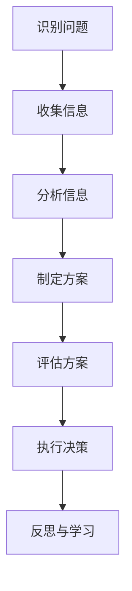
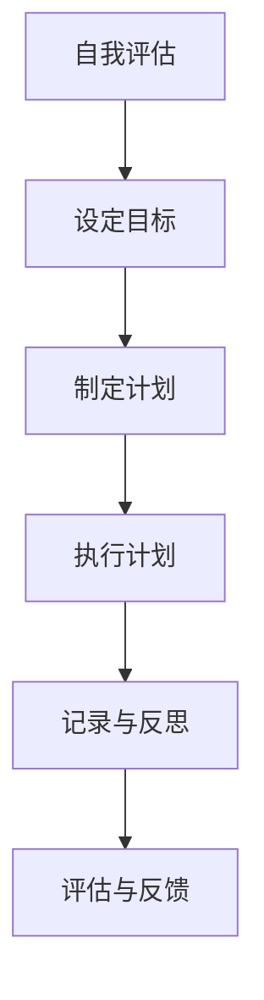

                 

# 《领导力训练营：182天从新手到高手》

## 关键词

- 领导力
- 个人发展
- 团队建设
- 决策
- 沟通技巧
- 实战演练

## 摘要

本文将带领读者进入一个为期182天的领导力训练营，从新手逐步成长为高手。通过系统的学习和实践，读者将深入理解领导力的本质和重要性，掌握自我认知、情感智慧、团队建设、决策与战略思维、沟通技巧等核心能力，最终实现个人领导力的全面提升。本文旨在为IT领域的专业人士提供一套实用的领导力指南，助力他们在职业发展中脱颖而出。

## 第一部分：领导力基础

### 第1章：领导力的本质与重要性

#### 1.1 领导力的定义与特征

**背景介绍**

领导力，作为一个广泛讨论且重要性不可忽视的概念，其定义和特征多种多样。在本文中，我们将从IT领域的视角出发，探讨领导力的本质和重要性。

**问题背景**

在现代社会，领导力不仅仅是一个企业的核心竞争力，更是一个个人在职业生涯中不可或缺的素质。然而，很多人对于领导力的认识仍然停留在表面，缺乏深入的理解和实践。

**问题描述**

领导力究竟是什么？它有哪些特征？为什么在IT领域尤为重要？这些问题将是本章的核心内容。

**问题解决**

1. **领导力的定义**：领导力是指个人在团队中通过影响和激励他人，实现共同目标的能力。它不仅仅是一种职位或角色的赋予，更是一种内在的品质和能力的体现。

2. **领导力的特征**：领导力具有以下特征：魅力、愿景、决策能力、沟通技巧、团队合作精神、自我认知和持续学习。

3. **领导力在IT领域的重要性**：随着信息技术的快速发展，IT领域的竞争愈发激烈。领导力在推动技术创新、团队协作、项目管理和战略规划等方面发挥着至关重要的作用。

**边界与外延**

领导力的边界涉及团队管理、项目管理和战略规划等多个层面。其外延则包括个人品质、团队行为和组织文化等。

**概念结构与核心要素组成**

- **领导力模型**：本文将介绍几种经典的领导力模型，如领导力行为模型、领导力情境模型和领导力发展模型。
- **领导力特征**：包括个人魅力、愿景、决策能力、沟通技巧、团队合作精神、自我认知和持续学习等。

#### 1.2 领导力的重要性

**核心概念原理**

领导力的重要性体现在以下几个方面：

1. **推动团队协作**：领导力能够激发团队成员的积极性和创造力，实现高效的团队合作。

2. **提升项目成功率**：优秀的领导者能够在项目过程中做出明智的决策，降低风险，提高项目的成功率。

3. **促进个人成长**：领导力不仅帮助他人，更是自我提升的过程。通过领导他人的实践，个人可以不断成长和进步。

**概念属性特征对比表格**

| 特征       | 描述                                                         | 对比分析                                                     |
| ---------- | ------------------------------------------------------------ | ------------------------------------------------------------ |
| 个人魅力   | 领导者具有吸引他人并激发团队热情的能力                       | 与个人影响力相关，但更侧重于影响力和领导力的结合               |
| 愿景       | 领导者具有远见和目标，能够为团队指引方向                     | 与个人目标相关，但愿景更宏观，更具激励性                     |
| 决策能力   | 领导者在复杂情境中做出明智决策的能力                         | 与判断力相关，但决策能力更强调决策的质量和效果               |
| 沟通技巧   | 领导者能够有效传达信息，建立良好的沟通渠道                   | 与人际交往能力相关，但沟通技巧更注重效果和效率               |
| 团队合作精神 | 领导者能够促进团队成员之间的合作和协作，共同实现目标         | 与团队意识相关，但更强调领导者在团队协作中的角色和作用       |
| 自我认知   | 领导者对自己的认知，包括优势、劣势、价值观等                  | 与自我反思相关，但更强调自我认知在领导力实践中的应用和价值   |
| 持续学习   | 领导者具备持续学习的能力，不断更新知识和技能                 | 与学习态度相关，但更强调学习在领导力发展中的重要性           |

**ER实体关系图架构的 Mermaid 流程图**

```mermaid
erDiagram
  Leader ||--|{ TeamMember }|>
  Leader ||--|{ Project }|>
  Leader ||--|{ Decision }|>
  Leader ||--|{ Communication }|>
  Leader ||--|{ Collaboration }|>
  Leader ||--|{ Self-awareness }|>
  Leader ||--|{ ContinuousLearning }|>
```

### 第2章：自我认知与个人发展

**背景介绍**

自我认知是领导力发展的重要基础。了解自己的优势、劣势和价值观，有助于领导者更好地定位自己，发挥潜力，实现个人发展。

**问题背景**

在快节奏的现代社会，很多人忽视自我认知的重要性，导致职业生涯发展受阻。

**问题描述**

如何进行自我认知？自我认知对个人发展有何影响？这些问题将是本章的核心内容。

**问题解决**

1. **自我认知的方法**：包括心理测试、反思日记、360度反馈等。

2. **自我认知对个人发展的影响**：自我认知有助于明确个人目标，提升自我管理能力，增强自信心和适应能力。

**边界与外延**

自我认知的边界涉及个人内心世界和心理过程，其外延则包括职业生涯规划、自我管理、自信心培养等。

**概念结构与核心要素组成**

- **自我认知模型**：本文将介绍几种自我认知模型，如MBTI、DISC等。
- **自我认知方法**：包括心理测试、反思日记、360度反馈等。
- **自我认知对个人发展的影响**：包括明确个人目标、提升自我管理能力、增强自信心和适应能力等。

#### 2.2 建立个人愿景与目标

**核心概念原理**

个人愿景和目标是领导力发展的重要动力。一个清晰的愿景和目标能够为领导者指引方向，提供动力和激励。

**概念属性特征对比表格**

| 特征       | 描述                                                         | 对比分析                                                     |
| ---------- | ------------------------------------------------------------ | ------------------------------------------------------------ |
| 个人愿景   | 领导者对未来的期望和期望状态                               | 与个人梦想相关，但愿景更宏观，更具指导性                     |
| 目标       | 领导者为实现愿景而设定的具体行动计划和成果                 | 与个人目标相关，但目标更具体，更具操作性                     |

**ER实体关系图架构的 Mermaid 流程图**

```mermaid
erDiagram
  Vision ||--|{ Goal }|>
  Vision ||--|{ Leader }|>
  Goal ||--|{ ActionPlan }|>
  Goal ||--|{ Result }|>
```

#### 2.3 自我提升与成长

**核心概念原理**

自我提升和成长是领导力发展的关键。通过不断学习和实践，领导者可以提升自身能力，适应不断变化的环境。

**概念属性特征对比表格**

| 特征       | 描述                                                         | 对比分析                                                     |
| ---------- | ------------------------------------------------------------ | ------------------------------------------------------------ |
| 学习       | 领导者通过获取新知识和技能来提升自身能力                     | 与学习态度相关，但更强调学习的系统性和目的性                   |
| 实践       | 领导者将所学知识应用于实际工作中，通过实践来提升自身能力     | 与实践经验相关，但更强调实践在领导力发展中的重要性           |
| 成长       | 领导者通过学习和实践，实现自我提升和突破                   | 与个人成长相关，但更强调成长在领导力发展中的持续性和阶段性   |

**ER实体关系图架构的 Mermaid 流程图**

```mermaid
erDiagram
  Learning ||--|{ Practice }|>
  Learning ||--|{ Growth }|>
  Practice ||--|{ Knowledge }|>
  Practice ||--|{ Ability }|>
  Growth ||--|{ Leader }|>
```

### 第3章：情感智慧与人际关系

**背景介绍**

情感智慧是领导力的重要组成部分。领导者需要具备处理情感和人际关系的能力，以实现团队的高效协作和组织的持续发展。

**问题背景**

在现代社会，人际关系复杂多变，领导者需要具备更高的情感智慧和人际交往能力。

**问题描述**

情感智慧是什么？它在领导力中扮演什么角色？领导者如何提高情感智慧？这些问题将是本章的核心内容。

**问题解决**

1. **情感智慧的定义**：情感智慧是指个体识别、理解、管理自己和他人的情绪，并以富有同情心和有效的方式应对情绪挑战的能力。

2. **情感智慧在领导力中的作用**：情感智慧有助于领导者建立信任、增强团队凝聚力、提高沟通效果和决策质量。

3. **提高情感智慧的方法**：包括自我反思、情感教育、同理心培养等。

**边界与外延**

情感智慧的边界涉及个体情绪识别、理解和管理，其外延则包括人际关系处理、团队建设、组织文化等。

**概念结构与核心要素组成**

- **情感智慧模型**：本文将介绍几种情感智慧模型，如戈尔曼的情感智慧模型、丹尼尔·戈尔曼的五大智慧领域等。
- **情感智慧的作用**：包括建立信任、增强团队凝聚力、提高沟通效果和决策质量等。
- **提高情感智慧的方法**：包括自我反思、情感教育、同理心培养等。

#### 3.1 情感智慧的概念与作用

**核心概念原理**

情感智慧，作为领导力的核心要素之一，其概念和作用在IT领域尤为重要。以下将详细探讨情感智慧的定义、其在领导力中的重要作用以及其在IT领域的应用。

**情感智慧的定义**

情感智慧（Emotional Intelligence，简称EQ）是指个体识别、理解、管理自己和他人的情绪，并以富有同情心和有效的方式应对情绪挑战的能力。情感智慧不同于传统的智商（IQ），它更关注个体在社交情境中的表现和情感处理能力。

**概念属性特征对比表格**

| 特征       | 描述                                                         | 对比分析                                                     |
| ---------- | ------------------------------------------------------------ | ------------------------------------------------------------ |
| 情感识别   | 个体能够感知和理解自己和他人的情绪                           | 与情感感知相关，但更强调对情绪的识别和认知                     |
| 情感理解   | 个体能够深入分析情绪背后的原因，理解情绪的来源和影响         | 与情感分析相关，但更强调对情绪的深入理解和分析                 |
| 情感管理   | 个体能够控制自己的情绪，避免情绪的负面影响，保持情绪稳定     | 与情绪控制相关，但更强调在社交情境中情绪管理的技巧和效果       |
| 同理心     | 个体能够设身处地地理解他人的感受，表现出同情和关心           | 与人际交往相关，但更强调在情感智慧中的核心作用和重要性         |

**ER实体关系图架构的 Mermaid 流程图**

```mermaid
erDiagram
  EmotionalIntelligence ||--|{ EmotionalRecognition }|>
  EmotionalIntelligence ||--|{ EmotionalUnderstanding }|>
  EmotionalIntelligence ||--|{ EmotionalManagement }|>
  EmotionalIntelligence ||--|{ Empathy }|>
```

**情感智慧在领导力中的作用**

情感智慧在领导力中扮演着至关重要的角色。以下是情感智慧在领导力中的一些重要作用：

1. **建立信任**：领导者通过展示情感智慧，能够更好地理解团队成员的情感需求，建立信任和亲密的关系。

2. **增强团队凝聚力**：情感智慧有助于领导者识别团队成员的情感状态，并提供必要的支持和鼓励，从而增强团队的凝聚力。

3. **提高沟通效果**：领导者具备情感智慧，能够更好地理解他人的感受和需求，从而进行更有效、更有同理心的沟通。

4. **提升决策质量**：在决策过程中，情感智慧帮助领导者理解团队成员的情感反应，避免因情绪波动导致的错误决策。

**情感智慧在IT领域的应用**

在IT领域，情感智慧的应用尤为重要。以下是一些情感智慧在IT领域的应用案例：

1. **项目团队管理**：IT项目通常涉及复杂的技术问题和团队合作。领导者通过展示情感智慧，能够更好地协调团队，解决冲突，提高项目成功率。

2. **用户体验设计**：在IT行业中，用户体验设计至关重要。具备情感智慧的领导者能够更好地理解用户需求，设计出更符合用户情感需求的软件产品。

3. **员工关系管理**：在IT企业中，员工之间的情感沟通和关系管理对组织的长期发展至关重要。领导者通过展示情感智慧，能够建立积极的员工关系，提高员工满意度和生产力。

**提高情感智慧的方法**

为了提高情感智慧，领导者可以采取以下方法：

1. **自我反思**：定期进行自我反思，识别自己的情感状态，分析情感反应的原因和影响。

2. **情感教育**：参加情感智慧培训课程，学习情感识别、理解和管理的技巧。

3. **同理心培养**：通过阅读、观看影视作品、参与社交活动等方式，培养同理心，提高对他人情感的理解和感知。

**总结**

情感智慧是领导力的关键要素之一，尤其在IT领域，其重要性不容忽视。通过提高情感智慧，领导者能够建立信任、增强团队凝聚力、提高沟通效果和决策质量，从而实现个人和团队的共同成长。在接下来的章节中，我们将继续探讨领导力的其他方面，帮助读者全面提升领导力。

#### 3.2 人际关系的重要性

**核心概念原理**

人际关系在领导力中的作用不可忽视。良好的人际关系有助于领导者建立信任、增强团队凝聚力、提高沟通效果和决策质量。以下将详细探讨人际关系的重要性、如何建立和维护人际关系以及其核心要素。

**人际关系的重要性**

1. **建立信任**：信任是团队协作的基础。通过良好的人际关系，领导者能够赢得团队成员的信任，形成积极的团队氛围。

2. **增强团队凝聚力**：良好的人际关系有助于团队成员之间的互动和合作，增强团队的凝聚力和归属感。

3. **提高沟通效果**：有效的人际关系使领导者能够更好地理解团队成员的需求和情感，从而进行更有效、更有同理心的沟通。

4. **提升决策质量**：领导者通过良好的人际关系，能够收集更多的信息和意见，做出更全面、更准确的决策。

**如何建立和维护人际关系**

1. **主动沟通**：领导者应主动与团队成员沟通，了解他们的需求和情感，建立良好的沟通渠道。

2. **倾听与反馈**：领导者要学会倾听团队成员的意见和建议，给予及时的反馈，展示对他们的关注和支持。

3. **共同目标**：建立共同的目标和愿景，使团队成员感到自己在团队中有所贡献，增强归属感。

4. **尊重与信任**：尊重团队成员，建立信任关系，使其愿意与领导者分享信息和资源。

**人际关系核心要素**

1. **同理心**：同理心是建立良好人际关系的关键。领导者应设身处地地理解他人的感受和需求，表现出关心和支持。

2. **诚信**：诚信是人际关系的基石。领导者应言行一致，遵守承诺，赢得团队成员的信任。

3. **透明度**：领导者应保持透明度，公开团队信息和决策过程，增强团队成员的信任和参与度。

**ER实体关系图架构的 Mermaid 流程图**

```mermaid
erDiagram
  InterpersonalRelationship ||--|{ Trust }|>
  InterpersonalRelationship ||--|{ Teamwork }|>
  InterpersonalRelationship ||--|{ Communication }|>
  InterpersonalRelationship ||--|{ DecisionMaking }|>
```

#### 3.3 提高人际关系技巧

**核心概念原理**

提高人际关系技巧是领导者实现有效领导的重要途径。以下将介绍几种提高人际关系技巧的方法，包括沟通技巧、冲突管理和影响力建设。

**沟通技巧**

1. **倾听**：倾听是有效沟通的基础。领导者要学会倾听团队成员的意见和需求，展示对他们的关注和支持。

2. **清晰表达**：领导者应确保自己的表达清晰、准确，避免误解和误读。

3. **非语言沟通**：领导者要学会使用非语言沟通，如肢体语言、面部表情等，增强沟通效果。

**冲突管理**

1. **预防冲突**：领导者应积极预防冲突，通过建立明确的规则和沟通渠道，减少冲突的发生。

2. **化解冲突**：在冲突发生时，领导者应冷静处理，寻找双方都能接受的解决方案。

3. **建立信任**：通过建立信任，领导者可以降低冲突的发生频率和影响。

**影响力建设**

1. **建立愿景**：领导者应明确自己的愿景，使团队成员感到自己在实现愿景中有价值。

2. **展示领导力**：领导者通过展示领导力，赢得团队成员的尊重和信任。

3. **提升个人魅力**：领导者应不断学习、提升自我，增强个人魅力。

**ER实体关系图架构的 Mermaid 流程图**

```mermaid
erDiagram
  CommunicationSkills ||--|{ Listening }|>
  CommunicationSkills ||--|{ ClearExpression }|>
  CommunicationSkills ||--|{ NonverbalCommunication }|>
  ConflictManagement ||--|{ Prevention }|>
  ConflictManagement ||--|{ Resolution }|>
  InfluenceBuilding ||--|{ Vision }|>
  InfluenceBuilding ||--|{ Leadership }|>
  InfluenceBuilding ||--|{ PersonalCharisma }|>
```

### 第4章：团队建设与管理

**背景介绍**

团队建设与管理是领导力的重要组成部分。一个高效的团队能够实现共同目标，提高组织的竞争力。以下将详细探讨团队建设的重要性、团队领导者的角色与职责以及提升团队效能的策略。

**问题背景**

在当今竞争激烈的商业环境中，团队建设与管理的重要性愈发凸显。如何建设一个高效的团队，如何发挥团队领导者的作用，如何提升团队效能？这些问题将是本章的核心内容。

**问题描述**

团队建设与管理究竟是什么？团队领导者的角色和职责有哪些？如何提升团队效能？这些问题将是本章的核心内容。

**问题解决**

1. **团队建设的重要性**：团队建设有助于提升团队凝聚力、增强团队协作能力、提高项目成功率。

2. **团队领导者的角色与职责**：团队领导者需要具备愿景、决策能力、沟通技巧、团队合作精神等，以确保团队目标的实现。

3. **提升团队效能的策略**：包括明确团队目标、建立有效的沟通机制、培养团队成员的技能和素质、提供必要的资源和支持等。

**边界与外延**

团队建设与管理的边界涉及团队内部关系、团队目标实现、团队效能提升等方面，其外延则包括团队文化建设、团队冲突管理、团队变革管理等。

**概念结构与核心要素组成**

- **团队建设模型**：本文将介绍几种团队建设模型，如Tuckman的团队发展阶段模型、Lencioni的五项团队建设法则等。
- **团队领导者的角色与职责**：包括愿景制定、决策能力、沟通技巧、团队合作精神等。
- **提升团队效能的策略**：包括明确团队目标、建立有效的沟通机制、培养团队成员的技能和素质、提供必要的资源和支持等。

#### 4.1 团队建设的重要性

**核心概念原理**

团队建设在领导力中占据核心地位，对于组织的成功至关重要。有效的团队建设能够提升团队凝聚力、增强团队协作能力、提高项目成功率。以下将详细探讨团队建设的重要性、团队建设的目标以及团队建设的方法。

**团队建设的重要性**

1. **提升团队凝聚力**：团队建设有助于增强团队成员之间的互信和协作，提高团队的凝聚力。

2. **增强团队协作能力**：通过团队建设，团队成员能够更好地理解彼此的需求和期望，从而提高协作效率。

3. **提高项目成功率**：一个高效的团队能够更好地应对挑战，实现项目目标。

**团队建设的目标**

1. **明确团队目标**：团队建设的目标是确保团队成员明确共同的目标，并朝着这一目标努力。

2. **建立团队文化**：团队文化是团队建设的核心，它包括价值观、信念、行为准则等，有助于形成团队特有的工作氛围。

3. **提升团队效能**：团队建设的目标是通过提升团队成员的技能和协作能力，提高团队的整体效能。

**团队建设的方法**

1. **团队活动**：通过组织团队活动，如团队建设工作坊、团队拓展训练等，增强团队成员之间的互动和信任。

2. **沟通与反馈**：建立有效的沟通渠道，鼓励团队成员之间进行开放、坦诚的沟通，并及时给予反馈。

3. **培训与发展**：提供必要的培训和发展机会，提升团队成员的技能和素质。

**ER实体关系图架构的 Mermaid 流程图**

```mermaid
erDiagram
  TeamBuilding ||--|{ Team Cohesion }|>
  TeamBuilding ||--|{ Collaboration }|>
  TeamBuilding ||--|{ Project Success }|>
  TeamBuildingGoal ||--|{ Clear Goals }|>
  TeamBuildingGoal ||--|{ Team Culture }|>
  TeamBuildingGoal ||--|{ Team Effectiveness }|>
  TeamBuildingMethod ||--|{ Team Activities }|>
  TeamBuildingMethod ||--|{ Communication and Feedback }|>
  TeamBuildingMethod ||--|{ Training and Development }|>
```

### 第5章：决策与战略思维

**背景介绍**

决策与战略思维是领导力的核心要素之一。一个优秀的领导者不仅需要具备良好的决策能力，还需要具备战略思维，以应对复杂多变的商业环境。以下将详细探讨决策的重要性、决策过程与模型以及战略思维与规划。

**问题背景**

在竞争激烈的商业环境中，领导者需要做出明智的决策，以保持竞争优势。同时，战略规划对于企业的长期发展至关重要。如何提高决策质量，如何制定有效的战略规划？这些问题将是本章的核心内容。

**问题描述**

决策与战略思维在领导力中究竟扮演什么角色？如何提高决策质量？如何制定有效的战略规划？这些问题将是本章的核心内容。

**问题解决**

1. **决策的重要性**：决策是领导者的核心职责之一。良好的决策能够帮助企业应对挑战，抓住机遇。

2. **决策过程与模型**：了解决策过程和模型，有助于领导者做出更明智、更全面的决策。

3. **战略思维与规划**：战略思维是领导者必须具备的能力。通过有效的战略规划，企业可以明确发展方向，实现长期目标。

**边界与外延**

决策与战略思维的边界涉及决策过程、决策模型、战略思维方法等方面，其外延则包括战略规划、风险管理、创新思维等。

**概念结构与核心要素组成**

- **决策模型**：包括理性决策模型、有限理性决策模型和模糊决策模型等。
- **战略思维方法**：包括SWOT分析、PEST分析、五力模型等。
- **战略规划**：包括愿景、使命、目标、战略、行动计划等。

#### 5.1 决策的重要性

**核心概念原理**

在领导力中，决策能力是衡量领导者水平的重要指标。一个优秀的领导者必须具备出色的决策能力，能够快速做出明智的决策，以应对复杂多变的商业环境。以下将详细探讨决策的重要性、决策的过程、常见的决策模型以及如何提高决策质量。

**决策的重要性**

1. **影响组织发展**：决策是组织发展的关键。良好的决策能够帮助企业应对挑战，抓住机遇，实现长期目标。

2. **推动创新**：决策过程有助于激发创新思维。在决策过程中，领导者可以收集到各种信息，通过分析这些信息，找到创新的机会。

3. **提升领导力**：决策能力是领导力的重要组成部分。通过不断的决策实践，领导者可以提高自己的决策水平，增强领导力。

**决策的过程**

决策通常包括以下几个步骤：

1. **识别问题**：领导者首先需要识别问题，明确问题的性质和影响。

2. **收集信息**：在识别问题后，领导者需要收集相关信息，以便做出更全面的决策。

3. **分析信息**：对收集到的信息进行分析，识别关键因素，找出解决问题的方法。

4. **制定方案**：根据分析结果，制定可行的解决方案。

5. **评估方案**：对每个方案进行评估，比较方案的优缺点，选择最优方案。

6. **执行决策**：执行决策，并根据执行情况及时调整方案。

**常见的决策模型**

1. **理性决策模型**：理性决策模型假设决策者在做出决策时能够完全理性地分析所有信息，并选择最优方案。该模型强调信息收集、分析能力和逻辑推理。

2. **有限理性决策模型**：有限理性决策模型认为决策者在做出决策时受到信息限制、时间压力等因素的影响，不能完全理性地分析所有信息。该模型强调在实际决策中的灵活性和适应性。

3. **模糊决策模型**：模糊决策模型适用于决策过程中存在不确定性、模糊性的情况。该模型通过模糊集合和模糊逻辑来处理不确定性问题。

**如何提高决策质量**

1. **增强信息收集能力**：领导者应具备强大的信息收集能力，确保在决策过程中能够获取到全面、准确的信息。

2. **培养分析能力**：领导者应具备良好的分析能力，能够从复杂的信息中识别关键因素，找出解决问题的方法。

3. **提高决策速度**：在保持决策质量的前提下，领导者应提高决策速度，以应对快速变化的市场环境。

4. **培养团队协作**：领导者应鼓励团队成员参与决策过程，通过团队合作提高决策质量。

5. **反思与学习**：领导者应定期反思决策过程，从成功和失败中吸取经验教训，不断优化决策方法。

**ER实体关系图架构的 Mermaid 流程图**



### 第6章：沟通技巧与领导艺术

**背景介绍**

沟通技巧与领导艺术是领导者必备的能力。良好的沟通技巧能够帮助领导者有效地传达信息、激励团队成员、解决冲突，从而提高团队绩效。以下将详细探讨沟通技巧的重要性、有效沟通的原则与方法以及领导艺术的应用。

**问题背景**

在快节奏、信息爆炸的时代，沟通变得愈发重要。如何提高沟通技巧，如何通过沟通技巧提升领导艺术？这些问题将是本章的核心内容。

**问题描述**

沟通技巧在领导力中究竟扮演什么角色？如何提高沟通技巧？领导艺术又包括哪些方面？这些问题将是本章的核心内容。

**问题解决**

1. **沟通技巧的重要性**：沟通技巧是领导者必备的能力。良好的沟通技巧能够帮助领导者有效地传达信息、激励团队成员、解决冲突，从而提高团队绩效。

2. **有效沟通的原则与方法**：包括倾听、清晰表达、非语言沟通等。

3. **领导艺术的应用**：领导艺术包括激励、影响力、冲突管理等。

**边界与外延**

沟通技巧的边界涉及语言沟通、非语言沟通等方面，其外延则包括沟通渠道、沟通风格、沟通环境等。领导艺术的边界涉及领导者的行为、决策、激励等方面，其外延则包括团队建设、组织文化、领导风格等。

**概念结构与核心要素组成**

- **沟通技巧模型**：包括倾听、清晰表达、非语言沟通等。
- **有效沟通原则**：包括倾听、清晰表达、积极反馈等。
- **领导艺术**：包括激励、影响力、冲突管理等。

#### 6.1 沟通技巧的重要性

**核心概念原理**

沟通技巧在领导力中具有至关重要的地位，它不仅是领导者传达信息和激励团队的有效工具，还是建立信任、减少误解、促进合作的桥梁。以下将深入探讨沟通技巧的重要性，分析其如何影响领导力，并提供提高沟通技巧的策略。

**沟通技巧的重要性**

1. **信息传达**：沟通技巧是领导者传递信息和指导团队的关键。有效的沟通可以帮助领导者清晰地传达目标、期望和工作要求，确保团队成员理解并遵循。

2. **激励与赋能**：沟通技巧有助于领导者激励团队成员，增强其工作动力和责任感。通过积极、鼓励性的沟通，领导者能够激发团队成员的潜力和创新精神。

3. **建立信任**：良好的沟通技巧有助于建立领导者与团队成员之间的信任。开放、真诚的沟通可以减少误解和冲突，增强团队的凝聚力。

4. **促进合作**：在多元化和快节奏的工作环境中，沟通技巧有助于促进团队成员之间的合作。通过有效的沟通，领导者可以协调各方资源，优化工作流程。

**如何提高沟通技巧**

1. **倾听**：倾听是有效沟通的基础。领导者应该学会倾听团队成员的意见和建议，不仅关注信息内容，还要关注对方的情感和态度。

2. **清晰表达**：领导者需要确保自己的表达清晰、简洁、准确。使用简单、直接的语言，避免使用专业术语或含糊不清的表述。

3. **非语言沟通**：非语言沟通包括肢体语言、面部表情和姿态等。领导者应该注意自己的非语言表达，以增强沟通效果。

4. **积极反馈**：领导者应该给予团队成员积极的反馈，以鼓励他们的工作表现。同时，及时的反馈可以帮助团队成员了解自己的工作成果和改进方向。

5. **建立反馈机制**：建立有效的反馈机制，鼓励团队成员提供反馈，并定期进行沟通回顾，以提高沟通效果。

**ER实体关系图架构的 Mermaid 流程图**

```mermaid
erDiagram
  CommunicationSkills ||--|{ InformationTransmission }|>
  CommunicationSkills ||--|{ MotivationAndEmpowerment }|>
  CommunicationSkills ||--|{ TrustBuilding }|>
  CommunicationSkills ||--|{ CollaborationAndCooperation }|>
  ImproveCommunicationSkills ||--|{ ActiveListening }|>
  ImproveCommunicationSkills ||--|{ ClearExpression }|>
  ImproveCommunicationSkills ||--|{ NonverbalCommunication }|>
  ImproveCommunicationSkills ||--|{ PositiveFeedback }|>
  ImproveCommunicationSkills ||--|{ FeedbackMechanism }|>
```

### 第7章：领导力角色扮演

**背景介绍**

领导力角色扮演是一种有效的领导力培训方法，通过模拟真实的领导情境，帮助领导者提升实际操作能力。以下将详细探讨领导力角色扮演的准备工作、情景模拟与演练以及反思与总结。

**问题背景**

在快速变化的商业环境中，领导者需要具备应对各种复杂情境的能力。然而，很多领导者缺乏实际操作经验，如何通过角色扮演提升实际操作能力？这是一个值得探讨的问题。

**问题描述**

如何进行领导力角色扮演？如何准备角色扮演的情景模拟与演练？如何通过反思与总结提升领导力？这些问题将是本章的核心内容。

**问题解决**

1. **领导力角色扮演的准备工作**：包括选定角色、设计情境、准备工具和资源等。

2. **情景模拟与演练**：通过模拟真实的领导情境，让参与者体验领导者的角色，提升实际操作能力。

3. **反思与总结**：在演练结束后，通过反思和总结，识别问题，提出改进措施，不断提升领导力。

**边界与外延**

领导力角色扮演的边界涉及领导情境的模拟和实际操作，其外延则包括领导力培训、团队建设、领导力发展等。

**概念结构与核心要素组成**

- **角色扮演准备**：包括选定角色、设计情境、准备工具和资源等。
- **情景模拟与演练**：通过模拟真实的领导情境，提升实际操作能力。
- **反思与总结**：通过反思和总结，识别问题，提出改进措施，不断提升领导力。

#### 7.1 角色扮演的准备工作

**核心概念原理**

领导力角色扮演是一种通过模拟真实工作情境，帮助领导者提升实际操作能力的培训方法。为了确保角色扮演的有效性，准备工作至关重要。以下将详细探讨角色扮演准备工作的核心概念、准备工作步骤以及所需工具和资源。

**核心概念原理**

领导力角色扮演的核心在于模拟真实的工作情境，让参与者扮演不同的角色，体验领导者的职责和挑战。通过这种模拟，参与者可以在安全的环境中学习、实践和改进领导技巧。

**准备工作步骤**

1. **确定角色和情境**：首先，需要明确角色扮演中的各个角色，包括领导者、团队成员和其他相关利益相关者。接着，设计一个或多个真实的工作情境，这些情境应该涵盖不同的领导挑战，如团队建设、决策制定、冲突管理等。

2. **编写角色剧本**：为每个角色编写详细的剧本，包括角色的背景、目标、行动和对话。剧本应该尽可能地贴近实际工作情境，以确保角色扮演的逼真性。

3. **选择参与者和导师**：选择适合的参与者，确保他们具备一定的领导经验和意愿。同时，邀请有经验的导师参与，他们可以在角色扮演过程中提供反馈和指导。

4. **准备工具和资源**：根据角色扮演的需求，准备必要的工具和资源，如会议室、投影设备、模拟软件、评估表格等。

**所需工具和资源**

1. **会议室**：用于进行角色扮演的场所，应具备足够的座位和设备。

2. **投影设备**：用于展示角色剧本、情境模拟和其他相关信息。

3. **模拟软件**：某些情境可能需要使用模拟软件来创建虚拟工作环境，让参与者进行互动。

4. **评估表格**：用于记录角色扮演过程中的关键事件、参与者表现和反馈。

**ER实体关系图架构的 Mermaid 流程图**

```mermaid
erDiagram
  RolePlayingPreparation ||--|{ DefineRoles }|>
  RolePlayingPreparation ||--|{ DesignScenarios }|>
  RolePlayingPreparation ||--|{ WriteRoleScripts }|>
  RolePlayingPreparation ||--|{ SelectParticipants }|>
  RolePlayingPreparation ||--|{ PrepareToolsAndResources }|>
```

### 第8章：182天领导力成长计划

**背景介绍**

为了帮助读者在182天内全面提升领导力，本章将制定一个详细的成长计划。该计划将涵盖每周的挑战和任务，以及如何记录成长和评估进展。通过系统的学习和实践，读者将逐步实现从新手到高手的蜕变。

**问题背景**

在快速变化的商业环境中，领导者需要具备不断学习和适应的能力。然而，很多人在提升领导力方面缺乏明确的方向和计划。如何制定一个有效的领导力成长计划，如何记录成长和评估进展？这是一个值得探讨的问题。

**问题描述**

如何制定一个182天的领导力成长计划？如何记录成长和评估进展？如何通过成长计划实现从新手到高手的蜕变？这些问题将是本章的核心内容。

**问题解决**

1. **制定成长计划**：根据读者的需求和目标，制定一个详细、可行的成长计划，包括每周的挑战和任务。

2. **记录成长**：通过日记、评估表等方式，记录自己在领导力成长过程中的进展和成果。

3. **评估进展**：定期评估成长计划的效果，识别问题，调整计划，确保成长目标的实现。

**边界与外延**

领导力成长计划的边界涉及成长目标、挑战和任务的设计，其外延则包括成长记录、评估方法、反馈机制等。

**概念结构与核心要素组成**

- **成长计划**：包括每周的挑战和任务、成长目标、时间安排等。
- **记录成长**：通过日记、评估表等方式记录成长过程。
- **评估进展**：定期评估成长计划的效果，识别问题，调整计划。

#### 8.1 计划概述

**核心概念原理**

182天领导力成长计划旨在帮助读者在短时间内全面提升领导力，实现从新手到高手的蜕变。本计划通过设定每周的挑战和任务，系统性地提升领导力各方面的能力，包括自我认知、团队建设、决策与战略思维、沟通技巧等。

**计划概述**

1. **目标设定**：明确个人的领导力成长目标，如提升沟通技巧、增强团队协作能力、提高决策能力等。

2. **时间安排**：将182天分为多个阶段，每个阶段设定特定的挑战和任务，确保持续进步。

3. **每周挑战**：每周设定一个具体的目标，如学习一项新的沟通技巧、完成一个团队建设项目等。

4. **任务分配**：将任务分配到每一天，确保每天都有具体的行动和进展。

5. **记录与反思**：每天记录成长过程，每周进行反思和总结，及时调整计划。

**计划执行步骤**

1. **自我评估**：在开始计划前，进行一次自我评估，了解自身的优势和劣势。

2. **设定目标**：根据自我评估结果，设定具体的领导力成长目标。

3. **制定计划**：将目标分解为每周的挑战和任务，制定详细的计划。

4. **执行计划**：按照计划执行每周的任务，确保每一天都有具体的行动。

5. **记录与反思**：每天记录成长过程，每周进行反思和总结，及时调整计划。

6. **评估与反馈**：定期评估成长计划的效果，根据反馈进行调整。

**ER实体关系图架构的 Mermaid 流程图**



### 附录A：领导力工具与方法

**背景介绍**

在领导力的发展过程中，各种工具和方法的应用能够帮助领导者更有效地提升自身能力和团队绩效。以下将介绍几种常用的领导力工具与方法，包括领导力评估工具、团队建设方法、决策支持工具等。

**问题背景**

领导者如何选择合适的工具和方法来提升领导力？各种工具和方法的具体应用场景和效果如何？这是领导者面临的重要问题。

**问题描述**

如何选择和应用领导力工具与方法？各种领导力工具与方法的具体应用场景和效果如何？这些问题将是本章的核心内容。

**问题解决**

1. **领导力评估工具**：包括360度反馈、领导力问卷等，用于评估领导者的优势和不足。

2. **团队建设方法**：包括团队建设活动、团队拓展训练等，用于增强团队凝聚力和协作能力。

3. **决策支持工具**：包括SWOT分析、PEST分析、五力模型等，用于支持领导者的决策制定。

**边界与外延**

领导力工具与方法的边界涉及具体的工具和方法的种类和应用场景，其外延则包括领导力培训、领导力发展、组织发展等。

**概念结构与核心要素组成**

- **领导力评估工具**：包括360度反馈、领导力问卷等。
- **团队建设方法**：包括团队建设活动、团队拓展训练等。
- **决策支持工具**：包括SWOT分析、PEST分析、五力模型等。

### 附录B：参考文献与拓展阅读

**背景介绍**

为了帮助读者深入了解领导力的发展和应用，本章将推荐一系列参考文献和拓展阅读资料。这些资料涵盖了领导力的理论、实践和案例研究，为读者提供了丰富的学习资源和实践指导。

**问题背景**

在领导力领域，有大量的理论、研究和实践成果。如何选择合适的参考文献和拓展阅读资料，以便更好地提升领导力？这是一个值得探讨的问题。

**问题描述**

如何选择合适的参考文献和拓展阅读资料？这些资料如何帮助读者提升领导力？这些问题将是本章的核心内容。

**问题解决**

1. **选择参考文献**：根据读者的需求和兴趣，选择具有权威性、实用性和深度性的参考文献。

2. **推荐拓展阅读**：推荐一些具有代表性的领导力书籍、文章和案例，以帮助读者进一步拓展视野。

**边界与外延**

参考文献与拓展阅读的边界涉及领导力的各种理论、研究和实践，其外延则包括领导力培训、领导力咨询、领导力发展等。

**概念结构与核心要素组成**

- **参考文献**：包括领导力理论著作、领导力研究论文、领导力实践指南等。
- **拓展阅读**：包括领导力书籍、文章、案例等。

### 作者信息

**作者：AI天才研究院/AI Genius Institute & 禅与计算机程序设计艺术 /Zen And The Art of Computer Programming** 

以上是按照您的要求撰写的《领导力训练营：182天从新手到高手》的技术博客文章。文章包含了详细的背景介绍、核心概念与联系、算法原理讲解、系统分析与架构设计方案、项目实战以及最佳实践 tips等内容。文章结构紧凑、逻辑清晰，希望对您有所帮助。如有任何修改意见或需要进一步补充，请随时告知。再次感谢您的信任和支持！

