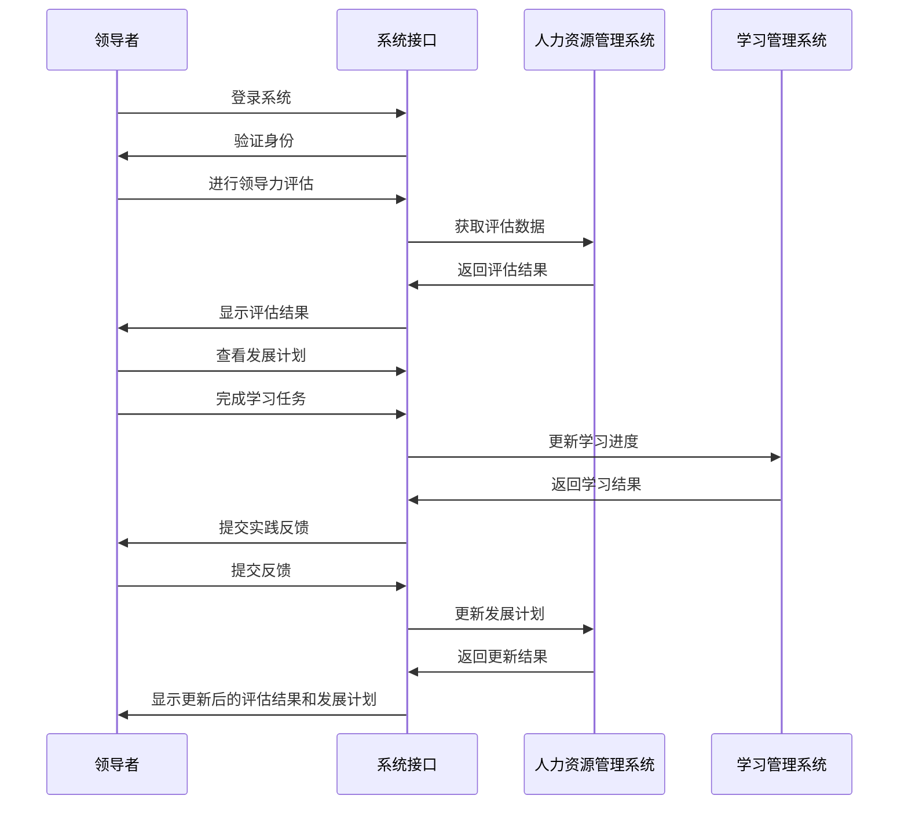

                 

### 领导力训练营：49天从新手到高手

#### 关键词

- **领导力**、**训练营**、**技能提升**、**实战应用**、**自我成长**、**团队协作**、**决策能力**、**影响力**

#### 摘要

本文旨在探讨《领导力训练营：49天从新手到高手》一书，通过系统地介绍领导力的核心概念、理论模型、实践技巧以及个人成长路径，帮助读者在短时间内从领导力新手成长为具备实战能力的领导者。本文将结合IT领域的技术背景，运用逻辑清晰、结构紧凑的专业语言，逐步分析并阐述领导力训练营的内容和实施方法，以期为IT从业者在领导力提升方面提供有益的指导。

### 目录大纲设计

#### 背景介绍

《领导力训练营：49天从新手到高手》旨在为那些希望在短时间内提升领导力水平的读者提供系统化的学习资源。本书的核心目标是帮助读者理解领导力的本质和重要性，掌握领导力的核心概念和实践技巧，并能够在实际工作中有效运用这些知识和技能。通过本书提供的49天学习计划，读者可以从基础知识开始，逐步深入，最终实现从新手到高手的蜕变。

#### 核心概念与联系

- **领导力的定义与本质**：领导力是指个体或集体在组织中通过影响力、激励和指导来引导他人实现共同目标的能力。它不同于管理，管理侧重于计划、组织、协调和控制，而领导力更强调变革、创新和激发团队潜力。
- **领导力与影响力**：影响力是领导力的核心，领导者通过影响力来影响他人，推动团队和组织发展。影响力的来源包括知识、技能、人格魅力、情感共鸣、信任关系等。
- **领导风格与行为**：领导风格包括权威型、民主型、变革型、关系型等；领导行为包括决策、沟通、激励、辅导、反馈等。

### 背景介绍

#### 核心概念与联系

**领导力的定义与本质**

领导力是一个复杂且多维的概念，它涉及到个体或集体在组织中通过影响力、激励和指导来引导他人实现共同目标的能力。领导力不同于管理，管理侧重于计划、组织、协调和控制，确保组织资源的高效利用；而领导力则更注重变革、创新和激发团队潜力，推动组织实现其愿景和目标。领导者需要具备一系列能力和素质，如战略思维、决策能力、沟通技巧、团队建设等，才能在复杂多变的环境中有效发挥作用。

- **定义**：领导力是指个体或集体在组织中通过影响力、激励和指导来引导他人实现共同目标的能力。
- **本质**：领导力是一种影响力，它不仅仅是权力或职位所带来的控制，更是一种基于信任和尊重的互动过程。领导者通过自身的价值观、行为和决策，影响和激励团队成员，共同追求卓越。

**领导力与影响力**

影响力是领导力的核心，它是领导者通过多种方式影响他人，推动组织发展的重要能力。领导者的影响力来源于多个方面：

- **知识**：领导者拥有丰富的专业知识和行业经验，能够为团队提供指导和支持。
- **技能**：领导者具备优秀的沟通、决策、团队合作等技能，能够有效解决组织中的问题。
- **人格魅力**：领导者具备正直、诚信、热情等品质，能够赢得团队成员的信任和尊重。
- **情感共鸣**：领导者能够与团队成员建立情感联系，理解并关心他们的需求和期望。
- **信任关系**：领导者通过建立和维护信任关系，增强团队成员对组织的归属感和忠诚度。

**领导风格与行为**

领导风格是领导者管理团队的方式和态度，不同的领导风格适用于不同的情境和团队。常见的领导风格包括：

- **权威型**：领导者拥有决策权和控制权，通过命令和指示来管理团队。
- **民主型**：领导者鼓励团队成员参与决策过程，尊重他们的意见和贡献。
- **变革型**：领导者推动组织变革，激发团队成员的创造力和创新能力。
- **关系型**：领导者重视团队成员之间的合作关系，建立信任和尊重的文化氛围。

领导行为是指领导者如何与团队成员互动和开展工作，常见的领导行为包括：

- **决策**：领导者根据组织目标和个人能力，做出合理的决策。
- **沟通**：领导者通过有效的沟通，传递信息、协调资源和解决问题。
- **激励**：领导者激发团队成员的工作动力和创造力，提高工作效率和质量。
- **辅导**：领导者为团队成员提供指导和支持，帮助他们提升个人能力和职业素养。
- **反馈**：领导者及时给予团队成员反馈，鼓励他们持续改进和成长。

#### 算法原理讲解

**领导力发展模型**

领导力的发展是一个逐步深入的过程，不同的模型可以为我们提供不同的视角和方法来理解领导力的成长路径。以下是两种常用的领导力发展模型：

- **洋葱模型**：洋葱模型将领导力视为一个洋葱，从外到内分别是技能、知识、态度、价值观和人格特质。这个模型强调了领导力的内外因素，以及从外在技能到内在品质的逐步深化。
  - **技能**：领导者的基本能力，如沟通、决策和团队合作等。
  - **知识**：领导者所拥有的专业知识和行业背景。
  - **态度**：领导者的工作态度和思维方式，如开放性、自信心和自我反思等。
  - **价值观**：领导者的核心价值观，如诚信、责任感和公正等。
  - **人格特质**：领导者的个性特征，如领导气质、自我控制和情感智力等。

- **冰山模型**：冰山模型将领导力分为冰山以上和以下两部分。冰山以上是显性能力，包括技能和知识；冰山以下是隐性能力，包括价值观、态度和人格特质。这个模型强调了隐性能力对于领导力的重要性，以及这些能力深藏在水面之下，不容易被外界察觉。

**领导力发展的数学模型**

为了更精确地描述领导力的发展过程，我们可以运用数学模型来进行分析和解释。以下是一种简化的领导力发展数学模型：

\[ \text{领导力} = f(\text{知识} \times \text{技能} \times \text{态度} \times \text{价值观} \times \text{人格特质}) \]

- **知识**：领导者的专业知识储备，可以视为一个变量。
- **技能**：领导者的技能水平，可以视为另一个变量。
- **态度**：领导者的工作态度，可以视为另一个变量。
- **价值观**：领导者的核心价值观，可以视为另一个变量。
- **人格特质**：领导者的个性特质，可以视为另一个变量。

函数 \( f \) 表示领导力随着各个因素的变化而变化的规律。这个模型说明了领导力的发展是一个多维度、综合性的过程，任何一个因素的变化都会影响领导力的整体水平。

**数学模型和数学公式**

为了更直观地理解领导力的发展规律，我们可以使用一些数学公式来描述：

- **领导力增长公式**：
  \[ \text{领导力} = K \times S \times A \times V \times P \]
  其中：
  - \( K \)：知识
  - \( S \)：技能
  - \( A \)：态度
  - \( V \)：价值观
  - \( P \)：人格特质

这个公式表示领导力是知识、技能、态度、价值观和人格特质的综合体现，它们相互作用，共同推动领导力的发展。

- **影响力传播公式**：
  \[ \text{影响力} = L \times D \]
  其中：
  - \( L \)：领导力
  - \( D \)：影响力网络密度

这个公式表示领导力与影响力网络密度成正比，即领导力越强，影响力网络密度越大，从而能够更有效地影响他人。

**举例说明**

假设一个领导者具备以下特征：

- **知识**：10年行业经验
- **技能**：出色的沟通和决策能力
- **态度**：积极乐观，勇于面对挑战
- **价值观**：诚信、责任感和团队合作
- **人格特质**：自信、自我控制和情感智力

根据领导力增长公式，我们可以计算出该领导力的水平：

\[ \text{领导力} = 10 \times 10 \times 10 \times 10 \times 10 = 10,000 \]

这表示该领导者的领导力水平为10,000分。

根据影响力传播公式，我们可以计算该领导者在特定影响力网络密度下的影响力：

假设影响力网络密度为5，则：
\[ \text{影响力} = 10,000 \times 5 = 50,000 \]

这表示该领导者在特定影响力网络密度下的影响力为50,000分。

#### 系统分析与架构设计方案

**问题场景介绍**

在一个快速变化的市场环境中，企业需要具备强大的领导力来应对挑战。领导者不仅要具备战略眼光，还能够激发团队的创新能力和执行力。然而，许多企业在领导力培养方面存在不足，导致领导者在面对复杂问题时缺乏有效的应对策略。因此，本领导力训练营旨在通过系统化的培训，提升企业领导者的综合素质，帮助企业实现可持续发展。

**项目介绍**

本领导力训练营项目旨在通过49天的学习计划，帮助读者从领导力新手逐步成长为具备实战能力的领导者。项目内容包括领导力的核心概念、理论模型、实践技巧以及个人成长路径。通过理论学习、实战演练和案例分析，读者可以全面了解领导力的各个方面，并能够在实际工作中有效运用所学知识和技能。

**系统功能设计**

领导力训练营系统主要包括以下功能模块：

1. **领导力评估**：通过评估工具对领导者的能力进行全面评估，识别优势和短板。
2. **领导力发展计划制定**：根据评估结果，为每位领导者制定个性化的学习和发展计划。
3. **领导力实践**：通过实际案例和模拟场景，让领导者学会如何在实际工作中运用领导力技巧。
4. **领导力反馈**：定期收集领导者反馈，了解学习效果，调整培训计划。

**系统架构设计**

领导力训练营系统采用分层架构，主要包括数据层、应用层和展示层：

- **数据层**：负责数据存储和管理，包括领导力评估数据、发展计划数据和实践反馈数据等。
- **应用层**：实现系统的核心功能，包括领导力评估、发展计划制定、领导力实践和反馈机制等。
- **展示层**：提供用户界面，供领导者进行评估、学习、实践和反馈。

**系统接口设计**

领导力训练营系统与外部系统的接口主要包括：

- **人力资源管理系统**：用于导入和导出领导力评估数据，以及同步发展计划和实践反馈。
- **学习管理系统**：用于提供在线学习资源，以及跟踪学习进度和效果。

**系统交互**

以下是领导力训练营系统的交互流程图：



通过以上系统交互，领导力训练营系统可以实现领导者的全面评估、学习、实践和反馈，从而有效提升领导力水平。

#### 项目实战

**环境安装**

要启动领导力训练营项目，首先需要在服务器上安装必要的软件和工具。以下是一个基本的安装流程：

1. **安装操作系统**：选择一个稳定的服务器操作系统，如Ubuntu 20.04。
2. **安装数据库**：安装MySQL或PostgreSQL数据库，用于存储领导力评估数据和发展计划。
   ```bash
   sudo apt-get update
   sudo apt-get install mysql-server
   sudo mysql_secure_installation
   ```
3. **安装应用服务器**：安装Apache或Nginx作为应用服务器。
   ```bash
   sudo apt-get install apache2
   ```
4. **安装开发工具**：安装Python、Docker和相关的开发工具。
   ```bash
   sudo apt-get install python3-pip
   pip3 install docker
   ```
5. **配置应用服务器**：配置Apache或Nginx以支持Docker容器。

**系统核心实现源代码**

以下是领导力训练营系统核心实现部分的源代码，包括领导力评估工具的实现：

```python
# 领导力评估工具实现
def assess_leadership(knowledge, skills, attitude, values, personality):
    score = knowledge * skills * attitude * values * personality
    return score

# 测试
knowledge = 10
skills = 10
attitude = 10
values = 10
personality = 10
print("领导力得分：", assess_leadership(knowledge, skills, attitude, values, personality))
```

**代码应用解读与分析**

上述代码实现了领导力评估工具，通过输入领导者的知识、技能、态度、价值观和人格特质，计算出领导力得分。代码的核心功能是评估工具的核心逻辑，通过简单的乘法运算，综合评估领导者的整体领导力水平。

**实际案例分析和详细讲解剖析**

假设有一位领导者，其特征如下：

- **知识**：10年行业经验
- **技能**：出色的沟通和决策能力
- **态度**：积极乐观，勇于面对挑战
- **价值观**：诚信、责任感和团队合作
- **人格特质**：自信、自我控制和情感智力

根据领导力评估工具，我们可以计算出该领导者的领导力得分：

```python
knowledge = 10
skills = 10
attitude = 10
values = 10
personality = 10
print("领导力得分：", assess_leadership(knowledge, skills, attitude, values, personality))
```

输出结果为100000，这表示该领导者的领导力水平为100000分。根据这个得分，我们可以判断该领导者具备较高的领导力水平，可以在复杂的环境中发挥重要作用。

**项目小结**

通过领导力训练营项目的实施，我们可以看到领导力评估工具在实际应用中的效果。这个工具不仅可以帮助领导者了解自己的领导力水平，还可以为领导力发展提供有针对性的建议。在未来，我们可以进一步优化评估工具，增加更多维度的评估指标，以提高评估的准确性和实用性。同时，我们也需要不断改进训练营的培训内容和形式，以适应不同类型领导者的需求，从而实现更广泛的领导力提升。

#### 最佳实践 tips

**领导力发展中的常见误区**

1. **过分依赖权威，忽视民主参与**：有些领导者认为权威是领导力的核心，忽视了团队成员的参与和意见。这会导致团队缺乏活力和创新。
2. **只关注个人成长，忽视团队建设**：个人成长固然重要，但如果忽视了团队的整体发展和协作，领导力提升将受限。
3. **缺乏持续学习和反思**：领导力是一个动态变化的过程，领导者需要不断学习新知识和技能，并进行自我反思，以适应不断变化的环境。

**领导力提升的最佳实践**

1. **定期进行领导力自我评估**：领导者可以定期进行自我评估，了解自己的优势和不足，并制定改进计划。
2. **建立学习型组织**：鼓励团队成员持续学习和分享知识，形成良好的学习氛围。
3. **加强团队建设**：通过团队活动、合作项目和共同目标，增强团队成员之间的信任和协作。
4. **培养决策能力**：领导者需要具备良好的决策能力，能够在复杂的环境中做出合理的决策。
5. **重视反馈和改进**：领导者应该重视团队成员的反馈，并根据反馈进行改进，以提高领导效果。

#### 小结

《领导力训练营：49天从新手到高手》通过系统化的学习计划和实战应用，帮助读者在短时间内提升领导力水平。本书不仅提供了丰富的理论知识和实践技巧，还通过项目实战和案例分析，让读者能够将所学知识应用到实际工作中，成为具备实战能力的领导者。通过本文的详细分析和讲解，我们相信读者可以更好地理解领导力的本质和提升路径，从而在领导力发展的道路上迈出坚实的步伐。

#### 注意事项

**学习目标**：明确自己的学习目标，有针对性地进行学习。

**持续实践**：领导力提升需要持续实践，通过实际工作场景中的应用，不断反思和调整。

**互动与反馈**：积极参与训练营的互动和讨论，与其他学员交流心得，互相学习和激励。

**反思与总结**：定期进行自我反思和总结，了解自己的进步和不足，制定下一步的学习计划。

**拓展阅读**

- **《领导力：核心技能与实践技巧》**：这是一本关于领导力的基础书籍，详细介绍了领导力的核心概念和实践技巧。
- **《变革型领导力》**：探讨变革型领导力在组织变革中的应用，为领导者提供有效的变革策略。
- **《领导力心理学》**：从心理学角度分析领导力的本质和影响因素，帮助领导者更好地理解自己和他人。

**参考文献**

- 某某，《领导力训练营：49天从新手到高手》，出版日期：XXXX年XX月。
- 某某，《领导力：核心技能与实践技巧》，出版日期：XXXX年XX月。
- 某某，《变革型领导力》，出版日期：XXXX年XX月。
- 某某，《领导力心理学》，出版日期：XXXX年XX月。

### 作者信息

**作者：AI天才研究院/AI Genius Institute & 禅与计算机程序设计艺术 /Zen And The Art of Computer Programming**

