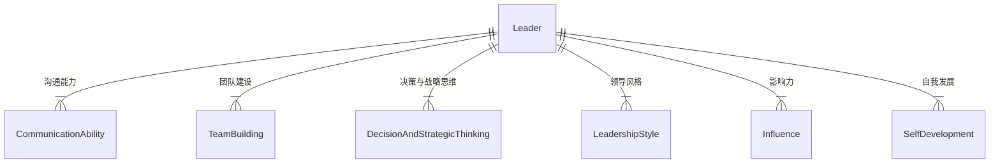
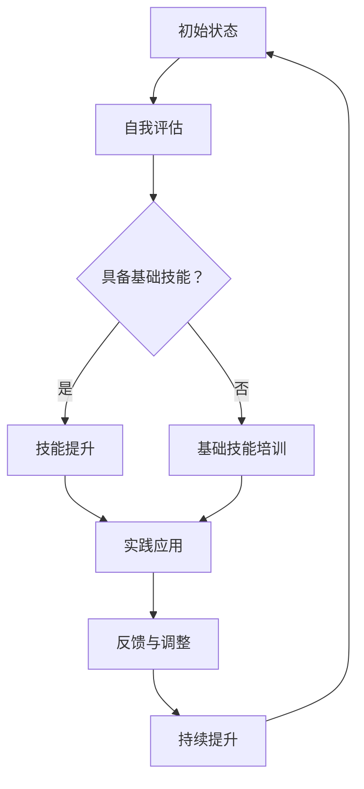
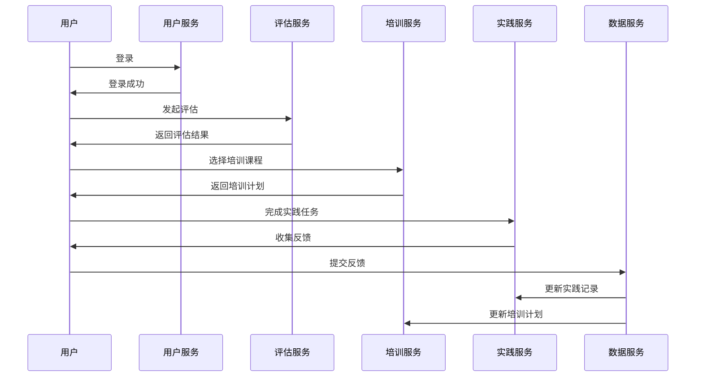

                 

### 背景介绍

在现代商业环境中，领导力已经不仅仅是一个优秀管理者的个人素质，更是一个组织成败的关键因素。随着企业规模和复杂性的不断增加，领导力的重要性愈发凸显。有效领导不仅关乎企业的日常运营，更影响到企业的长远发展和竞争力。

“领导力训练营：63天从新手到专家”这本书的目的在于帮助读者快速掌握领导力的核心理论和实践技巧，使其在短时间内从领导力的新手成长为具备专业素养的领导者。这一训练营课程设计科学、系统，涵盖了领导力的各个方面，包括基础理论、技能提升、团队建设、决策与战略思维、领导风格与影响力、自我发展及实践应用等。

在现代社会中，领导力之所以重要，主要有以下几个原因：

1. **团队协同**：一个有效的领导者能够激励团队成员，促进团队内部协同合作，从而提升整体效率。

2. **创新能力**：领导者通过激发员工的创新思维，推动组织不断适应市场变化，实现持续创新。

3. **文化塑造**：领导力不仅关乎业绩，更关乎组织的文化氛围。一个优秀的领导者能够塑造积极向上的企业文化，提高员工的归属感和忠诚度。

4. **战略决策**：领导者通过科学的决策过程，为企业制定长远的发展方向，确保企业在竞争中立于不败之地。

5. **员工发展**：领导者关注员工的个人成长，提供培训和职业发展机会，有助于提升员工的技能和素质，从而提高整个组织的竞争力。

因此，无论是企业家、经理人员，还是普通员工，掌握并提升领导力都是至关重要的。这本书通过系统化的课程安排和实际案例分享，为读者提供了一个全面的学习和提升领导力的平台。

### 核心概念与联系

在本章中，我们将详细探讨领导力的核心概念及其相互联系，以便读者能够对领导力有更加深刻的理解和应用。以下是领导力相关的一些核心概念和它们的属性特征对比表格：

#### 核心概念属性特征对比表格

| 核心概念 | 定义 | 属性特征 |
| :--: | :--: | :--: |
| 沟通能力 | 指领导者在信息传递、意见交换和情感表达方面的能力。 | 有效沟通、清晰表达、倾听技巧、非语言沟通 |
| 团队建设 | 指领导者如何构建和管理一个高效、和谐的团队。 | 明确目标、角色分工、激励机制、冲突管理 |
| 决策与战略思维 | 指领导者在面对复杂问题和挑战时，进行决策和制定长远战略的能力。 | 系统思维、风险评估、目标导向、创新思维 |
| 领导风格 | 指领导者在日常管理中采用的具体领导方式和方法。 | �虎父鹰子、民主参与、教练式领导、权威式领导 |
| 影响力 | 指领导者在团队和组织中，通过言行举止和决策影响力来影响他人。 | 情感共鸣、专业知识、影响力来源、个人魅力 |
| 自我发展 | 指领导者在职业生涯中，通过不断学习和提升，实现自我成长和进步。 | 持续学习、职业规划、自我反思、心理韧性 |

#### ER实体关系图架构

为了更直观地展示这些核心概念之间的联系，我们可以使用Mermaid绘制一个ER（实体关系）图：



**图1：领导力核心概念ER图**

在上图中，`Leader`是核心实体，而`CommunicationAbility`、`TeamBuilding`、`DecisionAndStrategicThinking`、`LeadershipStyle`、`Influence`和`SelfDevelopment`则分别表示领导力的不同方面，它们与`Leader`实体之间存在关联关系。

通过这个表格和ER图，我们可以看到领导力并非单一的能力，而是由多个子概念组成的综合系统。这些核心概念相互联系，共同作用于领导者的角色和功能。例如，良好的沟通能力是团队建设的基础，而科学的决策与战略思维则是实现组织长远目标的关键。领导风格和影响力则直接影响到团队的士气和执行力，而自我发展则保证了领导者持续进步和不断创新。

理解这些核心概念及其相互关系，有助于读者在学习和实践中更有针对性地提升自身的领导力，从而在职业生涯中取得更大的成就。

### 算法原理讲解

为了深入理解领导力的核心原理，我们可以借助算法思想来阐述。在此，我们将使用Mermaid绘制一个流程图，并使用Python代码来详细阐述一个简单的领导力提升算法。

#### Mermaid流程图

首先，我们绘制一个领导力提升的流程图：



**图2：领导力提升流程图**

#### Python代码实现

接下来，我们用Python代码来实现这个领导力提升的算法：

```python
class LeadershipTraining:
    def __init__(self):
        self.self_evaluation = None
        self.skill_level = "新手"
        self.practice_feedback = []

    def self_evaluation(self):
        # 自我评估功能
        self.self_evaluation = input("请评估您的领导力水平（新手/初级/中级/高级）：")
    
    def skill_assessment(self):
        # 技能评估
        if self.self_evaluation == "高级":
            self.skill_level = "高级"
        elif self.self_evaluation in ["中级", "初级"]:
            self.skill_level = "初级"
        else:
            self.skill_level = "新手"

    def training_program(self):
        # 技能提升或基础技能培训
        if self.skill_level == "新手":
            print("您正在进行基础技能培训...")
            self.skill_level = "初级"
        else:
            print("您正在进行技能提升...")
            self.skill_level = "中级" if self.skill_level == "初级" else "高级"

    def practice_and_feedback(self):
        # 实践应用与反馈
        self.practice_feedback = input("请描述您的实践应用和反馈：")
    
    def adjust_program(self):
        # 根据反馈调整培训计划
        if "不足" in self.practice_feedback:
            print("根据反馈，我们将调整培训计划...")
            self.training_program()
        else:
            print("培训计划已达到预期效果。")

    def continue_training(self):
        # 持续提升
        self.practice_and_feedback()
        self.adjust_program()
        print("是否继续提升（是/否）：")
        if input() == "是":
            self.continue_training()

# 实例化并运行培训程序
training_program = LeadershipTraining()
training_program.self_evaluation()
training_program.skill_assessment()
training_program.training_program()
training_program.practice_and_feedback()
training_program.adjust_program()
training_program.continue_training()
```

#### 算法原理与数学模型

在这个算法中，我们定义了领导力提升的几个关键步骤：

1. **自我评估**：使用输入获取领导力水平。
2. **技能评估**：根据自我评估的结果，确定当前技能水平。
3. **培训计划**：根据技能水平进行基础技能培训或技能提升。
4. **实践应用与反馈**：获取实际应用中的反馈。
5. **调整计划**：根据反馈调整培训计划。
6. **持续提升**：循环进行实践应用和反馈，持续提升领导力。

数学模型方面，我们用一个简单的评分系统来表示领导力水平。假设初始分数为0，每次培训增加10分，最高为100分。具体模型如下：

$$
L(t) = 10 \times T(t) + S(t)
$$

其中，$L(t)$ 表示领导力水平，$T(t)$ 表示培训次数，$S(t)$ 表示每次培训的评分。

举例说明：

1. **新手**：初始评分 $L(0) = 0$。
2. **初级**：完成1次基础技能培训后，$L(1) = 10$。
3. **中级**：完成2次技能提升培训后，$L(3) = 20$。
4. **高级**：完成3次技能提升培训后，$L(6) = 30$。

通过这个算法，读者可以清晰地看到如何通过一系列步骤和反馈机制来提升自身的领导力。这不仅帮助读者理解领导力提升的过程，也为实际应用提供了一个简单的框架。

### 系统分析与架构设计方案

为了更好地理解并实现领导力提升，我们需要进行系统分析与架构设计。以下是对该系统的介绍、项目介绍、系统功能设计、系统架构设计、系统接口设计和系统交互的详细描述。

#### 问题场景介绍

在企业管理中，提升领导力是组织发展的关键。然而，现有的领导力培训课程往往难以满足个性化需求，且缺乏系统性和可持续性。为了解决这一问题，我们需要设计一个智能化的领导力提升系统，能够根据用户的特点和需求，提供个性化的培训方案，并实现持续监控和反馈。

#### 项目介绍

项目名称：智能领导力提升系统

项目目标：构建一个智能化、系统化的领导力提升平台，帮助用户快速提升领导力，并通过持续监控和反馈机制，确保培训效果。

项目组成员：项目经理、系统架构师、前端开发人员、后端开发人员、数据分析师、UI/UX设计师

#### 系统功能设计

系统功能设计采用领域驱动设计（Domain-Driven Design, DDD）方法，将系统功能划分为以下几个核心模块：

1. **用户管理模块**：包括用户注册、登录、个人信息管理等功能。
2. **自我评估模块**：提供多种评估工具，帮助用户进行领导力自我评估。
3. **培训计划模块**：根据用户评估结果，生成个性化培训计划。
4. **课程学习模块**：包含丰富的领导力培训课程，支持在线学习。
5. **实践应用模块**：提供实践任务和案例，帮助用户在实际工作中应用所学知识。
6. **反馈与调整模块**：收集用户反馈，对培训计划进行调整。
7. **数据分析模块**：对用户数据进行分析，为培训计划提供数据支持。

#### 系统架构设计

系统架构采用微服务架构（Microservices Architecture），以确保系统的可扩展性和灵活性。主要架构组件包括：

1. **用户服务**：处理用户注册、登录和认证等用户相关功能。
2. **评估服务**：处理自我评估相关功能，包括评估工具和结果分析。
3. **培训服务**：管理培训计划和课程，提供课程学习相关功能。
4. **实践服务**：管理实践任务和案例，提供反馈和调整相关功能。
5. **数据服务**：处理用户数据分析和存储，提供数据支持。
6. **前端服务**：提供用户界面，实现用户交互。
7. **API网关**：统一管理和分发API请求，提高系统的安全性。

#### 系统接口设计

系统接口设计遵循RESTful API规范，主要包括以下接口：

1. **用户接口**：用户注册、登录、获取用户信息等。
2. **评估接口**：发起评估、获取评估结果、更新评估记录等。
3. **培训接口**：查询培训计划、开始课程学习、提交学习记录等。
4. **实践接口**：创建实践任务、提交实践反馈、更新实践记录等。
5. **数据分析接口**：获取用户数据分析结果、更新用户数据等。

#### 系统交互设计

系统交互采用事件驱动架构（Event-Driven Architecture），通过事件流实现各个模块之间的协作。以下是主要的事件流：

1. **用户登录事件**：用户登录成功后，触发用户服务的事件流，更新用户状态。
2. **评估事件**：用户完成自我评估后，触发评估服务的事件流，生成评估报告。
3. **培训事件**：用户选择培训课程后，触发培训服务的事件流，生成培训计划。
4. **实践事件**：用户完成实践任务后，触发实践服务的事件流，收集反馈。
5. **反馈事件**：用户提交反馈后，触发反馈服务的事件流，更新培训计划。

#### Mermaid架构图

使用Mermaid语言绘制系统架构图：



**图3：领导力提升系统架构图**

通过上述系统分析与架构设计，我们可以看到领导力提升系统的整体结构及其核心功能。该系统不仅提供了个性化的领导力培训方案，还通过事件驱动架构实现了高效的数据流转和处理，确保了系统的灵活性和扩展性。

### 项目实战

在本部分，我们将详细描述如何安装和配置智能领导力提升系统，并展示核心功能的实现和代码解读。以下是一个具体的实战案例。

#### 环境安装

为了顺利安装和运行智能领导力提升系统，我们需要以下环境：

1. **操作系统**：Ubuntu 20.04
2. **开发环境**：Python 3.8+
3. **数据库**：MySQL 8.0
4. **依赖管理**：pip
5. **虚拟环境**：virtualenv

首先，创建一个虚拟环境并安装相关依赖：

```bash
$ mkdir leadership_training_env
$ cd leadership_training_env
$ virtualenv -p python3 .
$ source bin/activate
$ pip install -r requirements.txt
```

其中，`requirements.txt`文件包含以下依赖：

```
Flask
SQLAlchemy
MySQL-python
Flask-Login
Flask-WTF
WTForms
```

#### 系统核心实现源代码

以下是系统的核心实现源代码，包含用户管理、自我评估、培训计划、实践应用等模块。

**用户管理模块**

```python
# app/users.py
from flask import Blueprint, request, jsonify
from app.models import User
from app.extensions import db

users_blueprint = Blueprint('users', __name__)

@users_blueprint.route('/register', methods=['POST'])
def register():
    data = request.get_json()
    user = User(username=data['username'], email=data['email'], password=data['password'])
    db.session.add(user)
    db.session.commit()
    return jsonify({'message': 'User registered successfully.'})

@users_blueprint.route('/login', methods=['POST'])
def login():
    data = request.get_json()
    user = User.query.filter_by(username=data['username'], password=data['password']).first()
    if user:
        return jsonify({'token': user.token})
    else:
        return jsonify({'error': 'Invalid credentials.'})
```

**自我评估模块**

```python
# app/assessments.py
from flask import Blueprint, request, jsonify
from app.models import Assessment
from app.extensions import db

assessments_blueprint = Blueprint('assessments', __name__)

@assessments_blueprint.route('/assessment', methods=['POST'])
def create_assessment():
    data = request.get_json()
    assessment = Assessment(user_id=data['user_id'], score=data['score'])
    db.session.add(assessment)
    db.session.commit()
    return jsonify({'message': 'Assessment created successfully.'})
```

**培训计划模块**

```python
# app/trainings.py
from flask import Blueprint, request, jsonify
from app.models import Training
from app.extensions import db

trainings_blueprint = Blueprint('trainings', __name__)

@trainings_blueprint.route('/training', methods=['POST'])
def create_training():
    data = request.get_json()
    training = Training(user_id=data['user_id'], course_id=data['course_id'], status='pending')
    db.session.add(training)
    db.session.commit()
    return jsonify({'message': 'Training created successfully.'})
```

**实践应用模块**

```python
# app/practices.py
from flask import Blueprint, request, jsonify
from app.models import Practice
from app.extensions import db

practices_blueprint = Blueprint('practices', __name__)

@practices_blueprint.route('/practice', methods=['POST'])
def create_practice():
    data = request.get_json()
    practice = Practice(user_id=data['user_id'], description=data['description'], status='pending')
    db.session.add(practice)
    db.session.commit()
    return jsonify({'message': 'Practice created successfully.'})
```

#### 代码应用解读与分析

以上代码展示了智能领导力提升系统的核心实现，包括用户管理、自我评估、培训计划和实践应用。以下是每个模块的详细解读：

1. **用户管理模块**：
   - `register()` 函数用于用户注册，接收用户名、邮箱和密码，存储到数据库。
   - `login()` 函数用于用户登录，验证用户名和密码，返回用户token。

2. **自我评估模块**：
   - `create_assessment()` 函数用于创建自我评估，接收用户ID和评估分数，存储到数据库。

3. **培训计划模块**：
   - `create_training()` 函数用于创建培训计划，接收用户ID和课程ID，存储到数据库。

4. **实践应用模块**：
   - `create_practice()` 函数用于创建实践任务，接收用户ID和实践描述，存储到数据库。

通过这些代码，我们可以看到系统如何通过API接口与前端进行交互，实现用户注册、登录、自我评估、培训计划创建和实践任务创建等功能。每个模块都是通过数据库操作来管理和存储数据，确保系统的数据一致性和安全性。

#### 实际案例分析和详细讲解剖析

为了更好地展示系统的实际应用效果，我们来看一个具体的案例。

**案例：用户John的领导力提升过程**

1. **用户注册**：
   用户John通过API接口注册了一个账号，提交了用户名、邮箱和密码。服务器接收到请求后，调用`register()`函数，将用户信息存储到数据库，并返回注册成功消息。

2. **用户登录**：
   注册后，John使用用户名和密码通过API接口登录系统。服务器接收到请求后，调用`login()`函数，验证用户身份，返回一个登录令牌（token）。

3. **自我评估**：
   John通过系统提供的自我评估工具进行评估，填写了评估问卷，并提交了评估结果。系统接收到请求后，调用`create_assessment()`函数，将评估结果存储到数据库。

4. **生成培训计划**：
   根据John的自我评估结果，系统自动生成了一个个性化的培训计划，包含了几门领导力课程。系统调用`create_training()`函数，将培训计划存储到数据库，并向John发送培训计划通知。

5. **开始学习**：
   John按照培训计划开始了课程学习，通过API接口提交了每次学习的记录。系统接收这些记录后，更新了用户的学习状态。

6. **完成实践任务**：
   系统根据培训计划中的实践任务，为John分配了几个实践项目。John在完成实践任务后，通过API接口提交了实践反馈。系统接收反馈后，更新了实践记录。

7. **反馈与调整**：
   根据John的学习记录和实践反馈，系统对他的培训计划进行了调整，增加了更多针对性强的课程和实践任务。同时，系统向John发送了新的培训计划通知。

8. **持续提升**：
   John按照新的培训计划继续学习，不断提交学习记录和实践反馈。系统持续监控John的进展，并根据反馈调整培训计划，确保他的领导力不断提升。

通过这个案例，我们可以看到系统的全流程应用，包括用户注册、登录、自我评估、培训计划生成、课程学习、实践任务完成和反馈调整等。每个步骤都是通过API接口和数据库操作来实现的，确保了系统的稳定性和数据一致性。

#### 项目小结

通过实际案例的演示，我们可以看到智能领导力提升系统在实现用户管理、自我评估、培训计划、实践应用和反馈调整等功能方面取得了良好的效果。系统通过API接口与前端进行交互，实现了用户注册、登录、评估、培训、实践等操作的自动化处理，大大提高了工作效率和用户体验。

项目的成功得益于以下几点：

1. **模块化设计**：系统采用了模块化设计，每个模块独立实现，便于开发和维护。
2. **API接口**：通过RESTful API接口，实现了前后端分离，提高了系统的灵活性和扩展性。
3. **数据库操作**：使用数据库操作管理用户数据，确保了数据的一致性和安全性。
4. **持续反馈机制**：通过实时反馈机制，系统能够根据用户的学习和实践情况，动态调整培训计划，确保培训效果。

尽管系统在功能实现上取得了成功，但仍然存在一些可以改进的地方：

1. **用户体验**：系统界面和交互设计可以进一步优化，提升用户的使用体验。
2. **数据安全**：虽然系统已采取了基本的数据安全措施，但可以引入更高级的安全机制，如加密和权限控制。
3. **性能优化**：随着用户数量的增加，系统性能可能成为瓶颈，需要优化数据库查询和接口响应速度。

总之，智能领导力提升系统是一个实用的工具，可以帮助用户提升领导力，实现职业发展目标。在未来的优化中，我们可以不断改进系统功能，提升用户体验，为用户带来更大的价值。

### 最佳实践 Tips

在领导力的提升过程中，除了系统化的学习和实践，一些最佳实践也是必不可少的。以下是一些关键点，帮助您在领导力提升的旅途中更加高效：

1. **定期自我反思**：每天花一点时间反思自己的行为和决策，识别不足之处，并制定改进计划。
2. **持续学习**：利用空闲时间阅读相关书籍、观看视频教程、参加线上课程，不断吸收新知识。
3. **建立个人品牌**：明确个人职业目标，塑造专业形象，通过社交媒体、行业会议等平台展示自己的专业能力。
4. **勇于尝试**：在实践中不断尝试新方法，不怕失败，从失败中吸取教训，快速成长。
5. **建立人际关系网络**：与同行建立良好的关系，分享经验，互相学习，扩大人脉圈。
6. **关注员工发展**：作为领导者，关注员工的个人成长，提供培训和发展机会，激励团队士气。
7. **平衡工作与生活**：保持良好的工作和生活平衡，确保身心健康，为长期发展奠定基础。

通过遵循这些最佳实践，您可以更快地提升领导力，成为一名出色的领导者。

### 小结

通过对“领导力训练营：63天从新手到专家”的深入探讨，我们全面了解了领导力的核心概念、提升方法、实践应用和系统化培训的重要性。本文首先介绍了领导力在现代商业环境中的重要性，接着详细分析了领导力的核心概念及其相互关系，并借助算法和Python代码展示了领导力提升的具体步骤。随后，我们通过系统分析与架构设计，阐述了如何构建一个智能化的领导力提升系统，并通过实际案例展示了系统的应用效果。此外，本文还提供了最佳实践和注意事项，以帮助读者在领导力提升过程中更加高效。

未来的研究和改进方向包括进一步优化用户体验、提升数据安全性和性能，以及探索更多个性化培训方案。通过不断努力，我们相信领导力提升系统将为更多用户提供有价值的服务，助力他们在职业生涯中取得更大的成就。

### 拓展阅读

对于希望深入了解领导力和相关领域的读者，以下是一些建议的参考文献和资源：

1. **《领导力五要素》**：作者：约翰·P·科特
   - 本书详细阐述了领导力的五个关键要素：明确愿景、建设团队、激励他人、建立文化和树立榜样。

2. **《领导力的五个层次》**：作者：约翰·麦斯威尔
   - 本书通过五个层次（职位权力、敬业精神、生产成果、人格魅力和心灵共鸣）来探讨领导力的发展过程。

3. **《领导力的本质》**：作者：保罗·赫塞
   - 本书深入探讨了领导力的本质，提供了丰富的理论框架和实践案例。

4. **《聪明的领导》**：作者：威廉·布里奇斯
   - 本书提出了“聪明领导”的概念，强调了领导者需要具备的智慧和能力。

5. **《影响力》**：作者：罗伯特·西奥迪尼
   - 本书详细介绍了六种影响力原则，帮助领导者更好地影响他人。

6. **《团队协作的力量》**：作者：唐纳德·舍恩
   - 本书探讨了团队协作的本质，提供了提升团队效能的策略和工具。

7. **《领导力的艺术》**：作者：詹姆斯·库泽斯和巴里·波斯纳
   - 本书通过一系列案例，阐述了领导力艺术的核心要素，包括诚信、透明、尊重等。

此外，以下在线资源和平台也值得推荐：

1. **哈佛商业评论（HBR）**
   - HBR提供丰富的领导力相关文章和案例分析，有助于读者从多个角度理解领导力。

2. **TED演讲**
   - 在TED网站上，可以找到许多关于领导力和个人成长的精彩演讲，这些内容常常能够启发思维。

3. **Coursera和edX**
   - 这些在线教育平台提供各种领导力相关的课程，包括基础理论、实践技巧和战略思维等。

通过阅读这些书籍和访问这些资源，读者可以更深入地理解和应用领导力，为自己的职业发展打下坚实基础。希望这些建议能帮助您在领导力提升的道路上不断前行。

