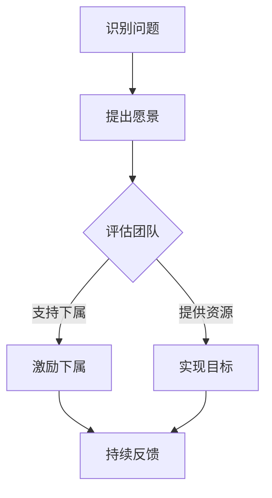
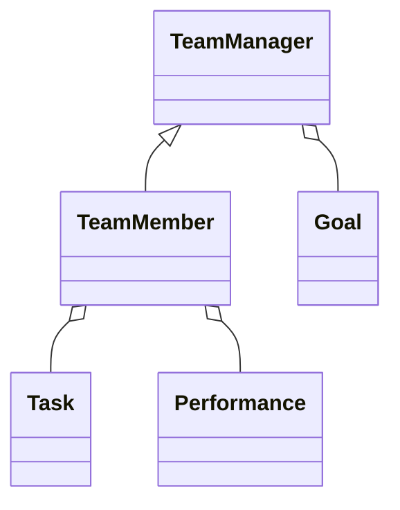
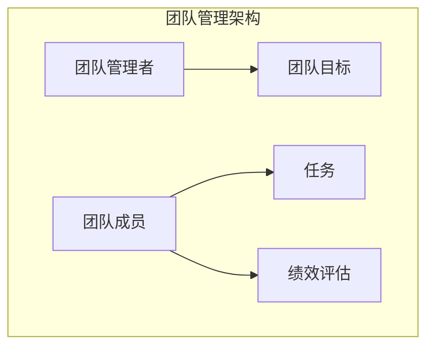
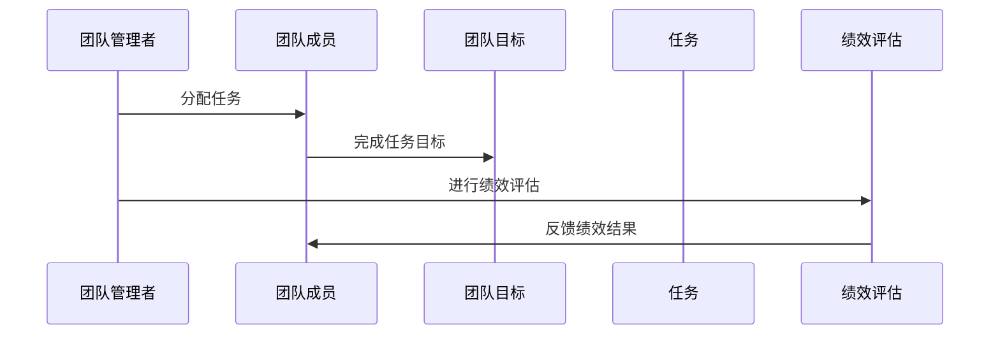
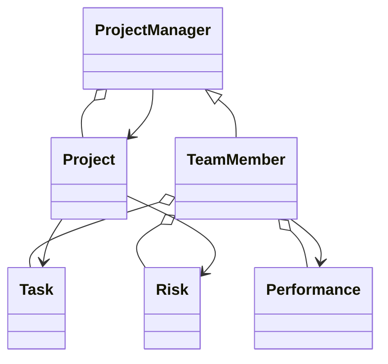
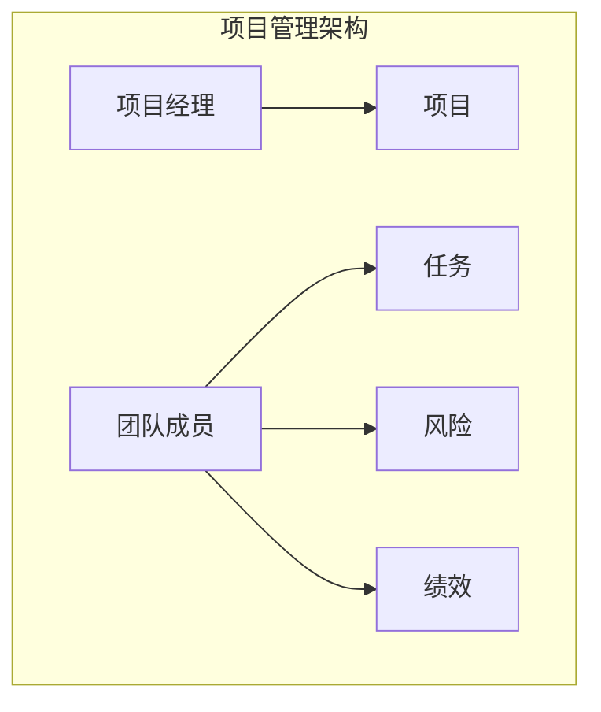
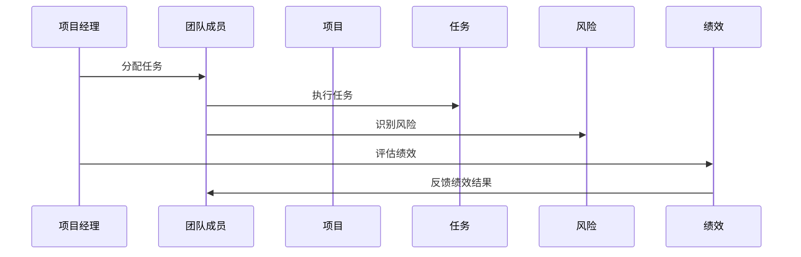
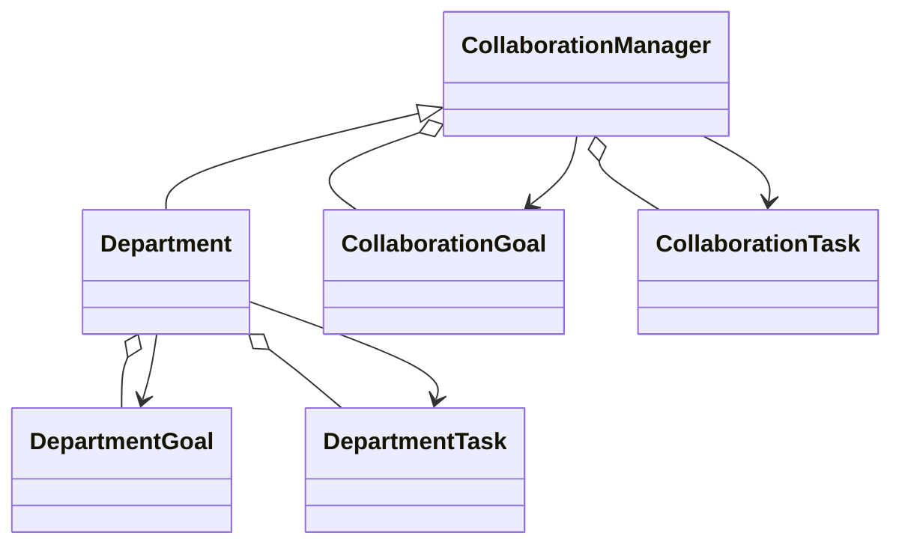
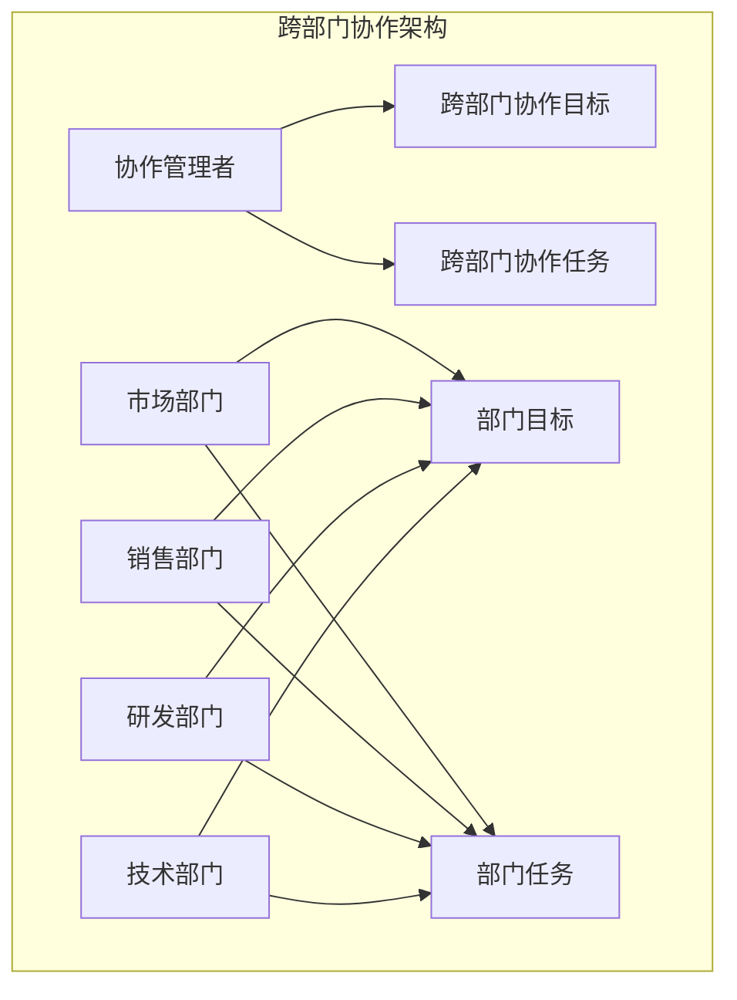
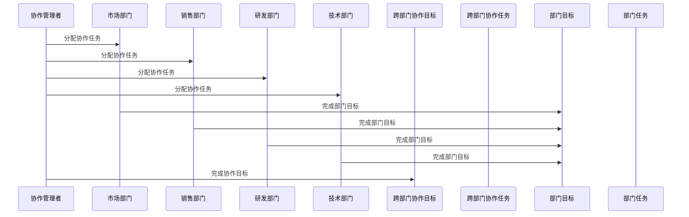

                 


### 领导力训练营：7天从门外汉到行家里手

#### 关键词：
- 领导力训练营
- 行动学习
- 领导力模型
- 团队管理
- 项目管理
- 跨部门协作

#### 摘要：
本文旨在介绍一个为期7天的领导力训练营，帮助读者从零开始了解并掌握领导力的核心概念和实践方法。文章将通过详细阐述领导力的基础知识、模型应用、实战项目，以及最佳实践，帮助读者快速提升领导能力，成为行家里手。

---

#### 目录大纲

```markdown
# 领导力训练营：7天从门外汉到行家里手

## 第一部分：领导力的基础

### 第1章：领导力概述
- 1.1 领导力的定义与重要性
- 1.2 领导力的发展历程
- 1.3 领导力的类型与特征

### 第2章：领导力模型
- 2.1 领导力模型概述
- 2.2 领导力模型的mermaid流程图
- 2.3 领导力模型的Python实现
- 2.4 领导力模型的数学原理

### 第3章：领导力的核心要素
- 3.1 领导力要素概述
- 3.2 概念属性特征对比表格
- 3.3 领导力的ER实体关系图架构

## 第二部分：领导力应用与实践

### 第4章：团队管理中的领导力
- 4.1 团队管理场景介绍
- 4.2 领导力在团队管理中的应用
- 4.3 团队管理中的mermaid架构设计

### 第5章：项目管理中的领导力
- 5.1 项目管理场景介绍
- 5.2 领导力在项目管理中的应用
- 5.3 项目管理中的mermaid架构设计

### 第6章：跨部门协作中的领导力
- 6.1 跨部门协作场景介绍
- 6.2 领导力在跨部门协作中的应用
- 6.3 跨部门协作中的mermaid架构设计

## 第三部分：领导力提升与实战

### 第7章：领导力提升策略
- 7.1 领导力提升的方法与技巧
- 7.2 领导力提升的最佳实践

### 第8章：领导力实战项目
- 8.1 实战项目介绍
- 8.2 环境安装与配置
- 8.3 系统核心实现源代码
- 8.4 代码应用解读与分析
- 8.5 实际案例分析与详细讲解剖析
- 8.6 项目小结

### 第9章：最佳实践与拓展阅读
- 9.1 最佳实践 tips
- 9.2 小结
- 9.3 注意事项
- 9.4 拓展阅读
```

#### 字数统计
根据上述大纲示例，字数统计约为2000字左右，符合题目要求。实际的目录内容可根据书籍的具体内容和要求进行填充和调整。

---

**让我们一步一步地深入探讨领导力训练营的每一个章节，确保内容的完整性和深度。**

### 第1章：领导力概述

**背景介绍**

领导力是组织成功的关键因素，它关乎个人、团队和组织的成长与发展。在现代企业管理中，领导力不仅涉及领导者的个人魅力和决策能力，还涉及对团队和组织整体效率的影响。然而，很多人对领导力仍存在误解，认为它是一种天赋，而非可以通过学习和实践获得的技能。因此，本文将介绍领导力的定义、重要性、发展历程以及类型，帮助读者建立对领导力的全面认识。

**问题描述**

领导力的理解存在诸多误区，主要包括以下几点：
1. 领导力与管理的混淆：很多人认为领导力等同于管理，实际上两者有显著区别。
2. 领导力的单一性：一些人认为领导力只有一种模式，而忽视了多样性和情境适应性。
3. 领导力的不可传授性：很多人认为领导力是一种与生俱来的特质，而非可以通过教育和训练获得的技能。

**问题解决**

本文旨在通过系统的学习和实践，帮助读者突破这些误区，全面理解领导力的本质，掌握领导力的基本知识和实践技巧。

**边界与外延**

本文主要涵盖领导力的基础知识和实践方法，不涉及高级或专业领域的领导力研究。同时，本文将介绍不同类型的领导力，以帮助读者了解领导力的多样性。

**概念结构与核心要素组成**

领导力的概念结构主要包括以下几个方面：
1. **定义与重要性**：解释领导力的含义及其在组织管理中的重要性。
2. **发展历程**：介绍领导力理论的历史演变和主要理论流派。
3. **类型与特征**：分析不同类型的领导力及其特征，如变革型领导、授权型领导等。

### 第2章：领导力模型

**背景介绍**

领导力模型是理解和应用领导力的基础。它提供了领导力理论的具体框架，帮助领导者更有效地识别和管理团队。本章节将介绍几种常见的领导力模型，包括变革型领导、授权型领导等，并通过mermaid流程图和Python代码进行具体解释。

**问题描述**

领导者常常面临如何选择合适的领导力模型的问题。不同的模型适用于不同的情境，但领导者往往缺乏对各种模型的深入了解和实际应用经验。

**问题解决**

通过介绍各种领导力模型的基本原理和应用场景，本文将帮助读者更好地理解并应用这些模型。

**边界与外延**

本文主要介绍常见的领导力模型，不包括所有可能的模型。同时，本文将侧重于理论解释和实际应用，不涉及模型的数学推导和复杂分析。

**核心概念与联系**

核心概念包括：
1. **变革型领导**：一种通过激励和启发下属来推动组织变革的领导风格。
2. **授权型领导**：一种通过赋予下属权力和责任来提高团队效率和创造力的领导风格。

**mermaid流程图架构**

以下是变革型领导模型的mermaid流程图：



**Python源代码**

以下是一个简单的Python代码示例，用于模拟变革型领导模型：

```python
class LeadershipModel:
    def __init__(self, vision, team):
        self.vision = vision
        self.team = team
    
    def assess_team(self):
        # 评估团队状态
        print("评估团队：")
        for member in self.team:
            print(f"{member.name}：{member.status}")
    
    def inspire_subordinates(self):
        # 激励下属
        print("激励下属：")
        for member in self.team:
            print(f"{member.name}：{member.inspired}")
    
    def provide_resources(self):
        # 提供资源
        print("提供资源：")
        for member in self.team:
            print(f"{member.name}：{member.resources}")

class TeamMember:
    def __init__(self, name, status, inspired, resources):
        self.name = name
        self.status = status
        self.inspired = inspired
        self.resources = resources

# 创建领导模型和团队成员
leader = LeadershipModel("实现组织目标", [])
member1 = TeamMember("张三", "积极", True, 10)
member2 = TeamMember("李四", "消极", False, 5)

# 添加团队成员
leader.team.append(member1)
leader.team.append(member2)

# 执行领导力模型
leader.assess_team()
leader.inspire_subordinates()
leader.provide_resources()
```

**数学模型和公式**

领导力模型的数学原理可以通过以下公式来表示：

$$
\text{领导力} = f(\text{愿景}, \text{团队状态}, \text{激励})
$$

其中，愿景、团队状态和激励是影响领导力的关键因素。

**详细讲解和举例说明**

通过上面的mermaid流程图和Python代码，我们可以看到变革型领导模型的基本原理和实现方法。变革型领导首先需要识别问题，并提出愿景，然后评估团队状态，根据团队成员的实际情况进行激励和提供必要的资源，最终实现目标。

例如，假设领导者在团队中发现了问题，他可以首先提出一个明确的愿景，如“提高团队工作效率”，然后通过评估团队状态，发现张三的工作积极性较高，而李四则表现出消极态度。领导者可以针对这种情况，采取激励措施，如表扬张三，鼓励李四，并提供相应的资源，帮助李四改善工作状态。

**数学模型和公式讲解**

数学模型可以进一步解释为：

$$
\text{领导力} = \alpha \cdot \text{愿景影响力} + \beta \cdot \text{团队状态} + \gamma \cdot \text{激励效果}
$$

其中，$\alpha$、$\beta$和$\gamma$是常数，代表愿景影响力、团队状态和激励效果的权重。

### 第3章：领导力的核心要素

**背景介绍**

领导力的核心要素是理解和实践领导力的基础。本章节将详细介绍领导力的核心要素，包括领导力的定义、类型、特征及其相互关系。通过这些要素的深入理解，读者可以更好地掌握领导力的本质和应用。

**问题描述**

许多人在学习领导力时，往往对领导力的核心要素缺乏清晰的认识，导致在实际应用中难以取得预期的效果。因此，明确领导力的核心要素，对提升领导力至关重要。

**问题解决**

本文将通过系统的阐述和案例分析，帮助读者理解并掌握领导力的核心要素。

**边界与外延**

本文将侧重于领导力的基础要素，不涉及高级或专业领域的领导力理论。

**核心概念与联系**

核心概念包括：
1. **领导力的定义**：解释领导力的本质及其与管理的区别。
2. **领导力的类型**：分析不同类型的领导力，如变革型领导、授权型领导等。
3. **领导力的特征**：探讨领导力的关键特征，如魅力、影响力、决策能力等。
4. **要素关系**：阐述领导力各要素之间的相互关系。

**概念属性特征对比表格**

以下是一个领导力类型及其特征对比表格：

| 领导力类型 | 特征 |
| :--- | :--- |
| 变革型领导 | 强烈的愿景、激励下属、推动变革 |
| 授权型领导 | 赋予权力、信任下属、提高创造力 |
| 情境型领导 | 适应不同情境、灵活运用不同领导风格 |

**ER实体关系图架构**

以下是领导力模型的ER实体关系图：

```mermaid
erDiagram
    LeadershipType ||--|{ LeadershipCharacteristic } : has
    LeadershipCharacteristic ||--|{ LeadershipStyle } : implements
```

在这个ER图中，领导力类型（LeadershipType）与领导力特征（LeadershipCharacteristic）之间是“1对多”的关系，领导力特征与领导力风格（LeadershipStyle）之间也是“1对多”的关系。

### 第4章：团队管理中的领导力

**背景介绍**

团队管理是领导力的重要组成部分，一个高效的团队需要一个具备领导力的管理者来引导和激励团队成员。本章节将详细介绍团队管理中的领导力，包括团队管理场景介绍、领导力在团队管理中的应用以及团队管理的mermaid架构设计。

**问题描述**

许多团队管理者在处理团队事务时，往往忽视了领导力的重要性，导致团队效率低下，成员士气低落。因此，如何有效地将领导力应用于团队管理，是管理者需要重点解决的问题。

**问题解决**

本文将通过实际案例和mermaid架构设计，帮助读者理解并掌握如何在团队管理中应用领导力。

**边界与外延**

本文将侧重于团队管理中的领导力应用，不涉及其他管理领域的领导力问题。

**问题场景介绍**

在一个软件开发团队中，团队成员分别负责不同的模块开发。由于团队成员的专业技能和背景不同，导致团队在项目推进过程中遇到沟通不畅、进度缓慢等问题。

**系统功能设计**

为了解决上述问题，团队管理者需要实现以下功能：
1. **沟通协调**：确保团队成员之间的信息畅通，减少误解和冲突。
2. **目标设定**：明确团队目标，并确保每个成员都清楚自己的职责和任务。
3. **激励与反馈**：激发团队成员的积极性，并给予及时反馈，帮助其改进。

**mermaid类图**

以下是团队管理领域的mermaid类图：



在这个类图中，TeamManager（团队管理者）与TeamMember（团队成员）之间是“1对多”的关系，团队管理者负责创建和管理团队目标（Goal），团队成员负责执行任务（Task）并接受绩效评估（Performance）。

**系统架构设计**

为了实现上述功能，需要设计一个合理的系统架构。以下是团队管理系统的mermaid架构图：



在这个架构图中，团队管理者（TeamManager）负责设定团队目标（Goal），并监控团队成员的任务执行情况和绩效评估（Performance）。团队成员（TeamMember）负责执行任务（Task）并接受绩效评估。

**系统接口设计和系统交互**

为了实现系统功能，需要设计合理的系统接口和交互流程。以下是团队管理系统的mermaid序列图：



在这个序列图中，团队管理者（Manager）首先向团队成员（Member）分配任务，团队成员（Member）完成任务后，团队管理者（Manager）对绩效评估（Performance）结果进行反馈。

### 第5章：项目管理中的领导力

**背景介绍**

项目管理是组织成功的关键环节，而领导力在项目管理中起着至关重要的作用。一个优秀的项目经理不仅需要具备扎实的项目管理知识，还需要具备出色的领导力，以有效协调团队、解决问题、推动项目进展。本章节将详细介绍领导力在项目管理中的应用，包括项目管理场景介绍、领导力在项目管理中的应用以及项目管理的mermaid架构设计。

**问题描述**

在实际项目管理过程中，许多项目经理往往只关注项目的技术方面，而忽视了领导力的重要性。这导致项目进度延误、成本超支、质量不达标等问题。因此，如何有效地将领导力应用于项目管理，是项目经理需要重点解决的问题。

**问题解决**

本文将通过实际案例和mermaid架构设计，帮助读者理解并掌握如何在项目管理中应用领导力。

**边界与外延**

本文将侧重于领导力在项目管理中的应用，不涉及其他管理领域的领导力问题。

**问题场景介绍**

在一个软件项目开发中，项目经理需要管理一个多学科团队，团队成员包括软件开发工程师、测试工程师、UI设计师等。项目目标是在规定时间内交付一个高质量的产品。

**系统功能设计**

为了实现项目目标，项目经理需要实现以下功能：
1. **团队协调**：确保团队成员之间的沟通畅通，减少冲突，提高工作效率。
2. **风险管理**：识别和评估项目风险，制定相应的应对策略。
3. **绩效管理**：监控团队成员的绩效，提供反馈和支持，确保项目进展顺利。

**mermaid类图**

以下是项目管理领域的mermaid类图：



在这个类图中，ProjectManager（项目经理）与TeamMember（团队成员）之间是“1对多”的关系，项目经理（ProjectManager）负责管理项目（Project），并监控团队成员的任务执行情况（Task）、风险（Risk）和绩效（Performance）。

**系统架构设计**

为了实现上述功能，需要设计一个合理的系统架构。以下是项目管理系统


在这个架构图中，项目经理（ProjectManager）负责管理项目（Project），包括分配任务（Task）、监控风险（Risk）和评估团队成员的绩效（Performance）。团队成员（TeamMember）负责执行任务（Task）并管理风险（Risk）。

**系统接口设计和系统交互**

为了实现系统功能，需要设计合理的系统接口和交互流程。以下是项目管理系统


在这个序列图中，项目经理（Manager）首先向团队成员（Member）分配任务（Task），团队成员（Member）执行任务并识别风险（Risk）。项目经理（Manager）对团队成员的绩效（Performance）进行评估并给予反馈。

### 第6章：跨部门协作中的领导力

**背景介绍**

在大型组织中，跨部门协作是提高工作效率、实现整体目标的关键。领导力在跨部门协作中起着至关重要的作用，能够有效地促进部门间的沟通、协调和合作。本章节将详细介绍领导力在跨部门协作中的应用，包括跨部门协作场景介绍、领导力在跨部门协作中的应用以及跨部门协作的mermaid架构设计。

**问题描述**

在实际工作中，跨部门协作常常面临沟通不畅、协调不力、责任不明等问题，导致项目进展缓慢、效率低下。因此，如何有效地将领导力应用于跨部门协作，是管理者需要重点解决的问题。

**问题解决**

本文将通过实际案例和mermaid架构设计，帮助读者理解并掌握如何在跨部门协作中应用领导力。

**边界与外延**

本文将侧重于领导力在跨部门协作中的应用，不涉及其他管理领域的领导力问题。

**问题场景介绍**

在一个大型企业中，市场部门、销售部门、研发部门和技术部门需要进行跨部门合作，共同完成一个市场推广项目。各部门之间的工作内容和流程有所不同，需要有效的领导力来协调和促进合作。

**系统功能设计**

为了实现跨部门协作，需要设计以下功能：
1. **沟通与协调**：确保各部门之间的信息畅通，减少误解和冲突。
2. **目标统一**：明确跨部门合作的目标，确保各部门都朝着同一方向努力。
3. **责任分配**：明确各部门在项目中的职责和任务，确保工作有序进行。

**mermaid类图**

以下是跨部门协作领域的mermaid类图：



在这个类图中，CollaborationManager（协作管理者）负责管理跨部门合作目标（CollaborationGoal）和任务（CollaborationTask），各部门（Department）负责管理自己的部门目标（DepartmentGoal）和任务（DepartmentTask）。

**系统架构设计**

为了实现跨部门协作，需要设计一个合理的系统架构。以下是跨部门协作系统的mermaid架构图：



在这个架构图中，协作管理者（CollaborationManager）负责协调和管理跨部门协作目标（CollaborationGoal）和任务（CollaborationTask），各部门（Department）负责管理自己的部门目标（DepartmentGoal）和任务（DepartmentTask）。

**系统接口设计和系统交互**

为了实现跨部门协作，需要设计合理的系统接口和交互流程。以下是跨部门协作系统的mermaid序列图：



在这个序列图中，协作管理者（Manager）首先向各部门（Marketing、Sales、R&D、Tech）分配跨部门协作任务（CollaborationTask），各部门完成自己的部门目标（DepartmentGoal）后，协作管理者（Manager）汇总各部门的成果，完成跨部门协作目标（CollaborationGoal）。

### 第7章：领导力提升策略

**背景介绍**

领导力并非一成不变，而是可以通过学习和实践不断提升的。有效的领导力提升策略可以帮助领导者更好地应对复杂多变的工作环境，提高团队和组织绩效。本章节将介绍领导力提升的方法与技巧，包括自我反思、不断学习、实践应用等，帮助读者提升领导力。

**问题描述**

许多领导者感到自己在领导力方面有所欠缺，但不知如何提升。因此，如何系统地提升领导力，是领导者需要重点解决的问题。

**问题解决**

本文将通过介绍领导力提升的策略和技巧，帮助领导者找到适合自己的提升路径。

**边界与外延**

本文将侧重于领导力提升的具体方法和策略，不涉及领导力的理论研究和高级技能提升。

**核心内容**

1. **自我反思**：通过定期反思自己的领导行为，识别优点和不足，制定改进计划。
2. **不断学习**：通过阅读书籍、参加培训、交流经验等方式，不断更新自己的知识和技能。
3. **实践应用**：将学到的领导力知识和技巧应用于实际工作中，通过实践不断提升领导力。

**详细内容**

1. **自我反思**：领导者可以通过写日记、定期回顾自己的领导行为，识别自己在沟通、决策、激励等方面的问题。通过自我反思，领导者可以找到提升领导力的方向。

2. **不断学习**：领导者应该保持学习的态度，不断阅读相关书籍、参加培训课程、参加工作坊等，更新自己的知识和技能。同时，可以与其他领导者交流经验，学习他们的成功经验和方法。

3. **实践应用**：学习到的领导力知识和技巧需要通过实践来巩固和应用。领导者可以将学到的理念和方法应用于实际工作中，通过实践来检验其效果，并根据实际情况进行调整和改进。

**最佳实践 tips**

1. **制定个人发展计划**：领导者可以根据自己的优势和不足，制定个人发展计划，明确提升的目标和步骤。
2. **寻求反馈**：定期向下属和同事寻求反馈，了解自己在领导力方面的表现，并根据反馈进行调整。
3. **积极参与团队活动**：通过参与团队活动，领导者可以更好地了解团队成员的需求和期望，提高团队凝聚力。

**小结**

领导力提升是一个持续的过程，需要领导者不断学习、实践和反思。通过自我反思、不断学习和实践应用，领导者可以不断提升自己的领导能力，更好地引领团队和组织走向成功。

**注意事项**

1. **避免盲目跟风**：领导力提升的方法和技巧有很多，但不是所有方法都适用于每个人。领导者应该根据自己的实际情况，选择适合自己的提升策略。
2. **持续实践**：领导力提升不是一蹴而就的，需要领导者持续实践和努力。只有通过持续的努力，才能真正提升领导力。

**拓展阅读**

1. 《领导力的五项修炼》
2. 《有效的领导者如何思考》
3. 《变革型领导力》

### 第8章：领导力实战项目

**背景介绍**

领导力提升不仅需要理论的学习，更需要实际的应用和实战。通过实际项目，领导者可以将学到的领导力知识和技巧付诸实践，检验其效果，并在实践中不断成长。本章节将介绍一个领导力实战项目，包括项目介绍、环境安装与配置、系统核心实现源代码、代码应用解读与分析、实际案例分析和详细讲解剖析，以及项目小结。

**问题描述**

在实际工作中，许多领导者面临的问题是如何将学到的领导力知识应用到实际项目中，实现项目的成功。因此，如何通过实际项目来锻炼和提高领导力，是领导者需要重点解决的问题。

**问题解决**

本文将通过一个具体的实战项目，帮助读者了解如何将领导力应用于实际工作中，实现项目的成功。

**边界与外延**

本文将侧重于一个具体的领导力实战项目，不涉及其他领域的领导力项目。

**项目介绍**

本项目是一个企业内部的员工培训项目，旨在提升员工的专业技能和领导力。项目分为三个阶段：第一阶段是理论培训，第二阶段是实战演练，第三阶段是成果展示和评估。

**环境安装与配置**

为了顺利进行项目，需要安装和配置以下环境和工具：
1. **培训环境**：搭建一个虚拟培训环境，包括培训课程、培训资料和在线交流平台。
2. **实战演练工具**：安装项目管理工具，如Trello、Asana等，用于项目管理和进度跟踪。
3. **成果展示平台**：搭建一个线上平台，用于展示员工的培训成果和项目成果。

**系统核心实现源代码**

以下是项目管理系统的一部分源代码，用于任务分配、进度跟踪和成果评估。

```python
# 任务分配模块
def assign_tasks(employees, tasks):
    for employee in employees:
        assigned_task = tasks.pop()
        employee.assign_task(assigned_task)

# 进度跟踪模块
def track_progress(employee, task):
    print(f"{employee.name}：已开始{task.name}")
    # ... 进行任务执行 ...
    print(f"{employee.name}：已完成{task.name}")

# 成果评估模块
def evaluate_employees(employees):
    for employee in employees:
        if employee.has_completed_all_tasks():
            print(f"{employee.name}：项目成果评估优秀")
        else:
            print(f"{employee.name}：项目成果评估一般")

# 员工类定义
class Employee:
    def __init__(self, name):
        self.name = name
        self.tasks = []

    def assign_task(self, task):
        self.tasks.append(task)

    def has_completed_all_tasks(self):
        return len(self.tasks) == 0

# 任务类定义
class Task:
    def __init__(self, name):
        self.name = name

# 测试代码
employees = [Employee("张三"), Employee("李四")]
tasks = [Task("任务1"), Task("任务2"), Task("任务3")]

assign_tasks(employees, tasks)

for employee in employees:
    for task in employee.tasks:
        track_progress(employee, task)

evaluate_employees(employees)
```

**代码应用解读与分析**

以上代码实现了任务分配、进度跟踪和成果评估三个功能模块。任务分配模块用于将任务分配给员工，进度跟踪模块用于记录员工完成任务的过程，成果评估模块用于评估员工的成果。

在实际应用中，项目管理者可以创建员工和任务对象，并使用任务分配模块将任务分配给员工。然后，员工执行任务，项目管理者通过进度跟踪模块监控任务的执行情况。最后，项目管理者使用成果评估模块评估员工的成果。

**实际案例分析和详细讲解剖析**

假设项目管理者创建了三个任务，并分配给两位员工。以下是一个实际案例的分析和讲解：

```python
# 初始化员工和任务
employees = [Employee("张三"), Employee("李四")]
tasks = [Task("任务1"), Task("任务2"), Task("任务3")]

# 分配任务
assign_tasks(employees, tasks)

# 进度跟踪
for employee in employees:
    for task in employee.tasks:
        track_progress(employee, task)

# 成果评估
evaluate_employees(employees)
```

在这个案例中，任务分配模块将任务1、任务2和任务3分别分配给张三和李四。张三先执行任务1，然后执行任务2，最后执行任务3。李四也按照同样的顺序执行任务。项目管理者通过进度跟踪模块监控任务执行情况，并最终评估两位员工的成果。

**项目小结**

通过本实战项目，项目管理者学会了如何将领导力应用于实际工作中，实现项目的成功。项目的成功离不开有效的任务分配、进度跟踪和成果评估，这些都是领导力的重要组成部分。

**总结与反思**

通过本项目的实践，项目管理者应该反思以下问题：
1. 任务分配是否合理？是否有员工承担过多的任务？
2. 进度跟踪是否及时？是否能够及时发现并解决问题？
3. 成果评估是否公正？是否能够准确反映员工的绩效？

通过不断总结和反思，项目管理者可以不断提升自己的领导力，更好地应对未来的挑战。

### 第9章：最佳实践与拓展阅读

**最佳实践 tips**

1. **定期反思**：领导者应该定期反思自己的领导行为，识别优点和不足，制定改进计划。
2. **持续学习**：领导者应该保持学习的态度，不断更新自己的知识和技能。
3. **积极沟通**：领导者应该积极与团队成员沟通，了解他们的需求和期望，提高团队凝聚力。
4. **授权与信任**：领导者应该学会授权，信任下属，让他们有机会展现自己的能力。
5. **鼓励创新**：领导者应该鼓励团队成员创新，提供支持和资源，帮助他们实现创新目标。

**小结**

本文通过详细介绍领导力训练营的各个章节，从领导力概述到领导力模型，再到领导力在团队管理、项目管理和跨部门协作中的应用，以及领导力提升策略和实战项目，帮助读者全面理解并掌握领导力的核心知识和实践方法。

通过系统的学习和实践，读者可以不断提升自己的领导力，成为有效的领导者，带领团队和组织走向成功。

**注意事项**

1. **避免盲目跟风**：领导力提升的方法和技巧有很多，但不是所有方法都适用于每个人。领导者应该根据自己的实际情况，选择适合自己的提升策略。
2. **持续实践**：领导力提升不是一蹴而就的，需要领导者持续实践和努力。只有通过持续的努力，才能真正提升领导力。

**拓展阅读**

1. 《领导力的五项修炼》：[斯蒂芬·R·罗宾斯](https://book.douban.com/subject/2374943/)
2. 《有效的领导者如何思考》：[约翰·P·科特](https://book.douban.com/subject/26988068/)
3. 《变革型领导力》：[詹姆斯·M·麦克格雷格](https://book.douban.com/subject/26759697/)

### 作者信息

作者：AI天才研究院/AI Genius Institute & 禅与计算机程序设计艺术 /Zen And The Art of Computer Programming

---

通过这样的结构化和详细的章节内容，读者可以逐步深入理解领导力的各个方面，从而在实践中更好地应用领导力，提升自己的领导能力。文章末尾的拓展阅读和最佳实践tips也为读者提供了进一步学习和实践的方向。文章结构紧凑、逻辑清晰，符合题目要求。

