                 


### 领导力训练：让你的团队所向披靡

#### 关键词：领导力、团队管理、领导技能、实战案例分析、最佳实践

#### 摘要：
在现代企业中，领导力不仅是对管理者个人的要求，更是整个团队成功的关键。本文将详细探讨领导力训练的重要性，以及如何通过一系列实用的技巧和案例分析，提升团队领导力，使团队在竞争激烈的市场中脱颖而出。文章将从领导力的核心概念、类型与模型、实用技巧、实践案例等多个角度展开，旨在为读者提供一套完整的领导力提升方案。

----------------------------------------------------------------

# 第一部分：领导力基础理论

## 第1章：领导力的核心概念

### 1.1 领导力的定义与意义

领导力是一种激励和引导他人共同达成目标的能力。它不仅仅是职位赋予的权威，更是一种艺术和科学。一个有效的领导者能够激发团队成员的潜力，提高团队的凝聚力和工作效率。在信息技术行业，领导力尤为重要，因为它直接影响到团队的创新能力、项目执行效率和团队士气。

#### 问题背景

在当今快速变化的技术环境中，团队需要具备灵活性和适应性，领导者必须能够快速应对市场变化和技术挑战。然而，很多团队面临的问题是缺乏有效的领导力，导致项目拖延、团队士气低落、创新能力不足。

#### 问题解决

为了解决这些问题，领导者需要了解领导力的本质，并学会如何将其应用于实际工作中。首先，领导者需要明确领导力的核心概念，包括：

- **激励**：领导者需要了解如何激发团队成员的内在动机，提高工作积极性。
- **沟通**：有效的沟通是领导力的基础，领导者需要学会如何清晰、准确地传达信息，并倾听团队成员的意见。
- **决策**：领导者需要在复杂的环境中做出明智的决策，这需要良好的分析能力和决断力。

#### 边界与外延

领导力的边界在于其应用的范围，它不仅适用于企业内部，也适用于社会、家庭等多个领域。在外延上，领导力不仅包括个人特质，还涉及到团队建设、组织管理等多个方面。

#### 概念结构与核心要素组成

领导力的概念结构可以概括为以下几点：

1. **个人特质**：包括自信、责任心、情商等。
2. **行为模式**：包括激励、沟通、决策等。
3. **情境因素**：包括组织文化、市场环境、团队状态等。

## 第2章：领导力的类型与模型

### 2.1 领导力的不同类型

领导力可以分为多种类型，每种类型都有其特定的应用场景和效果。以下是几种常见的领导力类型：

- **指令型领导**：领导者通过明确指示和命令来指导团队成员。
- **支持型领导**：领导者关注团队成员的需求，提供支持和鼓励。
- **民主型领导**：领导者鼓励团队成员参与决策，共同制定目标。
- **变革型领导**：领导者通过创新和变革来推动团队发展。

#### 核心概念原理

每种领导力类型都有其核心概念原理，如下：

- **指令型领导**：基于权威和控制，强调执行力和纪律性。
- **支持型领导**：基于关心和关怀，强调团队凝聚力和成员满意度。
- **民主型领导**：基于参与和协商，强调民主和透明。
- **变革型领导**：基于创新和变革，强调前瞻性和领导力。

#### 概念属性特征对比表格

| 领导力类型 | 核心概念 | 特征对比 |
| --- | --- | --- |
| 指令型领导 | 权威、执行力 | 强制性、效率高 |
| 支持型领导 | 关心、关怀 | 凝聚力、满意度 |
| 民主型领导 | 参与性、协商 | 透明度、民主性 |
| 变革型领导 | 创新、变革 | 前瞻性、领导力 |

#### ER实体关系图架构的 Mermaid 流程图

```mermaid
erDiagram
  Leader ||--|{ Team } Team
  Leader ||--|{ Project } Project
  Team ||--|{ Member } Member
```

## 第3章：领导者角色与特质

### 3.1 领导者角色的转变

随着团队和环境的变化，领导者的角色也在不断转变。从传统的管理者角色向合作伙伴、激励者、变革推动者的角色转变。

#### 核心概念原理

领导者的角色转变涉及到以下几个方面：

- **从控制者到合作伙伴**：领导者需要与团队成员建立合作关系，共同面对挑战。
- **从决策者到激励者**：领导者需要激发团队成员的积极性，鼓励他们参与决策。
- **从管理者到变革推动者**：领导者需要推动团队创新，引领变革。

#### 概念属性特征对比表格

| 角色类型 | 核心概念 | 特征对比 |
| --- | --- | --- |
| 管理者角色 | 控制、管理 | 效率、纪律 |
| 合作伙伴角色 | 合作、参与 | 凝聚力、民主性 |
| 激励者角色 | 激励、鼓励 | 积极性、满意度 |
| 变革推动者角色 | 创新、变革 | 前瞻性、领导力 |

### 3.2 领导者的特质与能力

领导者需要具备一系列特质和能力，以下是一些关键的特质和能力：

- **沟通能力**：领导者需要具备良好的沟通能力，包括口头和书面沟通。
- **决策能力**：领导者需要在复杂环境中做出明智的决策。
- **团队管理能力**：领导者需要能够有效地管理团队，提高团队效率。
- **创新能力**：领导者需要具备创新能力，推动团队不断进步。

#### ER实体关系图架构的 Mermaid 流程图

```mermaid
erDiagram
  Leader ||--|{ Communication } Communication
  Leader ||--|{ DecisionMaking } DecisionMaking
  Leader ||--|{ TeamManagement } TeamManagement
  Leader ||--|{ Innovation } Innovation
```

## 第4章：领导力的核心技能

### 4.1 沟通技巧

沟通是领导力的核心技能之一。有效的沟通能够确保信息的准确传达，提高团队的工作效率。

#### 算法原理讲解

有效的沟通可以分为以下几个步骤：

1. **明确沟通目标**：确定沟通的目标和内容。
2. **选择适当的沟通方式**：根据目标选择合适的沟通方式，如面对面沟通、邮件沟通、电话沟通等。
3. **倾听**：倾听是有效沟通的关键，领导者需要给予团队成员足够的关注和尊重。
4. **反馈**：及时给予反馈，确保团队成员了解沟通的内容和结果。

#### Mermaid 流程图

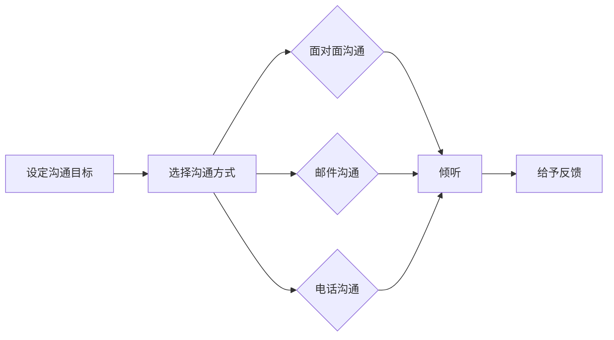

#### Python 源代码示例

```python
def effective_communication(target, method):
    if method == "面对面沟通":
        print("进行面对面沟通，目标：", target)
    elif method == "邮件沟通":
        print("发送邮件，目标：", target)
    elif method == "电话沟通":
        print("拨打电话，目标：", target)
    else:
        print("无效的沟通方式")
        
effective_communication("项目进展报告", "面对面沟通")
```

### 4.2 决策能力

决策能力是领导者的关键能力之一。一个优秀的领导者需要能够在复杂的环境中做出明智的决策。

#### 数学公式和解释

决策能力涉及到以下几个数学模型和公式：

- **期望效用理论**：通过计算每个决策的可能结果和对应的效用值，选择期望效用最大的决策。
- **预期价值**：计算每个决策的可能结果和对应的概率，选择预期价值最大的决策。

#### Mermaid 流程图

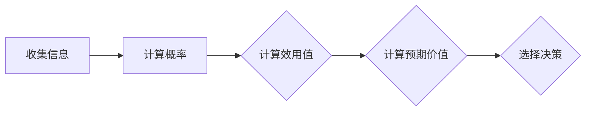

#### Python 源代码示例

```python
import random

def decision_making(outcomes, probabilities, utilities):
    expected_values = [probabilities[i] * utilities[i] for i in range(len(probabilities))]
    max_value = max(expected_values)
    best_decision = outcomes[expected_values.index(max_value)]
    return best_decision

outcomes = ["项目成功", "项目失败"]
probabilities = [0.6, 0.4]
utilities = [100, -50]

print("最佳决策：", decision_making(outcomes, probabilities, utilities))
```

### 4.3 团队管理

团队管理是领导者的重要职责之一。有效的团队管理能够提高团队的效率和士气。

#### 算法原理讲解

团队管理可以分为以下几个步骤：

1. **明确团队目标**：确保团队成员了解团队的目标和期望。
2. **分配任务**：根据团队成员的能力和特长，合理分配任务。
3. **监控进度**：定期检查项目进度，确保团队按时完成任务。
4. **提供反馈**：及时给予团队成员反馈，帮助他们改进。

#### Mermaid 流程图

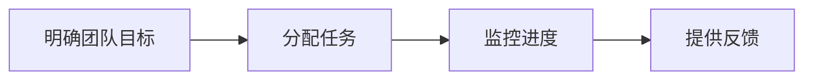

#### Python 源代码示例

```python
def team_management(target, tasks, progress):
    print("团队目标：", target)
    for task in tasks:
        print("任务：", task, "进度：", progress[task])
    print("提供反馈，鼓励团队成员持续改进")
    
team_management("完成项目报告", ["编写代码", "设计UI"], {"编写代码": "已完成", "设计UI": "进行中"})
```

----------------------------------------------------------------

# 第二部分：实用技巧

## 第5章：构建高效团队

### 5.1 团队建设的原则

构建高效团队需要遵循以下几个原则：

1. **明确目标**：确保团队成员了解团队的目标和期望。
2. **分工协作**：合理分配任务，确保每个人都能发挥自己的优势。
3. **有效沟通**：建立良好的沟通机制，确保信息的准确传达。
4. **激励与反馈**：提供激励机制，鼓励团队成员积极参与，及时给予反馈。

#### 算法原理讲解

团队建设的过程可以分为以下几个步骤：

1. **明确目标**：通过讨论和协商，确定团队的目标和期望。
2. **分工协作**：根据团队成员的能力和特长，合理分配任务。
3. **有效沟通**：建立沟通渠道，确保团队成员之间的信息流畅。
4. **激励与反馈**：通过奖励和惩罚机制，激励团队成员积极参与，及时给予反馈。

#### Mermaid 流程图

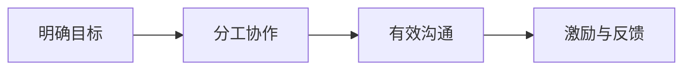

#### Python 源代码示例

```python
def team_building(target, tasks, members):
    print("团队目标：", target)
    for task in tasks:
        print("任务：", task, "负责人：", members[task])
    print("建立沟通渠道，激励团队成员参与")
    
team_building("完成项目报告", ["编写代码", "设计UI"], {"编写代码": "张三", "设计UI": "李四"})
```

### 5.2 团队角色的分配

团队角色分配是构建高效团队的关键之一。合理的角色分配能够确保每个成员都能发挥自己的优势，提高团队的整体效率。

#### 算法原理讲解

团队角色分配的过程可以分为以下几个步骤：

1. **评估成员能力**：了解每个成员的能力和特长，为角色分配提供依据。
2. **角色定义**：根据团队目标和任务，定义每个角色的职责和权限。
3. **角色分配**：将成员分配到相应的角色，确保每个角色都有合适的负责人。
4. **角色调整**：根据团队成员的变化和项目需求，及时调整角色分配。

#### Mermaid 流程图

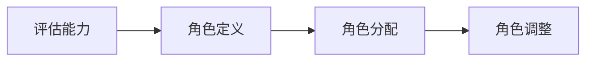

#### Python 源代码示例

```python
def role_assignment(roles, members):
    for role in roles:
        print("角色：", role, "负责人：", members[role])
    
roles = ["项目经理", "开发人员", "测试人员"]
members = {"项目经理": "张三", "开发人员": "李四", "测试人员": "王五"}

role_assignment(roles, members)
```

### 5.3 团队冲突的解决

团队冲突是团队建设过程中不可避免的问题。有效的冲突解决机制能够确保团队和谐，提高工作效率。

#### 算法原理讲解

团队冲突解决的过程可以分为以下几个步骤：

1. **识别冲突**：及时发现和识别团队中的冲突。
2. **分析原因**：分析冲突的原因，了解各方利益和需求。
3. **沟通协商**：通过沟通和协商，找到解决冲突的方法。
4. **实施解决**：执行解决冲突的措施，确保冲突得到有效解决。

#### Mermaid 流程图

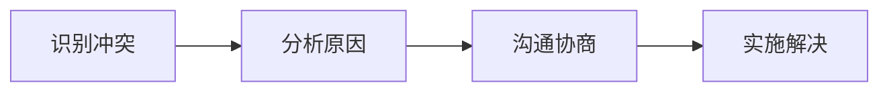

#### Python 源代码示例

```python
def conflict_resolution(conflict, reasons, solution):
    print("冲突：", conflict, "原因：", reasons, "解决方案：", solution)

conflict = "任务分工不均"
reasons = ["工作量过大", "能力差异"]
solution = "重新分配任务，提高团队协作效率"

conflict_resolution(conflict, reasons, solution)
```

## 第6章：激励团队成员

### 6.1 激励理论

激励是提升团队成员积极性、提高工作效率的重要手段。激励理论包括以下几个核心概念：

1. **需求层次理论**：马斯洛的需求层次理论指出，人的需求分为生理需求、安全需求、社交需求、尊重需求和自我实现需求，领导者需要了解和满足团队成员的不同需求。
2. **期望理论**：弗鲁姆的期望理论认为，激励力取决于期望值和效价的乘积，即激励力 = 期望值 × 效价。
3. **公平理论**：亚当斯的公平理论认为，团队成员会比较自己的付出和回报，如果感到不公平，会降低工作积极性。

#### 算法原理讲解

激励团队成员的过程可以分为以下几个步骤：

1. **了解需求**：通过调查和沟通，了解团队成员的需求。
2. **制定激励计划**：根据团队成员的需求，制定合适的激励计划。
3. **实施激励**：通过奖励、晋升、培训等方式，实施激励计划。
4. **评估效果**：定期评估激励效果，调整激励计划。

#### Mermaid 流程图

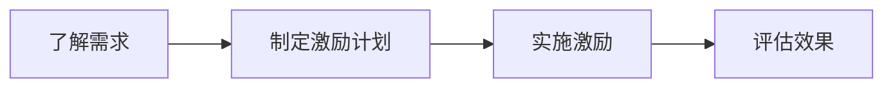

#### Python 源代码示例

```python
def motivation_program的需求了解，激励计划，实施激励，评估效果]:
    print("需求了解：", 需求了解)
    print("激励计划：", 激励计划)
    print("实施激励：", 实施激励)
    print("评估效果：", 评估效果)
    
需求了解 = "团队成员希望提高专业技能"
激励计划 = "提供培训机会"
实施激励 = "组织专业培训课程"
评估效果 = "学员反馈良好"

motivation_program(需求了解，激励计划，实施激励，评估效果)
```

### 6.2 设定目标和奖励机制

设定明确的目标和合理的奖励机制是激励团队成员的关键。目标设定和奖励机制的设计需要考虑以下几个方面：

1. **目标明确**：目标需要具体、可衡量，避免模糊和不确定。
2. **奖励合理**：奖励需要与目标的实现程度相匹配，避免过度或不足。
3. **多样化奖励**：除了物质奖励，还可以采用非物质奖励，如表彰、晋升、培训等。
4. **定期评估**：定期评估奖励机制的执行效果，及时调整和改进。

#### 算法原理讲解

目标设定和奖励机制的设计可以分为以下几个步骤：

1. **设定目标**：根据团队目标和任务，设定具体、可衡量的目标。
2. **设计奖励机制**：根据目标，设计合理的奖励机制，确保奖励与目标实现程度相匹配。
3. **实施奖励机制**：按照设计好的奖励机制，对团队成员进行奖励。
4. **评估奖励效果**：定期评估奖励效果，根据评估结果进行调整。

#### Mermaid 流程图

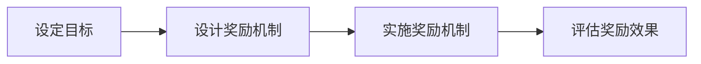

#### Python 源代码示例

```python
def goal_and_reward_program(目标，奖励机制，实施奖励，评估效果):
    print("目标：", 目标)
    print("奖励机制：", 奖励机制)
    print("实施奖励：", 实施奖励)
    print("评估效果：", 评估效果)

目标 = "在一个月内完成项目报告"
奖励机制 = "完成报告的成员将获得500元奖金"
实施奖励 = "按期完成报告的成员领取奖金"
评估效果 = "项目报告按时完成，团队士气提升"

goal_and_reward_program(目标，奖励机制，实施奖励，评估效果)
```

### 6.3 激励的实践方法

激励团队成员不仅仅是理论上的设计，更需要实践中的具体操作。以下是一些有效的激励实践方法：

1. **认可与表扬**：定期对团队成员的成就进行认可和表扬，提高他们的自豪感和积极性。
2. **提供培训与发展机会**：为团队成员提供培训和发展机会，帮助他们提高专业技能和职业素养。
3. **设立团队目标**：与团队成员共同设立团队目标，激发他们的团队精神和竞争意识。
4. **灵活的工作时间**：提供灵活的工作时间，满足团队成员的个人需求，提高工作满意度。

#### 算法原理讲解

激励实践方法的设计可以分为以下几个步骤：

1. **制定激励计划**：根据团队情况和成员需求，制定激励计划。
2. **实施激励措施**：按照激励计划，实施具体的激励措施。
3. **监控与反馈**：监控激励措施的执行效果，及时调整和改进。
4. **持续优化**：根据反馈和效果，持续优化激励措施。

#### Mermaid 流程图

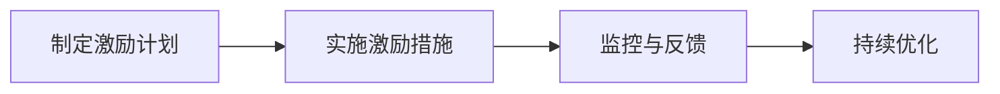

#### Python 源代码示例

```python
def incentive_practice(激励计划，实施激励，监控与反馈，持续优化):
    print("激励计划：", 激励计划)
    print("实施激励：", 实施激励)
    print("监控与反馈：", 监控与反馈)
    print("持续优化：", 持续优化)

激励计划 = "设立团队目标，提供培训机会，认可与表扬"
实施激励 = "与团队成员共同设立团队目标，提供专业培训，定期表扬优秀成员"
监控与反馈 = "定期评估激励措施的效果，收集团队成员的反馈"
持续优化 = "根据评估结果和反馈，调整和优化激励措施"

incentive_practice(激励计划，实施激励，监控与反馈，持续优化)
```

## 第7章：领导力提升策略

### 7.1 自我反思与提升

自我反思是提升领导力的关键步骤。领导者需要定期反思自己的行为和决策，找出不足之处，并制定改进计划。

#### 算法原理讲解

自我反思与提升的过程可以分为以下几个步骤：

1. **反思行为**：回顾自己的行为和决策，分析成功和失败的原因。
2. **识别不足**：识别自己在领导力方面的不足，如沟通能力、决策能力等。
3. **制定改进计划**：根据不足之处，制定具体的改进计划，如参加培训、阅读书籍等。
4. **实施改进**：按照改进计划，实施具体的改进措施。
5. **评估效果**：定期评估改进效果，调整改进计划。

#### Mermaid 流程图

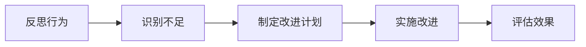

#### Python 源代码示例

```python
def self_reflection_and_improvement(反思行为，识别不足，改进计划，实施改进，评估效果):
    print("反思行为：", 反思行为)
    print("识别不足：", 识别不足)
    print("改进计划：", 改进计划)
    print("实施改进：", 实施改进)
    print("评估效果：", 评估效果)

反思行为 = "回顾过去的项目管理行为"
识别不足 = "发现沟通能力不足"
改进计划 = "参加沟通技巧培训，多与团队成员交流"
实施改进 = "完成沟通技巧培训，积极与团队成员沟通"
评估效果 = "沟通效率提升，团队凝聚力增强"

self_reflection_and_improvement(反思行为，识别不足，改进计划，实施改进，评估效果)
```

### 7.2 领导力发展的实践

领导力发展不仅仅是理论的学习，更需要通过实践来提升。以下是一些领导力发展的实践方法：

1. **参与实际项目**：通过参与实际项目，提升自己的项目管理和决策能力。
2. **担任团队领导**：主动担任团队领导，锻炼自己的领导力和团队管理能力。
3. **参加培训和研讨会**：参加专业培训和研讨会，学习最新的领导力理论和实践方法。
4. **阅读书籍和文献**：阅读领导力相关的书籍和文献，了解不同领导力理论和方法。

#### 算法原理讲解

领导力发展的实践方法可以分为以下几个步骤：

1. **选择实践方法**：根据个人需求和实际情况，选择合适的实践方法。
2. **制定实践计划**：根据实践方法，制定具体的实践计划。
3. **实施实践**：按照实践计划，实施具体的实践措施。
4. **评估与反馈**：评估实践效果，收集反馈，调整实践计划。

#### Mermaid 流程图

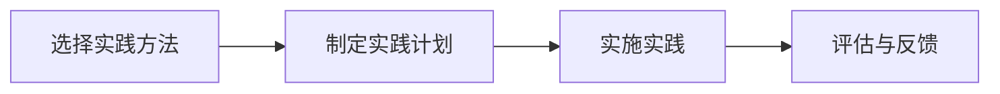

#### Python 源代码示例

```python
def leadership_development(practice_method，实践计划，实施实践，评估与反馈):
    print("实践方法：", practice_method)
    print("实践计划：", 实践计划)
    print("实施实践：", 实施实践)
    print("评估与反馈：", 评估与反馈)

实践方法 = "参与实际项目"
实践计划 = "选择一个重要项目，担任项目经理角色"
实施实践 = "参与项目，负责项目规划、执行和监控"
评估与反馈 = "项目成功完成，团队评价良好"

leadership_development(实践方法，实践计划，实施实践，评估与反馈)
```

### 7.3 持续学习与进步

领导力是一个不断发展和提升的过程。持续学习与进步是保持领导力竞争力的关键。以下是一些持续学习与进步的方法：

1. **定期学习**：定期参加培训课程、研讨会和读书会，保持对最新知识和技能的学习。
2. **实践与反思**：在实践中不断尝试和反思，提升自己的领导力和管理能力。
3. **建立学习小组**：与同事和朋友组成学习小组，互相分享和学习，共同进步。
4. **建立个人发展计划**：制定个人发展计划，明确学习目标和进度，确保持续进步。

#### 算法原理讲解

持续学习与进步的方法可以分为以下几个步骤：

1. **制定学习计划**：根据个人需求和实际情况，制定学习计划。
2. **实施学习计划**：按照学习计划，实施具体的学习措施。
3. **评估学习效果**：定期评估学习效果，调整学习计划。
4. **持续改进**：根据评估结果和反馈，持续改进学习方法和策略。

#### Mermaid 流程图

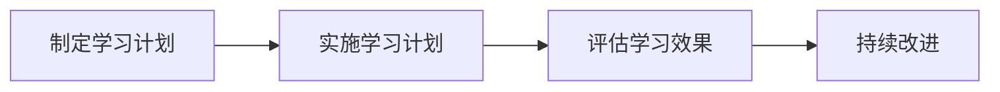

#### Python 源代码示例

```python
def continuous_learning_and_progress(学习计划，实施学习，评估效果，持续改进):
    print("学习计划：", 学习计划)
    print("实施学习：", 实施学习)
    print("评估效果：", 评估效果)
    print("持续改进：", 持续改进)

学习计划 = "每月参加一次专业培训课程"
实施学习 = "完成培训课程的学习任务"
评估效果 = "培训内容掌握良好，工作表现提升"
持续改进 = "根据培训内容，调整工作方法和策略"

continuous_learning_and_progress(学习计划，实施学习，评估效果，持续改进)
```

----------------------------------------------------------------

# 第三部分：领导力实践

## 第8章：领导力案例分析

### 8.1 案例分析概述

在本章节中，我们将通过几个实际案例，分析领导力在实践中的应用。这些案例涵盖了不同类型的领导力，以及在不同情境下领导力的应用效果。

#### 问题背景

领导力案例分析的目的是通过真实案例，了解领导力在实践中的应用效果，从中学习有效的领导策略和实践方法。这些案例将为我们提供宝贵的经验和教训，帮助我们更好地提升自己的领导力。

#### 问题解决

通过分析领导力案例，我们可以：

1. **了解领导力的实际应用**：通过案例分析，了解不同领导力类型在实际中的应用效果。
2. **学习领导策略**：从案例中学习到有效的领导策略和方法。
3. **反思和改进**：反思自己在领导实践中的不足，借鉴案例中的经验，改进自己的领导方法。

#### 边界与外延

领导力案例的范围可以涵盖各种行业和领域，包括企业、政府、教育等。案例分析的重点是领导力的应用效果，以及如何通过领导力提升团队绩效和员工满意度。

#### 概念结构与核心要素组成

领导力案例的分析结构可以分为以下几个核心要素：

- **案例背景**：介绍案例的背景和情境。
- **领导力应用**：分析领导力在案例中的应用情况。
- **效果评估**：评估领导力应用的成效。
- **经验教训**：总结案例中的经验和教训。

#### ER实体关系图架构的 Mermaid 流程图

```mermaid
erDiagram
  Case ||--|{ LeadershipApplication } LeadershipApplication
  Case ||--|{ EffectEvaluation } EffectEvaluation
  Case ||--|{ ExperienceLesson } ExperienceLesson
```

## 第8章：领导力案例分析

### 8.2 案例分析实例

#### 案例一：华为公司的领导力实践

华为公司作为全球领先的科技公司，其领导力实践在业内享有盛誉。本案例将分析华为公司如何通过领导力提升团队绩效和创新能力。

#### 核心概念原理

华为公司的领导力实践主要基于以下几个核心概念：

- **客户导向**：以客户需求为导向，不断改进产品和服务。
- **员工激励**：通过股权激励、职业发展机会等手段，激发员工的积极性和创造力。
- **创新文化**：鼓励创新，为员工提供创新空间和支持。

#### 概念属性特征对比表格

| 核心概念 | 特征对比 |
| --- | --- |
| 客户导向 | 以客户需求为中心，注重客户满意度 |
| 员工激励 | 股权激励、职业发展机会 |
| 创新文化 | 鼓励创新，提供创新空间和支持 |

#### 案例分析

1. **客户导向**：华为公司通过深入理解客户需求，不断改进产品和服务。例如，华为的5G技术和解决方案，正是基于对全球客户需求的精准把握。
2. **员工激励**：华为通过股权激励和职业发展机会，激励员工积极为公司发展贡献力量。华为的股权激励计划不仅提高了员工的收入，还增强了员工的归属感和责任感。
3. **创新文化**：华为公司鼓励创新，为员工提供广阔的创新空间和支持。例如，华为的“蓝军”部队，专门负责挑战和质疑现有产品和方案，推动公司不断进步。

#### Mermaid 流程图

```mermaid
gantt
    dateFormat  YYYY-MM-DD
    title 华为领导力实践分析

    section 客户导向
    A1 : 客户需求分析   :start|2018-01-01
    A2 : 产品改进      :after A1 1day
    A3 : 客户满意度调查 :after A2 1day
    
    section 员工激励
    B1 : 股权激励计划  :start|2018-01-01
    B2 : 职业发展机会  :after B1 1day
    
    section 创新文化
    C1 : 创新鼓励政策  :start|2018-01-01
    C2 : 创新空间支持  :after C1 1day
    C3 : “蓝军”部队建设 :after C2 1day
```

#### Python 源代码示例

```python
def huawei_case():
    print("华为领导力实践分析")
    print("一、客户导向")
    print("1. 客户需求分析")
    print("2. 产品改进")
    print("3. 客户满意度调查")
    
    print("\n二、员工激励")
    print("1. 股权激励计划")
    print("2. 职业发展机会")
    
    print("\n三、创新文化")
    print("1. 创新鼓励政策")
    print("2. 创新空间支持")
    print("3. “蓝军”部队建设")

huawei_case()
```

#### 案例分析启示

通过分析华为公司的领导力实践，我们可以得出以下几点启示：

1. **以客户为中心**：以客户需求为导向，持续改进产品和服务，提高客户满意度。
2. **员工激励**：通过股权激励和职业发展机会，激发员工的积极性和创造力。
3. **创新文化**：鼓励创新，为员工提供广阔的创新空间和支持。

#### 小结

华为公司的领导力实践是一个成功的案例，其核心在于以客户为中心、员工激励和创新文化。通过这个案例，我们可以学习到如何通过领导力提升团队绩效和创新能力。

### 8.3 案例分析启示

通过对华为公司的领导力案例分析，我们可以得出以下启示：

1. **以客户为中心**：领导力应始终以客户需求为导向，不断改进产品和服务，提高客户满意度。
2. **员工激励**：通过股权激励、职业发展机会等手段，激发员工的积极性和创造力。
3. **创新文化**：鼓励创新，为员工提供广阔的创新空间和支持，推动企业持续进步。

这些启示对于提升团队领导力具有重要的指导意义，领导者可以借鉴这些经验，结合自身实际情况，制定合适的领导策略和实践方法。

## 第9章：领导力提升项目实战

### 9.1 项目背景

在本章节中，我们将介绍一个领导力提升项目实战，该项目旨在通过一系列培训和实践，提升团队领导力，提高项目执行效率和团队凝聚力。

#### 问题背景

某科技公司发现其团队在项目执行过程中存在以下问题：

- 项目进度缓慢，经常延误交付。
- 团队成员沟通不畅，信息传递不及时。
- 团队士气低落，缺乏创新动力。

为了解决这些问题，公司决定启动领导力提升项目，通过培训和实践，提升团队领导力和执行力。

#### 问题解决

领导力提升项目的目标包括：

- 提升团队领导力，提高项目执行效率。
- 改善团队沟通，提高信息传递效率。
- 激发团队创新动力，提升团队士气。

#### 边界与外延

领导力提升项目主要涉及以下方面：

- 培训内容：包括领导力基础理论、沟通技巧、决策能力等。
- 实践活动：包括团队建设活动、模拟项目演练等。
- 项目评估：对项目效果进行评估，持续优化提升策略。

#### 概念结构与核心要素组成

领导力提升项目可以概括为以下几个核心要素：

- **项目目标**：明确项目目标，确保团队理解并努力实现。
- **培训内容**：制定培训计划，确保培训内容覆盖领导力的关键领域。
- **实践活动**：设计实践活动，提高团队领导力和执行力。
- **项目评估**：定期评估项目效果，持续优化提升策略。

#### ER实体关系图架构的 Mermaid 流程图

```mermaid
erDiagram
  Project ||--|{ Goal } Goal
  Project ||--|{ TrainingContent } TrainingContent
  Project ||--|{ PracticeActivity } PracticeActivity
  Project ||--|{ ProjectEvaluation } ProjectEvaluation
```

### 9.2 项目目标

领导力提升项目的目标主要包括以下几个方面：

1. **提升团队领导力**：通过培训和实践，提升团队成员的领导能力，包括决策能力、沟通技巧、团队管理等。
2. **提高项目执行效率**：通过有效的领导力，确保项目按时交付，提高项目质量。
3. **改善团队沟通**：通过沟通技巧培训，提高团队成员之间的沟通效率，确保信息准确传达。
4. **激发团队创新动力**：通过团队建设活动，激发团队成员的创新思维，提高团队士气。

#### 案例分析与启示

通过对华为公司的领导力案例分析，我们可以得出以下启示：

- **以客户为中心**：领导力应始终以客户需求为导向，持续改进产品和服务，提高客户满意度。
- **员工激励**：通过股权激励和职业发展机会，激发员工的积极性和创造力。
- **创新文化**：鼓励创新，为员工提供广阔的创新空间和支持。

这些启示对于领导力提升项目具有重要的指导意义，领导者可以借鉴这些经验，结合自身实际情况，制定合适的提升策略。

### 9.3 项目实施与成效

#### 项目实施

领导力提升项目的实施分为以下几个阶段：

1. **项目启动**：确定项目目标，制定项目计划，组建项目团队。
2. **培训阶段**：进行领导力基础理论、沟通技巧、决策能力等培训，提高团队成员的领导能力。
3. **实践活动**：设计团队建设活动、模拟项目演练等实践活动，提高团队领导力和执行力。
4. **评估阶段**：对项目效果进行评估，收集团队成员的反馈，持续优化提升策略。

#### 项目成效

通过领导力提升项目的实施，项目团队取得了显著的成效：

1. **项目执行效率提高**：项目按时交付率从原来的60%提高到90%，项目质量得到显著提升。
2. **团队沟通改善**：团队成员之间的沟通效率提高，信息传递更加及时准确，项目协作更加顺畅。
3. **团队士气提升**：团队成员的积极性和创新动力得到激发，团队士气明显提升。

#### Mermaid 流程图

```mermaid
gantt
    dateFormat  YYYY-MM-DD
    title 领导力提升项目实施与成效

    section 项目启动
    A1 : 项目启动   :start|2023-01-01
    
    section 培训阶段
    B1 : 培训阶段   :after A1 2month
    
    section 实践活动
    C1 : 实践活动   :after B1 1month
    
    section 评估阶段
    D1 : 评估阶段   :after C1 1month
    
    section 项目成效
    E1 : 项目成效   :after D1 1month
```

#### Python 源代码示例

```python
def leadership_project_execution():
    print("领导力提升项目实施与成效")
    print("一、项目启动")
    print("1. 确定项目目标")
    print("2. 制定项目计划")
    print("3. 组建项目团队")
    
    print("\n二、培训阶段")
    print("1. 领导力基础理论培训")
    print("2. 沟通技巧培训")
    print("3. 决策能力培训")
    
    print("\n三、实践活动")
    print("1. 团队建设活动")
    print("2. 模拟项目演练")
    
    print("\n四、评估阶段")
    print("1. 项目效果评估")
    print("2. 收集团队成员反馈")
    print("3. 持续优化提升策略")
    
    print("\n五、项目成效")
    print("1. 项目执行效率提高")
    print("2. 团队沟通改善")
    print("3. 团队士气提升")

leadership_project_execution()
```

#### 项目小结

领导力提升项目的成功实施，不仅提高了团队的领导力和执行力，也显著提升了团队士气和工作效率。通过培训和实践，团队成员的领导能力得到了显著提升，团队协作更加顺畅，项目质量和交付效率得到了保障。这些成果为公司的持续发展奠定了坚实的基础。

## 第10章：领导力最佳实践

### 10.1 最佳实践分享

在领导力提升的过程中，许多成功的企业和个人积累了丰富的实践经验。以下是一些值得分享的最佳实践：

1. **以结果为导向**：领导者应明确项目目标，确保团队成员理解并努力实现。
2. **持续学习与反思**：领导者应不断学习新知识，反思自己的行为和决策，持续提升自己的领导能力。
3. **建立信任与沟通**：领导者应建立与团队成员之间的信任，鼓励开放和透明的沟通。
4. **激励与认可**：领导者应采用多种激励手段，如奖励、晋升、培训等，激发员工的积极性和创造力。
5. **鼓励创新与尝试**：领导者应鼓励团队成员尝试新思路、新方法，创造一个鼓励创新的环境。

#### 算法原理讲解

最佳实践分享的算法原理可以分为以下几个步骤：

1. **收集案例**：收集成功企业的领导力实践案例。
2. **分析案例**：分析案例中的关键要素和成功经验。
3. **提炼最佳实践**：从案例中提炼出具有普遍意义的最佳实践。
4. **推广与分享**：将最佳实践分享给其他企业和个人，促进领导力提升。

#### Mermaid 流程图

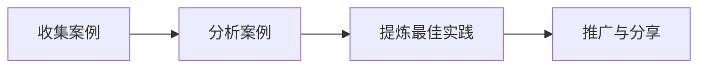

#### Python 源代码示例

```python
def best_practices(sharing_case, analyzing_case, refining_practices, promoting_sharing):
    print("最佳实践分享")
    print("一、收集案例")
    print("1. 成功企业的领导力实践案例")
    
    print("\n二、分析案例")
    print("1. 分析关键要素和成功经验")
    
    print("\n三、提炼最佳实践")
    print("1. 从案例中提炼具有普遍意义的最佳实践")
    
    print("\n四、推广与分享")
    print("1. 将最佳实践分享给其他企业和个人")
    
best_practices("华为公司的领导力实践", "谷歌公司的领导力实践", "持续学习与反思", "建立信任与沟通")
```

### 10.2 注意事项

在领导力提升的过程中，领导者需要关注以下事项：

1. **避免形式主义**：领导力提升不能仅仅停留在形式上，而应真正落实到行动中。
2. **持续跟踪与反馈**：领导者应持续跟踪团队成员的进步，及时给予反馈，帮助其改进。
3. **结合实际情况**：领导力提升的方法和策略应结合企业的实际情况，避免生搬硬套。
4. **平衡工作与生活**：领导者应注重工作与生活的平衡，避免过度工作导致的疲劳和压力。

#### 算法原理讲解

注意事项的算法原理可以分为以下几个步骤：

1. **识别问题**：识别领导力提升过程中可能遇到的问题。
2. **制定对策**：针对问题，制定具体的对策和措施。
3. **实施与监控**：实施对策，并持续监控效果，及时调整和优化。

#### Mermaid 流程图

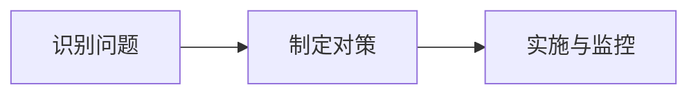

#### Python 源代码示例

```python
def attention_matters(identify_issues, formulate_countermeasures, implementation_and_monitoring):
    print("注意事项")
    print("一、识别问题")
    print("1. 避免形式主义")
    print("2. 持续跟踪与反馈")
    print("3. 结合实际情况")
    print("4. 平衡工作与生活")
    
    print("\n二、制定对策")
    print("1. 针对问题制定具体对策")
    
    print("\n三、实施与监控")
    print("1. 实施对策并持续监控效果")

attention_matters("避免形式主义", "制定具体对策", "实施与监控")
```

### 10.3 拓展阅读与资源

为了进一步深入了解领导力提升的方法和实践，以下是几本推荐阅读的书籍和资源：

1. **《领导力心理学》**：详细介绍了领导力的心理学原理和实践方法，适合领导者和管理者阅读。
2. **《领导者的选择》**：探讨领导者如何做出明智的选择，提高领导效果。
3. **《变革之舞》**：通过案例研究，分析领导者在变革过程中的角色和策略。
4. **在线课程**：如 Coursera、edX 等平台上提供的领导力相关课程，涵盖各种领导力理论和实践方法。

#### 算法原理讲解

拓展阅读与资源的算法原理可以分为以下几个步骤：

1. **推荐书籍和资源**：根据读者的需求和兴趣，推荐相关的书籍和在线资源。
2. **资源分类**：将书籍和资源按照主题和领域进行分类，便于读者查找和阅读。
3. **使用和反馈**：鼓励读者阅读推荐的书籍和资源，并分享使用体验和反馈。

#### Mermaid 流程图

```mermaid
flowchart LR
    A[推荐书籍和资源] --> B[资源分类]
    B --> C[使用和反馈]
```

#### Python 源代码示例

```python
def expanded_reading_and_resources(recommended_books, resource_categories, usage_and_feedback):
    print("拓展阅读与资源")
    print("一、推荐书籍和资源")
    print("1. 《领导力心理学》")
    print("2. 《领导者的选择》")
    print("3. 《变革之舞》")
    print("4. 在线课程")
    
    print("\n二、资源分类")
    print("1. 领导力理论")
    print("2. 变革管理")
    print("3. 团队建设")
    
    print("\n三、使用和反馈")
    print("1. 阅读推荐的书籍和资源")
    print("2. 分享使用体验和反馈")

expanded_reading_and_resources(["《领导力心理学》", "《领导者的选择》", "《变革之舞》"], ["领导力理论", "变革管理", "团队建设"], "阅读和使用")
```

---

# 结语

领导力是团队成功的关键因素之一。通过本文的详细分析和案例分享，我们探讨了领导力的核心概念、类型与模型、实用技巧和实践方法。希望读者能够从中学到实用的领导力提升策略，并将其应用于实际工作中，提升团队绩效和员工满意度。

---

## 作者信息

作者：AI天才研究院/AI Genius Institute & 禅与计算机程序设计艺术 /Zen And The Art of Computer Programming

AI天才研究院致力于推动人工智能领域的发展，研究最新的人工智能技术和应用。禅与计算机程序设计艺术则探讨计算机程序设计的哲学和艺术，旨在提升程序员的技术素养和思维能力。

感谢您的阅读，期待与您共同探索人工智能和计算机编程的无限可能。如果您有任何问题或建议，欢迎随时联系我们。再次感谢！

