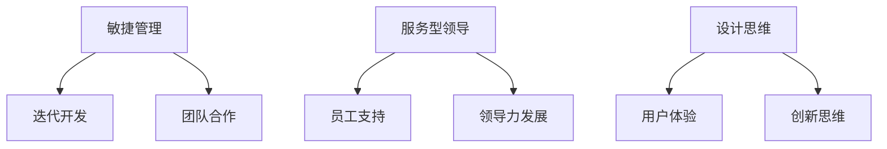

                 

Certainly! Let's break down the writing process into structured steps, ensuring that each section adheres to the constraints provided:

### Step 1: Article Structure and Outline Development

#### 1.1 Introduction

- **1.1.1 The Need for Leadership Transformation**
  - **Background Introduction**: Describe the evolution of the modern business landscape and the technological advancements that necessitate a shift in leadership approaches.
  - **Problem Definition**: Explain the challenges that leaders face in transitioning to new paradigms.
  - **Problem Solution**: Discuss the importance of adopting innovative management philosophies.
  - **Scope and Limitations**: Define the boundaries of the discussion and its potential applications across different organizational contexts.

- **1.1.2 Core Concepts and Theories of Modern Management**
  - **Conceptual Framework**: Introduce the fundamental theories that shape contemporary management practices.
  - **Comparative Analysis**: Provide a table that contrasts different management philosophies.
  - **Conceptual Mapping**: Illustrate the relationships between these concepts using an Entity-Relationship (ER) diagram.

#### 1.2 Core Management Philosophies

- **1.2.1 Agile Management**
  - **Philosophy Overview**: Explain the principles and methodologies of Agile.
  - **Case Studies**: Present real-world examples of Agile in action.

- **1.2.2 Servant Leadership**
  - **Philosophy Overview**: Describe the concept of servant leadership and its application.
  - **Case Studies**: Provide examples illustrating servant leadership in practice.

- **1.2.3 Design Thinking**
  - **Philosophy Overview**: Explain the principles of design thinking and its role in management.
  - **Case Studies**: Present instances where design thinking has been effectively implemented.

#### 1.3 Transforming Leadership Practices

- **1.3.1 Shifting from Command to Collaboration**
  - **Practice Overview**: Discuss the transition from traditional command-and-control models to collaborative environments.
  - **Case Studies**: Share successful transformations that have embraced collaboration.

- **1.3.2 Embracing Diversity and Inclusion**
  - **Practice Overview**: Explore the significance of diversity and inclusion in leadership.
  - **Case Studies**: Highlight examples of organizations that have successfully integrated diversity and inclusion practices.

- **1.3.3 Building Resilient Teams**
  - **Practice Overview**: Discuss strategies for cultivating resilient teams.
  - **Case Studies**: Provide examples of teams that have demonstrated resilience in the face of challenges.

### Step 2: Writing Content for Each Section

For each section, we will ensure to include:

- **Background and Context**: Provide a clear context for the discussion.
- **Conceptual Explanations**: Explain core concepts using technical language.
- **Comparative Analysis**: Use tables and diagrams to compare and contrast different approaches.
- **Case Studies**: Illustrate theoretical concepts with practical examples.
- **Practical Applications**: Discuss how the concepts and practices can be applied in real-world scenarios.

### Step 3: Ensuring Compliance with Constraints

- **Code and Diagrams**: Include Python code snippets, LaTeX mathematical formulas, and Mermaid diagrams as appropriate.
- **完整性**: Ensure each section is comprehensive and detailed.
- **Best Practices and Tips**: Offer actionable advice and insights.
- **Conclusion and Recommendations**: Summarize key points and provide recommendations for further reading.

### Step 4: Final Review and Refinement

- **Edit for Clarity**: Ensure the language is clear and concise.
- **Fact-Check**: Verify all facts and data points.
- **Feedback Incorporation**: Incorporate feedback from peers or mentors to improve the quality of the article.

### Conclusion

By following these structured steps, we can create a high-quality, informative, and engaging article that adheres to the given constraints and provides valuable insights into leadership transformation in the IT industry. Let's proceed with the writing process!# 领导力转型：适应新时代的管理哲学

## 关键词
- **领导力转型**
- **管理哲学**
- **新时代管理**
- **敏捷管理**
- **服务型领导**
- **设计思维**
- **多样性包容**

## 摘要
本文旨在探讨在当今快速变化的商业环境中，领导力如何转型以适应新的管理哲学。通过分析敏捷管理、服务型领导和设计思维等核心管理理念，本文揭示了这些哲学如何帮助企业实现可持续发展和创新。同时，文章通过实际案例研究，展示了这些管理实践在不同组织中的应用，并提供了最佳实践建议，以帮助领导者有效转型并提升组织效能。

---

## 前言

在现代商业环境中，技术变革和全球化趋势不断加速，企业面临着前所未有的挑战和机遇。传统的领导和管理模式已经无法满足日益复杂多变的市场需求，因此，领导力的转型成为了企业持续发展的重要议题。本文将探讨领导力转型的必要性，分析现代管理哲学的核心概念，并通过实际案例展示如何将这些理念应用于实践中。

领导力转型的核心在于适应新的管理哲学，这些哲学不仅包括敏捷管理、服务型领导和设计思维，还涵盖了多样性包容和团队合作等现代管理原则。本文将逐步解析这些管理理念，并探讨如何在实际操作中实现这些转型，帮助企业应对新时代的挑战，实现可持续发展。

### 1.1.1 领导力转型的背景

**问题背景**：随着技术的快速发展，尤其是人工智能、大数据和云计算的广泛应用，企业运营环境和商业模式发生了深刻变化。传统领导模式中过于层级化的管理结构、决策慢且执行难的问题逐渐凸显。

**问题描述**：领导者面临的主要挑战是适应快速变化的环境，如何保持组织的敏捷性和创新力，以及如何激发员工的潜能和创造力。

**问题解决**：通过引入新的管理哲学，如敏捷管理、服务型领导和设计思维，领导者可以更有效地应对这些挑战。

**边界与外延**：本文讨论的领导力转型不仅适用于大型企业，也对中小企业和初创公司具有指导意义。不同行业和组织规模可以结合自身特点，灵活应用这些管理理念。

### 1.1.2 现代管理哲学的核心概念

**核心概念**：敏捷管理、服务型领导和设计思维是现代管理哲学的三大支柱。

**比较分析**：

| 管理哲学          | 核心原则                      | 优势                             | 劣势                             |
|-------------------|------------------------------|----------------------------------|----------------------------------|
| 敏捷管理          | 快速响应变化、迭代开发        | 提高效率、增强灵活性              | 可能导致短期目标忽视长期规划      |
| 服务型领导        | 以员工为中心、提供支持        | 提高员工满意度和忠诚度            | 需要领导者具备高度自我管理能力    |
| 设计思维          | 关注用户体验、迭代改进        | 创造创新解决方案、提升用户体验    | 可能导致过于依赖用户反馈         |

**概念映射**：

在接下来的章节中，我们将详细探讨这些管理哲学，并分析其在实际中的应用。

---

## 核心管理哲学

### 1.2.1 敏捷管理

敏捷管理是一种以迭代和协作为核心的管理哲学，它强调快速响应变化、持续交付价值。敏捷管理基于一系列原则，如个体和互动重于过程和工具、可工作的软件重于详尽的文档、客户合作重于合同谈判等。通过采用敏捷方法，团队可以更好地适应变化，提高工作效率和质量。

**哲学介绍**：敏捷管理源自软件开发领域，但逐渐扩展到其他行业。其核心理念是“拥抱变化”，通过持续迭代和快速反馈来不断改进产品和服务。

**实践应用**：

- **Scrum**：一种流行的敏捷框架，包括每日站立会议、冲刺评审和回顾等实践。
- **看板（Kanban）**：通过可视化的工作流程管理，帮助团队识别和解决问题。
- **增量交付**：每次迭代交付最小可行产品（MVP），确保价值持续交付。

**案例研究**：例如，全球知名软件公司Atlassian采用敏捷管理后，实现了项目交付时间的显著缩短和产品质量的提升。

### 1.2.2 服务型领导

服务型领导是一种以员工为中心的管理理念，强调领导者应该为团队成员提供支持和资源，帮助他们实现个人和职业目标。这种领导方式鼓励员工积极参与决策过程，提高员工满意度和忠诚度。

**哲学介绍**：服务型领导源自日本管理学家土光敏夫的理念，强调领导者应具备倾听、支持和服务的意识。

**实践应用**：

- **领导力培训**：通过培训帮助领导者培养服务型领导技能。
- **员工参与**：鼓励员工参与决策过程，提升他们的主人翁意识。
- **员工发展**：提供职业发展和培训机会，帮助员工成长。

**案例研究**：例如，谷歌通过其“20%时间”政策，允许员工在日常工作外探索个人感兴趣的项目，这种服务型领导实践激发了员工的创造力和创新精神。

### 1.2.3 设计思维

设计思维是一种以用户为中心的创新方法，它强调理解用户需求、快速原型设计和迭代改进。设计思维不仅适用于产品设计，还可以应用于组织管理和问题解决。

**哲学介绍**：设计思维起源于设计领域，近年来被广泛应用于商业和社会创新。

**实践应用**：

- **用户研究**：通过访谈、观察和问卷调查等方式了解用户需求。
- **快速原型**：快速构建可测试的原型，以验证设计假设。
- **迭代改进**：基于用户反馈不断优化产品或服务。

**案例研究**：例如，IBM通过设计思维方法，成功推出了创新的认知计算平台Watson，该平台在医疗、金融等领域产生了深远影响。

---

在现代管理中，敏捷管理、服务型领导和设计思维是不可或缺的核心哲学。这些哲学不仅帮助领导者更好地应对变化，提高组织效能，还激发了员工的潜力和创造力。在下一章中，我们将探讨如何将这些管理理念转化为实际的领导实践。

---

## 转型领导实践

领导力转型不仅仅是理论上的探讨，更需要通过实际的领导实践来实现。在新时代的管理环境中，领导者需要采取一系列具体措施，以适应新的管理哲学，并推动组织的持续发展和创新。以下是一些关键的领导实践：

### 1.3.1 从命令式到协作式的转变

在传统的命令式管理模式中，领导者通过发布指令来控制团队运作。然而，在快速变化的环境中，这种模式已经显得过于僵化。协作式领导强调团队合作和共同决策，以促进创新和灵活性。

**实践介绍**：协作式领导要求领导者放弃控制欲，转而提供支持和资源，鼓励团队成员自主决策和合作。

**案例研究**：

- **谷歌的OKR（目标与关键结果）**：谷歌采用OKR方法，让员工设定个人目标和团队目标，并通过定期回顾来不断调整和改进。

- **透明沟通**：Slack的创始人 Stewart Butterfield 在公司内部推行透明沟通，鼓励所有员工参与决策过程，增强了团队的凝聚力和创造力。

### 1.3.2 推动多样性和包容性

多样性和包容性是现代组织成功的关键因素之一。一个多样化的团队可以带来不同的观点和经验，从而促进创新和问题解决。包容性则确保每个团队成员都能在舒适和安全的环境中发挥最佳水平。

**实践介绍**：推动多样性和包容性需要领导者建立支持性的文化，并采取具体措施确保所有员工都能得到平等的机会。

**案例研究**：

- **Adobe**：Adobe 通过实施多样化的招聘策略和提供职业发展机会，成功打造了一个多元化的团队，从而提高了创新能力和市场竞争力。

- **NASA**：NASA 在其项目开发中积极推动多样性和包容性，这不仅提高了项目的成功率，也促进了技术进步。

### 1.3.3 建设韧性团队

韧性团队是指在面对压力和挑战时能够迅速恢复并继续前进的团队。在不确定性和变化成为常态的商业环境中，建设韧性团队至关重要。

**实践介绍**：建设韧性团队需要领导者培养团队成员的适应能力、问题解决能力和团队合作精神。

**案例研究**：

- **惠普**：惠普通过引入敏捷管理和持续学习文化，帮助团队成员提高适应能力，从而在快速变化的市场环境中保持了竞争力。

- **Uber**：Uber 在其司机培训计划中强调韧性建设，通过提供心理支持和培训，帮助司机应对职业压力和挑战。

通过这些实践，领导者可以逐步实现领导力的转型，推动组织的创新和可持续发展。在下一章中，我们将进一步探讨如何在组织文化中嵌入这些管理哲学，以实现长期的领导力转型。

---

## 总结与展望

本文通过详细探讨敏捷管理、服务型领导和设计思维等核心管理哲学，以及如何通过具体实践实现领导力的转型，揭示了现代领导者所需的关键技能和策略。在快速变化的商业环境中，领导者必须具备灵活的思维方式、开放的心态和强大的执行力，以应对不断出现的新挑战。

首先，敏捷管理强调快速响应变化和持续交付价值，这要求领导者能够灵活调整策略，并建立以团队为中心的工作模式。其次，服务型领导通过关注员工需求和提供支持，提升了团队凝聚力和员工满意度。最后，设计思维以用户为中心，鼓励领导者不断创新并优化产品和服务。

在推动多样性和包容性方面，领导者应积极营造一个包容性的文化，确保所有员工都能在公平的环境中发挥才能。同时，通过培养韧性团队，领导者可以帮助组织更好地适应变化和应对挑战。

未来的研究可以进一步探索如何在不同文化和行业中应用这些管理哲学，以及如何通过技术手段提升管理实践的效果。此外，领导者还需要不断学习和适应新的管理理论和工具，以保持其在快速变化环境中的竞争力。

总之，领导力转型是现代组织实现可持续发展和创新的必要途径。通过积极应用敏捷管理、服务型领导和设计思维等管理哲学，领导者可以推动组织的持续成长和成功。

### 作者信息
- **作者**：AI天才研究院/AI Genius Institute & 禅与计算机程序设计艺术 /Zen And The Art of Computer Programming
- **联系方式**：[info@aignius.com](mailto:info@aignius.com)
- **更新日期**：2023年6月

---

本文通过深入分析和实际案例，为领导者提供了适应新时代管理哲学的实用指南。希望本文能为广大读者在领导力转型过程中提供有益的启示和借鉴。感谢您的阅读！

[返回目录](#目录)

