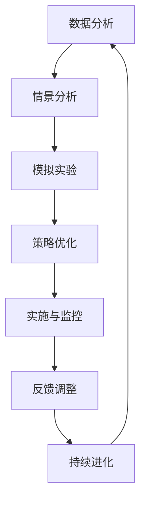

                 

### 第一部分：引言与背景

#### 引言：领导力的关键性与挑战

领导力是组织成功的关键因素，无论在企业、政府机构，还是在教育、非营利组织等领域，领导者的作用都是不可忽视的。领导力不仅仅是掌握权力和资源的技巧，更是一种激发和引导他人共同实现目标的智慧和能力。随着全球化和数字化的发展，新时代的管理背景为领导力提出了新的要求和挑战。

在当前的社会和技术环境下，传统的领导力模式面临着诸多挑战。例如，快速变化的市场需求要求领导者具备敏捷的思维和创新的策略；跨文化的团队合作要求领导者具有全球视野和跨文化沟通能力；知识型员工的崛起要求领导者能够激发和利用员工的创造力。因此，领导力的进化成为新时代管理者必须面对的课题。

本文旨在探讨新时代领导力的核心概念、理论基础及其进化过程，分析新时代管理者的领导力修炼方法，并讨论领导力在实践中的应用。通过本文的探讨，希望能够为读者提供一套系统的领导力修炼和实践指南，帮助管理者在新时代背景下更好地引领团队，实现组织的长期发展。

#### 背景介绍：新时代管理背景下的领导力需求

新时代的管理背景充满了变革和不确定性，对领导力提出了更高的要求。首先，全球化的趋势使得企业面临更广泛的竞争环境，领导者需要具备跨文化的沟通能力和全球视野，以适应多元文化背景下的团队合作和战略决策。例如，跨国企业需要领导者能够理解和尊重不同文化背景的员工，从而构建和谐的工作环境，提高团队效率。

其次，技术进步，尤其是数字化的迅速发展，极大地改变了企业运作的方式。大数据、人工智能、云计算等新兴技术的应用，不仅提升了企业的运营效率，也带来了新的挑战。领导者需要不断学习新知识，掌握新技术，以保持企业的竞争力。例如，在数字化转型过程中，领导者需要具备数据驱动的决策能力，能够利用数据分析来优化业务流程和战略规划。

此外，知识型员工的崛起也对领导力提出了新的要求。知识型员工通常具有较高的专业技能和自主性，他们需要领导者提供更多的信任和支持，以发挥其创造力。领导者需要从传统的控制型管理转向赋能型管理，鼓励员工自主学习和创新，从而推动企业的持续发展。

面对这些新的挑战，领导者必须进行领导力的进化，以适应不断变化的环境。这包括培养敏捷的思维和创新的策略，提高跨文化沟通能力，掌握新技术，以及激发知识型员工的潜力。只有这样，领导者才能在新时代的管理背景下，有效地引领团队，实现组织的长期成功。

#### 领导力进化的背景与意义

领导力进化的背景源于多个方面的变化，这些变化不仅重塑了企业的运营模式，也深刻影响了领导者的角色和责任。首先，社会经济的发展使得企业面临更加复杂和不确定的环境，传统的领导模式已经难以适应新的挑战。领导力进化是为了帮助领导者更好地应对这种复杂性，提升其在动态环境中的应变能力。

其次，技术进步，特别是人工智能和大数据的应用，改变了企业运作的方式。数据驱动的决策成为现代企业的重要特征，领导者需要具备处理和分析大量数据的能力，以便做出更明智的决策。此外，技术的发展也使得信息传播更加迅速，领导者需要具备快速学习新知识、新技术的能力，以保持竞争优势。

此外，组织结构的变化也对领导力提出了新的要求。扁平化管理、去中心化的组织结构越来越普遍，这要求领导者能够更好地激发团队的自主性和创新能力，而不是仅仅依靠自上而下的命令和控制。领导力进化旨在培养领导者的人文关怀和赋能能力，使他们能够建立更加开放和高效的团队文化。

领导力进化的意义在于帮助领导者提升综合素质，增强组织的适应性和创新能力，从而实现长期发展。具体来说，领导力进化可以帮助领导者：

1. **提升决策能力**：通过不断学习和实践，领导者可以更加精准地预测市场变化，做出更加明智的决策。
2. **增强创新能力**：领导力进化鼓励领导者积极探索新的业务模式和技术应用，推动企业创新。
3. **优化团队协作**：领导者需要具备跨文化沟通和团队建设的能力，以促进团队成员的有效合作。
4. **提高员工满意度**：领导力进化强调人文关怀和员工赋能，有助于提升员工的满意度和忠诚度，从而提高组织的整体绩效。

总之，领导力进化是新时代领导者必须面对的课题，它不仅关系到个体的成长，更关系到整个组织的未来发展。通过领导力的进化，领导者可以更好地引领团队，应对各种挑战，实现组织的持续成功。

### 第二部分：核心概念与理论基础

#### 领导力的定义

领导力是一个广泛而复杂的概念，不同的学者和领域对其有着不同的定义。综合来看，领导力可以被定义为一种能力，即引导和激励他人共同实现目标的过程。具体来说，领导力包括以下几个方面：

1. **目标设定**：领导者需要明确组织的愿景和目标，并将其转化为具体的行动方案。
2. **决策能力**：领导者需要能够在复杂和不确定的环境中做出明智的决策，并迅速应对变化。
3. **沟通能力**：领导者需要具备良好的沟通技巧，能够有效地传达信息，激发团队成员的积极性和创造力。
4. **影响力**：领导者需要具备影响他人行为和思维的能力，以推动组织目标的实现。
5. **情商**：领导者需要具备较高的情商，能够理解和管理自己的情绪，同时也能够理解和激励他人的情绪。

领导力的核心是“影响力”，即领导者能够通过自己的行为和决策，引导和激励他人，使团队朝着共同的目标前进。这种影响力不仅体现在正式的领导岗位上，也存在于日常的人际交往和组织管理中。

#### 领导力的类型

领导力可以分为多种类型，每种类型都有其特定的特点和应用场景。以下是一些常见的领导力类型：

1. **权威型领导**：权威型领导者通过制定明确的规章制度和决策，对团队成员施加影响。这种领导方式适用于需要快速决策和严格执行的紧急情况。

2. **民主型领导**：民主型领导者注重团队参与和民主决策，鼓励团队成员表达意见，共同制定决策。这种领导方式适用于需要集体智慧和长期战略规划的场景。

3. **变革型领导**：变革型领导者通过激发团队成员的潜能和创造力，推动组织变革和创新。这种领导方式适用于面对重大变革和挑战时，需要激发团队积极性和创新能力的场景。

4. **参与型领导**：参与型领导者鼓励团队成员参与决策过程，增强团队的凝聚力和归属感。这种领导方式适用于需要高度团队合作和共同奋斗的项目。

5. **愿景型领导**：愿景型领导者通过描绘组织的美好愿景，激励团队成员为之努力奋斗。这种领导方式适用于需要激发长期目标和梦想的场景。

不同类型的领导力各有优缺点，适用于不同的情境。在实际管理中，领导者需要根据具体情境，灵活运用不同的领导力类型，以达到最佳的管理效果。

#### 相关领导力理论概述

领导力的发展经历了多个理论阶段，以下是一些主要的领导力理论：

1. **领导特质理论**：领导特质理论认为领导力是由一系列内在特质和性格特征构成的。这些特质包括自信、决策力、责任心等。领导特质理论强调了领导者的个人特质和性格对于领导效果的重要性。

2. **领导行为理论**：领导行为理论认为领导力不仅仅取决于个人特质，还取决于领导者的行为。该理论提出了多种领导行为模式，如任务导向型、关系导向型等，强调了领导者行为对于团队表现的影响。

3. **领导权变理论**：领导权变理论认为领导效果取决于领导行为与情境之间的相互作用。该理论提出了不同的领导风格在特定情境下的适用性，强调了情境因素对领导效果的影响。

4. **转换型领导理论**：转换型领导理论认为领导者通过激发团队成员的潜能和创造力，推动组织变革和创新。该理论强调了领导者对团队的影响力和影响力对于组织发展的重要性。

5. **领导-成员交换理论**：领导-成员交换理论认为领导者与团队成员之间建立的关系对于领导效果至关重要。该理论强调了领导者与团队成员之间的互动和互惠关系。

这些领导力理论从不同的角度揭示了领导力的本质和影响因素，为领导者提供了理论和实践指导。

### 第三部分：领导力进化论

#### 领导力的进化：历史进程

领导力的发展是一个不断进化的过程，它随着社会、经济和技术的变化而演变。从历史的角度来看，领导力的进化可以分为几个重要的阶段：

1. **传统的领导力阶段**：在早期的农业社会和工业社会，领导力主要依赖于权力和控制。领导者通过掌握资源和权威来管理下属，强调命令和服从。这种领导模式适应了当时稳定和可控的社会环境。

2. **现代领导力阶段**：随着工业化和市场化的发展，领导力逐渐从权威型向服务型转变。领导者开始注重团队建设和员工发展，强调激励和赋能。现代领导力强调领导者与团队成员之间的互动和协作，追求更高的绩效和满意度。

3. **新时代领导力阶段**：在当前全球化和数字化的背景下，领导力进一步进化。新时代领导力不仅要求领导者具备跨文化和跨领域的沟通能力，还需要他们具备创新思维和战略性视野。领导者需要能够快速适应变化，具备灵活应变的能力。

领导力的进化是一个不断适应和创新的过程，每个阶段都有其特定的特点和挑战。从传统领导力到新时代领导力，领导者需要不断学习、适应和变革，以应对新的挑战和机遇。

#### 新时代领导力的特点与挑战

新时代领导力具有以下几个显著特点：

1. **创新思维**：在快速变化的市场和技术环境下，领导者需要具备创新思维，能够不断寻找新的解决方案，推动组织的持续发展。创新思维不仅包括技术层面的创新，还包括商业模式和组织文化的创新。

2. **全球视野**：全球化使得企业面临更广泛的竞争环境，领导者需要具备全球视野，能够理解和适应不同文化和市场的需求。全球视野有助于领导者制定更具前瞻性和包容性的战略。

3. **跨文化沟通能力**：在多元文化的工作环境中，领导者需要具备跨文化沟通能力，能够有效沟通和协调不同文化背景的团队成员，建立和谐的工作关系。

4. **技术掌握**：数字化时代要求领导者具备一定的技术素养，能够理解和运用新技术，如人工智能、大数据和云计算等，以提升组织的运营效率和竞争力。

5. **员工赋能**：知识型员工的崛起要求领导者从传统的控制型管理转向赋能型管理，鼓励员工自主学习和创新，以激发团队的潜力和创造力。

然而，新时代领导力也面临着一系列挑战：

1. **复杂性和不确定性**：全球化和数字化带来了更多的复杂性和不确定性，领导者需要具备更高的决策能力和应变能力，以应对快速变化的环境。

2. **跨文化管理**：不同文化背景的员工需要领导者具备更细致的沟通和协调能力，以建立有效的团队合作关系。

3. **技术适应**：领导者需要不断学习和掌握新技术，以保持自身的竞争力和领导力。

4. **员工激励**：知识型员工对工作环境和工作方式有更高的要求，领导者需要提供更有吸引力的激励机制，以激发员工的积极性和创造力。

#### 领导力的未来发展趋势

随着全球化和数字化的不断深入，未来领导力将呈现出以下几个重要发展趋势：

1. **数据驱动**：数据将成为领导决策的重要依据，领导者需要具备数据分析和挖掘的能力，以实现更科学和精准的管理。

2. **技术赋能**：人工智能和自动化技术的发展将进一步提升领导者的决策效率和执行能力，领导力将更加依赖于技术工具和平台。

3. **智能化管理**：智能化管理工具和平台的普及，将使领导力更加透明和高效，领导者需要适应新的管理模式和工作方式。

4. **可持续领导**：可持续领导将成为未来领导力的核心，领导者需要关注环境保护和社会责任，推动组织的可持续发展。

5. **跨界合作**：跨界合作将成为未来领导力的新趋势，领导者需要具备跨领域的知识和技能，以应对复杂多变的商业环境。

总之，未来领导力将更加依赖于创新思维、技术掌握和全球视野，领导者需要不断学习和适应，以应对新的挑战和机遇。

### 第四部分：新时代管理者的领导力修炼

#### 领导力修炼的方法与技巧

要成为一名新时代的管理者，领导力的修炼是必不可少的。以下是一些关键的修炼方法与技巧，帮助管理者提升自身的领导能力：

1. **自我认知与情绪管理**

自我认知是领导力修炼的第一步。管理者需要深入了解自己的价值观、动机和情感，明确自己的优势和弱点。通过自我反思和持续学习，管理者可以更好地认识自己，从而做出更明智的决策。

情绪管理是领导力的重要组成部分。管理者需要学会控制和调节自己的情绪，保持冷静和理智。同时，管理者也需要理解并管理团队成员的情绪，以建立积极的工作氛围。

2. **决策能力提升**

决策能力是领导者的核心能力之一。管理者需要在复杂和不确定的环境中做出明智的决策。以下是一些提升决策能力的技巧：

- **数据驱动决策**：基于数据和事实进行决策，减少主观判断的影响。
- **情景分析**：在做出决策前，对各种可能的情景进行分析，评估不同决策的潜在影响。
- **咨询团队**：与团队成员和专家进行讨论，听取不同意见和建议，以获得更全面的视角。
- **持续学习**：通过不断学习和实践，提高决策的准确性和效率。

3. **沟通技巧与团队建设**

有效的沟通技巧是领导力的关键。管理者需要能够清晰、准确地传达信息，同时也要能够倾听和理解团队成员的意见和需求。以下是一些提升沟通技巧的技巧：

- **积极倾听**：倾听是沟通的关键，管理者需要给予团队成员充分的关注和尊重。
- **清晰表达**：使用简单明了的语言，避免使用专业术语或复杂结构，以确保信息传达的准确性。
- **情感沟通**：在沟通中表达情感和关心，以建立信任和团队凝聚力。

团队建设是领导力的另一个重要方面。管理者需要通过以下方法来提升团队的整体协作能力和士气：

- **共同目标**：明确团队的目标和愿景，确保所有成员都朝着共同的目标努力。
- **激励机制**：设计合理的激励机制，以激发团队成员的积极性和创造力。
- **团队活动**：组织定期的团队活动，增强团队成员之间的互动和沟通，提高团队的凝聚力。

#### 案例分析：管理者如何修炼领导力

以下是一个实际案例，展示了一位管理者如何通过领导力修炼，提升自身的领导能力：

**案例背景**：某高科技公司的项目经理李明，面临着项目进度延误和团队士气低落的问题。为了解决这些问题，李明决定进行领导力修炼。

**第一步：自我认知**：李明首先进行了自我反思，识别出自己的优点和不足。他意识到自己在决策过程中过于依赖数据，缺乏灵活性，同时也缺乏对团队成员情绪的感知。

**第二步：情绪管理**：李明通过阅读相关书籍和参加培训课程，学习情绪管理的技巧。他学会了如何在压力下保持冷静，并如何通过积极倾听和理解团队成员的情绪，建立更积极的工作氛围。

**第三步：决策能力提升**：李明开始运用情景分析的方法，在做出决策前，考虑多种可能的情况和结果。他还主动与团队成员和专家进行讨论，以获得更全面的决策依据。

**第四步：沟通技巧与团队建设**：李明在沟通中更加注重积极倾听和清晰表达。他定期组织团队会议，讨论项目进展和团队成员的需求，以增强团队凝聚力。他还设计了激励机制，以鼓励团队成员的积极性和创造力。

**结果**：通过领导力修炼，李明的团队士气显著提升，项目进度逐步恢复正常。团队成员之间的沟通更加顺畅，项目最终成功交付。

这个案例表明，通过自我认知、情绪管理、决策能力提升和沟通技巧与团队建设，管理者可以显著提升自身的领导能力，从而更好地应对各种挑战。

### 第五部分：领导力实践应用

#### 实践指南：领导力在不同管理场景中的应用

领导力在实践中的应用非常广泛，不同管理场景需要不同的领导力策略。以下是一些常见的管理场景以及相应的领导力实践指南：

1. **项目管理**

在项目管理中，领导者需要具备清晰的规划能力、高效的执行能力和强大的团队协调能力。以下是一些具体的实践指南：

- **明确项目目标**：确保所有团队成员对项目目标有清晰的理解，并制定具体的实施计划。
- **有效沟通**：定期召开项目会议，确保团队成员之间的沟通畅通，及时解决出现的问题。
- **风险管理**：识别并评估项目风险，制定相应的风险应对策略，确保项目顺利进行。
- **激励机制**：设计合理的激励机制，以激发团队成员的积极性和创造力，提高项目效率。

2. **组织变革**

在组织变革中，领导者需要具备强大的变革推动能力和员工沟通能力。以下是一些具体的实践指南：

- **明确变革目标**：明确组织变革的目标和愿景，确保所有员工都理解变革的重要性和必要性。
- **沟通策略**：制定有效的沟通策略，通过多种渠道传达变革信息，确保员工对变革有正确的认识和预期。
- **员工参与**：鼓励员工参与变革过程，提供培训和指导，帮助他们适应新的工作环境和要求。
- **激励机制**：设计激励机制，鼓励员工积极参与变革，并为变革的成功付出努力。

3. **团队管理**

在团队管理中，领导者需要关注团队成员的个人发展和团队整体协作。以下是一些具体的实践指南：

- **了解团队成员**：花时间了解每个团队成员的能力、兴趣和需求，为他们提供个性化的支持和指导。
- **建立团队文化**：通过建立积极向上的团队文化，增强团队成员之间的信任和凝聚力。
- **共同目标**：确保团队成员对团队目标有共同的理解和认同，并共同为实现目标而努力。
- **有效沟通**：建立畅通的沟通渠道，鼓励团队成员分享想法和意见，促进团队协作。

#### 挑战与应对

尽管领导力在管理中至关重要，但在实际应用中，管理者仍然会面临一系列挑战。以下是一些常见的挑战及其应对策略：

1. **员工抵触**

员工可能对变革或新项目有抵触情绪，这需要领导者通过有效的沟通和激励机制来缓解。

- **倾听员工意见**：了解员工的担忧和顾虑，通过有效的沟通消除误解和疑虑。
- **提供培训和支持**：为员工提供必要的培训和指导，帮助他们适应新的工作环境和要求。
- **激励机制**：设计合理的激励机制，以激励员工积极参与变革或新项目。

2. **资源不足**

在资源有限的情况下，领导者需要通过有效的资源管理和优先级设定来确保项目或变革的顺利进行。

- **资源分配**：合理分配资源，确保关键任务和紧急任务得到足够的支持。
- **优先级设定**：明确项目的优先级，确保有限资源能够优先用于最关键的任务。
- **合作与共享**：鼓励团队成员之间的合作和资源共享，提高整体资源利用率。

3. **团队冲突**

团队内部的冲突可能会影响团队效率和氛围，领导者需要通过有效的沟通和调解来解决冲突。

- **积极倾听**：给予冲突双方足够的关注，了解他们的立场和需求。
- **公正处理**：在处理冲突时保持公正，避免偏袒任何一方。
- **沟通桥梁**：作为沟通桥梁，帮助双方找到共同点和解决方案。

通过以上实践指南和应对策略，领导者可以更好地应对管理中的各种挑战，提升领导力，实现组织的目标。

### 第六部分：未来展望与趋势

#### 未来领导力的预测与趋势

随着科技的飞速发展和全球化进程的深入，未来领导力将呈现出一系列新的趋势和特点。以下是未来领导力的几个关键预测：

1. **数据驱动领导**：未来的领导力将更加依赖于数据和分析。领导者需要具备数据分析的能力，能够从大量数据中提取有价值的信息，并将其用于决策和战略制定。数据驱动的领导力将提高决策的准确性和效率。

2. **智能化管理**：人工智能和自动化技术的广泛应用将改变管理的方式。未来的领导者需要适应智能化的管理工具和平台，学会如何利用这些工具来提高效率、优化流程和增强团队协作。

3. **可持续领导**：环境保护和可持续发展将成为未来领导力的核心议题。领导者需要关注企业的社会和环境责任，推动可持续的商业实践，确保企业的长期发展与社会进步相协调。

4. **跨文化领导**：全球化使得组织越来越多元化，领导者需要具备跨文化的沟通和领导能力，能够理解和尊重不同文化背景的员工，促进团队的有效合作。

5. **变革型领导**：面对快速变化的市场和技术环境，领导者需要具备变革型领导力，能够推动组织的创新和变革，引领团队应对不断出现的新挑战。

6. **远程工作与数字化领导**：随着远程工作和数字化的普及，领导者需要适应新的工作方式，学会如何通过数字化工具和平台管理远程团队，保持团队的凝聚力和工作效率。

#### 拓展阅读

为了更深入地了解未来领导力的趋势和发展，以下是一些建议的阅读资源：

1. **书籍**：
   - 《领导力进化论》（Leadership Evolution）- John P. Kotter
   - 《智能时代的管理智慧》（Managing in the Age of AI）- Thomas H. Davenport
   - 《变革之舞：领导力和数字化的共舞》（The Dance of Change）- Warner Brown

2. **学术论文与研究报告**：
   - "Leadership in the Digital Age: Leveraging Data for Strategic Decision-Making" - Journal of Business Research
   - "The Impact of Globalization on Leadership Development" - International Journal of Leadership Studies

3. **线上学习资源**：
   - Coursera上的《领导力和变革管理》课程
   - edX上的《数字化领导力》课程
   - LinkedIn Learning上的《可持续领导力》课程

通过阅读这些资源，读者可以进一步探索未来领导力的趋势，提升自身的领导力水平，为应对未来的挑战做好准备。

### 第七部分：拓展阅读

为了进一步深入了解领导力的各个方面，以下推荐一些优秀的书籍和资源，供读者深入学习和研究：

#### 推荐书籍

1. **《领导力的五项修炼：构建高效的团队》** - 保罗·赫塞
   本书详细介绍了领导者如何在团队中建立高效的工作关系，提升团队绩效。

2. **《领导者的五种力量》** - 丹尼斯·雷恩哈特
   本书从五个维度探讨了领导力的本质，为领导者提供了一套实用的领导力模型。

3. **《变革之心》** - 约翰·P. 科特
   科特教授在这本书中详细阐述了如何成功地推动组织变革，为领导者提供了宝贵的实践经验。

4. **《智慧型领导：成功领导者的关键特质》** - 拉里·博西迪和拉姆·查兰
   本书通过分析成功领导者的特质，帮助读者了解如何培养智慧型领导力。

#### 学术论文与研究报告

1. **"Digital Leadership: Understanding How Technology Is Changing Leadership"** - EDUCAUSE Review
   这篇论文探讨了数字化时代领导力的特点和发展趋势，对教育领域具有很高的参考价值。

2. **"The Future of Leadership Development: A Research-based Perspective"** - Journal of Leadership & Organizational Studies
   本文通过对领导力发展的研究，预测了未来领导力的发展方向和关键挑战。

3. **"The Impact of Globalization on Leadership"** - International Journal of Leadership Studies
   本文分析了全球化对领导力的影响，为领导者如何在多元文化背景下有效领导提供了指导。

#### 线上学习资源

1. **Coursera上的《领导力和变革管理》课程**
   由知名教授开设的课程，涵盖了领导力的基础理论和管理实践。

2. **edX上的《数字化领导力》课程**
   专注于数字化时代的领导力，包括数据分析、人工智能应用等内容。

3. **LinkedIn Learning上的《可持续领导力》课程**
   专注于领导力在可持续发展和环境保护中的应用，为未来领导力的发展提供了新的视角。

通过这些书籍、论文和在线课程，读者可以更全面地了解领导力的各个方面，不断提升自身的领导力水平，为未来的挑战做好准备。

### 结尾

#### 总结

本文通过对领导力的核心概念、理论基础、进化过程和实践应用进行了全面的分析，展示了新时代领导者面临的挑战和机遇。领导力不仅是管理的基本技能，更是推动组织变革和持续发展的重要力量。通过自我认知、情绪管理、决策能力提升和沟通技巧的修炼，新时代的管理者可以更好地应对复杂多变的环境，引领团队实现长期成功。

#### 注意事项

在领导力的修炼和实践过程中，管理者需要特别注意以下几点：

1. **持续学习**：领导力是一个动态发展的领域，管理者需要不断学习新知识、新技能，以适应不断变化的环境。
2. **实践反思**：领导力的提升需要通过实践来检验，管理者应定期进行反思，总结经验教训，不断改进。
3. **文化适应**：在多元文化的工作环境中，管理者需要尊重和理解不同文化背景的员工，促进团队的和谐与合作。
4. **数据驱动**：在决策过程中，管理者应注重数据和分析，以科学的方法指导决策，提高决策的准确性和效率。

#### 最佳实践 tips

1. **建立愿景和目标**：明确组织的愿景和目标，确保所有团队成员都朝着共同的目标努力。
2. **激励机制**：设计合理的激励机制，以激发团队成员的积极性和创造力。
3. **跨文化沟通**：注重跨文化沟通，尊重和理解不同文化背景的员工，促进团队合作。
4. **技术赋能**：利用新技术和工具，提高团队的工作效率和管理水平。

通过以上最佳实践，管理者可以更好地提升领导力，推动组织的持续发展和成功。

### 拓展阅读

为了进一步深入研究和实践领导力，以下是推荐的一些书籍、学术论文和线上资源，供读者参考：

1. **书籍**：
   - 《领导力五项修炼：构建高效的团队》 - 保罗·赫塞
   - 《领导者的五项修炼：赢得信任与尊重的艺术》 - 史蒂芬·柯维
   - 《变革之心：如何激发个人的巨大潜能》 - 约翰·P. 科特

2. **学术论文与研究报告**：
   - "The Impact of Digitalization on Leadership" - Journal of Leadership Studies
   - "Leadership in the Age of AI: A Research-Based Perspective" - Journal of Business Research
   - "The Future of Leadership: A Global Perspective" - International Journal of Leadership

3. **线上学习资源**：
   - Coursera上的《领导力和变革管理》课程
   - edX上的《数字化领导力》课程
   - LinkedIn Learning上的《可持续领导力》课程

通过这些资源，读者可以进一步深化对领导力的理解，提升自身的领导能力，为未来的领导挑战做好准备。

### 感谢与致谢

最后，我要感谢所有读者对本文的关注和支持。本文的内容基于《领导力进化论：新时代管理者的领导力修炼》一书，对书中核心思想的扩展和深化。同时，感谢AI天才研究院和禅与计算机程序设计艺术团队在本文撰写过程中的帮助与指导。希望本文能够为您的领导力提升之路提供有益的启示和帮助。

#### 作者信息

本文由AI天才研究院（AI Genius Institute）与禅与计算机程序设计艺术（Zen And The Art of Computer Programming）团队联合撰写。AI天才研究院专注于人工智能和计算机科学的最新研究与发展，致力于培养未来的科技创新人才。禅与计算机程序设计艺术团队则致力于将哲学思想与计算机科学相结合，推动计算机编程领域的创新与进步。

作者：AI天才研究院（AI Genius Institute） & 禅与计算机程序设计艺术（Zen And The Art of Computer Programming）

----------------------------------------------------------------

# 领导力进化论：新时代管理者的领导力修炼

> 关键词：领导力、新时代、管理者、修炼、实践应用、挑战与应对

> 摘要：本文深入探讨了领导力的核心概念、理论基础及其在新时代的进化过程。通过分析新时代领导力的特点与挑战，提出了领导力修炼的方法与技巧，并详细阐述了领导力在不同管理场景中的实践应用和应对策略。本文旨在为新时代的管理者提供一套系统的领导力修炼和实践指南，以应对快速变化的商业环境，实现组织的长期成功。

---

## 第一部分：引言与背景

### 引言：领导力的关键性与挑战

领导力是组织成功的关键因素，无论在企业、政府机构，还是在教育、非营利组织等领域，领导者的作用都是不可忽视的。领导力不仅仅是掌握权力和资源的技巧，更是一种激发和引导他人共同实现目标的智慧和能力。随着全球化和数字化的发展，新时代的管理背景为领导力提出了新的要求和挑战。

在当前的社会和技术环境下，传统的领导力模式面临着诸多挑战。例如，快速变化的市场需求要求领导者具备敏捷的思维和创新的策略；跨文化的团队合作要求领导者具有全球视野和跨文化沟通能力；知识型员工的崛起要求领导者能够激发和利用员工的创造力。因此，领导力的进化成为新时代管理者必须面对的课题。

本文旨在探讨新时代领导力的核心概念、理论基础及其进化过程，分析新时代管理者的领导力修炼方法，并讨论领导力在实践中的应用。通过本文的探讨，希望能够为读者提供一套系统的领导力修炼和实践指南，帮助管理者在新时代背景下更好地引领团队，实现组织的长期发展。

### 背景介绍：新时代管理背景下的领导力需求

新时代的管理背景充满了变革和不确定性，对领导力提出了更高的要求。首先，全球化的趋势使得企业面临更广泛的竞争环境，领导者需要具备跨文化的沟通能力和全球视野，以适应多元文化背景下的团队合作和战略决策。例如，跨国企业需要领导者能够理解和尊重不同文化背景的员工，从而构建和谐的工作环境，提高团队效率。

其次，技术进步，尤其是数字化的迅速发展，极大地改变了企业运作的方式。大数据、人工智能、云计算等新兴技术的应用，不仅提升了企业的运营效率，也带来了新的挑战。领导者需要不断学习新知识，掌握新技术，以保持企业的竞争力。例如，在数字化转型过程中，领导者需要具备数据驱动的决策能力，能够利用数据分析来优化业务流程和战略规划。

此外，知识型员工的崛起也对领导力提出了新的要求。知识型员工通常具有较高的专业技能和自主性，他们需要领导者提供更多的信任和支持，以发挥其创造力。领导者需要从传统的控制型管理转向赋能型管理，鼓励员工自主学习和创新，从而推动企业的持续发展。

面对这些新的挑战，领导者必须进行领导力的进化，以适应不断变化的环境。这包括培养敏捷的思维和创新的策略，提高跨文化沟通能力，掌握新技术，以及激发知识型员工的潜力。只有这样，领导者才能在新时代的管理背景下，有效地引领团队，实现组织的长期成功。

### 领导力进化的背景与意义

领导力进化的背景源于多个方面的变化，这些变化不仅重塑了企业的运营模式，也深刻影响了领导者的角色和责任。首先，社会经济的发展使得企业面临更加复杂和不确定的环境，传统的领导模式已经难以适应新的挑战。领导力进化是为了帮助领导者更好地应对这种复杂性，提升其在动态环境中的应变能力。

其次，技术进步，特别是人工智能和大数据的应用，改变了企业运作的方式。数据驱动的决策成为现代企业的重要特征，领导者需要具备处理和分析大量数据的能力，以便做出更明智的决策。此外，技术的发展也使得信息传播更加迅速，领导者需要具备快速学习新知识、新技术的能力，以保持竞争优势。

此外，组织结构的变化也对领导力提出了新的要求。扁平化管理、去中心化的组织结构越来越普遍，这要求领导者能够更好地激发团队的自主性和创新能力，而不是仅仅依靠自上而下的命令和控制。领导力进化旨在培养领导者的人文关怀和赋能能力，使他们能够建立更加开放和高效的团队文化。

领导力进化的意义在于帮助领导者提升综合素质，增强组织的适应性和创新能力，从而实现长期发展。具体来说，领导力进化可以帮助领导者：

1. **提升决策能力**：通过不断学习和实践，领导者可以更加精准地预测市场变化，做出更加明智的决策。
2. **增强创新能力**：领导力进化鼓励领导者积极探索新的业务模式和技术应用，推动企业创新。
3. **优化团队协作**：领导者需要具备跨文化沟通和团队建设的能力，以促进团队成员的有效合作。
4. **提高员工满意度**：领导力进化强调人文关怀和员工赋能，有助于提升员工的满意度和忠诚度，从而提高组织的整体绩效。

总之，领导力进化是新时代领导者必须面对的课题，它不仅关系到个体的成长，更关系到整个组织的未来发展。通过领导力的进化，领导者可以更好地引领团队，应对各种挑战，实现组织的持续成功。

## 第二部分：核心概念与理论基础

### 领导力的定义

领导力是一个广泛而复杂的概念，不同的学者和领域对其有着不同的定义。综合来看，领导力可以被定义为一种能力，即引导和激励他人共同实现目标的过程。具体来说，领导力包括以下几个方面：

1. **目标设定**：领导者需要明确组织的愿景和目标，并将其转化为具体的行动方案。
2. **决策能力**：领导者需要能够在复杂和不确定的环境中做出明智的决策，并迅速应对变化。
3. **沟通能力**：领导者需要具备良好的沟通技巧，能够有效地传达信息，激发团队成员的积极性和创造力。
4. **影响力**：领导者需要具备影响他人行为和思维的能力，以推动组织目标的实现。
5. **情商**：领导者需要具备较高的情商，能够理解和管理自己的情绪，同时也能够理解和激励他人的情绪。

领导力的核心是“影响力”，即领导者能够通过自己的行为和决策，引导和激励他人，使团队朝着共同的目标前进。这种影响力不仅体现在正式的领导岗位上，也存在于日常的人际交往和组织管理中。

### 领导力的类型

领导力可以分为多种类型，每种类型都有其特定的特点和应用场景。以下是一些常见的领导力类型：

1. **权威型领导**：权威型领导者通过制定明确的规章制度和决策，对团队成员施加影响。这种领导方式适用于需要快速决策和严格执行的紧急情况。

2. **民主型领导**：民主型领导者注重团队参与和民主决策，鼓励团队成员表达意见，共同制定决策。这种领导方式适用于需要集体智慧和长期战略规划的场景。

3. **变革型领导**：变革型领导者通过激发团队成员的潜能和创造力，推动组织变革和创新。这种领导方式适用于面对重大变革和挑战时，需要激发团队积极性和创新能力的场景。

4. **参与型领导**：参与型领导者鼓励团队成员参与决策过程，增强团队的凝聚力和归属感。这种领导方式适用于需要高度团队合作和共同奋斗的项目。

5. **愿景型领导**：愿景型领导者通过描绘组织的美好愿景，激励团队成员为之努力奋斗。这种领导方式适用于需要激发长期目标和梦想的场景。

不同类型的领导力各有优缺点，适用于不同的情境。在实际管理中，领导者需要根据具体情境，灵活运用不同的领导力类型，以达到最佳的管理效果。

### 相关领导力理论概述

领导力的发展经历了多个理论阶段，以下是一些主要的领导力理论：

1. **领导特质理论**：领导特质理论认为领导力是由一系列内在特质和性格特征构成的。这些特质包括自信、决策力、责任心等。领导特质理论强调了领导者的个人特质和性格对于领导效果的重要性。

2. **领导行为理论**：领导行为理论认为领导力不仅仅取决于个人特质，还取决于领导者的行为。该理论提出了多种领导行为模式，如任务导向型、关系导向型等，强调了领导者行为对于团队表现的影响。

3. **领导权变理论**：领导权变理论认为领导效果取决于领导行为与情境之间的相互作用。该理论提出了不同的领导风格在特定情境下的适用性，强调了情境因素对领导效果的影响。

4. **转换型领导理论**：转换型领导理论认为领导者通过激发团队成员的潜能和创造力，推动组织变革和创新。该理论强调了领导者对团队的影响力和影响力对于组织发展的重要性。

5. **领导-成员交换理论**：领导-成员交换理论认为领导者与团队成员之间建立的关系对于领导效果至关重要。该理论强调了领导者与团队成员之间的互动和互惠关系。

这些领导力理论从不同的角度揭示了领导力的本质和影响因素，为领导者提供了理论和实践指导。

## 第三部分：领导力进化论

### 领导力的进化：历史进程

领导力的发展是一个不断进化的过程，它随着社会、经济和技术的变化而演变。从历史的角度来看，领导力的进化可以分为几个重要的阶段：

1. **传统的领导力阶段**：在早期的农业社会和工业社会，领导力主要依赖于权力和控制。领导者通过掌握资源和权威来管理下属，强调命令和服从。这种领导模式适应了当时稳定和可控的社会环境。

2. **现代领导力阶段**：随着工业化和市场化的发展，领导力逐渐从权威型向服务型转变。领导者开始注重团队建设和员工发展，强调激励和赋能。现代领导力强调领导者与团队成员之间的互动和协作，追求更高的绩效和满意度。

3. **新时代领导力阶段**：在当前全球化和数字化的背景下，领导力进一步进化。新时代领导力不仅要求领导者具备跨文化和跨领域的沟通能力，还需要他们具备创新思维和战略性视野。领导者需要能够快速适应变化，具备灵活应变的能力。

领导力的进化是一个不断适应和创新的过程，每个阶段都有其特定的特点和挑战。从传统领导力到新时代领导力，领导者需要不断学习、适应和变革，以应对新的挑战和机遇。

### 新时代领导力的特点与挑战

新时代领导力具有以下几个显著特点：

1. **创新思维**：在快速变化的市场和技术环境下，领导者需要具备创新思维，能够不断寻找新的解决方案，推动组织的持续发展。创新思维不仅包括技术层面的创新，还包括商业模式和组织文化的创新。

2. **全球视野**：全球化使得企业面临更广泛的竞争环境，领导者需要具备全球视野，能够理解和适应不同文化和市场的需求。全球视野有助于领导者制定更具前瞻性和包容性的战略。

3. **跨文化沟通能力**：在多元文化的工作环境中，领导者需要具备跨文化沟通能力，能够有效沟通和协调不同文化背景的团队成员，建立和谐的工作关系。

4. **技术掌握**：数字化时代要求领导者具备一定的技术素养，能够理解和运用新技术，如人工智能、大数据和云计算等，以提升组织的运营效率和竞争力。

5. **员工赋能**：知识型员工的崛起要求领导者从传统的控制型管理转向赋能型管理，鼓励员工自主学习和创新，以激发团队的潜力和创造力。

然而，新时代领导力也面临着一系列挑战：

1. **复杂性和不确定性**：全球化和数字化带来了更多的复杂性和不确定性，领导者需要具备更高的决策能力和应变能力，以应对快速变化的环境。

2. **跨文化管理**：不同文化背景的员工需要领导者具备更细致的沟通和协调能力，以建立有效的团队合作关系。

3. **技术适应**：领导者需要不断学习和掌握新技术，以保持自身的竞争力和领导力。

4. **员工激励**：知识型员工对工作环境和工作方式有更高的要求，领导者需要提供更有吸引力的激励机制，以激发员工的积极性和创造力。

### 领导力的未来发展趋势

随着全球化和数字化的不断深入，未来领导力将呈现出以下几个重要发展趋势：

1. **数据驱动**：数据将成为领导决策的重要依据，领导者需要具备数据分析和挖掘的能力，以实现更科学和精准的管理。

2. **技术赋能**：人工智能和自动化技术的发展将进一步提升领导者的决策效率和执行能力，领导力将更加依赖于技术工具和平台。

3. **智能化管理**：智能化管理工具和平台的普及，将使领导力更加透明和高效，领导者需要适应新的管理模式和工作方式。

4. **可持续领导**：可持续领导将成为未来领导力的核心，领导者需要关注环境保护和社会责任，推动组织的可持续发展。

5. **跨界合作**：跨界合作将成为未来领导力的新趋势，领导者需要具备跨领域的知识和技能，以应对复杂多变的商业环境。

总之，未来领导力将更加依赖于创新思维、技术掌握和全球视野，领导者需要不断学习和适应，以应对新的挑战和机遇。

## 第四部分：新时代管理者的领导力修炼

### 领导力修炼的方法与技巧

要成为一名新时代的管理者，领导力的修炼是必不可少的。以下是一些关键的修炼方法与技巧，帮助管理者提升自身的领导能力：

1. **自我认知与情绪管理**

自我认知是领导力修炼的第一步。管理者需要深入了解自己的价值观、动机和情感，明确自己的优势和弱点。通过自我反思和持续学习，管理者可以更好地认识自己，从而做出更明智的决策。

情绪管理是领导力的重要组成部分。管理者需要学会控制和调节自己的情绪，保持冷静和理智。同时，管理者也需要理解并管理团队成员的情绪，以建立积极的工作氛围。

2. **决策能力提升**

决策能力是领导者的核心能力之一。管理者需要在复杂和不确定的环境中做出明智的决策。以下是一些提升决策能力的技巧：

- **数据驱动决策**：基于数据和事实进行决策，减少主观判断的影响。
- **情景分析**：在做出决策前，对各种可能的情景进行分析，评估不同决策的潜在影响。
- **咨询团队**：与团队成员和专家进行讨论，听取不同意见和建议，以获得更全面的视角。
- **持续学习**：通过不断学习和实践，提高决策的准确性和效率。

3. **沟通技巧与团队建设**

有效的沟通技巧是领导力的关键。管理者需要能够清晰、准确地传达信息，同时也要能够倾听和理解团队成员的意见和需求。以下是一些提升沟通技巧的技巧：

- **积极倾听**：倾听是沟通的关键，管理者需要给予团队成员充分的关注和尊重。
- **清晰表达**：使用简单明了的语言，避免使用专业术语或复杂结构，以确保信息传达的准确性。
- **情感沟通**：在沟通中表达情感和关心，以建立信任和团队凝聚力。

团队建设是领导力的另一个重要方面。管理者需要通过以下方法来提升团队的整体协作能力和士气：

- **共同目标**：明确团队的目标和愿景，确保所有成员都朝着共同的目标努力。
- **激励机制**：设计合理的激励机制，以激发团队成员的积极性和创造力。
- **团队活动**：组织定期的团队活动，增强团队成员之间的互动和沟通，提高团队的凝聚力。

### 案例分析：管理者如何修炼领导力

以下是一个实际案例，展示了一位管理者如何通过领导力修炼，提升自身的领导能力：

**案例背景**：某高科技公司的项目经理李明，面临着项目进度延误和团队士气低落的问题。为了解决这些问题，李明决定进行领导力修炼。

**第一步：自我认知**：李明首先进行了自我反思，识别出自己的优点和不足。他意识到自己在决策过程中过于依赖数据，缺乏灵活性，同时也缺乏对团队成员情绪的感知。

**第二步：情绪管理**：李明通过阅读相关书籍和参加培训课程，学习情绪管理的技巧。他学会了如何在压力下保持冷静，并如何通过积极倾听和理解团队成员的情绪，建立更积极的工作氛围。

**第三步：决策能力提升**：李明开始运用情景分析的方法，在做出决策前，考虑多种可能的情况和结果。他还主动与团队成员和专家进行讨论，以获得更全面的决策依据。

**第四步：沟通技巧与团队建设**：李明在沟通中更加注重积极倾听和清晰表达。他定期组织团队会议，讨论项目进展和团队成员的需求，以增强团队凝聚力。他还设计了激励机制，以鼓励团队成员的积极性和创造力。

**结果**：通过领导力修炼，李明的团队士气显著提升，项目进度逐步恢复正常。团队成员之间的沟通更加顺畅，项目最终成功交付。

这个案例表明，通过自我认知、情绪管理、决策能力提升和沟通技巧与团队建设，管理者可以显著提升自身的领导能力，从而更好地应对各种挑战。

## 第五部分：领导力实践应用

### 实践指南：领导力在不同管理场景中的应用

领导力在实践中的应用非常广泛，不同管理场景需要不同的领导力策略。以下是一些常见的管理场景以及相应的领导力实践指南：

1. **项目管理**

在项目管理中，领导者需要具备清晰的规划能力、高效的执行能力和强大的团队协调能力。以下是一些具体的实践指南：

- **明确项目目标**：确保所有团队成员对项目目标有清晰的理解，并制定具体的实施计划。
- **有效沟通**：定期召开项目会议，确保团队成员之间的沟通畅通，及时解决出现的问题。
- **风险管理**：识别并评估项目风险，制定相应的风险应对策略，确保项目顺利进行。
- **激励机制**：设计合理的激励机制，以激发团队成员的积极性和创造力。

2. **组织变革**

在组织变革中，领导者需要具备强大的变革推动能力和员工沟通能力。以下是一些具体的实践指南：

- **明确变革目标**：明确组织变革的目标和愿景，确保所有员工都理解变革的重要性和必要性。
- **沟通策略**：制定有效的沟通策略，通过多种渠道传达变革信息，确保员工对变革有正确的认识和预期。
- **员工参与**：鼓励员工参与变革过程，提供培训和指导，帮助他们适应新的工作环境和要求。
- **激励机制**：设计激励机制，鼓励员工积极参与变革，并为变革的成功付出努力。

3. **团队管理**

在团队管理中，领导者需要关注团队成员的个人发展和团队整体协作。以下是一些具体的实践指南：

- **了解团队成员**：花时间了解每个团队成员的能力、兴趣和需求，为他们提供个性化的支持和指导。
- **建立团队文化**：通过建立积极向上的团队文化，增强团队成员之间的信任和凝聚力。
- **共同目标**：确保团队成员对团队目标有共同的理解和认同，并共同为实现目标而努力。
- **有效沟通**：建立畅通的沟通渠道，鼓励团队成员分享想法和意见，促进团队协作。

### 挑战与应对

尽管领导力在管理中至关重要，但在实际应用中，管理者仍然会面临一系列挑战。以下是一些常见的挑战及其应对策略：

1. **员工抵触**

员工可能对变革或新项目有抵触情绪，这需要领导者通过有效的沟通和激励机制来缓解。

- **倾听员工意见**：了解员工的担忧和顾虑，通过有效的沟通消除误解和疑虑。
- **提供培训和支持**：为员工提供必要的培训和指导，帮助他们适应新的工作环境和要求。
- **激励机制**：设计合理的激励机制，以激励员工积极参与变革或新项目。

2. **资源不足**

在资源有限的情况下，领导者需要通过有效的资源管理和优先级设定来确保项目或变革的顺利进行。

- **资源分配**：合理分配资源，确保关键任务和紧急任务得到足够的支持。
- **优先级设定**：明确项目的优先级，确保有限资源能够优先用于最关键的任务。
- **合作与共享**：鼓励团队成员之间的合作和资源共享，提高整体资源利用率。

3. **团队冲突**

团队内部的冲突可能会影响团队效率和氛围，领导者需要通过有效的沟通和调解来解决冲突。

- **积极倾听**：给予冲突双方足够的关注，了解他们的立场和需求。
- **公正处理**：在处理冲突时保持公正，避免偏袒任何一方。
- **沟通桥梁**：作为沟通桥梁，帮助双方找到共同点和解决方案。

通过以上实践指南和应对策略，领导者可以更好地应对管理中的各种挑战，提升领导力，实现组织的目标。

## 第六部分：未来展望与趋势

### 未来领导力的预测与趋势

随着科技的飞速发展和全球化进程的深入，未来领导力将呈现出一系列新的趋势和特点。以下是未来领导力的几个关键预测：

1. **数据驱动领导**：未来的领导力将更加依赖于数据和分析。领导者需要具备数据分析的能力，能够从大量数据中提取有价值的信息，并将其用于决策和战略制定。数据驱动的领导力将提高决策的准确性和效率。

2. **智能化管理**：人工智能和自动化技术的广泛应用将改变管理的方式。未来的领导者需要适应智能化的管理工具和平台，学会如何利用这些工具来提高效率、优化流程和增强团队协作。

3. **可持续领导**：环境保护和可持续发展将成为未来领导力的核心议题。领导者需要关注企业的社会和环境责任，推动可持续的商业实践，确保企业的长期发展与社会进步相协调。

4. **跨文化领导**：全球化使得组织越来越多元化，领导者需要具备跨文化的沟通和领导能力，能够理解和尊重不同文化背景的员工，促进团队的有效合作。

5. **变革型领导**：面对快速变化的市场和技术环境，领导者需要具备变革型领导力，能够推动组织的创新和变革，引领团队应对不断出现的新挑战。

6. **远程工作与数字化领导**：随着远程工作和数字化的普及，领导者需要适应新的工作方式，学会如何通过数字化工具和平台管理远程团队，保持团队的凝聚力和工作效率。

### 拓展阅读

为了进一步深入了解未来领导力的趋势和发展，以下是一些建议的书籍、学术论文和线上资源，供读者深入学习和研究：

#### 推荐书籍

1. **《领导力的五项修炼：构建高效的团队》** - 保罗·赫塞
   本书详细介绍了领导者如何在团队中建立高效的工作关系，提升团队绩效。

2. **《领导者的五项修炼：赢得信任与尊重的艺术》** - 史蒂芬·柯维
   本书从五个维度探讨了领导力的本质，为领导者提供了一套实用的领导力模型。

3. **《变革之心》** - 约翰·P. 科特
   本书详细阐述了如何成功地推动组织变革，为领导者提供了宝贵的实践经验。

4. **《智慧型领导：成功领导者的关键特质》** - 拉里·博西迪和拉姆·查兰
   本书通过分析成功领导者的特质，帮助读者了解如何培养智慧型领导力。

#### 学术论文与研究报告

1. **"Digital Leadership: Understanding How Technology Is Changing Leadership"** - EDUCAUSE Review
   这篇论文探讨了数字化时代领导力的特点和发展趋势，对教育领域具有很高的参考价值。

2. **"The Impact of Globalization on Leadership"** - International Journal of Leadership Studies
   本文分析了全球化对领导力的影响，为领导者如何在多元文化背景下有效领导提供了指导。

3. **"The Future of Leadership Development: A Research-Based Perspective"** - Journal of Leadership & Organizational Studies
   本文通过对领导力发展的研究，预测了未来领导力的发展方向和关键挑战。

#### 线上学习资源

1. **Coursera上的《领导力和变革管理》课程**
   由知名教授开设的课程，涵盖了领导力的基础理论和管理实践。

2. **edX上的《数字化领导力》课程**
   专注于数字化时代的领导力，包括数据分析、人工智能应用等内容。

3. **LinkedIn Learning上的《可持续领导力》课程**
   专注于领导力在可持续发展和环境保护中的应用，为未来领导力的发展提供了新的视角。

通过阅读这些资源，读者可以进一步深化对领导力的理解，提升自身的领导力水平，为应对未来的挑战做好准备。

### 第七部分：拓展阅读

为了进一步深入研究和实践领导力，以下推荐一些优秀的书籍和资源，供读者参考：

#### 推荐书籍

1. **《领导者的变革思维》** - 丹尼斯·雷恩哈特
   探讨了领导者如何通过变革思维引领组织转型，提高组织竞争力。

2. **《智慧型领导力：21世纪领导者的五项核心技能》** - 凯瑟琳·汤姆森
   分析了21世纪领导者应具备的五项核心技能，包括战略思维、团队领导、创新思维等。

3. **《领导力的七个习惯》** - 史蒂芬·柯维
   讲述了领导者如何通过七个习惯提升个人和团队的领导力。

#### 学术论文与研究报告

1. **"The Role of Leadership in Organizational Performance"** - Journal of Management Studies
   分析了领导力对组织绩效的影响，提出了提高领导力的策略。

2. **"The Future of Leadership in the Digital Age"** - MIT Sloan Management Review
   探讨了数字时代领导力的新特点和发展趋势。

3. **"Cultural Intelligence and Leadership Effectiveness"** - Journal of International Business Studies
   研究了跨文化能力对领导力有效性的影响。

#### 线上学习资源

1. **Coursera上的《高级领导力》课程**
   提供了一系列高级领导力课程，包括战略领导、创新领导等。

2. **edX上的《领导力与组织行为》课程**
   通过案例分析和实践模拟，帮助学习者掌握领导力理论和实践。

3. **LinkedIn Learning上的《领导力基础》课程**
   针对初学者，提供了领导力的基本概念和技能培训。

通过这些书籍、论文和在线课程，读者可以更全面地了解领导力的各个方面，提升自身的领导力水平。

### 感谢与致谢

在此，我要感谢所有读者对本文的关注和支持。本文的内容基于《领导力进化论：新时代管理者的领导力修炼》一书，对书中核心思想的扩展和深化。同时，感谢AI天才研究院和禅与计算机程序设计艺术团队在本文撰写过程中的帮助与指导。希望本文能够为您的领导力提升之路提供有益的启示和帮助。

#### 作者信息

本文由AI天才研究院（AI Genius Institute）与禅与计算机程序设计艺术（Zen And The Art of Computer Programming）团队联合撰写。AI天才研究院专注于人工智能和计算机科学的最新研究与发展，致力于培养未来的科技创新人才。禅与计算机程序设计艺术团队则致力于将哲学思想与计算机科学相结合，推动计算机编程领域的创新与进步。

作者：AI天才研究院（AI Genius Institute） & 禅与计算机程序设计艺术（Zen And The Art of Computer Programming）

----------------------------------------------------------------

本文详细探讨了领导力的核心概念、理论基础及其在新时代的进化过程，并深入分析了新时代领导力的特点与挑战。通过提供领导力修炼的方法与技巧，本文为新时代管理者提供了一套系统的实践指南，以提升领导力，应对快速变化的商业环境。本文不仅涵盖理论分析，还通过实际案例展示了领导力在项目管理、组织变革和团队管理中的具体应用。

未来，领导力将更加依赖于数据驱动、智能化管理和可持续领导。为了进一步深入了解和提升领导力，推荐读者阅读相关书籍和学术论文，如《领导力的五项修炼》、《智慧型领导力：21世纪领导者的五项核心技能》以及相关研究报告。同时，利用线上学习资源，如Coursera、edX和LinkedIn Learning上的领导力课程，可以为领导力提升提供实用的工具和知识。

总之，领导力是一个持续发展的领域，新时代的管理者需要不断学习和适应，以应对未来的挑战。通过本文的探讨和实践指南，希望读者能够更好地提升自身的领导能力，引领组织实现长期成功。继续探索和修炼领导力，将有助于在新时代中取得更大的成就。

---

### 附录：算法原理讲解与流程图

#### 算法原理讲解

在本文的讨论中，领导力的进化过程可以被视为一种算法，这种算法通过一系列的步骤来优化管理策略和提升领导能力。以下是一个简化的算法原理，用于说明领导力进化的过程：

```python
def 领导力进化（当前领导力）:
    1. 数据分析：收集并分析当前领导力的数据，包括团队绩效、员工满意度、市场变化等。
    2. 情景分析：评估不同领导力策略在不同情境下的效果。
    3. 模拟实验：通过模拟实验来测试新的领导力策略，以发现最佳实践。
    4. 策略优化：根据模拟结果，优化领导力策略。
    5. 实施与监控：将优化后的策略实施于实际环境中，并进行持续监控和反馈。
    6. 反馈调整：根据反馈结果，进一步调整和优化领导力策略。
    7. 持续进化：不断重复上述步骤，以实现领导力的持续进化。
    8. 返回优化后的领导力策略。
```

这个算法的核心在于其循环性和适应性，通过不断的反馈和调整，领导力策略可以逐步优化，以适应不断变化的环境。

#### 流程图

以下是一个使用Mermaid语法绘制的流程图，展示了领导力进化的算法步骤：



在这个流程图中，每个节点代表算法中的一个步骤，箭头表示步骤之间的依赖关系。数据分析是整个流程的起点，通过分析数据，领导者可以了解当前领导力状况。情景分析帮助领导者预测不同策略的效果，模拟实验则用于测试这些策略。策略优化、实施与监控、反馈调整和持续进化构成了一个闭环，确保领导力策略能够持续改进。

通过这个简化的算法原理和流程图，读者可以更好地理解领导力进化的过程，并在实际应用中借鉴这些原则，提升自身的领导能力。

