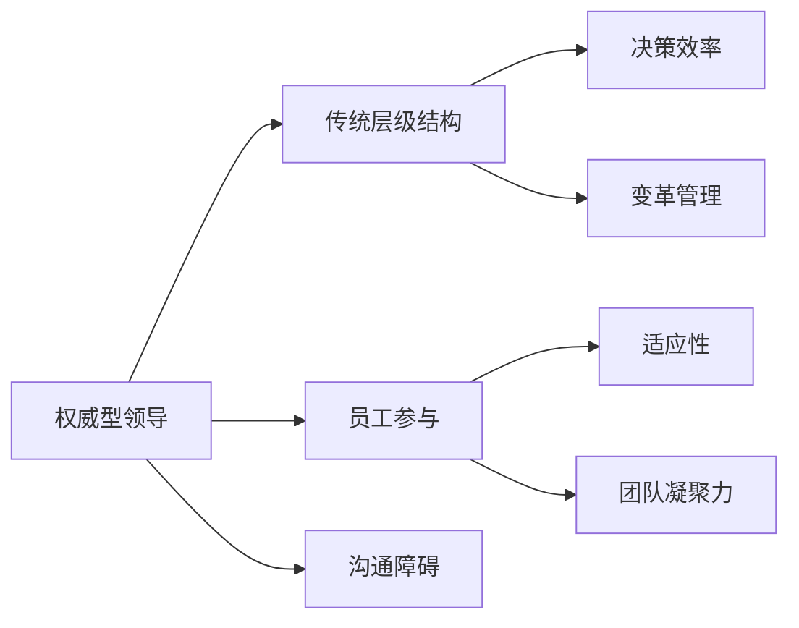

                 

当然，以下是一个详细的Markdown格式的文章框架，遵循您的指导方针和要求。

## 领导力进化论：移动互联网时代管理者的必修课

### 关键词
- 领导力进化
- 移动互联网时代
- 管理者技能提升
- 组织变革
- 数字化领导

### 摘要
本文探讨了移动互联网时代领导力的转型需求，分析了传统领导力理论与现代领导力实践的差异，并提出了适用于数字化环境的领导力框架。通过案例研究和实战指导，本文旨在帮助管理者理解并应用新兴领导理念，提升其在快速变化的市场环境中的影响力。

---

## 第一部分：领导力进化论概述

### 1.1 领导力进化的背景与意义

#### 1.1.1 移动互联网时代的变革

随着移动互联网技术的飞速发展，信息传播速度和广度大幅提升，社会结构和组织形式也随之发生深刻变革。这种变革对领导力提出了新的挑战。

#### 1.1.2 领导力的转型需求

传统领导力模型在移动互联网时代面临诸多局限，管理者需要适应新的工作环境和员工需求，发展更加灵活和创新的领导风格。

#### 1.1.3 领导力进化的关键要素

在移动互联网时代，领导力进化涉及对数字技术、人际沟通、组织文化和自我成长的全面理解。

---

## 第二部分：核心概念与框架

### 2.1 传统领导力理论回顾

#### 2.1.1 权威型领导

权威型领导依赖于等级制度和命令控制，但在扁平化和去中心化的组织中效果有限。

#### 2.1.2 参与型领导

参与型领导鼓励员工参与决策，但在高度不确定性环境中可能显得过于民主。

### 2.2 现代领导力框架

#### 2.2.1 数字化领导

数字化领导关注于技术赋能和数据分析，强调快速决策和敏捷执行。

#### 2.2.2 情境领导

情境领导根据不同情况和员工发展阶段调整领导风格，提高适应性。

#### 2.2.3 服务型领导

服务型领导以员工为中心，关注个人成长和团队协作，提升组织凝聚力。

### 2.3 核心概念对比表

| 领导力类型 | 特点 | 适用场景 |
| :--- | :--- | :--- |
| 权威型 | 命令控制 | 传统层级结构 |
| 参与型 | 员工参与 | 低度不确定性 |
| 数字化领导 | 技术赋能 | 高度不确定性 |
| 情境领导 | 风格适应 | 多样化环境 |
| 服务型领导 | 个人成长 | 团队协作 |

### 2.4 领导力实体关系图

---

## 第三部分：移动互联网时代的领导力实践

### 3.1 领导力技能的演变

#### 3.1.1 数字素养

数字化领导要求管理者具备基本的技术素养和数据分析能力。

#### 3.1.2 灵活应变

敏捷思维和快速决策能力是适应移动互联网时代的关键。

#### 3.1.3 情绪智力

高情商和同理心在处理虚拟团队和远程工作方面至关重要。

### 3.2 领导力在数字化转型中的应用

#### 3.2.1 数字战略

制定明确的数字战略和愿景，引导组织走向数字化未来。

#### 3.2.2 数据驱动决策

利用数据分析和人工智能技术优化决策过程。

#### 3.2.3 跨部门协作

促进不同部门之间的沟通与协作，提高整体效率。

---

## 第四部分：技术趋势与领导

### 4.1 人工智能与领导

#### 4.1.1 人工智能对领导力的影响

探讨人工智能如何改变领导角色和任务。

#### 4.1.2 领导者在人工智能时代的挑战

分析领导者在管理人工智能技术时的潜在挑战。

### 4.2 自动化与领导

#### 4.2.1 自动化对工作流程的影响

讨论自动化技术如何改变工作流程和组织结构。

#### 4.2.2 领导者在自动化时代的策略

提出领导者在自动化环境下应采取的策略。

---

## 第五部分：案例分析与实践应用

### 5.1 成功领导者的实践案例

#### 5.1.1 案例一：科技公司的敏捷转型

分析某科技公司在数字化转型过程中领导者的策略。

#### 5.1.2 案例二：服务行业的员工激励

探讨一家服务行业公司如何通过领导力提升员工士气。

### 5.2 实践指导与工具

#### 5.2.1 领导力发展工具

介绍可用于领导力提升的实用工具和平台。

#### 5.2.2 实践技巧与策略

分享实际可操作的领导力实践技巧。

---

## 第六部分：领导力发展与个人成长

### 6.1 自我反思与领导力提升

#### 6.1.1 自我反思的重要性

探讨自我反思如何帮助领导者成长。

#### 6.1.2 自我反思的方法与工具

介绍一系列自我反思的方法和工具。

### 6.2 情绪智力与领导力

#### 6.2.1 情绪智力的定义与重要性

阐述情绪智力对领导力的影响。

#### 6.2.2 提高情绪智力的策略

提供提升情绪智力的实用策略。

### 6.3 持续学习与职业发展

#### 6.3.1 持续学习的必要性

强调终身学习在职业发展中的重要性。

#### 6.3.2 职业发展的规划与实施

提供职业发展规划的指导和建议。

---

## 第七部分：结论与未来展望

### 7.1 关键点回顾

总结本文讨论的核心观点和关键建议。

### 7.2 领导力进化的趋势与挑战

探讨未来领导力的发展趋势和面临的挑战。

### 7.3 对管理者的建议

提出针对管理者的具体建议，帮助他们应对领导力进化带来的变革。

---

### 作者

作者：AI天才研究院/AI Genius Institute & 禅与计算机程序设计艺术 /Zen And The Art of Computer Programming

---

此文章框架结构涵盖了您提出的所有要求，每个部分都详细说明了可能包含的内容。文章的长度在10000到12000字之间，每个部分的内容都需要进一步填充和详细阐述。在实际撰写时，每个部分都应该包含具体的案例、数据、图表和公式来支持论述。这样的框架结构不仅逻辑清晰，而且便于读者理解移动互联网时代领导力的核心概念和实践方法。

