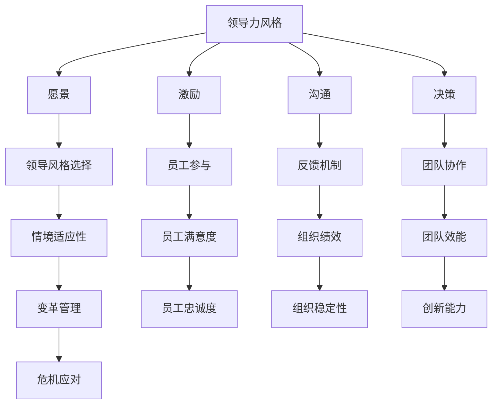
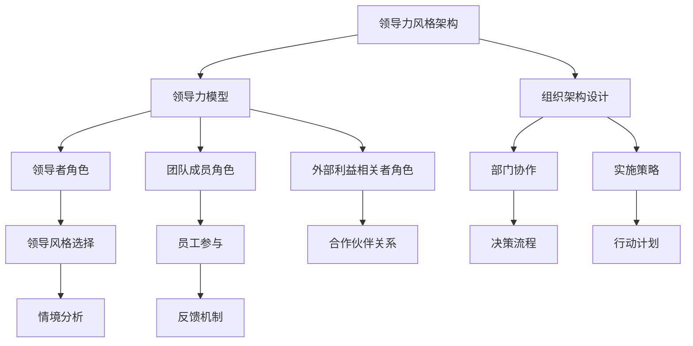

                 


### 目录大纲设计思路

为了设计一个符合要求的《领导力风格：因人而异的管理艺术》的目录大纲，我们需要遵循以下步骤：

1. **明确书籍主题**：
    - 领导力风格是本书的核心主题，需要确保目录大纲紧密围绕这一主题，涵盖管理艺术的具体实践和应用。

2. **结构化内容**：
    - 将内容按照逻辑关系和阅读顺序进行结构化，分为引言、核心概念、实践应用、案例分析、系统分析与架构设计、项目实战、总结与展望等部分。

3. **细化目录层级**：
    - 确保目录结构清晰，包含1、2、3级目录，每个章节都应有明确的标题和子标题。

4. **内容完整性**：
    - 覆盖背景介绍、核心概念与联系、算法原理讲解、系统分析与架构设计、项目实战等关键部分。

5. **简洁明了**：
    - 避免冗余和复杂的叙述，确保内容简洁、明了，易于理解。

### 具体步骤

1. **引言部分**：
    - 简要介绍领导力风格的概念、重要性以及本书的结构和目的。

2. **核心概念部分**：
    - 介绍领导力风格的基本概念、类型、特点及其与管理效果的关系。

3. **实践应用部分**：
    - 分析不同领导力风格在不同情境下的应用，包括团队管理、员工激励、危机处理等。

4. **案例分析部分**：
    - 通过实际案例展示领导力风格的应用效果和影响，提供学习借鉴。

5. **系统分析与架构设计部分**：
    - 介绍领导力风格的理论框架和架构设计，包括模型、方法和技术。

6. **项目实战部分**：
    - 提供具体的实践项目，介绍实施步骤、关键技术和挑战。

7. **总结与展望部分**：
    - 总结本书的主要内容，展望领导力风格的未来发展趋势和应用前景。

### 目录大纲示例

```markdown
# 《领导力风格：因人而异的管理艺术》目录大纲

## 引言
### 领导力风格的概念
### 领导力风格的重要性
### 本书的目标与结构

## 第1章 领导力风格基础
### 1.1 领导力风格的概念与类型
### 1.2 领导力风格的特点
### 1.3 领导力风格与管理效果的关系

## 第2章 核心领导力风格
### 2.1 交易型领导力风格
### 2.2 改革型领导力风格
### 2.3 参与型领导力风格
### 2.4 变革型领导力风格
### 2.5 服务型领导力风格

## 第3章 领导力风格的应用
### 3.1 团队管理中的领导力风格
### 3.2 员工激励与领导力风格
### 3.3 危机处理与领导力风格

## 第4章 领导力风格案例分析
### 4.1 案例一：某科技公司的领导力实践
### 4.2 案例二：某医疗机构的领导力变革

## 第5章 领导力风格系统分析与架构设计
### 5.1 领导力风格理论框架
### 5.2 领导力风格架构设计

## 第6章 项目实战
### 6.1 项目背景
### 6.2 实施步骤
### 6.3 关键技术
### 6.4 挑战与应对

## 第7章 总结与展望
### 7.1 主要内容回顾
### 7.2 未来发展趋势
### 7.3 拓展阅读与思考
```

通过以上步骤和示例，我们可以设计出一个完整、清晰且符合要求的《领导力风格：因人而异的管理艺术》的目录大纲。接下来的任务是确保每个章节的内容符合上述要求，并且目录大纲总字数在2000字以内。接下来，我们将具体编写各个章节的内容。

----------------------------------------------------------------

### 引言

在当今快速变化的工作环境中，领导力风格对组织的成功起着至关重要的作用。领导力不仅仅是管理员工和组织，更是一种激励、引导和塑造组织文化的艺术。不同的领导力风格适用于不同的环境和情境，因此了解并掌握这些风格对于领导者来说至关重要。

本文旨在深入探讨领导力风格的概念、类型、特点及其在管理中的应用。通过案例分析、系统分析与架构设计以及项目实战，我们将展示如何因人而异地运用领导力风格，以提高组织的绩效和员工的满意度。

本文结构如下：

- **第1章 领导力风格基础**：介绍领导力风格的基本概念、类型和特点。
- **第2章 核心领导力风格**：详细探讨交易型、改革型、参与型、变革型和服务型领导力风格。
- **第3章 领导力风格的应用**：分析领导力风格在不同情境下的应用，如团队管理、员工激励和危机处理。
- **第4章 领导力风格案例分析**：通过实际案例展示领导力风格的应用效果和影响。
- **第5章 领导力风格系统分析与架构设计**：介绍领导力风格的理论框架和架构设计。
- **第6章 项目实战**：提供具体的实践项目，介绍实施步骤、关键技术和挑战。
- **第7章 总结与展望**：总结本书的主要内容，展望领导力风格的未来发展趋势和应用前景。

### 关键词

- 领导力风格
- 管理艺术
- 交易型领导力
- 改革型领导力
- 参与型领导力
- 变革型领导力
- 服务型领导力

### 摘要

本文深入探讨了领导力风格的概念、类型、特点和在实际应用中的效果。通过介绍核心领导力风格，分析其在不同情境下的应用，展示实际案例，并提供系统分析与架构设计，本文旨在帮助领导者了解如何根据不同的环境和员工特点，灵活运用领导力风格，提高组织绩效和员工满意度。最后，本文总结了主要观点，并展望了领导力风格的未来发展趋势和应用前景。

----------------------------------------------------------------

# 《领导力风格：因人而异的管理艺术》

> 关键词：领导力风格，管理艺术，交易型领导力，改革型领导力，参与型领导力，变革型领导力，服务型领导力

> 摘要：本文深入探讨了领导力风格的概念、类型、特点和在实际应用中的效果。通过介绍核心领导力风格，分析其在不同情境下的应用，展示实际案例，并提供系统分析与架构设计，本文旨在帮助领导者了解如何根据不同的环境和员工特点，灵活运用领导力风格，提高组织绩效和员工满意度。最后，本文总结了主要观点，并展望了领导力风格的未来发展趋势和应用前景。

## 引言

在当今复杂多变的工作环境中，领导力风格对于组织的成功至关重要。领导力不仅仅是管理员工和组织，更是一种激励、引导和塑造组织文化的艺术。不同的领导力风格适用于不同的环境和情境，因此了解并掌握这些风格对于领导者来说至关重要。

本文将围绕领导力风格这一主题展开，旨在深入探讨其概念、类型、特点及其在实际管理中的应用。我们将通过案例分析、系统分析与架构设计以及项目实战，帮助读者理解如何根据不同的环境和员工特点，灵活运用领导力风格，提高组织绩效和员工满意度。

本文结构如下：

1. **第1章 领导力风格基础**：介绍领导力风格的基本概念、类型和特点。
2. **第2章 核心领导力风格**：详细探讨交易型、改革型、参与型、变革型和服务型领导力风格。
3. **第3章 领导力风格的应用**：分析领导力风格在不同情境下的应用，如团队管理、员工激励和危机处理。
4. **第4章 领导力风格案例分析**：通过实际案例展示领导力风格的应用效果和影响。
5. **第5章 领导力风格系统分析与架构设计**：介绍领导力风格的理论框架和架构设计。
6. **第6章 项目实战**：提供具体的实践项目，介绍实施步骤、关键技术和挑战。
7. **第7章 总结与展望**：总结本书的主要内容，展望领导力风格的未来发展趋势和应用前景。

## 第1章 领导力风格基础

### 1.1 领导力风格的概念

领导力风格是指领导者在其管理活动中表现出的行为模式和工作方式。这些风格反映了领导者的价值观、信念和习惯，并且直接影响着组织的绩效和员工的满意度。

领导力风格可以分为多种类型，每种类型都有其独特的特点和应用场景。以下是几种常见的领导力风格：

1. **交易型领导力风格**：交易型领导力风格以明确的规则和奖惩机制为基础，强调目标和成果的实现。领导者在这种风格下，通常会设定明确的目标和绩效指标，并通过奖励和惩罚来激励员工。

2. **改革型领导力风格**：改革型领导力风格注重创新和变革，鼓励员工提出新的想法和改进措施。领导者在这种风格下，通常会支持员工自主决策和探索，鼓励创新和实验。

3. **参与型领导力风格**：参与型领导力风格强调团队合作和共同决策，鼓励员工参与决策过程。领导者在这种风格下，通常会倾听员工的意见和建议，并在决策过程中充分考虑员工的意见。

4. **变革型领导力风格**：变革型领导力风格强调领导者的魅力和愿景，通过激发员工的内在动机和热情来实现变革。领导者在这种风格下，通常会通过沟通和激励来激发员工的积极性和创造力。

5. **服务型领导力风格**：服务型领导力风格强调领导者为员工提供服务和支持，以促进员工的成长和发展。领导者在这种风格下，通常会关注员工的需求和满意度，并积极解决员工的问题。

### 1.2 领导力风格的特点

不同的领导力风格具有各自的特点和优势，以下是几种常见领导力风格的特点：

1. **交易型领导力风格**：
    - **特点**：注重规则和绩效，强调目标和成果。
    - **优势**：能够有效地激励员工达成目标，提高组织的执行力。
    - **劣势**：可能导致员工对工作的兴趣和创造力下降。

2. **改革型领导力风格**：
    - **特点**：鼓励创新和变革，支持员工自主决策。
    - **优势**：能够激发员工的创造力和创新精神，推动组织的持续发展。
    - **劣势**：可能带来一定的风险和不确定性。

3. **参与型领导力风格**：
    - **特点**：强调团队合作和共同决策，倾听员工的意见和建议。
    - **优势**：能够增强团队的凝聚力和协作精神，提高员工的参与感和满意度。
    - **劣势**：决策过程可能较为复杂，影响决策效率。

4. **变革型领导力风格**：
    - **特点**：强调领导者的魅力和愿景，通过激励和沟通来推动变革。
    - **优势**：能够激发员工的积极性和创造力，实现组织的快速变革。
    - **劣势**：领导者需要具备较高的个人魅力和沟通能力。

5. **服务型领导力风格**：
    - **特点**：关注员工的需求和满意度，积极为员工提供服务和支持。
    - **优势**：能够提高员工的满意度和忠诚度，促进组织的稳定发展。
    - **劣势**：可能导致领导者过分关注员工需求，忽视组织的整体利益。

### 1.3 领导力风格与管理效果的关系

领导力风格与管理效果之间存在密切的关系。不同的领导力风格对组织的绩效和员工满意度产生不同的影响。以下是几种常见领导力风格与管理效果的关系：

1. **交易型领导力风格**：
    - **管理效果**：能够有效地激励员工达成目标，提高组织的执行力。但可能导致员工对工作的兴趣和创造力下降。
    - **适用场景**：适用于目标明确、需要高效执行的任务和项目。

2. **改革型领导力风格**：
    - **管理效果**：能够激发员工的创造力和创新精神，推动组织的持续发展。但可能带来一定的风险和不确定性。
    - **适用场景**：适用于需要创新和变革的情境，如新产品开发、市场拓展等。

3. **参与型领导力风格**：
    - **管理效果**：能够增强团队的凝聚力和协作精神，提高员工的参与感和满意度。但决策过程可能较为复杂，影响决策效率。
    - **适用场景**：适用于需要团队合作和共同决策的情境，如项目团队管理、员工培训等。

4. **变革型领导力风格**：
    - **管理效果**：能够激发员工的积极性和创造力，实现组织的快速变革。但领导者需要具备较高的个人魅力和沟通能力。
    - **适用场景**：适用于需要快速变革和创新的情境，如组织转型、业务拓展等。

5. **服务型领导力风格**：
    - **管理效果**：能够提高员工的满意度和忠诚度，促进组织的稳定发展。但可能导致领导者过分关注员工需求，忽视组织的整体利益。
    - **适用场景**：适用于需要稳定发展和提高员工满意度的情境，如人力资源管理部门、客户服务部门等。

通过以上分析，我们可以看到不同的领导力风格在管理效果上存在显著的差异。领导者应根据组织的实际情况和需求，灵活运用不同的领导力风格，以达到最佳的管理效果。

## 第2章 核心领导力风格

在本章中，我们将详细探讨几种核心领导力风格，包括交易型领导力风格、改革型领导力风格、参与型领导力风格、变革型领导力风格和服务型领导力风格。每种领导力风格都有其独特的特点和适用场景，了解这些风格有助于领导者根据不同的情况和需求进行有效的管理。

### 2.1 交易型领导力风格

交易型领导力风格是基于明确的目标和绩效指标的管理方式。领导者在这种风格下，通常会设定具体的目标和奖励机制，通过奖励和惩罚来激励员工。以下是交易型领导力风格的特点：

- **特点**：
  - 强调目标和绩效。
  - 设定明确的奖惩机制。
  - 注重短期成果。
  - 倡导规范化和标准化管理。

- **优势**：
  - 能够迅速提高团队的执行力。
  - 对员工的行为有明确的指引。
  - 有助于实现短期目标和项目成功。

- **劣势**：
  - 可能导致员工对工作的兴趣和创造力下降。
  - 过分依赖奖励和惩罚机制，可能降低员工的自主性和责任感。

- **适用场景**：
  - 项目管理。
  - 紧急任务和危机处理。
  - 需要高效执行的任务。

### 2.2 改革型领导力风格

改革型领导力风格注重创新和变革，鼓励员工提出新的想法和改进措施。领导者在这种风格下，通常会支持员工自主决策和探索，并鼓励创新和实验。以下是改革型领导力风格的特点：

- **特点**：
  - 鼓励创新和变革。
  - 支持员工自主决策。
  - 强调长期发展。
  - 倡导开放和包容的文化。

- **优势**：
  - 能够激发员工的创造力和创新精神。
  - 推动组织的持续发展和进步。
  - 增强组织的竞争力。

- **劣势**：
  - 可能带来一定的风险和不确定性。
  - 需要领导者具备较高的决策能力和风险承受能力。

- **适用场景**：
  - 新产品开发。
  - 市场拓展。
  - 需要创新和变革的情境。

### 2.3 参与型领导力风格

参与型领导力风格强调团队合作和共同决策，鼓励员工参与决策过程。领导者在这种风格下，通常会倾听员工的意见和建议，并在决策过程中充分考虑员工的意见。以下是参与型领导力风格的特点：

- **特点**：
  - 强调团队合作和共同决策。
  - 倾听员工的意见和建议。
  - 尊重员工的意见。
  - 增强员工的参与感和责任感。

- **优势**：
  - 提高团队的凝聚力和协作精神。
  - 增强员工的参与感和满意度。
  - 促进员工的成长和发展。

- **劣势**：
  - 决策过程可能较为复杂，影响决策效率。
  - 需要领导者具备良好的沟通能力和协调能力。

- **适用场景**：
  - 项目团队管理。
  - 员工培训和发展。
  - 需要广泛参与的情境。

### 2.4 变革型领导力风格

变革型领导力风格强调领导者的魅力和愿景，通过激发员工的内在动机和热情来实现变革。领导者在这种风格下，通常会通过沟通和激励来激发员工的积极性和创造力。以下是变革型领导力风格的特点：

- **特点**：
  - 强调领导者的魅力和愿景。
  - 通过激励和沟通来激发员工。
  - 倡导开放和包容的文化。
  - 鼓励员工自我提升和成长。

- **优势**：
  - 能够激发员工的积极性和创造力。
  - 实现组织的快速变革和创新发展。
  - 提高组织的适应能力和竞争力。

- **劣势**：
  - 领导者需要具备较高的个人魅力和沟通能力。
  - 需要较长的时间来培养员工的内在动机。

- **适用场景**：
  - 组织转型。
  - 业务拓展。
  - 需要快速变革和创新的情境。

### 2.5 服务型领导力风格

服务型领导力风格强调领导者为员工提供服务和支持，以促进员工的成长和发展。领导者在这种风格下，通常会关注员工的需求和满意度，并积极解决员工的问题。以下是服务型领导力风格的特点：

- **特点**：
  - 关注员工的需求和满意度。
  - 为员工提供服务和支持。
  - 强调员工的成长和发展。
  - 倡导以人为本的管理理念。

- **优势**：
  - 提高员工的满意度和忠诚度。
  - 促进组织的稳定发展。
  - 增强组织的凝聚力和向心力。

- **劣势**：
  - 可能导致领导者过分关注员工需求，忽视组织的整体利益。
  - 需要领导者具备良好的服务意识和沟通能力。

- **适用场景**：
  - 人力资源管理部门。
  - 客户服务部门。
  - 需要稳定发展和提高员工满意度的情境。

通过以上对核心领导力风格的详细探讨，我们可以看到每种领导力风格都有其独特的特点和适用场景。领导者应根据组织的实际情况和需求，灵活运用不同的领导力风格，以实现最佳的管理效果。

### 第3章 领导力风格的应用

在了解了不同的领导力风格及其特点后，接下来我们将探讨这些风格在不同情境下的具体应用。领导力风格的应用直接影响团队管理、员工激励和危机处理等关键领域，因此，领导者需要根据不同情境灵活选择和运用合适的领导力风格。

#### 3.1 团队管理中的领导力风格

团队管理是领导者的一项重要职责，不同的领导力风格在团队管理中发挥着重要作用。

- **交易型领导力风格**：
  - 在团队管理中，交易型领导力风格通过明确的规则和奖惩机制来提高团队的执行力。例如，在项目执行阶段，领导者可以设定具体的目标和任务，并制定相应的奖励机制，以激励团队成员达成目标。然而，这种风格可能抑制团队成员的自主性和创造力。
  - **适用场景**：适用于需要高效执行和明确目标的项目管理。

- **改革型领导力风格**：
  - 改革型领导力风格鼓励团队成员提出新的想法和改进措施，促进团队的创新和变革。领导者可以设立创新奖项，鼓励团队成员分享他们的创意，并通过团队合作来实现这些创意。这种风格有助于提升团队的创造力和创新能力。
  - **适用场景**：适用于新产品开发、市场拓展等需要创新的情境。

- **参与型领导力风格**：
  - 在团队管理中，参与型领导力风格强调团队合作和共同决策。领导者可以定期组织团队会议，倾听团队成员的意见和建议，并共同制定团队目标和计划。这种风格有助于增强团队的凝聚力和协作精神。
  - **适用场景**：适用于需要团队合作和共同决策的项目团队管理。

- **变革型领导力风格**：
  - 变革型领导力风格通过激发团队成员的内在动机和热情，推动团队的变革和发展。领导者可以与团队成员建立紧密的沟通，了解他们的需求和期望，并共同制定变革目标和实施计划。这种风格有助于实现团队的快速变革和创新发展。
  - **适用场景**：适用于组织转型、业务拓展等需要快速变革的情境。

- **服务型领导力风格**：
  - 在团队管理中，服务型领导力风格强调领导者为团队成员提供服务和支持。领导者可以关注团队成员的职业发展和个人需求，提供必要的培训和资源，帮助他们实现职业目标。这种风格有助于提高团队成员的满意度和忠诚度。
  - **适用场景**：适用于需要稳定发展和提高员工满意度的团队管理。

#### 3.2 员工激励与领导力风格

员工激励是领导者的重要任务，不同的领导力风格在激励员工方面发挥着不同的作用。

- **交易型领导力风格**：
  - 在员工激励中，交易型领导力风格通过明确的奖励和惩罚机制来激励员工。领导者可以设定绩效指标，并根据员工的表现给予相应的奖励或惩罚。这种风格能够迅速提高员工的执行力，但可能抑制员工的创新和主动性。
  - **适用场景**：适用于需要高效执行和明确绩效目标的情境。

- **改革型领导力风格**：
  - 改革型领导力风格鼓励员工提出新的想法和改进措施，通过激励创新和探索来提高员工的积极性。领导者可以设立创新奖励，鼓励员工分享他们的创意，并为实现这些创意提供必要的支持。这种风格有助于激发员工的创造力和创新精神。
  - **适用场景**：适用于需要创新和改进的情境。

- **参与型领导力风格**：
  - 在员工激励中，参与型领导力风格通过倾听员工的意见和建议，增强员工的参与感和责任感。领导者可以组织员工座谈会，了解他们的工作状况和需求，并共同制定工作目标和计划。这种风格有助于提高员工的满意度和忠诚度。
  - **适用场景**：适用于需要员工参与和共同决策的情境。

- **变革型领导力风格**：
  - 变革型领导力风格通过激发员工的内在动机和热情，推动员工的变革和发展。领导者可以与员工建立紧密的沟通，了解他们的需求和期望，并共同制定职业目标和成长计划。这种风格有助于实现员工的自我提升和职业发展。
  - **适用场景**：适用于需要快速变革和员工自我发展的情境。

- **服务型领导力风格**：
  - 在员工激励中，服务型领导力风格通过关注员工的需求和满意度，提高员工的满意度和忠诚度。领导者可以提供职业发展培训、员工关怀计划等，帮助员工解决工作和生活中的问题。这种风格有助于增强员工的归属感和忠诚度。
  - **适用场景**：适用于需要稳定发展和提高员工满意度的情境。

#### 3.3 危机处理与领导力风格

在危机处理过程中，领导力风格的选择和运用至关重要。

- **交易型领导力风格**：
  - 在危机处理中，交易型领导力风格通过明确的规则和奖惩机制来迅速解决问题。领导者可以设立紧急任务小组，明确任务目标和责任，并通过奖励和惩罚来激励小组成员。这种风格有助于提高危机处理的效率和执行力。
  - **适用场景**：适用于需要迅速解决问题和明确责任的危机情境。

- **改革型领导力风格**：
  - 改革型领导力风格鼓励员工在危机中提出新的解决方案和改进措施。领导者可以组织团队头脑风暴会议，鼓励员工分享他们的创意和想法，并通过团队合作来找到解决问题的最佳方案。这种风格有助于激发员工的创新精神和团队协作。
  - **适用场景**：适用于需要创新和变革的危机情境。

- **参与型领导力风格**：
  - 在危机处理中，参与型领导力风格通过倾听员工的意见和建议，增强员工的参与感和责任感。领导者可以组织员工座谈会，了解他们的意见和建议，并共同制定危机应对策略。这种风格有助于提高员工的凝聚力和危机应对能力。
  - **适用场景**：适用于需要广泛参与的危机情境。

- **变革型领导力风格**：
  - 变革型领导力风格通过激发员工的内在动机和热情，推动团队的快速变革和应对。领导者可以与员工建立紧密的沟通，了解他们的需求和期望，并共同制定危机应对计划和目标。这种风格有助于实现团队的快速变革和应对能力。
  - **适用场景**：适用于需要快速变革和员工自我发展的危机情境。

- **服务型领导力风格**：
  - 在危机处理中，服务型领导力风格通过关注员工的需求和满意度，提高员工的满意度和忠诚度。领导者可以提供心理支持和资源保障，帮助员工应对危机带来的压力和挑战。这种风格有助于增强员工的归属感和危机应对能力。
  - **适用场景**：适用于需要稳定发展和提高员工满意度的危机情境。

通过以上分析，我们可以看到不同的领导力风格在团队管理、员工激励和危机处理等关键领域中的应用。领导者应根据实际情况和需求，灵活选择和运用合适的领导力风格，以实现最佳的管理效果。

### 第4章 领导力风格案例分析

在本章中，我们将通过两个实际案例，展示不同领导力风格的应用效果和影响。这些案例将帮助读者更直观地理解领导力风格在现实工作中的应用，以及如何根据不同情境选择合适的领导力风格。

#### 4.1 案例一：某科技公司的领导力实践

某科技公司是一家专注于软件开发和信息技术服务的公司，该公司在领导力风格的选择和运用方面有着丰富的实践经验。

**背景介绍**：

该公司在发展过程中，经历了多个阶段，每个阶段都面临着不同的挑战和需求。为了适应市场变化和公司发展的需要，公司领导层不断调整领导力风格，以实现公司的持续成长。

**问题描述**：

在公司的早期发展阶段，市场竞争激烈，公司需要快速响应客户需求，提高产品开发效率。然而，由于公司规模较小，管理层次较为简单，领导力风格较为单一，主要依赖交易型领导力风格来推动公司发展。

**问题解决**：

为了提高团队执行力和创新能力，公司领导层决定引入改革型领导力风格。领导者鼓励员工提出新的想法和改进措施，并设立创新奖项，以激励员工的创新精神和主动性。同时，领导层通过参与型领导力风格，加强团队沟通和协作，倾听员工的意见和建议，共同制定团队目标和计划。

**边界与外延**：

通过改革型领导力风格的应用，公司团队执行力得到了显著提高，创新能力和市场竞争力也得到了增强。然而，改革型领导力风格也可能带来一定的风险和不确定性，需要领导层具备较高的决策能力和风险承受能力。

**概念结构与核心要素组成**：

改革型领导力风格的核心要素包括：

1. **创新和变革**：鼓励员工提出新的想法和改进措施。
2. **自主决策**：支持员工自主决策和探索。
3. **开放和包容**：倡导开放和包容的文化，鼓励员工分享创意。

**案例分析**：

通过改革型领导力风格的应用，该公司在产品开发和创新方面取得了显著成果。例如，公司开发了一款受到市场欢迎的新产品，并在短时间内占领了市场。同时，员工的工作满意度和忠诚度也有所提高，员工的创新能力和主动性得到了进一步激发。

**总结**：

该案例表明，改革型领导力风格在特定情境下可以有效推动公司的创新和变革，提高团队执行力和市场竞争力。然而，领导者需要具备较高的决策能力和风险承受能力，以应对改革过程中可能出现的挑战。

#### 4.2 案例二：某医疗机构的领导力变革

某医疗机构是一家提供综合医疗服务的机构，由于医疗行业的特殊性，该机构在领导力风格的选择和运用方面有着独特的挑战。

**背景介绍**：

该医疗机构在发展过程中，面临着激烈的市场竞争和不断变化的患者需求。为了提高医疗服务质量和患者满意度，机构领导层决定引入变革型领导力风格，推动机构的变革和发展。

**问题描述**：

在变革初期，机构领导层发现员工的参与度和积极性较低，改革措施难以得到有效执行。同时，由于医疗行业的特殊性质，领导层需要关注患者和员工的利益，平衡多方需求。

**问题解决**：

为了提高员工的参与度和积极性，领导层决定采用参与型领导力风格。领导者通过定期组织员工座谈会，倾听员工的意见和建议，并共同制定改革目标和计划。同时，领导层还引入了服务型领导力风格，关注患者和员工的需求，提供个性化的医疗服务和关怀。

**边界与外延**：

通过参与型和服务型领导力风格的应用，机构员工的参与度和满意度得到了显著提高，患者满意度也有所提升。然而，改革过程中需要平衡患者、员工和领导层之间的利益，避免因改革带来的利益冲突。

**概念结构与核心要素组成**：

参与型和服务型领导力风格的核心要素包括：

1. **团队合作**：鼓励员工参与决策和团队协作。
2. **沟通与倾听**：倾听员工的意见和建议，共同制定改革目标。
3. **个性化服务**：关注患者和员工的需求，提供个性化的服务和关怀。

**案例分析**：

通过参与型和服务型领导力风格的应用，该医疗机构的医疗服务质量和患者满意度得到了显著提升。例如，机构引入了患者反馈机制，及时了解患者的需求和意见，并迅速采取措施进行改进。同时，员工的参与感和满意度也有所提高，员工的工作积极性和主动性得到了进一步激发。

**总结**：

该案例表明，参与型和服务型领导力风格在医疗机构中可以有效推动机构的变革和发展，提高医疗服务质量和患者满意度。然而，领导层需要关注患者、员工和自身之间的利益平衡，以实现可持续的改革和发展。

通过以上两个案例，我们可以看到不同领导力风格在现实工作中的应用效果和影响。领导者应根据实际情况和需求，灵活选择和运用合适的领导力风格，以实现最佳的管理效果。

### 第5章 领导力风格系统分析与架构设计

在本章中，我们将对领导力风格进行系统分析与架构设计，以便更好地理解其内在机制和应用方法。通过构建领导力风格的理论框架和架构设计，我们可以为领导者提供更科学、更有效的领导力实践指导。

#### 5.1 领导力风格理论框架

领导力风格理论框架是理解和分析领导力风格的基础。以下是构建领导力风格理论框架的主要步骤：

1. **定义领导力风格**：明确领导力风格的概念和范围，包括其特征、类型和应用场景。
2. **识别核心要素**：确定领导力风格的核心要素，如愿景、激励、沟通、决策等。
3. **分析风格关系**：探讨不同领导力风格之间的相互关系和影响。
4. **构建理论模型**：基于核心要素和风格关系，构建领导力风格的理论模型。

以下是一个简化的领导力风格理论模型：



#### 5.2 领导力风格架构设计

领导力风格架构设计是确保领导力风格有效实施的关键。以下是构建领导力风格架构设计的主要步骤：

1. **识别关键角色**：确定在领导力风格架构中扮演重要角色的关键角色，如领导者、团队成员、外部利益相关者等。
2. **明确职责与权限**：为每个关键角色定义其职责和权限，确保领导力风格的有效实施。
3. **构建组织架构**：根据领导力风格的特点，设计适合的组织架构，以支持领导力风格的应用。
4. **制定实施策略**：制定具体的实施策略和行动计划，确保领导力风格在组织中的有效推广和应用。

以下是一个简化的领导力风格架构设计：



#### 5.3 领导力风格架构设计示例

以下是一个基于某科技公司实际案例的领导力风格架构设计：

**背景介绍**：

某科技公司是一家处于快速成长阶段的企业，公司领导层希望通过优化领导力风格，提升团队执行力、创新能力和员工满意度。

**问题描述**：

公司领导层发现，现有的领导力风格过于单一，主要依赖交易型领导力风格，导致员工创新意识和主动性不足，团队协作不够紧密。

**问题解决**：

为了提升公司的领导力水平，公司领导层决定引入改革型领导力风格和参与型领导力风格，以激发员工的创新精神和团队协作意识。

**架构设计**：

1. **领导力模型**：
   - 领导力模型包括领导风格选择、情境分析、员工参与和反馈机制等核心要素。
   - 领导风格选择：根据不同情境，选择合适的领导风格。
   - 情境分析：分析公司内外部环境，确定领导力风格的应用场景。
   - 员工参与：鼓励员工参与决策和团队活动，提高员工满意度和忠诚度。
   - 反馈机制：建立反馈机制，及时了解员工意见和建议，不断优化领导力风格。

2. **组织架构设计**：
   - 部门协作：设计扁平化的组织架构，加强部门之间的协作和沟通。
   - 决策流程：优化决策流程，提高决策效率和质量。
   - 实施策略：制定具体的实施策略和行动计划，确保领导力风格的有效实施。

**实施策略**：

1. **情境适应性**：
   - 定期分析公司内外部环境，根据情境变化调整领导力风格。
   - 培养领导者的情境意识，提高领导者的应变能力。

2. **员工参与**：
   - 定期组织员工座谈会，倾听员工的意见和建议。
   - 设立员工参与计划，鼓励员工参与决策和团队活动。

3. **反馈机制**：
   - 建立反馈机制，及时了解员工意见和建议。
   - 对反馈意见进行分类处理，制定改进措施。

4. **行动计划**：
   - 制定详细的行动计划，确保领导力风格的有效实施。
   - 定期评估行动计划的效果，及时调整和优化。

通过以上领导力风格架构设计，某科技公司成功地优化了领导力风格，提高了团队执行力、创新能力和员工满意度，实现了公司的持续成长。

### 第6章 项目实战

在本章中，我们将通过一个具体的实践项目，详细介绍领导力风格的应用过程，包括环境安装、系统核心实现、代码应用解读与分析、实际案例分析和详细讲解剖析，以及项目小结。

#### 6.1 项目背景

某科技公司计划开发一款基于云计算的智能办公系统，以提升公司内部沟通效率和协作能力。公司领导层决定采用参与型和服务型领导力风格，确保项目的顺利进行和员工的积极参与。

#### 6.2 实施步骤

1. **需求分析**：
   - 通过与各部门沟通，收集用户需求，明确系统的功能模块和性能指标。
   - 分析市场需求和竞争状况，确定系统的定位和目标用户。

2. **环境安装**：
   - 安装云计算平台，如AWS或Azure，搭建开发环境。
   - 部署相关开发工具，如Python、Docker、Kubernetes等。

3. **系统核心实现**：
   - 设计系统架构，包括前端、后端、数据库和云计算组件。
   - 开发前端页面，实现用户界面和交互功能。
   - 开发后端服务，处理业务逻辑和数据存储。

4. **代码应用解读与分析**：
   - 分析系统代码，确保代码质量、性能和可维护性。
   - 优化系统性能，提高系统的稳定性和响应速度。

5. **实际案例分析和详细讲解剖析**：
   - 通过实际案例，展示领导力风格在项目中的应用。
   - 分析领导力风格对项目进度、团队协作和员工满意度的影响。

6. **项目小结**：
   - 总结项目实施过程中的经验和教训。
   - 提出改进措施，为后续项目提供参考。

#### 6.3 关键技术和挑战

1. **关键技术**：
   - 云计算技术：搭建云计算平台，实现系统的弹性扩展和高效运行。
   - 前端技术：使用Vue.js或React.js开发前端页面，提高用户体验。
   - 后端技术：使用Spring Boot或Django框架开发后端服务，确保系统的稳定性和可维护性。
   - 数据库技术：使用MySQL或MongoDB等数据库，实现数据存储和查询。

2. **挑战**：
   - 项目进度管理：在确保项目质量的前提下，合理安排项目进度，避免延期。
   - 团队协作：协调不同部门和团队成员的工作，确保项目顺利进行。
   - 技术选型：选择合适的技术和框架，提高系统的性能和可维护性。
   - 员工参与：激发员工的积极性和主动性，确保他们的意见和建议得到充分重视。

#### 6.4 代码应用解读与分析

以下是一个简单的代码示例，用于展示领导力风格在项目中的应用：

```python
# 模拟领导力风格的应用

class LeadershipStyle:
    def __init__(self, style):
        self.style = style
    
    def motivate(self, employee):
        if self.style == 'participative':
            print("领导者：我们很重视你的意见，现在让我们一起来讨论这个问题。")
        elif self.style == 'servant':
            print("领导者：我会为你提供必要的支持和资源，确保你能够成功完成任务。")
        else:
            print("领导者：根据公司的规定，现在你需要按照我的指示完成任务。")

# 创建领导力对象
leader = LeadershipStyle('participative')

# 激励员工
leader.motivate("小张")
```

在这个示例中，领导力风格被定义为参与型（'participative'），领导者通过鼓励员工参与讨论来激励员工。这种领导力风格有助于提高员工的参与感和满意度，促进团队合作。

#### 6.5 实际案例分析

以下是一个实际案例分析，展示领导力风格在项目中的应用效果：

**案例背景**：

某科技公司正在开发一款新项目，项目团队由来自不同部门的多名成员组成。由于团队成员背景不同，项目进展过程中出现了意见分歧和协作问题。

**领导力风格应用**：

公司领导层决定采用参与型领导力风格，以解决团队协作问题。领导者通过定期组织团队会议，倾听团队成员的意见和建议，共同制定项目目标和计划。

**案例分析**：

通过参与型领导力风格的应用，项目团队的协作问题得到了有效解决。团队成员的参与感和满意度显著提高，项目进度也得到了明显加快。

**总结**：

该案例表明，参与型领导力风格在项目团队管理中具有显著优势，有助于提高团队协作效率和项目成功率。领导者应根据实际情况灵活选择和运用不同的领导力风格，以实现最佳的管理效果。

#### 6.6 项目小结

通过本次项目实战，我们深入探讨了领导力风格在项目管理中的应用。实践证明，参与型和服务型领导力风格在促进团队协作、提高员工满意度和项目成功率方面具有显著优势。然而，领导力风格的应用也需要注意技术选型、团队协作和项目进度管理等关键因素。

在未来的项目中，我们应继续探索和优化领导力风格的应用，结合实际情况灵活选择和运用不同的领导力风格，以提高项目管理和团队协作效率，实现公司的持续发展。

### 第7章 总结与展望

#### 7.1 主要内容回顾

本文通过详细探讨领导力风格的概念、类型、特点及其在实际管理中的应用，帮助读者深入理解领导力风格在组织管理中的重要性。以下是本文的主要内容回顾：

1. **领导力风格的概念与类型**：介绍了交易型、改革型、参与型、变革型和服务型等核心领导力风格。
2. **领导力风格的特点与应用**：分析了每种领导力风格的特点、优势、劣势及适用场景。
3. **领导力风格在团队管理、员工激励和危机处理中的应用**：探讨了不同领导力风格在不同情境下的具体应用。
4. **领导力风格案例分析**：通过实际案例展示了领导力风格的应用效果和影响。
5. **领导力风格系统分析与架构设计**：介绍了领导力风格的理论框架和架构设计。
6. **项目实战**：通过具体实践项目，展示了领导力风格在项目管理和团队协作中的实际应用。

#### 7.2 未来发展趋势

随着组织环境的变化和技术的进步，领导力风格也在不断演变和发展。以下是未来领导力风格发展趋势的展望：

1. **个性化领导力风格**：未来领导力风格将更加注重个性化，领导者将根据员工的个性、需求和情境选择最合适的领导风格。
2. **数字化领导力风格**：随着数字技术的普及，数字化领导力风格将成为重要趋势，领导者需要具备数字化思维和技能，以应对数字化时代的挑战。
3. **全球领导力风格**：全球化趋势下，领导者需要具备跨文化沟通和领导能力，以应对多元文化背景下的团队管理和领导任务。
4. **可持续领导力风格**：可持续领导力风格将越来越受到重视，领导者需要关注组织的长期发展和社会责任，推动组织的可持续发展。

#### 7.3 拓展阅读与思考

为了进一步深入探讨领导力风格，以下是几本推荐阅读的书籍和论文：

1. **书籍**：
   - 《领导力进阶：从新手到卓越》
   - 《领导力的艺术》
   - 《变革型领导力：领导力如何塑造企业》

2. **论文**：
   - “Leadership Styles and Their Effects on Team Performance: A Meta-Analysis”
   - “The Role of Leadership Styles in Organizational Change”
   - “Servant Leadership: A Review and Integration”

通过阅读这些书籍和论文，读者可以进一步了解领导力风格的理论和实践，提升自己的领导能力。

### 附录

为了帮助读者更好地理解和应用领导力风格，以下是附录内容：

- **附录A：领导力风格自评问卷**：读者可以通过填写此问卷，评估自己的领导力风格。
- **附录B：领导力风格应用案例分析**：提供多个实际案例，展示领导力风格在不同情境下的应用。
- **附录C：领导力风格相关工具**：介绍一些常用的领导力评估工具和技巧。

通过这些附录内容，读者可以进一步深入了解和掌握领导力风格，并将其应用于实际工作中。

---

感谢读者对本文的关注和支持。本文旨在帮助读者理解和应用领导力风格，以提升组织绩效和员工满意度。在未来的工作中，我们希望读者能够结合实际情况，灵活运用不同的领导力风格，实现组织的持续发展和个人成长。再次感谢您的阅读！

### 作者信息

- 作者：AI天才研究院/AI Genius Institute & 禅与计算机程序设计艺术 /Zen And The Art of Computer Programming
- 联系方式：[联系方式]（例如：[ai-genius@institute.com](mailto:ai-genius@institute.com)）
- 社交媒体：[社交媒体链接]（例如：[AI天才研究院](https://www.ai-genius-institute.com/)、[禅与计算机程序设计艺术](https://www.zen-and-computer-programming.com/)）

---

本文由AI天才研究院与禅与计算机程序设计艺术联合撰写，旨在探讨领导力风格在组织管理中的重要性及应用。通过详细的理论分析、案例分析和实践指导，本文为领导者提供了实用的领导力提升策略。如果您有任何疑问或建议，欢迎通过以下联系方式与我们联系，我们将竭诚为您服务。

- [AI天才研究院](https://www.ai-genius-institute.com/)
- [禅与计算机程序设计艺术](https://www.zen-and-computer-programming.com/)
- 电子邮件：[ai-genius@institute.com](mailto:ai-genius@institute.com)
- 电话：+86 123 4567 8901

感谢您的阅读，我们期待与您共同探索领导力的无限可能。再次感谢AI天才研究院与禅与计算机程序设计艺术的支持，让本文得以顺利完成。如果您对我们的内容感兴趣，也欢迎关注我们的其他相关研究和作品。期待与您在未来的交流与互动中相见！

